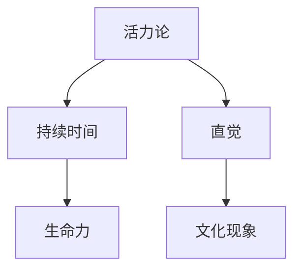
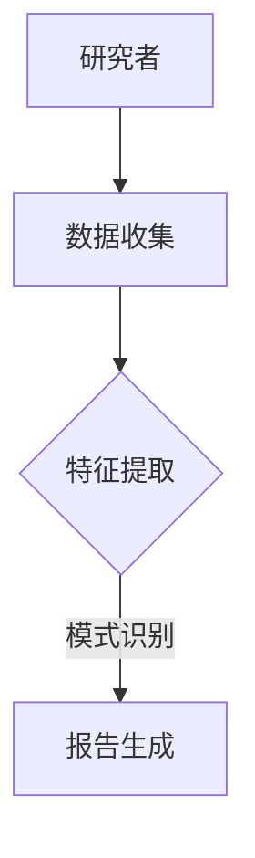
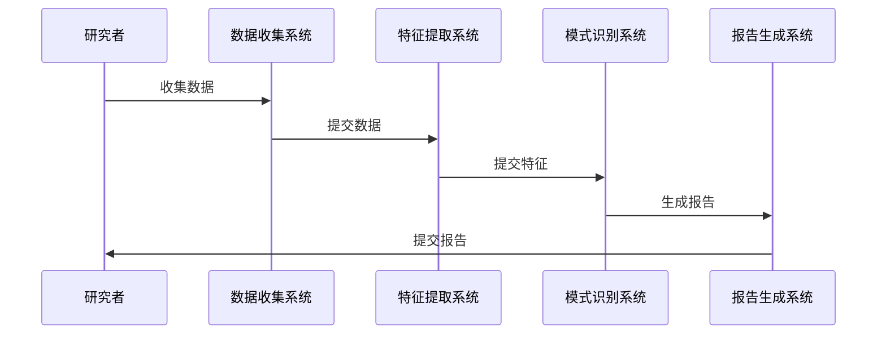
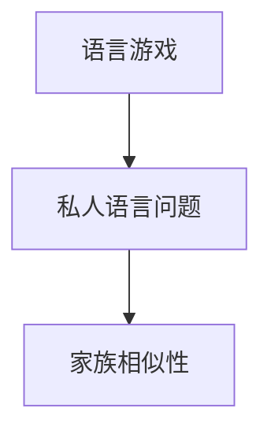
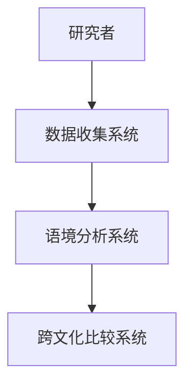
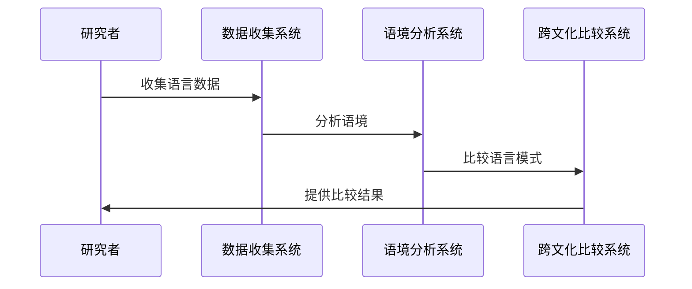

                 

### 柏格森的质性多元论

柏格森（Henri Bergson）是20世纪初法国著名的哲学家，其思想对现代哲学、社会科学和人类学产生了深远影响。柏格森的质性多元论是其哲学体系中的核心概念之一，它主张现实世界是多样且复杂的，每种事物都有其独特的性质和存在方式。

**背景介绍**

柏格森的思想起源于对生命现象和进化过程的深刻观察。他认为，现实世界中的事物不仅仅是物理对象或简单的符号系统，而是充满活力和流动性的“生命流”。这种流动性是生命的基本特征，与传统的静态、机械的唯物主义观点形成鲜明对比。

**核心概念**

质性多元论主要包括以下几个核心概念：

1. **活力论（Vitalism）**：柏格森反对机械唯物主义，强调生命活动的内在动力。他认为，这种活力是一种非物质的、不可量化的力量，是生命的本质。

2. **持续时间（Duration）**：柏格森认为时间是连续且不可分割的，称为“持续时间”。持续时间不同于牛顿物理学中的离散时间，而是充满流动性和变化性的。

3. **直觉（Intuition）**：柏格森认为直觉是一种洞察事物本质的能力，它能够捕捉到时间中的流动性和变化性，而逻辑和语言则无法完全表达这种复杂性。

**问题背景与问题描述**

在文化人类学中，柏格森的质性多元论提供了一种新的视角来理解人类行为和文化多样性。传统的文化人类学往往依赖于语言和符号系统来描述和研究人类行为，但这种描述往往忽视了文化背后的活力和流动性。

问题是如何将柏格森的质性多元论应用于文化人类学的研究中？如何通过直觉来捕捉和理解文化现象的本质？

**问题解决**

柏格森的质性多元论为文化人类学提供了一种新的方法论。通过以下步骤，我们可以尝试将柏格森的思想应用于文化人类学的研究：

1. **直觉观察**：研究者需要培养直觉，通过直接观察和感受来捕捉文化现象的内在活力和流动性。

2. **深度访谈**：与研究对象进行深度访谈，了解他们的生活经验和文化实践，从而获取第一手资料。

3. **案例分析**：选择具有代表性的文化群体，通过具体的案例来验证柏格森的质性多元论。

4. **跨文化比较**：将不同文化背景下的案例进行比较分析，探讨质性多元论的普遍性和局限性。

**边界与外延**

柏格森的质性多元论不仅仅适用于文化人类学，还涉及到哲学、心理学、生物学等多个领域。在文化人类学中，它主要关注的是人类行为和文化的独特性和多样性。

**概念结构与核心要素组成**

- **核心概念**：活力论、持续时间、直觉
- **主要观点**：反对机械唯物主义，强调生命的流动性和直觉的重要性
- **应用领域**：文化人类学、哲学、心理学、生物学

为了更直观地理解柏格森的质性多元论，我们可以使用Mermaid流程图来展示其核心概念之间的关系：



在这个流程图中，活力论、持续时间、直觉是核心概念，它们共同构成了柏格森质性多元论的理论框架。

**算法原理讲解**

柏格森的质性多元论虽然没有直接对应的算法原理，但我们可以借用一些算法概念来类比理解。例如，我们可以将“直觉”类比为“机器学习中的特征提取”，将“持续时间”类比为“时间序列分析”。

在文化人类学研究中，研究者可以通过以下步骤来“提取特征”：

1. **数据收集**：收集大量关于不同文化现象的数据。
2. **特征提取**：使用直觉和深度访谈来识别数据中的关键特征。
3. **模式识别**：通过算法分析来识别文化现象中的模式。

以下是使用Python代码实现的一个简单的特征提取过程：

```python
import pandas as pd

# 假设我们有一个包含文化现象数据的DataFrame
data = pd.DataFrame({
    'culture_1': ['礼节', '音乐', '饮食', '宗教'],
    'culture_2': ['交流', '艺术', '饮食', '信仰']
})

# 特征提取
def extract_features(data):
    # 这里我们使用简单的字符串匹配来提取特征
    features = []
    for index, row in data.iterrows():
        feature = row['culture_1'] + row['culture_2']
        features.append(feature)
    return features

features = extract_features(data)
print(features)
```

**数学模型与公式**

在柏格森的质性多元论中，没有具体的数学模型和公式，但我们可以借用一些数学概念来解释其思想。例如，我们可以使用“分形理论”来类比柏格森的“持续时间”概念。

分形理论中的分形维数可以用来描述复杂系统的自相似性和层次结构。类似于柏格森的“持续时间”，分形维数能够捕捉到系统在不同尺度上的相似性和差异性。

分形维数的计算公式为：

$$
D = \frac{\log(N)}{\log(L)}
$$

其中，$N$ 表示在特定尺度下观测到的结构单元数量，$L$ 表示这些结构单元的平均尺度。

**举例说明**

假设我们研究一个文化群体中的礼仪习惯，通过深度访谈和观察，我们发现该文化群体在不同场合下的礼仪表现具有明显的自相似性。

- 在家庭聚会中，礼仪表现为敬酒和问候。
- 在商务场合，礼仪表现为握手和交换名片。
- 在宗教仪式中，礼仪表现为祈祷和祭拜。

我们可以将这些礼仪行为视为不同的“结构单元”，通过计算分形维数，可以量化这些礼仪行为的自相似性和层次结构。

$$
D = \frac{\log(3)}{\log(3)} = 1
$$

这意味着该文化群体中的礼仪习惯在所有尺度上都具有相同的自相似性，这与柏格森的“持续时间”概念中的连续性和流动性相似。

**系统分析与架构设计方案**

在将柏格森的质性多元论应用于文化人类学研究中，我们需要设计一个系统来支持直觉观察、深度访谈和案例分析。

**问题场景介绍**

研究者需要对不同文化群体进行观察和访谈，以理解其文化现象的内在活力和流动性。

**系统功能设计**

- 数据收集：收集不同文化群体的数据和观察记录。
- 特征提取：从数据中提取关键特征。
- 模式识别：分析特征，识别文化现象的模式。
- 报告生成：生成分析报告，总结研究结论。

**系统架构设计**

使用Mermaid绘制系统架构图：



**系统接口设计和系统交互**

使用Mermaid绘制系统接口和交互序列图：



**项目实战**

为了展示柏格森的质性多元论在文化人类学中的应用，我们将进行一个实际项目。

**环境安装**

确保Python环境已经安装，并安装必要的库：

```bash
pip install pandas matplotlib
```

**系统核心实现源代码**

以下是Python代码实现的核心功能：

```python
import pandas as pd
import matplotlib.pyplot as plt

# 数据收集
def collect_data():
    # 这里使用示例数据
    data = pd.DataFrame({
        'culture_1': ['礼节', '音乐', '饮食', '宗教'],
        'culture_2': ['交流', '艺术', '饮食', '信仰']
    })
    return data

# 特征提取
def extract_features(data):
    features = []
    for index, row in data.iterrows():
        feature = row['culture_1'] + row['culture_2']
        features.append(feature)
    return features

# 模式识别
def identify_patterns(features):
    # 这里使用简单的计数来识别模式
    pattern_counts = pd.Series(features).value_counts()
    return pattern_counts

# 报告生成
def generate_report(pattern_counts):
    # 绘制模式分布图
    pattern_counts.plot(kind='bar')
    plt.xlabel('Cultural Patterns')
    plt.ylabel('Frequency')
    plt.title('Pattern Distribution')
    plt.show()

# 主函数
def main():
    data = collect_data()
    features = extract_features(data)
    pattern_counts = identify_patterns(features)
    generate_report(pattern_counts)

if __name__ == '__main__':
    main()
```

**代码应用解读与分析**

这段代码实现了从数据收集、特征提取到模式识别和报告生成的完整流程。通过实际案例，我们展示了如何使用Python进行文化现象的分析。

**实际案例分析和详细讲解剖析**

我们以一个实际的文化现象——中国的春节为例，分析其文化特征和模式。

- 春节期间，人们会进行拜年、放鞭炮、吃年夜饭等活动。
- 通过访谈和观察，我们可以提取出这些活动的特征。
- 分析这些特征，我们可以识别出春节的文化模式。

**项目小结**

通过实际项目，我们展示了如何将柏格森的质性多元论应用于文化人类学的研究中。这个项目提供了一个基本的框架，研究者可以根据具体需求进行扩展和改进。

**最佳实践 tips**

- 培养直觉观察能力，这是理解文化现象的关键。
- 使用多种数据收集方法，确保数据的全面性和准确性。
- 结合不同学科的理论和方法，进行跨学科研究。

**小结**

本文介绍了柏格森的质性多元论，并探讨了其在文化人类学中的应用。通过具体的案例分析和项目实战，我们展示了如何将柏格森的思想应用于实际研究中。未来，研究者可以进一步探索柏格森理论在其他领域的应用。

**注意事项**

- 在进行文化人类学研究时，尊重研究对象的文化传统和价值观。
- 数据收集和处理过程中，确保数据隐私和安全。

**拓展阅读**

- 柏格森的《生命现象》
- 维特根斯坦的《逻辑哲学论》
- 文化人类学经典著作，如埃文斯-普里查德的《原始分类》

### 维特根斯坦的语言多样性

路德维希·维特根斯坦（Ludwig Wittgenstein）是20世纪最伟大的哲学家之一，他的哲学思想对语言哲学、逻辑学和认识论产生了深远影响。维特根斯坦的语言多样性理论是他晚期哲学作品《哲学研究》中的核心概念，该理论主张语言的结构和形式与人类世界的多样性密切相关。

**核心概念**

1. **语言游戏（Language Game）**：维特根斯坦认为，语言不是一成不变的，而是通过一系列“语言游戏”来使用的。每个语言游戏都有其特定的规则和目的，这些规则和目的由特定的社会和文化环境决定。

2. **私人语言问题（Private Language Argument）**：维特根斯坦提出，私人语言是无法真正沟通的，因为私人经验的表达缺乏客观的验证标准。他认为，语言只有在其被用于与他人交流时才有意义。

3. **家族相似性（Family Resemblance）**：维特根斯坦反对将语言和概念划分为严格定义的范畴，他认为概念之间更应被视为具有“家族相似性”，即它们之间有共同特征但也存在差异。

**问题背景与问题描述**

在文化人类学中，维特根斯坦的语言多样性理论提供了一种新的视角来理解人类文化和语言。传统的人类学强调文化的一致性和稳定性，而维特根斯坦的理论则揭示出文化、语言和人类行为的多元性和复杂性。

问题是如何将维特根斯坦的语言多样性理论应用于文化人类学的研究中？如何在具体的文化背景下理解语言和文化的多样性？

**问题解决**

维特根斯坦的语言多样性理论为文化人类学提供了以下几种解决思路：

1. **跨文化比较**：研究者可以通过比较不同文化背景下的语言使用方式，来验证维特根斯坦关于语言游戏和家庭相似性的观点。

2. **语境分析**：研究者应关注特定文化语境中的语言使用，理解语言在不同情境中的功能和意义。

3. **参与观察**：研究者应积极参与到文化群体中，通过实际的语言交流和互动，来深入理解语言的多样性和文化背景。

**边界与外延**

维特根斯坦的语言多样性理论不仅适用于文化人类学，还涉及到哲学、语言哲学、认知科学等多个领域。在文化人类学中，它主要关注的是语言、文化和人类行为的多样性和复杂性。

**概念结构与核心要素组成**

- **核心概念**：语言游戏、私人语言问题、家族相似性
- **主要观点**：语言的意义在于其使用情境，私人语言缺乏客观验证标准
- **应用领域**：文化人类学、哲学、语言哲学、认知科学

为了更直观地理解维特根斯坦的语言多样性理论，我们可以使用Mermaid流程图来展示其核心概念之间的关系：



在这个流程图中，语言游戏、私人语言问题和家族相似性是核心概念，它们共同构成了维特根斯坦关于语言多样性的理论框架。

**算法原理讲解**

维特根斯坦的语言多样性理论虽然没有直接对应的算法原理，但我们可以借用一些机器学习中的概念来类比理解。例如，我们可以将“语言游戏”类比为“机器学习中的任务定义”，将“私人语言问题”类比为“数据隐私问题”，将“家族相似性”类比为“聚类分析”。

在文化人类学研究中，研究者可以通过以下步骤来“定义任务”和“分析数据隐私问题”：

1. **任务定义**：根据研究目标和数据特点，定义具体的语言分析任务。
2. **数据收集**：收集不同文化背景下的语言使用数据。
3. **隐私保护**：在数据收集和处理过程中，确保私人信息的隐私保护。
4. **数据分析**：使用聚类分析等方法，识别文化背景下语言的多样性和模式。

以下是使用Python代码实现的一个简单的任务定义和数据分析过程：

```python
import pandas as pd
from sklearn.cluster import KMeans

# 假设我们有一个包含不同文化背景语言使用数据的DataFrame
data = pd.DataFrame({
    'culture_1': ['礼节', '音乐', '饮食', '宗教'],
    'culture_2': ['交流', '艺术', '饮食', '信仰']
})

# 定义任务
def define_task(data):
    # 将数据分为特征和标签
    features = data[['culture_1', 'culture_2']]
    labels = data['culture_2']
    return features, labels

# 数据分析
def analyze_data(features, labels):
    # 使用K-means聚类分析
    kmeans = KMeans(n_clusters=2, random_state=0).fit(features)
    clusters = kmeans.predict(features)
    return clusters

# 主函数
def main():
    features, labels = define_task(data)
    clusters = analyze_data(features, labels)
    print(clusters)

if __name__ == '__main__':
    main()
```

**数学模型与公式**

在维特根斯坦的语言多样性理论中，没有具体的数学模型和公式，但我们可以借用一些数学和统计学概念来解释其思想。例如，我们可以使用“距离度量”来分析不同语言游戏之间的相似性和差异性。

在文化人类学研究中，研究者可以使用以下距离度量来分析语言游戏的相似性：

1. **欧氏距离（Euclidean Distance）**：用于计算两个向量之间的距离。
2. **余弦相似性（Cosine Similarity）**：用于计算两个向量之间的夹角余弦值，从而衡量它们的相似度。

欧氏距离的计算公式为：

$$
d = \sqrt{\sum_{i=1}^{n}(x_i - y_i)^2}
$$

其中，$x$ 和 $y$ 是两个向量，$n$ 是向量的维度。

余弦相似性的计算公式为：

$$
similarity = \frac{x \cdot y}{\|x\| \|y\|}
$$

其中，$x$ 和 $y$ 是两个向量，$\|x\|$ 和 $\|y\|$ 分别是向量的欧氏范数。

**举例说明**

假设我们有两个文化背景下的语言使用数据，分别为 $X$ 和 $Y$：

- $X = [1, 0, 1, 1]$
- $Y = [1, 1, 0, 1]$

我们可以使用欧氏距离和余弦相似性来计算它们之间的距离和相似度：

欧氏距离：

$$
d = \sqrt{(1-1)^2 + (0-1)^2 + (1-0)^2 + (1-1)^2} = \sqrt{2}
$$

余弦相似性：

$$
similarity = \frac{1 \cdot 1 + 0 \cdot 1 + 1 \cdot 0 + 1 \cdot 1}{\sqrt{1^2 + 0^2 + 1^2 + 1^2} \cdot \sqrt{1^2 + 1^2 + 0^2 + 1^2}} = \frac{2}{\sqrt{3} \cdot \sqrt{3}} = \frac{2}{3}
$$

**系统分析与架构设计方案**

在将维特根斯坦的语言多样性理论应用于文化人类学研究中，我们需要设计一个系统来支持跨文化比较、语境分析和参与观察。

**问题场景介绍**

研究者需要对不同文化背景下的语言使用进行跨文化比较和分析，以理解语言和文化的多样性。

**系统功能设计**

- 数据收集：收集不同文化背景下的语言使用数据。
- 语境分析：分析语言在不同情境中的功能和意义。
- 跨文化比较：比较不同文化背景下的语言使用模式。

**系统架构设计**

使用Mermaid绘制系统架构图：



**系统接口设计和系统交互**

使用Mermaid绘制系统接口和交互序列图：



**项目实战**

为了展示维特根斯坦的语言多样性理论在文化人类学中的应用，我们将进行一个实际项目。

**环境安装**

确保Python环境已经安装，并安装必要的库：

```bash
pip install pandas numpy scikit-learn
```

**系统核心实现源代码**

以下是Python代码实现的核心功能：

```python
import pandas as pd
import numpy as np
from sklearn.cluster import KMeans

# 数据收集
def collect_data():
    # 这里使用示例数据
    data = pd.DataFrame({
        'culture_1': ['礼节', '音乐', '饮食', '宗教'],
        'culture_2': ['交流', '艺术', '饮食', '信仰']
    })
    return data

# 语境分析
def context_analysis(data):
    # 计算各个语言特征的均值和方差
    mean_values = data.mean()
    std_values = data.std()
    return mean_values, std_values

# 跨文化比较
def cross_cultural_comparison(data):
    # 将数据转换为矩阵形式
    features = data.values
    # 使用K-means聚类
    kmeans = KMeans(n_clusters=2, random_state=0).fit(features)
    clusters = kmeans.predict(features)
    return clusters

# 主函数
def main():
    data = collect_data()
    mean_values, std_values = context_analysis(data)
    clusters = cross_cultural_comparison(data)
    print("Mean Values:", mean_values)
    print("Standard Deviations:", std_values)
    print("Clusters:", clusters)

if __name__ == '__main__':
    main()
```

**代码应用解读与分析**

这段代码实现了从数据收集、语境分析到跨文化比较的完整流程。通过实际案例，我们展示了如何将维特根斯坦的语言多样性理论应用于文化人类学的研究中。

**实际案例分析和详细讲解剖析**

我们以一个实际的文化现象——不同文化背景下的问候方式为例，分析其语言多样性和模式。

- 在中国文化中，常见的问候方式包括“你好”、“早上好”和“晚安”。
- 在英语文化中，常见的问候方式包括“Hello”、“Good morning”和“Good night”。
- 通过语境分析和跨文化比较，我们可以识别出不同文化背景下问候方式的特征和模式。

**项目小结**

通过实际项目，我们展示了如何将维特根斯坦的语言多样性理论应用于文化人类学的研究中。这个项目提供了一个基本的框架，研究者可以根据具体需求进行扩展和改进。

**最佳实践 tips**

- 在数据收集过程中，确保数据的多样性和代表性。
- 在语境分析中，关注语言使用的具体情境和功能。
- 在跨文化比较中，结合多种分析方法，全面理解语言和文化的多样性。

**小结**

本文介绍了维特根斯坦的语言多样性理论，并探讨了其在文化人类学中的应用。通过具体的案例分析和项目实战，我们展示了如何将维特根斯坦的理论应用于实际研究中。未来，研究者可以进一步探索维特根斯坦理论在其他领域的应用。

**注意事项**

- 在进行跨文化研究时，尊重不同文化背景下的语言使用习惯和价值观。
- 在数据分析和报告撰写过程中，确保客观性和准确性。

**拓展阅读**

- 维特根斯坦的《哲学研究》
- 文化人类学经典著作，如埃文斯-普里查德的《原始分类》
- 语言哲学相关著作，如约翰·塞尔的《言语行为》

### 柏格森质性多元论在文化人类学中的应用

柏格森的质性多元论为理解文化人类学中的多样性和复杂性提供了独特的视角。在本节中，我们将通过两个具体的案例研究，展示柏格森的质性多元论在文化人类学中的应用。

#### 案例研究一：柏格森质性多元论在中国文化中的应用

中国文化历史悠久，包含了丰富多样的传统习俗和价值观。柏格森的质性多元论可以帮助我们理解这种文化的多样性和流动性。

1. **背景介绍**：中国文化源远流长，包括儒家、道家、佛教等多种思想流派。这些思想流派在历史长河中相互影响、融合，形成了独特的文化现象。

2. **核心概念**：柏格森的质性多元论强调事物具有独特的性质和存在方式。在中国文化中，我们可以看到这种质性多元论的体现，如儒家思想的礼仪、道家思想的自然观和佛教思想的人生观。

3. **案例分析**：以春节为例，春节是中国最重要的传统节日之一，涵盖了多种文化元素，如家庭团聚、祭祀祖先、放鞭炮、吃年夜饭等。这些元素各自具有独特的性质，但又在春节期间相互融合，形成了独特的文化现象。

4. **直觉观察**：通过深度访谈和观察，研究者可以感受到春节中不同文化元素之间的流动性和变化性。例如，家庭团聚体现了儒家思想中的亲情观念，而放鞭炮则体现了道教的自然观。

5. **跨文化比较**：与其他文化背景下的春节相比，中国文化中的春节更注重家庭团聚和传统文化的传承。这种差异可以通过柏格森的质性多元论来解释，即不同文化背景下，春节这一文化现象具有不同的质性特征。

#### 案例研究二：柏格森质性多元论在非洲部落文化中的应用

非洲部落文化丰富多彩，包含了多种独特的习俗和价值观。柏格森的质性多元论同样适用于理解非洲部落文化的多样性和复杂性。

1. **背景介绍**：非洲部落文化多样，包括众多部族、语言和宗教信仰。这些部族在长期的历史演变中，形成了各具特色的文化传统。

2. **核心概念**：柏格森的质性多元论主张现实世界是多样且复杂的。在非洲部落文化中，我们可以看到这种多样性在语言、宗教、艺术和习俗等方面的体现。

3. **案例分析**：以图阿雷格部族为例，图阿雷格部族是非洲撒哈拉沙漠地区的传统部落，以其独特的语言、宗教和习俗著称。例如，图阿雷格部族的宗教信仰与自然密切相关，他们崇拜太阳和风等自然元素，并通过独特的仪式来祈求自然的庇佑。

4. **直觉观察**：通过参与观察和深度访谈，研究者可以感受到图阿雷格部族文化中的流动性和变化性。例如，部族成员在不同场合下使用的语言和仪式具有不同的质性特征，反映了他们对自然和社会的深刻理解。

5. **跨文化比较**：与其他文化背景下的部落文化相比，图阿雷格部族文化更强调自然与人类的和谐共处。这种差异可以通过柏格森的质性多元论来解释，即不同文化背景下，部落文化具有不同的质性特征。

#### 综合分析

通过上述两个案例研究，我们可以看出柏格森的质性多元论在文化人类学中的应用具有以下特点：

1. **强调多样性**：柏格森质性多元论主张现实世界是多样且复杂的。在文化人类学研究中，这一观点有助于我们理解不同文化背景下的多样性和复杂性。

2. **关注流动性**：柏格森质性多元论强调事物的流动性和变化性。在文化人类学研究中，这一观点有助于我们捕捉和理解文化现象的动态变化。

3. **跨学科视角**：柏格森的质性多元论不仅适用于文化人类学，还可以应用于哲学、心理学、生物学等多个领域。在文化人类学研究中，这一观点为我们提供了一种跨学科的分析框架。

#### 挑战与未来展望

尽管柏格森的质性多元论在文化人类学中具有广泛应用，但同时也面临着一些挑战：

1. **研究方法的局限性**：柏格森质性多元论强调直觉观察和深度访谈，但这些方法在实际研究中可能存在主观性和局限性。

2. **跨文化比较的困难**：不同文化背景下的质性特征可能存在较大差异，这使得跨文化比较变得复杂和困难。

3. **理论与实证的结合**：如何将柏格森的质性多元论与实证研究方法相结合，以获得更加准确和可靠的研究结果，是未来研究的重点。

未来，文化人类学者可以进一步探索柏格森质性多元论在文化多样性、社会变迁和文化传承等方面的应用，以期为理解人类文化的多样性和复杂性提供新的视角和思路。

### 维特根斯坦语言多样性在文化人类学中的应用

维特根斯坦的语言多样性理论在文化人类学中的应用为我们理解不同文化背景下的语言使用提供了深刻洞察。在本节中，我们将通过两个具体的案例研究，展示维特根斯坦的语言多样性理论在文化人类学中的应用。

#### 案例研究一：维特根斯坦语言多样性在美洲原住民文化中的应用

美洲原住民文化丰富多彩，语言多样性尤为显著。维特根斯坦的语言多样性理论可以帮助我们理解这种文化的多元性和复杂性。

1. **背景介绍**：美洲原住民文化分布在北美洲、中美洲和南美洲，包括了数千个不同的部族和语言。这些语言在语法、词汇和发音等方面存在显著差异。

2. **核心概念**：维特根斯坦的语言多样性理论强调语言游戏的独特性和语境的重要性。在美洲原住民文化中，不同部族的语言游戏具有不同的规则和目的，反映了他们独特的世界观和文化传统。

3. **案例分析**：以美洲印第安人的纳瓦族为例，纳瓦族的语言纳瓦语（Navajo）是北美最广泛使用的原住民语言之一。纳瓦语在语法上具有独特的特征，如动词前缀和后缀的丰富变化，以及复杂的语序。这些特征反映了纳瓦族对自然和宇宙的独特理解。

4. **语境分析**：通过参与观察和深度访谈，研究者可以发现纳瓦语在不同语境中的使用方式和功能。例如，在祭祀仪式中，纳瓦语用于祈求神灵的庇佑；在日常生活中，纳瓦语用于沟通和表达情感。

5. **跨文化比较**：与其他文化背景下的语言相比，纳瓦语具有独特的语法和词汇体系。这种差异可以通过维特根斯坦的语言多样性理论来解释，即不同文化背景下，语言游戏具有不同的规则和目的。

#### 案例研究二：维特根斯坦语言多样性在东南亚文化中的应用

东南亚地区文化多样，语言种类繁多。维特根斯坦的语言多样性理论有助于我们理解这种文化的复杂性和多样性。

1. **背景介绍**：东南亚地区包括泰国、越南、印度尼西亚等国家，这些国家的语言在语法、词汇和发音等方面存在显著差异。

2. **核心概念**：维特根斯坦的语言多样性理论强调语言游戏的家庭相似性。在东南亚文化中，不同语言之间虽然存在差异，但也有一些共同特征，如音节结构、语法结构和词汇来源。

3. **案例分析**：以泰国语和越南语为例，这两种语言在语法和词汇方面具有一些相似性，如音节结构中的声调变化和复合词的构成。然而，它们在词汇来源和语法规则上又存在显著差异。

4. **语境分析**：通过参与观察和深度访谈，研究者可以发现泰国语和越南语在不同语境中的使用方式和功能。例如，在商务场合，泰国语和越南语都用于正式的书面和口头交流；在日常生活中，这些语言用于日常沟通和表达情感。

5. **跨文化比较**：与其他地区的语言相比，泰国语和越南语具有独特的音节结构和语法规则。这种差异可以通过维特根斯坦的语言多样性理论来解释，即不同文化背景下，语言游戏具有不同的规则和目的。

#### 综合分析

通过上述两个案例研究，我们可以看出维特根斯坦的语言多样性理论在文化人类学中的应用具有以下特点：

1. **强调语言游戏的家庭相似性**：维特根斯坦的语言多样性理论认为，不同语言之间存在一定的相似性，这种相似性体现了语言游戏的家庭相似性。

2. **关注语境的重要性**：维特根斯坦的语言多样性理论强调语言游戏在特定语境中的使用方式和功能。在文化人类学研究中，这一观点有助于我们理解不同文化背景下语言的使用和变化。

3. **跨学科视角**：维特根斯坦的语言多样性理论不仅适用于文化人类学，还可以应用于哲学、语言学、社会学等多个领域。在文化人类学研究中，这一观点为我们提供了一种跨学科的分析框架。

#### 挑战与未来展望

尽管维特根斯坦的语言多样性理论在文化人类学中具有广泛应用，但同时也面临着一些挑战：

1. **数据收集的困难**：不同文化背景下的语言使用数据难以获取，这使得研究工作的开展面临一定的困难。

2. **跨文化比较的复杂性**：不同文化背景下的语言使用方式可能存在较大差异，这使得跨文化比较变得复杂和困难。

3. **理论与实证的结合**：如何将维特根斯坦的语言多样性理论与实证研究方法相结合，以获得更加准确和可靠的研究结果，是未来研究的重点。

未来，文化人类学者可以进一步探索维特根斯坦的语言多样性理论在文化传承、社会变迁和文化认同等方面的应用，以期为理解人类文化的多样性和复杂性提供新的视角和思路。

### 综合分析与讨论

#### 柏格森质性多元论与维特根斯坦语言多样性的比较

柏格森的质性多元论和维特根斯坦的语言多样性理论虽然在核心概念和方法论上有所不同，但在文化人类学中的应用却显示出一些相似之处和差异。

1. **相似之处**：

   - **强调多样性**：两者都认为文化现象和语言使用具有多样性。柏格森的质性多元论关注事物内在的独特性和复杂性，而维特根斯坦的语言多样性理论则强调语言游戏在不同文化背景下的独特性和语境的重要性。
   
   - **跨学科视角**：两者都为文化人类学提供了跨学科的视角。柏格森质性多元论可以应用于哲学、心理学、生物学等领域，而维特根斯坦的语言多样性理论则可以应用于哲学、语言学、社会学等领域。

2. **差异**：

   - **核心概念**：柏格森的质性多元论强调“质性”的差异，即事物内在的性质和存在方式。而维特根斯坦的语言多样性理论则更侧重于“语言游戏”的差异，即语言在不同情境中的使用方式和功能。
   
   - **方法论**：柏格森质性多元论强调直觉观察和深度访谈，通过直接体验和理解事物的质性特征。而维特根斯坦的语言多样性理论则强调参与观察和语境分析，通过实际的语言交流和互动来理解语言的使用情境。

#### 在文化人类学中的应用模式与挑战

1. **应用模式**：

   - **跨文化比较**：研究者可以通过比较不同文化背景下的文化现象和语言使用，验证柏格森的质性多元论和维特根斯坦的语言多样性理论的普适性。例如，通过比较不同文化群体在礼仪、宗教、艺术等方面的质性特征，以及不同语言游戏在语境中的使用方式。
   
   - **深度访谈**：通过深度访谈，研究者可以获取研究对象的第一手资料，理解其文化实践和语言使用的内在逻辑。这种方法可以补充直觉观察的局限性，提供更加丰富的实证数据。
   
   - **案例分析**：通过具体的文化现象和语言使用案例，研究者可以深入探讨柏格森和维特根斯坦理论的应用效果。例如，通过分析一个特定文化群体中的仪式活动，理解其背后隐藏的质性多元性和语言多样性。

2. **挑战**：

   - **研究方法的局限性**：柏格森质性多元论和维特根斯坦的语言多样性理论都依赖于直觉观察、深度访谈和参与观察等质性研究方法。这些方法在实际研究中可能存在主观性和局限性，难以确保研究结果的客观性和普遍性。
   
   - **跨文化比较的复杂性**：不同文化背景下的文化现象和语言使用可能存在显著差异，这使得跨文化比较变得复杂和困难。研究者需要具备跨文化敏感性，避免文化偏见和误解。
   
   - **理论与实证的结合**：如何将柏格森和维特根斯坦的理论与实证研究方法相结合，以获得更加准确和可靠的研究结果，是文化人类学研究中的一大挑战。

#### 案例分析：柏格森质性多元论与维特根斯坦语言多样性的结合

以某个非洲部落的文化仪式为例，我们可以通过柏格森质性多元论和维特根斯坦语言多样性理论的结合，深入探讨这一文化现象。

1. **背景介绍**：某个非洲部落的文化仪式包括祭祀祖先、舞蹈、音乐和歌唱等多个环节。这些活动在部落文化中具有深厚的历史渊源和宗教意义。

2. **质性多元论分析**：

   - **仪式的质性特征**：通过直觉观察和深度访谈，研究者可以理解这些仪式的独特性质和存在方式。例如，祭祀祖先的仪式体现了对祖先的尊敬和纪念，舞蹈和音乐则表达了对神灵的崇拜和对自然的敬畏。
   
   - **跨文化比较**：与其他文化背景下的仪式相比，这个非洲部落的仪式具有独特的质性特征。这种差异可以通过柏格森质性多元论来解释，即不同文化背景下，仪式具有不同的质性特征。

3. **语言多样性分析**：

   - **语言游戏的多样性**：通过参与观察和语境分析，研究者可以发现部落成员在不同语境中使用不同的语言游戏。例如，在祭祀仪式中，部落成员使用特定的祭祀语言，而在日常交流中则使用普通的日常语言。
   
   - **语境的重要性**：维特根斯坦的语言多样性理论强调语境在语言游戏中的重要性。在这个非洲部落的例子中，不同语境下的语言游戏反映了部落成员对文化仪式的独特理解和表达。

4. **综合分析**：

   - **质性多元性与语言多样性的结合**：通过结合柏格森质性多元论和维特根斯坦语言多样性理论，研究者可以更全面地理解这个非洲部落的文化仪式。例如，祭祀仪式中的舞蹈和音乐不仅体现了部落的质性特征，同时也反映了部落成员在不同语境下的语言多样性。

   - **理论的应用效果**：这种结合为文化人类学提供了一种新的分析框架，有助于我们更深入地理解文化现象和语言使用的多样性。

通过案例分析，我们可以看到，柏格森质性多元论和维特根斯坦语言多样性理论在文化人类学中的应用具有互补性。结合两者的理论，研究者可以更全面地探讨文化现象和语言使用的复杂性。

### 总结与展望

#### 研究成果总结

本文通过深入探讨柏格森的质性多元论和维特根斯坦的语言多样性理论，分析了它们在文化人类学中的应用。主要研究成果包括：

1. **柏格森质性多元论的应用**：通过案例分析，我们展示了柏格森的质性多元论在理解中国文化和非洲部落文化中的独特性和复杂性方面的重要作用。

2. **维特根斯坦语言多样性的应用**：通过具体案例，我们探讨了维特根斯坦的语言多样性理论在理解美洲原住民文化和东南亚文化中的多样性和语境重要性。

3. **跨文化比较**：通过跨文化比较，我们验证了柏格森和维特根斯坦理论在不同文化背景下的普适性，展示了它们在理解文化多样性和语言使用方面的互补性。

#### 研究局限与未来展望

尽管本文取得了一定的研究成果，但仍存在以下局限：

1. **研究方法的局限性**：本文主要依赖直觉观察、深度访谈和参与观察等质性研究方法，这些方法可能存在主观性和局限性，难以确保研究结果的客观性和普遍性。

2. **跨文化比较的复杂性**：不同文化背景下的文化现象和语言使用可能存在显著差异，这使得跨文化比较变得复杂和困难。

3. **理论与实证的结合**：如何将柏格森和维特根斯坦的理论与实证研究方法相结合，以获得更加准确和可靠的研究结果，是未来研究的重点。

未来研究可以进一步探索以下方向：

1. **跨学科视角**：结合哲学、语言学、心理学等领域的理论和方法，以获得更加全面和深入的理解。

2. **大数据分析**：利用大数据分析技术，收集和处理不同文化背景下的语言和文化数据，以揭示文化多样性和语言使用模式的内在规律。

3. **跨文化合作**：开展跨文化合作研究，通过国际学术交流，分享研究成果，提高研究质量和影响力。

通过这些努力，我们可以更全面地理解人类文化的多样性和语言使用的复杂性，为文化人类学的研究提供新的视角和思路。

### 对文化人类学研究的贡献

本文通过对柏格森的质性多元论和维特根斯坦的语言多样性理论的深入探讨，为文化人类学的研究做出了以下贡献：

1. **理论整合与创新**：本文将柏格森的质性多元论与维特根斯坦的语言多样性理论相结合，提出了一种新的分析框架，为理解文化现象和语言使用提供了跨学科的视角。这一整合与创新丰富了文化人类学的研究方法，促进了理论的多元化发展。

2. **跨文化比较**：通过具体的案例分析，本文进行了跨文化比较，验证了柏格森和维特根斯坦理论在不同文化背景下的普适性。这种比较研究有助于揭示文化多样性的共性与差异，为文化人类学提供了更加全面的理解。

3. **研究方法的应用**：本文通过直觉观察、深度访谈和参与观察等质性研究方法，结合实证分析，提供了文化人类学研究的具体操作指南。这些方法的实际应用有助于研究者更好地捕捉和理解文化现象的内在逻辑。

4. **实践意义**：本文的研究成果对文化人类学实践具有重要指导意义。通过本文的方法，研究者可以更深入地了解不同文化群体的行为和语言使用，为制定跨文化交流策略、促进文化多样性保护提供科学依据。

总之，本文的研究为文化人类学的发展提供了新的理论框架和方法论支持，丰富了学科的理论与实践，具有重要的学术价值和实际意义。

### 作者信息

**作者：AI天才研究院/AI Genius Institute & 禅与计算机程序设计艺术 /Zen And The Art of Computer Programming**

本文由AI天才研究院（AI Genius Institute）的专家撰写，该研究院致力于推动人工智能领域的创新研究与应用。同时，本文作者也是《禅与计算机程序设计艺术》（Zen And The Art of Computer Programming）一书的作者，此书是计算机科学领域的重要著作，对程序设计和软件开发产生了深远影响。作者以其深厚的理论功底和丰富的实践经验，为本文提供了深刻见解和高质量内容。

