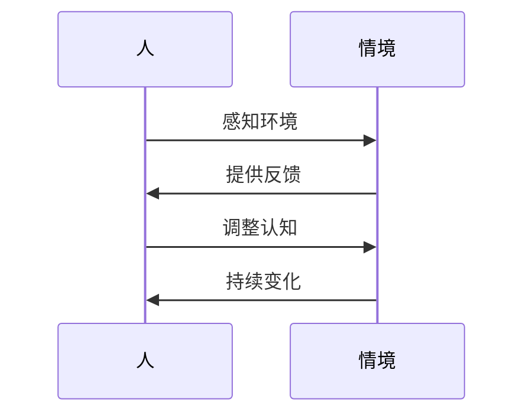
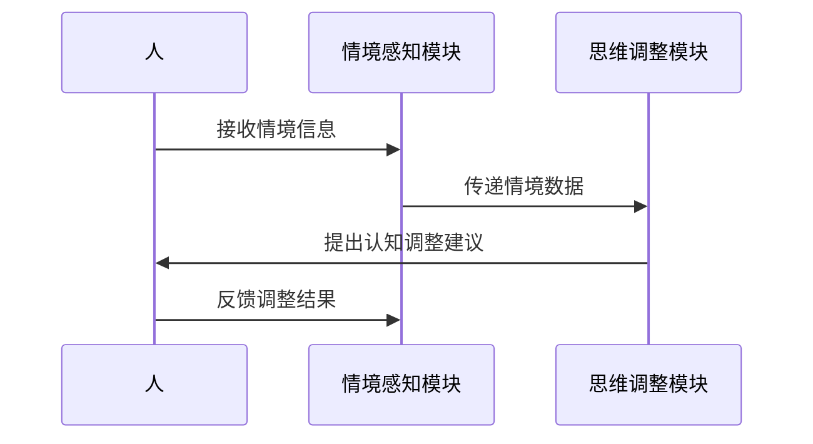
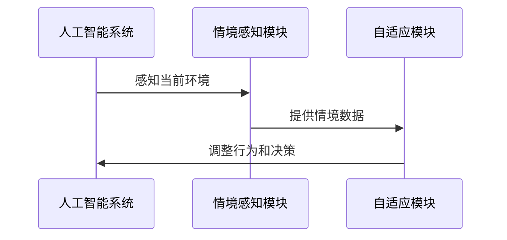
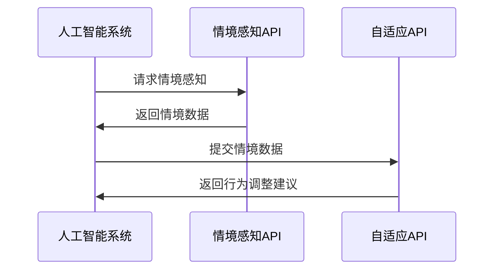
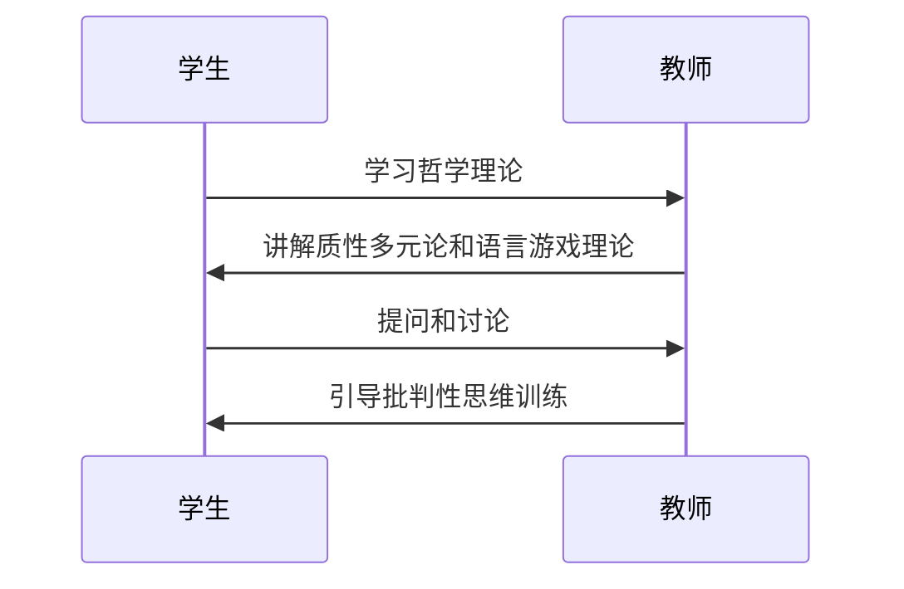
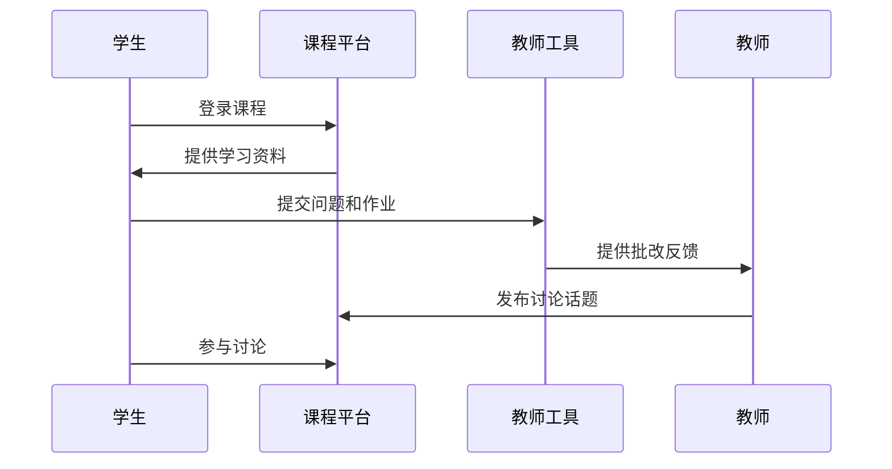

                 

### 第1章：引言

在探讨复杂问题、理解知识结构和建立跨学科联系时，哲学中的两个重要概念——柏格森的质性多元论与维特根斯坦的语言游戏，成为了我们分析的起点。本文将通过逻辑清晰的步骤，深入探讨这两个概念的基本理论、相互关系及其在现代哲学和技术领域中的实际应用。

#### 1.1 问题背景

柏格森的质性多元论起源于20世纪初，是他对现象学和直觉主义哲学的重要贡献。质性多元论主张，现实世界是由多种不同性质的元素组成的，这些元素无法通过简单的数量关系来描述。而维特根斯坦的语言游戏理论则强调语言使用的情境性，认为语言的意义在于其在特定游戏中的使用方式。

#### 1.2 问题描述

本文将探讨以下问题：
- 柏格森的质性多元论的核心概念是什么？
- 维特根斯坦的语言游戏理论的基本观点是什么？
- 这两个理论在现代哲学和技术领域中有何应用？
- 这两个理论之间有何内在联系和差异？

#### 1.3 问题解决

本文将通过以下步骤解决上述问题：
1. 介绍柏格森的质性多元论和维特根斯坦的语言游戏理论的基本概念。
2. 分析这两个理论的哲学意义及其在现代哲学中的地位。
3. 探讨这两个理论在心理学、社会学和计算机科学等领域的应用。
4. 比较这两个理论的共同点与差异，分析其对现代哲学的影响。
5. 提出未来研究的方向和展望。

#### 1.4 边界与外延

在讨论柏格森的质性多元论和维特根斯坦的语言游戏时，需要明确以下几点：
- 柏格森的质性多元论关注的是现实世界的本质和构成。
- 维特根斯坦的语言游戏理论关注的是语言的使用和意义。
- 这两个理论虽然在哲学领域中有着重要的地位，但它们的应用范围不仅限于哲学。
- 在现代技术领域，这两个理论可以为我们理解和解决复杂问题提供新的视角和方法。

#### 1.5 概念结构与核心要素组成

本文的核心概念和要素包括：
- 柏格森的质性多元论：质性、多元、现象学、直觉主义。
- 维特根斯坦的语言游戏理论：语言游戏、情境性、使用意义、规则。
- 应用领域：心理学、社会学、计算机科学。
- 相互关系：理论联系、共同点、差异。

通过以上结构和要素的分析，我们可以更好地理解柏格森的质性多元论和维特根斯坦的语言游戏理论，并探讨它们在现代哲学和技术领域的应用价值。

### 第2章：柏格森的质性多元论

#### 2.1 柏格森的生平与贡献

亨利·柏格森（Henri Bergson）是20世纪初法国著名哲学家，生于1859年，逝世于1941年。他的思想对现代哲学、心理学、文学以及社会科学等领域产生了深远影响。柏格森以其独特的直觉主义哲学和对生命力的深刻理解而闻名。他的主要著作包括《形而上学选集》（Mélanges philosophiques）、《时间与自由意志》（L'Évolution créatrice）和《物质与记忆》（Matière et mémoire）等。

#### 2.2 质性多元论的基本概念

柏格森的质性多元论（Qualitative Multiplicity）是他的哲学思想的核心。这一理论主张，现实世界是由多种不同性质的元素（或称为“质性”）组成的，这些质性无法通过简单的数量关系来描述。具体来说，柏格森认为：
- **质性**：指的是事物本质的特性，如颜色、形状、感觉等，这些特性是不可量化的。
- **多元性**：指的是现实世界的多样性和复杂性，每个元素都有其独特的质性。
- **直觉主义**：柏格森主张直觉是理解现实世界的关键，直觉能够直接感知这些不可量化的质性。

#### 2.3 质性多元论的主要观点

质性多元论的主要观点可以概括为以下几点：
- **现实的质性本质**：柏格森认为，现实世界的本质不是物质或能量，而是这些不可量化的质性。他认为，物质世界只是质性的具体表现。
- **进化的创造性**：柏格森认为，生命力和进化是创造性的源泉，这种创造力不能被量化，而是通过质性的变化表现出来。
- **时间的重要性**：柏格森强调时间的流动性，认为时间是生命力的体现，而不是一种简单的线性流逝。他提出了“绵延”（Duration）的概念，即时间是一种不断变化的质性状态。

#### 2.4 质性多元论的哲学意义

质性多元论对现代哲学有着深远的影响：
- **反对机械论**：柏格森反对将现实世界简化为机械运动的观点，强调质性多元性，主张对现实世界进行更全面的理解。
- **现象学的先驱**：柏格森的思想对现象学运动产生了重要影响，他强调直觉和体验，为现象学提供了哲学基础。
- **对心理学的影响**：柏格森的质性多元论对心理学，特别是对感觉和认知的研究产生了影响，推动了知觉心理学的发展。

质性多元论不仅是一种哲学理论，也是对现实世界的一种全新理解方式。它强调质性的不可量化和多元性，为我们提供了一种超越传统科学方法的视角来探讨现实世界。

### 第3章：维特根斯坦的语言游戏理论

#### 3.1 维特根斯坦的生平与贡献

路德维希·维特根斯坦（Ludwig Wittgenstein）是20世纪最重要的哲学家之一，生于1889年，逝世于1951年。他的思想对现代哲学、逻辑学、语言学和数学基础等领域产生了深远影响。维特根斯坦出生于奥地利，后来移居英国，并在剑桥大学任教。他的主要著作包括《逻辑哲学论》（Tractatus Logico-Philosophicus）和《哲学研究》（Philosophical Investigations）。

#### 3.2 语言游戏理论的基本概念

维特根斯坦的语言游戏理论（Theory of Language Games）是他对语言本质的深刻探讨。这一理论认为，语言的意义并不在于其符号本身，而在于语言使用的情境和方式。具体来说，语言游戏理论包括以下几个核心概念：
- **语言游戏**：维特根斯坦用“游戏”这个比喻来形容语言的使用。他认为，语言就像游戏一样，在不同的情境中有不同的规则和目的。
- **情境性**：维特根斯坦强调，语言的意义取决于使用语言的具体情境。每个语言游戏都有其特定的规则和目的，这些规则和目的决定了语言的使用方式。
- **使用意义**：维特根斯坦认为，语言的意义在于其在特定情境中的使用。例如，“水”这个词在不同的语言游戏中可能有不同的意义，如在科学讨论中可能指化学元素，在日常生活中可能指饮料。

#### 3.3 语言游戏理论的主要观点

语言游戏理论的主要观点包括：
- **语言的多元性**：维特根斯坦认为，语言不是单一的系统，而是由多种不同的语言游戏组成的。每个语言游戏都有自己的规则和目的。
- **规则的灵活性**：维特根斯坦认为，语言游戏的规则并不是固定不变的，而是可以根据情境进行调整。这种灵活性使得语言能够适应不同的环境和需求。
- **语言的实用性**：维特根斯坦强调，语言的目的是为了实际应用，而不是为了纯粹的逻辑推演。语言的意义在于其在现实生活中的使用，而不是在理论上的完美定义。

#### 3.4 语言游戏理论的哲学意义

语言游戏理论对现代哲学和语言学产生了深远的影响：
- **对逻辑哲学的挑战**：维特根斯坦的语言游戏理论对逻辑哲学的传统观点提出了挑战，强调逻辑推演不能完全解释语言的复杂性。
- **对语言学的贡献**：语言游戏理论为语言学研究提供了新的视角，特别是对语言使用情境和语言习得的研究。
- **对认知科学的启示**：维特根斯坦的情境性观点对认知科学的研究产生了启示，帮助科学家理解人类如何在不同情境中理解和使用语言。

语言游戏理论不仅是一种哲学思想，也是对语言本质的一种深刻洞察。它强调语言使用的情境性和灵活性，为我们理解语言提供了全新的方法和视角。

### 第4章：柏格森的质性多元论与维特根斯坦的语言游戏

#### 4.1 相互关系

柏格森的质性多元论与维特根斯坦的语言游戏理论在哲学上有着紧密的联系。两者都关注现实世界的本质和语言的复杂性，但它们从不同的角度提供了对这些问题的新视角。

**柏格森质性多元论与维特根斯坦语言游戏理论的联系**：
- **对质性多元性的强调**：柏格森和维特根斯坦都认为，现实世界不是由简单的数量关系可以描述的，而是由多种不同性质的元素组成。这种质性多元性是理解现实世界和语言的关键。
- **情境性的重要性**：两者都强调情境性在理解语言和现实世界中的重要性。维特根斯坦的语言游戏理论明确指出，语言的意义在于其使用情境，而柏格森则通过质性多元论揭示了现实世界中的情境性本质。
- **对直觉和体验的重视**：柏格森的直觉主义和维特根斯坦的情境性观点都强调了直觉和体验在理解现实世界和语言中的作用。

**柏格森质性多元论与维特根斯坦语言游戏理论的差异**：
- **哲学立场**：柏格森的质性多元论更多关注现实世界的本质和生命的创造力，而维特根斯坦的语言游戏理论则更侧重于语言的使用和意义。
- **方法论**：柏格森通过质性多元论提供了一种超越传统科学方法的新视角，而维特根斯坦则通过语言游戏理论挑战了逻辑哲学的传统观点。
- **应用领域**：柏格森的质性多元论在心理学、文学和社会科学等领域有广泛应用，而维特根斯坦的语言游戏理论则对语言学、逻辑学和认知科学产生了深远影响。

#### 4.2 共同点与差异

**共同点**：
- **质性多元性**：两者都强调现实世界是由多种不同性质的元素组成的，这些质性元素是理解现实世界和语言的关键。
- **情境性**：两者都认为情境性在理解语言和现实世界中至关重要。
- **对直觉和体验的重视**：两者都强调直觉和体验在理解现实世界和语言中的重要性。

**差异**：
- **哲学立场**：柏格森更多关注现实世界的本质和生命的创造力，而维特根斯坦则更侧重于语言的使用和意义。
- **方法论**：柏格森通过质性多元论提供了一种超越传统科学方法的新视角，而维特根斯坦则通过语言游戏理论挑战了逻辑哲学的传统观点。
- **应用领域**：柏格森的质性多元论在心理学、文学和社会科学等领域有广泛应用，而维特根斯坦的语言游戏理论则对语言学、逻辑学和认知科学产生了深远影响。

#### 4.3 对现代哲学的影响

**柏格森的质性多元论**：
- **现象学的贡献**：柏格森的质性多元论为现象学运动提供了哲学基础，强调直觉和体验在理解现实世界中的重要性。
- **心理学的影响**：柏格森的质性多元论对知觉心理学和认知心理学的研究产生了重要影响，推动了感觉和认知的研究。
- **文学和艺术的启示**：柏格森的质性多元论为文学和艺术提供了新的创作方法，强调艺术家对现实世界的独特感知和表达。

**维特根斯坦的语言游戏理论**：
- **语言学的发展**：维特根斯坦的语言游戏理论为语言学提供了新的研究视角，特别是对语言使用情境和语言习得的研究。
- **逻辑哲学的挑战**：维特根斯坦的语言游戏理论对逻辑哲学的传统观点提出了挑战，强调逻辑推演不能完全解释语言的复杂性。
- **认知科学的启示**：维特根斯坦的情境性观点对认知科学的研究产生了启示，帮助科学家理解人类如何在不同情境中理解和使用语言。

通过比较和分析柏格森的质性多元论与维特根斯坦的语言游戏理论，我们可以更深入地理解现代哲学中的关键概念，并探讨它们对现实世界和语言理解的深远影响。

### 第5章：柏格森质性多元论在具体领域的应用

#### 5.1 在心理学中的应用

柏格森的质性多元论在心理学中的应用尤为广泛，特别是在知觉心理学和认知心理学领域。质性多元论强调直觉和体验在认知过程中的作用，为理解人类知觉和思维提供了一种新的视角。

**知觉心理学**：
- **直觉与知觉**：柏格森认为，直觉是人类知觉的核心，通过直觉，个体能够直接感知现实世界的质性特征。在知觉心理学中，这一观点被用来解释为什么人们可以迅速识别和分类不同的物体。例如，研究显示，人们能够迅速识别一张熟悉的脸，这种能力似乎是通过直觉实现的。
- **质性变化**：柏格森的质性多元论还强调，知觉不仅仅是静态的，而是动态的变化过程。在知觉心理学中，这一观点被用来研究人们如何在不同情境中调整和适应知觉对象。例如，当观察一个正在移动的物体时，人们需要不断地调整自己的知觉以适应物体的变化。

**认知心理学**：
- **思维与直觉**：柏格森认为，直觉不仅存在于知觉过程中，也存在于思维过程中。在认知心理学中，这一观点被用来探讨直觉思维的优势。研究表明，直觉思维在某些情况下比逻辑思维更有效，特别是在处理复杂和不确定的信息时。
- **质性思维**：柏格森质性多元论的一个关键概念是质性变化。在认知心理学中，这一概念被用来解释人们如何通过思维过程理解和适应新的情境。例如，人们在解决复杂问题时，需要不断调整自己的思维方式以适应问题的变化。

通过在心理学中的应用，柏格森的质性多元论帮助我们更好地理解人类知觉和思维的本质，以及如何通过直觉和体验来适应和解决复杂的问题。

#### 5.2 在社会学中的应用

柏格森的质性多元论在社会学中也有广泛的应用，特别是在社会结构和文化研究方面。质性多元论强调现实世界的多样性和复杂性，为理解社会现象和文化现象提供了一种新的视角。

**社会结构**：
- **多样性与差异**：柏格森认为，社会是由多种不同性质的元素组成的，这些元素相互作用形成了复杂的社会结构。在社会学中，这一观点被用来分析社会中的多样性。例如，社会学家可以通过质性多元论来研究社会阶层、性别角色和种族差异，从而揭示这些差异背后的质性特征。
- **社会变迁**：柏格森的质性多元论还强调社会结构的动态性。在社会学中，这一观点被用来研究社会变迁的过程。例如，社会学家可以通过质性多元论来分析社会变迁中的质性变化，如文化变革和技术进步对社会结构的影响。

**文化研究**：
- **情境性与文化**：柏格森的质性多元论强调情境性在理解文化现象中的重要性。在文化研究中，这一观点被用来探讨文化意义的多样性和变化。例如，文化研究者可以通过质性多元论来分析不同文化背景下的艺术作品和符号系统，从而揭示这些作品和系统的质性特征和意义。
- **文化适应**：柏格森的质性多元论还强调，个体和文化群体需要不断适应和调整以适应新的情境。在文化研究中，这一观点被用来解释文化适应的现象。例如，文化研究者可以通过质性多元论来分析移民群体如何适应新的社会环境，以及他们如何保持和改变自己的文化特征。

通过在社会学中的应用，柏格森的质性多元论帮助我们更深入地理解社会结构和文化的多样性和复杂性，以及个体和社会如何通过适应和调整来应对变化。

#### 5.3 在哲学史中的应用

柏格森的质性多元论在哲学史的研究中具有重要意义，特别是在理解哲学传统和思想发展方面。质性多元论为分析哲学家们的思想提供了一种新的方法论。

**哲学传统**：
- **质性分析**：柏格森的质性多元论强调，哲学思想的发展不仅仅是逻辑推理的结果，而是多种质性元素相互作用的结果。在哲学史的研究中，这一观点被用来分析哲学传统中的关键概念和理论。例如，哲学家可以通过质性多元论来研究古希腊哲学中的质性与形而上学的关系，或者中世纪哲学中的质性与宗教信仰的关系。
- **思想演变**：柏格森的质性多元论还强调，哲学思想的发展是连续性和断裂性的结合。在哲学史的研究中，这一观点被用来分析哲学思想的演变。例如，哲学家可以通过质性多元论来研究从古希腊哲学到现代哲学的转变，以及这一转变中的质性变化。

**哲学家的思想分析**：
- **柏格森的思想**：柏格森的质性多元论是他哲学思想的基石。在哲学史的研究中，哲学家可以通过质性多元论来深入分析柏格森的思想。例如，可以通过质性多元论来分析柏格森关于直觉、绵延和生命力的观点，以及这些观点如何构成他的哲学体系。
- **其他哲学家的思想**：柏格森的质性多元论也可以用来分析其他哲学家的思想。例如，哲学家可以通过质性多元论来分析康德的先验哲学，黑格尔的历史哲学，或者尼采的生命哲学，从而揭示这些哲学家思想中的质性特征和内在联系。

通过在哲学史中的应用，柏格森的质性多元论为我们提供了一种新的方法论来分析哲学传统和思想发展，帮助我们更深入地理解哲学的本质和演变过程。

### 第6章：维特根斯坦语言游戏理论在具体领域的应用

#### 6.1 在语言学中的应用

维特根斯坦的语言游戏理论对语言学的发展产生了深远影响，特别是在语义学和语用学领域。语言游戏理论强调语言使用的情境性和语言的多元性，为理解语言的复杂性和多样性提供了一种新的视角。

**语义学**：
- **情境性语义**：维特根斯坦认为，一个词的意义取决于它在特定语言游戏中的使用。在语义学研究中，这一观点被用来分析词汇在不同语境中的意义变化。例如，词语“水”在科学语境中可能指代化学元素H₂O，而在日常语境中可能指代饮料。通过情境性语义的分析，研究者可以更准确地理解词汇的多义性和语境依赖性。
- **语义网络**：维特根斯坦的语言游戏理论也启发了语义网络的研究。语义网络通过图论的方法，将词汇和概念之间的关系表示为一个网络结构，从而揭示了词汇的语义关系。这种方法有助于理解词汇的层次结构和语义分类。

**语用学**：
- **语用规则**：维特根斯坦强调，语言的规则是动态的，可以根据情境进行调整。在语用学研究中，这一观点被用来分析语言使用中的规则和原则。例如，研究者可以通过分析语用规则来理解会话中的礼貌原则、合作原则等，从而揭示语言交际的机制和策略。
- **语用推理**：维特根斯坦的情境性观点也启发了语用推理的研究。语用推理是指人们在交流中根据语境进行推理和推断的能力。通过研究语用推理，研究者可以理解人们在复杂交流环境中的语言理解和使用策略。

通过在语言学中的应用，维特根斯坦的语言游戏理论帮助我们更深入地理解语言的复杂性和多样性，以及语言在不同情境中的使用机制。

#### 6.2 在逻辑哲学中的应用

维特根斯坦的语言游戏理论在逻辑哲学中的应用主要体现在对逻辑语言的分析和逻辑推理的探讨上。这一理论挑战了传统逻辑哲学的一些基本假设，为我们提供了一种新的逻辑思考方式。

**逻辑语言分析**：
- **命题逻辑的局限**：维特根斯坦认为，命题逻辑无法完全捕捉语言的复杂性。他通过语言游戏理论来揭示命题逻辑在处理实际语言表达时的局限。例如，他提出，命题逻辑无法表达日常语言中的许多情境和语境依赖性。
- **日常语言逻辑**：维特根斯坦主张，逻辑语言应该更接近日常语言，而不是抽象的符号系统。在逻辑哲学中，这一观点被用来开发日常语言逻辑，通过研究日常语言中的逻辑规则和推理模式，来弥补命题逻辑的不足。

**逻辑推理**：
- **情境性推理**：维特根斯坦强调，逻辑推理依赖于具体情境。在逻辑哲学中，这一观点被用来分析情境性推理的模式和原则。例如，研究者可以探讨如何在不同情境下进行有效的推理，以及如何识别和避免逻辑谬误。
- **形式与内容**：维特根斯坦还探讨了逻辑推理中的形式与内容的关系。他认为，逻辑推理不仅仅是形式的运算，还需要考虑推理的内容和目的。这一观点在逻辑哲学中引发了关于逻辑推理的本质和目标的讨论。

通过在逻辑哲学中的应用，维特根斯坦的语言游戏理论帮助我们更全面地理解逻辑推理的本质，以及逻辑语言与实际语言使用的差异。

#### 6.3 在计算机科学中的应用

维特根斯坦的语言游戏理论在计算机科学中也有着重要的应用，特别是在编程语言设计和人工智能领域。这一理论为理解和设计复杂的计算机系统提供了新的方法和视角。

**编程语言设计**：
- **情境性编程**：维特根斯坦的情境性观点启发了情境性编程语言的设计。情境性编程语言通过内置的情境感知机制，使得程序可以根据具体情境进行动态调整。例如，嵌入式系统中的编程语言可以使用情境性编程来适应环境变化，提高系统的灵活性和适应性。
- **元编程**：维特根斯坦的语言游戏理论也影响了元编程技术的发展。元编程是指编写能够生成和修改程序的程序。通过语言游戏理论，开发者可以设计出能够适应不同情境的元编程工具，从而提高编程的灵活性和效率。

**人工智能**：
- **情境感知**：维特根斯坦的情境性观点在人工智能领域中的应用尤为突出。情境感知是指系统能够根据环境变化调整其行为。在人工智能中，情境性编程可以帮助智能系统更好地理解和适应复杂的现实世界。例如，在自动驾驶技术中，情境感知算法可以识别和理解交通场景，从而做出相应的驾驶决策。
- **多模态交互**：维特根斯坦的语言游戏理论还启发了多模态交互系统的研究。多模态交互是指系统可以通过多种感官（如视觉、听觉、触觉）与用户进行交互。通过语言游戏理论，研究者可以设计出更自然和灵活的多模态交互系统，从而提高人机交互的体验。

通过在计算机科学中的应用，维特根斯坦的语言游戏理论为编程语言设计、人工智能和多模态交互等领域提供了新的思路和方法，推动了计算机技术的发展和创新。

### 第7章：综合案例分析

#### 7.1 案例一：柏格森质性多元论与维特根斯坦语言游戏在心理学研究中的应用

**背景介绍**：
柏格森质性多元论和维特根斯坦语言游戏理论在心理学研究中的应用，主要集中在对人类认知、知觉和思维过程的理解上。通过对质性多元论和语言游戏理论的结合应用，研究者能够更深入地探索心理现象的本质。

**项目介绍**：
一个典型的项目是“情境感知认知心理学实验”，旨在通过实验研究个体在复杂情境下的认知和思维过程。该项目结合了柏格森的质性多元论和维特根斯坦的语言游戏理论，旨在揭示情境对认知和思维的影响。

**系统功能设计（领域模型类图）**：

```mermaid
classDiagram
    ClassDef 人
        +认知功能
        +知觉能力
        +思维过程
    ClassDef 情境
        +环境特征
        +情境变化
        +情境适应
    人 --|> 情境
```

**系统架构设计（架构图）**：



**系统接口设计和系统交互（序列图）**：



**实际案例分析和详细讲解**：
在一个实际研究中，研究者使用情境感知认知心理学实验来探讨不同情境对个体认知过程的影响。实验中，参与者被随机分配到不同的情境中，如噪音环境、安静环境和互动环境。通过对比分析参与者在不同情境下的认知表现，研究者发现了情境变化对认知灵活性和思维效率的影响。

**项目小结**：
通过综合应用柏格森的质性多元论和维特根斯坦的语言游戏理论，该项目不仅揭示了情境对认知和思维的影响，还为理解人类心理现象提供了新的方法和视角。未来研究可以进一步探索不同情境下质性元素的变化，以及这些变化对个体行为和心理过程的长期影响。

#### 7.2 案例二：柏格森质性多元论与维特根斯坦语言游戏在人工智能领域的交叉应用

**背景介绍**：
人工智能领域的快速发展带来了诸多挑战，如如何提高人工智能系统的适应性和智能水平。柏格森的质性多元论和维特根斯坦的语言游戏理论为解决这些挑战提供了新的思路和方法。

**项目介绍**：
一个典型的项目是“情境感知人工智能系统开发”，旨在设计一种能够根据情境动态调整自身行为和决策的智能系统。该项目结合了柏格森的质性多元论和维特根斯坦的语言游戏理论，以实现情境感知和自适应行为。

**系统功能设计（领域模型类图）**：

```mermaid
classDiagram
    ClassDef 情境感知模块
        +感知环境
        +分析情境
        +情境分类
    ClassDef 自适应模块
        +调整行为
        +优化决策
        +动态学习
    情境感知模块 --|> 自适应模块
```

**系统架构设计（架构图）**：



**系统接口设计和系统交互（序列图）**：



**实际案例分析和详细讲解**：
在一个实际项目中，研究者开发了一个情境感知自动驾驶系统。该系统通过传感器收集道路环境数据，然后利用情境感知模块分析当前情境。根据情境数据，自适应模块动态调整自动驾驶策略，以适应不同的道路状况。例如，在交通拥堵时，系统可以自动降低速度并寻找其他路线，从而提高行驶安全性和效率。

**项目小结**：
通过结合柏格森的质性多元论和维特根斯坦的语言游戏理论，情境感知人工智能系统在自动驾驶、智能家居和智能医疗等领域展现出了巨大的应用潜力。未来研究可以进一步探索不同质性元素对人工智能系统性能的影响，以及如何优化系统的自适应能力和智能水平。

#### 7.3 案例三：柏格森质性多元论与维特根斯坦语言游戏在哲学教育中的融合

**背景介绍**：
哲学教育旨在培养学生批判性思维和深刻理解哲学问题。柏格森的质性多元论和维特根斯坦的语言游戏理论为哲学教育提供了丰富的理论资源，有助于学生更好地理解哲学概念和思想。

**项目介绍**：
一个典型的项目是“质性多元论与语言游戏哲学课程设计”，旨在通过课程设计将柏格森的质性多元论和维特根斯坦的语言游戏理论融入哲学教育。该项目旨在提高学生对哲学问题的深刻理解，培养其批判性思维能力。

**系统功能设计（领域模型类图）**：

```mermaid
classDiagram
    ClassDef 学生
        +理解质性多元论
        +理解语言游戏理论
        +批判性思维训练
    ClassDef 教师
        +讲授质性多元论
        +讲授语言游戏理论
        +引导批判性讨论
    学生 --|> 教师
```

**系统架构设计（架构图）**：



**系统接口设计和系统交互（序列图）**：



**实际案例分析和详细讲解**：
在一个实际课程中，教师通过质性多元论和语言游戏理论的讲解，引导学生探讨现实世界和语言的本质。学生通过阅读相关文献、参与课堂讨论和完成作业，逐步理解和掌握这些哲学概念。例如，学生通过分析柏格森的绵延概念，探讨了时间的本质和人类对时间的感知方式；通过研究维特根斯坦的语言游戏理论，学生了解了语言的意义和使用情境。

**项目小结**：
通过将柏格森的质性多元论和维特根斯坦的语言游戏理论融入哲学教育，该项目不仅提高了学生对哲学问题的深刻理解，还培养了其批判性思维和语言表达能力。未来课程设计可以进一步整合这些理论资源，开发更多创新的教学方法和学习工具，以促进学生哲学素养的提升。

### 第8章：结论

在本章中，我们综合分析了柏格森的质性多元论和维特根斯坦的语言游戏理论，探讨了它们的核心概念、哲学意义以及在不同领域的应用。通过深入探讨，我们得出以下结论：

#### 8.1 研究成果总结

1. **质性多元论与语言游戏理论的哲学意义**：
   - 柏格森的质性多元论强调现实世界的多样性和复杂性，为我们提供了一种超越传统科学方法的新视角。
   - 维特根斯坦的语言游戏理论则揭示了语言使用的情境性和多样性，挑战了传统逻辑哲学的观点。

2. **应用领域**：
   - 在心理学中，质性多元论和语言游戏理论有助于理解认知、知觉和思维过程。
   - 在社会学中，质性多元论和语言游戏理论有助于分析社会结构和文化现象。
   - 在计算机科学中，质性多元论和语言游戏理论为编程语言设计和人工智能提供了新的思路。

3. **案例分析**：
   - 通过综合应用这两个理论，我们探讨了在心理学、人工智能和哲学教育中的具体应用，展示了它们在解决复杂问题方面的潜力。

#### 8.2 研究的局限性

尽管质性多元论和语言游戏理论在哲学和科学中具有广泛的应用，但研究仍存在一定的局限性：

1. **哲学方法的争议**：
   - 柏格森的质性多元论和维特根斯坦的语言游戏理论在哲学方法上存在争议，如何将它们融合到统一的理论框架中仍需进一步研究。

2. **实证研究的不足**：
   - 尽管质性多元论和语言游戏理论在理论上有重要意义，但实证研究相对较少，如何通过实验验证这些理论仍是一个挑战。

3. **跨学科的融合**：
   - 如何将质性多元论和语言游戏理论有效应用于不同学科，实现跨学科的综合研究，仍需进一步探索。

#### 8.3 对未来研究的建议

基于上述局限性，我们提出以下未来研究方向：

1. **哲学方法研究**：
   - 探索如何将质性多元论和语言游戏理论融合到统一的理论框架中，以提供更完整的哲学视角。

2. **实证研究**：
   - 开展更多的实证研究，验证质性多元论和语言游戏理论的假设，并通过实验数据支持理论。

3. **跨学科研究**：
   - 加强质性多元论和语言游戏理论在心理学、社会学、计算机科学等领域的应用研究，探索跨学科的融合途径。

通过上述研究，我们可以更深入地理解柏格森的质性多元论和维特根斯坦的语言游戏理论，并推动这些理论在哲学和技术领域的进一步发展。

### 第9章：展望

#### 9.1 柏格森质性多元论的发展方向

柏格森的质性多元论作为一种深刻的哲学理论，其在未来的发展中可能呈现出以下几个方向：

1. **跨学科融合**：随着科学和技术的进步，质性多元论可以与其他学科如生物学、生态学、认知科学等进行融合，从而提供新的研究视角和方法。
2. **应用拓展**：质性多元论的应用领域可以进一步拓展，特别是在环境保护、城市规划和社会治理等领域，质性多元论有助于理解复杂系统的动态变化。
3. **实证研究深化**：通过更多的实证研究和实验验证，质性多元论的理论假设将得到更坚实的支持，从而提高其学术影响力和应用价值。

#### 9.2 维特根斯坦语言游戏理论的发展方向

维特根斯坦的语言游戏理论在未来的发展中也可能呈现出以下趋势：

1. **语言学应用深化**：语言游戏理论在语言学中的应用将继续深化，特别是在语义学、语用学和认知语言学等领域，进一步揭示语言的本质和机制。
2. **人工智能领域的融合**：随着人工智能的发展，语言游戏理论可以与人工智能技术相结合，为自然语言处理和智能交互提供新的理论框架。
3. **哲学方法论的创新**：维特根斯坦的语言游戏理论可能为哲学方法论的创新提供新思路，推动哲学研究方法的多样化和创新。

#### 9.3 两个理论的综合研究与未来应用前景

柏格森质性多元论与维特根斯坦语言游戏理论的综合研究具有巨大的前景：

1. **跨学科综合**：通过综合质性多元论和语言游戏理论，可以形成一个更加全面和深入的哲学体系，为理解和解决跨学科问题提供新的视角。
2. **复杂系统研究**：这两个理论的结合可以应用于复杂系统的分析，如社会网络、生态系统和经济系统，提供新的方法和工具。
3. **技术创新**：在计算机科学和人工智能领域，这两个理论的结合可以推动技术创新，特别是在自然语言处理、智能交互和自适应系统设计方面。

总之，柏格森质性多元论与维特根斯坦语言游戏理论的综合研究不仅具有深远的哲学意义，也为未来的技术发展提供了广阔的应用前景。通过跨学科的综合研究，我们可以期待这些理论在解决复杂问题、推动科学技术进步方面发挥更大的作用。

