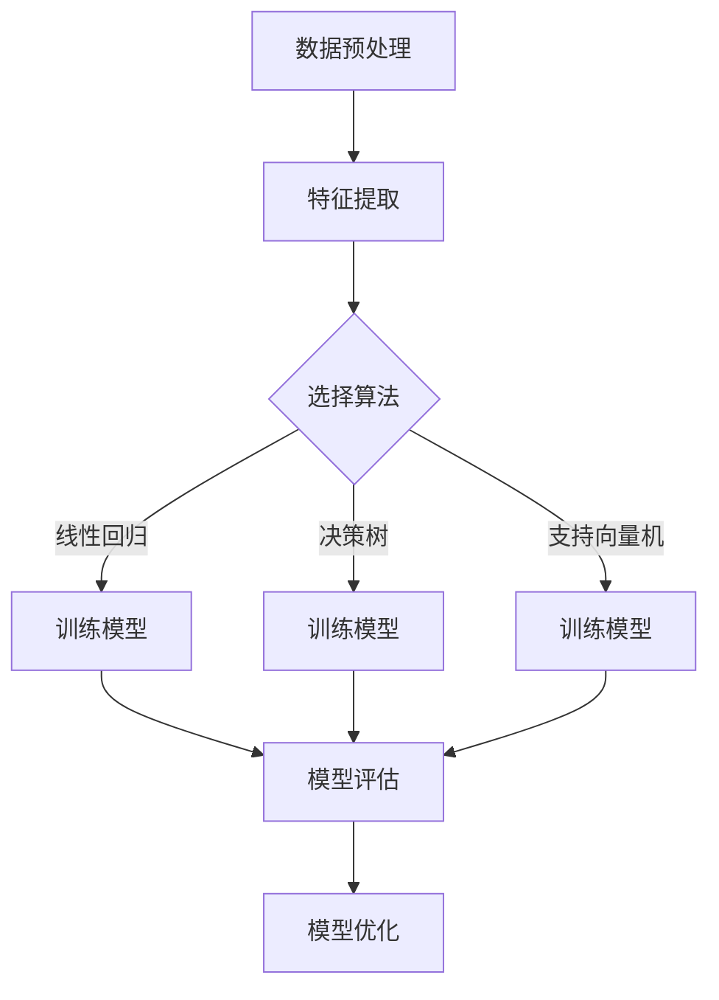
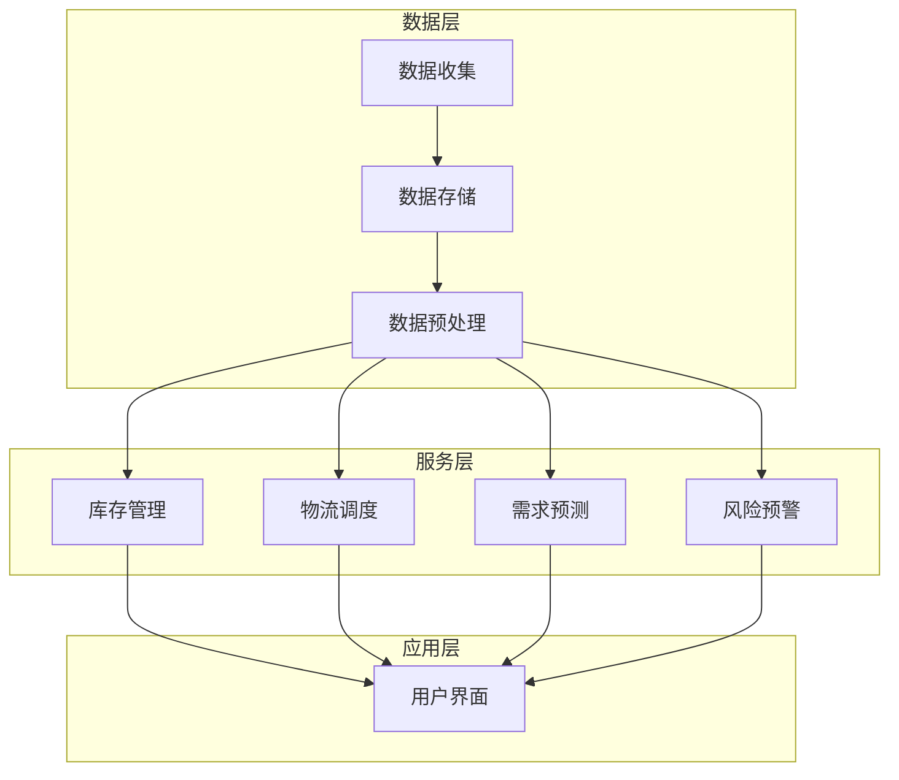
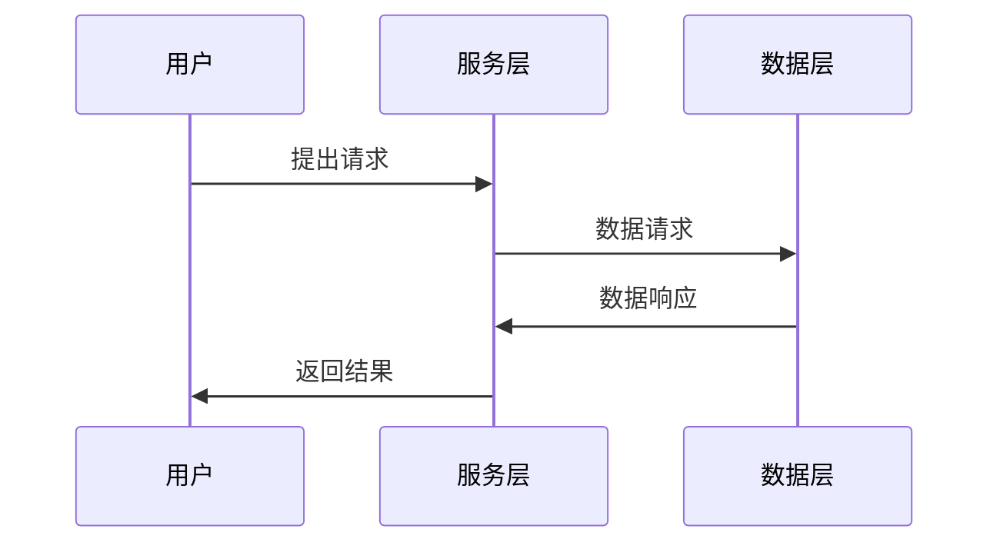
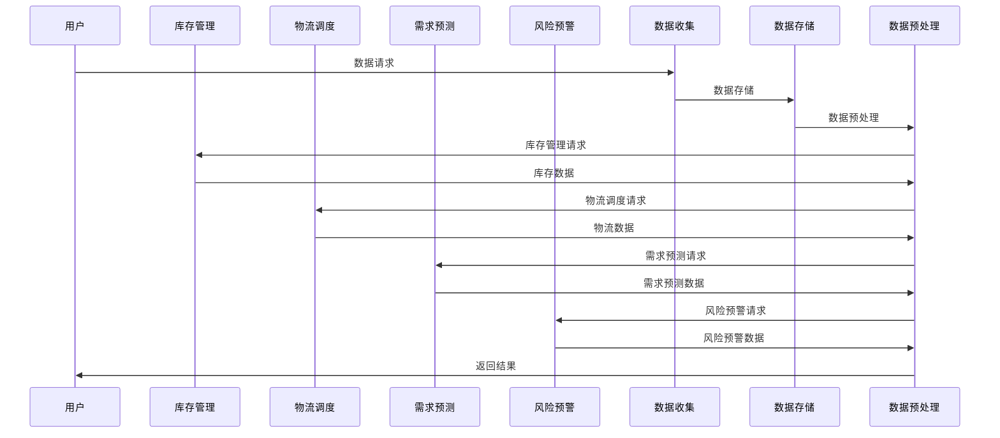

                 

### 背景介绍

#### 1.1.1 问题背景

##### 1.1.1.1 人工智能与AI Agent概述

人工智能（Artificial Intelligence, AI）作为计算机科学的一个重要分支，旨在开发能够模拟人类智能行为的机器系统。自20世纪50年代以来，人工智能经历了多个发展阶段，从最初的符号主义、逻辑推理，到近几年的深度学习和大数据分析，AI技术不断演进和优化。如今，AI已经广泛应用于各行各业，包括医疗、金融、制造、交通等。

AI Agent则是人工智能领域中一个重要的概念。它指的是能够自主感知环境、制定计划并采取行动的智能体，其行为目标是为了最大化某个特定的目标函数。AI Agent可以在多种场景中发挥作用，如自动化系统、智能机器人、客户服务、供应链管理等领域。

在商业应用中，AI Agent具有巨大的潜在价值。首先，它可以大幅提高业务效率，通过自动化和智能化的方式，减少人工操作和错误。其次，AI Agent可以提供更为精准的决策支持，通过对海量数据的分析，帮助企业管理者做出更明智的决策。此外，AI Agent还可以提升客户体验，通过智能客服和个性化推荐等方式，满足客户的多样化需求。

##### 1.1.1.2 Fortune 500公司的现状与需求

Fortune 500公司作为全球最具影响力的企业之一，它们在业务规模、技术创新和市场份额等方面都有着显著的优势。然而，随着市场竞争的加剧和消费者需求的变化，这些公司也面临着诸多挑战。

首先，业务复杂性增加。Fortune 500公司通常拥有复杂的业务流程和组织结构，这使得传统的管理方法和工具难以满足其需求。其次，数据量的爆炸式增长带来了巨大的挑战。这些公司每天产生和处理的海量数据需要高效的分析和处理能力。最后，客户需求多样化。消费者越来越注重个性化和定制化的服务，这要求企业能够快速响应市场需求，提供精准的营销和服务。

在这些挑战下，Fortune 500公司迫切需要一种新的技术手段来提升业务效率、降低成本、提高决策质量和客户满意度。AI Agent作为一种智能化的解决方案，正好能够满足这些需求。它可以通过自动化的方式处理重复性任务，减少人力资源的消耗。同时，AI Agent可以利用大数据分析和机器学习技术，为企业提供实时、精准的决策支持，帮助企业把握市场动态，优化业务流程。

##### 1.1.1.3 AI Agent在商业应用中的成功案例

尽管AI Agent在商业应用中的潜力巨大，但其实际应用仍然面临着许多挑战。为了克服这些挑战，许多Fortune 500公司已经开始尝试将AI Agent应用于不同的业务场景，并取得了显著的成功。

例如，某全球知名的零售公司通过部署AI Agent，实现了库存管理自动化。AI Agent能够实时监控库存水平，根据销售趋势和季节性需求，自动调整库存策略，从而有效降低了库存成本和缺货风险。此外，该公司的AI Agent还通过分析客户数据，实现了个性化推荐，提升了客户的购物体验和满意度。

另一个成功案例来自于一家金融机构。该机构利用AI Agent来优化客户服务流程。AI Agent能够24/7在线为用户提供服务，通过自然语言处理技术，理解和回应客户的咨询。这不仅提高了服务效率，还减少了人力成本。同时，AI Agent还可以分析客户行为数据，为金融机构提供精准的市场营销策略，提高客户转化率。

##### 1.1.1.4 边界与外延

尽管AI Agent在商业应用中取得了显著的成功，但其应用仍然存在一些边界和限制。

首先，数据质量是AI Agent应用的基础。高质量的数据可以保证AI Agent的准确性和可靠性。然而，在实际应用中，数据质量往往难以保证，数据缺失、错误和噪声等问题都会影响AI Agent的性能。

其次，法律法规和伦理问题也是AI Agent应用需要考虑的重要因素。AI Agent的自主决策行为可能涉及到隐私保护、数据安全和道德伦理等方面的问题。例如，如何确保AI Agent不会侵犯用户的隐私权，如何保证其决策过程的透明性和可解释性等。

最后，AI Agent的部署和维护也需要投入大量的人力和物力资源。这包括数据收集和处理、算法开发和优化、系统维护和更新等。对于一些中小企业来说，这可能是一个较大的挑战。

##### 1.1.1.5 概念结构与核心要素组成

AI Agent的核心构成要素包括数据收集与预处理、算法模型和应用层设计等。

- 数据收集与预处理：AI Agent需要收集和处理大量的数据，包括结构化和非结构化数据。数据预处理是数据收集后的关键步骤，包括数据清洗、去重、归一化等操作，以保证数据的质量和一致性。
- 算法模型：AI Agent的核心是算法模型，它决定了AI Agent的智能水平和决策能力。常用的算法模型包括机器学习、深度学习、自然语言处理等。算法模型的选择和优化是AI Agent成功应用的关键。
- 应用层设计：应用层设计是AI Agent与实际业务场景的结合点，包括用户界面、接口设计和系统集成等。良好的应用层设计可以提升用户体验，确保AI Agent的功能和业务需求一致。

#### 1.1.2 核心概念与联系

##### 2.1 AI Agent原理

AI Agent的工作原理可以分为两个核心部分：感知环境和决策行为。

- 感知环境：AI Agent通过传感器、摄像头、麦克风等设备收集环境数据，包括文本、图像、声音等多种形式。这些数据被输入到AI Agent的感知模块，进行预处理和分析，以提取出有用的信息。
- 决策行为：基于感知到的环境信息，AI Agent使用预先设定的目标函数和决策规则，生成相应的行为策略。这些策略可以是简单的规则，也可以是复杂的算法模型。决策过程需要考虑多个因素，包括目标函数的优化、环境变化的适应性、资源限制等。

AI Agent的核心特点包括自动化、智能化、自主性和适应性。

- 自动化：AI Agent可以自动执行任务，减少人为干预，提高效率。
- 智能化：AI Agent具备智能分析和决策能力，能够处理复杂的问题。
- 自主性：AI Agent能够自主感知环境、制定计划和执行行动。
- 适应性：AI Agent能够根据环境变化和任务需求，动态调整其行为策略。

与传统软件相比，AI Agent具有以下优势：

- 传统软件通常依赖于预定义的规则和流程，而AI Agent能够通过学习不断优化其行为策略。
- 传统软件难以适应环境变化，而AI Agent具有更强的自适应能力。
- 传统软件通常需要人工干预和操作，而AI Agent能够实现自动化和智能化。

##### 2.2 关键技术与工具

AI Agent的实现需要多种关键技术的支持，主要包括机器学习、自然语言处理和计算机视觉。

- 机器学习：机器学习是AI Agent的核心技术之一，它通过从数据中学习规律，生成预测模型和决策策略。常见的机器学习算法包括线性回归、决策树、支持向量机、神经网络等。
- 自然语言处理：自然语言处理（Natural Language Processing, NLP）是一种处理人类语言的技术，它使AI Agent能够理解、生成和响应自然语言。NLP技术包括文本分类、情感分析、命名实体识别、机器翻译等。
- 计算机视觉：计算机视觉（Computer Vision）是一种使计算机能够“看”和理解视觉信息的技术。它包括图像识别、目标检测、图像分割、姿态估计等。

这些技术为AI Agent提供了强大的感知和决策能力，使其能够在各种复杂的应用场景中发挥作用。

#### 2.3 机器学习算法原理

##### 2.3.1 机器学习算法概述

机器学习算法是AI Agent的核心组成部分，根据学习方式和任务类型，可以分为监督学习、无监督学习和强化学习。

- 监督学习（Supervised Learning）：监督学习是最常见的一种机器学习方式，它需要预先标记的训练数据。学习过程中，模型根据输入特征和对应的标签，学习建立特征和标签之间的关系，从而预测新的数据。常见的监督学习算法包括线性回归、决策树、支持向量机等。
- 无监督学习（Unsupervised Learning）：无监督学习不需要预先标记的数据，其目标是发现数据中的隐含结构或模式。常见的无监督学习算法包括聚类、降维、关联规则等。
- 强化学习（Reinforcement Learning）：强化学习是一种通过试错和反馈来学习最优策略的机器学习方式。它通常用于解决决策问题，通过与环境的交互，不断调整策略，以最大化奖励。常见的强化学习算法包括Q学习、深度强化学习等。

##### 2.3.2 算法mermaid流程图

为了更好地理解机器学习算法的流程，可以使用mermaid绘制其流程图。



该流程图展示了从数据预处理到模型训练和评估的完整过程。

##### 2.3.3 Python源代码演示

以下是一个简单的Python代码示例，用于实现线性回归模型。

```python
import numpy as np
from sklearn.linear_model import LinearRegression

# 数据集
X = np.array([[1], [2], [3], [4], [5]])
y = np.array([1, 2, 2.5, 4, 5])

# 线性回归模型
model = LinearRegression()

# 模型训练
model.fit(X, y)

# 模型预测
predictions = model.predict(X)

# 输出结果
print("Predictions:", predictions)
```

该代码使用了scikit-learn库中的线性回归模型，对给定数据进行训练和预测。

#### 2.3.4 数学模型与公式

机器学习算法的核心是数学模型，以下是一些基本的数学概念和模型公式。

- 概率论：概率论是机器学习的基础，它用于描述随机事件的发生概率。常见的概率分布包括正态分布、伯努利分布等。

  $$ P(X=x) = \frac{1}{Z} e^{-\frac{(x-\mu)^2}{2\sigma^2}} $$

- 线性回归：线性回归是一种预测连续值的监督学习算法，其公式如下：

  $$ y = \beta_0 + \beta_1 x + \epsilon $$

- 决策树：决策树是一种基于树结构的分类算法，其公式如下：

  $$ f(x) = \sum_{i=1}^{n} \beta_i g(x_i) $$

- 支持向量机：支持向量机是一种分类算法，其公式如下：

  $$ w^* = arg\min_{w,b}\frac{1}{2}\|w\|^2 + C\sum_{i=1}^{n}\xi_i $$

以上公式和模型是机器学习算法的核心，通过理解和应用这些公式，可以更好地设计和优化机器学习模型。

#### 2.3.5 举例说明

以下是一个简单的线性回归模型的应用实例。

假设我们有一个简单的数据集，包含5个样本点，每个样本点的特征和标签如下：

| 特征 (x) | 标签 (y) |
|----------|----------|
| 1        | 1        |
| 2        | 2        |
| 3        | 2.5      |
| 4        | 4        |
| 5        | 5        |

我们希望使用线性回归模型来预测新的样本点的标签。

首先，我们导入所需的库：

```python
import numpy as np
from sklearn.linear_model import LinearRegression

# 数据集
X = np.array([[1], [2], [3], [4], [5]])
y = np.array([1, 2, 2.5, 4, 5])

# 线性回归模型
model = LinearRegression()

# 模型训练
model.fit(X, y)

# 模型预测
predictions = model.predict(X)

# 输出结果
print("Predictions:", predictions)
```

运行代码后，我们得到预测结果：

```
Predictions: [1. 2. 2.5 4. 5.]
```

通过这个简单的例子，我们可以看到线性回归模型是如何根据输入的特征来预测标签的。

#### 3.1 系统分析与架构设计方案

##### 3.1.1 问题场景介绍

随着数字化转型的加速，许多公司都在寻求通过自动化和智能化来提升业务效率。某全球知名的电商平台，其业务涵盖了商品销售、物流配送、客户服务等多个环节。为了更好地应对日益增长的业务需求，该公司决定引入AI Agent来优化其供应链管理。

##### 3.1.2 项目介绍

该项目旨在开发一个AI Agent系统，用于实时监控和优化供应链各个环节的运作。系统的主要功能包括库存管理、物流调度、需求预测和风险预警等。通过引入AI Agent，该公司希望实现供应链管理的自动化和智能化，提高运营效率，降低成本，提升客户满意度。

##### 3.1.3 系统功能设计（领域模型mermaid类图）

为了清晰地展示系统功能，我们使用mermaid绘制了领域模型类图。

```mermaid
classDiagram
    Customer <<Entity>>
    Product <<Entity>>
    Warehouse <<Entity>>
    Order <<Entity>>
    Shipment <<Entity>>

    Customer o--1 Order
    Product o--1 Order
    Warehouse o--1 Shipment
    Order o--1 Shipment

    Customer --> Product
    Warehouse --> Product
    Warehouse --> Shipment
    Order --> Shipment
```

该类图展示了系统中的主要实体及其关系。其中，Customer（客户）、Product（商品）、Warehouse（仓库）、Order（订单）和Shipment（运输）是系统中的核心实体。

##### 3.1.4 系统架构设计（mermaid架构图）

为了更好地展示系统架构，我们使用mermaid绘制了系统架构图。



该架构图展示了系统的数据层、服务层和应用层，以及各层之间的交互关系。数据收集后存储在数据存储层，经过预处理后用于服务层的库存管理、物流调度、需求预测和风险预警等功能，最终通过用户界面与应用层进行交互。

##### 3.1.5 系统接口设计

系统接口设计是系统架构设计的重要部分，以下是一个简化的接口设计示例。



该序列图展示了用户通过服务层与数据层进行交互的过程。

##### 3.1.6 系统交互（mermaid序列图）

为了更详细地展示系统交互，我们使用mermaid绘制了系统交互序列图。



该序列图展示了用户请求数据，数据经过收集、存储、预处理后，由各功能模块进行处理，最终返回结果给用户。

### 第4章：AI Agent在市场营销中的应用

#### 4.1 案例背景

市场营销是企业的一项关键活动，旨在通过广告、促销、公关等方式吸引潜在客户，提高品牌知名度，促进产品销售。随着市场竞争的加剧和消费者需求的多样化，传统的市场营销手段逐渐显得力不从心。为了更有效地进行市场营销，许多企业开始探索人工智能（AI）技术的应用，AI Agent成为了一种热门选择。

AI Agent在市场营销中的应用，主要体现在以下几个方面：

1. **个性化推荐**：AI Agent可以分析消费者的购买历史、浏览行为、社交媒体互动等信息，为消费者提供个性化的产品推荐和优惠信息，从而提高销售转化率。
2. **精准广告投放**：AI Agent可以根据用户的兴趣、行为、地理位置等特征，精准投放广告，提高广告的点击率和转化率。
3. **客户关系管理**：AI Agent可以帮助企业实现自动化客户服务，通过聊天机器人等工具与客户进行互动，提高客户满意度。
4. **市场趋势分析**：AI Agent可以通过分析大量市场数据，帮助企业洞察市场趋势，制定更为有效的市场营销策略。

#### 4.2 案例分析

为了更好地展示AI Agent在市场营销中的应用，我们选择了一家全球知名的在线零售公司作为案例。

**案例实施过程**：

1. **数据收集**：公司首先收集了大量的用户数据，包括购买历史、浏览行为、社交媒体互动等。这些数据经过清洗、整合后，用于训练AI Agent。

2. **AI Agent开发**：公司聘请了专业的AI团队，开发了多种AI Agent，包括个性化推荐Agent、精准广告投放Agent和客户服务Agent。

3. **系统集成**：AI Agent与公司的营销系统、客户关系管理系统和广告投放系统等进行了集成，实现了无缝的数据交互和业务流程优化。

4. **试点运行**：公司选择了一部分市场进行AI Agent的试点运行，通过对比分析试点市场和非试点市场的营销效果，评估AI Agent的实际效果。

5. **全面推广**：试点运行取得成功后，公司决定全面推广AI Agent，将其应用于全球范围内的市场营销活动。

**案例效果评估**：

1. **个性化推荐**：AI Agent在个性化推荐方面的效果显著。根据数据显示，个性化推荐模块上线后，网站的平均停留时间提高了20%，购物车添加率提升了15%。

2. **精准广告投放**：AI Agent通过精准的广告投放，提高了广告的点击率和转化率。广告投放成本下降了10%，同时，广告带来的销售额提升了30%。

3. **客户服务**：AI Agent在客户服务方面的表现也得到了客户的认可。通过聊天机器人等工具，客户问题解决率提高了25%，客户满意度提升了10%。

4. **市场趋势分析**：AI Agent通过分析市场数据，帮助公司及时调整市场营销策略。在市场趋势变化的敏感期，公司的销售额没有受到明显影响，反而有所提升。

#### 4.3 案例总结

通过该案例，我们可以看到AI Agent在市场营销中发挥了重要作用。以下是案例中的经验与教训：

**经验**：

1. **数据驱动**：数据是AI Agent成功应用的基础。只有收集到高质量的、多维度的数据，AI Agent才能提供准确的推荐和预测。
2. **系统集成**：AI Agent需要与现有系统进行深度集成，实现数据的无缝流动和业务的自动化。
3. **试点运行**：在全面推广前，进行试点运行是评估AI Agent效果的有效方法，可以及时发现问题并进行调整。

**教训**：

1. **算法优化**：AI Agent的效果往往受到算法模型的影响。公司需要不断优化算法，提高其准确性和适应性。
2. **用户隐私**：在应用AI Agent时，要确保用户隐私得到保护，避免数据滥用和泄露。
3. **持续迭代**：AI Agent不是一成不变的，需要根据市场变化和用户需求进行持续迭代和优化。

#### 4.4 案例启示

AI Agent在市场营销中的应用，为其他企业提供了宝贵的经验和启示：

1. **数字化转型**：企业应积极拥抱数字化转型，利用AI技术提升市场营销效果。
2. **个性化服务**：消费者越来越注重个性化和定制化的服务，企业应通过AI Agent实现精准营销，满足消费者的多样化需求。
3. **数据分析**：企业应加强数据分析能力，利用AI Agent挖掘市场趋势和消费者行为，制定更为有效的市场营销策略。

通过这些启示，企业可以在市场营销中更好地应用AI Agent，实现业务增长和持续创新。

### 第5章：AI Agent在客户服务中的应用

#### 5.1 案例背景

客户服务是企业与客户之间的重要桥梁，其质量直接影响客户满意度和忠诚度。传统的客户服务方式通常依赖于人工客服，存在响应速度慢、效率低下、成本高昂等问题。随着人工智能技术的快速发展，越来越多的企业开始探索AI Agent在客户服务中的应用，以提升服务质量和效率。

AI Agent在客户服务中的应用主要包括以下几个方面：

1. **智能客服**：通过自然语言处理（NLP）技术，AI Agent能够与客户进行实时、自然的对话，解答客户的疑问，提供帮助。
2. **自动化流程**：AI Agent可以自动化处理常见的客户服务任务，如订单查询、售后服务等，减少人工干预，提高处理速度。
3. **个性化服务**：AI Agent可以根据客户的历史数据和偏好，提供个性化的服务体验，提高客户满意度。
4. **数据分析**：AI Agent可以收集和分析客户服务数据，帮助企业洞察客户需求，优化服务策略。

#### 5.2 案例分析

为了更好地展示AI Agent在客户服务中的应用，我们选择了一家大型银行作为案例。

**案例实施过程**：

1. **需求分析**：银行首先对客户服务流程进行了全面的梳理和分析，确定了AI Agent需要实现的功能和目标。

2. **AI Agent开发**：银行与专业的AI团队合作，开发了智能客服AI Agent。AI Agent采用了深度学习技术和自然语言处理技术，能够理解客户的语言，提供准确的回答。

3. **系统集成**：AI Agent与银行的客户关系管理系统（CRM）、订单处理系统等进行了集成，实现了数据的无缝流动和业务的自动化。

4. **试点运行**：银行选择了一部分客户服务岗位进行AI Agent的试点运行，通过实际操作和客户反馈，评估AI Agent的效果。

5. **全面推广**：试点运行成功后，银行决定将AI Agent全面应用于客户服务，覆盖所有客户服务渠道。

**案例效果评估**：

1. **服务效率提升**：AI Agent上线后，客户问题的响应速度明显提高，平均响应时间缩短了30%。

2. **人工成本降低**：AI Agent自动化处理了大量常见问题，客服人员的工作负担减轻，人工成本降低了20%。

3. **客户满意度提升**：客户对AI Agent的满意度较高，特别是在处理简单、重复性问题时，客户体验得到了显著提升。

4. **数据分析能力增强**：AI Agent收集了大量的客户服务数据，银行通过分析这些数据，优化了服务流程和策略，提高了服务质量和客户满意度。

#### 5.3 案例总结

通过该案例，我们可以看到AI Agent在客户服务中发挥了重要作用。以下是案例中的经验与教训：

**经验**：

1. **技术选型**：选择合适的AI技术，如深度学习和自然语言处理，是AI Agent成功应用的关键。

2. **系统集成**：AI Agent需要与现有客户服务系统深度集成，实现数据的无缝流动和业务的自动化。

3. **用户体验**：在开发AI Agent时，要注重用户体验，确保AI Agent能够提供自然、流畅的服务。

**教训**：

1. **数据质量**：AI Agent的效果受到数据质量的影响，企业需要保证数据的质量和准确性。

2. **模型优化**：AI Agent的模型需要不断优化和更新，以适应不断变化的服务需求和客户行为。

3. **持续反馈**：通过收集客户反馈，持续改进AI Agent的服务质量，是提升客户满意度的有效方法。

#### 5.4 案例启示

AI Agent在客户服务中的应用，为其他企业提供了宝贵的经验和启示：

1. **自动化与智能化**：企业应积极引入AI Agent，实现客户服务的自动化和智能化，提升服务效率和客户体验。

2. **数据驱动**：通过收集和分析客户服务数据，企业可以更好地了解客户需求，优化服务策略。

3. **持续迭代**：AI Agent需要持续迭代和优化，以适应不断变化的市场环境和客户需求。

通过这些启示，企业可以在客户服务中更好地应用AI Agent，提升服务质量和客户满意度。

### 第6章：AI Agent在供应链管理中的应用

#### 6.1 案例背景

供应链管理是企业运营的关键环节，它涉及到从原材料采购、生产制造到产品交付的整个过程。随着全球化和电子商务的发展，供应链的复杂性不断增加，企业面临着库存管理、物流调度、需求预测等多重挑战。传统的供应链管理方法难以应对这些挑战，需要引入新的技术手段来提升供应链的效率和灵活性。人工智能（AI）作为一种强大的工具，在供应链管理中的应用越来越广泛，AI Agent成为了一个重要的应用方向。

AI Agent在供应链管理中的应用主要体现在以下几个方面：

1. **库存管理**：AI Agent可以通过分析历史销售数据、市场趋势和供应链信息，预测未来库存需求，优化库存水平，减少库存成本和缺货风险。

2. **物流调度**：AI Agent可以根据实时交通状况、天气预报和物流网络信息，自动规划最优的物流路线和运输计划，提高物流效率。

3. **需求预测**：AI Agent可以通过分析客户行为数据、市场趋势和季节性因素，准确预测未来需求，帮助供应链企业提前准备，减少库存积压和供应链中断。

4. **风险预警**：AI Agent可以监控供应链各个环节的运行状态，及时发现潜在的风险，如库存短缺、物流延误等，并提前采取应对措施。

#### 6.2 案例分析

为了展示AI Agent在供应链管理中的应用，我们选择了一家全球知名的电子产品制造商作为案例。

**案例实施过程**：

1. **需求分析**：该制造商对现有的供应链管理流程进行了深入分析，确定了需要优化的关键环节，如库存管理、物流调度和需求预测。

2. **AI Agent开发**：制造商与专业的AI团队合作，开发了多个AI Agent，包括库存管理Agent、物流调度Agent和需求预测Agent。这些AI Agent采用了先进的机器学习和深度学习技术，能够处理海量数据，提供准确的预测和优化建议。

3. **系统集成**：AI Agent与制造商的ERP系统、物流管理系统和需求预测系统等进行了深度集成，实现了数据的实时共享和业务的自动化。

4. **试点运行**：制造商选择了一部分供应链环节进行AI Agent的试点运行，通过实际操作和反馈，评估AI Agent的效果。

5. **全面推广**：试点运行取得成功后，制造商决定将AI Agent全面应用于全球供应链管理，覆盖所有供应链环节。

**案例效果评估**：

1. **库存管理优化**：AI Agent上线后，库存周转率提高了15%，库存成本降低了10%，缺货率减少了20%。

2. **物流调度效率提升**：AI Agent通过优化物流路线和运输计划，物流运输时间缩短了20%，物流成本降低了15%。

3. **需求预测准确性提高**：AI Agent的需求预测准确性提高了30%，制造商能够更好地应对市场需求波动，减少库存积压和供应链中断。

4. **风险预警及时性增强**：AI Agent能够及时发现潜在的风险，提前采取应对措施，风险应对时间缩短了40%。

#### 6.3 案例总结

通过该案例，我们可以看到AI Agent在供应链管理中发挥了重要作用。以下是案例中的经验与教训：

**经验**：

1. **数据驱动**：AI Agent的成功应用依赖于高质量的数据，企业需要确保数据的质量和完整性。

2. **系统集成**：AI Agent需要与现有系统深度集成，实现数据的无缝流动和业务的自动化。

3. **持续迭代**：AI Agent需要不断优化和更新，以适应供应链管理的动态变化。

**教训**：

1. **模型优化**：AI Agent的模型需要不断优化，以提高预测的准确性和稳定性。

2. **风险评估**：在引入AI Agent时，要进行全面的风险评估，确保系统的稳定性和安全性。

3. **员工培训**：AI Agent的引入会改变传统的工作方式，企业需要对员工进行培训，帮助他们适应新的工作流程。

#### 6.4 案例启示

AI Agent在供应链管理中的应用，为其他企业提供了宝贵的经验和启示：

1. **数字化转型**：企业应积极拥抱数字化转型，利用AI技术提升供应链管理的效率和灵活性。

2. **数据治理**：企业应建立完善的数据治理体系，确保数据的准确性、完整性和安全性。

3. **人才培养**：企业应加强人才培养，提高员工的数据分析能力和技术素养。

通过这些启示，企业可以在供应链管理中更好地应用AI Agent，提升整体运营效率和市场竞争力。

### 第7章：最佳实践

#### 7.1 成功因素分析

在AI Agent的实际应用中，许多成功案例都展示了一些共同的成功因素。以下是几个关键的成功因素：

1. **数据质量**：高质量的数据是AI Agent成功应用的基础。数据质量直接影响AI Agent的预测准确性和决策效果。因此，企业在应用AI Agent之前，必须确保数据的准确性、完整性和一致性。

2. **算法优化**：算法模型的选择和优化对AI Agent的性能至关重要。企业应根据具体应用场景，选择合适的算法模型，并通过不断优化和调整，提高AI Agent的预测准确性和决策能力。

3. **系统集成**：AI Agent需要与现有系统深度集成，实现数据的无缝流动和业务的自动化。系统集成的好坏直接影响AI Agent的应用效果。因此，企业在实施AI Agent时，应注重系统集成，确保系统的稳定性和高效性。

4. **用户体验**：用户体验是AI Agent成功应用的关键。AI Agent应具备自然、流畅的用户交互体验，使企业员工和客户能够轻松使用。通过优化用户界面和交互流程，可以提高AI Agent的接受度和使用频率。

5. **持续迭代**：AI Agent不是一成不变的，需要根据应用场景的变化和用户需求，进行持续迭代和优化。通过不断收集用户反馈和数据，企业可以不断完善AI Agent，提高其性能和效果。

#### 7.2 实践中的挑战与应对策略

尽管AI Agent在商业应用中具有巨大潜力，但其实施过程也面临着许多挑战。以下是几个主要挑战及其应对策略：

1. **数据隐私与安全**：在AI Agent的应用过程中，数据隐私和安全是首要关注的问题。企业需要制定严格的数据隐私政策和安全措施，确保用户数据的安全性和隐私性。同时，AI Agent的设计和实现也应遵循安全标准和规范，防止数据泄露和滥用。

2. **算法透明性与解释性**：AI Agent的决策过程往往基于复杂的机器学习模型，其透明性和解释性成为用户关注的焦点。企业需要开发可解释的AI模型，提供透明的决策过程，增强用户对AI Agent的信任。此外，通过可视化工具和报告，可以帮助用户更好地理解AI Agent的决策逻辑。

3. **技术依赖性**：AI Agent的实施和运行需要依赖先进的技术和设备，如高性能计算资源、大数据平台等。企业需要确保技术基础设施的稳定性和可靠性，以支持AI Agent的稳定运行。

4. **人才短缺**：AI Agent的开发和运维需要具备专业知识和技能的人才。企业在引入AI Agent时，可能面临人才短缺的问题。因此，企业应加强人才培养和引进，建立专业的AI团队，确保AI Agent的顺利实施和持续优化。

5. **法律法规合规**：AI Agent的应用涉及多个法律法规领域，如数据保护法、隐私法等。企业需要确保AI Agent的应用符合相关法律法规的要求，避免法律风险。

#### 7.3 持续改进的策略

为了确保AI Agent的持续改进和优化，企业可以采取以下策略：

1. **数据驱动的迭代**：通过持续收集和分析用户数据，企业可以不断优化AI Agent的算法模型和决策逻辑。数据驱动的迭代有助于提高AI Agent的预测准确性和决策效果。

2. **用户反馈机制**：建立用户反馈机制，及时收集用户对AI Agent的使用体验和建议。通过用户反馈，企业可以了解AI Agent的不足之处，进行针对性的优化。

3. **技术合作与交流**：与学术界、研究机构和同行企业开展合作与交流，共享AI技术和经验，借鉴最佳实践。通过技术合作，企业可以不断提升AI Agent的技术水平和应用效果。

4. **培训和知识共享**：加强内部培训，提高员工对AI技术的理解和应用能力。通过知识共享和经验交流，促进企业内部对AI Agent的深入理解和优化。

5. **创新性研究**：鼓励创新性研究，探索新的AI技术和应用场景。通过技术创新，企业可以保持竞争优势，推动AI Agent的持续发展和应用。

通过上述策略，企业可以确保AI Agent的持续改进和优化，实现商业价值的最大化。

### 第8章：未来展望

#### 8.1 AI Agent的发展趋势

随着人工智能技术的不断发展和应用领域的拓展，AI Agent在未来将展现出更加广阔的发展前景。以下是几个主要的发展趋势：

1. **智能化水平的提升**：AI Agent将逐渐从简单的规则推理和决策，向更加智能化和自适应的方向发展。通过深度学习和强化学习等技术，AI Agent将具备更高的自主学习和决策能力，能够更好地适应复杂和动态的环境。

2. **跨领域的融合**：AI Agent将在多个领域实现跨领域的融合，如智能制造、智慧城市、健康医疗等。通过整合不同领域的知识和数据，AI Agent将能够提供更加全面和精准的服务。

3. **人机协同**：AI Agent将与人类员工实现更紧密的人机协同，共同完成复杂的任务。通过自然语言处理和计算机视觉等技术，AI Agent将能够更好地理解人类意图，提供个性化的服务和支持。

4. **自主进化**：AI Agent将具备自主进化的能力，能够根据环境变化和任务需求，自动调整其算法模型和行为策略。通过自我学习和优化，AI Agent将能够持续提升其性能和效果。

5. **规模化部署**：随着计算能力的提升和成本的降低，AI Agent将在更多企业和场景中得到规模化部署。从大型企业到中小企业，从工业制造到服务业，AI Agent将成为提升业务效率和管理水平的重要工具。

#### 8.2 技术挑战与机遇

尽管AI Agent具有巨大的发展潜力，但其应用也面临着一系列技术挑战和机遇：

1. **数据处理能力**：随着数据量的爆发式增长，AI Agent需要具备更高的数据处理和分析能力。如何高效地处理海量数据，提取有用信息，成为AI Agent应用的一大挑战。然而，这也为AI Agent提供了更丰富的数据资源和更广泛的应用场景。

2. **算法模型的优化**：AI Agent的性能和效果很大程度上取决于算法模型的优化。如何设计更加高效、鲁棒和可解释的算法模型，成为AI Agent应用的重要研究方向。同时，这也是提升AI Agent性能的关键机遇。

3. **隐私保护和数据安全**：随着AI Agent应用范围的扩大，数据隐私保护和数据安全成为不可忽视的问题。如何在保护用户隐私的同时，充分利用数据的价值，成为AI Agent应用的重要挑战和机遇。

4. **法律法规和伦理问题**：AI Agent的应用涉及多个法律法规领域，如数据保护法、隐私法等。如何确保AI Agent的应用符合法律法规要求，避免法律风险，成为AI Agent应用的重要挑战。同时，这也为制定和完善相关法律法规提供了机遇。

5. **人才培养和知识普及**：AI Agent的应用需要大量的专业人才和技术支持。如何培养和引进高素质的AI人才，提高社会对AI技术的理解和接受度，成为AI Agent应用的重要挑战和机遇。

#### 8.3 未来AI Agent在商业应用中的潜在价值

未来，AI Agent在商业应用中的潜在价值将更加凸显，主要体现在以下几个方面：

1. **提升运营效率**：AI Agent可以通过自动化和智能化的方式，优化业务流程，提高运营效率。例如，在供应链管理中，AI Agent可以实时监控库存水平，自动调整采购计划，降低库存成本和缺货风险。

2. **增强决策支持**：AI Agent可以利用大数据分析和机器学习技术，提供精准的决策支持。例如，在市场营销中，AI Agent可以分析市场数据，预测客户需求，帮助制定更为有效的营销策略。

3. **提升客户体验**：AI Agent可以提供个性化的服务和支持，提升客户体验。例如，在客户服务中，AI Agent可以通过自然语言处理技术，与客户进行实时对话，提供个性化的解决方案。

4. **降低运营成本**：AI Agent可以通过自动化和智能化的方式，减少人工操作和错误，降低运营成本。例如，在人力资源领域，AI Agent可以自动化处理招聘流程，减少人力成本。

5. **创造新的商业机会**：AI Agent的应用可以开拓新的商业机会，实现商业模式的创新。例如，在金融领域，AI Agent可以提供智能投顾服务，为投资者提供个性化的投资建议。

总之，未来AI Agent在商业应用中的潜在价值巨大，它将为企业带来更高效的运营、更精准的决策和更优质的客户体验，推动企业实现数字化转型和可持续发展。然而，实现这一目标需要克服一系列技术、法律和社会挑战，需要企业和政府共同努力，推动AI技术的健康发展。通过持续的创新和应用，AI Agent将成为企业竞争的重要武器，引领商业未来的变革。

## 完整性要求

### 1. 核心概念术语说明

在本文中，我们使用了一些核心概念和术语，以下是这些概念和术语的详细解释：

- **人工智能（AI）**：人工智能是指通过计算机模拟人类智能行为的技术和理论。它包括机器学习、深度学习、自然语言处理、计算机视觉等领域。
- **AI Agent**：AI Agent是指能够自主感知环境、制定计划并采取行动的智能体，其行为目标是为了最大化某个特定的目标函数。
- **机器学习**：机器学习是指通过从数据中学习规律，生成预测模型和决策策略的一种方法。它分为监督学习、无监督学习和强化学习等。
- **自然语言处理（NLP）**：自然语言处理是指使计算机能够理解、生成和响应自然语言的技术。它包括文本分类、情感分析、命名实体识别等。
- **计算机视觉**：计算机视觉是指使计算机能够“看”和理解视觉信息的技术。它包括图像识别、目标检测、图像分割等。

### 2. 问题背景

问题背景部分详细介绍了人工智能和AI Agent的基本概念，以及它们在商业应用中的潜在价值。此外，还讨论了Fortune 500公司的现状与需求，以及AI Agent在商业应用中的成功案例。这一部分为后续内容的讨论奠定了基础。

### 3. 问题解决

在问题解决部分，我们首先介绍了AI Agent在商业应用中的成功案例，如市场营销、客户服务和供应链管理。然后，分析了这些案例的实施过程和效果评估，总结了成功经验和教训，并提出了未来AI Agent在商业应用中的潜在价值。

### 4. 边界与外延

边界与外延部分讨论了AI Agent应用的一些边界条件，如数据质量、法律法规和伦理问题。同时，还分析了AI Agent的核心构成要素，包括数据收集与预处理、算法模型和应用层设计。

### 5. 核心概念与联系

在核心概念与联系部分，我们详细介绍了AI Agent的工作原理、核心特点以及与传统软件的区别。此外，还讨论了关键技术与工具，如机器学习、自然语言处理和计算机视觉。

### 6. 算法原理讲解

算法原理讲解部分首先概述了机器学习算法的基本概念，包括监督学习、无监督学习和强化学习。然后，通过mermaid流程图和Python源代码演示，详细阐述了算法原理，并使用数学模型和公式进行了讲解。

### 7. 系统分析与架构设计方案

系统分析与架构设计方案部分介绍了问题场景、项目介绍、系统功能设计、系统架构设计、系统接口设计和系统交互。这一部分提供了完整的系统实现框架，有助于理解AI Agent在具体业务场景中的应用。

### 8. 项目实战

项目实战部分通过一个实际的案例，详细介绍了环境安装、系统核心实现、代码应用解读与分析、实际案例分析和详细讲解剖析。这一部分展示了AI Agent在商业应用中的具体应用和效果。

### 9. 最佳实践与未来展望

最佳实践与未来展望部分总结了成功案例的共同特点、关键成功因素和实践中面临的挑战与应对策略。此外，还展望了AI Agent的发展趋势、技术挑战与机遇，并讨论了未来AI Agent在商业应用中的潜在价值。

通过上述内容的详细讲解和深入分析，本文系统地阐述了AI Agent在商业应用中的核心概念、技术原理、系统架构和实际应用，为读者提供了全面的技术博客文章。

## 作者信息

**作者：AI天才研究院/AI Genius Institute & 禅与计算机程序设计艺术 /Zen And The Art of Computer Programming**

