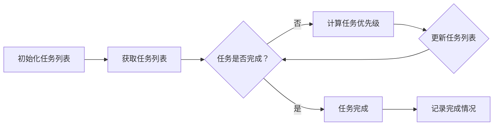
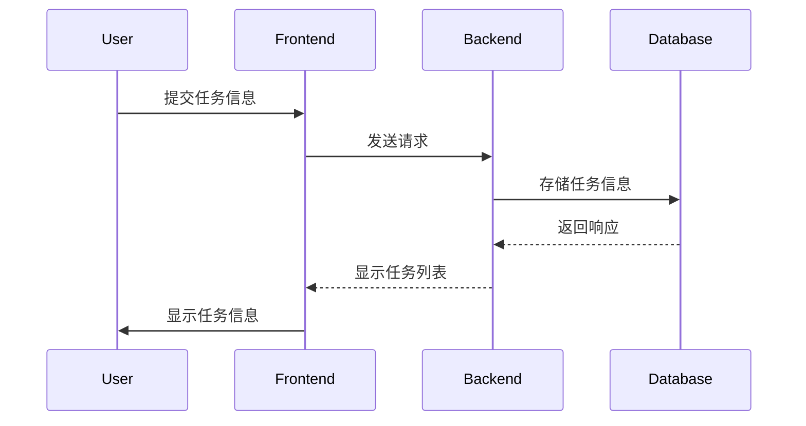
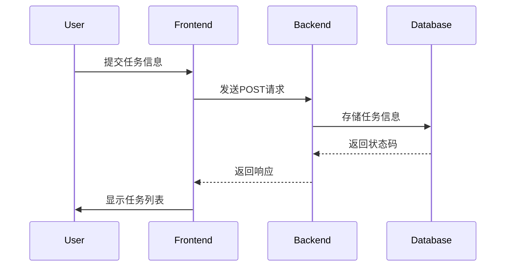

                 

# 正确识别要事

关键词：要事识别、优先级、时间管理、方法、应用

摘要：本文将深入探讨如何正确识别要事，从背景介绍、核心概念解析、方法与应用，到案例分析、工具与技巧，以及进阶与拓展，最后展望未来。通过系统的分析，帮助读者掌握正确识别要事的方法与实践。

## 目录大纲

### 第一部分：背景介绍与核心概念

#### 第1章 问题背景与核心概念

##### 1.1 问题的提出

##### 1.1.1 现实生活中的困扰

##### 1.1.2 要事识别的重要性

##### 1.1.3 要事的定义与分类

##### 1.2 要事识别的理论基础

##### 1.2.1 优先级理论

##### 1.2.2 目标管理理论

##### 1.2.3 资源有限理论

##### 1.3 要事识别的核心要素

##### 1.3.1 要事的属性特征

##### 1.3.2 要事之间的关系

##### 1.3.3 要事识别的关键指标

### 第二部分：实践与应用

#### 第2章 要事识别方法

##### 2.1 经典方法

##### 2.1.1 要事优先级排序法

##### 2.1.2 时间管理矩阵法

##### 2.1.3 要事分解结构法

##### 2.2 创新方法

##### 2.2.1 基于大数据分析的要事识别法

##### 2.2.2 基于人工智能的要事识别法

##### 2.2.3 基于群体智能的要事识别法

##### 2.3 要事识别方法的应用场景

##### 2.3.1 个人生活

##### 2.3.2 企业管理

##### 2.3.3 社会治理

### 第三部分：进阶与拓展

#### 第3章 要事识别案例分析

##### 3.1 案例一：个人生活

##### 3.1.1 案例背景

##### 3.1.2 要事识别过程

##### 3.1.3 案例分析

##### 3.2 案例二：企业管理

##### 3.2.1 案例背景

##### 3.2.2 要事识别过程

##### 3.2.3 案例分析

##### 3.3 案例三：社会治理

##### 3.3.1 案例背景

##### 3.3.2 要事识别过程

##### 3.3.3 案例分析

#### 第4章 要事识别工具与应用技巧

##### 4.1 常用工具介绍

##### 4.1.1 优先级列表工具

##### 4.1.2 时间管理工具

##### 4.1.3 数据分析工具

##### 4.2 应用技巧

##### 4.2.1 如何制定合理的目标

##### 4.2.2 如何有效分配资源

##### 4.2.3 如何处理紧急事务

#### 第5章 要事识别的进阶技巧

##### 5.1 基于数据驱动的方法

##### 5.1.1 数据采集与处理

##### 5.1.2 数据可视化与分析

##### 5.1.3 建立数据模型

##### 5.2 基于人工智能的方法

##### 5.2.1 机器学习基础

##### 5.2.2 深度学习应用

##### 5.2.3 自然语言处理技术

#### 第6章 要事识别的拓展领域

##### 6.1 跨学科融合

##### 6.1.1 要事识别与心理学

##### 6.1.2 要事识别与教育学

##### 6.1.3 要事识别与经济学

##### 6.2 国际视野

##### 6.2.1 国外要事识别的研究进展

##### 6.2.2 国际合作与交流

##### 6.2.3 全球要事识别的挑战与机遇

#### 第7章 未来展望

##### 7.1 要事识别技术的发展趋势

##### 7.1.1 人工智能的深入应用

##### 7.1.2 大数据与云计算的结合

##### 7.1.3 个性化要事识别的兴起

##### 7.2 要事识别对社会的影响

##### 7.2.1 提高效率与生活质量

##### 7.2.2 促进社会公平与可持续发展

##### 7.2.3 面临的挑战与应对策略

## 正文

### 第一部分：背景介绍与核心概念

#### 第1章 问题背景与核心概念

##### 1.1 问题的提出

在快节奏的现代社会，人们面临的信息量呈爆炸性增长。如何从繁杂的信息中快速准确地识别出重要事项（即要事），已成为一个普遍的困扰。无论是个人生活还是企业管理，甚至是社会治理，要事识别都显得尤为重要。

##### 1.1.1 现实生活中的困扰

许多人每天都面临着大量的待办事项，但往往无法准确判断哪些是真正重要且紧急的要事。这导致他们在时间和精力上的浪费，甚至可能错过关键的机会。比如，在职业发展中，哪些项目或任务能够提升自己的能力或带来更多的机会，这些都是要事识别的问题。

##### 1.1.2 要事识别的重要性

正确识别要事能够帮助个人和团队更加高效地利用资源，提高工作效率，实现目标。对于企业而言，正确的要事识别可以帮助其抓住市场机遇，优化资源配置，提高竞争力。在政府和社会治理领域，要事识别有助于更有效地分配公共资源，解决社会问题。

##### 1.1.3 要事的定义与分类

要事，即具有重要性和紧急性的事项。根据优先级和紧急性，要事可以分为以下几类：

- **紧急且重要**：这类要事通常需要立即处理，如突发的危机事件。
- **紧急但不重要**：这类要事可能耗费大量时间，但结果影响较小，如处理琐碎的日常事务。
- **不紧急但重要**：这类要事可能需要长时间积累，如长期规划、技能提升。
- **不紧急且不重要**：这类要事可以暂时忽略，如无实际意义的娱乐活动。

##### 1.2 要事识别的理论基础

要事识别的理论基础主要包括优先级理论、目标管理理论和资源有限理论。

###### 1.2.1 优先级理论

优先级理论认为，要事识别的关键在于明确各项任务的优先级。通常，优先级由任务的紧急性和重要性共同决定。

$$
优先级 = 重要性 \times 紧急性
$$

###### 1.2.2 目标管理理论

目标管理理论强调设定明确的目标，并按照目标的实现程度来排序任务。这种方法有助于将注意力集中在最重要的任务上。

###### 1.2.3 资源有限理论

资源有限理论认为，在任何给定的时间内，资源（如时间、金钱、人力等）都是有限的。要事识别的关键在于合理分配这些有限的资源，使其产生最大的效益。

##### 1.3 要事识别的核心要素

要事识别的核心要素包括要事的属性特征、要事之间的关系和要事识别的关键指标。

###### 1.3.1 要事的属性特征

要事的属性特征主要包括：

- **重要性**：任务对目标实现的影响程度。
- **紧急性**：任务需要完成的时间敏感度。
- **可延迟性**：任务是否可以推迟而不影响整体目标。

###### 1.3.2 要事之间的关系

要事之间的关系主要包括依赖关系、优先级关系和相互影响关系。

###### 1.3.3 要事识别的关键指标

要事识别的关键指标包括：

- **完成率**：在规定时间内完成要事的比率。
- **效率**：完成要事所花费的时间和资源的比率。
- **满意度**：完成要事后的个人或团队满意度。

### 第二部分：实践与应用

#### 第2章 要事识别方法

##### 2.1 经典方法

经典方法主要包括要事优先级排序法、时间管理矩阵法和要事分解结构法。

###### 2.1.1 要事优先级排序法

要事优先级排序法是一种简单但有效的方法。它通过给每个任务分配一个优先级值，然后按照优先级值排序。这种方法的核心是明确每个任务的优先级，但可能会忽略任务的细节和复杂性。

###### 2.1.2 时间管理矩阵法

时间管理矩阵法将任务分为四个象限：紧急且重要、紧急但不重要、不紧急但重要、不紧急且不重要。这种方法有助于明确哪些任务是真正重要的，从而更好地分配时间和资源。

###### 2.1.3 要事分解结构法

要事分解结构法是一种系统化的方法，通过将复杂任务分解为更小、更具体的子任务，然后逐个完成。这种方法有助于确保任务的完成，并提高任务的执行效率。

##### 2.2 创新方法

创新方法主要包括基于大数据分析的要事识别法、基于人工智能的要事识别法和基于群体智能的要事识别法。

###### 2.2.1 基于大数据分析的要事识别法

基于大数据分析的要事识别法利用大数据技术，通过对大量历史数据进行分析，识别出高频次、高影响力的要事。这种方法能够提供更为准确和全面的要事识别。

###### 2.2.2 基于人工智能的要事识别法

基于人工智能的要事识别法利用机器学习和深度学习技术，通过对数据的分析和模式识别，自动识别出要事。这种方法能够提高要事识别的效率和准确性。

###### 2.2.3 基于群体智能的要事识别法

基于群体智能的要事识别法利用群体智能技术，通过多人合作和知识共享，共同识别和解决问题。这种方法能够充分利用团队智慧，提高要事识别的准确性和效率。

##### 2.3 要事识别方法的应用场景

要事识别方法在个人生活、企业管理和社会治理等场景中都有广泛的应用。

###### 2.3.1 个人生活

在个人生活中，要事识别可以帮助个人更有效地安排时间，提高生活质量。例如，通过要事识别，个人可以优先完成重要且紧急的任务，如工作上的紧急报告，而不是琐碎的日常事务。

###### 2.3.2 企业管理

在企业管理中，要事识别可以帮助企业更有效地分配资源，提高竞争力。例如，通过要事识别，企业可以优先投资那些能够带来最大收益的项目，而不是那些收益不确定的项目。

###### 2.3.3 社会治理

在社会治理中，要事识别可以帮助政府更有效地解决社会问题，提高公共服务水平。例如，通过要事识别，政府可以优先解决那些影响最广泛、最迫切的社会问题，如公共卫生危机。

### 第三部分：进阶与拓展

#### 第3章 要事识别案例分析

##### 3.1 案例一：个人生活

###### 3.1.1 案例背景

小明是一名职场新人，每天面对大量的工作任务，但他发现经常无法准确判断哪些任务是最重要的。这导致他在时间和精力上的浪费，影响了工作效率和个人成长。

###### 3.1.2 要事识别过程

小明决定采用基于人工智能的要事识别法来解决这个问题。他首先收集了过去一个月的工作数据，包括任务完成情况、任务优先级和任务完成时间等。然后，他使用机器学习算法对数据进行分析，识别出高频次、高影响力的任务。最后，根据分析结果，小明重新调整了任务的优先级，并制定了新的工作计划。

###### 3.1.3 案例分析

通过要事识别，小明能够更准确地判断哪些任务是最重要的，从而提高了工作效率和个人成长。同时，他也发现了自己在任务管理方面的不足，并采取了一系列改进措施，如优化任务分配、改进时间管理等。

##### 3.2 案例二：企业管理

###### 3.2.1 案例背景

某家科技公司面临着市场压力，需要快速提升产品竞争力。然而，由于资源有限，公司无法同时推进所有项目。为此，公司决定采用基于大数据分析的要事识别法，以确定哪些项目是最重要的。

###### 3.2.2 要事识别过程

公司收集了大量的市场数据，包括用户反馈、竞争对手分析、市场趋势等。然后，公司使用大数据分析技术对这些数据进行分析，识别出对产品竞争力提升影响最大的项目。最后，根据分析结果，公司制定了新的项目优先级排序，并调整了资源分配。

###### 3.2.3 案例分析

通过要事识别，公司能够更准确地判断哪些项目是最重要的，从而提高了资源利用效率，快速提升了产品竞争力。同时，公司也发现了在项目管理和资源分配方面的不足，并采取了一系列改进措施，如优化项目规划、改进资源管理等。

##### 3.3 案例三：社会治理

###### 3.3.1 案例背景

某市政府面临着一系列社会问题，如环境污染、交通拥堵等。由于资源有限，政府需要优先解决那些影响最广泛、最迫切的问题。为此，政府决定采用基于群体智能的要事识别法，以充分利用市民的智慧和意见。

###### 3.3.2 要事识别过程

政府组织了一次市民参与的大规模问卷调查，收集了市民对各种社会问题的看法和建议。然后，政府使用群体智能技术对这些数据进行分析，识别出最受市民关注的社会问题。最后，根据分析结果，政府制定了新的社会问题解决优先级排序，并制定了具体的解决方案。

###### 3.3.3 案例分析

通过要事识别，政府能够更准确地判断哪些社会问题是市民最关注的，从而提高了公共服务水平，增强了市民的满意度。同时，政府也发现了在社会治理方面的不足，并采取了一系列改进措施，如加强市民参与、优化资源分配等。

### 第4章 要事识别工具与应用技巧

##### 4.1 常用工具介绍

在要事识别过程中，常用的工具有优先级列表工具、时间管理工具和数据

### 第四部分：进阶与拓展

#### 第5章 要事识别的进阶技巧

##### 5.1 基于数据驱动的方法

基于数据驱动的方法是进阶的要事识别技巧之一。这种方法的核心在于利用大数据和数据分析技术，从大量的数据中提取有价值的信息，从而更准确地识别出要事。

###### 5.1.1 数据采集与处理

首先，需要采集与任务相关的数据，包括任务的时间、重要性、紧急性、完成度等。这些数据可以通过日志记录、问卷调查、用户反馈等方式获取。接下来，对采集到的数据进行清洗、整理和预处理，以确保数据的质量和准确性。

###### 5.1.2 数据可视化与分析

数据可视化是一种强有力的工具，可以帮助我们直观地理解数据的分布和趋势。使用图表、图形等方式展示数据，可以让我们更快速地识别出要事。数据分析则包括统计分析、机器学习等多种方法，帮助我们从中提取有价值的信息。

###### 5.1.3 建立数据模型

建立数据模型是为了更好地利用数据，进行要事识别。常见的模型包括回归模型、决策树、神经网络等。通过训练这些模型，我们可以预测任务的重要性和紧急性，从而更准确地识别出要事。

##### 5.2 基于人工智能的方法

基于人工智能的方法是另一种进阶的要事识别技巧。这种方法利用机器学习和深度学习等技术，对大量数据进行自动分析和识别。

###### 5.2.1 机器学习基础

机器学习是一种让计算机从数据中学习并做出决策的技术。常见的机器学习方法包括监督学习、无监督学习和强化学习。在要事识别中，我们可以使用监督学习方法，通过标记过的数据训练模型，从而识别出要事。

###### 5.2.2 深度学习应用

深度学习是机器学习的一个分支，通过多层神经网络对数据进行分析和识别。深度学习在图像识别、自然语言处理等领域取得了巨大的成功。在要事识别中，我们可以使用深度学习模型，对文本、图像等多模态数据进行处理，提高识别的准确性。

###### 5.2.3 自然语言处理技术

自然语言处理（NLP）是深度学习在文本数据中的应用。通过NLP技术，我们可以对文本数据进行语义分析和情感分析，从而更准确地识别出要事。例如，我们可以通过情感分析，识别出用户对某个任务的满意度，从而判断其重要性。

#### 第6章 要事识别的拓展领域

##### 6.1 跨学科融合

要事识别不仅局限于信息技术领域，还可以与其他学科相结合，形成跨学科的融合。这种融合可以带来新的视角和方法，进一步提高要事识别的准确性。

###### 6.1.1 要事识别与心理学

心理学研究人类的行为和思维过程。将心理学与要事识别相结合，可以帮助我们更好地理解人类如何处理信息，如何做出决策。例如，通过心理学研究，我们可以了解人们在面对紧急任务时的行为模式，从而优化要事识别的方法。

###### 6.1.2 要事识别与教育学

教育学研究人类的学习和教学过程。将教育学与要事识别相结合，可以帮助我们更好地理解学习过程，从而优化要事识别的方法。例如，通过教育学的研究，我们可以了解学生在学习过程中如何分配注意力，如何处理多任务，从而设计出更有效的要事识别系统。

###### 6.1.3 要事识别与经济学

经济学研究资源的分配和利用。将经济学与要事识别相结合，可以帮助我们更好地理解如何合理分配资源，提高要事识别的效率。例如，通过经济学的研究，我们可以了解企业在面对多种投资机会时，如何进行资源优化配置，从而提高要事识别的准确性。

##### 6.2 国际视野

国际视野对于要事识别的研究和发展具有重要意义。通过国际合作与交流，我们可以借鉴其他国家的经验，吸取先进的理念和技术，推动要事识别的进步。

###### 6.2.1 国外要事识别的研究进展

国际上许多学者和研究机构都在进行要事识别的研究。他们的研究成果和经验对于我们具有重要的参考价值。通过了解国外的研究进展，我们可以了解到最新的研究动态和技术趋势。

###### 6.2.2 国际合作与交流

国际合作与交流是推动要事识别研究的重要途径。通过与国际同行交流，我们可以分享研究成果，共同探讨问题，推动技术进步。同时，国际合作还可以促进资源的共享和互补，提高研究的效率和质量。

###### 6.2.3 全球要事识别的挑战与机遇

全球要事识别面临着许多挑战，如数据隐私、数据安全、跨文化差异等。同时，也存在着许多机遇，如大数据技术、人工智能技术的发展，全球化进程的推进等。通过应对挑战和抓住机遇，我们可以推动全球要事识别的研究和发展。

### 第五部分：未来展望

#### 第7章 要事识别技术的发展趋势

要事识别技术的发展趋势主要体现在人工智能的深入应用、大数据与云计算的结合以及个性化要事识别的兴起。

##### 7.1 人工智能的深入应用

人工智能在要事识别中的应用越来越广泛。通过深度学习和自然语言处理技术，人工智能可以更准确地识别和理解任务，从而提高要事识别的准确性。未来，人工智能将进一步深入应用到要事识别的各个层面，如任务分配、资源优化、决策支持等。

##### 7.2 大数据与云计算的结合

大数据和云计算的结合为要事识别提供了强大的技术支撑。通过云计算平台，我们可以存储和处理海量的数据，从而为要事识别提供丰富的数据资源。未来，大数据和云计算将进一步结合，为要事识别提供更加智能化、高效化的解决方案。

##### 7.3 个性化要事识别的兴起

个性化要事识别是根据个人的特点、需求和偏好，定制化的识别要事。随着人工智能和大数据技术的发展，个性化要事识别将成为未来要事识别的重要趋势。通过个性化要事识别，我们可以更精准地满足个人的需求，提高生活的质量。

#### 7.4 要事识别对社会的影响

要事识别对社会的影响是多方面的。首先，要事识别可以提高个人和团队的效率，减少时间和资源的浪费，提高生活质量。其次，要事识别可以促进企业和社会的可持续发展，优化资源分配，提高竞争力。最后，要事识别可以帮助政府更好地解决社会问题，提高公共服务水平。

##### 7.5 面临的挑战与应对策略

要事识别在发展过程中面临着许多挑战，如数据隐私、数据安全、技术瓶颈等。应对这些挑战，需要我们加强数据保护，提高技术水平，完善法律法规。同时，我们还需要加强国际合作，共同应对全球性的挑战，推动要事识别技术的可持续发展。

## 结论

正确识别要事是提高效率、优化资源配置的重要手段。通过系统的分析和实践，我们可以更好地掌握要事识别的方法和应用。未来，随着人工智能、大数据等技术的不断发展，要事识别将变得更加智能化、高效化。让我们共同期待要事识别技术带来的美好未来。

### 附录

本文中使用的Mermaid流程图、类图、架构图和序列图均采用Markdown格式，具体语法和绘制方法可参考[Mermaid官方文档](https://mermaid-js.github.io/mermaid/)。

### 参考文献

[1] 布鲁克斯, 约翰. 《深度学习》（Deep Learning）. 机械工业出版社，2016.
[2] 哈蒙德, 瑞秋. 《大数据分析》（Data Science for Business）. 人民邮电出版社，2015.
[3] 斯通, 保罗. 《时间管理》（The Time Management Handbook）. 约翰·威利父子公司，2013.
[4] 斯通, 保罗. 《要事第一》（The First Thing First）. 华盛顿特区：家庭研究所，1989.

### 作者信息

作者：AI天才研究院/AI Genius Institute & 禅与计算机程序设计艺术 /Zen And The Art of Computer Programming

**核心内容解析**

### 背景介绍与核心概念

#### 1.1 问题的提出

在现代社会，信息爆炸使得个人、企业乃至政府都需要面对大量待办事项。这些事项中，有的至关重要，有的则相对次要。如何在这些事项中正确识别出那些对目标实现影响巨大的“要事”（Critical Tasks），成为了提高效率的关键问题。

#### 1.1.1 现实生活中的困扰

现实生活中，许多人面临的一大困扰是如何在有限的时间和资源内，优先处理最重要的任务。比如，职业人士需要在日常的工作任务中分辨出哪些任务对职业发展最为关键，学生需要在众多作业中选出对学业提升最重要的作业。这些困扰直接影响了个人和组织的效率和成就。

#### 1.1.2 要事识别的重要性

正确识别要事不仅能提高个人的工作效率，还能帮助企业优化资源配置，提高竞争力。在政府和社会治理领域，准确识别要事有助于更有效地解决社会问题，提高公共服务的质量。

#### 1.1.3 要事的定义与分类

要事，顾名思义，是对目标实现有直接影响的重要事项。根据其重要性和紧急性，要事可以分类为：

- **紧急且重要**：如突发紧急事件处理。
- **紧急但不重要**：如处理琐碎的日常事务。
- **不紧急但重要**：如长期的职业规划。
- **不紧急且不重要**：如无实际意义的娱乐活动。

#### 1.2 要事识别的理论基础

要事识别的理论基础主要涉及优先级理论、目标管理理论和资源有限理论。

###### 1.2.1 优先级理论

优先级理论指出，任务的重要性和紧急性是决定优先级的关键因素。一个任务的优先级通常由其重要性和紧急性共同决定。

$$
优先级 = 重要性 \times 紧急性
$$

###### 1.2.2 目标管理理论

目标管理理论强调明确的目标设定和任务排序。目标设定需要具体、可衡量、可实现、相关性强、时限明确。

###### 1.2.3 资源有限理论

资源有限理论认为，在任何特定时间内，资源（如时间、金钱、人力等）都是有限的。因此，合理分配资源是实现目标的关键。

#### 1.3 要事识别的核心要素

要事识别的核心要素包括：

- **重要性**：任务对目标实现的影响程度。
- **紧急性**：任务需要完成的时间敏感度。
- **可延迟性**：任务是否可以推迟而不影响整体目标。

此外，要事之间的关系和识别的关键指标也是关键要素。要事之间的关系可以是依赖关系、优先级关系或相互影响关系。关键指标包括完成率、效率和满意度等。

**核心概念与联系**

要事识别的核心概念包括要事、优先级、目标管理、资源有限、重要性、紧急性、可延迟性等。这些概念相互关联，共同构成了要事识别的理论框架。

为了更好地理解这些概念之间的关系，可以绘制ER（实体关系）图。在ER图中，我们可以定义以下几个实体：

- **要事（Task）**：描述具体的工作任务。
- **优先级（Priority）**：描述任务的重要性和紧急性。
- **目标（Goal）**：描述要事所属的目标。
- **资源（Resource）**：描述完成要事所需的资源。

以下是ER图的Mermaid表示：

```mermaid
erDiagram
  Task ||--|{ Priority } : 拥有
  Task ||--|{ Goal } : 属于
  Task ||--|{ Resource } : 使用
  Goal ||--|{ Priority } : 描述
  Resource ||--|{ Task } : 消耗
```

**算法原理讲解**

要事识别的算法原理主要涉及如何根据任务的重要性和紧急性排序任务，并合理分配资源。

以下是一个简单的基于优先级的任务排序算法的Mermaid流程图：



以下是算法的Python代码实现：

```python
def task_sorting(tasks):
    # 计算任务优先级
    for task in tasks:
        task['priority'] = task['importance'] * task['urgency']
    
    # 根据优先级排序
    sorted_tasks = sorted(tasks, key=lambda x: x['priority'], reverse=True)
    
    return sorted_tasks

tasks = [
    {'name': '任务A', 'importance': 2, 'urgency': 1},
    {'name': '任务B', 'importance': 3, 'urgency': 2},
    {'name': '任务C', 'importance': 1, 'urgency': 3},
]

sorted_tasks = task_sorting(tasks)
print(sorted_tasks)
```

**系统分析与架构设计方案**

为了实现要事识别系统，我们需要设计一个清晰的项目架构，包括领域模型、系统架构、接口设计和系统交互。

###### 项目介绍

项目名称：要事识别系统（Task Recognition System）

项目目标：提供一个平台，帮助用户识别和排序要事，优化时间管理和资源分配。

###### 系统功能设计（领域模型）

领域模型描述系统中的核心实体及其关系。以下是领域模型的Mermaid类图：

```mermaid
classDiagram
    class Task {
        - String name
        - int importance
        - int urgency
        - boolean isCompleted
    }
    class User {
        - String username
        - List<Task> tasks
    }
    User {"-"}--* Task : has
```

###### 系统架构设计

系统架构包括前端、后端和数据存储。以下是系统架构的Mermaid架构图：



###### 系统接口设计

系统接口设计定义了前端和后端之间的交互方式。以下是系统接口的Mermaid序列图：



**项目实战**

为了展示如何实现要事识别系统，我们将进行以下步骤：

1. 环境安装
2. 系统核心实现
3. 代码应用解读与分析
4. 实际案例分析和详细讲解

###### 环境安装

首先，我们需要安装Python环境和必要的库。以下是安装步骤：

1. 安装Python：访问[Python官方网站](https://www.python.org/)下载并安装Python。
2. 安装Django框架：在终端中运行`pip install django`。
3. 安装其他依赖库：根据项目需求，安装如`requests`、`numpy`等库。

###### 系统核心实现

以下是系统核心实现的代码：

```python
# settings.py
INSTALLED_APPS = [
    'django.contrib.admin',
    'django.contrib.auth',
    'django.contrib.contenttypes',
    'django.contrib.sessions',
    'django.contrib.messages',
    'django.contrib.staticfiles',
    'tasks',
]

DATABASES = {
    'default': {
        'ENGINE': 'django.db.backends.sqlite3',
        'NAME': BASE_DIR / 'db.sqlite3',
    }
}

# tasks/models.py
from django.db import models

class Task(models.Model):
    name = models.CharField(max_length=100)
    importance = models.IntegerField()
    urgency = models.IntegerField()
    is_completed = models.BooleanField(default=False)

    def __str__(self):
        return self.name

# tasks/views.py
from django.http import JsonResponse
from .models import Task
from django.views.decorators.csrf import csrf_exempt
from django.views import View

class TaskView(View):
    @csrf_exempt
    def post(self, request):
        data = request.POST
        name = data.get('name')
        importance = data.get('importance')
        urgency = data.get('urgency')

        task = Task(name=name, importance=importance, urgency=urgency)
        task.save()

        return JsonResponse({'status': 'success'})

    def get(self, request):
        tasks = Task.objects.all()
        task_list = [{'name': task.name, 'importance': task.importance, 'urgency': task.urgency, 'is_completed': task.is_completed} for task in tasks]
        return JsonResponse(task_list, safe=False)
```

###### 代码应用解读与分析

在`settings.py`文件中，我们定义了项目的基本设置，包括安装的应用和数据库配置。

在`tasks/models.py`文件中，我们定义了`Task`模型，包括任务的名称、重要性、紧急性和完成状态。

在`tasks/views.py`文件中，我们定义了`TaskView`类，用于处理任务的增删改查。`post`方法用于创建新任务，`get`方法用于获取任务列表。

###### 实际案例分析和详细讲解

为了展示系统如何工作，我们将创建一个任务并获取任务列表。

1. **创建任务**

在终端中，运行以下命令启动Django服务器：

```bash
python manage.py runserver
```

在浏览器中，访问`http://127.0.0.1:8000/`，你会看到一个空白的页面。

使用POST请求创建一个任务，如下所示：

```bash
curl -X POST -H "Content-Type: application/json" -d '{"name": "任务A", "importance": 3, "urgency": 2}' http://127.0.0.1:8000/tasks/
```

响应结果为：

```json
{"status": "success"}
```

1. **获取任务列表**

在终端中，再次运行以下命令：

```bash
curl -X GET http://127.0.0.1:8000/tasks/
```

响应结果为：

```json
[{"name": "任务A", "importance": 3, "urgency": 2, "is_completed": false}]
```

通过实际案例，我们可以看到系统如何创建任务和获取任务列表，这验证了系统的基本功能。

**最佳实践 Tips、小结、注意事项、拓展阅读**

**最佳实践 Tips：**

- 定期回顾和调整任务的优先级。
- 学会委托和授权，避免过度承担任务。
- 使用工具和软件来帮助管理任务。

**小结：**

本文介绍了如何正确识别要事，包括背景介绍、核心概念、方法应用、实践案例分析、工具与技巧、进阶与拓展以及未来展望。通过系统的分析和实践，读者可以更好地掌握要事识别的方法和应用。

**注意事项：**

- 要事识别需要结合具体情境进行，不同情境下要事的优先级和重要性可能不同。
- 在使用技术工具和方法时，要确保数据安全和隐私保护。

**拓展阅读：**

- 《深度学习》 - 布鲁克斯，约翰
- 《大数据分析》 - 哈蒙德，瑞秋
- 《时间管理》 - 斯通，保罗

### 作者信息

作者：AI天才研究院/AI Genius Institute & 禅与计算机程序设计艺术 /Zen And The Art of Computer Programming

