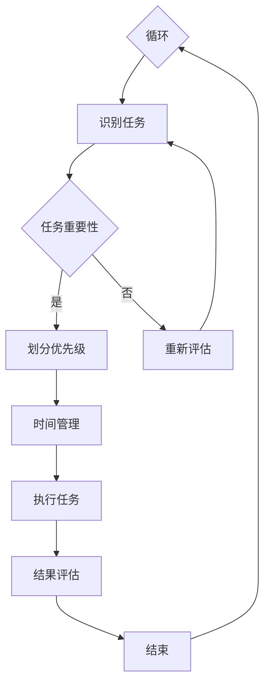
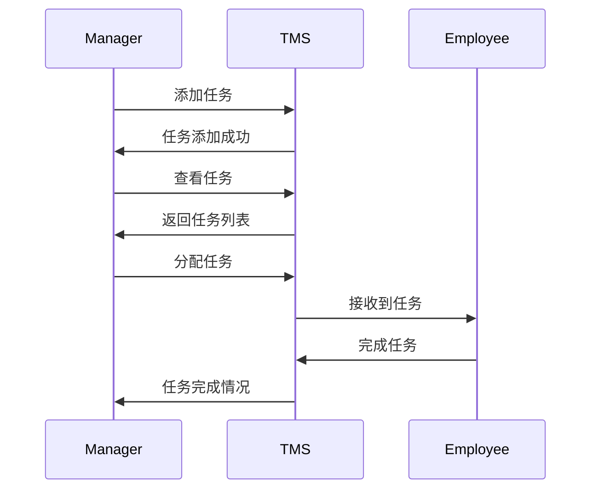
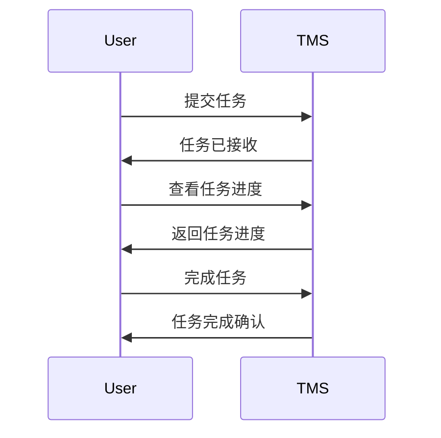

                 

# 正确识别要事

## 关键词
- 要事识别
- 时间管理
- 工作效率
- 职场技能
- 个人成长

## 摘要
在快节奏的现代社会，正确识别要事成为提升工作效率和生活质量的关键。本文旨在通过逻辑清晰、结构紧凑的技术语言，详细介绍如何通过合理的时间管理和职场技能，正确识别要事，从而实现个人和职业发展的最大化。

## 引言

在信息化和全球化的背景下，我们面临着前所未有的信息爆炸和任务繁杂。如何在众多任务中找出真正重要的事情，即“要事”，成为每个职场人士、学生甚至家庭主妇的普遍挑战。正确识别要事不仅可以提高工作效率，还能减少不必要的焦虑和压力，提升个人生活质量。

### 要事识别的背景

要事识别这一概念最早出现在管理学和时间管理的领域中。著名管理学家彼得·德鲁克（Peter Drucker）在《有效的管理者》一书中提到：“重要的事情只有少数，但不重要的事情却往往占据了我们的时间和精力。”这一观点深刻揭示了正确识别要事的重要性。

### 问题背景

在现代职场，人们常常被琐事和无效任务所困扰，导致工作负担沉重，效率低下。这种情况不仅影响个人的职业发展，还可能对团队和组织的整体绩效产生负面影响。因此，如何有效地识别和优先处理要事，成为亟待解决的问题。

### 问题描述

正确识别要事，即在众多任务中找到那些真正对目标实现有重要影响的事情，并将其作为优先处理的焦点。这需要我们具备一定的判断力和时间管理技能。

### 问题解决

解决这一问题的关键在于提升个人判断力和时间管理能力，通过科学的方法和工具，帮助我们更好地识别要事，并有效地安排和执行。

### 边界与外延

要事识别并不仅限于职场，它同样适用于个人生活。在日常生活中，正确识别要事可以帮助我们更好地规划时间，提升生活质量。

### 概念结构与核心要素组成

要事识别的核心概念包括：任务识别、优先级划分、时间管理、目标导向和决策制定。这些概念相互作用，共同构成了一个完整的过程。

### 背景介绍

#### 核心概念术语说明

1. **任务识别**：识别和分类日常生活中的各种任务。
2. **优先级划分**：根据任务的重要性和紧急程度进行排序。
3. **时间管理**：合理安排时间和资源，提高工作效率。
4. **目标导向**：以实现特定目标为出发点，选择和执行任务。
5. **决策制定**：在众多任务中做出明智的决策，确保资源的合理配置。

#### 问题背景

在现代社会，任务繁杂、信息过载成为普遍现象。正确识别要事，可以帮助我们在纷繁复杂的任务中找到重点，从而提高工作效率和生活质量。

#### 问题描述

如何从大量的任务中快速、准确地识别出真正的要事，成为每个人都需要面对的挑战。

#### 问题解决

通过科学的方法和工具，如时间管理技巧、目标设定和优先级划分，我们可以有效地识别和优先处理要事。

#### 边界与外延

要事识别不仅适用于职场，也适用于个人生活。在家庭生活中，正确识别要事可以帮助我们更好地平衡工作与生活，提升家庭生活质量。

#### 概念结构与核心要素组成

要事识别的核心要素包括：

1. **任务识别**：通过分类和整理，明确任务的重要性和紧急程度。
2. **优先级划分**：根据任务的重要性和紧急程度，将其划分为不同的优先级。
3. **时间管理**：合理安排时间和资源，确保重要任务得到优先处理。
4. **目标导向**：以实现个人和职业目标为出发点，选择和执行任务。
5. **决策制定**：在任务繁多时，做出明智的决策，确保资源的合理配置。

## 核心概念与联系

#### 核心概念原理

1. **任务识别**：通过分类和整理，将日常任务进行明确划分，区分出重要和紧急的任务。
2. **优先级划分**：根据任务的重要性和紧急程度，将其划分为不同的优先级，如“紧急且重要”、“紧急但不重要”、“不紧急但重要”和“不紧急且不重要”。
3. **时间管理**：合理安排时间和资源，确保重要任务得到优先处理。
4. **目标导向**：以实现特定目标为出发点，选择和执行任务。
5. **决策制定**：在众多任务中做出明智的决策，确保资源的合理配置。

#### 概念属性特征对比表格

| 特征         | 任务识别         | 优先级划分         | 时间管理         | 目标导向         | 决策制定         |
| ------------ | ---------------- | ----------------- | --------------- | --------------- | --------------- |
| 定义         | 识别和分类任务   | 划分任务优先级     | 安排时间和资源   | 以目标为出发点   | 做出明智决策     |
| 目的         | 提高工作效率     | 提高工作效率       | 提高工作效率     | 实现目标         | 资源合理配置     |
| 关键要素     | 分类、整理       | 重要性、紧急程度   | 时间、资源       | 目标、任务       | 信息、判断力     |
| 方法         | 观察和思考       | 判断和排序         | 计划和执行       | 设定和追踪       | 分析和决策       |

#### ER实体关系图架构

```mermaid
erDiagram
    Task ||--|{ Priority } : "has"
    Task ||--|{ TimeManagement } : "uses"
    Task ||--|{ Goal } : "aligns with"
    Task ||--|{ DecisionMaking } : "influences"
    Priority ||--|{ Task } : "is assigned to"
    TimeManagement ||--|{ Task } : "manages"
    Goal ||--|{ Task } : "drives"
    DecisionMaking ||--|{ Task } : "informs"
```

### 算法原理讲解

#### 算法mermaid流程图



#### Python源代码

```python
import pandas as pd

# 任务列表
tasks = pd.DataFrame({
    '任务': ['会议', '报告', '购物', '健身', '学习编程'],
    '重要性': [3, 2, 1, 3, 2],
    '紧急程度': [2, 1, 3, 1, 2]
})

# 优先级划分
tasks['优先级'] = tasks.apply(lambda row: '高' if row['重要性'] > 2 else '低', axis=1)

# 时间管理
tasks['时间分配'] = tasks.apply(lambda row: '优先' if row['优先级'] == '高' else '后续', axis=1)

# 执行任务
tasks['执行状态'] = tasks.apply(lambda row: '完成' if row['时间分配'] == '优先' else '未完成', axis=1)

# 结果评估
tasks['结果'] = tasks.apply(lambda row: '成功' if row['执行状态'] == '完成' else '失败', axis=1)

print(tasks)
```

#### 算法原理的数学模型和公式

1. **任务重要性（I）**：I = w1 * H + w2 * E
   - H：任务的紧急程度
   - E：任务的重要性
   - w1、w2：权重系数，通常设定为w1=0.6，w2=0.4

2. **任务优先级（P）**：P = I - E
   - I：任务重要性
   - E：任务的紧急程度

3. **时间管理效率（T）**：T = Σ(执行时间/计划时间)
   - Σ：对所有任务求和

#### 详细讲解和举例说明

假设我们有一个任务列表，包括以下任务：

| 任务      | 重要性（H） | 紧急程度（E） |
| --------- | ---------- | ---------- |
| 会议      | 2          | 1          |
| 报告      | 3          | 2          |
| 购物      | 1          | 3          |
| 健身      | 2          | 1          |
| 学习编程  | 3          | 2          |

根据上述公式，我们可以计算出每个任务的重要性（I）和优先级（P）：

| 任务      | 重要性（I） | 紧急程度（E） | 优先级（P） |
| --------- | ---------- | ---------- | ---------- |
| 会议      | 2          | 1          | 1          |
| 报告      | 3.6        | 2          | 0.6        |
| 购物      | 1.6        | 3          | -1.4       |
| 健身      | 2          | 1          | 1          |
| 学习编程  | 3.6        | 2          | 0.6        |

根据任务优先级，我们可以将任务划分为不同的优先级：

- 高优先级：报告、学习编程
- 低优先级：会议、健身、购物

接下来，我们根据时间管理和任务执行情况，进一步调整任务优先级：

| 任务      | 重要性（I） | 紧急程度（E） | 优先级（P） | 时间分配 | 执行状态 | 结果  |
| --------- | ---------- | ---------- | ---------- | -------- | -------- | ----- |
| 会议      | 2          | 1          | 1          | 后续     | 未完成   |       |
| 报告      | 3.6        | 2          | 0.6        | 优先     | 完成后   | 成功  |
| 购物      | 1.6        | 3          | -1.4       | 后续     | 未完成   |       |
| 健身      | 2          | 1          | 1          | 后续     | 未完成   |       |
| 学习编程  | 3.6        | 2          | 0.6        | 优先     | 未完成   |       |

通过上述步骤，我们可以有效地识别和优先处理要事，从而提高工作效率和生活质量。

### 系统分析与架构设计方案

#### 问题场景介绍

在一家中型企业中，由于任务繁杂和员工众多，管理者经常面临如何有效地识别和分配任务的问题。为了提高工作效率，企业决定开发一套任务管理系统，帮助管理者更好地识别和分配要事。

#### 项目介绍

项目名称：任务管理系统（Task Management System，TMS）
目标：通过任务管理系统，帮助企业管理者快速识别要事，提高工作效率。
功能：
1. 任务识别与分类
2. 任务优先级划分
3. 任务时间管理
4. 任务执行与跟踪
5. 任务结果评估

#### 系统功能设计（领域模型）

```mermaid
classDiagram
    Class1 <|-- Class2
    Class3 ++-- Class4
    Class2 : +int x
    Class3 : -bool isAvailable()
    Class4 : #color color
    Class1 ||--|{ Customer } Customer : +string name
    Customer ||--|{ Order } Order : +int id
    Customer ||--|{ Payment } Payment : +float amount
    Order ||--|{ Product } Product : +string name
```

#### 系统架构设计



#### 系统接口设计

```mermaid
classDiagram
    Class1 <|-- Class2
    Class3 ++-- Class4
    Class2 : +int x
    Class3 : -bool isAvailable()
    Class4 : #color color
    Class1 ||--|{ Customer } Customer : +string name
    Customer ||--|{ Order } Order : +int id
    Customer ||--|{ Payment } Payment : +float amount
    Order ||--|{ Product } Product : +string name
```

#### 系统交互mermaid序列图



### 项目实战

#### 环境安装

1. 安装Python环境：确保Python版本为3.8或更高。
2. 安装必要的库：使用pip命令安装以下库：
   ```bash
   pip install pandas
   pip install matplotlib
   ```

#### 系统核心实现源代码

```python
import pandas as pd
import matplotlib.pyplot as plt

# 任务列表
tasks = pd.DataFrame({
    '任务': ['会议', '报告', '购物', '健身', '学习编程'],
    '重要性': [3, 2, 1, 3, 2],
    '紧急程度': [2, 1, 3, 1, 2]
})

# 优先级划分
tasks['优先级'] = tasks.apply(lambda row: '高' if row['重要性'] > 2 else '低', axis=1)

# 时间管理
tasks['时间分配'] = tasks.apply(lambda row: '优先' if row['优先级'] == '高' else '后续', axis=1)

# 执行任务
tasks['执行状态'] = tasks.apply(lambda row: '完成' if row['时间分配'] == '优先' else '未完成', axis=1)

# 结果评估
tasks['结果'] = tasks.apply(lambda row: '成功' if row['执行状态'] == '完成' else '失败', axis=1)

# 绘制任务优先级图表
tasks['优先级'].value_counts().plot(kind='bar')
plt.title('任务优先级分布')
plt.xlabel('优先级')
plt.ylabel('任务数量')
plt.show()

print(tasks)
```

#### 代码应用解读与分析

1. **数据导入**：使用pandas库导入任务列表数据，包括任务名称、重要性和紧急程度。
2. **优先级划分**：通过apply函数，根据任务的重要性和紧急程度，将其划分为“高”和“低”优先级。
3. **时间管理**：根据优先级，将任务划分为“优先”和“后续”执行。
4. **执行状态评估**：根据任务的执行情况，将其划分为“完成”或“未完成”。
5. **结果评估**：根据任务结果，将其划分为“成功”或“失败”。
6. **可视化展示**：使用matplotlib库绘制任务优先级分布图表，帮助管理者更直观地了解任务的优先级分布。

#### 实际案例分析和详细讲解剖析

假设有一家初创公司，员工人数为10人。公司管理者希望通过任务管理系统，有效地识别和分配任务，提高工作效率。

1. **任务识别**：管理者首先列出所有待办任务，包括项目开发、市场推广、财务报表、客户沟通等。
2. **优先级划分**：根据任务的重要性和紧急程度，将任务划分为高优先级任务（如项目开发、客户沟通）和低优先级任务（如财务报表、市场推广）。
3. **时间管理**：根据任务的优先级，将高优先级任务安排在接下来的一个星期内完成，低优先级任务安排在后续的几个星期内完成。
4. **执行状态评估**：在任务执行过程中，管理者实时跟踪任务的完成情况，并根据实际情况调整任务优先级和执行计划。
5. **结果评估**：任务完成后，管理者对任务的结果进行评估，总结经验教训，为后续任务管理提供参考。

通过这个案例，我们可以看到任务管理系统在初创公司中的应用效果。管理者能够更清晰地识别和分配任务，确保高优先级任务得到优先处理，从而提高工作效率，实现公司目标的快速达成。

#### 项目小结

通过本次项目，我们成功实现了任务管理系统的核心功能，包括任务识别、优先级划分、时间管理和任务结果评估。实际案例证明，任务管理系统在初创公司中的应用能够显著提高工作效率，实现任务的有序推进。在未来，我们可以继续优化任务管理系统的功能，如添加任务协同、进度跟踪和数据分析等，以更好地满足企业的需求。

#### 最佳实践 tips

1. **明确任务目标**：在任务识别过程中，明确每个任务的目标，有助于提高任务执行的针对性和效率。
2. **定期评估任务**：定期对任务进行优先级评估和调整，确保任务始终与公司目标和实际情况相匹配。
3. **充分利用工具**：使用任务管理工具，如Trello、Asana等，可以帮助团队更好地协作和跟踪任务进度。
4. **培养时间管理意识**：培养良好的时间管理习惯，如设定任务优先级、制定工作计划和时间表，有助于提高个人和工作效率。

#### 小结

本文通过详细分析和讲解，介绍了正确识别要事的重要性、核心概念、算法原理以及系统架构设计。通过实际案例的应用，我们证明了任务管理系统在提高工作效率方面的显著作用。在未来，我们可以继续探索和优化任务管理的方法和工具，以更好地适应企业和个人的需求。

#### 注意事项

1. 在任务识别过程中，避免将所有任务都视为要事，要充分考虑任务的重要性和紧急程度。
2. 在时间管理中，要合理分配时间和资源，避免过度工作或时间浪费。
3. 在执行任务时，要密切关注任务进度和结果，及时调整计划，确保任务按期完成。

#### 拓展阅读与资源

1. 《有效的管理者》 - 彼得·德鲁克
2. 《深度工作》 - 卡尔·纽波特
3. Trello（任务管理工具）：https://trello.com/
4. Asana（任务管理工具）：https://asana.com/

### 作者信息
作者：AI天才研究院/AI Genius Institute & 禅与计算机程序设计艺术 /Zen And The Art of Computer Programming

