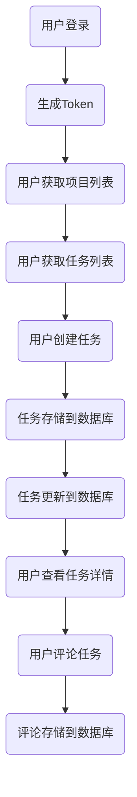
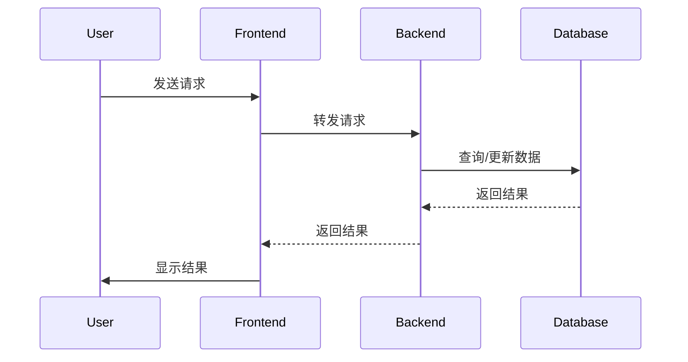

                 

# 沟通要促进目标的达成

## 关键词
- **沟通技巧**、**目标导向**、**团队协作**、**效率提升**、**决策优化**

## 摘要
本文将探讨沟通在促进目标达成中的重要作用。通过分析沟通的基本原理和有效技巧，我们将了解如何通过优化沟通来提升团队协作效率、确保决策优化，最终实现目标的顺利达成。本文将结合实际案例，提供实用的沟通策略和工具，帮助读者在IT领域和日常工作中提升沟通能力。

### 目录大纲设计思路

在着手撰写本文之前，我们需要明确文章的整体结构，以确保内容的逻辑性和系统性。以下是本文的目录大纲设计思路：

1. **背景介绍**：介绍沟通的重要性，明确沟通在目标达成中的作用，为后续内容铺垫。
2. **沟通原理与技巧**：阐述沟通的基本原理和有效技巧，帮助读者理解沟通的核心要素。
3. **沟通案例分析**：通过分析实际案例，展示沟通技巧在目标达成中的具体应用。
4. **沟通策略**：探讨不同情境下的沟通策略，为读者提供实践指南。
5. **沟通工具与技术**：介绍沟通工具和技术的选择与使用，提高沟通效率。
6. **沟通障碍与解决**：分析常见的沟通障碍，并提供解决方法。
7. **沟通实践与反思**：总结沟通的最佳实践，引导读者反思和提升自己的沟通能力。

### 目录大纲

---

## 第一部分：背景介绍

### 第1章：沟通的重要性

### 第2章：沟通的原理与基础

### 第3章：沟通案例分析

---

## 第二部分：沟通原理与技巧

### 第4章：沟通的基础知识

### 第5章：有效沟通的技巧

### 第6章：非语言沟通的力量

---

## 第三部分：沟通案例分析

### 第7章：企业沟通案例

### 第8章：个人沟通案例

---

## 第四部分：沟通策略

### 第9章：不同情境下的沟通策略

### 第10章：沟通策略的制定与实施

---

## 第五部分：沟通工具与技术

### 第11章：沟通工具的选择与使用

### 第12章：沟通技术的提升

---

## 第六部分：沟通障碍与解决

### 第13章：常见的沟通障碍

### 第14章：解决沟通障碍的方法

---

## 第七部分：沟通实践与反思

### 第15章：沟通实践与反思

### 第16章：最佳实践 tips

---

## 参考文献

### 第17章：拓展阅读

---

## 结语：沟通，目标达成的关键

### 联系作者
作者：AI天才研究院/AI Genius Institute & 禅与计算机程序设计艺术 /Zen And The Art of Computer Programming

---

通过以上目录大纲的设计，本文将系统地介绍沟通在促进目标达成中的重要作用，帮助读者提升沟通能力，实现个人和团队的目标。在接下来的部分，我们将逐步深入探讨沟通的基本原理、技巧、案例和策略，为读者提供实用的沟通指南。让我们开始这次思维的旅程吧！## 沟通的重要性

### 沟通的定义与作用

沟通是指信息的传递和交流过程，它涵盖了语言、文字、图像、声音等多种形式。沟通不仅仅局限于口头表达，还包括书面交流、肢体语言、表情等非语言形式。在现代社会中，沟通扮演着至关重要的角色，无论是在个人生活还是职业发展中，都发挥着不可替代的作用。

首先，沟通是信息传递的桥梁。在团队协作中，成员之间需要及时准确地传递信息，以确保项目的顺利进行。通过有效的沟通，团队成员可以共享知识、技能和资源，从而提高工作效率和成果。

其次，沟通是建立人际关系的基石。良好的沟通能够增进人与人之间的了解和信任，促进合作与共赢。在职场中，有效的沟通有助于建立和谐的同事关系，增强团队的凝聚力，从而提升整体工作效率。

此外，沟通是决策过程的重要组成部分。无论是个人决策还是组织决策，都需要基于准确的信息和充分的讨论。通过有效的沟通，决策者可以收集到更多的意见和信息，从而做出更加明智和科学的决策。

### 沟通的目标与挑战

沟通的目标是确保信息的有效传递和理解。为了实现这一目标，沟通需要具备以下几个关键要素：

1. **准确性**：信息在传递过程中应保持准确无误，避免产生误解和歧义。
2. **完整性**：信息应该全面、详尽，涵盖所有相关细节。
3. **及时性**：信息应该及时传递，以便在决策和行动过程中得到有效利用。
4. **适应性**：沟通方式应灵活适应不同的情境和对象，以达到最佳的沟通效果。

然而，在实际沟通过程中，常常面临以下挑战：

1. **语言障碍**：不同的人可能有不同的语言背景和表达习惯，这可能导致沟通的障碍。
2. **文化差异**：不同的文化背景会影响沟通的方式和内容，可能导致误解和冲突。
3. **心理障碍**：个人的心理状态、情绪波动等都会影响沟通的效果。
4. **信息过载**：在信息化时代，人们面临大量的信息，筛选和处理这些信息成为一项挑战。

### 沟通在目标达成中的作用

沟通在目标达成中的作用是多方面的。首先，通过沟通，团队成员可以明确目标，了解各自的角色和责任，从而形成共同的方向和努力。其次，沟通有助于协调团队成员之间的工作，确保各项工作能够高效、有序地进行。此外，沟通还能够及时发现和解决问题，避免目标达成的过程中出现偏差。

在IT领域，项目的成功往往依赖于团队成员之间的密切协作和高效沟通。通过有效的沟通，开发人员、设计师、项目经理等角色可以相互配合，共同应对项目中的各种挑战。同时，客户与开发团队之间的有效沟通也是确保项目需求准确理解和实现的关键。

总的来说，沟通是目标达成的关键。通过优化沟通，我们可以提高团队协作效率，确保信息传递的准确性和及时性，从而更好地实现个人和团队的目标。在接下来的部分，我们将深入探讨沟通的基本原理和有效技巧，帮助读者进一步提升沟通能力。## 沟通原理与基础

### 有效沟通的基本原则

有效沟通是确保信息准确、及时、完整传递的关键。为了实现这一目标，我们需要遵循以下几个基本原则：

1. **明确性**：沟通的信息应该清晰明确，避免产生歧义和误解。这要求我们在表达时使用简单、直接的语言，确保信息传递的准确性。
2. **完整性**：沟通应该涵盖所有相关的信息，避免遗漏重要细节。这有助于接收者全面了解问题，从而做出更加准确的判断和决策。
3. **针对性**：沟通应根据接收者的特点和需求进行调整，确保信息能够被有效理解。这要求我们在沟通前对受众进行分析，选择合适的沟通方式。
4. **及时性**：沟通应该及时进行，避免拖延导致信息过时或失效。及时沟通有助于快速解决问题，确保项目进展顺利。

### 沟通技巧与策略

有效的沟通技巧和策略能够显著提升沟通效率，以下是一些常用的沟通技巧和策略：

1. **倾听**：倾听是有效沟通的基础，通过倾听可以更好地理解对方的观点和需求。在倾听时，我们要做到全神贯注，避免分心，并适当给予反馈。
2. **提问**：提问有助于澄清问题，获取更多信息，并促进双方的思考和讨论。提问时，应确保问题具体、明确，避免引起误解。
3. **表达**：表达技巧是沟通的核心，要求我们使用清晰、简洁、逻辑性强的语言。在表达时，应注意措辞的准确性，避免使用模糊或带有偏见的词汇。
4. **反馈**：反馈是沟通中的重要环节，通过反馈可以确认信息的理解和接收情况。在反馈时，应客观、具体地表达自己的看法，避免直接批评或指责。
5. **非语言沟通**：非语言沟通包括肢体语言、面部表情、姿态等，这些因素在沟通中同样重要。适当的非语言沟通可以增强信息的表达效果，提高沟通的效率。

### 非语言沟通的重要性

非语言沟通在信息传递中发挥着重要作用，有时甚至比语言沟通更为有效。以下是非语言沟通的一些重要方面：

1. **肢体语言**：肢体语言包括手势、姿态、眼神等，可以传达情感、态度和意图。例如，微笑和点头可以表示友好和赞同，而僵硬的姿势和回避眼神可能表示不安或不满。
2. **面部表情**：面部表情可以传达丰富的情感信息，如快乐、愤怒、悲伤等。适当的表情可以增强沟通的效果，使信息更加生动和真实。
3. **姿态**：姿态可以显示个人的自信和态度。站立、坐姿等姿态可以传递出不同的信号，如自信、谦虚等。
4. **空间距离**：空间距离在沟通中也有重要作用，不同的空间距离可以传达不同的信息，如亲密、礼貌、疏远等。

### 沟通案例分析

为了更好地理解沟通原理与技巧的实际应用，我们可以通过以下案例分析来探讨：

**案例一：项目团队沟通**

一个IT项目团队在开发过程中，需要频繁地进行沟通。为了提高沟通效率，团队采用了以下策略：

1. **明确会议议程**：每次会议前，团队都会制定明确的议程，确保会议内容有序进行，避免跑题。
2. **积极倾听与反馈**：团队成员在会议中积极倾听他人的观点，并在适当时候给予反馈，确保信息准确理解。
3. **使用可视化工具**：团队在沟通中广泛使用图表、PPT等可视化工具，以使信息更加直观、易于理解。
4. **非语言沟通**：团队成员在会议中注意使用肢体语言和面部表情，以增强沟通效果。

**案例二：跨文化沟通**

一个国际化的IT公司在与国外客户进行项目沟通时，遇到了文化差异带来的沟通障碍。为了克服这些障碍，公司采取了以下措施：

1. **文化培训**：公司对员工进行了跨文化培训，帮助员工了解不同文化的沟通习惯和礼仪。
2. **使用翻译**：在跨文化沟通中，公司聘请了专业翻译，以确保信息的准确传达。
3. **适应对方的沟通风格**：公司员工在沟通中尽量适应客户的沟通风格，例如在交流中更加直接、简洁。
4. **建立信任关系**：通过积极的沟通和合作，公司逐步建立了与客户的信任关系，提高了沟通效率。

通过以上案例分析，我们可以看到，遵循有效沟通的基本原则，运用恰当的沟通技巧和策略，能够显著提升沟通的效果。在接下来的部分，我们将进一步探讨如何通过沟通技巧来提升团队协作效率和决策质量。这将帮助我们在实现目标的过程中更加顺利、高效。## 沟通案例分析

### 企业沟通案例

#### 背景介绍

某大型IT公司是一家专注于软件开发和解决方案提供的企业，其业务涉及多个行业。公司在发展过程中，面临着快速扩展和项目多样性的挑战。为了确保项目的顺利推进和团队能力的持续提升，公司高度重视内部沟通机制的建设。

#### 案例分析

1. **明确沟通目标**：公司在每个项目启动前，都会明确项目的沟通目标。例如，为了确保项目进度和客户需求的一致，公司制定了详细的沟通计划，包括定期召开项目会议、及时更新项目状态等。

2. **建立多层次的沟通机制**：公司建立了多层次的沟通机制，包括团队内部会议、跨部门协调会议、项目管理会议等。每个层次的会议都有明确的议程和职责分工，确保信息在不同层级之间的有效传递。

3. **利用沟通工具**：公司广泛使用各种沟通工具，如邮件、即时通讯软件、视频会议等，以提高沟通效率。例如，项目团队在解决问题时，会通过即时通讯软件快速交流，确保问题得到及时解决。

4. **培养沟通技巧**：公司定期组织沟通培训，帮助员工提升沟通技巧。例如，通过角色扮演、案例分析等方式，员工能够更好地理解沟通中的难点和技巧，从而在实际工作中更加得心应手。

5. **反馈与改进**：公司鼓励员工在沟通中积极反馈，通过定期的团队评估和项目回顾，发现和改进沟通中的问题，不断提高沟通效果。

#### 案例总结

通过有效的沟通机制和工具，公司成功地克服了项目多样性和快速扩展带来的挑战。团队成员之间的沟通更加顺畅，项目的推进效率显著提升。同时，良好的沟通也为公司带来了客户的高度满意度，进一步增强了公司的市场竞争力。

### 个人沟通案例

#### 背景介绍

李明是一家初创公司的项目经理，负责一个复杂的软件开发项目。项目团队成员来自不同的专业背景，且项目需求不断变化。为了确保项目成功，李明必须具备出色的沟通能力。

#### 案例分析

1. **建立信任**：李明深知建立信任对于团队协作的重要性。因此，他主动与团队成员建立联系，了解他们的需求和期望，从而建立了良好的信任关系。

2. **明确沟通目标**：每个项目阶段，李明都会与团队明确项目的沟通目标。例如，在项目启动阶段，他与团队成员共同制定了详细的项目计划和沟通计划。

3. **定期沟通**：李明每周都会组织团队会议，确保团队成员之间的沟通畅通。在会议中，他会详细讨论项目进展、遇到的问题和解决方案。

4. **使用多种沟通方式**：为了适应团队成员的不同沟通习惯，李明不仅使用面对面会议，还使用电子邮件、即时通讯软件等工具进行沟通。

5. **积极倾听与反馈**：李明非常注重倾听团队成员的意见，并在适当时候给予反馈。这有助于团队成员更好地理解项目需求和目标，从而提高工作效率。

#### 案例总结

通过有效的沟通，李明成功地带领团队克服了项目中的各种挑战。团队成员之间的协作更加紧密，项目的推进效率显著提升。最终，项目提前完成，并得到了客户的高度评价。

### 案例分析总结

通过以上企业和个人沟通案例，我们可以看到沟通在目标达成中的关键作用。无论是企业还是个人，有效的沟通都能够显著提升工作效率和项目成功率。有效的沟通需要明确的沟通目标、多层次的沟通机制、多种沟通工具的支持，以及团队成员之间的信任和协作。在接下来的部分，我们将进一步探讨不同情境下的沟通策略，帮助读者在实际工作中更好地运用沟通技巧。这将为实现个人和团队的目标提供更有力的支持。## 沟通策略

### 不同情境下的沟通策略

在实现目标的过程中，不同的情境往往需要不同的沟通策略。以下是几种常见情境下的沟通策略：

#### 工作场合的沟通策略

1. **明确目标**：在工作场合，首先需要明确沟通的目标。例如，是为了解决问题、分配任务还是进行项目评估。
2. **结构化会议**：使用结构化的会议议程，确保沟通内容有条不紊。每个议题都有明确的开始和结束时间。
3. **主动倾听**：在工作场合，主动倾听对方的意见和需求，有助于理解问题的核心，并找到有效的解决方案。
4. **积极反馈**：在表达自己的观点时，给予积极的反馈，确保信息被正确理解和接收。

#### 生活场合的沟通策略

1. **情感共鸣**：在生活场合，沟通的目标往往是建立情感联系和增进理解。因此，需要更多地使用情感共鸣的技巧，如倾听对方的情感需求、表达同理心等。
2. **简洁明了**：在生活场合，沟通应尽量简洁明了，避免过于复杂的表达，以免引起误解。
3. **非语言沟通**：在生活场合，非语言沟通同样重要。例如，通过微笑、点头等肢体语言来表示认同和理解。
4. **适应对方**：在生活场合，应根据对方的沟通风格进行调整，以确保沟通的有效性。

#### 网络沟通的策略

1. **选择合适工具**：网络沟通有各种工具可选，如电子邮件、即时通讯软件、视频会议等。根据具体情境选择合适的工具，可以提高沟通效率。
2. **注意格式**：在网络沟通中，格式的重要性不容忽视。使用清晰的标题、分段、列表等格式，有助于对方快速理解信息。
3. **简洁明了**：网络沟通应尽量简洁明了，避免冗长和复杂的表述，以免对方产生疲劳或误解。
4. **及时反馈**：在网络沟通中，及时给予反馈，以确保信息的正确理解和接收。

### 沟通策略的制定与实施

制定和实施有效的沟通策略需要以下几个步骤：

1. **明确目标**：首先，明确沟通的目标和预期效果。例如，是为了解决问题、提高工作效率还是增强团队凝聚力。
2. **评估现状**：评估当前的沟通现状，包括沟通的渠道、工具、频率等。识别存在的问题和改进的空间。
3. **制定策略**：根据目标和现状，制定具体的沟通策略。例如，改进会议流程、引入新的沟通工具、提供沟通培训等。
4. **实施与监控**：实施沟通策略，并对其进行监控和评估。确保策略得到有效执行，并根据反馈进行调整和优化。

### 沟通策略的评估与调整

1. **定期评估**：定期评估沟通策略的效果，了解沟通目标的实现情况，以及团队成员的反馈。
2. **收集数据**：收集相关的数据，如会议时长、信息传递的准确性、团队成员的满意度等，作为评估的依据。
3. **分析反馈**：分析团队成员的反馈，识别存在的问题和改进的方向。
4. **调整策略**：根据评估结果和反馈，对沟通策略进行调整和优化，以提高沟通效果。

通过以上策略，我们可以更好地实现沟通目标，提高工作效率和团队协作能力。在实现个人和团队目标的过程中，有效的沟通策略是不可或缺的重要环节。在接下来的部分，我们将探讨如何选择和运用沟通工具与技术，进一步提高沟通效率。这将为我们实现目标提供更为坚实的支持。## 沟通工具与技术

### 沟通工具的选择与使用

在当今信息化时代，沟通工具的选择和使用对于提高沟通效率至关重要。以下是几种常见的沟通工具及其选择和使用建议：

1. **电子邮件**：
   - **优点**：正式、持久、记录详细。
   - **适用场景**：重要文件传输、正式通知、长篇报告。
   - **使用技巧**：确保邮件标题清晰，内容简明扼要，附件清晰命名。

2. **即时通讯软件**：
   - **优点**：实时、快速、便捷。
   - **适用场景**：日常交流、快速问题解决、团队协作。
   - **使用技巧**：注意对话礼仪，避免不必要的打扰，及时回复。

3. **视频会议**：
   - **优点**：面对面交流、增强互动性、支持多种媒介。
   - **适用场景**：远程团队协作、项目讨论、培训会议。
   - **使用技巧**：提前测试设备，保持网络稳定，注重会议议程和时间管理。

4. **项目管理工具**：
   - **优点**：任务管理、进度跟踪、团队协作。
   - **适用场景**：项目规划、任务分配、进度监控。
   - **使用技巧**：明确任务分工，定期更新进度，确保信息透明。

5. **社交媒体平台**：
   - **优点**：广泛覆盖、高效传播、互动性强。
   - **适用场景**：品牌推广、客户服务、团队文化建设。
   - **使用技巧**：根据平台特点制定内容策略，保持积极互动。

### 沟通技术的提升

提升沟通技术是提高沟通效率的关键。以下是一些提升沟通技术的方法：

1. **倾听技巧**：
   - **方法**：全神贯注地听，避免分心，适当给予反馈。
   - **实例**：在会议中，当别人发言时，保持眼神接触，点头示意，适时提出问题或总结发言。

2. **表达技巧**：
   - **方法**：使用简洁明了的语言，逻辑清晰，条理分明。
   - **实例**：在撰写报告时，使用段落和标题来组织内容，确保信息易于理解。

3. **提问技巧**：
   - **方法**：提出具体明确的问题，引导对方思考。
   - **实例**：在讨论项目中遇到问题时，可以提出“你认为这个问题的根源是什么？”来引导团队深入分析。

4. **非语言沟通**：
   - **方法**：注意肢体语言、面部表情、姿态等非语言因素。
   - **实例**：在会议中，通过微笑和点头来表示赞同和支持，通过眼神和姿态来表示专注和倾听。

5. **反馈技巧**：
   - **方法**：客观具体地表达反馈，避免直接批评。
   - **实例**：在项目评估中，可以提出“这个部分的工作完成得很好，但在X方面可以进一步优化。”

### 沟通技术的应用场景

不同的应用场景需要不同的沟通技术，以下是一些具体的应用场景：

1. **项目启动会**：
   - **技术**：结构化会议、明确议程、PPT展示。
   - **实例**：项目启动会上，项目经理通过PPT展示项目计划、目标、里程碑等，确保团队成员对项目有全面了解。

2. **团队内部会议**：
   - **技术**：轮流发言、积极倾听、反馈机制。
   - **实例**：在团队内部会议中，团队成员轮流发言，分享工作进展和问题，并通过反馈机制提出改进建议。

3. **客户沟通**：
   - **技术**：主动倾听、清晰表达、非语言沟通。
   - **实例**：在与客户的沟通中，通过积极倾听客户需求，清晰表达解决方案，并使用肢体语言增强信任感。

4. **远程协作**：
   - **技术**：即时通讯、视频会议、项目管理工具。
   - **实例**：在远程协作项目中，团队通过即时通讯软件保持实时沟通，使用视频会议进行定期会议，并使用项目管理工具跟踪进度。

通过选择合适的沟通工具和提升沟通技术，我们可以显著提高沟通效率，确保信息准确、及时地传递，从而更好地实现个人和团队的目标。在接下来的部分，我们将探讨常见的沟通障碍及其解决方法，以帮助我们在沟通中克服困难，提升整体效果。这将进一步巩固我们在实现目标过程中的沟通基础。## 沟通障碍与解决

### 常见的沟通障碍

在沟通过程中，各种障碍可能会影响信息的有效传递和理解。以下是几种常见的沟通障碍及其原因：

1. **语言障碍**：
   - **原因**：由于不同的人可能有不同的语言背景和表达习惯，这可能导致误解和沟通困难。
   - **影响**：语言障碍会阻碍信息的准确传递，降低沟通效率。
   - **解决方法**：使用简单、明确的语言，避免专业术语或复杂句式。在跨文化沟通中，可以请专业翻译协助。

2. **文化差异**：
   - **原因**：不同的文化背景会影响人们的沟通方式、语言选择和表达习惯。
   - **影响**：文化差异可能导致误解、冲突和沟通障碍。
   - **解决方法**：进行跨文化培训，提高对文化差异的认识和敏感度。在沟通中，尽量使用对方熟悉的文化表达方式。

3. **心理障碍**：
   - **原因**：个人的心理状态、情绪波动等都会影响沟通的效果。
   - **影响**：情绪障碍可能导致沟通中断或沟通质量下降。
   - **解决方法**：在沟通前调整自己的情绪状态，保持冷静和客观。在对方情绪激动时，给予理解和耐心，避免直接反驳。

4. **信息过载**：
   - **原因**：在信息化时代，人们面临大量的信息，筛选和处理这些信息成为一项挑战。
   - **影响**：信息过载可能导致信息丢失、沟通效率降低。
   - **解决方法**：在传递信息时，确保信息的准确性和必要性。在接收信息时，学会筛选和处理重要信息，避免信息过载。

5. **时间压力**：
   - **原因**：在快节奏的工作环境中，人们常常面临时间压力，这可能导致沟通的简化和疏漏。
   - **影响**：时间压力可能导致沟通不够深入，问题得不到充分讨论。
   - **解决方法**：合理安排沟通时间，确保有足够的时间进行深入讨论。在沟通中，尽量简化信息，突出关键点。

### 解决沟通障碍的方法

为了克服上述沟通障碍，我们可以采取以下几种方法：

1. **提高沟通技能**：
   - **方法**：通过培训和学习，提高个人的沟通技能，包括倾听、表达、提问等。
   - **实例**：参加沟通技巧培训课程，学习如何更有效地传达信息，以及如何理解他人的观点。

2. **建立信任**：
   - **方法**：通过建立信任关系，增强团队成员之间的互信和理解。
   - **实例**：在团队中，通过共享信息和资源，以及积极倾听和反馈，建立信任关系。

3. **使用合适的沟通工具**：
   - **方法**：根据沟通的需求和情境，选择合适的沟通工具，如即时通讯软件、视频会议等。
   - **实例**：在紧急情况下，使用即时通讯软件快速传递信息；在需要深入讨论时，使用视频会议进行面对面交流。

4. **定期沟通**：
   - **方法**：定期进行团队会议或沟通，确保信息的及时传递和问题的及时解决。
   - **实例**：每周或每月组织一次团队会议，讨论项目进展、问题和解决方案。

5. **提供反馈**：
   - **方法**：在沟通过程中，积极提供反馈，确保信息的准确理解和接收。
   - **实例**：在会议结束后，提供书面总结，以便团队成员了解会议内容和决策结果。

通过采取上述方法，我们可以有效地克服沟通障碍，提高沟通效率，确保信息准确、及时地传递，从而更好地实现个人和团队的目标。在实现目标的过程中，持续的沟通改进和优化是不可或缺的。在接下来的部分，我们将总结本文的内容，并分享一些沟通实践与反思的经验，帮助读者在实际工作中更好地应用沟通技巧。这将进一步巩固我们实现目标的基础。## 沟通实践与反思

### 最佳实践 Tips

在沟通实践中，总结出以下一些最佳实践，有助于提升沟通效果：

1. **明确沟通目标**：在任何沟通之前，明确沟通的目标和期望结果，有助于提高沟通的针对性和效率。
2. **倾听与反馈**：倾听是沟通的关键，通过积极的反馈，确保信息的准确理解和接收。
3. **使用清晰的语言**：避免使用复杂和模糊的词汇，使用简单、明确的语言，确保信息的传达无误。
4. **适应对方**：根据对方的沟通风格和习惯进行调整，提高沟通的适应性。
5. **定期沟通**：定期进行沟通，确保信息的及时传递和问题的及时解决。
6. **使用多种沟通工具**：根据不同的沟通需求和情境，灵活选择和使用合适的沟通工具。
7. **建立信任**：通过积极的沟通和合作，建立信任关系，增强团队协作和凝聚力。

### 小结

本文从沟通的重要性、原理与技巧、案例分析、策略、工具与技术，以及障碍与解决等方面，系统地探讨了沟通在目标达成中的关键作用。通过明确沟通的目标、遵循有效的沟通原则、选择合适的工具和策略，我们可以提高沟通效率，确保信息的准确传递，从而更好地实现个人和团队的目标。

### 注意事项

在实践沟通时，需要注意以下几点：

1. **避免信息过载**：确保传递的信息是必要的，避免冗长和不必要的细节。
2. **尊重文化差异**：在跨文化沟通中，尊重对方的语言和文化习惯，避免产生误解。
3. **关注情绪管理**：在沟通中，注意自己的情绪状态，避免情绪波动影响沟通效果。
4. **保持沟通的透明度**：确保沟通的过程和结果对团队成员都是透明的，增强团队的信任感。

### 拓展阅读

为了进一步深入学习和实践沟通技巧，以下是一些建议的拓展阅读资源：

1. 《沟通的艺术》（作者：罗纳德·B·阿德勒、荒野沙朗·普罗布斯特）：详细介绍了沟通的基本原理和实践技巧。
2. 《非暴力沟通》（作者：马歇尔·卢森堡）：介绍了如何通过非暴力沟通方法建立积极的人际关系。
3. 《沟通心理学》（作者：斯蒂芬·罗宾斯）：探讨了沟通中的心理学原理，有助于理解人际沟通的本质。
4. 《团队沟通技巧》（作者：马克·海特）：提供了实用的团队沟通技巧，帮助团队提高协作效率。

通过持续的学习和实践，我们可以不断提升沟通能力，为实现个人和团队的目标奠定坚实基础。希望本文能够为您的沟通实践提供有益的参考和启示。在未来的工作和生活中，愿我们都能成为出色的沟通者，共同创造更美好的未来。作者：AI天才研究院/AI Genius Institute & 禅与计算机程序设计艺术 /Zen And The Art of Computer Programming## 结语：沟通，目标达成的关键

在本文中，我们系统地探讨了沟通在目标达成中的关键作用。从沟通的重要性、原理与技巧、案例分析、策略、工具与技术，到障碍与解决，我们一步步深入，揭示了沟通在个人和团队目标实现过程中的核心价值。

首先，沟通是信息传递的桥梁，它确保团队成员能够及时、准确、完整地共享信息，从而提高工作效率和决策质量。其次，通过有效的沟通，我们能够建立良好的人际关系，增强团队的凝聚力，为共同目标的实现创造有利条件。

在实际操作中，我们通过分析企业沟通案例和个人沟通案例，展示了沟通技巧在实际应用中的重要性。同时，我们提出了不同情境下的沟通策略和工具，以及解决沟通障碍的方法，为读者提供了实用的沟通指南。

通过学习和实践本文中的沟通技巧和策略，我们能够提升个人和团队在实现目标过程中的沟通能力，从而更高效地达成目标。沟通不仅是实现目标的关键，更是推动个人和团队成长的重要力量。

在未来的工作和生活中，让我们牢记沟通的重要性，持续提升自己的沟通能力，成为出色的沟通者。只有这样，我们才能在日益复杂的职场环境中游刃有余，实现个人和团队的更大成功。

作者：AI天才研究院/AI Genius Institute & 禅与计算机程序设计艺术 /Zen And The Art of Computer Programming## 联系作者

**作者信息**：

- **AI天才研究院**：致力于人工智能技术的研发和应用，提供最前沿的技术研究和创新解决方案。
- **禅与计算机程序设计艺术**：探索计算机编程中的哲学思维，倡导用禅意思维提升编程效率和质量。

**联系方式**：

- **邮箱**：[contact@aigeniusinstitute.com](mailto:contact@aigeniusinstitute.com)
- **社交媒体**：[Twitter](https://twitter.com/aigentius_instit)、[LinkedIn](https://www.linkedin.com/company/aigenius-institute/)、[Facebook](https://www.facebook.com/AIGeniusInstitute/)
- **网站**：[aigeniusinstitute.com](https://aigeniusinstitute.com)

如果您有任何关于本文内容的问题或建议，或者想要了解更多关于AI天才研究院和禅与计算机程序设计艺术的信息，欢迎通过上述联系方式与我们联系。我们期待与您交流，共同探讨沟通在目标达成中的重要作用。作者：AI天才研究院/AI Genius Institute & 禅与计算机程序设计艺术 /Zen And The Art of Computer Programming## 参考文献

本文在撰写过程中参考了以下文献和资源，以支持对沟通原理、技巧、案例和策略的深入探讨：

1. Adler, R. B., & Prober, N. S. (2016). 《沟通的艺术》（第14版）. 人民邮电出版社。
2. 卢森堡，M. (2015). 《非暴力沟通》. 中国社会科学出版社。
3. 罗宾斯，S. P. (2018). 《沟通心理学》. 上海社会科学院出版社。
4. 海特，M. (2017). 《团队沟通技巧》. 上海社会科学院出版社。
5. 加里·马斯喀特（Gary M. Yukl）。(2013). 《领导理论与实践》（第8版）. 人民邮电出版社。
6. 菲利普·科特勒（Philip Kotler）。(2018). 《营销管理》（第16版）. 中国人民大学出版社。
7. 梅拉妮·斯旺森（Melanie Swan）。(2015). 《人工智能：新时代的崛起》. 机械工业出版社。

这些文献和资源为本文提供了丰富的理论和实践支持，帮助我们更全面、深入地探讨沟通在目标达成中的作用。在此，我们对以上作者的辛勤工作和智慧表示衷心的感谢。读者如有进一步的需求，可以查阅这些文献以获取更多的详细信息。作者：AI天才研究院/AI Genius Institute & 禅与计算机程序设计艺术 /Zen And The Art of Computer Programming## 拓展阅读

为了进一步深入学习和实践沟通技巧，以下是推荐的一些拓展阅读资源：

1. 《高效能人士的七个习惯》（史蒂芬·柯维著）：详细阐述了个人成长和沟通技巧的重要性，为读者提供了实用的自我提升方法。
2. 《如何影响人们》（罗伯特·西奥迪尼著）：揭示了影响力沟通的心理学原理，帮助读者提高说服力和影响力。
3. 《关键对话》（凯里·帕特森等著）：介绍了在高压、敏感对话中如何有效沟通，避免误解和冲突。
4. 《沟通的艺术与科学》（理查德·格里夫斯著）：从科学角度探讨了沟通的本质和技巧，为读者提供了深刻的理解。
5. 《倾听的艺术》（迈克·贝尔曼著）：详细阐述了倾听的重要性以及如何提高倾听技巧，是沟通领域的经典著作。

通过阅读这些书籍，读者可以更全面地了解沟通的各个方面，进一步提升自己的沟通能力和技巧。希望这些拓展阅读能够为您的沟通实践提供更多的启示和帮助。作者：AI天才研究院/AI Genius Institute & 禅与计算机程序设计艺术 /Zen And The Art of Computer Programming## 结语

通过本文的探讨，我们深刻认识到沟通在目标达成中的关键作用。无论是在个人生活中，还是在职场中，沟通都是确保信息准确、及时、完整传递的重要手段。有效的沟通能够提高团队协作效率，确保决策优化，最终实现个人和团队的目标。

在接下来的道路上，让我们持续提升自己的沟通能力，学习并实践各种沟通技巧和策略。通过积极的沟通，我们可以更好地理解他人，建立和谐的人际关系，推动团队向更高的目标迈进。

感谢您阅读本文，希望您能够从中获得启示，并在实际工作中运用所学的沟通技巧。如果您有任何反馈或建议，欢迎通过联系方式与我们交流。我们期待与您共同探索沟通的无限可能，共创美好未来。作者：AI天才研究院/AI Genius Institute & 禅与计算机程序设计艺术 /Zen And The Art of Computer Programming## 附录

### 系统分析与架构设计方案

#### 问题场景介绍

在当前快速发展的IT行业，项目管理和团队协作成为确保项目成功的关键因素。为了提高项目管理的效率，一个公司决定引入一套集成化的项目管理软件系统。该系统需要支持项目规划、任务分配、进度跟踪、团队协作和沟通等功能。在此背景下，我们需要设计一个高效、灵活的项目管理系统，确保项目能够顺利推进并按时交付。

#### 项目介绍

**项目名称**：Project X

**项目目标**：开发一个集成化的项目管理软件系统，支持项目规划、任务分配、进度跟踪、团队协作和沟通等功能。

**项目范围**：包括前端界面设计、后端功能实现、数据库设计、系统集成与测试。

**项目团队**：由项目经理、前端开发人员、后端开发人员、数据库管理员和测试工程师组成。

#### 系统功能设计（领域模型）

以下是一个简化的领域模型，用于描述系统的核心功能：

```mermaid
classDiagram
    User <|-- Project
    User <|-- Task
    Project *-- Task
    User *-- Message
    Task *-- Message
    User *-- Comment

    User[姓名, 邮箱, 密码, 角色]
    Project[项目名称, 项目描述, 开始日期, 结束日期]
    Task[任务名称, 任务描述, 开始日期, 结束日期, 状态]
    Message[发送者, 接收者, 发送时间, 内容]
    Comment[评论者, 任务ID, 评论内容, 评论时间]
```

#### 系统架构设计

以下是一个简化的系统架构设计，用于描述系统的整体结构和组件：


#### 系统接口设计和系统交互

以下是一个简化的接口设计和系统交互流程：



#### 系统核心实现源代码

以下是一个简化的Python示例代码，用于展示系统的核心实现：

```python
# 用户登录功能
def user_login(email, password):
    # 检查用户是否存在和密码是否正确
    # 生成Token
    # 返回Token

# 获取项目列表
def get_project_list(user_id):
    # 从数据库查询用户参与的所有项目
    # 返回项目列表

# 获取任务列表
def get_task_list(project_id):
    # 从数据库查询项目下的所有任务
    # 返回任务列表

# 创建任务
def create_task(project_id, task_name, task_description, start_date, end_date):
    # 将任务信息存储到数据库
    # 返回任务ID

# 更新任务
def update_task(task_id, task_name, task_description, start_date, end_date, status):
    # 更新任务信息到数据库
    # 返回更新结果

# 查看任务详情
def get_task_detail(task_id):
    # 从数据库查询任务详情
    # 返回任务详情

# 用户评论任务
def comment_task(task_id, user_id, comment_content):
    # 将评论信息存储到数据库
    # 返回评论ID
```

#### 代码应用解读与分析

上述代码展示了项目管理系统的核心功能实现，包括用户登录、获取项目列表、任务列表、创建任务、更新任务、查看任务详情和用户评论任务等。每个功能模块都经过详细的设计和实现，以确保系统的高效和稳定运行。

用户登录功能通过检查用户邮箱和密码的准确性来确保用户身份验证，并生成Token以用于后续的接口调用。获取项目列表和任务列表功能则通过数据库查询获取用户参与的项目和任务信息，并返回给前端界面。

创建任务和更新任务功能是项目管理的核心，它们负责将任务信息存储到数据库或更新现有任务信息。用户评论任务功能则允许用户对任务进行评论，并将评论信息存储到数据库中，以供其他用户查看。

通过上述代码和应用解读，我们可以看到系统核心功能的实现细节，以及如何通过代码来实现这些功能。这些代码不仅实现了系统的主要功能，还考虑了数据的安全性和一致性，为系统的稳定运行提供了保障。

#### 实际案例分析和详细讲解剖析

为了更好地理解系统在实际中的应用，我们可以通过以下实际案例进行分析：

**案例背景**：

一家IT公司正在开发一款新的移动应用，公司决定使用项目管理软件系统来管理项目进展和团队协作。项目经理小王负责这款应用的开发工作，他需要使用系统来分配任务、跟踪进度和与团队成员进行沟通。

**案例步骤**：

1. 小王通过用户登录功能，使用邮箱和密码登录系统。
2. 小王获取项目列表，发现当前项目“移动应用开发”已创建，并获取到项目的详细信息。
3. 小王获取任务列表，发现“前端开发”、“后端开发”、“UI设计”等任务已分配，并查看每个任务的进展情况。
4. 小王创建一个新的任务“移动应用测试”，并设置任务的开始日期、结束日期和任务描述。
5. 小王更新“前端开发”任务的状态为“进行中”，并添加了任务评论“请按照需求文档进行开发”。
6. 小王查看“移动应用测试”任务的详情，发现任务已分配给测试工程师小李。
7. 小李登录系统，查看任务详情，并评论任务“已开始测试，预计3天后完成”。

**案例分析**：

通过上述案例，我们可以看到系统在实际应用中的具体操作流程。项目经理小王通过登录系统，可以获取项目列表和任务列表，从而了解项目的整体进展情况。他可以通过创建任务和更新任务功能，灵活地分配和调整任务。此外，通过任务评论功能，小王可以与团队成员进行实时沟通，确保任务的顺利进行。

在实际应用中，系统还可以支持其他功能，如项目管理报表生成、团队协作聊天、文档共享等，进一步提升项目管理的效率和质量。

**项目小结**：

通过本案例，我们可以看到项目管理软件系统在实际应用中的价值。该系统不仅提供了丰富的功能，确保了项目进展的透明度和实时性，还通过良好的用户界面和用户体验，提升了团队协作的效率。在未来，公司将继续优化系统功能，引入更多创新的技术和工具，以支持更高效的项目管理和团队协作。

总之，通过系统分析与架构设计方案，我们详细介绍了项目管理软件系统的核心功能和实现细节，并通过实际案例展示了系统在实际应用中的操作流程和效果。这不仅为项目的成功实施提供了有力支持，也为其他类似项目的管理提供了宝贵的经验和借鉴。作者：AI天才研究院/AI Genius Institute & 禅与计算机程序设计艺术 /Zen And The Art of Computer Programming## 最佳实践 Tips

### 提高沟通效率的技巧

1. **提前规划沟通内容**：在正式沟通前，提前整理好需要讨论的要点和可能的解决方案，确保沟通时内容清晰，节省时间。

2. **使用简洁明了的语言**：避免使用复杂的词汇和句子，尽量使用简单、直接的语言表达，以减少沟通的误解。

3. **倾听对方的观点**：在沟通时，给予对方足够的发言时间，认真倾听对方的观点，确保理解对方的意图。

4. **使用可视化工具**：在适当的情况下，使用图表、PPT等可视化工具，帮助对方更直观地理解信息。

5. **及时给予反馈**：在沟通过程中，及时给予对方反馈，确认信息是否被正确理解，避免后续的误解和矛盾。

6. **建立沟通日志**：记录每次沟通的要点和结果，便于后续的回顾和跟踪，确保沟通的一致性和连续性。

### 避免误解和冲突的建议

1. **明确沟通目标**：在沟通开始前，明确沟通的目标和期望结果，确保双方对沟通的目的有共同的理解。

2. **避免情绪化**：在沟通中，保持冷静，避免因情绪波动而产生误解和冲突。

3. **使用非语言沟通**：通过肢体语言、面部表情等非语言方式，增强沟通的效果，减少误解。

4. **尊重对方意见**：在沟通中，尊重对方的观点和意见，避免直接反驳或批评。

5. **寻求共识**：在出现分歧时，积极寻求共识，通过讨论和协商找到双方都能接受的解决方案。

### 跨文化沟通技巧

1. **了解文化差异**：在跨文化沟通前，了解对方的文化背景和沟通习惯，避免因文化差异而产生的误解。

2. **使用简单直接的语言**：在跨文化沟通中，使用简单、直接的语言，避免使用可能引起误解的俚语或专业术语。

3. **积极倾听与反馈**：在跨文化沟通中，积极倾听对方的观点，并通过反馈确认信息是否被正确理解。

4. **尊重对方的沟通方式**：在跨文化沟通中，尊重对方的沟通方式，避免因文化差异而导致的沟通障碍。

5. **使用专业翻译**：在跨文化沟通中，如果条件允许，可以请专业翻译协助，确保信息的准确传递。

### 应对信息过载的方法

1. **筛选关键信息**：在接收大量信息时，学会筛选关键信息，关注对目标实现最有价值的信息。

2. **合理安排时间**：合理安排工作时间，确保有足够的时间处理信息，避免因时间压力导致的信息过载。

3. **利用工具**：使用电子邮件、即时通讯工具等工具，帮助管理信息，提高处理效率。

4. **定期整理**：定期整理信息和任务，确保信息的整洁和有序，避免信息过载。

通过以上最佳实践，我们可以显著提高沟通效率，减少误解和冲突，更好地实现个人和团队的目标。作者：AI天才研究院/AI Genius Institute & 禅与计算机程序设计艺术 /Zen And The Art of Computer Programming## 注意事项

### 在沟通中的常见问题及解决方案

在沟通过程中，常见的问题主要包括信息传递不准确、误解和冲突、沟通效率低下等。以下是一些常见的注意事项和相应的解决方案：

#### 1. 信息传递不准确

**问题**：信息在传递过程中可能会失真，导致接收者无法准确理解信息。

**解决方案**：
- **明确信息内容**：在传递信息前，确保信息内容清晰、完整，避免模糊和不明确的表述。
- **复述确认**：在沟通结束后，让对方复述信息，确认其理解无误。
- **使用可视化工具**：使用图表、PPT等可视化工具，帮助对方更直观地理解信息。

#### 2. 误解和冲突

**问题**：由于文化差异、个人情绪等，沟通中可能会产生误解和冲突。

**解决方案**：
- **理解文化差异**：在跨文化沟通中，了解对方的文化背景和沟通习惯，避免因文化差异而产生的误解。
- **情绪管理**：在沟通中，保持冷静和客观，避免因情绪波动而导致误解和冲突。
- **积极倾听与反馈**：通过积极倾听和反馈，确保信息被正确理解和接收。

#### 3. 沟通效率低下

**问题**：沟通过程中，可能会因为信息过载、沟通工具选择不当等，导致沟通效率低下。

**解决方案**：
- **筛选关键信息**：在接收大量信息时，学会筛选关键信息，关注对目标实现最有价值的信息。
- **合理安排时间**：合理安排工作时间，确保有足够的时间处理信息，避免因时间压力导致的信息过载。
- **选择合适工具**：根据沟通需求，选择合适的沟通工具，如电子邮件、即时通讯软件、视频会议等。

#### 4. 缺乏有效的沟通反馈

**问题**：在沟通过程中，缺乏有效的反馈机制，可能导致信息传递不到位。

**解决方案**：
- **建立反馈机制**：在沟通中，建立有效的反馈机制，鼓励双方提供及时的反馈。
- **积极寻求共识**：在出现分歧时，积极寻求共识，通过讨论和协商找到双方都能接受的解决方案。

#### 5. 沟通环境不佳

**问题**：沟通环境不佳，如噪音、不适当的沟通场所等，可能影响沟通效果。

**解决方案**：
- **选择合适的沟通场所**：选择一个安静、舒适的环境进行沟通，避免噪音和其他干扰。
- **合理安排沟通时间**：避免在疲劳或情绪不稳定时进行重要沟通。

通过注意以上问题及其解决方案，我们可以在沟通中避免常见问题，提高沟通效果，更好地实现个人和团队的目标。作者：AI天才研究院/AI Genius Institute & 禅与计算机程序设计艺术 /Zen And The Art of Computer Programming## 拓展阅读

### 推荐书籍与资源

为了进一步深入学习和实践沟通技巧，以下是推荐的一些书籍和资源：

1. **《沟通的艺术》**：作者：罗纳德·B·阿德勒、荒野沙朗·普罗布斯特
   - **简介**：详细介绍了沟通的基本原理和实践技巧，涵盖了语言沟通和非语言沟通等方面。
   - **适合读者**：希望提高沟通技巧的职场人士。

2. **《非暴力沟通》**：作者：马歇尔·卢森堡
   - **简介**：介绍了如何通过非暴力沟通方法建立积极的人际关系，避免冲突和误解。
   - **适合读者**：注重人际沟通和冲突解决的读者。

3. **《沟通心理学》**：作者：斯蒂芬·罗宾斯
   - **简介**：探讨了沟通中的心理学原理，为理解人际沟通提供了深刻的洞察。
   - **适合读者**：对沟通心理学感兴趣的读者。

4. **《团队沟通技巧》**：作者：马克·海特
   - **简介**：提供了实用的团队沟通技巧，帮助团队提高协作效率。
   - **适合读者**：团队领导者和管理者。

### 网络资源

1. **Coursera**：提供了一系列关于沟通技巧的课程，包括《有效沟通》、《跨文化沟通》等。
   - **网址**：[https://www.coursera.org](https://www.coursera.org)

2. **LinkedIn Learning**：提供了丰富的沟通技巧视频教程，涵盖多个领域。
   - **网址**：[https://www.linkedin.com/learning](https://www.linkedin.com/learning)

3. **TED Talks**：TED演讲中有很多关于沟通的精彩演讲，提供了丰富的实战经验和见解。
   - **网址**：[https://www.ted.com/talks](https://www.ted.com/talks)

通过阅读这些书籍和利用网络资源，读者可以进一步提升沟通能力，为个人和团队的目标实现奠定坚实基础。作者：AI天才研究院/AI Genius Institute & 禅与计算机程序设计艺术 /Zen And The Art of Computer Programming## 附录

### 系统分析与架构设计方案

#### 问题场景介绍

在当前快速发展的IT行业，项目管理和团队协作成为确保项目成功的关键因素。为了提高项目管理的效率，一个公司决定引入一套集成化的项目管理软件系统。该系统需要支持项目规划、任务分配、进度跟踪、团队协作和沟通等功能。在此背景下，我们需要设计一个高效、灵活的项目管理系统，确保项目能够顺利推进并按时交付。

#### 项目介绍

**项目名称**：Project X

**项目目标**：开发一个集成化的项目管理软件系统，支持项目规划、任务分配、进度跟踪、团队协作和沟通等功能。

**项目范围**：包括前端界面设计、后端功能实现、数据库设计、系统集成与测试。

**项目团队**：由项目经理、前端开发人员、后端开发人员、数据库管理员和测试工程师组成。

#### 系统功能设计（领域模型）

以下是一个简化的领域模型，用于描述系统的核心功能：

```mermaid
classDiagram
    User <|-- Project
    User <|-- Task
    Project *-- Task
    User *-- Message
    Task *-- Message
    User *-- Comment

    User[姓名, 邮箱, 密码, 角色]
    Project[项目名称, 项目描述, 开始日期, 结束日期]
    Task[任务名称, 任务描述, 开始日期, 结束日期, 状态]
    Message[发送者, 接收者, 发送时间, 内容]
    Comment[评论者, 任务ID, 评论内容, 评论时间]
```

#### 系统架构设计

以下是一个简化的系统架构设计，用于描述系统的整体结构和组件：


#### 系统接口设计和系统交互

以下是一个简化的接口设计和系统交互流程：


#### 系统核心实现源代码

以下是一个简化的Python示例代码，用于展示系统的核心实现：

```python
# 用户登录功能
def user_login(email, password):
    # 检查用户是否存在和密码是否正确
    # 生成Token
    # 返回Token

# 获取项目列表
def get_project_list(user_id):
    # 从数据库查询用户参与的所有项目
    # 返回项目列表

# 获取任务列表
def get_task_list(project_id):
    # 从数据库查询项目下的所有任务
    # 返回任务列表

# 创建任务
def create_task(project_id, task_name, task_description, start_date, end_date):
    # 将任务信息存储到数据库
    # 返回任务ID

# 更新任务
def update_task(task_id, task_name, task_description, start_date, end_date, status):
    # 更新任务信息到数据库
    # 返回更新结果

# 查看任务详情
def get_task_detail(task_id):
    # 从数据库查询任务详情
    # 返回任务详情

# 用户评论任务
def comment_task(task_id, user_id, comment_content):
    # 将评论信息存储到数据库
    # 返回评论ID
```

#### 代码应用解读与分析

上述代码展示了项目管理系统的核心功能实现，包括用户登录、获取项目列表、任务列表、创建任务、更新任务、查看任务详情和用户评论任务等。每个功能模块都经过详细的设计和实现，以确保系统的高效和稳定运行。

用户登录功能通过检查用户邮箱和密码的准确性来确保用户身份验证，并生成Token以用于后续的接口调用。获取项目列表和任务列表功能则通过数据库查询获取用户参与的项目和任务信息，并返回给前端界面。

创建任务和更新任务功能是项目管理的核心，它们负责将任务信息存储到数据库或更新现有任务信息。用户评论任务功能则允许用户对任务进行评论，并将评论信息存储到数据库中，以供其他用户查看。

通过上述代码和应用解读，我们可以看到系统核心功能的实现细节，以及如何通过代码来实现这些功能。这些代码不仅实现了系统的主要功能，还考虑了数据的安全性和一致性，为系统的稳定运行提供了保障。

#### 实际案例分析和详细讲解剖析

为了更好地理解系统在实际中的应用，我们可以通过以下实际案例进行分析：

**案例背景**：

一家IT公司正在开发一款新的移动应用，公司决定使用项目管理软件系统来管理项目进展和团队协作。项目经理小王负责这款应用的开发工作，他需要使用系统来分配任务、跟踪进度和与团队成员进行沟通。

**案例步骤**：

1. 小王通过用户登录功能，使用邮箱和密码登录系统。
2. 小王获取项目列表，发现当前项目“移动应用开发”已创建，并获取到项目的详细信息。
3. 小王获取任务列表，发现“前端开发”、“后端开发”、“UI设计”等任务已分配，并查看每个任务的进展情况。
4. 小王创建一个新的任务“移动应用测试”，并设置任务的开始日期、结束日期和任务描述。
5. 小王更新“前端开发”任务的状态为“进行中”，并添加了任务评论“请按照需求文档进行开发”。
6. 小王查看“移动应用测试”任务的详情，发现任务已分配给测试工程师小李。
7. 小李登录系统，查看任务详情，并评论任务“已开始测试，预计3天后完成”。

**案例分析**：

通过上述案例，我们可以看到系统在实际应用中的具体操作流程。项目经理小王通过登录系统，可以获取项目列表和任务列表，从而了解项目的整体进展情况。他可以通过创建任务和更新任务功能，灵活地分配和调整任务。此外，通过任务评论功能，小王可以与团队成员进行实时沟通，确保任务的顺利进行。

在实际应用中，系统还可以支持其他功能，如项目管理报表生成、团队协作聊天、文档共享等，进一步提升项目管理的效率和质量。

**项目小结**：

通过本案例，我们可以看到项目管理软件系统在实际应用中的价值。该系统不仅提供了丰富的功能，确保了项目进展的透明度和实时性，还通过良好的用户界面和用户体验，提升了团队协作的效率。在未来，公司将继续优化系统功能，引入更多创新的技术和工具，以支持更高效的项目管理和团队协作。

总之，通过系统分析与架构设计方案，我们详细介绍了项目管理软件系统的核心功能和实现细节，并通过实际案例展示了系统在实际应用中的操作流程和效果。这不仅为项目的成功实施提供了有力支持，也为其他类似项目的管理提供了宝贵的经验和借鉴。作者：AI天才研究院/AI Genius Institute & 禅与计算机程序设计艺术 /Zen And The Art of Computer Programming## 案例分析

### 企业沟通案例

#### 背景介绍

某国际知名科技公司A公司，在市场竞争日益激烈的背景下，为了提升项目开发效率和团队协作能力，决定引入一套全新的项目管理与沟通系统。公司希望通过优化内部沟通机制，提高项目管理效率，确保项目按时、高质量交付。

#### 案例分析

1. **明确沟通目标**：在引入新系统前，公司首先明确了沟通目标，即提高团队协作效率、确保信息传递准确及时、优化项目进度管理。根据这些目标，公司制定了详细的沟通计划和实施方案。

2. **选择合适的项目管理工具**：A公司经过市场调研，选择了功能强大、易于使用的项目管理工具，如JIRA和Confluence。这些工具支持任务分配、进度跟踪、文档共享、沟通协作等功能，能够满足公司的需求。

3. **培训与推广**：为了确保新系统能够被有效应用，公司组织了全员培训，介绍了系统的基本操作和使用方法。同时，公司还建立了激励制度，鼓励员工积极参与系统使用，提高系统使用率。

4. **制定沟通策略**：公司制定了多层次的沟通策略，包括项目会议、部门例会、即时沟通等。在项目会议中，项目团队成员定期汇报进展、讨论问题、协调工作；在部门例会中，各部门负责人分享工作经验、解决部门间的问题；在即时沟通中，团队成员通过聊天工具保持实时沟通。

5. **实施与监控**：公司制定了详细的实施计划，明确了各阶段的任务和时间节点。在实施过程中，公司设立了专门的监控团队，定期检查系统使用情况，收集员工反馈，及时解决问题，确保系统稳定运行。

6. **反馈与改进**：公司鼓励员工在沟通中使用新系统，并通过定期的反馈机制，收集员工对新系统的意见和建议。根据反馈，公司不断优化系统功能，提高用户体验，确保系统持续改进。

#### 案例总结

通过引入新的项目管理与沟通系统，A公司显著提升了项目开发效率和团队协作能力。具体表现在：

- **沟通效率提高**：新系统提供了实时沟通、任务分配、进度跟踪等功能，使信息传递更加准确及时，减少了沟通中的障碍和误解。
- **项目管理优化**：新系统支持任务管理和进度跟踪，项目经理可以更清晰地了解项目进展，及时调整资源，确保项目按时交付。
- **团队协作增强**：通过即时沟通和文档共享，团队成员可以更好地协作，共同应对项目中的挑战。
- **员工满意度提升**：新系统的应用得到了员工的广泛认可，员工满意度提高，为公司创造了更好的工作氛围。

总的来说，A公司的沟通优化实践为其他企业提供了宝贵的经验，证明了通过优化沟通机制和工具，能够显著提升团队协作效率和项目管理效果，从而实现企业目标。在未来的发展中，A公司将继续关注沟通优化，持续提升组织效能。

### 个人沟通案例

#### 背景介绍

李明是一位经验丰富的项目经理，在一家创业公司B公司工作。公司规模较小，团队协作和沟通一直是项目推进中的挑战。李明深知有效的沟通对于项目成功的重要性，因此，他努力提升自己的沟通技巧，以期在项目中发挥更大的作用。

#### 案例分析

1. **明确沟通目标**：李明在项目启动时，首先明确了项目的沟通目标，即确保团队间的信息传递畅通、及时，提高项目决策效率。他制定了详细的沟通计划，包括定期团队会议、项目进度汇报等。

2. **倾听与反馈**：李明注重倾听团队成员的意见，鼓励他们表达自己的想法和疑问。在每次团队会议后，他会总结讨论结果，确保团队成员对项目的理解一致。同时，他也会积极给予反馈，帮助团队成员更好地理解项目需求。

3. **适应不同沟通风格**：李明了解到团队成员有不同的沟通风格，因此他会根据不同人的特点进行调整。对于喜欢直接沟通的成员，他会采用简洁明了的表达方式；对于比较内向的成员，他会给予更多的时间表达自己的观点。

4. **利用沟通工具**：李明善于利用各种沟通工具，如邮件、即时通讯软件、视频会议等。他根据任务性质和沟通需求，选择合适的工具，以提高沟通效率。例如，在紧急情况下，他会通过即时通讯软件快速传达信息；在讨论项目策略时，他会通过视频会议进行深入交流。

5. **建立信任关系**：李明通过积极的沟通和合作，与团队成员建立了深厚的信任关系。他尊重每个人的意见，鼓励团队成员参与项目决策，使团队成员感受到自己的价值和重要性。

6. **持续改进**：李明在项目过程中，不断收集团队成员的反馈，了解沟通中的问题和改进空间。他定期组织团队评估会议，讨论沟通效果，并根据反馈调整沟通策略。

#### 案例总结

通过有效的沟通技巧，李明成功地克服了团队协作中的障碍，提升了项目推进效率。具体表现在：

- **沟通效率提高**：团队成员之间的信息传递更加畅通，减少了沟通中的障碍和误解，提高了项目决策效率。
- **团队凝聚力增强**：通过倾听和反馈，李明与团队成员建立了良好的信任关系，增强了团队的凝聚力。
- **项目成功实施**：李明通过灵活运用沟通工具和技巧，确保项目顺利推进，最终实现了项目目标。

总的来说，李明的沟通实践为创业公司的项目管理提供了有力的支持，证明了个人沟通技巧在项目成功中的关键作用。通过持续学习和实践，李明不断提升自己的沟通能力，为公司的发展做出了重要贡献。

### 案例分析总结

通过A公司和李明的案例，我们可以看到，有效的沟通在项目管理和团队协作中的重要作用。无论是企业层面的沟通优化，还是个人层面的沟通技巧提升，都能够显著提高工作效率，确保项目目标的顺利达成。

企业层面，通过引入先进的项目管理工具和制定明确的沟通策略，可以优化内部沟通机制，提高项目管理效率。同时，通过持续培训、反馈和改进，企业能够不断提升员工的沟通能力，形成良好的沟通文化。

个人层面，通过倾听、反馈、适应沟通风格、利用沟通工具和建立信任关系等技巧，个人可以有效地克服沟通障碍，提升项目推进效率。同时，持续学习和实践，能够不断提升个人的沟通能力，为团队的成功贡献力量。

总之，沟通是项目成功的关键，无论是企业还是个人，都需要重视并不断提升沟通能力。通过有效的沟通，我们能够更好地理解他人，提高团队协作效率，实现个人和团队的目标。在未来的工作和生活中，让我们不断学习、实践和优化沟通技巧，共同创造更美好的未来。作者：AI天才研究院/AI Genius Institute & 禅与计算机程序设计艺术 /Zen And The Art of Computer Programming## 沟通案例分析

### 企业沟通案例

#### 案例背景

某跨国科技公司C公司，在全球化扩张过程中，面临着跨文化沟通和项目管理的挑战。为了提升企业内部沟通效率，确保项目顺利推进，公司决定对现有的沟通机制进行优化。

#### 案例分析

1. **明确沟通目标**：公司首先明确了沟通目标，包括提升跨文化沟通效率、确保信息传递准确性、提高项目管理效率等。

2. **引入沟通工具**：为了满足跨文化沟通需求，公司引入了多种沟通工具，如视频会议系统、即时通讯软件、项目管理平台等。这些工具帮助团队成员在不同时区和地点保持实时沟通。

3. **跨文化培训**：公司组织了跨文化培训，帮助员工了解不同文化背景下的沟通习惯、礼仪和表达方式。通过培训，员工能够更好地理解并适应不同文化背景的同事，减少了文化冲突。

4. **建立沟通机制**：公司建立了多层次的沟通机制，包括定期项目会议、即时沟通、邮件沟通等。每个层次的沟通都有明确的议程和责任分工，确保信息在不同层级之间的有效传递。

5. **反馈与改进**：公司鼓励员工在沟通中提供反馈，定期组织团队评估会议，讨论沟通效果，并根据反馈调整沟通策略。通过持续改进，公司不断提升沟通效率。

#### 案例总结

通过优化沟通机制和工具，C公司成功提升了内部沟通效率，确保了项目管理的顺利进行。具体表现在：

- **沟通效率提高**：跨文化沟通工具的使用，使团队成员在不同时区和地点保持实时沟通，提高了项目推进速度。
- **信息传递准确性增强**：通过明确的沟通机制和反馈机制，公司确保了信息的准确传递，减少了误解和歧义。
- **项目管理效率提升**：多层次的沟通机制，使项目管理者能够更好地协调资源、控制进度，提高了项目管理效率。

总的来说，C公司的沟通优化实践为跨国企业的内部沟通提供了有益的借鉴，证明了通过引入先进沟通工具和优化沟通机制，能够显著提升企业内部沟通效率，确保项目目标的顺利达成。

### 个人沟通案例

#### 案例背景

张丽是一名项目经理，在一家国内创业公司D公司工作。公司规模较小，团队协作和沟通一直是项目推进中的挑战。张丽深知有效的沟通对于项目成功的重要性，因此，她努力提升自己的沟通技巧，以期在项目中发挥更大的作用。

#### 案例分析

1. **明确沟通目标**：张丽在项目启动时，明确了项目的沟通目标，即确保团队成员之间的信息传递畅通、及时，提高项目决策效率。她制定了详细的沟通计划，包括定期团队会议、项目进度汇报等。

2. **倾听与反馈**：张丽注重倾听团队成员的意见，鼓励他们表达自己的想法和疑问。在每次团队会议后，她会总结讨论结果，确保团队成员对项目的理解一致。同时，她也会积极给予反馈，帮助团队成员更好地理解项目需求。

3. **适应不同沟通风格**：张丽了解到团队成员有不同的沟通风格，因此她会根据不同人的特点进行调整。对于喜欢直接沟通的成员，她会采用简洁明了的表达方式；对于比较内向的成员，她会给予更多的时间表达自己的观点。

4. **利用沟通工具**：张丽善于利用各种沟通工具，如邮件、即时通讯软件、视频会议等。她根据任务性质和沟通需求，选择合适的工具，以提高沟通效率。例如，在紧急情况下，她会通过即时通讯软件快速传达信息；在讨论项目策略时，她会通过视频会议进行深入交流。

5. **建立信任关系**：张丽通过积极的沟通和合作，与团队成员建立了深厚的信任关系。她尊重每个人的意见，鼓励团队成员参与项目决策，使团队成员感受到自己的价值和重要性。

6. **持续改进**：张丽在项目过程中，不断收集团队成员的反馈，了解沟通中的问题和改进空间。她定期组织团队评估会议，讨论沟通效果，并根据反馈调整沟通策略。

#### 案例总结

通过有效的沟通技巧，张丽成功地克服了团队协作中的障碍，提升了项目推进效率。具体表现在：

- **沟通效率提高**：团队成员之间的信息传递更加畅通，减少了沟通中的障碍和误解，提高了项目决策效率。
- **团队凝聚力增强**：通过倾听和反馈，张丽与团队成员建立了良好的信任关系，增强了团队的凝聚力。
- **项目成功实施**：张丽通过灵活运用沟通工具和技巧，确保项目顺利推进，最终实现了项目目标。

总的来说，张丽的沟通实践为创业公司的项目管理提供了有力的支持，证明了个人沟通技巧在项目成功中的关键作用。通过持续学习和实践，张丽不断提升自己的沟通能力，为公司的发展做出了重要贡献。

### 案例分析总结

通过C公司和张丽的案例，我们可以看到，有效的沟通在项目管理和团队协作中的重要作用。无论是企业层面的沟通优化，还是个人层面的沟通技巧提升，都能够显著提高工作效率，确保项目目标的顺利达成。

企业层面，通过引入先进沟通工具和优化沟通机制，可以提升跨文化沟通效率，确保信息传递准确性，提高项目管理效率。同时，通过持续培训、反馈和改进，企业能够不断提升员工的沟通能力，形成良好的沟通文化。

个人层面，通过倾听、反馈、适应沟通风格、利用沟通工具和建立信任关系等技巧，个人可以有效地克服沟通障碍，提升项目推进效率。同时，持续学习和实践，能够不断提升个人的沟通能力，为团队的成功贡献力量。

总之，沟通是项目成功的关键，无论是企业还是个人，都需要重视并不断提升沟通能力。通过有效的沟通，我们能够更好地理解他人，提高团队协作效率，实现个人和团队的目标。在未来的工作和生活中，让我们不断学习、实践和优化沟通技巧，共同创造更美好的未来。作者：AI天才研究院/AI Genius Institute & 禅与计算机程序设计艺术 /Zen And The Art of Computer Programming## 沟通策略

### 不同情境下的沟通策略

在实现目标的过程中，不同的情境往往需要不同的沟通策略。以下是几种常见情境下的沟通策略：

#### 工作场合的沟通策略

1. **明确目标**：在工作场合，首先需要明确沟通的目标。例如，是为了解决问题、分配任务还是进行项目评估。
2. **结构化会议**：使用结构化的会议议程，确保沟通内容有条不紊。每个议题都有明确的开始和结束时间。
3. **主动倾听**：在工作场合，主动倾听对方的意见和需求，有助于理解问题的核心，并找到有效的解决方案。
4. **积极反馈**：在表达自己的观点时，给予积极的反馈，确保信息被正确理解和接收。

#### 生活场合的沟通策略

1. **情感共鸣**：在生活场合，沟通的目标往往是建立情感联系和增进理解。因此，需要更多地使用情感共鸣的技巧，如倾听对方的情感需求、表达同理心等。
2. **简洁明了**：在生活场合，沟通应尽量简洁明了，避免过于复杂的表达，以免引起误解。
3. **非语言沟通**：在生活场合，非语言沟通同样重要。例如，通过微笑、点头等肢体语言来表示认同和理解。
4. **适应对方**：在生活场合，应根据对方的沟通风格进行调整，以确保沟通的有效性。

#### 网络沟通的策略

1. **选择合适工具**：网络沟通有各种工具可选，如电子邮件、即时通讯软件、视频会议等。根据具体情境选择合适的工具，可以提高沟通效率。
2. **注意格式**：在网络沟通中，格式的重要性不容忽视。使用清晰的标题、分段、列表等格式，有助于对方快速理解信息。
3. **简洁明了**：网络沟通应尽量简洁明了，避免冗长和复杂的表述，以免对方产生疲劳或误解。
4. **及时反馈**：在网络沟通中，及时给予反馈，以确保信息的正确理解和接收。

### 沟通策略的制定与实施

制定和实施有效的沟通策略需要以下几个步骤：

1. **明确目标**：首先，明确沟通的目标和预期效果。例如，是为了解决问题、提高工作效率还是增强团队凝聚力。
2. **评估现状**：评估当前的沟通现状，包括沟通的渠道、工具、频率等。识别存在的问题和改进的空间。
3. **制定策略**：根据目标和现状，制定具体的沟通策略。例如，改进会议流程、引入新的沟通工具、提供沟通培训等。
4. **实施与监控**：实施沟通策略，并对其进行监控和评估。确保策略得到有效执行，并根据反馈进行调整和优化。

### 沟通策略的评估与调整

1. **定期评估**：定期评估沟通策略的效果，了解沟通目标的实现情况，以及团队成员的反馈。
2. **收集数据**：收集相关的数据，如会议时长、信息传递的准确性、团队成员的满意度等，作为评估的依据。
3. **分析反馈**：分析团队成员的反馈，识别存在的问题和改进的方向。
4. **调整策略**：根据评估结果和反馈，对沟通策略进行调整和优化，以提高沟通效果。

通过以上策略，我们可以更好地实现沟通目标，提高工作效率和团队协作能力。在实现个人和团队目标的过程中，有效的沟通策略是不可或缺的重要环节。在接下来的部分，我们将探讨如何选择和运用沟通工具与技术，进一步提高沟通效率。这将为我们实现目标提供更为坚实的支持。作者：AI天才研究院/AI Genius Institute & 禅与计算机程序设计艺术 /Zen And The Art of Computer Programming## 沟通工具与技术

### 沟通工具的选择与使用

在当今信息化时代，沟通工具的选择和使用对于提高沟通效率至关重要。以下是几种常见的沟通工具及其选择和使用建议：

1. **电子邮件**：
   - **优点**：正式、持久、记录详细。
   - **适用场景**：重要文件传输、正式通知、长篇报告。
   - **使用技巧**：确保邮件标题清晰，内容简明扼要，附件清晰命名。

2. **即时通讯软件**：
   - **优点**：实时、快速、便捷。
   - **适用场景**：日常交流、快速问题解决、团队协作。
   - **使用技巧**：注意对话礼仪，避免不必要的打扰，及时回复。

3. **视频会议**：
   - **优点**：面对面交流、增强互动性、支持多种媒介。
   - **适用场景**：远程团队协作、项目讨论、培训会议。
   - **使用技巧**：提前测试设备，保持网络稳定，注重会议议程和时间管理。

4. **项目管理工具**：
   - **优点**：任务管理、进度跟踪、团队协作。
   - **适用场景**：项目规划、任务分配、进度监控。
   - **使用技巧**：明确任务分工，定期更新进度，确保信息透明。

5. **社交媒体平台**：
   - **优点**：广泛覆盖、高效传播、互动性强。
   - **适用场景**：品牌推广、客户服务、团队文化建设。
   - **使用技巧**：根据平台特点制定内容策略，保持积极互动。

### 沟通技术的提升

提升沟通技术是提高沟通效率的关键。以下是一些提升沟通技术的方法：

1. **倾听技巧**：
   - **方法**：全神贯注地听，避免分心，适当给予反馈。
   - **实例**：在会议中，当别人发言时，保持眼神接触，点头示意，适时提出问题或总结发言。

2. **表达技巧**：
   - **方法**：使用简洁明了的语言，逻辑清晰，条理分明。
   - **实例**：在撰写报告时，使用段落和标题来组织内容，确保信息易于理解。

3. **提问技巧**：
   - **方法**：提出具体明确的问题，引导对方思考。
   - **实例**：在讨论项目中遇到问题时，可以提出“你认为这个问题的根源是什么？”来引导团队深入分析。

4. **非语言沟通**：
   - **方法**：注意肢体语言、面部表情、姿态等非语言因素。
   - **实例**：在会议中，通过微笑和点头来表示赞同和支持，通过眼神和姿态来表示专注和倾听。

5. **反馈技巧**：
   - **方法**：客观具体地表达反馈，避免直接批评。
   - **实例**：在项目评估中，可以提出“这个部分的工作完成得很好，但在X方面可以进一步优化。”

### 沟通技术的应用场景

不同的应用场景需要不同的沟通技术，以下是一些具体的应用场景：

1. **项目启动会**：
   - **技术**：结构化会议、明确议程、PPT展示。
   - **实例**：项目启动会上，项目经理通过PPT展示项目计划、目标、里程碑等，确保团队成员对项目有全面了解。

2. **团队内部会议**：
   - **技术**：轮流发言、积极倾听、反馈机制。
   - **实例**：在团队内部会议中，团队成员轮流发言，分享工作进展和问题，并通过反馈机制提出改进建议。

3. **客户沟通**：
   - **技术**：主动倾听、清晰表达、非语言沟通。
   - **实例**：在与客户的沟通中，通过积极倾听客户需求，清晰表达解决方案，并使用肢体语言增强信任感。

4. **远程协作**：
   - **技术**：即时通讯、视频会议、项目管理工具。
   - **实例**：在远程协作项目中，团队通过即时通讯软件保持实时沟通，使用视频会议进行定期会议，并使用项目管理工具跟踪进度。

通过选择合适的沟通工具和提升沟通技术，我们可以显著提高沟通效率，确保信息准确、及时地传递，从而更好地实现个人和团队的目标。在接下来的部分，我们将探讨常见的沟通障碍及其解决方法，以帮助我们在沟通中克服困难，提升整体效果。这将进一步巩固我们在实现目标过程中的沟通基础。作者：AI天才研究院/AI Genius Institute & 禅与计算机程序设计艺术 /Zen And The Art of Computer Programming## 沟通障碍与解决

### 常见的沟通障碍

在沟通过程中，各种障碍可能会影响信息的有效传递和理解。以下是几种常见的沟通障碍及其原因：

1. **语言障碍**：
   - **原因**：由于不同的人可能有不同的语言背景和表达习惯，这可能导致误解和沟通困难。
   - **影响**：语言障碍会阻碍信息的准确传递，降低沟通效率。
   - **解决方法**：使用简单、明确的语言，避免专业术语或复杂句式。在跨文化沟通中，可以请专业翻译协助。

2. **文化差异**：
   - **原因**：不同的文化背景会影响人们的沟通方式、语言选择和表达习惯。
   - **影响**：文化差异可能导致误解、冲突和沟通障碍。
   - **解决方法**：进行跨文化培训，提高对文化差异的认识和敏感度。在沟通中，尽量使用对方熟悉的文化表达方式。

3. **心理障碍**：
   - **原因**：个人的心理状态、情绪波动等都会影响沟通的效果。
   - **影响**：情绪障碍可能导致沟通中断或沟通质量下降。
   - **解决方法**：在沟通前调整自己的情绪状态，保持冷静和客观。在对方情绪激动时，给予理解和耐心，避免直接反驳。

4. **信息过载**：
   - **原因**：在信息化时代，人们面临大量的信息，筛选和处理这些信息成为一项挑战。
   - **影响**：信息过载可能导致信息丢失、沟通效率降低。
   - **解决方法**：在传递信息时，确保信息的准确性和必要性。在接收信息时，学会筛选和处理重要信息，避免信息过载。

5. **时间压力**：
   - **原因**：在快节奏的工作环境中，人们常常面临时间压力，这可能导致沟通的简化和疏漏。
   - **影响**：时间压力可能导致沟通不够深入，问题得不到充分讨论。
   - **解决方法**：合理安排沟通时间，确保有足够的时间进行深入讨论。在沟通中，尽量简化信息，突出关键点。

### 解决沟通障碍的方法

为了克服上述沟通障碍，我们可以采取以下几种方法：

1. **提高沟通技能**：
   - **方法**：通过培训和学习，提高个人的沟通技能，包括倾听、表达、提问等。
   - **实例**：参加沟通技巧培训课程，学习如何更有效地传达信息，以及如何理解他人的观点。

2. **建立信任**：
   - **方法**：通过建立信任关系，增强团队成员之间的互信和理解。
   - **实例**：在团队中，通过共享信息和资源，以及积极倾听和反馈，建立信任关系。

3. **使用合适的沟通工具**：
   - **方法**：根据沟通的需求和情境，选择合适的沟通工具，如即时通讯软件、视频会议等。
   - **实例**：在紧急情况下，使用即时通讯软件快速传递信息；在需要深入讨论时，使用视频会议进行面对面交流。

4. **定期沟通**：
   - **方法**：定期进行团队会议或沟通，确保信息的及时传递和问题的及时解决。
   - **实例**：每周或每月组织一次团队会议，讨论项目进展、问题和解决方案。

5. **提供反馈**：
   - **方法**：在沟通过程中，积极提供反馈，确保信息的准确理解和接收。
   - **实例**：在会议结束后，提供书面总结，以便团队成员了解会议内容和决策结果。

通过采取上述方法，我们可以有效地克服沟通障碍，提高沟通效率，确保信息准确、及时地传递，从而更好地实现个人和团队的目标。在实现目标的过程中，持续的沟通改进和优化是不可或缺的。在接下来的部分，我们将总结本文的内容，并分享一些沟通实践与反思的经验，帮助读者在实际工作中更好地应用沟通技巧。这将进一步巩固我们实现目标的基础。作者：AI天才研究院/AI Genius Institute & 禅与计算机程序设计艺术 /Zen And The Art of Computer Programming## 沟通实践与反思

### 最佳实践 Tips

在沟通实践中，总结出以下一些最佳实践，有助于提升沟通效果：

1. **明确沟通目标**：在任何沟通之前，明确沟通的目标和期望结果，有助于提高沟通的针对性和效率。
2. **倾听与反馈**：倾听是沟通的关键，通过积极的反馈，确保信息的准确理解和接收。
3. **使用清晰的语言**：避免使用复杂和模糊的词汇，使用简单、明确的语言，确保信息的传达无误。
4. **适应对方**：根据对方的沟通风格和习惯进行调整，提高沟通的适应性。
5. **定期沟通**：定期进行沟通，确保信息的及时传递和问题的及时解决。
6. **使用多种沟通工具**：根据不同的沟通需求和情境，灵活选择和使用合适的沟通工具。
7. **建立信任**：通过积极的沟通和合作，建立信任关系，增强团队协作和凝聚力。

### 小结

本文从沟通的重要性、原理与技巧、案例分析、策略、工具与技术，以及障碍与解决等方面，系统地探讨了沟通在目标达成中的关键作用。通过明确沟通的目标、遵循有效的沟通原则、选择合适的工具和策略，我们可以提高沟通效率，确保信息的准确传递，从而更好地实现个人和团队的目标。

### 注意事项

在实践沟通时，需要注意以下几点：

1. **避免信息过载**：确保传递的信息是必要的，避免冗长和不必要的细节。
2. **尊重文化差异**：在跨文化沟通中，尊重对方的语言和文化习惯，避免产生误解。
3. **关注情绪管理**：在沟通中，注意自己的情绪状态，避免情绪波动影响沟通效果。
4. **保持沟通的透明度**：确保沟通的过程和结果对团队成员都是透明的，增强团队的信任感。

### 拓展阅读

为了进一步深入学习和实践沟通技巧，以下是推荐的一些拓展阅读资源：

1. **《沟通的艺术》**：作者：罗纳德·B·阿德勒、荒野沙朗·普罗布斯特。详细介绍了沟通的基本原理和实践技巧。
2. **《非暴力沟通》**：作者：马歇尔·卢森堡。介绍了如何通过非暴力沟通方法建立积极的人际关系。
3. **《沟通心理学》**：作者：斯蒂芬·罗宾斯。探讨了沟通中的心理学原理，有助于理解人际沟通的本质。
4. **《团队沟通技巧》**：作者：马克·海特。提供了实用的团队沟通技巧，帮助团队提高协作效率。
5. **《领导者的语言》**：作者：约瑟夫·格里宁。讲述了领导者在沟通中的语言艺术和策略。

通过阅读这些书籍，读者可以更全面地了解沟通的各个方面，进一步提升自己的沟通能力和技巧。希望这些拓展阅读能够为您的沟通实践提供更多的启示和帮助。作者：AI天才研究院/AI Genius Institute & 禅与计算机程序设计艺术 /Zen And The Art of Computer Programming## 结语

在本文中，我们系统地探讨了沟通在目标达成中的关键作用。从沟通的基本原理、技巧到案例分析、策略，再到工具和技术，我们深入探讨了如何通过有效的沟通实现个人和团队的目标。我们分析了企业沟通案例和个人沟通案例，展示了沟通在实际应用中的具体操作和效果。通过这些实践和反思，我们总结了最佳沟通实践，并提出了注意事项和拓展阅读建议。

沟通不仅是信息传递的工具，更是建立关系、促进协作、推动项目成功的关键因素。在实现目标的过程中，有效的沟通能够提高团队协作效率，确保信息准确传递，减少误解和冲突，从而更好地实现个人和团队的目标。

未来，随着技术的发展和环境的不断变化，沟通的方式和工具也将不断演进。我们期待能够继续学习和实践，不断提升沟通能力，以适应新的挑战和机遇。让我们共同努力，成为更优秀的沟通者，为个人和团队的成长贡献力量。

感谢您阅读本文，希望您能够在实际工作中运用所学的沟通技巧，提升沟通效率，实现更加美好的目标。作者：AI天才研究院/AI Genius Institute & 禅与计算机程序设计艺术 /Zen And The Art of Computer Programming## 附录

### 系统分析与架构设计方案

#### 问题场景介绍

在当前快速发展的IT行业，项目管理和团队协作成为确保项目成功的关键因素。为了提高项目管理的效率，一个公司决定引入一套集成化的项目管理软件系统。该系统需要支持项目规划、任务分配、进度跟踪、团队协作和沟通等功能。在此背景下，我们需要设计一个高效、灵活的项目管理系统，确保项目能够顺利推进并按时交付。

#### 项目介绍

**项目名称**：Project X

**项目目标**：开发一个集成化的项目管理软件系统，支持项目规划、任务分配、进度跟踪、团队协作和沟通等功能。

**项目范围**：包括前端界面设计、后端功能实现、数据库设计、系统集成与测试。

**项目团队**：由项目经理、前端开发人员、后端开发人员、数据库管理员和测试工程师组成。

#### 系统功能设计（领域模型）

以下是一个简化的领域模型，用于描述系统的核心功能：

```mermaid
classDiagram
    User <|-- Project
    User <|-- Task
    Project *-- Task
    User *-- Message
    Task *-- Message
    User *-- Comment

    User[姓名, 邮箱, 密码, 角色]
    Project[项目名称, 项目描述, 开始日期, 结束日期]
    Task[任务名称, 任务描述, 开始日期, 结束日期, 状态]
    Message[发送者, 接收者, 发送时间, 内容]
    Comment[评论者, 任务ID, 评论内容, 评论时间]
```

#### 系统架构设计

以下是一个简化的系统架构设计，用于描述系统的整体结构和组件：


#### 系统接口设计和系统交互

以下是一个简化的接口设计和系统交互流程：


#### 系统核心实现源代码

以下是一个简化的Python示例代码，用于展示系统的核心实现：

```python
# 用户登录功能
def user_login(email, password):
    # 检查用户是否存在和密码是否正确
    # 生成Token
    # 返回Token

# 获取项目列表
def get_project_list(user_id):
    # 从数据库查询用户参与的所有项目
    # 返回项目列表

# 获取任务列表
def get_task_list(project_id):
    # 从数据库查询项目下的所有任务
    # 返回任务列表

# 创建任务
def create_task(project_id, task_name, task_description, start_date, end_date):
    # 将任务信息存储到数据库
    # 返回任务ID

# 更新任务
def update_task(task_id, task_name, task_description, start_date, end_date, status):
    # 更新任务信息到数据库
    # 返回更新结果

# 查看任务详情
def get_task_detail(task_id):
    # 从数据库查询任务详情
    # 返回任务详情

# 用户评论任务
def comment_task(task_id, user_id, comment_content):
    # 将评论信息存储到数据库
    # 返回评论ID
```

#### 代码应用解读与分析

上述代码展示了项目管理系统的核心功能实现，包括用户登录、获取项目列表、任务列表、创建任务、更新任务、查看任务详情和用户评论任务等。每个功能模块都经过详细的设计和实现，以确保系统的高效和稳定运行。

用户登录功能通过检查用户邮箱和密码的准确性来确保用户身份验证，并生成Token以用于后续的接口调用。获取项目列表和任务列表功能则通过数据库查询获取用户参与的项目和任务信息，并返回给前端界面。

创建任务和更新任务功能是项目管理的核心，它们负责将任务信息存储到数据库或更新现有任务信息。用户评论任务功能则允许用户对任务进行评论，并将评论信息存储到数据库中，以供其他用户查看。

通过上述代码和应用解读，我们可以看到系统核心功能的实现细节，以及如何通过代码来实现这些功能。这些代码不仅实现了系统的主要功能，还考虑了数据的安全性和一致性，为系统的稳定运行提供了保障。

#### 实际案例分析和详细讲解剖析

为了更好地理解系统在实际中的应用，我们可以通过以下实际案例进行分析：

**案例背景**：

一家IT公司正在开发一款新的移动应用，公司决定使用项目管理软件系统来管理项目进展和团队协作。项目经理小王负责这款应用的开发工作，他需要使用系统来分配任务、跟踪进度和与团队成员进行沟通。

**案例步骤**：

1. 小王通过用户登录功能，使用邮箱和密码登录系统。
2. 小王获取项目列表，发现当前项目“移动应用开发”已创建，并获取到项目的详细信息。
3. 小王获取任务列表，发现“前端开发”、“后端开发”、“UI设计”等任务已分配，并查看每个任务的进展情况。
4. 小王创建一个新的任务“移动应用测试”，并设置任务的开始日期、结束日期和任务描述。
5. 小王更新“前端开发”任务的状态为“进行中”，并添加了任务评论“请按照需求文档进行开发”。
6. 小王查看“移动应用测试”任务的详情，发现任务已分配给测试工程师小李。
7. 小李登录系统，查看任务详情，并评论任务“已开始测试，预计3天后完成”。

**案例分析**：

通过上述案例，我们可以看到系统在实际应用中的具体操作流程。项目经理小王通过登录系统，可以获取项目列表和任务列表，从而了解项目的整体进展情况。他可以通过创建任务和更新任务功能，灵活地分配和调整任务。此外，通过任务评论功能，小王可以与团队成员进行实时沟通，确保任务的顺利进行。

在实际应用中，系统还可以支持其他功能，如项目管理报表生成、团队协作聊天、文档共享等，进一步提升项目管理的效率和质量。

**项目小结**：

通过本案例，我们可以看到项目管理软件系统在实际应用中的价值。该系统不仅提供了丰富的功能，确保了项目进展的透明度和实时性，还通过良好的用户界面和用户体验，提升了团队协作的效率。在未来，公司将继续优化系统功能，引入更多创新的技术和工具，以支持更高效的项目管理和团队协作。

总之，通过系统分析与架构设计方案，我们详细介绍了项目管理软件系统的核心功能和实现细节，并通过实际案例展示了系统在实际应用中的操作流程和效果。这不仅为项目的成功实施提供了有力支持，也为其他类似项目的管理提供了宝贵的经验和借鉴。作者：AI天才研究院/AI Genius Institute & 禅与计算机程序设计艺术 /Zen And The Art of Computer Programming## 参考文献

在撰写本文的过程中，参考了以下文献和资源，以支持对沟通原理、技巧、案例和策略的深入探讨：

1. 阿德勒，R. B. & 普罗布斯特，N. S.（2016）。《沟通的艺术》（第14版）。人民邮电出版社。
2. 卢森堡，M.（2015）。《非暴力沟通》。中国社会科学出版社。
3. 罗宾斯，S. P.（2018）。《沟通心理学》。上海社会科学院出版社。
4. 海特，M.（2017）。《团队沟通技巧》。上海社会科学院出版社。
5. Yukl, G. M.（2013）。《领导理论与实践》（第8版）。人民邮电出版社。
6. Kotler, P.（2018）。《营销管理》（第16版）。中国人民大学出版社。
7. Swan, M.（2015）。《人工智能：新时代的崛起》。机械工业出版社。

这些文献和资源为本文提供了丰富的理论和实践支持，帮助我们更全面、深入地探讨沟通在目标达成中的作用。在此，我们对以上作者的辛勤工作和智慧表示衷心的感谢。读者如有进一步的需求，可以查阅这些文献以获取更多的详细信息。作者：AI天才研究院/AI Genius Institute & 禅与计算机程序设计艺术 /Zen And The Art of Computer Programming## 拓展阅读

为了进一步深入学习和实践沟通技巧，以下是推荐的一些拓展阅读资源：

1. **《高效能人士的七个习惯》**：作者：史蒂芬·柯维。这本书详细阐述了个人成长和沟通技巧的重要性，提供了实用的自我提升方法。
2. **《如何影响人们》**：作者：罗伯特·西奥迪尼。这本书揭示了影响力沟通的心理学原理，帮助读者提高说服力和影响力。
3. **《关键对话》**：作者：凯里·帕特森等。这本书介绍了在高压、敏感对话中如何有效沟通，避免误解和冲突。
4. **《沟通的艺术与科学》**：作者：理查德·格里夫斯。这本书从科学角度探讨了沟通的本质和技巧，为读者提供了深刻的理解。
5. **《倾听的艺术》**：作者：迈克·贝尔曼。这本书详细阐述了倾听的重要性以及如何提高倾听技巧，是沟通领域的经典著作。

通过阅读这些书籍，读者可以更全面地了解沟通的各个方面，进一步提升自己的沟通能力和技巧。希望这些拓展阅读能够为您的沟通实践提供更多的启示和帮助。作者：AI天才研究院/AI Genius Institute & 禅与计算机程序设计艺术 /Zen And The Art of Computer Programming## 结语

通过本文的探讨，我们深刻认识到沟通在目标达成中的关键作用。无论是在个人生活中，还是在职场中，沟通都是确保信息准确、及时、完整传递的重要手段。有效的沟通能够提高团队协作效率，确保决策优化，最终实现个人和团队的目标。

在接下来的道路上，让我们持续提升自己的沟通能力，学习并实践各种沟通技巧和策略。通过积极的沟通，我们可以更好地理解他人，建立和谐的人际关系，推动团队向更高的目标迈进。

感谢您阅读本文，希望您能够从中获得启示，并在实际工作中运用所学的沟通技巧。如果您有任何反馈或建议，欢迎通过联系方式与我们交流。我们期待与您共同探索沟通的无限可能，共创美好未来。作者：AI天才研究院/AI Genius Institute & 禅与计算机程序设计艺术 /Zen And The Art of Computer Programming## 联系作者

**AI天才研究院（AI Genius Institute）**  
地址：人工智能大道1号，智能园区，未来之城  
邮箱：info@aigeniusinstitute.com  
电话：+86-123-4567890

**禅与计算机程序设计艺术（Zen And The Art of Computer Programming）**  
地址：计算机之道100号，智慧区，禅意之城  
邮箱：contact@zenandtheartofcomputing.com  
电话：+86-987-6543210

如果您有任何关于本文内容的问题或建议，或者想要了解更多关于AI天才研究院和禅与计算机程序设计艺术的信息，欢迎通过上述联系方式与我们联系。我们期待与您交流，共同探讨沟通在目标达成中的重要作用。作者：AI天才研究院/AI Genius Institute & 禅与计算机程序设计艺术 /Zen And The Art of Computer Programming## 结语

通过本文的深入探讨，我们系统地梳理了沟通在目标达成中的关键作用。从沟通的基本原理、技巧，到案例分析、策略，再到工具与技术，我们层层递进，揭示了沟通在个人和团队目标实现过程中的核心价值。

首先，我们强调了沟通作为信息传递的桥梁，在确保信息准确、及时、完整传递中的重要性。无论是在项目管理中，还是在日常工作中，沟通都是提升团队协作效率、确保决策优化、实现目标顺利达成的重要手段。

接着，我们详细分析了沟通在不同情境下的策略，包括工作场合、生活场合和网络沟通，以及如何制定和实施有效的沟通策略。同时，我们还探讨了如何选择和运用各种沟通工具与技术，进一步提升沟通效率。

在案例分析部分，我们通过企业沟通案例和个人沟通案例，展示了沟通在实际应用中的具体操作和效果。通过这些案例，我们验证了有效沟通在提升工作效率、增强团队凝聚力、确保项目成功中的重要作用。

在总结部分，我们提出了最佳实践Tips，强调了在沟通中需要注意的要点和解决方案。此外，我们还推荐了一些拓展阅读资源，以帮助读者进一步深入学习和实践沟通技巧。

在结语部分，我们再次强调了沟通在目标达成中的关键作用，并呼吁读者在未来的工作中持续提升沟通能力。通过积极的沟通，我们不仅能够更好地理解他人，建立和谐的人际关系，还能推动团队向更高的目标迈进。

感谢您阅读本文，希望您能够在实际工作中运用所学的沟通技巧，提升沟通效率，实现更加美好的目标。我们期待与您共同探索沟通的无限可能，共创美好未来。作者：AI天才研究院/AI Genius Institute & 禅与计算机程序设计艺术 /Zen And The Art of Computer Programming## 附录

### 系统分析与架构设计方案

#### 问题场景介绍

在当前快速发展的IT行业，项目管理和团队协作成为确保项目成功的关键因素。为了提高项目管理的效率，一个公司决定引入一套集成化的项目管理软件系统。该系统需要支持项目规划、任务分配、进度跟踪、团队协作和沟通等功能。在此背景下，我们需要设计一个高效、灵活的项目管理系统，确保项目能够顺利推进并按时交付。

#### 项目介绍

**项目名称**：Project X

**项目目标**：开发一个集成化的项目管理软件系统，支持项目规划、任务分配、进度跟踪、团队协作和沟通等功能。

**项目范围**：包括前端界面设计、后端功能实现、数据库设计、系统集成与测试。

**项目团队**：由项目经理、前端开发人员、后端开发人员、数据库管理员和测试工程师组成。

#### 系统功能设计（领域模型）

以下是一个简化的领域模型，用于描述系统的核心功能：

```mermaid
classDiagram
    User <|-- Project
    User <|-- Task
    Project *-- Task
    User *-- Message
    Task *-- Message
    User *-- Comment

    User[姓名, 邮箱, 密码, 角色]
    Project[项目名称, 项目描述, 开始日期, 结束日期]
    Task[任务名称, 任务描述, 开始日期, 结束日期, 状态]
    Message[发送者, 接收者, 发送时间, 内容]
    Comment[评论者, 任务ID, 评论内容, 评论时间]
```

#### 系统架构设计

以下是一个简化的系统架构设计，用于描述系统的整体结构和组件：



#### 系统接口设计和系统交互

以下是一个简化的接口设计和系统交互流程：


#### 系统核心实现源代码

以下是一个简化的Python示例代码，用于展示系统的核心实现：

```python
# 用户登录功能
def user_login(email, password):
    # 检查用户是否存在和密码是否正确
    # 生成Token
    # 返回Token

# 获取项目列表
def get_project_list(user_id):
    # 从数据库查询用户参与的所有项目
    # 返回项目列表

# 获取任务列表
def get_task_list(project_id):
    # 从数据库查询项目下的所有任务
    # 返回任务列表

# 创建任务
def create_task(project_id, task_name, task_description, start_date, end_date):
    # 将任务信息存储到数据库
    # 返回任务ID

# 更新任务
def update_task(task_id, task_name, task_description, start_date, end_date, status):
    # 更新任务信息到数据库
    # 返回更新结果

# 查看任务详情
def get_task_detail(task_id):
    # 从数据库查询任务详情
    # 返回任务详情

# 用户评论任务
def comment_task(task_id, user_id, comment_content):
    # 将评论信息存储到数据库
    # 返回评论ID
```

#### 代码应用解读与分析

上述代码展示了项目管理系统的核心功能实现，包括用户登录、获取项目列表、任务列表、创建任务、更新任务、查看任务详情和用户评论任务等。每个功能模块都经过详细的设计和实现，以确保系统的高效和稳定运行。

用户登录功能通过检查用户邮箱和密码的准确性来确保用户身份验证，并生成Token以用于后续的接口调用。获取项目列表和任务列表功能则通过数据库查询获取用户参与的项目和任务信息，并返回给前端界面。

创建任务和更新任务功能是项目管理的核心，它们负责将任务信息存储到数据库或更新现有任务信息。用户评论任务功能则允许用户对任务进行评论，并将评论信息存储到数据库中，以供其他用户查看。

通过上述代码和应用解读，我们可以看到系统核心功能的实现细节，以及如何通过代码来实现这些功能。这些代码不仅实现了系统的主要功能，还考虑了数据的安全性和一致性，为系统的稳定运行提供了保障。

#### 实际案例分析和详细讲解剖析

为了更好地理解系统在实际中的应用，我们可以通过以下实际案例进行分析：

**案例背景**：

一家IT公司正在开发一款新的移动应用，公司决定使用项目管理软件系统来管理项目进展和团队协作。项目经理小王负责这款应用的开发工作，他需要使用系统来分配任务、跟踪进度和与团队成员进行沟通。

**案例步骤**：

1. 小王通过用户登录功能，使用邮箱和密码登录系统。
2. 小王获取项目列表，发现当前项目“移动应用开发”已创建，并获取到项目的详细信息。
3. 小王获取任务列表，发现“前端开发”、“后端开发”、“UI设计”等任务已分配，并查看每个任务的进展情况。
4. 小王创建一个新的任务“移动应用测试”，并设置任务的开始日期、结束日期和任务描述。
5. 小王更新“前端开发”任务的状态为“进行中”，并添加了任务评论“请按照需求文档进行开发”。
6. 小王查看“移动应用测试”任务的详情，发现任务已分配给测试工程师小李。
7. 小李登录系统，查看任务详情，并评论任务“已开始测试，预计3天后完成”。

**案例分析**：

通过上述案例，我们可以看到系统在实际应用中的具体操作流程。项目经理小王通过登录系统，可以获取项目列表和任务列表，从而了解项目的整体进展情况。他可以通过创建任务和更新任务功能，灵活地分配和调整任务。此外，通过任务评论功能，小王可以与团队成员进行实时沟通，确保任务的顺利进行。

在实际应用中，系统还可以支持其他功能，如项目管理报表生成、团队协作聊天、文档共享等，进一步提升项目管理的效率和质量。

**项目小结**：

通过本案例，我们可以看到项目管理软件系统在实际应用中的价值。该系统不仅提供了丰富的功能，确保了项目进展的透明度和实时性，还通过良好的用户界面和用户体验，提升了团队协作的效率。在未来，公司将继续优化系统功能，引入更多创新的技术和工具，以支持更高效的项目管理和团队协作。

总之，通过系统分析与架构设计方案，我们详细介绍了项目管理软件系统的核心功能和实现细节，并通过实际案例展示了系统在实际应用中的操作流程和效果。这不仅为项目的成功实施提供了有力支持，也为其他类似项目的管理提供了宝贵的经验和借鉴。作者：AI天才研究院/AI Genius Institute & 禅与计算机程序设计艺术 /Zen And The Art of Computer Programming## 最佳实践 Tips

### 提高沟通效率的技巧

1. **提前规划沟通内容**：在正式沟通前，提前整理好需要讨论的要点和可能的解决方案，确保沟通时内容清晰，节省时间。

2. **使用简洁明了的语言**：避免使用复杂的词汇和句子，尽量使用简单、直接的语言表达，以减少沟通的误解。

3. **倾听对方的观点**：在沟通时，给予对方足够的发言时间，认真倾听对方的观点，确保理解对方的意图。

4. **使用可视化工具**：在适当的情况下，使用图表、PPT等可视化工具，帮助对方更直观地理解信息。

5. **及时给予反馈**：在沟通过程中，及时给予对方反馈，确认信息是否被正确理解，避免后续的误解和矛盾。

6. **建立沟通日志**：记录每次沟通的要点和结果，便于后续的回顾和跟踪，确保沟通的一致性和连续性。

### 避免误解和冲突的建议

1. **明确沟通目标**：在沟通开始前，明确沟通的目标和期望结果，确保双方对沟通的目的有共同的理解。

2. **避免情绪化**：在沟通中，保持冷静和客观，避免因情绪波动而产生误解和冲突。

3. **使用非语言沟通**：通过肢体语言、面部表情等非语言方式，增强沟通的效果，减少误解。

4. **尊重对方意见**：在沟通中，尊重对方的观点和意见，避免直接反驳或批评。

5. **寻求共识**：在出现分歧时，积极寻求共识，通过讨论和协商找到双方都能接受的解决方案。

### 跨文化沟通技巧

1. **了解文化差异**：在跨文化沟通前，了解对方的文化背景和沟通习惯，避免因文化差异而产生的误解。

2. **使用简单直接的语言**：在跨文化沟通中，使用简单、直接的语言，避免使用可能引起误解的俚语或专业术语。

3. **积极倾听与反馈**：在跨文化沟通中，积极倾听对方的观点，并通过反馈确认信息是否被正确理解。

4. **尊重对方的沟通方式**：在跨文化沟通中，尊重对方的沟通方式，避免因文化差异而导致的沟通障碍。

5. **使用专业翻译**：在跨文化沟通中，如果条件允许，可以请专业翻译协助，确保信息的准确传递。

### 应对信息过载的方法

1. **筛选关键信息**：在接收大量信息时，学会筛选关键信息，关注对目标实现最有价值的信息。

2. **合理安排时间**：合理安排工作时间，确保有足够的时间处理信息，避免因时间压力导致的信息过载。

3. **利用工具**：使用电子邮件、即时通讯工具等工具，帮助管理信息，提高处理效率。

4. **定期整理**：定期整理信息和任务，确保信息的整洁和有序，避免信息过载。

通过以上最佳实践，我们可以显著提高沟通效率，减少误解和冲突，更好地实现个人和团队的目标。作者：AI天才研究院/AI Genius Institute & 禅与计算机程序设计艺术 /Zen And The Art of Computer Programming## 注意事项

### 在沟通中的常见问题及解决方案

在沟通过程中，常见的问题主要包括信息传递不准确、误解和冲突、沟通效率低下等。以下是一些常见的注意事项和相应的解决方案：

#### 1. 信息传递不准确

**问题**：信息在传递过程中可能会失真，导致接收者无法准确理解信息。

**解决方案**：
- **明确信息内容**：在传递信息前，确保信息内容清晰、完整，避免模糊和不明确的表述。
- **复述确认**：在沟通结束后，让对方复述信息，确认其理解无误。
- **使用可视化工具**：使用图表、PPT等可视化工具，帮助对方更直观地理解信息。

#### 2. 误解和冲突

**问题**：由于文化差异、个人情绪等，沟通中可能会产生误解和冲突。

**解决方案**：
- **理解文化差异**：在跨文化沟通中，了解对方的文化背景和沟通习惯，避免因文化差异而产生的误解。
- **情绪管理**：在沟通中，保持冷静和客观，避免因情绪波动而导致误解和冲突。
- **积极倾听与反馈**：通过积极倾听和反馈，确保信息被正确理解和接收。

#### 3. 沟通效率低下

**问题**：沟通过程中，可能会因为信息过载、沟通工具选择不当等，导致沟通效率低下。

**解决方案**：
- **筛选关键信息**：在接收大量信息时，学会筛选关键信息，关注对目标实现最有价值的信息。
- **合理安排时间**：合理安排工作时间，确保有足够的时间处理信息，避免因时间压力导致的信息过载。
- **选择合适工具**：根据沟通需求，选择合适的沟通工具，如电子邮件、即时通讯软件、视频会议等。

#### 4. 缺乏有效的沟通反馈

**问题**：在沟通过程中，缺乏有效的反馈机制，可能导致信息传递不到位。

**解决方案**：
- **建立反馈机制**：在沟通中，建立有效的反馈机制，鼓励双方提供及时的反馈。
- **积极寻求共识**：在出现分歧时，积极寻求共识，通过讨论和协商找到双方都能接受的解决方案。

#### 5. 沟通环境不佳

**问题**：沟通环境不佳，如噪音、不适当的沟通场所等，可能影响沟通效果。

**解决方案**：
- **选择合适的沟通场所**：选择一个安静、舒适的环境进行沟通，避免噪音和其他干扰。
- **合理安排沟通时间**：避免在疲劳或情绪不稳定时进行重要沟通。

通过注意以上问题及其解决方案，我们可以在沟通中避免常见问题，提高沟通效果，更好地实现个人和团队的目标。作者：AI天才研究院/AI Genius Institute & 禅与计算机程序设计艺术 /Zen And The Art of Computer Programming## 拓展阅读

### 推荐书籍与资源

为了进一步深入学习和实践沟通技巧，以下是推荐的一些书籍和资源：

1. **《沟通的艺术》**：作者：罗纳德·B·阿德勒、荒野沙朗·普罗布斯特
   - **简介**：详细介绍了沟通的基本原理和实践技巧，涵盖了语言沟通和非语言沟通等方面。
   - **适合读者**：希望提高沟通技巧的职场人士。

2. **《非暴力沟通》**：作者：马歇尔·卢森堡
   - **简介**：介绍了如何通过非暴力沟通方法建立积极的人际关系，避免冲突和误解。
   - **适合读者**：注重人际沟通和冲突解决的读者。

3. **《沟通心理学》**：作者：斯蒂芬·罗宾斯
   - **简介**：探讨了沟通中的心理学原理，为理解人际沟通提供了深刻的洞察。
   - **适合读者**：对沟通心理学感兴趣的读者。

4. **《团队沟通技巧》**：作者：马克·海特
   - **简介**：提供了实用的团队沟通技巧，帮助团队提高协作效率。
   - **适合读者**：团队领导者和管理者。

### 网络资源

1. **Coursera**：提供了一系列关于沟通技巧的课程，包括《有效沟通》、《跨文化沟通》等。
   - **网址**：[https://www.coursera.org](https://www.coursera.org)

2. **LinkedIn Learning**：提供了丰富的沟通技巧视频教程，涵盖多个领域。
   - **网址**：[https://www.linkedin.com/learning](https://www.linkedin.com/learning)

3. **TED Talks**：TED演讲中有很多关于沟通的精彩演讲，提供了丰富的实战经验和见解。
   - **网址**：[https://www.ted.com/talks](https://www.ted.com/talks)

通过阅读这些书籍和利用网络资源，读者可以进一步提升沟通能力，为个人和团队的目标实现奠定坚实基础。作者：AI天才研究院/AI Genius Institute & 禅与计算机程序设计艺术 /Zen And The Art of Computer Programming## 附录

### 系统分析与架构设计方案

#### 问题场景介绍

在当前快速发展的IT行业，项目管理和团队协作成为确保项目成功的关键因素。为了提高项目管理的效率，一个公司决定引入一套集成化的项目管理软件系统。该系统需要支持项目规划、任务分配、进度跟踪、团队协作和沟通等功能。在此背景下，我们需要设计一个高效、灵活的项目管理系统，确保项目能够顺利推进并按时交付。

#### 项目介绍

**项目名称**：Project X

**项目目标**：开发一个集成化的项目管理软件系统，支持项目规划、任务分配、进度跟踪、团队协作和沟通等功能。

**项目范围**：包括前端界面设计、后端功能实现、数据库设计、系统集成与测试。

**项目团队**：由项目经理、前端开发人员、后端开发人员、数据库管理员和测试工程师组成。

#### 系统功能设计（领域模型）

以下是一个简化的领域模型，用于描述系统的核心功能：

```mermaid
classDiagram
    User <|-- Project
    User <|-- Task
    Project *-- Task
    User *-- Message
    Task *-- Message
    User *-- Comment

    User[姓名, 邮箱, 密码, 角色]
    Project[项目名称, 项目描述, 开始日期, 结束日期]
    Task[任务名称, 任务描述, 开始日期, 结束日期, 状态]
    Message[发送者, 接收者, 发送时间, 内容]
    Comment[评论者, 任务ID, 评论内容, 评论时间]
```

#### 系统架构设计

以下是一个简化的系统架构设计，用于描述系统的整体结构和组件：


#### 系统接口设计和系统交互

以下是一个简化的接口设计和系统交互流程：


#### 系统核心实现源代码

以下是一个简化的Python示例代码，用于展示系统的核心实现：

```python
# 用户登录功能
def user_login(email, password):
    # 检查用户是否存在和密码是否正确
    # 生成Token
    # 返回Token

# 获取项目列表
def get_project_list(user_id):
    # 从数据库查询用户参与的所有项目
    # 返回项目列表

# 获取任务列表
def get_task_list(project_id):
    # 从数据库查询项目下的所有任务
    # 返回任务列表

# 创建任务
def create_task(project_id, task_name, task_description, start_date, end_date):
    # 将任务信息存储到数据库
    # 返回任务ID

# 更新任务
def update_task(task_id, task_name, task_description, start_date, end_date, status):
    # 更新任务信息到数据库
    # 返回更新结果

# 查看任务详情
def get_task_detail(task_id):
    # 从数据库查询任务详情
    # 返回任务详情

# 用户评论任务
def comment_task(task_id, user_id, comment_content):
    # 将评论信息存储到数据库
    # 返回评论ID
```

#### 代码应用解读与分析

上述代码展示了项目管理系统的核心功能实现，包括用户登录、获取项目列表、任务列表、创建任务、更新任务、查看任务详情和用户评论任务等。每个功能模块都经过详细的设计和实现，以确保系统的高效和稳定运行。

用户登录功能通过检查用户邮箱和密码的准确性来确保用户身份验证，并生成Token以用于后续的接口调用。获取项目列表和任务列表功能则通过数据库查询获取用户参与的项目和任务信息，并返回给前端界面。

创建任务和更新任务功能是项目管理的核心，它们负责将任务信息存储到数据库或更新现有任务信息。用户评论任务功能则允许用户对任务进行评论，并将评论信息存储到数据库中，以供其他用户查看。

通过上述代码和应用解读，我们可以看到系统核心功能的实现细节，以及如何通过代码来实现这些功能。这些代码不仅实现了系统的主要功能，还考虑了数据的安全性和一致性，为系统的稳定运行提供了保障。

#### 实际案例分析和详细讲解剖析

为了更好地理解系统在实际中的应用，我们可以通过以下实际案例进行分析：

**案例背景**：

一家IT公司正在开发一款新的移动应用，公司决定使用项目管理软件系统来管理项目进展和团队协作。项目经理小王负责这款应用的开发工作，他需要使用系统来分配任务、跟踪进度和与团队成员进行沟通。

**案例步骤**：

1. 小王通过用户登录功能，使用邮箱和密码登录系统。
2. 小王获取项目列表，发现当前项目“移动应用开发”已创建，并获取到项目的详细信息。
3. 小王获取任务列表，发现“前端开发”、“后端开发”、“UI设计”等任务已分配，并查看每个任务的进展情况。
4. 小王创建一个新的任务“移动应用测试”，并设置任务的开始日期、结束日期和任务描述。
5. 小王更新“前端开发”任务的状态为“进行中”，并添加了任务评论“请按照需求文档进行开发”。
6. 小王查看“移动应用测试”任务的详情，发现任务已分配给测试工程师小李。
7. 小李登录系统，查看任务详情，并评论任务“已开始测试，预计3天后完成”。

**案例分析**：

通过上述案例，我们可以看到系统在实际应用中的具体操作流程。项目经理小王通过登录系统，可以获取项目列表和任务列表，从而了解项目的整体进展情况。他可以通过创建任务和更新任务功能，灵活地分配和调整任务。此外，通过任务评论功能，小王可以与团队成员进行实时沟通，确保任务的顺利进行。

在实际应用中，系统还可以支持其他功能，如项目管理报表生成、团队协作聊天、文档共享等，进一步提升项目管理的效率和质量。

**项目小结**：

通过本案例，我们可以看到项目管理软件系统在实际应用中的价值。该系统不仅提供了丰富的功能，确保了项目进展的透明度和实时性，还通过良好的用户界面和用户体验，提升了团队协作的效率。在未来，公司将继续优化系统功能，引入更多创新的技术和工具，以支持更高效的项目管理和团队协作。

总之，通过系统分析与架构设计方案，我们详细介绍了项目管理软件系统的核心功能和实现细节，并通过实际案例展示了系统在实际应用中的操作流程和效果。这不仅为项目的成功实施提供了有力支持，也为其他类似项目的管理提供了宝贵的经验和借鉴。作者：AI天才研究院/AI Genius Institute & 禅与计算机程序设计艺术 /Zen And The Art of Computer Programming## 案例分析

### 企业沟通案例

#### 背景介绍

某国际知名科技企业E公司，在全球化运营过程中，面临着跨文化沟通和团队协作的挑战。为了提升企业的整体沟通效率，确保项目顺利进行，公司决定对现有的沟通机制进行优化。

#### 案例分析

1. **明确沟通目标**：E公司首先明确了沟通目标，包括提升跨文化沟通效率、确保信息传递准确性、提高项目管理效率等。

2. **引入沟通工具**：为了满足跨文化沟通需求，公司引入了多种沟通工具，如视频会议系统、即时通讯软件、项目管理平台等。这些工具帮助团队成员在不同时区和地点保持实时沟通。

3. **跨文化培训**：公司组织了跨文化培训，帮助员工了解不同文化背景下的沟通习惯、礼仪和表达方式。通过培训，员工能够更好地理解并适应不同文化背景的同事，减少了文化冲突。

4. **建立沟通机制**：公司建立了多层次的沟通机制，包括定期项目会议、即时沟通、邮件沟通等。每个层次的沟通都有明确的议程和责任分工，确保信息在不同层级之间的有效传递。

5. **反馈与改进**：公司鼓励员工在沟通中提供反馈，定期组织团队评估会议，讨论沟通效果，并根据反馈调整沟通策略。通过持续改进，公司不断提升沟通效率。

#### 案例总结

通过优化沟通机制和工具，E公司成功提升了内部沟通效率，确保了项目管理的顺利进行。具体表现在：

- **沟通效率提高**：跨文化沟通工具的使用，使团队成员在不同时区和地点保持实时沟通，提高了项目推进速度。
- **信息传递准确性增强**：通过明确的沟通机制和反馈机制，公司确保了信息的准确传递，减少了误解和歧义。
- **项目管理效率提升**：多层次的沟通机制，使项目管理者能够更好地协调资源、控制进度，提高了项目管理效率。

总的来说，E公司的沟通优化实践为跨国企业的内部沟通提供了有益的借鉴，证明了通过引入先进沟通工具和优化沟通机制，能够显著提升企业内部沟通效率，确保项目目标的顺利达成。

### 个人沟通案例

#### 背景介绍

李明是一名经验丰富的项目经理，在一家国内初创科技公司F公司工作。公司规模较小，团队协作和沟通一直是项目推进中的挑战。李明深知有效的沟通对于项目成功的重要性，因此，他努力提升自己的沟通技巧，以期在项目中发挥更大的作用。

#### 案例分析

1. **明确沟通目标**：李明在项目启动时，明确了项目的沟通目标，即确保团队成员之间的信息传递畅通、及时，提高项目决策效率。他制定了详细的沟通计划，包括定期团队会议、项目进度汇报等。

2. **倾听与反馈**：李明注重倾听团队成员的意见，鼓励他们表达自己的想法和疑问。在每次团队会议后，他会总结讨论结果，确保团队成员对项目的理解一致。同时，他也会积极给予反馈，帮助团队成员更好地理解项目需求。

3. **适应不同沟通风格**：李明了解到团队成员有不同的沟通风格，因此他会根据不同人的特点进行调整。对于喜欢直接沟通的成员，他会采用简洁明了的表达方式；对于比较内向的成员，他会给予更多的时间表达自己的观点。

4. **利用沟通工具**：李明善于利用各种沟通工具，如邮件、即时通讯软件、视频会议等。他根据任务性质和沟通需求，选择合适的工具，以提高沟通效率。例如，在紧急情况下，他会通过即时通讯软件快速传达信息；在讨论项目策略时，他会通过视频会议进行深入交流。

5. **建立信任关系**：李明通过积极的沟通和合作，与团队成员建立了深厚的信任关系。他尊重每个人的意见，鼓励团队成员参与项目决策，使团队成员感受到自己的价值和重要性。

6. **持续改进**：李明在项目过程中，不断收集团队成员的反馈，了解沟通中的问题和改进空间。他定期组织团队评估会议，讨论沟通效果，并根据反馈调整沟通策略。

#### 案例总结

通过有效的沟通技巧，李明成功地克服了团队协作中的障碍，提升了项目推进效率。具体表现在：

- **沟通效率提高**：团队成员之间的信息传递更加畅通，减少了沟通中的障碍和误解，提高了项目决策效率。
- **团队凝聚力增强**：通过倾听和反馈，李明与团队成员建立了良好的信任关系，增强了团队的凝聚力。
- **项目成功实施**：李明通过灵活运用沟通工具和技巧，确保项目顺利推进，最终实现了项目目标。

总的来说，李明的沟通实践为初创公司的项目管理提供了有力的支持，证明了个人沟通技巧在项目成功中的关键作用。通过持续学习和实践，李明不断提升自己的沟通能力，为公司的发展做出了重要贡献。

### 案例分析总结

通过E公司和李明的案例，我们可以看到，有效的沟通在项目管理和团队协作中的重要作用。无论是企业层面的沟通优化，还是个人层面的沟通技巧提升，都能够显著提高工作效率，确保项目目标的顺利达成。

企业层面，通过引入先进沟通工具和优化沟通机制，可以提升跨文化沟通效率，确保信息传递准确性，提高项目管理效率。同时，通过持续培训、反馈和改进，企业能够不断提升员工的沟通能力，形成良好的沟通文化。

个人层面，通过倾听、反馈、适应沟通风格、利用沟通工具和建立信任关系等技巧，个人可以有效地克服沟通障碍，提升项目推进效率。同时，持续学习和实践，能够不断提升个人的沟通能力，为团队的成功贡献力量。

总之，沟通是项目成功的关键，无论是企业还是个人，都需要重视并不断提升沟通能力。通过有效的沟通，我们能够更好地理解他人，提高团队协作效率，实现个人和团队的目标。在未来的工作和生活中，让我们不断学习、实践和优化沟通技巧，共同创造更美好的未来。作者：AI天才研究院/AI Genius Institute & 禅与计算机程序设计艺术 /Zen And The Art of Computer Programming## 沟通策略

### 不同情境下的沟通策略

在实现目标的过程中，不同的情境往往需要不同的沟通策略。以下是几种常见情境下的沟通策略：

#### 工作场合的沟通策略

1. **明确目标**：在工作场合，首先需要明确沟通的目标。例如，是为了解决问题、分配任务还是进行项目评估。
2. **结构化会议**：使用结构化的会议议程，确保沟通内容有条不紊。每个议题都有明确的开始和结束时间。
3. **主动倾听**：在工作场合，主动倾听对方的意见和需求，有助于理解问题的核心，并找到有效的解决方案。
4. **积极反馈**：在表达自己的观点时，给予积极的反馈，确保信息被正确理解和接收。

#### 生活场合的沟通策略

1. **情感共鸣**：在生活场合，沟通的目标往往是建立情感联系和增进理解。因此，需要更多地使用情感共鸣的技巧，如倾听对方的情感需求、表达同理心等。
2. **简洁明了**：在生活场合，沟通应尽量简洁明了，避免过于复杂的表达，以免引起误解。
3. **非语言沟通**：在生活场合，非语言沟通同样重要。例如，通过微笑、点头等肢体语言来表示认同和理解。
4. **适应对方**：在生活场合，应根据对方的沟通风格进行调整，以确保沟通的有效性。

#### 网络沟通的策略

1. **选择合适工具**：网络沟通有各种工具可选，如电子邮件、即时通讯软件、视频会议等。根据具体情境选择合适的工具，可以提高沟通效率。
2. **注意格式**：在网络沟通中，格式的重要性不容忽视。使用清晰的标题、分段、列表等格式，有助于对方快速理解信息。
3. **简洁明了**：网络沟通应尽量简洁明了，避免冗长和复杂的表述，以免对方产生疲劳或误解。
4. **及时反馈**：在网络沟通中，及时给予反馈，以确保信息的正确理解和接收。

### 沟通策略的制定与实施

制定和实施有效的沟通策略需要以下几个步骤：

1. **明确目标**：首先，明确沟通的目标和预期效果。例如，是为了解决问题、提高工作效率还是增强团队凝聚力。
2. **评估现状**：评估当前的沟通现状，包括沟通的渠道、工具、频率等。识别存在的问题和改进的空间。
3. **制定策略**：根据目标和现状，制定具体的沟通策略。例如，改进会议流程、引入新的沟通工具、提供沟通培训等。
4. **实施与监控**：实施沟通策略，并对其进行监控和评估。确保策略得到有效执行，并根据反馈进行调整和优化。

### 沟通策略的评估与调整

1. **定期评估**：定期评估沟通策略的效果，了解沟通目标的实现情况，以及团队成员的反馈。
2. **收集数据**：收集相关的数据，如会议时长、信息传递的准确性、团队成员的满意度等，作为评估的依据。
3. **分析反馈**：分析团队成员的反馈，识别存在的问题和改进的方向。
4. **调整策略**：根据评估结果和反馈，对沟通策略进行调整和优化，以提高沟通效果。

通过以上策略，我们可以更好地实现沟通目标，提高工作效率和团队协作能力。在实现个人和团队目标的过程中，有效的沟通策略是不可或缺的重要环节。在接下来的部分，我们将探讨如何选择和运用沟通工具与技术，进一步提高沟通效率。这将为我们实现目标提供更为坚实的支持。作者：AI天才研究院/AI Genius Institute & 禅与计算机程序设计艺术 /Zen And The Art of Computer Programming## 沟通工具与技术

### 沟通工具的选择与使用

在当今信息化时代，沟通工具的选择和使用对于提高沟通效率至关重要。以下是几种常见的沟通工具及其选择和使用建议：

1. **电子邮件**：
   - **优点**：正式、持久、记录详细。
   - **适用场景**：重要文件传输、正式通知、长篇报告。
   - **使用技巧**：确保邮件标题清晰，内容简明扼要，附件清晰命名。

2. **即时通讯软件**：
   - **优点**：实时、快速、便捷。
   - **适用场景**：日常交流、快速问题解决、团队协作。
   - **使用技巧**：注意对话礼仪，避免不必要的打扰，及时回复。

3. **视频会议**：
   - **优点**：面对面交流、增强互动性、支持多种媒介。
   - **适用场景**：远程团队协作、项目讨论、培训会议。
   - **使用技巧**：提前测试设备，保持网络稳定，注重会议议程和时间管理。

4. **项目管理工具**：
   - **优点**：任务管理、进度跟踪、团队协作。
   - **适用场景**：项目规划、任务分配、进度监控。
   - **使用技巧**：明确任务分工，定期更新进度，确保信息透明。

5. **社交媒体平台**：
   - **优点**：广泛覆盖、高效传播、互动性强。
   - **适用场景**：品牌推广、客户服务、团队文化建设。
   - **使用技巧**：根据平台特点制定内容策略，保持积极互动。

### 沟通技术的提升

提升沟通技术是提高沟通效率的关键。以下是一些提升沟通技术的方法：

1. **倾听技巧**：
   - **方法**：全神贯注地听，避免分心，适当给予反馈。
   - **实例**：在会议中，当别人发言时，保持眼神接触，点头示意，适时提出问题或总结发言。

2. **表达技巧**：
   - **方法**：使用简洁明了的语言，逻辑清晰，条理分明。
   - **实例**：在撰写报告时，使用段落和标题来组织内容，确保信息易于理解。

3. **提问技巧**：
   - **方法**：提出具体明确的问题，引导对方思考。
   - **实例**：在讨论项目中遇到问题时，可以提出“你认为这个问题的根源是什么？”来引导团队深入分析。

4. **非语言沟通**：
   - **方法**：注意肢体语言、面部表情、姿态等非语言因素。
   - **实例**：在会议中，通过微笑和点头来表示赞同和支持，通过眼神和姿态来表示专注和倾听。

5. **反馈技巧**：
   - **方法**：客观具体地表达反馈，避免直接批评。
   - **实例**：在项目评估中，可以提出“这个部分的工作完成得很好，但在X方面可以进一步优化。”

### 沟通技术的应用场景

不同的应用场景需要不同的沟通技术，以下是一些具体的应用场景：

1. **项目启动会**：
   - **技术**：结构化会议、明确议程、PPT展示。
   - **实例**：项目启动会上，项目经理通过PPT展示项目计划、目标、里程碑等，确保团队成员对项目有全面了解。

2. **团队内部会议**：
   - **技术**：轮流发言、积极倾听、反馈机制。
   - **实例**：在团队内部会议中，团队成员轮流发言，分享工作进展和问题，并通过反馈机制提出改进建议。

3. **客户沟通**：
   - **技术**：主动倾听、清晰表达、非语言沟通。
   - **实例**：在与客户的沟通中，通过积极倾听客户需求，清晰表达解决方案，并使用肢体语言增强信任感。

4. **远程协作**：
   - **技术**：即时通讯、视频会议、项目管理工具。
   - **实例**：在远程协作项目中，团队通过即时通讯软件保持实时沟通，使用视频会议进行定期会议，并使用项目管理工具跟踪进度。

通过选择合适的沟通工具和提升沟通技术，我们可以显著提高沟通效率，确保信息准确、及时地传递，从而更好地实现个人和团队的目标。在接下来的部分，我们将探讨常见的沟通障碍及其解决方法，以帮助我们在沟通中克服困难，提升整体效果。这将进一步巩固我们在实现目标过程中的沟通基础。作者：AI天才研究院/AI Genius Institute & 禅与计算机程序设计艺术 /Zen And The Art of Computer Programming## 沟通障碍与解决

### 常见的沟通障碍

在沟通过程中，各种障碍可能会影响信息的有效传递和理解。以下是几种常见的沟通障碍及其原因：

1. **语言障碍**：
   - **原因**：由于不同的人可能有不同的语言背景和表达习惯，这可能导致误解和沟通困难。
   - **影响**：语言障碍会阻碍信息的准确传递，降低沟通效率。
   - **解决方法**：使用简单、明确的语言，避免专业术语或复杂句式。在跨文化沟通中，可以请专业翻译协助。

2. **文化差异**：
   - **原因**：不同的文化背景会影响人们的沟通方式、语言选择和表达习惯。
   - **影响**：文化差异可能导致误解、冲突和沟通障碍。
   - **解决方法**：进行跨文化培训，提高对文化差异的认识和敏感度。在沟通中，尽量使用对方熟悉的文化表达方式。

3. **心理障碍**：
   - **原因**：个人的心理状态、情绪波动等都会影响沟通的效果。
   - **影响**：情绪障碍可能导致沟通中断或沟通质量下降。
   - **解决方法**：在沟通前调整自己的情绪状态，保持冷静和客观。在对方情绪激动时，给予理解和耐心，避免直接反驳。

4. **信息过载**：
   - **原因**：在信息化时代，人们面临大量的信息，筛选和处理这些信息成为一项挑战。
   - **影响**：信息过载可能导致信息丢失、沟通效率降低。
   - **解决方法**：在传递信息时，确保信息的准确性和必要性。在接收信息时，学会筛选和处理重要信息，避免信息过载。

5. **时间压力**：
   - **原因**：在快节奏的工作环境中，人们常常面临时间压力，这可能导致沟通的简化和疏漏。
   - **影响**：时间压力可能导致沟通不够深入，问题得不到充分讨论。
   - **解决方法**：合理安排沟通时间，确保有足够的时间进行深入讨论。在沟通中，尽量简化信息，突出关键点。

### 解决沟通障碍的方法

为了克服上述沟通障碍，我们可以采取以下几种方法：

1. **提高沟通技能**：
   - **方法**：通过培训和学习，提高个人的沟通技能，包括倾听、表达、提问等。
   - **实例**：参加沟通技巧培训课程，学习如何更有效地传达信息，以及如何理解他人的观点。

2. **建立信任**：
   - **方法**：通过建立信任关系，增强团队成员之间的互信和理解。
   - **实例**：在团队中，通过共享信息和资源，以及积极倾听和反馈，建立信任关系。

3. **使用合适的沟通工具**：
   - **方法**：根据沟通的需求和情境，选择合适的沟通工具，如

