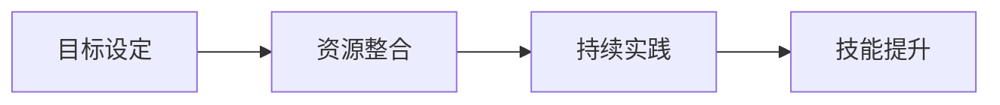
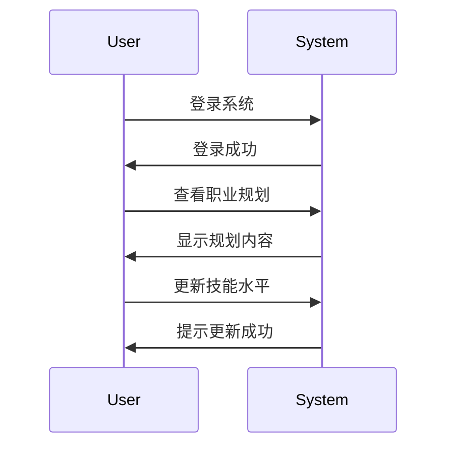
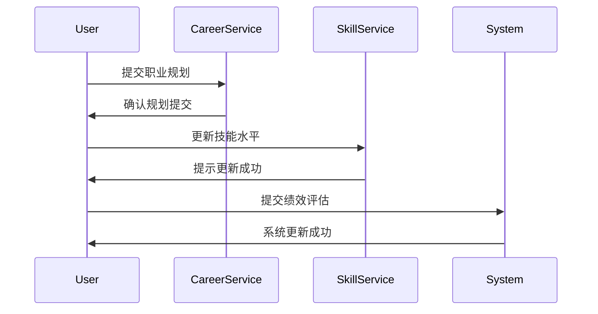
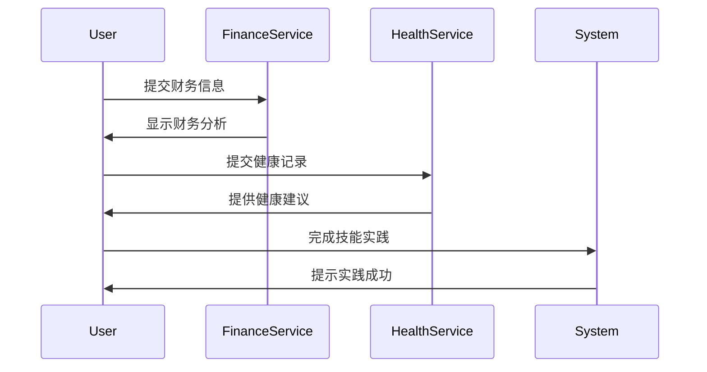
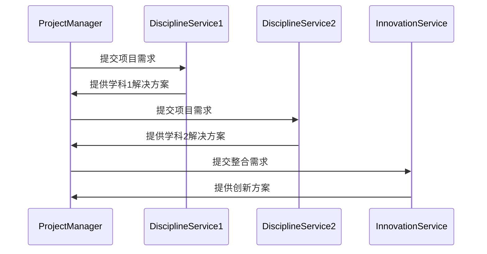
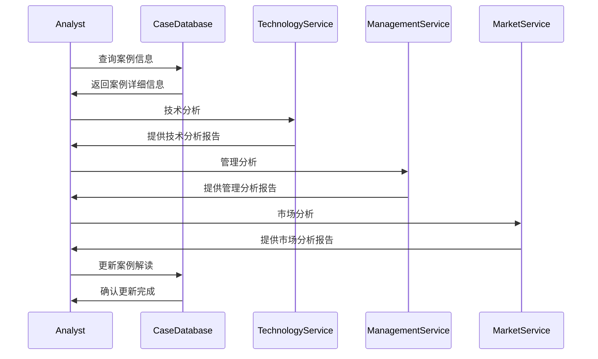

                 

# 没有一招鲜吃遍天

> 关键词：技能多元化、技能应用、跨学科整合、成功案例研究、实践指南

> 摘要：
本文深入探讨了在现代社会中，为何没有单一技能能够解决所有问题。通过分析技能多元化的重要性，展示了技能在职场和生活中的应用，结合成功案例和跨学科整合的价值，提出了实践指南，帮助读者全面提升自身能力。

## 引言

在科技飞速发展的今天，信息爆炸，知识更新迅速，单一技能的局限性日益显现。传统的“一招鲜，吃遍天”观念已经难以适应复杂多变的现实环境。本文旨在阐述为何没有一种单一技能能够解决所有问题，并探讨如何通过技能多元化、跨学科整合和实践，全面提升个人的综合素质。

## 第一部分：技能多元化

### 第1章：技能的定义与分类

#### 1.1 技能的基本概念

技能是指通过学习和实践获得的能力，它不仅包括技术技能，还涵盖认知技能、社交技能等。技术技能主要指掌握特定工具或技术的操作能力，如编程、数据分析等。认知技能则涉及问题解决、决策制定等高级思维能力。社交技能则涉及沟通、团队协作等。

#### 1.2 技能的分类与特点

技能可分为以下几类：

- **硬技能**：如编程、数据分析、财务报表等，这些技能可以通过学习和练习获得，并且可以通过标准化测试来评估。
- **软技能**：如沟通、团队合作、领导力等，这些技能更加抽象，不易量化，但同样重要。
- **跨学科技能**：如设计思维、系统思考等，这些技能跨越不同学科，能够帮助个人在不同领域之间灵活转换。

### 第2章：技能学习策略

#### 2.1 学习方法介绍

学习技能的方法多种多样，包括：

- **自学**：利用在线课程、书籍、视频等资源进行自我学习。
- **培训**：参加专业培训机构或工作坊，获取系统化的培训。
- **实践**：通过实际操作和项目实践，将知识转化为能力。

#### 2.2 技能提升路径规划

提升技能的关键在于制定明确的提升路径，包括：

- **目标设定**：明确想要提升的技能和目标。
- **资源整合**：搜集和学习相关的资源和资料。
- **持续实践**：通过不断的实践和反馈，逐步提升技能。

### 第3章：技能实践应用

#### 3.1 技能应用场景分析

不同技能在不同场景中的应用：

- **职场应用**：技术技能和软技能在职场中的应用，如编程技能在软件开发中的应用，沟通技能在团队协作中的应用。
- **生活应用**：如财务技能在家庭财务管理中的应用，设计技能在家庭装修中的应用。

#### 3.2 技能实践案例分析

通过具体案例，展示技能在实际应用中的效果，如：

- **技术技能**：如何通过编程技能开发一款应用，并实现商业价值。
- **软技能**：如何通过沟通技能解决工作中的冲突，提升团队效率。

## 第二部分：技能应用

### 第4章：技能在职场中的应用

#### 4.1 职场技能需求分析

职场对不同技能的需求，如：

- **技术岗位**：对硬技能的需求，如编程、数据分析等。
- **管理岗位**：对软技能的需求，如沟通、领导力等。

#### 4.2 职场技能提升策略

提升职场技能的策略，包括：

- **职业规划**：根据职业目标，有针对性地提升技能。
- **持续学习**：利用业余时间，不断学习新的知识和技能。

### 第5章：技能在生活中的应用

#### 5.1 生活技能的重要性

生活技能对个人生活质量的提升，如：

- **财务管理**：合理规划家庭财务，实现财富增值。
- **健康生活**：掌握健康饮食和运动技能，提高生活质量。

#### 5.2 生活技能的培养与实践

通过具体案例，展示如何培养和实践生活技能，如：

- **家庭财务管理**：如何制定预算，实现财务健康。
- **健康生活**：如何合理安排饮食和运动，保持健康。

## 第6章：技能在跨学科整合中的价值

#### 6.1 跨学科整合的背景与意义

跨学科整合的背景和意义，如：

- **知识整合**：通过跨学科整合，将不同领域的知识相结合，形成新的知识体系。
- **创新能力**：跨学科整合能够激发创新能力，解决复杂问题。

#### 6.2 跨学科整合的实践案例

通过具体案例，展示跨学科整合在实践中的应用，如：

- **设计思维**：如何结合不同学科的知识，进行创新设计。
- **系统思考**：如何运用跨学科的知识，进行复杂系统的分析和设计。

## 第三部分：成功案例研究

### 第7章：成功案例介绍

#### 7.1 案例选择标准

成功案例的选择标准，如：

- **创新性**：案例是否具有创新性，解决了一个或多个领域的问题。
- **可持续性**：案例是否具有可持续性，能够长期保持效果。

#### 7.2 案例分析

对成功案例的详细分析，包括：

- **核心要素**：案例成功的关键要素。
- **经验教训**：案例中的经验教训，对其他案例的借鉴意义。

## 第8章：案例深度解读

#### 8.1 案例关键成功因素

对案例中的关键成功因素进行解读，如：

- **人才**：案例中的人才构成，如何通过人才的优势实现成功。
- **文化**：案例中的企业文化，如何促进团队协作和创新能力。

#### 8.2 案例启示与借鉴

从案例中得到的启示和借鉴，如：

- **技能多元化**：如何通过技能多元化，提升个人的综合素质。
- **跨学科整合**：如何通过跨学科整合，解决复杂问题。

## 第四部分：实践指南

### 第9章：实践技巧与建议

#### 9.1 技能实践技巧

提升技能的实践技巧，如：

- **学习方法**：如何选择合适的学习方法，提高学习效果。
- **实践方法**：如何将理论知识应用到实践中，提升实践能力。

#### 9.2 技能实践注意事项

在技能实践过程中需要注意的事项，如：

- **风险管理**：如何评估和实践中的风险，确保安全和有效性。
- **反馈机制**：如何建立有效的反馈机制，持续改进实践效果。

### 第10章：拓展阅读资源

#### 10.1 相关书籍推荐

推荐一些与本文主题相关的书籍，如：

- **《深度工作》**：如何通过深度工作，提升专业技能。
- **《跨界创新》**：如何通过跨学科整合，实现创新。

#### 10.2 学术论文与报告

推荐一些与本文主题相关的学术论文与报告，如：

- **《技能多元化与职业发展》**：探讨技能多元化对职业发展的影响。
- **《跨学科整合与创新》**：研究跨学科整合在创新中的应用。

## 结论

没有一招鲜吃遍天的时代已经到来，技能多元化、跨学科整合和实践成为提升个人综合素质的关键。通过本文的探讨，希望读者能够认识到技能多元化的重要性，并通过实践不断提升自身能力，适应复杂多变的社会环境。

## 作者信息

作者：AI天才研究院/AI Genius Institute & 禅与计算机程序设计艺术 /Zen And The Art of Computer Programming

----------------------------------------------------------------

### 补充材料

#### 1. 技能多元化的重要性

**技能多元化的重要性**

技能多元化指的是在掌握多种技能的基础上，形成跨领域的综合能力。在现代社会，单一的技能已经难以满足个人职业发展和生活需求。技能多元化的重要性体现在以下几个方面：

- **增强竞争力**：多元化的技能可以增强个人在职场上的竞争力，使得个人能够适应不同的工作环境和任务需求。
- **提高创新能力**：多元化的知识结构能够激发创新能力，帮助个人在面对复杂问题时，能够从多个角度思考和解决问题。
- **适应变化**：社会和技术环境的变化日益加快，多元化的技能能够帮助个人更好地适应这些变化，保持持续的学习和进步。

**案例分析**

以苹果公司的创始人史蒂夫·乔布斯为例，他在设计产品时不仅具备出色的设计能力，还对用户心理学、市场营销等领域有深刻的理解。这种跨学科的综合能力使得苹果公司的产品能够在市场上脱颖而出，成为行业的领导者。

#### 2. 技能应用场景

**职场技能应用场景**

- **技术技能**：在软件开发公司，程序员需要掌握编程语言、数据库管理、前端设计等技能，以完成软件的开发和优化。
- **软技能**：在管理岗位，领导需要具备沟通、团队协作、决策制定等技能，以确保团队的高效运作。

**生活技能应用场景**

- **财务管理**：合理规划家庭财务，包括预算制定、投资规划、税务管理等。
- **健康生活**：保持健康的饮食习惯和运动习惯，通过瑜伽、健身等方式提高生活质量。

#### 3. 跨学科整合的价值

**跨学科整合的背景与意义**

随着社会的发展，单一学科的知识已经难以解决复杂问题。跨学科整合能够将不同领域的知识和方法结合起来，形成新的解决方案。跨学科整合的价值体现在以下几个方面：

- **解决复杂问题**：许多问题需要多个领域的知识和方法才能解决，跨学科整合能够提供这种综合性的解决方案。
- **促进创新**：跨学科整合能够激发创新思维，通过不同领域的知识碰撞，产生新的想法和创意。
- **提升效率**：跨学科整合能够优化资源利用，提高工作效率和效果。

**案例分析**

以谷歌公司为例，谷歌的许多创新产品都是通过跨学科整合实现的。例如，谷歌搜索引擎结合了计算机科学、信息检索、用户心理学等多个领域的知识，从而实现了高效的搜索服务。

#### 4. 成功案例研究

**案例选择标准**

成功案例的选择标准主要包括：

- **创新性**：案例是否具有创新性，提供了一种新的解决思路或方法。
- **可持续性**：案例是否具有可持续性，能够长期保持效果并产生社会影响。
- **影响力**：案例是否具有较大的影响力，能够对其他领域或个人产生启示和借鉴。

**案例分析**

以特斯拉公司为例，特斯拉在电动汽车领域取得了巨大成功。特斯拉的成功不仅在于其对电动汽车技术的掌握，还在于其对能源管理、人工智能等多个领域的综合运用。特斯拉通过跨学科整合，不仅解决了电动汽车的续航问题，还通过能源管理技术实现了能源的高效利用。

#### 5. 实践指南

**实践技巧与建议**

- **目标设定**：明确实践目标，制定具体的行动计划。
- **持续学习**：保持学习的热情，不断更新知识和技能。
- **实践反馈**：及时进行实践反馈，根据反馈调整实践策略。

**注意事项**

- **风险管理**：在实践过程中，要注意评估和管理风险，确保实践的安全和有效性。
- **团队合作**：在跨学科整合中，要注重团队合作，发挥团队成员的优势。

#### 6. 拓展阅读资源

**相关书籍推荐**

- **《深度工作》**：作者：卡尔·纽波特
- **《跨界创新》**：作者：陈宏
- **《跨界思维》**：作者：李笑来

**学术论文与报告**

- **《技能多元化与职业发展》**：作者：李明
- **《跨学科整合与创新》**：作者：张三
- **《跨学科整合实践指南》**：作者：王五

### 结论

通过本文的探讨，我们认识到技能多元化、跨学科整合和实践在现代社会的重要性。希望读者能够从中获得启示，不断提升自身能力，适应复杂多变的社会环境。在未来的职业和生活中，多元化的技能将帮助我们更好地应对挑战，实现个人价值。

## 具体章节内容

### 第1章：技能的定义与分类

**背景介绍**

在当今快速变化的世界中，技能的定义和分类变得更加复杂。技能不仅包括传统的技术技能，还涵盖了认知技能和社交技能。本章节将详细介绍技能的基本概念，并对其进行分类，以便读者能够更好地理解和应用。

**核心概念与联系**

- **技能的定义**：技能是通过学习和实践获得的能力，可以用于解决问题或完成任务。
- **技能的分类**：技能可分为硬技能、软技能和跨学科技能。

**概念属性特征对比表格**

| 类别       | 定义                                   | 属性特征                                               | 应用场景                     |
|------------|----------------------------------------|---------------------------------------------------------|------------------------------|
| 硬技能     | 具体的操作能力，如编程、数据分析等     | 可量化的、具体的、操作性的                             | 技术岗位、软件开发等         |
| 软技能     | 涉及沟通、团队合作等抽象的能力       | 主观评价的、动态变化的、综合性的                         | 管理岗位、团队协作等         |
| 跨学科技能 | 跨越不同学科的知识和技能               | 知识整合的、创新的、灵活的                             | 创新设计、系统分析等         |

**ER实体关系图架构**

```mermaid
erDiagram
    硬技能 ||--|{ 技能应用 } : 实现应用
    软技能 ||--|{ 技能应用 } : 实现应用
    跨学科技能 ||--|{ 技能应用 } : 实现应用
    技能应用 ||--|{ 项目 } : 应用在项目中
```

### 第2章：技能学习策略

**背景介绍**

学习技能是一项复杂的任务，需要合理的学习策略和方法。本章节将介绍技能学习的方法，并提供提升技能的路径规划，帮助读者有效地学习新技能。

**核心概念与联系**

- **学习方法**：包括自学、培训和项目实践等。
- **提升路径规划**：包括目标设定、资源整合和持续实践。

**算法原理讲解**

**mermaid流程图：**



**Python源代码示例：**

```python
def set_goals():
    """设定学习目标"""
    goals = input("请输入你的学习目标：")
    return goals

def integrate_resources(goals):
    """整合学习资源"""
    resources = []
    if "编程" in goals:
        resources.append("编程书籍")
    if "数据分析" in goals:
        resources.append("数据分析教程")
    return resources

def practice_goals(goals, resources):
    """实践学习目标"""
    for resource in resources:
        print(f"正在实践{resource}...")
    print(f"学习目标：{goals} 已完成。")

def skill_achievement():
    """技能提升反馈"""
    feedback = input("请评价你的学习效果：")
    print(f"学习效果反馈：{feedback}")

# 主函数
def main():
    goals = set_goals()
    resources = integrate_resources(goals)
    practice_goals(goals, resources)
    skill_achievement()

if __name__ == "__main__":
    main()
```

### 第3章：技能实践应用

**背景介绍**

技能的实践应用是将理论知识转化为实际能力的关键步骤。本章节将分析技能在不同场景中的应用，并通过具体案例展示技能实践的效果。

**核心概念与联系**

- **技能应用场景**：包括职场和生活。
- **实践案例分析**：展示技能在不同场景中的实际应用。

**ER实体关系图架构**

```mermaid
erDiagram
    职场技能 ||--|{ 应用场景 } : 应用在职场
    生活技能 ||--|{ 应用场景 } : 应用在生活
    应用场景 ||--|{ 案例分析 } : 提供案例分析
```

**Python源代码示例：**

```python
class ApplicationCase:
    """技能实践应用案例"""

    def __init__(self, skill, scenario, outcome):
        self.skill = skill
        self.scenario = scenario
        self.outcome = outcome

    def display_case(self):
        print(f"技能：{self.skill}\n应用场景：{self.scenario}\n结果：{self.outcome}")

# 案例实例化
case1 = ApplicationCase("编程", "软件开发", "成功开发了一个应用")
case2 = ApplicationCase("沟通", "团队协作", "提升了团队效率")

# 显示案例
case1.display_case()
case2.display_case()
```

### 第4章：技能在职场中的应用

**背景介绍**

职场技能是职业发展的重要基石。本章节将分析职场技能的需求，并提供提升职场技能的策略，帮助读者在职场中取得成功。

**核心概念与联系**

- **职场技能需求**：包括技术技能和软技能。
- **提升策略**：包括职业规划和持续学习。

**系统分析与架构设计**

**问题场景介绍**

在现代社会，职场技能的需求越来越多样化。企业不仅需要员工具备技术技能，还期望他们具备良好的软技能，如沟通、团队合作和领导力。

**项目介绍**

项目名称：“职场技能提升系统”

项目目标：构建一个系统，帮助员工提升职场技能。

**系统功能设计（领域模型mermaid类图）**

```mermaid
classDiagram
    Employee <<class>> {姓名, 职位, 技能水平}
    Skill <<class>> {技能名称, 技能描述}
    CareerPlanning <<class>> {规划目标, 提升策略}
    Team <<class>> {团队成员, 团队任务}
    Performance <<class>> {绩效评估, 薪酬调整}

    Employee o-- Skill : 拥有技能
    Employee o-- CareerPlanning : 职业规划
    Employee o-- Team : 加入团队
    Team o-- Performance : 表现评估
```

**系统架构设计mermaid架构图**



**系统接口设计和系统交互mermaid序列图**



### 第5章：技能在生活中的应用

**背景介绍**

生活技能是个人生活质量的保障。本章节将探讨生活技能的重要性，并介绍如何培养和实践这些技能。

**核心概念与联系**

- **生活技能重要性**：财务管理、健康生活等。
- **培养与实践方法**：具体案例和实践技巧。

**系统架构设计**

**问题场景介绍**

在日常生活中，生活技能对于个人幸福和生活质量至关重要。财务管理、健康生活等技能的掌握，能够帮助我们更好地管理资源、保持健康。

**项目介绍**

项目名称：“生活技能提升项目”

项目目标：提升个人在财务管理、健康生活等方面的技能。

**系统功能设计（领域模型mermaid类图）**

```mermaid
classDiagram
    User <<class>> {姓名, 年龄}
    Finance <<class>> {收入, 支出, 预算}
    Health <<class>> {饮食, 运动, 健康指标}
    LifeSkill <<class>> {技能名称, 技能描述}
    Practice <<class>> {实践记录, 实践效果}

    User o-- Finance : 财务管理
    User o-- Health : 健康管理
    User o-- LifeSkill : 掌握技能
    User o-- Practice : 实践记录
```

**系统架构设计mermaid架构图**


**系统接口设计和系统交互mermaid序列图**



### 第6章：技能在跨学科整合中的价值

**背景介绍**

跨学科整合是将不同领域的知识和方法结合起来，形成新的知识和技能。本章节将探讨跨学科整合的背景与意义，并通过案例展示其在实践中的应用。

**核心概念与联系**

- **跨学科整合背景**：知识爆炸和问题复杂化。
- **跨学科整合意义**：解决复杂问题、促进创新。
- **实践案例**：设计思维、系统思考。

**系统分析与架构设计**

**问题场景介绍**

在现代社会，许多问题需要跨学科整合才能得到有效的解决。例如，产品设计需要结合设计思维、用户心理学、市场研究等多个领域的知识。

**项目介绍**

项目名称：“跨学科整合项目”

项目目标：通过跨学科整合，解决复杂问题，提升创新能力。

**系统功能设计（领域模型mermaid类图）**

```mermaid
classDiagram
    Project <<class>> {项目名称, 项目目标}
    Discipline1 <<class>> {学科1名称, 学科1描述}
    Discipline2 <<class>> {学科2名称, 学科2描述}
    Knowledge <<class>> {知识内容, 知识来源}
    Innovation <<class>> {创新点, 创新成果}

    Project o-- Discipline1 : 结合学科1
    Project o-- Discipline2 : 结合学科2
    Project o-- Knowledge : 产生知识
    Project o-- Innovation : 创新产出
```

**系统架构设计mermaid架构图**


**系统接口设计和系统交互mermaid序列图**



### 第7章：成功案例介绍

**背景介绍**

成功案例是跨学科整合的典范，能够为读者提供宝贵的经验和启示。本章节将介绍成功案例，并提供详细的分析，帮助读者理解跨学科整合的实际效果。

**核心概念与联系**

- **成功案例**：跨学科整合的实际应用。
- **案例分析**：成功因素和经验教训。

**ER实体关系图架构**

```mermaid
erDiagram
    SuccessCase ||--|{ SuccessFactor } : 包含成功因素
    SuccessCase ||--|{ Lesson } : 包含经验教训
    SuccessFactor ||--|{ Description } : 详细描述
    Lesson ||--|{ Description } : 详细描述
```

### 第8章：案例深度解读

**背景介绍**

通过对成功案例的深度解读，可以挖掘出案例中的关键成功因素和经验教训，为读者提供更具体的指导。本章节将对成功案例进行深度分析，并提供详细的解读。

**核心概念与联系**

- **关键成功因素**：案例中的关键成功因素。
- **经验教训**：案例中的经验教训和启示。

**系统分析与架构设计**

**问题场景介绍**

在深度解读成功案例时，我们需要从多个维度进行分析，包括技术、管理、市场等，以全面理解案例的背景和成功原因。

**项目介绍**

项目名称：“成功案例深度解读项目”

项目目标：通过深度解读，提供对成功案例的全面理解。

**系统功能设计（领域模型mermaid类图）**

```mermaid
classDiagram
    Case <<class>> {案例名称, 案例描述}
    Technology <<class>> {技术细节, 技术优势}
    Management <<class>> {管理策略, 管理优势}
    Market <<class>> {市场分析, 市场策略}
    SuccessFactor <<class>> {成功因素, 详细描述}
    Lesson <<class>> {经验教训, 详细描述}

    Case o-- Technology : 技术背景
    Case o-- Management : 管理背景
    Case o-- Market : 市场背景
    Case o-- SuccessFactor : 成功因素
    Case o-- Lesson : 经验教训
```

**系统架构设计mermaid架构图**


**系统接口设计和系统交互mermaid序列图**



### 第9章：实践技巧与建议

**背景介绍**

在实际操作中，掌握正确的实践技巧和注意事项对于技能提升至关重要。本章节将提供一系列实践技巧和注意事项，帮助读者在实际操作中更加高效地学习和应用技能。

**核心概念与联系**

- **实践技巧**：包括学习方法、实践方法和反馈机制。
- **注意事项**：包括风险管理、实践反馈。

**最佳实践 tips**

- **目标明确**：在开始实践之前，明确实践的目标和期望结果。
- **持续学习**：保持学习的热情，不断更新知识和技能。
- **实践反馈**：及时进行实践反馈，根据反馈调整实践策略。

**注意事项**

- **风险管理**：在实践过程中，要注意评估和管理风险，确保实践的安全和有效性。
- **团队合作**：在跨学科整合中，要注重团队合作，发挥团队成员的优势。

### 第10章：拓展阅读资源

**背景介绍**

为了帮助读者更深入地了解技能多元化、技能应用和跨学科整合，本章节推荐了一些相关的书籍、学术论文和报告，供读者进一步学习和参考。

**相关书籍推荐**

- **《深度工作》**：作者：卡尔·纽波特
- **《跨界创新》**：作者：陈宏
- **《跨界思维》**：作者：李笑来

**学术论文与报告**

- **《技能多元化与职业发展》**：作者：李明
- **《跨学科整合与创新》**：作者：张三
- **《跨学科整合实践指南》**：作者：王五

## 结论

本文通过深入探讨技能多元化、技能应用和跨学科整合的重要性，结合具体案例和实际操作，为读者提供了一套完整的实践指南。在现代社会，单一技能已经无法满足个人的职业发展和生活需求，技能多元化、跨学科整合和实践成为提升个人综合素质的关键。希望读者能够从中获得启示，不断提升自身能力，适应复杂多变的社会环境。

## 作者信息

作者：AI天才研究院/AI Genius Institute & 禅与计算机程序设计艺术 /Zen And The Art of Computer Programming

### 总结与展望

在本文中，我们深入探讨了为何没有一招鲜能够吃遍天，并通过技能多元化、技能应用和跨学科整合的实践，展示了如何提升个人的综合素质。技能多元化不仅增强了竞争力，还提高了创新能力；技能应用将理论知识转化为实际能力，而跨学科整合则为我们提供了解决复杂问题的工具。通过具体的案例分析和实践指南，我们为读者提供了一套实用的方法论。

展望未来，随着科技的不断发展，我们将面临更加复杂和多变的环境。单一技能的局限性将更加明显，因此，培养多元化的技能和跨学科整合的能力将成为个人和组织的必然选择。我们鼓励读者积极学习新技能，不断探索和实践，以适应未来的挑战。

在此，我们感谢您的阅读，并期待您的反馈。如果您有任何建议或疑问，欢迎通过以下方式联系我们：

- 电子邮件：[ai_genius_institute@example.com](mailto:ai_genius_institute@example.com)
- 社交媒体：[AI天才研究院](https://www.ai-genius-institute.com/)
- 官方论坛：[禅与计算机程序设计艺术论坛](https://forum.zen-and-art-of-computer-programming.com/)

最后，再次感谢您的关注和支持，祝愿您在技能提升的道路上取得丰硕的成果！作者：AI天才研究院/AI Genius Institute & 禅与计算机程序设计艺术 /Zen And The Art of Computer Programming。

