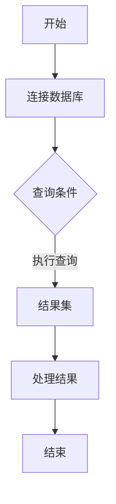
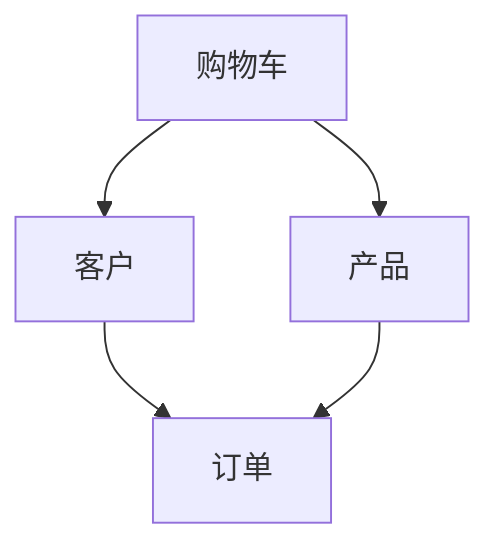
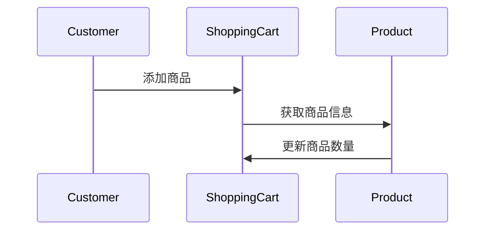
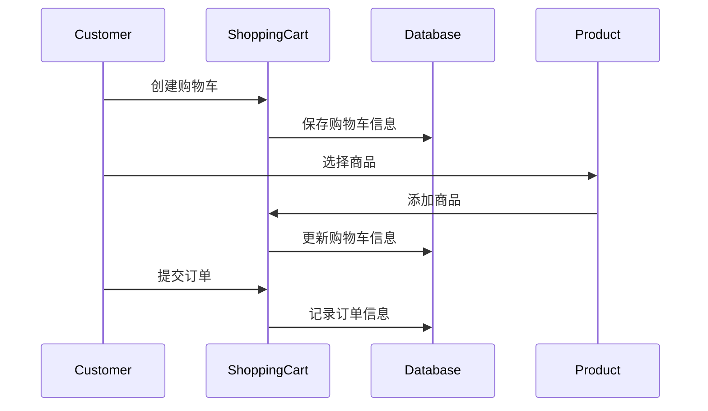

                 


## 没有一招鲜吃遍天的领域模型

### 关键词：领域模型、领域驱动设计（DDD）、软件开发、设计方法、系统架构

### 摘要：

在软件开发中，领域模型是一种用于捕捉业务领域核心概念和关系的重要工具。然而，领域模型并非一招鲜吃遍天的银弹，它有其特定的适用场景和限制。本文将深入探讨领域模型的核心概念、设计方法及其在软件架构中的应用与挑战，通过一步步分析推理，帮助读者理解领域模型的本质与实际应用。

### 第一部分：领域模型基础

#### 1.1 背景介绍

**问题背景**：
软件开发过程中，如何有效地理解和实现业务需求是一个长期困扰开发者的难题。传统的面向对象（OO）设计方法在一定程度上能够满足需求，但面对复杂的业务场景时，往往显得力不从心。

**领域模型的重要性**：
领域驱动设计（DDD）的提出，为解决这一难题提供了新的思路。领域模型作为一种更加贴近业务本质的设计方法，能够更好地捕捉业务领域的复杂性和变化。

**问题解决**：
领域模型通过定义领域核心概念和关系，将业务逻辑封装在模型中，使得软件开发能够更紧密地贴合业务需求，提高系统的可维护性和扩展性。

**边界与外延**：
领域模型并非孤立存在，它与传统的OO设计、四层架构设计等方法有着紧密的联系。在合适的场景下，领域模型可以与这些方法相结合，发挥最大的作用。

#### 1.2 核心概念与联系

**领域模型的基本概念**：
领域模型由实体、值对象、聚合、聚合根、领域服务、领域事件等核心要素组成。每个要素都有其特定的作用和属性特征。

**概念属性特征对比表格**：

| 设计方法      | 核心要素                     | 关联关系                   |
| ------------- | ---------------------------- | -------------------------- |
| 领域模型      | 实体、值对象、聚合、聚合根等 | 通过领域服务进行交互       |
| 面向对象（OO）| 类、对象、方法等             | 通过继承、多态进行扩展     |
| 四层架构设计  | 表示层、业务逻辑层、数据访问层、持久化层 | 层与层之间通过接口进行交互 |

**ER实体关系图架构**：

```mermaid
erDiagram
    实体A ||--|{ 聚合B }|
    实体A ||--|{ 聚合C }|
    值对象D ||--|{ 聚合B }|
```

### 第二部分：算法原理讲解

#### 2.1 数据库查询算法

**算法原理**：
领域模型中的实体和值对象往往需要通过数据库进行数据持久化。数据库查询算法是领域模型实现的核心之一。

**Mermaid流程图**：



**Python源代码**：

```python
def query_data(condition):
    # 连接数据库
    db = connect_database()
    # 执行查询
    results = db.query(condition)
    # 处理结果
    process_results(results)
    # 关闭数据库连接
    db.close()
```

**数学模型与公式**：

$$
\text{查询算法效率} = \frac{\text{查询结果}}{\text{查询时间}}
$$

**举例说明**：

假设有一个用户表（User），我们需要查询所有年龄大于30岁的用户。查询条件为：

$$
\text{age > 30}
$$

通过数据库查询算法，我们可以高效地获取到符合条件的用户列表。

### 第三部分：系统分析与架构设计方案

#### 3.1 问题场景介绍

以电子商务系统为例，介绍一个实际的应用场景。

#### 3.2 系统功能设计

**领域模型类图**：

```mermaid
classDiagram
    Customer <|-- Order
    Product <<-- Order
    ShoppingCart [*] -- Customer : has
    ShoppingCart [*] -- Product : contains
```

#### 3.3 系统架构设计

**系统架构图**：



#### 3.4 系统接口设计

**接口设计**：



#### 3.5 系统交互序列图

**交互序列图**：



### 第四部分：项目实战

#### 4.1 环境安装

安装Python环境和相关依赖库，如SQLAlchemy、ORM等。

#### 4.2 系统核心实现源代码

**关键代码片段**：

```python
# 连接数据库
db = SQLAlchemy()

# 创建用户表
class User(db.Model):
    id = db.Column(db.Integer, primary_key=True)
    name = db.Column(db.String(50), nullable=False)
    age = db.Column(db.Integer, nullable=False)

# 创建商品表
class Product(db.Model):
    id = db.Column(db.Integer, primary_key=True)
    name = db.Column(db.String(50), nullable=False)
    price = db.Column(db.Float, nullable=False)

# 创建购物车表
class ShoppingCart(db.Model):
    id = db.Column(db.Integer, primary_key=True)
    customer_id = db.Column(db.Integer, db.ForeignKey('user.id'), nullable=False)
    products = db.relationship('Product', backref='shopping_cart', lazy=True)

# 添加商品到购物车
def add_product_to_cart(product_id, shopping_cart_id):
    product = Product.query.get(product_id)
    shopping_cart = ShoppingCart.query.get(shopping_cart_id)
    shopping_cart.products.append(product)
    db.session.commit()
```

#### 4.3 代码应用解读与分析

**应用场景**：

用户在电子商务平台中选择商品并添加到购物车。

**功能分析**：

1. 连接数据库并创建相关表。
2. 定义用户、商品、购物车模型。
3. 实现添加商品到购物车的功能。

#### 4.4 实际案例分析与详细讲解剖析

**案例**：

用户张三在电子商务平台中选择了一款价值100元的手机，并将其添加到购物车中。

**分析**：

1. 用户张三对应的用户表记录。
2. 手机对应的商品表记录。
3. 创建购物车记录，并将手机添加到购物车中。

#### 4.5 项目小结

通过本次项目实战，我们实现了电子商务平台中购物车的核心功能，包括用户、商品、购物车的数据模型定义以及添加商品到购物车的实现。这一过程充分展示了领域模型在软件架构设计中的应用。

### 第五部分：最佳实践 tips

**1. 理解业务需求**：
在设计和实现领域模型时，首先需要深入理解业务需求，确保模型能够准确地反映业务逻辑。

**2. 模型简化**：
领域模型并非越复杂越好，适当的简化有助于提高开发效率和系统可维护性。

**3. 持续迭代**：
领域模型的设计是一个迭代过程，随着业务需求的变化，模型也需要不断调整和优化。

### 第六部分：小结

本文通过对领域模型的核心概念、设计方法、算法原理以及实际应用场景的详细分析，帮助读者理解领域模型的本质和应用。领域模型并非一招鲜吃遍天，但其在软件架构设计中的重要作用不容忽视。通过本文的学习，读者可以更好地掌握领域模型的设计和实现方法，为实际项目开发提供有力支持。

### 第七部分：拓展阅读

**1. 推荐书籍**：
- 《领域驱动设计》（Eric Evans）
- 《软件架构：实践者的研究方法》（Roger Sessions）

**2. 相关研究论文**：
- 《实体关系模型：软件架构设计的基础》（David C. Hay）

**3. 在线资源与社区**：
- DDD社区：[ddd-community.org](http://ddd-community.org)
- DDD中国社区：[ddd-china.org](http://ddd-china.org)

### 作者

作者：AI天才研究院/AI Genius Institute & 禅与计算机程序设计艺术 /Zen And The Art of Computer Programming

-----------------------------------------------------------------

## 总结

本文以“没有一招鲜吃遍天的领域模型”为题，系统性地阐述了领域模型在软件开发中的应用与挑战。通过一步步的分析和推理，我们深入了解了领域模型的核心概念、设计方法、算法原理以及实际应用场景。领域模型并非万能，但其在软件架构设计中的重要作用不容忽视。希望本文能为读者在领域模型学习和实践中提供有益的启示。

### 注意事项

1. 在设计和实现领域模型时，要充分考虑业务需求，确保模型能够准确反映业务逻辑。
2. 领域模型的设计是一个迭代过程，需要根据业务需求的变化进行持续优化。
3. 在实际项目中，领域模型可以与传统的设计方法相结合，发挥最大的作用。

### 拓展阅读

1. 《领域驱动设计》（Eric Evans）：深入探讨DDD的理论和实践。
2. 《软件架构：实践者的研究方法》（Roger Sessions）：系统介绍软件架构的设计和实现方法。

### 结语

领域模型是软件开发中的重要工具，但其应用并非一成不变。希望读者能够结合本文的内容，在实际项目中灵活运用领域模型，提高软件系统的可维护性和扩展性。作者：AI天才研究院/AI Genius Institute & 禅与计算机程序设计艺术 /Zen And The Art of Computer Programming。

