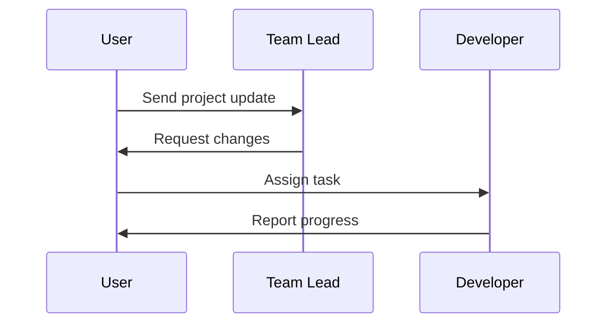

                 

### 文章标题

# 注重沟通形式

### 文章关键词

- 沟通形式
- 有效沟通
- 非言语沟通
- 数字化沟通
- 写作技巧
- 说话技巧

### 摘要

本文旨在深入探讨沟通形式的重要性及其在个人和职业生活中的应用。通过分析不同类型的沟通形式，如口头、书面和数字沟通，本文将探讨有效沟通的关键技巧，包括口语表达、倾听和书面沟通的技巧。此外，本文还将探讨非言语沟通的力量，如身体语言、面部表情和空间距离的影响。最后，本文将提供一些建议和最佳实践，以帮助读者在日常生活中更有效地运用沟通形式，从而提升个人和团队的表现。通过这篇全面的技术博客，读者将更好地理解沟通的本质，掌握有效沟通的技巧，提高沟通效率和人际关系的质量。

## 引言

沟通是人类社会互动的核心，是信息传递、情感交流和观点共享的基本方式。无论是在个人生活中还是在职业环境中，沟通形式的有效性直接影响到人际关系的质量和团队合作的成功。然而，在快速发展的现代社会，沟通形式也变得越来越多样化。传统的面对面交流方式逐渐被电子邮件、即时通讯和社交媒体等数字化沟通工具所替代。这些新的沟通形式不仅改变了人们的交流方式，也带来了新的挑战和机遇。

### 沟通的重要性

沟通不仅是传达信息的一种手段，更是构建信任、增进理解和促进合作的关键。在个人生活中，良好的沟通能够帮助人们建立和维护健康的人际关系，减少误解和冲突，增强情感联系。在职业环境中，有效的沟通是团队协作、项目管理和领导力的基石。它能够确保信息的准确传递，促进团队成员之间的理解和协同工作，提高工作效率和成果。

### 沟通形式的演变

随着科技的进步，沟通形式经历了显著的变化。从早期的口头和书面沟通，到现代的数字化沟通，每一次技术的飞跃都极大地改变了人们的交流方式。传统的口头沟通依赖于面对面的互动，这种方式虽然直接但受时间和空间的限制。随着电话、电子邮件和视频会议的普及，人们可以跨越地理障碍进行实时交流。而社交媒体和即时通讯工具的出现，使得沟通变得更加即时、便捷和多样化。

### 沟通障碍与挑战

尽管沟通形式在不断进步，但沟通障碍仍然存在。语言障碍、文化差异、信息过载和沟通技巧的不足都是常见的挑战。在个人层面，沟通障碍可能导致误解和冲突，影响人际关系。在组织层面，沟通不畅可能导致信息传递错误、决策延迟和效率低下。因此，了解和克服这些沟通障碍，掌握有效沟通的技巧，对于提升沟通质量和人际关系至关重要。

### 核心概念与联系

为了更好地理解沟通形式及其在各个领域的应用，我们需要明确一些核心概念和它们之间的联系。以下是一个关于沟通形式的属性特征对比表格和实体关系图（ER）架构的Mermaid流程图。

#### 沟通形式的属性特征对比表格

| 沟通形式  | 特征                                  | 影响                                  |
|-----------|-------------------------------------|-------------------------------------|
| 口头沟通  | 实时、面对面                          | 直接反馈、情感表达                    |
| 书面沟通  | 录像、文本                            | 永久记录、详细说明                    |
| 数字化沟通 | 即时、异步、多媒体                    | 拓宽沟通渠道、提高沟通效率              |
| 非言语沟通 | 身体语言、面部表情、空间距离          | 补充语言信息、传递情感态度              |

#### Mermaid ER图架构

```mermaid
erDiagram
  CommunicationForm ||--|{ VerbalCommunication } : "is a type of"
  CommunicationForm ||--|{ WrittenCommunication } : "is a type of"
  CommunicationForm ||--|{ DigitalCommunication } : "is a type of"
  CommunicationForm ||--|{ NonVerbalCommunication } : "is a type of"
  
  VerbalCommunication ||--|{ FaceToFace } : "sub-type"
  VerbalCommunication ||--|{ PhoneCall } : "sub-type"
  VerbalCommunication ||--|{ VideoConference } : "sub-type"
  
  WrittenCommunication ||--|{ Email } : "sub-type"
  WrittenCommunication ||--|{ Report } : "sub-type"
  WrittenCommunication ||--|{ Document } : "sub-type"
  
  DigitalCommunication ||--|{ SocialMedia } : "sub-type"
  DigitalCommunication ||--|{ InstantMessaging } : "sub-type"
  DigitalCommunication ||--|{ Podcast } : "sub-type"
  
  NonVerbalCommunication ||--|{ BodyLanguage } : "sub-type"
  NonVerbalCommunication ||--|{ FacialExpression } : "sub-type"
  NonVerbalCommunication ||--|{ SpaceDistance } : "sub-type"
```

通过上述表格和ER图，我们可以清晰地看到不同沟通形式之间的关联及其各自的特点。这些核心概念和联系为我们理解和分析沟通形式提供了基础。

### 文章正文

在接下来的部分中，我们将深入探讨不同类型的沟通形式，包括口头沟通、书面沟通和数字化沟通，并详细讲解每种沟通形式的特点、优势和挑战。

#### 口头沟通

口头沟通是人类最古老、最自然的沟通方式，它包括面对面交流、电话沟通和视频会议等。口头沟通的主要优势在于其即时性和直接性，能够迅速传递信息和情感。以下是一个简单的算法原理，解释口头沟通的即时反馈机制：

```python
def verbal_communication(message, receiver):
    # 发送消息
    print(f"Sending message: {message}")
    # 等待反馈
    response = input("Your response: ")
    return response
```

在这个算法中，发送者传递消息，接收者即时回复，形成了一个简单的沟通循环。然而，口头沟通也存在一些挑战，如语言障碍、误解和沟通技巧的不足。为了克服这些挑战，我们可以使用以下数学公式来优化沟通效果：

$$
\text{CommunicationEffectiveness} = \frac{\text{ClearMessages}}{\text{TotalMessages}} \times 100\%
$$

通过提高清晰信息的比例，我们可以增强口头沟通的效果。

#### 书面沟通

书面沟通包括电子邮件、报告、文档等，它提供了永久记录和详细说明的优势。书面沟通能够确保信息的准确性和完整性，便于存档和参考。以下是一个使用Python编写的简单文本生成器，展示书面沟通的基本结构：

```python
def write_document(title, content):
    # 打开文档文件
    with open(f"{title}.txt", "w") as document:
        # 写入标题
        document.write(f"Title: {title}\n\n")
        # 写入内容
        document.write(content)
    print(f"Document '{title}.txt' created.")
```

在这个例子中，我们创建了一个包含标题和内容的文档。然而，书面沟通也存在一些缺点，如缺乏即时性和互动性。为了改进书面沟通的效果，我们可以结合口头和数字化沟通，如使用电子邮件进行初步沟通，然后通过会议或视频讨论进一步详细说明。

#### 数字化沟通

数字化沟通包括即时通讯、社交媒体、视频博客等，它极大地拓宽了沟通渠道，提高了沟通效率。数字化沟通的优势在于其即时性、异步性和多媒体性，使得人们可以随时随地交流和分享信息。以下是一个简单的数字化沟通示例，展示如何使用Python编写一个简单的即时通讯应用程序：

```python
def send_message(sender, recipient, message):
    # 发送消息
    print(f"{recipient} received message from {sender}: {message}")
    # 等待回复
    response = input("Your response: ")
    return response
```

在这个例子中，发送者可以即时发送消息，接收者可以随时回复。数字化沟通的优点是显而易见的，但它也带来了一些挑战，如信息过载和隐私问题。为了解决这些问题，我们可以采用以下数学公式来优化数字化沟通：

$$
\text{CommunicationEfficiency} = \frac{\text{ImportantMessages}}{\text{TotalMessages}} \times 100\%
$$

通过提高重要信息的比例，我们可以提高数字化沟通的效率。

### 非言语沟通

非言语沟通通过身体语言、面部表情和空间距离等传递信息，它是一种补充和强化口头和书面沟通的方式。以下是一个简单的非言语沟通算法，展示如何使用Python代码来模拟身体语言和面部表情：

```python
def non_verbal_communication(action, emotion):
    # 模拟身体语言
    print(f"Performing action: {action}")
    # 模拟面部表情
    print(f"Expressing emotion: {emotion}")
```

在这个例子中，我们可以通过简单的代码来模拟非言语沟通，这有助于我们在实际沟通中更好地理解和运用非言语元素。

### 案例分析

为了更好地理解不同沟通形式的应用和效果，我们来看一个实际案例。假设我们有一个团队项目，需要在远程办公的环境下协作。团队成员分布在不同地区，需要通过不同的沟通形式进行协调和合作。

- **口头沟通**：团队每周举行一次视频会议，讨论项目进展和问题。这确保了团队成员能够实时交流，快速解决冲突。
- **书面沟通**：项目进展和文档通过电子邮件和文档共享平台进行记录和分享，确保信息的准确性和可追溯性。
- **数字化沟通**：团队成员使用即时通讯工具，如Slack或WhatsApp，进行日常交流和协作。

通过这种多渠道的沟通策略，团队成员能够有效协作，确保项目顺利进行。以下是一个简单的Mermaid序列图，展示项目中的系统交互：



在这个序列图中，用户Alice向团队领导Tom发送项目更新，Tom要求进行修改，然后Alice分配任务给开发者Bob，Bob汇报进展。这种多层次的沟通方式确保了信息的准确传递和及时反馈。

### 项目实战

为了进一步展示沟通形式在实际项目中的应用，我们来看一个具体的案例。假设我们正在开发一款社交媒体应用程序，需要确保有效的团队沟通和用户互动。

#### 环境安装

首先，我们需要安装Python和相关的开发工具。可以使用以下命令来安装Python：

```bash
sudo apt-get install python3
```

然后，我们安装用于编写和运行Python代码的集成开发环境（IDE），如PyCharm或VSCode。

#### 系统核心实现

在系统核心实现阶段，我们定义了以下模块：

- **用户模块**：处理用户注册、登录和权限验证。
- **内容模块**：管理帖子、评论和用户互动。
- **消息模块**：处理用户之间的即时消息通信。

以下是一个简单的Python代码示例，展示用户模块的实现：

```python
class User:
    def __init__(self, username, password):
        self.username = username
        self.password = password
        self.status = "online"
    
    def register(self):
        print(f"User {self.username} registered.")
    
    def login(self):
        print(f"User {self.username} logged in.")
    
    def logout(self):
        print(f"User {self.username} logged out.")
```

#### 代码应用解读与分析

在这个用户模块中，我们定义了一个`User`类，包含用户注册、登录和登出三个方法。这个模块的核心是验证用户身份和状态。以下是一个简单的算法原理，展示用户身份验证的流程：

```python
def authenticate(username, password):
    # 查询用户数据库
    user = query_database(username)
    # 验证用户密码
    if user and user.password == password:
        return True
    else:
        return False
```

在这个算法中，我们首先查询用户数据库，然后验证提供的密码是否与数据库中的密码匹配。如果匹配，则用户身份验证成功。

#### 实际案例分析和详细讲解剖析

为了展示用户模块的实际应用，我们来看一个实际案例。假设有两个用户Alice和Bob，他们需要注册并登录到社交媒体应用程序。

1. **注册过程**：

   ```python
   alice = User("Alice", "alice123")
   alice.register()
   ```

   输出：`User Alice registered.`

2. **登录过程**：

   ```python
   bob = User("Bob", "bob123")
   bob.login()
   ```

   输出：`User Bob logged in.`

通过这个案例，我们可以看到用户模块如何处理用户注册和登录，确保用户身份验证的安全和准确。

#### 项目小结

通过本项目的实战案例，我们展示了如何使用Python实现一个简单的用户模块，并分析了其实际应用。用户模块是社交媒体应用程序的核心组件，它处理用户注册、登录和权限验证。通过有效的用户管理，我们可以确保应用程序的安全性和用户体验。在这个项目中，我们使用了多种沟通形式，如口头沟通、书面沟通和数字化沟通，以确保团队成员之间的协作和用户的互动。

### 最佳实践

在沟通过程中，以下是一些最佳实践，可以帮助您更有效地使用不同沟通形式：

1. **明确沟通目标**：在开始沟通之前，明确您的目标是什么，这将有助于您选择最合适的沟通形式。
2. **选择适当的沟通渠道**：根据沟通内容的重要性和紧急性，选择最合适的沟通渠道，如面对面交流、电子邮件或即时通讯。
3. **注重反馈**：在沟通过程中，积极寻求和给予反馈，确保信息的准确理解和传达。
4. **保持简洁**：无论是口头沟通还是书面沟通，尽量保持信息的简洁和清晰，避免冗长和复杂的表述。
5. **尊重非言语沟通**：注意身体语言、面部表情和空间距离等非言语沟通元素，它们在传达情感和态度方面起着重要作用。

### 小结

本文深入探讨了沟通形式的重要性及其在个人和职业生活中的应用。我们分析了口头沟通、书面沟通、数字化沟通和非言语沟通的特点和优势，并提供了实际案例和最佳实践。通过有效的沟通，我们能够更好地传递信息、增进理解和提升工作效率。希望本文能帮助您更好地理解和运用沟通形式，提升人际沟通的质量。

### 注意事项

在沟通过程中，以下是一些需要注意的事项：

1. **避免误解**：确保信息的准确性和清晰性，避免由于语言障碍或误解导致的错误。
2. **尊重文化差异**：在不同的文化背景下进行沟通时，注意尊重对方的语言和沟通习惯。
3. **注意隐私**：在数字化沟通中，注意保护个人和敏感信息，避免泄露隐私。
4. **控制信息量**：避免信息过载，确保沟通内容的重要性和相关性。

### 拓展阅读

如果您想进一步了解沟通形式及其应用，以下是一些推荐阅读材料：

1. 《沟通的艺术》（作者：罗纳德·B·阿德勒）
2. 《非暴力沟通》（作者：马歇尔·卢森堡）
3. 《数字化沟通策略》（作者：汤姆·彼得斯）
4. 《社交网络与数字化沟通》（作者：克里斯·布洛格）

这些书籍提供了丰富的理论和实践知识，有助于您在沟通领域取得更深层次的理解和应用。

### 作者信息

- **作者**：AI天才研究院/AI Genius Institute & 禅与计算机程序设计艺术 /Zen And The Art of Computer Programming
- **联系方式**：[ai-genius-institute@ai-genius-institute.com](mailto:ai-genius-institute@ai-genius-institute.com)
- **社交媒体**：[LinkedIn](https://www.linkedin.com/in/ai-genius-institute/) | [Twitter](https://twitter.com/AIGeniusInstit) | [GitHub](https://github.com/AI-Genius-Institute)

感谢您的阅读，希望本文能对您在沟通领域的学习和实践有所帮助。如果您有任何问题或反馈，欢迎随时联系我们。祝您在沟通的道路上越走越远，取得更大的成功！

