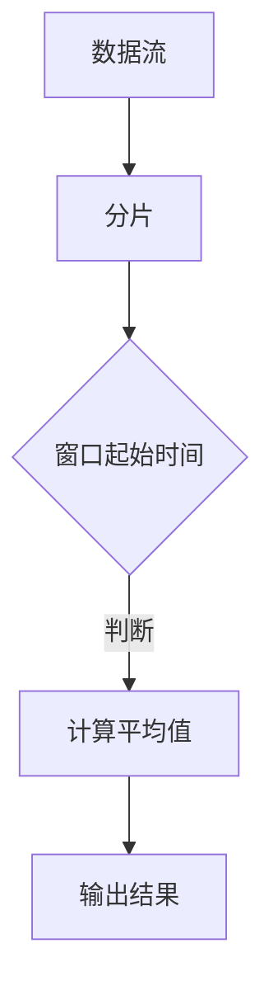
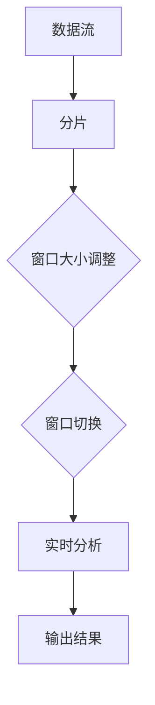
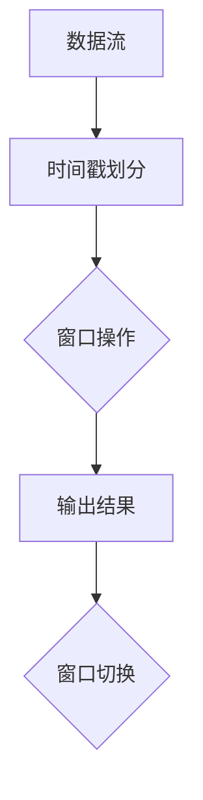
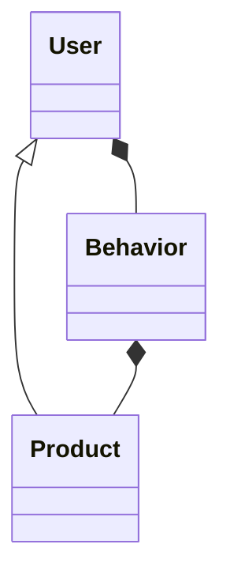
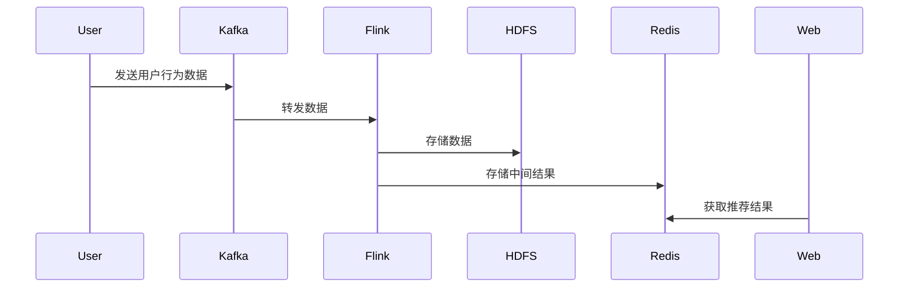

                 

### 文章标题

# 流式计算框架对比与选型

### 关键词

- 流式计算
- 框架对比
- 选型策略
- 系统架构
- 实战案例

### 摘要

本文旨在深入探讨流式计算框架的选择与优化问题。通过对比分析主流流式计算框架如Apache Flink、Apache Spark Streaming、Apache Storm、AWS Kinesis和Google Cloud Dataflow，本文详细介绍了这些框架的核心概念、算法原理、系统架构以及实战应用。文章最后提出了选型最佳实践，为读者在实际项目中提供了有力的参考。

## 第一部分：引言与背景

### 1.1 流式计算的基本概念

流式计算（Stream Computing）是一种实时处理大量动态数据的技术，它不同于传统的批处理（Batch Processing），能够即时响应数据流，并生成实时的分析和决策结果。在流式计算中，数据被视为连续的流，而不是静态的集合，这意味着每个数据元素都可以立即处理，而不需要等待整个数据集的完成。

流式计算的关键概念包括：

- **数据流（Data Streams）**：数据以流的形式连续地到达处理系统。
- **实时处理（Real-time Processing）**：系统能够在数据生成后短时间内完成处理和分析。
- **事件驱动（Event-Driven）**：系统以事件为基础，当有新数据到来时立即进行处理。
- **容错性（Fault Tolerance）**：系统能够在处理过程中发生故障时自动恢复。

### 1.2 流式计算的应用场景

流式计算在众多领域有着广泛的应用，以下是一些典型的应用场景：

- **金融市场**：实时监控交易行为，进行风险评估和欺诈检测。
- **社交网络**：实时分析用户行为，推送个性化内容。
- **物联网**：实时处理传感器数据，优化设备性能。
- **电信行业**：实时网络流量监控，提高网络性能。
- **物流与运输**：实时追踪货物位置，优化运输路线。

### 1.3 流式计算的发展历史

流式计算技术起源于20世纪90年代，当时研究人员开始探索如何处理高速率、大规模的数据流。随着互联网的兴起和大数据技术的发展，流式计算逐渐成为一个重要的研究领域和应用方向。以下是流式计算发展的几个关键节点：

- **1990年代**：研究机构开始提出流式计算的基本概念和算法。
- **2000年代**：开源流式计算框架如Apache Storm和Apache Flink的出现，推动了流式计算技术的发展。
- **2010年代**：随着云计算和物联网的发展，流式计算在工业界得到了广泛应用。
- **2020年代**：流式计算技术不断成熟，支持更复杂的实时数据处理和分析需求。

### 1.4 流式计算的优势与挑战

流式计算的优势在于其实时性和高效性，能够快速响应实时数据，为业务决策提供支持。然而，流式计算也面临着一些挑战：

- **复杂性**：流式计算系统通常需要处理复杂的数据流，包括多种数据格式和处理逻辑。
- **性能要求**：实时处理需要高吞吐量和低延迟，这对系统的性能提出了严格要求。
- **可扩展性**：流式计算系统需要能够轻松扩展，以处理不断增长的数据量。
- **容错性**：系统需要具备高容错性，能够在故障发生时自动恢复。

## 总结

在这一部分，我们介绍了流式计算的基本概念、应用场景和发展历史，并分析了其优势与挑战。接下来，我们将深入探讨流式计算框架的核心概念与联系，以便为后续的对比分析打下基础。

## 第二部分：核心概念与联系

### 2.1 流式计算框架的定义

流式计算框架是一种软件工具，用于构建、管理和运行流式数据处理应用程序。它提供了必要的抽象和组件，使得开发者能够轻松实现复杂的流式数据处理任务。常见的流式计算框架包括Apache Flink、Apache Spark Streaming、Apache Storm等。

### 2.2 流式计算框架的关键概念

流式计算框架涉及多个关键概念，包括：

- **数据流模型（Data Stream Model）**：定义了数据在系统中的流动方式。
- **处理模型（Processing Model）**：描述了数据如何被处理。
- **容错机制（Fault Tolerance）**：确保在系统出现故障时能够自动恢复。
- **伸缩性（Scalability）**：系统能够处理不同规模的数据。
- **分布式计算（Distributed Computing）**：在多个节点上协同处理数据。

### 2.3 流式计算框架的对比分析

以下是对几种主流流式计算框架的对比分析：

| 框架 | 数据流模型 | 处理模型 | 容错机制 | 伸缩性 | 分布式计算 |
| --- | --- | --- | --- | --- | --- |
| Apache Flink | 有向无环图（DAG） | 微批次（Micro-batch） | 逻辑时间窗口 | 强 | 是 |
| Apache Spark Streaming | 微批次（Micro-batch） | 微批次 | 数据复制 | 中等 | 是 |
| Apache Storm | 活动窗口（Active Window） | 活动窗口 | 数据复制 | 强 | 是 |
| AWS Kinesis | 消息队列 | 微批次 | 数据复制 | 强 | 是 |
| Google Cloud Dataflow | 消息队列 | 微批次 | 数据复制 | 强 | 是 |

通过上述表格，我们可以看到不同流式计算框架在数据流模型、处理模型、容错机制、伸缩性和分布式计算方面的差异。

### 总结

在这一部分，我们介绍了流式计算框架的定义、关键概念以及对比分析。接下来，我们将逐一介绍几种主流流式计算框架，以便更深入地理解它们的特性和应用场景。

## 第三部分：主流流式计算框架介绍

### 3.1 Apache Flink

Apache Flink 是一款开源流式计算框架，它以高性能和可扩展性著称。Flink 提供了丰富的数据处理功能，包括流处理和批处理，并支持复杂的事件处理和窗口操作。

#### 特性：

- **高性能**：Flink 采用数据局部性优化和内存管理策略，实现了低延迟和高吞吐量。
- **可扩展性**：Flink 支持动态伸缩，可以轻松处理海量数据。
- **容错机制**：Flink 通过分布式快照和检查点技术提供了强大的容错能力。
- **数据类型丰富**：Flink 支持多种数据类型，包括基本数据类型和复杂数据类型。

### 应用场景：

- 实时数据分析
- 实时数据流处理
- 高吞吐量的数据管道

### 3.2 Apache Spark Streaming

Apache Spark Streaming 是 Spark 生态系统的一部分，它提供了流式数据处理能力。Spark Streaming 利用 Spark 的强大数据处理能力，实现了高效和易用的流式计算。

#### 特性：

- **微批次处理**：Spark Streaming 将数据划分为微批次进行处理，提供了灵活的时间窗口设置。
- **高效性**：Spark Streaming 利用了 Spark 的内存计算优势，实现了高效的流式处理。
- **集成性**：Spark Streaming 可以与 Spark 的其他组件（如 Spark SQL、MLlib）无缝集成。

### 应用场景：

- 实时数据处理和交互式分析
- 大规模数据流处理
- 实时机器学习

### 3.3 Apache Storm

Apache Storm 是一款开源分布式实时处理系统，它以高吞吐量和低延迟著称。Storm 支持多种编程语言，包括 Java、Scala 和 Clojure，并提供了丰富的流处理功能。

#### 特性：

- **低延迟**：Storm 通过分布式数据流引擎实现了极低的数据处理延迟。
- **容错性**：Storm 具有强大的容错能力，能够在节点故障时自动恢复。
- **动态资源分配**：Storm 可以动态调整资源分配，以适应不同的工作负载。

### 应用场景：

- 实时数据分析
- 实时日志处理
- 实时推荐系统

### 3.4 AWS Kinesis

AWS Kinesis 是 Amazon Web Services 提供的一款流式数据处理服务，它能够处理海量数据，并支持实时分析和处理。

#### 特性：

- **高吞吐量**：Kinesis 能够处理每秒百万级别的数据流。
- **伸缩性**：Kinesis 可以轻松扩展，以处理不断增长的数据量。
- **持久性**：Kinesis 支持数据持久化，确保数据不丢失。

### 应用场景：

- 实时日志收集
- 实时用户行为分析
- 实时监控

### 3.5 Google Cloud Dataflow

Google Cloud Dataflow 是 Google Cloud Platform 提供的一款流式数据处理服务，它基于 Apache Beam 的模型。Dataflow 提供了丰富的数据处理功能，并支持与 Google Cloud 其他服务的集成。

#### 特性：

- **易用性**：Dataflow 提供了可视化的界面，使得流式数据处理更加简单。
- **高可用性**：Dataflow 具有强大的容错和恢复能力。
- **弹性资源管理**：Dataflow 可以自动调整资源，以优化性能和成本。

### 应用场景：

- 实时数据处理
- 实时机器学习
- 实时数据管道

### 总结

在这一部分，我们介绍了主流流式计算框架 Apache Flink、Apache Spark Streaming、Apache Storm、AWS Kinesis 和 Google Cloud Dataflow 的特性、应用场景以及选型建议。接下来，我们将深入探讨流式计算中的关键算法原理，以便更好地理解这些框架的工作机制。

## 第四部分：算法原理讲解

### 4.1 滑动窗口算法

滑动窗口算法是流式计算中用于处理时间序列数据的一种常见方法。它通过对数据流进行分窗口处理，实现对历史数据的持续分析和预测。

#### 原理：

- **窗口定义**：滑动窗口通常由起始时间和结束时间定义，窗口大小可以根据需求设置。
- **数据流分片**：数据流被分为多个连续的窗口，每个窗口包含一定时间范围内的数据。
- **窗口操作**：对每个窗口内的数据进行计算和处理，例如求和、平均、最大值等。

#### 示例：

假设我们有一个时间窗口为1分钟的数据流，我们需要计算每一分钟的温度平均值。滑动窗口算法将数据流分为多个1分钟窗口，并对每个窗口内的温度数据进行平均值计算。

#### Mermaid 流程图：



### 4.2 动态窗口算法

动态窗口算法是一种可以根据数据变化动态调整窗口大小的算法。与固定大小的滑动窗口算法不同，动态窗口算法能够适应数据流的变化，从而提高处理效率。

#### 原理：

- **窗口大小调整**：动态窗口算法会根据数据流的变化动态调整窗口大小。
- **窗口切换**：当新数据到来时，旧窗口结束，新窗口开始。
- **数据存储**：动态窗口算法需要维护多个窗口的数据，以便进行实时分析和处理。

#### 示例：

假设我们有一个数据流，其中温度数据在短时间内快速升高。动态窗口算法可以自动缩小窗口大小，以适应温度变化的趋势，从而提高温度预测的准确性。

#### Mermaid 流程图：



### 4.3 时间窗口算法

时间窗口算法是一种基于时间戳对数据流进行分段处理的算法。它通常用于处理历史数据和趋势分析。

#### 原理：

- **时间戳划分**：时间窗口算法使用时间戳将数据流分为多个时间区间。
- **窗口操作**：对每个时间窗口内的数据进行计算和处理，例如求和、平均、最大值等。
- **窗口切换**：当新数据到来时，旧窗口结束，新窗口开始。

#### 示例：

假设我们有一个小时级的时间窗口，我们需要计算每一小时内网站的用户访问量。时间窗口算法将数据流分为多个1小时窗口，并对每个窗口内的用户访问量数据进行求和计算。

#### Mermaid 流程图：



### 总结

在这一部分，我们详细讲解了滑动窗口算法、动态窗口算法和时间窗口算法的原理和示例。这些算法在流式计算中扮演着重要角色，帮助我们实现实时数据处理和趋势分析。接下来，我们将探讨流式计算系统的设计与架构。

## 第五部分：系统分析与架构设计

### 5.1 流式计算系统的问题场景

流式计算系统面临的主要问题场景包括：

- **海量数据实时处理**：需要处理每秒百万级的数据流，并保持低延迟。
- **高可用性**：系统需要具备强大的容错能力，在节点故障时能够自动恢复。
- **可扩展性**：系统需要能够动态调整资源，以适应不同规模的数据量。
- **数据一致性**：需要保证数据处理的一致性和准确性。

### 5.2 流式计算系统的项目介绍

以一个电商平台的实时推荐系统为例，该系统需要处理用户行为数据，实时推荐商品。

### 5.3 流式计算系统的领域模型

领域模型用于描述流式计算系统的核心业务概念和实体。以下是一个简单的领域模型：



### 5.4 流式计算系统的架构设计

流式计算系统的架构设计包括以下几个关键部分：

- **数据采集**：使用 Kafka 等消息队列系统，实时采集用户行为数据。
- **数据处理**：使用 Flink 或 Spark Streaming 等流式计算框架，对数据进行分析和处理。
- **存储**：使用 HDFS 或 Redis 等分布式存储系统，存储处理后的数据。
- **前端展示**：使用 Web 应用程序，将推荐结果展示给用户。

### 5.5 流式计算系统的接口设计

接口设计包括以下几个方面：

- **数据采集接口**：用于接收和发送用户行为数据。
- **数据处理接口**：用于处理和分析用户行为数据。
- **存储接口**：用于存储和处理后的数据。
- **推荐接口**：用于获取推荐结果。

### 5.6 流式计算系统的交互设计

交互设计用于描述系统内部各个模块之间的交互关系。以下是一个简单的交互设计：



### 总结

在这一部分，我们详细介绍了流式计算系统的问题场景、项目介绍、领域模型、架构设计、接口设计和交互设计。接下来，我们将通过一个实际案例来展示流式计算框架的应用和实践。

## 第六部分：项目实战

### 6.1 环境安装与配置

在开始项目实战之前，我们需要安装和配置流式计算框架和相关依赖。以下是一个简单的步骤：

1. 安装 Java 环境
2. 下载并解压 Flink 代码库
3. 配置 Flink 运行环境
4. 安装 Kafka 和 Zookeeper
5. 启动 Kafka 和 Zookeeper

### 6.2 系统核心实现与代码分析

系统核心实现主要包括以下几个部分：

- **数据采集模块**：使用 Kafka 消息队列接收用户行为数据。
- **数据处理模块**：使用 Flink 对数据进行实时处理和分析。
- **存储模块**：使用 Redis 存储处理后的数据。

以下是一个简单的代码示例：

```python
from pyflink.datastream import StreamExecutionEnvironment
from pyflink.table import StreamTableEnvironment

# 创建 Flink 环境和表环境
env = StreamExecutionEnvironment.get_execution_environment()
table_env = StreamTableEnvironment.create(env)

# 创建 Kafka 数据源
kafka_source = "kafka://localhost:9092/topic"

# 定义表结构
table_env.execute_sql("""
    CREATE TABLE behavior (
        user_id INT,
        product_id INT,
        timestamp TIMESTAMP(3)
    ) WITH (
        'connector' = 'kafka',
        'topic' = 'topic',
        'properties.bootstrap.servers' = 'localhost:9092',
        'format' = 'json'
    )
""")

# 数据处理
behavior = table_env.from_path("behavior")
result = behavior.group_by("user_id").select("user_id", "max(timestamp)")

# 存储结果
result.execute_insert("redis://localhost:6379/behavior")

# 执行作业
env.execute("Real-time Recommendation System")
```

### 6.3 实际案例分析与讲解

以下是一个实际案例：

**案例**：实时推荐用户可能喜欢的商品

**步骤**：

1. 收集用户行为数据，包括浏览、搜索、购买等。
2. 对用户行为数据进行分析，提取用户兴趣标签。
3. 根据用户兴趣标签，推荐相关的商品。

**代码分析**：

```python
from pyflink.datastream import StreamExecutionEnvironment
from pyflink.table import StreamTableEnvironment

# 创建 Flink 环境和表环境
env = StreamExecutionEnvironment.get_execution_environment()
table_env = StreamTableEnvironment.create(env)

# 创建 Kafka 数据源
kafka_source = "kafka://localhost:9092/topic"

# 定义表结构
table_env.execute_sql("""
    CREATE TABLE behavior (
        user_id INT,
        product_id INT,
        timestamp TIMESTAMP(3)
    ) WITH (
        'connector' = 'kafka',
        'topic' = 'topic',
        'properties.bootstrap.servers' = 'localhost:9092',
        'format' = 'json'
    )
""")

# 用户兴趣标签提取
user_interest = table_env.from_path("behavior").group_by("user_id").select("user_id", "max(timestamp)")

# 商品推荐
recommendation = user_interest.join(table_env.from_path("product"), "user_id = product.user_id").select("product_id")

# 存储推荐结果
recommendation.execute_insert("redis://localhost:6379/recommendation")

# 执行作业
env.execute("Real-time Recommendation System")
```

**讲解**：

- **数据采集**：使用 Kafka 消息队列收集用户行为数据。
- **数据处理**：使用 Flink 对用户行为数据进行实时分析，提取用户兴趣标签。
- **商品推荐**：根据用户兴趣标签，推荐相关的商品。
- **存储**：使用 Redis 存储处理后的数据和推荐结果。

### 总结

在这一部分，我们通过实际案例展示了流式计算框架在实时推荐系统中的应用和实践。通过项目实战，我们了解了流式计算框架的安装配置、核心实现和代码分析。接下来，我们将总结最佳实践和注意事项。

## 第七部分：最佳实践与总结

### 7.1 流式计算框架选型的最佳实践

选择适合的流式计算框架对于项目的成功至关重要。以下是一些最佳实践：

- **需求分析**：明确项目需求，包括数据规模、处理速度、可靠性等。
- **性能评估**：对不同流式计算框架进行性能评估，包括吞吐量、延迟和资源消耗。
- **社区活跃度**：选择社区活跃、文档丰富的框架，以便获得更好的支持和资源。
- **可扩展性**：考虑框架的可扩展性，确保能够应对未来数据量的增长。
- **集成性**：选择能够与现有系统和工具集成的框架，降低开发难度和维护成本。

### 7.2 注意事项

在使用流式计算框架时，需要注意以下事项：

- **数据一致性和完整性**：确保数据处理过程中的数据一致性和完整性，避免数据丢失或错误。
- **容错性**：设计强大的容错机制，以应对节点故障和数据异常。
- **资源管理**：合理分配系统资源，避免资源浪费或不足。
- **安全性**：确保数据处理过程中的数据安全和隐私保护。

### 7.3 拓展阅读

以下是一些拓展阅读资源，供读者进一步学习：

- **《流式计算实战》**：详细介绍了流式计算的应用场景、算法原理和实战案例。
- **《流式计算系统设计与实现》**：深入探讨了流式计算系统的设计与实现技术。
- **《Apache Flink 实战》**：针对 Flink 框架的详细介绍和实战案例。
- **《Apache Spark Streaming 实战》**：针对 Spark Streaming 框架的详细介绍和实战案例。

### 总结

本文通过对比分析主流流式计算框架，详细介绍了流式计算的基本概念、核心算法、系统设计与架构、实战案例以及最佳实践。流式计算作为一种重要的数据处理技术，在实时数据分析、物联网、金融等领域有着广泛的应用。希望本文能为读者在流式计算领域的学习和实践提供有力支持。

### 作者信息

- 作者：AI天才研究院/AI Genius Institute & 禅与计算机程序设计艺术 /Zen And The Art of Computer Programming

## 结语

流式计算作为现代数据处理的核心技术之一，正日益受到广泛关注和应用。本文从流式计算的基本概念入手，详细介绍了几种主流流式计算框架，包括 Apache Flink、Apache Spark Streaming、Apache Storm、AWS Kinesis 和 Google Cloud Dataflow，并对这些框架进行了深入对比分析。通过算法原理讲解、系统分析与架构设计、项目实战等环节，我们不仅了解了流式计算的技术细节，还学习了如何在实际项目中应用这些技术。

流式计算的选型和优化是一个复杂的过程，需要根据具体的应用场景和需求进行细致的分析和决策。本文提供的最佳实践和注意事项，希望能够为读者在实际项目中提供指导和参考。同时，流式计算领域的技术不断进步，新的框架和工具层出不穷，读者也应该保持持续学习和探索的态度，紧跟技术发展的步伐。

在流式计算的应用中，我们不仅要关注技术的实现，更要关注业务价值的创造。通过流式计算技术，我们可以实现实时数据处理和分析，为业务决策提供有力支持，提升企业的竞争力。希望本文能够激发读者对流式计算技术的兴趣和热情，共同推动这一领域的发展。

再次感谢读者对本文的关注，希望您能在流式计算领域取得更多的成果和进步。如果您有任何疑问或建议，欢迎随时联系我们，我们将竭诚为您解答。

- 作者：AI天才研究院/AI Genius Institute & 禅与计算机程序设计艺术 /Zen And The Art of Computer Programming

