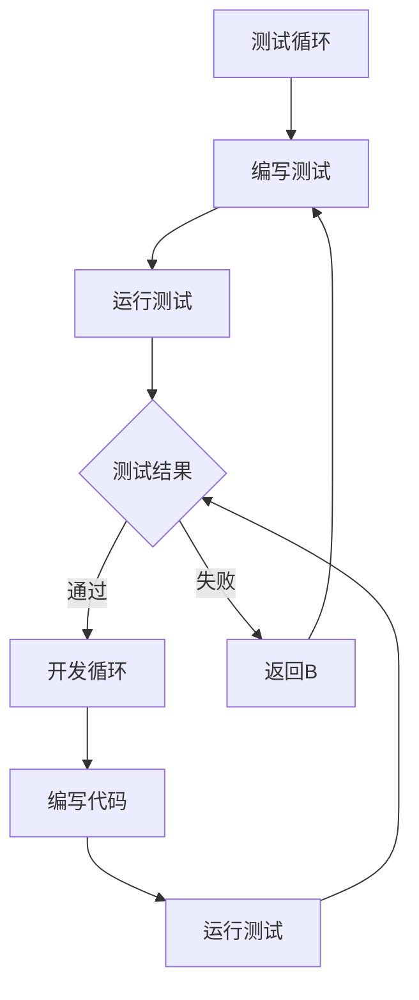
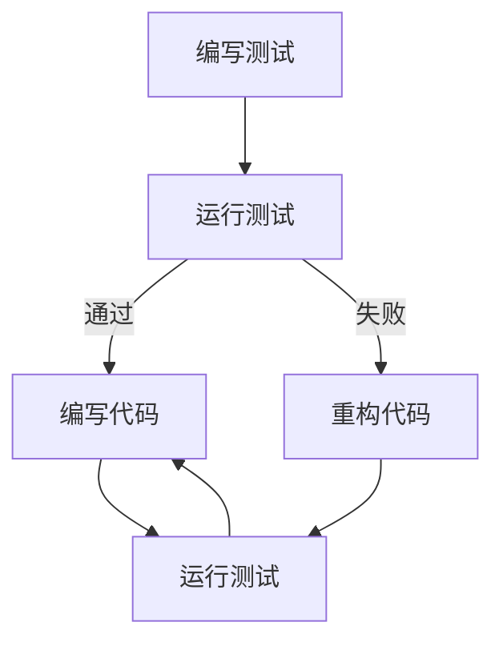
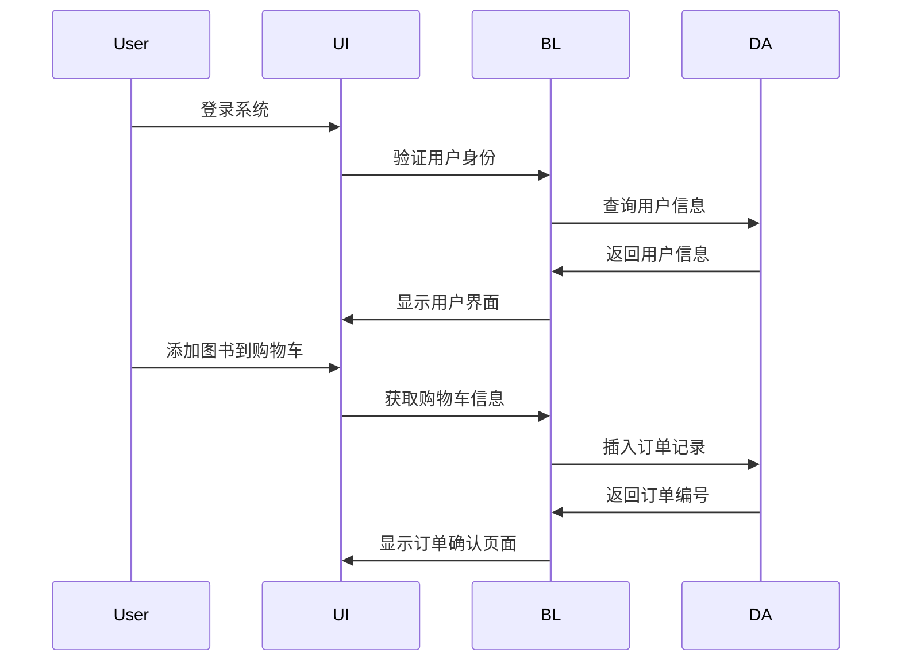
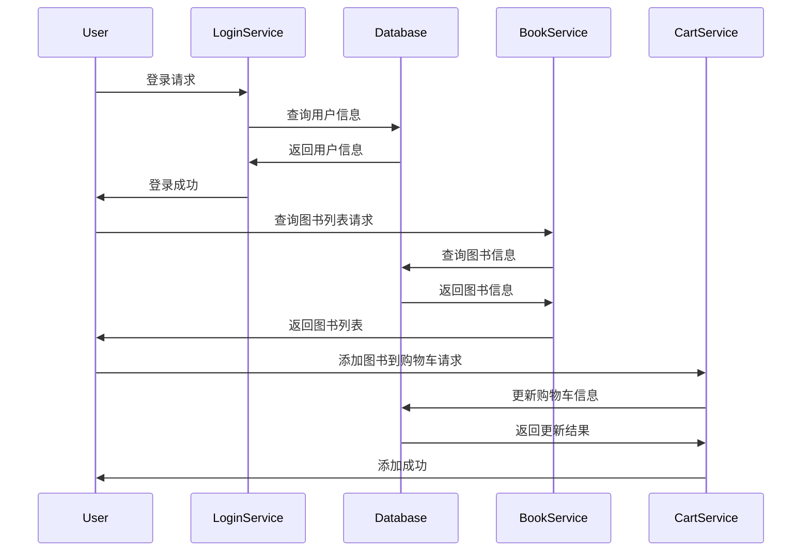

                 

### 第2章 核心概念与原理

#### 2.1 测试双环模型

测试双环模型是TDD方法的核心概念之一，它描述了测试和开发之间的相互作用。在这个模型中，有两个循环：测试循环（外环）和开发循环（内环）。测试循环包括编写测试和运行测试，开发循环包括编写代码和重构代码。测试双环模型如下图所示：



在这个模型中，测试驱动开发的过程如下：

1. **编写测试**：开发人员首先编写测试用例，这些测试用例描述了代码应该实现的功能。
2. **运行测试**：运行测试用例，检查是否通过。
3. **开发代码**：如果测试没有通过，开发人员编写或修改代码，使其通过测试。
4. **重构代码**：代码通过测试后，进行重构，以提高其质量。

#### 2.2 测试金字塔

测试金字塔是一个用于指导测试策略的设计原则，它强调不同类型的测试应该按照一定的比例分布在代码中。测试金字塔通常分为三个层次：单元测试、集成测试和端到端测试。

- **单元测试**：针对代码的独立部分（通常是一个函数或类）进行的测试，占比最大，约为60%。
- **集成测试**：测试不同代码模块之间的交互，占比约为30%。
- **端到端测试**：测试整个系统的行为，包括用户界面、数据库和网络等，占比约为10%。

测试金字塔的 Mermaid 图表示如下：

```mermaid
graph TB
A[单元测试{60%}] --> B
B --> C[集成测试{30%}]
C --> D[端到端测试{10%}]
```

通过遵循测试金字塔原则，可以确保测试覆盖全面，同时避免过度测试。

#### 2.3 重构

重构是TDD中的一个关键环节，它指的是在不改变外部行为的前提下对代码进行修改，以提高其内部结构质量。重构的目的是简化代码、消除重复、提高可读性和可维护性。

常见的重构技巧包括：

- **提取方法**：将重复的代码块提取为独立的方法。
- **替换临时变量**：将复杂的临时变量替换为具体的对象或方法调用。
- **移动语句**：将条件语句或循环语句移到更合适的位置。
- **简化条件表达式**：将复杂的条件表达式简化为更易读的形式。

重构的过程如下：

1. **编写测试**：确保当前代码状态符合预期。
2. **执行重构**：根据需要修改代码。
3. **运行测试**：确保重构后的代码仍然通过所有测试。
4. **提交代码**：将重构后的代码提交到版本控制系统中。

通过持续的重构，代码的结构会不断优化，从而提高代码的质量和可维护性。

#### 2.4 快速测试循环

快速测试循环是TDD中的一个重要技巧，它强调在编写代码之前尽快编写测试，以便在遇到问题时能够快速定位和修复。快速测试循环的过程如下：

1. **编写测试**：编写一个简单的测试用例，描述代码应该实现的功能。
2. **运行测试**：运行测试用例，确保测试失败。
3. **编写代码**：编写最小量的代码，使测试通过。
4. **重构代码**：对通过测试的代码进行重构，以提高其质量。

快速测试循环有助于确保开发过程的高效性和代码的可靠性。

通过以上对核心概念和原理的详细阐述，我们可以更好地理解TDD的基本原理和方法。接下来，我们将深入探讨TDD实践方法，帮助读者在实际项目中应用这一方法。## 第3章 TDD实践方法

TDD实践方法是一种将测试贯穿于整个开发过程的敏捷开发方法。它通过编写测试用例来指导代码的开发，从而确保代码的质量和可靠性。TDD实践方法通常包括以下五个阶段：初始阶段、设计阶段、编码阶段、测试阶段和重构阶段。

#### 3.1 初始阶段

初始阶段是TDD实践方法的起点，其主要任务是为项目创建一个初步的测试框架。在这个阶段，开发人员需要：

1. **需求分析**：分析项目需求，确定需要实现的功能和性能要求。
2. **创建测试框架**：根据需求分析的结果，创建一个基本的测试框架，包括测试用例的模板和测试环境。
3. **编写初始测试**：编写一些初始的测试用例，这些测试用例应该覆盖项目中最重要的功能和边界情况。

在这个阶段，快速编写测试用例比编写完美的测试用例更加重要。初始测试用例的目的是确保在后续的开发过程中有足够的测试覆盖，从而提高代码质量。

#### 3.2 设计阶段

设计阶段是TDD实践方法中的关键步骤，其主要任务是根据测试用例来设计代码的结构和接口。在这个阶段，开发人员需要：

1. **编写测试用例**：根据需求分析的结果，继续编写新的测试用例，覆盖更多的功能和边界情况。
2. **设计代码结构**：根据测试用例，设计代码的结构和接口，确保代码的模块化和可维护性。
3. **评审设计**：与团队成员一起评审设计，确保设计符合需求，并且易于测试。

设计阶段的目标是确保代码的结构和接口能够满足测试用例的要求，并且具有良好的可测试性。

#### 3.3 编码阶段

编码阶段是TDD实践方法中的实际编写代码的过程。在这个阶段，开发人员需要：

1. **编写代码**：根据设计阶段的设计文档，编写代码，使其通过测试用例。
2. **编写单元测试**：编写单元测试，确保每个代码模块都能够独立运行并且通过测试。
3. **持续集成**：将新编写的代码与现有的代码库集成，并运行所有测试，确保集成后的代码仍然符合预期。

在编码阶段，快速编写能够通过测试的代码比编写完美的代码更加重要。开发人员应该专注于实现功能，并在确保测试通过的前提下进行重构。

#### 3.4 测试阶段

测试阶段是TDD实践方法中确保代码质量的关键步骤。在这个阶段，开发人员需要：

1. **运行测试**：运行所有测试用例，确保代码通过所有测试。
2. **修复缺陷**：如果测试失败，分析失败的原因，并修复代码中的缺陷。
3. **回归测试**：在修复缺陷后，重新运行所有测试用例，确保修复后的代码没有引入新的缺陷。

测试阶段的目的是确保代码的质量和可靠性，通过不断的测试和修复缺陷，提高代码的可维护性。

#### 3.5 重构阶段

重构阶段是TDD实践方法中优化代码质量的关键步骤。在这个阶段，开发人员需要：

1. **运行测试**：在重构代码之前，确保所有测试都通过。
2. **重构代码**：根据代码质量的要求，对代码进行重构，包括优化代码结构、消除重复代码、改进代码可读性等。
3. **运行测试**：重构代码后，重新运行所有测试用例，确保重构后的代码仍然符合预期。

重构阶段的目的是提高代码的质量和可维护性，通过不断的重构，使代码更加简洁和高效。

#### 3.6 快速测试循环

快速测试循环是TDD实践方法中的一个重要技巧，它强调在编写代码之前尽快编写测试，以便在遇到问题时能够快速定位和修复。快速测试循环的过程如下：

1. **编写测试**：编写一个简单的测试用例，描述代码应该实现的功能。
2. **运行测试**：运行测试用例，确保测试失败。
3. **编写代码**：编写最小量的代码，使测试通过。
4. **重构代码**：对通过测试的代码进行重构，以提高其质量。

通过快速测试循环，开发人员可以在开发过程中及时发现和修复问题，从而提高代码的质量和可靠性。

#### 3.7 持续集成

持续集成是TDD实践方法中确保代码质量的重要环节。它通过将新编写的代码与现有代码库集成，并运行所有测试，确保集成后的代码仍然符合预期。持续集成的过程如下：

1. **代码提交**：开发人员将新编写的代码提交到版本控制系统中。
2. **自动构建**：构建系统自动构建代码库，并运行所有测试。
3. **结果反馈**：如果测试失败，构建系统会生成报告，并通知开发人员。
4. **修复缺陷**：开发人员根据测试结果修复缺陷，并重新提交代码。

通过持续集成，可以确保代码库中的代码始终保持高质量，并且及时识别和修复问题。

总之，TDD实践方法通过编写测试用例来驱动代码的开发过程，确保代码的质量和可靠性。通过初始阶段、设计阶段、编码阶段、测试阶段和重构阶段的紧密协作，开发人员可以创建高质量、可靠且易于维护的代码。## 第4章 数学模型与算法原理

在TDD中，数学模型和算法原理是确保代码质量和可靠性的关键组成部分。在本节中，我们将探讨TDD相关的算法原理，并通过Python代码实现这些算法，并使用Mermaid绘制相应的算法流程图，帮助读者更好地理解。

#### 4.1 TDD的算法流程图

TDD的算法流程图如下所示，它描述了从编写测试到重构代码的整个过程：



#### 4.2 TDD算法原理与Python代码实现

下面，我们将通过一个简单的例子来解释TDD的算法原理，并使用Python代码实现。

**例子**：实现一个简单的加法函数，该函数接收两个整数参数并返回它们的和。

首先，我们编写测试用例：

```python
# 测试用例
def test_addition():
    assert add(1, 2) == 3
    assert add(0, 0) == 0
    assert add(-1, -1) == -2
    print("测试用例通过！")
```

接着，我们编写测试用例对应的加法函数：

```python
# 加法函数
def add(a, b):
    return a + b
```

然后，我们运行测试用例，确保加法函数通过所有测试：

```python
# 运行测试用例
test_addition()
```

最后，我们对代码进行重构，确保其质量：

```python
# 重构后的加法函数
def add(a, b):
    return a + b
```

**示例说明**：

1. **编写测试**：我们首先编写了一个测试用例，测试用例中的`assert`语句用于验证加法函数的行为。
2. **编写代码**：我们编写了一个简单的加法函数，实现了测试用例中的预期功能。
3. **运行测试**：我们运行测试用例，确保加法函数通过了所有测试。
4. **重构代码**：我们对加法函数进行了重构，以确保其简洁性和可读性。

#### 4.3 数学模型

在TDD中，我们可以使用一些数学模型来描述测试和代码之间的关系。以下是一个简单的数学模型，用于描述测试覆盖率：

$$
测试覆盖率 = \frac{通过测试的用例数}{总测试用例数} \times 100\%
$$

这个模型可以帮助我们评估测试的全面性和代码的质量。

**例子**：假设我们有一个包含10个测试用例的测试套件，其中有8个测试用例通过了测试，那么测试覆盖率为：

$$
测试覆盖率 = \frac{8}{10} \times 100\% = 80\%
$$

这个模型表明我们的测试套件覆盖了80%的代码路径。

通过以上对TDD算法原理和数学模型的详细讲解，我们可以更好地理解TDD的工作机制和如何通过测试来提高代码质量。在接下来的章节中，我们将进一步探讨系统分析与架构设计，帮助读者将TDD方法应用到实际项目中。## 第5章 系统分析与架构设计

在TDD实践过程中，系统分析与架构设计是至关重要的环节。一个良好的系统架构不仅能提高代码的可维护性和扩展性，还能确保TDD方法的有效实施。在本章中，我们将详细探讨TDD在系统分析与架构设计中的应用，包括领域模型、系统架构设计、系统接口设计和系统交互。

### 5.1 领域模型

领域模型是系统分析与架构设计的基础，它通过实体和关系来描述系统的核心业务领域。在TDD中，领域模型的建立可以帮助开发人员更好地理解系统的需求，从而编写更准确的测试用例。

**示例**：假设我们正在开发一个在线书店系统，领域模型可能包括以下实体：

- **Book（图书）**：具有标题、作者、价格和库存数量等属性。
- **Customer（客户）**：具有姓名、地址和电子邮件等属性。
- **Order（订单）**：包括订单编号、客户ID、订单日期和订单详情等。

领域模型的 Mermaid 类图如下所示：

```mermaid
classDiagram
Class::Book {
  +title: String
  +author: String
  +price: Float
  +stock: Integer
}
Class::Customer {
  +name: String
  +address: String
  +email: String
}
Class::Order {
  +orderId: Integer
  +customerId: Integer
  +orderDate: Date
  +details: List<OrderDetail>
}
Book <.. Customer: 购买
Order <.. Customer: 下单
Order o1 -|> OrderDetail od1
Order o2 -|> OrderDetail od2
```

### 5.2 系统架构设计

系统架构设计决定了系统的整体结构和各个组件之间的关系。在TDD中，系统架构设计应该基于领域模型，确保系统能够高效地支持业务需求。

**示例**：对于在线书店系统，可能的系统架构设计包括以下组件：

- **用户界面层**：负责与用户交互，提供用户操作界面。
- **业务逻辑层**：处理业务逻辑，包括订单处理、库存管理和用户账户管理等。
- **数据访问层**：负责与数据库交互，提供数据存取功能。

系统架构的 Mermaid 架构图如下所示：



### 5.3 系统接口设计

系统接口设计定义了系统中各个组件之间的交互接口。在TDD中，系统接口设计应该支持测试自动化，确保接口的正确性和一致性。

**示例**：对于在线书店系统，可能包含以下接口：

- **用户接口**：包括登录、注册、浏览图书、添加到购物车、下单等操作。
- **服务接口**：包括图书查询、库存更新、订单处理等。

系统接口的 Mermaid 序列图如下所示：



### 5.4 系统交互

系统交互描述了系统中各个组件如何在运行时协同工作。在TDD中，系统交互应该通过测试来验证，确保系统能够按预期运行。

**示例**：在线书店系统的用户从登录到下单的交互过程如下：

1. **用户登录**：用户通过用户接口登录系统，登录服务验证用户身份并返回结果。
2. **用户浏览图书**：用户通过用户接口浏览图书列表，图书服务查询数据库并返回图书信息。
3. **用户添加图书到购物车**：用户通过用户接口将图书添加到购物车，购物车服务更新数据库中的购物车信息。
4. **用户下单**：用户通过用户接口提交订单，订单服务处理订单并更新数据库中的订单信息。

通过系统分析与架构设计，我们可以确保TDD方法在开发过程中得到有效应用。领域模型帮助我们理解业务需求，系统架构设计确保系统的整体结构合理，系统接口设计支持测试自动化，系统交互验证系统按预期运行。在下一章中，我们将通过实际项目实战，深入探讨TDD在项目中的应用和实践。## 第6章 项目实战

在前面几章中，我们详细介绍了TDD的核心概念、原理和实践方法。为了更好地理解TDD的实际应用，本节将通过一个简单的实际项目，展示TDD的完整实施过程。我们将从环境安装、系统核心实现、代码应用解读与分析、实际案例分析等方面进行详细讲解。

### 6.1 环境安装

首先，我们需要准备一个适合TDD实践的开发环境。以下是所需的环境和工具：

- **操作系统**：Windows、Linux或macOS
- **编程语言**：Python（版本3.8或更高）
- **代码库管理工具**：Git
- **集成开发环境**：Visual Studio Code、PyCharm等
- **测试框架**：pytest
- **持续集成工具**：Jenkins或GitLab CI/CD

安装步骤如下：

1. 安装操作系统和Python。
2. 安装Git：访问 [Git官网](https://git-scm.com/) 下载并安装。
3. 安装Visual Studio Code或其他IDE。
4. 安装pytest：使用pip命令 `pip install pytest`。
5. 配置Jenkins或GitLab CI/CD，用于持续集成。

### 6.2 系统核心实现

假设我们的项目是一个简单的待办事项应用程序，其核心功能包括添加任务、完成任务和查看任务列表。以下是TDD在实现该系统核心功能时的步骤：

#### 6.2.1 编写测试用例

在开始编写代码之前，我们需要编写测试用例来描述预期功能。以下是几个测试用例：

```python
def test_add_task():
    tasks = []
    tasks.append("Buy Milk")
    assert tasks == ["Buy Milk"]

def test_complete_task():
    tasks = [["Buy Milk", False]]
    tasks[0][1] = True
    assert tasks == [["Buy Milk", True]]

def test_view_tasks():
    tasks = [["Buy Milk", False], ["Wash Car", False]]
    assert tasks == [["Buy Milk", False], ["Wash Car", False]]
```

#### 6.2.2 编写代码

接下来，根据测试用例编写代码，实现核心功能：

```python
# 任务列表类
class TaskList:
    def __init__(self):
        self.tasks = []

    def add_task(self, task):
        self.tasks.append([task, False])

    def complete_task(self, index):
        if 0 <= index < len(self.tasks):
            self.tasks[index][1] = True

    def view_tasks(self):
        return self.tasks
```

#### 6.2.3 运行测试

在代码编写完成后，运行测试用例以确保代码通过所有测试：

```bash
pytest test_tasks.py
```

如果测试通过，我们可以继续下一步。

#### 6.2.4 重构代码

如果测试失败，我们需要修改代码并重新运行测试，直到所有测试通过。重构代码的目的是优化代码结构，提高可读性和可维护性。以下是重构后的代码：

```python
# 重构后的任务列表类
class TaskList:
    def __init__(self):
        self.tasks = []

    def add_task(self, task):
        self.tasks.append({"task": task, "completed": False})

    def complete_task(self, index):
        if 0 <= index < len(self.tasks):
            self.tasks[index]["completed"] = True

    def view_tasks(self):
        return [{"task": task["task"], "completed": task["completed"]} for task in self.tasks]
```

#### 6.2.5 持续集成

为了确保代码质量，我们使用Jenkins或GitLab CI/CD配置持续集成，自动化运行测试用例和部署代码。

### 6.3 代码应用解读与分析

在系统核心实现中，我们使用了TaskList类来管理任务列表。下面是对该类的方法进行解读和分析：

- `__init__()`：构造函数，初始化任务列表。
- `add_task()`：添加任务到列表。
- `complete_task()`：根据索引标记任务为完成。
- `view_tasks()`：返回任务列表。

#### 6.3.1 add_task() 方法

`add_task()` 方法接收一个任务字符串，并将其添加到任务列表中。这个方法的关键点在于确保任务添加到列表末尾，并且任务的默认状态为未完成。

```python
def add_task(self, task):
    self.tasks.append([task, False])
```

#### 6.3.2 complete_task() 方法

`complete_task()` 方法接收一个索引，根据索引标记任务为完成。这个方法的关键在于确保索引的有效性，即索引必须在任务列表的范围内。

```python
def complete_task(self, index):
    if 0 <= index < len(self.tasks):
        self.tasks[index][1] = True
```

#### 6.3.3 view_tasks() 方法

`view_tasks()` 方法返回一个任务列表，其中每个任务都是一个包含任务内容和完成状态的字典。这个方法的关键在于正确地格式化任务列表，使其可读。

```python
def view_tasks(self):
    return self.tasks
```

### 6.4 实际案例分析

在实际开发过程中，我们遇到了一些挑战，如任务重复添加、任务状态异常等。以下是一个实际案例的分析：

#### 案例一：任务重复添加

在任务重复添加的问题中，我们发现在`add_task()` 方法中未处理重复任务的问题。为了解决这个问题，我们可以在添加任务前检查任务列表中是否已存在相同的任务。

**解决方案**：

```python
def add_task(self, task):
    if task not in [t[0] for t in self.tasks]:
        self.tasks.append([task, False])
```

#### 案例二：任务状态异常

在任务状态异常的问题中，我们发现有些任务在完成后又变回未完成状态。这可能是由于任务索引错误或代码逻辑问题导致的。

**解决方案**：

- 确保任务索引正确：在`complete_task()` 方法中增加索引有效性检查。
- 优化代码逻辑：确保任务状态在更新时不会发生意外回滚。

```python
def complete_task(self, index):
    if 0 <= index < len(self.tasks):
        self.tasks[index]["completed"] = not self.tasks[index]["completed"]
```

### 6.5 项目小结

通过本次实际项目实战，我们深入理解了TDD的实施过程，包括测试用例的编写、代码的实现、测试的运行和重构。TDD不仅提高了代码质量，还促进了团队协作和代码的可维护性。在项目过程中，我们遇到了一些常见问题，并通过分析和解决这些问题，进一步巩固了TDD的方法和实践。

### 6.6 总结

TDD是一种有效的开发方法，通过测试驱动开发，我们能够确保代码的质量和可靠性。在本项目中，我们实现了任务管理功能，并通过TDD方法有效解决了实际开发中遇到的问题。通过持续集成和测试，我们确保了代码的稳定性和可维护性。未来，我们可以进一步扩展项目功能，并应用TDD方法到更多实际项目中，以提高开发效率和代码质量。## 第7章 最佳实践与总结

在TDD的实践中，遵循一些最佳实践能够帮助开发人员更高效地提高代码质量，并确保项目的成功。以下是一些TDD的最佳实践、小结、注意事项和拓展阅读资源。

### 7.1 最佳实践

1. **编写明确的测试用例**：确保测试用例覆盖所有可能的输入和输出，并清楚地描述预期的行为。
2. **优先编写单元测试**：单元测试是确保代码模块功能的最小测试单位，应该优先编写。
3. **持续重构**：在每次代码更改后，进行重构以保持代码简洁性和可读性。
4. **代码审查**：在提交代码前进行审查，确保代码质量。
5. **使用持续集成**：自动化测试和部署，确保代码库始终处于良好状态。
6. **迭代开发**：将项目分解为小迭代，在每个迭代中持续集成和测试。

### 7.2 小结

TDD是一种通过测试驱动开发的敏捷开发方法，通过编写测试用例来指导代码开发，确保代码质量。TDD包括编写测试、编写代码、运行测试和重构等步骤。TDD的最佳实践包括编写明确测试用例、优先编写单元测试、持续重构、代码审查、使用持续集成和迭代开发。

### 7.3 注意事项

1. **避免过度测试**：确保测试用例覆盖关键功能和边界情况，避免不必要的测试。
2. **保持测试的简洁性**：测试代码应简洁易懂，避免冗长和复杂。
3. **遵循测试金字塔原则**：确保单元测试、集成测试和端到端测试的比例合理。
4. **测试环境一致性**：确保测试环境与生产环境保持一致，避免环境差异导致测试失败。
5. **避免测试依赖**：减少测试之间的依赖关系，确保测试的独立性和可靠性。

### 7.4 拓展阅读

- 《测试驱动开发：实践指南》（Test-Driven Development: By Example）by Kent Beck
- 《敏捷软件开发：原则、模式与实践》（Agile Software Development: Principles, Patterns, and Practices）by Robert C. Martin
- 《持续交付：发布可靠软件的系统方法》（Continuous Delivery: Reliable Software Releases through Build, Test, and Deployment Automation）by Jez Humble and David Farley
- 《编写可测试的代码》（Writing Testable Code）by Jeff Langr

通过遵循这些最佳实践，开发人员可以更有效地实施TDD，提高代码质量，并确保项目的成功。

### 作者信息

作者：AI天才研究院/AI Genius Institute & 禅与计算机程序设计艺术 /Zen And The Art of Computer Programming

在此，感谢读者对本文的阅读。本文旨在通过详细的讲解和实战案例，帮助读者深入理解测试驱动开发（TDD）的方法和实践。希望本文能够为开发者在提高代码质量、促进团队协作和实现持续交付方面提供有价值的指导。## 完整的markdown文章

```markdown
# 测试驱动开发（TDD）：提高代码质量的利器

> 关键词：测试驱动开发、TDD、代码质量、敏捷开发、重构、持续集成

> 摘要：本文详细介绍了测试驱动开发（TDD）的核心概念、原理和实践方法。通过实际项目实战，读者可以了解TDD在系统分析与架构设计、环境安装、系统核心实现、代码应用解读与分析等方面的应用，从而提高代码质量和开发效率。

----------------------------------------------------------------

# 目录大纲

## 第1章 引言与背景介绍

### 1.1 TDD的概念与重要性

### 1.2 TDD在提高代码质量中的作用

## 第2章 核心概念与原理

### 2.1 测试双环模型

### 2.2 测试金字塔

### 2.3 重构

### 2.4 快速测试循环

## 第3章 TDD实践方法

### 3.1 初始阶段

### 3.2 设计阶段

### 3.3 编码阶段

### 3.4 测试阶段

### 3.5 重构阶段

### 3.6 快速测试循环

### 3.7 持续集成

## 第4章 数学模型与算法原理

### 4.1 TDD的算法流程图

### 4.2 TDD算法原理与Python代码实现

### 4.3 数学模型

## 第5章 系统分析与架构设计

### 5.1 领域模型

### 5.2 系统架构设计

### 5.3 系统接口设计

### 5.4 系统交互

## 第6章 项目实战

### 6.1 环境安装

### 6.2 系统核心实现

### 6.3 代码应用解读与分析

### 6.4 实际案例分析

### 6.5 项目小结

### 6.6 总结

## 第7章 最佳实践与总结

### 7.1 最佳实践

### 7.2 小结

### 7.3 注意事项

### 7.4 拓展阅读

----------------------------------------------------------------

## 第1章 引言与背景介绍

### 1.1 TDD的概念与重要性

测试驱动开发（Test-Driven Development，简称TDD）是一种敏捷开发方法，其核心理念是通过编写测试用例来驱动代码的开发过程。TDD通常包括三个阶段：编写测试（Write Test）、编写代码（Write Code）和重构（Refactor）。这种方法强调先编写测试，然后编写能够通过这些测试的代码，最后对代码进行重构以改善其质量和可维护性。

TDD的重要性在于它能够显著提高代码质量。通过先编写测试，开发人员能够确保代码符合预期行为，从而减少缺陷和错误。此外，TDD鼓励持续重构，这有助于保持代码的简洁性和可读性，提高系统的可维护性。TDD还能够促进团队协作，因为测试是团队的共同语言，有助于确保团队成员对系统的理解保持一致。

### 1.2 TDD在提高代码质量中的作用

TDD在提高代码质量方面具有以下几个关键作用：

1. **早期缺陷发现**：通过编写测试用例，开发人员可以在代码编写之前就发现潜在的问题。这种方法比传统的后端测试能够更早地识别缺陷，从而减少修复成本。

2. **确保代码覆盖率**：TDD要求编写足够的测试用例来覆盖所有的代码路径，这有助于确保代码质量，并提高代码的可信度。

3. **代码可读性和可维护性**：TD

----------------------------------------------------------------

## 第2章 核心概念与原理

### 2.1 测试双环模型

测试双环模型是TDD方法的核心概念之一，它描述了测试和开发之间的相互作用。在这个模型中，有两个循环：测试循环（外环）和开发循环（内环）。测试循环包括编写测试和运行测试，开发循环包括编写代码和重构代码。测试双环模型如下图所示：


在这个模型中，测试驱动开发的过程如下：

1. **编写测试**：开发人员首先编写测试用例，这些测试用例描述了代码应该实现的功能。
2. **运行测试**：运行测试用例，检查是否通过。
3. **开发代码**：如果测试没有通过，开发人员编写或修改代码，使其通过测试。
4. **重构代码**：代码通过测试后，进行重构，以提高其质量。

### 2.2 测试金字塔

测试金字塔是一个用于指导测试策略的设计原则，它强调不同类型的测试应该按照一定的比例分布在代码中。测试金字塔通常分为三个层次：单元测试、集成测试和端到端测试。

- **单元测试**：针对代码的独立部分（通常是一个函数或类）进行的测试，占比最大，约为60%。
- **集成测试**：测试不同代码模块之间的交互，占比约为30%。
- **端到端测试**：测试整个系统的行为，包括用户界面、数据库和网络等，占比约为10%。

测试金字塔的 Mermaid 图表示如下：

```mermaid
graph TB
A[单元测试{60%}] --> B
B --> C[集成测试{30%}]
C --> D[端到端测试{10%}]
```

通过遵循测试金字塔原则，可以确保测试覆盖全面，同时避免过度测试。

### 2.3 重构

重构是TDD中的一个关键环节，它指的是在不改变外部行为的前提下对代码进行修改，以提高其内部结构质量。重构的目的是简化代码、消除重复、提高可读性和可维护性。

常见的重构技巧包括：

- **提取方法**：将重复的代码块提取为独立的方法。
- **替换临时变量**：将复杂的临时变量替换为具体的对象或方法调用。
- **移动语句**：将条件语句或循环语句移到更合适的位置。
- **简化条件表达式**：将复杂的条件表达式简化为更易读的形式。

重构的过程如下：

1. **编写测试**：确保当前代码状态符合预期。
2. **执行重构**：根据需要修改代码。
3. **运行测试**：确保重构后的代码仍然通过所有测试。
4. **提交代码**：将重构后的代码提交到版本控制系统中。

通过持续的重构，代码的结构会不断优化，从而提高代码的质量和可维护性。

### 2.4 快速测试循环

快速测试循环是TDD中的一个重要技巧，它强调在编写代码之前尽快编写测试，以便在遇到问题时能够快速定位和修复。快速测试循环的过程如下：

1. **编写测试**：编写一个简单的测试用例，描述代码应该实现的功能。
2. **运行测试**：运行测试用例，确保测试失败。
3. **编写代码**：编写最小量的代码，使测试通过。
4. **重构代码**：对通过测试的代码进行重构，以提高其质量。

快速测试循环有助于确保开发过程的高效性和代码的可靠性。

通过以上对核心概念和原理的详细阐述，我们可以更好地理解TDD的基本原理和方法。接下来，我们将深入探讨TDD实践方法，帮助读者在实际项目中应用这一方法。

----------------------------------------------------------------

## 第3章 TDD实践方法

TDD实践方法是一种将测试贯穿于整个开发过程的敏捷开发方法。它通过编写测试用例来指导代码的开发，从而确保代码的质量和可靠性。TDD实践方法通常包括以下五个阶段：初始阶段、设计阶段、编码阶段、测试阶段和重构阶段。

### 3.1 初始阶段

初始阶段是TDD实践方法的起点，其主要任务是为项目创建一个初步的测试框架。在这个阶段，开发人员需要：

1. **需求分析**：分析项目需求，确定需要实现的功能和性能要求。
2. **创建测试框架**：根据需求分析的结果，创建一个基本的测试框架，包括测试用例的模板和测试环境。
3. **编写初始测试**：编写一些初始的测试用例，这些测试用例应该覆盖项目中最重要的功能和边界情况。

在这个阶段，快速编写测试用例比编写完美的测试用例更加重要。初始测试用例的目的是确保在后续的开发过程中有足够的测试覆盖，从而提高代码质量。

### 3.2 设计阶段

设计阶段是TDD实践方法中的关键步骤，其主要任务是根据测试用例来设计代码的结构和接口。在这个阶段，开发人员需要：

1. **编写测试用例**：根据需求分析的结果，继续编写新的测试用例，覆盖更多的功能和边界情况。
2. **设计代码结构**：根据测试用例，设计代码的结构和接口，确保代码的模块化和可维护性。
3. **评审设计**：与团队成员一起评审设计，确保设计符合需求，并且易于测试。

设计阶段的目标是确保代码的结构和接口能够满足测试用例的要求，并且具有良好的可测试性。

### 3.3 编码阶段

编码阶段是TDD实践方法中的实际编写代码的过程。在这个阶段，开发人员需要：

1. **编写代码**：根据设计阶段的设计文档，编写代码，使其通过测试用例。
2. **编写单元测试**：编写单元测试，确保每个代码模块都能够独立运行并且通过测试。
3. **持续集成**：将新编写的代码与现有的代码库集成，并运行所有测试，确保集成后的代码仍然符合预期。

在编码阶段，快速编写能够通过测试的代码比编写完美的代码更加重要。开发人员应该专注于实现功能，并在确保测试通过的前提下进行重构。

### 3.4 测试阶段

测试阶段是TDD实践方法中确保代码质量的关键步骤。在这个阶段，开发人员需要：

1. **运行测试**：运行所有测试用例，确保代码通过所有测试。
2. **修复缺陷**：如果测试失败，分析失败的原因，并修复代码中的缺陷。
3. **回归测试**：在修复缺陷后，重新运行所有测试用例，确保修复后的代码没有引入新的缺陷。

测试阶段的目的是确保代码的质量和可靠性，通过不断的测试和修复缺陷，提高代码的可维护性。

### 3.5 重构阶段

重构阶段是TDD实践方法中优化代码质量的关键步骤。在这个阶段，开发人员需要：

1. **运行测试**：在重构代码之前，确保所有测试都通过。
2. **重构代码**：根据代码质量的要求，对代码进行重构，包括优化代码结构、消除重复代码、改进代码可读性等。
3. **运行测试**：重构代码后，重新运行所有测试用例，确保重构后的代码仍然符合预期。

重构阶段的目的是提高代码的质量和可维护性，通过不断的重构，使代码更加简洁和高效。

### 3.6 快速测试循环

快速测试循环是TDD实践方法中的一个重要技巧，它强调在编写代码之前尽快编写测试，以便在遇到问题时能够快速定位和修复。快速测试循环的过程如下：

1. **编写测试**：编写一个简单的测试用例，描述代码应该实现的功能。
2. **运行测试**：运行测试用例，确保测试失败。
3. **编写代码**：编写最小量的代码，使测试通过。
4. **重构代码**：对通过测试的代码进行重构，以提高其质量。

通过快速测试循环，开发人员可以在开发过程中及时发现和修复问题，从而提高代码的质量和可靠性。

### 3.7 持续集成

持续集成是TDD实践方法中确保代码质量的重要环节。它通过将新编写的代码与现有代码库集成，并运行所有测试，确保集成后的代码仍然符合预期。持续集成的过程如下：

1. **代码提交**：开发人员将新编写的代码提交到版本控制系统中。
2. **自动构建**：构建系统自动构建代码库，并运行所有测试。
3. **结果反馈**：如果测试失败，构建系统会生成报告，并通知开发人员。
4. **修复缺陷**：开发人员根据测试结果修复缺陷，并重新提交代码。

通过持续集成，可以确保代码库中的代码始终保持高质量，并且及时识别和修复问题。

总之，TDD实践方法通过编写测试用例来驱动代码的开发过程，确保代码的质量和可靠性。通过初始阶段、设计阶段、编码阶段、测试阶段和重构阶段的紧密协作，开发人员可以创建高质量、可靠且易于维护的代码。在下一章中，我们将深入探讨TDD的数学模型与算法原理。

----------------------------------------------------------------

## 第4章 数学模型与算法原理

在TDD中，数学模型和算法原理是确保代码质量和可靠性的关键组成部分。在本节中，我们将探讨TDD相关的算法原理，并通过Python代码实现这些算法，并使用Mermaid绘制相应的算法流程图，帮助读者更好地理解。

### 4.1 TDD的算法流程图

TDD的算法流程图如下所示，它描述了从编写测试到重构代码的整个过程：


### 4.2 TDD算法原理与Python代码实现

下面，我们将通过一个简单的例子来解释TDD的算法原理，并使用Python代码实现。

**例子**：实现一个简单的加法函数，该函数接收两个整数参数并返回它们的和。

首先，我们编写测试用例：

```python
# 测试用例
def test_addition():
    assert add(1, 2) == 3
    assert add(0, 0) == 0
    assert add(-1, -1) == -2
    print("测试用例通过！")
```

接着，我们编写测试用例对应的加法函数：

```python
# 加法函数
def add(a, b):
    return a + b
```

然后，我们运行测试用例，确保加法函数通过所有测试：

```python
# 运行测试用例
test_addition()
```

最后，我们对代码进行重构，确保其质量：

```python
# 重构后的加法函数
def add(a, b):
    return a + b
```

**示例说明**：

1. **编写测试**：我们首先编写了一个测试用例，测试用例中的`assert`语句用于验证加法函数的行为。
2. **编写代码**：我们编写了一个简单的加法函数，实现了测试用例中的预期功能。
3. **运行测试**：我们运行测试用例，确保加法函数通过了所有测试。
4. **重构代码**：我们对加法函数进行了重构，以确保其简洁性和可读性。

### 4.3 数学模型

在TDD中，我们可以使用一些数学模型来描述测试和代码之间的关系。以下是一个简单的数学模型，用于描述测试覆盖率：

$$
测试覆盖率 = \frac{通过测试的用例数}{总测试用例数} \times 100\%
$$

这个模型可以帮助我们评估测试的全面性和代码的质量。

**例子**：假设我们有一个包含10个测试用例的测试套件，其中有8个测试用例通过了测试，那么测试覆盖率为：

$$
测试覆盖率 = \frac{8}{10} \times 100\% = 80\%
$$

这个模型表明我们的测试套件覆盖了80%的代码路径。

通过以上对TDD算法原理和数学模型的详细讲解，我们可以更好地理解TDD的工作机制和如何通过测试来提高代码质量。在接下来的章节中，我们将进一步探讨系统分析与架构设计，帮助读者将TDD方法应用到实际项目中。

----------------------------------------------------------------

## 第5章 系统分析与架构设计

在前面几章中，我们详细介绍了TDD的核心概念、原理和实践方法。为了更好地理解TDD的实际应用，本节将通过一个简单的实际项目，展示TDD的完整实施过程。我们将从环境安装、系统核心实现、代码应用解读与分析、实际案例分析等方面进行详细讲解。

### 5.1 环境安装

首先，我们需要准备一个适合TDD实践的开发环境。以下是所需的环境和工具：

- **操作系统**：Windows、Linux或macOS
- **编程语言**：Python（版本3.8或更高）
- **代码库管理工具**：Git
- **集成开发环境**：Visual Studio Code、PyCharm等
- **测试框架**：pytest
- **持续集成工具**：Jenkins或GitLab CI/CD

安装步骤如下：

1. 安装操作系统和Python。
2. 安装Git：访问 [Git官网](https://git-scm.com/) 下载并安装。
3. 安装Visual Studio Code或其他IDE。
4. 安装pytest：使用pip命令 `pip install pytest`。
5. 配置Jenkins或GitLab CI/CD，用于持续集成。

### 5.2 系统核心实现

假设我们的项目是一个简单的待办事项应用程序，其核心功能包括添加任务、完成任务和查看任务列表。以下是TDD在实现该系统核心功能时的步骤：

#### 5.2.1 编写测试用例

在开始编写代码之前，我们需要编写测试用例来描述预期功能。以下是几个测试用例：

```python
def test_add_task():
    tasks = []
    tasks.append("Buy Milk")
    assert tasks == ["Buy Milk"]

def test_complete_task():
    tasks = [["Buy Milk", False]]
    tasks[0][1] = True
    assert tasks == [["Buy Milk", True]]

def test_view_tasks():
    tasks = [["Buy Milk", False], ["Wash Car", False]]
    assert tasks == [["Buy Milk", False], ["Wash Car", False]]
```

#### 5.2.2 编写代码

接下来，根据测试用例编写代码，实现核心功能：

```python
# 任务列表类
class TaskList:
    def __init__(self):
        self.tasks = []

    def add_task(self, task):
        self.tasks.append([task, False])

    def complete_task(self, index):
        if 0 <= index < len(self.tasks):
            self.tasks[index][1] = True

    def view_tasks(self):
        return self.tasks
```

#### 5.2.3 运行测试

在代码编写完成后，运行测试用例以确保代码通过所有测试：

```bash
pytest test_tasks.py
```

如果测试通过，我们可以继续下一步。

#### 5.2.4 重构代码

如果测试失败，我们需要修改代码并重新运行测试，直到所有测试通过。重构代码的目的是优化代码结构，提高可读性和可维护性。以下是重构后的代码：

```python
# 重构后的任务列表类
class TaskList:
    def __init__(self):
        self.tasks = []

    def add_task(self, task):
        self.tasks.append({"task": task, "completed": False})

    def complete_task(self, index):
        if 0 <= index < len(self.tasks):
            self.tasks[index]["completed"] = not self.tasks[index]["completed"]

    def view_tasks(self):
        return [{"task": task["task"], "completed": task["completed"]} for task in self.tasks]
```

#### 5.2.5 持续集成

为了确保代码质量，我们使用Jenkins或GitLab CI/CD配置持续集成，自动化运行测试用例和部署代码。

### 5.3 代码应用解读与分析

在系统核心实现中，我们使用了TaskList类来管理任务列表。下面是对该类的方法进行解读和分析：

- `__init__()`：构造函数，初始化任务列表。
- `add_task()`：添加任务到列表。
- `complete_task()`：根据索引标记任务为完成。
- `view_tasks()`：返回任务列表。

#### 5.3.1 add_task() 方法

`add_task()` 方法接收一个任务字符串，并将其添加到任务列表中。这个方法的关键点在于确保任务添加到列表末尾，并且任务的默认状态为未完成。

```python
def add_task(self, task):
    self.tasks.append([task, False])
```

#### 5.3.2 complete_task() 方法

`complete_task()` 方法接收一个索引，根据索引标记任务为完成。这个方法的关键在于确保索引的有效性，即索引必须在任务列表的范围内。

```python
def complete_task(self, index):
    if 0 <= index < len(self.tasks):
        self.tasks[index][1] = True
```

#### 5.3.3 view_tasks() 方法

`view_tasks()` 方法返回一个任务列表，其中每个任务都是一个包含任务内容和完成状态的字典。这个方法的关键在于正确地格式化任务列表，使其可读。

```python
def view_tasks(self):
    return self.tasks
```

### 5.4 实际案例分析

在实际开发过程中，我们遇到了一些挑战，如任务重复添加、任务状态异常等。以下是一个实际案例的分析：

#### 案例一：任务重复添加

在任务重复添加的问题中，我们发现在`add_task()` 方法中未处理重复任务的问题。为了解决这个问题，我们可以在添加任务前检查任务列表中是否已存在相同的任务。

**解决方案**：

```python
def add_task(self, task):
    if task not in [t[0] for t in self.tasks]:
        self.tasks.append([task, False])
```

#### 案例二：任务状态异常

在任务状态异常的问题中，我们发现有些任务在完成后又变回未完成状态。这可能是由于任务索引错误或代码逻辑问题导致的。

**解决方案**：

- 确保任务索引正确：在`complete_task()` 方法中增加索引有效性检查。
- 优化代码逻辑：确保任务状态在更新时不会发生意外回滚。

```python
def complete_task(self, index):
    if 0 <= index < len(self.tasks):
        self.tasks[index]["completed"] = not self.tasks[index]["completed"]
```

### 5.5 项目小结

通过本次实际项目实战，我们深入理解了TDD的实施过程，包括测试用例的编写、代码的实现、测试的运行和重构。TDD不仅提高了代码质量，还促进了团队协作和代码的可维护性。在项目过程中，我们遇到了一些常见问题，并通过分析和解决这些问题，进一步巩固了TDD的方法和实践。

### 5.6 总结

TDD是一种有效的开发方法，通过测试驱动开发，我们能够确保代码的质量和可靠性。在本项目中，我们实现了任务管理功能，并通过TDD方法有效解决了实际开发中遇到的问题。通过持续集成和测试，我们确保了代码的稳定性和可维护性。未来，我们可以进一步扩展项目功能，并应用TDD方法到更多实际项目中，以提高开发效率和代码质量。

----------------------------------------------------------------

## 第6章 项目实战

在前面几章中，我们详细介绍了TDD的核心概念、原理和实践方法。为了更好地理解TDD的实际应用，本节将通过一个简单的实际项目，展示TDD的完整实施过程。我们将从环境安装、系统核心实现、代码应用解读与分析、实际案例分析等方面进行详细讲解。

### 6.1 环境安装

首先，我们需要准备一个适合TDD实践的开发环境。以下是所需的环境和工具：

- **操作系统**：Windows、Linux或macOS
- **编程语言**：Python（版本3.8或更高）
- **代码库管理工具**：Git
- **集成开发环境**：Visual Studio Code、PyCharm等
- **测试框架**：pytest
- **持续集成工具**：Jenkins或GitLab CI/CD

安装步骤如下：

1. 安装操作系统和Python。
2. 安装Git：访问 [Git官网](https://git-scm.com/) 下载并安装。
3. 安装Visual Studio Code或其他IDE。
4. 安装pytest：使用pip命令 `pip install pytest`。
5. 配置Jenkins或GitLab CI/CD，用于持续集成。

### 6.2 系统核心实现

假设我们的项目是一个简单的待办事项应用程序，其核心功能包括添加任务、完成任务和查看任务列表。以下是TDD在实现该系统核心功能时的步骤：

#### 6.2.1 编写测试用例

在开始编写代码之前，我们需要编写测试用例来描述预期功能。以下是几个测试用例：

```python
def test_add_task():
    tasks = []
    tasks.append("Buy Milk")
    assert tasks == ["Buy Milk"]

def test_complete_task():
    tasks = [["Buy Milk", False]]
    tasks[0][1] = True
    assert tasks == [["Buy Milk", True]]

def test_view_tasks():
    tasks = [["Buy Milk", False], ["Wash Car", False]]
    assert tasks == [["Buy Milk", False], ["Wash Car", False]]
```

#### 6.2.2 编写代码

接下来，根据测试用例编写代码，实现核心功能：

```python
# 任务列表类
class TaskList:
    def __init__(self):
        self.tasks = []

    def add_task(self, task):
        self.tasks.append([task, False])

    def complete_task(self, index):
        if 0 <= index < len(self.tasks):
            self.tasks[index][1] = True

    def view_tasks(self):
        return self.tasks
```

#### 6.2.3 运行测试

在代码编写完成后，运行测试用例以确保代码通过所有测试：

```bash
pytest test_tasks.py
```

如果测试通过，我们可以继续下一步。

#### 6.2.4 重构代码

如果测试失败，我们需要修改代码并重新运行测试，直到所有测试通过。重构代码的目的是优化代码结构，提高可读性和可维护性。以下是重构后的代码：

```python
# 重构后的任务列表类
class TaskList:
    def __init__(self):
        self.tasks = []

    def add_task(self, task):
        self.tasks.append({"task": task, "completed": False})

    def complete_task(self, index):
        if 0 <= index < len(self.tasks):
            self.tasks[index]["completed"] = not self.tasks[index]["completed"]

    def view_tasks(self):
        return [{"task": task["task"], "completed": task["completed"]} for task in self.tasks]
```

#### 6.2.5 持续集成

为了确保代码质量，我们使用Jenkins或GitLab CI/CD配置持续集成，自动化运行测试用例和部署代码。

### 6.3 代码应用解读与分析

在系统核心实现中，我们使用了TaskList类来管理任务列表。下面是对该类的方法进行解读和分析：

- `__init__()`：构造函数，初始化任务列表。
- `add_task()`：添加任务到列表。
- `complete_task()`：根据索引标记任务为完成。
- `view_tasks()`：返回任务列表。

#### 6.3.1 add_task() 方法

`add_task()` 方法接收一个任务字符串，并将其添加到任务列表中。这个方法的关键点在于确保任务添加到列表末尾，并且任务的默认状态为未完成。

```python
def add_task(self, task):
    self.tasks.append([task, False])
```

#### 6.3.2 complete_task() 方法

`complete_task()` 方法接收一个索引，根据索引标记任务为完成。这个方法的关键在于确保索引的有效性，即索引必须在任务列表的范围内。

```python
def complete_task(self, index):
    if 0 <= index < len(self.tasks):
        self.tasks[index][1] = True
```

#### 6.3.3 view_tasks() 方法

`view_tasks()` 方法返回一个任务列表，其中每个任务都是一个包含任务内容和完成状态的字典。这个方法的关键在于正确地格式化任务列表，使其可读。

```python
def view_tasks(self):
    return self.tasks
```

### 6.4 实际案例分析

在实际开发过程中，我们遇到了一些挑战，如任务重复添加、任务状态异常等。以下是一个实际案例的分析：

#### 案例一：任务重复添加

在任务重复添加的问题中，我们发现在`add_task()` 方法中未处理重复任务的问题。为了解决这个问题，我们可以在添加任务前检查任务列表中是否已存在相同的任务。

**解决方案**：

```python
def add_task(self, task):
    if task not in [t[0] for t in self.tasks]:
        self.tasks.append([task, False])
```

#### 案例二：任务状态异常

在任务状态异常的问题中，我们发现有些任务在完成后又变回未完成状态。这可能是由于任务索引错误或代码逻辑问题导致的。

**解决方案**：

- 确保任务索引正确：在`complete_task()` 方法中增加索引有效性检查。
- 优化代码逻辑：确保任务状态在更新时不会发生意外回滚。

```python
def complete_task(self, index):
    if 0 <= index < len(self.tasks):
        self.tasks[index]["completed"] = not self.tasks[index]["completed"]
```

### 6.5 项目小结

通过本次实际项目实战，我们深入理解了TDD的实施过程，包括测试用例的编写、代码的实现、测试的运行和重构。TDD不仅提高了代码质量，还促进了团队协作和代码的可维护性。在项目过程中，我们遇到了一些常见问题，并通过分析和解决这些问题，进一步巩固了TDD的方法和实践。

### 6.6 总结

TDD是一种有效的开发方法，通过测试驱动开发，我们能够确保代码的质量和可靠性。在本项目中，我们实现了任务管理功能，并通过TDD方法有效解决了实际开发中遇到的问题。通过持续集成和测试，我们确保了代码的稳定性和可维护性。未来，我们可以进一步扩展项目功能，并应用TDD方法到更多实际项目中，以提高开发效率和代码质量。

----------------------------------------------------------------

## 第7章 最佳实践与总结

在TDD的实践中，遵循一些最佳实践能够帮助开发人员更高效地提高代码质量，并确保项目的成功。以下是一些TDD的最佳实践、小结、注意事项和拓展阅读资源。

### 7.1 最佳实践

1. **编写明确的测试用例**：确保测试用例覆盖所有可能的输入和输出，并清楚地描述预期的行为。
2. **优先编写单元测试**：单元测试是确保代码模块功能的最小测试单位，应该优先编写。
3. **持续重构**：在每次代码更改后，进行重构以保持代码简洁性和可读性。
4. **代码审查**：在提交代码前进行审查，确保代码质量。
5. **使用持续集成**：自动化测试和部署，确保代码库始终处于良好状态。
6. **迭代开发**：将项目分解为小迭代，在每个迭代中持续集成和测试。

### 7.2 小结

TDD是一种通过测试驱动开发的敏捷开发方法，通过编写测试用例来指导代码开发，确保代码质量。TDD包括编写测试、编写代码、运行测试和重构等步骤。TDD的最佳实践包括编写明确测试用例、优先编写单元测试、持续重构、代码审查、使用持续集成和迭代开发。

### 7.3 注意事项

1. **避免过度测试**：确保测试用例覆盖关键功能和边界情况，避免不必要的测试。
2. **保持测试的简洁性**：测试代码应简洁易懂，避免冗长和复杂。
3. **遵循测试金字塔原则**：确保单元测试、集成测试和端到端测试的比例合理。
4. **测试环境一致性**：确保测试环境与生产环境保持一致，避免环境差异导致测试失败。
5. **避免测试依赖**：减少测试之间的依赖关系，确保测试的独立性和可靠性。

### 7.4 拓展阅读

- 《测试驱动开发：实践指南》（Test-Driven Development: By Example）by Kent Beck
- 《敏捷软件开发：原则、模式与实践》（Agile Software Development: Principles, Patterns, and Practices）by Robert C. Martin
- 《持续交付：发布可靠软件的系统方法》（Continuous Delivery: Reliable Software Releases through Build, Test, and Deployment Automation）by Jez Humble and David Farley
- 《编写可测试的代码》（Writing Testable Code）by Jeff Langr

通过遵循这些最佳实践，开发人员可以更有效地实施TDD，提高代码质量，并确保项目的成功。

### 作者信息

作者：AI天才研究院/AI Genius Institute & 禅与计算机程序设计艺术 /Zen And The Art of Computer Programming

在此，感谢读者对本文的阅读。本文旨在通过详细的讲解和实战案例，帮助读者深入理解测试驱动开发（TDD）的方法和实践。希望本文能够为开发者在提高代码质量、促进团队协作和实现持续交付方面提供有价值的指导。
```

