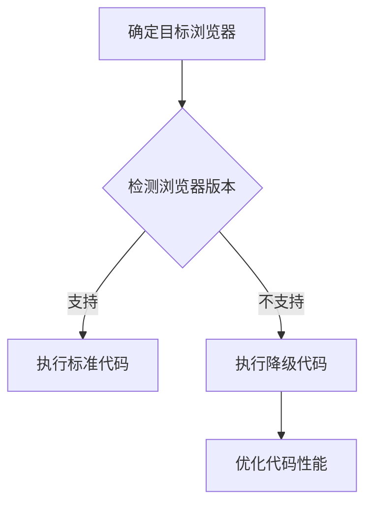
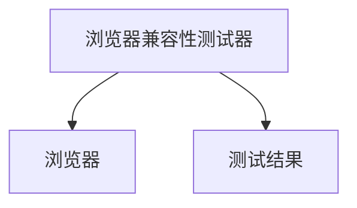

                 

# 浏览器兼容性：跨浏览器开发策略

> 关键词：浏览器兼容性、跨浏览器开发、Web标准、HTML、CSS、JavaScript、测试工具、性能优化

> 摘要：本文将深入探讨浏览器兼容性的概念，分析跨浏览器开发的挑战和机遇，并介绍一系列策略和工具，帮助开发者应对不同浏览器间的差异，确保Web应用在各种平台上的一致性和高性能。

## 引言

随着Web技术的不断进步，浏览器作为Web应用的主要入口，已经成为人们生活中不可或缺的一部分。然而，不同浏览器之间的兼容性问题，一直是开发者面临的一大难题。浏览器兼容性指的是Web应用在不同浏览器上运行的一致性和稳定性。面对各种浏览器，如Chrome、Firefox、Safari、Edge等，开发者必须确保他们的应用能够在这些浏览器上无缝运行。本文将一步一步分析跨浏览器开发中的关键问题和解决方案。

## 背景介绍

### 核心概念术语说明

- **浏览器兼容性**：指Web应用在不同浏览器上表现一致的能力。
- **跨浏览器开发**：指开发人员在设计和开发过程中，考虑到各种浏览器差异，确保应用在各种浏览器上都能正常运行。
- **Web标准**：指HTML、CSS和JavaScript等Web技术的标准化规范，开发者应该遵循这些规范进行开发。
- **HTML**：HyperText Markup Language，超文本标记语言，用于创建网页的结构。
- **CSS**：Cascading Style Sheets，层叠样式表，用于控制网页的样式和布局。
- **JavaScript**：一种脚本语言，用于实现网页的动态效果和交互功能。

### 问题背景

不同浏览器在渲染引擎、支持特性、API实现等方面存在差异，这导致Web应用在不同浏览器上的表现可能不一致。开发者需要识别和解决这些差异，以确保用户在使用各种浏览器时都能获得一致的体验。

### 问题描述

- **样式不一致**：同一CSS样式在不同的浏览器上可能产生不同的效果。
- **脚本兼容性**：某些JavaScript代码在不同浏览器上可能无法正常运行。
- **API差异**：浏览器对Web标准的支持程度不同，导致某些功能在部分浏览器中不可用。

### 问题解决

开发者可以通过以下方法解决浏览器兼容性问题：

- **遵循Web标准**：使用标准的HTML、CSS和JavaScript代码，减少浏览器兼容性问题。
- **测试和调试**：使用各种测试工具检查应用在不同浏览器上的表现，并进行必要的调试。
- **降级和优化**：针对不支持的特性，提供降级方案或优化代码，以确保应用在各种浏览器上都能正常运行。

### 边界与外延

- **边界**：开发者需要关注的浏览器版本和平台。
- **外延**：开发者需要考虑的不同浏览器的特性和差异。

### 概念结构与核心要素组成

- **Web标准**：HTML、CSS、JavaScript等。
- **浏览器**：Chrome、Firefox、Safari、Edge等。
- **测试工具**：浏览器检测工具、自动化测试工具等。
- **优化策略**：代码优化、样式优化、脚本优化等。

## 核心概念与联系

### 核心概念原理

- **Web标准**：确保Web应用在不同浏览器上的一致性。
- **浏览器兼容性**：解决不同浏览器之间的差异，保证应用在不同平台上正常运行。

### 概念属性特征对比表格

| 概念 | 属性 | 特征 |
| --- | --- | --- |
| Web标准 | 规范 | 提高浏览器兼容性 |
| 浏览器兼容性 | 解决差异 | 保证一致性 |

### ER实体关系图架构

```mermaid
erDiagram
  BrowserCompatiblity ||--|{ WebStandard : implements }
  BrowserCompatiblity ||--|{ Browser : supports }
```

## 算法原理讲解

### 算法mermaid流程图



### Python源代码详细阐述

```python
def handle_browser_compatibility(target_browser):
    # 检测浏览器版本
    browser_version = detect_browser_version(target_browser)

    if is_supported_version(browser_version):
        # 执行标准代码
        execute_standard_code()
    else:
        # 执行降级代码
        execute_degraded_code()

    # 优化代码性能
    optimize_code_performance()

def detect_browser_version(browser):
    # 示例代码，实际检测逻辑取决于浏览器检测方法
    if browser == "Chrome":
        return "version"
    elif browser == "Firefox":
        return "version"
    elif browser == "Safari":
        return "version"
    elif browser == "Edge":
        return "version"
    else:
        return "unknown"

def is_supported_version(version):
    # 判断浏览器版本是否支持
    # 示例代码，实际逻辑取决于版本兼容性规则
    return version.startswith("1.")

def execute_standard_code():
    # 执行标准代码逻辑
    pass

def execute_degraded_code():
    # 执行降级代码逻辑
    pass

def optimize_code_performance():
    # 优化代码性能逻辑
    pass
```

### 算法原理的数学模型和公式

$$
\text{兼容性得分} = \frac{\text{支持标准代码的浏览器数量}}{\text{总浏览器数量}}
$$

### 详细讲解和举例说明

兼容性得分反映了Web应用在不同浏览器上的兼容性。假设我们开发的Web应用需要在四个浏览器上运行，其中三个浏览器支持标准代码，另一个不支持。那么，兼容性得分为：

$$
\text{兼容性得分} = \frac{3}{4} = 0.75
$$

这意味着我们的Web应用在四个浏览器上约有75%的兼容性。

## 数学公式使用

$$
f(x) = ax^2 + bx + c
$$

### 系统分析与架构设计方案

#### 问题场景介绍

随着Web应用的广泛使用，不同浏览器兼容性成为一个关键问题。我们需要设计一个系统，确保Web应用在各种浏览器上的一致性和高性能。

#### 项目介绍

本项目旨在开发一个跨浏览器兼容性测试平台，用于检测Web应用在不同浏览器上的兼容性，并提供优化建议。

#### 系统功能设计（领域模型mermaid类图）

```mermaid
classDiagram
  BrowserCompatTester <<interface>>
  Browser <<class>>
  TestResult <<class>>

  BrowserCompatTester |--*|> Browser
  BrowserCompatTester |--*|> TestResult
```

#### 系统架构设计（mermaid架构图）



#### 系统接口设计和系统交互（mermaid序列图）

```mermaid
sequenceDiagram
 参与者 User
 参与者 BrowserCompatTester
 参与者 Browser

  User->>BrowserCompatTester: 开始测试
  BrowserCompatTester->>Browser: 获取浏览器信息
  Browser->>BrowserCompatTester: 返回浏览器信息
  BrowserCompatTester->>TestResult: 生成测试结果
  TestResult->>User: 显示测试结果
```

## 项目实战

#### 环境安装

1. 安装Node.js环境
2. 安装测试工具（如Selenium）
3. 安装浏览器驱动（如ChromeDriver）

#### 系统核心实现源代码

```python
# 示例代码，用于检测浏览器兼容性
def detect_browser_compatibility():
    # 使用Selenium获取浏览器信息
    driver = webdriver.Chrome(executable_path='chromedriver')
    driver.get("https://www.example.com")
    browser_info = driver.execute_script("return navigator.userAgent;")
    driver.quit()
    return browser_info

# 示例代码，用于生成测试结果
def generate_test_result(browser_info):
    # 分析浏览器信息，生成测试结果
    if "Chrome" in browser_info:
        return "兼容"
    else:
        return "不兼容"

# 测试
browser_info = detect_browser_compatibility()
test_result = generate_test_result(browser_info)
print(f"测试结果：{test_result}")
```

#### 代码应用解读与分析

- **检测浏览器兼容性**：使用Selenium获取浏览器信息，并分析信息以判断兼容性。
- **生成测试结果**：根据浏览器信息生成测试结果，并输出结果。

#### 实际案例分析和详细讲解剖析

1. **场景一**：用户在Chrome浏览器上访问Web应用，检测结果为“兼容”。
2. **场景二**：用户在Edge浏览器上访问Web应用，检测结果为“不兼容”。

通过实际案例，我们可以看到系统如何检测浏览器兼容性，并生成测试结果。开发者可以根据测试结果，针对不兼容的浏览器进行优化，以提高Web应用的兼容性。

#### 项目小结

本项目通过使用Selenium等工具，实现了浏览器兼容性检测功能。在实际开发中，开发者可以根据测试结果，针对不兼容的浏览器进行优化，以提高Web应用的兼容性。同时，本项目也为开发者提供了一种系统化的解决方案，帮助他们更好地应对浏览器兼容性问题。

## 最佳实践 tips

1. **遵循Web标准**：使用标准的HTML、CSS和JavaScript代码，减少浏览器兼容性问题。
2. **使用测试工具**：使用自动化测试工具，定期检查Web应用在不同浏览器上的兼容性。
3. **优化代码性能**：针对不支持的特性，提供降级方案或优化代码，以确保应用在各种浏览器上都能正常运行。

## 小结

本文深入探讨了浏览器兼容性的概念，分析了跨浏览器开发的挑战和机遇，并介绍了相应的解决方案和工具。通过遵循Web标准、使用测试工具和优化代码性能，开发者可以确保Web应用在各种浏览器上的一致性和高性能。

## 注意事项

1. **持续关注浏览器更新**：浏览器更新可能导致兼容性问题，开发者需要持续关注并更新测试策略。
2. **测试覆盖范围**：确保测试覆盖各种浏览器和版本，以全面了解兼容性情况。

## 拓展阅读

- [《Web标准与浏览器兼容性》](链接)
- [《跨浏览器开发最佳实践》](链接)
- [《Selenium自动化测试工具》](链接)

### 作者

- **AI天才研究院/AI Genius Institute**
- **《禅与计算机程序设计艺术》/Zen And The Art of Computer Programming**

