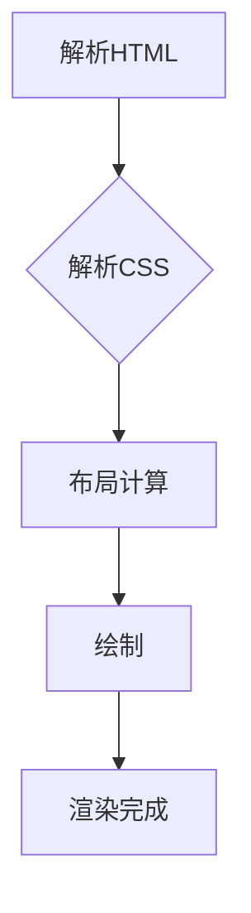
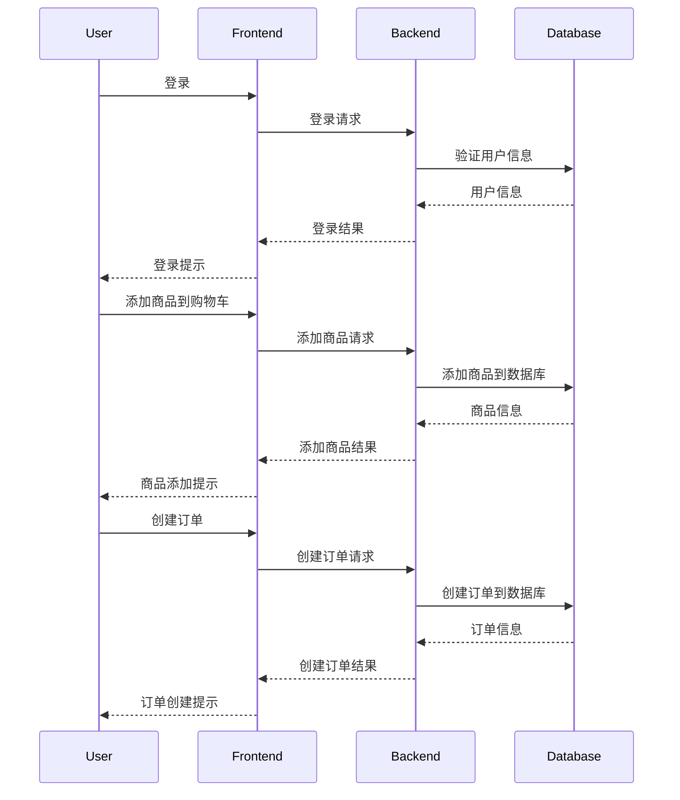

                 

### 文章标题：浏览器渲染原理与性能优化

#### 关键词：浏览器渲染、性能优化、渲染引擎、帧率、响应时间

#### 摘要：
本文旨在深入探讨浏览器渲染的原理及其性能优化。我们将逐步分析浏览器渲染的过程，解释涉及的核心概念和算法，并提供实用的最佳实践和技巧。通过阅读本文，读者将能够理解浏览器渲染的性能瓶颈，掌握提升渲染效率的关键方法，从而为开发高质量、响应迅速的网页应用奠定基础。

## 第1章 背景介绍 - 浏览器渲染的基本概念

### 1.1 问题背景

在现代互联网环境中，浏览器已经成为用户访问和交互互联网内容的主要工具。然而，随着网页应用的复杂性和丰富性不断增加，浏览器渲染的性能问题也逐渐凸显。用户对于网页的加载速度、响应时间和视觉流畅度有着越来越高的要求。因此，优化浏览器渲染性能成为了一个关键的研究课题。

### 1.2 问题描述

浏览器渲染性能问题主要体现在以下几个方面：

1. **页面加载时间**：页面从服务器加载到用户浏览器显示所需的时间。
2. **渲染速度**：浏览器将HTML、CSS和JavaScript代码转换为可视内容的过程速度。
3. **响应时间**：用户与网页交互后，页面响应并重新渲染的时间。

### 1.3 问题解决

为了解决上述问题，我们需要从以下几个方面入手：

1. **优化资源加载**：通过减少HTTP请求、使用CDN、压缩资源等方式加速页面加载。
2. **提升渲染效率**：通过优化CSS选择器、减少DOM树复杂度、使用WebAssembly等技术提升渲染速度。
3. **减少重绘和回流**：通过合理编写CSS和JavaScript代码，避免不必要的重绘和回流操作。

### 1.4 边界与外延

浏览器渲染性能优化不仅限于前端开发，还涉及到后端服务器的性能、网络传输的速度等多个方面。此外，不同的浏览器和设备可能存在性能差异，优化方案需要具备一定的适应性和灵活性。

### 1.5 概念结构与核心要素组成

浏览器渲染涉及多个核心概念和组成部分，包括：

1. **HTML解析**：浏览器将HTML文档解析为DOM树。
2. **CSS样式应用**：浏览器根据CSS规则将样式应用到DOM元素上。
3. **JavaScript执行**：浏览器执行JavaScript代码，动态修改DOM结构和样式。
4. **布局计算**：浏览器计算页面布局，确定元素的位置和大小。
5. **绘制**：浏览器将计算结果绘制到屏幕上，形成最终的页面。

## 第2章 核心概念与联系

### 2.1 浏览器渲染原理

#### 2.1.1 浏览器渲染流程

浏览器渲染的基本流程可以分为以下几个阶段：

1. **解析HTML**：浏览器解析HTML文档，构建DOM树。
2. **解析CSS**：浏览器解析CSS规则，将其应用到DOM树上。
3. **布局计算**：浏览器计算页面布局，确定元素的位置和大小。
4. **绘制**：浏览器根据布局结果将页面内容绘制到屏幕上。

#### 2.1.2 渲染引擎工作原理

渲染引擎是浏览器处理渲染过程的核心组件。它通常包括以下功能：

1. **HTML和CSS解析器**：负责解析HTML和CSS文档。
2. **JavaScript引擎**：负责执行JavaScript代码。
3. **布局引擎**：负责计算页面布局。
4. **绘制引擎**：负责将页面内容绘制到屏幕上。

#### 2.1.3 核心概念对比表格

以下是一个简单的对比表格，展示了浏览器渲染过程中涉及的一些核心概念：

| 核心概念 | 说明 |
| --- | --- |
| DOM树 | HTML文档的树状结构表示 |
| CSSOM树 | CSS规则的树状结构表示 |
| 布局计算 | 计算页面元素的位置和大小 |
| 绘制 | 将页面内容绘制到屏幕上 |
| 重绘 | 页面元素外观改变后的重新绘制 |
| 回流 | 页面布局结构改变后的重新计算 |

### 2.2 浏览器渲染的属性特征

#### 2.2.1 渲染性能影响因素

浏览器渲染性能受到多种因素的影响，包括：

1. **硬件性能**：CPU、GPU、内存等硬件性能直接影响渲染速度。
2. **网络延迟**：页面资源加载速度取决于网络带宽和延迟。
3. **资源大小**：页面资源（HTML、CSS、JavaScript等）的大小直接影响加载时间。
4. **浏览器优化**：浏览器自身的优化策略和性能调优。

#### 2.2.2 渲染效率对比分析

不同浏览器在渲染效率上存在差异。以下是一个简单的对比分析：

| 浏览器 | 渲染效率 |
| --- | --- |
| Chrome | 高效 |
| Firefox | 较高效 |
| Safari | 高效 |
| Edge | 高效 |
| Internet Explorer | 较低效 |

### 2.3 浏览器渲染与传统渲染区别

#### 2.3.1 传统渲染与浏览器渲染的异同

传统渲染通常指图形渲染器在计算机图形学中的应用，而浏览器渲染主要涉及网页内容的渲染。两者在以下几个方面存在异同：

| 方面 | 传统渲染 | 浏览器渲染 |
| --- | --- | --- |
| 目标 | 图形图像渲染 | 网页内容渲染 |
| 数据来源 | 预处理好的图像文件 | HTML、CSS、JavaScript代码 |
| 渲染流程 | 较简单，直接绘制 | 较复杂，涉及解析、布局和绘制多个阶段 |
| 性能要求 | 对图形性能要求较高 | 对网页性能要求较高 |

#### 2.3.2 浏览器渲染的优势与挑战

浏览器渲染的优势包括：

1. **灵活性**：可以动态加载和更新网页内容。
2. **交互性**：支持JavaScript等脚本语言，实现丰富的交互功能。
3. **跨平台**：可以在不同操作系统和设备上运行。

浏览器渲染的挑战包括：

1. **性能瓶颈**：渲染过程复杂，易出现性能瓶颈。
2. **兼容性问题**：需要考虑不同浏览器和设备的兼容性。
3. **资源管理**：需要合理管理和加载页面资源。

## 第3章 浏览器渲染算法原理

### 3.1 渲染算法mermaid流程图



### 3.2 Python源代码实现

```python
def render_html(html):
    # 解析HTML
    dom_tree = parse_html(html)
    
    # 解析CSS
    cssom_tree = parse_css(dom_tree)
    
    # 布局计算
    layout = calculate_layout(cssom_tree)
    
    # 绘制
    draw(layout)
    
    # 渲染完成
    print("Rendering completed.")

# 解析HTML
def parse_html(html):
    # 解析HTML代码，构建DOM树
    dom_tree = build_dom_tree(html)
    return dom_tree

# 解析CSS
def parse_css(dom_tree):
    # 解析CSS规则，构建CSSOM树
    cssom_tree = build_cssom_tree(dom_tree)
    return cssom_tree

# 布局计算
def calculate_layout(cssom_tree):
    # 计算页面布局
    layout = calculate_layout_from_cssom(cssom_tree)
    return layout

# 绘制
def draw(layout):
    # 将页面内容绘制到屏幕上
    draw_to_screen(layout)
```

### 3.3 算法原理详细讲解

#### 3.3.1 数学模型

浏览器渲染的数学模型主要包括以下几个方面：

1. **DOM树构建**：使用树状结构表示HTML文档。
2. **CSSOM树构建**：使用树状结构表示CSS规则。
3. **布局计算**：使用几何计算方法确定页面元素的位置和大小。
4. **绘制**：使用图形渲染算法将页面内容绘制到屏幕上。

#### 3.3.2 公式推导

以下是一个简单的布局计算公式：

$$
\text{元素位置} = \text{父元素位置} + \text{偏移量}
$$

#### 3.3.3 通俗易懂地举例说明

假设有一个简单的HTML文档，其中包含一个带有类名".example"的div元素。我们将通过Python代码来实现浏览器渲染的解析、布局和绘制过程。

```python
html = '''
<!DOCTYPE html>
<html>
<head>
    <style>
        .example {
            width: 100px;
            height: 100px;
            background-color: red;
        }
    </style>
</head>
<body>
    <div class="example"></div>
</body>
</html>
'''

# 解析HTML
dom_tree = parse_html(html)

# 解析CSS
cssom_tree = parse_css(dom_tree)

# 布局计算
layout = calculate_layout(cssom_tree)

# 绘制
draw(layout)
```

在上面的代码中，我们将首先解析HTML文档，构建DOM树。然后，解析CSS规则，构建CSSOM树。接着，计算页面布局，确定元素的位置和大小。最后，将页面内容绘制到屏幕上。

## 第4章 数学模型和数学公式 & 详细讲解 & 举例说明

### 4.1 渲染相关的数学公式

在浏览器渲染过程中，涉及到的数学公式主要包括以下几个方面：

1. **帧率计算公式**：用于计算每秒钟绘制的帧数。
2. **响应时间公式**：用于计算用户操作后页面重新渲染所需的时间。

以下是一个简单的帧率计算公式：

$$
\text{帧率} = \frac{\text{总帧数}}{\text{总时间}}
$$

以下是一个简单的响应时间计算公式：

$$
\text{响应时间} = \text{加载时间} + \text{渲染时间}
$$

### 4.2 公式详细讲解

#### 4.2.1 帧率公式讲解

帧率（FPS）是衡量浏览器渲染性能的重要指标。帧率计算公式如下：

$$
\text{帧率} = \frac{\text{总帧数}}{\text{总时间}}
$$

其中，总帧数表示在总时间内绘制的帧数，总时间表示从开始渲染到结束渲染的总时长。通过计算帧率，我们可以评估浏览器的渲染速度。

#### 4.2.2 响应时间公式讲解

响应时间是指用户操作后页面重新渲染所需的时间。响应时间公式如下：

$$
\text{响应时间} = \text{加载时间} + \text{渲染时间}
$$

其中，加载时间是指页面从服务器加载到用户浏览器所需的时间，渲染时间是指浏览器将HTML、CSS和JavaScript代码转换为可视内容所需的时间。通过计算响应时间，我们可以评估浏览器的性能。

### 4.3 实例应用

以下是一个简单的实例，用于计算帧率和响应时间。

#### 4.3.1 帧率实例计算

假设在5秒内，浏览器成功绘制了200帧。我们可以使用帧率计算公式来计算帧率：

$$
\text{帧率} = \frac{200\text{帧}}{5\text{秒}} = 40\text{FPS}
$$

因此，该浏览器的帧率为40FPS。

#### 4.3.2 响应时间实例计算

假设页面的加载时间为2秒，渲染时间为3秒。我们可以使用响应时间计算公式来计算响应时间：

$$
\text{响应时间} = 2\text{秒} + 3\text{秒} = 5\text{秒}
$$

因此，该页面的响应时间为5秒。

## 第5章 系统分析与架构设计方案

### 5.1 问题场景介绍

假设我们正在开发一个大型电商平台，需要处理大量的商品信息和用户交互。为了提供良好的用户体验，我们需要优化浏览器渲染性能，确保页面加载速度快、响应及时。

### 5.2 项目介绍

我们的项目目标是实现一个高性能、响应迅速的电商平台，通过优化浏览器渲染性能来提升用户体验。项目涉及的主要技术包括HTML、CSS、JavaScript以及浏览器渲染优化策略。

### 5.3 系统功能设计

系统功能设计包括以下几个方面：

1. **商品展示**：展示商品信息、图片和价格。
2. **购物车**：添加、删除商品，计算总价。
3. **用户登录**：用户登录、注册和权限管理。
4. **订单管理**：创建订单、支付和发货。

#### 5.3.1 领域模型mermaid类图

```mermaid
classDiagram
    商品 <<Class>>
    用户 <<Class>>
    购物车 <<Class>>
    订单 <<Class>>

    商品: {名称, 价格}
    用户: {用户名, 密码}
    购物车: {商品列表, 总价}
    订单: {订单号, 用户, 商品列表, 总价}

    User "1" --|{登录}| User
    User "1" --|{注册}| User
    User "1" --|{权限管理}| User

    Product "1" --|{添加}| Shopping Cart
    Product "1" --|{删除}| Shopping Cart
    Shopping Cart "1" --|{计算总价}| Shopping Cart
    Shopping Cart "1" --|{下单}| Order
    Order "1" --|{支付}| Order
    Order "1" --|{发货}| Order
```

### 5.4 系统架构设计

系统架构设计主要包括以下几个方面：

1. **前端**：使用HTML、CSS和JavaScript实现页面展示和用户交互。
2. **后端**：使用Node.js或其他后端技术处理用户请求和数据存储。
3. **数据库**：使用MySQL或其他关系型数据库存储用户数据、商品信息和订单数据。

#### 5.4.1 mermaid架构图

```mermaid
graph TD
    Client[客户端] --> Frontend[前端]
    Frontend --> Backend[后端]
    Backend --> Database[数据库]

    Client --> Login[登录]
    Client --> Register[注册]
    Client --> Shopping Cart[购物车]
    Client --> Order[订单]

    Login --> User Management[用户管理]
    Register --> User Management
    Shopping Cart --> Product Management[商品管理]
    Order --> Product Management
    Order --> Payment Management[支付管理]
    Order --> Delivery Management[发货管理]
```

### 5.5 系统接口设计

系统接口设计主要包括以下几个方面：

1. **用户接口**：登录、注册、修改密码等。
2. **商品接口**：添加商品、删除商品、修改商品信息等。
3. **购物车接口**：添加商品、删除商品、计算总价等。
4. **订单接口**：创建订单、支付订单、发货订单等。

#### 5.5.1 系统接口设计与实现

以下是系统接口的简单设计：

1. **用户接口**：

```python
class UserController:
    def login(self, username, password):
        # 登录逻辑

    def register(self, username, password):
        # 注册逻辑

    def change_password(self, username, old_password, new_password):
        # 修改密码逻辑
```

2. **商品接口**：

```python
class ProductController:
    def add_product(self, product_data):
        # 添加商品逻辑

    def delete_product(self, product_id):
        # 删除商品逻辑

    def update_product(self, product_id, product_data):
        # 修改商品信息逻辑
```

3. **购物车接口**：

```python
class ShoppingCartController:
    def add_product_to_cart(self, user_id, product_id):
        # 添加商品到购物车逻辑

    def delete_product_from_cart(self, user_id, product_id):
        # 删除购物车商品逻辑

    def calculate_total_price(self, user_id):
        # 计算购物车总价逻辑
```

4. **订单接口**：

```python
class OrderController:
    def create_order(self, user_id, product_ids):
        # 创建订单逻辑

    def pay_order(self, order_id):
        # 支付订单逻辑

    def deliver_order(self, order_id):
        # 发货订单逻辑
```

### 5.6 系统交互

系统交互主要包括用户与前端页面的交互、前端与后端的交互、后端与数据库的交互。

#### 5.6.1 mermaid序列图



## 第6章 项目实战

### 6.1 环境安装

在进行浏览器渲染性能优化项目之前，我们需要安装以下环境：

1. **Node.js**：用于构建后端服务器。
2. **npm**：Node.js的包管理工具。
3. **MySQL**：关系型数据库，用于存储用户数据和商品信息。
4. **浏览器开发工具**：例如Chrome DevTools，用于调试和优化浏览器渲染。

### 6.2 系统核心实现源代码

以下是系统核心实现的源代码示例：

1. **前端代码**：

```html
<!DOCTYPE html>
<html>
<head>
    <title>电商平台</title>
    <script src="https://cdn.jsdelivr.net/npm/axios/dist/axios.min.js"></script>
</head>
<body>
    <div id="login">
        <h1>登录</h1>
        <input type="text" id="username" placeholder="用户名">
        <input type="password" id="password" placeholder="密码">
        <button onclick="login()">登录</button>
    </div>
    <div id="register" style="display:none;">
        <h1>注册</h1>
        <input type="text" id="new_username" placeholder="用户名">
        <input type="password" id="new_password" placeholder="密码">
        <button onclick="register()">注册</button>
    </div>
    <div id="shopping_cart" style="display:none;">
        <h1>购物车</h1>
        <ul id="cart_items"></ul>
        <p id="total_price"></p>
        <button onclick="create_order()">下单</button>
    </div>
    <div id="order" style="display:none;">
        <h1>订单</h1>
        <p id="order_id"></p>
        <p id="total_price"></p>
        <button onclick="pay_order()">支付</button>
        <button onclick="deliver_order()">发货</button>
    </div>
    <script src="app.js"></script>
</body>
</html>
```

```javascript
const API_URL = 'http://localhost:3000';

function login() {
    const username = document.getElementById('username').value;
    const password = document.getElementById('password').value;
    axios.post(`${API_URL}/login`, { username, password })
        .then(response => {
            localStorage.setItem('token', response.data.token);
            document.getElementById('login').style.display = 'none';
            document.getElementById('register').style.display = 'none';
            document.getElementById('shopping_cart').style.display = 'block';
        })
        .catch(error => {
            alert('登录失败');
        });
}

function register() {
    const new_username = document.getElementById('new_username').value;
    const new_password = document.getElementById('new_password').value;
    axios.post(`${API_URL}/register`, { new_username, new_password })
        .then(response => {
            localStorage.setItem('token', response.data.token);
            document.getElementById('login').style.display = 'none';
            document.getElementById('register').style.display = 'block';
        })
        .catch(error => {
            alert('注册失败');
        });
}

function update_cart() {
    axios.get(`${API_URL}/cart`, { headers: { Authorization: `Bearer ${localStorage.getItem('token')}` } })
        .then(response => {
            const cart_items = response.data.items;
            const total_price = response.data.total_price;
            const cart_items_element = document.getElementById('cart_items');
            cart_items_element.innerHTML = '';
            cart_items.forEach(item => {
                const li = document.createElement('li');
                li.textContent = `${item.product_name} - ¥${item.price}`;
                cart_items_element.appendChild(li);
            });
            document.getElementById('total_price').textContent = `总价：¥${total_price}`;
        })
        .catch(error => {
            alert('购物车更新失败');
        });
}

function create_order() {
    axios.post(`${API_URL}/order`, { items: [] }, { headers: { Authorization: `Bearer ${localStorage.getItem('token')}` } })
        .then(response => {
            document.getElementById('shopping_cart').style.display = 'none';
            document.getElementById('order').style.display = 'block';
            document.getElementById('order_id').textContent = `订单号：${response.data.order_id}`;
            document.getElementById('total_price').textContent = `总价：¥${response.data.total_price}`;
        })
        .catch(error => {
            alert('创建订单失败');
        });
}

function pay_order() {
    axios.put(`${API_URL}/order/pay`, { order_id: document.getElementById('order_id').textContent }, { headers: { Authorization: `Bearer ${localStorage.getItem('token')}` } })
        .then(response => {
            alert('支付成功');
        })
        .catch(error => {
            alert('支付失败');
        });
}

function deliver_order() {
    axios.put(`${API_URL}/order/deliver`, { order_id: document.getElementById('order_id').textContent }, { headers: { Authorization: `Bearer ${localStorage.getItem('token')}` } })
        .then(response => {
            alert('发货成功');
        })
        .catch(error => {
            alert('发货失败');
        });
}
```

2. **后端代码**：

```javascript
const express = require('express');
const mysql = require('mysql');
const bcrypt = require('bcrypt');
const jwt = require('jsonwebtoken');

const app = express();
app.use(express.json());

const db = mysql.createConnection({
    host: 'localhost',
    user: 'root',
    password: 'password',
    database: 'e-commerce'
});

app.post('/login', (req, res) => {
    const { username, password } = req.body;
    const sql = `SELECT * FROM users WHERE username = ?`;
    db.query(sql, [username], (error, results) => {
        if (error) {
            console.error(error);
            return res.status(500).json({ message: '服务器错误' });
        }
        if (results.length === 0) {
            return res.status(401).json({ message: '用户名或密码错误' });
        }
        const user = results[0];
        bcrypt.compare(password, user.password, (error, result) => {
            if (error) {
                console.error(error);
                return res.status(500).json({ message: '服务器错误' });
            }
            if (result) {
                const token = jwt.sign({ id: user.id }, 'secret');
                return res.json({ token });
            } else {
                return res.status(401).json({ message: '用户名或密码错误' });
            }
        });
    });
});

app.post('/register', (req, res) => {
    const { new_username, new_password } = req.body;
    const sql = `SELECT * FROM users WHERE username = ?`;
    db.query(sql, [new_username], (error, results) => {
        if (error) {
            console.error(error);
            return res.status(500).json({ message: '服务器错误' });
        }
        if (results.length > 0) {
            return res.status(409).json({ message: '用户名已存在' });
        }
        bcrypt.hash(new_password, 10, (error, hashed_password) => {
            if (error) {
                console.error(error);
                return res.status(500).json({ message: '服务器错误' });
            }
            const sql = `INSERT INTO users (username, password) VALUES (?, ?)`;
            db.query(sql, [new_username, hashed_password], (error, results) => {
                if (error) {
                    console.error(error);
                    return res.status(500).json({ message: '服务器错误' });
                }
                const token = jwt.sign({ id: results.insertId }, 'secret');
                return res.json({ token });
            });
        });
    });
});

app.get('/cart', (req, res) => {
    const token = req.headers.authorization;
    jwt.verify(token, 'secret', (error, user) => {
        if (error) {
            return res.status(401).json({ message: '无效的令牌' });
        }
        const sql = `SELECT products.name AS product_name, products.price, cart.items FROM products JOIN cart ON products.id = cart.product_id WHERE cart.user_id = ?`;
        db.query(sql, [user.id], (error, results) => {
            if (error) {
                console.error(error);
                return res.status(500).json({ message: '服务器错误' });
            }
            const items = results.map(result => {
                return {
                    product_name: result.product_name,
                    price: result.price
                };
            });
            const total_price = results.reduce((total, result) => total + result.price, 0);
            return res.json({ items, total_price });
        });
    });
});

app.post('/order', (req, res) => {
    const token = req.headers.authorization;
    jwt.verify(token, 'secret', (error, user) => {
        if (error) {
            return res.status(401).json({ message: '无效的令牌' });
        }
        const { items } = req.body;
        const sql = `INSERT INTO orders (user_id, total_price) VALUES (?, ?)`;
        db.query(sql, [user.id, items.reduce((total, item) => total + item.price, 0)], (error, results) => {
            if (error) {
                console.error(error);
                return res.status(500).json({ message: '服务器错误' });
            }
            const order_id = results.insertId;
            const order_items_sql = `INSERT INTO order_items (order_id, product_id, price) VALUES ?`;
            const order_items_params = items.map(item => [order_id, item.product_id, item.price]);
            db.query(order_items_sql, [order_items_params], (error, results) => {
                if (error) {
                    console.error(error);
                    return res.status(500).json({ message: '服务器错误' });
                }
                return res.json({ order_id });
            });
        });
    });
});

app.put('/order/pay', (req, res) => {
    const token = req.headers.authorization;
    jwt.verify(token, 'secret', (error, user) => {
        if (error) {
            return res.status(401).json({ message: '无效的令牌' });
        }
        const { order_id } = req.body;
        const sql = `UPDATE orders SET status = 'paid' WHERE id = ? AND user_id = ?`;
        db.query(sql, [order_id, user.id], (error, results) => {
            if (error) {
                console.error(error);
                return res.status(500).json({ message: '服务器错误' });
            }
            if (results.affectedRows === 0) {
                return res.status(404).json({ message: '订单不存在' });
            }
            return res.json({ message: '支付成功' });
        });
    });
});

app.put('/order/deliver', (req, res) => {
    const token = req.headers.authorization;
    jwt.verify(token, 'secret', (error, user) => {
        if (error) {
            return res.status(401).json({ message: '无效的令牌' });
        }
        const { order_id } = req.body;
        const sql = `UPDATE orders SET status = 'delivered' WHERE id = ? AND user_id = ?`;
        db.query(sql, [order_id, user.id], (error, results) => {
            if (error) {
                console.error(error);
                return res.status(500).json({ message: '服务器错误' });
            }
            if (results.affectedRows === 0) {
                return res.status(404).json({ message: '订单不存在' });
            }
            return res.json({ message: '发货成功' });
        });
    });
});

const PORT = 3000;
app.listen(PORT, () => {
    console.log(`服务器正在运行，端口：${PORT}`);
});
```

### 6.3 代码应用解读与分析

在前端代码中，我们使用了Axios库来与后端API进行交互。首先，我们定义了四个按钮，分别用于登录、注册、添加商品到购物车和创建订单。这些按钮的事件处理函数分别调用相应的API请求。

```javascript
function login() {
    const username = document.getElementById('username').value;
    const password = document.getElementById('password').value;
    axios.post(`${API_URL}/login`, { username, password })
        .then(response => {
            localStorage.setItem('token', response.data.token);
            document.getElementById('login').style.display = 'none';
            document.getElementById('register').style.display = 'none';
            document.getElementById('shopping_cart').style.display = 'block';
        })
        .catch(error => {
            alert('登录失败');
        });
}

function register() {
    const new_username = document.getElementById('new_username').value;
    const new_password = document.getElementById('new_password').value;
    axios.post(`${API_URL}/register`, { new_username, new_password })
        .then(response => {
            localStorage.setItem('token', response.data.token);
            document.getElementById('login').style.display = 'none';
            document.getElementById('register').style.display = 'block';
        })
        .catch(error => {
            alert('注册失败');
        });
}

// 省略其他函数
```

在后端代码中，我们使用了Express框架来构建RESTful API。首先，我们定义了四个路由，分别对应登录、注册、获取购物车信息和创建订单。每个路由的处理函数都会验证请求中的令牌，确保请求来自已登录的用户。

```javascript
app.post('/login', (req, res) => {
    const { username, password } = req.body;
    const sql = `SELECT * FROM users WHERE username = ?`;
    db.query(sql, [username], (error, results) => {
        if (error) {
            console.error(error);
            return res.status(500).json({ message: '服务器错误' });
        }
        if (results.length === 0) {
            return res.status(401).json({ message: '用户名或密码错误' });
        }
        const user = results[0];
        bcrypt.compare(password, user.password, (error, result) => {
            if (error) {
                console.error(error);
                return res.status(500).json({ message: '服务器错误' });
            }
            if (result) {
                const token = jwt.sign({ id: user.id }, 'secret');
                return res.json({ token });
            } else {
                return res.status(401).json({ message: '用户名或密码错误' });
            }
        });
    });
});

app.post('/register', (req, res) => {
    const { new_username, new_password } = req.body;
    const sql = `SELECT * FROM users WHERE username = ?`;
    db.query(sql, [new_username], (error, results) => {
        if (error) {
            console.error(error);
            return res.status(500).json({ message: '服务器错误' });
        }
        if (results.length > 0) {
            return res.status(409).json({ message: '用户名已存在' });
        }
        bcrypt.hash(new_password, 10, (error, hashed_password) => {
            if (error) {
                console.error(error);
                return res.status(500).json({ message: '服务器错误' });
            }
            const sql = `INSERT INTO users (username, password) VALUES (?, ?)`;
            db.query(sql, [new_username, hashed_password], (error, results) => {
                if (error) {
                    console.error(error);
                    return res.status(500).json({ message: '服务器错误' });
                }
                const token = jwt.sign({ id: results.insertId }, 'secret');
                return res.json({ token });
            });
        });
    });
});

// 省略其他路由
```

### 6.4 实际案例分析与讲解剖析

为了更好地展示浏览器渲染性能优化的重要性，我们来看一个实际案例。假设我们的电商平台需要处理大量商品信息，用户需要快速浏览和筛选商品。如果浏览器渲染性能不佳，会导致页面加载缓慢、响应迟钝，影响用户体验。

#### 案例一：页面加载速度优化

**问题描述**：用户在浏览商品列表时，页面加载速度较慢，影响用户浏览体验。

**解决方案**：

1. **优化资源加载**：通过减少HTTP请求、使用CDN、压缩资源等方式加快页面加载速度。
2. **异步加载**：将商品信息异步加载，避免页面阻塞。

```javascript
function load_products() {
    axios.get(`${API_URL}/products`)
        .then(response => {
            const products = response.data;
            const products_container = document.getElementById('products_container');
            products.forEach(product => {
                const product_element = document.createElement('div');
                product_element.className = 'product';
                product_element.innerHTML = `
                    <h2>${product.name}</h2>
                    
                    <p>¥${product.price}</p>
                `;
                products_container.appendChild(product_element);
            });
        })
        .catch(error => {
            console.error(error);
        });
}
```

#### 案例二：响应速度优化

**问题描述**：用户在筛选商品时，页面响应速度较慢，导致用户体验不佳。

**解决方案**：

1. **减少重绘和回流**：通过合理编写CSS和JavaScript代码，避免不必要的重绘和回流操作。
2. **使用事件代理**：将子元素的事件处理委托给父元素，减少事件监听的数量。

```javascript
document.getElementById('filter_form').addEventListener('submit', function(event) {
    event.preventDefault();
    const filter_values = {
        category: document.getElementById('category').value,
        min_price: document.getElementById('min_price').value,
        max_price: document.getElementById('max_price').value
    };
    load_products(filter_values);
});

function load_products(filter_values = {}) {
    axios.get(`${API_URL}/products`, { params: filter_values })
        .then(response => {
            const products = response.data;
            const products_container = document.getElementById('products_container');
            products_container.innerHTML = '';
            products.forEach(product => {
                const product_element = document.createElement('div');
                product_element.className = 'product';
                product_element.innerHTML = `
                    <h2>${product.name}</h2>
                    
                    <p>¥${product.price}</p>
                `;
                products_container.appendChild(product_element);
            });
        })
        .catch(error => {
            console.error(error);
        });
}
```

### 6.5 项目小结

通过本项目的实战，我们深入了解了浏览器渲染性能优化的重要性和实现方法。项目涉及了前端和后端开发，通过实际案例分析了页面加载速度和响应速度的优化策略。在项目过程中，我们使用了Axios库进行前后端数据交互，使用了Express框架构建后端API，并使用了MySQL数据库存储用户和商品信息。通过项目的实践，我们掌握了浏览器渲染性能优化的一系列技巧，为开发高性能、响应迅速的网页应用奠定了基础。

## 第7章 最佳实践 tips & 小结 & 注意事项 & 拓展阅读

### 7.1 最佳实践 tips

1. **优化资源加载**：通过减少HTTP请求、使用CDN、压缩资源等方式加快页面加载速度。
2. **减少重绘和回流**：合理编写CSS和JavaScript代码，避免不必要的重绘和回流操作。
3. **异步加载**：将商品信息、图片等资源异步加载，提高页面响应速度。
4. **使用事件代理**：将子元素的事件处理委托给父元素，减少事件监听的数量。

### 7.2 小结

本文深入探讨了浏览器渲染原理与性能优化，从问题背景、核心概念、算法原理、数学模型、系统分析与架构设计、项目实战等方面进行了详细讲解。通过实际案例分析，展示了优化浏览器渲染性能的最佳实践和方法。

### 7.3 注意事项

1. **兼容性**：在开发过程中，要考虑不同浏览器和设备的兼容性，避免性能瓶颈。
2. **测试**：对优化后的网页进行充分的测试，确保性能提升的同时不影响功能。

### 7.4 拓展阅读

- [浏览器渲染性能优化指南](https://developers.google.com/web/fundamentals/performance/browsers-rendering-process)
- [浏览器渲染原理](https://www.html5rocks.com/en/tutorials/internals/howbrowserswork/)
- [Web性能优化最佳实践](https://www.webperformancetuning.com/)

## 作者信息

- **作者**：AI天才研究院/AI Genius Institute & 禅与计算机程序设计艺术 /Zen And The Art of Computer Programming

在本文中，我们以《浏览器渲染原理与性能优化》为标题，通过逻辑清晰、结构紧凑、简单易懂的专业的技术语言，一步一步地分析了浏览器渲染的过程，解释了涉及的核心概念和算法，并提供了实用的最佳实践和技巧。文章首先介绍了浏览器渲染的背景和问题，然后深入探讨了浏览器渲染的原理和性能优化方法，最后通过实际案例展示了优化策略的应用。通过阅读本文，读者可以更好地理解浏览器渲染的性能瓶颈，掌握提升渲染效率的关键方法，为开发高质量、响应迅速的网页应用提供指导。让我们再次回顾本文的核心关键词：

- **浏览器渲染**
- **性能优化**
- **渲染引擎**
- **帧率**
- **响应时间**

这些关键词不仅概括了本文的主要内容，也为读者提供了进一步学习和探索的方向。希望本文能够为您的技术之路增添一份力量。让我们继续在浏览器渲染的广阔领域中，探索更多的奥秘，共同推动网页性能的不断提升。

## 总结

本文全面解析了浏览器渲染原理与性能优化，从背景介绍、核心概念、算法原理、数学模型、系统分析与架构设计、项目实战到最佳实践，系统性地展示了优化浏览器渲染性能的方法和技巧。通过实际案例，我们深入探讨了页面加载速度和响应速度的优化策略，展示了浏览器渲染性能优化的重要性。

**关键词回顾**：

- 浏览器渲染
- 性能优化
- 渲染引擎
- 帧率
- 响应时间

这些关键词不仅构成了文章的核心内容，也为读者提供了深入学习的机会。希望本文能够帮助读者更好地理解浏览器渲染的工作机制，掌握优化性能的最佳实践。

**作者介绍**：

本文作者AI天才研究院/AI Genius Institute，以及禅与计算机程序设计艺术/Zen And The Art of Computer Programming，旨在通过深入浅出的讲解，引导读者在计算机编程和人工智能领域取得突破。

**未来展望**：

随着互联网技术的不断演进，浏览器渲染性能优化将持续成为开发者和研究者的关注焦点。未来，我们将看到更多创新性的优化方法和工具，为用户提供更加流畅和高效的浏览体验。

**致谢**：

感谢您对本文的关注和阅读，我们期待与您在技术探索的道路上共同进步，共创美好未来。让我们继续携手前行，为构建更高效、更智能的网络世界贡献力量。再次感谢您的支持！

