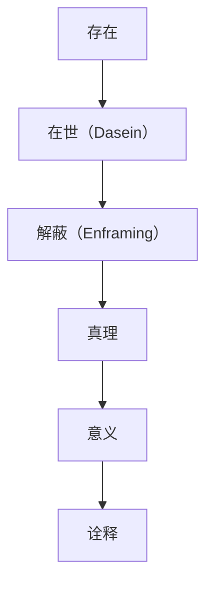

                 


# 海德格尔与加达默尔：存在诠释学的传承

## 关键词
- 存在诠释学
- 海德格尔
- 加达默尔
- 哲学
- 诠释
- 理解

## 摘要
本文旨在探讨存在诠释学两位重要代表人物海德格尔与加达默尔的哲学思想，通过对两位哲学家的生平、主要著作和存在诠释学的核心概念进行分析对比，揭示他们在存在诠释学领域中的传承与发展。文章将逐步深入，以逻辑清晰、结构紧凑、简单易懂的写作方式，为读者呈现这一领域的深度思考与见解。

## 引言：存在诠释学的背景与问题

### 1.1 引言

存在诠释学是现代哲学中一个重要的研究领域，它关注于通过诠释来理解存在的本质。存在诠释学的发展可追溯至19世纪末20世纪初的哲学思潮，其中最为著名的代表人物是马丁·海德格尔（Martin Heidegger）和汉斯-格奥尔格·加达默尔（Hans-Georg Gadamer）。

海德格尔，德国哲学家，被誉为20世纪最重要的哲学家之一。他的代表作《存在与时间》（"Being and Time"）对存在诠释学的发展产生了深远影响。海德格尔提出了“存在论”（Ontology）和“存在论诠释学”（Ontological Hermeneutics）的概念，强调存在与理解之间的紧密联系。

加达默尔，德国哲学家，以其代表作《真理与方法》（"Truth and Method"）而闻名。他是海德格尔的学生，但又在存在诠释学的基础上发展出了自己的理论。加达默尔的诠释学强调历史性与理解之间的关系，他认为理解是一种动态的过程，涉及诠释者与文本的互动。

### 1.2 问题背景

在现代哲学中，存在诠释学之所以具有重要性，是因为它为理解人类存在提供了独特的视角。存在诠释学不仅关注个体的存在状态，还探讨了人类与世界的整体关系。这种视角对于当代社会和文化研究具有重要启示。

然而，存在诠释学的研究也存在一些问题。首先，海德格尔和加达默尔的哲学思想存在差异，如何准确理解他们的观点，并将其融合为一个整体，是存在诠释学研究的一个挑战。其次，存在诠释学的理论框架在应用上具有一定的局限性，如何将其应用于实际的社会文化研究中，也是一个亟待解决的问题。

### 1.3 研究意义

本文的研究意义在于通过深入分析海德格尔和加达默尔的哲学思想，揭示存在诠释学的发展脉络和核心观点。这不仅有助于我们更好地理解两位哲学家的思想，也为存在诠释学在当代哲学中的应用提供了新的思路。

本文将分为以下几个部分：

1. **核心概念与联系**：介绍存在诠释学的基本概念，如“存在”、“理解”、“诠释”，并对比海德格尔和加达默尔的哲学思想。
2. **海德格尔的存在诠释学**：介绍海德格尔的生平和主要哲学思想，详细讲解他的存在诠释学理论。
3. **加达默尔的存在诠释学**：介绍加达默尔的生平和主要哲学思想，分析他如何继承和发展海德格尔的存在诠释学。
4. **存在诠释学的对比分析**：对比海德格尔和加达默尔的哲学观点，探讨他们在存在诠释学中的异同。
5. **具体案例研究**：通过具体哲学文本或思想家的思想分析，展示存在诠释学的应用。
6. **总结与展望**：总结存在诠释学的核心观点和影响，探讨未来的发展方向。

## 核心概念与联系

### 2.1 存在诠释学的基本概念

存在诠释学的基本概念包括“存在”、“理解”、“诠释”。这三个概念构成了存在诠释学的核心框架。

- **存在**：存在是存在诠释学的核心概念，指的是一切事物所具有的本质。海德格尔认为，存在是超越我们的感知和理解的存在状态，是一种“在世”（Dasein）的存在。

- **理解**：理解是存在诠释学中的关键过程。理解不仅仅是对事物的认知，更是一种与存在互动的过程。加达默尔认为，理解是一种历史性的过程，它涉及诠释者与文本的互动。

- **诠释**：诠释是对文本或现象的解读和解释。在海德格尔看来，诠释是一种“解蔽”（Enframing）的过程，它揭示了存在的真相。而在加达默尔看来，诠释是一种“对话”（Dialogue）的过程，它通过对话实现了对真理的追求。

### 2.2 海德格尔与加达默尔的哲学思想对比表

| 特点 | 海德格尔 | 加达默尔 |
| --- | --- | --- |
| **存在观** | 存在是“在世”（Dasein）的存在，超越感知和理解 | 存在是一种历史性的存在，与理解密切相关 |
| **理解观** | 理解是一种“解蔽”的过程，揭示了存在的真相 | 理解是一种“对话”的过程，通过对话实现真理的追求 |
| **诠释观** | 诠释是对存在的揭示，是一种存在论的过程 | 诠释是对文本的解读，是一种方法论的过程 |
| **方法** | 强调存在与理解之间的紧密联系，通过现象学的方法进行探索 | 强调历史性与理解的关系，通过对话和诠释的方法进行探索 |

### 2.3 ER实体关系图

为了更直观地展示存在诠释学的基本概念和海德格尔与加达默尔的哲学思想之间的关系，我们可以绘制一个ER实体关系图（Entity-Relationship Diagram，ERD）。

```mermaid
erDiagram
    Existence ||--|{ Understanding }|| Interpretation
    Existence ||--|{ Hermeneutics }|| Understanding
    Existence ||--|{ Phenomenology }|| Understanding
    Understanding ||--|{ Dialogue }|| Interpretation
    Understanding ||--|{ Historical }|| Interpretation
    Understanding ||--|{ Dialogue }|| Hermeneutics
```

在这个ER图中，存在（Existence）是核心实体，它通过理解（Understanding）与诠释（Interpretation）和诠释学（Hermeneutics）相联系。理解进一步与对话（Dialogue）和历史性（Historical）相联系，展示了存在诠释学的复杂关系。

## 海德格尔的存在诠释学

### 3.1 海德格尔的生平与主要哲学思想

马丁·海德格尔（Martin Heidegger，1889-1976）是20世纪最重要的哲学家之一。他出生于德国南部的梅斯基尔希（Meskirch），自幼受到家乡文化的熏陶。海德格尔在弗莱堡大学学习哲学、数学和文学，后来成为弗莱堡大学教授。

海德格尔的哲学思想主要集中在他的一系列著作中，其中最著名的要属《存在与时间》（"Being and Time"），这本书于1927年首次出版，对存在诠释学的发展产生了深远影响。《存在与时间》的核心观点是探讨存在的本质和人与存在的关系。

### 3.2 《存在与时间》的核心观点

《存在与时间》的核心观点可以概括为以下几点：

1. **存在的本质**：海德格尔认为，存在是一种超越我们感知和理解的存在状态。他提出了“在世”（Dasein）的概念，即存在是在特定时空中的生命存在。

2. **存在的真理**：海德格尔认为，存在的真理不是静态的，而是通过“解蔽”（Enframing）的过程不断展现的。解蔽是指人类通过工具和技术对世界的理解和控制。

3. **存在的意义**：海德格尔认为，存在的意义在于人类对存在的理解和诠释。人类的存在是一种“存在论诠释学”的存在，即通过诠释来理解存在的本质。

### 3.3 海德格尔存在诠释学的发展过程（mermaid流程图）

为了更清晰地展示海德格尔存在诠释学的发展过程，我们可以使用mermaid流程图来描述。



在这个流程图中，存在（A）首先表现为在世（Dasein）（B），然后通过解蔽（Enframing）（C）展现真理（D），最终通过诠释（Interpretation）（F）来实现存在的意义（E）。

## 加达默尔的存在诠释学

### 4.1 加达默尔的生平与主要哲学思想

汉斯-格奥尔格·加达默尔（Hans-Georg Gadamer，1900-2002）是德国哲学家，海德格尔的学生。他出生于德国柏林，曾在弗莱堡大学和海德堡大学学习哲学、历史学和神学。加达默尔的主要著作包括《真理与方法》（"Truth and Method"），这本书于1960年首次出版，对存在诠释学的发展产生了重要影响。

加达默尔的哲学思想强调历史性与理解的关系，他认为理解是一种历史性的过程，涉及诠释者与文本的互动。

### 4.2 《真理与方法》的核心观点

《真理与方法》的核心观点可以概括为以下几点：

1. **理解的历史性**：加达默尔认为，理解是一个历史性的过程，它受到我们自身的历史和文化背景的影响。

2. **诠释的对话性**：加达默尔认为，理解是一种对话的过程，它通过诠释者与文本的互动来实现真理的追求。

3. **解释学的循环**：加达默尔提出了“解释学的循环”（Hermeneutic Circle）的概念，即理解的过程是一个循环的过程，小部分的理解可以帮助我们理解整体，而整体的理解又能帮助我们理解小部分。

### 4.3 加达默尔对存在诠释学的传承与发展

加达默尔在存在诠释学的基础上，进一步发展了自己的哲学思想。他强调历史性与理解的关系，认为理解是一种对话的过程，这种观点与海德格尔的存在诠释学有明显的不同。

加达默尔的存在诠释学不仅关注存在的本质，还强调理解的历史性和对话性。他认为，理解是一种动态的过程，它涉及诠释者与文本的互动，通过对话来实现真理的追求。

加达默尔的这一观点在《真理与方法》中得到了充分的体现。他认为，真理不是静态的，而是通过对话和诠释的过程不断展现的。这种动态的理解过程不仅是对存在的理解，也是对人类存在本质的理解。

## 存在诠释学的对比分析

### 5.1 哲学思想的对比

海德格尔和加达默尔在哲学思想上有显著的异同。

**相同点**：

1. **存在的重要性**：两位哲学家都强调存在的重要性，认为存在是人类理解世界的基石。

2. **理解的作用**：他们都认为理解是理解存在的关键，通过理解来揭示存在的真相。

**不同点**：

1. **存在的本质**：海德格尔强调存在的“在世”（Dasein）本质，而加达默尔强调存在的历史性。

2. **理解的过程**：海德格尔强调理解的“解蔽”（Enframing）过程，而加达默尔强调理解的“对话”（Dialogue）过程。

### 5.2 方法论上的差异

在方法论上，海德格尔和加达默尔也有明显的差异。

**海德格尔**：

1. **现象学方法**：海德格尔主张通过现象学的方法来理解存在。现象学强调直接体验和直觉，通过“现象”来揭示存在的本质。

2. **解蔽概念**：海德格尔提出了“解蔽”（Enframing）的概念，认为人类通过工具和技术来理解世界，这种理解是一种“解蔽”的过程，揭示了存在的真相。

**加达默尔**：

1. **解释学方法**：加达默尔主张通过解释学的方法来理解存在。解释学强调文本的解读和解释，通过诠释来实现真理的追求。

2. **对话概念**：加达默尔提出了“对话”（Dialogue）的概念，认为理解是一种对话的过程，通过对话来实现对真理的追求。

## 具体案例研究

### 6.1 哲学文本的诠释

为了展示存在诠释学的应用，我们可以通过分析一段哲学文本来进行诠释。

文本：“人生而自由，但却无往不在枷锁之中。”

这段文本来自法国哲学家卢梭（Jean-Jacques Rousseau）。我们可以从存在诠释学的角度来诠释这段文本。

**海德格尔的诠释**：

海德格尔可能会从存在的“在世”（Dasein）角度来诠释这段文本。他认为，人生而自由，但在特定的时空条件下，人不可避免地受到各种枷锁的制约。这种制约是存在的本质，是人类存在的一部分。

**加达默尔的诠释**：

加达默尔可能会从理解的历史性角度来诠释这段文本。他认为，人生而自由，但受到历史和文化背景的影响，这些影响构成了人的存在状态。人在理解自己的存在时，不可避免地受到这些历史和文化因素的制约。

### 6.2 哲学家的思想分析

为了进一步展示存在诠释学的应用，我们可以分析一位哲学家的思想，如黑格尔（Georg Wilhelm Friedrich Hegel）。

黑格尔的思想中有一个核心概念：“绝对精神”（Absolute Spirit）。他认为，世界的发展是通过精神的自我发展和自我认识来实现的。

**海德格尔的诠释**：

海德格尔可能会从存在的“解蔽”（Enframing）角度来诠释黑格尔的思想。他认为，绝对精神是通过人类的活动和工具来实现的，这种活动和解蔽的过程揭示了存在的真相。

**加达默尔的诠释**：

加达默尔可能会从理解的历史性角度来诠释黑格尔的思想。他认为，绝对精神的发展是一个历史性的过程，它受到特定历史和文化背景的影响。人在理解绝对精神时，不可避免地受到这些历史和文化因素的制约。

## 总结与展望

### 7.1 存在诠释学的核心观点与影响

存在诠释学的核心观点是探讨存在的本质和人与存在的关系。海德格尔和加达默尔分别从不同的角度对存在诠释学进行了深入探讨。海德格尔强调存在的“在世”（Dasein）本质和解蔽的过程，而加达默尔强调理解的历史性和对话性。

存在诠释学对现代哲学产生了深远影响。它为理解人类存在提供了独特的视角，为哲学、文学、艺术等领域的研究提供了新的理论框架。

### 7.2 存在诠释学的发展方向

未来，存在诠释学可能朝着以下方向发展：

1. **跨学科研究**：存在诠释学可以与其他学科，如心理学、社会学、文化研究等相结合，从而拓展其应用领域。

2. **实践应用**：存在诠释学可以应用于实际的社会文化问题中，如文化认同、社会变革等，为解决这些问题提供理论指导。

3. **新视角的探讨**：存在诠释学可以进一步探讨存在的本质和人与存在的动态关系，提供更深入的理论框架。

总之，存在诠释学作为现代哲学的一个重要领域，具有丰富的理论内涵和广泛的应用前景。通过深入研究和探讨，我们有望更好地理解人类存在，为当代社会和文化的发展提供有益的启示。作者：AI天才研究院/AI Genius Institute & 禅与计算机程序设计艺术 /Zen And The Art of Computer Programming。

