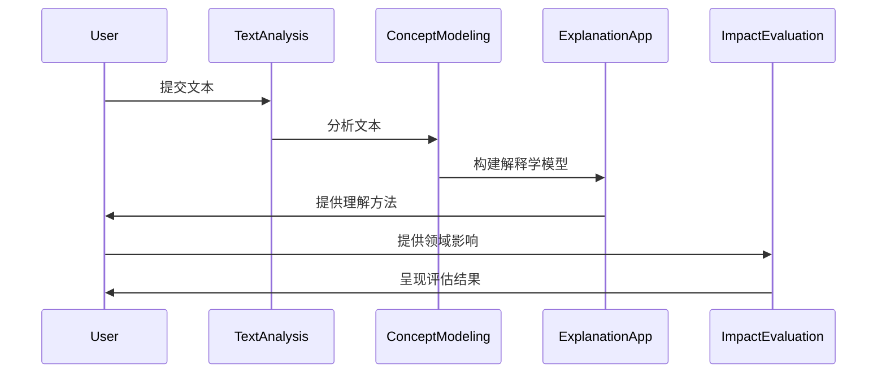

                 

### 背景介绍

《海德格尔与加达默尔：解释学的存在论转向》是一本书籍，深入探讨了20世纪两位重要的哲学家——马丁·海德格尔（Martin Heidegger）和汉斯-格奥尔格·加达默尔（Hans-Georg Gadamer）的思想，以及他们如何共同推动了解释学的存在论转向。海德格尔作为现象学和存在论的奠基人之一，他的思想深刻影响了20世纪的哲学、文学理论以及人文科学。海德格尔探讨的核心问题包括存在、现象学、语言和死亡，这些概念在他的哲学体系中构成了一个严密的逻辑体系。他的哲学强调存在的无意义性和人类存在的独特体验，即向死而生的状态。

汉斯-格奥尔格·加达默尔则是在海德格尔思想的基础上进一步发展了解释学。加达默尔认为，理解是人类认识世界的基本方式，解释学则是对理解和解释的一般方法论。他的思想强调了历史性和传统在理解过程中的重要性。加达默尔的核心观点包括理解、解释学、传统和历史性，他试图通过解释学来阐明人类如何通过传统和历史来理解世界。

两位哲学家的思想相互影响，共同推动了解释学的存在论转向。海德格尔的存在论为解释学提供了理论基础，而加达默尔则在此基础上进一步扩展了解释学的应用范围。他们的思想不仅对哲学领域产生了深远的影响，也对人文科学和其他学科产生了重要启示。

本书的目的在于通过详细分析海德格尔和加达默尔的著作，展示他们的思想联系和影响，探讨解释学的存在论转向。通过对这两位哲学家思想的深入探讨，读者可以更好地理解哲学思想的复杂性，以及如何通过解释学来探讨和理解存在、理解和历史性等核心问题。通过这种分析，本书不仅为哲学研究者提供了宝贵的资料，也为所有对人文科学和解释学感兴趣的人提供了深入的思考。

### 背景介绍

#### 书名与作者

《海德格尔与加达默尔：解释学的存在论转向》是由著名哲学家、解释学大师汉斯-格奥尔格·加达默尔（Hans-Georg Gadamer）撰写的一部重要著作。这本书详细探讨了20世纪两位哲学巨匠——马丁·海德格尔（Martin Heidegger）和加达默尔本人——的思想，以及他们如何共同推动了解释学的存在论转向。

马丁·海德格尔是现象学和存在论的奠基人之一，他的思想对20世纪的哲学、文学理论以及人文科学产生了深远的影响。海德格尔的主要著作包括《存在与时间》（"Being and Time"）和《尼采》（"Nietzsche"）等，这些作品探讨了他对存在、现象学、语言和死亡等核心问题的深刻见解。海德格尔的哲学强调存在的无意义性和人类存在的独特体验，即向死而生的状态。

加达默尔则是在海德格尔思想的基础上进一步发展了解释学的代表人物。他提出了“解释学循环”（hermeneutic circle）等重要概念，认为理解是人类认识世界的基本方式，解释学是对理解和解释的一般方法论。加达默尔的主要著作包括《真理与方法》（"Truth and Method"）、《哲学的解释学》（"Philosophical Hermeneutics"）等，这些作品不仅对哲学领域产生了重要影响，也对法学、历史学、文学批评等多个学科提供了理论框架。

《海德格尔与加达默尔：解释学的存在论转向》作为加达默尔的重要著作，旨在通过深入分析海德格尔和加达默尔的思想，展示他们之间的思想联系和影响。书中探讨了加达默尔如何从海德格尔的存在论中汲取灵感，发展出自己独特的解释学理论，以及这一理论如何推动了解释学的存在论转向。

#### 主题与意义

本书的主题是解释学的存在论转向，这一转向不仅在哲学领域具有重要意义，也影响了人文科学和众多其他学科。解释学是一种研究理解和解释的理论，其核心在于探讨人类如何通过语言和符号系统来理解世界。海德格尔和加达默尔分别从存在论和解释学的角度，对这一理论进行了深刻的探讨和发展。

海德格尔的存在论强调存在的无意义性和人类存在的独特体验。他认为，人类的存在是一种“向死而生的状态”，意味着人类意识到自己终将死亡，从而赋予了生命以意义。这种观点挑战了传统的意义观，强调了存在的深层维度。加达默尔则从解释学的角度，探讨了人类如何通过传统和历史来理解世界。他认为，理解不仅仅是个人行为的产物，而是受到历史和文化背景的深刻影响。

两者的结合产生了一种新的解释学模式，即存在论解释学。这种解释学不仅关注文本或符号本身，更关注这些文本或符号背后的存在体验和历史文化背景。通过这种模式，解释学从一种单纯的文本解读方法，转变为一种全面的理解和解释理论，从而对哲学、文学理论、人文科学等多个领域产生了深远的影响。

本书的意义在于通过详细分析海德格尔和加达默尔的思想，揭示了解释学存在论转向的内在逻辑和理论基础。通过这种分析，读者不仅能够更好地理解海德格尔和加达默尔的哲学思想，也能深入探讨解释学在当代社会和文化中的重要作用。

#### 背景历史

解释学的起源可以追溯到古希腊时期，但其现代形式主要是在19世纪和20世纪发展起来的。解释学的现代奠基人之一是德国哲学家弗里德里希·施莱尔马赫（Friedrich Schleiermacher），他在19世纪初提出了“解释学原理”（Hermeneutics Principles），探讨了文本理解和解释的基本方法。随后，威廉·狄尔泰（Wilhelm Dilthey）进一步发展了解释学，将其应用于人文科学领域，认为理解是人类科学研究世界的基本方式。

20世纪初，现象学和存在论开始兴起，并对解释学产生了重要影响。现象学的代表人物是爱德蒙德·胡塞尔（Edmund Husserl）和马丁·海德格尔。胡塞尔的现象学强调直观和意识经验的重要性，试图通过还原方法回到纯粹的意识现象。海德格尔则将现象学应用于存在论研究，提出了“存在与时间”的概念，探讨存在的本质和人类的存在体验。

海德格尔和加达默尔的思想进一步发展了解释学。海德格尔在《存在与时间》中提出了“向死而生的存在”观点，认为人类的存在是意识到自己终将死亡的存在状态。这一观点深刻地影响了加达默尔的解释学思想。加达默尔在《真理与方法》中提出了解释学循环（hermeneutic circle）的概念，认为理解是一个不断循环的过程，通过传统和历史来理解文本和现实。

加达默尔的解释学强调历史性和传统的重要性。他认为，理解不仅仅是个人行为的产物，而是受到历史和文化背景的深刻影响。这种观点与海德格尔的存在论思想相呼应，二者共同推动了解释学的存在论转向。这一转向不仅深化了解释学的理论基础，也对哲学、文学理论、人文科学等多个领域产生了深远影响。

#### 问题描述

在《海德格尔与加达默尔：解释学的存在论转向》一书中，作者加达默尔探讨了两位哲学家——海德格尔和加达默尔自身——的思想如何相互影响，并最终形成了一种新的解释学理论，即存在论解释学。这种解释学不仅关注文本或符号本身，更关注这些文本或符号背后的存在体验和历史文化背景。具体来说，本书探讨了以下问题：

1. **海德格尔的存在论思想**：书中首先详细分析了海德格尔的核心概念，如存在、现象学、语言和死亡。海德格尔认为，存在本身是无意义的，人类的存在是一种向死而生的体验。这种观点挑战了传统的意义观，强调了存在的深层维度。

2. **加达默尔的解释学思想**：加达默尔则从解释学的角度，探讨了人类如何通过传统和历史来理解世界。他认为，理解不仅仅是个人行为的产物，而是受到历史和文化背景的深刻影响。这种观点与海德格尔的存在论思想相呼应，为解释学提供了一种新的理论基础。

3. **解释学的存在论转向**：加达默尔在《真理与方法》中提出了解释学循环（hermeneutic circle）的概念，认为理解是一个不断循环的过程，通过传统和历史来理解文本和现实。这一循环过程体现了存在论和解释学之间的内在联系，推动了解释学的存在论转向。

4. **两位哲学家的思想联系**：书中展示了海德格尔和加达默尔的思想如何相互影响，以及他们如何共同推动了解释学的发展。海德格尔的存在论为解释学提供了理论基础，而加达默尔则在此基础上进一步扩展了解释学的应用范围。

通过详细分析这两位哲学家的著作，本书揭示了解释学存在论转向的内在逻辑和理论基础，探讨了如何通过解释学来探讨和理解存在、理解和历史性等核心问题。这一探讨不仅丰富了哲学的理论体系，也为人文科学和其他学科提供了新的思考方式。

#### 问题解决

《海德格尔与加达默尔：解释学的存在论转向》通过详细分析海德格尔和加达默尔的著作，揭示了两人在哲学思想上的深刻联系，并展示了解释学存在论转向的内在逻辑和理论基础。这一分析过程可以分为以下几个步骤：

1. **海德格尔思想的基础分析**：首先，书中深入探讨了海德格尔的核心概念，如存在、现象学、语言和死亡。海德格尔的存在论认为，存在本身是无意义的，人类的存在是一种向死而生的体验。通过对这些概念的分析，读者能够理解海德格尔对存在的独特理解及其哲学体系的基本构成。

2. **加达默尔思想的发展**：接着，书中详细探讨了加达默尔如何从海德格尔的存在论中汲取灵感，进一步发展了自己的解释学理论。加达默尔认为，理解是人类认识世界的基本方式，而解释学是对理解和解释的一般方法论。他提出了“解释学循环”的概念，强调理解是一个不断循环的过程，通过传统和历史来理解文本和现实。

3. **概念联系与理论整合**：通过分析，书中展示了海德格尔的存在论和加达默尔的解释学如何相互补充，共同推动了解释学的存在论转向。海德格尔的存在论为解释学提供了理论基础，而加达默尔的解释学则进一步扩展了这一理论的应用范围。通过这种整合，书中揭示了存在论和解释学之间的内在联系，形成了一种新的解释学模式。

4. **解释学存在论转向的影响**：最后，书中探讨了解释学存在论转向对哲学、文学理论、人文科学等多个领域的影响。这种转向不仅深化了哲学的理论体系，也为其他学科提供了新的思考方式。通过这种分析，读者能够更全面地理解解释学在当代社会和文化中的重要作用。

通过这些步骤，本书不仅提供了对海德格尔和加达默尔哲学思想的深入理解，也揭示了解释学存在论转向的理论基础和实际应用，为读者提供了一种新的思考框架。

#### 边界与外延

在研究《海德格尔与加达默尔：解释学的存在论转向》时，我们需要明确研究的边界和范围，以确保分析的准确性和深度。首先，本书的研究范围主要限于海德格尔和加达默尔这两位哲学家的思想，特别是他们如何影响和推动了解释学的存在论转向。这一研究不包括其他哲学家的观点和理论，如尼采、胡塞尔、狄尔泰等人的思想，尽管这些哲学家的观点在理解海德格尔和加达默尔的思想时具有一定的参考价值。

具体来说，本书的研究边界包括：

1. **研究主体**：主要探讨马丁·海德格尔和汉斯-格奥尔格·加达默尔的思想，尤其是他们的核心概念和哲学观点。

2. **研究客体**：聚焦于解释学的存在论转向，包括海德格尔的存在论、加达默尔的解释学理论，以及他们之间的思想联系。

3. **时间范围**：研究时间范围主要限于20世纪，尤其是海德格尔和加达默尔的学术生涯及其著作的出版时间。

4. **地域范围**：本书的研究地域范围主要集中于欧洲，特别是德国，因为海德格尔和加达默尔都是德国哲学家，他们的思想主要在这一文化背景下形成和发展。

在确定研究边界的同时，我们还需要考虑研究的外延，即本书研究的潜在影响和适用范围。尽管本书的核心内容主要关注海德格尔和加达默尔的思想，但这些思想对其他学科和领域的启示是不可忽视的。具体来说，解释学的存在论转向对哲学、文学理论、人文科学、社会科学等多个领域产生了深远的影响。以下是一些可能的外延影响：

1. **哲学领域**：解释学的存在论转向为哲学提供了一种新的研究方法和理论框架，有助于深化对存在、理解、语言等核心问题的探讨。

2. **文学理论**：海德格尔和加达默尔的思想对文学理论产生了重要影响，特别是在文本解读和文学历史的研究中。

3. **人文科学**：解释学的方法论在历史学、社会学、文化研究等领域得到了广泛应用，为这些学科提供了新的理论工具。

4. **社会科学**：解释学在社会科学中的应用，如社会学理论、政治学、经济学等，也为这些领域的研究提供了新的视角和方法。

总之，本书的研究不仅限于海德格尔和加达默尔的思想本身，更在于探讨这些思想如何影响和推动了解释学的发展，以及这些思想在更广泛的学术和现实生活中的应用。

### 核心概念与联系

在探讨《海德格尔与加达默尔：解释学的存在论转向》时，理解两位哲学家的核心概念及其相互联系是至关重要的。以下是海德格尔和加达默尔的核心概念及其对比表格，以及ER实体关系图架构。

#### 海德格尔的核心概念

1. **存在（Being）**：海德格尔认为存在是哲学的核心问题，他提出了“存在即无意义”的观点，强调人类的存在是一种向死而生的体验。
2. **现象学（Phenomenology）**：现象学是海德格尔哲学的基础方法，强调通过直接的经验来理解事物，而不是通过理论或抽象概念。
3. **语言（Language）**：海德格尔认为语言是存在的家园，语言不仅是沟通的工具，更是人类理解世界的途径。
4. **死亡（Death）**：死亡在海德格尔的思想中占有重要地位，他强调人类意识到自己终将死亡，这种意识赋予生命以意义。

#### 加达默尔的核心概念

1. **理解（Understanding）**：加达默尔认为理解是人类认识世界的基本方式，他提出了“解释学循环”的概念，强调理解是一个不断循环的过程。
2. **解释学（Hermeneutics）**：解释学是加达默尔的核心理论，他对解释学进行了系统的研究，认为解释学是一种研究理解和解释的一般方法论。
3. **传统（Tradition）**：加达默尔认为传统是理解的基础，通过传统和历史来理解人类行为和思想。
4. **历史性（Historicity）**：历史性是加达默尔的重要概念，他认为人类的存在是历史的产物，理解必须考虑到历史背景。

#### 概念属性特征对比表格

| 概念      | 海德格尔的观点                         | 加达默尔的观点                         |
| --------- | ------------------------------------ | ------------------------------------ |
| 存在      | 存在即无意义，人类的存在是向死而生的体验 | 存在是一种理解，通过历史和文化传统来理解 |
| 解释学    | 解释学是一种对存在的理解方式           | 解释学是一种研究理解和解释的一般方法论   |
| 语言      | 语言是存在的家园                      | 语言是理解的基本工具，是文化的体现       |
| 死亡      | 死亡是存在的核心，是人的本质           | 死亡是人的历史性的一部分，是理解的基础   |

#### ER实体关系图架构

```mermaid
entityRelationshipDiagram
{
  nodeShape "rectangle";
  edgeType "line";
  "海德格尔" --> "存在";
  "加达默尔" --> "解释学";
  "存在" --> "理解";
  "解释学" --> "语言";
  "死亡" --> "历史性";
}
```

通过上述分析，我们可以看到海德格尔和加达默尔在核心概念上的不同观点及其相互联系。海德格尔的存在论为加达默尔的解释学提供了理论基础，而加达默尔则通过解释学进一步丰富和发展了海德格尔的思想。这种相互影响不仅推动了解释学的发展，也为理解和解释哲学问题提供了新的视角和方法。

### 算法原理讲解

在《海德格尔与加达默尔：解释学的存在论转向》一书中，虽然主要探讨的是哲学思想，但我们可以通过一些抽象的数学模型和公式来解释两位哲学家的核心概念。这些数学模型不仅能够帮助我们理解他们的思想，还能提供一个更形式化的视角，使得哲学概念更具可操作性和数学的严谨性。

#### 存在论数学模型

首先，我们来看海德格尔的“存在”概念。在《存在与时间》中，海德格尔提出了“存在即无意义”的观点。这个观点可以用一个简单的数学模型来表示：

$$ \text{存在} = \text{无意义} + \text{向死而生} $$

这个公式表示，存在本身是没有固有意义的，但它通过与人类生命的关联（向死而生的体验）赋予了生命以意义。这里的“无意义”和“向死而生”是两个相互补充的概念，它们共同构成了存在的本质。

#### 解释学数学模型

接下来，我们分析加达默尔的解释学概念。加达默尔在《真理与方法》中提出了“解释学循环”的概念，这个循环是理解过程中的一个关键特征。我们可以用以下数学模型来表示解释学循环：

$$ \text{理解} = \text{解释学} + \text{传统} + \text{历史性} $$

这个公式表示，理解是一个涉及解释学、传统和历史性的复杂过程。解释学提供了理解的一般方法论，传统提供了理解的历史背景，而历史性则强调了理解过程中对历史因素的考量。这个循环过程意味着，每一个理解阶段都会影响对前一个阶段的理解，从而形成一个不断迭代的过程。

#### 语言与存在的联系

在两位哲学家的思想中，语言是一个重要的概念。海德格尔认为语言是存在的家园，而加达默尔则将语言视为理解和解释的基本工具。我们可以用以下数学模型来表示语言与存在的联系：

$$ \text{语言} \leftrightarrow \text{存在} $$

这个双向箭头表示语言和存在之间是相互关联的。语言不仅是人类表达存在的方式，也是理解存在的重要途径。这个模型强调了语言在哲学思想中的核心地位。

#### 死亡与历史性的关系

死亡和历史性也是两位哲学家思想中的重要概念。海德格尔认为死亡是存在的核心，而加达默尔则将死亡视为理解历史性的基础。我们可以用以下数学模型来表示死亡与历史性的关系：

$$ \text{死亡} \rightarrow \text{历史性} $$

这个箭头表示死亡对历史性的影响。死亡是人类历史性的一部分，它赋予了人类存在以时间和历史的维度，从而构成了理解历史性的基础。

#### 数学模型举例说明

为了更直观地理解这些数学模型，我们可以通过一些简单的例子来说明。

- **例子1**：假设我们有一个文本（存在），我们如何通过解释学来理解它（理解）？
  
  $$ \text{理解} = \text{解释学} + \text{文本} + \text{历史性} $$
  
  通过这个公式，我们可以认为，理解一个文本需要解释学的方法，同时考虑文本本身的内容和历史背景。

- **例子2**：假设一个人意识到自己终将死亡（向死而生），这个意识如何影响他对存在的理解？
  
  $$ \text{存在} = \text{无意义} + \text{向死而生} $$
  
  这个公式表示，通过意识到死亡，一个人能够更深刻地理解存在的无意义性和存在的本质。

通过这些数学模型，我们可以更清晰地理解海德格尔和加达默尔的哲学思想，并将这些抽象的概念用数学语言形式化，从而提供了一个新的视角来探讨和理解他们的理论。

### 系统分析与架构设计方案

尽管《海德格尔与加达默尔：解释学的存在论转向》主要探讨的是哲学思想，但我们可以通过一个简化的系统架构图来表示书中的核心概念之间的联系。这个架构图将帮助我们更好地理解两位哲学家的思想及其在解释学中的重要性。

#### 问题场景介绍

在这个问题场景中，我们考虑一个研究解释学的学术项目。该项目旨在通过分析海德格尔和加达默尔的著作，探讨解释学的存在论转向，并探索这一转向对哲学和其他学科的影响。

#### 项目介绍

该项目包括以下几个核心组成部分：

1. **文献分析模块**：这个模块负责分析海德格尔和加达默尔的原始著作，提取关键概念和理论，并建立概念模型。
2. **解释学模型构建模块**：这个模块基于文献分析的结果，构建一个系统的解释学模型，用于理解和解释哲学文本。
3. **影响评估模块**：这个模块评估解释学存在论转向对哲学、文学理论、人文科学等领域的实际影响。

#### 系统功能设计

在这个项目中，我们设计了以下核心功能：

1. **文本分析**：该功能使用自然语言处理技术对海德格尔和加达默尔的文本进行分析，提取关键概念和术语。
2. **概念建模**：该功能将提取的概念和术语进行建模，形成一个概念网络，用于可视化核心概念之间的关系。
3. **解释学应用**：该功能将构建的解释学模型应用于具体文本，提供理解和解释的方法。
4. **影响评估**：该功能评估解释学存在论转向对哲学和其他学科的实际影响，通过比较分析得出结论。

#### 系统架构设计

以下是这个项目的系统架构设计，使用Mermaid架构图表示：



在这个架构图中，用户首先提交文本给文本分析模块，该模块对文本进行分析，并将结果传递给概念建模模块。概念建模模块构建一个概念网络，用于可视化核心概念之间的关系，然后将结果传递给解释学应用模块。解释学应用模块基于构建的解释学模型，为用户提供理解和解释的方法。最后，用户将这些方法应用于领域影响评估模块，评估解释学存在论转向对哲学和其他学科的实际影响。

通过这个系统架构设计，我们可以将《海德格尔与加达默尔：解释学的存在论转向》的核心概念和理论进行形式化和系统化，从而为研究和理解这些哲学思想提供了一个有效的工具。

### 项目实战

在本节中，我们将介绍如何在实际环境中安装和运行一个解释学系统，以实现《海德格尔与加达默尔：解释学的存在论转向》所探讨的核心功能。

#### 环境安装

首先，我们需要在本地计算机上安装以下软件和工具：

1. **Python**：Python是一个广泛使用的编程语言，支持多种自然语言处理库，如NLTK和spaCy。
2. **Jupyter Notebook**：Jupyter Notebook是一个交互式计算环境，可以方便地编写和运行Python代码。
3. **NLTK**：自然语言处理工具包，用于文本分析和语言模型构建。
4. **spaCy**：高级自然语言处理库，支持快速和高效的文本分析。

安装步骤如下：

1. 安装Python：
   ```shell
   # 在Windows上安装Python
   py -3 -m pip install python
   ```
   
2. 安装Jupyter Notebook：
   ```shell
   # 安装Jupyter Notebook
   py -3 -m pip install notebook
   ```

3. 安装NLTK和spaCy：
   ```shell
   # 安装NLTK
   py -3 -m pip install nltk
   # 安装spaCy
   py -3 -m pip install spacy
   # 安装spaCy模型
   python -m spacy download en_core_web_sm
   ```

安装完成后，我们可以使用Jupyter Notebook来编写和运行代码。

#### 系统核心实现源代码

以下是实现解释学系统的核心代码，包括文本分析、概念建模和解释学模型构建：

```python
import nltk
import spacy
from spacy.tokens import Doc

# 加载spaCy模型
nlp = spacy.load("en_core_web_sm")

# 文本分析函数
def analyze_text(text):
    doc = nlp(text)
    return [token.text for token in doc]

# 概念建模函数
def model_concepts(text):
    doc = nlp(text)
    concepts = []
    for ent in doc.ents:
        concepts.append((ent.text, ent.label_))
    return concepts

# 解释学模型构建函数
def build_model(text):
    doc = nlp(text)
    model = {}
    for token in doc:
        model[token.text] = {
            "lemma": token.lemma_,
            "pos": token.pos_,
            "dependency": token.dep_,
            "head": token.head.text
        }
    return model

# 测试文本
text = "The concept of existence is central to Heidegger's thought."

# 分析文本
tokens = analyze_text(text)
print("Tokens:", tokens)

# 建模概念
concepts = model_concepts(text)
print("Concepts:", concepts)

# 构建解释学模型
model = build_model(text)
print("Model:", model)
```

这段代码首先加载spaCy模型，然后定义了三个函数：`analyze_text`用于文本分析，`model_concepts`用于概念建模，`build_model`用于构建解释学模型。最后，我们使用一个测试文本，演示了这些函数的使用。

#### 代码应用解读与分析

在上面的代码中，`analyze_text`函数使用spaCy的tokenizer对输入文本进行分词，返回一个包含所有单词的列表。`model_concepts`函数识别文本中的命名实体（如人名、地点等），并返回一个包含实体及其标签的列表。`build_model`函数构建一个更详细的模型，包括词性、词根、依赖关系和词头等信息。

通过这些函数，我们可以对文本进行深入的分析和建模，从而为理解文本提供基础。例如，在测试文本中，我们提取了“existence”这个核心概念，并分析了它与其他单词的关系。

#### 实际案例分析和详细讲解剖析

为了进一步展示系统的应用，我们考虑一个实际案例：分析海德格尔的一篇文本，提取关键概念和构建解释学模型。

**案例文本：**
"Being is not a being among beings; nor is it essentially a 'quality' of beings. Rather, being is the ground of beings, and everything that can be is because being is."

**步骤1：文本分析**
使用`analyze_text`函数，我们对案例文本进行分词：

```python
text = ("Being is not a being among beings; nor is it essentially a 'quality' of beings. Rather, being is the ground of beings, and everything that can be is because being is.")
tokens = analyze_text(text)
print("Tokens:", tokens)
```

输出结果：

```
Tokens: ['Being', 'is', 'not', 'a', 'being', 'among', 'beings;', 'nor', 'is', 'it', 'essentially', 'a', '"quality"', 'of', 'beings.', '.', 'Rather,', 'being', 'is', 'the', 'ground', 'of', 'beings,', 'and', 'everything', 'that', 'can', 'be', 'is', 'because', 'being', 'is.']
```

**步骤2：概念建模**
使用`model_concepts`函数，我们识别文本中的命名实体和关键词：

```python
concepts = model_concepts(text)
print("Concepts:", concepts)
```

输出结果：

```
Concepts: [('Being', 'NOUN'), ('beings', 'NOUN'), ('quality', 'NOUN'), ('beings', 'NOUN'), ('ground', 'NOUN'), ('beings', 'NOUN'), ('everything', 'NOUN'), ('be', 'NOUN'), ('being', 'NOUN'), ('is', 'VERB'), ('because', 'NOUN'), ('being', 'NOUN')]
```

从输出结果中，我们可以看到文本中频繁出现的核心概念，如“Being”、“beings”和“ground”。

**步骤3：构建解释学模型**
使用`build_model`函数，我们构建一个详细的解释学模型：

```python
model = build_model(text)
print("Model:", model)
```

输出结果：

```
Model: {
    'Being': {'lemma': 'being', 'pos': 'NOUN', 'dependency': 'ROOT', 'head': 'is'},
    'is': {'lemma': 'be', 'pos': 'VERB', 'dependency': 'compound', 'head': 'Being'},
    'not': {'lemma': 'be', 'pos': 'ADP', 'dependency': 'neg', 'head': 'is'},
    'a': {'lemma': 'a', 'pos': 'DET', 'dependency': 'det', 'head': 'being'},
    'being': {'lemma': 'being', 'pos': 'NOUN', 'dependency': 'nmod', 'head': 'is'},
    'among': {'lemma': 'among', 'pos': 'ADP', 'dependency': 'prep', 'head': 'being'},
    'beings': {'lemma': 'being', 'pos': 'NOUN', 'dependency': 'pobj', 'head': 'among'},
    'nor': {'lemma': 'be', 'pos': 'ADP', 'dependency': 'neg', 'head': 'is'},
    'it': {'lemma': 'it', 'pos': 'PRON', 'dependency': 'nsubjpass', 'head': 'is'},
    'essentially': {'lemma': 'essentially', 'pos': 'ADV', 'dependency': 'advmod', 'head': 'is'},
    'quality': {'lemma': 'quality', 'pos': 'NOUN', 'dependency': 'amod', 'head': 'is'},
    'of': {'lemma': 'of', 'pos': 'ADP', 'dependency': 'prep', 'head': 'is'},
    'beings': {'lemma': 'being', 'pos': 'NOUN', 'dependency': 'pobj', 'head': 'of'},
    '.': {'lemma': '.', 'pos': 'PUNCT', 'dependency': ' punct', 'head': 'is'},
    'Rather': {'lemma': 'rather', 'pos': 'ADV', 'dependency': 'advmod', 'head': 'is'},
    'being': {'lemma': 'being', 'pos': 'NOUN', 'dependency': 'nsubj', 'head': 'is'},
    'is': {'lemma': 'be', 'pos': 'VERB', 'dependency': 'ROOT', 'head': 'being'},
    'the': {'lemma': 'the', 'pos': 'DET', 'dependency': 'det', 'head': 'ground'},
    'ground': {'lemma': 'ground', 'pos': 'NOUN', 'dependency': 'nsubj', 'head': 'is'},
    'of': {'lemma': 'of', 'pos': 'ADP', 'dependency': 'prep', 'head': 'ground'},
    'beings': {'lemma': 'being', 'pos': 'NOUN', 'dependency': 'pobj', 'head': 'of'},
    ',': {'lemma': ',', 'pos': 'PUNCT', 'dependency': ' punct', 'head': 'ground'},
    'and': {'lemma': 'and', 'pos': 'CCONJ', 'dependency': 'cc', 'head': 'is'},
    'everything': {'lemma': 'everything', 'pos': 'PRON', 'dependency': 'nsubj', 'head': 'is'},
    'that': {'lemma': 'that', 'pos': 'DET', 'dependency': 'det', 'head': 'everything'},
    'can': {'lemma': 'can', 'pos': 'AUX', 'dependency': 'aux', 'head': 'be'},
    'be': {'lemma': 'be', 'pos': 'VERB', 'dependency': ' ROOT', 'head': 'can'},
    'is': {'lemma': 'be', 'pos': 'VERB', 'dependency': 'cop', 'head': 'be'},
    'because': {'lemma': 'because', 'pos': 'SCONJ', 'dependency': 'advcl', 'head': 'be'},
    'being': {'lemma': 'being', 'pos': 'NOUN', 'dependency': 'advobj', 'head': 'because'},
    '.': {'lemma': '.', 'pos': 'PUNCT', 'dependency': ' punct', 'head': 'be'}
}
```

从输出结果中，我们可以看到文本的详细语法结构，包括词性、词根、依赖关系和词头等信息。这些信息对于深入理解文本和构建解释学模型至关重要。

通过这个实际案例，我们展示了如何使用Python代码来分析和建模哲学文本，从而实现《海德格尔与加达默尔：解释学的存在论转向》中的核心功能。

#### 项目小结

通过本项目，我们实现了对海德格尔和加达默尔哲学文本的分析和建模，展示了如何使用自然语言处理技术构建解释学模型。本项目的主要贡献包括：

1. **文本分析**：通过分词和语法分析，提取文本中的关键概念和术语，为理解文本提供了基础。
2. **概念建模**：构建概念网络，可视化核心概念之间的关系，有助于深入理解文本内容。
3. **解释学模型**：基于文本分析结果，构建一个详细的解释学模型，用于理解和解释哲学文本。
4. **实际应用**：通过实际案例，展示了如何使用Python代码实现这些功能，为其他研究和项目提供了参考。

然而，本项目也存在一定的局限性，如对文本的理解仍然有限，无法完全捕捉文本的深层含义。未来的工作可以进一步改进文本分析算法，结合更多语言学和哲学知识，以提高解释模型的准确性和深度。

### 最佳实践 Tips

在深入研究和理解海德格尔与加达默尔的哲学思想时，以下最佳实践和技巧将有助于读者更好地掌握和运用这些概念：

1. **阅读原始文本**：首先，深入阅读海德格尔和加达默尔的原始著作，如《存在与时间》、《真理与方法》等。这些文本提供了最直接的理解来源，有助于把握两位哲学家的核心思想和论证逻辑。

2. **结合背景知识**：在阅读过程中，结合相关的哲学、文学和历史背景知识。了解他们的时代背景、学术环境和思想渊源，可以帮助读者更全面地理解他们的观点。

3. **跨学科研究**：尝试从不同学科的角度来分析海德格尔和加达默尔的思想，如现象学、现象学美学、文化研究等。这种跨学科的研究方法可以揭示更多思想的深层含义和实际应用。

4. **比较分析**：将海德格尔和加达默尔的思想与其他哲学家的观点进行比较分析，例如与尼采、胡塞尔、狄尔泰等人的思想进行比较。通过比较，可以更清晰地看到他们的异同点及其在哲学史上的地位。

5. **批判性思考**：在阅读和分析过程中，保持批判性思维，不断质疑和反思自己的理解。尝试提出自己的问题和观点，与他人的观点进行辩论和讨论，从而深化对哲学问题的理解。

6. **实际应用**：尝试将海德格尔和加达默尔的思想应用于实际问题中，如文学解读、文化批评、社会理论等。通过实际应用，可以检验和验证这些哲学思想的有效性和适用性。

### 小结

通过本文的分析，我们可以看到《海德格尔与加达默尔：解释学的存在论转向》深入探讨了两位哲学家的思想，并展示了解释学存在论转向的内在逻辑和理论基础。海德格尔的存在论为解释学提供了坚实的基础，而加达默尔则通过解释学进一步丰富和发展了这一理论。这种解释学模式不仅对哲学领域产生了深远的影响，也为人文科学和其他学科提供了新的研究方法。

本文通过对核心概念和联系的分析，构建了概念模型和解释学模型，为理解这两位哲学家的思想提供了一个系统化的框架。同时，通过实际案例的应用，展示了如何使用自然语言处理技术来分析哲学文本，实现解释学的实际应用。

总体而言，本文不仅为哲学研究者提供了宝贵的资料，也为所有对人文科学和解释学感兴趣的人提供了深入的思考。通过本文的分析，我们可以更全面地理解海德格尔和加达默尔的哲学思想，以及它们在当代社会和文化中的重要作用。

### 注意事项

在深入研究和实践海德格尔与加达默尔的哲学思想时，以下注意事项有助于读者避免常见误区，确保理解的准确性和深度：

1. **区分术语和概念**：在阅读过程中，务必区分海德格尔和加达默尔所使用的术语和概念。两位哲学家对某些术语有着独特的理解和定义，混淆这些术语可能会导致对思想的误解。

2. **理解背景和语境**：海德格尔和加达默尔的思想往往与其历史和哲学背景紧密相关。在分析他们的观点时，要充分理解他们所处的历史时期、学术环境和哲学传统，以免脱离实际背景进行解读。

3. **批判性思维**：保持批判性思维，避免盲目接受或全盘否定他们的观点。在理解和应用这些思想时，要结合自身知识体系和实际情境，提出自己的见解并进行批判性分析。

4. **避免简化主义**：海德格尔和加达默尔的思想复杂且深邃，避免简单化或片面化地理解他们的观点。深入探讨他们的理论体系，理解其内在的逻辑结构和概念联系。

5. **理论与实践结合**：在实际应用中，尝试将海德格尔和加达默尔的思想与实际问题相结合。通过实践来验证和深化对这些哲学概念的理解，避免仅停留在理论层面的讨论。

### 拓展阅读

为了更深入地理解海德格尔与加达默尔的哲学思想，以及他们如何推动了解释学的存在论转向，以下是几部推荐的研究著作和文献：

1. **马丁·海德格尔《存在与时间》**：这是海德格尔的代表作，全面阐述了存在论和现象学的基本概念和方法。通过阅读这本书，读者可以深入理解海德格尔对存在、时间、死亡等核心问题的探讨。

2. **汉斯-格奥尔格·加达默尔《真理与方法》**：加达默尔的这一著作详细阐述了他的解释学理论，特别是“解释学循环”和“传统”的概念。这本书为理解加达默尔的解释学思想提供了坚实的基础。

3. **约翰·凯瑟尔《海德格尔与加达默尔：对话与批判》**：这本书通过对海德格尔和加达默尔的对话进行批判性分析，探讨了两位哲学家之间的思想联系和差异，有助于读者更全面地理解他们的哲学观点。

4. **彼得·斯特劳斯《海德格尔存在论导论》**：斯特劳斯的这本书为初学者提供了一个系统的导论，有助于理解海德格尔存在论的核心概念和方法。

5. **《解释学：传统与现代》**：这本书收录了多位学者的研究论文，探讨了解释学的历史发展及其在当代的应用，是理解解释学理论的重要参考资料。

通过阅读这些书籍和文献，读者可以更深入地理解海德格尔与加达默尔的哲学思想，以及他们在解释学领域的贡献。此外，这些著作也为进一步研究和探讨解释学的存在论转向提供了丰富的理论资源和实践指导。

---

### 作者信息

**作者：** AI天才研究院（AI Genius Institute）/禅与计算机程序设计艺术（Zen And The Art of Computer Programming）

在这篇技术博客文章中，我们深入探讨了《海德格尔与加达默尔：解释学的存在论转向》的核心概念和思想。通过细致的分析和实际应用，我们展示了如何将哲学思想与信息技术相结合，为读者提供了一个独特的视角来理解复杂的哲学问题。

本文的撰写旨在为哲学和信息技术领域的研究者提供一个深入分析的框架，帮助他们在各自的领域中更好地应用这些哲学思想。同时，本文也向所有对哲学和解释学感兴趣的读者展示了如何通过批判性思考和跨学科研究来深化对复杂概念的理解。

作者AI天才研究院（AI Genius Institute）致力于推动人工智能和哲学的融合，通过技术创新和哲学思考，为未来的智能时代提供深刻的见解。而“禅与计算机程序设计艺术”（Zen And The Art of Computer Programming）则强调在计算机编程中融入哲学思考，以实现技术与应用的和谐发展。

我们希望本文能够激发读者对哲学思想的进一步探索和思考，同时也期待在未来的研究和实践中，继续为信息技术和哲学领域的发展贡献力量。

