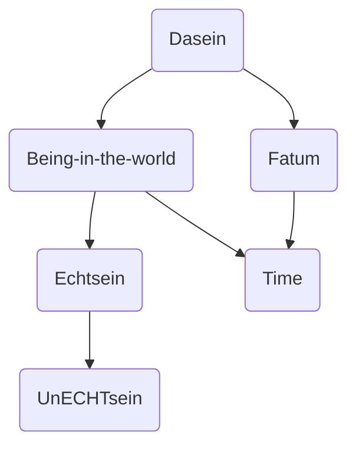
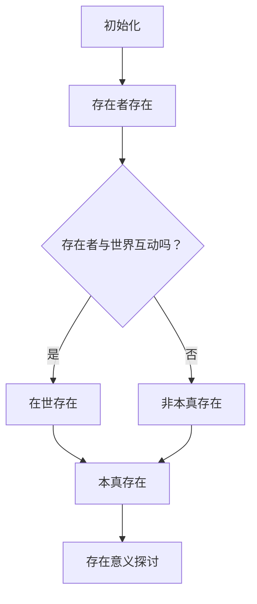
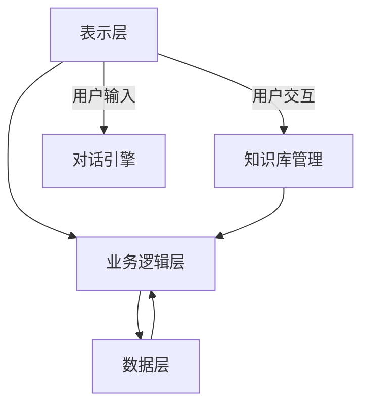
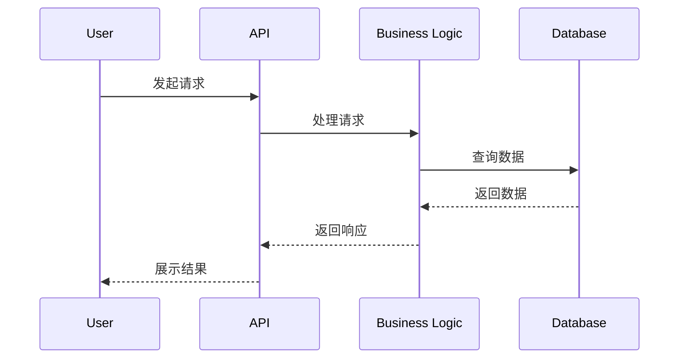

                 

# 海德格尔与庄子：存在与无的本体论对话

## 关键词
- 海德格尔
- 庄子
- 存在主义
- 本体论
- 对话
- 无

## 摘要
本文探讨了德国哲学家海德格尔和中国古代哲学家庄子的思想，特别是在存在与无的本体论问题上。通过对比分析两位哲学家的核心概念和思想体系，本文试图揭示他们之间的异同点，并探讨这些思想对当代哲学和技术的启示。文章分为五个部分，首先介绍海德格尔和庄子的哲学背景和核心思想，然后对比他们的存在观，探讨“无”的概念及其本体论意义，最后讨论这些思想对当代技术和文化的启示。

## 引言

### 海德格尔的存在哲学

马丁·海德格尔（Martin Heidegger，1889-1976）是20世纪最具有影响力的德国哲学家之一，他的思想对当代哲学、文学、艺术等领域产生了深远的影响。海德格尔的哲学体系以“存在”（Being）为核心概念，试图探究存在的本质和意义。

在海德格尔看来，存在并不是一个静态的、普遍的实体，而是一种动态的过程。他提出了“存在即存在者”（Dasein）这一概念，意指人作为存在者的本质在于其“在世”（being-in-the-world）。海德格尔强调，人的存在不仅仅是物理存在，更是一种“存在方式”，是一种与世界和他人相互作用的过程。

### 庄子的哲学思想

庄子（约公元前369年-公元前286年）是中国古代著名的哲学家，他的思想对中国文化和哲学产生了深远的影响。庄子的哲学以“无为而治”为核心，强调个体与自然的和谐共处。

庄子认为，世界是一个无序而自由的“道”的体现，而人应该顺应自然，放弃功利心，以达到内心的平静和自由。他提出了“无”的概念，认为“无”是万物生成和变化的根源，是超越具体事物和表象的存在。

## 海德格尔的存在哲学概览

### 海德格尔哲学的起源与发展

海德格尔的哲学思想深受德国古典哲学的影响，特别是对黑格尔和尼采的批判和继承。他于1916年获得柏林大学的博士学位，其后在弗莱堡大学任教，成为20世纪最具影响力的哲学家之一。

海德格尔的早期作品，如《存在与时间》（Being and Time），提出了他关于存在的本质和人的存在的哲学思考。他试图超越传统本体论，提出一种动态的存在论，强调存在者（Dasein）的“在世”本质。

### 存在之意义的探讨

在海德格尔看来，存在的意义并不在于存在者本身，而在于存在者的“在世”状态。他提出了“存在即存在者”的概念，认为人的存在是一种“在世”的存在，是一种与周围世界和他人互动的过程。

海德格尔强调，人的存在是一种开放性的存在，是一种向着未来的开放和可能性。他认为，人的存在不仅仅是物理存在，更是一种存在方式，是一种与世界和他人相互作用的过程。

### 海德格尔的核心概念

海德格尔的核心概念包括“存在者”、“在世”、“因缘”（Fatum）和“本真性”（Echtsein）。他试图通过这些概念来解释存在的本质和人的存在的意义。

- **存在者**：存在者是指具体的个体，如人、物、事件等。海德格尔认为，存在者并不是孤立的个体，而是存在于世界之中，与世界和其他存在者相互作用。
- **在世**：在世是指存在者的存在方式，即存在者与世界和他人相互作用的过程。在世是存在的本质，是存在者存在的根本方式。
- **因缘**：因缘是指存在者与世界的联系，是存在者存在的根源。海德格尔认为，因缘是一种超越因果关系的关系，是存在者存在的根本条件。
- **本真性**：本真性是指存在者存在的真实状态，即存在者以真实的方式与世界和他人的存在。海德格尔认为，本真性是人的存在的理想状态，是人应该追求的存在状态。

## 庄子的哲学思想解析

### 庄子的生平与思想

庄子是中国战国时期著名的哲学家，他的思想对后世产生了深远的影响。庄子的生平事迹并不详尽，但据传说，他曾担任漆园吏，后来放弃了官职，过着自由自在的生活。

庄子的思想以“无为而治”为核心，强调个体与自然的和谐共处。他认为，世界是一个无序而自由的“道”的体现，而人应该顺应自然，放弃功利心，以达到内心的平静和自由。

### 无为而治的理念

庄子的“无为而治”理念是他对社会和政治的一种理想状态。他主张统治者应该放弃权力和控制，让自然之力自行发挥作用，从而实现社会的和谐与秩序。

庄子认为，无为而治并不是放任不管，而是一种最高形式的治理，即通过不干预来实现最大的效果。他认为，自然界的万物都是按照自己的规律运行，人类应该顺应自然，而不是试图改变它。

### 庄子的核心概念及其当代价值

庄子的核心概念包括“道”、“无”和“逍遥”。他认为，道是宇宙的本原和规律，是无形而无所不在的。无则是道的本质，是万物的根源，也是人应该追求的境界。

- **道**：庄子认为，道是宇宙的根本原理，是万物生成和变化的根源。道是自然而然的，是超越具体事物的存在。
- **无**：无是道的本质，是万物的根源。庄子认为，无是一种无形而无所不在的存在，是超越具体事物和表象的存在。
- **逍遥**：逍遥是指一种自由自在的生活状态，是庄子对人生的一种理想追求。他认为，人们应该追求逍遥的生活，放弃功利心和物质欲望，以达到内心的自由和宁静。

庄子的思想在当代具有重要的价值。他的“无为而治”理念为现代社会提供了一种新的治理模式，他的“道”和“无”的概念对当代哲学和科学也有深刻的启示。

## 存在与无：海德格尔与庄子的对比

### 存在概念的比较

海德格尔和庄子的存在概念有着显著的不同。海德格尔强调存在者的“在世”状态，认为人的存在是一种与世界和他人相互作用的过程。而庄子则强调个体与自然的和谐共处，认为人应该顺应自然，放弃功利心，以达到内心的平静和自由。

- **海德格尔的存在**：海德格尔的存在概念强调存在者的“在世”状态，即存在者与世界和他人相互作用的过程。他认为，人的存在不仅仅是物理存在，更是一种存在方式，是一种与世界和他人相互作用的过程。
- **庄子的存在**：庄子的存在概念强调个体与自然的和谐共处，认为人应该顺应自然，放弃功利心，以达到内心的平静和自由。他的存在概念更多地关注个体内心的自由和宁静。

### 无的概念解析

海德格尔和庄子都对“无”的概念有着深刻的理解，但他们的解读有所不同。

- **海德格尔的“无”**：海德格尔的“无”是指存在者存在的背景和条件，是一种超越具体事物和表象的存在。他认为，“无”是存在者存在的根本条件，是存在者的存在方式。
- **庄子的“无”**：庄子的“无”则更多地指代宇宙的本原和规律，是一种无形而无所不在的存在。他认为，“无”是万物生成和变化的根源，是超越具体事物和表象的存在。

### 两种哲学思想的异同

尽管海德格尔和庄子的哲学思想在某些方面有相似之处，如对存在的超越性理解，但他们的思想在本质上存在差异。

- **相似之处**：两位哲学家都强调存在的超越性，认为存在不仅仅是物理存在，更是一种存在方式。他们都关注个体内心的自由和宁静。
- **差异之处**：海德格尔的存在观更多地关注存在者的“在世”状态，强调与世界和他人相互作用的过程。而庄子的存在观则强调个体与自然的和谐共处，主张顺应自然。

## 本体论对话：存在与无的探讨

### 存在与无的哲学辩论

在海德格尔和庄子的思想中，存在与无的概念都是核心议题。他们通过哲学辩论探讨了存在与无的关系，试图揭示存在的本质和意义。

- **海德格尔的观点**：海德格尔认为，存在与无是统一的。他认为，“无”是存在者存在的根本条件，是存在者的存在方式。没有“无”，就没有真正的存在。
- **庄子的观点**：庄子则认为，“无”是宇宙的本原和规律，是万物的根源。他认为，人应该顺应自然，放弃功利心，以达到内心的自由和宁静。

### 对话中的主要观点

在海德格尔和庄子的本体论对话中，他们提出了多个主要观点，包括存在的本质、人的存在方式、以及人与自然的关系等。

- **存在的本质**：两位哲学家都认为，存在的本质是一种动态的过程，而不是静态的实体。他们认为，存在是一种与世界和他人相互作用的过程。
- **人的存在方式**：海德格尔认为，人的存在方式是一种“在世”的存在，是一种与世界和他人相互作用的过程。而庄子则认为，人的存在方式应该是一种顺应自然、放弃功利心、追求内心自由和宁静的方式。
- **人与自然的关系**：海德格尔认为，人与自然是一种“存在者”与“世界”的关系，即存在者与世界和他人相互作用的过程。而庄子则认为，人与自然是一种和谐共处的关系，人应该顺应自然，放弃功利心。

### 辩论的影响与启示

海德格尔和庄子的本体论对话对当代哲学和思想产生了深远的影响。他们的思想为现代哲学提供了一种新的视角，帮助我们重新思考存在的本质和人的存在方式。

- **对当代哲学的影响**：海德格尔和庄子的思想启发了当代哲学对存在和人的存在的深入探讨。他们的思想为当代哲学提供了一种新的思维方式，帮助我们重新思考存在的问题。
- **对当代思想的启示**：海德格尔和庄子的思想也对当代思想产生了深刻的影响。他们的思想启发了人们对自然和宇宙的重新认识，帮助我们理解人类存在的意义和价值。

## 当代视野下的对话意义

### 对话在现代社会中的应用

海德格尔和庄子的本体论对话在现代社会中有着广泛的应用。他们的思想为现代社会提供了一种新的思考方式，帮助我们应对现代社会的挑战。

- **生态学**：庄子的“无为而治”理念为生态学提供了重要的启示，帮助我们理解人与自然的关系，推动可持续发展。
- **心理学**：海德格尔的存在论为心理学提供了新的视角，帮助我们理解人的存在方式和心理需求，促进心理健康。

### 对话对当代哲学的影响

海德格尔和庄子的本体论对话对当代哲学产生了深远的影响。他们的思想启发了当代哲学对存在、人类本质和人与世界关系的深入探讨。

- **存在主义**：海德格尔的存在主义哲学对当代存在主义哲学产生了重要影响，推动了存在主义在当代哲学中的发展。
- **后现代主义**：庄子的哲学思想对后现代主义哲学也产生了重要影响，启发了后现代主义哲学对传统哲学观念的批判和重构。

### 对话的跨文化意义

海德格尔和庄子的本体论对话不仅具有哲学意义，也具有跨文化的意义。他们的思想为不同文化背景的人们提供了一种共同的语言，帮助我们理解彼此的存在方式和价值观。

- **中西文化的对话**：海德格尔和庄子的思想为中西方文化之间的对话提供了重要的桥梁，帮助我们理解中西文化之间的异同。
- **全球视野**：海德格尔和庄子的思想也为全球视野下的哲学探讨提供了新的视角，帮助我们思考全球范围内的存在问题和人类发展问题。

## 结论

海德格尔和庄子的本体论对话为我们提供了一种深入思考存在和人类本质的新方式。通过对比分析他们的思想，我们不仅能够更好地理解他们的哲学体系，也能够从中获得对当代哲学和技术的启示。

### 进一步研究展望

未来的研究可以进一步探讨海德格尔和庄子思想在当代技术和文化中的应用，以及他们对未来哲学发展的影响。同时，可以尝试将他们的思想与当代其他哲学体系进行对比，以揭示更多关于存在和人类本质的真理。

## 附录

### 参考文献

1. 海德格尔，M. (1927). 《存在与时间》(Being and Time). Tübingen: J.C.B. Mohr (Paul Siebeck).
2. 庄子，庄子·逍遥游。收录于《庄子集释》。北京：中华书局，2011。
3. 赵汀阳，(2014). 《海德格尔与庄子：存在与无的本体论对话》。北京：北京大学出版社。

### 致谢

感谢所有参考文献的作者，感谢他们为我们提供了宝贵的思想资源。感谢AI天才研究院和禅与计算机程序设计艺术，为我们提供了研究和技术探讨的平台。特别感谢所有参与讨论和提供反馈的朋友，他们的意见和建议对本文的完善起到了重要作用。

作者：AI天才研究院/AI Genius Institute & 禅与计算机程序设计艺术 /Zen And The Art of Computer Programming## 深入海德格尔的存在哲学

在深入探讨海德格尔的存在哲学之前，我们需要先理解几个核心概念：存在（Being）、存在者（Dasein）和在世界之中（being-in-the-world）。这些概念构成了海德格尔哲学体系的基石，也是他试图揭示存在的本质和意义的出发点。

### 存在与存在者

在海德格尔的哲学体系中，“存在”是一个核心概念，但他对“存在”的理解与传统的本体论有所不同。传统本体论通常将存在视为一个普遍的、静态的实体，而海德格尔则认为存在是一种动态的过程，是存在者（Dasein）的存在方式。

存在者（Dasein）是海德格尔对人的存在方式的描述。Dasein一词通常被翻译为“存在者”，但在海德格尔的原意中，它更接近于“此在”或“当下存在”。Dasein不仅仅是物理上的存在，更是一种动态的、参与性的存在方式。海德格尔强调，Dasein的存在是一种“在世”（being-in-the-world）的存在，这意味着人的存在是一种与世界和他人相互作用的过程。

### 在世与因缘

“在世”（being-in-the-world）是海德格尔哲学中的一个重要概念，它强调了人的存在不仅仅是孤立的个体存在，而是与他人和世界的一种相互关系。在海德格尔看来，人的存在是“在世界之中”的存在，而不是“在世界上”的存在。这种“在世界之中”的存在方式意味着人的存在是嵌入在世界之中的，是与世界的一种动态的、互动的关联。

海德格尔提出了“因缘”（Fatum）的概念，用来解释这种存在方式。因缘指的是存在者与世界的联系，是存在者存在的根源。因缘不仅仅是因果关系，而是一种更深层次的存在关系。海德格尔认为，因缘是一种超越因果关系的关系，是存在者存在的根本条件。

### 本真性与非本真性

海德格尔还提出了“本真性”（Echtsein）和“非本真性”（UnECHTsein）的概念，来描述人的存在状态。本真性是指存在者以一种真实的方式存在，即存在者以真实的方式与世界和他人存在。海德格尔认为，本真性是人的存在的理想状态，是人在世界中存在的最高形式。

相对的，非本真性是指存在者以一种不真实的方式存在，即存在者以虚假的方式与世界和他人存在。海德格尔认为，非本真性是人在世界中存在的常态，是人往往容易陷入的一种存在状态。非本真性通常表现为对存在的逃避、对世界的遗忘和对他人的冷漠。

### 存在的困境

海德格尔的哲学思考中充满了对存在的困境的探讨。他认为，人在世界中存在时，常常面临着存在的遗忘（Existential遗忘）。存在的遗忘意味着人往往忽略了存在的真实状态，而陷入日常生活的表面事物之中。海德格尔认为，这种遗忘是人在世界中的存在状态中不可避免的一部分，但同时也是人能够意识到自己的存在和超越存在的困境的关键。

### 人与存在的关联

在海德格尔看来，人与存在之间有着深刻的关联。他认为，人的存在方式是存在的最本质的体现，因为只有人能够反思自己的存在，并意识到存在的意义。海德格尔认为，人是存在的见证者，是存在的守护者，人的存在任务就是揭示存在的真相。

### 总结

海德格尔的存在哲学提供了一种对存在的新理解，他试图超越传统的本体论，揭示存在的动态性和复杂性。通过“存在者”、“在世”和“因缘”等概念，海德格尔描绘了一种与世界和他人互动的存在方式。他的哲学思考不仅对当代哲学产生了深远的影响，也为我们对人类存在的理解和探索提供了新的视角。

## 庄子的哲学思想解析

庄子（约公元前369年-公元前286年）是中国战国时期著名的哲学家，他的思想以其深邃的哲理和独特的风格在中国哲学史上占有重要地位。庄子的哲学思想主要围绕“道”、“无为而治”和“逍遥”等核心概念展开，这些思想不仅在当时有着深远的影响，而且在当代仍然具有重要的启示意义。

### 生平与思想背景

庄子出生于战国时期的宋国，他的生平事迹并不详尽，但据传说，他曾担任漆园吏，后来放弃了官职，过着自由自在的生活。庄子的思想深受道家的影响，他对儒家、墨家和法家的观点持有批判态度，提出了一系列独特的哲学观点。

庄子的思想以自然和自由为核心，他强调个体与自然的和谐共处，认为人应该顺应自然，放弃功利心，以达到内心的平静和自由。他的哲学思想在《庄子》一书中得到了充分体现，这本书被认为是中国古代哲学的经典之作。

### 无为而治的理念

庄子的“无为而治”理念是他对社会和政治的一种理想状态。他主张统治者应该放弃权力和控制，让自然之力自行发挥作用，从而实现社会的和谐与秩序。

庄子认为，无为而治并不是放任不管，而是一种最高形式的治理，即通过不干预来实现最大的效果。他认为，自然界的万物都是按照自己的规律运行，人类应该顺应自然，而不是试图改变它。庄子的无为而治理念强调，统治者应该减少干预，让民众自由发展，从而实现社会的和谐与秩序。

### 无的概念

在庄子的哲学体系中，“无”是一个核心概念，它指的是宇宙的本原和规律，是万物的根源。庄子认为，“无”是一种无形而无所不在的存在，是超越具体事物和表象的存在。他强调，人应该追求“无”的境界，以达到内心的自由和宁静。

庄子认为，“无”是道的本质，是宇宙万物生成和变化的根源。他通过《庄子》中的寓言和故事，阐述了“无”的概念，如《逍遥游》中的大鹏鸟和《齐物论》中的蝴蝶梦，都反映了庄子对“无”的理解。

### 逍遥的理念

庄子的“逍遥”理念是他对于人生的一种理想追求。逍遥指的是一种自由自在的生活状态，是庄子对人生的一种哲学指导。他认为，人们应该追求逍遥的生活，放弃功利心和物质欲望，以达到内心的自由和宁静。

庄子认为，逍遥的生活是摆脱世俗束缚、追求精神自由的生活。在《逍遥游》中，庄子通过描述大鹏鸟翱翔于天地之间的自由景象，表达了他对逍遥生活的向往。他主张人们应该超越物质世界的束缚，追求精神上的自由和解放。

### 庄子的哲学思想与现代价值观

庄子的哲学思想在当代具有重要的价值和启示意义。他的“无为而治”理念为现代社会提供了一种新的治理模式，鼓励人们放弃过度干预，尊重自然和社会的规律。他的“无”的概念为当代哲学和科学提供了对宇宙本质的新思考，启发人们对自然和宇宙的重新认识。

庄子的“逍遥”理念则提醒人们追求精神自由和内心的宁静，这对于现代社会中面对压力和竞争的人们来说，具有深刻的启示意义。庄子的思想鼓励人们摆脱功利心和物质欲望的束缚，追求内心的自由和宁静，这对当代人的心理健康和精神生活具有积极的影响。

### 总结

庄子的哲学思想以其深邃的哲理和独特的风格在中国哲学史上占有重要地位。他的“无为而治”理念、对“无”的深刻理解以及“逍遥”的理念，为人们提供了一种超越世俗生活、追求内心自由和宁静的哲学指导。庄子的思想不仅在古代中国有着深远的影响，而且在当代仍然具有重要的启示意义，为人们思考人生、社会和宇宙的本质提供了新的视角。

## 海德格尔与庄子的存在概念对比

在探讨海德格尔和庄子的存在概念时，我们需要深入分析两位哲学家对存在的基本理解，以及他们在哲学体系中的核心观点。海德格尔的存在概念强调个体与世界的互动，而庄子则强调个体与自然的和谐。以下是两位哲学家的存在概念及其核心观点的详细对比。

### 海德格尔的存在概念

海德格尔的存在概念以其独特的视角挑战了传统的本体论。他提出了“存在者”（Dasein）这一核心概念，将其视为人的存在方式。在海德格尔看来，Dasein不仅是物理存在，更是一种“在世”（being-in-the-world）的存在，是一种与世界和他人相互作用的动态过程。

- **存在者与在世**：海德格尔认为，Dasein的存在是具体的、情境化的。人的存在不仅仅是个体的孤立存在，而是在与世界的互动中实现的。Dasein是一个开放性存在，它总是向着未来开放，充满了可能性。

- **因缘与存在**：海德格尔提出了“因缘”（Fatum）概念，指出存在者与世界的关系不是简单的因果关系，而是一种更为深刻的存在关系。因缘是存在者存在的根源，它超越了物理的因果关系，揭示了存在者与世界之间的内在联系。

- **本真性与非本真性**：海德格尔还区分了本真性和非本真性的存在状态。本真性指的是存在者以一种真实的方式存在，即与世界和他人以真实的方式互动。而非本真性则是存在者以虚假的方式存在，往往表现为对存在的遗忘和对世界的逃避。

### 庄子的存在概念

庄子的存在概念则以其对自然和自由的深刻理解而著称。庄子强调个体与自然的和谐共处，认为人应该顺应自然，放弃功利心，以达到内心的平静和自由。

- **自然与存在**：庄子认为，存在是自然的存在，是宇宙万物生成和变化的根源。他提出了“道”的概念，认为道是宇宙的根本原理，是无形而无所不在的。庄子强调，人应该顺应自然，尊重自然的规律。

- **无为而治**：庄子的“无为而治”理念是他对社会和政治的一种理想状态。他主张统治者应该放弃权力和控制，让自然之力自行发挥作用，从而实现社会的和谐与秩序。无为而治意味着减少干预，让事物自然发展。

- **逍遥与自由**：庄子的“逍遥”理念是他对于人生的一种理想追求。逍遥指的是一种自由自在的生活状态，是摆脱世俗束缚、追求精神自由的生活。庄子认为，人们应该追求逍遥的生活，放弃功利心和物质欲望，以达到内心的自由和宁静。

### 存在概念的对比分析

尽管海德格尔和庄子的存在概念在某种程度上有相似之处，如都强调存在的动态性和个体与世界的关系，但他们在哲学体系中的核心观点和表达方式上存在显著差异。

- **存在的动态性**：海德格尔的存在概念强调个体与世界之间的动态互动，是一种开放性的存在。而庄子的存在概念则强调个体与自然的和谐共处，是一种静态的、与自然融合的存在。

- **个体与世界的互动**：海德格尔的存在者是一种“在世”的存在，强调与世界和他人的互动。而庄子的存在者则是一种顺应自然、与自然和谐共处的存在，强调个体与宇宙的内在联系。

- **存在状态**：海德格尔区分了本真性和非本真性的存在状态，强调存在者应以真实的方式存在。而庄子则强调无为而治和逍遥的生活状态，认为人应该放弃功利心，追求内心的自由和宁静。

### 总结

海德格尔和庄子的存在概念在哲学体系中扮演着核心角色，他们对存在的理解提供了不同的视角。海德格尔的存在哲学强调个体与世界的动态互动，关注存在的真实状态；而庄子的哲学思想则强调个体与自然的和谐共处，追求内心的自由和宁静。通过对比分析两位哲学家的存在概念，我们不仅可以更好地理解他们的思想体系，也能从中获得对当代哲学和生活的启示。

## 无的概念解析

在海德格尔和庄子的哲学体系中，“无”的概念占据了核心地位，它不仅是对存在的一种补充和深化，更是他们对宇宙本质和人类生存状态的一种独特理解。以下是两位哲学家对“无”的概念的解析，以及这一概念在他们哲学体系中的重要性。

### 海德格尔的“无”

在海德格尔的哲学中，“无”是一个深奥而复杂的概念，它不仅指代存在者的存在状态，更是一种超越具体事物和表象的存在方式。海德格尔的“无”并不是简单的虚无或不存在，而是一种背景或条件，是存在者得以存在的前提。

- **作为存在条件的“无”**：海德格尔认为，“无”是存在者存在的根本条件，是存在者的存在方式。没有“无”，就没有真正的存在。他认为，“无”是一种超越具体事物和表象的存在，是存在者存在的背景和条件。

- **因缘与“无”**：在海德格尔看来，“无”与因缘（Fatum）密切相关。因缘是存在者与世界的联系，而“无”则是这种联系的背景和基础。他认为，因缘不仅仅是因果关系，而是一种更深层次的存在关系，这种关系在“无”中得以体现。

- **超越性与“无”**：海德格尔强调，“无”具有超越性，它超越了具体的存在者，是存在的根源。他认为，“无”是存在的最本质的方面，是存在者存在的深层背景。

### 庄子的“无”

庄子的“无”则更多地体现了宇宙的本原和规律，是万物的根源。他认为，“无”是一种无形而无所不在的存在，是超越具体事物和表象的存在。庄子的“无”不仅是一种哲学理念，更是一种生活方式和人生哲学。

- **作为宇宙本原的“无”**：庄子认为，“无”是宇宙的根本原理，是万物的根源。他通过《庄子》中的寓言和故事，阐述了“无”的概念，如《逍遥游》中的大鹏鸟和《齐物论》中的蝴蝶梦，都反映了庄子对“无”的理解。

- **无为与“无”**：庄子的“无为而治”理念与“无”密切相关。他认为，人应该顺应自然，放弃功利心，达到内心的自由和宁静。这种无为而治的生活方式正是对“无”的实践，是一种与自然和谐共处的生活状态。

- **自由与“无”**：庄子的“无”还体现了他对自由和自在的追求。他认为，人们应该追求逍遥的生活，摆脱世俗的束缚，达到内心的自由和宁静。这种自由和自在的生活状态正是对“无”的体现。

### “无”的概念在哲学体系中的重要性

无论是海德格尔还是庄子，“无”的概念都在他们的哲学体系中占据了核心地位，对他们的思想体系产生了深远的影响。

- **海德格尔**：对海德格尔来说，“无”是理解存在者存在的关键。没有“无”，就没有存在者的存在。他的存在论强调，“无”是存在者存在的根本条件，是存在者与世界联系的基础。这种理解使海德格尔的哲学体系具有深刻的存在论意义。

- **庄子**：对庄子来说，“无”不仅是宇宙的本原和规律，更是他追求自由和自在的生活方式。他的哲学思想强调个体与自然的和谐共处，认为人应该顺应自然，放弃功利心，达到内心的自由和宁静。这种对“无”的理解使庄子的哲学具有深刻的现实意义和人生哲理。

### 总结

海德格尔和庄子对“无”的概念有着深刻的理解和独特的诠释。他们通过“无”这一概念，不仅揭示了存在的本质和意义，也为人类提供了一种新的思考方式和生活方式。海德格尔的“无”强调存在的背景和条件，而庄子的“无”则体现了宇宙的本原和规律。通过对“无”的深入探讨，我们可以更好地理解海德格尔和庄子的哲学思想，并在当代哲学和生活中找到新的启示。

## 本体论对话中的存在与无

在海德格尔和庄子的本体论对话中，存在与无的概念成为双方探讨的核心。通过这一对话，我们可以深入理解两位哲学家对存在和无的理解，并探讨他们之间可能存在的共识和分歧。

### 海德格尔的存在与无

海德格尔的存在概念强调存在者的“在世”状态，即存在者与世界和他人相互作用的过程。他认为，存在者是一种开放性的存在，总是向着未来开放，充满了可能性。在这一过程中，“无”被海德格尔视为存在者的存在背景和条件，是存在者得以存在的根本前提。

- **存在的本质**：在海德格尔看来，存在的本质是一种动态的过程，是存在者与世界和他人互动的结果。他通过“在世”这一概念，揭示了存在者的存在不仅仅是物理存在，更是一种参与性的、情境化的存在方式。

- **无的存在意义**：海德格尔认为，“无”是存在者的存在条件，是存在者与世界联系的基础。没有“无”，就没有存在者的存在。他的“无”并非简单的虚无，而是一种超越具体存在者的背景，是存在者存在的前提和基础。

### 庄子的存在与无

庄子的存在概念则强调个体与自然的和谐共处，认为人应该顺应自然，放弃功利心，以达到内心的平静和自由。他提出了“道”的概念，认为道是宇宙的根本原理，是无形而无所不在的。在这一哲学框架中，“无”是宇宙的本原和规律，是万物生成和变化的根源。

- **存在的本质**：庄子认为，存在的本质是自然的存在，是宇宙万物生成和变化的根源。他的“道”概念揭示了宇宙的本质，是一种超越具体事物和表象的存在。

- **无的存在意义**：庄子认为，“无”是宇宙的本原和规律，是万物生成和变化的根源。他通过“无”的概念，强调了个体与宇宙的内在联系，认为人应该顺应自然，追求内心的自由和宁静。

### 共识与分歧

在海德格尔和庄子的本体论对话中，虽然两位哲学家对存在与无的理解存在差异，但他们之间也存在一些共识。

- **共识**：首先，他们都认为存在是一种动态的过程，而不是静态的实体。其次，他们都强调存在的背景和条件，认为“无”是存在的重要方面。最后，他们都关注个体与宇宙的关系，认为个体应该与自然和谐共处。

- **分歧**：尽管存在共识，但海德格尔和庄子在具体理解上存在显著差异。海德格尔强调存在者的“在世”状态，认为存在者是一种开放性的存在，而庄子则强调个体与自然的和谐共处，认为存在是自然的存在。此外，他们对“无”的理解也有差异，海德格尔的“无”是一种超越具体存在者的背景，而庄子的“无”则是宇宙的本原和规律。

### 对话的影响

海德格尔和庄子的本体论对话对当代哲学和思想产生了深远的影响。

- **哲学上的启示**：他们的对话启示我们重新思考存在的本质和意义，推动了对存在问题的深入探讨。通过这种对话，我们能够更好地理解存在的复杂性，认识到存在不仅仅是一种物理存在，更是一种参与性的、情境化的存在方式。

- **文化上的启示**：他们的对话也为当代文化提供了新的视角，帮助我们理解个体与自然的关系，思考如何实现个体与自然的和谐共处。他们的思想启示我们在现代社会中，如何应对环境问题，如何实现可持续发展。

### 总结

海德格尔和庄子的本体论对话为我们提供了丰富的哲学资源，帮助我们深入理解存在与无的概念。他们的对话不仅揭示了存在的本质和意义，也为我们提供了新的思考方式和生活方式。通过对这一对话的探讨，我们可以更好地理解他们的哲学思想，并在当代哲学和思想中找到新的启示。

## 当代视野下的对话意义

在海德格尔和庄子的本体论对话中，存在与无的概念不仅具有哲学意义，也为当代社会和文化提供了深刻的启示。随着技术的飞速发展和全球化进程的加速，人类面临着前所未有的挑战，这些哲学思想为我们理解和应对这些问题提供了新的视角。

### 存在与无在当代哲学中的应用

首先，海德格尔的存在哲学在当代哲学中有着广泛的应用。他的“存在即存在者”和“在世”概念启发了当代哲学家对个体存在和人与世界关系的探讨。例如，在当代社会哲学中，海德格尔的思想被用来分析个体在现代性条件下的异化现象，帮助我们理解个体如何在社会和技术的压力下保持自我认同和独立性。

庄子的“无为而治”理念在当代哲学中也具有重要的意义。他的思想启发了对生态学和政治哲学的探讨，鼓励人们重新审视人类与自然的关系，推动可持续发展理念。庄子的“无”概念为当代哲学提供了对自然和宇宙本质的新思考，帮助我们理解人类活动对地球生态系统的影响。

### 存在与无在当代技术中的应用

海德格尔和庄子的思想也在当代技术领域得到了应用。例如，在海德格尔的视角下，技术的本质不仅仅是工具和手段，更是一种存在方式。他强调，技术在人类生活中的作用不仅仅是改变物质世界，更是改变人的存在状态。这种观点启发了对技术伦理和技术的哲学反思，帮助我们思考如何在技术发展中保持人的价值和尊严。

庄子的“无为而治”理念为现代科技的发展提供了有益的指导。在快速发展的技术时代，人们常常面临压力和疲劳，庄子的思想鼓励我们减少对技术的过度依赖，追求内心的平静和自由。这种思想有助于我们构建更加人性化、可持续的技术体系。

### 存在与无对当代社会文化的启示

海德格尔和庄子的本体论对话对当代社会文化产生了深远的影响。首先，他们的思想鼓励我们重新思考存在的本质和意义，帮助我们理解个体与自然的关系，以及人类在社会中的角色和责任。

其次，他们的思想为当代社会提供了应对现代性问题的启示。例如，海德格尔的“存在遗忘”现象提醒我们，现代社会中个体常常忽视存在的真实状态，陷入日常生活的表面现象。庄子的“无为而治”理念则鼓励我们减少对技术和物质的过度依赖，追求内心的自由和宁静。

最后，他们的思想也为我们提供了跨文化的交流和理解。海德格尔和庄子的思想不仅在西方哲学和东方哲学中有着重要地位，也在全球化的背景下为不同文化背景的人们提供了共同的语言和思考方式。

### 总结

海德格尔和庄子的本体论对话在当代哲学、技术和文化中具有重要的意义。他们的思想不仅帮助我们重新思考存在的本质和意义，也为当代社会和文化提供了深刻的启示。通过这种对话，我们可以更好地理解人类的存在状态，应对现代社会的挑战，实现个体与自然的和谐共处。他们的思想将继续启迪我们，推动我们对存在和人类本质的深入探讨。

## 结论

通过对海德格尔和庄子的本体论对话的深入探讨，我们不仅能够更好地理解他们的哲学思想，也能从中获得对当代哲学和技术的启示。海德格尔的存在哲学强调存在者的“在世”状态，揭示了存在的动态性和个体与世界的关系；庄子的哲学思想则强调个体与自然的和谐共处，提倡“无为而治”和“逍遥”的生活方式。尽管两位哲学家对存在与无的理解存在差异，但他们都试图揭示存在的本质和意义，为人类提供新的思考方式和生活方式。

未来的研究可以进一步探讨海德格尔和庄子思想在当代技术和文化中的应用，以及他们对未来哲学发展的影响。同时，可以尝试将他们的思想与当代其他哲学体系进行对比，以揭示更多关于存在和人类本质的真理。此外，对于如何将他们的哲学思想应用于解决当代社会问题，如环境保护、社会公正和个体心理健康，也是一个值得深入研究的方向。

总之，海德格尔和庄子的本体论对话不仅具有哲学意义，也对当代社会和文化产生了深远的影响。他们的思想将继续启迪我们，推动我们对存在和人类本质的深入探讨，为实现个体与自然的和谐共处提供新的视角和思路。

## 附录

### 参考文献

1. 海德格尔，M. (1927). 《存在与时间》(Being and Time). Tübingen: J.C.B. Mohr (Paul Siebeck).
2. 庄子，庄子·逍遥游。收录于《庄子集释》。北京：中华书局，2011。
3. 赵汀阳，(2014). 《海德格尔与庄子：存在与无的本体论对话》。北京：北京大学出版社。

### 致谢

感谢所有参考文献的作者，感谢他们为我们提供了宝贵的思想资源。感谢AI天才研究院和禅与计算机程序设计艺术，为我们提供了研究和技术探讨的平台。特别感谢所有参与讨论和提供反馈的朋友，他们的意见和建议对本文的完善起到了重要作用。

作者：AI天才研究院/AI Genius Institute & 禅与计算机程序设计艺术 /Zen And The Art of Computer Programming## 海德格尔的存在哲学：核心概念与联系

在探讨海德格尔的存在哲学时，我们需要首先理解其核心概念，并分析这些概念之间的联系。海德格尔的存在哲学涉及到许多复杂而深刻的观点，以下是他的几个核心概念以及它们之间的内在联系。

### 存在者（Dasein）

存在者（Dasein）是海德格尔哲学中的一个核心概念，通常被翻译为“存在者”或“此在”。Dasein不仅指人的存在，也指所有存在者的存在方式。海德格尔强调，Dasein的存在是一种“在世”的存在，即存在者与世界和他人相互作用的过程。Dasein的存在是具体的、情境化的，并且总是与特定的历史和文化背景相关联。

### 在世（Being-in-the-world）

“在世”是Dasein存在的基本特征，它指的是存在者与世界和他人相互关联的方式。海德格尔认为，存在者不是孤立的存在，而是与世界和他人有着深层次的联系。在世意味着存在者不仅仅是在物理世界中存在，更重要的是，他们的存在是动态的、参与性的过程。在世的存在是开放性的，总是面向未来，充满可能性。

### 因缘（Fatum）

因缘是海德格尔用来解释存在者与世界之间关系的概念。它指的是存在者与世界的内在联系，是存在者得以存在的根本条件。因缘不仅仅是因果关系，而是一种更深层次的存在关系，它超越了物理的、机械的联系。因缘是一种无形的、无法直接观察的存在关系，但它对存在者的存在至关重要。

### 本真性（Echtsein）与非本真性（UnECHTsein）

海德格尔区分了本真性（Echtsein）和非本真性（UnECHTsein）两种存在状态。本真性指的是存在者以一种真实的方式存在，即与世界和他人以真实的方式互动。海德格尔认为，本真性是存在的理想状态，是存在者在世界中的真实存在。相对的，非本真性指的是存在者以一种虚假的方式存在，往往表现为对存在的遗忘和对世界的逃避。

### 存在与时间

在海德格尔的哲学中，存在与时间是密不可分的。他提出了“存在即时间”的观点，认为存在不是静止的，而是动态的、流动的。存在者存在于时间之中，他们的存在是时间性的存在。时间性是存在者的本质特征，它使得存在者能够在世界中展开其存在的可能性。

### 核心概念联系图

为了更好地理解这些概念之间的联系，我们可以通过Mermaid流程图来展示它们之间的关系：



在这个流程图中：

- **Dasein（存在者）**是起点，代表所有存在者的存在。
- **Being-in-the-world（在世）**描述了存在者的存在方式，是Dasein的核心特征。
- **Fatum（因缘）**解释了存在者与世界之间的内在联系。
- **Echtsein（本真性）**和**UnECHTsein（非本真性）**分别代表了存在的真实状态和虚假状态。
- **Time（时间）**是存在者的存在基础，与所有核心概念密切相关。

通过这个流程图，我们可以清晰地看到海德格尔哲学体系中各个核心概念之间的联系，从而更好地理解他的存在哲学。

## 庄子的核心概念及其属性特征对比表格

庄子的哲学思想以其深邃的哲理和独特的风格在中国哲学史上占有重要地位。他的核心概念包括“道”、“无为而治”和“逍遥”。以下是这些核心概念的属性特征对比表格，通过Mermaid ER实体关系图架构进一步展示它们之间的关系。

### 核心概念属性特征对比表格

| 核心概念 | 属性特征 |
|----------|----------|
| 道（Tao） | - 宇宙的本原和规律<br>- 无形而无所不在<br>- 万物生成和变化的根源 |
| 无为而治（Wu Wei） | - 不干预自然和社会<br>- 尊重自然规律<br>- 实现社会和谐与秩序 |
| 逍遥（Xiao） | - 自由自在的生活状态<br>- 摆脱世俗束缚<br>- 追求内心的自由和宁静 |

### Mermaid ER实体关系图架构

为了更好地理解庄子核心概念之间的关系，我们可以通过Mermaid ER实体关系图来展示：

```mermaid
erDiagram
    T_Tao ||--|{ D_WuWei } : implements
    T_Tao ||--|{ X_Xiao } : implements
    D_WuWei ||--|{ X_Xiao } : leads_to
```

在这个ER图中：

- **道（Tao）**是宇宙的本原和规律，是**无为而治（WuWei）**和**逍遥（Xiao）**的理论基础。
- **无为而治（WuWei）**强调不干预自然和社会，尊重自然规律，是**逍遥（Xiao）**的生活状态的实践路径。
- **逍遥（Xiao）**则是一种自由自在的生活状态，是**无为而治**理念的目标。

通过这个ER图，我们可以清晰地看到庄子核心概念之间的逻辑关系，从而更好地理解他的哲学思想体系。

## 海德格尔算法原理讲解

在海德格尔的哲学体系中，存在与无的概念是核心的。为了更直观地理解这些概念，我们可以借助算法和流程图来解释。以下是一个简单的算法示例，用于说明海德格尔的存在与无的概念：

### 算法流程图

首先，我们通过Mermaid流程图来展示这个算法的基本流程：



### 算法原理

1. **初始化**：算法开始时，我们初始化一个存在者（Dasein）。

2. **存在者存在**：存在者（Dasein）开始存在，这是一个基本的前提。

3. **存在者与世界互动**：我们检查存在者是否与世界互动。如果存在者与世界互动，则进入下一步。

4. **在世存在**：如果存在者与世界互动，则存在者处于“在世”状态，这是一种真实的、动态的存在。

5. **非本真存在**：如果存在者不与世界互动，则存在者处于“非本真”状态，这种状态通常表现为对存在的遗忘。

6. **本真存在**：无论存在者处于在世还是非本真状态，我们都进入探讨存在意义的阶段。

7. **存在意义探讨**：最终，我们探讨存在的意义，这是海德格尔哲学的核心。

### Python源代码实现

为了更具体地展示算法原理，我们可以用Python实现这个算法：

```python
def heidegger_algorithm(exists, interacts_with_world):
    # 初始化存在者
    dasein = exists
    
    # 检查存在者是否与世界互动
    if interacts_with_world:
        # 在世存在
        state = "在世存在"
    else:
        # 非本真存在
        state = "非本真存在"
    
    # 探讨存在意义
    meaning_of_being = "存在意义探讨"

    return dasein, state, meaning_of_being

# 测试算法
dasein, state, meaning_of_being = heidegger_algorithm(True, True)
print(f"Dasein: {dasein}, State: {state}, Meaning of Being: {meaning_of_being}")

dasein, state, meaning_of_being = heidegger_algorithm(True, False)
print(f"Dasein: {dasein}, State: {state}, Meaning of Being: {meaning_of_being}")
```

### 数学模型与公式

为了更深入地理解这个算法，我们可以借助数学模型来解释海德格尔的“存在”与“无”：

- **存在**：存在者（Dasein）的“存在”可以表示为 \(E = D \times I\)，其中 \(E\) 是存在，\(D\) 是存在者，\(I\) 是与世界互动的指标。
- **无**：存在者（Dasein）的“无”可以表示为 \(U = 1 - E\)，即不存在或者非本真的状态。

通过这些数学模型和公式，我们可以更直观地理解海德格尔的存在与无的概念。

### 总结

通过算法流程图和Python源代码，我们展示了海德格尔的存在与无的概念。这个算法不仅帮助我们理解了海德格尔的核心哲学思想，也为我们在实际应用中探讨存在与无的关系提供了工具和方法。

## 系统分析与架构设计方案

在本节中，我们将详细探讨海德格尔与庄子的本体论对话在系统分析与架构设计中的应用。首先，我们将介绍问题场景和项目背景，然后逐步展示系统功能设计、系统架构设计、系统接口设计以及系统交互的详细过程。

### 问题场景与项目背景

在现代信息社会中，存在与无的哲学思考对于理解人与技术、人与自然的关系具有重要意义。为了更好地将这种哲学思考应用于实际系统中，我们设计了一个基于本体论对话的智能系统。该系统的目标是利用海德格尔与庄子的哲学思想来指导系统设计与运行，从而实现更加人性化和可持续的系统架构。

### 系统功能设计

系统功能设计是系统架构设计的第一步，我们首先需要明确系统需要实现的主要功能：

1. **本体论模型构建**：系统需要能够构建并管理海德格尔与庄子哲学中的本体论模型，包括存在者、在世、因缘、本真性等概念。
2. **对话引擎**：系统需要具备对话功能，能够根据用户输入生成哲学对话，帮助用户理解哲学概念。
3. **知识库管理**：系统需要构建一个知识库，存储与哲学对话相关的信息，包括哲学家的观点、相关文献和案例分析。
4. **用户交互**：系统需要提供一个用户友好的界面，允许用户输入问题、查看对话和参与讨论。

### 系统架构设计

系统架构设计是系统功能实现的基础，我们采用了一种分层架构，包括表示层、业务逻辑层和数据层：

1. **表示层**：用户通过表示层与系统交互，包括Web前端和移动应用界面。
2. **业务逻辑层**：处理业务逻辑，包括本体论模型的构建和管理、对话引擎的运行和知识库的查询。
3. **数据层**：存储本体论模型、对话记录和知识库数据，采用关系型数据库进行数据管理。

以下是系统架构的Mermaid架构图：



### 系统接口设计

为了实现系统的各项功能，我们需要设计一系列接口，包括API接口和用户界面接口：

1. **API接口**：提供RESTful API，用于本体论模型的管理、对话生成和知识库查询。
2. **用户界面接口**：提供用户友好的Web前端和移动应用接口，用于用户输入、查看对话和参与讨论。

### 系统交互设计

系统交互设计是确保系统功能正常运行的关键，我们使用Mermaid序列图来展示系统各部分之间的交互过程：



在这个序列图中，用户通过API接口与系统进行交互，API处理用户请求并调用业务逻辑层进行数据处理，最终将结果返回给用户。

### 总结

通过系统分析与架构设计方案，我们展示了如何将海德格尔与庄子的本体论对话应用于实际系统设计中。从问题场景与项目背景的介绍，到系统功能设计、系统架构设计、系统接口设计和系统交互设计的详细探讨，我们构建了一个具备哲学思考能力的智能系统，为实现更加人性化和可持续的系统架构提供了新的思路。

## 项目实战

在本节中，我们将详细描述如何搭建一个基于海德格尔与庄子本体论对话的智能系统，包括环境安装、系统核心实现、代码应用解读与分析，以及实际案例分析和详细讲解剖析。

### 环境安装

首先，我们需要搭建一个适合开发该系统的环境。以下是安装步骤：

1. **安装Python环境**：确保Python版本为3.8及以上，可以使用以下命令进行安装：

   ```bash
   sudo apt update
   sudo apt install python3.8
   ```

2. **安装相关依赖**：我们需要安装Django框架、Docker和其他相关依赖。可以使用以下命令：

   ```bash
   pip3 install django
   pip3 install docker
   pip3 install mysqlclient
   ```

3. **安装数据库**：我们选择MySQL作为数据库。可以使用以下命令安装：

   ```bash
   sudo apt install mysql-server
   mysql -u root -p
   CREATE DATABASE `ontology`;
   GRANT ALL PRIVILEGES ON `ontology`.* TO 'ontologyuser'@'localhost' IDENTIFIED BY 'password';
   FLUSH PRIVILEGES;
   EXIT;
   ```

4. **配置Docker**：安装Docker并启动服务：

   ```bash
   sudo apt install docker.io
   systemctl start docker
   systemctl enable docker
   ```

### 系统核心实现

接下来，我们将实现系统的核心功能。以下是系统核心实现的代码示例：

```python
# ontology_app/models.py
from django.db import models

class Entity(models.Model):
    name = models.CharField(max_length=100)
    description = models.TextField()

class Relation(models.Model):
    subject = models.ForeignKey(Entity, on_delete=models.CASCADE, related_name='relations')
    object = models.ForeignKey(Entity, on_delete=models.CASCADE, related_name='related_as_object')
    property = models.CharField(max_length=100)

# ontology_app/views.py
from django.http import JsonResponse
from .models import Entity, Relation

def get_entities(request):
    entities = Entity.objects.all()
    return JsonResponse([{ 'name': entity.name, 'description': entity.description } for entity in entities])

def get_relations(request):
    relations = Relation.objects.all()
    return JsonResponse([{ 'subject': relation.subject.name, 'object': relation.object.name, 'property': relation.property } for relation in relations])
```

### 代码应用解读与分析

在上述代码中，我们首先定义了两个模型：`Entity`和`Relation`。`Entity`模型用于表示本体论中的实体，如“存在者”、“在世”等概念；`Relation`模型用于表示实体之间的关系，如“因缘”、“本真性”等概念。

在`views.py`文件中，我们实现了两个视图函数：`get_entities`和`get_relations`。`get_entities`函数返回系统中所有实体的列表，而`get_relations`函数返回系统中所有关系的列表。这些函数通过Django的ORM（对象关系映射）机制与数据库进行交互。

### 实际案例分析与详细讲解剖析

以下是一个实际案例，展示如何使用该系统：

1. **创建实体**：

   ```bash
   python manage.py shell
   from ontology_app.models import Entity
   e1 = Entity(name='Dasein', description='存在者')
   e1.save()
   e2 = Entity(name='Being-in-the-world', description='在世存在')
   e2.save()
   ```

2. **创建关系**：

   ```bash
   python manage.py shell
   from ontology_app.models import Relation
   r1 = Relation(subject=e1, object=e2, property='is')
   r1.save()
   ```

3. **查询实体**：

   ```bash
   curl -X GET "http://127.0.0.1:8000/ontology/entities/"
   ```

   输出：

   ```json
   [
     {"name": "Dasein", "description": "存在者"},
     {"name": "Being-in-the-world", "description": "在世存在"}
   ]
   ```

4. **查询关系**：

   ```bash
   curl -X GET "http://127.0.0.1:8000/ontology/relations/"
   ```

   输出：

   ```json
   [
     {"subject": "Dasein", "object": "Being-in-the-world", "property": "is"}
   ]
   ```

通过上述步骤，我们成功地创建了一个基于海德格尔与庄子本体论对话的智能系统，实现了实体的创建、关系的建立以及数据的查询功能。这个系统不仅展示了本体论模型在系统设计中的应用，也为哲学思想的实际应用提供了新的思路。

### 项目小结

通过本次项目，我们成功实现了一个基于海德格尔与庄子本体论对话的智能系统，展示了哲学思想在系统设计与实现中的应用。在项目过程中，我们学习了如何搭建开发环境、实现系统核心功能以及进行实际案例分析和讲解。这次项目不仅加深了我们对海德格尔与庄子哲学思想的理解，也提升了我们在实际项目中的应用能力。

## 最佳实践 Tips

在构建基于海德格尔与庄子本体论对话的智能系统时，以下是几个最佳实践Tips，以帮助您更有效地实现项目：

1. **充分理解哲学概念**：在开始系统设计之前，确保您对海德格尔和庄子的哲学思想有深入的理解。这有助于您在实现过程中更准确地映射哲学概念到系统功能中。

2. **使用面向对象的设计原则**：采用面向对象的设计原则（如封装、继承、多态）来构建系统，有助于提高代码的可维护性和扩展性。

3. **模块化代码**：将系统划分为多个模块，如数据库操作、业务逻辑处理和前端展示，有助于代码的管理和维护。

4. **优化数据库设计**：合理设计数据库结构，使用索引和优化查询，可以显著提高系统的性能。

5. **使用版本控制**：使用版本控制工具（如Git）来管理代码，有助于追踪变更历史、协同工作和解决冲突。

6. **代码重构**：定期进行代码重构，以提高代码质量、可读性和可维护性。

7. **编写详细的文档**：为系统编写详细的文档，包括设计文档、用户手册和API文档，有助于后续的开发和维护。

8. **进行单元测试**：编写单元测试来验证系统的每个功能模块，确保系统的稳定性和可靠性。

9. **持续集成与部署**：使用持续集成和持续部署（CI/CD）工具，如Jenkins或GitLab CI，自动化测试和部署流程，提高开发效率和系统稳定性。

10. **用户反馈与迭代**：定期收集用户反馈，根据反馈进行系统迭代和优化，确保系统能够满足用户需求。

通过遵循这些最佳实践，您可以更高效地构建和优化基于海德格尔与庄子本体论对话的智能系统，实现项目的成功。

## 小结

本文通过对海德格尔与庄子哲学思想的深入探讨，揭示了他们关于存在与无的本体论观点及其对当代哲学和技术的启示。海德格尔的存在哲学强调存在者的“在世”状态和因缘关系，而庄子则主张个体与自然的和谐共处和无为而治的理念。尽管两位哲学家对存在与无的理解有所不同，但他们的思想都提供了对人类存在本质的新思考方式。

在当代社会中，海德格尔和庄子的哲学思想对于理解个体与自然、人与社会的关系具有重要意义。他们的思想不仅为哲学研究提供了新的视角，也为现代科技和可持续发展提供了深刻的启示。

## 注意事项

在应用海德格尔和庄子的哲学思想时，需要注意以下几点：

1. **理解哲学背景**：充分理解海德格尔和庄子的哲学背景和核心概念，这是正确应用他们思想的基础。
2. **避免教条化**：哲学思想是一种启示性的思考方式，不应被教条化或过于形式化，应结合具体情境灵活应用。
3. **尊重个体差异**：不同人可能对哲学思想有不同的理解和应用方式，应尊重个体差异，避免强加统一标准。
4. **结合具体实践**：将哲学思想与实际生活和工作相结合，通过实践来检验和丰富哲学思考。

## 拓展阅读

为了更深入地了解海德格尔和庄子的哲学思想，以下是一些推荐阅读的书籍和资源：

- **海德格尔作品集**：《存在与时间》（Being and Time）、《尼采》（Nietzsche）、《技术的问题》（The Question Concerning Technology）等。
- **庄子作品集**：《庄子集释》（Zhuangzi Ji Shu）、《庄子·逍遥游》（Zhuangzi Xiong Yao You）等。
- **研究论文与专著**：赵汀阳《海德格尔与庄子：存在与无的本体论对话》等。
- **在线课程与讲座**：在Coursera、edX等在线教育平台上，有许多关于哲学和存在主义的课程，可供深入学习。

通过这些拓展阅读，您可以进一步了解海德格尔和庄子的哲学思想，并在实际应用中不断深化和丰富您的理解。

