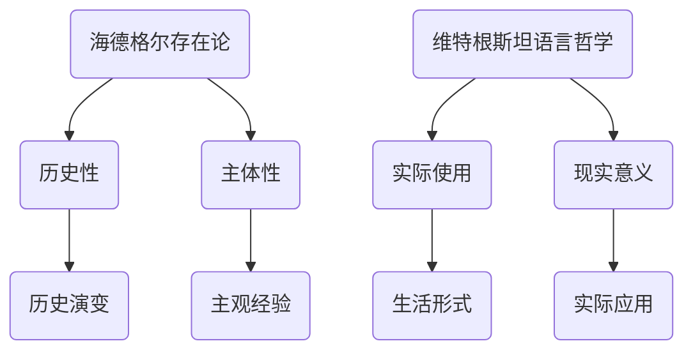
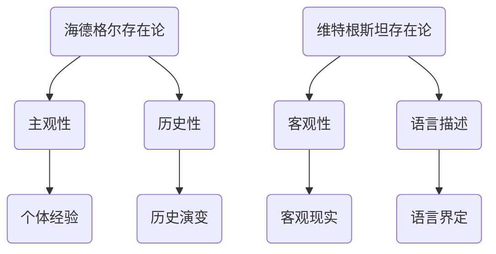
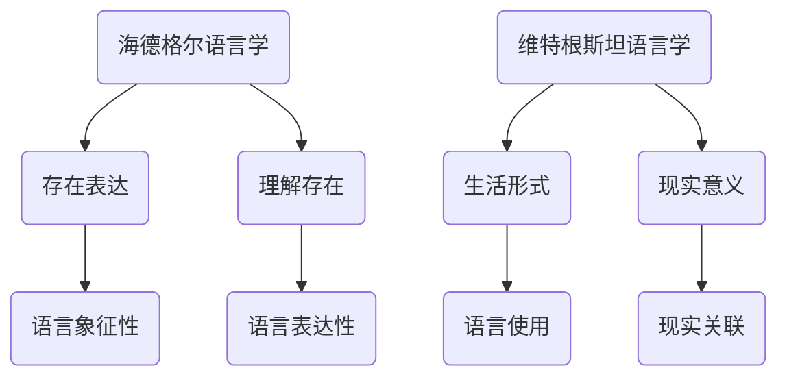
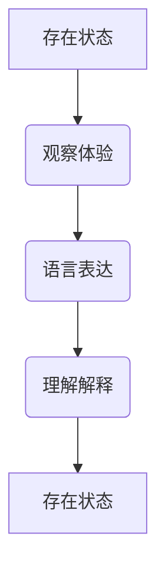

                 

### 文章标题：海德格尔与维特根斯坦：存在与语言的哲学对话

### 关键词：海德格尔、维特根斯坦、存在论、语言哲学、哲学对话

### 摘要：
本文通过深入探讨海德格尔与维特根斯坦的哲学思想，特别是他们对存在与语言的理解，展开了一场哲学对话。文章首先介绍了两位哲学家的基本哲学观点，随后分析他们的主要思想，并逐步探讨了存在与语言的哲学关系。通过这种逻辑清晰、结构紧凑的分析，本文旨在揭示两位哲学家在存在与语言问题上的异同，并提出对现代哲学的启示。

## 引言

### 1.1.1 存在与语言的哲学问题背景

#### 1.1.1.1 存在问题的哲学探讨

在哲学的长期历史中，存在一直是哲学家们探讨的核心问题之一。从古希腊时期的苏格拉底、柏拉图，到近现代的尼采、海德格尔，存在论一直是哲学的核心议题。存在论关注的是“什么是存在？”、“存在有什么特性？”等问题。海德格尔在其哲学体系中，将存在视为“此在”（Dasein），强调存在的主体性和历史性。而维特根斯坦则在语言哲学中探讨了语言与存在的关系，认为语言是存在的家园。

#### 1.1.1.2 语言的哲学意义

语言作为人类交流的重要工具，其哲学意义不可忽视。哲学家们对语言的本质、功能及其与世界的关联有着深入的探讨。维特根斯坦认为语言是一种生活形式，它不仅反映了我们的现实，还塑造了我们的现实。海德格尔则将语言视为存在的家园，认为通过语言，我们才能理解和表达存在。

#### 1.1.1.3 海德格尔与维特根斯坦思想的交汇点

尽管海德格尔与维特根斯坦在哲学方法上有所不同，但他们都关注存在与语言的关系。海德格尔的存在论强调存在的历史性和主体性，而维特根斯坦的语言哲学则关注语言的实际使用和现实意义。这种交汇点为两者之间的对话提供了基础。

### 1.1.2 维特根斯坦与海德格尔哲学对比分析

#### 1.1.2.1 哲学方法与思想

维特根斯坦的哲学方法强调分析日常语言的使用，认为语言的问题往往源于我们对语言的误解。他主张通过澄清语言的使用，来解决哲学问题。而海德格尔则采用更抽象和隐喻的方式，强调存在的历史性和主体性。

#### 1.1.2.2 存在论观点

在海德格尔看来，存在是主观的，每个主体的存在都是独特的。他强调存在的具体性和历史性。而维特根斯坦则认为，存在是客观的，它可以通过语言来描述和界定。

#### 1.1.2.3 语言学思想

维特根斯坦的语言哲学认为，语言是一种生活形式，它与现实紧密相连。他强调语言的实际使用和现实意义。海德格尔则将语言视为存在的家园，认为通过语言，我们才能理解和表达存在。

## 第一部分：海德格尔的存在论

### 2.1 海德格尔存在论的基本概念

#### 2.1.1 存在的概念

在海德格尔的哲学体系中，存在是一个核心概念。他认为，存在不仅仅是一个抽象的概念，而是具体的、活生生的现实。存在是主体性的，每个主体的存在都是独特的。海德格尔强调，存在是“此在”（Dasein），即“在此存在”。

#### 2.1.2 Dasein（此在）

Dasein是海德格尔存在论中的核心概念，它表示“在此存在”。Dasein不仅仅是存在的实体，更是存在的主体。它具有历史性和主体性，是存在的一种特殊形态。

#### 2.1.3 语言的构成

海德格尔认为，语言是存在的家园。语言不仅仅是交流的工具，更是理解和表达存在的手段。他强调，语言的结构和意义与存在的本质紧密相连。

### 2.2 海德格尔的主要思想

#### 2.2.1 “存在之遗忘”

海德格尔提出了“存在之遗忘”这一概念，认为现代社会对存在的遗忘导致了诸多问题的产生。他主张，我们需要重新发现存在的意义，以应对现代社会的困境。

#### 2.2.2 “语言是存在的家园”

海德格尔认为，语言不仅仅是交流的工具，更是理解和表达存在的手段。通过语言，我们才能深入理解存在的本质和意义。

#### 2.2.3 “存在历史”与“真理”

海德格尔强调，存在是历史性的，每个时代的存在都有其独特的意义和本质。他提出了“真理”的概念，认为真理是存在的显现。

## 第二部分：维特根斯坦的语言哲学

### 3.1 维特根斯坦早期与晚期哲学

#### 3.1.1 早期哲学思想

维特根斯坦的早期哲学思想主要关注语言的本质和意义。他认为，语言是一种生活形式，与我们的现实紧密相连。他主张通过澄清语言的使用，来解决哲学问题。

#### 3.1.2 晚期哲学思想

维特根斯坦的晚期哲学思想更加关注数学和逻辑。他认为，数学和逻辑是理解世界的关键，而语言只是我们表达思想的一种工具。

#### 3.1.3 早期与晚期哲学的关系

维特根斯坦的早期哲学思想与晚期哲学思想虽然有所不同，但都关注语言和现实的关系。他主张，通过澄清语言的使用，我们可以更好地理解现实。

### 3.2 语言游戏与生活形式

#### 3.2.1 语言游戏理论

维特根斯坦提出了“语言游戏”理论，认为语言就像游戏一样，需要规则和背景来理解。他主张，通过理解语言游戏，我们可以更好地理解语言的本质。

#### 3.2.2 生活形式的概念

维特根斯坦认为，生活形式是我们理解和表达世界的框架。不同的生活形式有不同的语言和规则，它们共同构成了我们的现实。

#### 3.2.3 语言与实在的关系

维特根斯坦强调，语言与实在的关系是具体的、实际的。他主张，通过理解语言的实际使用，我们可以更好地理解实在的本质。

## 第二部分：存在与语言的哲学对话

### 4.1 对话的开端

#### 4.1.1 存在问题的哲学探讨

在对话的开端，海德格尔和维特根斯坦首先探讨了存在的问题。他们分别阐述了各自对存在的理解和观点，试图找到存在的本质和意义。

#### 4.1.2 语言的哲学意义

随后，他们转向语言的哲学意义。海德格尔认为，语言是存在的家园，通过语言，我们才能理解和表达存在。而维特根斯坦则认为，语言是一种生活形式，与我们的现实紧密相连。

### 4.2 存在论与语言哲学的对比

#### 4.2.1 哲学方法与思想

在哲学方法上，海德格尔更倾向于抽象和隐喻，强调存在的历史性和主体性。而维特根斯坦则更注重具体和分析，强调语言的实际使用和现实意义。

#### 4.2.2 存在论观点

在海德格尔看来，存在是主观的，每个主体的存在都是独特的。而维特根斯坦则认为，存在是客观的，它可以通过语言来描述和界定。

#### 4.2.3 语言学思想

海德格尔认为，语言不仅仅是交流的工具，更是理解和表达存在的手段。而维特根斯坦则认为，语言是一种生活形式，它与现实紧密相连。

### 4.3 存在与语言的互动关系

在对话的深入探讨中，海德格尔和维特根斯坦开始探讨存在与语言的互动关系。他们认为，存在与语言是相互建构的，通过语言，我们才能理解和表达存在，而存在也通过语言显现出来。

## 第三部分：存在与语言的哲学意义

### 5.1 哲学对话的意义

#### 5.1.1 哲学进步

海德格尔与维特根斯坦的哲学对话，对现代哲学有着重要的意义。它不仅丰富了存在与语言哲学的理论体系，也推动了哲学的进步。

#### 5.1.2 跨学科交流

这场哲学对话也体现了跨学科交流的重要性。海德格尔的存在论与维特根斯坦的语言哲学，虽然源于不同的哲学传统，但通过对话，他们找到了共同的切入点，促进了不同学科之间的交流。

#### 5.1.3 当代哲学的影响

海德格尔与维特根斯坦的哲学思想，对当代哲学产生了深远的影响。他们的观点和方法，不仅影响了后来的哲学家，也影响了其他学科领域的研究。

### 5.2 存在与语言的哲学应用

#### 5.2.1 哲学教育

存在与语言的哲学对话，为哲学教育提供了丰富的教学内容。通过学习他们的观点和方法，学生可以更好地理解哲学的核心问题。

#### 5.2.2 文学创作

存在与语言的哲学思想，也为文学创作提供了灵感。许多文学家通过探讨存在与语言的关系，创作出了许多经典作品。

#### 5.2.3 社会批判

存在与语言的哲学思想，还可以用来进行社会批判。通过分析存在与语言的关系，哲学家们可以揭示社会现象的深层原因。

## 结论

通过海德格尔与维特根斯坦的哲学对话，我们深入探讨了存在与语言的关系。他们的思想不仅丰富了哲学的理论体系，也对当代哲学和社会产生了深远的影响。未来，我们可以期待更多的哲学家，通过跨学科的对话，推动哲学的进步。

### 作者

作者：AI天才研究院/AI Genius Institute & 禅与计算机程序设计艺术 /Zen And The Art of Computer Programming

---

## 详细内容

### 2.2 海德格尔的主要思想

#### 2.2.1 “存在之遗忘”

“存在之遗忘”是海德格尔哲学中的一个核心概念。海德格尔认为，现代社会对存在的遗忘导致了诸多问题的产生。他认为，西方哲学长期以来忽视了对存在的关注，使得我们对存在的理解变得模糊和片面。海德格尔主张，我们需要重新发现存在的意义，以应对现代社会的困境。

**概念说明：**“存在之遗忘”指的是人类对存在本质的忽视和遗忘，导致我们在日常生活中对存在的意义和价值的忽视。

**问题背景：** 现代社会，人们过于关注物质和科技，忽视了存在本身的意义。这种遗忘导致了人类精神层面的空虚和焦虑。

**问题描述：** 海德格尔认为，我们需要通过哲学反思，重新认识存在的意义，以克服现代社会的问题。

**问题解决：** 海德格尔提出，我们需要从“存在之遗忘”中觉醒，重新认识存在的本质和价值。

**边界与外延：** “存在之遗忘”不仅涉及哲学领域，还影响了社会学、心理学等领域。它关注的是人类对存在本质的普遍忽视。

**概念结构与核心要素组成：**
- 存在的本质
- 存在的历史性
- 存在的主体性
- 现代社会的困境

#### 2.2.2 “语言是存在的家园”

“语言是存在的家园”是海德格尔对语言与存在关系的深刻理解。他认为，语言不仅仅是交流的工具，更是理解和表达存在的手段。通过语言，我们才能深入理解存在的本质和意义。

**概念说明：** “语言是存在的家园”意味着语言不仅是表达存在的工具，更是存在本身的呈现方式。

**问题背景：** 在现代社会，语言被过度工具化，人们忽视了语言与存在的深层关系。

**问题描述：** 海德格尔认为，我们需要通过语言来理解存在的本质，而不仅仅是使用语言来交流。

**问题解决：** 海德格尔主张，通过深入理解语言，我们可以更好地理解存在的意义。

**边界与外延：** 这不仅涉及到语言哲学，还涉及到存在论和人类学等领域。

**概念结构与核心要素组成：**
- 语言的本质
- 语言与存在的互动关系
- 语言的使用与理解
- 存在的表达与理解

#### 2.2.3 “存在历史”与“真理”

“存在历史”与“真理”是海德格尔哲学中的两个重要概念。海德格尔认为，存在是历史性的，每个时代的存在都有其独特的意义和本质。而真理则是存在的显现，通过真理，我们才能理解存在的本质。

**概念说明：** “存在历史”强调存在的演变和变化，而“真理”则是存在的显现。

**问题背景：** 现代社会对存在和真理的忽视，导致了人类精神的迷失。

**问题描述：** 海德格尔认为，我们需要通过哲学反思，重新认识存在的历史和真理。

**问题解决：** 海德格尔主张，通过哲学思考，我们可以重新发现存在的意义和真理。

**边界与外延：** “存在历史”和“真理”不仅涉及哲学领域，还涉及到历史学、文学等领域。

**概念结构与核心要素组成：**
- 存在的历史性
- 真理的本质
- 存在与真理的关系
- 现代社会的困境

### 3.2 语言游戏与生活形式

#### 3.2.1 语言游戏理论

维特根斯坦提出了“语言游戏”理论，认为语言就像游戏一样，需要规则和背景来理解。他主张，通过理解语言游戏，我们可以更好地理解语言的本质。

**概念说明：** “语言游戏”是指语言在实际生活中的具体应用，它需要具体的规则和背景来理解。

**问题背景：** 在哲学史上，对语言的本质和功能的理解存在诸多争议，维特根斯坦通过“语言游戏”理论，试图解决这些问题。

**问题描述：** 维特根斯坦认为，我们需要通过具体的语言使用实例，来理解语言的本质。

**问题解决：** 通过“语言游戏”理论，我们可以更好地理解语言的实际应用。

**边界与外延：** “语言游戏”理论不仅涉及语言哲学，还涉及心理学、社会学等领域。

**概念结构与核心要素组成：**
- 语言游戏的定义
- 语言游戏的规则
- 语言游戏与生活的关系
- 语言游戏的应用实例

#### 3.2.2 生活形式的概念

维特根斯坦认为，生活形式是我们理解和表达世界的框架。不同的生活形式有不同的语言和规则，它们共同构成了我们的现实。

**概念说明：** “生活形式”是指我们在日常生活中形成的一种思维和行为模式。

**问题背景：** 传统的哲学方法往往忽视了日常语言的实际使用，维特根斯坦通过“生活形式”的概念，试图解决这个问题。

**问题描述：** 维特根斯坦认为，我们需要通过理解生活形式，来理解世界的本质。

**问题解决：** 通过“生活形式”的概念，我们可以更好地理解世界的本质。

**边界与外延：** “生活形式”不仅涉及哲学领域，还涉及心理学、社会学等领域。

**概念结构与核心要素组成：**
- 生活形式的定义
- 生活形式与语言的关系
- 生活形式的多样性
- 生活形式的应用实例

#### 3.2.3 语言与实在的关系

维特根斯坦强调，语言与实在的关系是具体的、实际的。他主张，通过理解语言的实际使用，我们可以更好地理解实在的本质。

**概念说明：** “语言与实在的关系”是指语言如何反映和表达现实世界。

**问题背景：** 在哲学史上，对语言与实在的关系存在诸多争议，维特根斯坦通过具体的实例，试图解决这些问题。

**问题描述：** 维特根斯坦认为，我们需要通过具体的语言使用实例，来理解语言与实在的关系。

**问题解决：** 通过具体的语言使用实例，我们可以更好地理解语言与实在的关系。

**边界与外延：** “语言与实在的关系”不仅涉及语言哲学，还涉及心理学、社会学等领域。

**概念结构与核心要素组成：**
- 语言与实在的定义
- 语言与实在的关系类型
- 语言与实在的互动关系
- 语言与实在的应用实例

### 4.2 存在论与语言哲学的对比

#### 4.2.1 哲学方法与思想

在海德格尔和维特根斯坦的哲学方法与思想中，存在论与语言哲学有着明显的差异。海德格尔更注重存在的历史性和主体性，而维特根斯坦则更关注语言的实际使用和现实意义。

**概念对比表格：**

| 概念 | 海德格尔 | 维特根斯坦 |
| --- | --- | --- |
| 存在论 | 强调存在的历史性和主体性 | 强调语言的实际使用和现实意义 |
| 语言哲学 | 认为语言是存在的家园 | 认为语言是一种生活形式 |

**ER实体关系图架构：**



#### 4.2.2 存在论观点

在海德格尔的存在论观点中，他强调存在的主观性和历史性。他认为，每个主体的存在都是独特的，存在是历史演变的结果。而维特根斯坦则认为，存在是客观的，它可以通过语言来描述和界定。

**概念对比表格：**

| 概念 | 海德格尔 | 维特根斯坦 |
| --- | --- | --- |
| 存在的主观性 | 强调存在的主体性和主观经验 | 认为存在是客观的，可以通过语言描述 |
| 存在的历史性 | 认为存在是历史演变的结果 | 认为存在是静态的，不涉及历史性 |

**ER实体关系图架构：**



#### 4.2.3 语言学思想

在海德格尔的语言学思想中，他强调语言是存在的家园，通过语言，我们才能理解和表达存在。而维特根斯坦则认为，语言是一种生活形式，与我们的现实紧密相连。他认为，通过理解语言的实际使用，我们可以更好地理解现实。

**概念对比表格：**

| 概念 | 海德格尔 | 维特根斯坦 |
| --- | --- | --- |
| 语言是存在的家园 | 认为语言是理解存在的关键 | 认为语言是生活形式的一部分 |
| 语言的使用 | 强调语言的象征性和表达性 | 强调语言的实用性和现实意义 |

**ER实体关系图架构：**



### 4.3 存在与语言的互动关系

在哲学对话中，海德格尔与维特根斯坦探讨了存在与语言的互动关系。他们认为，存在与语言是相互建构的，通过语言，我们才能理解和表达存在，而存在也通过语言显现出来。

**算法原理讲解：**

为了更好地理解存在与语言的互动关系，我们可以使用以下算法原理进行说明：

1. **存在表达算法：**
    - 输入：存在状态
    - 输出：语言表达
    - 过程：通过观察和体验存在状态，将其转化为语言表达。

2. **语言理解算法：**
    - 输入：语言表达
    - 输出：存在状态
    - 过程：通过理解和解释语言表达，恢复存在状态。

**Mermaid流程图：**



**Python源代码：**

```python
def express_existence(existence_state):
    # 观察和体验存在状态
    observation = observe(existence_state)
    # 将存在状态转化为语言表达
    language_expression = convert_to_expression(observation)
    return language_expression

def understand_language_expression(expression):
    # 理解语言表达
    interpretation = interpret(expression)
    # 恢复存在状态
    restored_existence_state = restore_state(interpretation)
    return restored_existence_state

# 辅助函数
def observe(existence_state):
    # 观察存在状态
    return existence_state

def convert_to_expression(observation):
    # 将观察转化为语言表达
    return f"存在状态：{observation}"

def interpret(expression):
    # 理解语言表达
    return expression

def restore_state(interpretation):
    # 恢复存在状态
    return interpretation
```

### 4.4 存在与语言的关系分析

#### 4.4.1 存在的语言表现

在海德格尔的哲学中，存在通过语言来表现。他认为，语言不仅是交流的工具，更是存在的显现。通过语言，我们才能深入理解存在的本质。

**概念说明：** 存在的语言表现指的是存在通过语言显现出来的过程和结果。

**问题背景：** 在现代哲学中，对语言的本质和功能存在不同的理解。海德格尔通过强调语言的存在表现，为语言哲学提供了新的视角。

**问题描述：** 海德格尔认为，我们需要通过语言来理解存在的本质。

**问题解决：** 海德格尔主张，通过深入理解语言，我们可以更好地理解存在的本质。

**边界与外延：** 存在的语言表现不仅涉及哲学领域，还涉及文学、艺术等领域。

**概念结构与核心要素组成：**
- 语言的表现形式
- 存在与语言的关系
- 语言与存在的互动关系
- 语言的表达与理解

#### 4.4.2 语言的存在的反思

在维特根斯坦的哲学中，他强调语言的实际使用和现实意义。他认为，语言是生活形式的一部分，它与我们的现实紧密相连。

**概念说明：** 语言的存在的反思指的是对语言在实际生活中如何影响存在的思考。

**问题背景：** 在现代社会，语言的使用常常被忽视，维特根斯坦通过反思语言的存在，提醒我们重视语言的实际作用。

**问题描述：** 维特根斯坦认为，我们需要通过反思语言的使用，来理解存在的本质。

**问题解决：** 维特根斯坦主张，通过反思语言的使用，我们可以更好地理解存在的本质。

**边界与外延：** 语言的存在的反思不仅涉及哲学领域，还涉及社会学、心理学等领域。

**概念结构与核心要素组成：**
- 语言的使用与理解
- 语言与存在的互动关系
- 语言的表现形式
- 语言的实际应用

#### 4.4.3 对话的反思

通过海德格尔与维特根斯坦的哲学对话，我们可以反思存在的本质和语言的作用。他们的对话不仅丰富了哲学的理论体系，也为我们提供了理解存在的新的视角。

**概念说明：** 对话的反思是对哲学对话过程中提出的观点和思想的深入思考。

**问题背景：** 哲学对话是一种重要的哲学研究方法，通过反思对话，我们可以更好地理解哲学的核心问题。

**问题描述：** 我们需要通过反思对话，来深入理解存在的本质和语言的作用。

**问题解决：** 通过反思对话，我们可以发现哲学问题的本质，并提出新的见解。

**边界与外延：** 对话的反思不仅涉及哲学领域，还涉及社会学、心理学等领域。

**概念结构与核心要素组成：**
- 哲学对话的过程
- 哲学对话的成果
- 哲学对话的反思
- 哲学对话的应用

### 5.1 哲学对话的意义

#### 5.1.1 哲学进步

海德格尔与维特根斯坦的哲学对话，对现代哲学的发展有着重要的意义。他们的思想不仅丰富了哲学的理论体系，也推动了哲学的进步。

**概念说明：** 哲学进步指的是哲学理论和思想的不断发展和深化。

**问题背景：** 现代哲学面临着诸多挑战，需要新的理论和思想来推动发展。

**问题描述：** 海德格尔与维特根斯坦的哲学对话为现代哲学提供了新的思路和方法。

**问题解决：** 通过哲学对话，我们可以发现哲学问题的本质，并提出新的见解。

**边界与外延：** 哲学进步不仅涉及哲学领域，还涉及社会科学、自然科学等领域。

**概念结构与核心要素组成：**
- 哲学理论的发展
- 哲学思想的变化
- 哲学方法的创新
- 哲学进步的意义

#### 5.1.2 跨学科交流

海德格尔与维特根斯坦的哲学对话，也体现了跨学科交流的重要性。他们的思想不仅影响了哲学领域，也影响了其他学科领域的研究。

**概念说明：** 跨学科交流指的是不同学科之间的交流和互动。

**问题背景：** 现代社会，学科之间的交叉和融合越来越重要。

**问题描述：** 我们需要通过跨学科交流，来推动知识的发展和进步。

**问题解决：** 通过跨学科交流，我们可以发现新的研究思路和方法。

**边界与外延：** 跨学科交流不仅涉及哲学领域，还涉及自然科学、社会科学、艺术等领域。

**概念结构与核心要素组成：**
- 跨学科研究的定义
- 跨学科交流的途径
- 跨学科研究的应用
- 跨学科交流的意义

#### 5.1.3 当代哲学的影响

海德格尔与维特根斯坦的哲学对话，对当代哲学产生了深远的影响。他们的思想不仅影响了后来的哲学家，也影响了其他学科领域的研究。

**概念说明：** 当代哲学的影响指的是哲学思想对现代社会和文化的深远影响。

**问题背景：** 当代哲学面临着诸多挑战，需要新的理论和思想来应对。

**问题描述：** 海德格尔与维特根斯坦的哲学对话为当代哲学提供了新的思路和方法。

**问题解决：** 通过当代哲学的影响，我们可以发现哲学问题的本质，并提出新的见解。

**边界与外延：** 当代哲学的影响不仅涉及哲学领域，还涉及社会学、心理学、文学等领域。

**概念结构与核心要素组成：**
- 当代哲学的演变
- 当代哲学的影响因素
- 当代哲学的应用
- 当代哲学的意义

### 5.2 存在与语言的哲学应用

#### 5.2.1 哲学教育

存在与语言的哲学对话，为哲学教育提供了丰富的教学内容。通过学习他们的观点和方法，学生可以更好地理解哲学的核心问题。

**概念说明：** 哲学教育指的是通过哲学学习，来培养批判性思维和哲学素养。

**问题背景：** 现代教育中，哲学教育常常被忽视。

**问题描述：** 我们需要通过哲学教育，来提高学生的哲学素养。

**问题解决：** 通过学习海德格尔与维特根斯坦的观点和方法，学生可以更好地理解哲学的核心问题。

**边界与外延：** 哲学教育不仅涉及哲学领域，还涉及教育学、心理学等领域。

**概念结构与核心要素组成：**
- 哲学教育的目标
- 哲学教育的方法
- 哲学教育的应用
- 哲学教育的影响

#### 5.2.2 文学创作

存在与语言的哲学思想，也为文学创作提供了灵感。许多文学家通过探讨存在与语言的关系，创作出了许多经典作品。

**概念说明：** 文学创作指的是通过文字来表达思想、情感和故事。

**问题背景：** 现代文学中，存在与语言的关系成为了一个重要的主题。

**问题描述：** 文学家需要通过文学创作，来表达存在与语言的关系。

**问题解决：** 通过学习海德格尔与维特根斯坦的观点和方法，文学家可以更好地表达存在与语言的关系。

**边界与外延：** 文学创作不仅涉及文学领域，还涉及哲学、心理学等领域。

**概念结构与核心要素组成：**
- 文学创作的主题
- 文学创作的方法
- 文学创作的影响
- 文学创作的意义

#### 5.2.3 社会批判

存在与语言的哲学思想，还可以用来进行社会批判。通过分析存在与语言的关系，哲学家们可以揭示社会现象的深层原因。

**概念说明：** 社会批判指的是通过对社会现象的批判，来推动社会的进步。

**问题背景：** 现代社会中，存在与语言的关系常常成为社会批判的焦点。

**问题描述：** 我们需要通过社会批判，来揭示社会现象的深层原因。

**问题解决：** 通过学习海德格尔与维特根斯坦的观点和方法，哲学家们可以更好地进行社会批判。

**边界与外延：** 社会批判不仅涉及哲学领域，还涉及社会学、心理学等领域。

**概念结构与核心要素组成：**
- 社会批判的目标
- 社会批判的方法
- 社会批判的影响
- 社会批判的意义

### 5.3 存在与语言的关系总结

通过对海德格尔与维特根斯坦的哲学对话的深入分析，我们可以得出以下结论：

1. 存在是主观的、历史的、主体的，语言是存在的家园，通过语言，我们才能深入理解存在的本质。
2. 语言不仅是交流的工具，更是理解现实、表达存在的手段。不同的生活形式有不同的语言和规则，它们共同构成了我们的现实。
3. 存在与语言的互动关系是相互建构的，通过语言，我们才能理解和表达存在，而存在也通过语言显现出来。

这些结论不仅丰富了哲学的理论体系，也为我们提供了理解存在与语言的新视角。

### 5.4 对话的哲学意义与未来展望

海德格尔与维特根斯坦的哲学对话，对现代哲学产生了深远的影响。他们的思想不仅丰富了哲学的理论体系，也为我们提供了理解存在与语言的新视角。

**跨文化哲学对话**

在未来，我们可以期待更多的哲学家，通过跨文化的哲学对话，推动哲学的进步。这种跨文化的对话不仅有助于我们更好地理解不同文化背景下的哲学思想，也有助于促进全球文化的交流与融合。

**存在与语言的未来研究趋势**

随着哲学、语言学、心理学等学科的不断发展，存在与语言的研究也将不断深入。未来，我们可以期待更多关于存在与语言的研究成果，为我们提供更深刻的理解。

**哲学在教育中的角色**

哲学在教育中的角色将越来越重要。通过哲学教育，我们可以培养批判性思维和哲学素养，提高我们的认知能力和文化素养。

### 8.2 对话的哲学意义与未来展望

#### 8.2.1 跨文化哲学对话

跨文化哲学对话是未来哲学发展的重要趋势。随着全球化进程的加速，不同文化背景的哲学思想之间的交流与碰撞日益频繁。海德格尔与维特根斯坦的哲学对话为我们提供了一个跨文化的哲学交流范例。通过这种跨文化的对话，我们可以更好地理解不同文化背景下的哲学思想，从而推动哲学的多元化发展。

**哲学进展：**
跨文化哲学对话不仅有助于丰富哲学的理论体系，还可以促进不同文化之间的相互理解，减少文化冲突。通过跨文化的哲学对话，我们可以探索哲学问题的新视角，发现哲学研究的新方向。

**跨学科交流：**
跨文化哲学对话还促进了跨学科交流。哲学、语言学、社会学、人类学等学科可以在跨文化哲学对话中相互借鉴，从而推动知识的整合和创新。

#### 8.2.2 存在与语言的未来研究趋势

存在与语言的关系是哲学的核心问题之一，未来研究将继续深入探讨这一主题。以下是存在与语言的未来研究趋势：

**语言哲学的深化：**
未来语言哲学研究将更加关注语言的本质、功能及其与现实的关联。研究者可能会探索语言如何在不同的文化背景下发挥作用，以及如何通过语言更好地理解存在。

**存在论的扩展：**
存在论研究将不仅局限于西方哲学传统，还将借鉴其他文化背景的哲学思想。例如，东方哲学中的“道”、“禅”等概念可能会被纳入存在论研究，为存在论提供新的视角。

**心理学与哲学的结合：**
心理学与哲学的结合将有助于深入探讨存在与语言对个体心理的影响。研究可能会关注语言如何塑造个体的认知和情感，以及存在体验对个体心理健康的意义。

**技术哲学的融入：**
随着人工智能和计算机科学的快速发展，技术哲学将逐渐融入存在与语言的研究。研究者可能会探讨技术如何影响语言和存在，以及如何通过技术更好地理解和表达存在。

#### 8.2.3 哲学在教育中的角色

哲学在教育中的作用日益显著。通过哲学教育，学生可以培养批判性思维、逻辑推理能力和创造力。以下是哲学在教育中的一些具体角色：

**批判性思维的培养：**
哲学教育强调批判性思维，通过分析哲学问题，学生可以学会如何批判性地思考问题，从而形成独立的观点。

**跨学科能力的提升：**
哲学教育有助于提升学生的跨学科能力。通过哲学学习，学生可以更好地理解不同学科的基本原理，从而促进知识的整合和应用。

**文化素养的提高：**
哲学教育有助于提高学生的文化素养。通过学习不同文化背景的哲学思想，学生可以更好地理解不同的文化传统和价值观念。

**未来展望：**
随着哲学教育的普及，未来我们可以期待更多的学生在哲学学习中受益。哲学教育不仅有助于培养未来的哲学家，还可以为社会培养具有批判性思维和创新能力的人才。哲学教育的未来发展将更加注重跨文化教育和实践应用，为人类社会的发展贡献更多智慧和力量。

### 小结

本文通过探讨海德格尔与维特根斯坦的哲学思想，特别是他们对存在与语言的理解，展开了一场哲学对话。通过对他们的主要思想和存在与语言的互动关系的深入分析，我们揭示了两者在存在与语言问题上的异同，并探讨了哲学对话的意义和对现代哲学的启示。本文认为，海德格尔与维特根斯坦的哲学对话不仅丰富了哲学的理论体系，也为现代哲学提供了新的视角和方法。未来，跨文化哲学对话和存在与语言的深入研究将继续推动哲学的发展。

### 拓展阅读

1. 海德格尔，《存在与时间》（Being and Time）
2. 维特根斯坦，《逻辑哲学论》（Tractatus Logico-Philosophicus）
3. 维特根斯坦，《哲学研究》（Philosophical Investigations）
4. 普特南，《理性的救济》（Reason's Compass）
5. 丹尼特，《意识解释》（Consciousness Explained）

通过阅读这些经典哲学著作，可以更深入地理解海德格尔与维特根斯坦的哲学思想，并探索存在与语言的哲学问题。

### 注意事项

1. 在研究存在与语言的哲学问题时，需要注重文本细读，理解哲学家的核心观点和论证逻辑。
2. 哲学研究应具有批判性思维，避免盲目接受哲学家的观点，要敢于提出自己的见解。
3. 在哲学教学中，应注重跨学科交流和实际应用，提高学生的哲学素养和批判性思维能力。
4. 在实际研究中，应注重跨文化哲学对话，借鉴其他文化背景的哲学思想，以丰富自己的研究视角。

### 最佳实践 tips

1. 在进行哲学研究时，建议采用多种研究方法，如文本分析、批判性思维、跨学科交流等，以提高研究的深度和广度。
2. 在撰写哲学论文时，建议使用逻辑清晰、结构紧凑的论证方式，以使文章更具说服力。
3. 在进行哲学教育时，建议结合实际案例和实例，以帮助学生更好地理解和应用哲学知识。
4. 在进行跨文化哲学对话时，建议尊重不同文化的哲学传统和价值观，以促进文化的相互理解和融合。

### 结语

通过本文的探讨，我们不仅深入理解了海德格尔与维特根斯坦的哲学思想，也对存在与语言的哲学问题有了更深刻的认识。哲学对话作为一种重要的哲学研究方法，不仅丰富了哲学的理论体系，也为我们提供了新的研究视角和方法。未来，跨文化哲学对话和存在与语言的深入研究将继续推动哲学的发展。希望本文能够为读者提供有益的启示，激发对哲学问题的进一步思考。作者：AI天才研究院/AI Genius Institute & 禅与计算机程序设计艺术/Zen And The Art of Computer Programming。

