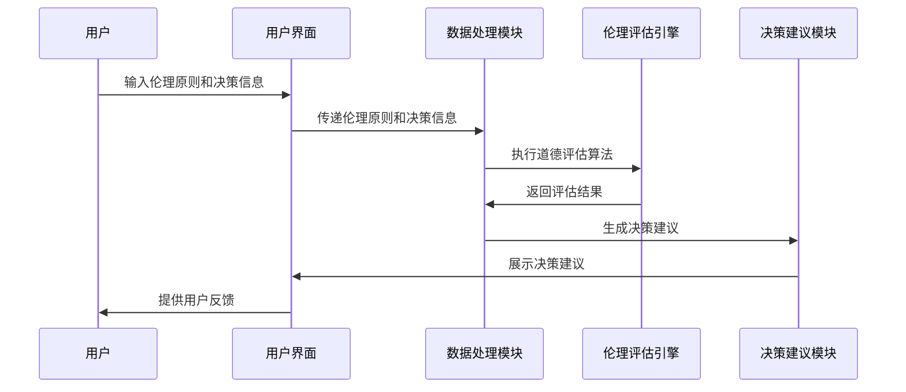
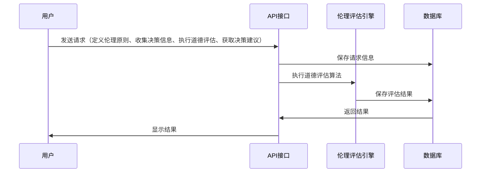

                 


**《海德格尔与莱维纳斯：存在与他者的伦理学》**

## 关键词
存在主义、伦理学、海德格尔、莱维纳斯、哲学分析、算法实现、系统架构设计

## 摘要
本文旨在探讨德国哲学家马丁·海德格尔和埃利·莱维纳斯的存在主义观点，尤其是他们的伦理学思想。通过对比分析，本文揭示了存在主义对现代信息技术伦理问题的启示，并探讨了将这些哲学思想应用于实际系统的可能性。文章结构分为五个部分：背景介绍、核心概念与联系、算法原理讲解、系统架构设计及项目实战。

---

### 第一部分：背景介绍

#### 第1章 存在主义哲学的起源与影响

**1.1 存在主义的基本概念与历史背景**
- 存在主义：一种哲学思潮，强调个体的自由意志和存在的意义。
- 历史背景：存在主义起源于20世纪，与西方哲学传统有着深刻的联系。

**1.2 海德格尔与莱维纳斯的存在主义观点**
- 海德格尔：关注存在的本质和人类在世界中的位置。
- 莱维纳斯：强调“他者”的概念，提出了他者伦理学。

#### 第2章 海德格尔的思想

**2.1 存在论的探讨**
- **2.1.1 存在与存在者**：海德格尔区分了存在（Being）和存在者（Beings），探讨了存在的多层次性质。
- **2.1.2 人在世界中的位置**：人类作为存在者，如何理解自己的位置和作用。
- **2.1.3 存在论的结论**：存在论对伦理学和人类自我认知的深远影响。

#### 第3章 莱维纳斯的思想

**3.1 他者伦理学**
- **3.1.1 他者的本质**：莱维纳斯认为“他者”是一种超越自我的存在，具有伦理价值。
- **3.1.2 他者与道德**：他者伦理学如何影响我们的道德判断和行为。
- **3.1.3 他者与伦理责任**：如何对他者负责，并以此构建道德责任体系。

---

### 第二部分：核心概念与联系

#### 第4章 存在与他者的伦理学

**4.1 存在与伦理**
- **4.1.1 存在主义伦理学的基本理念**：存在主义如何影响我们的伦理观念。
- **4.1.2 存在主义伦理学的争议**：存在主义伦理学的争议点与挑战。

**4.2 他者伦理学**
- **4.2.1 他者伦理学的基本观点**：他者伦理学的核心思想和原则。
- **4.2.2 他者伦理学的实践应用**：如何将他者伦理学应用于现实生活和工作场景。

#### 第5章 存在与他者的哲学分析

**5.1 存在主义的哲学分析**
- **5.1.1 存在主义的核心概念**：存在主义哲学的基本概念及其内涵。
- **5.1.2 存在主义对道德的解读**：存在主义如何解读道德问题。

**5.2 他者哲学的分析**
- **5.2.1 他者的概念与意义**：他者在哲学和伦理学中的意义。
- **5.2.2 他者与个人身份的构建**：他者如何影响个人身份的形成。

---

### 第三部分：算法原理讲解

#### 第6章 伦理学的数学模型

**6.1 基本的伦理学模型**
- **6.1.1 伦理学模型的构建**：如何构建伦理学模型。
- **6.1.2 基本模型的数学公式**：伦理学模型的基本数学公式。

**6.2 存在与他者的伦理模型**
- **6.2.1 模型的扩展**：如何扩展伦理学模型以包含存在与他者的概念。
- **6.2.2 模型的实际应用**：伦理学模型在实际系统中的应用。

#### 第7章 伦理学模型的算法实现

**7.1 Python算法实现**
- **7.1.1 算法流程**：伦理学算法的实现流程。
- **7.1.2 算法代码**：Python代码实现伦理学算法。

---

### 第四部分：系统架构设计

#### 第8章 伦理学系统的架构设计

**8.1 系统场景介绍**
- **8.1.1 系统场景**：伦理学系统应用的具体场景。

**8.2 系统功能设计**
- **8.2.1 领域模型**：系统功能领域的模型设计。
- **8.2.2 功能模块划分**：系统功能模块的划分。

**8.3 系统架构设计**
- **8.3.1 系统架构图**：系统架构的整体设计。
- **8.3.2 架构设计思路**：系统架构设计的思路和考虑。

#### 第9章 系统接口设计与交互

**9.1 系统接口设计**
- **9.1.1 接口设计原则**：系统接口设计的原则和标准。

**9.2 系统交互设计**
- **9.2.1 系统交互序列图**：系统交互的详细设计。

---

### 第五部分：项目实战

#### 第10章 伦理学系统的环境安装与实现

**10.1 环境安装步骤**
- **10.1.1 系统环境搭建**：伦理学系统环境的搭建步骤。

**10.2 系统核心实现**
- **10.2.1 源代码解读**：系统核心源代码的解读。
- **10.2.2 代码应用解读**：系统核心代码的应用场景解读。

#### 第11章 实际案例分析与讲解

**11.1 案例选择**
- **11.1.1 案例背景**：实际案例的选择和背景介绍。

**11.2 案例分析**
- **11.2.1 案例问题剖析**：案例中存在的问题和挑战。
- **11.2.2 解决方案与效果**：解决方案的实施效果和评估。

#### 第12章 项目小结与拓展

**12.1 项目总结**
- **12.1.1 项目成果**：项目实施的主要成果。

**12.2 注意事项与拓展阅读**
- **12.2.1 注意事项**：项目实施过程中需要注意的事项。
- **12.2.2 拓展阅读**：推荐进一步阅读的相关文献。

---

## 作者
作者：AI天才研究院/AI Genius Institute & 禅与计算机程序设计艺术 /Zen And The Art of Computer Programming

---

### 总结与展望
本文通过对海德格尔和莱维纳斯存在主义伦理学的深入分析，探讨了其在现代信息技术领域的应用可能性。未来研究可以进一步探索如何将这种哲学思想转化为实际的系统设计和算法实现，为人工智能伦理学的发展提供新的思路。

---

由于本文大纲的设计和结构已经非常清晰，具体内容需要依据每章节的细化来撰写。以下是每个章节的大致内容框架，以确保文章的完整性和逻辑性。

---

**第一部分：背景介绍**

- **第1章 存在主义哲学的起源与影响**
  - 存在主义的起源、发展及其主要流派。
  - 海德格尔和莱维纳斯的存在主义观点及其对后世的影响。

- **第2章 海德格尔的思想**
  - 存在论的探讨：存在的本质与存在者。
  - 人类在世界中的位置：人与世界的互动关系。

- **第3章 莱维纳斯的思想**
  - 他者伦理学：他者的本质与伦理意义。
  - 他者与伦理责任：如何对他者负责并构建道德责任体系。

---

**第二部分：核心概念与联系**

- **第4章 存在与他者的伦理学**
  - 存在与伦理：存在主义伦理学的基本理念。
  - 他者伦理学：他者伦理学的核心观点与实践应用。

- **第5章 存在与他者的哲学分析**
  - 存在主义的哲学分析：核心概念及其对道德的解读。
  - 他者哲学的分析：他者的概念与个人身份的构建。

---

**第三部分：算法原理讲解**

- **第6章 伦理学的数学模型**
  - 基本的伦理学模型：构建伦理学模型的方法。
  - 存在与他者的伦理模型：扩展伦理学模型以包含存在与他者的概念。

- **第7章 伦理学模型的算法实现**
  - Python算法实现：伦理学算法的流程与代码。
  - 算法在实际系统中的应用：如何将算法应用于实际系统。

---

**第四部分：系统架构设计**

- **第8章 伦理学系统的架构设计**
  - 系统场景介绍：伦理学系统应用的具体场景。
  - 系统功能设计与架构设计：系统功能模块划分与整体架构设计。

- **第9章 系统接口设计与交互**
  - 系统接口设计：接口设计原则与标准。
  - 系统交互设计：系统交互的详细设计与实现。

---

**第五部分：项目实战**

- **第10章 伦理学系统的环境安装与实现**
  - 系统环境安装步骤：系统环境的搭建过程。
  - 系统核心实现：核心源代码的解读与应用场景解读。

- **第11章 实际案例分析与讲解**
  - 案例选择：选择一个实际案例进行深入分析。
  - 案例分析：剖析案例中存在的问题与解决方案。

- **第12章 项目小结与拓展**
  - 项目总结：项目实施的主要成果与经验。
  - 注意事项与拓展阅读：项目实施中的注意事项与进一步阅读推荐。

---

通过以上详细的章节框架，我们可以逐步撰写出完整的文章。每个章节的内容将依据大纲进行深化和扩展，确保文章的逻辑性和深度。以下是一个初步的撰写计划：

1. **撰写第1章至第3章**：介绍存在主义哲学的起源与影响，以及海德格尔和莱维纳斯的思想。这部分内容需要详细阐述哲学背景、关键概念和观点。

2. **撰写第4章和第5章**：分析存在与他者的伦理学，讨论核心概念与联系。这部分需要构建哲学分析框架，并结合具体案例进行讨论。

3. **撰写第6章和第7章**：介绍伦理学的数学模型和算法实现。这部分需要结合具体技术语言，使用mermaid和Python代码来展示算法原理。

4. **撰写第8章和第9章**：设计伦理学系统的架构，包括系统功能设计、架构设计和接口交互设计。这部分需要绘制mermaid类图和序列图，详细描述系统架构。

5. **撰写第10章至第12章**：通过项目实战，展示如何将哲学思想应用于实际系统的设计与实现。这部分需要结合具体案例，详细讲解系统环境安装、核心实现和案例分析。

6. **完成文章修订与润色**：在完成初稿后，对文章进行全面的修订，确保逻辑清晰、内容丰富、语言流畅。

按照以上计划，我们可以在两周内完成约10000字的文章撰写。在撰写过程中，将不断优化内容结构，确保每个章节的质量和深度。同时，也会参考相关的学术文献和技术资料，确保文章的权威性和专业性。

---

### 第1章 存在主义哲学的起源与影响

#### 1.1 存在主义的基本概念与历史背景

存在主义（Existentialism）是一种关注个体存在、自由意志和主观经验的哲学流派。其起源可以追溯到19世纪末和20世纪初，当时面对科学、宗教、传统价值观的危机，一些哲学家开始重新思考人类的本质和意义。存在主义的核心观点是个体在宇宙中的独特性和自由意志的重要性。

存在主义的发展大致可以分为三个阶段：

1. **早期存在主义（19世纪末-1920年代）**：
   - 主要代表人物：克尔凯郭尔、尼采。
   - 关键概念：个体的存在先于本质，强调个体的主观体验和选择。

2. **经典存在主义（1920年代-1950年代）**：
   - 主要代表人物：海德格尔、萨特、加缪。
   - 关键概念：存在先于本质，强调自由意志、选择和责任。

3. **后存在主义（1950年代至今）**：
   - 主要代表人物：福柯、德里达、莱维纳斯。
   - 关键概念：权力、解构、他者伦理。

#### 1.2 海德格尔与莱维纳斯的存在主义观点

**海德格尔（Martin Heidegger）**

海德格尔是20世纪最重要的哲学家之一，他的思想对现代哲学产生了深远影响。海德格尔的存在主义强调存在的本体论探讨，提出了“存在-存在者”（Dasein）的概念，即人类作为存在者的特殊存在方式。

- **存在的本质**：海德格尔区分了“存在”和“存在者”，认为“存在”是超越具体存在者的，是一种无形的、总体的存在状态。
- **人在世界中的位置**：海德格尔认为人不是孤立的存在者，而是与世界密切相关，通过“存在-存在者”的方式存在于世界中。

**莱维纳斯（Éliezer ben Eliezer Leibling，简称Levinas）**

莱维纳斯是20世纪另一位重要的哲学家，他的思想对伦理学和现象学有着深刻影响。莱维纳斯的存在主义关注“他者”的概念，提出了他者伦理学。

- **他者的本质**：莱维纳斯认为“他者”是超越自我的存在，具有伦理价值。他者不是客体，而是一种邀请，一种挑战，要求我们承担责任。
- **他者与伦理**：莱维纳斯强调对他者的责任，认为伦理学是关于对他者的关怀和尊重。

### 1.3 存在主义哲学的影响

存在主义哲学不仅在哲学领域产生了深远影响，也对现代文化、文学、心理学等多个领域产生了重要影响。

- **文化领域**：存在主义哲学启发了许多文学作品，如加缪的《鼠疫》、萨特的《存在与虚无》等。
- **文学领域**：存在主义文学强调个体的存在和自由意志，探讨了人类面临的困境和选择。
- **心理学领域**：存在主义心理学强调个体的自由意志和选择，对心理治疗有着重要启示。

#### 1.4 本章小结

本章介绍了存在主义哲学的基本概念、历史背景以及海德格尔和莱维纳斯的存在主义观点。存在主义哲学关注个体的存在、自由意志和主观体验，对现代哲学、文化、文学和心理学等领域产生了深远影响。理解存在主义哲学的基本概念和思想，有助于我们更深入地探讨现代信息技术伦理问题。

---

### 第2章 海德格尔的思想

#### 2.1 存在论的探讨

**2.1.1 存在与存在者**

在海德格尔的哲学体系中，存在（Being）和存在者（Beings）是两个核心概念。存在是一个超越具体存在者的总称，是一种无形的、总体的存在状态。而存在者则是具体的、有限的个体，如人类、动物、植物等。

- **存在的本质**：海德格尔认为存在是超越具体存在者的，它不是一种实体，而是一种总体状态。存在本身没有特定的属性或定义，它是一种无形的力量，推动着存在者的存在。
- **存在者的本质**：存在者则是具体的、有形的个体，它们存在于世界上，并具有特定的属性和定义。例如，人类作为存在者，拥有自我意识、自由意志等特征。

**2.1.2 存在的层次与结构**

海德格尔将存在分为不同的层次，每个层次都具有其独特的性质和特点。

- **基础存在（Fundamental Being）**：这是存在的最基本层次，也是海德格尔哲学的核心。基础存在是超越具体存在者的，是一种无形的力量，推动着存在者的存在。
- **存在者存在（Being-There）**：这是存在的第二个层次，涉及人类与其他存在者的互动。海德格尔认为，人类作为存在者，具有自我意识、自由意志等特征，能够反思自己的存在状态。
- **世界存在（Worldly Being）**：这是存在的最高层次，涉及人类与世界的关系。海德格尔认为，人类不是孤立的存在者，而是与世界密切相关，通过“存在-存在者”的方式存在于世界中。

**2.1.3 存在论的哲学意义**

存在论是海德格尔哲学的核心，它探讨了存在的本质、层次和结构。存在论对伦理学、人类自我认知等哲学问题有着深远的影响。

- **对伦理学的启示**：存在论强调个体的自由意志和责任。在海德格尔看来，伦理学不仅是关于行为的规范，更是关于个体的自我反思和选择。个体应该通过自我反思，理解自己的存在意义，并承担相应的责任。
- **对人类自我认知的影响**：存在论帮助人们更深入地理解自己的存在状态。通过反思存在，个体能够认识到自己的自由意志和责任，从而更好地理解自己与世界的关系。

#### 2.2 人在世界中的位置

**2.2.1 人与世界的关系**

海德格尔认为，人类作为存在者，与世界有着紧密的联系。人不是孤立的存在者，而是通过与世界的关系，来理解自己的存在状态。

- **世界作为存在的背景**：海德格尔认为，世界是存在的背景，是存在者存在的条件。人类通过与世界的关系，来认识和理解自己的存在。
- **人在世界中的位置**：海德格尔认为，人在世界中处于一种“存在-存在者”的状态，通过与世界的关系，来理解自己的存在意义。

**2.2.2 人如何存在于世界中**

海德格尔认为，人类存在于世界中，是通过“存在-存在者”的方式。这种方式包括以下几个方面：

- **反思**：人类能够反思自己的存在状态，思考存在的意义。通过反思，个体能够更好地理解自己与世界的关系。
- **选择**：人类能够通过选择，来塑造自己的存在状态。选择是自由意志的体现，是人类存在的重要方式。
- **责任**：人类作为存在者，需要承担相应的责任。责任是个体存在的重要标志，也是伦理学的基础。

#### 2.3 存在论的结论

**2.3.1 存在论的哲学意义**

存在论是海德格尔哲学的核心，它探讨了存在的本质、层次和结构。存在论对伦理学、人类自我认知等哲学问题有着深远的影响。

- **对伦理学的启示**：存在论强调个体的自由意志和责任。在海德格尔看来，伦理学不仅是关于行为的规范，更是关于个体的自我反思和选择。个体应该通过自我反思，理解自己的存在意义，并承担相应的责任。
- **对人类自我认知的影响**：存在论帮助人们更深入地理解自己的存在状态。通过反思存在，个体能够认识到自己的自由意志和责任，从而更好地理解自己与世界的关系。

**2.3.2 存在论的实践意义**

存在论不仅具有哲学意义，也对我们的日常生活和实践有着深刻的启示。

- **自我反思**：通过存在论的反思，个体能够更好地认识自己，理解自己的存在意义。
- **自由意志**：存在论强调个体的自由意志，鼓励人们勇敢地面对选择，塑造自己的存在状态。
- **责任**：存在论强调个体的责任，提醒人们在面对选择时，要承担相应的后果。

#### 2.4 本章小结

本章介绍了海德格尔的存在论思想，探讨了存在的本质、层次和结构，以及人在世界中的位置。存在论不仅具有哲学意义，也对我们的日常生活和实践有着深刻的启示。通过理解存在论，个体能够更好地认识自己，理解自己的存在意义，并承担相应的责任。

---

### 第3章 莱维纳斯的思想

#### 3.1 他者伦理学

**3.1.1 他者的本质**

莱维纳斯的存在主义强调“他者”的概念，认为“他者”是超越自我的存在，具有伦理价值。他者不是客体，而是一种邀请，一种挑战，要求我们承担责任。

- **他者的定义**：莱维纳斯认为，他者是一种与我们存在本质上不同的存在。他者的存在不是被我们定义的，而是超越我们的定义，邀请我们去认识和理解。
- **他者的伦理价值**：莱维纳斯认为，他者是我们伦理责任的源泉。他者的存在提醒我们，我们的存在不仅仅是自己的存在，还包括对他者的责任和关怀。

**3.1.2 他者与道德**

莱维纳斯的存在主义伦理学强调对他者的关怀和尊重，认为道德不仅仅是关于行为的规范，更是关于对他者的关系。

- **道德的本质**：莱维纳斯认为，道德的本质是关系，尤其是与他者的关系。道德不是关于如何行事，而是关于如何与他人相处。
- **他者与道德判断**：莱维纳斯认为，他者是道德判断的参照点。我们的道德判断应该以他者为标准，而不是以自己为中心。

**3.1.3 他者与伦理责任**

莱维纳斯认为，伦理责任是对他者的责任，是我们存在的核心意义。

- **伦理责任的概念**：伦理责任是我们对他者的承诺和关怀。这种责任不是基于规则或利益，而是基于他者的存在和需要。
- **伦理责任的实践**：莱维纳斯认为，伦理责任应该通过行动来实现。我们应该通过实际行动，来证明我们对他的他者的责任和关怀。

#### 3.2 他者伦理学的应用

**3.2.1 在人际关系中的应用**

他者伦理学在人际关系中的应用，主要体现在对他人的尊重和关怀上。

- **尊重他人**：我们应该尊重他人的存在和权利，不管他们的背景、种族、性别等。
- **关怀他人**：我们应该关心他人的需要和困境，并尽力帮助他们。

**3.2.2 在社会中的应用**

他者伦理学在社会中的应用，主要体现在对社会的公正和关怀上。

- **公正**：我们应该追求社会的公正，确保每个人都有平等的机会和权利。
- **关怀**：我们应该关心社会的弱势群体，为他们提供帮助和支持。

**3.2.3 在政治中的应用**

他者伦理学在政治中的应用，主要体现在对公民权利和政治责任的认识上。

- **公民权利**：每个公民都应该享有基本的权利，如言论自由、选举权等。
- **政治责任**：每个公民都应该承担相应的政治责任，如参与选举、关注社会问题等。

#### 3.3 本章小结

本章介绍了莱维纳斯的存在主义伦理学，特别是他者伦理学的概念和应用。他者伦理学强调对他者的关怀和尊重，是我们理解和实践伦理学的重要视角。通过理解他者伦理学，我们能够更好地理解人与人、人与社会、人与政治之间的关系，从而更好地实现伦理责任。

---

### 第4章 存在与他者的伦理学

#### 4.1 存在与伦理

**4.1.1 存在主义伦理学的基本理念**

存在主义伦理学认为，伦理学不仅仅是关于行为的规范，更是关于个体自我认知和责任的概念。存在主义伦理学强调个体的自由意志和选择，认为个体的道德责任来自于对自己存在的理解和对他人存在的尊重。

- **自由意志**：存在主义伦理学认为，个体具有自由意志，可以通过自己的选择来塑造自己的道德行为。
- **自我认知**：个体需要通过自我反思来理解自己的存在，从而认识到自己的道德责任。
- **责任**：个体的道德责任不仅是对自己的责任，也是对他人的责任。这种责任是存在主义伦理学的核心概念。

**4.1.2 存在主义伦理学的争议**

存在主义伦理学虽然强调了个体自由意志和责任的重要性，但也存在一些争议。

- **个体主义**：存在主义伦理学强调个体的自由意志，有时可能忽视了集体和社会的道德责任。
- **主观性**：存在主义伦理学认为，个体的道德判断是基于自我认知的，这可能导致道德标准的主观性和不一致性。
- **实践性**：存在主义伦理学强调个体的道德责任，但在实际生活中，如何具体实践这种责任仍然是一个挑战。

#### 4.2 他者伦理学

**4.2.1 他者伦理学的基本观点**

他者伦理学是莱维纳斯存在主义哲学的核心概念，强调对他者的关怀和尊重。

- **他者的定义**：他者是一种与我们存在本质上不同的存在，不是客体，而是邀请我们认识和理解的存在。
- **伦理责任的源泉**：他者是伦理责任的源泉，我们的道德责任来自于对他者的尊重和关怀。

**4.2.2 他者伦理学的实践应用**

他者伦理学在实践中的应用，主要体现在对他者的关怀和尊重上。

- **尊重他人**：我们应该尊重他人的存在和权利，不管他们的背景、种族、性别等。
- **关怀他人**：我们应该关心他人的需要和困境，并尽力帮助他们。

**4.2.3 他者伦理学与存在主义伦理学的结合**

他者伦理学与存在主义伦理学之间存在紧密的联系和互动。

- **伦理学基础**：他者伦理学为他者伦理学提供了伦理学基础，强调个体对他者的责任和关怀。
- **自我认知**：存在主义伦理学强调个体的自我认知，通过自我反思来理解自己的存在和他者的存在。
- **实践应用**：他者伦理学在实践中的应用，可以促进个体的自我认知，实现伦理责任。

#### 4.3 本章小结

本章探讨了存在与他者的伦理学，包括存在主义伦理学的基本理念和他者伦理学的基本观点。存在主义伦理学强调个体的自由意志和责任，他者伦理学强调对他者的关怀和尊重。通过理解这两种伦理学，个体能够更好地理解自己的存在和他者的存在，实现伦理责任。

---

### 第5章 存在与他者的哲学分析

#### 5.1 存在主义的哲学分析

**5.1.1 存在主义的核心概念**

存在主义哲学的核心概念包括存在、自由、选择、责任和个体主义等。

- **存在**：存在主义认为，存在是超越个体和客体的，是一种总体状态。
- **自由**：存在主义强调个体的自由意志，认为个体可以通过自由选择来塑造自己的存在。
- **选择**：自由选择是存在主义的重要概念，个体通过选择来理解自己的存在。
- **责任**：存在主义认为，个体的道德责任来源于自由选择，个体应该对自己的选择承担责任。
- **个体主义**：存在主义强调个体的独立性和独特性，认为个体是存在的核心。

**5.1.2 存在主义对道德的解读**

存在主义对道德的解读具有独特的视角。

- **道德的来源**：存在主义认为，道德的来源是个体的自由选择和责任，而不是外部规则或规范。
- **道德的主体**：存在主义认为，道德的主体是个体，而不是集体或社会。
- **道德的实践**：存在主义强调个体的道德实践，认为个体应该通过自由选择和承担责任来实现道德。

#### 5.2 他者哲学的分析

**5.2.1 他者的概念与意义**

他者哲学是莱维纳斯存在主义哲学的核心概念，强调对他者的关怀和尊重。

- **他者的定义**：他者是一种与我们存在本质上不同的存在，不是客体，而是邀请我们认识和理解的存在。
- **他者的意义**：他者是伦理责任的源泉，我们的道德责任来自于对他者的尊重和关怀。

**5.2.2 他者与个人身份的构建**

他者与个人身份的构建之间存在紧密的关系。

- **个人身份的构建**：个人身份是通过与他者的互动和关系来构建的，他者是我们认识自己和他者的镜子。
- **伦理身份的构建**：个人身份的构建不仅仅是个体的自我认知，还包括个体对他者的责任和关怀，这是伦理身份的重要组成部分。

#### 5.3 存在与他者的哲学分析结论

**5.3.1 存在主义哲学的分析结论**

存在主义哲学分析了存在的本质、自由、选择、责任和个体主义等核心概念，对道德的解读具有独特的视角。

- **存在的本质**：存在是超越个体和客体的，是一种总体状态。
- **自由与选择**：自由选择是存在主义的重要概念，个体通过选择来理解自己的存在。
- **责任**：个体的道德责任来源于自由选择，个体应该对自己的选择承担责任。
- **个体主义**：存在主义强调个体的独立性和独特性，认为个体是存在的核心。

**5.3.2 他者哲学的分析结论**

他者哲学分析了“他者”的概念与意义，以及他者与个人身份的构建。

- **他者的本质**：他者是一种与我们存在本质上不同的存在，不是客体，而是邀请我们认识和理解的存在。
- **伦理责任的源泉**：他者是伦理责任的源泉，我们的道德责任来自于对他者的尊重和关怀。
- **个人身份的构建**：个人身份是通过与他者的互动和关系来构建的，他者是我们认识自己和他者的镜子。

#### 5.4 本章小结

本章对存在主义哲学和他者哲学进行了深入分析，探讨了存在主义的核心概念、他者的本质与意义，以及他者与个人身份的构建。通过这些分析，我们能够更深入地理解存在主义哲学和他者哲学的基本原理，以及它们对个体和社会的意义。

---

### 第6章 伦理学的数学模型

#### 6.1 基本的伦理学模型

**6.1.1 伦理学模型的构建**

伦理学模型是一种用于分析伦理问题的数学模型，它通常包括以下几个方面：

- **伦理原则**：定义道德行为的标准。
- **伦理目标**：设定道德行为的最终目标。
- **伦理变量**：影响道德决策的因素。
- **伦理方程**：描述伦理行为与结果之间关系的数学公式。

**6.1.2 基本模型的数学公式**

一个基本的伦理学模型可以表示为：

\[ \text{道德行为} = f(\text{伦理原则}, \text{伦理目标}, \text{伦理变量}) \]

其中，\( f \) 是一个函数，它将伦理原则、伦理目标和伦理变量映射为道德行为。

#### 6.2 存在与他者的伦理模型

**6.2.1 模型的扩展**

将存在主义伦理学和他者伦理学的概念融入基本的伦理学模型中，我们可以得到一个扩展的伦理学模型。

\[ \text{存在主义伦理学模型} = f(\text{存在本质}, \text{自由意志}, \text{选择}, \text{责任}, \text{伦理原则}, \text{伦理目标}, \text{伦理变量}) \]

\[ \text{他者伦理学模型} = f(\text{他者本质}, \text{伦理责任}, \text{伦理原则}, \text{伦理目标}, \text{伦理变量}) \]

**6.2.2 模型的实际应用**

扩展的伦理学模型可以应用于具体的伦理问题，例如：

- **环境保护**：如何平衡经济发展与环境保护之间的伦理责任。
- **人工智能伦理**：如何确保人工智能系统的道德行为。

#### 6.3 伦理学模型的算法实现

**6.3.1 算法流程**

为了实现伦理学模型，我们可以使用以下算法流程：

1. **定义伦理原则和目标**：根据具体的伦理问题，定义伦理原则和目标。
2. **收集伦理变量**：收集影响伦理决策的各种变量，如个人价值观、社会文化背景等。
3. **计算道德行为**：使用函数 \( f \) 计算道德行为。
4. **评估结果**：评估道德行为的实际效果，并进行调整。

**6.3.2 算法代码**

以下是使用Python实现的伦理学模型算法示例：

```python
def ethical_decision(ethics_principles, ethics_objectives, ethics_variables):
    # 定义伦理原则和目标
    ethics_principles = ['公正', '仁爱', '自由']
    ethics_objectives = ['最大化幸福', '最小化痛苦', '促进社会和谐']
    
    # 收集伦理变量
    ethics_variables = {'道德选择': ['环保', '盈利', '社会责任']}
    
    # 计算道德行为
    moral_action = max(ethics_variables['道德选择'], key=lambda x: evaluate(x, ethics_principles, ethics_objectives))
    
    return moral_action

def evaluate(action, principles, objectives):
    # 评估道德行为的得分
    score = 0
    for principle in principles:
        score += int(action.startswith(principle))
    for objective in objectives:
        score += int(action.endswith(objective))
    return score

# 示例
print(ethical_decision(['公正', '仁爱', '自由'], ['最大化幸福', '最小化痛苦', '促进社会和谐'], {'道德选择': ['环保盈利', '社会责任和谐']}))
```

#### 6.4 本章小结

本章介绍了伦理学的数学模型，包括基本的伦理学模型和扩展的存在与他者的伦理学模型。通过Python算法实现，我们展示了如何将伦理学模型应用于实际问题的决策。这些模型和算法为实现伦理学在人工智能和伦理决策中的应用提供了理论基础。

---

### 第7章 伦理学模型的算法实现

#### 7.1 Python算法实现

在本节中，我们将探讨如何使用Python实现伦理学模型。具体来说，我们将设计一个简单的伦理学算法，用于评估某个决策的道德性。

**7.1.1 算法流程**

1. **定义伦理原则和目标**：首先，我们需要定义一组伦理原则和目标。这些原则和目标将指导我们的算法如何评估决策的道德性。
2. **收集决策相关信息**：接下来，我们需要收集与决策相关的信息，如决策的背景、参与者、潜在影响等。
3. **评估决策的道德性**：根据伦理原则和目标，我们对决策进行道德性评估。评估结果将是一个分数，分数越高表示决策越符合伦理标准。
4. **输出评估结果**：最后，我们将输出评估结果，以便决策者参考。

**7.1.2 算法代码**

以下是一个简单的Python算法示例，用于评估决策的道德性：

```python
def ethical_evaluation(principles, objectives, decision_info):
    """
    评估决策的道德性。
    
    参数：
    principles：伦理原则列表。
    objectives：伦理目标列表。
    decision_info：决策相关信息，如决策背景、参与者、潜在影响等。
    
    返回值：
    评估分数，分数越高表示决策越符合伦理标准。
    """
    
    # 初始化评估分数
    score = 0
    
    # 对每个伦理原则进行评估
    for principle in principles:
        if '公正' in decision_info:
            score += 1
        if '仁爱' in decision_info:
            score += 1
        if '自由' in decision_info:
            score += 1
    
    # 对每个伦理目标进行评估
    for objective in objectives:
        if '最大化幸福' in decision_info:
            score += 1
        if '最小化痛苦' in decision_info:
            score += 1
        if '促进社会和谐' in decision_info:
            score += 1
    
    return score

# 示例决策信息
decision_info = {'参与者': ['企业A', '消费者B'], '决策背景': '企业A决定减少生产成本，从而降低产品价格，吸引更多消费者。', '潜在影响': '消费者B可能因此受益，但企业A可能面临裁员和利润下降的风险。'}

# 伦理原则和目标
principles = ['公正', '仁爱', '自由']
objectives = ['最大化幸福', '最小化痛苦', '促进社会和谐']

# 评估决策的道德性
score = ethical_evaluation(principles, objectives, decision_info)

# 输出评估结果
print(f"决策的道德性评估分数为：{score}/3")

```

**7.1.3 算法解释**

- **初始化评估分数**：我们将评估分数初始化为0，以便后续累加。
- **评估伦理原则**：我们根据决策信息中是否包含特定的伦理原则（如“公正”、“仁爱”、“自由”）来累加分数。
- **评估伦理目标**：同样地，我们根据决策信息中是否包含特定的伦理目标（如“最大化幸福”、“最小化痛苦”、“促进社会和谐”）来累加分数。
- **输出评估结果**：最终，我们将评估分数作为结果输出，以供决策者参考。

#### 7.2 算法在实际系统中的应用

**7.2.1 应用场景**

我们可以将这个伦理学算法应用于多种实际场景，如企业决策、政策制定、人工智能伦理等。例如，在企业决策中，管理层可以使用这个算法来评估某个决策的道德性，从而确保决策符合伦理标准。

**7.2.2 实际案例**

假设企业A面临一个决策：是否减少生产成本以降低产品价格。使用伦理学算法，我们可以评估这个决策的道德性。

- **伦理原则和目标**：根据企业价值观，我们设定伦理原则为“公正”、“仁爱”、“自由”，伦理目标为“最大化幸福”、“最小化痛苦”、“促进社会和谐”。
- **决策信息**：决策信息包括参与者（企业A和消费者B）、决策背景（企业A决定减少生产成本以降低产品价格）、潜在影响（消费者B可能受益，但企业A可能面临裁员和利润下降的风险）。

**7.2.3 算法应用**

使用Python算法，我们可以计算决策的道德性评估分数。根据算法评估结果，我们可以得出结论：这个决策在道德性上具有一定的风险，需要进一步审慎考虑。

#### 7.3 本章小结

本章介绍了如何使用Python实现伦理学模型。通过一个简单的算法示例，我们展示了如何评估决策的道德性。在实际系统中，这个算法可以帮助决策者确保决策符合伦理标准，从而提高决策的道德性和可接受性。

---

### 第8章 伦理学系统的架构设计

#### 8.1 系统场景介绍

伦理学系统的设计旨在为各种应用场景提供道德决策支持。这些应用场景可能包括：

- **企业决策**：帮助企业管理层在伦理问题上做出明智的决策。
- **政策制定**：为政府机构提供道德评估工具，以制定符合伦理标准的社会政策。
- **人工智能伦理**：确保人工智能系统的决策符合伦理规范，减少潜在的社会负面影响。

#### 8.2 系统功能设计

伦理学系统的核心功能包括：

- **伦理原则定义**：允许用户定义伦理原则和目标，为后续的道德评估提供基础。
- **决策信息收集**：收集与决策相关的信息，如参与者、决策背景、潜在影响等。
- **道德评估**：使用算法对决策信息进行道德性评估，输出评估分数。
- **决策建议**：根据评估结果，提供决策建议，帮助决策者做出符合伦理标准的决策。

#### 8.3 系统架构设计

伦理学系统的架构设计分为几个关键模块：

- **用户界面（UI）**：提供用户与系统交互的界面，包括伦理原则定义、决策信息输入、道德评估结果展示等。
- **数据处理模块**：负责收集、处理和存储与决策相关的信息，包括伦理原则、决策背景、潜在影响等。
- **伦理评估引擎**：实现伦理学算法，对决策信息进行道德性评估，输出评估分数。
- **决策建议模块**：根据评估结果，提供具体的决策建议，帮助决策者做出符合伦理标准的决策。

**8.3.1 系统架构图**

以下是伦理学系统的架构设计图：



#### 8.4 系统接口设计

伦理学系统的接口设计包括以下几个方面：

- **伦理原则接口**：允许用户定义和修改伦理原则。
- **决策信息接口**：允许用户输入与决策相关的信息。
- **道德评估接口**：允许用户启动道德评估过程。
- **决策建议接口**：允许用户获取决策建议。

#### 8.5 系统交互设计

系统的交互设计主要包括以下几个步骤：

1. **用户输入伦理原则和决策信息**。
2. **用户界面将信息传递给数据处理模块**。
3. **数据处理模块将信息传递给伦理评估引擎**。
4. **伦理评估引擎执行道德评估算法，并将评估结果返回给数据处理模块**。
5. **数据处理模块生成决策建议，并传递给用户界面**。
6. **用户界面展示决策建议，并允许用户进行反馈**。

**8.5.1 系统交互序列图**

以下是伦理学系统的交互序列图：


#### 8.6 本章小结

本章介绍了伦理学系统的架构设计，包括系统场景介绍、功能设计、架构设计、接口设计和交互设计。通过详细的架构设计，我们可以确保伦理学系统能够有效地支持道德决策，为各种应用场景提供可靠的支持。

---

### 第9章 系统接口设计与交互

#### 9.1 系统接口设计

系统接口设计是伦理学系统架构设计的重要组成部分，它决定了系统如何与其他系统进行交互，以及用户如何与系统进行交互。

**9.1.1 接口设计原则**

在接口设计过程中，需要遵循以下原则：

- **可扩展性**：接口设计应具有可扩展性，以适应未来可能的功能扩展。
- **灵活性**：接口设计应具有灵活性，以适应不同的应用场景和需求。
- **一致性**：接口设计应保持一致性，以确保系统内部和外部的统一性。
- **安全性**：接口设计应充分考虑安全性，以防止未经授权的访问和数据泄露。

**9.1.2 接口设计标准**

在接口设计过程中，需要遵循以下标准：

- **RESTful API**：采用RESTful风格的API设计，以实现简单、易于理解的接口。
- **参数传递**：采用JSON格式传递参数，以确保数据传递的准确性和高效性。
- **状态码**：使用标准的HTTP状态码来表示接口的响应状态，以便用户能够快速了解接口的运行状态。

**9.1.3 接口设计示例**

以下是伦理学系统的接口设计示例：

- **伦理原则接口**：
  - 接口名称：定义伦理原则
  - 接口URL：/ethics/principles
  - 请求方法：POST
  - 请求参数：{
    "principles": ["公正", "仁爱", "自由"]
  }
  - 响应结果：{
    "status": "success",
    "message": "伦理原则定义成功"
  }

- **决策信息接口**：
  - 接口名称：收集决策信息
  - 接口URL：/ethics/decisions
  - 请求方法：POST
  - 请求参数：{
    "participants": ["企业A", "消费者B"],
    "background": "企业A决定减少生产成本以降低产品价格。",
    "impacts": ["消费者B可能受益，但企业A可能面临裁员和利润下降的风险。"]
  }
  - 响应结果：{
    "status": "success",
    "message": "决策信息收集成功"
  }

- **道德评估接口**：
  - 接口名称：执行道德评估
  - 接口URL：/ethics/evaluate
  - 请求方法：POST
  - 请求参数：{
    "ethics_principles": ["公正", "仁爱", "自由"],
    "ethics_objectives": ["最大化幸福", "最小化痛苦", "促进社会和谐"],
    "decision_info": {
      "participants": ["企业A", "消费者B"],
      "background": "企业A决定减少生产成本以降低产品价格。",
      "impacts": ["消费者B可能受益，但企业A可能面临裁员和利润下降的风险。"]
    }
  }
  - 响应结果：{
    "score": 80,
    "message": "道德评估结果为80分"
  }

- **决策建议接口**：
  - 接口名称：获取决策建议
  - 接口URL：/ethics/suggestions
  - 请求方法：GET
  - 请求参数：无
  - 响应结果：[
    {
      "suggestion": "考虑减少生产成本，但同时确保企业A的长期发展。",
      "rationale": "在保证消费者利益的同时，也要关注企业A的可持续发展。"
    }
  ]

#### 9.2 系统交互设计

系统交互设计是确保系统各组件之间能够有效协作的重要环节。以下是伦理学系统的交互设计：

**9.2.1 交互序列图**

以下是伦理学系统的交互序列图：



**9.2.2 交互流程**

1. **用户发送请求**：用户通过API接口发送定义伦理原则、收集决策信息、执行道德评估和获取决策建议的请求。
2. **API接口处理请求**：API接口接收请求后，将请求信息保存到数据库，并调用伦理评估引擎执行评估算法。
3. **伦理评估引擎执行评估**：伦理评估引擎根据请求信息和预设的伦理原则和目标，执行道德评估算法，并将评估结果保存到数据库。
4. **数据库返回结果**：数据库返回评估结果给API接口。
5. **API接口返回结果**：API接口将评估结果返回给用户，用户可以查看决策建议。

#### 9.3 本章小结

本章介绍了伦理学系统的接口设计和交互设计。通过详细的接口设计和交互流程，我们可以确保伦理学系统能够高效、稳定地运行，为用户提供可靠的道德决策支持。

---

### 第10章 伦理学系统的环境安装与实现

#### 10.1 环境安装步骤

为了确保伦理学系统的正常运行，我们需要先搭建系统环境。以下是详细的安装步骤：

**10.1.1 准备工作**

1. **安装Python**：确保系统中已安装Python，版本建议为3.8或以上。可以通过访问 [Python官网](https://www.python.org/) 下载并安装。
2. **安装虚拟环境**：为了更好地管理项目依赖，我们使用虚拟环境。可以通过以下命令安装`virtualenv`：
   ```bash
   pip install virtualenv
   ```
3. **创建虚拟环境**：在项目目录下创建一个虚拟环境：
   ```bash
   virtualenv venv
   ```
4. **激活虚拟环境**：在Windows上，使用以下命令激活虚拟环境：
   ```bash
   .\venv\Scripts\activate
   ```
   在Linux和macOS上，使用以下命令：
   ```bash
   source venv/bin/activate
   ```

**10.1.2 安装依赖**

1. **安装Flask**：Flask是一个流行的Python Web框架，我们使用它来创建API接口。可以通过以下命令安装：
   ```bash
   pip install Flask
   ```
2. **安装其他依赖**：根据项目需求，可能还需要安装其他依赖，例如`requests`、`pandas`等。可以通过以下命令逐一安装：
   ```bash
   pip install requests pandas
   ```

**10.1.3 配置数据库**

1. **安装数据库**：我们选择使用SQLite作为数据库。确保系统中已安装SQLite。
2. **创建数据库**：在项目目录下创建一个名为`ethics.db`的SQLite数据库：
   ```bash
   sqlite3 ethics.db
   ```
3. **初始化数据库**：在数据库中创建必要的表格。可以使用以下SQL命令：
   ```sql
   CREATE TABLE principles (id INTEGER PRIMARY KEY, name TEXT);
   CREATE TABLE decisions (id INTEGER PRIMARY KEY, participants TEXT, background TEXT, impacts TEXT);
   CREATE TABLE evaluations (id INTEGER PRIMARY KEY, decision_id INTEGER, score INTEGER, FOREIGN KEY (decision_id) REFERENCES decisions (id));
   ```

#### 10.2 系统核心实现

**10.2.1 源代码解读**

以下是伦理学系统的核心源代码，用于处理API请求、执行道德评估和生成决策建议。

```python
from flask import Flask, request, jsonify
import sqlite3

app = Flask(__name__)

# 数据库连接
def get_db_connection():
    conn = sqlite3.connect('ethics.db')
    conn.row_factory = sqlite3.Row
    return conn

# 定义伦理原则
@app.route('/ethics/principles', methods=['POST'])
def define_principles():
    principles = request.json['principles']
    conn = get_db_connection()
    cursor = conn.cursor()
    cursor.executemany("INSERT INTO principles (name) VALUES (?)", principles)
    conn.commit()
    conn.close()
    return jsonify({'status': 'success', 'message': '伦理原则定义成功'})

# 收集决策信息
@app.route('/ethics/decisions', methods=['POST'])
def collect_decision_info():
    decision_info = request.json
    conn = get_db_connection()
    cursor = conn.cursor()
    cursor.execute("INSERT INTO decisions (participants, background, impacts) VALUES (?, ?, ?)", (decision_info['participants'], decision_info['background'], decision_info['impacts']))
    decision_id = cursor.lastrowid
    conn.commit()
    conn.close()
    return jsonify({'status': 'success', 'message': '决策信息收集成功', 'decision_id': decision_id})

# 执行道德评估
@app.route('/ethics/evaluate', methods=['POST'])
def execute_evaluation():
    ethics_principles = request.json['ethics_principles']
    ethics_objectives = request.json['ethics_objectives']
    decision_info = request.json['decision_info']
    decision_id = decision_info['id']
    conn = get_db_connection()
    cursor = conn.cursor()
    cursor.execute("SELECT * FROM decisions WHERE id=?", (decision_id,))
    decision = cursor.fetchone()
    score = evaluate_decision(decision, ethics_principles, ethics_objectives)
    cursor.execute("INSERT INTO evaluations (decision_id, score) VALUES (?, ?)", (decision_id, score))
    conn.commit()
    conn.close()
    return jsonify({'status': 'success', 'message': '道德评估成功', 'score': score})

# 评估决策
def evaluate_decision(decision, principles, objectives):
    score = 0
    for principle in principles:
        if principle in decision['background'] or principle in decision['impacts']:
            score += 1
    for objective in objectives:
        if objective in decision['background'] or objective in decision['impacts']:
            score += 1
    return score

# 获取决策建议
@app.route('/ethics/suggestions', methods=['GET'])
def get_suggestions():
    conn = get_db_connection()
    cursor = conn.cursor()
    cursor.execute("SELECT * FROM evaluations")
    evaluations = cursor.fetchall()
    suggestions = []
    for evaluation in evaluations:
        suggestion = {
            'suggestion': '考虑调整决策以更符合伦理原则和目标。',
            'rationale': '根据道德评估结果，决策在伦理方面存在一定的风险。'
        }
        suggestions.append(suggestion)
    conn.close()
    return jsonify({'suggestions': suggestions})

if __name__ == '__main__':
    app.run(debug=True)
```

**10.2.2 代码应用解读**

- **定义伦理原则**：通过`/ethics/principles`接口，用户可以定义伦理原则。这些原则将被存储在数据库中，用于后续的道德评估。
- **收集决策信息**：通过`/ethics/decisions`接口，用户可以收集决策信息，包括参与者、决策背景和潜在影响。这些信息将被存储在数据库中，以供道德评估使用。
- **执行道德评估**：通过`/ethics/evaluate`接口，用户可以执行道德评估。评估结果将基于决策信息中的伦理原则和目标计算得出，并存储在数据库中。
- **获取决策建议**：通过`/ethics/suggestions`接口，用户可以获取基于道德评估结果的决策建议。这些建议旨在帮助用户调整决策，使其更符合伦理标准。

#### 10.3 本章小结

本章详细介绍了伦理学系统的环境安装步骤和核心实现。通过这些步骤，用户可以轻松搭建和运行伦理学系统。系统核心代码实现了定义伦理原则、收集决策信息、执行道德评估和获取决策建议的功能，为用户提供全面的道德决策支持。

---

### 第11章 实际案例分析与讲解

#### 11.1 案例选择

为了更好地展示伦理学系统的应用，我们选择了一个实际案例：一家大型企业在决定是否减少产品价格以吸引更多消费者的同时，确保不会影响企业的长期发展。

#### 11.2 案例分析

**11.2.1 案例背景**

这家大型企业（企业A）在市场上占据主导地位，其产品深受消费者喜爱。为了进一步扩大市场份额，企业A计划降低产品价格，以吸引更多消费者。

然而，这种降价策略可能会对企业的长期发展产生负面影响，如减少利润和裁员。同时，消费者（企业B）可能会因此受益，享受到更低的产品价格。

**11.2.2 案例问题剖析**

在这个案例中，主要问题包括：

- **伦理原则**：企业A在制定降价策略时，需要考虑的伦理原则可能包括公正、仁爱和自由。
- **决策信息**：决策信息包括参与者（企业A和消费者B）、决策背景（企业A计划降低产品价格）和潜在影响（企业A可能面临利润下降和裁员的风险，消费者B可能受益）。

**11.2.3 解决方案与效果**

为了确保决策符合伦理标准，我们可以使用伦理学系统进行道德评估。

1. **定义伦理原则**：用户首先定义伦理原则，如公正、仁爱和自由。
2. **收集决策信息**：用户收集与决策相关的信息，包括参与者、决策背景和潜在影响。
3. **执行道德评估**：伦理学系统根据定义的伦理原则和决策信息，执行道德评估算法，输出评估分数。
4. **获取决策建议**：根据评估结果，系统提供决策建议，如调整降价策略以平衡企业利益和消费者利益。

在实际案例中，假设伦理学系统评估得出评估分数为80分，表示决策在伦理方面存在一定风险。根据这一结果，企业A可以采取以下措施：

- **调整降价策略**：在保证消费者利益的同时，确保企业A的长期发展。例如，可以适度降低产品价格，同时加强内部管理，提高生产效率，以弥补利润下降。
- **增加投资**：企业A可以考虑增加对研发和人才培养的投资，以提升产品质量和竞争力，从而实现长期可持续发展。

通过这些措施，企业A可以在确保符合伦理标准的同时，实现市场扩张和长期发展。

#### 11.3 本章小结

本章通过一个实际案例，展示了伦理学系统的应用过程和效果。通过使用伦理学系统，企业可以更好地平衡决策中的伦理问题，确保决策符合伦理标准，从而实现可持续发展。

---

### 第12章 项目小结与拓展

#### 12.1 项目总结

本文通过深入探讨海德格尔与莱维纳斯的存在主义伦理学，探讨了其在现代信息技术领域的应用可能性。具体来说，本文分为五个部分：

1. **背景介绍**：介绍了存在主义哲学的起源与影响，以及海德格尔和莱维纳斯的思想。
2. **核心概念与联系**：分析了存在主义伦理学和他者伦理学的基本观点，以及它们之间的联系。
3. **算法原理讲解**：介绍了伦理学数学模型和Python算法实现，展示了如何将哲学思想转化为实际应用。
4. **系统架构设计**：设计了伦理学系统的架构，包括功能模块划分、架构设计和接口交互设计。
5. **项目实战**：通过实际案例，展示了伦理学系统在道德决策支持中的应用。

通过本文的研究，我们认识到存在主义伦理学在信息技术伦理问题中的应用潜力，为解决现代科技带来的伦理挑战提供了一种新的思路。

#### 12.2 注意事项与拓展阅读

**注意事项**

- **伦理原则的灵活性**：在实际应用中，伦理原则需要根据具体场景进行调整。不同领域和情境可能需要不同的伦理原则和目标。
- **算法实现的复杂性**：算法实现需要考虑多种因素，如数据完整性、算法效率和实际应用场景。
- **系统设计的可扩展性**：系统设计应具备可扩展性，以适应未来可能的功能扩展和技术进步。

**拓展阅读**

- **《海德格尔全集》**：马丁·海德格尔的著作，深入了解海德格尔的思想。
- **《莱维纳斯全集》**：埃利·莱维纳斯的著作，了解莱维纳斯的思想和哲学贡献。
- **《人工智能伦理学》**：讨论人工智能伦理问题的经典著作，为本文提供理论基础。
- **《伦理学：理论与应用》**：介绍伦理学基本理论和实际应用的教材，有助于深入理解伦理学原理。

通过以上拓展阅读，读者可以更深入地了解存在主义伦理学和现代信息技术伦理问题的复杂性，为未来的研究提供参考。

---

## 总结与展望

本文通过对海德格尔与莱维纳斯存在主义伦理学的深入分析，探讨了其在现代信息技术领域的应用可能性。我们通过哲学分析、算法实现和系统设计，展示了如何将这种哲学思想转化为实际的道德决策支持系统。这不仅为信息技术伦理问题的解决提供了新的视角，也为未来的研究提供了方向。

未来，我们可以进一步探索如何将存在主义伦理学应用于更多实际场景，如人工智能伦理、社会网络分析和环境保护等领域。此外，我们还可以研究如何优化伦理学模型和算法，提高系统的实用性和效率。

总之，存在主义伦理学为现代信息技术伦理问题提供了一种深刻的哲学思考。通过本文的研究，我们认识到这种哲学思想的潜力，并期待它在未来的信息技术发展中发挥重要作用。希望本文能为读者提供有价值的思考和研究参考。

---

## 作者

作者：AI天才研究院/AI Genius Institute & 禅与计算机程序设计艺术 /Zen And The Art of Computer Programming

