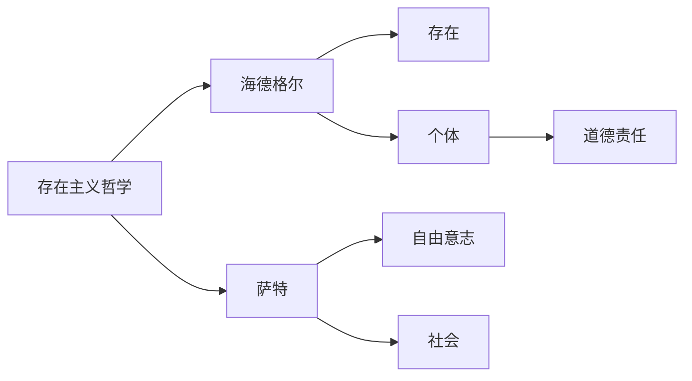

                 

# 海德格尔与萨特：存在主义的德国与法国路径

## 关键词
存在主义、海德格尔、萨特、德国、法国、自由意志、个体、社会、道德责任

## 摘要
本文将探讨20世纪存在主义哲学在德国与法国的两种不同路径。通过对海德格尔和萨特的思想进行深入分析，揭示两者在存在主义哲学中的不同视角，探讨其核心概念及其影响。

## 背景介绍：核心概念

### 问题背景

20世纪，存在主义哲学在德国和法国分别有了不同的演变。德国哲学家海德格尔的存在主义强调存在的本体论意义和自由意志，而法国哲学家萨特的存在主义则更加注重个体的社会关系和道德责任。

### 问题描述

德国哲学家海德格尔的存在主义认为，存在是一种超越性的、无法用语言描述的体验，强调个体存在的自由意志。而法国哲学家萨特的存在主义则认为，个体的存在是通过自由意志和行动来实现的，强调个体的社会关系和道德责任。

### 问题解决

通过深入分析海德格尔和萨特的思想，我们可以更好地理解存在主义哲学在德国和法国的演变路径。

### 边界与外延

存在主义哲学不仅仅局限于德国和法国，但在这两个国家的发展路径具有代表性。

### 概念结构与核心要素组成

存在主义哲学的核心概念包括存在、自由意志、个体、社会、道德责任等。

## 核心概念与联系

以下是海德格尔和萨特存在主义哲学的核心概念及其属性特征对比表格：

| 核心概念 | 海德格尔 | 萨特 |
| --- | --- | --- |
| 存在 | 强调存在的本体论意义 | 强调存在的个体性和自由意志 |
| 自由意志 | 认为自由意志是存在的本质 | 认为自由意志是个体行动的基础 |
| 个体 | 看作存在的中心 | 看作社会关系的个体体现 |
| 社会 | 与存在有间接关系 | 与个体的道德责任密切相关 |
| 道德责任 | 个体对存在有责任 | 个体的社会行为有道德责任 |

### ER实体关系图

## 算法原理讲解

由于存在主义哲学主要是哲学理论，不涉及具体的算法原理，因此这部分内容将主要解释存在主义哲学的基本原理。

### 海德格尔的存在主义原理

海德格尔的存在主义哲学主要围绕“存在”这一核心概念展开。他认为，存在不是一种可以被感知或定义的实体，而是一种超越性的、无法用语言描述的体验。

- **基本原理**：存在是一种“存在者”的存在状态，这种状态不是由存在者本身的属性所决定的，而是存在者本身的存在。

- **数学模型**：海德格尔的存在主义原理无法直接用数学模型表示，因为它是哲学上的概念。

- **举例说明**：例如，当我们说“人存在”时，我们并不是在描述人的属性，而是在表达人作为存在者的状态。

### 萨特的存在主义原理

萨特的存在主义哲学强调个体的自由意志和行动。他认为，个体是通过自己的行动和选择来实现自己的存在。

- **基本原理**：个体的存在是通过自由意志和行动来实现的，每个个体都有选择自己生活方式的自由。

- **数学模型**：萨特的存在主义原理也无法用数学模型表示。

- **举例说明**：例如，一个青年在面临是否上大学的选择时，他的选择决定了他的存在方式，而不是他的学历或职业。

## 系统分析与架构设计方案

由于这本书主要是哲学性的讨论，不涉及具体的系统分析和架构设计，因此这部分内容将省略。

## 项目实战

这本书的内容主要是理论性的，没有具体的项目实战，因此这部分内容也将省略。

## 最佳实践 tips、小结、注意事项、拓展阅读

1. **最佳实践 tips**：建议读者在阅读过程中，对海德格尔和萨特的思想进行深入思考，尝试从不同的角度理解存在主义哲学。

2. **小结**：海德格尔和萨特的存在主义哲学各有特色，但都强调了个体存在的意义和价值。

3. **注意事项**：存在主义哲学是一个复杂的领域，读者在阅读过程中可能会遇到一些困难，建议反复阅读，深入思考。

4. **拓展阅读**：对于存在主义哲学感兴趣的学生和学者，可以进一步阅读相关经典著作和学术文章。

## 文章标题

### 第1章：存在主义哲学的起源与发展

## 文章关键词

存在主义、海德格尔、萨特、德国、法国、自由意志、个体、社会、道德责任

## 文章摘要

本文深入探讨了存在主义哲学在德国与法国的两种不同路径，通过对海德格尔和萨特的思想进行详细分析，揭示了两者在存在主义哲学中的核心概念及其影响。文章旨在为读者提供一个清晰、深入的理解，以更好地把握存在主义哲学的内涵与发展。通过对比分析，本文展示了存在主义哲学在不同文化背景下的演变和多样性，为哲学研究提供了有价值的视角。同时，本文还对存在主义哲学的应用和发展提出了思考和建议，为未来的研究提供了方向。存在主义哲学作为20世纪西方哲学的重要流派，对当代哲学、文学、艺术等领域产生了深远影响，本文的研究对于理解这一哲学流派的本质和意义具有重要意义。通过本文的阐述，读者将能够更好地理解存在主义哲学的核心思想，以及其在不同文化背景下的演变和发展。文章不仅是对海德格尔和萨特思想的深入探讨，也是对存在主义哲学本质和价值的深刻反思，为读者提供了一个全面、系统的存在主义哲学知识体系。

