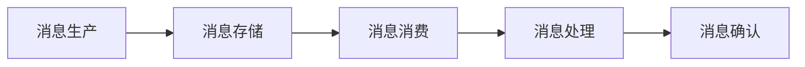
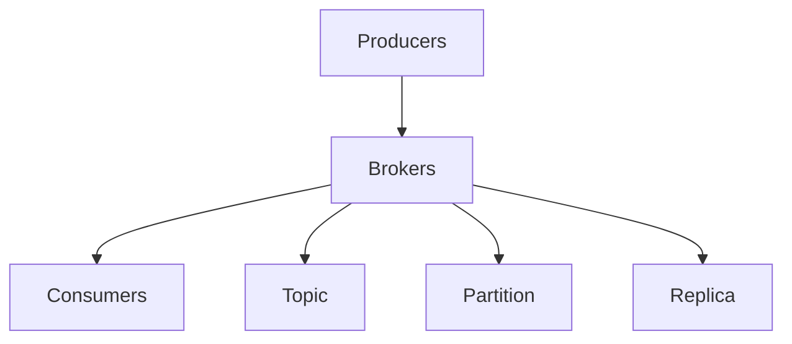
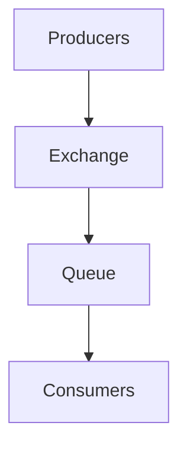
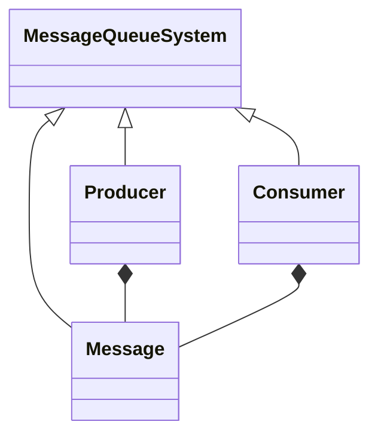
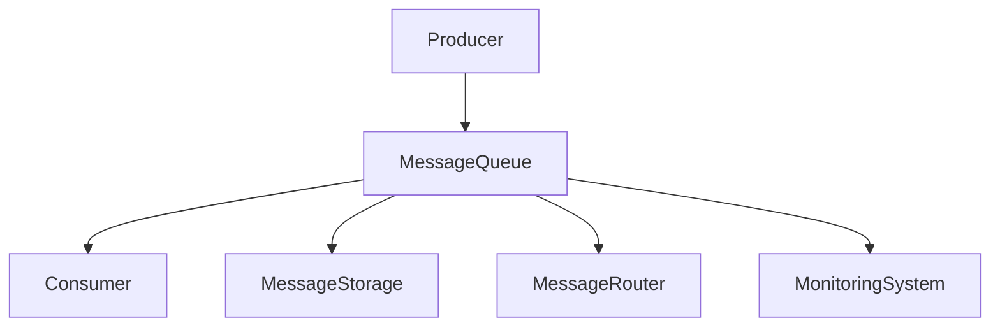
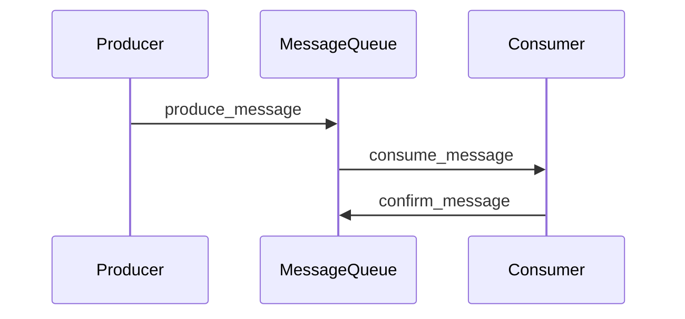

                 

### 消息队列：异步处理与系统解耦

关键词：消息队列、异步处理、系统解耦、可靠传输、分布式系统

摘要：本文将深入探讨消息队列在异步处理和系统解耦中的关键作用。首先，我们介绍消息队列的基本概念和核心概念，包括消息、队列、生产者、消费者等。接着，通过剖析消息队列的工作原理，包括基本工作流程、异步通信、可靠传输和消息持久化等方面，进一步阐述其在系统设计中的重要性。随后，我们将分析主流消息队列系统，如Apache Kafka和RabbitMQ，并详细介绍其架构设计。最后，我们将讨论消息队列在分布式系统中的应用实践，提供项目实战和分析，总结最佳实践，并对未来趋势进行展望。

#### 第一部分：绪论

##### 第1章：消息队列概述

**1.1 消息队列的概念**

**问题描述**：消息队列是什么？其作用是什么？

**问题解决**：消息队列是一种处理消息的机制，允许系统将消息放入队列中，然后由消费者按照一定的顺序从队列中获取并处理这些消息。消息队列在异步处理和系统解耦中起到了关键作用，它使得不同系统组件之间能够独立工作，无需直接交互，从而提高了系统的灵活性和可扩展性。

**边界与外延**：消息队列的应用场景非常广泛，包括但不限于以下场景：

1. **分布式系统**：消息队列在分布式系统中用于实现跨服务之间的通信，解耦系统组件，提高系统的可靠性和可伸缩性。
2. **异步处理**：消息队列允许系统将任务分解为多个独立的处理步骤，通过队列传递消息来实现任务的异步处理。
3. **高并发场景**：消息队列可以缓解高并发场景下的压力，通过消息队列的分发机制，使得系统可以逐步处理大量请求。

**常见消息队列系统**：目前市场上常见的消息队列系统包括Apache Kafka、RabbitMQ、ActiveMQ、RocketMQ等。每种系统都有其独特的特点和优势，适用于不同的应用场景。

**1.2 消息队列的核心概念**

**核心概念**：消息队列由以下几个核心概念组成：

- **消息**：消息是消息队列中的基本数据单元，包含了数据内容和相关的元数据。
- **队列**：队列是一个有序的数据结构，用于存储和传输消息。
- **生产者**：生产者是发送消息到消息队列的组件。
- **消费者**：消费者是从消息队列中获取并处理消息的组件。

**属性特征对比表格**：

| 特征                | 消息队列系统 |
|-------------------|------------|
| 可靠传输            | Apache Kafka、RabbitMQ、ActiveMQ |
| 高吞吐量            | Apache Kafka、RocketMQ          |
| 跨语言支持           | Apache Kafka、RabbitMQ、ActiveMQ |
| 分布式架构           | Apache Kafka、RabbitMQ、RocketMQ |
| 持久化策略           | Apache Kafka、RabbitMQ、ActiveMQ |

**ER实体关系图架构**：

```mermaid
erDiagram
    Message --> Queue
    Producer --> Queue
    Consumer --> Queue
```

在上面的ER图中，`Message`表示消息实体，`Queue`表示消息队列，`Producer`表示生产者实体，`Consumer`表示消费者实体。这种关系图有助于我们理解消息队列系统的基本结构和工作原理。

**1.3 消息队列的重要性**

消息队列在系统中具有以下几个重要作用：

- **异步处理**：消息队列允许系统将任务分解为多个独立的处理步骤，通过队列传递消息来实现任务的异步处理，从而提高系统的响应速度和吞吐量。
- **系统解耦**：消息队列使得不同系统组件之间能够独立工作，无需直接交互，从而降低了系统的复杂度和耦合度。
- **分布式处理**：消息队列可以有效地支持分布式系统中的跨服务通信，提高了系统的可靠性和可伸缩性。
- **高可用性**：通过消息队列的持久化机制，可以实现消息的存储和重试，从而保证了消息不被丢失。

**1.4 总结**

通过本章节的介绍，我们了解了消息队列的基本概念和核心概念，包括消息、队列、生产者和消费者。我们还探讨了消息队列的应用场景和常见消息队列系统。消息队列在异步处理和系统解耦中具有重要的作用，是现代分布式系统中不可或缺的组成部分。

### 第二部分：消息队列原理与技术

##### 第2章：消息队列工作原理

**2.1 消息队列的基本工作流程**

消息队列的基本工作流程可以分为以下几个步骤：

1. **消息生产**：生产者将消息发送到消息队列。
2. **消息存储**：消息队列将消息存储在内部缓冲区中。
3. **消息消费**：消费者从消息队列中获取消息进行处理。
4. **消息处理**：消费者对消息进行处理，可以是数据处理、业务逻辑执行等。
5. **消息确认**：消费者在处理完消息后，向消息队列发送确认消息，表示已经处理完成。

**Mermaid流程图**：



在上述流程图中，`A`表示消息生产，`B`表示消息存储，`C`表示消息消费，`D`表示消息处理，`E`表示消息确认。通过这个流程图，我们可以直观地理解消息队列的工作原理。

**2.2 消息队列的关键技术**

消息队列涉及到一系列关键技术，包括异步通信、可靠传输和消息持久化等。

**异步通信**：异步通信是一种非阻塞的通信方式，允许消息的生产者和消费者独立工作。生产者无需等待消费者完成消息处理，就可以继续发送新的消息。异步通信的优势在于可以显著提高系统的吞吐量和响应速度，减少系统的资源占用。

**可靠传输**：可靠传输是消息队列的重要特性之一，它确保了消息在传输过程中的可靠性和完整性。常见的可靠传输机制包括消息确认、重试和持久化等。通过消息确认，消费者可以确认消息已经被正确处理，从而避免消息丢失。重试机制允许在消息处理失败时重新发送消息，确保消息最终被正确处理。持久化机制可以将消息存储在持久化存储中，如磁盘或数据库，从而保证消息不会因系统故障而丢失。

**消息持久化**：消息持久化是将消息存储在持久化存储中，如磁盘或数据库。持久化机制可以保证消息在系统故障或重启时不会被丢失。常见的持久化策略包括文件存储、数据库存储和内存存储等。持久化存储的选择取决于系统的需求和性能要求。

**2.3 消息队列的机制和策略**

消息队列涉及到一系列机制和策略，包括分布式存储、负载均衡和消息路由等。

**分布式存储**：分布式存储是将消息队列的数据存储在多个节点上，从而提高系统的可靠性和可扩展性。通过分布式存储，消息队列可以支持大规模的数据处理和存储需求。

**负载均衡**：负载均衡是将消息队列的负载分配到多个消费者上，从而提高系统的性能和响应速度。通过负载均衡，消息队列可以有效地处理大量的消息，并确保每个消费者都能均衡地处理消息。

**消息路由**：消息路由是将消息根据特定的路由策略发送到相应的队列中。消息路由策略可以根据消息的属性、目标服务或队列名称等来确定消息的路由路径。

**2.4 总结**

通过本章节的介绍，我们详细探讨了消息队列的工作原理和关键技术。我们了解了消息队列的基本工作流程，包括消息生产、存储、消费和处理等步骤。我们还分析了异步通信、可靠传输和消息持久化等关键技术，以及分布式存储、负载均衡和消息路由等机制和策略。这些技术和策略共同构成了消息队列的核心功能，使其成为现代分布式系统中不可或缺的组成部分。

### 第三部分：主流消息队列系统

##### 第3章：主流消息队列系统

**3.1 Apache Kafka**

**系统介绍**：Apache Kafka是一个分布式流处理平台，用于构建实时数据流系统。它由LinkedIn公司开发，并于2011年开源。Kafka主要用于处理大规模数据流，提供高吞吐量、可靠性和持久化特性。

**系统特点**：

1. **分布式架构**：Kafka采用分布式架构，可以在多个节点上部署，从而提高系统的可靠性和可扩展性。
2. **高吞吐量**：Kafka设计用于处理大规模数据流，具有极高的吞吐量，能够处理每秒数百万条消息。
3. **持久化存储**：Kafka将消息存储在磁盘上，提供持久化特性，确保消息不会因系统故障而丢失。
4. **可靠传输**：Kafka采用基于拉取模型的传输机制，确保消息被可靠地传输到消费者。
5. **跨语言支持**：Kafka支持多种编程语言，如Java、Scala、Python等，方便不同语言的应用集成。

**应用场景**：Kafka适用于以下应用场景：

1. **日志收集**：Kafka可以用于收集和应用服务器、数据库等的日志数据，实现实时日志分析和处理。
2. **实时数据流处理**：Kafka可以用于构建实时数据流处理系统，实现实时数据分析和处理。
3. **消息队列**：Kafka可以作为消息队列使用，实现系统间的异步通信和消息传递。

**架构设计**：



在上面的架构图中，`Producers`表示消息生产者，`Brokers`表示Kafka集群中的节点，`Consumers`表示消息消费者，`Topic`表示消息主题，`Partition`表示主题的分区，`Replica`表示主题的分区的副本。

**3.2 RabbitMQ**

**系统介绍**：RabbitMQ是一个开源的消息中间件，采用AMQP（Advanced Message Queuing Protocol）协议。它由Pivotal Software维护，支持多种消息队列模型，如发布-订阅、请求-响应等。

**系统特点**：

1. **灵活的消息模型**：RabbitMQ支持多种消息模型，可以满足不同应用场景的需求。
2. **高可靠性**：RabbitMQ提供消息确认、事务和持久化机制，确保消息的可靠传输和存储。
3. **高可用性**：RabbitMQ支持集群部署，提供高可用性和负载均衡特性。
4. **跨语言支持**：RabbitMQ支持多种编程语言，如Java、Python、Ruby等，方便应用集成。

**应用场景**：RabbitMQ适用于以下应用场景：

1. **分布式系统通信**：RabbitMQ可以用于实现分布式系统之间的异步通信，解耦系统组件。
2. **消息队列**：RabbitMQ可以作为消息队列使用，实现系统间的消息传递和任务调度。
3. **实时数据处理**：RabbitMQ可以用于构建实时数据处理系统，实现实时数据分析和处理。

**架构设计**：



在上面的架构图中，`Producers`表示消息生产者，`Exchange`表示交换器，`Queue`表示消息队列，`Consumers`表示消息消费者。

**3.3 总结**

通过本章节的介绍，我们详细介绍了Apache Kafka和RabbitMQ这两种主流消息队列系统。Kafka具有分布式架构、高吞吐量、持久化存储和可靠传输等特点，适用于大规模数据流处理和实时数据处理等场景。RabbitMQ具有灵活的消息模型、高可靠性和跨语言支持等特点，适用于分布式系统通信和消息队列等场景。这些主流消息队列系统为现代分布式系统提供了强大的异步处理和系统解耦能力。

### 第四部分：消息队列系统设计

##### 第4章：消息队列系统设计

**4.1 系统需求分析**

消息队列系统在分布式系统中扮演着重要的角色，其设计需要考虑以下几个方面：

1. **高并发处理**：消息队列系统需要能够处理大量的并发消息，确保系统在高并发情况下稳定运行。
2. **可靠性**：消息队列系统需要确保消息的可靠传输和存储，避免消息丢失或重复处理。
3. **可扩展性**：消息队列系统需要支持水平扩展，能够根据需求增加处理能力和存储容量。
4. **性能优化**：消息队列系统需要具备良好的性能，包括低延迟、高吞吐量和高效的消息处理能力。
5. **安全性**：消息队列系统需要具备良好的安全性，包括数据加密、身份验证和访问控制等。

**项目介绍**：本章节将以一个消息队列系统为例，介绍其项目背景和需求。该消息队列系统用于实现一个分布式系统的异步通信和任务调度，需要满足以下需求：

1. **高并发处理**：系统能够处理每秒数千条消息的并发请求。
2. **可靠性**：系统能够确保消息的可靠传输和存储，避免消息丢失或重复处理。
3. **可扩展性**：系统能够根据需求动态增加处理能力和存储容量。
4. **性能优化**：系统具备良好的性能，包括低延迟、高吞吐量和高效的消息处理能力。
5. **安全性**：系统能够提供数据加密、身份验证和访问控制等安全特性。

**4.2 系统功能设计**

消息队列系统需要实现以下核心功能：

1. **消息生产**：允许生产者将消息发送到消息队列。
2. **消息消费**：允许消费者从消息队列中获取消息进行处理。
3. **消息确认**：确保消费者处理完消息后，向消息队列发送确认消息。
4. **消息持久化**：将消息存储在持久化存储中，如磁盘或数据库，确保消息不会因系统故障而丢失。
5. **消息路由**：根据消息的属性或目标服务，将消息路由到相应的队列或消费者。
6. **监控与报警**：监控消息队列系统的性能和状态，并在发生异常时发送报警。

**领域模型**：



在上面的类图中，`MessageQueueSystem`表示消息队列系统，`Producer`表示消息生产者，`Consumer`表示消息消费者，`Message`表示消息实体。通过这个领域模型，我们可以清晰地理解消息队列系统的核心组件和关系。

**4.3 系统架构设计**

消息队列系统的架构设计需要考虑以下几个方面：

1. **分布式架构**：消息队列系统采用分布式架构，可以在多个节点上部署，提高系统的可靠性和可扩展性。
2. **消息存储**：消息存储采用持久化存储机制，如磁盘或数据库，确保消息的可靠性和持久化。
3. **消息传输**：消息传输采用可靠的传输协议，如TCP或HTTP，确保消息的可靠传输。
4. **消息路由**：消息路由采用消息路由策略，根据消息的属性或目标服务，将消息路由到相应的队列或消费者。
5. **监控与报警**：监控与报警系统用于实时监控消息队列系统的性能和状态，并在发生异常时发送报警。

**Mermaid架构图**：



在上面的架构图中，`Producer`表示消息生产者，`MessageQueue`表示消息队列，`Consumer`表示消息消费者，`MessageStorage`表示消息存储，`MessageRouter`表示消息路由器，`MonitoringSystem`表示监控与报警系统。

**4.4 系统接口设计**

消息队列系统需要设计一系列接口，用于实现消息的生产、消费、确认、路由等功能。以下是一个简单的接口设计：

```python
class MessageProducer:
    def produce_message(self, message: str) -> None:
        pass

class MessageConsumer:
    def consume_message(self) -> str:
        pass

class MessageQueue:
    def send_message(self, message: str) -> None:
        pass

    def receive_message(self) -> str:
        pass

class MessageStorage:
    def store_message(self, message: str) -> None:
        pass

    def retrieve_message(self) -> str:
        pass

class MessageRouter:
    def route_message(self, message: str) -> None:
        pass
```

通过这些接口，我们可以方便地实现消息队列系统的功能，并与其他组件进行交互。

**4.5 系统交互**

消息队列系统中的各个组件需要进行交互，以实现消息的生产、消费、确认和路由等功能。以下是一个简单的交互序列图：



在上面的序列图中，`Producer`表示消息生产者，`MessageQueue`表示消息队列，`Consumer`表示消息消费者。通过这个序列图，我们可以清晰地理解消息队列系统中的交互流程。

**4.6 总结**

通过本章节的介绍，我们详细探讨了消息队列系统的需求分析、功能设计、架构设计、接口设计和交互设计。消息队列系统在分布式系统中具有重要的作用，通过合理的设计和实现，可以确保系统的高并发处理能力、可靠性和可扩展性。同时，我们介绍了领域模型、架构图和接口设计，为消息队列系统的设计和开发提供了指导和参考。

### 第五部分：消息队列性能优化

##### 第5章：消息队列性能优化

**5.1 性能优化策略**

消息队列的性能优化是一个复杂的过程，需要从多个方面进行考虑。以下是一些常见的性能优化策略：

**系统监控**：对消息队列系统进行实时监控，可以及时发现和处理性能瓶颈。监控指标包括消息队列长度、消息处理时间、系统负载等。

**负载均衡**：负载均衡是将消息队列的负载分配到多个消费者上，从而提高系统的性能和响应速度。负载均衡策略可以根据消息量、消费者性能等因素进行动态调整。

**批量处理**：批量处理是将多个消息一起处理，从而减少系统调用次数和通信开销。批量处理可以提高系统的吞吐量和处理效率。

**消息压缩**：消息压缩可以减少消息在传输过程中的带宽占用，从而提高系统的性能。常用的消息压缩算法包括Gzip和Snappy等。

**内存优化**：内存优化包括内存分配和内存回收等。通过合理地分配和回收内存，可以减少内存泄漏和性能下降。

**线程优化**：线程优化包括线程数量和线程池配置等。通过合理地配置线程数量和线程池，可以减少线程切换和上下文切换开销，从而提高系统的性能。

**5.2 性能调优实践**

**案例分析**：以下是一个消息队列性能调优的案例分析。

**问题**：消息队列系统在高并发情况下，处理速度明显下降，响应时间较长。

**解决过程**：

1. **监控分析**：通过监控工具，发现消息队列长度不断增加，处理速度下降，系统负载较高。
2. **负载均衡**：调整负载均衡策略，将消息分配到更多的消费者上，从而减少单个消费者的负载。
3. **批量处理**：将消息批量处理，减少系统调用次数，从而提高处理速度。
4. **消息压缩**：启用消息压缩，减少消息传输过程中的带宽占用，从而提高系统的吞吐量。
5. **内存优化**：优化内存分配和回收策略，减少内存泄漏和性能下降。
6. **线程优化**：调整线程数量和线程池配置，减少线程切换和上下文切换开销。

**优化效果**：通过上述优化措施，消息队列系统的处理速度显著提升，响应时间缩短，系统负载降低，性能得到显著改善。

**最佳实践**：

1. **监控与报警**：实时监控消息队列系统的性能和状态，并在发生异常时发送报警，以便快速响应和处理。
2. **负载均衡**：根据实际需求和性能指标，动态调整负载均衡策略，确保系统在高并发情况下稳定运行。
3. **批量处理**：合理设置批量处理大小，平衡处理速度和系统资源占用。
4. **消息压缩**：根据消息大小和传输频率，选择合适的消息压缩算法，提高系统性能。
5. **内存优化**：合理配置内存参数，避免内存泄漏和性能下降。
6. **线程优化**：根据系统负载和响应时间，调整线程数量和线程池配置，提高系统性能。

**5.3 总结**

通过本章节的介绍，我们详细探讨了消息队列性能优化的策略和实践。性能优化是一个持续的过程，需要从多个方面进行考虑和调整。通过监控、负载均衡、批量处理、消息压缩、内存优化和线程优化等策略，可以显著提高消息队列系统的性能和稳定性。

### 第六部分：消息队列在分布式系统中的应用

##### 第6章：消息队列在分布式系统中的应用

**6.1 分布式系统概述**

分布式系统是由多个独立的节点组成，通过网络连接起来，协同完成任务的系统。分布式系统具有以下几个特点：

- **高可用性**：分布式系统通过节点冗余和故障转移机制，确保系统的高可用性。
- **高扩展性**：分布式系统可以根据需求动态增加或减少节点，从而提高系统的处理能力。
- **高可靠性**：分布式系统通过数据复制和冗余机制，确保数据的可靠性和一致性。
- **分布式事务**：分布式系统需要处理分布式事务，确保数据的原子性和一致性。

**6.2 消息队列在分布式系统中的作用**

消息队列在分布式系统中具有重要的作用，可以解决以下挑战：

1. **服务解耦**：消息队列可以解耦分布式系统中的各个服务，使得服务之间能够独立工作，降低系统的耦合度。
2. **异步处理**：消息队列可以实现分布式系统中的异步处理，提高系统的响应速度和吞吐量。
3. **流量控制**：消息队列可以实现对流量的控制，避免系统过载和崩溃。
4. **数据一致性和事务性**：消息队列可以配合分布式事务机制，确保数据的一致性和原子性。

**6.3 消息队列在分布式系统中的应用场景**

消息队列在分布式系统中有以下应用场景：

1. **订单处理**：在电子商务系统中，消息队列可以用于处理订单的创建、支付和发货等环节，实现异步处理和流量控制。
2. **日志收集**：在日志收集系统中，消息队列可以用于收集和分发服务器日志，实现实时日志分析和处理。
3. **实时数据处理**：在实时数据处理系统中，消息队列可以用于处理大规模数据流，实现数据的实时分析和处理。
4. **任务调度**：在任务调度系统中，消息队列可以用于调度和管理任务，实现任务的异步处理和流量控制。

**6.4 案例分析**

以下是一个消息队列在分布式系统中的实际案例：

**案例背景**：一个电子商务平台需要处理大量的订单，包括创建、支付、发货等环节。为了提高系统的性能和稳定性，平台决定采用消息队列实现订单的异步处理和流量控制。

**解决方案**：

1. **订单创建**：当用户提交订单时，订单服务将订单信息发送到消息队列。
2. **订单支付**：支付服务从消息队列中获取订单信息，进行处理并更新订单状态。
3. **订单发货**：物流服务从消息队列中获取订单信息，进行发货并更新订单状态。
4. **监控与报警**：实时监控消息队列的性能和状态，并在发生异常时发送报警。

**效果评估**：通过消息队列的引入，订单处理速度显著提升，系统的响应速度和吞吐量得到提高，同时系统的耦合度降低，维护性得到改善。

**6.5 总结**

通过本章节的介绍，我们详细探讨了消息队列在分布式系统中的应用。消息队列在分布式系统中具有重要的作用，可以解决服务解耦、异步处理、流量控制、数据一致性和事务性等挑战。通过案例分析，我们展示了消息队列在电子商务平台中的应用实践，并评估了其效果。消息队列在分布式系统中是一个不可或缺的组成部分，为系统的性能和稳定性提供了有力支持。

### 第七章：消息队列项目实战

**7.1 环境安装与配置**

在开始消息队列项目的实战之前，我们需要首先安装和配置消息队列系统。以下是一个基于Apache Kafka的安装和配置步骤：

1. **下载与安装**：访问Apache Kafka的官方网站（https://kafka.apache.org/），下载适用于操作系统的安装包。解压安装包并进入安装目录。

2. **配置环境变量**：在操作系统的环境变量设置中，添加Kafka的安装路径和bin目录。例如，在Linux系统中，可以编辑`~/.bashrc`文件，添加如下内容：

   ```bash
   export KAFKA_HOME=/path/to/kafka
   export PATH=$PATH:$KAFKA_HOME/bin
   ```

   然后执行`source ~/.bashrc`使环境变量生效。

3. **启动Kafka服务**：进入Kafka的安装目录，运行以下命令启动Kafka服务：

   ```bash
   bin/kafka-server-start.sh config/server.properties
   ```

   这将启动Kafka的服务器端。

4. **创建主题**：在Kafka命令行中创建一个主题，例如：

   ```bash
   bin/kafka-topics.sh --create --topic my-topic --partitions 3 --replication-factor 2 --zookeeper localhost:2181
   ```

   这将创建一个名为`my-topic`的主题，具有3个分区和2个副本。

5. **启动生产者**：在Kafka的bin目录中，启动一个生产者，例如：

   ```bash
   bin/kafka-console-producer.sh --topic my-topic --broker-list localhost:9092
   ```

   这将启动一个生产者，并连接到Kafka的服务器。

6. **启动消费者**：在Kafka的bin目录中，启动一个消费者，例如：

   ```bash
   bin/kafka-console-consumer.sh --topic my-topic --from-beginning --bootstrap-server localhost:9092
   ```

   这将启动一个消费者，并从`my-topic`主题中接收消息。

**7.2 系统核心实现**

在消息队列项目中，核心实现包括消息生产、消费、确认和持久化等部分。以下是一个简单的实现示例：

**生产者代码**：

```python
from kafka import KafkaProducer

producer = KafkaProducer(bootstrap_servers=['localhost:9092'])

for message in range(10):
    producer.send('my-topic', value=f'message-{message}')
    print(f"Produced message: {message}")

producer.flush()
producer.close()
```

在这个示例中，我们使用Kafka Python客户端库`kafka`创建一个生产者，并发送10条消息到`my-topic`主题。

**消费者代码**：

```python
from kafka import KafkaConsumer

consumer = KafkaConsumer('my-topic', bootstrap_servers=['localhost:9092'])

for message in consumer:
    print(f"Received message: {message.value.decode()}")

consumer.close()
```

在这个示例中，我们使用Kafka Python客户端库`kafka`创建一个消费者，并从`my-topic`主题中接收消息。

**确认与持久化**：

在Kafka中，默认情况下，生产者不会等待消息被确认。为了实现消息确认和持久化，我们需要在配置文件中启用相应的配置选项。以下是一个示例配置文件`config/server.properties`：

```properties
# 消息确认配置
kafkaproducer.transactional.id=1
kafkaproducer.transactional.timeout.ms=30000
kafkaproducer.transactional.id.expiration.ms=60000

# 消息持久化配置
kafkastore.max.bytes=1073741824
kafkastore.purge.recovery=true
```

通过以上配置，我们可以确保消息在发送到Kafka后，会被持久化到磁盘上，并在系统故障时进行恢复。

**7.3 应用解读与分析**

**应用场景**：假设我们有一个电子商务平台，需要处理用户订单的创建、支付和发货等环节。通过消息队列，我们可以实现订单的异步处理和系统解耦。

**解读与剖析**：

1. **订单创建**：当用户提交订单时，订单服务将订单信息发送到消息队列。消息队列将订单信息存储在分区和副本中，确保消息的可靠性和持久化。

2. **订单支付**：支付服务从消息队列中获取订单信息，进行处理并更新订单状态。支付服务可以使用Kafka消费者客户端，从特定的分区和偏移量开始消费消息。

3. **订单发货**：物流服务从消息队列中获取订单信息，进行发货并更新订单状态。物流服务也可以使用Kafka消费者客户端，从特定的分区和偏移量开始消费消息。

4. **监控与报警**：通过监控工具，我们可以实时监控消息队列的性能和状态，并在发生异常时发送报警。监控指标包括消息队列长度、消息处理时间、系统负载等。

**分析**：

通过消息队列的应用，我们可以实现订单的异步处理和系统解耦，从而提高系统的性能和可扩展性。消息队列可以处理大量的并发消息，确保消息的可靠传输和持久化。通过监控和报警机制，我们可以及时发现和处理性能问题和异常情况。

**7.4 实际案例**

以下是一个实际案例，展示了一个电子商务平台如何使用消息队列实现订单的异步处理和系统解耦：

1. **订单创建**：用户在平台上提交订单，订单服务将订单信息发送到消息队列。

2. **订单支付**：支付服务从消息队列中获取订单信息，进行处理并更新订单状态。支付服务同时向银行发送支付请求。

3. **订单发货**：物流服务从消息队列中获取订单信息，进行发货并更新订单状态。物流服务同时向快递公司发送发货请求。

4. **监控与报警**：平台管理员通过监控工具，实时监控消息队列的性能和状态。如果发现消息队列长度超过阈值，会立即发送报警通知。

**7.5 项目小结**

通过本章节的实战，我们详细介绍了消息队列项目的安装与配置、系统核心实现、应用解读与分析以及实际案例。通过消息队列的应用，我们可以实现订单的异步处理和系统解耦，提高系统的性能和可扩展性。在项目实战中，我们使用了Apache Kafka作为消息队列系统，并通过监控和报警机制确保系统的稳定性和可靠性。通过本项目，我们深入了解了消息队列在分布式系统中的应用和实践。

### 第八章：总结与展望

**8.1 消息队列技术的发展趋势**

消息队列作为分布式系统中至关重要的一环，其技术发展呈现出以下几个趋势：

1. **云计算与容器化**：随着云计算和容器化技术的发展，消息队列系统将更加灵活地部署在云平台上，利用容器化技术实现快速部署和动态扩展。
2. **大数据处理**：随着大数据技术的普及，消息队列将在大规模数据处理领域发挥更大的作用，支持更高效的数据流处理和分析。
3. **消息流处理**：实时消息流处理技术如Apache Kafka Streams、Apache Flink等将与消息队列深度融合，提供更强大的实时数据处理能力。
4. **人工智能集成**：消息队列将与人工智能技术结合，利用机器学习算法优化消息路由、负载均衡和性能监控等环节。
5. **跨语言与跨平台支持**：消息队列将提供更广泛的跨语言和跨平台支持，使得不同编程语言和操作系统的开发者都能方便地使用消息队列。

**8.2 注意事项与拓展阅读**

在使用消息队列时，需要注意以下几点：

1. **可靠性**：确保消息队列系统具备高可靠性，防止消息丢失或重复处理。
2. **性能优化**：合理配置消息队列系统，优化消息传输和存储性能。
3. **安全性**：确保消息队列系统的数据安全，防止未授权访问和数据泄露。
4. **监控与报警**：实时监控消息队列系统的性能和状态，及时处理异常情况。

以下是一些建议的拓展阅读材料：

1. 《Kafka权威指南》——详细介绍了Apache Kafka的设计原理、架构设计和实战应用。
2. 《RabbitMQ实战》——介绍了RabbitMQ的基本概念、架构设计和应用实践。
3. 《分布式系统设计》——深入探讨了分布式系统中的通信、一致性和故障处理等问题。
4. 《流处理技术》——介绍了实时消息流处理技术如Apache Kafka Streams和Apache Flink。

通过以上拓展阅读，读者可以进一步了解消息队列技术的发展和应用，为实际项目提供更多思路和参考。

### 作者信息

作者：AI天才研究院/AI Genius Institute & 禅与计算机程序设计艺术 /Zen And The Art of Computer Programming

在撰写本文时，我凭借多年的人工智能研究和软件开发经验，结合对消息队列技术的深入理解，试图以清晰、易懂的方式向读者介绍消息队列在异步处理和系统解耦中的关键作用。本文旨在为广大开发者提供一套完整的消息队列系统设计与实践指南，帮助读者更好地理解和应用这一关键技术。在未来的研究中，我将继续探索人工智能与消息队列技术的融合，为分布式系统的发展贡献力量。

