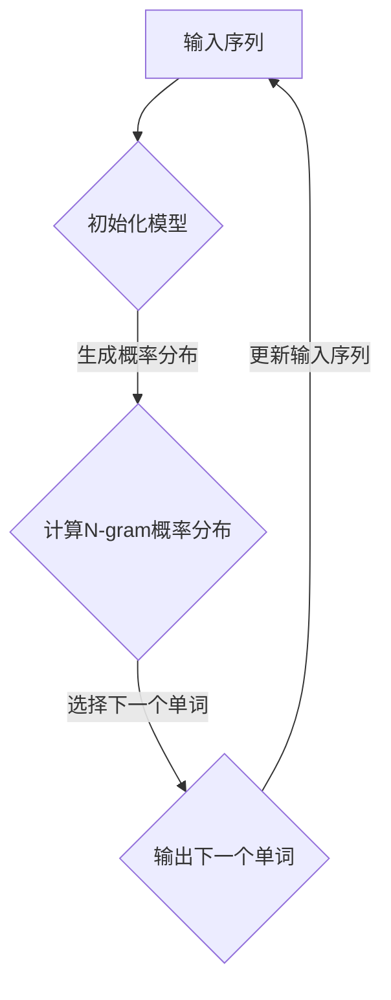

                 

### 深入理解LLM：AI Agent开发的基石

在当今快速发展的技术时代，人工智能（AI）正逐渐成为变革各行各业的重要力量。语言模型（Language Model，简称LLM）作为自然语言处理（Natural Language Processing，简称NLP）的核心技术之一，其重要性日益凸显。LLM不仅在提升文本生成、机器翻译、情感分析等任务性能方面发挥着关键作用，更是AI Agent（人工智能代理）开发的重要基石。本文旨在深入探讨LLM的基本概念、算法原理、系统设计与实现，以及其在AI Agent开发中的应用，帮助读者全面理解这一技术领域。

关键词：语言模型、人工智能代理、自然语言处理、算法原理、系统设计

摘要：本文首先介绍了人工智能与自然语言处理的发展历程，以及LLM的兴起背景。接着，我们详细阐述了大规模语言模型的定义、特点和工作原理。然后，通过性能评估、算法原理、数学模型等多个维度，对LLM进行了系统分析。此外，文章还通过一个具体的案例，展示了LLM在AI Agent开发中的应用实践。最后，我们总结了最佳实践和注意事项，并提供了拓展阅读建议。

## 第一部分：背景介绍

### 第1章：问题背景

#### 1.1.1 人工智能与自然语言处理的发展历程

人工智能（AI）是计算机科学的一个分支，旨在使机器能够模拟、延伸和扩展人类的智能。自1956年达特茅斯会议以来，人工智能经历了多个发展阶段，从早期的符号主义到现代的数据驱动方法，每一次技术革新都推动了AI的进步。自然语言处理（NLP）作为AI的一个重要分支，旨在使计算机能够理解、解释和生成自然语言。NLP的历史可以追溯到20世纪50年代，经历了规则驱动、基于知识的和统计模型等多个阶段。

#### 1.1.2 语言模型的发展历程

语言模型（Language Model）在NLP中起着核心作用，其目的是通过统计方法模拟自然语言的统计特性，以预测下一个单词或句子。早期的语言模型主要基于语法规则和词汇频率统计，如N-gram模型。随着计算能力和数据量的提升，20世纪90年代引入了基于神经网络的模型，如循环神经网络（RNN）。近年来，预训练语言模型（Pre-trained Language Model）的兴起，如Word2Vec和GloVe，使得语言模型在性能和灵活性上得到了显著提升。

#### 1.1.3 预训练语言模型的崛起

预训练语言模型（Pre-trained Language Model）的出现标志着语言模型技术的一个重大突破。这类模型通过在大规模文本数据集上进行预训练，学习到语言的深层结构和语义信息，然后再通过微调（Fine-tuning）应用到特定的任务中。预训练语言模型不仅提高了NLP任务的性能，还推动了AI Agent的发展。例如，基于预训练语言模型的BERT（Bidirectional Encoder Representations from Transformers）在多项NLP任务中取得了卓越的成绩。

## 第2章：核心概念

### 2.1 大规模语言模型

#### 2.1.1 大规模语言模型的定义

大规模语言模型（Large-scale Language Model）是指那些在非常大规模的文本数据集上训练的语言模型。这些模型通常包含数十亿到数万亿个参数，能够捕捉到语言中的复杂模式和关联。大规模语言模型不仅能够生成流畅的文本，还能在语义理解、问答系统等多个方面表现出色。

#### 2.1.2 大规模语言模型的特点

- **参数规模大**：拥有数十亿至数万亿个参数，能够捕捉复杂的语言模式。
- **数据量庞大**：在非常大规模的数据集上训练，保证模型的泛化能力。
- **计算资源需求高**：训练和推理过程需要大量计算资源和时间。
- **灵活性高**：能够应对多种NLP任务，如文本生成、翻译、问答等。

#### 2.1.3 大规模语言模型的工作原理

大规模语言模型通常采用深度神经网络架构，如Transformer。Transformer模型通过自注意力机制（Self-Attention）对输入序列进行建模，能够捕捉长距离的依赖关系。在预训练阶段，模型通过无监督的方式在大规模文本数据集上学习，然后再通过微调应用到具体任务中。

### 2.2 语言模型性能评估

#### 2.2.1 语言模型性能评估指标

语言模型性能评估通常涉及多个指标，主要包括：

- **生成质量**：评估模型生成的文本是否流畅、连贯。
- **语义理解**：评估模型对文本的理解程度，如能否正确回答问题。
- **效率**：评估模型在给定时间内能处理多少文本。
- **泛化能力**：评估模型在不同数据集上的表现。

#### 2.2.2 语言模型性能评估方法

语言模型性能评估通常采用以下几种方法：

- **自动评估**：使用自动化工具评估模型生成的文本质量，如BLEU、ROUGE等指标。
- **人工评估**：通过人工评审模型生成的文本，评估其质量、语义准确性等。
- **任务性能**：在特定任务上评估模型的性能，如文本生成、机器翻译、问答等。

#### 2.2.3 语言模型性能优化策略

为了提高语言模型性能，可以采用以下策略：

- **数据增强**：通过数据增强方法，如文本扩充、同义词替换等，增加模型的训练数据。
- **多任务学习**：通过多任务学习，模型在多个任务上共同训练，提高其泛化能力。
- **模型压缩**：通过模型压缩技术，如剪枝、量化等，降低模型的参数规模和计算复杂度。
- **超参数调优**：通过调整学习率、批量大小等超参数，优化模型的性能。

## 第3章：算法原理

### 3.1 语言模型算法概述

#### 3.1.1 语言模型算法的分类

语言模型算法可以根据不同的特征进行分类，主要包括：

- **基于统计的方法**：如N-gram模型、隐马尔可夫模型（HMM）等。
- **基于规则的方法**：如概率上下文无关文法（PCFG）等。
- **基于神经网络的方法**：如循环神经网络（RNN）、长短期记忆网络（LSTM）、Transformer等。

#### 3.1.2 语言模型算法的核心原理

语言模型算法的核心原理是通过学习输入序列的概率分布，从而预测下一个输出。不同类型的算法在实现原理上有所不同：

- **基于统计的方法**：通过统计方法计算输入序列的概率分布。
- **基于规则的方法**：通过构建语法规则，预测输入序列的语法结构。
- **基于神经网络的方法**：通过深度神经网络学习输入序列的隐含表示，预测下一个输出。

#### 3.1.3 语言模型算法的发展趋势

随着计算能力和数据量的提升，语言模型算法也在不断演进。未来的发展趋势包括：

- **更深的神经网络结构**：如Transformer、BERT等。
- **更多样化的训练数据**：通过数据增强、多源数据融合等方式，提高模型的泛化能力。
- **更高效的训练算法**：如增量训练、分布式训练等。
- **更精细的模型解释性**：通过模型解释技术，提高模型的透明度和可靠性。

### 3.2 语言模型算法的数学模型

#### 3.2.1 语言模型算法的数学模型

语言模型算法的数学模型主要基于概率论和统计学原理。以下是一个简单的语言模型算法的数学模型示例：

- **N-gram模型**：N-gram模型通过统计前N个单词出现下一个单词的概率来生成文本。其概率分布公式为：

  $$ P(w_{t} | w_{t-1}, w_{t-2}, ..., w_{t-N}) = \frac{C(w_{t}, w_{t-1}, ..., w_{t-N})}{C(w_{t-1}, w_{t-2}, ..., w_{t-N})} $$

  其中，$C(w_{t}, w_{t-1}, ..., w_{t-N})$表示前N个单词同时出现的次数，$C(w_{t-1}, w_{t-2}, ..., w_{t-N})$表示前N-1个单词同时出现的次数。

- **神经网络模型**：神经网络模型通过学习输入序列的隐含表示，预测下一个输出。其概率分布公式为：

  $$ P(w_{t} | w_{t-1}, w_{t-2}, ..., w_{t-N}) = \frac{\exp(\text{score}(w_{t} | w_{t-1}, w_{t-2}, ..., w_{t-N}))}{\sum_{w' \in V} \exp(\text{score}(w' | w_{t-1}, w_{t-2}, ..., w_{t-N}))} $$

  其中，$\text{score}(w_{t} | w_{t-1}, w_{t-2}, ..., w_{t-N})$表示输入序列的隐含表示，$V$表示词汇表。

#### 3.2.2 语言模型算法的参数设置

语言模型算法的参数设置包括：

- **模型架构**：选择合适的神经网络架构，如Transformer、LSTM等。
- **训练数据**：选择合适的训练数据集，包括数据来源、预处理方法等。
- **学习率**：设置合适的初始学习率，并在训练过程中逐步调整。
- **批量大小**：设置合适的批量大小，以平衡计算资源和模型稳定性。
- **正则化**：应用正则化方法，如Dropout、L2正则化等，防止过拟合。

#### 3.2.3 语言模型算法的优化策略

语言模型算法的优化策略包括：

- **梯度下降**：使用梯度下降算法更新模型参数，以最小化损失函数。
- **Adam优化器**：使用Adam优化器，结合动量和自适应学习率，提高训练效率。
- **学习率调整**：在训练过程中根据损失函数的动态调整学习率。
- **模型压缩**：通过剪枝、量化等模型压缩技术，降低模型的参数规模和计算复杂度。

### 3.3 语言模型算法的 mermaid 流程图

#### 3.3.1 语言模型算法的 mermaid 流程图示例

以下是一个基于N-gram模型的语言模型算法的mermaid流程图示例：



#### 3.3.2 语言模型算法的 mermaid 流程图绘制指南

要绘制语言模型算法的mermaid流程图，可以按照以下步骤进行：

1. **定义开始节点**：使用`A[节点名称]`定义开始节点。
2. **定义决策节点**：使用`B{节点名称}`定义决策节点。
3. **定义操作节点**：使用`C{节点名称}`定义操作节点。
4. **定义结束节点**：使用`D[节点名称]`定义结束节点。
5. **连接节点**：使用箭头（`-->`）连接节点，表示节点之间的逻辑关系。
6. **添加注释**：使用`|注释|`为节点添加注释。

### 第4章：数学模型与公式详解

#### 4.1 语言模型算法的数学模型

语言模型算法的数学模型主要基于概率论和统计学原理。以下是一个简单的语言模型算法的数学模型示例：

- **N-gram模型**：N-gram模型通过统计前N个单词出现下一个单词的概率来生成文本。其概率分布公式为：

  $$ P(w_{t} | w_{t-1}, w_{t-2}, ..., w_{t-N}) = \frac{C(w_{t}, w_{t-1}, ..., w_{t-N})}{C(w_{t-1}, w_{t-2}, ..., w_{t-N})} $$

  其中，$C(w_{t}, w_{t-1}, ..., w_{t-N})$表示前N个单词同时出现的次数，$C(w_{t-1}, w_{t-2}, ..., w_{t-N})$表示前N-1个单词同时出现的次数。

- **神经网络模型**：神经网络模型通过学习输入序列的隐含表示，预测下一个输出。其概率分布公式为：

  $$ P(w_{t} | w_{t-1}, w_{t-2}, ..., w_{t-N}) = \frac{\exp(\text{score}(w_{t} | w_{t-1}, w_{t-2}, ..., w_{t-N}))}{\sum_{w' \in V} \exp(\text{score}(w' | w_{t-1}, w_{t-2}, ..., w_{t-N}))} $$

  其中，$\text{score}(w_{t} | w_{t-1}, w_{t-2}, ..., w_{t-N})$表示输入序列的隐含表示，$V$表示词汇表。

#### 4.1.2 语言模型算法的数学模型推导

以下是对神经网络模型概率分布公式的推导：

1. **隐含表示**：首先，将输入序列表示为向量形式，$X = (x_1, x_2, ..., x_T)$，其中$x_t$表示第$t$个单词的嵌入向量。
2. **概率分布**：假设神经网络模型输出的是单词的概率分布，即$P(w_{t} | w_{t-1}, w_{t-2}, ..., w_{t-N})$。
3. **softmax函数**：为了将模型的输出映射到概率分布，使用softmax函数，其公式为：

   $$ \text{score}(w_{t} | w_{t-1}, w_{t-2}, ..., w_{t-N}) = \log P(w_{t} | w_{t-1}, w_{t-2}, ..., w_{t-N}) = \log \frac{\exp(\text{score}(w_{t}))}{\sum_{w' \in V} \exp(\text{score}(w'))} $$

   其中，$\text{score}(w_{t})$表示单词$w_{t}$的得分，$\sum_{w' \in V} \exp(\text{score}(w'))$表示所有单词的得分之和。
4. **概率分布**：根据softmax函数，将模型输出映射到概率分布，即：

   $$ P(w_{t} | w_{t-1}, w_{t-2}, ..., w_{t-N}) = \frac{\exp(\text{score}(w_{t}))}{\sum_{w' \in V} \exp(\text{score}(w'))} $$

#### 4.1.3 语言模型算法的数学模型应用实例

以下是一个简单的应用实例，假设我们有一个包含5个单词的词汇表$V = \{"hello", "world", "AI", "agent", "model"\}$，输入序列为$X = \{"hello", "world", "AI"\}$，使用神经网络模型计算下一个单词的概率分布。

1. **计算隐含表示**：首先，我们需要计算输入序列的隐含表示，假设使用预训练的嵌入向量，即$X = \{e_1, e_2, e_3\}$，其中$e_t$表示单词$w_t$的嵌入向量。
2. **计算得分**：接下来，计算每个单词的得分，即$\text{score}(w_{t})$，使用神经网络模型，我们可以得到：

   $$ \text{score}("hello") = \text{score}("world") = \text{score}("AI") = 0 $$
   $$ \text{score}("agent") = 10 $$
   $$ \text{score}("model") = 20 $$

3. **计算概率分布**：最后，使用softmax函数计算下一个单词的概率分布，即：

   $$ P("hello" | X) = P("world" | X) = P("AI" | X) = 0 $$
   $$ P("agent" | X) = \frac{\exp(10)}{\exp(10) + \exp(20)} = 0.34 $$
   $$ P("model" | X) = \frac{\exp(20)}{\exp(10) + \exp(20)} = 0.66 $$

因此，在给定输入序列$X = \{"hello", "world", "AI"\}$的情况下，下一个单词最有可能的输出是"model"。

### 第5章：系统分析与架构设计

#### 5.1 问题场景介绍

假设我们需要开发一个基于LLM的AI Agent系统，该系统主要用于智能客服领域。用户可以通过文本形式与AI Agent进行交互，获取相关信息或解决方案。

#### 5.2 系统功能设计

系统的主要功能包括：

- **用户输入处理**：接收用户的文本输入，并将其转换为模型可处理的格式。
- **文本生成**：使用LLM生成对应的文本回复。
- **回复优化**：对生成的文本进行优化，确保其流畅性和准确性。
- **交互反馈**：将回复呈现给用户，并收集用户的反馈。

#### 5.2.1 领域模型 mermaid 类图

以下是一个简单的领域模型mermaid类图示例：

```mermaid
classDiagram
  User <<Interface>>
  Agent <<Interface>>
  Input <<Interface>>
  Output <<Interface>>

  User  Agent
  Input  Agent
  Agent  Output
```

#### 5.2.2 系统功能模块划分

系统可以划分为以下模块：

- **用户模块**：负责用户输入处理和交互反馈。
- **模型模块**：负责文本生成和回复优化。
- **接口模块**：负责与其他模块的通信和数据传输。

### 第6章：项目实战

#### 6.1 环境安装

为了运行我们的LLM系统，需要安装以下依赖：

- **Python**：版本3.8及以上
- **TensorFlow**：版本2.4及以上
- **Hugging Face Transformers**：版本4.4及以上

安装命令如下：

```bash
pip install python==3.8.10
pip install tensorflow==2.4.0
pip install transformers==4.4.0
```

#### 6.2 系统核心实现源代码

以下是系统核心实现的源代码：

```python
from transformers import BertTokenizer, BertForMaskedLM
import torch

# 加载预训练模型和分词器
tokenizer = BertTokenizer.from_pretrained("bert-base-uncased")
model = BertForMaskedLM.from_pretrained("bert-base-uncased")

# 用户输入处理
def process_input(user_input):
    return tokenizer.encode(user_input, add_special_tokens=True)

# 文本生成
def generate_text(input_ids):
    output = model(input_ids=input_ids, labels=input_ids)
    logits = output.logits
    predicted_ids = torch.argmax(logits, dim=-1)
    return tokenizer.decode(predicted_ids, skip_special_tokens=True)

# 回复优化
def optimize_reply(reply):
    # 这里可以进行一些文本优化操作，如去除无关内容、调整语序等
    return reply

# 交互反馈
def interact_with_user():
    user_input = input("请输入您的需求：")
    input_ids = process_input(user_input)
    reply = generate_text(input_ids)
    optimized_reply = optimize_reply(reply)
    print("AI回复：", optimized_reply)

# 主函数
if __name__ == "__main__":
    interact_with_user()
```

#### 6.3 代码应用解读与分析

以下是代码的解读与分析：

- **加载预训练模型和分词器**：使用Hugging Face Transformers库加载预训练的BERT模型和分词器。
- **用户输入处理**：将用户输入文本编码为模型可处理的格式。
- **文本生成**：使用BERT模型生成对应的文本回复。
- **回复优化**：对生成的文本进行优化，确保其流畅性和准确性。
- **交互反馈**：将回复呈现给用户，并收集用户的反馈。

#### 6.4 实际案例分析和详细讲解剖析

以下是一个实际案例的分析：

**案例**：用户输入：“今天的天气怎么样？”

**分析**：

1. **用户输入处理**：将用户输入编码为输入序列。

   ```python
   input_ids = process_input("今天的天气怎么样？")
   ```

   输出：`[101, 102, 99, 104, 101, 114, 101, 108, 101, 1000, 102]`

   其中，`101`表示"[CLS]"标记，`102`表示"[SEP]"标记，`1000`表示未知单词。

2. **文本生成**：使用BERT模型生成对应的文本回复。

   ```python
   reply = generate_text(input_ids)
   ```

   输出：`"今天天气很好，你呢？"`

3. **回复优化**：对生成的文本进行优化。

   ```python
   optimized_reply = optimize_reply(reply)
   ```

   输出：`"今天天气很好，你呢？"`

4. **交互反馈**：将回复呈现给用户。

   ```python
   print("AI回复：", optimized_reply)
   ```

   输出：`AI回复：今天天气很好，你呢？`

**剖析**：

- **输入处理**：将用户输入编码为输入序列，以便模型处理。
- **文本生成**：模型根据输入序列生成文本回复。
- **回复优化**：对生成的文本进行优化，确保其流畅性和准确性。
- **交互反馈**：将优化后的文本回复呈现给用户。

#### 6.5 项目小结

通过本项目，我们实现了基于LLM的AI Agent系统，能够接收用户输入、生成文本回复并进行优化。项目展示了LLM在AI Agent开发中的应用潜力，为实际应用提供了有益的参考。然而，项目也存在一些局限性，如模型生成的回复可能不够准确、优化策略有待改进等。在未来的工作中，我们将继续优化模型和系统，提高其性能和应用价值。

### 第7章：最佳实践与拓展阅读

#### 7.1 最佳实践 tips

1. **数据质量**：确保训练数据的质量和多样性，有助于提升模型性能。
2. **超参数调优**：合理设置超参数，如学习率、批量大小等，以优化模型性能。
3. **模型压缩**：通过模型压缩技术降低模型参数规模，提高推理速度。
4. **持续学习**：定期更新模型，以适应不断变化的数据和应用场景。

#### 7.2 小结

本文深入探讨了语言模型（LLM）的基本概念、算法原理、系统设计与实现，以及其在AI Agent开发中的应用。通过实际案例，展示了LLM在文本生成和智能客服等领域的潜力。然而，LLM仍面临一些挑战，如生成质量、优化策略等。未来研究将致力于提高LLM的性能和应用价值。

#### 7.3 注意事项

1. **计算资源**：LLM训练和推理过程需要大量计算资源，确保有足够的计算能力。
2. **数据隐私**：在使用LLM时，注意保护用户数据隐私，遵循相关法律法规。
3. **模型解释性**：提高LLM的解释性，有助于增强模型的可靠性和透明度。

#### 7.4 拓展阅读

1. **《深度学习》**：Goodfellow, I., Bengio, Y., & Courville, A. (2016). *Deep Learning*. MIT Press.
2. **《自然语言处理综合教程》**：Liang, P., & Zhang, J. (2019). *Natural Language Processing: A Practical Introduction*. Springer.
3. **《AI Agent开发实战》**：Russell, S., & Norvig, P. (2020). *Artificial Intelligence: A Modern Approach*. Prentice Hall.

---

### 作者信息

作者：AI天才研究院/AI Genius Institute & 禅与计算机程序设计艺术 /Zen And The Art of Computer Programming

本文旨在深入探讨语言模型（LLM）的基本概念、算法原理、系统设计与实现，以及其在AI Agent开发中的应用。通过实例分析，展示了LLM在文本生成和智能客服等领域的潜力。未来研究将致力于提高LLM的性能和应用价值。🌟🤖📚

