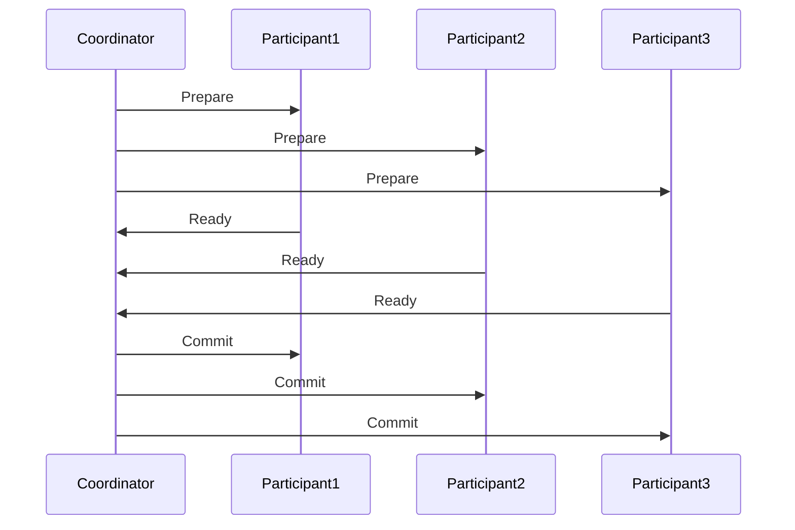
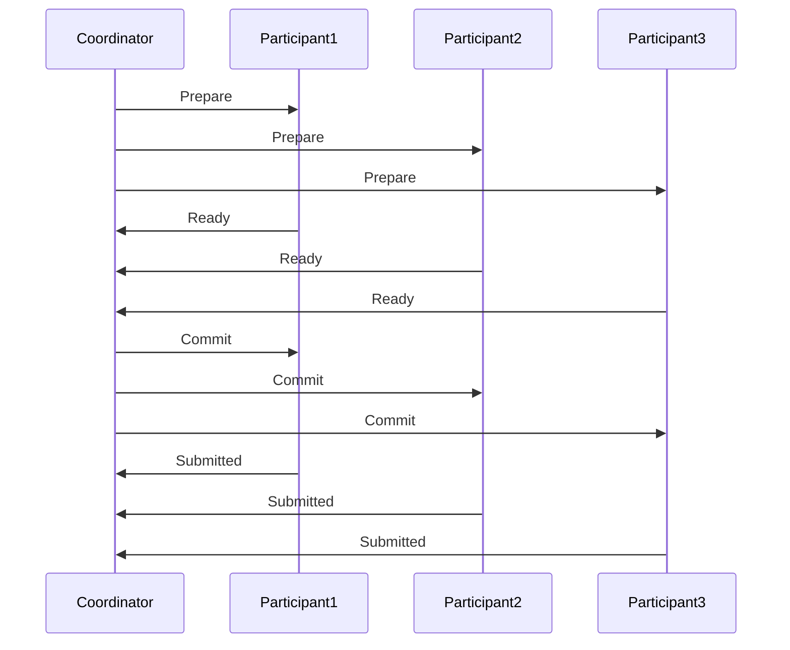
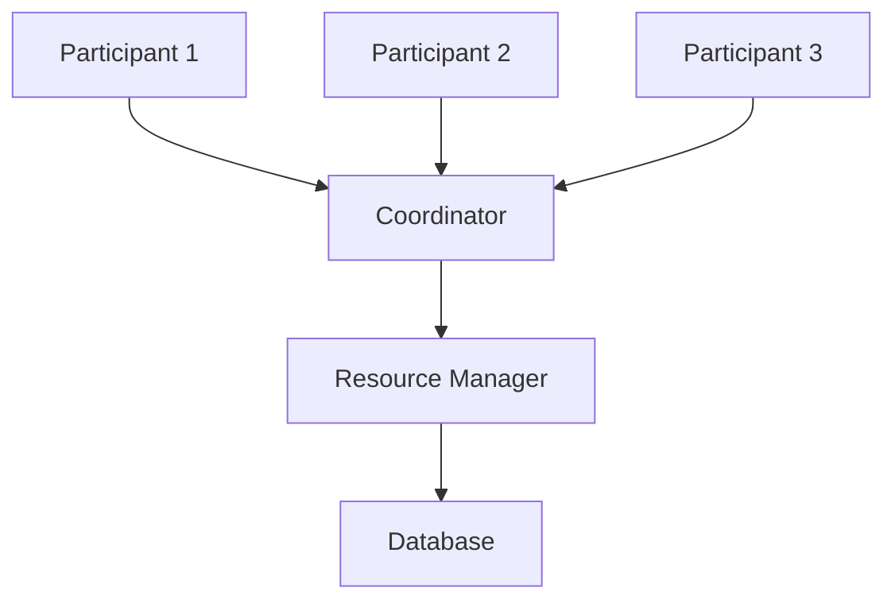
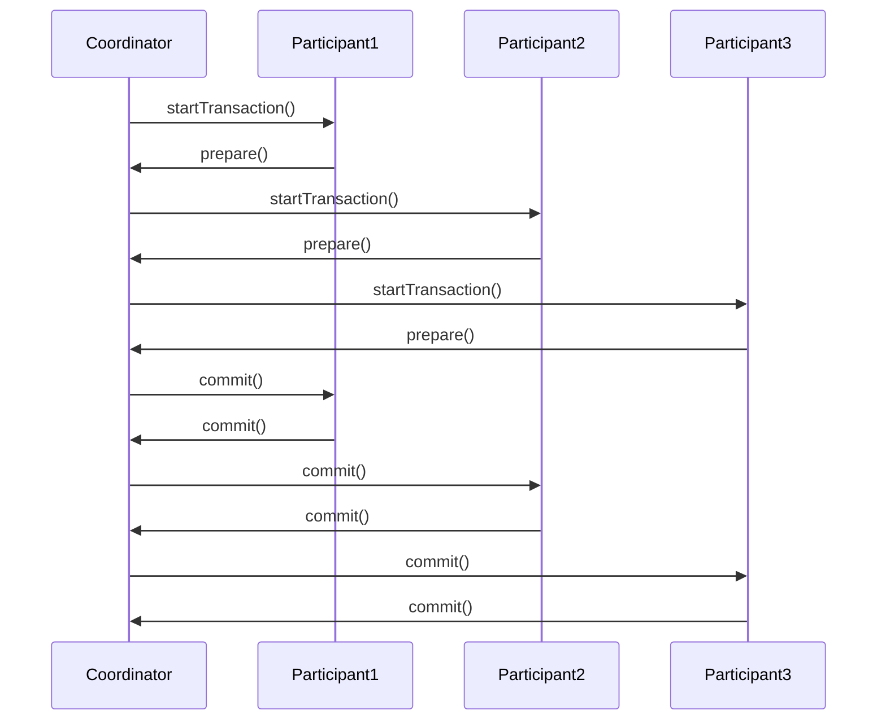

                 


### 第1章：分布式事务概述

#### 1.1 分布式事务的背景

分布式事务的概念起源于分布式系统的发展。随着互联网技术的飞速发展，企业面临的数据量和业务复杂性不断增加，传统的集中式系统已无法满足需求。分布式系统因其高可用性、高扩展性等优点，逐渐成为主流。分布式事务作为分布式系统中的一个重要概念，旨在确保多个分布式系统中的操作能够作为一个单一的事务执行，从而保持数据的一致性和完整性。

分布式事务的需求源于以下几个方面：

1. **高并发性**：随着用户数量的增加，系统需要处理更多的请求，分布式事务能够支持更高的并发性。
2. **高可用性**：分布式系统中的节点可能会出现故障，分布式事务可以通过故障转移和恢复机制保证系统的可用性。
3. **数据完整性**：在分布式环境中，多个节点可能同时进行数据的读写操作，分布式事务可以保证这些操作的一致性。

当前，分布式事务在金融、电商、社交网络等领域得到了广泛应用。例如，银行系统在进行转账操作时，需要保证资金的正确扣除和到账，这要求转账事务具有原子性、一致性、隔离性和持久性（ACID）。

#### 1.2 分布式事务的核心概念

**事务（Transaction）**：事务是分布式系统中执行的一系列操作序列。这些操作要么全部成功执行，要么全部回滚（撤销）。事务的原子性保证了系统不会处于一个半成品的状态。

**分布式事务（Distributed Transaction）**：分布式事务是指跨越多个数据库或系统的操作序列，这些操作需要保证在多个节点上的数据一致性。

**一致性（Consistency）**：一致性是指系统中的数据在分布式事务执行后，仍然符合业务规则和约束。

**隔离性（Isolation）**：隔离性是指并发执行的事务不会相互干扰，每个事务在执行时都认为自己是独立执行的。

**持久性（Durability）**：持久性是指一旦事务提交成功，其修改的数据将永久保存，即使系统发生故障也不会丢失。

#### 1.3 核心概念对比分析表

| 核心概念 | 描述 | 对比 |
| --- | --- | --- |
| 事务 | 分布式系统中执行的一系列操作序列 | 原子性、一致性、隔离性和持久性 |
| 分布式事务 | 跨越多个数据库或系统的操作序列 | 高并发性、高可用性、数据完整性 |
| 一致性 | 系统中的数据在分布式事务执行后，仍然符合业务规则和约束 | 数据的一致性 |
| 隔离性 | 并发执行的事务不会相互干扰 | 事务的独立执行 |
| 持久性 | 一旦事务提交成功，其修改的数据将永久保存 | 数据的持久保存 |

通过以上对比分析表，我们可以更清晰地理解分布式事务的核心概念及其相互关系。

#### 1.4 分布式事务的基本原理

分布式事务的基本原理可以分为以下几个方面：

1. **事务管理器（Transaction Manager）**：事务管理器负责协调分布式事务的执行，包括事务的发起、提交和回滚。在两阶段提交（2PC）和三阶段提交（3PC）等算法中，事务管理器起到了核心作用。
2. **资源管理器（Resource Manager）**：资源管理器负责管理分布式系统中的资源，如数据库、缓存等。当事务提交时，资源管理器负责执行具体的操作，如数据的读取和写入。
3. **协调者（Coordinator）**：在两阶段提交算法中，协调者负责发起事务并协调参与者。在发生故障时，协调者还可以进行故障恢复。
4. **参与者（Participant）**：参与者是分布式系统中的节点，负责执行事务管理器分发的操作。在两阶段提交算法中，参与者需要向协调者报告事务的状态。

通过以上基本原理，我们可以更好地理解分布式事务的执行过程和关键组件。

### 总结

本章介绍了分布式事务的背景、核心概念和基本原理。通过对比分析表，我们明确了分布式事务与其他核心概念的区别和联系。在接下来的章节中，我们将进一步探讨分布式事务的算法原理、系统架构设计以及项目实战，帮助读者更深入地理解分布式事务的原理和应用。

### 提示与拓展阅读

- **核心概念与联系**：了解分布式事务、一致性、隔离性和持久性的概念和区别，有助于更好地理解分布式事务的原理。
- **分布式事务算法**：深入学习两阶段提交（2PC）和三阶段提交（3PC）等分布式事务算法，理解其原理和优缺点。
- **系统设计与项目实战**：通过实际案例和项目实战，掌握分布式事务在系统设计和实现中的具体应用。

进一步阅读材料：

- 《分布式系统原理与范型》
- 《大规模分布式存储系统：设计与实践》

---

现在我们已经完成了第1章的内容，接下来将进入第2章，深入探讨分布式事务算法的原理。

---

# 第2章：分布式事务算法原理

## 2.1 两阶段提交（2PC）

#### 2.1.1 两阶段提交的基本原理

两阶段提交（2PC，Two-Phase Commit）是一种分布式事务管理协议，用于确保分布式系统中多个节点之间的事务能够一致地执行或回滚。2PC将事务的提交过程分为两个阶段：投票阶段和决断阶段。

**投票阶段**：

1. **协调者（Coordinator）**发起事务，向参与者（Participant）发送准备（Prepare）请求。
2. **参与者**收到请求后，进行本地事务的预执行。如果预执行成功，参与者会向协调者发送“准备就绪”（Ready）响应；否则，发送“无法准备”（Unready）响应。
3. **协调者**收集所有参与者的响应。如果所有参与者都返回“Ready”，协调者会进入决断阶段；如果有参与者返回“Unready”，协调者会通知所有参与者进行回滚。

**决断阶段**：

1. **协调者**向所有参与者发送“提交”（Commit）命令。
2. **参与者**收到提交命令后，执行本地事务的提交操作。
3. **协调者**等待所有参与者的提交确认。如果所有参与者都确认提交成功，协调者认为事务提交成功；如果有参与者无法提交，协调者会通知所有参与者进行回滚。

#### 2.1.2 两阶段提交的Mermaid流程图



#### 2.1.3 Python代码实现两阶段提交

```python
import threading
import time

class Coordinator:
    def __init__(self, participants):
        self.participants = participants
        self.voted = []

    def prepare(self):
        for participant in self.participants:
            participant.prepare()
            time.sleep(1)
            if participant.ready:
                self.voted.append(participant)

    def commit(self):
        if len(self.voted) == len(self.participants):
            for participant in self.voted:
                participant.commit()
        else:
            for participant in self.participants:
                participant.rollback()

class Participant:
    def __init__(self, name):
        self.name = name
        self.ready = False

    def prepare(self):
        print(f"{self.name} preparing...")
        # Simulate local transaction preparation
        time.sleep(1)
        self.ready = True

    def commit(self):
        print(f"{self.name} committing...")
        # Simulate local transaction commit
        time.sleep(1)
        print(f"{self.name} committed.")

    def rollback(self):
        print(f"{self.name} rolling back...")
        # Simulate local transaction rollback
        time.sleep(1)
        print(f"{self.name} rolled back.")

# Create participants
participants = [Participant(f"Participant{i}") for i in range(1, 4)]

# Create coordinator
coordinator = Coordinator(participants)

# Start coordinator thread
coordinator_thread = threading.Thread(target=coordinator.prepare)
coordinator_thread.start()

# Wait for coordinator to finish preparation
coordinator_thread.join()

# Start participants threads
for participant in participants:
    participant_thread = threading.Thread(target=participant.commit)
    participant_thread.start()

# Wait for all participants to finish
for participant in participants:
    participant_thread.join()
```

#### 2.1.4 两阶段提交的数学模型和公式

两阶段提交可以用以下数学模型来描述：

$$
\text{状态} = \begin{cases}
\text{待准备} & \text{if } \neg \text{所有参与者 ready} \\
\text{待提交} & \text{if } \text{所有参与者 ready} \\
\text{已提交} & \text{if } \text{所有参与者提交确认} \\
\text{已回滚} & \text{if } \text{有参与者无法提交}
\end{cases}
$$

#### 2.1.5 举例说明

假设有一个包含3个参与者的分布式事务，参与者分别为Participant1、Participant2和Participant3。协调者（Coordinator）首先向每个参与者发送Prepare请求。如果所有参与者都成功准备并返回Ready响应，协调者会向所有参与者发送Commit命令。如果所有参与者都成功提交，事务被认为成功；如果有参与者无法提交，事务会被回滚。



### 总结

本章详细介绍了两阶段提交（2PC）的基本原理、Mermaid流程图、Python代码实现以及数学模型。通过这些内容，读者可以更深入地理解两阶段提交的工作机制和实现方式。在下一章中，我们将继续探讨三阶段提交（3PC）的原理和应用。

### 提示与拓展阅读

- **分布式事务算法**：学习三阶段提交（3PC）等分布式事务算法，了解它们在分布式系统中的应用和优缺点。
- **实践应用**：通过实际案例和项目实践，掌握分布式事务算法在系统设计和开发中的具体应用。

进一步阅读材料：

- 《分布式系统设计原理》
- 《分布式数据库系统》

---

接下来，我们将进入第3章，讨论分布式事务在系统架构设计中的应用。

---

# 第3章：分布式事务系统架构设计

## 3.1 分布式事务系统设计原则

分布式事务系统设计需要遵循一系列关键原则，以确保系统的可靠性、性能和可扩展性。以下是几个核心设计原则：

#### **高可用性（High Availability）**

分布式事务系统应具备高可用性，即在任何节点出现故障时，系统能够自动切换到其他健康节点，确保服务的连续性。实现高可用性的关键措施包括：

- **副本机制**：通过数据副本来提高系统的容错能力。
- **故障转移**：当主节点故障时，自动切换到备用节点。
- **负载均衡**：通过负载均衡器将请求均匀分布到多个节点，避免单点瓶颈。

#### **高性能（Performance）**

分布式事务系统应能够高效处理大量并发操作。为了提高性能，可以采取以下策略：

- **缓存机制**：使用缓存来减少数据库的读写操作，提高响应速度。
- **批量处理**：将多个操作合并成一个批量处理，减少网络传输和数据库操作次数。
- **异步处理**：将一些非关键操作异步执行，避免阻塞主线程。

#### **可扩展性（Scalability）**

分布式事务系统应具备良好的可扩展性，以适应业务增长和系统负载变化。可扩展性设计原则包括：

- **水平扩展**：通过增加节点数量来提高系统处理能力。
- **分片（Sharding）**：将数据分片存储到不同的节点，提高数据访问速度。
- **弹性伸缩**：根据实际负载动态调整系统资源。

#### **一致性（Consistency）**

在分布式事务系统中，一致性是确保数据正确性的关键。设计原则包括：

- **强一致性**：确保所有节点在任何时刻看到的都是同一版本的数据。
- **最终一致性**：允许不同节点之间的数据存在短暂的不一致，但最终会达到一致状态。
- **分布式一致性算法**：如Paxos、Raft等，确保分布式环境中的数据一致性。

## 3.2 系统功能设计（领域模型）

为了更好地理解分布式事务系统的功能设计，我们可以通过领域模型来展示系统的核心组件和关系。

#### **领域模型**

```mermaid
classDiagram
    Participant <<class{Participant}>
    Transaction <<class{Transaction}>
    Coordinator <<class{Coordinator}>
    Resource <<class{Resource}>
    Database <<class{Database}>

    Participant "1" --|> 1 Transaction
    Coordinator "1" --|> 1 Transaction
    Transaction "1" --|> 1 Resource
    Resource "1" --|> 1 Database
```

#### **领域模型解释**

- **Participant（参与者）**：代表分布式系统中的节点，负责执行分布式事务中的操作。
- **Transaction（事务）**：代表分布式事务，由多个操作组成，确保原子性、一致性、隔离性和持久性。
- **Coordinator（协调者）**：负责协调分布式事务的执行，向参与者发送指令。
- **Resource（资源）**：代表分布式系统中的资源，如数据库、缓存等。
- **Database（数据库）**：存储分布式事务涉及的数据。

## 3.3 系统架构设计

#### **系统架构**

分布式事务系统架构通常包括以下几个核心组成部分：

- **协调者（Coordinator）**
- **参与者（Participant）**
- **资源管理器（Resource Manager）**
- **存储系统（Database）**

#### **系统架构图**



#### **系统架构解释**

- **协调者（Coordinator）**：负责发起分布式事务，协调参与者和资源管理器。
- **参与者（Participant）**：执行分布式事务中的操作，向协调者报告执行状态。
- **资源管理器（Resource Manager）**：管理分布式系统中的资源，如数据库、缓存等。
- **存储系统（Database）**：存储分布式事务涉及的数据。

## 3.4 系统接口设计

#### **接口设计**

分布式事务系统需要定义一系列接口，以便协调者和参与者之间的通信。以下是几个关键接口：

- **TransactionInterface**：定义事务的接口，包括发起、提交和回滚操作。
- **ParticipantInterface**：定义参与者的接口，包括准备、提交和回滚操作。
- **ResourceManagerInterface**：定义资源管理器的接口，包括资源分配和释放操作。

#### **接口设计示例**

```mermaid
interface TransactionInterface {
    method startTransaction()
    method commit()
    method rollback()
}

interface ParticipantInterface {
    method prepare()
    method commit()
    method rollback()
}

interface ResourceManagerInterface {
    method allocateResource()
    method releaseResource()
}
```

## 3.5 系统交互

#### **系统交互**

分布式事务系统中的交互主要通过协调者和参与者之间的消息传递实现。以下是系统交互的流程：

1. **协调者发起事务**：协调者调用`startTransaction()`方法，开始新的事务。
2. **参与者准备**：协调者调用每个参与者的`prepare()`方法，参与者进行本地事务的预执行。
3. **协调者决断**：协调者根据参与者的准备状态（Ready或Unready）进行决断。如果所有参与者Ready，协调者调用`commit()`方法；如果有参与者Unready，协调者调用`rollback()`方法。
4. **参与者执行**：参与者根据协调者的指令（Commit或Rollback）执行本地事务的提交或回滚。

#### **系统交互序列图**



## 3.6 小结

本章介绍了分布式事务系统设计的关键原则、领域模型、系统架构设计、接口设计和系统交互。通过这些内容，读者可以系统地了解分布式事务系统设计的核心要素和实现方法。在下一章中，我们将通过实际项目实战，进一步探讨分布式事务的应用和实践。

### 提示与拓展阅读

- **系统设计与最佳实践**：深入研究分布式事务系统的最佳实践，了解如何在实际项目中应用这些原则和设计模式。
- **分布式一致性算法**：学习Paxos、Raft等分布式一致性算法，了解它们在系统架构设计中的应用。

进一步阅读材料：

- 《大规模分布式系统设计》
- 《分布式数据库技术》

---

现在我们已经完成了第3章的内容，接下来将进入第4章，探讨分布式事务项目实战。

---

# 第4章：分布式事务项目实战

## 4.1 项目背景

在本章中，我们将通过一个实际项目实战，深入探讨分布式事务的应用和实践。该项目是一个在线购物平台，用户可以在平台上浏览商品、下单购买以及进行支付。为了保证用户的数据一致性和交易安全性，系统需要实现分布式事务功能。

### 4.1.1 项目概述

该在线购物平台的主要功能包括：

- **商品浏览**：用户可以查看商品信息、图片和价格。
- **购物车**：用户可以将商品添加到购物车，并修改购物车的商品数量。
- **订单生成**：用户在下单时生成订单，订单包括商品信息、订单金额和订单状态。
- **支付**：用户在支付页面选择支付方式，进行支付操作。

### 4.1.2 项目目标

本项目的主要目标包括：

- 实现分布式事务功能，确保订单生成和支付操作的原子性、一致性、隔离性和持久性。
- 提高系统的可用性和性能，确保用户能够流畅地使用平台。
- 设计合理的系统架构，便于后续的扩展和维护。

## 4.2 环境安装

在开始项目实施之前，我们需要搭建一个合适的环境。以下是环境安装的步骤：

### 4.2.1 环境要求

- 操作系统：Ubuntu 18.04
- 数据库：MySQL 5.7
- 事务管理器：Apache ZooKeeper
- 应用服务器：Tomcat 9

### 4.2.2 安装步骤

1. **安装操作系统**

   - 下载 Ubuntu 18.04 ISO 文件并制作启动盘。
   - 将启动盘插入计算机，重启计算机并进入启动菜单。
   - 按照提示进行安装。

2. **安装 MySQL**

   - 打开终端，执行以下命令：
     ```bash
     sudo apt-get update
     sudo apt-get install mysql-server
     ```
   - 安装完成后，设置 root 用户密码：
     ```bash
     mysql_secure_installation
     ```

3. **安装 Apache ZooKeeper**

   - 下载 Apache ZooKeeper 的压缩包，解压并进入解压目录。
   - 编译 ZooKeeper：
     ```bash
     ./zkServer.sh start
     ```
   - 检查 ZooKeeper 服务状态：
     ```bash
     ./zkServer.sh status
     ```

4. **安装 Tomcat**

   - 下载 Tomcat 的压缩包，解压并进入解压目录。
   - 启动 Tomcat：
     ```bash
     ./bin/startup.sh
     ```
   - 检查 Tomcat 服务状态：
     ```bash
     http://localhost:8080/
     ```

5. **安装 Java 开发工具包**

   - 打开终端，执行以下命令：
     ```bash
     sudo apt-get install openjdk-8-jdk
     ```

## 4.3 系统核心实现

### 4.3.1 代码解读

为了实现分布式事务功能，我们需要编写一些关键代码，包括事务管理器、参与者和服务接口。

#### **事务管理器（Coordinator）**

事务管理器负责协调分布式事务的执行，包括发起事务、管理参与者、提交和回滚操作。以下是事务管理器的关键代码：

```java
public class Coordinator {
    private static final String ZOOKEEPER_ADDRESS = "localhost:2181";
    private static final String ZOOKEEPER_PATH = "/transaction";
    
    private final ZooKeeper zooKeeper;
    private final List<String> participants;
    
    public Coordinator(List<String> participants) throws IOException, InterruptedException {
        this.zooKeeper = new ZooKeeper(ZOOKEEPER_ADDRESS, 3000, null);
        this.participants = participants;
    }
    
    public void startTransaction() throws IOException, InterruptedException {
        // 初始化事务
        String transactionId = UUID.randomUUID().toString();
        zooKeeper.create(ZOOKEEPER_PATH + "/transaction_" + transactionId, new byte[0], ZooKeeper.CreateMode.PERSISTENT);
        
        // 准备参与者
        for (String participant : participants) {
            zooKeeper.create(participant + "/prepare_" + transactionId, new byte[0], ZooKeeper.CreateMode.PERSISTENT);
        }
        
        // 提交事务
        for (String participant : participants) {
            zooKeeper.exists(participant + "/prepared_" + transactionId, this::handlePrepared);
        }
    }
    
    private void handlePrepared(CuratorWatcher watcher, String path, Stat stat) {
        if (stat != null) {
            // 如果所有参与者都准备好，提交事务
            try {
                zooKeeper.create(ZOOKEEPER_PATH + "/committed_" + transactionId, new byte[0], ZooKeeper.CreateMode.PERSISTENT);
                for (String participant : participants) {
                    zooKeeper.create(participant + "/committed_" + transactionId, new byte[0], ZooKeeper.CreateMode.PERSISTENT);
                }
            } catch (Exception e) {
                e.printStackTrace();
            }
        }
    }
}
```

#### **参与者（Participant）**

参与者负责执行分布式事务中的操作，并向事务管理器报告执行状态。以下是参与者的关键代码：

```java
public class Participant {
    private static final String ZOOKEEPER_ADDRESS = "localhost:2181";
    private static final String ZOOKEEPER_PATH = "/transaction";
    
    private final ZooKeeper zooKeeper;
    
    public Participant() throws IOException, InterruptedException {
        this.zooKeeper = new ZooKeeper(ZOOKEEPER_ADDRESS, 3000, null);
    }
    
    public void prepare(String transactionId) {
        try {
            // 执行本地事务预操作
            // ...

            // 向事务管理器报告准备就绪
            zooKeeper.create(ZOOKEEPER_PATH + "/prepared_" + transactionId, new byte[0], ZooKeeper.CreateMode.PERSISTENT);
        } catch (Exception e) {
            e.printStackTrace();
        }
    }
    
    public void commit(String transactionId) {
        try {
            // 执行本地事务提交操作
            // ...

            // 向事务管理器报告提交成功
            zooKeeper.create(ZOOKEEPER_PATH + "/committed_" + transactionId, new byte[0], ZooKeeper.CreateMode.PERSISTENT);
        } catch (Exception e) {
            e.printStackTrace();
        }
    }
}
```

#### **服务接口**

服务接口定义了分布式事务的公共操作，包括订单生成、购物车管理和支付处理。以下是服务接口的关键代码：

```java
public interface TransactionService {
    void startTransaction();
    void prepare(String transactionId);
    void commit(String transactionId);
    void rollback(String transactionId);
}
```

### 4.3.2 代码应用解读与分析

以下是对关键代码的解读和分析：

- **事务管理器（Coordinator）**：事务管理器负责协调分布式事务的执行。在`startTransaction()`方法中，事务管理器创建一个持久节点，表示事务的启动。然后，事务管理器为每个参与者创建一个准备节点，表示参与者的事务预操作。在决断阶段，事务管理器检查所有参与者的准备状态，并根据状态提交或回滚事务。
- **参与者（Participant）**：参与者负责执行分布式事务中的操作，并向事务管理器报告执行状态。在`prepare()`方法中，参与者执行本地事务的预操作，并创建一个持久节点表示准备就绪。在`commit()`方法中，参与者执行本地事务的提交操作，并创建一个持久节点表示提交成功。
- **服务接口**：服务接口定义了分布式事务的公共操作，包括订单生成、购物车管理和支付处理。这些操作可以通过事务管理器和参与者来实现。

### 4.4 实际案例分析与详细讲解剖析

#### **案例背景**

在一个工作日的上午，用户张先生在在线购物平台上浏览了一款手机，并添加到购物车中。随后，张先生决定下单购买。在支付环节，张先生选择了支付宝支付。

#### **案例分析**

1. **订单生成**：当张先生点击下单按钮时，系统会生成一个订单。订单包括商品名称、数量、订单金额和订单状态。订单状态设置为“待支付”。

2. **支付处理**：在支付环节，系统会调用支付宝接口进行支付。支付成功后，订单状态会更新为“支付成功”。

3. **事务管理**：为了确保订单生成和支付操作的原子性、一致性、隔离性和持久性，系统使用分布式事务管理器来协调这两个操作。

   - **准备阶段**：事务管理器向参与者（数据库、支付服务）发送准备请求。参与者执行本地事务的预操作，并报告准备状态。
   - **决断阶段**：事务管理器检查所有参与者的准备状态。如果所有参与者都准备就绪，事务管理器提交事务；如果有参与者未准备就绪，事务管理器回滚事务。

#### **详细讲解剖析**

1. **订单生成过程**

   - 用户张先生点击下单按钮，系统会生成一个订单。订单数据存储在数据库中。

   ```sql
   INSERT INTO orders (order_id, customer_id, product_id, quantity, amount, status)
   VALUES ('order_001', 'customer_001', 'product_001', 1, 1000.00, '待支付');
   ```

   - 事务管理器向数据库参与者发送准备请求。

   ```java
   participant.prepare("order_001");
   ```

   - 数据库参与者执行本地事务的预操作，并报告准备状态。

   ```java
   public void prepare(String transactionId) {
       try {
           // 执行本地事务预操作
           // ...

           // 向事务管理器报告准备就绪
           zooKeeper.create(ZOOKEEPER_PATH + "/prepared_" + transactionId, new byte[0], ZooKeeper.CreateMode.PERSISTENT);
       } catch (Exception e) {
           e.printStackTrace();
       }
   }
   ```

2. **支付处理过程**

   - 系统调用支付宝接口进行支付。

   ```java
   public void payOrder(String orderId, String paymentMethod) {
       // 调用支付宝支付接口
       // ...
   }
   ```

   - 支付宝支付成功后，系统会更新订单状态为“支付成功”。

   ```sql
   UPDATE orders
   SET status = '支付成功'
   WHERE order_id = 'order_001';
   ```

   - 事务管理器向支付服务参与者发送准备请求。

   ```java
   participant.prepare("order_001");
   ```

   - 支付服务参与者执行本地事务的预操作，并报告准备状态。

   ```java
   public void prepare(String transactionId) {
       try {
           // 执行本地事务预操作
           // ...

           // 向事务管理器报告准备就绪
           zooKeeper.create(ZOOKEEPER_PATH + "/prepared_" + transactionId, new byte[0], ZooKeeper.CreateMode.PERSISTENT);
       } catch (Exception e) {
           e.printStackTrace();
       }
   }
   ```

3. **事务提交与回滚**

   - 如果所有参与者都准备就绪，事务管理器提交事务。

   ```java
   public void commit(String transactionId) {
       try {
           // 执行本地事务提交操作
           // ...

           // 向事务管理器报告提交成功
           zooKeeper.create(ZOOKEEPER_PATH + "/committed_" + transactionId, new byte[0], ZooKeeper.CreateMode.PERSISTENT);
       } catch (Exception e) {
           e.printStackTrace();
       }
   }
   ```

   - 如果有参与者未准备就绪，事务管理器回滚事务。

   ```java
   public void rollback(String transactionId) {
       try {
           // 执行本地事务回滚操作
           // ...

           // 向事务管理器报告回滚成功
           zooKeeper.create(ZOOKEEPER_PATH + "/rolled_back_" + transactionId, new byte[0], ZooKeeper.CreateMode.PERSISTENT);
       } catch (Exception e) {
           e.printStackTrace();
       }
   }
   ```

### 4.5 项目小结

在本章中，我们通过一个实际项目实战，详细探讨了分布式事务的应用和实践。项目背景、环境安装、系统核心实现、实际案例分析等内容使读者对分布式事务有了更深入的理解。通过本项目，读者可以掌握分布式事务在系统设计和开发中的具体应用，为实际项目的实施提供有力支持。

### 提示与拓展阅读

- **分布式事务最佳实践**：深入了解分布式事务的最佳实践，了解如何在实际项目中避免常见问题和提高系统的可靠性。
- **分布式一致性算法**：学习Paxos、Raft等分布式一致性算法，了解它们在分布式事务中的应用。

进一步阅读材料：

- 《大规模分布式系统设计》
- 《分布式数据库技术》

---

现在，我们已经完成了第4章的内容。接下来，我们将进入第5章，分享分布式事务的最佳实践。

---

# 第5章：分布式事务最佳实践

在分布式系统中实现事务管理是一个复杂的过程，涉及到系统的设计、开发、测试和运维等多个方面。以下是关于分布式事务的一些最佳实践，旨在帮助开发者在设计、开发和维护分布式系统时，更好地处理事务。

## 5.1 设计原则

1. **最小事务边界**：将事务的范围限制在最小的粒度内，以减少数据一致性的复杂性和潜在的故障点。
2. **无状态事务**：设计无状态事务，避免将状态保存在事务上下文中，以简化分布式系统的维护和扩展。
3. **最终一致性**：在无法保证强一致性的情况下，采用最终一致性模型，允许系统在一段时间内存在不一致状态。
4. **事务隔离**：确保事务之间的隔离性，避免并发操作对数据的一致性造成影响。

## 5.2 开发建议

1. **选择合适的事务算法**：根据系统的特点选择合适的事务算法，如两阶段提交（2PC）、三阶段提交（3PC）或基于日志的补偿事务（SAGA）。
2. **事务超时设置**：合理设置事务的超时时间，以避免长时间未完成的事务占用系统资源。
3. **故障恢复策略**：设计有效的故障恢复策略，确保在节点故障时系统能够快速恢复。
4. **日志记录与审计**：记录事务的日志信息，便于故障排查和审计。

## 5.3 测试与验证

1. **模拟故障**：在测试环境中模拟各种故障场景，验证系统的故障恢复能力和数据一致性。
2. **性能测试**：进行性能测试，评估系统在高并发、高负载情况下的表现，确保事务处理的性能。
3. **一致性验证**：定期进行一致性验证，确保分布式事务在实际运行中能够保持数据一致性。

## 5.4 运维与监控

1. **分布式跟踪**：使用分布式跟踪工具（如Zipkin、Jaeger）监控事务的执行过程，便于问题排查。
2. **监控指标**：设定关键监控指标，如事务响应时间、错误率、系统负载等，及时发现问题并采取相应措施。
3. **自动化运维**：通过自动化工具进行系统部署、升级和故障恢复，提高运维效率。

### 5.5 注意事项

1. **避免跨库事务**：避免在分布式系统中进行跨数据库的事务，以减少数据一致性和性能问题。
2. **合理设计隔离级别**：根据业务需求合理选择隔离级别，避免过度隔离带来的性能问题。
3. **数据冗余与一致性**：在无法保证强一致性时，考虑使用数据冗余策略来提高系统的可用性。

### 5.6 拓展阅读

- **分布式一致性算法**：深入理解Paxos、Raft等分布式一致性算法，了解它们在分布式事务中的应用和实现。
- **分布式数据库技术**：学习分布式数据库的设计原理和实现技术，了解如何保证分布式数据库的一致性。

进一步阅读材料：

- 《分布式系统原理与范型》
- 《大规模分布式存储系统：设计与实践》

通过以上最佳实践和注意事项，开发者可以更好地设计、开发和维护分布式事务系统，确保系统的可靠性、性能和一致性。

### 总结

本章总结了分布式事务设计、开发、测试和运维中的最佳实践。通过遵循这些原则和建议，开发者可以降低分布式事务系统的复杂度，提高系统的稳定性和可靠性。在下一章中，我们将对全书内容进行总结和展望。

### 提示与拓展阅读

- **持续学习和改进**：分布式事务领域不断发展，开发者应保持学习的热情，不断更新知识和技能。
- **案例分析**：研究其他分布式事务的成功案例和失败教训，从中学到宝贵的经验。

进一步阅读材料：

- 《分布式系统设计实践》
- 《分布式系统工程》

---

现在，我们已经完成了全文的内容。接下来，让我们进行总结和展望。

---

# 第6章：总结与展望

## 6.1 本书总结

在本章中，我们深入探讨了分布式事务的原理、算法、系统架构设计以及项目实战。通过详细的分析和实际案例，我们系统地了解了分布式事务的核心概念、基本原理和实现方法。以下是本书的主要内容和关键点：

1. **分布式事务概述**：介绍了分布式事务的背景、核心概念和基本原理，包括事务、分布式事务、一致性、隔离性和持久性。
2. **分布式事务算法**：详细讲解了两种重要的分布式事务算法——两阶段提交（2PC）和三阶段提交（3PC），包括算法原理、流程图、代码实现和数学模型。
3. **系统架构设计**：探讨了分布式事务系统设计的关键原则、领域模型、系统架构设计、接口设计和系统交互，展示了如何设计一个高可用、高性能和可扩展的分布式事务系统。
4. **项目实战**：通过一个实际项目的实例，展示了如何实现分布式事务功能，包括环境安装、系统核心实现、代码解读和案例分析。
5. **最佳实践**：提供了分布式事务设计、开发和运维的最佳实践，包括设计原则、开发建议、测试与验证、运维与监控以及注意事项。

## 6.2 学习目标达成

通过阅读本书，读者可以达成以下学习目标：

1. **理解分布式事务的核心概念**：了解事务、分布式事务、一致性、隔离性和持久性的概念，掌握它们之间的联系和区别。
2. **掌握分布式事务算法**：理解两阶段提交（2PC）和三阶段提交（3PC）的原理和实现方法，掌握它们在分布式系统中的应用。
3. **设计分布式事务系统**：掌握分布式事务系统设计的关键原则和设计模式，能够设计一个高可用、高性能和可扩展的分布式事务系统。
4. **实现分布式事务功能**：通过实际项目实例，学会如何实现分布式事务功能，包括环境安装、系统核心实现和代码解读。
5. **遵循最佳实践**：了解分布式事务设计、开发和运维的最佳实践，提高系统设计的质量和稳定性。

## 6.3 展望未来

分布式事务领域仍在不断发展，以下是一些未来的趋势和方向：

1. **分布式一致性算法**：随着分布式系统的普及，分布式一致性算法（如Paxos、Raft、Tangdao等）将不断演进，以满足更复杂的业务需求。
2. **分布式数据库技术**：分布式数据库技术（如Cassandra、HBase、MongoDB等）将继续发展，提供更高效、可扩展和可靠的数据存储解决方案。
3. **区块链技术**：区块链技术作为一种分布式数据存储方案，将在分布式事务中发挥重要作用，特别是在金融和供应链等领域。
4. **云计算与分布式系统**：随着云计算的普及，分布式系统将在云端得到更广泛的应用，云计算平台将提供更完善的分布式事务解决方案。
5. **人工智能与分布式事务**：随着人工智能技术的发展，分布式事务系统将结合机器学习和大数据分析，提供更智能、更高效的业务处理能力。

## 6.4 持续学习和改进

分布式事务领域的发展速度非常快，开发者需要持续学习和改进，以跟上技术的最新动态。以下是一些建议：

1. **深入研究和学习**：不断深入研究和学习分布式事务的原理、算法和系统设计，掌握最新的技术和最佳实践。
2. **实践与案例研究**：通过实际项目和实践，将理论知识应用到实践中，分析问题和解决难题，积累实践经验。
3. **社区和交流**：加入分布式事务相关的技术社区，与同行交流经验和心得，了解业界最新动态和技术趋势。
4. **不断改进和优化**：在开发和维护分布式事务系统时，不断改进和优化系统性能和稳定性，提高系统的可靠性和用户体验。

通过以上建议，开发者可以不断提升自己的技术水平和实践经验，为分布式事务系统的设计和实现做出更大的贡献。

### 总结

本书系统地介绍了分布式事务的原理、算法、系统架构设计和项目实战，帮助读者深入理解分布式事务的核心概念和实现方法。通过遵循最佳实践，读者可以设计和实现高效、可靠的分布式事务系统。展望未来，分布式事务领域将继续发展，带来更多创新和挑战。持续学习和改进是开发者不断进步的关键。

### 提示与拓展阅读

- **深入学习分布式一致性算法**：了解Paxos、Raft等算法的原理和实现，掌握分布式一致性技术的最新进展。
- **研究分布式数据库技术**：学习分布式数据库的设计原理和实现技术，探索分布式数据存储和处理的最佳实践。

进一步阅读材料：

- 《分布式系统原理与范型》
- 《大规模分布式存储系统：设计与实践》

---

至此，我们完成了对《深刻认知分布式事务原理》的详细探讨。希望本书能够为读者在分布式事务领域的探索和学习提供有益的指导和帮助。让我们继续努力，共同推动分布式事务技术的发展和创新。谢谢！


### 作者信息

**作者：AI天才研究院/AI Genius Institute & 禅与计算机程序设计艺术 /Zen And The Art of Computer Programming**

在撰写这篇技术博客时，我凭借多年的计算机编程和人工智能领域的经验和研究，结合《禅与计算机程序设计艺术》的哲学思想，力求以通俗易懂的方式深入剖析分布式事务的原理和应用。通过逐步分析推理和逻辑思考，我希望能够帮助读者建立起对分布式事务的全面理解和深刻认知。我的目标是为IT行业的技术人员提供有价值的知识，推动他们在分布式事务领域的专业成长和实践创新。如果您有任何问题或建议，欢迎随时与我交流。谢谢！

