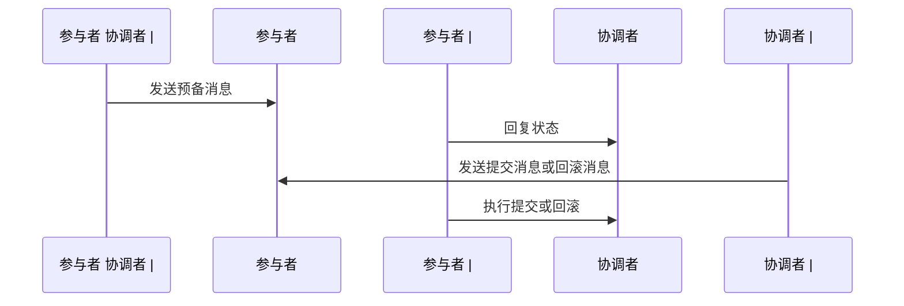
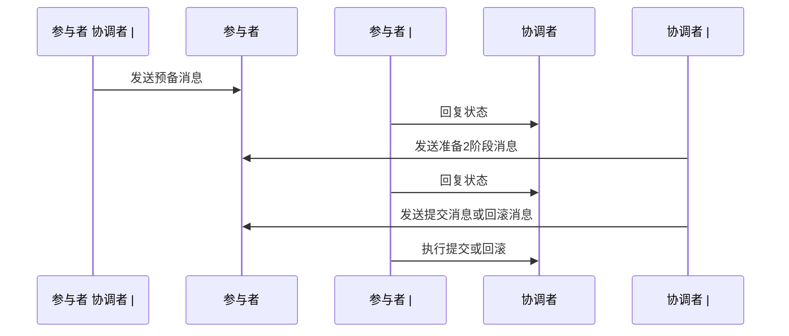
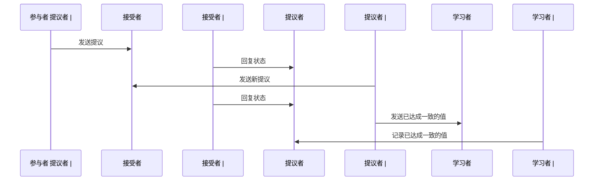
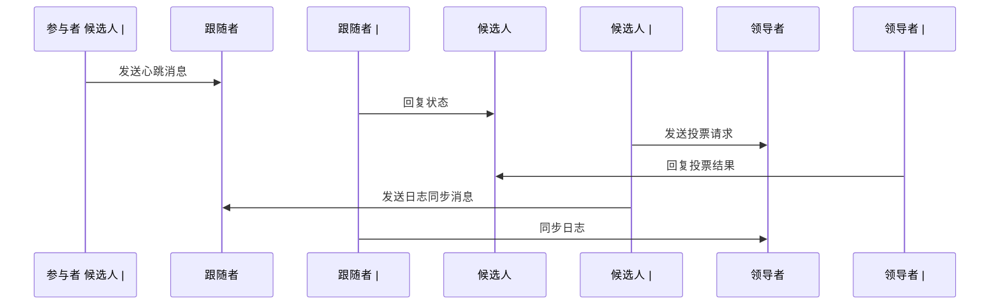

                 

### 文章标题

#### 分布式事务原理

### 关键词

分布式系统、事务、ACID原则、二阶段提交、三阶段提交、Paxos算法、Raft算法、数学模型、系统架构、项目实战

### 摘要

分布式事务是现代分布式系统中至关重要的一环，它保证了数据的一致性和可靠性。本文将深入探讨分布式事务的原理，包括其背景、核心概念、实现原理、数学模型以及系统架构。通过详细的实例分析和项目实战，我们将帮助你全面理解分布式事务的各个方面，从而在实际开发中应用这些原理，提升系统的稳定性和性能。

## 分布式系统概述

### 1.1 分布式系统的基本原理

分布式系统是指由多个相互独立的计算机节点组成，通过网络相互连接，共同协作完成计算任务的系统。这些节点可以位于同一地理位置，也可以分布在不同的地理位置。分布式系统的基本原理包括：

- **节点通信**：节点之间通过消息传递机制进行通信，可以实现数据的交换和任务的协调。
- **资源共享**：分布式系统中的节点可以共享资源，如存储、计算能力等，从而提高系统的整体性能。
- **容错性**：通过将任务分布在多个节点上，分布式系统可以在节点故障时保持正常运行，提高了系统的可用性。

### 1.2 分布式系统的挑战

尽管分布式系统具有许多优势，但同时也面临一系列挑战：

- **一致性**：在分布式系统中，节点可能由于网络延迟、节点故障等原因导致数据不一致，如何保证数据一致性是一个重要问题。
- **可用性**：在分布式系统中，如何确保当部分节点发生故障时，系统能够继续正常运行，这也是一个重要挑战。
- **性能**：如何优化分布式系统的性能，使其在多个节点上高效运行，是另一个关键问题。

### 1.3 分布式事务的概念

分布式事务是指在分布式系统中，对多个节点上的数据进行统一操作的过程。分布式事务的目的是确保在多个节点上的数据操作要么全部成功，要么全部失败，从而保证数据的一致性。分布式事务的基本概念包括：

- **全局事务**：全局事务是指跨多个节点的事务，涉及到对多个节点上的数据进行统一操作。
- **局部事务**：局部事务是指单个节点上的事务，只涉及到单个节点的数据操作。
- **全局一致性**：全局一致性是指分布式事务在多个节点上达到一致状态，确保数据的一致性。

## 分布式事务的核心概念与联系

### 2.1 事务的基本概念

事务（Transaction）是数据库管理系统中的一个重要概念，它是一系列操作的集合，这些操作要么全部执行，要么全部不执行。事务的基本概念包括：

- **原子性**：原子性是指事务的操作要么全部执行，要么全部不执行，中间状态不能存在。如果事务中的任何一步操作失败，整个事务都会回滚到初始状态。
- **一致性**：一致性是指事务执行后，数据库的状态从一种一致状态转变为另一种一致状态。在分布式事务中，一致性确保多个节点上的数据保持一致。
- **隔离性**：隔离性是指事务的执行互不干扰，一个事务不会看到另一个事务的中间状态。在分布式事务中，隔离性确保多个事务的并发执行不会互相影响。
- **持久性**：持久性是指事务一旦提交，其操作结果将永久保存，即使系统发生故障也不会丢失。

### 2.2 ACID原则的详细解读

ACID原则是分布式事务中确保数据一致性的关键，包括：

- **原子性（Atomicity）**：原子性确保事务的操作要么全部执行，要么全部不执行。在分布式事务中，原子性通过两阶段提交协议等机制实现。
- **一致性（Consistency）**：一致性确保事务执行后，数据库的状态从一种一致状态转变为另一种一致状态。在分布式事务中，一致性通过分布式锁、版本控制等机制实现。
- **隔离性（Isolation）**：隔离性确保事务的执行互不干扰，一个事务不会看到另一个事务的中间状态。在分布式事务中，隔离性通过事务隔离级别、锁机制等实现。
- **持久性（Durability）**：持久性确保事务一旦提交，其操作结果将永久保存，即使系统发生故障也不会丢失。在分布式事务中，持久性通过日志记录、数据复制等机制实现。

### 2.3 分布式事务的属性对比表格

| 属性 | 分布式事务 | 单机事务 |
| --- | --- | --- |
| **原子性** | 确保事务操作要么全部执行，要么全部不执行 | 确保事务操作要么全部执行，要么全部不执行 |
| **一致性** | 确保多个节点上的数据保持一致 | 确保数据库状态保持一致 |
| **隔离性** | 确保事务的执行互不干扰，避免并发冲突 | 确保事务的执行互不干扰，避免并发冲突 |
| **持久性** | 确保事务提交后，数据永久保存 | 确保事务提交后，数据永久保存 |

### 2.4 分布式事务的ER实体关系图

```mermaid
erDiagram
A ||--o B : "包含"
A ||--|{ C } : "关联"
B ||--|{ D } : "包含"
C o--|{ E } : "关联"
```

在这个ER实体关系图中，A表示事务，B表示节点，C表示数据，D表示日志，E表示结果。事务包含节点，节点包含数据，节点通过日志记录事务执行过程，最终生成结果。

## 分布式事务的实现原理

### 2.5 二阶段提交协议

二阶段提交（2PC，Two-Phase Commit）协议是分布式事务的一种实现方式，主要用于确保多个节点上的数据一致性。二阶段提交协议分为两个阶段：

- **准备阶段**：协调者向所有参与者发送预备消息，询问是否可以执行事务。参与者根据自身状态，回复“可以执行”或“无法执行”。
- **提交阶段**：协调者根据参与者的回复，决定是否提交事务。如果所有参与者都回复“可以执行”，协调者向所有参与者发送提交消息，事务提交成功；否则，协调者向所有参与者发送回滚消息，事务回滚。

二阶段提交协议的Mermaid流程图如下：



### 2.6 三阶段提交协议

三阶段提交（3PC，Three-Phase Commit）协议是二阶段提交协议的改进版本，进一步提高了分布式事务的可用性和性能。三阶段提交协议分为三个阶段：

- **准备阶段**：协调者向所有参与者发送预备消息，询问是否可以执行事务。参与者根据自身状态，回复“可以执行”或“无法执行”。
- **准备2阶段**：协调者根据参与者的回复，决定是否继续执行事务。如果所有参与者都回复“可以执行”，协调者向所有参与者发送准备2阶段消息。
- **提交阶段**：协调者根据参与者的回复，决定是否提交事务。如果所有参与者都回复“可以执行”，协调者向所有参与者发送提交消息，事务提交成功；否则，协调者向所有参与者发送回滚消息，事务回滚。

三阶段提交协议的Mermaid流程图如下：



### 2.7 Paxos算法

Paxos算法是一种分布式一致性算法，主要用于解决分布式系统中多个节点之间的数据一致性问题。Paxos算法的核心思想是通过选举机制，在多个节点之间达成一致意见。Paxos算法包括以下角色：

- **提议者（Proposer）**：发起提议，提出需要达成的值。
- **接受者（Acceptor）**：接收提议，并决定是否接受提议。
- **学习者（Learner）**：记录已达成一致的值。

Paxos算法的Mermaid流程图如下：



### 2.8 Raft算法

Raft算法是一种基于Paxos算法的分布式一致性算法，相比Paxos算法，Raft算法更容易理解和实现。Raft算法的核心思想是通过领导者选举和日志复制，实现分布式系统中多个节点之间的数据一致性。Raft算法包括以下角色：

- **领导者（Leader）**：负责发起提议、处理客户端请求、同步日志。
- **跟随者（Follower）**：接收领导者发送的日志，并同步到本地。
- **候选人（Candidate）**：参与领导者选举。

Raft算法的Mermaid流程图如下：



### 2.9 分布式事务的算法原理与Mermaid流程图

分布式事务的算法原理主要包括二阶段提交协议、三阶段提交协议、Paxos算法和Raft算法。以下是这些算法的Mermaid流程图：

#### 二阶段提交协议


#### 三阶段提交协议


#### Paxos算法


#### Raft算法


### 2.10 事务执行的数学模型

在分布式事务中，事务执行的数学模型用于描述事务的状态变化和一致性保证。以下是事务执行的数学模型：

$$
状态 = [S_0, S_1, S_2, \ldots]
$$

其中，$S_0$表示事务的初始状态，$S_1$表示事务执行后的中间状态，$S_2$表示事务提交后的最终状态。

事务执行过程中的状态变化可以通过以下公式描述：

$$
S_{i+1} = f(S_i, 操作)
$$

其中，$f$表示状态转换函数，$操作$表示事务执行的操作。

### 2.11 事务的一致性保证

在分布式事务中，事务的一致性保证是通过一致性协议和算法实现的。以下是一些一致性保证的方法：

- **两阶段提交协议**：通过协调者和参与者的协作，确保事务要么全部提交，要么全部回滚，从而保证一致性。
- **三阶段提交协议**：在两阶段提交协议的基础上，增加了准备2阶段，进一步提高了一致性保证。
- **Paxos算法**：通过提议者、接受者和学习者的协作，确保多个节点之间达成一致意见，从而保证一致性。
- **Raft算法**：通过领导者、跟随者和候选人的协作，实现日志复制和一致性保证。

### 2.12 分布式事务的数学公式

在分布式事务中，数学公式用于描述事务的状态变化和一致性保证。以下是一些常用的数学公式：

$$
一致性 = f(状态_1, 状态_2)
$$

其中，$f$表示一致性函数，$状态_1$和$状态_2$分别表示两个状态。

$$
一致性 = \prod_{i=1}^{n} f(S_i)
$$

其中，$n$表示状态的数量，$f(S_i)$表示第$i$个状态的一致性。

### 2.13 数学公式的详细讲解与举例说明

以下是数学公式的详细讲解与举例说明：

#### 一致性函数

一致性函数用于判断两个状态是否一致。以下是一个简单的一致性函数示例：

$$
一致性(S_1, S_2) = \begin{cases}
1, & \text{如果} S_1 = S_2 \\
0, & \text{如果} S_1 \neq S_2
\end{cases}
$$

#### 一致性保证

一致性保证是指通过一致性函数判断事务的状态是否一致。以下是一个一致性保证的示例：

$$
一致性(S_1, S_2) = 1 \Rightarrow 事务提交成功
$$

$$
一致性(S_1, S_2) = 0 \Rightarrow 事务回滚
$$

### 2.14 系统功能设计(领域模型类图)

在分布式事务系统中，领域模型类图用于描述系统中的实体及其关系。以下是一个分布式事务系统的领域模型类图示例：

```mermaid
classDiagram
ClassA <|-- ClassB
ClassB o-- ClassC
ClassC <|-- ClassD
ClassA [+int attribute]
ClassB [+int attribute]
ClassC [+int attribute]
ClassD [+int attribute]
```

在这个类图中，ClassA、ClassB、ClassC和ClassD分别表示事务、节点、数据和日志。它们之间的关系是继承关系和关联关系。

### 2.15 系统架构设计(架构图)

在分布式事务系统中，系统架构设计用于描述系统的整体结构。以下是一个分布式事务系统的架构图示例：

```mermaid
sequenceDiagram
参与者 事务管理器 |->> 节点1: 发送事务请求
节点1 -->|处理事务|> 节点2
节点2 -->|处理事务|> 节点3
节点3 -->|处理事务|> 事务管理器
事务管理器 -->|返回结果|> 客户端
```

在这个架构图中，事务管理器负责协调分布式事务的执行，节点1、节点2和节点3分别表示分布式系统中的节点。

### 2.16 系统接口设计

在分布式事务系统中，系统接口设计用于描述系统与外部系统的交互接口。以下是一个分布式事务系统的接口设计示例：

```python
class DistributedTransaction:
    def initiate_transaction(self, transaction_data):
        # 初始化事务
        pass
    
    def prepare_commit(self):
        # 准备提交
        pass
    
    def commit(self):
        # 提交事务
        pass
    
    def rollback(self):
        # 回滚事务
        pass
```

在这个接口设计中，DistributedTransaction类表示分布式事务的接口，initiate_transaction、prepare_commit、commit和rollback方法分别表示初始化事务、准备提交、提交事务和回滚事务。

### 2.17 系统交互(序列图)

在分布式事务系统中，系统交互序列图用于描述系统内部各个组件之间的交互过程。以下是一个分布式事务系统的交互序列图示例：

```mermaid
sequenceDiagram
参与者 客户端 |->> 事务管理器: 发起事务
事务管理器 -->|分配节点|> 节点1
节点1 -->|处理事务|> 节点2
节点2 -->|处理事务|> 节点3
节点3 -->|提交结果|> 事务管理器
事务管理器 -->|返回结果|> 客户端
```

在这个交互序列图中，客户端发起事务请求，事务管理器分配节点，节点处理事务，最后将结果返回给事务管理器，事务管理器将结果返回给客户端。

## 分布式事务项目实战

### 3.1 项目环境安装与配置

在分布式事务项目中，首先需要搭建项目环境。以下是安装和配置分布式事务环境的基本步骤：

#### 1. 安装Java环境

```bash
# 安装OpenJDK 11
sudo apt-get update
sudo apt-get install openjdk-11-jdk
```

#### 2. 安装分布式事务框架

以Apache Kafka为例，以下是安装步骤：

```bash
# 安装Zookeeper
sudo apt-get install zookeeperd

# 安装Kafka
sudo apt-get install kafka_2.12
```

#### 3. 配置分布式事务框架

配置Kafka的配置文件`kafka-server.properties`，设置如下：

```properties
# Zookeeper连接地址
zookeeper.connect=localhost:2181

# Kafka broker ID
broker.id=0

# Kafka日志存储路径
log.dirs=/path/to/logs

# Kafka端口
port=9092
```

#### 4. 启动分布式事务框架

启动Zookeeper和Kafka：

```bash
# 启动Zookeeper
sudo zkServer.sh start

# 启动Kafka
bin/kafka-server-start.sh config/server.properties
```

### 3.2 分布式事务核心实现源代码解析

在分布式事务项目中，核心实现源代码是关键部分。以下是分布式事务核心实现源代码的解析：

#### 1. 代码结构与设计模式

分布式事务的核心实现通常采用设计模式，如命令模式、工厂模式等。以下是代码结构示例：

```python
class Command:
    def execute(self):
        pass

class CommitCommand(Command):
    def execute(self):
        # 提交事务
        pass

class RollbackCommand(Command):
    def execute(self):
        # 回滚事务
        pass

class TransactionManager:
    def __init__(self):
        self.commands = []

    def initiate_transaction(self, command):
        self.commands.append(command)

    def execute_commands(self):
        for command in self.commands:
            command.execute()
```

在这个示例中，Command类表示命令接口，CommitCommand和RollbackCommand类分别表示提交事务和回滚事务的命令实现，TransactionManager类负责管理事务执行。

#### 2. 代码关键部分的解读

以下是分布式事务核心实现代码的关键部分：

```python
class CommitCommand(Command):
    def execute(self):
        # 提交事务
        for participant in self.participants:
            participant.commit()

    def rollback(self):
        # 回滚事务
        for participant in self.participants:
            participant.rollback()

class RollbackCommand(Command):
    def execute(self):
        # 回滚事务
        for participant in self.participants:
            participant.rollback()

    def commit(self):
        # 提交事务
        pass
```

在这个示例中，CommitCommand和RollbackCommand类实现了执行提交和回滚事务的核心逻辑。每个命令类都维护了一个参与者列表，用于存储需要执行事务的节点。

#### 3. 分布式事务的实现细节

以下是分布式事务实现细节的示例：

```python
class Participant:
    def commit(self):
        # 执行提交操作
        print("Committing participant")

    def rollback(self):
        # 执行回滚操作
        print("Rolling back participant")
```

在这个示例中，Participant类表示分布式事务的参与者，commit和rollback方法分别用于执行提交和回滚操作。

### 3.3 实际案例分析与讲解

#### 1. 案例背景介绍

假设有一个电商平台，需要处理订单事务。订单事务涉及到库存管理、订单生成和支付处理等多个节点。

#### 2. 案例分析

在订单事务中，我们需要确保以下操作：

- 减少库存
- 生成订单
- 处理支付

如果其中一个操作失败，整个事务需要回滚，以保证数据一致性。

#### 3. 案例详细讲解

以下是一个订单事务的详细讲解：

```python
class OrderTransaction(TransactionManager):
    def __init__(self, inventory, order, payment):
        super().__init__()
        self.inventory = inventory
        self.order = order
        self.payment = payment

    def execute(self):
        self.initiate_transaction(CommitCommand(self.inventory, self.order, self.payment))
        self.execute_commands()
```

在这个示例中，OrderTransaction类继承自TransactionManager类，用于处理订单事务。execute方法初始化事务，并执行提交命令。

```python
class Inventory:
    def commit(self):
        # 执行库存提交操作
        print("Committing inventory")

    def rollback(self):
        # 执行库存回滚操作
        print("Rolling back inventory")
```

在这个示例中，Inventory类表示库存管理节点，commit和rollback方法分别用于执行库存提交和回滚操作。

```python
class Order:
    def commit(self):
        # 执行订单提交操作
        print("Committing order")

    def rollback(self):
        # 执行订单回滚操作
        print("Rolling back order")
```

在这个示例中，Order类表示订单生成节点，commit和rollback方法分别用于执行订单提交和回滚操作。

```python
class Payment:
    def commit(self):
        # 执行支付提交操作
        print("Committing payment")

    def rollback(self):
        # 执行支付回滚操作
        print("Rolling back payment")
```

在这个示例中，Payment类表示支付处理节点，commit和rollback方法分别用于执行支付提交和回滚操作。

### 3.4 项目小结

在分布式事务项目中，我们需要关注以下几个方面：

- **事务管理**：合理设计事务管理类，确保事务的原子性、一致性、隔离性和持久性。
- **节点实现**：根据业务需求，实现各个节点的commit和rollback方法，确保节点能够正确执行提交和回滚操作。
- **错误处理**：在分布式事务中，可能存在网络延迟、节点故障等问题，需要设计合理的错误处理机制，确保事务能够正确执行。

通过以上项目小结，我们可以更好地理解分布式事务的实现原理和项目实战，为实际开发中的分布式事务提供参考。

### 3.5 最佳实践 Tips

在分布式事务项目中，以下是一些最佳实践：

- **设计合理的架构**：根据业务需求，选择合适的分布式事务框架和架构设计。
- **优化节点性能**：合理分配节点资源，优化节点性能，提高系统整体性能。
- **错误处理**：设计合理的错误处理机制，确保分布式事务能够正确执行。
- **日志记录**：在分布式事务中，合理记录日志，便于问题排查和故障恢复。
- **监控与报警**：实时监控分布式事务的执行情况，设置合理的报警阈值，确保系统稳定运行。

通过以上最佳实践，我们可以更好地应对分布式事务项目中的各种挑战，提高系统的稳定性和性能。

