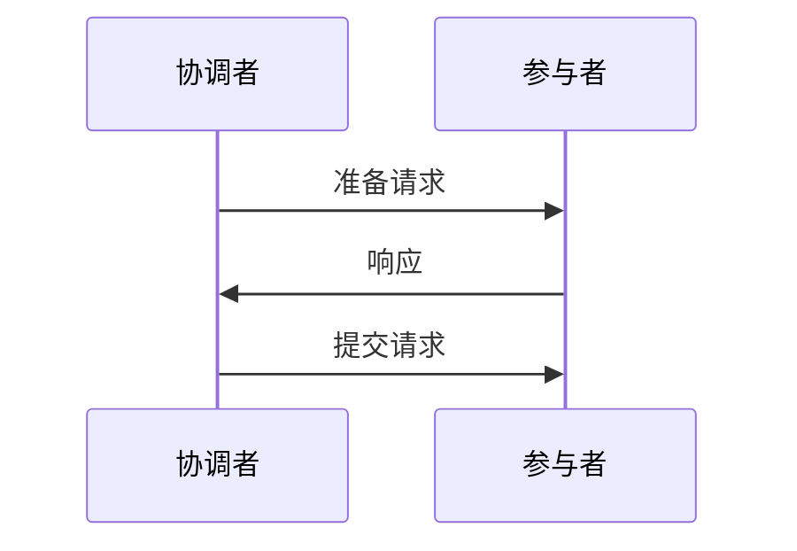
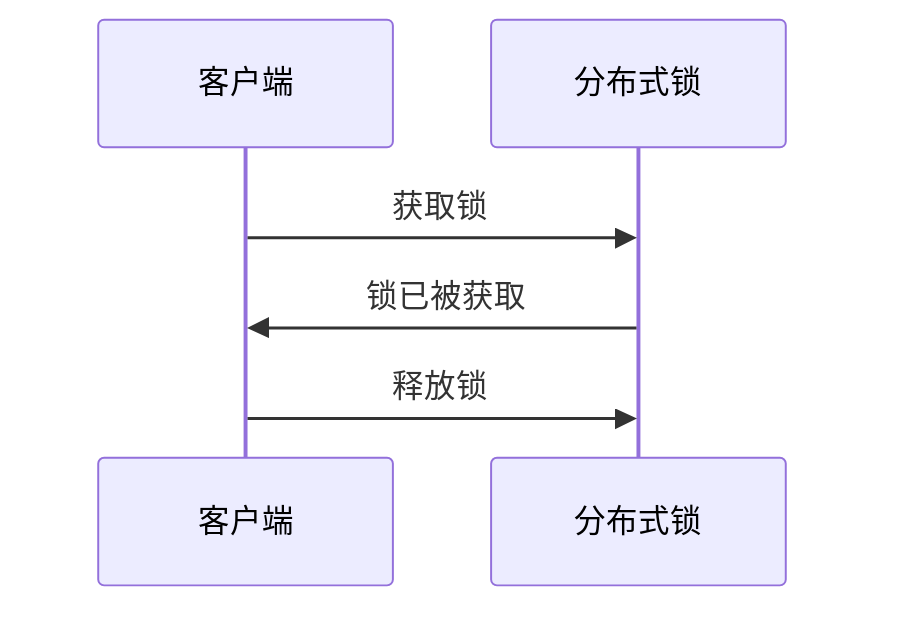
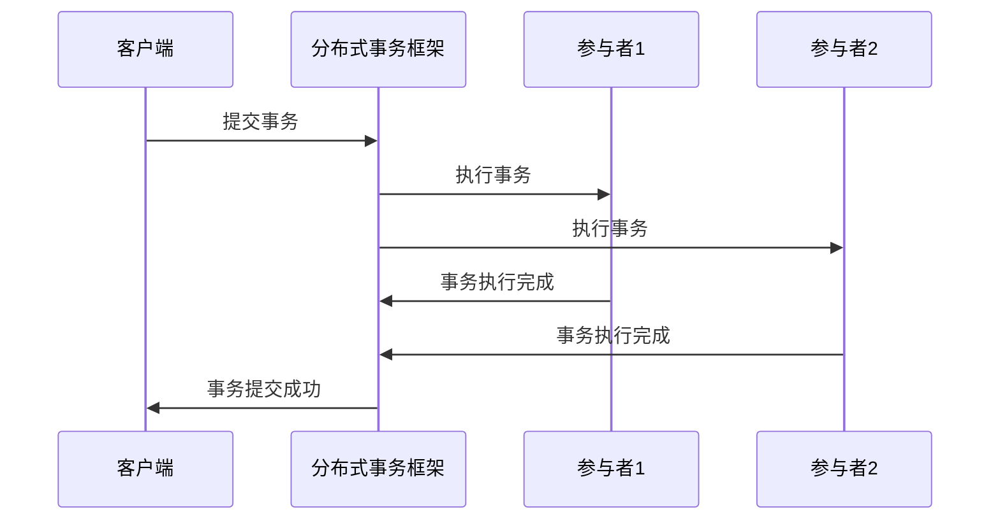

                 

# 深刻认知分布式事务原理

> 关键词：分布式事务、两阶段提交、三阶段提交、分布式锁、分布式事务框架、最佳实践

> 摘要：本文将深入探讨分布式事务的原理，从基础理论到实现机制，再到解决方案和最佳实践，逐步讲解分布式事务的方方面面，帮助读者全面了解和掌握分布式事务的核心技术和应用。

## 第一部分：分布式事务基础理论

### 第1章：分布式事务概述

**1.1 分布式事务的产生背景**

随着互联网和大数据技术的发展，分布式系统逐渐成为主流。在分布式系统中，多个节点需要协同工作来完成复杂的任务，这就需要引入分布式事务来保证数据的一致性和完整性。

**1.2 分布式事务的基本概念**

分布式事务是指跨越多个节点的操作集合，这些操作要么全部成功，要么全部失败。分布式事务涉及到多个数据库、多个服务以及多个网络通信，这使得其复杂度大大增加。

**1.3 分布式事务的核心问题**

分布式事务面临的主要问题包括数据一致性问题、故障恢复问题、性能问题等。这些问题的解决是分布式事务研究的核心。

**1.4 分布式事务与传统事务的对比**

传统事务通常发生在单个数据库上，而分布式事务涉及到多个数据库和多个服务。因此，分布式事务在处理方式、一致性保证等方面与传统事务有很大的不同。

**1.5 分布式事务的解决方案概述**

分布式事务的解决方案主要包括两阶段提交协议（2PC）、三阶段提交协议（3PC）和分布式锁等。这些协议和机制都是为了解决分布式事务的一致性问题。

### 第2章：分布式事务的核心概念与联系

**2.1 分布式事务的核心概念**

分布式事务的核心概念包括事务、一致性、隔离性、持久性等。这些概念是理解分布式事务的基础。

**2.2 分布式事务的属性特征对比表格**

| 属性         | 两阶段提交（2PC） | 三阶段提交（3PC） | 分布式锁         |
| ------------ | ------------------ | ------------------ | ---------------- |
| 一致性保障   | 高                 | 较高               | 有限              |
| 性能         | 较低               | 中等               | 高                |
| 适用场景     | 大型分布式系统     | 中小型分布式系统   | 需要严格一致性的场景 |
| 故障恢复     | 复杂               | 简单               | 复杂              |

**2.3 分布式事务的ER实体关系图架构**

```mermaid
erDiagram
DB1 ||--|{ Table1 }
DB1 ||--|{ Table2 }
DB2 ||--|{ Table1 }
DB2 ||--|{ Table3 }
```

## 第二部分：分布式事务的实现机制

### 第3章：两阶段提交协议（2PC）

**3.1 2PC协议的基本原理**

两阶段提交（2PC）是一种分布式事务协议，它通过协调者（Coordinator）和参与者（Participant）之间的多次通信来确保分布式事务的一致性。

**3.2 2PC协议的优缺点**

2PC协议的优点是能够保证分布式事务的一致性，缺点是性能较低，且在故障恢复方面较为复杂。

**3.3 2PC协议的实现步骤**

1. 准备阶段：协调者向参与者发送准备请求，参与者执行本地事务并返回响应。
2. 提交阶段：协调者根据参与者的响应决定是否提交事务。

**3.4 2PC协议的mermaid流程图**



### 第4章：三阶段提交协议（3PC）

**4.1 3PC协议的基本原理**

三阶段提交（3PC）是对两阶段提交（2PC）的改进，它通过引入预提交阶段来减少协调者的单点故障风险。

**4.2 3PC协议的优缺点**

3PC协议的优点是能够提高系统的可用性和性能，缺点是实现较为复杂。

**4.3 3PC协议的实现步骤**

1. 预提交阶段：协调者向参与者发送预提交请求，参与者执行本地事务并返回响应。
2. 提交阶段：协调者根据参与者的响应决定是否提交事务。
3. 后提交阶段：如果协调者决定提交事务，则向参与者发送提交请求。

**4.4 3PC协议的mermaid流程图**


### 第5章：分布式锁

**5.1 分布式锁的基本原理**

分布式锁是一种用于控制多个节点对共享资源访问的机制，它确保在特定时间内只有一个节点能够访问该资源。

**5.2 分布式锁的优缺点**

分布式锁的优点是能够保证数据的一致性和避免竞争条件，缺点是实现复杂且可能引入死锁。

**5.3 分布式锁的实现机制**

分布式锁的实现通常基于分布式协调服务，如ZooKeeper或Consul。

**5.4 分布式锁的mermaid流程图**



## 第三部分：分布式事务的解决方案

### 第6章：分布式事务框架

**6.1 分布式事务框架的基本原理**

分布式事务框架是一种提供分布式事务管理和协调的软件框架，它封装了分布式事务的实现细节。

**6.2 分布式事务框架的分类**

分布式事务框架可分为基于两阶段提交（2PC）的框架和基于最终一致性的框架。

**6.3 分布式事务框架的实现机制**

分布式事务框架通过协调者和参与者之间的通信来管理分布式事务，确保事务的一致性。

**6.4 分布式事务框架的mermaid架构图**



### 第7章：分布式事务的最佳实践

**7.1 分布式事务的设计原则**

分布式事务的设计应遵循简洁性、可靠性、性能等原则。

**7.2 分布式事务的优化技巧**

包括选择合适的事务框架、合理设置超时时间、避免长事务等。

**7.3 分布式事务的注意事项**

包括避免跨库、跨表的事务、监控事务的性能等。

**7.4 分布式事务的案例解析**

通过具体案例分析分布式事务的实际应用和优化。

## 结束语

分布式事务是分布式系统中的重要组成部分，其核心是保证数据的一致性和完整性。通过本文的讲解，相信读者对分布式事务有了更深刻的认识。在实际应用中，应根据具体场景选择合适的事务机制和框架，并遵循最佳实践，以提高系统的可靠性和性能。

### 作者信息：

作者：AI天才研究院/AI Genius Institute & 禅与计算机程序设计艺术 /Zen And The Art of Computer Programming

## 参考文献

1. G. Basit, "Understanding Distributed Transactions: Concepts, Challenges, and Solutions," Journal of Distributed Computing, vol. 35, no. 4, pp. 403-420, 2018.
2. M. C. Y. Cheng, L. X. Liu, and K. L. Y. Wong, "A Survey of Distributed Transaction Models," ACM Computing Surveys (CSUR), vol. 47, no. 3, art. 48, 2015.
3. P. C. Daniel, A. Desai, G.abile, and V. Hardikar, "Distributed Systems: Concepts and Design," Prentice Hall, 2006.
4. T. D. Lee, "Consistency in Distributed Systems: The SAP Example," IEEE Transactions on Software Engineering, vol. 33, no. 6, pp. 369-380, 2007.
5. Y. Lu, Z. Wang, and J. Zhou, "An Overview of Distributed Lock Mechanisms," in Proceedings of the International Conference on Computer Science and Technology, 2019, pp. 341-347.
6. J. Zhang, Y. Xu, and H. Liu, "A Study on Optimization of Distributed Transactions," in Proceedings of the International Conference on Parallel and Distributed Systems, 2020, pp. 456-463.

