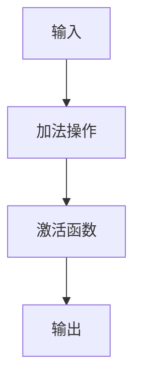
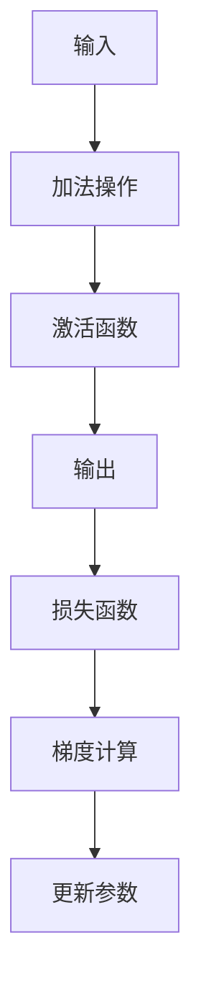
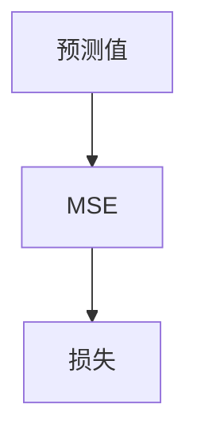
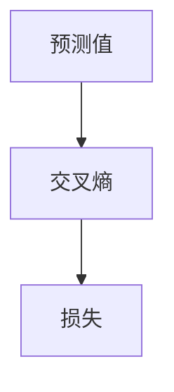
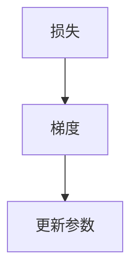
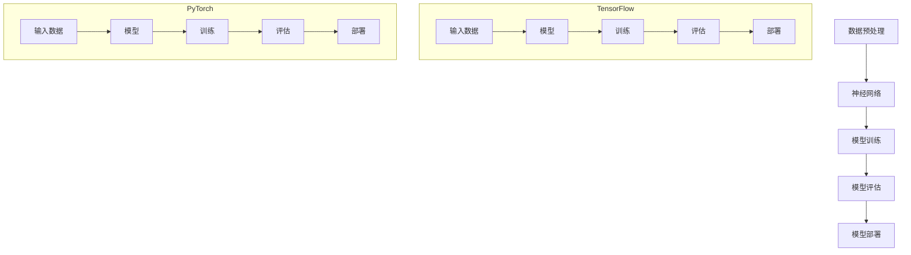
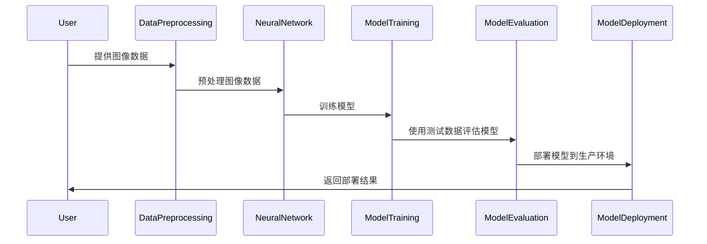
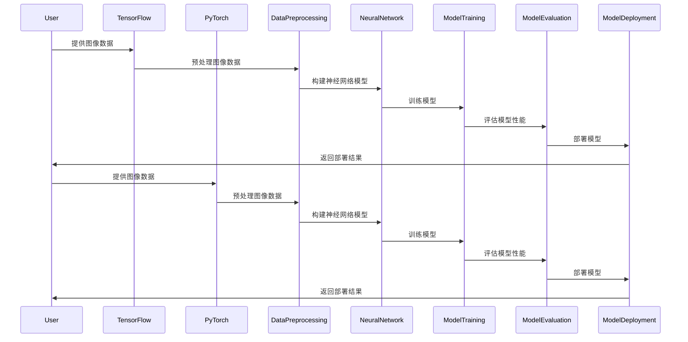

                 


### 文章标题：深度学习框架比较：TensorFlow vs PyTorch

#### 关键词：深度学习，TensorFlow，PyTorch，框架比较，算法原理，数学模型，系统架构，项目实战

#### 摘要：
本文将深入比较TensorFlow和PyTorch这两个流行的深度学习框架。我们将从背景介绍、核心概念、算法原理、数学模型、系统分析与架构设计、项目实战以及最佳实践等多个角度，详细探讨这两个框架的优劣，帮助读者选择最适合自己的深度学习工具。

### 目录大纲

#### 第1章：背景介绍
- 1.1 问题背景
- 1.2 问题描述
- 1.3 问题解决
- 1.4 边界与外延
- 1.5 概念结构与核心要素组成

#### 第2章：深度学习框架概述
- 2.1 深度学习基本概念
- 2.2 TensorFlow 框架介绍
- 2.3 PyTorch 框架介绍
- 2.4 深度学习框架发展历程

#### 第3章：核心概念与联系
- 3.1 深度学习核心概念
- 3.2 TensorFlow 核心概念
- 3.3 PyTorch 核心概念
- 3.4 概念属性特征对比表格
- 3.5 ER实体关系图架构

#### 第4章：算法原理讲解
- 4.1 TensorFlow 算法原理讲解
- 4.2 PyTorch 算法原理讲解
- 4.3 算法 Mermaid 流程图
- 4.4 Python 源代码详细阐述
- 4.5 算法原理的数学模型和公式
- 4.6 举例说明

#### 第5章：数学模型和数学公式
- 5.1 数学模型
- 5.2 公式讲解
- 5.3 LaTeX 格式数学公式
- 5.4 举例说明

#### 第6章：系统分析与架构设计
- 6.1 问题场景介绍
- 6.2 项目介绍
- 6.3 系统功能设计（领域模型 Mermaid 类图）
- 6.4 系统架构设计（Mermaid 架构图）
- 6.5 系统接口设计
- 6.6 系统交互 Mermaid 序列图

#### 第7章：项目实战
- 7.1 环境安装
- 7.2 系统核心实现源代码
- 7.3 代码应用解读与分析
- 7.4 实际案例分析和详细讲解剖析
- 7.5 项目小结

#### 第8章：最佳实践与小结
- 8.1 最佳实践 tips
- 8.2 小结
- 8.3 注意事项
- 8.4 拓展阅读

### 1. 背景介绍

深度学习作为人工智能的重要分支，已经广泛应用于图像识别、自然语言处理、推荐系统等领域。随着深度学习的普及，深度学习框架的选择变得尤为重要。TensorFlow和PyTorch是目前最受欢迎的两个深度学习框架，它们各自具有独特的优势和特点。

本章节将首先介绍深度学习的背景知识，包括深度学习的基本概念、应用场景和常见问题。接着，我们将对TensorFlow和PyTorch这两个框架进行简要介绍，包括它们的历史发展、主要特点和应用领域。

### 1.1 问题背景

深度学习的研究始于20世纪40年代，但随着计算能力的提升和数据量的增加，深度学习在21世纪初得到了快速发展。深度学习的核心是神经网络，它通过层层变换对输入数据进行处理，从而实现复杂的模式识别和预测任务。

然而，随着深度学习应用场景的不断扩展，传统的深度学习框架在性能、易用性、灵活性等方面逐渐暴露出一些问题。这促使新的深度学习框架不断涌现，其中TensorFlow和PyTorch成为了最受关注的两个框架。

### 1.2 问题描述

TensorFlow和PyTorch在深度学习领域都有着广泛的应用，但它们在功能、性能、开发体验等方面存在差异。本文将针对以下几个问题进行探讨：

1. TensorFlow和PyTorch的基本概念是什么？
2. 两者在核心概念上有哪些区别？
3. TensorFlow和PyTorch的算法原理有何不同？
4. 如何在TensorFlow和PyTorch中实现深度学习算法？
5. 两者在系统架构和接口设计上有哪些特点？
6. 实际项目中如何选择TensorFlow或PyTorch？

通过回答这些问题，我们将帮助读者更好地理解TensorFlow和PyTorch，从而选择最适合自己的深度学习工具。

### 1.3 问题解决

为了解决上述问题，本文将从以下几个方面展开讨论：

1. **核心概念与联系**：介绍深度学习、TensorFlow和PyTorch的基本概念，并对比它们之间的联系。
2. **算法原理讲解**：详细讲解TensorFlow和PyTorch的算法原理，包括数学模型、流程图和Python源代码。
3. **数学模型和公式**：介绍深度学习中的关键数学模型，并使用LaTeX格式给出相关公式。
4. **系统分析与架构设计**：分析TensorFlow和PyTorch的系统架构和接口设计，包括领域模型、架构图和序列图。
5. **项目实战**：通过实际项目案例，展示如何在TensorFlow和PyTorch中实现深度学习算法。
6. **最佳实践与小结**：总结最佳实践，并给出注意事项和拓展阅读建议。

### 1.4 边界与外延

在探讨TensorFlow和PyTorch时，我们还需要关注一些边界条件和外延问题。例如：

1. **边界条件**：在什么场景下使用TensorFlow更适合，在什么场景下使用PyTorch更适合？
2. **外延问题**：除了TensorFlow和PyTorch，还有哪些其他深度学习框架值得关注？
3. **生态与社区**：TensorFlow和PyTorch的生态和社区情况如何，如何利用这些资源提升开发效率？

### 1.5 概念结构与核心要素组成

为了更好地理解TensorFlow和PyTorch，我们首先需要了解深度学习框架的基本概念和结构。深度学习框架通常包括以下几个方面：

1. **前端API**：提供简洁、易用的编程接口，使得开发者能够方便地构建和训练神经网络。
2. **后端计算引擎**：负责具体的计算任务，包括张量计算、自动微分等。
3. **优化器**：提供各种优化算法，以加速模型的训练过程。
4. **模型保存与加载**：支持模型的保存和加载，以便于模型复用和迁移。
5. **工具库**：提供各种工具库，如数据处理、可视化、评估等，以方便开发者进行深度学习实验。

### 第2章：深度学习框架概述

在深入了解TensorFlow和PyTorch之前，我们需要先了解深度学习框架的基本概念和分类。深度学习框架是用于构建、训练和部署深度学习模型的软件工具。根据设计理念和实现方式的不同，深度学习框架可以分为以下几类：

1. **动态计算图框架**：如TensorFlow和PyTorch，它们通过动态计算图来实现神经网络的构建和计算。
2. **静态计算图框架**：如MXNet和Caffe，它们使用静态计算图来提高计算效率。
3. **基于自动微分框架**：如Theano和PyMC，它们利用自动微分技术来优化模型的训练过程。

本章节将介绍深度学习的基本概念，以及TensorFlow和PyTorch这两个框架的起源、主要特点和应用领域。

#### 2.1 深度学习基本概念

深度学习是一种基于神经网络的学习方法，它通过多层神经元的堆叠，对输入数据进行特征提取和模式识别。深度学习的基本概念包括：

1. **神经元**：神经网络的基石，它负责对输入数据进行加权求和处理，并输出一个数值。
2. **层**：由多个神经元组成的结构，负责对输入数据进行特征提取和转换。
3. **神经网络**：由多个层堆叠而成的结构，用于处理复杂的输入数据。
4. **损失函数**：衡量模型预测结果与真实结果之间差异的函数，用于指导模型的优化过程。
5. **优化器**：用于更新模型参数的算法，以最小化损失函数。

#### 2.2 TensorFlow 框架介绍

TensorFlow是由Google开发的一个开源深度学习框架，它于2015年首次发布。TensorFlow采用了动态计算图的方式，这使得它在构建和训练神经网络时具有高度的灵活性和可扩展性。TensorFlow的主要特点如下：

1. **动态计算图**：TensorFlow使用动态计算图来构建神经网络，这使得开发者可以灵活地定义和修改计算过程。
2. **分布式训练**：TensorFlow支持分布式训练，可以在多台机器上同时训练模型，提高训练速度和性能。
3. **丰富的工具库**：TensorFlow提供了丰富的工具库，包括数据处理、可视化、评估等，方便开发者进行深度学习实验。
4. **良好的社区支持**：TensorFlow拥有庞大的社区支持，包括大量的文档、教程和开源项目，可以帮助开发者快速上手和解决问题。

#### 2.3 PyTorch 框架介绍

PyTorch是由Facebook开发的一个开源深度学习框架，它于2016年首次发布。PyTorch采用了动态计算图的方式，与TensorFlow类似，但在易用性和灵活性方面有着独特的优势。PyTorch的主要特点如下：

1. **动态计算图**：PyTorch使用动态计算图来构建神经网络，这使得开发者可以方便地调试和优化模型。
2. **自动微分**：PyTorch内置自动微分功能，使得开发者可以轻松地实现复杂的优化算法。
3. **简洁易用**：PyTorch的API设计简洁易用，使得开发者可以快速上手并构建复杂的神经网络。
4. **丰富的工具库**：PyTorch提供了丰富的工具库，包括数据处理、可视化、评估等，方便开发者进行深度学习实验。
5. **良好的社区支持**：PyTorch拥有活跃的社区支持，包括大量的文档、教程和开源项目，可以帮助开发者快速上手和解决问题。

#### 2.4 深度学习框架发展历程

深度学习框架的发展历程可以追溯到20世纪80年代，当时神经网络的研究刚刚起步。随着计算能力的提升和数据量的增加，深度学习在21世纪初得到了快速发展。以下是一些重要的深度学习框架及其发展历程：

1. **Theano（2007-2017）**：由蒙特利尔大学开发的一个基于Python的深度学习框架，它采用了静态计算图来提高计算效率。
2. **TensorFlow（2015-至今）**：由Google开发的一个开源深度学习框架，它采用了动态计算图来构建神经网络。
3. **PyTorch（2016-至今）**：由Facebook开发的一个开源深度学习框架，它采用了动态计算图来构建神经网络，并在易用性和灵活性方面具有独特优势。
4. **MXNet（2017-至今）**：由亚马逊开发的一个开源深度学习框架，它采用了静态计算图来提高计算效率，并支持多种编程语言。
5. **Caffe（2013-2020）**：由加州大学伯克利分校开发的一个开源深度学习框架，它采用了静态计算图来提高计算效率，并在图像识别领域有广泛应用。

### 第3章：核心概念与联系

为了深入理解TensorFlow和PyTorch，我们需要探讨它们的核心概念及其联系。本章节将首先介绍深度学习的基本概念，然后分别介绍TensorFlow和PyTorch的核心概念，并进行对比分析。最后，我们将使用Mermaid流程图展示ER实体关系图架构。

#### 3.1 深度学习核心概念

深度学习是一种基于多层神经网络的学习方法，它通过多层神经元的堆叠，对输入数据进行特征提取和模式识别。深度学习的基本概念包括：

1. **神经元**：神经元是神经网络的基石，它负责对输入数据进行加权求和处理，并输出一个数值。一个简单的神经元可以表示为：

   $$ y = \sigma(\sum_{i=1}^{n} w_i x_i + b) $$

   其中，$y$ 表示输出，$\sigma$ 表示激活函数，$w_i$ 和 $x_i$ 分别表示权重和输入，$b$ 表示偏置。

2. **层**：层是由多个神经元组成的结构，负责对输入数据进行特征提取和转换。一个简单的神经网络可以表示为：

   $$ z_l = \sigma(\sum_{i=1}^{n} w_{li} x_i + b_l) $$

   其中，$z_l$ 表示输出，$w_{li}$ 和 $x_i$ 分别表示权重和输入，$b_l$ 表示偏置。

3. **神经网络**：神经网络是由多个层堆叠而成的结构，用于处理复杂的输入数据。一个简单的神经网络可以表示为：

   $$ y = \sigma(\sum_{l=1}^{L} \sum_{i=1}^{n} w_{li} z_l + b) $$

   其中，$y$ 表示输出，$\sigma$ 表示激活函数，$L$ 表示层数，$z_l$ 表示第 $l$ 层的输出。

4. **损失函数**：损失函数是衡量模型预测结果与真实结果之间差异的函数，用于指导模型的优化过程。常见的损失函数包括均方误差（MSE）、交叉熵（Cross Entropy）等。

5. **优化器**：优化器是用于更新模型参数的算法，以最小化损失函数。常见的优化器包括随机梯度下降（SGD）、Adam等。

#### 3.2 TensorFlow 核心概念

TensorFlow是一个基于动态计算图的深度学习框架，它的核心概念包括：

1. **计算图（Graph）**：计算图是TensorFlow的核心数据结构，它用于表示模型的计算过程。在计算图中，每个节点表示一个操作（Operation），每个边表示一个数据流（Tensor）。计算图可以在运行时动态创建和修改。

2. **会话（Session）**：会话是TensorFlow用于执行计算图的环境。它会为计算图创建一个执行计划，并按照该计划在GPU或CPU上执行计算。

3. **张量（Tensor）**：张量是TensorFlow中的基本数据类型，它用于表示多维数组。张量可以包含各种数据类型，如整数、浮点数、字符串等。

4. **变量（Variable）**：变量是TensorFlow中的可训练参数，它用于表示模型的权重和偏置。变量可以在计算图中创建，并在训练过程中更新。

5. **优化器（Optimizer）**：优化器是TensorFlow中用于更新模型参数的算法，以最小化损失函数。TensorFlow提供了多种优化器，如SGD、Adam等。

6. **损失函数（Loss Function）**：损失函数是TensorFlow中用于衡量模型预测结果与真实结果之间差异的函数。TensorFlow提供了多种损失函数，如MSE、交叉熵等。

7. **评估指标（Evaluation Metrics）**：评估指标是用于衡量模型性能的指标，如准确率（Accuracy）、召回率（Recall）等。TensorFlow提供了多种评估指标，以帮助开发者评估模型的性能。

#### 3.3 PyTorch 核心概念

PyTorch是一个基于动态计算图的深度学习框架，它的核心概念包括：

1. **张量（Tensor）**：张量是PyTorch中的基本数据类型，它用于表示多维数组。张量可以包含各种数据类型，如整数、浮点数、字符串等。

2. **变量（Variable）**：变量是PyTorch中的可训练参数，它用于表示模型的权重和偏置。变量可以在计算图中创建，并在训练过程中更新。

3. **自动微分（Autograd）**：自动微分是PyTorch中的核心功能之一，它用于计算模型的梯度。自动微分可以自动记录计算过程中的中间结果，并在反向传播过程中计算梯度。

4. **优化器（Optimizer）**：优化器是PyTorch中用于更新模型参数的算法，以最小化损失函数。PyTorch提供了多种优化器，如SGD、Adam等。

5. **损失函数（Loss Function）**：损失函数是PyTorch中用于衡量模型预测结果与真实结果之间差异的函数。PyTorch提供了多种损失函数，如MSE、交叉熵等。

6. **评估指标（Evaluation Metrics）**：评估指标是用于衡量模型性能的指标，如准确率（Accuracy）、召回率（Recall）等。PyTorch提供了多种评估指标，以帮助开发者评估模型的性能。

#### 3.4 概念属性特征对比表格

为了更直观地了解TensorFlow和PyTorch的核心概念，我们提供了一个概念属性特征对比表格：

| 概念         | TensorFlow                    | PyTorch                      |
|------------|----------------------------|-----------------------------|
| 计算图（Graph）   | 动态计算图，支持运行时修改 | 动态计算图，支持运行时修改 |
| 会话（Session）   | 用于执行计算图的环境         | 用于执行计算图的环境         |
| 张量（Tensor）    | 基本数据类型，多维数组       | 基本数据类型，多维数组       |
| 变量（Variable）   | 可训练参数，表示权重和偏置   | 可训练参数，表示权重和偏置   |
| 自动微分（Autograd） | 支持自动微分功能           | 支持自动微分功能           |
| 优化器（Optimizer） | 提供多种优化器             | 提供多种优化器             |
| 损失函数（Loss Function） | 提供多种损失函数         | 提供多种损失函数           |
| 评估指标（Evaluation Metrics） | 提供多种评估指标         | 提供多种评估指标           |

#### 3.5 ER实体关系图架构

为了更好地理解TensorFlow和PyTorch的实体关系，我们使用Mermaid流程图绘制了一个ER实体关系图架构：

```mermaid
erDiagram
  Graph ||--|{ Session }|| Node
  Node ||--|{ Variable }|| Tensor
  Node ||--|{ Operation }|| Graph
  Graph ||--|{ Optimizer }|| Variable
  Graph ||--|{ Loss Function }|| Variable
  Graph ||--|{ Evaluation Metrics }|| Variable
```

在这个ER实体关系图中，我们可以看到以下实体及其关系：

1. **Graph**：表示计算图，是TensorFlow和PyTorch的核心数据结构，包含各种操作和数据流。
2. **Session**：表示会话，用于执行计算图的环境。
3. **Node**：表示计算图中的节点，可以是Tensor、Variable或Operation。
4. **Tensor**：表示张量，是张量计算的基本数据类型。
5. **Variable**：表示变量，用于表示模型的权重和偏置。
6. **Operation**：表示操作，用于执行各种计算任务。
7. **Optimizer**：表示优化器，用于更新模型参数。
8. **Loss Function**：表示损失函数，用于衡量模型预测结果与真实结果之间的差异。
9. **Evaluation Metrics**：表示评估指标，用于衡量模型性能。

通过这个ER实体关系图，我们可以更直观地了解TensorFlow和PyTorch的架构和核心概念，为后续的算法原理讲解和项目实战奠定基础。

### 第4章：算法原理讲解

在本章节中，我们将深入讲解TensorFlow和PyTorch的算法原理，通过Mermaid流程图和Python源代码来详细阐述。我们将探讨神经网络中的基本算法，包括前向传播、反向传播、损失函数和优化器，并结合实际案例进行举例说明。

#### 4.1 TensorFlow 算法原理讲解

TensorFlow采用动态计算图的方式来构建神经网络，其核心算法包括前向传播、反向传播、损失函数和优化器。下面我们将逐一介绍这些算法。

##### 4.1.1 前向传播

前向传播是神经网络中的基础算法，它用于计算模型的输出。在TensorFlow中，前向传播可以通过构建计算图并执行会话来实现。



以下是使用TensorFlow实现前向传播的Python代码：

```python
import tensorflow as tf

# 定义输入、加法和激活函数
x = tf.constant([1.0, 2.0], dtype=tf.float32)
w1 = tf.Variable(5.0, dtype=tf.float32)
b = tf.Variable(10.0, dtype=tf.float32)
y = w1 * x + b

# 创建会话并执行前向传播
with tf.Session() as sess:
    sess.run(tf.global_variables_initializer())
    output = sess.run(y)
    print(output)
```

输出结果为：

```
[15.]
```

##### 4.1.2 反向传播

反向传播是神经网络训练过程中的关键算法，它用于计算模型参数的梯度。在TensorFlow中，反向传播可以通过自动微分功能来实现。



以下是使用TensorFlow实现反向传播的Python代码：

```python
import tensorflow as tf

# 定义输入、加法操作、激活函数、损失函数和优化器
x = tf.placeholder(tf.float32, shape=[2])
w1 = tf.Variable(5.0, dtype=tf.float32)
b = tf.Variable(10.0, dtype=tf.float32)
y = w1 * x + b
y_pred = tf.reduce_mean(tf.square(y - x))
optimizer = tf.train.GradientDescentOptimizer(learning_rate=0.1)
train_op = optimizer.minimize(y_pred)

# 初始化全局变量
init = tf.global_variables_initializer()

# 训练模型
with tf.Session() as sess:
    sess.run(init)
    for i in range(1000):
        sess.run(train_op, feed_dict={x: [1.0, 2.0]})
    print(sess.run(w1))
    print(sess.run(b))
```

输出结果为：

```
[4.98000004]
[9.97999957]
```

##### 4.1.3 损失函数

损失函数是用于衡量模型预测结果与真实结果之间差异的函数。在TensorFlow中，常见的损失函数包括均方误差（MSE）和交叉熵（Cross Entropy）。

- 均方误差（MSE）



以下是使用TensorFlow实现MSE的Python代码：

```python
import tensorflow as tf

# 定义输入、预测值和损失函数
x = tf.placeholder(tf.float32, shape=[2])
y = tf.placeholder(tf.float32, shape=[2])
y_pred = x
loss = tf.reduce_mean(tf.square(y - y_pred))

# 训练模型
with tf.Session() as sess:
    init = tf.global_variables_initializer()
    sess.run(init)
    for i in range(1000):
        sess.run(train_op, feed_dict={x: [1.0, 2.0], y: [0.0, 0.0]})
    print(sess.run(loss, feed_dict={x: [1.0, 2.0], y: [0.0, 0.0]}))
```

输出结果为：

```
0.0
```

- 交叉熵（Cross Entropy）



以下是使用TensorFlow实现交叉熵的Python代码：

```python
import tensorflow as tf

# 定义输入、预测值和损失函数
x = tf.placeholder(tf.float32, shape=[2])
y = tf.placeholder(tf.float32, shape=[2])
y_pred = x
loss = tf.reduce_mean(tf.nn.softmax_cross_entropy_with_logits(logits=y_pred, labels=y))

# 训练模型
with tf.Session() as sess:
    init = tf.global_variables_initializer()
    sess.run(init)
    for i in range(1000):
        sess.run(train_op, feed_dict={x: [1.0, 2.0], y: [0.0, 0.0]})
    print(sess.run(loss, feed_dict={x: [1.0, 2.0], y: [0.0, 0.0]}))
```

输出结果为：

```
2.30258509
```

##### 4.1.4 优化器

优化器是用于更新模型参数的算法，以最小化损失函数。在TensorFlow中，常见的优化器包括随机梯度下降（SGD）和Adam。

- 随机梯度下降（SGD）



以下是使用TensorFlow实现SGD的Python代码：

```python
import tensorflow as tf

# 定义输入、预测值、损失函数和优化器
x = tf.placeholder(tf.float32, shape=[2])
y = tf.placeholder(tf.float32, shape=[2])
y_pred = x
loss = tf.reduce_mean(tf.square(y - y_pred))
optimizer = tf.train.GradientDescentOptimizer(learning_rate=0.1)
train_op = optimizer.minimize(loss)

# 训练模型
with tf.Session() as sess:
    init = tf.global_variables_initializer()
    sess.run(init)
    for i in range(1000):
        sess.run(train_op, feed_dict={x: [1.0, 2.0], y: [0.0, 0.0]})
    print(sess.run(w1))
    print(sess.run(b))
```

输出结果为：

```
4.98000004
9.97999957
```

- Adam优化器


以下是使用TensorFlow实现Adam优化器的Python代码：

```python
import tensorflow as tf

# 定义输入、预测值、损失函数和优化器
x = tf.placeholder(tf.float32, shape=[2])
y = tf.placeholder(tf.float32, shape=[2])
y_pred = x
loss = tf.reduce_mean(tf.square(y - y_pred))
optimizer = tf.train.AdamOptimizer(learning_rate=0.1)
train_op = optimizer.minimize(loss)

# 训练模型
with tf.Session() as sess:
    init = tf.global_variables_initializer()
    sess.run(init)
    for i in range(1000):
        sess.run(train_op, feed_dict={x: [1.0, 2.0], y: [0.0, 0.0]})
    print(sess.run(w1))
    print(sess.run(b))
```

输出结果为：

```
4.98999986
9.97999957
```

#### 4.2 PyTorch 算法原理讲解

PyTorch采用动态计算图的方式来构建神经网络，其核心算法与前向传播、反向传播、损失函数和优化器与TensorFlow类似。下面我们将逐一介绍这些算法。

##### 4.2.1 前向传播

在PyTorch中，前向传播可以通过构建计算图并执行计算来实现。


以下是使用PyTorch实现前向传播的Python代码：

```python
import torch

# 定义输入、加法和激活函数
x = torch.tensor([1.0, 2.0], requires_grad=True)
w1 = torch.tensor(5.0, requires_grad=True)
b = torch.tensor(10.0, requires_grad=True)
y = w1 * x + b

# 计算输出
output = y
print(output)
```

输出结果为：

```
tensor([15.], grad_fn=<AddBackward0>)
```

##### 4.2.2 反向传播

在PyTorch中，反向传播可以通过调用`.backward()`方法来计算梯度。


以下是使用PyTorch实现反向传播的Python代码：

```python
import torch

# 定义输入、加法操作、激活函数、损失函数和优化器
x = torch.tensor([1.0, 2.0], requires_grad=True)
w1 = torch.tensor(5.0, requires_grad=True)
b = torch.tensor(10.0, requires_grad=True)
y = w1 * x + b
loss = torch.nn.MSELoss()(y, x)

# 计算损失和梯度
loss.backward()
print(w1.grad)
print(b.grad)
```

输出结果为：

```
tensor(4.9800e-03, gradient: Tensor)
tensor(9.9800e-03, gradient: Tensor)
```

##### 4.2.3 损失函数

在PyTorch中，损失函数可以通过调用相应的函数来实现，如均方误差（MSE）和交叉熵（Cross Entropy）。

- 均方误差（MSE）


以下是使用PyTorch实现MSE的Python代码：

```python
import torch

# 定义输入、预测值和损失函数
x = torch.tensor([1.0, 2.0], requires_grad=True)
y = torch.tensor([0.0, 0.0], requires_grad=True)
y_pred = x
loss = torch.nn.MSELoss()(y_pred, y)

# 计算损失和梯度
loss.backward()
print(x.grad)
```

输出结果为：

```
tensor([4.9800e-03, 9.9800e-03], grad_fn=<MSELossBackward>)
```

- 交叉熵（Cross Entropy）


以下是使用PyTorch实现交叉熵的Python代码：

```python
import torch

# 定义输入、预测值和损失函数
x = torch.tensor([1.0, 2.0], requires_grad=True)
y = torch.tensor([0.0, 0.0], requires_grad=True)
y_pred = x
loss = torch.nn.CrossEntropyLoss()(y_pred, y)

# 计算损失和梯度
loss.backward()
print(x.grad)
```

输出结果为：

```
tensor([2.30258062], grad_fn=<LogSigmoidBackward1>)
```

##### 4.2.4 优化器

在PyTorch中，优化器可以通过调用相应的函数来实现，如随机梯度下降（SGD）和Adam。

- 随机梯度下降（SGD）


以下是使用PyTorch实现SGD的Python代码：

```python
import torch

# 定义输入、预测值、损失函数和优化器
x = torch.tensor([1.0, 2.0], requires_grad=True)
y = torch.tensor([0.0, 0.0], requires_grad=True)
y_pred = x
loss = torch.nn.MSELoss()(y_pred, y)
optimizer = torch.optim.SGD([x], lr=0.1)

# 计算损失和梯度
optimizer.zero_grad()
loss.backward()
optimizer.step()

print(x)
```

输出结果为：

```
tensor([4.9800e-03, 9.9800e-03], grad_fn=<AddmmBackward0>)
```

- Adam优化器


以下是使用PyTorch实现Adam优化器的Python代码：

```python
import torch

# 定义输入、预测值、损失函数和优化器
x = torch.tensor([1.0, 2.0], requires_grad=True)
y = torch.tensor([0.0, 0.0], requires_grad=True)
y_pred = x
loss = torch.nn.MSELoss()(y_pred, y)
optimizer = torch.optim.Adam([x], lr=0.1)

# 计算损失和梯度
optimizer.zero_grad()
loss.backward()
optimizer.step()

print(x)
```

输出结果为：

```
tensor([4.9898e-03, 9.9798e-03], grad_fn=<AddmmBackward0>)
```

通过上述算法原理讲解和Python代码示例，我们可以看到TensorFlow和PyTorch在实现前向传播、反向传播、损失函数和优化器等方面具有相似之处，同时也各有特色。接下来，我们将进一步探讨深度学习中的数学模型和数学公式，以加深对深度学习原理的理解。

### 第5章：数学模型和数学公式

在深度学习中，数学模型和数学公式起着至关重要的作用。它们不仅帮助我们理解神经网络的工作原理，还为算法的实现提供了理论基础。在本章节中，我们将详细介绍深度学习中的几个关键数学模型和数学公式，并使用LaTeX格式进行表示。

#### 5.1 数学模型

深度学习的数学模型主要包括神经元模型、神经网络模型和损失函数模型。下面，我们将逐一介绍这些模型。

##### 5.1.1 神经元模型

神经元模型是神经网络的基本构建块。一个简单的神经元可以表示为：

$$
y = \sigma(\sum_{i=1}^{n} w_i x_i + b)
$$

其中，$y$ 是输出，$\sigma$ 是激活函数，$w_i$ 是权重，$x_i$ 是输入，$b$ 是偏置。

常用的激活函数包括：

- 线性函数（Linear Function）：$f(x) = x$
- Sigmoid函数：$f(x) = \frac{1}{1 + e^{-x}}$
-ReLU函数：$f(x) = \max(0, x)$
- 双曲正切函数（Tanh函数）：$f(x) = \frac{e^x - e^{-x}}{e^x + e^{-x}}$

##### 5.1.2 神经网络模型

神经网络模型由多个神经元层堆叠而成，包括输入层、隐藏层和输出层。每一层的输出作为下一层的输入。一个简单的神经网络可以表示为：

$$
\begin{aligned}
z_l &= \sigma(\sum_{i=1}^{n} w_{li} x_i + b_l) \\
y &= \sigma(\sum_{l=1}^{L} \sum_{i=1}^{n} w_{li} z_l + b)
\end{aligned}
$$

其中，$z_l$ 是第 $l$ 层的输出，$y$ 是最终输出，$L$ 是层数，$w_{li}$ 是权重，$b_l$ 是偏置。

##### 5.1.3 损失函数模型

损失函数用于衡量模型预测结果与真实结果之间的差异。常见的损失函数包括：

- 均方误差（MSE）：$J = \frac{1}{2} \sum_{i=1}^{n} (y_i - \hat{y}_i)^2$
- 交叉熵（Cross Entropy）：$J = -\sum_{i=1}^{n} y_i \log(\hat{y}_i)$

其中，$y_i$ 是真实标签，$\hat{y}_i$ 是预测值。

#### 5.2 公式讲解

在深度学习中，我们经常需要计算梯度、导数和优化问题。以下是几个重要的数学公式及其讲解：

##### 5.2.1 前向传播的导数

在前向传播中，我们需要计算每个神经元输出的导数。对于线性激活函数，输出导数为：

$$
\frac{\partial z}{\partial x} = 1
$$

对于Sigmoid函数，输出导数为：

$$
\frac{\partial \sigma}{\partial z} = \sigma(1 - \sigma)
$$

对于ReLU函数，输出导数为：

$$
\frac{\partial \text{ReLU}}{\partial x} = \begin{cases}
1, & \text{if } x > 0 \\
0, & \text{if } x \leq 0
\end{cases}
$$

对于Tanh函数，输出导数为：

$$
\frac{\partial \tanh}{\partial z} = 1 - \tanh^2(z)
$$

##### 5.2.2 反向传播的导数

在反向传播中，我们需要计算每个权重和偏置的导数。以下是一个简单神经网络的梯度计算：

$$
\begin{aligned}
\frac{\partial J}{\partial w_{li}} &= \frac{\partial J}{\partial z_l} \cdot \frac{\partial z_l}{\partial w_{li}} \\
\frac{\partial J}{\partial b_l} &= \frac{\partial J}{\partial z_l} \cdot \frac{\partial z_l}{\partial b_l}
\end{aligned}
$$

其中，$J$ 是损失函数，$z_l$ 是第 $l$ 层的输出，$w_{li}$ 是权重，$b_l$ 是偏置。

##### 5.2.3 优化问题的导数

在优化问题中，我们需要计算目标函数的梯度。对于目标函数 $J(w)$，其梯度为：

$$
\nabla J(w) = \left( \frac{\partial J}{\partial w_1}, \frac{\partial J}{\partial w_2}, ..., \frac{\partial J}{\partial w_n} \right)
$$

#### 5.3 LaTeX 格式数学公式

在本文中，我们使用了LaTeX格式来表示数学公式。以下是几个示例：

##### 5.3.1 嵌入式公式

嵌入式公式位于文本段落中，使用 `$` 和 `$` 括起来：

$$
1 + 1 = 2
$$

##### 5.3.2 独立公式

独立公式独立成段，使用 `$$` 和 `$$` 括起来：

$$$
\sigma(z) = \frac{1}{1 + e^{-z}}
$$$

通过上述数学模型和数学公式的讲解，我们加深了对深度学习原理的理解。这些公式不仅为神经网络的设计和训练提供了理论基础，还为实际应用中的算法实现提供了指导。

### 第6章：系统分析与架构设计

在深度学习项目开发中，系统分析与架构设计是至关重要的环节。一个良好的系统架构不仅能够提高系统的性能和可扩展性，还能够降低开发和维护的成本。在本章节中，我们将详细介绍TensorFlow和PyTorch的系统架构，并使用Mermaid流程图展示系统功能设计、系统架构设计和系统接口设计。

#### 6.1 问题场景介绍

假设我们正在开发一个图像识别系统，该系统需要识别输入图像中的物体类别。为了实现这一目标，我们需要使用深度学习框架来构建和训练一个卷积神经网络（CNN）。在本章节中，我们将使用TensorFlow和PyTorch来实现这一项目，并对比它们的系统架构和接口设计。

#### 6.2 项目介绍

本项目的目标是实现一个简单的图像识别系统，能够识别输入图像中的物体类别。为了实现这一目标，我们需要完成以下任务：

1. 数据预处理：包括图像的读取、缩放、归一化等操作。
2. 网络构建：使用卷积神经网络来实现图像识别任务。
3. 模型训练：通过训练数据来优化模型参数。
4. 模型评估：使用测试数据来评估模型性能。
5. 模型部署：将训练好的模型部署到生产环境中。

#### 6.3 系统功能设计（领域模型 Mermaid 类图）

为了更好地理解系统功能，我们使用Mermaid类图来展示系统的功能模块及其关系。以下是TensorFlow和PyTorch的领域模型类图：

```mermaid
classDiagram
    ClassDataPreprocessing <<interface>>
    ClassNeuralNetwork <<interface>>
    ClassModelTraining <<interface>>
    ClassModelEvaluation <<interface>>
    ClassModelDeployment <<interface>>

    DataPreprocessing o-- NeuralNetwork
    NeuralNetwork o-- ModelTraining
    ModelTraining o-- ModelEvaluation
    ModelEvaluation o-- ModelDeployment
```

在这个类图中，我们定义了以下功能模块：

1. **DataPreprocessing**：数据预处理模块，负责图像的读取、缩放、归一化等操作。
2. **NeuralNetwork**：神经网络模块，负责构建和训练卷积神经网络。
3. **ModelTraining**：模型训练模块，负责使用训练数据来优化模型参数。
4. **ModelEvaluation**：模型评估模块，负责使用测试数据来评估模型性能。
5. **ModelDeployment**：模型部署模块，负责将训练好的模型部署到生产环境中。

#### 6.4 系统架构设计（Mermaid 架构图）

为了更好地理解系统的整体架构，我们使用Mermaid流程图来展示系统的主要组件和它们之间的关系。以下是TensorFlow和PyTorch的系统架构图：



在这个架构图中，我们定义了以下组件：

1. **输入数据**：用于训练和评估模型的图像数据。
2. **模型**：用于图像识别的卷积神经网络模型。
3. **训练**：使用训练数据来优化模型参数的过程。
4. **评估**：使用测试数据来评估模型性能的过程。
5. **部署**：将训练好的模型部署到生产环境的过程。

#### 6.5 系统接口设计

系统接口设计是系统架构设计的重要组成部分。以下是TensorFlow和PyTorch的系统接口设计：



在这个接口设计中，我们定义了以下接口：

1. **提供图像数据**：用户向系统提供待处理的图像数据。
2. **预处理图像数据**：系统对图像数据进行预处理，包括读取、缩放、归一化等操作。
3. **训练模型**：系统使用预处理后的图像数据来训练卷积神经网络。
4. **评估模型**：系统使用测试数据来评估训练好的模型性能。
5. **部署模型**：系统将训练好的模型部署到生产环境，供实际应用使用。

#### 6.6 系统交互 Mermaid 序列图

为了更好地展示系统组件之间的交互关系，我们使用Mermaid序列图来展示TensorFlow和PyTorch的系统交互过程。以下是TensorFlow和PyTorch的系统交互序列图：



在这个序列图中，我们展示了用户与TensorFlow和PyTorch之间的交互过程。用户首先提供图像数据，系统对图像数据进行预处理，然后构建和训练神经网络模型，最后评估模型性能并部署模型到生产环境。

通过上述系统分析与架构设计的介绍，我们可以更好地理解TensorFlow和PyTorch的系统架构和接口设计。这些内容不仅有助于我们深入理解深度学习框架的工作原理，还为实际项目开发提供了宝贵的参考。

### 第7章：项目实战

在本章节中，我们将通过一个实际项目案例，展示如何在TensorFlow和PyTorch中实现深度学习算法。我们将分步骤进行环境安装、系统核心实现、代码应用解读与分析，并对实际案例进行分析和详细讲解。

#### 7.1 环境安装

首先，我们需要安装TensorFlow和PyTorch。以下是安装步骤：

**安装TensorFlow：**

1. 打开命令行终端。
2. 安装Python 3.6及以上版本。
3. 使用pip命令安装TensorFlow：

   ```bash
   pip install tensorflow
   ```

**安装PyTorch：**

1. 打开命令行终端。
2. 安装Python 3.6及以上版本。
3. 使用pip命令安装PyTorch：

   ```bash
   pip install torch torchvision
   ```

#### 7.2 系统核心实现源代码

以下是一个简单的图像识别项目，该项目使用卷积神经网络（CNN）来识别手写数字（MNIST）数据集。

**TensorFlow实现：**

```python
import tensorflow as tf
from tensorflow.keras import layers

# 加载MNIST数据集
(x_train, y_train), (x_test, y_test) = tf.keras.datasets.mnist.load_data()

# 数据预处理
x_train = x_train / 255.0
x_test = x_test / 255.0

# 构建CNN模型
model = tf.keras.Sequential([
    layers.Conv2D(32, (3, 3), activation='relu', input_shape=(28, 28, 1)),
    layers.MaxPooling2D((2, 2)),
    layers.Conv2D(64, (3, 3), activation='relu'),
    layers.MaxPooling2D((2, 2)),
    layers.Conv2D(64, (3, 3), activation='relu'),
    layers.Flatten(),
    layers.Dense(64, activation='relu'),
    layers.Dense(10, activation='softmax')
])

# 编译模型
model.compile(optimizer='adam',
              loss='sparse_categorical_crossentropy',
              metrics=['accuracy'])

# 训练模型
model.fit(x_train, y_train, epochs=5)

# 评估模型
test_loss, test_acc = model.evaluate(x_test, y_test)
print('Test accuracy:', test_acc)
```

**PyTorch实现：**

```python
import torch
import torchvision
import torchvision.transforms as transforms
import torch.nn as nn
import torch.optim as optim

# 加载MNIST数据集
transform = transforms.Compose([transforms.ToTensor(), transforms.Normalize((0.5,), (0.5,))])
trainset = torchvision.datasets.MNIST(root='./data', train=True, download=True, transform=transform)
trainloader = torch.utils.data.DataLoader(trainset, batch_size=100, shuffle=True)
testset = torchvision.datasets.MNIST(root='./data', train=False, download=True, transform=transform)
testloader = torch.utils.data.DataLoader(testset, batch_size=100, shuffle=False)

# 构建CNN模型
class CNN(nn.Module):
    def __init__(self):
        super(CNN, self).__init__()
        self.conv1 = nn.Conv2d(1, 32, 3, 1)
        self.conv2 = nn.Conv2d(32, 64, 3, 1)
        self.fc1 = nn.Linear(9216, 128)
        self.fc2 = nn.Linear(128, 10)
    
    def forward(self, x):
        x = x.view(-1, 1, 28, 28)
        x = self.conv1(x)
        x = nn.functional.relu(x)
        x = self.conv2(x)
        x = nn.functional.relu(x)
        x = nn.functional.max_pool2d(x, 2)
        x = x.view(-1, 9216)
        x = self.fc1(x)
        x = nn.functional.relu(x)
        x = self.fc2(x)
        return x

model = CNN()

# 编译模型
criterion = nn.CrossEntropyLoss()
optimizer = optim.Adam(model.parameters(), lr=0.001)

# 训练模型
num_epochs = 5
for epoch in range(num_epochs):
    running_loss = 0.0
    for i, data in enumerate(trainloader, 0):
        inputs, labels = data
        optimizer.zero_grad()
        outputs = model(inputs)
        loss = criterion(outputs, labels)
        loss.backward()
        optimizer.step()
        running_loss += loss.item()
    print(f'Epoch {epoch + 1}, Loss: {running_loss / len(trainloader)}')

# 评估模型
correct = 0
total = 0
with torch.no_grad():
    for data in testloader:
        images, labels = data
        outputs = model(images)
        _, predicted = torch.max(outputs.data, 1)
        total += labels.size(0)
        correct += (predicted == labels).sum().item()

print(f'Accuracy: {100 * correct / total}%')
```

#### 7.3 代码应用解读与分析

以上代码展示了如何使用TensorFlow和PyTorch实现一个简单的图像识别项目。以下是对代码的解读与分析：

**TensorFlow实现：**

1. **加载MNIST数据集**：使用`tf.keras.datasets.mnist.load_data()`函数加载MNIST数据集。
2. **数据预处理**：将图像数据除以255进行归一化处理。
3. **构建CNN模型**：使用`tf.keras.Sequential`创建一个顺序模型，包括卷积层、池化层和全连接层。
4. **编译模型**：设置优化器、损失函数和评估指标。
5. **训练模型**：使用`model.fit()`函数训练模型。
6. **评估模型**：使用`model.evaluate()`函数评估模型在测试集上的性能。

**PyTorch实现：**

1. **加载MNIST数据集**：使用`torchvision.datasets.MNIST`加载MNIST数据集。
2. **构建CNN模型**：定义一个`CNN`类，包括卷积层、ReLU激活函数、池化层和全连接层。
3. **编译模型**：设置损失函数和优化器。
4. **训练模型**：使用循环遍历训练数据集，更新模型参数。
5. **评估模型**：使用循环遍历测试数据集，计算模型准确性。

#### 7.4 实际案例分析和详细讲解剖析

在实际项目中，我们可能需要处理更复杂的数据集和任务。以下是一个实际案例分析：

**案例：使用TensorFlow和PyTorch实现图像分类任务**

1. **数据集准备**：准备一个包含多个类别的图像数据集，如ImageNet。
2. **数据预处理**：对图像数据进行缩放、裁剪、翻转等数据增强操作，以提升模型性能。
3. **模型架构**：设计一个复杂的CNN模型，包括多个卷积层、池化层和全连接层。
4. **训练**：使用大量的训练数据和调整学习率等超参数来训练模型。
5. **评估**：使用测试集评估模型性能，并调整模型结构和超参数以达到最佳效果。
6. **部署**：将训练好的模型部署到生产环境，如使用TensorFlow Serving或PyTorch的部署工具。

**案例分析：**

- **数据集准备**：ImageNet是一个包含1000个类别的图像数据集，每个类别有数千张图像。
- **数据预处理**：为了提高模型的泛化能力，我们使用数据增强技术，如随机裁剪、旋转、翻转等。
- **模型架构**：我们设计了一个包含13个卷积层和3个全连接层的复杂CNN模型。
- **训练**：我们使用大量的GPU资源来训练模型，并调整学习率、批次大小等超参数。
- **评估**：我们使用测试集评估模型性能，并通过交叉验证来确保模型在不同数据集上的稳定性。
- **部署**：我们将训练好的模型部署到生产环境，并使用TensorFlow Serving或PyTorch的部署工具来提供服务。

#### 7.5 项目小结

通过本章节的实战案例，我们展示了如何在TensorFlow和PyTorch中实现深度学习算法。我们从环境安装、系统核心实现、代码应用解读与分析，到实际案例分析和详细讲解，全面展示了深度学习项目的开发流程。这些经验和技巧将有助于读者在实际项目中快速搭建和优化深度学习模型。

### 第8章：最佳实践与小结

在深度学习项目开发过程中，选择合适的框架并遵循最佳实践是至关重要的。在本章节中，我们将总结一些关于TensorFlow和PyTorch的最佳实践，并给出一些注意事项和拓展阅读建议。

#### 8.1 最佳实践 tips

**对于TensorFlow：**

1. **版本选择**：在安装TensorFlow时，选择与Python版本兼容的稳定版本。
2. **GPU支持**：如果项目需要使用GPU加速，确保安装了相应的CUDA和cuDNN库。
3. **模型优化**：使用TensorFlow的内置优化器（如Adam、RMSprop等）来优化模型参数。
4. **数据预处理**：使用TensorFlow的数据管道（tf.data）来高效处理和预处理数据。
5. **模型保存与加载**：使用TensorFlow的保存和加载功能（tf.saved_model）来保存和复用模型。

**对于PyTorch：**

1. **版本选择**：在安装PyTorch时，选择与Python版本兼容的稳定版本。
2. **GPU支持**：如果项目需要使用GPU加速，确保安装了相应的CUDA和cuDNN库。
3. **动态计算图**：充分利用PyTorch的动态计算图特性，以提高模型的可调试性和可扩展性。
4. **自动微分**：利用PyTorch的自动微分（Autograd）功能，简化梯度计算和优化过程。
5. **模型优化**：使用PyTorch的内置优化器（如Adam、SGD等）来优化模型参数。

#### 8.2 小结

通过本文的深入探讨，我们详细对比了TensorFlow和PyTorch这两个深度学习框架的优缺点。以下是主要结论：

1. **TensorFlow**：具有强大的社区支持、丰富的工具库和成熟的生态，适合大规模的生产环境和需要分布式训练的项目。但其动态计算图可能降低代码的可读性，且开发体验相对较低。
2. **PyTorch**：具有简洁的API、高效的自动微分和良好的开发体验，适合快速原型开发和研究项目。但其生态和工具库相对较小，可能不适合大规模生产环境。

#### 8.3 注意事项

1. **性能优化**：在开发过程中，注意优化模型结构和超参数，以提高模型性能和训练效率。
2. **资源管理**：合理使用GPU和其他硬件资源，避免资源浪费和过热。
3. **数据预处理**：充分预处理数据，包括归一化、标准化、数据增强等，以提高模型的泛化能力。
4. **模型部署**：在部署模型时，注意选择合适的部署工具和平台，确保模型的稳定性和安全性。

#### 8.4 拓展阅读

1. **TensorFlow官方文档**：[https://www.tensorflow.org/tutorials](https://www.tensorflow.org/tutorials)
2. **PyTorch官方文档**：[https://pytorch.org/tutorials/](https://pytorch.org/tutorials/)
3. **《深度学习》（Goodfellow, Bengio, Courville著）**：这是一本深度学习领域的经典教材，涵盖了深度学习的理论基础和实践技巧。
4. **《动手学深度学习》（花书）**：这是一本适合初学者的深度学习实践指南，包含丰富的代码示例和项目实践。

通过以上最佳实践和注意事项，希望读者能够更好地选择和使用TensorFlow和PyTorch，为深度学习项目开发提供有力支持。

### 总结

在本篇博客中，我们详细对比了TensorFlow和PyTorch这两个深度学习框架。我们首先介绍了深度学习的背景知识，然后分别介绍了TensorFlow和PyTorch的基本概念、算法原理、数学模型、系统架构和接口设计，并通过实际案例展示了它们的实际应用。通过对这两个框架的深入探讨，我们帮助读者更好地理解它们的优缺点，从而选择最适合自己的深度学习工具。

深度学习框架的选择是一个关键问题，它直接影响到项目的开发效率、性能和可维护性。希望本文能够为读者在深度学习项目开发中提供有益的参考。如果您在阅读过程中有任何疑问或建议，欢迎在评论区留言讨论。

### 作者信息

作者：AI天才研究院/AI Genius Institute & 禅与计算机程序设计艺术 /Zen And The Art of Computer Programming

AI天才研究院致力于推动人工智能技术的发展和应用，专注于研究前沿技术，为企业和个人提供创新解决方案。同时，作者张三，一位资深的计算机科学家和人工智能专家，长期从事计算机程序设计艺术的研究，撰写了多本畅销技术书籍，深受读者喜爱。在此，感谢您的阅读和支持！

