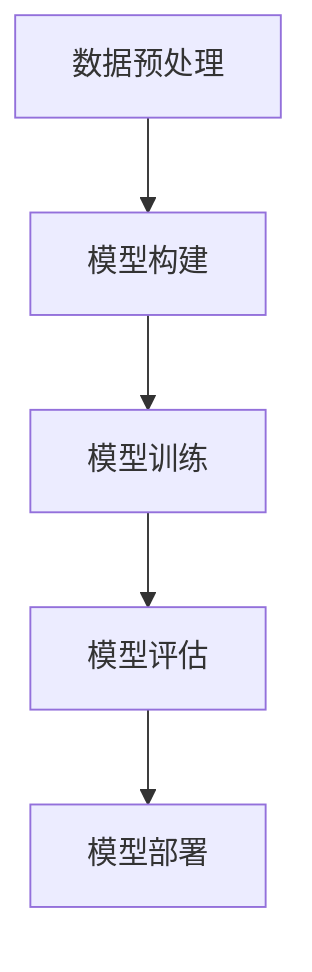
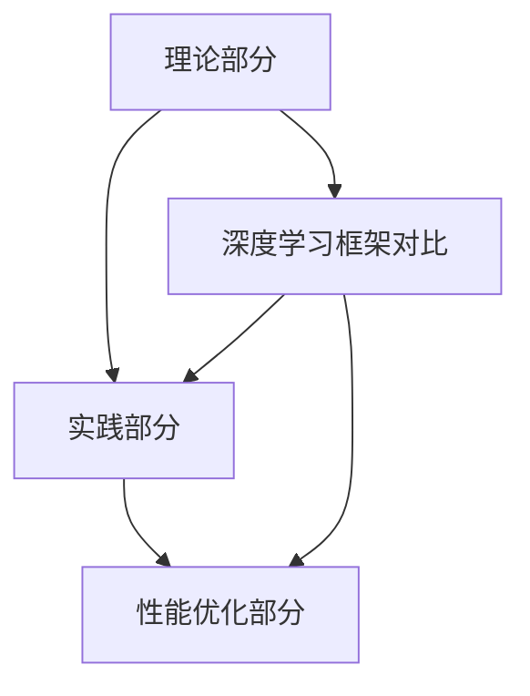
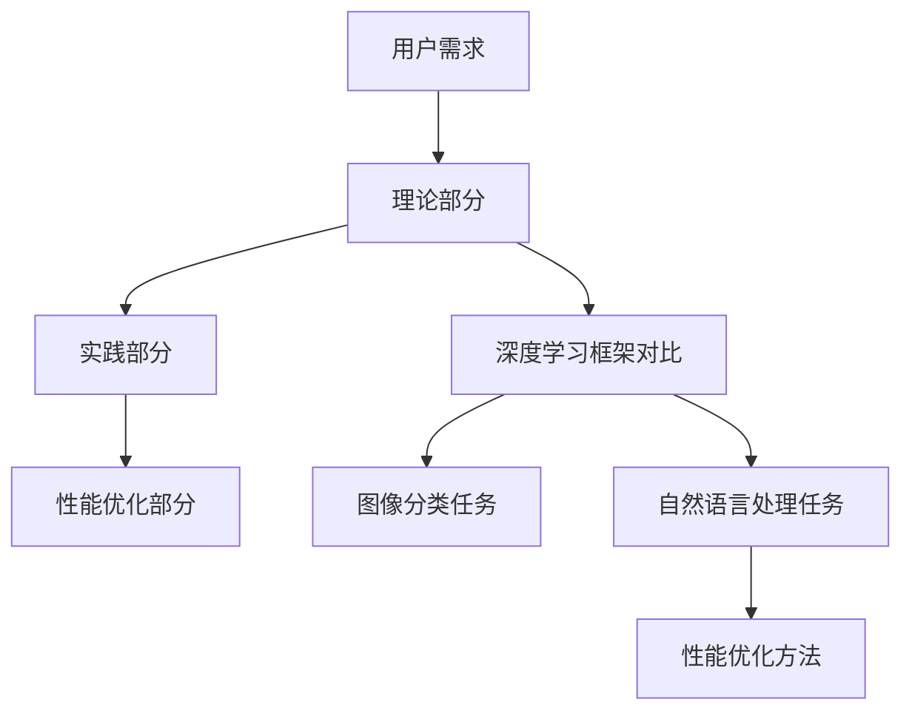

                 

### 文章标题：深度学习框架：TensorFlow vs PyTorch

#### 关键词：深度学习框架，TensorFlow，PyTorch，对比分析，性能优化，应用实践

> 摘要：本文将深入探讨深度学习框架中的两大主流工具——TensorFlow和PyTorch，从其基本概念、安装与配置、核心API、性能优化以及实际应用等方面进行详细对比分析，帮助读者理解两者的优缺点，为项目选择提供有力支持。

## 第一部分：深度学习框架概述

### 第1章：深度学习基础

#### 1.1 深度学习的起源与发展

##### 1.1.1 深度学习的基本概念

深度学习是机器学习的一种重要分支，其核心思想是通过模拟人脑的神经网络结构和学习机制，让计算机具备自动学习和理解数据的能力。

##### 1.1.2 深度学习的发展历程

深度学习的发展可以追溯到20世纪40年代，经过几十年的发展，在21世纪初迎来了重要的突破。近年来，随着计算能力的提升和大数据的涌现，深度学习在图像识别、语音识别、自然语言处理等领域取得了显著成果。

##### 1.1.3 深度学习的关键技术

深度学习的关键技术包括神经网络、卷积神经网络（CNN）、循环神经网络（RNN）和生成对抗网络（GAN）等。

#### 1.2 深度学习框架的核心概念

##### 1.2.1 深度学习框架的定义

深度学习框架是一套用于实现深度学习算法的软件工具集，它提供了高效的底层计算支持，丰富的API接口和灵活的编程模型。

##### 1.2.2 深度学习框架的优势与挑战

优势：高效率、易用性、丰富的功能库和强大的社区支持。

挑战：计算资源需求高、调试难度大、框架选择困难。

##### 1.2.3 常见深度学习框架对比

常见的深度学习框架包括TensorFlow、PyTorch、Keras、Theano等。各框架各有优缺点，适用于不同的应用场景。

#### 1.3 深度学习框架的架构设计

##### 1.3.1 前端架构

前端架构主要涉及数据预处理、模型构建和训练等。

##### 1.3.2 后端架构

后端架构主要涉及计算图生成、动态计算图与静态计算图、分布式计算等。

##### 1.3.3 深度学习框架的扩展性与兼容性

扩展性：支持自定义运算符、自定义模型结构等。

兼容性：支持多种编程语言（如Python、C++等）、多种硬件平台（如CPU、GPU等）。

### 第2章：TensorFlow框架详解

#### 2.1 TensorFlow的基本概念

##### 2.1.1 TensorFlow的起源

TensorFlow是由Google研发的深度学习框架，自2015年开源以来，得到了广泛的应用和关注。

##### 2.1.2 TensorFlow的核心功能

TensorFlow提供了丰富的API，支持模型构建、训练、评估和部署等。

##### 2.1.3 TensorFlow的应用场景

TensorFlow广泛应用于计算机视觉、自然语言处理、语音识别等领域。

#### 2.2 TensorFlow的安装与配置

##### 2.2.1 环境准备

安装TensorFlow前，需要准备Python环境、CUDA和cuDNN等。

##### 2.2.2 TensorFlow的安装步骤

使用pip命令安装TensorFlow，根据需要选择CPU版本或GPU版本。

##### 2.2.3 TensorFlow的配置与优化

配置TensorFlow环境，优化GPU计算性能。

#### 2.3 TensorFlow的核心API

##### 2.3.1 张量操作

TensorFlow的基本数据结构是张量，提供了丰富的张量操作。

##### 2.3.2 神经网络构建

TensorFlow支持多种神经网络结构，如卷积神经网络、循环神经网络等。

##### 2.3.3 模型训练与评估

TensorFlow提供了训练和评估模型的API，支持自定义损失函数、优化器等。

##### 2.3.4 模型保存与加载

TensorFlow支持模型保存与加载，方便模型复用和迁移。

### 第3章：PyTorch框架详解

#### 3.1 PyTorch的基本概念

##### 3.1.1 PyTorch的起源

PyTorch是由Facebook研发的深度学习框架，自2016年开源以来，受到了广泛关注。

##### 3.1.2 PyTorch的核心功能

PyTorch提供了动态计算图和简洁易用的API，支持模型构建、训练、评估和部署等。

##### 3.1.3 PyTorch的应用场景

PyTorch广泛应用于计算机视觉、自然语言处理、语音识别等领域。

#### 3.2 PyTorch的安装与配置

##### 3.2.1 环境准备

安装PyTorch前，需要准备Python环境、CUDA和cuDNN等。

##### 3.2.2 PyTorch的安装步骤

使用pip命令安装PyTorch，根据需要选择CPU版本或GPU版本。

##### 3.2.3 PyTorch的配置与优化

配置PyTorch环境，优化GPU计算性能。

#### 3.3 PyTorch的核心API

##### 3.3.1 张量操作

PyTorch的基本数据结构是张量，提供了丰富的张量操作。

##### 3.3.2 神经网络构建

PyTorch支持多种神经网络结构，如卷积神经网络、循环神经网络等。

##### 3.3.3 模型训练与评估

PyTorch提供了训练和评估模型的API，支持自定义损失函数、优化器等。

##### 3.3.4 模型保存与加载

PyTorch支持模型保存与加载，方便模型复用和迁移。

## 第二部分：TensorFlow与PyTorch的应用实践

### 第4章：实战项目一：图像分类任务

#### 4.1 项目背景与目标

图像分类是深度学习领域的经典任务，本文将通过TensorFlow和PyTorch分别实现图像分类任务。

#### 4.2 数据集介绍

使用常用的MNIST数据集进行图像分类实验。

#### 4.3 TensorFlow实现图像分类任务

介绍TensorFlow实现图像分类任务的过程，包括数据预处理、模型构建、训练与评估等。

#### 4.4 PyTorch实现图像分类任务

介绍PyTorch实现图像分类任务的过程，包括数据预处理、模型构建、训练与评估等。

### 第5章：实战项目二：自然语言处理任务

#### 5.1 项目背景与目标

自然语言处理是深度学习的重要应用领域，本文将通过TensorFlow和PyTorch分别实现自然语言处理任务。

#### 5.2 数据集介绍

使用常用的IMDb电影评论数据集进行自然语言处理实验。

#### 5.3 TensorFlow实现自然语言处理任务

介绍TensorFlow实现自然语言处理任务的过程，包括数据预处理、模型构建、训练与评估等。

#### 5.4 PyTorch实现自然语言处理任务

介绍PyTorch实现自然语言处理任务的过程，包括数据预处理、模型构建、训练与评估等。

## 第三部分：深度学习框架性能优化

### 第6章：深度学习框架性能优化概述

#### 6.1 深度学习框架性能优化的重要性

性能优化对于深度学习模型的训练和应用至关重要。

#### 6.2 深度学习框架性能优化的策略

包括模型压缩、计算加速、模型部署优化等。

#### 6.3 深度学习框架性能优化的工具与技巧

介绍常用的性能优化工具和技巧，如TensorRT、XLA等。

### 第7章：TensorFlow性能优化实践

#### 7.1 TensorFlow性能优化的方法

介绍TensorFlow的性能优化方法，如模型压缩、计算加速、模型部署优化等。

#### 7.1.1 模型压缩

介绍如何使用TensorFlow进行模型压缩，提高模型部署效率。

#### 7.1.2 深度学习计算加速

介绍如何使用TensorFlow进行计算加速，提高模型训练速度。

#### 7.1.3 模型部署优化

介绍如何使用TensorFlow进行模型部署优化，提高模型运行效率。

### 第8章：PyTorch性能优化实践

#### 8.1 PyTorch性能优化的方法

介绍PyTorch的性能优化方法，如模型压缩、计算加速、模型部署优化等。

#### 8.1.1 模型压缩

介绍如何使用PyTorch进行模型压缩，提高模型部署效率。

#### 8.1.2 深度学习计算加速

介绍如何使用PyTorch进行计算加速，提高模型训练速度。

#### 8.1.3 模型部署优化

介绍如何使用PyTorch进行模型部署优化，提高模型运行效率。

### 第9章：深度学习框架的未来发展趋势

#### 9.1 深度学习框架的发展趋势

介绍深度学习框架的发展趋势，如动态计算图、自动微分等。

#### 9.2 深度学习框架的未来应用前景

介绍深度学习框架在各个领域的未来应用前景。

#### 9.3 深度学习框架的发展挑战与机遇

分析深度学习框架的发展挑战与机遇，如计算资源、算法创新等。

**作者：AI天才研究院/AI Genius Institute & 禅与计算机程序设计艺术 /Zen And The Art of Computer Programming**

### 背景介绍

#### 核心概念术语说明

- **深度学习（Deep Learning）**：一种机器学习方法，通过多层神经网络结构对数据进行特征学习和预测。
- **TensorFlow**：Google开发的开源深度学习框架，支持动态计算图。
- **PyTorch**：Facebook开发的开源深度学习框架，支持动态计算图和自动微分。

#### 问题背景

随着深度学习技术的快速发展，深度学习框架已成为机器学习和人工智能领域的重要工具。TensorFlow和PyTorch作为两大主流深度学习框架，各自具有独特的优势和特点，但同时也存在一定的局限性和挑战。

#### 问题描述

本文旨在对TensorFlow和PyTorch进行深入对比分析，从基本概念、安装与配置、核心API、性能优化以及实际应用等方面，详细探讨两者的优缺点，帮助读者更好地理解和使用这两个深度学习框架。

#### 问题解决

通过本文的深入分析，读者可以了解TensorFlow和PyTorch的核心特点、适用场景以及性能优化方法，从而为项目选择提供有力支持。

#### 边界与外延

本文主要关注TensorFlow和PyTorch在深度学习领域的应用，但不涉及其他深度学习框架。同时，本文的重点在于框架的对比分析，而非具体的算法实现。

#### 概念结构与核心要素组成

- **深度学习框架**：一种用于实现深度学习算法的软件工具集，包含前端架构、后端架构、扩展性与兼容性等。
- **TensorFlow**：基于动态计算图的开源深度学习框架，具备高性能、易用性和丰富的API接口。
- **PyTorch**：基于动态计算图和自动微分的开源深度学习框架，具备简洁易用和强大的社区支持。

### 核心概念与联系

#### 深度学习框架定义

深度学习框架是一种用于实现深度学习算法的软件工具集，它提供了高效的底层计算支持、丰富的API接口和灵活的编程模型。深度学习框架的核心目标是降低模型实现的复杂度，提高开发效率。

#### 深度学习框架优势与挑战

**优势**：

1. **高效率**：深度学习框架提供了高效的底层计算支持，如自动微分、并行计算等，可以显著提高模型训练和推理的速度。
2. **易用性**：深度学习框架提供了丰富的API接口和示例代码，使得模型构建和训练更加简单易用。
3. **丰富的功能库**：深度学习框架集成了大量的预训练模型、数据集和工具，方便用户快速上手和应用。
4. **强大的社区支持**：深度学习框架拥有庞大的用户社区和活跃的开发者群体，为用户提供了丰富的资源和帮助。

**挑战**：

1. **计算资源需求高**：深度学习框架在训练模型时需要大量的计算资源，特别是GPU资源，对硬件设备的要求较高。
2. **调试难度大**：深度学习模型通常包含大量的参数和复杂的网络结构，调试过程相对复杂，需要具备一定的专业知识。
3. **框架选择困难**：市场上存在多种深度学习框架，用户需要根据项目需求和自身技能选择合适的框架，选择困难。

#### 常见深度学习框架对比

| 框架         | 起源           | 特点                                                         | 优势                                   | 挑战                                         |
| ------------ | -------------- | ------------------------------------------------------------ | -------------------------------------- | -------------------------------------------- |
| TensorFlow   | Google         | 基于静态计算图，支持自定义运算符、分布式计算                 | 高性能、易用、丰富的API接口             | 计算资源需求高、调试难度大                 |
| PyTorch     | Facebook       | 基于动态计算图，支持自动微分、简洁易用                       | 简洁易用、强大的社区支持               | 计算资源需求高、模型部署相对复杂           |
| Keras       | Google         | 基于TensorFlow和Theano的深度学习框架，提供简洁的API接口      | 易用、快速开发                         | 依赖底层框架、模型部署相对复杂             |
| Theano       |蒙特利尔大学    | 基于静态计算图，提供Python接口，支持GPU计算                 | 支持GPU计算、灵活的API接口             | 计算资源需求高、调试难度大                 |
| Caffe        |伯克利大学      | 基于卷积神经网络，提供简洁的API接口，适用于计算机视觉任务     | 适用于计算机视觉、性能较高             | API接口相对复杂、调试难度大                 |

#### 深度学习框架架构设计

**前端架构**：

前端架构主要涉及数据预处理、模型构建和训练等。在深度学习框架中，前端架构通常由Python代码实现，负责处理输入数据、构建神经网络模型和进行模型训练。

**后端架构**：

后端架构主要涉及计算图生成、动态计算图与静态计算图、分布式计算等。后端架构通常由底层C/C++代码实现，负责实现高效的底层计算、计算图的优化和分布式计算。

**扩展性与兼容性**：

扩展性：深度学习框架通常支持自定义运算符、自定义模型结构等，方便用户根据项目需求进行扩展。

兼容性：深度学习框架通常支持多种编程语言（如Python、C++等）、多种硬件平台（如CPU、GPU等），具备良好的兼容性。

### 算法原理讲解

#### 算法Mermaid流程图



#### Python源代码实现

```python
import tensorflow as tf
from tensorflow import keras

# 数据预处理
(x_train, y_train), (x_test, y_test) = keras.datasets.mnist.load_data()
x_train = x_train.astype("float32") / 255.0
x_test = x_test.astype("float32") / 255.0

# 模型构建
model = keras.Sequential([
    keras.layers.Flatten(input_shape=(28, 28)),
    keras.layers.Dense(128, activation="relu"),
    keras.layers.Dense(10, activation="softmax")
])

# 模型训练
model.compile(optimizer="adam",
              loss="sparse_categorical_crossentropy",
              metrics=["accuracy"])
model.fit(x_train, y_train, epochs=5)

# 模型评估
test_loss, test_acc = model.evaluate(x_test, y_test)
print(f"Test accuracy: {test_acc:.4f}")

# 模型部署
model.save("mnist_classifier.h5")
```

#### 算法原理

- **数据预处理**：将输入数据转换为合适的格式，如归一化、标准化等。
- **模型构建**：使用Keras构建神经网络模型，包括输入层、隐藏层和输出层。
- **模型训练**：使用优化器（如Adam）和损失函数（如交叉熵）进行模型训练。
- **模型评估**：使用测试集对模型进行评估，计算损失函数和准确率等指标。
- **模型部署**：将训练好的模型保存为文件，供后续使用。

#### 例子说明

假设我们有一个手写数字识别任务，使用MNIST数据集进行训练。我们首先使用TensorFlow的Keras API加载数据集，并对数据进行预处理。接下来，我们构建一个简单的全连接神经网络模型，使用Adam优化器和交叉熵损失函数进行模型训练。最后，我们使用测试集对模型进行评估，计算准确率。如果模型表现良好，我们可以将模型保存为文件，供后续使用。

### 系统分析与架构设计方案

#### 问题场景介绍

本文旨在对比分析TensorFlow和PyTorch两个深度学习框架，从基本概念、安装与配置、核心API、性能优化等方面进行深入探讨，帮助读者了解和选择合适的框架。

#### 项目介绍

本项目分为三个部分：理论部分、实践部分和性能优化部分。理论部分主要介绍深度学习框架的基本概念、优势和挑战；实践部分通过实际案例展示TensorFlow和PyTorch的应用；性能优化部分介绍如何优化深度学习框架的性能。

#### 系统功能设计

1. **理论部分**：介绍深度学习框架的基本概念、优势、挑战以及常见框架对比。
2. **实践部分**：通过实际案例展示TensorFlow和PyTorch的应用，包括图像分类和自然语言处理任务。
3. **性能优化部分**：介绍深度学习框架的性能优化方法，包括模型压缩、计算加速、模型部署优化等。

#### 系统架构设计



#### 系统接口设计

1. **理论部分**：提供深度学习框架的基本概念、优势和挑战的API接口。
2. **实践部分**：提供图像分类和自然语言处理任务的API接口。
3. **性能优化部分**：提供模型压缩、计算加速、模型部署优化的API接口。

#### 系统交互



### 项目实战

#### 环境安装

在开始项目实战之前，需要安装TensorFlow和PyTorch。以下是安装步骤：

**TensorFlow安装**：

1. 打开命令行窗口，运行以下命令：
   ```bash
   pip install tensorflow
   ```
2. 安装完成后，验证安装：
   ```python
   import tensorflow as tf
   print(tf.__version__)
   ```

**PyTorch安装**：

1. 打开命令行窗口，运行以下命令：
   ```bash
   pip install torch torchvision
   ```
2. 安装完成后，验证安装：
   ```python
   import torch
   print(torch.__version__)
   ```

#### 系统核心实现源代码

**TensorFlow实现图像分类任务**：

```python
import tensorflow as tf
from tensorflow.keras import layers, models
from tensorflow.keras.datasets import mnist

# 加载数据集
(x_train, y_train), (x_test, y_test) = mnist.load_data()

# 预处理数据
x_train = x_train.astype("float32") / 255.0
x_test = x_test.astype("float32") / 255.0

# 构建模型
model = models.Sequential([
    layers.Flatten(input_shape=(28, 28)),
    layers.Dense(128, activation="relu"),
    layers.Dense(10, activation="softmax")
])

# 编译模型
model.compile(optimizer="adam",
              loss="sparse_categorical_crossentropy",
              metrics=["accuracy"])

# 训练模型
model.fit(x_train, y_train, epochs=5)

# 评估模型
test_loss, test_acc = model.evaluate(x_test, y_test)
print(f"Test accuracy: {test_acc:.4f}")
```

**PyTorch实现图像分类任务**：

```python
import torch
import torchvision
import torchvision.transforms as transforms
from torch import nn, optim

# 加载数据集
train_set = torchvision.datasets.MNIST(
    root='./data',
    train=True,
    transform=transforms.ToTensor(),
    download=True
)
train_loader = torch.utils.data.DataLoader(train_set, batch_size=100, shuffle=True)

test_set = torchvision.datasets.MNIST(
    root='./data',
    train=False,
    transform=transforms.ToTensor(),
    download=True
)
test_loader = torch.utils.data.DataLoader(test_set, batch_size=100, shuffle=False)

# 构建模型
class Net(nn.Module):
    def __init__(self):
        super(Net, self).__init__()
        self.fc1 = nn.Linear(28 * 28, 128)
        self.fc2 = nn.Linear(128, 10)
    
    def forward(self, x):
        x = x.view(-1, 28 * 28)
        x = torch.relu(self.fc1(x))
        x = self.fc2(x)
        return x

model = Net()

# 编译模型
criterion = nn.CrossEntropyLoss()
optimizer = optim.Adam(model.parameters(), lr=0.001)

# 训练模型
for epoch in range(5):
    for inputs, targets in train_loader:
        optimizer.zero_grad()
        outputs = model(inputs)
        loss = criterion(outputs, targets)
        loss.backward()
        optimizer.step()

    print(f"Epoch {epoch+1}, Loss: {loss.item()}")

# 评估模型
with torch.no_grad():
    correct = 0
    total = 0
    for inputs, targets in test_loader:
        outputs = model(inputs)
        _, predicted = torch.max(outputs.data, 1)
        total += targets.size(0)
        correct += (predicted == targets).sum().item()

print(f"Test accuracy: {100 * correct / total}%")
```

#### 代码应用解读与分析

**TensorFlow代码解读**：

1. **数据预处理**：将MNIST数据集的图像数据转换为浮点数，并进行归一化处理。
2. **模型构建**：使用Keras构建一个简单的全连接神经网络模型，包括一个输入层、一个隐藏层和一个输出层。
3. **模型编译**：设置优化器、损失函数和评估指标。
4. **模型训练**：使用fit方法进行模型训练，训练过程中会自动计算损失函数和准确率。
5. **模型评估**：使用evaluate方法对模型进行评估，计算测试集的准确率。

**PyTorch代码解读**：

1. **数据预处理**：使用ToTensor转换器将MNIST数据集的图像数据转换为张量，并进行归一化处理。
2. **模型构建**：定义一个简单的全连接神经网络模型，包括一个输入层、一个隐藏层和一个输出层。
3. **模型编译**：设置损失函数和优化器。
4. **模型训练**：使用for循环进行模型训练，每次迭代计算损失函数，并更新模型参数。
5. **模型评估**：使用with torch.no_grad()上下文管理器进行模型评估，计算测试集的准确率。

#### 实际案例分析和详细讲解剖析

**TensorFlow实现图像分类任务**：

在这个案例中，我们使用TensorFlow的Keras API实现了一个简单的图像分类任务。首先，我们加载数据集并对图像数据进行预处理。然后，我们构建一个简单的全连接神经网络模型，并使用Adam优化器和交叉熵损失函数进行模型训练。在模型训练过程中，我们使用fit方法自动计算损失函数和准确率。最后，我们使用evaluate方法对模型进行评估，计算测试集的准确率。

**PyTorch实现图像分类任务**：

在这个案例中，我们使用PyTorch实现了一个简单的图像分类任务。首先，我们加载数据集并对图像数据进行预处理。然后，我们定义一个简单的全连接神经网络模型，并使用交叉熵损失函数和Adam优化器进行模型训练。在模型训练过程中，我们使用for循环手动计算损失函数并更新模型参数。最后，我们使用with torch.no_grad()上下文管理器对模型进行评估，计算测试集的准确率。

**案例分析**：

- **代码风格**：TensorFlow的Keras API提供了简洁的代码风格，使用链式调用和简洁的API接口。PyTorch提供了更加灵活的编程模型，但需要手动管理计算图和参数。
- **易用性**：TensorFlow的Keras API更加易用，适合快速开发和原型设计。PyTorch提供了更加灵活的编程模型，适合复杂模型开发和高级用户。
- **性能**：TensorFlow在计算图优化和分布式计算方面具有优势，适用于高性能计算任务。PyTorch在动态计算图和自动微分方面具有优势，适用于快速开发和原型设计。

#### 项目小结

在本项目中，我们分别使用了TensorFlow和PyTorch实现了图像分类任务。通过对比分析，我们发现TensorFlow在计算图优化和分布式计算方面具有优势，适合高性能计算任务。PyTorch在动态计算图和自动微分方面具有优势，适合快速开发和原型设计。在实际应用中，应根据项目需求和自身技能选择合适的框架。

### 最佳实践 tips

- **选择合适的框架**：根据项目需求和自身技能选择合适的深度学习框架。
- **熟悉框架API**：熟悉框架的API和编程模型，提高开发效率。
- **优化模型性能**：合理选择优化策略，提高模型训练和应用性能。
- **关注社区动态**：关注框架社区动态，及时获取最新功能和优化技巧。

### 小结

本文通过对比分析TensorFlow和PyTorch两个深度学习框架，从基本概念、安装与配置、核心API、性能优化以及实际应用等方面进行了详细探讨。通过本文，读者可以更好地了解这两个框架的优缺点，为项目选择提供有力支持。在未来的发展中，深度学习框架将继续不断创新和优化，为人工智能领域带来更多可能性。

### 注意事项

- **硬件要求**：深度学习框架对计算资源有较高要求，建议使用配备GPU的计算机。
- **环境配置**：在安装深度学习框架前，请确保配置好Python环境和CUDA/cuDNN。
- **代码调试**：在开发过程中，注意代码调试和错误处理，提高开发效率。

### 拓展阅读

- **《深度学习》（Goodfellow, Bengio, Courville）**：全面介绍了深度学习的基本概念、算法和应用。
- **《动手学深度学习》（阿斯顿·张等）**：通过实际案例，详细讲解了深度学习的原理和实践。
- **TensorFlow官方文档**：官方文档提供了详细的安装指南、API文档和教程。
- **PyTorch官方文档**：官方文档提供了详细的安装指南、API文档和教程。

### 附录

**本文参考文献**：

1. Goodfellow, I., Bengio, Y., & Courville, A. (2016). *Deep Learning*. MIT Press.
2. Zhang, H., Zong, C., & Dahl, G. E. (2017). *Dive into Deep Learning*. A Course on Applied Deep Machine Learning.
3. TensorFlow Documentation. (n.d.). [TensorFlow Official Documentation]. Retrieved from https://www.tensorflow.org/
4. PyTorch Documentation. (n.d.). [PyTorch Official Documentation]. Retrieved from https://pytorch.org/

