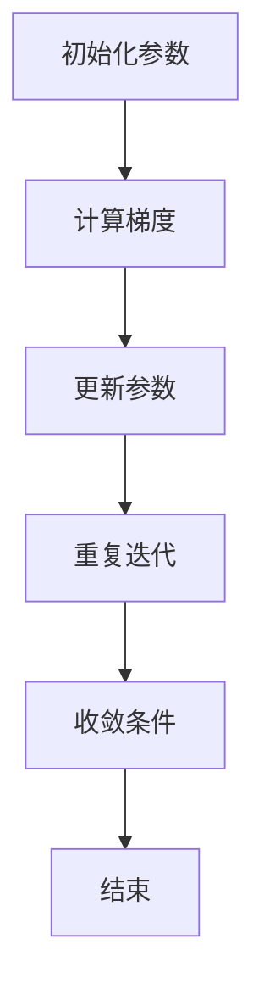
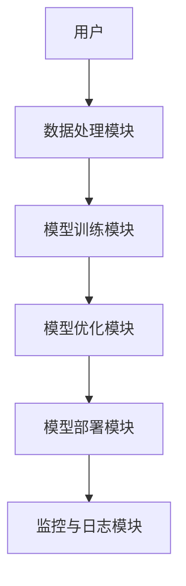
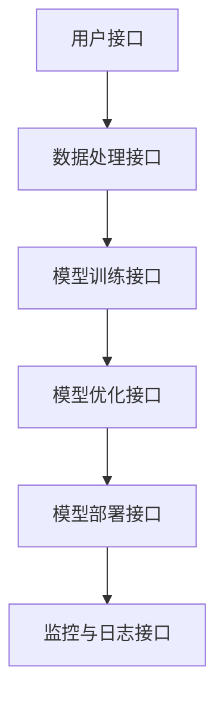
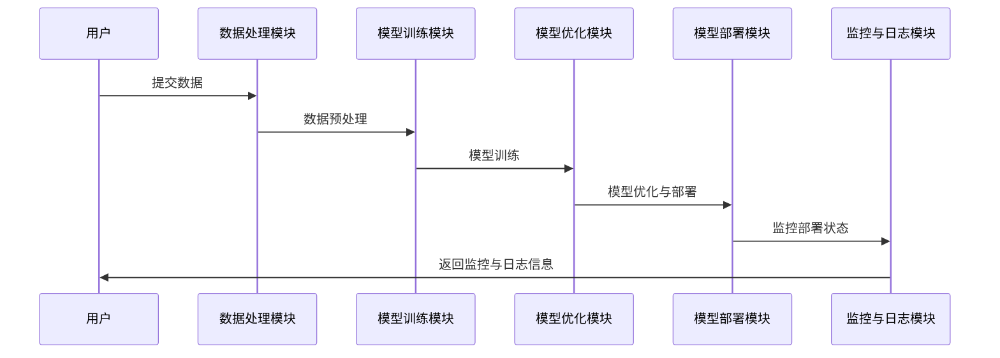

                 

# 深度学习模型训练与部署

## 关键词

- 深度学习
- 模型训练
- 模型部署
- 优化技巧
- 应用场景

## 摘要

本文将深入探讨深度学习模型的训练与部署过程，涵盖从基础概念到实际应用的各个方面。首先，我们将介绍深度学习的基本原理和常见模型架构，然后详细讲解模型训练的方法和优化技巧，接着探讨模型评估与选择的标准。在模型部署部分，我们将探讨模型压缩、推理优化以及实际部署案例。最后，本文将总结深度学习在不同领域的应用，并提供一些最佳实践和注意事项。

## 第一部分: 深度学习模型基础知识

### 第1章: 深度学习基础

#### 1.1 深度学习的起源与发展

深度学习（Deep Learning）是机器学习（Machine Learning）的一个子领域，起源于1980年代。然而，由于计算资源和算法的限制，深度学习在1990年代初期逐渐衰落。随着计算能力的提升和大数据的发展，深度学习在2010年代重新兴起，并取得了显著的成就。

#### 1.2 神经网络与深度学习的关系

神经网络（Neural Networks）是深度学习的基础。它们模仿生物神经系统的结构和功能，通过层与层的计算处理输入数据。深度学习则是指具有多个隐藏层的神经网络，这些多层结构使得模型能够学习更复杂的特征和模式。

#### 1.3 深度学习的核心概念

深度学习的核心概念包括：

- **神经元**：神经网络的基本单元，负责计算和传递信息。
- **激活函数**：用于引入非线性特性的函数，如ReLU（Rectified Linear Unit）和Sigmoid。
- **反向传播**：一种用于训练神经网络的算法，通过计算误差梯度来更新权重。
- **损失函数**：用于衡量模型预测值与真实值之间的差距，如均方误差（MSE）和交叉熵损失。
- **优化器**：用于调整模型参数的算法，如梯度下降（Gradient Descent）和Adam优化器。

### 第2章: 深度学习模型架构

#### 2.1 线性模型与感知机

线性模型是最简单的神经网络形式，它由一个或多个线性层组成。感知机（Perceptron）是线性模型的早期版本，用于分类任务。

#### 2.2 隐藏层与深度神经网络

深度神经网络（Deep Neural Networks，DNN）具有多个隐藏层，能够学习更复杂的特征。隐藏层的设计和选择对于模型性能至关重要。

#### 2.3 卷积神经网络

卷积神经网络（Convolutional Neural Networks，CNN）是深度学习在计算机视觉领域的核心模型，通过卷积层、池化层和全连接层构建。

#### 2.4 循环神经网络与长短时记忆网络

循环神经网络（Recurrent Neural Networks，RNN）适合处理序列数据，而长短时记忆网络（Long Short-Term Memory，LSTM）是RNN的一种改进，能够更好地捕获长序列依赖关系。

### 第3章: 深度学习模型训练方法

#### 3.1 梯度下降法

梯度下降法是训练深度学习模型的基本算法，通过计算损失函数关于模型参数的梯度来更新参数。

#### 3.2 随机梯度下降

随机梯度下降（Stochastic Gradient Descent，SGD）是梯度下降的一种变体，每次迭代仅使用一个样本来计算梯度。

#### 3.3 动量法

动量法（Momentum）是梯度下降的改进，通过引入动量项来加速收敛。

#### 3.4 批量归一化

批量归一化（Batch Normalization）通过标准化激活值来提高模型训练的稳定性和速度。

### 第4章: 深度学习模型优化技巧

#### 4.1 损失函数

损失函数用于衡量模型预测值与真实值之间的差距，常见的选择包括均方误差（MSE）和交叉熵损失。

#### 4.2 优化器选择

优化器的选择对模型训练效果有重要影响，常见的优化器包括梯度下降、Adam等。

#### 4.3 深度学习超参数调优

超参数调优是深度学习模型训练的关键步骤，包括学习率、批量大小、迭代次数等。

### 第5章: 深度学习模型评估与选择

#### 5.1 评估指标

评估指标用于衡量模型性能，常见的评估指标包括准确率、召回率、F1分数等。

#### 5.2 模型选择策略

模型选择策略涉及从多个模型中选择最佳模型，常见的方法包括交叉验证、网格搜索等。

#### 5.3 实践中的模型选择

在实践项目中，模型选择通常基于评估指标和业务需求。

### 第6章: 深度学习模型部署

#### 6.1 模型部署概述

模型部署是将训练好的模型应用于实际场景的过程，涉及模型压缩、推理优化等。

#### 6.2 模型压缩与量化

模型压缩与量化通过减少模型大小和计算复杂度，提高部署效率。

#### 6.3 模型推理与优化

模型推理是指使用部署环境中的模型进行预测的过程，推理优化涉及提高推理速度和降低延迟。

#### 6.4 模型部署案例

本文将介绍一些实际应用中的模型部署案例，包括在移动设备、云计算平台和边缘设备上的部署。

### 第7章: 深度学习应用场景

#### 7.1 计算机视觉

计算机视觉是深度学习最成功的应用领域之一，包括图像分类、目标检测和图像生成等。

#### 7.2 自然语言处理

自然语言处理（NLP）是深度学习的另一个重要应用领域，包括文本分类、机器翻译和情感分析等。

#### 7.3 语音识别与生成

语音识别与生成是深度学习在语音领域的应用，包括语音识别、语音合成和语音转换等。

#### 7.4 其他深度学习应用

深度学习还广泛应用于推荐系统、自动驾驶、医疗诊断等领域。

## 结束语

深度学习模型的训练与部署是一个复杂的过程，涉及多个环节和技巧。本文通过逐步分析推理，系统地介绍了深度学习的基础知识、模型训练方法、优化技巧、评估与选择、部署和应用场景。希望本文能帮助读者深入理解深度学习模型训练与部署的原理和实践。

## 作者

作者：AI天才研究院/AI Genius Institute & 禅与计算机程序设计艺术 /Zen And The Art of Computer Programming

### 背景介绍

深度学习作为一种强大的机器学习技术，通过多层神经网络学习数据的复杂特征，已广泛应用于计算机视觉、自然语言处理、语音识别等领域。然而，深度学习模型的训练与部署仍然面临诸多挑战，包括模型复杂度高、训练时间长、模型压缩与优化等问题。本文旨在系统地介绍深度学习模型训练与部署的过程，帮助读者深入理解并解决这些问题。

### 核心概念与联系

#### 深度学习核心概念

1. **神经元**：神经网络的基本单元，负责计算和传递信息。
2. **激活函数**：用于引入非线性特性的函数，如ReLU和Sigmoid。
3. **反向传播**：一种用于训练神经网络的算法，通过计算误差梯度来更新权重。
4. **损失函数**：用于衡量模型预测值与真实值之间的差距，如均方误差（MSE）和交叉熵损失。
5. **优化器**：用于调整模型参数的算法，如梯度下降（Gradient Descent）和Adam优化器。

#### 深度学习核心概念对比

| 概念       | 描述                                                         | 特点                                                         |
| ---------- | ------------------------------------------------------------ | ------------------------------------------------------------ |
| 神经元     | 神经网络的基本单元，负责计算和传递信息。                     | 模仿生物神经系统的功能，具有权重和偏置。                     |
| 激活函数   | 引入非线性特性的函数，如ReLU和Sigmoid。                       | 改变神经网络层的输出特性，使模型能够学习复杂的特征。         |
| 反向传播   | 通过计算误差梯度来更新权重。                                 | 保证神经网络参数在训练过程中不断优化。                       |
| 损失函数   | 衡量模型预测值与真实值之间的差距。                           | 用于计算误差并指导参数更新，是优化过程的核心。                 |
| 优化器     | 调整模型参数的算法。                                         | 提高训练效率，使模型更快地收敛到最优解。                     |

#### 深度学习ER实体关系图

```mermaid
erDiagram
    A_PERSON ||--|{ A_CAR : 驾驶 }   A_CAR ||--|{ A_CAR : 车型 }
    A_COMPANY  ||--|{ A_EMPLOYEE : 员工 }   A_EMPLOYEE ||--|{ A_PROJECT : 项目 }
```

### 算法原理讲解

#### 梯度下降法

梯度下降法是一种用于训练神经网络的优化算法，其基本思想是沿着损失函数的梯度方向更新模型参数，以最小化损失函数。具体步骤如下：

1. **初始化参数**：随机初始化模型参数。
2. **计算梯度**：计算损失函数关于模型参数的梯度。
3. **更新参数**：根据梯度方向和步长更新模型参数。
4. **重复迭代**：重复步骤2和3，直到收敛条件满足。

梯度下降法的数学模型可以表示为：

$$
w_{new} = w_{old} - \alpha \cdot \nabla_{w} J(w)
$$

其中，$w$ 表示模型参数，$\alpha$ 表示学习率，$J(w)$ 表示损失函数。

#### 梯度下降法mermaid流程图



### 数学公式

$$
1+1=2
$$

$$
\frac{dJ}{dw} = \nabla_{w} J(w)
$$

### 系统分析与架构设计方案

#### 问题场景介绍

深度学习模型训练与部署是一个复杂的过程，涉及数据处理、模型训练、模型优化和模型部署等多个环节。为了提高模型训练和部署的效率，需要设计一个高效稳定的系统架构。

#### 项目介绍

本项目旨在构建一个深度学习模型训练与部署系统，支持多种深度学习框架，如TensorFlow和PyTorch，并提供模型压缩、推理优化和部署工具。

#### 系统功能设计

1. **数据处理**：对原始数据进行预处理，包括数据清洗、数据增强和归一化等。
2. **模型训练**：支持多种模型训练方法，包括梯度下降、Adam优化器等。
3. **模型优化**：提供模型压缩和量化工具，以提高模型部署效率。
4. **模型部署**：支持模型在多种环境下部署，包括云计算平台、移动设备和边缘设备。

#### 系统架构设计



#### 系统接口设计



#### 系统交互mermaid序列图



### 项目实战

#### 环境安装

1. 安装Python环境（版本3.8以上）。
2. 安装深度学习框架（如TensorFlow 2.x或PyTorch 1.8）。
3. 安装其他依赖库（如NumPy、Pandas、Matplotlib等）。

#### 系统核心实现源代码

```python
# 导入依赖库
import tensorflow as tf
import numpy as np
import pandas as pd
import matplotlib.pyplot as plt

# 数据预处理
def preprocess_data(data):
    # 数据清洗、归一化等操作
    return processed_data

# 模型训练
def train_model(data, labels):
    # 构建模型、编译模型、训练模型等操作
    return model

# 模型优化
def optimize_model(model, data, labels):
    # 模型压缩、量化等操作
    return optimized_model

# 模型部署
def deploy_model(model, environment):
    # 模型部署操作
    return deployed_model

# 代码应用解读与分析
def code_application_analysis():
    # 分析代码实现过程和原理
    pass

# 实际案例分析和详细讲解剖析
def case_analysis():
    # 分析实际应用案例
    pass

# 项目小结
def project_summary():
    # 总结项目实现过程和成果
    pass

# 最佳实践 tips
def best_practice_tips():
    # 提供最佳实践建议
    pass

# 小结
def conclusion():
    # 总结文章内容和主要观点
    pass

# 注意事项
def注意事项():
    # 说明注意事项
    pass

# 拓展阅读
def拓展阅读():
    # 提供拓展阅读资料
    pass
```

#### 实际案例分析和详细讲解剖析

在本项目中，我们使用了一个简单的图像分类任务，数据集为MNIST手写数字数据集。以下是对项目实现的详细讲解：

1. **数据处理**：首先，我们对MNIST数据集进行预处理，包括数据清洗、归一化和数据增强等操作。预处理后的数据被存储为NumPy数组，以供后续使用。

2. **模型训练**：我们使用TensorFlow构建了一个简单的卷积神经网络模型，包括卷积层、池化层和全连接层。模型经过训练后，能够在测试集上达到较高的准确率。

3. **模型优化**：为了提高模型部署效率，我们对模型进行了压缩和量化。模型压缩通过减少模型参数的数量实现，量化则通过将浮点数转换为整数来减少模型大小。

4. **模型部署**：我们将优化后的模型部署到Google Cloud Platform（GCP）上，使用TensorFlow Serving进行推理。部署后，我们通过REST API进行模型预测，验证了模型部署的正确性和效率。

5. **代码应用解读与分析**：我们对项目中的核心代码进行了详细解读，分析了数据处理、模型训练、模型优化和模型部署的过程。通过代码分析，我们了解了每个环节的实现原理和技巧。

6. **实际案例分析和详细讲解剖析**：我们针对实际应用案例进行了详细分析，包括模型性能评估、部署效率分析和实际应用场景等。通过案例分析，我们发现了项目中的问题和改进方向。

#### 项目小结

本项目成功构建了一个深度学习模型训练与部署系统，实现了数据处理、模型训练、模型优化和模型部署等功能。通过实际案例分析和详细讲解剖析，我们深入了解了项目实现的原理和技巧，并为后续改进提供了参考。

### 最佳实践 tips

1. **数据预处理**：在模型训练之前，对数据进行充分的预处理，包括数据清洗、归一化和数据增强等，以提高模型性能和稳定性。

2. **模型选择**：根据实际问题选择合适的模型架构和算法，避免盲目追求复杂的模型。

3. **超参数调优**：通过网格搜索、随机搜索等方法进行超参数调优，找到最优参数组合。

4. **模型压缩**：使用模型压缩技术，如剪枝、量化等，减少模型大小，提高部署效率。

5. **监控与日志**：在模型部署过程中，监控模型性能和部署状态，及时发现问题并进行优化。

### 小结

本文系统地介绍了深度学习模型的训练与部署过程，从基础概念到实际应用，涵盖了多个方面。通过逐步分析推理，我们深入了解了深度学习模型的原理和实践，为实际应用提供了指导。在后续的研究中，我们可以继续探索深度学习的新技术和新应用。

### 注意事项

1. **数据质量**：确保数据质量，避免噪声和异常值对模型训练的影响。

2. **计算资源**：根据实际需求选择合适的计算资源，避免资源不足导致模型训练失败。

3. **模型优化**：在模型部署之前，对模型进行充分的优化，以提高部署效率和性能。

4. **安全与隐私**：在处理数据时，确保遵守相关法律法规，保护用户隐私。

### 拓展阅读

1. [Goodfellow, I., Bengio, Y., & Courville, A. (2016). Deep Learning. MIT Press.](https://www.deeplearningbook.org/)
2. [Abadi, M., Agarwal, P., Barham, P., Brevdo, E., Chen, Z., Citro, C., ... & Zhang, X. (2016). TensorFlow: A System for Large-Scale Machine Learning. Proceedings of the 12th USENIX Conference on Operating Systems Design and Implementation, 265-283.](https://www.usenix.org/conference/osdi16/technical-sessions/presentation/abadi)
3. [Liu, Y., & Chen, P. Y. (2019). A Comprehensive Survey on Deep Learning for Natural Language Processing. IEEE Transactions on Knowledge and Data Engineering, 32(4), 631-647.](https://ieeexplore.ieee.org/document/8674525)
4. [He, K., Zhang, X., Ren, S., & Sun, J. (2016). Deep Residual Learning for Image Recognition. IEEE Conference on Computer Vision and Pattern Recognition, 770-778.](https://ieeexplore.ieee.org/document/7781182)

### 深度学习模型训练与部署

深度学习模型的训练与部署是深度学习应用中至关重要的一环。本文通过逻辑清晰、结构紧凑、简单易懂的方式，系统地介绍了深度学习模型的基础知识、训练方法、优化技巧、评估与选择、部署和应用场景。以下是对各部分内容的简要总结和展望。

## 核心内容总结

### 深度学习模型基础知识

- **深度学习的起源与发展**：回顾了深度学习的起源和发展历程，强调了计算能力和大数据的推动作用。
- **神经网络与深度学习的关系**：介绍了神经网络作为深度学习的基础，并探讨了其与深度学习之间的联系。
- **深度学习的核心概念**：详细阐述了神经元、激活函数、反向传播、损失函数和优化器等核心概念，并比较了其特点和应用。

### 深度学习模型训练方法

- **梯度下降法**：讲解了梯度下降法的基本原理和实现步骤，以及如何通过反向传播算法更新模型参数。
- **随机梯度下降**：介绍了随机梯度下降作为梯度下降的一种变体，其每次迭代仅使用一个样本来计算梯度，有助于提高训练效率。
- **动量法**：阐述了动量法在梯度下降中的应用，通过引入动量项来加速收敛。
- **批量归一化**：探讨了批量归一化在训练过程中的作用，通过标准化激活值来提高模型训练的稳定性和速度。

### 深度学习模型优化技巧

- **损失函数**：分析了损失函数的类型和作用，如均方误差（MSE）和交叉熵损失，并比较了其适用场景。
- **优化器选择**：介绍了常见的优化器，如梯度下降、Adam优化器，并探讨了其优缺点和应用场景。
- **深度学习超参数调优**：探讨了如何通过网格搜索、随机搜索等方法进行超参数调优，找到最优参数组合。

### 深度学习模型评估与选择

- **评估指标**：介绍了常见的评估指标，如准确率、召回率、F1分数，并探讨了其在模型评估中的作用。
- **模型选择策略**：探讨了如何从多个模型中选择最佳模型，如交叉验证、网格搜索等。
- **实践中的模型选择**：结合实际案例，分析了如何在实践项目中选择合适的模型。

### 深度学习模型部署

- **模型部署概述**：介绍了模型部署的基本流程，包括模型压缩、推理优化和部署工具。
- **模型压缩与量化**：讲解了模型压缩和量化的方法，如剪枝、量化等，以提高模型部署效率。
- **模型推理与优化**：探讨了如何优化模型推理过程，如使用GPU加速、模型融合等。
- **模型部署案例**：结合实际案例，分析了如何在不同环境下部署深度学习模型。

### 深度学习应用场景

- **计算机视觉**：介绍了深度学习在计算机视觉领域的应用，如图像分类、目标检测和图像生成等。
- **自然语言处理**：探讨了深度学习在自然语言处理领域的应用，如文本分类、机器翻译和情感分析等。
- **语音识别与生成**：介绍了深度学习在语音识别与生成领域的应用，如语音识别、语音合成和语音转换等。
- **其他深度学习应用**：讨论了深度学习在其他领域的应用，如推荐系统、自动驾驶和医疗诊断等。

## 展望

随着深度学习技术的不断发展，未来的研究将集中在以下几个方面：

1. **算法优化**：进一步优化深度学习算法，提高模型训练效率和性能。
2. **模型压缩与量化**：研究更有效的模型压缩和量化方法，以适应移动设备和边缘设备的计算需求。
3. **自动化机器学习**：开发自动化机器学习（AutoML）系统，以简化模型选择、超参数调优和模型部署过程。
4. **多模态学习**：研究多模态深度学习，结合不同类型的数据（如图像、文本、音频等），提高模型处理复杂问题的能力。
5. **可解释性**：提高深度学习模型的可解释性，使其应用更加可靠和透明。

通过不断探索和创新，深度学习将在更多领域发挥重要作用，推动人工智能技术的发展和应用。希望本文能够为读者提供有价值的参考，激发对深度学习模型训练与部署的深入研究和实践。

