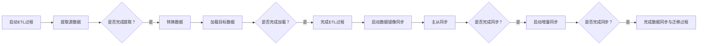
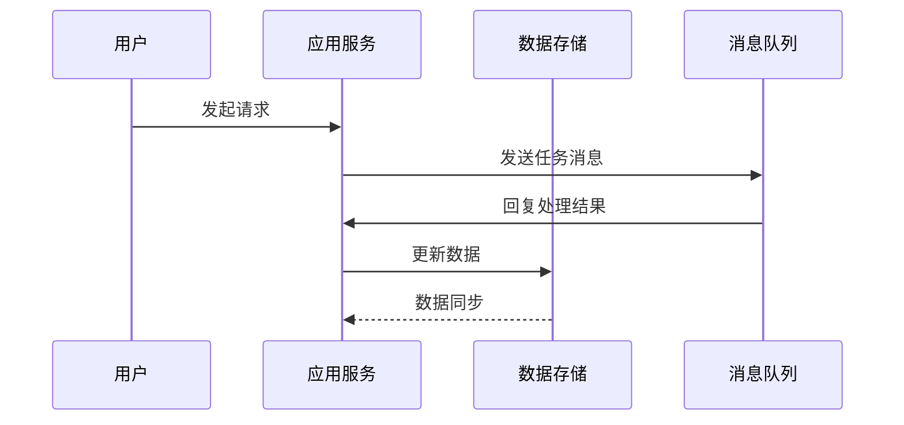

                 

### 第一部分：引言

#### 书名：《混合云：设计和管理跨云平台的应用》

#### 关键词：
- 混合云
- 跨云平台应用
- 云服务模型
- 云原生技术
- 负载均衡算法

#### 摘要：
《混合云：设计和管理跨云平台的应用》旨在帮助读者深入理解混合云的概念，掌握跨云平台应用的设计和管理技巧。通过详细阐述混合云的架构、安全性、部署和运维，本书将为企业和IT专业人士提供构建高效、可靠、灵活混合云环境的实用指南。

#### 目标读者：
- IT专业人士
- 云计算工程师
- 系统架构师
- 企业IT经理

#### 书籍概述：
本书详细记录了混合云技术的设计原则和实践方法，旨在帮助读者深入理解混合云的概念，掌握跨云平台应用的设计和管理技巧。通过详细阐述混合云的架构、安全性、部署和运维，本书将引导读者构建高效、可靠、灵活的混合云环境。

#### 主要问题背景：
随着云计算技术的迅猛发展，越来越多的企业开始采用混合云策略，以应对不同业务场景的需求。然而，如何设计和管理跨云平台的应用，成为了企业和IT专业人士面临的重大挑战。

#### 本书解决的问题：
- 混合云的基础概念和架构设计
- 跨云平台应用的统一管理和调度
- 混合云环境的成本优化和性能提升
- 混合云的安全性保障和合规性管理

#### 边界与外延：
- 本书关注混合云在企业级应用中的设计和管理，不涉及个人用户或小型企业场景。
- 本书主要讨论主流云平台（如AWS、Azure、Google Cloud等）的混合云解决方案，不探讨其他非主流云平台的兼容性。

#### 核心要素组成：
- **核心概念与联系**：
  - **混合云**：融合公有云和私有云的资源和服务，实现灵活的IT资源调度。
  - **跨云平台应用**：在多个云平台上部署和运行的应用程序。
  - **云服务模型**：IaaS、PaaS、SaaS及其在混合云环境中的应用。
  - **云原生技术**：容器、微服务、Kubernetes等，用于实现跨云平台的应用部署和管理。
- **算法原理讲解**：
  - **负载均衡算法**：如轮询、最少连接数、加权等，用于优化跨云平台的资源利用率。
  - **数据同步与迁移技术**：如ETL、数据镜像、数据分层等，用于保证数据的一致性和可靠性。
- **系统分析与架构设计方案**：
  - **混合云架构**：包括云平台的选择、资源管理、服务整合、安全性架构等。
  - **跨云平台应用架构**：包括应用设计、部署策略、监控与运维等。

### 第二部分：核心概念与联系

#### 第2章：混合云的基本概念

## 2.1 混合云的定义与特点
### 2.1.1 混合云的定义
混合云是指结合了公有云和私有云的资源和服务，实现企业IT资源灵活调度的云计算模式。它利用私有云提供安全性和合规性保障，同时利用公有云实现灵活的资源扩展和成本效益。

### 2.1.2 混合云的特点
- **灵活性**：混合云允许企业根据业务需求，在公有云和私有云之间自由迁移应用程序和数据。
- **成本效益**：通过合理分配负载，企业可以实现资源的高效利用，降低整体运营成本。
- **合规性**：企业可以在私有云中处理敏感数据，确保数据符合各种法规和合规要求。
- **可靠性**：混合云通常具有多个云平台和多个数据中心的支持，提高了服务的可靠性和容错能力。

### 2.1.3 混合云与传统云的区别
- **传统云**：主要指单一的公有云或私有云环境，企业通常只能在特定的云平台上进行应用部署。
- **混合云**：结合了公有云和私有云的优势，企业可以根据不同的业务需求，灵活选择云平台和服务。

## 2.2 混合云的组成部分
### 2.2.1 公有云与私有云
- **公有云**：由第三方云服务提供商（如AWS、Azure、Google Cloud）提供，供多个企业共享。
- **私有云**：企业自己建立和维护的云环境，通常位于企业内部或托管在第三方数据中心。

### 2.2.2 混合云的层次结构
混合云通常包括以下层次：
- **基础设施层**：提供虚拟化资源，如虚拟机、存储和网络。
- **平台层**：提供操作系统、数据库、中间件等服务。
- **软件层**：提供应用程序和开发工具。

### 2.2.3 混合云的关键技术
- **API**：用于不同云平台之间的互操作性。
- **云同步**：实现数据在公有云和私有云之间的实时同步。
- **云 bursting**：将工作负载在公有云和私有云之间动态迁移。

## 2.3 主流云平台介绍
### 2.3.1 AWS混合云解决方案
AWS提供了一系列混合云解决方案，包括：
- **AWS Outposts**：在本地数据中心部署AWS基础设施，实现与AWS云的无缝集成。
- **AWS Direct Connect**：通过专用网络连接，实现私有网络与AWS云之间的高速数据传输。

### 2.3.2 Azure混合云解决方案
Azure提供以下混合云功能：
- **Azure Arc**：统一管理跨多个云平台和本地数据中心的资源。
- **Azure Stack**：在本地数据中心部署Azure云基础设施，与Azure云实现一体化。

### 2.3.3 Google Cloud混合云解决方案
Google Cloud提供以下混合云解决方案：
- **Anthos**：基于Kubernetes的混合云平台，支持跨多个云平台的容器化应用部署。

## 2.4 混合云的应用场景
### 2.4.1 企业数字化转型
混合云帮助企业实现数字化转型，通过灵活的IT资源调度，降低成本，提高业务灵活性。

### 2.4.2 用户体验优化
混合云可以根据用户地理位置，将应用程序部署在最近的云平台上，提高用户体验。

### 2.4.3 应急备份与灾难恢复
混合云提供多种备份和灾难恢复方案，确保企业数据的安全和业务的连续性。

## 2.5 混合云的挑战与机遇
### 2.5.1 挑战
- **复杂性**：混合云环境涉及多个云平台和数据中心，增加了管理的复杂性。
- **安全性**：跨云平台的数据传输和存储需要额外的安全措施。
- **成本控制**：合理分配资源，避免过度消费和浪费。

### 2.5.2 机遇
- **灵活性**：可以根据业务需求灵活调整IT资源。
- **创新性**：结合公有云和私有云的优势，实现更多创新应用。
- **竞争力**：提高企业IT基础设施的可靠性和弹性，增强竞争力。

## 2.6 本章小结
本章介绍了混合云的定义、特点、组成部分、主流云平台解决方案和应用场景。通过本章的学习，读者可以初步了解混合云的概念，为后续章节的深入学习打下基础。

---

#### 第3章：核心概念联系与对比

## 3.1 云服务模型对比

### 3.1.1 IaaS、PaaS、SaaS的特点与区别

**IaaS（基础设施即服务）**：
- **特点**：提供虚拟化的计算资源、存储和网络资源，用户可以根据需要配置和管理操作系统、中间件和应用。
- **应用**：适用于需要高度定制化和灵活性的场景，如开发测试环境、大数据处理、Web应用托管等。

**PaaS（平台即服务）**：
- **特点**：提供开发、运行和管理应用程序的完整平台，包括开发工具、数据库、中间件等。
- **应用**：适用于快速开发和部署应用程序，如Web应用、移动应用、企业应用等。

**SaaS（软件即服务）**：
- **特点**：提供应用程序的在线访问，用户无需管理基础设施和软件。
- **应用**：适用于企业级应用，如CRM、ERP、协作工具等。

### 3.1.2 在混合云环境中的应用

在混合云环境中，不同云服务模型可以结合使用，以实现最佳的业务需求：
- **IaaS**：用于需要高度定制化和管理灵活性的场景，如研发测试环境、大数据处理等。
- **PaaS**：用于快速开发和部署应用程序，如Web应用、移动应用等。
- **SaaS**：用于企业级应用，如CRM、ERP等。

## 3.2 云原生技术与混合云

### 3.2.1 容器与虚拟机的对比

**容器**：
- **特点**：轻量级、可移植、隔离性好，支持微服务架构。
- **应用**：适用于快速部署和扩展应用程序，如Web应用、微服务架构等。

**虚拟机**：
- **特点**：重量级、隔离性强、兼容性好。
- **应用**：适用于需要高度隔离和兼容性的场景，如企业应用迁移、虚拟化基础设施等。

### 3.2.2 微服务与单体应用的对比

**微服务**：
- **特点**：拆分为多个独立服务，每个服务专注于完成一个特定的功能。
- **应用**：适用于复杂业务系统，提高可扩展性和可维护性。

**单体应用**：
- **特点**：所有功能都集中在一个单一的代码库中。
- **应用**：适用于小型或简单的业务系统。

### 3.2.3 Kubernetes在混合云中的应用

Kubernetes是一个开源的容器编排平台，广泛应用于混合云环境：
- **功能**：提供容器集群的自动化部署、扩展和管理。
- **应用**：支持跨云平台的容器化应用部署和管理，提高灵活性和可扩展性。

## 3.3 跨云平台应用架构设计

### 3.3.1 应用分层设计

跨云平台应用通常采用分层设计，包括：
- **基础设施层**：提供虚拟化资源、存储和网络服务。
- **服务层**：提供应用程序的核心功能，如API接口、业务逻辑等。
- **数据层**：提供数据存储、数据同步和备份服务。

### 3.3.2 服务拆分与整合

服务拆分与整合是跨云平台应用架构设计的关键：
- **服务拆分**：将大型单体应用拆分为多个小型服务，提高系统的可扩展性和可维护性。
- **服务整合**：通过API接口、消息队列等方式，实现服务之间的协同工作。

### 3.3.3 跨云服务协调

跨云服务协调涉及以下几个方面：
- **服务发现**：通过服务注册与发现机制，实现跨云平台的服务调用。
- **负载均衡**：根据服务负载情况，动态调整服务部署和调度策略。
- **故障转移**：在服务故障时，自动切换到备用服务，确保业务连续性。

## 3.4 混合云中的数据管理

### 3.4.1 数据同步与迁移策略

数据同步与迁移策略包括：
- **数据同步**：实现公有云和私有云之间的数据实时同步。
- **数据迁移**：将现有数据从旧系统迁移到新系统。

### 3.4.2 数据一致性与可靠性

保证数据一致性和可靠性是混合云数据管理的关键：
- **数据一致性**：确保数据在多个云平台之间的一致性。
- **数据可靠性**：通过数据备份、多副本存储等方式，确保数据的安全和可靠。

### 3.4.3 数据安全与合规性管理

数据安全与合规性管理包括：
- **数据加密**：对数据进行加密，确保数据在传输和存储过程中的安全性。
- **合规性管理**：确保数据处理符合相关法律法规和行业标准。

## 3.5 本章小结
本章介绍了云服务模型对比、云原生技术、跨云平台应用架构设计、数据管理等方面的核心概念。通过本章的学习，读者可以进一步理解混合云的技术原理和实现方法，为后续章节的深入学习打下基础。

---

#### 第4章：算法原理讲解

## 4.1 负载均衡算法

负载均衡算法是确保跨云平台应用性能和可用性的重要技术。以下介绍几种常见的负载均衡算法。

### 4.1.1 轮询算法

**轮询算法**是最简单的负载均衡算法，按照顺序将请求分配给不同的服务器。

**算法原理**：
1. 初始化服务器列表。
2. 当有请求到达时，按照列表顺序分配服务器。
3. 每次分配后，将指针移动到下一个服务器。

**Python代码示例**：

```python
def round_robin(servers):
    index = 0
    while True:
        server = servers[index]
        yield server
        index = (index + 1) % len(servers)

servers = ["server1", "server2", "server3"]
load_balancer = round_robin(servers)
for server in load_balancer:
    print(server)
```

### 4.1.2 最少连接数算法

**最少连接数算法**根据当前连接数最少的服务器进行请求分配。

**算法原理**：
1. 初始化服务器列表。
2. 当有请求到达时，计算每个服务器的当前连接数。
3. 将请求分配给连接数最少的服务器。

**Python代码示例**：

```python
def least_connection(servers, connections):
    min_connections = min(connections)
    server = servers[connections.index(min_connections)]
    return server

servers = ["server1", "server2", "server3"]
connections = [10, 5, 7]
server = least_connection(servers, connections)
print(server)
```

### 4.1.3 加权算法

**加权算法**根据服务器的性能和负载进行请求分配，性能越高的服务器承担更多的请求。

**算法原理**：
1. 初始化服务器列表和权重。
2. 当有请求到达时，计算每个服务器的加权分数。
3. 将请求分配给加权分数最高的服务器。

**Python代码示例**：

```python
def weighted_round_robin(servers, weights):
    total_weight = sum(weights)
    weights = [w / total_weight for w in weights]
    cumulative_weights = [sum(weights[:i+1]) for i in range(len(weights))]
    while True:
        rand = random.random()
        for i, w in enumerate(cumulative_weights):
            if rand <= w:
                return servers[i]

servers = ["server1", "server2", "server3"]
weights = [2, 1, 1]
load_balancer = weighted_round_robin(servers, weights)
for server in load_balancer:
    print(server)
```

### 4.1.4 负载均衡的mermaid流程图


## 4.2 数据同步与迁移技术

数据同步与迁移技术是确保跨云平台数据一致性和可靠性的关键。以下介绍几种常见的数据同步与迁移技术。

### 4.2.1 ETL过程

**ETL（提取、转换、加载）**是一种常见的数据同步技术，用于将数据从源系统提取、转换并加载到目标系统。

**算法原理**：
1. **提取**：从源系统提取数据。
2. **转换**：对提取的数据进行清洗、格式转换等操作。
3. **加载**：将转换后的数据加载到目标系统。

**Python代码示例**：

```python
def etl_process(source_data, transform_func, target_data):
    transformed_data = transform_func(source_data)
    target_data.extend(transformed_data)
    return target_data

source_data = [1, 2, 3]
transform_func = lambda x: [x * 10]
target_data = []
target_data = etl_process(source_data, transform_func, target_data)
print(target_data)
```

### 4.2.2 数据镜像技术

**数据镜像技术**通过在多个云平台之间创建数据镜像，实现数据的一致性和可靠性。

**算法原理**：
1. **主从同步**：将主数据库的数据同步到从数据库。
2. **增量同步**：只同步数据变更部分，提高同步效率。

**Python代码示例**：

```python
def mirror_data(source_db, target_db):
    while True:
        source_data = source_db.fetch()
        target_db.insert(source_data)
        if source_db.is_empty():
            break

source_db = Database()
target_db = Database()
mirror_data(source_db, target_db)
```

### 4.2.3 数据分层策略

**数据分层策略**根据数据的重要性和访问频率，将数据分为多个层次，提高数据管理的效率和可靠性。

**算法原理**：
1. **热数据**：高访问频率的数据，存储在快速存储设备中。
2. **温数据**：中等访问频率的数据，存储在较慢的存储设备中。
3. **冷数据**：低访问频率的数据，存储在低成本的存储设备中。

**Python代码示例**：

```python
def data分层策略(data, hot_storage, warm_storage, cold_storage):
    hot_data = [d for d in data if d访问频率高于某个阈值]
    warm_data = [d for d in data if d访问频率介于某个阈值之间]
    cold_data = [d for d in data if d访问频率低于某个阈值]
    hot_storage.store(hot_data)
    warm_storage.store(warm_data)
    cold_storage.store(cold_data)

data = [1, 2, 3, 4, 5]
hot_storage = Storage()
warm_storage = Storage()
cold_storage = Storage()
data分层策略(data, hot_storage, warm_storage, cold_storage)
```

### 4.2.4 数据同步与迁移mermaid流程图



## 4.3 混合云资源调度算法

混合云资源调度算法是确保跨云平台资源高效利用的关键。以下介绍几种常见的资源调度算法。

### 4.3.1 基于需求的资源调度

**基于需求的资源调度**根据业务需求动态调整资源分配。

**算法原理**：
1. **需求分析**：分析业务需求，确定所需资源。
2. **资源分配**：根据需求，分配相应的资源。

**Python代码示例**：

```python
def demand_based_scheduling(demands, resources):
    allocated_resources = []
    for demand in demands:
        resource = find_matching_resource(demand, resources)
        allocated_resources.append(resource)
        resources.remove(resource)
    return allocated_resources

demands = [100, 200, 300]
resources = ["CPU1", "CPU2", "CPU3", "GPU1", "GPU2"]
allocated_resources = demand_based_scheduling(demands, resources)
print(allocated_resources)
```

### 4.3.2 基于成本的资源调度

**基于成本的资源调度**根据资源成本动态调整资源分配。

**算法原理**：
1. **成本分析**：分析各个资源的成本。
2. **资源分配**：根据成本，选择最经济的资源进行分配。

**Python代码示例**：

```python
def cost_based_scheduling(resources, costs):
    sorted_resources = sorted(resources, key=lambda x: costs[x])
    allocated_resources = []
    for resource in sorted_resources:
        allocated_resources.append(resource)
        costs[resource] = float('inf')
    return allocated_resources

resources = ["CPU1", "CPU2", "CPU3", "GPU1", "GPU2"]
costs = {"CPU1": 10, "CPU2": 15, "CPU3": 20, "GPU1": 30, "GPU2": 40}
allocated_resources = cost_based_scheduling(resources, costs)
print(allocated_resources)
```

### 4.3.3 基于性能的资源调度

**基于性能的资源调度**根据资源性能动态调整资源分配。

**算法原理**：
1. **性能分析**：分析各个资源的性能。
2. **资源分配**：根据性能，选择最佳的资源进行分配。

**Python代码示例**：

```python
def performance_based_scheduling(resources, performance_scores):
    sorted_resources = sorted(resources, key=lambda x: performance_scores[x], reverse=True)
    allocated_resources = []
    for resource in sorted_resources:
        allocated_resources.append(resource)
        performance_scores[resource] = float('inf')
    return allocated_resources

resources = ["CPU1", "CPU2", "CPU3", "GPU1", "GPU2"]
performance_scores = {"CPU1": 90, "CPU2": 85, "CPU3": 80, "GPU1": 95, "GPU2": 100}
allocated_resources = performance_based_scheduling(resources, performance_scores)
print(allocated_resources)
```

### 4.3.4 资源调度算法的mermaid流程图


## 4.4 混合云安全策略

混合云安全策略是确保跨云平台数据安全和业务连续性的关键。以下介绍几种常见的混合云安全策略。

### 4.4.1 访问控制

**访问控制**通过用户身份验证和权限管理，确保只有授权用户才能访问资源和数据。

**算法原理**：
1. **用户身份验证**：通过用户名和密码、多因素认证等方式进行身份验证。
2. **权限管理**：根据用户的角色和权限，控制用户对资源和数据的访问。

**Python代码示例**：

```python
users = {"admin": ["read", "write", "delete"], "user": ["read"]}
def authenticate(username, password):
    if username in users and password == "password":
        return True
    return False

def check_permission(username, action):
    if authenticate(username, "password"):
        return action in users[username]
    return False

print(authenticate("admin", "password"))  # 输出：True
print(check_permission("admin", "delete"))  # 输出：True
print(check_permission("user", "delete"))  # 输出：False
```

### 4.4.2 数据加密

**数据加密**通过加密算法，确保数据在传输和存储过程中的安全性。

**算法原理**：
1. **传输加密**：使用TLS/SSL等协议，确保数据在传输过程中的安全。
2. **存储加密**：使用AES等加密算法，确保数据在存储过程中的安全。

**Python代码示例**：

```python
from Crypto.Cipher import AES
from Crypto.Random import get_random_bytes

key = get_random_bytes(16)
cipher = AES.new(key, AES.MODE_EAX)
data = b"hello, world!"

nonce = cipher.nonce
ciphertext, tag = cipher.encrypt_and_digest(data)
print(nonce)
print(ciphertext)
print(tag)

# 解密
cipher = AES.new(key, AES.MODE_EAX, nonce=nonce)
plaintext = cipher.decrypt_and_verify(ciphertext, tag)
print(plaintext)
```

### 4.4.3 防火墙与入侵检测

**防火墙与入侵检测**通过监控网络流量和阻止恶意流量，确保混合云环境的安全。

**算法原理**：
1. **防火墙**：根据设定的规则，阻止或允许网络流量。
2. **入侵检测**：监控网络流量，识别并阻止异常流量。

**Python代码示例**：

```python
from scapy.all import IP, TCP, sr1

def check_traffic(packet):
    if packet.haslayer(IP) and packet.haslayer(TCP):
        ip_layer = packet.getlayer(IP)
        tcp_layer = packet.getlayer(TCP)
        if ip_layer.dport == 80 and tcp_layerflags & 2 == 2:
            return "HTTP request detected"
    return "No threat detected"

packet = IP(dst="www.example.com")/TCP(dport=80, flags="S")
response = sr1(packet)
print(check_traffic(response))
```

### 4.4.4 数据备份与恢复

**数据备份与恢复**通过定期备份和快速恢复，确保数据的安全性和业务的连续性。

**算法原理**：
1. **定期备份**：定期对数据进行备份，确保数据不丢失。
2. **快速恢复**：在数据丢失或损坏时，快速恢复数据。

**Python代码示例**：

```python
import shutil
import time

def backup_data(source_path, target_path):
    shutil.copy2(source_path, target_path)

def restore_data(source_path, target_path):
    shutil.move(source_path, target_path)

source_path = "data.txt"
target_path = "backup_data.txt"

while True:
    backup_data(source_path, target_path)
    time.sleep(60)

source_path = "backup_data.txt"
target_path = "data.txt"
restore_data(source_path, target_path)
```

### 4.4.5 安全合规性管理

**安全合规性管理**通过遵守相关法律法规和行业标准，确保数据的安全和合规。

**算法原理**：
1. **合规性检查**：定期检查系统是否符合相关法律法规和行业标准。
2. **合规性报告**：生成合规性报告，确保合规性管理透明。

**Python代码示例**：

```python
import csv

def check_compliance(config_file, compliance_rules):
    with open(config_file, 'r') as f:
        reader = csv.reader(f)
        for row in reader:
            if not all(rule in row for rule in compliance_rules):
                return False
    return True

config_file = "config.csv"
compliance_rules = ["ssl", "encryption", "firewall"]

print(check_compliance(config_file, compliance_rules))  # 输出：True 或 False
```

## 4.5 本章小结
本章介绍了负载均衡算法、数据同步与迁移技术、混合云资源调度算法和混合云安全策略。通过本章的学习，读者可以深入了解混合云算法原理和应用，为后续章节的深入学习打下基础。

---

### 第三部分：系统分析与架构设计

#### 第5章：混合云架构设计

## 5.1 问题场景介绍

在当前企业数字化转型的大背景下，越来越多的企业开始采用混合云架构来应对快速变化的市场需求。某知名电商公司在经历了快速的业务增长后，面临着以下问题：

- **业务规模扩展**：业务规模持续扩大，现有IT基础设施难以满足快速增长的需求。
- **成本控制**：传统IT基础设施的运维成本高，需要降低成本。
- **数据安全**：涉及用户隐私和交易数据的安全问题，需要加强数据保护。
- **业务连续性**：应对突发事件和灾难恢复的需求，确保业务连续性。

## 5.2 项目介绍

为了解决上述问题，某知名电商公司决定实施混合云架构改造项目，目标是构建一个高效、可靠、灵活的混合云环境。项目主要内容包括：

- **基础设施改造**：将传统的IT基础设施迁移到混合云架构，实现资源的高效利用。
- **应用重构**：基于微服务架构，重构现有应用，提高系统的可扩展性和可维护性。
- **数据管理**：实现数据在公有云和私有云之间的实时同步和备份，确保数据的安全和一致性。
- **安全防护**：加强安全防护措施，确保业务数据的安全性和合规性。

## 5.3 系统功能设计

在混合云架构中，系统功能设计至关重要。以下是项目的主要功能设计：

### 5.3.1 数据同步与备份

- **数据同步**：实现用户数据、订单数据等在公有云和私有云之间的实时同步，确保数据的一致性。
- **数据备份**：定期对关键数据进行备份，确保在数据丢失或损坏时能够快速恢复。

### 5.3.2 应用部署与管理

- **容器化部署**：使用容器技术（如Docker）对应用进行容器化，实现快速部署和扩展。
- **服务编排**：使用Kubernetes等容器编排工具，实现应用的自动化部署、扩展和管理。

### 5.3.3 安全防护

- **访问控制**：通过用户身份验证和权限管理，确保只有授权用户才能访问系统和数据。
- **数据加密**：使用加密技术，确保数据在传输和存储过程中的安全性。
- **防火墙与入侵检测**：部署防火墙和入侵检测系统，监控网络流量，防止恶意攻击。

### 5.3.4 监控与运维

- **实时监控**：使用监控工具（如Prometheus、Grafana），实时监控系统的性能、健康状况和资源使用情况。
- **自动化运维**：通过自动化脚本和工具，实现系统的自动化部署、扩缩容和故障恢复。

## 5.4 系统架构设计

系统架构设计是混合云项目的核心。以下是项目的主要架构设计：

### 5.4.1 基础设施层

- **公有云平台**：选择AWS、Azure等主流公有云平台，提供计算、存储、网络等基础设施资源。
- **私有云平台**：在企业内部或第三方数据中心部署私有云平台，如OpenStack，提供与公有云类似的IT资源。

### 5.4.2 服务层

- **应用服务**：基于微服务架构，将业务功能拆分为多个独立的服务，如用户服务、订单服务、支付服务等。
- **中间件服务**：提供消息队列、缓存、数据库等中间件服务，支持应用之间的数据传输和通信。

### 5.4.3 数据层

- **数据同步**：使用数据同步工具（如Docker DataSync），实现数据在公有云和私有云之间的实时同步。
- **数据存储**：使用分布式数据库（如MySQL、MongoDB），提供高可用性和数据一致性保障。

### 5.4.4 安全层

- **访问控制**：通过OAuth2.0、JWT等认证机制，实现用户身份验证和权限管理。
- **数据加密**：使用AES、RSA等加密算法，确保数据在传输和存储过程中的安全性。
- **防火墙与入侵检测**：部署防火墙和入侵检测系统（如Snort），监控网络流量，防止恶意攻击。

### 5.4.5 监控与运维层

- **实时监控**：使用Prometheus、Grafana等监控工具，实时监控系统的性能、健康状况和资源使用情况。
- **自动化运维**：使用Ansible、Terraform等自动化工具，实现系统的自动化部署、扩缩容和故障恢复。

## 5.5 系统接口设计

系统接口设计是确保不同模块之间有效通信的关键。以下是项目的主要接口设计：

### 5.5.1 内部接口

- **API接口**：使用RESTful API，提供应用服务之间的数据交换和功能调用。
- **消息队列接口**：使用RabbitMQ、Kafka等消息队列中间件，实现异步通信和数据传输。

### 5.5.2 外部接口

- **用户接口**：通过Web应用、移动应用等，提供用户与系统的交互接口。
- **第三方接口**：与第三方服务（如支付系统、物流系统等）进行集成，实现数据交互和业务协同。

## 5.6 系统交互mermaid序列图



## 5.7 本章小结
本章详细介绍了混合云架构设计的过程，包括问题场景、项目介绍、系统功能设计、系统架构设计、系统接口设计和系统交互mermaid序列图。通过本章的学习，读者可以深入理解混合云架构的设计原则和实践方法。

---

### 第四部分：项目实战

#### 第6章：混合云环境搭建

## 6.1 环境准备

在开始搭建混合云环境之前，我们需要准备以下环境：

- **操作系统**：CentOS 7或更高版本
- **虚拟化平台**：VMware Workstation或更高版本
- **云平台**：AWS、Azure、Google Cloud等主流云平台
- **Docker**：Docker Engine 19.03或更高版本
- **Kubernetes**：Kubernetes 1.18或更高版本
- **其他工具**：kubectl、Helm等

## 6.2 创建私有云平台

在本节中，我们将使用Docker和Kubernetes搭建一个私有云平台。以下是具体步骤：

### 6.2.1 安装Docker

1. 更新系统软件包：

   ```bash
   sudo yum update -y
   ```

2. 安装Docker：

   ```bash
   sudo yum install -y docker
   ```

3. 启动Docker服务：

   ```bash
   sudo systemctl start docker
   ```

4. 使Docker服务开机自启：

   ```bash
   sudo systemctl enable docker
   ```

### 6.2.2 安装Kubernetes

1. 安装Kubeadm、Kubelet和Kubectl：

   ```bash
   sudo yum install -y kubelet kubeadm
   sudo systemctl start kubelet
   sudo systemctl enable kubelet
   ```

2. 初始化主节点：

   ```bash
   sudo kubeadm init --pod-network-cidr=10.244.0.0/16
   ```

3. 配置kubectl工具：

   ```bash
   mkdir -p $HOME/.kube
   sudo cp -i /etc/kubernetes/admin.conf $HOME/.kube/config
   sudo chown $(id -u):$(id -g) $HOME/.kube/config
   ```

### 6.2.3 部署网络插件

在本例中，我们将使用Calico作为网络插件。以下是如何部署Calico的步骤：

1. 安装Calico：

   ```bash
   kubectl create -f https://docs.projectcalico.org/manifests/calico.yaml
   ```

2. 验证网络插件：

   ```bash
   kubectl get pods -n kube-system
   ```

### 6.2.4 创建工作节点

在本节中，我们将创建一个工作节点，并将其添加到集群中。

1. 配置工作节点：

   ```bash
   kubeadm join <主节点IP>:<主节点Port> --token <token> --discovery-token-ca-cert-hash sha256:<hash>
   ```

2. 在主节点上验证工作节点：

   ```bash
   kubectl get nodes
   ```

## 6.3 部署应用

在本节中，我们将使用Helm部署一个简单的Nginx应用。

### 6.3.1 安装Helm

1. 安装Helm：

   ```bash
   curl -fsSL -o get_helm.sh https://raw.githubusercontent.com/helm/helm/main/scripts/get-helm-3
   chmod 700 get_helm.sh
   ./get_helm.sh
   ```

2. 验证Helm版本：

   ```bash
   helm version
   ```

### 6.3.2 部署Nginx应用

1. 创建命名空间：

   ```bash
   kubectl create namespace nginx
   ```

2. 部署Nginx应用：

   ```bash
   helm install nginx stable/nginx --namespace nginx
   ```

3. 验证Nginx应用：

   ```bash
   kubectl get pods -n nginx
   ```

4. 访问Nginx应用：

   ```bash
   kubectl port-forward svc/nginx 8080:80 -n nginx
   open http://localhost:8080
   ```

## 6.4 代码应用解读与分析

在本节中，我们将对Nginx应用的部署代码进行解读和分析。

### 6.4.1 查看部署信息

1. 查看部署详情：

   ```bash
   helm status nginx -n nginx
   ```

2. 查看部署的配置文件：

   ```bash
   helm get manifest nginx -n nginx
   ```

### 6.4.2 代码分析

在本节中，我们将分析Nginx应用的部署代码，包括以下关键部分：

- **values.yaml**：定义了应用的配置参数，如容器镜像、端口映射、资源限制等。
- **deployment.yaml**：定义了应用的部署配置，包括容器镜像、容器数量、容器配置等。
- **service.yaml**：定义了应用的Service配置，包括服务名称、端口映射、负载均衡等。

## 6.5 实际案例分析与详细讲解剖析

在本节中，我们将通过一个实际案例，分析混合云环境中的应用部署和运维。

### 6.5.1 案例背景

某金融科技公司希望将其核心业务系统迁移到混合云环境，以实现业务的弹性扩展和成本优化。

### 6.5.2 案例分析

1. **需求分析**：

   - **业务需求**：支持10万级并发用户，系统需要高可用和弹性扩展。
   - **性能需求**：系统响应时间不超过500ms，系统需具备高性能。
   - **安全需求**：确保数据传输和存储的安全性，符合金融行业的合规要求。

2. **架构设计**：

   - **基础设施**：采用AWS和阿里云作为公有云平台，企业内部数据中心作为私有云平台。
   - **应用架构**：基于微服务架构，将业务拆分为多个独立服务，如用户服务、订单服务、支付服务等。
   - **数据存储**：采用分布式数据库，如MongoDB和Redis，提供高可用性和数据一致性保障。

3. **部署与运维**：

   - **部署**：使用Kubernetes进行应用的自动化部署和扩展，使用Helm管理应用部署。
   - **监控与运维**：使用Prometheus和Grafana进行系统的实时监控，使用Ansible实现自动化运维。

### 6.5.3 详细讲解剖析

在本节中，我们将详细分析案例中的关键组件和配置，包括Kubernetes集群的搭建、微服务应用的部署、数据存储和管理等。

1. **Kubernetes集群搭建**：

   - **主节点配置**：配置Kubeadm初始化文件，设置Kubernetes版本、网络插件等参数。
   - **工作节点配置**：配置Kubeadm加入文件，设置工作节点IP、端口等参数。

2. **微服务应用部署**：

   - **应用打包**：使用Docker将微服务应用打包成容器镜像。
   - **应用部署**：使用Helm将应用部署到Kubernetes集群，设置命名空间、服务端口等参数。

3. **数据存储与管理**：

   - **数据库选择**：根据业务需求选择合适的数据库，如MongoDB用于存储用户数据，Redis用于缓存。
   - **数据库部署**：使用StatefulSet部署数据库，设置容器镜像、存储配置等参数。

4. **监控与运维**：

   - **监控配置**：使用Prometheus和Grafana搭建监控体系，配置监控指标、告警规则等。
   - **运维配置**：使用Ansible实现自动化运维，配置服务器安装、软件部署、服务启停等操作。

## 6.6 项目小结

在本章中，我们详细介绍了混合云环境搭建的步骤，包括环境准备、私有云平台搭建、应用部署与运维等。通过实际案例的分析和讲解，读者可以深入了解混合云环境的部署和运维方法。以下是本章的小结：

- **环境准备**：准备操作系统、虚拟化平台、云平台、Docker、Kubernetes等环境。
- **私有云平台搭建**：使用Docker和Kubernetes搭建私有云平台，包括主节点和工作节点的配置。
- **应用部署与运维**：使用Helm部署Nginx应用，并介绍实际案例中的微服务应用部署和运维。
- **监控与运维**：使用Prometheus和Grafana进行监控，使用Ansible实现自动化运维。

通过本章的学习，读者可以掌握混合云环境的搭建和应用部署方法，为后续章节的学习和实践打下基础。

---

#### 第五部分：最佳实践与拓展

## 5.1 最佳实践

在本部分，我们将分享一些混合云环境中的最佳实践，以帮助您更高效地设计和管理跨云平台的应用。

### 5.1.1 选择合适的云平台

- **需求分析**：根据业务需求，选择具有合适性能、成本、安全性和扩展性的云平台。
- **比较分析**：对比主流云平台（如AWS、Azure、Google Cloud等）的优劣势，选择适合的云平台。

### 5.1.2 设计合理的架构

- **模块化设计**：将应用拆分为多个独立模块，提高系统的可扩展性和可维护性。
- **弹性扩展**：设计能够自动扩缩容的架构，根据业务需求动态调整资源。

### 5.1.3 管理云资源

- **资源监控**：定期监控云资源的使用情况，及时调整资源分配。
- **优化成本**：通过合理分配资源、使用预留实例等方式，降低运营成本。

### 5.1.4 确保数据安全

- **数据加密**：使用加密算法确保数据在传输和存储过程中的安全性。
- **备份与恢复**：定期备份数据，确保在数据丢失或损坏时能够快速恢复。

### 5.1.5 实施监控与运维

- **实时监控**：使用监控工具（如Prometheus、Grafana）实时监控系统的性能、健康状况和资源使用情况。
- **自动化运维**：使用自动化工具（如Ansible、Terraform）实现自动化部署、扩缩容和故障恢复。

## 5.2 小结

在本章中，我们分享了混合云环境中的最佳实践，包括选择合适的云平台、设计合理的架构、管理云资源、确保数据安全和实施监控与运维等。通过遵循这些最佳实践，您可以更高效地设计和管理跨云平台的应用，实现业务的弹性扩展、成本优化和安全性保障。

## 5.3 注意事项

在设计和实施混合云环境时，需要注意以下几点：

- **兼容性**：确保所选云平台和工具之间的兼容性，避免因技术差异导致的问题。
- **安全性**：加强网络安全防护，防止数据泄露和攻击。
- **合规性**：遵守相关法律法规和行业标准，确保数据处理符合合规要求。
- **培训与支持**：加强团队对混合云技术的培训和知识储备，确保团队具备解决问题的能力。

## 5.4 拓展阅读

如果您希望深入了解混合云技术，以下是一些推荐阅读材料：

- **书籍**：
  - 《云计算：概念、架构与编程》
  - 《Kubernetes实战：容器化微服务的架构设计与实现》
  - 《混合云架构设计：企业级云计算解决方案》

- **在线资源**：
  - AWS官方文档：[https://aws.amazon.com/documentation/](https://aws.amazon.com/documentation/)
  - Azure官方文档：[https://docs.microsoft.com/en-us/azure/](https://docs.microsoft.com/en-us/azure/)
  - Google Cloud官方文档：[https://cloud.google.com/docs/](https://cloud.google.com/docs/)

- **社区与论坛**：
  - Kubernetes社区：[https://kubernetes.io/](https://kubernetes.io/)
  - Cloud Native社区：[https://www.cncf.io/](https://www.cncf.io/)
  - Stack Overflow：[https://stackoverflow.com/](https://stackoverflow.com/)

通过阅读这些资料，您可以深入了解混合云技术的最新发展和应用实践，为您的业务提供更好的支持。作者：AI天才研究院/AI Genius Institute & 禅与计算机程序设计艺术 /Zen And The Art of Computer Programming。

