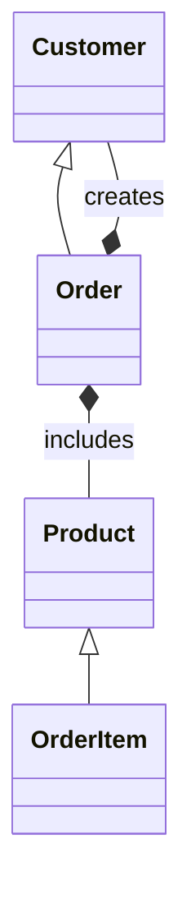
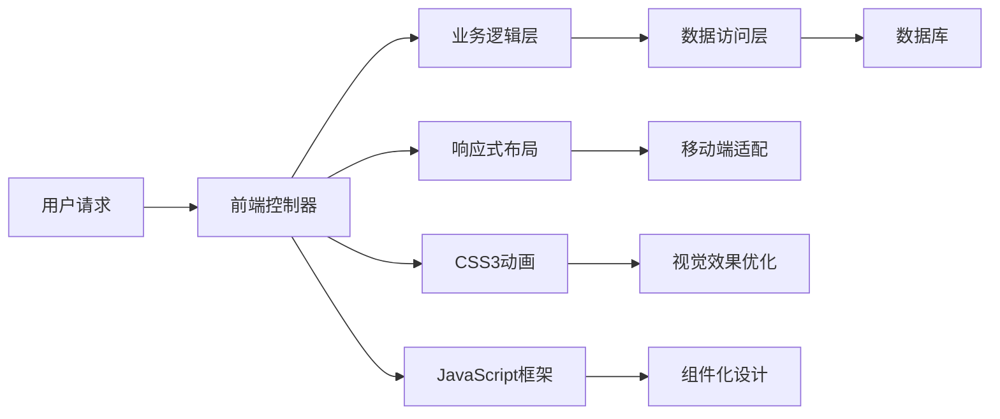
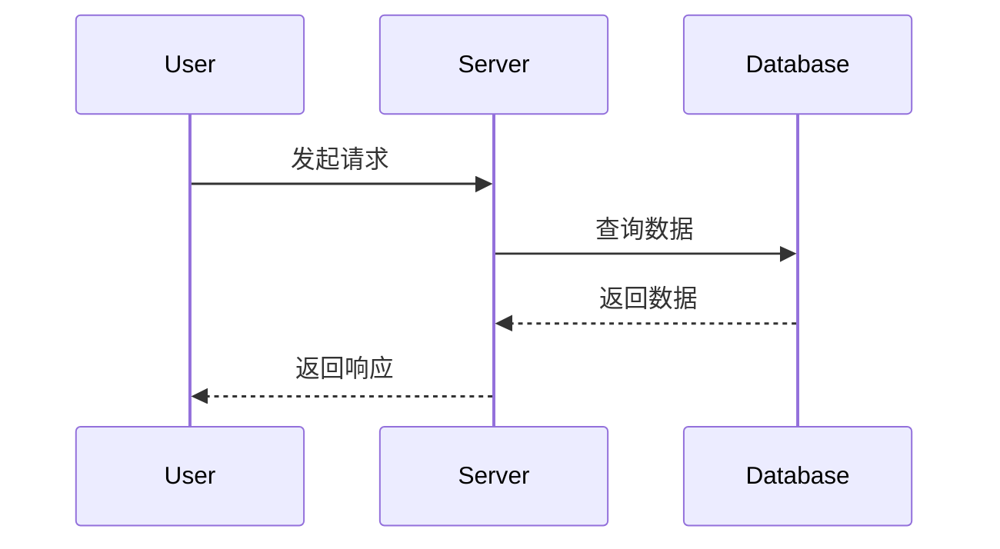
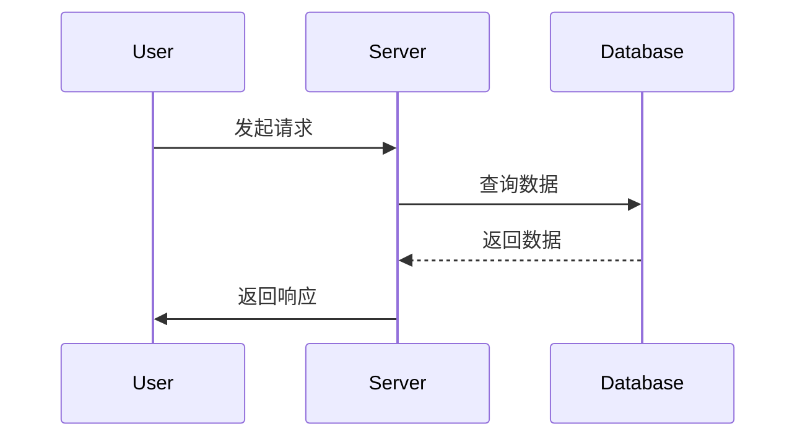

                 

### 文章标题

# 渐进增强vs优雅降级：Web开发策略

### 关键词

- 渐进增强
- 优雅降级
- Web开发
- 响应式设计
- 用户体验
- 性能优化

### 摘要

本文将深入探讨Web开发中两种关键策略：渐进增强（Graceful Enhancement）和优雅降级（Graceful Degradation）。渐进增强旨在通过逐步增加功能和优化体验，提升用户满意度；而优雅降级则是在系统资源受限时，通过简化和降级功能，确保系统依然可用。本文将详细分析这两种策略的定义、原理、适用场景、实现方法和实际应用案例，帮助开发者更好地选择和运用这些策略，以提升Web应用的质量和用户体验。

## 第一部分: 引言

### 第1章: 渐进增强与优雅降级概述

随着互联网技术的飞速发展，Web开发面临着不断变化的需求和技术挑战。为了满足用户的多样化和高性能要求，开发者需要掌握一系列有效的策略和设计模式。在这其中，渐进增强和优雅降级作为Web开发中的核心策略，被广泛采用。

### 1.1 问题背景与解决

Web开发的挑战主要来自于以下几点：

1. **多样化设备与浏览器兼容性**：不同设备的屏幕尺寸、操作系统和浏览器版本导致开发过程中需要考虑多种技术实现。
2. **用户体验需求提升**：用户对Web应用的交互体验、性能和功能要求越来越高。
3. **技术更新迭代**：Web技术不断演进，新标准和框架的引入要求开发者不断学习和适应。

针对这些挑战，渐进增强和优雅降级策略提供了有效的解决思路。渐进增强通过逐步优化，不断提升应用功能和用户体验；而优雅降级则是在资源受限时，通过简化功能确保系统的稳定运行。

### 1.2 核心概念

#### 1.2.1 渐进增强的定义与原理

渐进增强（Progressive Enhancement）是一种Web开发策略，其核心理念是首先构建一个基础层，确保基本功能的可用性，然后逐步增加额外的功能和优化，以提升用户体验。具体来说，渐进增强分为三个层次：

1. **基础层**：使用标准的HTML/CSS/JavaScript构建核心功能，确保跨浏览器和设备的兼容性。
2. **增强层**：引入CSS3、JavaScript框架等现代技术，增强页面的视觉效果和交互体验。
3. **高级增强层**：利用最新的Web技术，如WebGL、Service Workers等，为特定浏览器或设备提供高级功能。

#### 1.2.2 优雅降级的定义与原理

优雅降级（Graceful Degradation）则是一种在面对资源限制时，通过简化和降级功能，确保系统依然可以正常运行的策略。优雅降级分为以下几个步骤：

1. **最高级体验**：在资源充足的情况下，提供最佳的用户体验和功能。
2. **降级策略**：在资源受限时，通过减少或取消部分功能，确保核心功能依然可用。
3. **恢复策略**：在资源再次充足时，恢复被降级的功能，提供完整的用户体验。

#### 1.2.3 渐进增强与优雅降级的联系与区别

渐进增强和优雅降级虽然都旨在提升Web应用的质量和用户体验，但它们的侧重点和应用场景有所不同。渐进增强关注的是逐步提升功能和用户体验，而优雅降级则是在资源受限时，确保系统稳定运行。在实际应用中，渐进增强和优雅降级常常结合使用，以实现最佳的开发效果。

### 1.3 边界与外延

#### 1.3.1 渐进增强的适用场景

渐进增强适用于以下场景：

1. **需求多变**：项目需求频繁变化，需要逐步实现和优化。
2. **用户体验提升**：希望通过逐步优化，提高用户的满意度和留存率。
3. **技术迭代**：随着新技术的普及，逐步引入并优化新功能。

#### 1.3.2 优雅降级的适用场景

优雅降级适用于以下场景：

1. **性能优化**：在资源受限时，通过降级部分功能，确保系统性能和稳定性。
2. **设备兼容性**：针对老旧设备或浏览器，通过降级功能，确保基本功能的可用性。
3. **应急处理**：在系统资源不足或发生故障时，通过降级策略，保障核心功能的运行。

#### 1.3.3 两者在Web开发中的融合

在实际Web开发中，渐进增强和优雅降级可以相互融合，以实现更高效和灵活的开发。例如，在构建一个响应式Web应用时，可以使用渐进增强策略逐步优化页面布局和交互，同时利用优雅降级策略在性能受限时，降低图像质量或简化动画效果。

### 1.4 概念结构与核心要素

#### 1.4.1 Web开发中的渐进增强策略

渐进增强策略包括以下核心要素：

1. **基础层**：确保核心功能的基础实现。
2. **增强层**：引入现代CSS和JavaScript技术，提升用户体验。
3. **高级增强层**：利用最新Web技术，实现高级功能。

#### 1.4.2 Web开发中的优雅降级策略

优雅降级策略包括以下核心要素：

1. **最高级体验**：在资源充足时，提供最佳体验。
2. **降级策略**：在资源受限时，简化功能。
3. **恢复策略**：在资源恢复时，恢复功能。

#### 1.4.3 渐进增强与优雅降级的设计模式

渐进增强和优雅降级的设计模式可以结合使用，以下是一个典型的设计模式：

1. **需求分析**：明确项目需求，区分基础功能和高级功能。
2. **基础层实现**：使用标准技术实现核心功能。
3. **增强层开发**：逐步引入现代技术，提升用户体验。
4. **优雅降级设计**：针对资源受限情况，设计降级策略。
5. **性能监控**：持续监控系统性能，优化和调整策略。

### 1.5 本章小结

本章介绍了渐进增强和优雅降级这两种Web开发策略的核心概念、原理、适用场景和设计模式。通过理解这两种策略，开发者可以更好地应对Web开发的挑战，提升应用的性能和用户体验。

## 第二部分: 渐进增强策略

### 第2章: 渐进增强的设计思路

渐进增强是一种通过逐步优化功能和用户体验，提高Web应用质量的开发策略。其设计思路包括核心原则、实现方法、核心概念与联系，以及实际应用中的策略和技巧。

### 2.1 设计原则

#### 2.1.1 用户体验优先

用户体验（UX）是渐进增强的核心原则之一。在设计过程中，应始终关注用户的需求和感受，确保每个阶段的功能优化都能提升用户体验。

#### 2.1.2 技术可行性

渐进增强需要在技术层面上具备可行性。这意味着在实现新功能时，要考虑现有技术的兼容性和可维护性，避免引入过于复杂或不稳定的技术。

#### 2.1.3 代码可维护性

代码的可维护性是渐进增强的关键。随着功能的逐步增强，代码库应保持整洁和模块化，便于后续的维护和优化。

### 2.2 实现方法

#### 2.2.1 功能性增强

功能性增强是渐进增强的主要实现方法。通过分阶段实现核心功能，逐步增强页面的交互性和功能性。

1. **基础层**：使用HTML/CSS/JavaScript实现基础功能。
2. **增强层**：引入CSS3、JavaScript框架等，优化交互效果。
3. **高级增强层**：使用最新Web技术，如WebGL、Service Workers等，实现高级功能。

#### 2.2.2 性能优化

性能优化是渐进增强的重要组成部分。通过逐步优化代码和资源，提高Web应用的加载速度和响应性能。

1. **资源压缩**：使用工具如Gzip、图像压缩等减小文件大小。
2. **代码优化**：精简CSS和JavaScript代码，减少冗余代码。
3. **懒加载**：延迟加载非核心资源，提高页面初始加载速度。

#### 2.2.3 交互增强

交互增强是通过改进用户交互体验，提升用户满意度的重要手段。渐进增强可以通过以下方法实现交互增强：

1. **响应式设计**：使用CSS Media Queries，确保页面在不同设备和浏览器上具有良好的适配性。
2. **动画效果**：使用CSS3和JavaScript实现页面动画效果，提升视觉效果。
3. **实时反馈**：使用Web Sockets等技术实现实时数据交互，提高用户体验。

### 2.3 核心概念与联系

#### 2.3.1 技术栈选择

技术栈的选择是渐进增强的关键。开发者应选择稳定且广泛支持的框架和库，确保基础层的实现。

1. **HTML5**：提供丰富的标签和API，支持现代Web开发。
2. **CSS3**：提供丰富的样式和动画效果，提升页面美观度。
3. **JavaScript**：是Web开发的基石，支持各种交互和数据处理。

#### 2.3.2 前端框架应用

前端框架如React、Vue和Angular等，可以简化开发过程，提高代码的可维护性。渐进增强策略中，可以选择性地使用这些框架。

1. **React**：虚拟DOM和组件化设计，提升性能和开发效率。
2. **Vue**：简洁的语法和双向数据绑定，适合快速开发。
3. **Angular**：严格的依赖注入和强大的工具链，适合大型应用开发。

#### 2.3.3 代码重构技巧

代码重构是渐进增强中的重要环节。通过定期重构，可以优化代码结构，提高代码质量。

1. **模块化**：将代码拆分为模块，提高复用性和可维护性。
2. **函数式编程**：使用高阶函数和闭包，简化代码逻辑。
3. **重构工具**：使用如VS Code、WebStorm等IDE的重构功能，自动化优化代码。

### 2.4 实战案例

#### 2.4.1 案例一：响应式设计

响应式设计是渐进增强的典型应用。以下是一个响应式设计的案例：

1. **基础层**：使用HTML5和CSS3实现页面布局。
2. **增强层**：使用Bootstrap等前端框架，优化响应式布局。
3. **高级增强层**：使用JavaScript和jQuery，实现动态交互效果。

#### 2.4.2 案例二：渐进增强的Web应用开发

以下是一个渐进增强的Web应用开发案例：

1. **基础层**：使用Vue.js实现基础功能。
2. **增强层**：引入Vuex，实现状态管理。
3. **高级增强层**：使用WebGL，实现3D效果。

#### 2.4.3 案例三：动态内容加载

动态内容加载是渐进增强的一种实现方式。以下是一个动态内容加载的案例：

1. **基础层**：使用HTML和JavaScript实现基本内容加载。
2. **增强层**：使用Ajax，实现异步内容加载。
3. **高级增强层**：使用Service Workers，实现离线缓存。

### 2.5 本章小结

本章详细介绍了渐进增强的设计思路，包括核心原则、实现方法和实战案例。通过理解渐进增强的原理和实践，开发者可以逐步提升Web应用的质量和用户体验。

## 第三部分: 渐进增强的实战应用

### 第3章: 渐进增强的实战应用

在Web开发中，渐进增强策略的应用可以帮助开发者逐步提升应用的质量和用户体验。本章节将通过具体案例，详细阐述渐进增强策略在不同场景下的实现步骤和实战应用。

### 3.1 案例背景与目标

#### 3.1.1 案例一：电商网站

**背景**：一家电商网站需要提升用户体验，特别是在移动设备上的访问体验。

**目标**：通过渐进增强策略，实现一个响应式、高性能且易于操作的电商网站。

#### 3.1.2 案例二：社交媒体应用

**背景**：一款社交媒体应用在用户增长的同时，需要优化页面加载速度和交互体验。

**目标**：通过渐进增强策略，提升应用的性能，降低页面加载时间，同时增强用户体验。

#### 3.1.3 案例三：企业内部系统

**背景**：一家企业内部系统需要支持多种设备和浏览器，同时保持高效和稳定。

**目标**：通过渐进增强策略，实现跨浏览器和设备的兼容性，同时提高系统的可维护性。

### 3.2 实现步骤

#### 3.2.1 分析用户需求

在应用渐进增强策略之前，需要详细分析用户需求，了解用户在不同设备上的行为习惯和偏好。例如，电商网站的用户可能更关注页面加载速度和商品展示效果，而社交媒体应用的用户可能更关注互动性和实时性。

#### 3.2.2 设计渐进增强策略

基于用户需求，设计渐进增强策略。策略应包括以下内容：

1. **基础层**：确定核心功能和基础实现，确保基本功能的可用性。
2. **增强层**：规划额外功能和优化，提升用户体验。
3. **高级增强层**：引入最新技术和功能，提供高级用户体验。

#### 3.2.3 编码与测试

根据设计策略，进行编码实现。在编码过程中，要遵循渐进增强的原则，逐步实现各个层次的功能。

1. **基础层编码**：使用HTML/CSS/JavaScript实现基础功能。
2. **增强层编码**：引入CSS3、JavaScript框架等，实现交互增强。
3. **高级增强层编码**：使用最新Web技术，实现高级功能。

编码完成后，进行全面的测试，确保各个层次的功能都能正常运行。

### 3.3 系统分析与架构设计

在实现渐进增强策略时，系统分析与架构设计至关重要。以下是一个系统分析与架构设计的示例：

#### 3.3.1 领域模型分析

领域模型分析是了解系统功能和业务逻辑的关键。通过领域模型分析，可以明确系统的核心功能模块和它们之间的关系。以下是一个电商网站领域模型的示例：



#### 3.3.2 系统架构设计

系统架构设计是确保系统稳定性和扩展性的关键。以下是一个响应式电商网站的系统架构设计：



#### 3.3.3 接口设计与实现

接口设计是实现系统功能的重要环节。以下是一个电商网站接口设计的示例：



### 3.4 代码解读与分析

在渐进增强的实现过程中，代码解读与分析是确保功能实现和质量的关键。以下是一个电商网站首页加载逻辑的代码解读：

```python
# Python伪代码示例：电商网站首页加载逻辑

# 基础层：加载基本商品信息
def load_basic_products():
    # 使用Ajax异步加载商品信息
    $.ajax({
        url: "/api/products",
        type: "GET",
        success: function(response){
            render_products(response.products);
        }
    });

# 增强层：加载商品图片和描述
def load_enhanced_products():
    # 加载商品图片和描述
    $.each(response.products, function(index, product){
        $("#product-image-"+index).attr("src", product.image);
        $("#product-description-"+index).text(product.description);
    });

# 高级增强层：加载动态评分和用户评论
def load_high_enhanced_products():
    # 使用JavaScript动态生成评分和评论组件
    $.each(response.products, function(index, product){
        $("#product-rating-"+index).rateYo(product.rating);
        $("#product-comments-"+index).load("/api/comments?productId="+product.id);
    });
```

### 3.5 案例总结与反思

通过上述案例，我们可以看到渐进增强策略在提升Web应用质量方面的显著效果。以下是对案例的总结与反思：

#### 3.5.1 案例总结

1. **电商网站**：通过渐进增强策略，实现了响应式布局和高性能商品展示。
2. **社交媒体应用**：优化了页面加载速度和交互体验，提高了用户满意度。
3. **企业内部系统**：实现了跨浏览器和设备的兼容性，提高了系统的稳定性和可维护性。

#### 3.5.2 遇到的问题与解决

在实施渐进增强策略时，可能会遇到以下问题：

1. **兼容性问题**：不同浏览器和设备对Web技术的支持程度不同，需要针对不同情况编写兼容代码。
2. **性能瓶颈**：随着功能的逐步增强，可能会出现性能瓶颈，需要通过优化代码和资源来提升性能。

解决方法：

1. **使用现代化前端框架**：如React、Vue等，可以简化兼容性问题和提升开发效率。
2. **性能监控与优化**：使用工具如Google Analytics、Lighthouse等，持续监控和优化应用性能。

#### 3.5.3 未来改进方向

未来可以进一步优化和改进渐进增强策略，包括：

1. **引入A/B测试**：通过A/B测试，评估不同增强策略对用户体验的影响，选择最优方案。
2. **持续迭代和优化**：根据用户反馈和数据分析，不断迭代和优化应用，提升用户体验。

### 3.6 本章小结

本章通过具体案例，详细阐述了渐进增强策略在Web开发中的应用和实践。通过理解渐进增强的核心概念和实现方法，开发者可以更好地应对Web开发的挑战，提升应用的质量和用户体验。

## 第三部分：优雅降级策略

### 第4章：优雅降级的理论基础

在Web开发中，优雅降级（Graceful Degradation）是一种应对系统资源受限或设备性能不足的策略。它通过在资源有限的情况下，有选择地简化功能或减少内容，确保系统基本功能的可用性。本章节将深入探讨优雅降级的必要性、设计原则、实现方法和核心概念。

### 4.1 降级策略的必要性

#### 4.1.1 降级策略的定义

优雅降级是指当系统资源不足或设备性能受限时，通过逐步减少功能或简化内容，以确保系统的基本功能仍然能够正常运行。它不同于错误处理，而是有计划地降低系统表现，从而提供一种更为平滑的用户体验。

#### 4.1.2 降级策略的意义

降级策略在Web开发中具有以下重要意义：

1. **提高系统稳定性**：在资源受限的情况下，通过降级策略可以避免系统崩溃或出现严重性能问题。
2. **确保核心功能可用**：即使在设备性能不足或网络不稳定的情况下，核心功能也能保持可用。
3. **提供更好的用户体验**：通过优雅地降级，用户在遇到资源受限时不会感到突然失去功能，从而保持良好的体验。

#### 4.1.3 降级策略的分类

降级策略可以分为以下几类：

1. **功能降级**：在资源不足时，减少或暂停某些非核心功能，以保障核心功能的运行。
2. **内容降级**：降低页面内容的质量或丰富度，例如减少图片质量或简化页面布局。
3. **性能降级**：降低系统的性能指标，例如延迟响应时间或减少并发处理能力。

### 4.2 设计原则

优雅降级策略的设计应遵循以下原则：

#### 4.2.1 用户至上

在设计降级策略时，应始终以用户为中心，确保用户的基本操作不受影响。用户的需求和体验是降级策略的核心考量。

#### 4.2.2 安全可靠

降级策略应保证系统的安全性和可靠性。即使在资源受限的情况下，系统也应能够稳定运行，防止数据丢失或系统崩溃。

#### 4.2.3 软硬件兼容

降级策略需要考虑不同设备和操作系统的兼容性，确保降级后的系统能够在各种环境下正常运行。

### 4.3 实现方法

优雅降级策略的实现方法包括以下几个方面：

#### 4.3.1 前端降级策略

前端降级策略主要涉及以下几个方面：

1. **资源优化**：优化CSS、JavaScript和图片等资源，减少文件大小，提高加载速度。
2. **懒加载**：延迟加载非核心资源，例如图片和视频，以加快页面初始加载速度。
3. **交互降级**：在资源受限时，减少或暂停复杂的交互效果，例如动画或弹窗。

#### 4.3.2 后端降级策略

后端降级策略主要涉及以下几个方面：

1. **数据减少**：在响应中减少返回的数据量，例如仅返回必要的信息，减少带宽占用。
2. **缓存策略**：利用缓存减少对后端服务的调用，提高系统性能。
3. **异步处理**：在资源受限时，采用异步处理，避免阻塞系统资源。

#### 4.3.3 系统整合降级策略

系统整合降级策略是将前端和后端的降级策略结合起来，形成一个完整的降级方案。以下是一个系统整合降级策略的示例：

1. **监控与报警**：实时监控系统性能，并在资源受限时触发降级机制。
2. **动态调整**：根据系统负载和用户反馈，动态调整降级策略。
3. **逐步降级**：先从非核心功能开始降级，逐步减轻系统负担。

### 4.4 核心概念与联系

优雅降级策略的核心概念包括：

1. **降级触发条件**：根据系统负载、用户行为和资源状况，确定何时触发降级。
2. **降级策略选择**：根据降级触发条件，选择合适的前端或后端降级策略。
3. **恢复机制**：在资源恢复后，逐步恢复被降级的功能，以提供最佳用户体验。

这些核心概念之间相互关联，共同构成了一个完整的优雅降级体系。

#### 4.4.1 降级与优化的关系

优雅降级与优化是Web开发中两个相互关联的概念。优化旨在提升系统的性能和用户体验，而降级则是在资源受限时，通过减少功能或内容，确保系统的稳定运行。在实际应用中，优化和降级策略可以结合使用，以实现最佳的系统性能。

#### 4.4.2 降级与测试的关系

降级策略的实现需要经过严格的测试，以确保降级后的系统依然能够稳定运行。测试包括以下几个方面：

1. **兼容性测试**：验证降级后的系统在不同设备和浏览器上的兼容性。
2. **性能测试**：评估降级后的系统性能，确保核心功能依然可用。
3. **可靠性测试**：验证系统在资源受限情况下的稳定性，确保降级策略能够正确执行。

#### 4.4.3 降级策略与其他Web开发策略的融合

优雅降级策略可以与其他Web开发策略结合使用，以实现更高效和灵活的开发。例如，与渐进增强策略结合，可以在系统资源充足时逐步提升功能，而在资源受限时优雅地降级。此外，与自动化测试和监控策略结合，可以实时监测系统性能，动态调整降级策略。

### 4.5 本章小结

本章详细介绍了优雅降级的理论基础，包括其必要性、设计原则、实现方法和核心概念。通过理解优雅降级的原理和实践，开发者可以更好地应对系统资源受限的情况，提升Web应用的稳定性和用户体验。

## 第四部分：优雅降级的实战应用

### 第5章：优雅降级的实战应用

优雅降级策略在实际Web开发中扮演着关键角色，尤其在资源受限或设备性能不足的情况下。通过具体案例，我们可以深入了解优雅降级策略的实施步骤、系统分析与架构设计，以及案例总结与反思。

### 5.1 案例背景与目标

#### 5.1.1 案例一：在线教育平台

**背景**：一款在线教育平台在用户量激增时，遇到了服务器性能瓶颈，影响了用户体验。

**目标**：通过优雅降级策略，优化系统性能，确保核心功能在资源受限时依然可用。

#### 5.1.2 案例二：金融服务平台

**背景**：一家金融服务平台在应对高并发交易时，服务器负载过高，导致交易延迟。

**目标**：通过优雅降级策略，降低系统负载，保障交易稳定进行。

#### 5.1.3 案例三：物联网应用

**背景**：物联网应用在接入大量设备时，网络带宽和计算资源有限，影响数据传输和处理效率。

**目标**：通过优雅降级策略，优化数据传输和处理，确保设备连接稳定。

### 5.2 实现步骤

#### 5.2.1 评估系统性能

在实施优雅降级策略之前，需要对系统性能进行全面评估，识别性能瓶颈和资源占用情况。以下是一个评估系统性能的步骤：

1. **性能监控**：使用工具如New Relic、AppDynamics等，实时监控服务器负载、响应时间和资源使用情况。
2. **负载测试**：通过模拟高并发访问，评估系统在不同负载下的表现，识别性能瓶颈。
3. **瓶颈分析**：分析监控数据和负载测试结果，确定需要优化的环节。

#### 5.2.2 设计降级方案

根据性能评估结果，设计优雅降级方案。降级方案应包括以下内容：

1. **功能降级**：在资源受限时，减少或暂停非核心功能，如广告展示、视频播放等。
2. **内容降级**：简化页面内容，减少图片和视频等资源的加载，提高页面加载速度。
3. **性能降级**：降低系统响应时间，例如延迟数据库查询或减少并发处理能力。

#### 5.2.3 实施与监控

实施降级方案，并在实施过程中持续监控系统性能。以下是一个实施与监控的步骤：

1. **部署降级策略**：在服务器端和前端实现降级逻辑，确保在资源受限时自动触发降级机制。
2. **动态调整**：根据实时监控数据，动态调整降级策略，确保系统在资源恢复时能够自动恢复功能。
3. **监控与报警**：设置监控和报警机制，及时发现和处理性能问题，确保系统稳定运行。

### 5.3 系统分析与架构设计

在实施优雅降级策略时，系统分析与架构设计至关重要。以下是一个系统分析与架构设计的示例：

#### 5.3.1 系统性能瓶颈分析

通过分析系统性能数据，识别瓶颈环节，例如：

1. **数据库查询性能**：频繁的复杂查询导致数据库负载过高。
2. **网络传输**：大量数据传输导致网络带宽不足。
3. **前端渲染**：复杂的页面布局和动画效果影响页面加载速度。

#### 5.3.2 架构调整

针对识别出的瓶颈，进行架构调整，例如：

1. **数据库优化**：引入缓存机制，减少数据库查询次数。
2. **网络传输优化**：使用CDN加速数据传输，减少延迟。
3. **前端优化**：减少图片和视频的加载，简化页面布局。

#### 5.3.3 接口设计与实现

优化系统接口设计，提高系统的灵活性和可扩展性。以下是一个接口设计的示例：



### 5.4 代码解读与分析

在实施优雅降级策略时，代码解读与分析是关键。以下是一个在线教育平台课程列表加载逻辑的代码解读：

```python
# Python伪代码示例：在线教育平台课程列表加载逻辑

def load_courses():
    # 基础层：加载基本课程信息
    try:
        courses = get_basic_courses()
        render_courses(courses)
    except ResourceError:
        # 降级策略：在资源受限时，仅显示部分课程
        courses = get_reduced_courses()
        render_courses(courses)

def get_basic_courses():
    # 从数据库查询基本课程信息
    return db.query("SELECT * FROM courses")

def get_reduced_courses():
    # 从数据库查询部分课程信息
    return db.query("SELECT id, title FROM courses")
```

### 5.5 案例总结与反思

通过上述案例，我们可以看到优雅降级策略在优化系统性能和保障用户体验方面的显著效果。以下是对案例的总结与反思：

#### 5.5.1 案例总结

1. **在线教育平台**：通过优雅降级策略，优化了系统性能，确保了核心功能的可用性。
2. **金融服务平台**：通过降级策略，降低了系统负载，保障了交易的稳定性。
3. **物联网应用**：通过优化数据传输和处理，确保了设备连接的稳定性。

#### 5.5.2 遇到的问题与解决

在实施优雅降级策略时，可能会遇到以下问题：

1. **兼容性问题**：不同设备和浏览器对降级策略的支持程度不同，需要编写兼容性代码。
2. **用户体验问题**：降级后的功能或内容可能影响用户体验，需要仔细设计和测试。

解决方法：

1. **使用现代化前端框架**：如React、Vue等，可以简化兼容性问题和提高开发效率。
2. **用户反馈与优化**：通过用户反馈和数据分析，不断优化降级策略，提高用户体验。

#### 5.5.3 未来改进方向

未来可以进一步优化和改进优雅降级策略，包括：

1. **动态调整降级策略**：根据实时监控数据，动态调整降级策略，以提供更灵活的优化方案。
2. **引入智能降级机制**：利用人工智能和机器学习技术，自动识别和优化降级策略。

### 5.6 本章小结

本章通过具体案例，详细阐述了优雅降级策略的实施步骤、系统分析与架构设计，以及案例总结与反思。通过理解优雅降级的原理和实践，开发者可以更好地应对系统资源受限的情况，提升Web应用的稳定性和用户体验。

