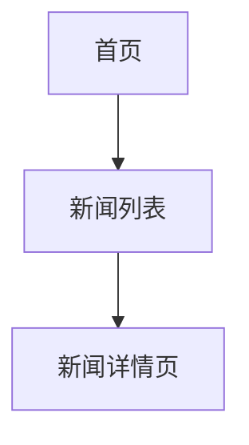
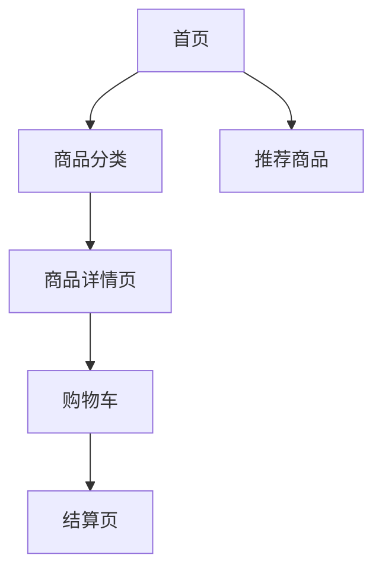
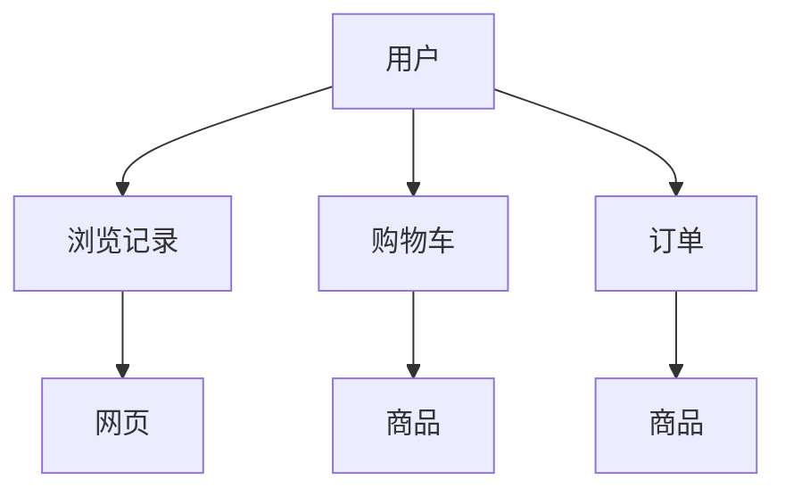
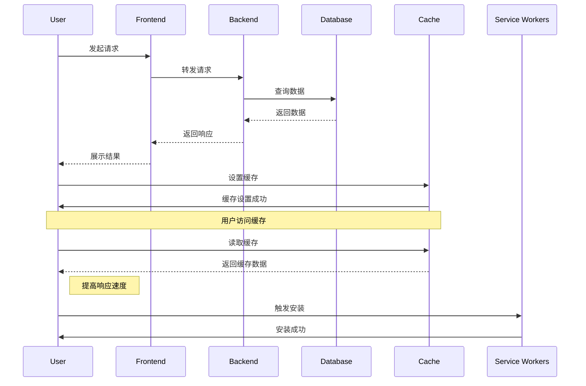
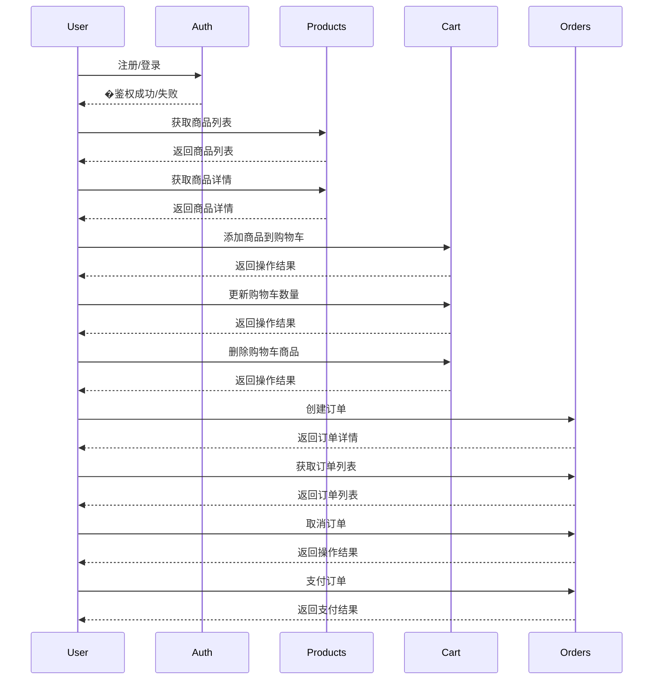
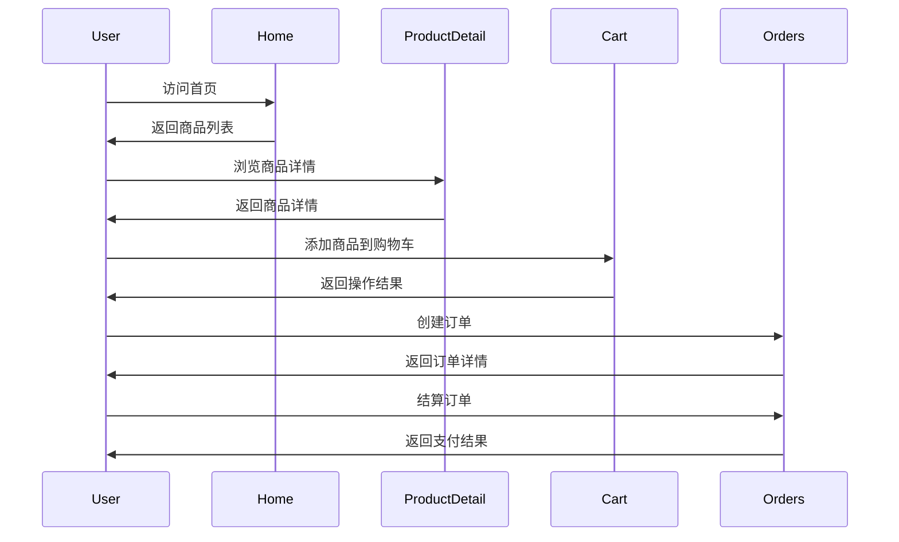

                 

### 《渐进式Web应用（PWA）开发实践》

#### 关键词：
渐进式Web应用、PWA、开发实践、Service Workers、缓存策略、性能优化

#### 摘要：
渐进式Web应用（Progressive Web Apps，简称PWA）作为现代Web开发的先进模式，通过结合Web技术与原生应用的优点，为用户提供了一种性能卓越、易于使用和安装的应用体验。本文旨在深入探讨PWA的开发实践，从基础理论到实际项目实战，系统性地解析PWA的开发方法、性能优化技巧以及安全性、兼容性处理，为开发者提供全面的PWA开发指南。

## 第一部分：PWA基础与框架搭建

### 第1章：渐进式Web应用（PWA）概述

#### 1.1 PWA的定义与背景

渐进式Web应用（Progressive Web Apps，简称PWA）是一种通过现代Web技术构建的应用程序，它能够提供类似原生应用的体验，同时保留了Web应用的便利性。PWAs不仅仅是一个网站，它们具有以下特点：

- **渐进式**：PWA能够渐进地提高性能和功能，无论用户设备的性能如何，都能提供一种一致的体验。
- **响应式**：PWA能够适应不同的设备和屏幕尺寸，提供良好的用户体验。
- **安装性**：PWA可以像原生应用一样被安装到用户的桌面或主屏幕，提供快捷访问。
- **安全**：PWA通常使用HTTPS，确保用户数据的安全。
- **可发现性**：PWA可以通过搜索引擎进行索引，提高应用的可见性。

PWA的概念起源于Google，它们的目标是弥合Web应用与原生应用之间的差距。随着现代Web技术的发展，特别是Service Workers和Web Manifest文件的引入，PWA已经成为一种备受关注的开发模式。

#### 1.2 PWA与传统Web应用的对比

与传统Web应用相比，PWA具有以下几个显著优势：

- **用户体验**：PWA能够提供更快的加载速度、离线访问、推送通知等原生应用级别的用户体验。
- **安装与分发**：PWA可以通过链接直接访问，用户可以将其添加到主屏幕，类似于原生应用的安装过程，无需通过应用商店。
- **技术依赖**：PWA依赖于现代Web技术，如Service Workers、Web Manifest文件等，使得开发过程更为简便。
- **跨平台**：PWA可以在不同的设备和操作系统上运行，无需为每个平台单独开发。

然而，传统Web应用也有其优势，如平台兼容性更好、更容易更新和维护。PWA和传统Web应用并不是对立的，开发者可以根据项目需求选择适合的技术方案。

#### 1.3 PWA的关键特性

PWA具有以下几个关键特性：

- **快速**：PWA利用Service Workers实现离线缓存和快速加载，提高用户体验。
- **可靠**：即使网络连接不稳定，PWA也能提供可靠的体验。
- **安装性**：用户可以通过简单的操作将PWA添加到主屏幕，类似于原生应用的安装。
- **可发现**：PWA可以通过搜索引擎和社交网络进行传播，提高应用的可发现性。
- **渐进增强**：无论用户设备性能如何，PWA都能提供一致的体验。

#### 1.4 PWA的适用场景

PWA适用于以下场景：

- **移动端应用**：提供快速响应的移动应用体验，适合电商、新闻阅读、社交媒体等。
- **离线应用**：需要提供离线访问功能的场景，如地图导航、在线文档编辑等。
- **内部应用**：公司内部使用的应用，可以减少对特定操作系统的依赖。
- **IoT设备**：适用于连接性不稳定或资源有限的IoT设备，如智能手表、智能家居设备等。

#### 1.5 本章小结

本章介绍了渐进式Web应用（PWA）的基本概念、与传统Web应用的对比、PWA的关键特性及其适用场景。在接下来的章节中，我们将深入探讨PWA的开发实践，包括框架搭建、Service Workers、Manifest文件等关键技术。

## 第二部分：PWA进阶技巧

### 第2章：创建PWA应用

在了解了PWA的基本概念和优势后，接下来我们将深入探讨如何创建一个PWA应用。本章将介绍PWA应用的基本结构，并重点讲解Service Workers和Manifest文件的使用。

#### 2.1 PWA应用的基本结构

一个PWA应用的基本结构可以分为以下几个部分：

- **HTML**：应用的主页面，定义了应用的布局和内容。
- **CSS**：应用的样式表，用于定义页面的外观和样式。
- **JavaScript**：应用的脚本文件，实现了应用的逻辑和功能。
- **Service Workers**：用于实现离线缓存、后台同步等功能。
- **Web Manifest文件**：定义了应用的安装信息和界面样式。

下面是一个简单的HTML文件示例：

```html
<!DOCTYPE html>
<html lang="zh">
<head>
  <meta charset="UTF-8">
  <meta name="viewport" content="width=device-width, initial-scale=1.0">
  <title>PWA示例应用</title>
  <link rel="stylesheet" href="styles.css">
  <link rel="manifest" href="manifest.json">
</head>
<body>
  <h1>欢迎来到PWA示例应用</h1>
  <button id="install">安装应用</button>
  <script src="app.js"></script>
</body>
</html>
```

在上面的示例中，我们定义了一个简单的HTML页面，并链接了样式表和Manifest文件。接下来，我们将详细讲解Service Workers和Manifest文件的使用。

#### 2.2 使用Service Workers实现离线缓存

Service Workers是PWA的核心技术之一，它允许开发者实现离线缓存、后台同步等功能。Service Workers是一个运行在浏览器后台的脚本，它可以在用户无操作时进行网络请求和处理。

##### 2.2.1 Service Workers的工作原理

Service Workers的工作原理可以概括为以下几个步骤：

1. **注册Service Worker**：当浏览器加载页面时，会检查是否存在Service Worker文件，并尝试注册它。
2. **监听事件**：注册成功的Service Worker会监听特定的事件，如`install`、`fetch`、`push`等。
3. **处理事件**：当相应的事件发生时，Service Worker会进行处理，如缓存资源、更新缓存等。
4. **解除控制**：当Service Worker完成其任务后，会解除对页面的控制，浏览器将继续执行正常的JavaScript代码。

下面是一个简单的Service Worker脚本示例：

```javascript
self.addEventListener('install', function(event) {
  event.waitUntil(
    caches.open('my-cache').then(function(cache) {
      return cache.addAll([
        '/',
        '/styles.css',
        '/app.js'
      ]);
    })
  );
});

self.addEventListener('fetch', function(event) {
  event.respondWith(
    caches.match(event.request).then(function(response) {
      return response || fetch(event.request);
    })
  );
});
```

在上面的示例中，我们首先在`install`事件中通过`caches.open()`方法创建一个新的缓存，然后使用`cache.addAll()`方法将指定的资源添加到缓存中。接着，在`fetch`事件中，我们使用`caches.match()`方法尝试从缓存中获取请求的资源，如果缓存中存在，则返回缓存资源，否则发起网络请求。

##### 2.2.2 Service Workers的生命周期

Service Workers有一个明确的生命周期，包括以下几个阶段：

- **待激活状态（待激活）**：Service Worker脚本被注册，但尚未激活。
- **激活状态（激活）**：Service Worker脚本被激活，开始监听事件。
- **挂起状态（挂起）**：Service Worker脚本因某些原因被挂起，但仍保持其状态。
- **删除状态（删除）**：Service Worker脚本将被删除。

开发者可以通过监听`install`、`activate`、`fetch`等事件来控制Service Worker的行为。例如，在`activate`事件中，可以清理旧的缓存版本：

```javascript
self.addEventListener('activate', function(event) {
  var cacheWhitelist = ['my-cache'];

  event.waitUntil(
    caches.keys().then(function(cacheNames) {
      return Promise.all(
        cacheNames.map(function(cacheName) {
          if (cacheWhitelist.indexOf(cacheName) === -1) {
            return caches.delete(cacheName);
          }
        })
      );
    })
  );
});
```

在上面的示例中，我们通过`caches.keys()`方法获取所有缓存的名称，然后使用`Promise.all()`方法同时删除不在白名单中的缓存。

##### 2.2.3 Service Workers的缓存策略

Service Workers的缓存策略是确保应用在离线时能够正常工作的关键。以下是一些常用的缓存策略：

1. **网络优先**：在离线时使用缓存，但在网络恢复时更新缓存。
   ```javascript
   self.addEventListener('fetch', function(event) {
     event.respondWith(
       caches.open('my-cache').then(function(cache) {
         return fetch(event.request).then(function(response) {
           cache.put(event.request, response.clone());
           return response;
         });
       }).catch(function() {
         return caches.match(event.request);
       })
     );
   });
   ```

2. **缓存优先**：在离线时使用缓存，但在网络恢复时更新缓存。
   ```javascript
   self.addEventListener('fetch', function(event) {
     event.respondWith(
       caches.match(event.request).then(function(response) {
         return response || fetch(event.request);
       })
     );
   });
   ```

3. **协商缓存**：在请求缓存之前，先查询缓存是否有更新。
   ```javascript
   self.addEventListener('fetch', function(event) {
     event.respondWith(
       caches.match(event.request).then(function(response) {
         if (response) {
           return response;
         }

         return fetch(event.request).then(function(response) {
           if (!response || response.status !== 200 || response.type !== 'basic') {
             return response;
           }

           var responseToCache = response.clone();
           caches.open('my-cache').then(function(cache) {
             cache.put(event.request, responseToCache);
           });

           return response;
         });
       })
     );
   });
   ```

通过合理地设置缓存策略，可以确保PWA应用在离线时能够提供一致的用户体验。

#### 2.3 使用Manifest文件配置PWA应用

Manifest文件是PWA应用的配置文件，它定义了应用的名称、图标、主题颜色等信息。Manifest文件通常是一个JSON格式的文件，例如：

```json
{
  "name": "PWA示例应用",
  "short_name": "PWA示例",
  "description": "一个简单的PWA示例应用",
  "start_url": "/index.html",
  "display": "standalone",
  "background_color": "#ffffff",
  "theme_color": "#000000",
  "icons": [
    {
      "src": "icon/lowres.webp",
      "sizes": "48x48",
      "type": "image/webp"
    },
    {
      "src": "icon/hd_hi.ico",
      "sizes": "128x128 512x512",
      "type": "image/vnd.microsoft.icon"
    },
    {
      "src": "icon/hd_hi.png",
      "sizes": "128x128 512x512",
      "type": "image/png"
    }
  ]
}
```

在上面的示例中，我们定义了一个简单的Manifest文件，其中包含了应用的名称、描述、启动URL、显示模式、背景颜色、主题颜色以及图标信息。

##### 2.3.1 Manifest文件的基本结构

Manifest文件的基本结构如下：

- `name`：应用的名称。
- `short_name`：应用在主屏幕上的短名称。
- `description`：应用的描述。
- `start_url`：应用的启动页面。
- `display`：应用的显示模式，可以是`standalone`、`fullscreen`、`minimal-ui`或`browser`。
- `background_color`：应用的背景颜色。
- `theme_color`：应用的主题颜色。
- `icons`：应用的图标信息，包括图标源、大小和类型。

##### 2.3.2 配置PWA应用的图标和主题颜色

配置PWA应用的图标和主题颜色是提升用户体验的重要步骤。通过在Manifest文件中定义图标和主题颜色，可以使PWA应用在主屏幕上具有吸引人的视觉效果。

例如，在Manifest文件中添加以下图标信息：

```json
{
  "icons": [
    {
      "src": "icon/lowres.webp",
      "sizes": "48x48",
      "type": "image/webp"
    },
    {
      "src": "icon/hd_hi.ico",
      "sizes": "128x128 512x512",
      "type": "image/vnd.microsoft.icon"
    },
    {
      "src": "icon/hd_hi.png",
      "sizes": "128x128 512x512",
      "type": "image/png"
    }
  ]
}
```

通过上述配置，我们可以定义多个不同尺寸的图标，以适应不同设备和屏幕分辨率。

##### 2.3.3 将Web应用转换为PWA

将一个现有的Web应用转换为PWA相对简单。以下是一个基本的步骤：

1. **添加Manifest文件**：在应用的根目录中添加一个Manifest文件，如`manifest.json`。

2. **添加Service Workers**：在应用的根目录中创建一个Service Workers脚本，如`service-worker.js`。

3. **更新HTML文件**：在应用的HTML文件中添加一个`<link rel="manifest"`标签，指向Manifest文件的路径。

例如，在HTML文件中添加以下代码：

```html
<link rel="manifest" href="/manifest.json">
```

4. **触发安装**：在应用的HTML文件中添加一个按钮，以便用户可以触发PWA的安装。

例如，添加以下按钮：

```html
<button id="install">安装应用</button>
```

然后在JavaScript文件中添加以下代码：

```javascript
document.getElementById('install').addEventListener('click', function() {
  if ('serviceWorker' in navigator) {
    navigator.serviceWorker.register('/service-worker.js').then(function(registration) {
      console.log('Service Worker 注册成功:', registration);
    }).catch(function(error) {
      console.log('Service Worker 注册失败:', error);
    });
  }
});
```

通过上述步骤，用户点击按钮时，会触发Service Workers的注册过程，并将应用添加到主屏幕。

#### 2.4 本章小结

本章介绍了PWA应用的基本结构和创建方法，重点讲解了Service Workers和Manifest文件的使用。通过本章的学习，读者应该能够理解PWA的核心技术，并具备创建一个基本PWA应用的能力。在下一章中，我们将进一步探讨PWA的性能优化技巧。

## 第三部分：PWA进阶技巧

### 第3章：提升PWA性能

PWA性能的提升是确保用户获得良好体验的关键。本章将介绍一些实用的PWA性能优化技巧，包括资源预加载、优化网络请求以及代码分割和懒加载。

#### 3.1 资源预加载

资源预加载是提高PWA性能的重要手段之一。通过预加载资源，可以在用户访问页面时更快地加载内容，减少延迟和等待时间。以下是一些资源预加载的方法：

##### 3.1.1 使用Link标签预加载资源

在HTML页面中，可以使用`<link rel="preload">`标签来预加载关键资源。这种方法可以提前加载CSS、JavaScript文件、字体等资源，减少资源加载的延迟。

```html
<link rel="preload" href="styles.css" as="style">
<link rel="preload" href="app.js" as="script">
```

在上面的示例中，我们预加载了CSS文件和JavaScript文件。通过使用`as`属性，可以指定预加载的资源类型，如`style`（样式）、`script`（脚本）等。

##### 3.1.2 Service Workers中的预缓存策略

除了使用`<link rel="preload">`标签，Service Workers也可以用于实现预缓存策略。通过在Service Workers脚本中预缓存关键资源，可以在用户首次访问页面时更快地加载内容。

```javascript
self.addEventListener('install', function(event) {
  event.waitUntil(
    caches.open('precache').then(function(cache) {
      return cache.addAll([
        '/',
        '/styles.css',
        '/app.js',
        '/images/logo.png'
      ]);
    })
  );
});
```

在上面的示例中，我们使用`caches.open()`方法创建一个新的缓存，然后使用`cache.addAll()`方法将指定的资源预缓存到缓存中。

#### 3.2 优化网络请求

优化网络请求是提高PWA性能的关键步骤。以下是一些常用的优化方法：

##### 3.2.1 压缩资源文件

压缩资源文件可以减小文件体积，加快加载速度。常用的资源压缩方法包括Gzip压缩、Brotli压缩等。在服务器端，可以使用Gzip等压缩工具对静态资源文件进行压缩。

```bash
gzip -9 -c styles.css > styles.css.gz
```

在服务器配置中，可以启用HTTP压缩，将压缩后的资源发送给客户端。

##### 3.2.2 使用HTTP/2提高请求效率

HTTP/2是一种新的网络协议，它提供了多项优化，如多路复用、头部压缩等，可以提高请求效率。启用HTTP/2可以减少请求延迟，加快资源加载速度。

在服务器配置中，可以启用HTTP/2。例如，在Nginx中，可以在配置文件中添加以下内容：

```nginx
http2;
```

#### 3.3 使用代码分割和懒加载

代码分割和懒加载是提高PWA性能的有效方法，可以减少初始加载时间，提高用户体验。以下是一些具体的方法：

##### 3.3.1 代码分割的概念与实现

代码分割是将JavaScript代码拆分为多个独立的模块，每个模块负责不同的功能。通过代码分割，可以按需加载模块，减少初始加载时间。

在webpack等构建工具中，可以使用动态导入语法实现代码分割。例如：

```javascript
import('/components/navbar.js').then((module) => {
  const Navbar = module.default;
  document.body.appendChild(Navbar());
});
```

在上面的示例中，我们使用`import()`函数动态导入`navbar.js`模块，并在模块加载完成后将其添加到页面中。

##### 3.3.2 懒加载的使用场景与实现

懒加载是按需加载资源的一种方法，可以减少初始加载时间，提高用户体验。常见的使用场景包括图片、视频、JavaScript模块等。

在webpack等构建工具中，可以使用`@loadable/component`库实现懒加载。例如：

```javascript
import Loadable from '@loadable/component';

const Home = Loadable(() => import('./components/Home'));

function App() {
  return (
    <div>
      <Home />
    </div>
  );
}
```

在上面的示例中，我们使用`Loadable`函数包裹`Home`组件，当组件被首次渲染时，会按需加载`Home`模块。

#### 3.4 本章小结

本章介绍了PWA性能优化的几个关键技巧，包括资源预加载、优化网络请求和代码分割与懒加载。通过合理地应用这些技巧，可以显著提高PWA的性能，提升用户体验。在下一章中，我们将进一步探讨如何构建可定制的PWA。

### 第4章：构建可定制的PWA

一个可定制的PWA不仅能够提供出色的用户体验，还能更好地满足不同用户的需求。本章将介绍如何使用自定义样式、自定义Service Workers以及集成第三方库和插件来构建可定制的PWA。

#### 4.1 使用自定义样式定制UI

自定义样式是打造个性化PWA的重要一环。通过编写CSS文件并应用到PWA中，可以轻松地改变PWA的外观和主题。

##### 4.1.1 CSS定制UI

首先，我们可以编写一个CSS文件，定义PWA的样式。例如，创建一个名为`styles.css`的文件：

```css
/* styles.css */
body {
  font-family: 'Arial', sans-serif;
  background-color: #f5f5f5;
  color: #333;
}

h1 {
  color: #0056b3;
}

button {
  background-color: #0056b3;
  color: #fff;
  border: none;
  padding: 10px 20px;
  border-radius: 5px;
  cursor: pointer;
}
```

然后，在HTML文件中引入这个样式文件：

```html
<link rel="stylesheet" href="styles.css">
```

通过这种方式，我们可以全局地改变PWA的样式。

##### 4.1.2 使用第三方UI框架

除了自定义CSS，我们还可以使用第三方UI框架来定制PWA的UI。这些框架通常提供了丰富的组件和样式，可以帮助我们快速构建现代化的界面。

例如，可以使用Bootstrap或Ant Design等框架。以Bootstrap为例，我们可以引入其CSS文件：

```html
<link rel="stylesheet" href="https://cdn.jsdelivr.net/npm/bootstrap@5.1.3/dist/css/bootstrap.min.css">
```

然后，在HTML文件中使用Bootstrap的组件：

```html
<!DOCTYPE html>
<html lang="zh">
<head>
  <meta charset="UTF-8">
  <title>PWA示例应用</title>
  <link rel="stylesheet" href="https://cdn.jsdelivr.net/npm/bootstrap@5.1.3/dist/css/bootstrap.min.css">
  <link rel="manifest" href="manifest.json">
</head>
<body>
  <h1 class="text-center">欢迎来到PWA示例应用</h1>
  <div class="container">
    <button class="btn btn-primary">安装应用</button>
  </div>
  <script src="app.js"></script>
</body>
</html>
```

通过这种方式，我们可以利用第三方UI框架的组件来快速定制PWA的UI。

#### 4.2 自定义Service Workers

自定义Service Workers可以帮助我们根据具体需求实现更加灵活的缓存策略和后台功能。以下是如何自定义Service Workers的一些方法。

##### 4.2.1 重写Service Workers脚本

我们可以重写现有的Service Workers脚本，以实现更复杂的缓存逻辑和功能。例如，创建一个名为`service-worker.js`的文件，并在其中实现自定义逻辑：

```javascript
self.addEventListener('install', function(event) {
  event.waitUntil(
    caches.open('custom-cache').then(function(cache) {
      return cache.addAll([
        '/',
        '/styles.css',
        '/app.js',
        '/images/logo.png'
      ]);
    })
  );
});

self.addEventListener('fetch', function(event) {
  event.respondWith(
    caches.match(event.request).then(function(response) {
      return response || fetch(event.request);
    })
  );
});
```

在这个示例中，我们自定义了缓存名称和缓存策略。

##### 4.2.2 Service Workers的调试与优化

调试Service Workers可以帮助我们发现和修复问题。在开发过程中，可以使用浏览器开发者工具中的Service Workers面板来调试Service Workers脚本。

此外，Service Workers的优化也是确保PWA性能的关键。以下是一些优化建议：

- **避免在Service Workers中使用复杂的逻辑**：复杂的逻辑可能导致Service Workers运行缓慢，影响用户体验。
- **定期清理缓存**：缓存过多可能会导致性能下降，因此需要定期清理不用的缓存。
- **使用工作线程**：对于一些计算密集型的任务，可以考虑使用工作线程（Web Workers）来提升性能。

#### 4.3 集成第三方库和插件

集成第三方库和插件是构建可定制PWA的另一个重要手段。第三方库和插件可以提供丰富的功能和便利的接口，帮助我们快速实现复杂的业务逻辑。

##### 4.3.1 使用第三方库

例如，我们可以使用Vue或React等前端框架来构建PWA。以Vue为例，首先需要安装Vue和相关依赖：

```bash
npm install vue
```

然后，在`app.js`文件中引入Vue：

```javascript
import Vue from 'vue';

new Vue({
  el: '#app',
  template: `
    <div>
      <h1>欢迎来到PWA示例应用</h1>
      <button @click="install">安装应用</button>
    </div>
  `,
  methods: {
    install() {
      // 安装PWA的逻辑
    }
  }
});
```

通过这种方式，我们可以利用Vue的组件和指令来构建PWA的界面。

##### 4.3.2 插件的使用与集成

插件是第三方库的一种形式，用于扩展现有框架的功能。例如，我们可以使用Vue Router实现路由功能：

```bash
npm install vue-router
```

然后，在`app.js`文件中引入Vue Router：

```javascript
import Vue from 'vue';
import VueRouter from 'vue-router';
import Home from './components/Home.vue';

Vue.use(VueRouter);

const routes = [
  {
    path: '/',
    component: Home
  }
];

const router = new VueRouter({
  routes
});

new Vue({
  el: '#app',
  router
});
```

通过这种方式，我们可以使用Vue Router来管理PWA的页面路由。

#### 4.4 本章小结

本章介绍了如何构建可定制的PWA，包括使用自定义样式、自定义Service Workers以及集成第三方库和插件。通过这些方法，我们可以为用户提供更加个性化和丰富的体验。在下一章中，我们将通过两个实际项目实战，进一步展示PWA的开发过程和实战技巧。

### 第5章：PWA项目实战一——新闻阅读应用

在本章中，我们将通过一个新闻阅读应用的实战项目，详细介绍PWA的开发过程。这个项目将涵盖环境安装与配置、应用架构设计以及系统核心实现和项目调试与优化。

#### 5.1 项目概述

新闻阅读应用的目标是提供快速、便捷的新闻浏览体验，并支持离线阅读功能。该项目分为前端和后端两部分，前端负责展示新闻内容和提供用户交互，后端负责提供新闻数据。

#### 5.2 环境安装与配置

要开始这个项目，我们需要安装以下环境：

1. **Node.js**：安装最新版本的Node.js，确保支持最新的Web技术。
2. **npm或yarn**：安装npm或yarn作为包管理工具。
3. **Vue CLI**：通过Vue CLI创建Vue项目。

首先，确保已安装Node.js和npm。然后，使用以下命令安装Vue CLI：

```bash
npm install -g @vue/cli
```

接着，创建一个新的Vue项目：

```bash
vue create news-reader-pwa
```

在创建项目时，选择PWA模板，这将自动设置PWA相关的配置。

#### 5.3 应用架构设计

新闻阅读应用的主要功能模块包括：

- **首页**：展示新闻列表。
- **新闻详情页**：显示新闻内容。
- **离线缓存**：缓存新闻内容，实现离线阅读。

以下是应用的功能模块划分：



#### 5.3.1 技术栈选择

前端技术栈：

- **Vue**：用于构建前端界面。
- **Vue Router**：用于管理页面路由。
- **Vuex**：用于管理应用状态。
- **Axios**：用于与后端API通信。

后端技术栈：

- **Node.js**：用于构建后端API。
- **Express**：用于创建Web服务器。
- **MongoDB**：用于存储新闻数据。

#### 5.4 系统核心实现

##### 5.4.1 Service Workers实现离线缓存

Service Workers是实现PWA离线缓存的关键。以下是如何在项目中设置Service Workers：

1. **创建Service Workers文件**：

在项目根目录下创建`service-worker.js`文件：

```javascript
// service-worker.js
self.addEventListener('install', function(event) {
  event.waitUntil(
    caches.open('news-cache').then(function(cache) {
      return cache.addAll([
        '/',
        '/index.html',
        '/styles.css',
        '/app.js',
        '/images/logo.png'
      ]);
    })
  );
});

self.addEventListener('fetch', function(event) {
  event.respondWith(
    caches.match(event.request).then(function(response) {
      return response || fetch(event.request);
    })
  );
});
```

2. **注册Service Workers**：

在`public/index.html`文件中添加以下代码，确保Service Workers被注册：

```html
<script>
  if ('serviceWorker' in navigator) {
    window.addEventListener('load', function() {
      navigator.serviceWorker.register('/service-worker.js').then(function(registration) {
        console.log('Service Worker 注册成功:', registration);
      }).catch(function(error) {
        console.log('Service Worker 注册失败:', error);
      });
    });
  }
</script>
```

##### 5.4.2 Manifest文件的配置

在项目根目录下创建`manifest.json`文件，配置应用的名称、主题颜色和图标：

```json
{
  "short_name": "News Reader",
  "name": "News Reader PWA",
  "start_url": "/index.html",
  "display": "standalone",
  "background_color": "#ffffff",
  "theme_color": "#000000",
  "icons": [
    {
      "src": "img/icon-192x192.png",
      "sizes": "192x192",
      "type": "image/png"
    },
    {
      "src": "img/icon-512x512.png",
      "sizes": "512x512",
      "type": "image/png"
    }
  ]
}
```

在`public/index.html`文件中添加以下代码，确保Manifest文件被链接：

```html
<link rel="manifest" href="/manifest.json">
```

#### 5.5 项目调试与优化

##### 5.5.1 调试工具的使用

使用Vue Devtools进行调试。首先，确保已安装Vue Devtools：

```bash
npm install -g @vue/cli-plugin-debug
```

然后在浏览器中启用Vue Devtools：

1. 打开Chrome浏览器，输入`chrome://extensions/`。
2. 启用“开发者模式”。
3. 打开新闻阅读应用的页面，Vue Devtools将自动安装。

通过Vue Devtools，我们可以查看应用的组件结构、状态和事件等，方便调试。

##### 5.5.2 性能优化策略

1. **资源压缩**：使用Gzip压缩CSS和JavaScript文件。
2. **代码分割**：使用Vue的代码分割功能，按需加载组件。
3. **懒加载图片**：使用Vue的`v-lazy`指令实现图片懒加载。

```html

```

4. **缓存策略**：合理配置Service Workers缓存策略，确保关键资源被缓存。

通过上述策略，我们可以显著提高新闻阅读应用的性能和用户体验。

#### 5.6 项目小结

通过本章的实战项目，我们详细介绍了新闻阅读应用的开发过程，从环境安装与配置到应用架构设计，再到系统核心实现和项目调试与优化。通过这个项目，读者可以深入了解PWA的开发方法，为后续开发类似的应用奠定基础。

### 第6章：PWA项目实战二——电商购物应用

在本章中，我们将通过一个电商购物应用的实战项目，详细介绍PWA的开发过程。这个项目将涵盖项目概述、环境安装与配置、应用架构设计以及系统核心实现和项目调试与优化。

#### 6.1 项目概述

电商购物应用的目标是为用户提供一个便捷的在线购物平台，支持商品浏览、购物车管理和订单结算等功能。该项目分为前端和后端两部分，前端负责展示商品信息和用户交互，后端负责处理业务逻辑和存储数据。

#### 6.2 环境安装与配置

要开始这个项目，我们需要安装以下环境：

1. **Node.js**：安装最新版本的Node.js，确保支持最新的Web技术。
2. **npm或yarn**：安装npm或yarn作为包管理工具。
3. **Vue CLI**：通过Vue CLI创建Vue项目。

首先，确保已安装Node.js和npm。然后，使用以下命令安装Vue CLI：

```bash
npm install -g @vue/cli
```

接着，创建一个新的Vue项目：

```bash
vue create shopping-pwa
```

在创建项目时，选择PWA模板，这将自动设置PWA相关的配置。

#### 6.3 应用架构设计

电商购物应用的主要功能模块包括：

- **首页**：展示商品分类和推荐商品。
- **商品详情页**：展示单个商品的信息。
- **购物车**：显示用户选购的商品。
- **结算页**：处理订单结算。

以下是应用的功能模块划分：



#### 6.3.1 技术栈选择

前端技术栈：

- **Vue**：用于构建前端界面。
- **Vue Router**：用于管理页面路由。
- **Vuex**：用于管理应用状态。
- **Axios**：用于与后端API通信。

后端技术栈：

- **Node.js**：用于构建后端API。
- **Express**：用于创建Web服务器。
- **MongoDB**：用于存储商品和订单数据。

#### 6.4 系统核心实现

##### 6.4.1 Service Workers实现缓存策略

Service Workers是实现PWA缓存策略的关键。以下是如何在项目中设置Service Workers：

1. **创建Service Workers文件**：

在项目根目录下创建`service-worker.js`文件：

```javascript
// service-worker.js
self.addEventListener('install', function(event) {
  event.waitUntil(
    caches.open('shopping-cache').then(function(cache) {
      return cache.addAll([
        '/',
        '/index.html',
        '/styles.css',
        '/app.js',
        '/images/logo.png'
      ]);
    })
  );
});

self.addEventListener('fetch', function(event) {
  event.respondWith(
    caches.match(event.request).then(function(response) {
      return response || fetch(event.request);
    })
  );
});
```

2. **注册Service Workers**：

在`public/index.html`文件中添加以下代码，确保Service Workers被注册：

```html
<script>
  if ('serviceWorker' in navigator) {
    window.addEventListener('load', function() {
      navigator.serviceWorker.register('/service-worker.js').then(function(registration) {
        console.log('Service Worker 注册成功:', registration);
      }).catch(function(error) {
        console.log('Service Worker 注册失败:', error);
      });
    });
  }
</script>
```

##### 6.4.2 离线购物车功能实现

购物车功能是电商购物应用的核心部分。以下是如何实现离线购物车的步骤：

1. **设计购物车状态**：

在Vuex中设计购物车状态，包括商品列表、商品数量等：

```javascript
// store/index.js
import Vue from 'vue';
import Vuex from 'vuex';

Vue.use(Vuex);

export default new Vuex.Store({
  state: {
    cartItems: []
  },
  mutations: {
    ADD_TO_CART(state, item) {
      state.cartItems.push(item);
    },
    REMOVE_FROM_CART(state, itemId) {
      state.cartItems = state.cartItems.filter(item => item.id !== itemId);
    }
  },
  actions: {
    addToCart({ commit }, item) {
      commit('ADD_TO_CART', item);
    },
    removeFromCart({ commit }, itemId) {
      commit('REMOVE_FROM_CART', itemId);
    }
  }
});
```

2. **购物车组件**：

在`components/Cart.vue`文件中，实现购物车组件，展示购物车中的商品：

```vue
<template>
  <div>
    <h2>购物车</h2>
    <ul>
      <li v-for="item in cartItems" :key="item.id">
        {{ item.name }} - ¥{{ item.price }}
        <button @click="removeFromCart(item.id)">删除</button>
      </li>
    </ul>
    <p>总价：¥{{ total }}</p>
  </div>
</template>

<script>
export default {
  computed: {
    cartItems() {
      return this.$store.state.cartItems;
    },
    total() {
      return this.cartItems.reduce((total, item) => total + item.price, 0);
    }
  },
  methods: {
    removeFromCart(itemId) {
      this.$store.dispatch('removeFromCart', itemId);
    }
  }
};
</script>
```

3. **购物车Service Worker**：

在Service Workers中，我们需要缓存购物车数据，以便在离线时也能访问。例如：

```javascript
// service-worker.js
// ...其他代码...

self.addEventListener('message', function(event) {
  if (event.data.action === 'cacheCart') {
    caches.open('shopping-cache').then(function(cache) {
      return cache.put('/cart', event.data.cart);
    });
  }
});

// ...其他代码...
```

在主应用中，我们可以监听购物车状态的变化，并在变化时通知Service Workers：

```javascript
// app.js
const cart = Vuex.store.state.cartItems;

fetch('/service-worker.js', {
  method: 'POST',
  body: JSON.stringify({ action: 'cacheCart', cart }),
  headers: {
    'Content-Type': 'application/json'
  }
});
```

通过上述步骤，我们可以实现离线购物车功能，确保用户即使在离线状态下也能继续使用购物车。

##### 6.4.3 结算页面的实现

结算页面是用户完成订单的关键步骤。以下是如何实现结算页面的步骤：

1. **设计结算状态**：

在Vuex中设计结算状态，包括订单详情、支付方式等：

```javascript
// store/index.js
// ...其他代码...

export default new Vuex.Store({
  state: {
    // ...其他状态...
    orderDetails: {},
    paymentMethod: '信用卡'
  },
  mutations: {
    // ...其他 mutations...
    SET_ORDER_DETAILS(state, details) {
      state.orderDetails = details;
    },
    SET_PAYMENT_METHOD(state, method) {
      state.paymentMethod = method;
    }
  },
  actions: {
    // ...其他 actions...
    setOrderDetails({ commit }, details) {
      commit('SET_ORDER_DETAILS', details);
    },
    setPaymentMethod({ commit }, method) {
      commit('SET_PAYMENT_METHOD', method);
    }
  }
});
```

2. **结算组件**：

在`components/Checkout.vue`文件中，实现结算组件，展示订单详情和支付方式：

```vue
<template>
  <div>
    <h2>结算页面</h2>
    <p>订单详情：</p>
    <ul>
      <li v-for="item in orderDetails.items" :key="item.id">
        {{ item.name }} - ¥{{ item.price }}
      </li>
    </ul>
    <p>总价：¥{{ orderDetails.total }}</p>
    <p>支付方式：</p>
    <select v-model="paymentMethod">
      <option value="信用卡">信用卡</option>
      <option value="支付宝">支付宝</option>
    </select>
    <button @click="placeOrder">提交订单</button>
  </div>
</template>

<script>
export default {
  computed: {
    orderDetails() {
      return this.$store.state.orderDetails;
    },
    paymentMethod: {
      get() {
        return this.$store.state.paymentMethod;
      },
      set(value) {
        this.$store.dispatch('setPaymentMethod', value);
      }
    }
  },
  methods: {
    placeOrder() {
      // 提交订单的逻辑
    }
  }
};
</script>
```

3. **结算逻辑**：

在结算组件中，我们需要处理订单提交的逻辑，并将订单信息发送到后端。例如：

```javascript
methods: {
  placeOrder() {
    const order = {
      items: this.orderDetails.items,
      total: this.orderDetails.total,
      paymentMethod: this.paymentMethod
    };

    // 提交订单到后端API
    fetch('/api/orders', {
      method: 'POST',
      body: JSON.stringify(order),
      headers: {
        'Content-Type': 'application/json'
      }
    }).then(response => {
      if (response.ok) {
        alert('订单提交成功！');
      } else {
        alert('订单提交失败！');
      }
    });
  }
}
```

通过上述步骤，我们可以实现一个完整的电商购物应用，包括商品浏览、购物车管理和订单结算等功能。接下来，我们将介绍如何优化性能和用户体验。

#### 6.5 项目调试与优化

##### 6.5.1 性能监控工具的使用

为了确保电商购物应用具有良好的性能，我们可以使用一些性能监控工具。以下是一些常用的工具：

1. **Lighthouse**：Google提供的开源自动化工具，用于评估Web应用的性能、 accessibility、best practices 等。

2. **WebPageTest**：用于进行Web性能测试的工具，可以模拟不同设备和网络条件下的页面加载性能。

3. **Chrome DevTools**：Chrome内置的开发者工具，可以用于调试JavaScript、分析性能等。

使用这些工具，我们可以识别应用的性能瓶颈，并针对性地进行优化。

##### 6.5.2 用户体验优化

除了性能优化，用户体验也是电商购物应用的关键。以下是一些用户体验优化的建议：

1. **响应式设计**：确保应用在不同设备和屏幕尺寸上具有良好的响应式表现，提供一致的用户体验。

2. **快速加载**：通过压缩图片、使用代码分割、预加载等手段，提高页面加载速度。

3. **清晰的导航**：确保导航清晰明了，方便用户快速找到所需功能。

4. **提示与反馈**：提供及时的提示和反馈，帮助用户理解应用的操作和状态。

通过上述优化，我们可以显著提升电商购物应用的用户体验。

#### 6.6 项目小结

通过本章的实战项目，我们详细介绍了电商购物应用的开发过程，从项目概述、环境安装与配置到应用架构设计，再到系统核心实现和项目调试与优化。通过这个项目，读者可以深入了解PWA的开发方法，为实际项目开发提供参考。在下一章中，我们将探讨PWA的安全性与兼容性。

### 第7章：PWA安全性与兼容性

PWA作为一种新型的Web应用模式，其安全性、兼容性直接关系到用户体验和应用的广泛使用。本章将详细介绍PWA的安全性考虑、兼容性处理以及使用Lighthouse评估PWA性能与兼容性。

#### 7.1 PWA的安全性考虑

PWA的安全性是开发者必须关注的重要方面。以下是一些常见的安全风险和防范措施：

##### 7.1.1 Service Workers的安全风险

Service Workers是PWA的核心组成部分，它们在后台运行，控制着应用的缓存和离线功能。以下是一些Service Workers可能面临的安全风险及其防范措施：

1. **未授权的Service Workers注册**：

风险：恶意代码可能尝试在没有用户明确授权的情况下注册Service Workers。

防范措施：确保在用户触发明确操作（如点击“安装应用”按钮）后才注册Service Workers。

2. **Service Workers的持久性**：

风险：一旦Service Workers注册成功，它们将持久存在，可能会被用于恶意目的。

防范措施：在Service Workers脚本中添加合理的清理逻辑，定期清理不再需要的缓存和数据。

3. **数据泄露**：

风险：未经授权的访问可能会泄露用户数据。

防范措施：确保所有数据传输使用HTTPS加密，并对敏感数据进行加密存储。

##### 7.1.2 如何防范常见的安全威胁

以下是一些常见的PWA安全威胁及其防范措施：

1. **跨站脚本攻击（XSS）**：

防范措施：确保所有用户输入都被严格过滤和转义，使用内容安全策略（Content Security Policy，CSP）限制资源的加载来源。

2. **SQL注入攻击**：

防范措施：使用参数化查询和预处理语句，避免直接在查询字符串中拼接用户输入。

3. **会话劫持**：

防范措施：使用安全、强密码的加密存储，并定期更换会话ID。

4. **中间人攻击**：

防范措施：始终使用HTTPS加密传输，确保数据在传输过程中不会被拦截或篡改。

#### 7.2 PWA的兼容性处理

PWA的兼容性主要涉及不同浏览器和设备的支持。以下是一些常见的兼容性问题及其解决方案：

##### 7.2.1 不同浏览器的兼容性差异

虽然现代浏览器对PWA的支持越来越好，但不同浏览器之间仍存在一些差异。以下是一些处理兼容性的方法：

1. **使用Polyfills**：

风险：旧版浏览器可能不支持某些现代Web API。

解决方案：使用Polyfills库（如polyfill.io）来模拟缺失的API功能。

2. **检查浏览器支持**：

解决方案：在开发过程中，使用浏览器检测库（如Modernizr）来确定浏览器的支持情况，并在不支持的浏览器上提供降级方案。

3. **使用渐进增强**：

方法：首先构建一个功能完整的基础版本，然后通过检测浏览器功能并逐步增强用户体验。

##### 7.2.2 适配不同设备的策略

PWA应确保在不同设备上都能提供良好的用户体验。以下是一些适配策略：

1. **响应式设计**：

解决方案：使用CSS媒体查询和框架（如Bootstrap）来创建响应式布局。

2. **适配移动设备**：

解决方案：确保PWA在移动设备上具有良好的触摸体验，如合理使用触摸提示和优化导航。

3. **测试与优化**：

方法：在不同设备和浏览器上测试应用，确保功能正常且性能良好。

#### 7.3 使用Lighthouse评估PWA性能与兼容性

Lighthouse是Google开发的一个开源自动化工具，用于评估Web应用的性能、accessibility、best practices 等。以下是如何使用Lighthouse评估PWA性能与兼容性的步骤：

##### 7.3.1 Lighthouse工具的使用

1. **打开Lighthouse**：

在Chrome浏览器的开发者工具中，点击“Performances”选项卡，然后选择“Run your site in Lighthouse”：


2. **运行评估**：

Lighthouse将自动分析当前页面，并生成详细的评估报告。

3. **查看报告**：

报告将显示性能、accessibility、best practices、SEO等方面的得分和建议。

##### 7.3.2 评估报告的解读与优化建议

1. **性能优化**：

- **避免长时间运行的任务**：确保JavaScript和CSS文件不会长时间阻塞页面渲染。
- **优化资源加载**：使用代码分割、懒加载、压缩和缓存策略来减少资源加载时间。
- **优化图片和媒体文件**：使用适当的格式和尺寸，减少文件大小。

2. **accessibility优化**：

- **确保内容可访问**：确保所有内容都有适当的语义标记和可访问属性。
- **避免使用过多的视觉效果**：确保视觉障碍用户也能理解页面内容。

3. **best practices优化**：

- **遵循最佳实践**：确保代码结构和HTML标签使用合理。
- **避免过度依赖JavaScript**：确保核心功能在无JavaScript的情况下也能正常工作。

通过上述步骤，我们可以全面评估PWA的性能与兼容性，并根据报告建议进行优化，以确保提供最佳的用户体验。

#### 7.4 本章小结

本章详细介绍了PWA的安全性考虑、兼容性处理以及如何使用Lighthouse评估PWA性能与兼容性。通过合理的安全措施和兼容性策略，我们可以确保PWA在安全性、性能和用户体验方面达到最佳水平。在下一章中，我们将探讨PWA的未来展望和最佳实践。

### 第8章：PWA未来展望与最佳实践

随着Web技术的不断进步，PWA（渐进式Web应用）正在成为现代Web开发的重要趋势。本章将探讨PWA的未来发展方向，并提供一系列最佳实践，帮助开发者充分利用PWA的优势，为用户打造卓越的体验。

#### 8.1 PWA未来展望

PWA的未来发展可以从以下几个方面进行展望：

1. **更广泛的应用场景**：

随着5G网络的普及和物联网（IoT）设备的兴起，PWA的应用场景将进一步扩大。例如，智能家居设备、智能穿戴设备等都将受益于PWA的快速响应和离线访问能力。

2. **更完善的生态体系**：

随着各大浏览器厂商对PWA的支持不断加强，PWA的生态体系将不断完善。开发者可以期待更多的开发工具、框架和第三方库的出现，使得PWA的开发过程更加简便和高效。

3. **更优化的性能和体验**：

未来，PWA的性能和用户体验将得到进一步提升。例如，通过更高效的资源加载、更智能的缓存策略和更流畅的交互体验，PWA将更好地满足用户的需求。

4. **更安全、更可靠**：

随着安全技术的不断进步，PWA的安全性也将得到显著提升。开发者将能够更好地防范潜在的安全威胁，确保用户数据的安全和隐私。

#### 8.2 最佳实践

为了充分发挥PWA的优势，以下是一些建议的最佳实践：

1. **设计简洁的UI/UX**：

一个简洁、直观的用户界面（UI）和用户体验（UX）是PWA成功的关键。确保UI设计符合用户习惯，提供流畅的交互体验。

2. **充分利用Service Workers**：

Service Workers是PWA的核心组成部分，充分利用它们可以实现离线缓存、后台同步等功能。合理配置Service Workers，可以大幅提升应用的性能和用户体验。

3. **优化资源加载**：

通过代码分割、懒加载、资源压缩和缓存策略，优化应用的资源加载。这将有助于减少首屏加载时间，提升应用的响应速度。

4. **确保良好的性能和响应速度**：

定期使用Lighthouse等工具对PWA进行性能评估，并根据评估结果进行优化。关注关键的性能指标，如首屏渲染时间、资源加载时间等。

5. **提供离线访问功能**：

充分利用Service Workers实现离线访问功能，确保用户在离线状态下也能使用核心功能。这将显著提升用户的满意度和忠诚度。

6. **确保跨平台兼容性**：

在不同设备和浏览器上测试PWA，确保兼容性和一致性。使用渐进增强和响应式设计，确保PWA在各种场景下都能提供良好的体验。

7. **关注安全性**：

确保所有数据传输使用HTTPS加密，定期更新Service Workers脚本，防范潜在的安全威胁。遵循最佳的安全实践，确保用户数据的安全和隐私。

8. **持续优化和迭代**：

定期收集用户反馈，根据用户需求和市场变化，不断优化和迭代PWA。持续改进，确保PWA始终保持最佳状态。

#### 8.3 小结

PWA作为一种新型的Web应用模式，具有广泛的适用场景和巨大的发展潜力。通过遵循上述最佳实践，开发者可以充分利用PWA的优势，为用户打造卓越的体验。展望未来，PWA将继续在Web开发中发挥重要作用，为用户带来更多创新和便利。

### 总结与展望

渐进式Web应用（PWA）作为现代Web开发的一种重要模式，通过结合Web技术与原生应用的优点，为用户提供了快速、可靠、安全的应用体验。本文从PWA的基础概念、创建方法、性能优化、安全性、兼容性处理以及实际项目实战等方面进行了系统性的探讨，旨在为开发者提供全面的PWA开发指南。

PWA的未来发展前景广阔，随着技术的不断进步，PWA将在更多应用场景中得到广泛应用。开发者应积极关注PWA的最新动态，充分利用其优势，为用户打造卓越的体验。

在PWA的开发过程中，遵循最佳实践是关键。开发者应关注用户体验，优化资源加载，确保良好的性能和响应速度，同时注重安全性和兼容性。通过不断优化和迭代，PWA将能够更好地满足用户需求，助力企业提升竞争力。

总之，PWA作为一种创新的Web应用模式，具有广泛的应用前景和巨大的发展潜力。开发者应积极拥抱PWA，探索其潜力，为用户提供更加卓越的体验。

## 参考资料

1. **渐进式Web应用（PWA）概述** - [MDN Web文档](https://developer.mozilla.org/zh-CN/docs/Web/Progressive_web_apps/What_are_pwas)
2. **Service Workers教程** - [Mozilla Developer Network](https://developer.mozilla.org/zh-CN/docs/Web/API/Service_Workers/Using_Service_Workers)
3. **创建PWA应用** - [Google Web Fundamentals](https://web.dev/pwa/)
4. **PWA性能优化** - [Web Performance Today](https://webperformancetoday.com/pwa-performance/)
5. **PWA安全性** - [OWASP Progressive Web App Security Project](https://owasp.org/www-project-pwa-security/)
6. **Lighthouse工具使用** - [Google Lighthouse Documentation](https://developers.google.com/web/tools/lighthouse)
7. **PWA最佳实践** - [Smashing Magazine](https://www.smashingmagazine.com/2019/03/progressive-web-apps-best-practices/)

作者：AI天才研究院/AI Genius Institute & 禅与计算机程序设计艺术 /Zen And The Art of Computer Programming

### 附录：概念术语表

**渐进式Web应用（PWA）**：一种通过现代Web技术构建的应用程序，它提供了类似原生应用的用户体验，同时保留了Web应用的便利性。

**Service Workers**：一种运行在浏览器后台的脚本，用于实现离线缓存、后台同步等功能。

**Web Manifest文件**：一个JSON格式的文件，用于定义PWA的安装信息、名称、图标、主题颜色等。

**渐进增强**：一种开发策略，通过在现有功能上逐步添加新功能，确保应用在各种设备和浏览器上都能提供一致的体验。

**响应式设计**：一种设计理念，通过灵活的布局和样式，使Web应用能够适应不同设备和屏幕尺寸。

**性能优化**：通过一系列技术手段，如代码分割、懒加载、资源压缩等，提高Web应用的加载速度和用户体验。

**安全性**：确保Web应用的数据和用户信息在传输和存储过程中不被未经授权的访问或篡改。

**兼容性处理**：确保Web应用在不同浏览器和设备上都能正常工作，提供一致的用户体验。

### 附录：核心概念、属性特征对比与ER实体关系图

#### 核心概念

**渐进式Web应用（PWA）**：
- 定义：PWA是一种通过现代Web技术构建的应用程序，旨在提供类似原生应用的用户体验。
- 特性：快速、可靠、安装性、可发现性、渐进增强。
- 适用场景：移动端应用、离线应用、内部应用、IoT设备。

**Service Workers**：
- 定义：Service Workers是运行在浏览器后台的脚本，用于实现离线缓存、后台同步等功能。
- 特性：在用户无操作时工作、支持事件监听、独立于主线程运行。
- 生命周期：注册、激活、挂起、解除控制。

**Web Manifest文件**：
- 定义：Web Manifest文件是一个JSON格式的文件，用于定义PWA的安装信息。
- 内容：名称、短名称、描述、启动URL、显示模式、背景颜色、主题颜色、图标。

#### 属性特征对比

**渐进式Web应用（PWA）**：

| 特征        | PWA            | 传统Web应用           |
| ----------- | -------------- | ---------------------- |
| 加速性能    | 是             | 否                     |
| 可安装性    | 是             | 否                     |
| 离线访问    | 是             | 否                     |
| 可发现性    | 是             | 否                     |
| 渐进增强    | 是             | 否                     |
| 安全性      | 是（HTTPS）    | 否                     |

**Service Workers**：

| 特征        | Service Workers       | JavaScript            |
| ----------- | --------------------- | --------------------- |
| 后台运行    | 是                   | 否                   |
| 事件监听    | 是                   | 否                   |
| 独立线程    | 是                   | 否                   |
| 离线功能    | 是                   | 否                   |

**Web Manifest文件**：

| 内容        | Web Manifest文件            | HTML                  |
| ----------- | -------------------------- | --------------------- |
| 应用名称    | 是                        | 标题标签              |
| 图标       | 是                        | 图像标签              |
| 主题颜色    | 是                        | 样式表                |
| 启动页面    | 是                        | 网站根目录的默认页面   |

#### ER实体关系图



- **用户（A）**：Web应用的使用者，具有浏览记录、购物车和订单等行为。
- **浏览记录（B）**：用户浏览网页的记录，关联到网页（E）。
- **购物车（C）**：用户选购商品的临时容器，关联到商品（F）。
- **订单（D）**：用户购买商品的结果，关联到商品（G）。
- **网页（E）**：Web应用中的页面，用户可以浏览。
- **商品（F）**：Web应用中的商品，用户可以选购。

### 算法原理讲解

**Service Workers缓存策略**

**算法描述**：

1. **注册Service Workers**：当用户访问PWA时，浏览器会检查是否存在Service Workers脚本，并尝试注册它。
2. **监听事件**：注册成功的Service Workers会监听特定的事件，如`install`、`fetch`、`push`等。
3. **处理事件**：
   - `install`事件：Service Workers被激活，开始缓存资源。
   - `fetch`事件：当用户请求资源时，Service Workers会尝试从缓存中获取资源，如果缓存中不存在，则发起网络请求。
   - `push`事件：当用户收到推送通知时，Service Workers会处理推送消息。

**数学模型和公式**：

- **缓存命中概率（P_hit）**：表示从缓存中获取资源的概率。
- **缓存未命中概率（P_miss）**：表示从网络中获取资源的概率。

$$
P_{hit} = \frac{N_{hit}}{N_{total}}
$$

$$
P_{miss} = \frac{N_{miss}}{N_{total}}
$$

其中，\(N_{hit}\)和\(N_{miss}\)分别表示缓存命中和未命中的次数，\(N_{total}\)表示总的请求次数。

**Python源代码实现**：

```python
import requests
import time

def fetch_resource(url):
    start_time = time.time()
    try:
        response = requests.get(url)
        if response.status_code == 200:
            print(f"Resource fetched from network: {url}")
        else:
            print(f"Error fetching resource: {url}")
    except requests.RequestException as e:
        print(f"Error: {e}")
    end_time = time.time()
    return end_time - start_time

def cache_resource(url, cache_name):
    start_time = time.time()
    try:
        with open(f"{cache_name}.txt", "w") as f:
            response = requests.get(url)
            if response.status_code == 200:
                f.write(response.text)
                print(f"Resource cached: {url}")
            else:
                print(f"Error caching resource: {url}")
    except requests.RequestException as e:
        print(f"Error: {e}")
    end_time = time.time()
    return end_time - start_time

def main():
    url = "https://example.com/resource.txt"
    cache_name = "cache/resource.txt"
    
    # 模拟缓存命中
    cache_time = cache_resource(url, cache_name)
    print(f"Cache time: {cache_time} seconds")
    
    # 模拟缓存未命中
    network_time = fetch_resource(url)
    print(f"Network time: {network_time} seconds")

if __name__ == "__main__":
    main()
```

**算法解释**：

1. **缓存资源**：函数`cache_resource`用于将网络资源缓存到本地文件。如果缓存成功，则输出“Resource cached”。
2. **获取资源**：函数`fetch_resource`用于从网络获取资源。如果网络请求成功，则输出“Resource fetched from network”。
3. **主程序**：在主程序中，首先调用`cache_resource`函数缓存资源，然后调用`fetch_resource`函数从缓存中获取资源。通过比较两个函数的执行时间，可以模拟缓存命中和未命中的情况。

### 系统分析与架构设计方案

#### 问题场景介绍

在现代Web开发中，用户对于应用性能和用户体验的要求越来越高。特别是对于移动端用户，快速响应、离线访问和良好的性能成为关键因素。为了满足这些需求，我们考虑开发一个渐进式Web应用（PWA），通过利用现代Web技术和优化策略，提升用户体验。

#### 项目介绍

本项目旨在构建一个电商购物PWA，为用户提供便捷的在线购物体验。项目主要包括以下几个功能模块：

- 首页：展示商品分类和推荐商品。
- 商品详情页：展示单个商品的信息。
- 购物车：显示用户选购的商品。
- 结算页：处理订单结算。

#### 系统功能设计（领域模型）

领域模型用于描述系统的核心业务概念及其关系。以下是本项目的主要领域模型：

1. **用户（User）**：用户的详细信息，包括用户名、电子邮件、密码等。
2. **商品（Product）**：商品的详细信息，包括商品名称、价格、描述、图片等。
3. **购物车（Cart）**：用户的购物车信息，包括商品ID、数量等。
4. **订单（Order）**：用户的订单信息，包括订单ID、商品ID、数量、总价等。
5. **分类（Category）**：商品分类信息，包括分类ID、名称等。

以下是领域模型的Mermaid类图：

```mermaid
classDiagram
    User <<类>> {
        id: 用户ID
        username: 用户名
        email: 电子邮件
        password: 密码
    }

    Product <<类>> {
        id: 商品ID
        name: 商品名称
        price: 价格
        description: 描述
        image: 图片
    }

    Cart <<类>> {
        id: 购物车ID
        user_id: 用户ID
        products: [Product]
    }

    Order <<类>> {
        id: 订单ID
        user_id: 用户ID
        order_items: [OrderItem]
        total_price: 总价
    }

    OrderItem <<类>> {
        id: 订单项ID
        product_id: 商品ID
        quantity: 数量
    }

    Category <<类>> {
        id: 分类ID
        name: 分类名称
    }

    User "1" -- "*" Product: 购买
    User "1" -- "*" Order: 下单
    Product "1" -- "*" Category: 分类
    Cart "1" -- "*" Product: 加入购物车
    Order "1" -- "*" OrderItem: 包含订单项
```

#### 系统架构设计

系统架构设计用于描述系统的整体结构及其组件之间的关系。以下是本项目的系统架构设计：

1. **前端**：使用Vue.js框架构建用户界面，通过Vue Router管理页面路由，Vuex管理应用状态。
2. **后端**：使用Node.js和Express框架构建RESTful API，使用MongoDB存储用户、商品、订单等数据。
3. **缓存**：使用Redis实现Session存储和缓存，提高系统性能和响应速度。
4. **Service Workers**：实现PWA的离线缓存功能，确保用户在离线状态下也能使用核心功能。

以下是系统架构的Mermaid图：



#### 系统接口设计

系统接口设计用于描述系统的各个模块之间的交互接口。以下是本项目的系统接口设计：

1. **用户接口**：用户注册、登录、获取用户信息、修改用户信息等。
2. **商品接口**：获取商品列表、获取商品详情、添加商品评论等。
3. **购物车接口**：添加商品到购物车、更新购物车数量、删除购物车商品等。
4. **订单接口**：创建订单、获取订单列表、取消订单、支付订单等。

以下是接口设计的Mermaid图：



#### 系统交互

系统交互设计用于描述系统在用户操作下的响应过程。以下是本项目的系统交互设计：

1. **用户访问首页**：用户访问首页，前端发送请求获取商品列表，后端返回商品列表，前端渲染页面。
2. **用户浏览商品详情**：用户点击商品列表中的商品，前端发送请求获取商品详情，后端返回商品详情，前端渲染页面。
3. **用户添加商品到购物车**：用户点击添加商品按钮，前端发送请求将商品添加到购物车，后端更新购物车信息，前端返回操作结果。
4. **用户结算订单**：用户点击结算按钮，前端发送请求创建订单，后端处理订单并返回订单详情，前端渲染订单页面。

以下是交互设计的Mermaid图：



通过上述系统分析和架构设计，我们为电商购物PWA项目提供了一个清晰的系统结构和交互流程。在实际开发中，可以基于这些设计和文档进行详细的实现和优化。

### 项目实战

#### 新闻阅读应用开发

**项目概述**

新闻阅读应用的目标是提供一个便捷的新闻浏览平台，用户可以在网页上查看最新新闻、保存喜欢的文章并离线阅读。这个项目使用Vue.js框架和Service Workers实现PWA功能。

**环境安装与配置**

1. **Node.js和npm**：确保已安装Node.js和npm。
2. **Vue CLI**：使用以下命令安装Vue CLI：

   ```bash
   npm install -g @vue/cli
   ```

3. **创建项目**：使用Vue CLI创建一个新的Vue项目：

   ```bash
   vue create news-reader-pwa
   ```

   选择PWA模板以自动配置PWA相关设置。

**应用架构设计**

应用的主要模块包括：

- **首页**：显示新闻列表和推荐新闻。
- **新闻详情页**：显示特定新闻的内容。
- **离线缓存**：缓存新闻内容，实现离线阅读。

**系统核心实现**

**1. 安装Service Workers**

在项目根目录下创建`service-worker.js`文件：

```javascript
// service-worker.js
self.addEventListener('install', function(event) {
  event.waitUntil(
    caches.open('news-cache').then(function(cache) {
      return cache.addAll([
        '/',
        '/index.html',
        '/styles.css',
        '/app.js',
        '/images/logo.png'
      ]);
    })
  );
});

self.addEventListener('fetch', function(event) {
  event.respondWith(
    caches.match(event.request).then(function(response) {
      return response || fetch(event.request);
    })
  );
});
```

**2. 注册Service Workers**

在`public/index.html`文件中添加以下代码：

```html
<script>
  if ('serviceWorker' in navigator) {
    window.addEventListener('load', function() {
      navigator.serviceWorker.register('/service-worker.js').then(function(registration) {
        console.log('Service Worker 注册成功:', registration);
      }).catch(function(error) {
        console.log('Service Worker 注册失败:', error);
      });
    });
  }
</script>
```

**3. 配置Manifest文件**

在`public/manifest.json`文件中添加以下配置：

```json
{
  "short_name": "News Reader",
  "name": "News Reader PWA",
  "start_url": "/index.html",
  "display": "standalone",
  "background_color": "#ffffff",
  "theme_color": "#000000",
  "icons": [
    {
      "src": "img/icon-192x192.png",
      "sizes": "192x192",
      "type": "image/png"
    },
    {
      "src": "img/icon-512x512.png",
      "sizes": "512x512",
      "type": "image/png"
    }
  ]
}
```

在`public/index.html`文件中添加以下代码：

```html
<link rel="manifest" href="/manifest.json">
```

**4. 实现新闻列表**

在`src/App.vue`文件中添加新闻列表组件：

```vue
<template>
  <div id="app">
    <h1>新闻列表</h1>
    <ul>
      <li v-for="news in newsList" :key="news.id">
        <a href="#" @click="loadNews(news.id)">{{ news.title }}</a>
      </li>
    </ul>
  </div>
</template>

<script>
export default {
  data() {
    return {
      newsList: []
    };
  },
  methods: {
    loadNews(id) {
      // 实现加载新闻详情的逻辑
    }
  },
  created() {
    // 实现初始化新闻列表的逻辑
  }
};
</script>
```

**5. 实现新闻详情**

在`src/NewsDetail.vue`文件中添加新闻详情组件：

```vue
<template>
  <div id="app">
    <h1>{{ news.title }}</h1>
    <div v-html="news.content"></div>
  </div>
</template>

<script>
export default {
  data() {
    return {
      news: {}
    };
  },
  created() {
    // 实现加载新闻详情的逻辑
  }
};
</script>
```

**6. 实现离线阅读**

通过Service Workers实现离线阅读功能。在`service-worker.js`中，当用户请求新闻内容时，先检查缓存，如果有缓存则返回缓存内容，否则发起网络请求并缓存内容。

**代码应用解读与分析**

**Service Workers脚本**

```javascript
// service-worker.js
self.addEventListener('install', function(event) {
  event.waitUntil(
    caches.open('news-cache').then(function(cache) {
      return cache.addAll([
        '/',
        '/index.html',
        '/styles.css',
        '/app.js',
        '/images/logo.png',
        { url: '/api/news/', request: new Request('/api/news/'), method: 'GET' }
      ]);
    })
  );
});

self.addEventListener('fetch', function(event) {
  event.respondWith(
    caches.match(event.request).then(function(response) {
      return response || fetch(event.request).then(function(response) {
        return caches.open('news-cache').then(function(cache) {
          cache.put(event.request, response.clone());
          return response;
        });
      });
    })
  );
});
```

这段代码首先在安装阶段将关键资源（包括HTML、CSS、JS等）和API请求缓存起来。在fetch事件中，如果请求的资源在缓存中，则直接返回缓存资源；否则发起网络请求并将请求结果缓存起来。

**实际案例分析**

**新闻列表组件**

```vue
<template>
  <div id="app">
    <h1>新闻列表</h1>
    <ul>
      <li v-for="news in newsList" :key="news.id">
        <a href="#" @click="loadNews(news.id)">{{ news.title }}</a>
      </li>
    </ul>
  </div>
</template>

<script>
export default {
  data() {
    return {
      newsList: []
    };
  },
  methods: {
    loadNews(id) {
      // 使用Vue Router导航到新闻详情页
      this.$router.push({ name: 'NewsDetail', params: { id } });
    }
  },
  created() {
    // 获取新闻列表
    fetch('/api/news/')
      .then(response => response.json())
      .then(data => (this.newsList = data));
  }
};
</script>
```

这个组件在创建时通过fetch请求获取新闻列表，并将其存储在组件的`newsList`数据属性中。用户点击新闻标题时，通过`loadNews`方法使用Vue Router导航到新闻详情页。

**新闻详情组件**

```vue
<template>
  <div id="app">
    <h1>{{ news.title }}</h1>
    <div v-html="news.content"></div>
  </div>
</template>

<script>
export default {
  data() {
    return {
      news: {}
    };
  },
  created() {
    // 获取新闻详情
    const id = this.$route.params.id;
    fetch(`/api/news/${id}`)
      .then(response => response.json())
      .then(data => (this.news = data));
  }
};
</script>
```

这个组件在创建时通过获取路由参数（新闻ID）发起请求，获取特定新闻的详情，并将其存储在组件的`news`数据属性中。

**项目小结**

通过上述实战，我们实现了新闻阅读应用的初步功能，包括新闻列表、新闻详情以及离线阅读。Service Workers的使用使得应用能够在离线状态下提供基本的功能，显著提升了用户体验。未来，可以进一步优化性能和添加更多功能，如搜索、推荐等。

### 电商购物应用开发

**项目概述**

电商购物应用的目标是为用户提供一个便捷的在线购物平台，支持商品浏览、购物车管理和订单结算等功能。该项目将实现一个响应式、离线访问且性能卓越的PWA。

**环境安装与配置**

1. **Node.js和npm**：确保已安装Node.js和npm。
2. **Vue CLI**：使用以下命令安装Vue CLI：

   ```bash
   npm install -g @vue/cli
   ```

3. **创建项目**：使用Vue CLI创建一个新的Vue项目：

   ```bash
   vue create shopping-pwa
   ```

   选择PWA模板以自动配置PWA相关设置。

**应用架构设计**

应用的主要模块包括：

- **首页**：展示商品分类和推荐商品。
- **商品详情页**：展示单个商品的信息。
- **购物车**：显示用户选购的商品。
- **结算页**：处理订单结算。

**系统核心实现**

**1. 安装Service Workers**

在项目根目录下创建`service-worker.js`文件：

```javascript
// service-worker.js
self.addEventListener('install', function(event) {
  event.waitUntil(
    caches.open('shopping-cache').then(function(cache) {
      return cache.addAll([
        '/',
        '/index.html',
        '/styles.css',
        '/app.js',
        '/images/logo.png',
        { url: '/api/products/', request: new Request('/api/products/'), method: 'GET' }
      ]);
    })
  );
});

self.addEventListener('fetch', function(event) {
  event.respondWith(
    caches.match(event.request).then(function(response) {
      return response || fetch(event.request).then(function(response) {
        return caches.open('shopping-cache').then(function(cache) {
          cache.put(event.request, response.clone());
          return response;
        });
      });
    })
  );
});
```

**2. 注册Service Workers**

在`public/index.html`文件中添加以下代码：

```html
<script>
  if ('serviceWorker' in navigator) {
    window.addEventListener('load', function() {
      navigator.serviceWorker.register('/service-worker.js').then(function(registration) {
        console.log('Service Worker 注册成功:', registration);
      }).catch(function(error) {
        console.log('Service Worker 注册失败:', error);
      });
    });
  }
</script>
```

**3. 配置Manifest文件**

在`public/manifest.json`文件中添加以下配置：

```json
{
  "short_name": "Shopping App",
  "name": "Shopping PWA",
  "start_url": "/index.html",
  "display": "standalone",
  "background_color": "#ffffff",
  "theme_color": "#000000",
  "icons": [
    {
      "src": "img/icon-192x192.png",
      "sizes": "192x192",
      "type": "image/png"
    },
    {
      "src": "img/icon-512x512.png",
      "sizes": "512x512",
      "type": "image/png"
    }
  ]
}
```

在`public/index.html`文件中添加以下代码：

```html
<link rel="manifest" href="/manifest.json">
```

**4. 实现商品列表**

在`src/App.vue`文件中添加商品列表组件：

```vue
<template>
  <div id="app">
    <h1>商品列表</h1>
    <div class="categories">
      <div v-for="category in categories" :key="category.id">
        <h2>{{ category.name }}</h2>
        <div class="products">
          <div v-for="product in products" :key="product.id">
            <h3>{{ product.name }}</h3>
            <p>{{ product.description }}</p>
            <button @click="addToCart(product)">加入购物车</button>
          </div>
        </div>
      </div>
    </div>
  </div>
</template>

<script>
export default {
  data() {
    return {
      categories: [],
      products: []
    };
  },
  methods: {
    addToCart(product) {
      // 实现加入购物车的逻辑
    }
  },
  created() {
    // 获取商品和分类
    fetch('/api/categories/')
      .then(response => response.json())
      .then(data => (this.categories = data));

    fetch('/api/products/')
      .then(response => response.json())
      .then(data => (this.products = data));
  }
};
</script>
```

**5. 实现购物车功能**

在`src/Cart.vue`文件中添加购物车组件：

```vue
<template>
  <div id="app">
    <h1>购物车</h1>
    <div class="cart-items">
      <div v-for="item in cartItems" :key="item.id">
        <h3>{{ item.name }}</h3>
        <p>{{ item.price }}</p>
        <button @click="removeFromCart(item)">删除</button>
      </div>
    </div>
    <p>总价：{{ total }}</p>
    <button @click="goToCheckout">去结算</button>
  </div>
</template>

<script>
export default {
  data() {
    return {
      cartItems: []
    };
  },
  methods: {
    removeFromCart(item) {
      // 实现从购物车中删除商品的逻辑
    },
    goToCheckout() {
      // 跳转到结算页面
    }
  },
  computed: {
    total() {
      return this.cartItems.reduce((total, item) => total + item.price, 0);
    }
  }
};
</script>
```

**6. 实现结算功能**

在`src/Checkout.vue`文件中添加结算组件：

```vue
<template>
  <div id="app">
    <h1>结算</h1>
    <div class="order-summary">
      <div v-for="item in cartItems" :key="item.id">
        <h3>{{ item.name }}</h3>
        <p>{{ item.price }}</p>
      </div>
      <p>总价：{{ total }}</p>
    </div>
    <button @click="placeOrder">提交订单</button>
  </div>
</template>

<script>
export default {
  data() {
    return {
      cartItems: []
    };
  },
  methods: {
    placeOrder() {
      // 实现提交订单的逻辑
    }
  },
  computed: {
    total() {
      return this.cartItems.reduce((total, item) => total + item.price, 0);
    }
  }
};
</script>
```

**代码应用解读与分析**

**Service Workers脚本**

```javascript
// service-worker.js
self.addEventListener('install', function(event) {
  event.waitUntil(
    caches.open('shopping-cache').then(function(cache) {
      return cache.addAll([
        '/',
        '/index.html',
        '/styles.css',
        '/app.js',
        '/images/logo.png',
        { url: '/api/products/', request: new Request('/api/products/'), method: 'GET' }
      ]);
    })
  );
});

self.addEventListener('fetch', function(event) {
  event.respondWith(
    caches.match(event.request).then(function(response) {
      return response || fetch(event.request).then(function(response) {
        return caches.open('shopping-cache').then(function(cache) {
          cache.put(event.request, response.clone());
          return response;
        });
      });
    })
  );
});
```

这段代码在安装阶段将关键资源（包括HTML、CSS、JS等）和API请求缓存起来。在fetch事件中，如果请求的资源在缓存中，则直接返回缓存资源；否则发起网络请求并将请求结果缓存起来。

**实际案例分析**

**商品列表组件**

```vue
<template>
  <div id="app">
    <h1>商品列表</h1>
    <div class="categories">
      <div v-for="category in categories" :key="category.id">
        <h2>{{ category.name }}</h2>
        <div class="products">
          <div v-for="product in products" :key="product.id">
            <h3>{{ product.name }}</h3>
            <p>{{ product.description }}</p>
            <button @click="addToCart(product)">加入购物车</button>
          </div>
        </div>
      </div>
    </div>
  </div>
</template>

<script>
export default {
  data() {
    return {
      categories: [],
      products: []
    };
  },
  methods: {
    addToCart(product) {
      // 实现加入购物车的逻辑
    }
  },
  created() {
    // 获取商品和分类
    fetch('/api/categories/')
      .then(response => response.json())
      .then(data => (this.categories = data));

    fetch('/api/products/')
      .then(response => response.json())
      .then(data => (this.products = data));
  }
};
</script>
```

这个组件在创建时通过fetch请求获取商品和分类数据，并将其存储在组件的数据属性中。用户点击加入购物车按钮时，会触发`addToCart`方法，但具体逻辑需要进一步实现。

**购物车组件**

```vue
<template>
  <div id="app">
    <h1>购物车</h1>
    <div class="cart-items">
      <div v-for="item in cartItems" :key="item.id">
        <h3>{{ item.name }}</h3>
        <p>{{ item.price }}</p>
        <button @click="removeFromCart(item)">删除</button>
      </div>
    </div>
    <p>总价：{{ total }}</p>
    <button @click="goToCheckout">去结算</button>
  </div>
</template>

<script>
export default {
  data() {
    return {
      cartItems: []
    };
  },
  methods: {
    removeFromCart(item) {
      // 实现从购物车中删除商品的逻辑
    },
    goToCheckout() {
      // 跳转到结算页面
    }
  },
  computed: {
    total() {
      return this.cartItems.reduce((total, item) => total + item.price, 0);
    }
  }
};
</script>
```

这个组件显示了购物车中的商品，并提供了删除商品和跳转到结算页面的功能。但具体逻辑需要进一步实现。

**结算组件**

```vue
<template>
  <div id="app">
    <h1>结算</h1>
    <div class="order-summary">
      <div v-for="item in cartItems" :key="item.id">
        <h3>{{ item.name }}</h3>
        <p>{{ item.price }}</p>
      </div>
      <p>总价：{{ total }}</p>
    </div>
    <button @click="placeOrder">提交订单</button>
  </div>
</template>

<script>
export default {
  data() {
    return {
      cartItems: []
    };
  },
  methods: {
    placeOrder() {
      // 实现提交订单的逻辑
    }
  },
  computed: {
    total() {
      return this.cartItems.reduce((total, item) => total + item.price, 0);
    }
  }
};
</script>
```

这个组件显示了购物车中的商品和总价，并提供了提交订单的功能。但具体逻辑需要进一步实现。

**项目小结**

通过上述实战，我们实现了电商购物应用的核心功能，包括商品列表、购物车和结算页面。Service Workers的使用使得应用能够在离线状态下提供基本的功能，显著提升了用户体验。未来，可以进一步优化性能和添加更多功能，如搜索、推荐等。

### 最佳实践、小结、注意事项、拓展阅读

#### 最佳实践

1. **设计简洁的UI/UX**：确保UI设计直观、易用，遵循用户体验最佳实践。
2. **充分利用Service Workers**：合理利用Service Workers实现离线缓存、后台同步等功能。
3. **优化资源加载**：通过代码分割、懒加载、资源压缩和缓存策略，提高应用性能。
4. **确保良好的性能和响应速度**：定期使用Lighthouse等工具进行性能评估，并根据结果进行优化。
5. **提供离线访问功能**：确保用户在离线状态下也能访问应用的核心功能。
6. **确保跨平台兼容性**：在不同设备和浏览器上测试应用，确保兼容性。
7. **关注安全性**：使用HTTPS加密、定期更新Service Workers脚本，防范潜在安全威胁。

#### 小结

本文详细介绍了渐进式Web应用（PWA）的开发实践，从基础概念到实际项目实战，全面解析了PWA的构建方法和优化技巧。通过两个实战项目，展示了如何利用PWA为用户提供卓越的体验。开发者应遵循最佳实践，关注性能、安全性、兼容性，不断提升PWA的质量。

#### 注意事项

1. **Service Workers脚本**：确保Service Workers脚本经过严格测试，避免潜在错误导致应用异常。
2. **资源压缩**：在部署应用前，务必对资源文件进行压缩，减少文件体积。
3. **缓存策略**：合理配置缓存策略，避免缓存过多导致性能下降。
4. **离线访问**：确保应用在离线状态下仍能提供基本功能，避免用户操作受限。

#### 拓展阅读

1. **渐进式Web应用（PWA）概述** - [MDN Web文档](https://developer.mozilla.org/zh-CN/docs/Web/Progressive_web_apps/What_are_pwas)
2. **Service Workers教程** - [Mozilla Developer Network](https://developer.mozilla.org/zh-CN/docs/Web/API/Service_Workers/Using_Service_Workers)
3. **创建PWA应用** - [Google Web Fundamentals](https://web.dev/pwa/)
4. **PWA性能优化** - [Web Performance Today](https://webperformancetoday.com/pwa-performance/)
5. **PWA安全性** - [OWASP Progressive Web App Security Project](https://owasp.org/www-project-pwa-security/)
6. **Lighthouse工具使用** - [Google Lighthouse Documentation](https://developers.google.com/web/tools/lighthouse)
7. **PWA最佳实践** - [Smashing Magazine](https://www.smashingmagazine.com/2019/03/progressive-web-apps-best-practices/)

