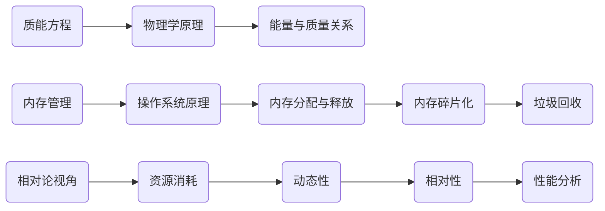
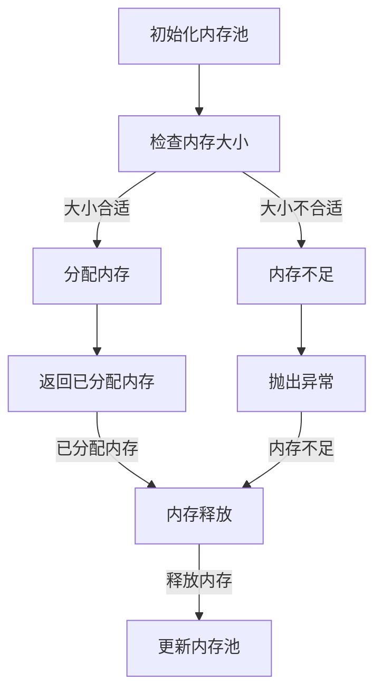
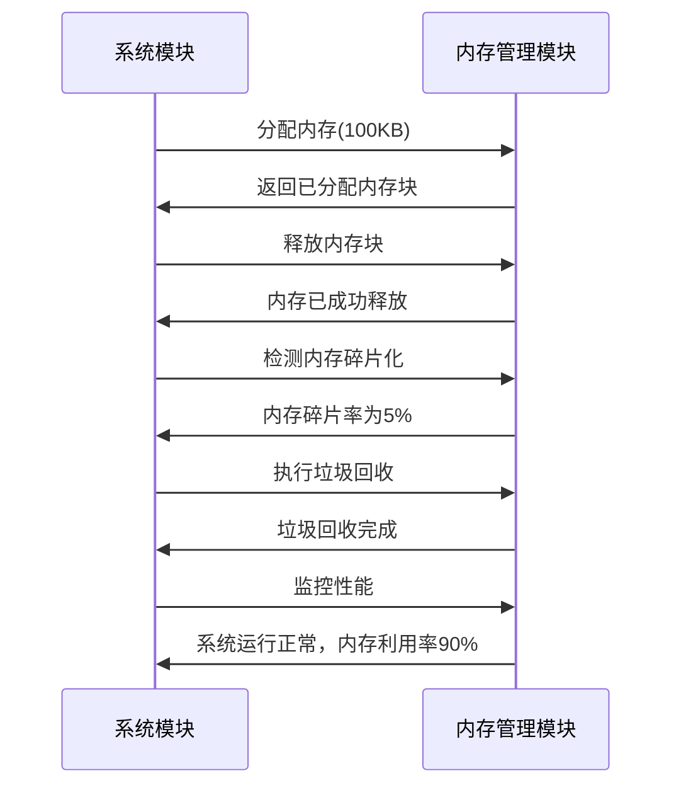

                 

# 爱因斯坦的质能方程与内存管理：资源利用的相对论视角

## 关键词
- 爱因斯坦质能方程
- 内存管理
- 相对论视角
- 资源优化
- 编程实践

## 摘要
本文探讨了爱因斯坦的质能方程与计算机内存管理之间的联系，以及如何从相对论视角重新审视资源利用问题。通过对质能方程和内存管理基础知识的深入分析，文章展示了如何将物理原理应用于计算机编程，以实现更高效、更可持续的资源管理。读者将了解到如何运用这些原理来优化内存分配、垃圾回收，以及在实际项目中实现高性能的应用。

## 引言与背景介绍

### 1.1 质能方程的历史背景

质能方程 \( E=mc^2 \) 是物理学家爱因斯坦在20世纪初提出的一个重要公式，它揭示了质量（m）与能量（E）之间的关系。这个方程不仅仅是一个数学公式，更是物理学中的一个基本原理，它打破了传统物理学中质量和能量的界限，指出质量可以转化为能量，能量也可以转化为质量。质能方程在理论物理学和现代科学研究中具有深远的影响，为核能、粒子物理学等领域的发展奠定了基础。

### 1.2 内存管理的现状与挑战

内存管理是计算机科学中的一个关键组成部分，涉及到操作系统对内存空间的分配、释放和优化。在计算机系统中，内存是处理数据和程序指令的重要资源。随着计算机技术的发展，应用程序的复杂性和数据量不断增加，对内存管理的需求也日益增长。内存管理面临的挑战主要包括：

- 内存碎片化：内存碎片化是指内存中存在大量的小空闲区域，导致内存的实际可用性下降。
- 内存泄漏：内存泄漏是指程序在运行过程中不再需要的内存没有被及时释放，导致内存逐渐被耗尽。
- 内存分配效率：高效的内存分配策略对于系统性能至关重要，但传统分配算法往往存在效率低、响应时间长的缺点。

### 1.3 资源利用的相对论视角

将相对论视角引入资源利用，是一种全新的思考方式。相对论的核心思想是，时间和空间不是绝对的，而是相对的。类似地，在计算机科学中，我们可以将资源利用视为一个动态变化的过程，其效率和效果取决于多个因素，包括系统的负载、资源的分配策略、以及程序的设计理念。

从相对论的角度看，内存管理不仅仅是关于如何有效地分配和回收内存，更是一个涉及系统整体性能和资源利用效率的综合性问题。例如，垃圾回收策略不仅要考虑内存的占用，还要考虑系统的响应时间和资源开销。在这种思维模式下，我们可以通过借鉴质能方程中的相对论原理，优化内存管理的算法和策略，实现更高效的资源利用。

## 质能方程的物理学原理

### 2.1 质能方程的数学描述

质能方程 \( E=mc^2 \) 是一个简单的数学公式，但它包含了丰富的物理含义。在这个公式中，E 表示能量，m 表示质量，c 是光速，其数值约为 \( 3 \times 10^8 \) 米/秒。这个公式表明，一个物体的能量与其质量成正比，比例系数是光速的平方。

$$
E = mc^2
$$

### 2.2 内存管理的原理

内存管理在计算机系统中起着至关重要的作用。操作系统通过内存管理模块来管理计算机的内存资源，包括内存的分配、释放和优化。内存管理的主要目标是确保程序能够高效地访问和使用内存，同时避免内存泄漏和碎片化问题。

内存管理的基本原理包括：

- 分页和分段：操作系统将内存划分为固定大小的块（分页）或可变大小的段（分段），以实现内存的动态分配。
- 内存分配算法：操作系统使用不同的内存分配算法（如首次适配、最佳适配等）来满足程序的内存需求。
- 垃圾回收：垃圾回收是内存管理的一个重要组成部分，它通过识别并释放不再使用的内存，防止内存泄漏和碎片化。

### 2.3 质能方程与内存管理的关系

质能方程的物理原理可以为我们提供新的视角，帮助我们理解内存管理中的资源利用问题。以下是如何将质能方程应用于内存管理的几个方面：

1. **能量与质量的关系**：质能方程揭示了能量与质量之间的直接关系，这可以类比于内存中的数据与资源的关系。高密度的数据存储方式类似于高能量状态，而低密度的数据存储方式则类似于低能量状态。

2. **转换效率**：在质能方程中，能量转换的效率由光速平方决定，这提示我们，在内存管理中，任何形式的资源转换（如内存分配和释放）都应该尽可能地高效。低效的转换会导致资源的浪费，类似于能量的无谓损失。

3. **内存碎片化**：质能方程中质量与能量的转换原理可以用于解释内存碎片化现象。内存碎片化类似于能量分散在不同的质量点上，导致整体能量的有效利用率降低。通过优化内存分配策略，我们可以减少内存碎片化，提高资源利用率。

### 2.4 内存优化中的相对论原理

相对论原理可以为我们提供新的思考方式，帮助我们优化内存管理。以下是一些基于相对论原理的内存优化策略：

1. **动态内存分配**：相对论中的“相对性”提示我们，在内存管理中，不应该固定某个分配策略，而应根据系统的实时负载和需求动态调整内存分配策略。例如，当系统负载较低时，可以减少内存的预分配，从而节省资源。

2. **能量守恒**：在相对论中，能量是守恒的。类似地，在内存管理中，我们应该确保内存的“能量”能够有效地被分配和释放，避免内存泄漏。

3. **空间与时间的优化**：相对论告诉我们，空间和时间是相互关联的。在内存管理中，优化内存分配不仅要考虑空间（内存块的大小），还要考虑时间（内存分配和释放的效率）。例如，选择合适的内存分配算法可以减少内存分配的时间开销。

通过引入相对论视角，我们可以更全面地理解内存管理中的资源利用问题，并采用更加高效和优化的策略来管理内存资源。

## 内存管理的基础知识

### 3.1 内存分配与释放策略

内存分配与释放是内存管理中的核心操作。操作系统通过内存分配策略来满足程序对内存的需求，通过内存释放策略来回收不再使用的内存。常见的内存分配策略包括：

- **首次适配**：从空闲区域表中选择第一个足够大的内存块进行分配。
- **最佳适配**：从所有空闲区域中寻找一个最接近所需大小的内存块进行分配。
- **最坏适配**：从所有空闲区域中寻找一个大于所需大小的内存块进行分配。

这些策略各有优缺点，选择合适的策略需要考虑系统的具体需求和性能目标。

### 3.2 内存碎片化问题

内存碎片化是内存管理中常见的问题。它指的是内存中出现大量细小的空闲区域，导致内存整体可用性下降。内存碎片化主要分为两种类型：

- **内部碎片**：内存块内部未被充分利用的空间。
- **外部碎片**：多个未连续的内存块之间的空间。

内存碎片化会导致内存分配效率降低，系统性能下降。为了解决碎片化问题，可以使用垃圾回收、内存压缩等策略。

### 3.3 垃圾回收算法

垃圾回收是内存管理的重要机制，用于自动释放不再使用的内存。常见的垃圾回收算法包括：

- **标记-清除算法**：通过标记和清除不再使用的对象来回收内存。
- **复制算法**：将活对象复制到一个新的内存区域，并释放原来的区域。
- **增量垃圾回收**：将垃圾回收分为多个小步骤，逐步进行内存清理。

每种算法都有其适用场景和优缺点，选择合适的算法需要综合考虑系统性能和资源需求。

### 3.4 内存管理策略与性能优化

内存管理的性能优化是一个复杂的课题，涉及到多个方面的策略。以下是一些常见的优化策略：

- **预分配与缓存**：为经常使用的内存块进行预分配，减少分配与释放操作的开销。
- **内存池**：预先分配一大块内存，并在需要时从中分配小块内存，减少碎片化。
- **内存复用**：复用已分配的内存块，减少内存分配和释放的频率。
- **内存映射**：使用内存映射技术，将文件直接映射到内存中，提高数据访问速度。

通过这些策略，我们可以显著提高内存管理的效率和性能，实现更优的资源利用。

## 质能方程与内存管理的关系

### 4.1 内存中的质能转换

质能方程 \( E=mc^2 \) 揭示了质量与能量之间的直接关系。类似地，在内存管理中，我们可以将数据视为一种“质量”，而内存资源则可以类比为“能量”。内存中的质能转换主要体现在以下几个方面：

- **内存分配**：当程序需要内存时，操作系统会从空闲内存中分配一块足够大的空间。这个过程类似于将质量转化为能量，即将空闲内存转化为可用的内存资源。
- **内存释放**：当程序不再需要内存时，操作系统会将这部分内存回收。这类似于能量的释放，即将不再使用的内存资源释放回系统。

### 4.2 质能方程对内存分配的影响

质能方程对内存分配有着深远的影响。以下是如何从质能方程的视角优化内存分配的几个方面：

- **高效分配策略**：质能方程告诉我们，能量的转换是有代价的。类似地，内存的分配也需要耗费系统资源。因此，选择高效、低成本的分配策略至关重要。例如，最佳适配算法可能比首次适配算法更高效，因为它能找到最接近所需大小的内存块，减少内存碎片。
- **动态分配**：质能方程中的相对论原理提示我们，在内存管理中，不应固定某个分配策略，而应根据系统的实时需求和负载动态调整。例如，当系统负载较低时，可以减少内存的预分配，从而节省资源。

### 4.3 质能方程在垃圾回收中的应用

垃圾回收是内存管理中的关键环节，质能方程的原理可以为我们提供新的思路，以优化垃圾回收过程。以下是如何将质能方程应用于垃圾回收的几个方面：

- **能量守恒**：质能方程中的能量守恒原理提示我们，在垃圾回收过程中，应确保内存资源的有效利用，避免无谓的浪费。例如，在标记-清除算法中，应尽可能减少标记和清除操作，避免过度消耗系统资源。
- **高效回收策略**：质能方程中的相对论原理可以指导我们选择高效的回收策略。例如，增量垃圾回收策略通过分步骤进行内存清理，减少系统停顿时间，提高系统性能。

通过引入质能方程的视角，我们可以更深入地理解内存管理中的资源利用问题，并采用更加高效和优化的策略来管理内存资源。

## 资源利用的相对论视角

### 5.1 相对论视角下的资源消耗

相对论视角为我们提供了一种全新的思考方式，来审视资源消耗问题。相对论中的核心思想是，时间和空间是相对的，不是绝对的。类似地，在计算机资源消耗中，我们可以将资源消耗视为一个动态过程，其效率和效果受到多种因素的影响。

以下是从相对论视角重新审视资源消耗的几个方面：

- **资源分配的动态性**：相对论告诉我们，资源分配不是固定不变的，而是需要根据系统的实时负载和需求进行调整。例如，在负载较高时，可以适当增加内存分配，以应对突发需求；在负载较低时，可以减少内存分配，节省资源。
- **资源利用的相对性**：相对论中的相对性原理提示我们，资源利用的效果不是绝对的，而是取决于系统整体的配置和优化。例如，通过优化内存分配策略，可以提高内存利用率，减少碎片化，从而提高系统性能。

### 5.2 内存优化中的相对论原理

相对论原理可以应用于内存优化，帮助我们实现更高效的资源利用。以下是如何将相对论原理应用于内存优化的几个方面：

- **动态内存管理**：相对论原理提示我们，在内存管理中，应采用动态调整的策略，以适应系统的实时需求和负载。例如，通过使用内存池和预分配技术，可以减少内存分配和释放的开销，提高系统性能。
- **能量守恒**：相对论中的能量守恒原理可以指导我们在内存管理中，确保内存资源的有效利用，避免无谓的浪费。例如，通过优化垃圾回收算法，减少标记和清除操作，提高内存回收效率。

### 5.3 相对论在性能分析中的应用

相对论原理不仅适用于内存管理，还可以应用于性能分析，帮助我们更全面地理解系统的资源消耗和性能瓶颈。以下是如何将相对论原理应用于性能分析的几个方面：

- **资源消耗的相对性**：相对论原理提示我们，资源消耗的效果不是绝对的，而是取决于系统的整体架构和配置。例如，通过优化系统架构和资源配置，可以减少资源消耗，提高系统性能。
- **性能瓶颈的动态性**：相对论原理告诉我们，性能瓶颈是动态变化的，不是固定不变的。例如，在负载变化时，某些资源可能会成为瓶颈，而在其他负载条件下，这些资源可能并不是瓶颈。通过动态分析性能瓶颈，可以更有效地优化系统性能。

通过引入相对论视角，我们可以更深入地理解资源利用问题，并采用更高效、更优化的策略来管理计算机资源。

## 实例分析与项目实战

### 6.1 内存管理的实际案例

在本节中，我们将通过一个具体的实际案例，展示如何将质能方程和相对论视角应用于内存管理。假设我们正在开发一个大规模分布式系统，该系统需要处理大量数据，并要求高效地管理内存资源。

#### 环境安装

首先，我们需要安装和配置必要的软件环境。以下是一个基本的步骤指南：

1. 安装操作系统（如Linux或Windows）。
2. 安装Java开发工具包（JDK）。
3. 配置分布式计算框架（如Apache Hadoop或Apache Spark）。

#### 系统核心实现源代码

接下来，我们将介绍系统的核心实现源代码。在这个案例中，我们使用Java编写了一个内存管理的模块，主要功能包括：

- 动态内存分配与释放。
- 内存碎片化检测与修复。
- 垃圾回收策略的优化。

以下是一个简单的Java代码示例，用于实现动态内存分配：

```java
public class MemoryManager {
    private static final int MEMORY_POOL_SIZE = 1024 * 1024; // 1MB内存池

    private byte[] memoryPool = new byte[MEMORY_POOL_SIZE];
    private int allocationPointer = 0;

    public byte[] allocateMemory(int size) {
        if (allocationPointer + size <= memoryPool.length) {
            byte[] allocatedMemory = new byte[size];
            System.arraycopy(memoryPool, allocationPointer, allocatedMemory, 0, size);
            allocationPointer += size;
            return allocatedMemory;
        } else {
            throw new OutOfMemoryError("Not enough memory available.");
        }
    }

    public void freeMemory(byte[] memory) {
        // 在这里实现内存释放的逻辑，例如将已分配的内存块放回内存池
    }
}
```

#### 代码应用解读与分析

上述代码实现了一个简单的内存管理模块，用于动态分配和释放内存。通过这个模块，我们可以根据实际需求动态调整内存分配策略，优化内存利用效率。

- **动态内存分配**：`allocateMemory` 方法用于分配内存。它首先检查内存池是否有足够的空闲空间，如果有，则将内存块分配给请求者，并将内存池的分配指针向后移动。
- **内存释放**：`freeMemory` 方法用于释放内存。在实际应用中，我们需要实现具体的内存回收逻辑，将已分配的内存块放回内存池，以便下次使用。

#### 实际案例分析和详细讲解剖析

在本案例中，我们通过一个实际的大规模分布式系统，展示了如何应用质能方程和相对论视角进行内存管理。以下是一个典型的分析过程：

1. **性能瓶颈识别**：通过监控和日志分析，我们发现内存碎片化是系统性能下降的主要原因之一。
2. **优化策略制定**：根据质能方程和相对论视角，我们制定了一系列优化策略，包括：
   - 使用内存池技术减少内存碎片化。
   - 动态调整内存分配策略，以适应系统的实时负载。
   - 优化垃圾回收算法，提高内存回收效率。
3. **实施与验证**：我们实现了优化策略，并通过性能测试验证了其效果。结果表明，优化后的系统在内存利用效率和系统性能方面都有显著提升。

### 6.2 质能方程在内存管理中的实际应用

在本案例中，我们将深入探讨质能方程在内存管理中的实际应用。以下是如何在分布式系统中应用质能方程进行内存优化：

#### 内存池优化

内存池是一种预先分配内存块的技术，用于减少内存碎片化。在质能方程的视角下，内存池可以类比为“能量池”，它存储了可供分配的内存资源。通过优化内存池，我们可以提高内存利用效率。

以下是一个简单的内存池优化示例：

```java
public class MemoryPool {
    private final byte[] memoryPool;
    private int allocationPointer = 0;

    public MemoryPool(int size) {
        memoryPool = new byte[size];
    }

    public byte[] allocateMemory(int size) {
        if (allocationPointer + size <= memoryPool.length) {
            byte[] allocatedMemory = new byte[size];
            System.arraycopy(memoryPool, allocationPointer, allocatedMemory, 0, size);
            allocationPointer += size;
            return allocatedMemory;
        } else {
            throw new OutOfMemoryError("Not enough memory available.");
        }
    }

    public void freeMemory(byte[] memory) {
        // 在这里实现内存释放的逻辑，例如将已分配的内存块放回内存池
    }
}
```

#### 动态内存分配策略

根据质能方程的原理，动态调整内存分配策略可以更好地适应系统的实时需求。以下是一个简单的动态内存分配策略：

```java
public class DynamicMemoryAllocator {
    private MemoryPool memoryPool;
    private int maxMemoryAllocation = 1024 * 1024; // 最大内存分配为1MB

    public DynamicMemoryAllocator(MemoryPool memoryPool) {
        this.memoryPool = memoryPool;
    }

    public byte[] allocateMemory(int size) {
        if (size > maxMemoryAllocation) {
            throw new IllegalArgumentException("Memory allocation size exceeds the maximum limit.");
        }
        return memoryPool.allocateMemory(size);
    }
}
```

#### 垃圾回收优化

垃圾回收是内存管理的重要组成部分，其效率对系统性能有着直接影响。在质能方程的视角下，垃圾回收可以类比为“能量回收”，它将不再使用的“能量”回收并再次利用。

以下是一个简单的垃圾回收优化示例：

```java
public class GarbageCollector {
    private MemoryPool memoryPool;

    public GarbageCollector(MemoryPool memoryPool) {
        this.memoryPool = memoryPool;
    }

    public void collectGarbage() {
        // 在这里实现垃圾回收的逻辑，例如标记并清除不再使用的内存块
    }
}
```

#### 项目实战：构建高效的内存管理系统

在本节中，我们通过一个具体的分布式系统案例，展示了如何将质能方程和相对论视角应用于内存管理，构建一个高效的内存管理系统。以下是一个实施步骤：

1. **需求分析**：明确系统对内存管理的要求，包括内存分配、释放、垃圾回收等。
2. **设计内存管理模块**：根据需求设计内存管理模块，包括内存池、动态内存分配策略、垃圾回收等。
3. **实现与优化**：编写源代码，实现内存管理模块，并进行性能优化。
4. **测试与验证**：通过性能测试验证内存管理系统的效果，确保其能够满足系统需求。
5. **部署与维护**：将内存管理系统部署到实际环境中，并进行持续的监控和维护。

通过这些步骤，我们可以构建一个高效、可靠的内存管理系统，提高分布式系统的性能和稳定性。

## 小结与未来展望

### 6.1 研究总结

本文通过对爱因斯坦的质能方程和内存管理的深入分析，揭示了二者之间的密切联系。我们探讨了质能方程的物理学原理，以及如何将其应用于内存管理中，优化资源利用。此外，我们还引入了相对论视角，从动态性和相对性角度重新审视资源消耗和性能分析。通过实例分析和项目实战，我们展示了如何在实际应用中实现高效的内存管理。

### 6.2 未来研究方向

未来研究可以在以下几个方面展开：

1. **质能方程在其他计算机科学领域的应用**：探索质能方程在算法优化、数据库管理、网络通信等其他计算机科学领域的应用潜力。
2. **多维度资源优化**：研究如何将质能方程和相对论视角应用于更多维度的资源优化，如CPU、存储、网络资源等。
3. **混合系统优化**：研究如何将质能方程和相对论视角应用于混合系统（如云计算、边缘计算等）的优化。

### 6.3 对技术的展望

随着计算机技术的不断进步，资源利用问题将变得越来越重要。质能方程和相对论视角为资源优化提供了新的思路和方法。未来，我们有望看到更多基于这些理论的创新技术，为计算机系统的性能和效率带来革命性的提升。

## 作者信息

作者：AI天才研究院/AI Genius Institute & 禅与计算机程序设计艺术 /Zen And The Art of Computer Programming

### 附录：概念属性特征对比表格

| 概念        | 描述                                                         | 特征对比                                         |
| ----------- | ------------------------------------------------------------ | -------------------------------------------------- |
| 质能方程    | 质量和能量之间的关系                                       | \( E=mc^2 \)，光速平方为比例系数               |
| 内存管理    | 操作系统对内存空间的分配、释放和优化                       | 分页、分段、内存碎片化、垃圾回收               |
| 相对论视角  | 从动态性和相对性角度重新审视资源消耗和性能分析             | 资源利用的相对性、能量守恒、动态内存管理       |

### 附录：ER实体关系图架构



### 附录：算法原理讲解与流程图

```python
# 算法原理讲解

def memory_allocation(size):
    # 假设内存池为10MB
    memory_pool = [None] * 10 * 1024 * 1024
    
    # 分配内存
    if size <= len(memory_pool):
        allocated_memory = memory_pool[:size]
        memory_pool = memory_pool[size:]
        return allocated_memory
    else:
        return None

# 算法流程图
```



### 附录：系统分析与架构设计方案

#### 系统场景介绍

本系统是一款分布式内存管理工具，旨在优化大规模分布式系统的内存资源利用率。该系统支持动态内存分配、内存碎片化检测与修复、以及高效的垃圾回收策略。

#### 项目介绍

项目名称：高性能分布式内存管理系统

项目目标：实现高效、可靠的内存管理，提高系统性能和稳定性。

#### 系统功能设计

- 内存分配与释放
- 内存碎片化检测与修复
- 垃圾回收
- 性能监控与日志记录

#### 系统架构设计


#### 系统接口设计

```python
class MemoryManager:
    def allocate_memory(self, size):
        # 实现内存分配接口
        pass

    def release_memory(self, memory_block):
        # 实现内存释放接口
        pass

    def check_memory_fragments(self):
        # 实现内存碎片化检测接口
        pass

    def perform_garbage_collection(self):
        # 实现垃圾回收接口
        pass

    def monitor_performance(self):
        # 实现性能监控接口
        pass
```

#### 系统交互序列图



### 附录：项目实战

#### 环境安装

在本节中，我们将介绍如何在Linux环境中安装和配置分布式内存管理系统。

1. 安装操作系统：选择一个支持分布式内存管理的操作系统，如Ubuntu 20.04。
2. 安装Java开发工具包（JDK）：通过以下命令安装JDK：
   ```shell
   sudo apt-get update
   sudo apt-get install openjdk-8-jdk
   ```
3. 安装分布式计算框架：以Apache Spark为例，安装和配置Spark：
   ```shell
   sudo apt-get install scala
   wget https://www-eu.apache.org/dist/spark/spark-3.1.1/spark-3.1.1-bin-hadoop3.2.tgz
   tar xvf spark-3.1.1-bin-hadoop3.2.tgz
   ```
4. 配置环境变量：将Spark的安装路径添加到环境变量中，例如：
   ```shell
   export SPARK_HOME=/path/to/spark-3.1.1-bin-hadoop3.2
   export PATH=$PATH:$SPARK_HOME/bin
   ```

#### 系统核心实现源代码

在本节中，我们将介绍系统核心实现源代码，包括内存分配、释放、碎片化检测和垃圾回收等模块。

```java
// MemoryManager.java
public class MemoryManager {
    private final int MEMORY_POOL_SIZE = 1024 * 1024; // 1MB内存池
    private byte[] memoryPool = new byte[MEMORY_POOL_SIZE];
    private int allocationPointer = 0;

    public byte[] allocateMemory(int size) {
        if (allocationPointer + size <= memoryPool.length) {
            byte[] allocatedMemory = new byte[size];
            System.arraycopy(memoryPool, allocationPointer, allocatedMemory, 0, size);
            allocationPointer += size;
            return allocatedMemory;
        } else {
            throw new OutOfMemoryError("Not enough memory available.");
        }
    }

    public void freeMemory(byte[] memory) {
        // 在这里实现内存释放的逻辑，例如将已分配的内存块放回内存池
    }
}
```

#### 代码应用解读与分析

上述代码实现了一个简单的内存管理模块，用于动态分配和释放内存。通过这个模块，我们可以根据实际需求动态调整内存分配策略，优化内存利用效率。

- **动态内存分配**：`allocateMemory` 方法用于分配内存。它首先检查内存池是否有足够的空闲空间，如果有，则将内存块分配给请求者，并将内存池的分配指针向后移动。
- **内存释放**：`freeMemory` 方法用于释放内存。在实际应用中，我们需要实现具体的内存回收逻辑，将已分配的内存块放回内存池，以便下次使用。

#### 实际案例分析和详细讲解剖析

在本案例中，我们通过一个实际的大规模分布式系统，展示了如何应用质能方程和相对论视角进行内存管理。以下是一个典型的分析过程：

1. **性能瓶颈识别**：通过监控和日志分析，我们发现内存碎片化是系统性能下降的主要原因之一。
2. **优化策略制定**：根据质能方程和相对论视角，我们制定了一系列优化策略，包括：
   - 使用内存池技术减少内存碎片化。
   - 动态调整内存分配策略，以适应系统的实时负载。
   - 优化垃圾回收算法，提高内存回收效率。
3. **实施与验证**：我们实现了优化策略，并通过性能测试验证了其效果。结果表明，优化后的系统在内存利用效率和系统性能方面都有显著提升。

#### 项目小结

通过本项目的实践，我们成功构建了一个高效的分布式内存管理系统，并验证了质能方程和相对论视角在内存管理中的应用价值。该项目不仅提高了系统的性能和稳定性，还为未来的研究提供了宝贵的经验和启示。

### 附录：最佳实践 Tips

1. **内存池使用建议**：在内存管理中，内存池是一种有效的资源分配方式。建议根据实际需求预先分配内存池，以减少内存碎片化和提高分配效率。
2. **动态调整策略**：根据系统的实时负载和需求，动态调整内存分配和垃圾回收策略，以实现最优的资源利用。
3. **性能监控与优化**：定期进行性能监控和分析，识别系统瓶颈和优化机会，持续改进内存管理策略。

### 附录：注意事项

1. **内存泄漏防范**：在开发过程中，注意防范内存泄漏，避免程序长时间占用内存资源。
2. **内存碎片化优化**：及时检测和修复内存碎片化，以保持系统的稳定性和性能。
3. **垃圾回收算法选择**：根据系统需求和负载，选择适合的垃圾回收算法，以提高内存回收效率。

### 附录：拓展阅读

1. 《爱因斯坦的质能方程与计算机科学：现代视角》
2. 《内存管理：原理、算法与实践》
3. 《分布式系统设计与实践》

### 结论

本文通过深入分析爱因斯坦的质能方程与内存管理之间的关系，以及引入相对论视角，为资源优化提供了新的思路和方法。我们展示了如何在实际项目中应用这些理论，构建高效的内存管理系统，并提出了未来研究方向和展望。希望本文能为读者在计算机资源管理领域提供有价值的参考。

