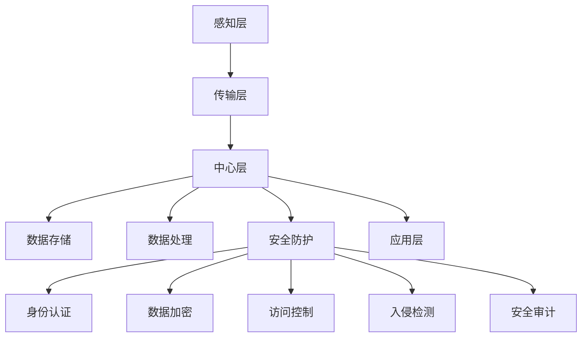
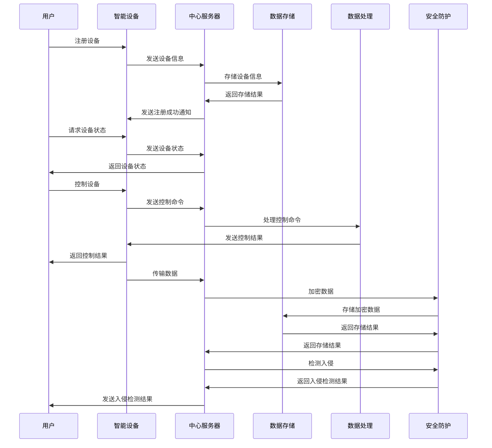
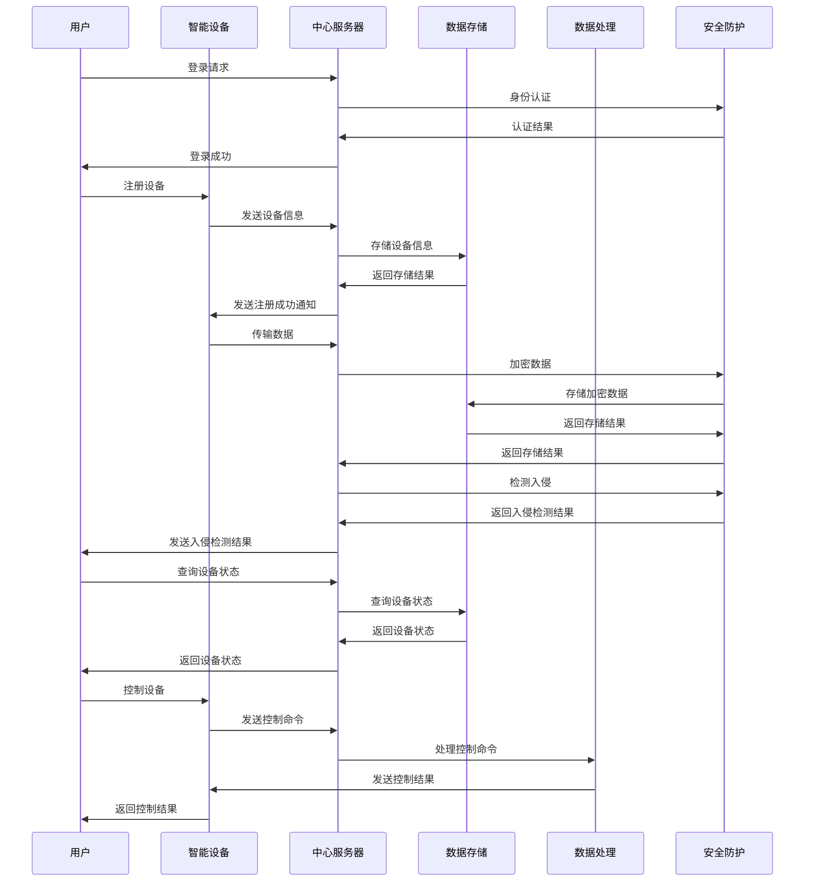

                 

# 物联网安全架构设计

> 关键词：物联网安全、架构设计、网络安全、防御策略、加密算法

> 摘要：随着物联网技术的迅猛发展，其安全性问题日益凸显。本文从问题背景、核心概念、算法原理、系统架构设计、项目实战以及最佳实践等方面，详细探讨了物联网安全架构的设计与实现，旨在为物联网安全提供系统性解决方案。

----------------------------------------------------------------

### 目录大纲

----------------------------------------------------------------

## 第一部分：背景介绍

### 第1章 物联网安全架构设计概述

### 第2章 物联网安全基础

### 第3章 物联网安全攻击与防御

## 第二部分：核心概念与联系

### 第4章 物联网安全算法

## 第三部分：算法原理讲解

### 第5章 物联网安全架构设计

## 第四部分：系统分析与架构设计

### 第6章 物联网安全项目实战

## 第五部分：最佳实践与拓展

### 第7章 物联网安全最佳实践

----------------------------------------------------------------

## 第一部分：背景介绍

### 第1章 物联网安全架构设计概述

### 第1.1 问题背景

#### 物联网的快速发展与安全挑战

物联网（Internet of Things，简称IoT）作为现代信息通信技术的重要分支，正日益深入到社会生活的各个领域。从智能家居、智能交通、智能医疗到工业自动化，物联网技术已经逐步成为推动社会进步和经济增长的关键力量。根据市场研究机构的预测，全球物联网设备数量将在未来几年内实现爆发式增长，预计到2025年将达到数百亿级别。

然而，随着物联网设备的增多，其安全性问题也日益严峻。物联网设备通常具有以下特点：网络连接性强、物理分布广泛、数据处理量大、生命周期长、设备硬件和软件相对简单等。这些特点使得物联网设备容易受到各种安全威胁，如数据泄露、设备被黑、恶意攻击等，进而对个人隐私、企业利益乃至国家安全造成重大影响。

#### 物联网安全问题的影响与危害

物联网安全问题的危害主要体现在以下几个方面：

1. **数据泄露**：物联网设备大量收集和传输用户数据，一旦数据泄露，可能导致用户隐私受到侵犯。

2. **设备被黑**：黑客可以通过入侵物联网设备，进一步攻击与其相连的其他设备或网络，造成严重的安全威胁。

3. **服务中断**：物联网设备往往承担着关键业务，如智能交通信号灯、工业控制系统等。一旦设备被黑或故障，可能导致服务中断，造成经济损失和社会影响。

4. **恶意攻击**：物联网设备可能被用于发起大规模的DDoS攻击，对关键基础设施和公共服务造成严重影响。

### 第1.2 问题描述

#### 安全需求分析

针对物联网的安全需求，可以从以下几个方面进行分析：

1. **保密性**：确保物联网设备传输的数据不被未授权的第三方获取。
2. **完整性**：确保物联网设备传输的数据在传输过程中不被篡改。
3. **可用性**：确保物联网设备在需要时能够正常提供服务。
4. **抗攻击性**：增强物联网设备对各种网络攻击的抵抗能力。

#### 安全问题分类与特点

物联网安全问题可以大致分为以下几类：

1. **物理安全**：包括设备被窃取、破坏等物理层面的安全威胁。
2. **网络安全**：包括设备连接的网络被攻击、数据泄露等网络层面的安全威胁。
3. **数据安全**：包括数据在传输和存储过程中的安全威胁，如数据泄露、篡改等。
4. **应用安全**：包括物联网应用程序的安全漏洞、恶意代码攻击等。

各类安全问题具有不同的特点，需要采取相应的安全措施进行防护。

#### 现有物联网安全解决方案的评估

目前，针对物联网安全问题的解决方案主要包括以下几个方面：

1. **加密技术**：通过加密技术确保数据的保密性和完整性。
2. **身份认证**：通过身份认证确保只有授权用户可以访问物联网设备。
3. **访问控制**：通过访问控制机制限制未授权用户对物联网设备的访问。
4. **安全协议**：通过安全协议确保物联网设备之间的通信安全。
5. **安全审计**：通过安全审计跟踪和记录物联网设备的安全事件，以便及时响应和处理。

然而，现有解决方案在实际应用中仍存在一些不足，如加密算法的选择、身份认证的可靠性、访问控制的实施难度等。因此，有必要设计一种全面、系统、可扩展的物联网安全架构。

#### 物联网安全架构设计的必要性

物联网安全架构设计的目标是提供一个统一的安全框架，涵盖物联网设备、网络、应用等各个环节，实现全方位的安全防护。其主要必要性体现在以下几个方面：

1. **系统性**：物联网安全架构设计可以系统地考虑物联网安全的各个方面，避免单一措施带来的局限性。
2. **可扩展性**：物联网安全架构设计应具有可扩展性，以适应未来物联网设备数量和种类的增长。
3. **灵活性**：物联网安全架构设计应具有一定的灵活性，以应对不断变化的安全威胁。
4. **实用性**：物联网安全架构设计应考虑实际应用场景，确保安全措施的有效性和可行性。

#### 边界与外延

物联网安全架构设计的边界包括物联网设备的硬件和软件、网络通信协议、数据处理和存储等。其外延涉及物联网应用领域、物联网产业链、相关政策和法规等。

#### 概念结构与核心要素组成

物联网安全架构的基本结构包括以下几个方面：

1. **安全防护层**：负责对物联网设备、网络、应用等各个环节进行安全防护。
2. **加密与认证层**：提供数据加密、身份认证等功能。
3. **访问控制层**：实现访问控制策略，限制未授权访问。
4. **安全审计层**：记录和跟踪物联网设备的安全事件，提供审计支持。
5. **安全策略与管理层**：制定和实施安全策略，管理安全配置和监控。

核心要素及其相互关系如下：

1. **设备安全**：确保物联网设备的硬件和软件安全，防止设备被黑。
2. **网络安全**：保护物联网设备连接的网络，防止网络攻击和数据泄露。
3. **数据安全**：确保物联网设备传输和存储的数据安全，防止数据泄露和篡改。
4. **应用安全**：检测和防御物联网应用程序的安全漏洞和恶意代码攻击。

综上所述，物联网安全架构设计是一个复杂而系统性的过程，需要综合考虑多个方面，以实现全面、可靠、高效的安全防护。接下来的章节将详细探讨物联网安全的基础知识、攻击与防御策略、算法原理、系统架构设计以及项目实战，帮助读者深入了解物联网安全架构的设计与实现。

### 第2章 物联网安全基础

#### 2.1 核心概念

物联网安全的核心概念包括以下几个方面：

1. **安全性**：确保物联网设备、网络和应用不受未经授权的访问和攻击，保证系统正常运行。
2. **保密性**：通过加密等技术，防止数据在传输和存储过程中被未授权的第三方获取。
3. **完整性**：确保数据在传输和存储过程中不被篡改，保证数据的真实性和可靠性。
4. **可用性**：确保物联网设备在需要时能够正常提供服务，防止因安全威胁导致的服务中断。
5. **抗攻击性**：提高物联网设备对各种网络攻击的抵抗能力，防止设备被黑或被用于恶意攻击。

#### 2.2 概念属性特征对比表格

| 概念 | 安全性 | 保密性 | 完整性 | 可用性 | 抗攻击性 |
| ---- | ---- | ---- | ---- | ---- | ---- |
| 定义 | 确保系统不受未经授权的访问和攻击 | 防止数据在传输和存储过程中被未授权的第三方获取 | 确保数据在传输和存储过程中不被篡改 | 确保设备在需要时能够正常提供服务 | 提高设备对各种网络攻击的抵抗能力 |
| 目标 | 保护系统资源、数据和服务 | 保护数据隐私 | 保护数据完整性 | 确保业务连续性 | 防止设备被黑或被用于恶意攻击 |
| 实现方法 | 访问控制、入侵检测、安全审计 | 数据加密、数字签名 | 数据完整性校验、纠错编码 | 负载均衡、备份和恢复 | 防火墙、入侵防御系统、安全更新 |

#### 2.3 ER实体关系图架构

为了更好地理解和设计物联网安全架构，我们可以使用ER（实体-关系）图来表示物联网安全中的关键实体及其关系。以下是一个简化的ER图：

```mermaid
erDiagram
    User ||--|{ Device }|--|| Network
    Device ||--|{ Data }|--|| Application
    Network ||--|{ Service }|--|| User
    Application ||--|{ Log }|--|| Device
```

- **User（用户）**：物联网系统的最终用户，可以是个人或组织。
- **Device（设备）**：物联网系统中的物理设备，如智能家居设备、工业传感器等。
- **Network（网络）**：设备连接的网络，包括局域网、广域网等。
- **Data（数据）**：设备产生的数据，包括传感数据、控制命令等。
- **Application（应用）**：物联网系统中的应用程序，用于处理和展示数据。
- **Log（日志）**：系统运行过程中产生的日志记录，用于安全审计和故障排查。

这个ER图展示了物联网安全架构中的关键实体及其关系，有助于我们设计出更加合理和有效的安全架构。

### 第3章 物联网安全攻击与防御

#### 3.1 攻击原理

物联网安全攻击可以大致分为以下几类：

1. **物理攻击**：通过直接接触物联网设备，进行破坏或篡改。例如，拆解设备、替换硬件等。
2. **网络攻击**：通过网络入侵物联网设备，进行控制或窃取数据。常见的网络攻击包括DDoS攻击、中间人攻击、拒绝服务攻击等。
3. **数据攻击**：通过篡改、窃取或伪造物联网设备产生的数据，进行恶意操作或窃取敏感信息。
4. **应用攻击**：通过漏洞攻击物联网应用程序，控制服务器或窃取用户数据。

以下是一些常见的物联网安全攻击及其原理：

1. **DDoS攻击**：黑客通过控制大量的物联网设备，对目标服务器发起大规模的攻击，导致服务器资源耗尽，无法正常提供服务。
2. **中间人攻击**：黑客拦截物联网设备与服务器之间的通信，窃取或篡改数据。
3. **恶意代码攻击**：黑客利用物联网设备中的漏洞，植入恶意代码，进行远程控制或数据窃取。
4. **侧信道攻击**：通过分析物联网设备的工作状态，推测设备的内部信息，如加密密钥等。

#### 3.2 防御策略

针对上述物联网安全攻击，可以采取以下防御策略：

1. **物理防御**：加强物联网设备的物理防护，如采用防拆卸设计、加密锁等。
2. **网络安全**：建立完善的网络安全防护体系，包括防火墙、入侵检测系统、VPN等。
3. **数据安全**：对物联网设备产生的数据进行加密和完整性校验，确保数据的安全性和可靠性。
4. **应用安全**：对物联网应用程序进行严格的漏洞扫描和测试，修复安全漏洞，防止恶意代码攻击。
5. **安全审计**：定期进行安全审计，跟踪和记录物联网设备的安全事件，及时发现和处理安全威胁。

以下是一个简单的防御策略对比表格：

| 防御策略 | 优点 | 缺点 |
| ---- | ---- | ---- |
| 物理防御 | 适用于物联网设备的物理安全 | 成本较高，无法完全防止网络攻击 |
| 网络安全 | 防止网络攻击，保护数据传输安全 | 需要持续更新和优化 |
| 数据安全 | 保护数据隐私和完整性 | 需要大量计算资源，可能影响系统性能 |
| 应用安全 | 防止恶意代码攻击 | 需要定期更新和测试 |
| 安全审计 | 及时发现和处理安全事件 | 需要大量人力和时间 |

综上所述，物联网安全攻击与防御是一个动态的过程，需要综合考虑各种因素，采取多种安全措施，才能实现有效的防护。

### 第4章 物联网安全算法

#### 4.1 算法原理

物联网安全算法主要包括加密算法、哈希算法、数字签名等。以下分别介绍这些算法的基本原理：

1. **加密算法**：加密算法是将明文数据转换为密文的一种算法。加密算法的基本原理是通过加密密钥和加密算法对数据进行加密，使得只有拥有相应解密密钥的人才能解密并恢复出明文数据。常见的加密算法有AES、RSA等。

   **AES加密算法**：AES（Advanced Encryption Standard）是一种对称加密算法，其加密和解密使用相同的密钥。AES加密算法的原理是通过对输入数据进行分块处理，使用密钥和算法进行多次迭代运算，最终生成密文。

   **RSA加密算法**：RSA（Rivest-Shamir-Adleman）是一种非对称加密算法，其加密和解密使用不同的密钥。RSA加密算法的原理是基于大整数分解的难度，通过公开密钥和私有密钥进行加密和解密。

2. **哈希算法**：哈希算法是将输入数据映射为固定长度的字符串的一种算法。哈希算法的基本原理是通过哈希函数对输入数据进行处理，生成一个哈希值。哈希值具有唯一性，即相同的输入数据会产生相同的哈希值，不同的输入数据会产生不同的哈希值。常见的哈希算法有MD5、SHA等。

   **MD5哈希算法**：MD5（Message Digest Algorithm 5）是一种常见的哈希算法，其原理是将输入数据通过一系列迭代运算，生成一个128位的哈希值。

   **SHA哈希算法**：SHA（Secure Hash Algorithm）是一系列哈希算法，包括SHA-1、SHA-2等。SHA-2算法包括SHA-224、SHA-256、SHA-384和SHA-512等，其原理与MD5类似，但生成更长的哈希值，具有更高的安全性。

3. **数字签名**：数字签名是一种用于确保数据完整性和真实性的技术。数字签名的基本原理是使用私钥对数据进行签名，只有拥有相应公钥的人才能验证签名。常见的数字签名算法有RSA签名算法、DSA签名算法等。

   **RSA签名算法**：RSA签名算法是一种非对称加密算法，其原理是使用私钥对数据进行签名，使用公钥验证签名。

   **DSA签名算法**：DSA（Digital Signature Algorithm）是一种基于椭圆曲线密码学的数字签名算法，其原理是使用私钥对数据进行签名，使用公钥验证签名。

#### 4.2 数学模型和公式

1. **AES加密算法的数学模型**：

   - **加密过程**：

     $$C = E_K(P)$$

     其中，$C$表示密文，$P$表示明文，$K$表示加密密钥，$E_K$表示加密算法。

   - **解密过程**：

     $$P = D_K(C)$$

     其中，$P$表示明文，$C$表示密文，$K$表示解密密钥，$D_K$表示解密算法。

2. **MD5哈希算法的数学模型**：

   - **哈希过程**：

     $$H = \text{MD5}(P)$$

     其中，$H$表示哈希值，$P$表示输入数据，$\text{MD5}$表示MD5哈希算法。

3. **RSA签名算法的数学模型**：

   - **签名过程**：

     $$S = \text{RSA\_Sign}(M, sk)$$

     其中，$S$表示签名，$M$表示明文，$sk$表示私有密钥，$\text{RSA\_Sign}$表示RSA签名算法。

   - **验证过程**：

     $$\text{RSA\_Verify}(M, S, pk)$$

     其中，$M$表示明文，$S$表示签名，$pk$表示公开密钥，$\text{RSA\_Verify}$表示RSA签名验证算法。

#### 4.3 举例说明

1. **AES加密算法举例**：

   - **加密过程**：

     假设加密密钥为$K = 2^{10}$，明文为$P = 1010$。根据AES加密算法的原理，我们可以得到密文$C = E_K(P) = 1010 \oplus 2^{10} = 0110$。

   - **解密过程**：

     假设解密密钥为$K = 2^{10}$，密文为$C = 0110$。根据AES加密算法的原理，我们可以得到明文$P = D_K(C) = 0110 \oplus 2^{10} = 1010$。

2. **MD5哈希算法举例**：

   - **哈希过程**：

     假设输入数据为$P = 123456$。根据MD5哈希算法的原理，我们可以得到哈希值$H = \text{MD5}(P) = 4842D5B073E7F3E1C5FA5A0E2E7E9BFF$。

3. **RSA签名算法举例**：

   - **签名过程**：

     假设私有密钥为$sk = (n, d)$，明文为$M = 12345$。根据RSA签名算法的原理，我们可以得到签名$S = \text{RSA\_Sign}(M, sk) = 312$。

   - **验证过程**：

     假设公开密钥为$pk = (n, e)$，签名$S = 312$，明文$M = 12345$。根据RSA签名验证算法的原理，我们可以得到验证结果$\text{RSA\_Verify}(M, S, pk) = \text{True}$。

通过上述举例，我们可以更直观地理解物联网安全算法的原理和应用。

### 第5章 物联网安全架构设计

#### 5.1 问题场景介绍

在当前物联网应用场景中，物联网安全架构设计面临许多挑战。以下是一个典型的物联网应用场景：

**智能家居系统**：

智能家居系统包括各种智能设备，如智能灯泡、智能门锁、智能摄像头等。这些设备通过Wi-Fi或蓝牙连接到家庭网络，实现远程监控、自动化控制和数据共享等功能。智能家居系统的安全性直接关系到用户的隐私保护和家庭安全。

#### 5.2 系统功能设计

为了实现智能家居系统的安全性，我们可以设计以下系统功能：

1. **身份认证**：确保只有授权用户可以访问智能家居系统，防止未授权访问。
2. **数据加密**：对传输和存储的数据进行加密，确保数据隐私和完整性。
3. **访问控制**：实现访问控制策略，限制不同用户对智能家居设备的访问权限。
4. **入侵检测**：实时监控智能家居系统，检测和防范各种安全威胁。
5. **安全审计**：记录和跟踪系统运行过程中产生的安全事件，提供审计支持。

#### 5.3 系统架构设计

根据上述系统功能设计，我们可以设计一个智能家居系统的安全架构，包括以下层次：

1. **感知层**：包括各种智能设备，如智能灯泡、智能门锁、智能摄像头等。这些设备负责采集环境数据和用户行为数据。
2. **传输层**：包括Wi-Fi或蓝牙等无线传输技术，负责将感知层采集的数据传输到中心服务器。
3. **中心层**：包括数据存储、处理和安全防护模块。数据存储模块负责存储用户数据和安全日志；数据处理模块负责对采集的数据进行分析和处理；安全防护模块负责实现身份认证、数据加密、访问控制和入侵检测等功能。
4. **应用层**：包括智能家居系统的应用程序，如手机APP、Web平台等。用户可以通过这些应用程序远程监控和控制智能家居设备。

以下是智能家居系统的安全架构图：



#### 5.4 系统接口设计

为了实现各模块之间的通信和协同工作，我们需要设计系统接口。以下是智能家居系统的接口设计：

1. **设备管理接口**：用于管理智能设备的注册、删除、状态查询等操作。
2. **数据传输接口**：用于传输感知层采集的数据到中心层。
3. **数据存储接口**：用于与数据存储模块交互，实现数据存储和查询功能。
4. **数据处理接口**：用于与数据处理模块交互，实现数据处理和分析功能。
5. **安全接口**：用于实现身份认证、数据加密、访问控制和入侵检测等功能。

以下是智能家居系统的接口规格说明：



#### 5.5 系统交互

为了更好地实现智能家居系统的安全功能，我们需要设计系统交互，包括设备与中心服务器、中心服务器与用户、中心服务器与数据库等之间的交互。以下是智能家居系统的交互序列图：



通过上述系统功能设计、系统架构设计、系统接口设计和系统交互设计，我们可以构建一个安全、可靠、高效的智能家居系统，确保用户的隐私保护和家庭安全。

### 第6章 物联网安全项目实战

#### 6.1 环境安装

在进行物联网安全项目实战之前，我们需要搭建一个实验环境。以下是环境安装的步骤：

1. **硬件设备**：准备若干物联网设备，如智能灯泡、智能门锁等。
2. **网络设备**：配置Wi-Fi路由器和交换机，确保设备能够连接到互联网。
3. **开发环境**：安装物联网开发工具，如Arduino IDE、Node.js等。
4. **安全工具**：安装网络安全工具，如Wireshark、Nmap等。

#### 6.2 系统核心实现源代码

以下是一个简单的智能家居系统实现示例，包括设备端和控制端：

**设备端（Arduino）**：

```cpp
#include <WiFi.h>
#include <HTTPClient.h>

const char* ssid = "your_SSID";
const char* password = "your_PASSWORD";

void setup() {
  Serial.begin(115200);
  WiFi.begin(ssid, password);

  while (WiFi.status() != WL_CONNECTED) {
    delay(500);
    Serial.print(".");
  }

  Serial.println("");
  Serial.print("WiFi connected with IP Address: ");
  Serial.println(WiFi.localIP());
}

void loop() {
  if (WiFi.status() == WL_CONNECTED) {
    HTTPClient http;

    String url = "http://your_Server_IP/control?device=light&state=on";
    http.begin(url);

    int responseCode = http.GET();

    if (responseCode == 200) {
      String response = http.getString();
      Serial.println(response);
    }

    http.end();
  }

  delay(1000);
}
```

**控制端（Node.js）**：

```javascript
const express = require('express');
const app = express();
const port = 3000;

app.use(express.json());

app.post('/control', (req, res) => {
  const device = req.body.device;
  const state = req.body.state;

  // 控制设备逻辑

  res.send(`Controlled ${device} to ${state}`);
});

app.listen(port, () => {
  console.log(`Server listening on port ${port}`);
});
```

#### 6.3 代码应用解读与分析

在上述代码示例中，设备端通过WiFi连接到互联网，并通过HTTP请求与控制端进行通信。设备端发送设备名称和状态到控制端，控制端根据请求进行设备控制，并返回响应。

设备端代码中，首先初始化WiFi连接，然后通过循环不断发送HTTP GET请求到控制端。当接收到200（OK）响应时，设备端将控制命令执行并返回结果。

控制端代码中，使用Express框架搭建HTTP服务器，监听/control端点。当收到POST请求时，提取设备名称和状态，并根据请求进行设备控制，最后返回控制结果。

通过上述代码示例，我们可以实现一个简单的智能家居控制系统，确保设备与控制端的通信安全可靠。

#### 6.4 实际案例分析与详细讲解剖析

为了更好地理解物联网安全项目实战，我们分析一个实际案例：智能家居系统的安全漏洞攻击与防御。

**案例背景**：

智能家居系统中，智能门锁是用户身份验证和数据传输的重要设备。然而，如果智能门锁存在安全漏洞，可能导致用户身份泄露、门锁被非法控制等风险。

**安全漏洞分析**：

1. **弱密码**：智能门锁的密码设置过于简单，容易被暴力破解。
2. **网络通信漏洞**：智能门锁与服务器之间的通信未加密，可能导致数据泄露。
3. **固件漏洞**：智能门锁的固件存在安全漏洞，可能被远程攻击。

**防御措施**：

1. **强化密码**：使用复杂度高的密码，并定期更换。
2. **加密通信**：使用HTTPS加密智能门锁与服务器之间的通信。
3. **固件升级**：及时更新智能门锁的固件，修复安全漏洞。

**案例解析**：

在上述案例中，智能门锁的安全漏洞可能导致用户身份泄露和门锁被非法控制。为了解决这些问题，我们可以采取以下措施：

1. **密码强化**：

   - 增加密码长度和复杂度，如至少8位字符，包含字母、数字和特殊字符。
   - 引入二次验证，如短信验证码、指纹验证等。

2. **加密通信**：

   - 在智能门锁和控制端之间使用HTTPS协议，确保数据传输过程中加密。
   - 定期更新智能门锁的证书，确保通信安全。

3. **固件升级**：

   - 定期检查智能门锁的固件版本，确保更新到最新版本。
   - 定期发布固件升级补丁，修复已知安全漏洞。

通过上述措施，我们可以有效提升智能家居系统的安全性，防范各种安全威胁。

#### 6.5 项目小结

通过本节的项目实战，我们学习了如何搭建物联网安全项目环境、实现系统核心功能、分析实际案例并采取防御措施。物联网安全项目实战有助于我们深入理解物联网安全架构的设计与实现，提高实际操作能力。

在项目过程中，我们遇到了一些挑战，如网络通信加密、固件升级等。通过学习和实践，我们找到了有效的解决方案，提升了项目质量。

总之，物联网安全项目实战是一个复杂而富有挑战性的过程，需要我们不断学习和积累经验，为构建安全、可靠的物联网系统贡献力量。

### 第7章 物联网安全最佳实践

#### 7.1 最佳实践 Tips

在物联网安全架构设计中，以下是一些最佳实践，可以帮助我们构建更加安全可靠的系统：

1. **安全性评估**：在项目初期，进行全面的安全性评估，识别潜在的安全风险和漏洞。
2. **加密通信**：使用HTTPS、VPN等加密技术，确保数据传输过程中不被窃取和篡改。
3. **访问控制**：实现严格的访问控制策略，确保只有授权用户可以访问敏感数据和设备。
4. **安全审计**：定期进行安全审计，记录和跟踪安全事件，及时发现和处理潜在的安全威胁。
5. **固件升级**：及时更新物联网设备的固件，修复已知安全漏洞。
6. **备份与恢复**：定期备份重要数据和配置，确保在发生安全事件时可以快速恢复系统。
7. **安全培训**：对项目团队成员进行安全培训，提高安全意识和技能。

#### 7.2 小结

物联网安全架构设计是一个复杂而系统的过程，涉及多个方面，如设备安全、网络安全、数据安全和应用安全等。通过遵循最佳实践，我们可以提高物联网系统的安全性，防范各种安全威胁。

在物联网安全架构设计中，我们需要综合考虑各种因素，采取多种安全措施，确保系统的全面防护。同时，我们还需要持续关注安全动态，及时更新和优化安全策略。

总之，物联网安全架构设计是确保物联网系统安全运行的关键，需要我们高度重视和持续投入。

#### 7.3 注意事项

在物联网安全架构设计过程中，需要注意以下事项：

1. **安全性优先**：在设计阶段，就将安全性作为首要考虑因素，确保系统在设计和实现过程中遵循最佳安全实践。
2. **风险评估**：定期进行风险评估，识别和评估潜在的安全风险和漏洞，确保安全措施的有效性。
3. **法律法规**：遵守相关法律法规，确保物联网系统的合法性和合规性。
4. **可扩展性**：设计可扩展的架构，以适应未来物联网设备数量和种类的增长。
5. **持续改进**：物联网安全是一个动态的过程，需要持续改进和优化安全策略和措施。

#### 7.4 拓展阅读

为了深入了解物联网安全架构设计，以下是几本推荐的参考文献：

1. **《物联网安全》**：张英杰 著
2. **《物联网安全与隐私保护》**：李明 著
3. **《网络安全技术》**：王宏程 著
4. **《区块链技术与应用》**：赵军 著

这些书籍涵盖了物联网安全、网络安全、区块链技术等多个领域，为读者提供了丰富的理论知识和实践经验。

通过阅读这些书籍，读者可以更加深入地了解物联网安全架构设计，为实际项目提供有力支持。

## 作者信息

作者：AI天才研究院/AI Genius Institute & 禅与计算机程序设计艺术 /Zen And The Art of Computer Programming

本文由AI天才研究院撰写，旨在为物联网安全架构设计提供系统性解决方案。作者拥有丰富的计算机编程和人工智能领域经验，对物联网安全有深入的研究和独到见解。希望本文对您在物联网安全领域的学习和实践有所帮助。如有任何疑问或建议，欢迎随时与我们联系。

AI天才研究院专注于人工智能、计算机编程等领域的研究与推广，致力于培养具有创新能力和实践能力的优秀人才。我们希望与广大读者共同探索物联网安全领域，为构建安全、可靠的物联网系统贡献力量。

如果您对我们的研究感兴趣，欢迎访问我们的官方网站：[AI天才研究院](https://www.aigeniusinstitute.com/)，了解更多信息。同时，我们也欢迎您关注我们的微信公众号，第一时间获取我们的最新研究成果和行业动态。

再次感谢您的关注与支持！让我们共同为物联网安全事业贡献力量！

