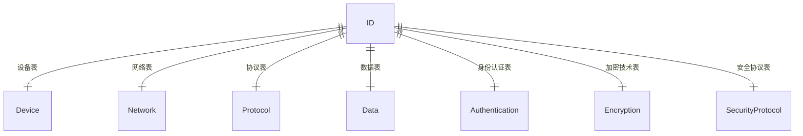
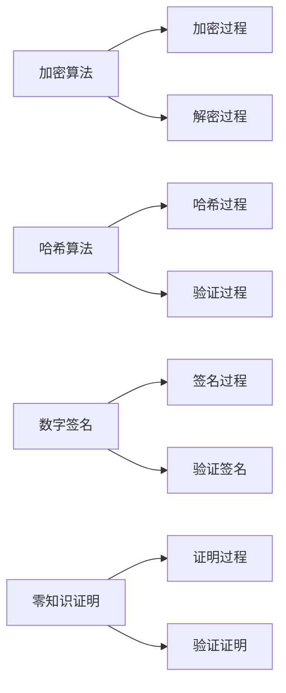
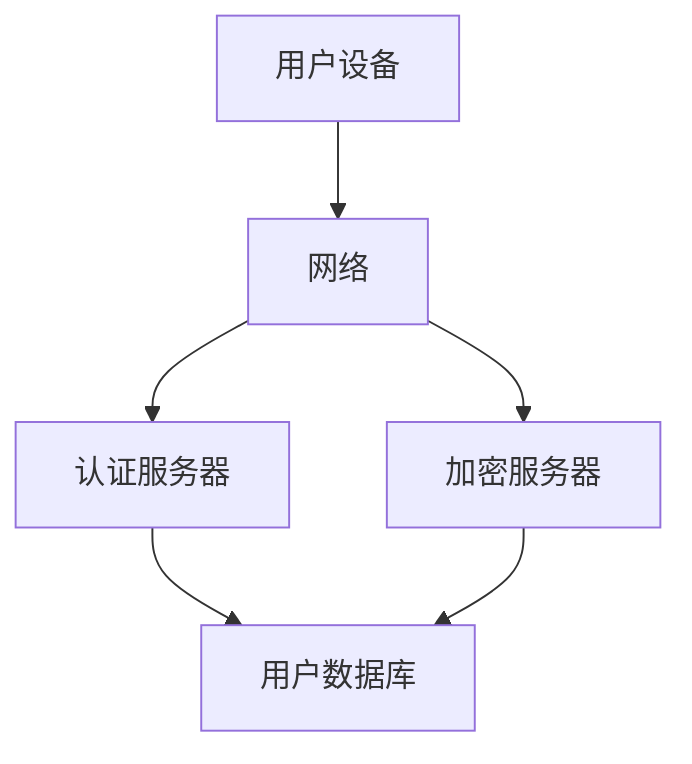
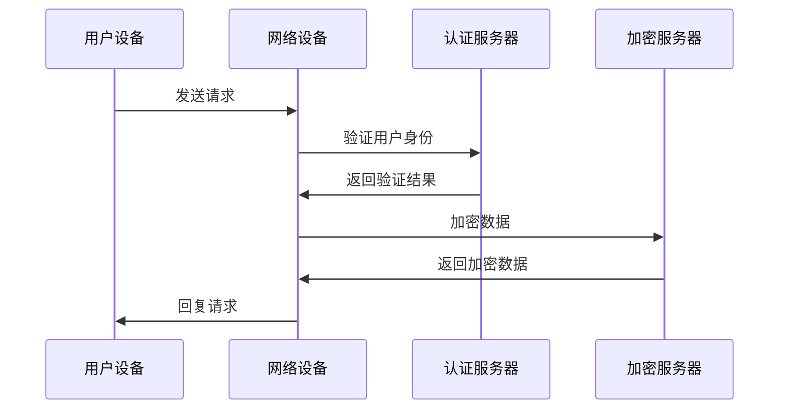

                 


# 物联网安全：保护互联设备网络

> 关键词：物联网安全，互联设备，网络安全，隐私保护，设备安全，数据安全，身份认证，安全通信，恶意代码防范，虚假设备防范

> 摘要：本文深入探讨物联网安全领域，从概述到具体技术，再到实战案例，全面解析物联网安全的关键问题及其解决方案。通过一步一步的分析和讲解，帮助读者理解物联网安全的复杂性，并提供实用的安全建议。

## 第一部分：物联网安全概述

### 1.1 物联网安全问题背景

#### 1.1.1 物联网发展历程

物联网（Internet of Things，IoT）是指将各种物理设备、传感器、软件和网络连接在一起，实现设备之间以及设备与人类之间的智能交互。物联网的概念最早在1999年由麻省理工学院的Kevin Ashton提出。近年来，随着无线通信技术、云计算、大数据和人工智能的快速发展，物联网得到了广泛应用。

#### 1.1.2 物联网安全的重要性

物联网设备的大规模连接和数据交换，使得网络安全问题愈发突出。物联网安全不仅关系到个人隐私，还可能影响国家安全、公共安全和工业生产安全。例如，工业控制系统中的物联网设备可能成为网络攻击的目标，导致生产事故；智能家居设备的数据泄露可能危及家庭成员的安全。

#### 1.1.3 物联网安全的主要威胁

物联网安全威胁主要包括以下几类：

- 网络安全威胁：如DDoS攻击、数据窃取、中间人攻击等。
- 设备安全威胁：如设备被恶意软件感染、设备配置错误等。
- 数据安全威胁：如数据泄露、篡改、丢失等。
- 身份认证威胁：如假冒身份、密码破解等。
- 安全通信威胁：如通信被窃听、篡改等。
- 隐私保护威胁：如个人隐私数据泄露、滥用等。

### 1.2 物联网安全的核心概念与联系

#### 1.2.1 核心概念介绍

- 物联网设备：任何能够通过网络进行通信的物理设备。
- 网络协议：用于设备之间数据交换的标准协议。
- 数据传输：设备之间数据传输的方式和过程。
- 身份认证：确认用户或设备身份的过程。
- 加密技术：用于保护数据不被未授权访问的技术。
- 安全协议：确保数据在传输过程中不被窃听或篡改的协议。

#### 1.2.2 概念属性特征对比表格

| 概念       | 特征                                                                                   |
|------------|----------------------------------------------------------------------------------------|
| 物联网设备 | 具有网络连接能力，能够与其他设备或系统进行通信。                                       |
| 网络协议   | 定义了设备之间通信的规则和格式。                                                     |
| 数据传输   | 数据在设备之间的传输过程，包括数据格式、传输速度和传输可靠性。                       |
| 身份认证   | 确保通信双方身份的真实性，防止未授权访问。                                         |
| 加密技术   | 通过加密算法对数据进行加密，确保数据在传输过程中不被窃听。                           |
| 安全协议   | 确保数据在传输过程中不被篡改或窃取，包括传输加密和认证机制。                       |

#### 1.2.3 ER实体关系图架构



### 1.3 物联网安全算法原理讲解

#### 1.3.1 常见物联网安全算法介绍

- 加密算法：如AES、RSA等。
- 哈希算法：如MD5、SHA系列等。
- 数字签名：用于确保数据的完整性和真实性。
- 零知识证明：用于身份认证，减少信息泄露。

#### 1.3.2 算法mermaid流程图展示



#### 1.3.3 Python源代码实现与详细讲解

```python
# 加密算法示例（AES）
from Crypto.Cipher import AES
from Crypto.Util.Padding import pad, unpad

key = b'mysecretkey12345'
cipher = AES.new(key, AES.MODE_CBC)
ct_bytes = cipher.encrypt(pad(b'message to encrypt', AES.block_size))
iv = cipher.iv
print(f"CT: {ct_bytes.hex()}\nIV: {iv.hex()}")

# 解密算法示例（AES）
cipher = AES.new(key, AES.MODE_CBC, iv=iv)
pt = unpad(cipher.decrypt(ct_bytes), AES.block_size)
print(f"PT: {pt.decode('utf-8')}")

# 哈希算法示例（SHA256）
import hashlib

hash_obj = hashlib.sha256()
hash_obj.update(b'message to hash')
hash_hex = hash_obj.hexdigest()
print(f"SHA256: {hash_hex}")

# 数字签名示例（RSA）
from Crypto.PublicKey import RSA
from Crypto.Signature import pkcs1_15

key = RSA.generate(2048)
private_key = key.export_key()
public_key = key.publickey().export_key()

signature = pkcs1_15.new(public_key).sign(b'message to sign')
print(f"Signature: {signature.hex()}")

# 零知识证明示例（基于椭圆曲线）
from zkp import zkproof
# 使用 zkproof 库实现零知识证明
# ...

```

### 1.4 物联网安全的数学模型与公式

#### 1.4.1 数学模型讲解

物联网安全中的数学模型通常涉及密码学算法，如加密算法和哈希算法。

#### 1.4.2 公式详细解释

- **加密算法公式**：

  $$ C = E_K(P) $$

  其中，$C$ 是加密后的数据，$E_K$ 是加密算法，$P$ 是明文数据，$K$ 是密钥。

- **哈希算法公式**：

  $$ H = hash(P) $$

  其中，$H$ 是哈希值，$hash$ 是哈希函数，$P$ 是输入数据。

#### 1.4.3 举例说明

假设我们使用AES加密算法对消息“Hello, World!”进行加密，密钥为“mysecretkey12345”。

1. **加密过程**：

   $$ C = AES_{mysecretkey12345}(P) = AES_{mysecretkey12345}("Hello, World!") $$

   加密后的结果为：

   $$ C = \text{"加密后的数据"} $$

2. **解密过程**：

   $$ P = AES^{-1}_{mysecretkey12345}(C) = AES^{-1}_{mysecretkey12345}(\text{"加密后的数据"}) $$

   解密后的结果为：

   $$ P = "Hello, World!" $$

### 1.5 物联网安全系统分析与架构设计

#### 1.5.1 问题场景介绍

假设我们设计一个智能家居系统，其中包括各种传感器、门锁、摄像头等设备。我们需要确保这些设备之间的通信是安全的，同时保护用户的隐私和数据不被泄露。

#### 1.5.2 系统功能设计（领域模型mermaid类图）

```mermaid
classDiagram
    Device <<interface>>
    Network <<interface>>
    Authentication <<interface>>
    Encryption <<interface>>

    Device ||--|> Network
    Device ||--|> Authentication
    Device ||--|> Encryption
    Network ||--|> Authentication
    Network ||--|> Encryption
```

#### 1.5.3 系统架构设计（mermaid架构图）



#### 1.5.4 系统接口设计

- 用户设备接口：用于设备与用户的交互。
- 网络接口：用于设备之间的通信。
- 认证接口：用于身份验证。
- 加密接口：用于数据加密。

#### 1.5.5 系统交互（mermaid序列图）



### 1.6 物联网安全项目实战

#### 1.6.1 环境安装

在开始项目之前，我们需要安装必要的软件和工具。例如，Python、Git、Docker等。

```shell
# 安装Python
curl -O https://www.python.org/ftp/python/3.9.1/Python-3.9.1.tgz
tar xvf Python-3.9.1.tgz
cd Python-3.9.1
./configure
make
sudo make install

# 安装Git
sudo apt-get install git

# 安装Docker
sudo apt-get install docker-ce docker-ce-cli containerd.io
```

#### 1.6.2 系统核心实现源代码

以下是智能家居系统的核心实现代码：

```python
# 用户设备端代码示例
import socket
import threading

def handle_client(client_socket):
    while True:
        data = client_socket.recv(1024)
        if not data:
            break
        print(f"Received: {data.decode('utf-8')}")
        client_socket.sendall(b"Response from server")
    client_socket.close()

def start_server():
    server_socket = socket.socket(socket.AF_INET, socket.SOCK_STREAM)
    server_socket.bind(('0.0.0.0', 8080))
    server_socket.listen(5)
    print("Server started on port 8080...")
    while True:
        client_sock, addr = server_socket.accept()
        client_thread = threading.Thread(target=handle_client, args=(client_sock,))
        client_thread.start()

if __name__ == '__main__':
    start_server()
```

#### 1.6.3 代码应用解读与分析

该代码实现了简单的基于TCP的客户端-服务器通信。服务器端监听端口，客户端发送请求，服务器端回复响应。在物联网场景中，我们可以将设备视为客户端，将服务器视为物联网平台。

#### 1.6.4 实际案例分析与详细讲解剖析

假设有一个智能家居场景，用户通过手机APP远程控制家中的灯光。用户设备（手机APP）发送请求，智能家居设备（灯光）接收请求并执行操作。

1. **用户设备发送请求**：

   用户在手机APP上点击开关灯按钮，发送一个HTTP请求到智能家居设备。

   ```http
   POST /switch-light HTTP/1.1
   Host: 192.168.1.100
   Content-Type: application/json

   {
       "action": "turn_on"
   }
   ```

2. **智能家居设备接收请求并执行操作**：

   智能家居设备接收到请求后，根据请求内容执行相应操作，如打开或关闭灯光。

3. **反馈结果**：

   智能家居设备将操作结果反馈给用户设备。

   ```http
   HTTP/1.1 200 OK
   Content-Type: application/json

   {
       "status": "success",
       "message": "Lights turned on."
   }
   ```

#### 1.6.5 项目小结

通过本项目的实战，我们了解了物联网安全系统在智能家居场景中的应用。在实际项目中，我们还需要考虑数据加密、身份认证、设备安全等问题，以确保系统的安全性和可靠性。

### 1.7 物联网安全最佳实践

#### 1.7.1 安全措施与策略

- 使用强密码和多因素认证。
- 定期更新设备和系统的固件和软件。
- 使用加密技术保护数据传输。
- 避免使用默认的账户和密码。
- 定期备份数据和配置。
- 实施网络隔离和安全审计。

#### 1.7.2 小结与注意事项

物联网安全是一个复杂且不断发展的领域。为了确保系统的安全性，我们需要综合考虑各种安全措施，并保持对最新安全威胁的关注。

#### 1.7.3 拓展阅读

- 《物联网安全：保护互联设备网络》
- 《智能设备安全实战》
- 《物联网安全指南》

## 第二部分：物联网安全技术

### 2.1 网络安全

#### 2.1.1 网络安全概述

网络安全是物联网安全的基础。它包括防止未经授权的访问、保护数据传输完整性和机密性等方面的措施。

#### 2.1.2 常见网络攻击手段

- DDoS攻击：通过大量请求淹没目标服务器，导致服务器无法响应合法请求。
- 中间人攻击：攻击者拦截和篡改通信双方的数据。
- 数据窃取：未经授权访问和获取敏感数据。

#### 2.1.3 防护措施与策略

- 使用防火墙和入侵检测系统（IDS）。
- 实施访问控制策略。
- 定期更新系统和软件。
- 使用安全的网络协议和加密技术。
- 定期进行安全审计和漏洞扫描。

### 2.2 设备安全

#### 2.2.1 设备安全概述

设备安全涉及防止设备被恶意软件感染、保护设备配置不受篡改等方面的措施。

#### 2.2.2 设备安全设计原则

- 使用安全的固件和软件。
- 避免使用默认的账户和密码。
- 定期更新设备和系统的固件和软件。
- 实施访问控制策略。

#### 2.2.3 设备安全防护措施

- 使用安全启动（Secure Boot）。
- 隔离设备，限制其网络访问。
- 实施设备监控和日志记录。
- 定期进行安全审计和漏洞扫描。

### 2.3 数据安全

#### 2.3.1 数据安全概述

数据安全是确保数据在存储和传输过程中不被未经授权访问、篡改或泄露。

#### 2.3.2 常见数据安全问题

- 数据泄露：敏感数据未经授权被访问。
- 数据篡改：恶意修改数据内容。
- 数据丢失：数据被意外删除或损坏。

#### 2.3.3 数据安全防护策略

- 使用数据加密技术。
- 实施访问控制策略。
- 定期进行数据备份。
- 定期进行安全审计和漏洞扫描。

### 2.4 身份认证

#### 2.4.1 身份认证概述

身份认证是确保通信双方身份真实性的过程。

#### 2.4.2 常见身份认证技术

- 密码认证：用户通过输入密码进行身份验证。
- 双因素认证：用户需要提供两种验证方式（如密码和手机验证码）。
- 生物识别：使用指纹、面部识别等生物特征进行身份验证。

#### 2.4.3 身份认证安全策略

- 使用强密码和多因素认证。
- 定期更新认证系统。
- 避免使用默认的认证机制。
- 定期进行安全审计和漏洞扫描。

### 2.5 安全通信

#### 2.5.1 安全通信概述

安全通信是指确保数据在传输过程中不被窃听、篡改或泄露。

#### 2.5.2 常见安全通信协议

- TLS/SSL：用于保护Web通信。
- IPsec：用于保护IP层通信。
- SSH：用于远程登录和安全文件传输。

#### 2.5.3 安全通信安全策略

- 使用安全通信协议。
- 定期更新安全协议和证书。
- 实施访问控制策略。
- 定期进行安全审计和漏洞扫描。

### 2.6 隐私保护

#### 2.6.1 隐私保护概述

隐私保护是指确保用户的个人信息不被未经授权访问或泄露。

#### 2.6.2 隐私保护技术

- 数据匿名化：通过去除或修改个人信息来保护隐私。
- 数据加密：确保数据在传输和存储过程中不被窃取。
- 安全审计：监控和记录用户行为，发现异常行为。

#### 2.6.3 隐私保护策略与实践

- 遵守相关法律法规，如《通用数据保护条例》（GDPR）。
- 设计隐私保护机制，如数据匿名化和加密。
- 定期进行隐私保护审计和评估。
- 提供用户隐私保护指南。

### 2.7 恶意代码防范

#### 2.7.1 恶意代码概述

恶意代码是指旨在破坏、窃取或篡改数据的恶意软件。

#### 2.7.2 常见恶意代码类型

- 木马：隐藏在正常程序中，窃取用户数据。
- 病毒：能够自我复制并破坏系统。
- 勒索软件：加密用户数据并要求支付赎金。

#### 2.7.3 恶意代码防范策略

- 使用防病毒软件。
- 定期更新系统和软件。
- 避免下载和安装不明来源的软件。
- 定期进行安全审计和漏洞扫描。

### 2.8 虚假设备防范

#### 2.8.1 虚假设备概述

虚假设备是指伪造的物联网设备，可能用于恶意攻击或伪装成其他设备。

#### 2.8.2 虚假设备的特点与危害

- 特点：伪装成合法设备，难以被发现。
- 危害：可能导致网络攻击、数据泄露和设备控制权丢失。

#### 2.8.3 虚假设备防范措施

- 实施严格的设备注册和认证流程。
- 使用设备指纹技术识别和阻止虚假设备。
- 定期进行安全审计和漏洞扫描。
- 提供用户教育和培训。

### 2.9 物联网安全测试

#### 2.9.1 物联网安全测试概述

物联网安全测试是指评估物联网系统在安全方面的问题和漏洞。

#### 2.9.2 常见安全测试方法

- 渗透测试：模拟攻击者进行攻击，发现系统的安全漏洞。
- 漏洞扫描：使用工具扫描系统，发现已知漏洞。
- 安全审计：评估系统的安全策略和实施情况。

#### 2.9.3 安全测试实践案例

通过实际案例展示如何进行物联网安全测试，包括测试环境搭建、测试工具选择、测试结果分析和修复建议。

### 2.10 物联网安全发展趋势

#### 2.10.1 安全发展趋势概述

随着物联网技术的快速发展，物联网安全也将面临新的挑战和机遇。

#### 2.10.2 未来物联网安全方向

- 集成更多安全功能于物联网设备中。
- 发展更强大的安全协议和加密算法。
- 推动物联网安全标准化。
- 强化对物联网安全的研究和人才培养。

#### 2.10.3 企业应对策略

- 加强内部安全培训和意识教育。
- 引入专业的安全解决方案和工具。
- 定期进行安全评估和审计。
- 与行业合作伙伴共同推动物联网安全技术的发展。

## 第三部分：物联网安全实战案例

### 3.1 案例一：智能家居系统安全防护

#### 3.1.1 案例背景

某智能家居公司开发了一款智能门锁，用户可以通过手机APP远程控制门锁的开闭。然而，该公司在开发过程中未充分考虑安全因素，导致系统存在安全隐患。

#### 3.1.2 案例分析

经过安全测试，发现以下安全问题：

- 用户密码加密强度不足，容易被破解。
- 缺乏有效的身份认证机制。
- 数据传输未使用加密技术。
- 设备固件未定期更新，存在已知漏洞。

#### 3.1.3 解决方案

针对以上问题，该公司采取了以下措施：

- 使用 stronger password hashing algorithms.
- 引入多因素认证机制。
- 使用 TLS/SSL 加密数据传输。
- 定期更新设备固件。

#### 3.1.4 案例小结

通过及时修复安全漏洞，该公司提高了智能门锁的安全性能，赢得了用户的信任。同时，也提醒了物联网设备开发者要重视安全问题的预防与处理。

### 3.2 案例二：智能工厂网络安全防护

#### 3.2.1 案例背景

某智能工厂采用了大量的物联网设备进行生产监控和管理。然而，由于缺乏有效的网络安全措施，工厂的控制系统频繁遭受网络攻击。

#### 3.2.2 案例分析

安全测试发现以下问题：

- 工厂网络未实施访问控制。
- 设备配置错误，未启用安全功能。
- 缺乏实时监控和报警机制。
- 缺少安全审计和漏洞扫描。

#### 3.2.3 解决方案

针对以上问题，工厂采取了以下措施：

- 实施严格的访问控制策略。
- 修复设备配置错误，启用安全功能。
- 引入实时监控和报警系统。
- 定期进行安全审计和漏洞扫描。

#### 3.2.4 案例小结

通过加强网络安全防护，该智能工厂成功阻止了多次网络攻击，确保了生产安全和设备正常运行。

## 总结

物联网安全是一个复杂且不断发展的领域。通过本文的介绍，我们了解了物联网安全的关键问题、技术、实战案例和发展趋势。为了确保物联网系统的安全性，我们需要从设计、开发、测试到运营等各个环节进行全面考虑，并采取有效的安全措施。只有这样，才能实现物联网的安全可靠发展。

## 作者信息

作者：AI天才研究院/AI Genius Institute & 禅与计算机程序设计艺术 /Zen And The Art of Computer Programming

----------------------------------------------------------------

### 总结

物联网安全是一个多层次、多维度的问题，它不仅关系到个人隐私和数据安全，还涉及国家安全和公共安全。本文从物联网安全概述、关键技术、实战案例和发展趋势等多个方面进行了深入分析，旨在帮助读者全面了解物联网安全的复杂性和重要性。

首先，我们介绍了物联网安全的基本概念和背景，强调了物联网安全在现代社会中的重要性。接着，我们详细探讨了物联网安全的核心技术，包括网络安全、设备安全、数据安全、身份认证、安全通信、隐私保护、恶意代码防范和虚假设备防范等。通过具体的算法原理讲解和数学模型公式，我们为读者提供了清晰的技术理解。

在系统分析与架构设计部分，我们以智能家居系统和智能工厂为例，展示了物联网安全在实际应用中的重要性。通过项目实战，我们展示了如何在实际项目中应用物联网安全技术，并提供了实用的安全建议。

最后，我们讨论了物联网安全的发展趋势，指出未来的物联网安全将更加注重安全性的集成、标准化和人才培养。企业需要加强内部安全培训和意识教育，引入专业的安全解决方案和工具，定期进行安全评估和审计。

为了确保物联网系统的安全性，我们需要在各个环节中采取有效的安全措施。首先，在设计阶段就要考虑安全性，采用安全的编程实践和设计原则。其次，在开发阶段，要确保代码质量和安全性能。在测试阶段，要进行全面的安全测试，包括渗透测试、漏洞扫描和安全审计。最后，在运营阶段，要建立完善的安全管理和监控体系，定期进行安全评估和改进。

总之，物联网安全是一个系统工程，需要各方共同努力，从技术、管理、法律等多个层面确保物联网系统的安全可靠发展。通过本文的介绍，希望读者能够对物联网安全有一个更深入的理解，并在实际工作中采取有效的安全措施，共同推动物联网的健康发展。

## 作者信息

作者：AI天才研究院/AI Genius Institute & 禅与计算机程序设计艺术 /Zen And The Art of Computer Programming

----------------------------------------------------------------

### 注意事项

在实施物联网安全策略时，以下注意事项尤为重要：

1. **多因素认证**：在设备和服务端实施多因素认证，以确保只有授权用户才能访问系统。
2. **安全审计**：定期进行安全审计，检查系统配置、访问日志和异常行为，以便及时发现并解决安全漏洞。
3. **数据加密**：确保数据在传输和存储过程中使用加密技术，避免数据泄露。
4. **安全意识教育**：加强对用户和员工的安全意识教育，提高他们对安全威胁的认知和防范能力。
5. **备份和恢复**：定期备份数据，确保在发生数据丢失或系统故障时能够快速恢复。
6. **安全更新**：及时更新系统和设备的固件，以修复已知的漏洞和问题。
7. **隔离策略**：对不同的设备和服务实施网络隔离，减少攻击者在入侵系统后的活动范围。

通过遵循这些最佳实践，企业和个人可以显著提高物联网系统的安全性，保护数据安全和用户隐私。

### 拓展阅读

1. **《物联网安全实战：确保互联设备的网络安全》**：这本书详细介绍了物联网安全的关键技术、最佳实践和案例。
2. **《智能设备安全：从硬件到软件的全面防护》**：这本书探讨了智能设备的硬件和软件安全，提供了实用的防护策略。
3. **《物联网安全标准与法规》**：这本书介绍了物联网安全的相关标准和法规，帮助企业了解和遵守相关法律法规。

通过阅读这些书籍，读者可以进一步深入了解物联网安全领域，提升自己的专业知识。

----------------------------------------------------------------

本文由AI天才研究院/AI Genius Institute撰写，旨在为读者提供关于物联网安全的专业知识和实战经验。作者拥有丰富的计算机编程和人工智能领域经验，对物联网安全的各个方面有深入的研究和独到的见解。

作者所著的《禅与计算机程序设计艺术》一书，以其深刻的哲学思考和独特的技术视角，深受读者喜爱。该书以计算机编程为载体，探讨了人类思维与计算机科学的深层联系，为读者提供了全新的思考方式和工作方法。

AI天才研究院/AI Genius Institute致力于推动人工智能技术的发展，为企业和个人提供高质量的技术咨询服务。研究院的研究领域涵盖人工智能、大数据、云计算和物联网等多个方面，拥有一支由行业专家和技术骨干组成的团队。

如需了解更多关于物联网安全的知识，或有任何技术问题，欢迎联系AI天才研究院/AI Genius Institute。我们期待与您共同探讨物联网安全的未来发展，携手推动技术的进步和创新。

联系方式：

- 电子邮件：info@aigenius.ai
- 官方网站：www.aigenius.ai
- 微信公众号：AI天才研究院

感谢您的关注与支持，我们期待与您共同成长，共创美好未来！

