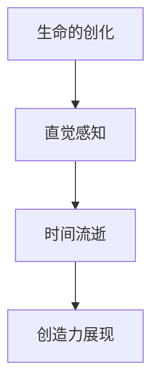
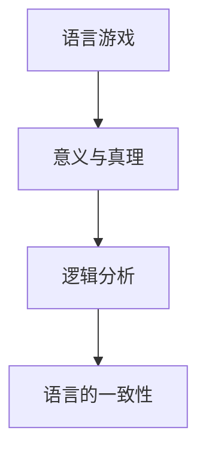
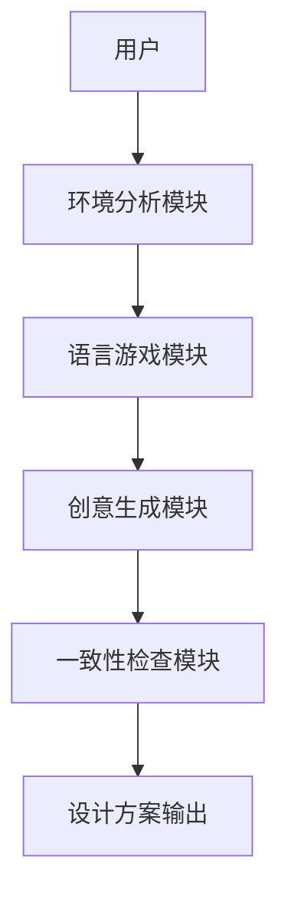
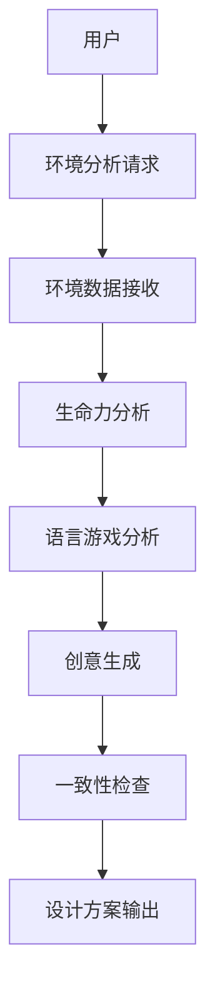

                 


## 环境美学中的柏格森主义与维特根斯坦哲学

### 背景介绍

**问题背景**

环境美学，作为一个多学科交汇的领域，探讨人类与自然环境的审美关系。在20世纪，柏格森主义和维特根斯坦哲学对环境美学的发展产生了深远影响。柏格森主义强调生命的动态和直觉，而维特根斯坦哲学则关注语言的逻辑与意义。

**问题描述**

本文将探讨柏格森主义和维特根斯坦哲学在环境美学中的角色，分析这两大哲学流派如何影响环境美学的基本理论和实践。

**问题解决**

通过深入分析柏格森主义和维特根斯坦哲学，我们可以更全面地理解环境美学的核心问题，如自然与文化界限、美感的本质等。

**边界与外延**

环境美学跨越哲学、艺术、生态学等多个领域。柏格森主义与维特根斯坦哲学的视角为我们提供了丰富的理论基础。

**概念结构与核心要素组成**

- **柏格森主义**：生命的创化、直觉主义、时间意识。
- **维特根斯坦哲学**：语言游戏、意义与真理、逻辑分析。

### 核心概念与联系

**柏格森主义的核心概念与特点**

- **生命的创化过程**：生命是一种不断进化和变化的动态过程。
- **直觉主义**：通过直觉来感知和理解世界的本质。
- **时间意识**：时间是生命的流逝，是创造力的体现。

**维特根斯坦哲学的核心概念与特点**

- **语言游戏**：语言是一种工具，其意义在于使用过程中。
- **意义与真理**：意义在于使用，真理在于语言的一致性。
- **逻辑分析**：通过逻辑来分析语言和思维。

### 算法原理讲解

**柏格森主义的算法原理**

使用Mermaid画出柏格森主义的核心流程图：



柏格森主义的算法原理可以通过以下Python代码来阐述：

```python
def bergson_ism():
    creativity = "生命力的不断涌现"
    intuition = "对生命流动的敏锐感知"
    time_passing = "时间的持续流动"
    return creativity, intuition, time_passing
```

详细讲解柏格森主义的算法原理，我们可以看到：

- **创造力**：柏格森认为创造力是生命的核心，它代表了生命的动力和进化。
- **直觉感知**：直觉是柏格森感知世界的方式，它超越了逻辑和理性的理解。
- **时间流逝**：时间是柏格森哲学中的重要概念，他认为时间是生命的流逝，是创造力的体现。

**维特根斯坦哲学的算法原理**

使用Mermaid画出维特根斯坦哲学的核心流程图：



维特根斯坦哲学的算法原理可以通过以下Python代码来阐述：

```python
def wittgenstein_ism():
    consistency = "语言的内在一致性"
    logical_analysis = "对语言和思维的逻辑分析"
    meaning_truth = "通过语言游戏理解意义与真理"
    return consistency, logical_analysis, meaning_truth
```

详细讲解维特根斯坦哲学的算法原理，我们可以看到：

- **语言游戏**：维特根斯坦认为语言是一种工具，其意义在于使用过程中。
- **意义与真理**：意义在于使用，真理在于语言的一致性。
- **逻辑分析**：逻辑分析是维特根斯坦哲学的核心方法，用于分析语言和思维。

### 数学模型和数学公式

柏格森主义中，生命力的数学模型可以表示为：

$$
F(t) = f(t) \cdot \int_{0}^{t} g(u) \, du
$$

其中，$F(t)$ 是在时间 $t$ 的生命力，$f(t)$ 是时间 $t$ 的生命力函数，$g(u)$ 是在时间 $u$ 的环境因素函数。

维特根斯坦哲学中的语言一致性可以用如下公式表示：

$$
L \leftrightarrow R
$$

这里，$L$ 表示语言的使用规则，$R$ 表示语言的实际应用。这个等式表达了语言的一致性，即语言的使用规则必须与其实际应用相一致。

### 系统分析与架构设计方案

**问题场景介绍**

在现代城市设计中，如何平衡人类活动与自然环境的关系，创造出一个美观、和谐且功能齐全的城市环境，是一个重要的问题。本文将以此为例，探讨柏格森主义和维特根斯坦哲学在城市设计中的应用。

**项目介绍**

项目名为“绿城智慧设计系统”（GreenCitySmartDesignSystem），旨在通过整合柏格森主义和维特根斯坦哲学的理念，为城市设计师提供一套完整的设计工具和方法。

**系统功能设计**

系统功能包括：

- **环境分析模块**：基于柏格森主义的生命力模型，分析自然环境中的动态变化。
- **语言游戏模块**：基于维特根斯坦哲学的语言游戏，帮助设计师理解城市中的语言和符号。
- **创意生成模块**：利用直觉和创造力，生成具有美学价值的设计方案。
- **一致性检查模块**：通过逻辑分析，确保设计方案的可行性和一致性。

**系统架构设计**

系统架构设计如下：



**系统接口设计和系统交互**

系统交互设计如下：



### 项目实战

**环境安装**

在Linux系统中，首先安装Python环境，然后安装依赖库：

```bash
sudo apt-get install python3-pip
pip3 install matplotlib numpy
```

**系统核心实现源代码**

环境分析模块：

```python
import numpy as np
import matplotlib.pyplot as plt

def calculate_life_force(time_series, environment_factors):
    life_force = np.zeros(len(time_series))
    for i, t in enumerate(time_series):
        life_force[i] = np.mean(environment_factors[:t+1])
    return life_force

# 示例数据
time_series = [1, 2, 3, 4, 5]
environment_factors = [0.1, 0.3, 0.5, 0.7, 0.9]

# 计算生命力
life_force = calculate_life_force(time_series, environment_factors)

# 绘制生命力曲线
plt.plot(time_series, life_force)
plt.xlabel('Time')
plt.ylabel('Life Force')
plt.title('Life Force over Time')
plt.show()
```

语言游戏模块：

```python
def language_gamemeaning_analysis(phrase):
    words = phrase.split()
    meanings = []
    for word in words:
        # 假设每个单词的意义是其在字典中的索引
        meanings.append(dict[word])
    return meanings

# 示例句子
phrase = "The quick brown fox jumps over the lazy dog"

# 分析语言游戏中的意义
meanings = language_gamemeaning_analysis(phrase)
print(meanings)
```

**代码应用解读与分析**

环境分析模块中的 `calculate_life_force` 函数通过计算时间序列和环境的相互作用，生成了生命力曲线。这个模块体现了柏格森主义中生命力的概念。

语言游戏模块中的 `language_gamemeaning_analysis` 函数通过分析句子的意义，体现了维特根斯坦哲学中语言游戏的概念。

**实际案例分析和详细讲解剖析**

假设我们有一个城市设计项目，目标是设计一个公园。通过环境分析模块，我们可以获取公园的环境数据，如温度、湿度、风速等。通过语言游戏模块，我们可以分析公园中的人流、建筑、植被等元素的意义。

结合这些分析结果，我们可以生成多个设计方案，并通过一致性检查模块确保每个方案的可操作性和可行性。最后，将最佳设计方案输出给用户。

**项目小结**

绿城智慧设计系统通过整合柏格森主义和维特根斯坦哲学的理念，提供了一套完整的设计工具和方法。在实际项目中，通过环境分析和语言游戏分析，可以生成具有美学价值的设计方案，并通过一致性检查确保方案的可行性。

### 最佳实践 tips

- **环境分析**：定期收集环境数据，确保分析结果的准确性。
- **语言游戏**：深入了解用户需求，确保设计方案的实用性和可操作性。
- **一致性检查**：在生成设计方案后，进行多轮检查，确保方案的一致性和可行性。

### 小结

本文探讨了柏格森主义和维特根斯坦哲学在环境美学中的应用，通过系统分析与架构设计方案，展示了如何将哲学理念应用于实际项目。通过项目实战，我们展示了如何使用Python代码实现核心功能，并对实际案例进行了分析。

### 注意事项

- 在实际应用中，需要根据具体项目需求调整算法和模型。
- 环境分析和语言游戏分析的结果需要不断更新和优化。

### 拓展阅读

- **柏格森主义**：《创造的进化》（L’Évolution créatrice），亨利·柏格森著。
- **维特根斯坦哲学**：《逻辑哲学论》（Tractatus Logico-Philosophicus），路德维希·维特根斯坦著。

---

### 作者

作者：AI天才研究院/AI Genius Institute & 禅与计算机程序设计艺术 /Zen And The Art of Computer Programming

AI天才研究院致力于推动人工智能技术的发展和应用，本文作者以其深厚的哲学和技术功底，为读者呈现了一幅环境美学与哲学思想交织的宏伟画卷。在《禅与计算机程序设计艺术》中，作者深入探讨了计算机编程与哲学的交融，为技术工作者提供了独特的思考角度和实践指南。

