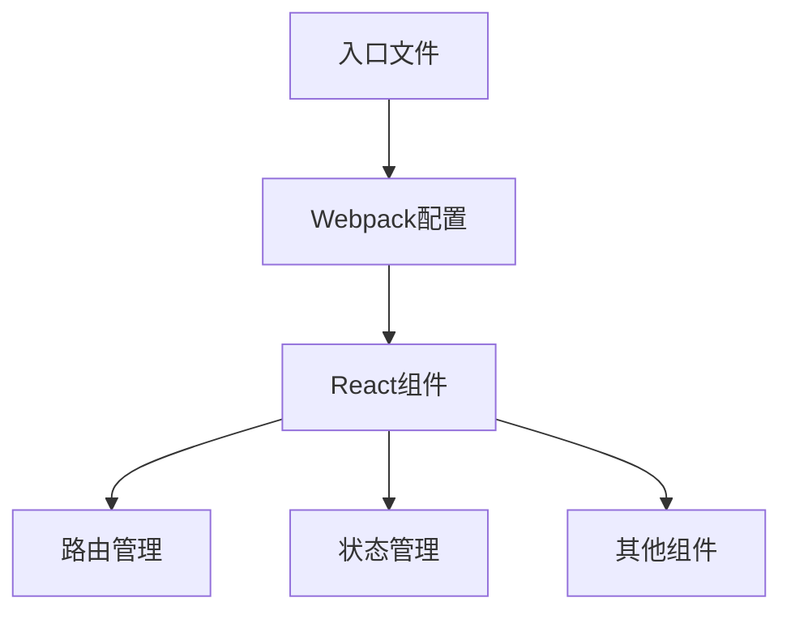
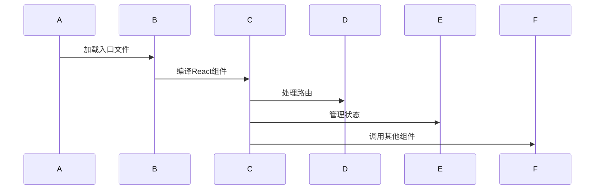
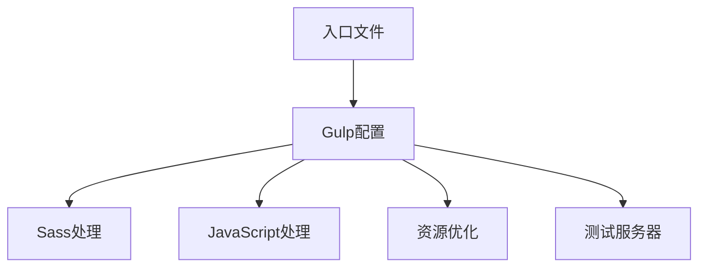
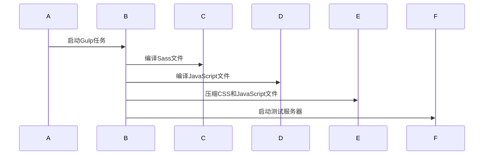
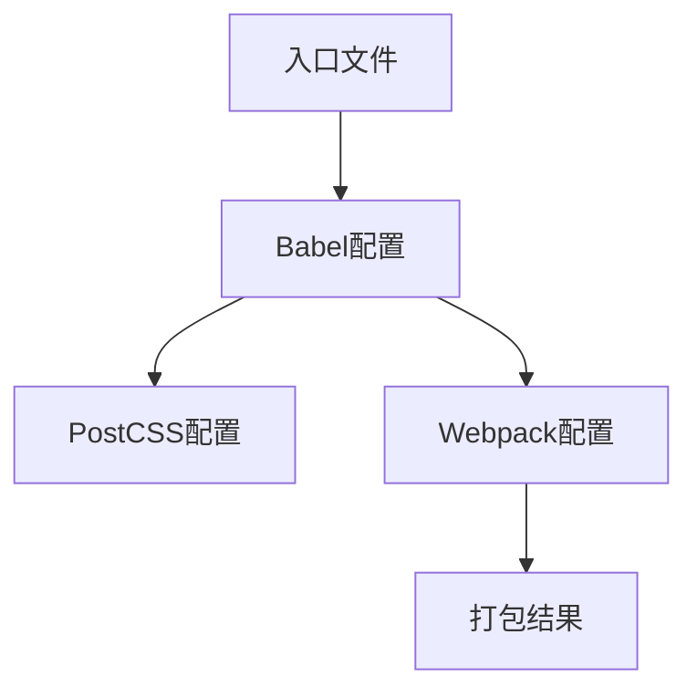
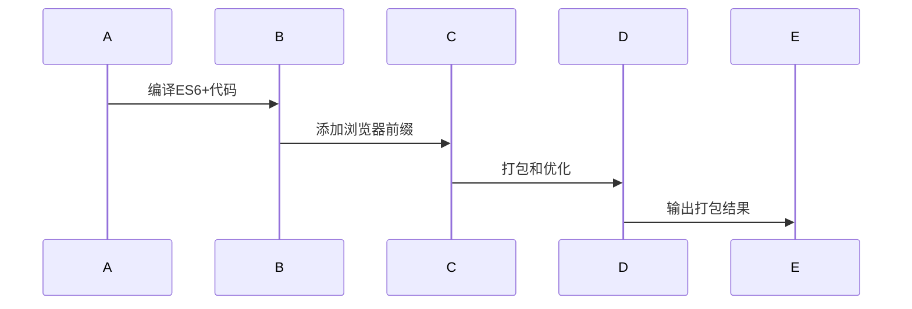

                 


### 关键词
1. **前端构建工具链**
2. **Gulp**
3. **Webpack**
4. **模块化开发**
5. **代码优化与压缩**
6. **自动化构建流程**
7. **Babel**
8. **PostCSS**

### 摘要
本文将深入探讨现代前端构建工具链的各个方面，包括其背景、核心概念、主要工具链组件、实践指南以及案例分析。我们将一步步分析这些工具如何改善前端开发流程，提高开发效率和项目质量，最终总结最佳实践与未来趋势。

---

### 目录大纲设计思路

在设计《现代前端构建工具链》的目录大纲时，我们遵循了以下步骤：

1. **整体结构确定**：确保大纲能够涵盖从基础到高级的完整内容，便于读者逐步深入。
2. **背景介绍**：介绍前端构建工具链的产生背景和重要性，为后续章节打下基础。
3. **核心概念阐述**：定义并解释前端构建工具链中的关键术语和概念，确保读者理解。
4. **工具链组件介绍**：详细描述各个构建工具的功能和作用，便于读者选择合适的工具。
5. **实践指南**：提供实际操作步骤，帮助读者将理论应用于实践。
6. **案例分析**：通过真实案例展示构建工具链的使用效果。
7. **最佳实践总结**：总结行业最佳实践，指导读者如何高效使用构建工具链。

### 目录大纲具体设计

#### 第一部分：前端构建工具链概述

**第1章：前端构建工具链的背景与重要性**
- **1.1 前端开发环境的变化**
  - 描述前端技术发展的历程，以及这种变化如何促使构建工具链的出现。
- **1.2 构建工具链的出现与发展**
  - 分析构建工具链的历史和演变，强调其在现代前端开发中的地位。
- **1.3 现代前端构建工具链的作用**
  - 详细阐述构建工具链在现代前端开发中的重要性，如提高开发效率、优化代码质量等。
- **1.4 构建工具链在现代前端开发中的优势**
  - 比较使用与不使用构建工具链的前端开发方式，突出工具链的优势。

**第2章：前端构建工具链的核心概念**
- **2.1 构建工具与打包工具的定义与区别**
  - 阐明构建工具和打包工具的定义，以及它们在工具链中的作用和区别。
- **2.2 模块化开发的必要性**
  - 解释模块化开发的概念及其在现代前端开发中的必要性。
- **2.3 代码压缩与优化的意义**
  - 讲解代码压缩和优化的原理和重要性，介绍常见的代码压缩工具。
- **2.4 前端自动化构建流程的构建步骤**
  - 描述自动化构建流程的步骤，包括代码编译、打包、测试等。

#### 第二部分：现代前端构建工具链组件

**第3章：Gulp在前端构建中的应用**
- **3.1 Gulp的基本概念与安装**
  - 介绍Gulp的基本概念和安装方法。
- **3.2 Gulp的工作流程**
  - 详细讲解Gulp的工作流程，包括任务管理和任务运行机制。
- **3.3 Gulp在项目中的应用案例**
  - 分析Gulp在真实项目中的应用案例，展示其优势。

**第4章：Webpack深度学习**
- **4.1 Webpack的基本概念与安装**
  - 介绍Webpack的基本概念和安装步骤。
- **4.2 Webpack的配置与插件**
  - 详细讲解Webpack的配置方法和常用插件。
- **4.3 Webpack的模块化和代码拆分**
  - 解释Webpack如何实现模块化和代码拆分，以及其优势和配置方法。

**第5章：Babel与ES6+代码编译**
- **5.1 Babel的基本概念与安装**
  - 介绍Babel的基本概念和安装方法。
- **5.2 Babel的配置与插件**
  - 详细讲解Babel的配置方法和常用插件。
- **5.3 Babel对ES6+代码的编译**
  - 解释Babel如何编译ES6+代码，以及其优势和配置方法。

**第6章：PostCSS与CSS处理**
- **6.1 PostCSS的基本概念与安装**
  - 介绍PostCSS的基本概念和安装方法。
- **6.2 PostCSS的插件与工具链**
  - 详细讲解PostCSS的插件和工具链。
- **6.3 PostCSS在项目中的实际应用**
  - 分析PostCSS在真实项目中的应用案例。

**第7章：前端构建工具链的综合应用**
- **7.1 构建工具链的配置与优化**
  - 提供构建工具链的配置和优化方法。
- **7.2 前端构建工具链的自动化流程**
  - 详细讲解前端构建工具链的自动化流程。
- **7.3 常见问题与解决方案**
  - 分析常见问题并提供解决方案。

#### 第三部分：案例分析

**第8章：案例分析**
- **8.1 案例一：使用Webpack构建单页面应用**
  - 分析单页面应用中的构建工具链配置和优化。
- **8.2 案例二：使用Gulp进行前端工程化**
  - 分析Gulp在前端工程化中的具体应用。
- **8.3 案例三：结合Babel和PostCSS的前端开发实践**
  - 分析Babel和PostCSS结合使用的前端开发实践。

#### 第四部分：最佳实践与未来趋势

**第9章：最佳实践与未来趋势**
- **9.1 前端构建工具链的最佳实践**
  - 总结最佳实践，包括工具选择、配置优化、自动化流程等。
- **9.2 构建工具链的优化方向**
  - 分析构建工具链的优化方向和未来发展趋势。
- **9.3 前端构建工具链的未来发展趋势**
  - 探讨未来构建工具链的可能发展方向和趋势。

通过上述目录大纲的设计，我们为《现代前端构建工具链》提供了一个结构清晰、内容丰富的框架，便于读者从基础到高级逐步学习前端构建工具链的相关知识。接下来，我们将逐步深入每个章节的内容，确保文章的完整性和专业性。### 第1章：前端构建工具链的背景与重要性

#### 1.1 前端开发环境的变化

前端开发的起源可以追溯到网页设计时代的HTML和CSS。随着互联网的迅速发展，前端技术逐渐丰富，从最初的静态网页逐渐演变为动态交互丰富的单页面应用（SPA）。这个过程中，前端开发环境经历了显著的变化。

早期的前端开发，开发者通常需要手动管理大量的HTML、CSS和JavaScript文件，进行手动编译和优化，这不仅繁琐，而且容易出错。随着前端技术的发展，尤其是JavaScript语言的兴起，前端工程师开始尝试使用一些工具来自动化这些过程，如CSS预处理器（如Sass和Less）和JavaScript模块化工具（如CommonJS和AMD）。这些工具使得代码的编写、编译和优化变得更加高效。

然而，这些工具仅仅解决了部分问题，前端开发的复杂度仍在不断增加。随着前端技术的多样化，开发者需要处理越来越多的库和框架，如React、Vue和Angular等。这些库和框架引入了新的构建需求，如模块化、打包、代码拆分、代码分割等。为了满足这些需求，开发者开始寻求更加强大和灵活的构建工具。

#### 1.2 构建工具链的出现与发展

构建工具链的概念源于软件工程的构建过程，其目的是自动化软件的开发、测试、打包和部署。在前端开发领域，构建工具链指的是一系列工具和流程的组合，用于自动化前端的开发流程，提高开发效率和代码质量。

构建工具链的兴起主要受到以下几个因素的推动：

1. **模块化开发**：模块化开发是前端开发的一个重要趋势，它将代码分割成多个模块，提高了代码的可维护性和复用性。为了实现模块化开发，开发者需要使用模块化工具（如Webpack和Babel）来编译和打包代码。
2. **代码优化与压缩**：为了提高网页的加载速度和用户体验，前端开发者需要对代码进行压缩和优化。构建工具链中的代码压缩工具（如UglifyJS和Terser）和优化工具（如CSSNano和ImageOptim）能够自动化这些过程。
3. **自动化构建流程**：现代前端项目通常需要频繁的编译、测试和部署。自动化构建流程可以减少手动操作，提高工作效率。Gulp和Grunt等早期构建工具提供了这种自动化能力。
4. **前端工程化**：随着前端项目的复杂度增加，前端工程化变得越来越重要。构建工具链通过提供标准化和自动化流程，帮助开发者更好地管理项目，提高代码质量和开发效率。

构建工具链的发展历程可以分为几个阶段：

- **早期阶段**：开发者开始使用简单的工具来自动化构建过程，如CSS预处理器和JavaScript模块化工具。
- **中级阶段**：随着项目复杂度增加，开发者开始使用Gulp和Grunt等自动化工具，实现代码编译、压缩和部署的自动化。
- **高级阶段**：现代构建工具链如Webpack、Babel和PostCSS等，提供了更加复杂的功能，如模块化、代码拆分、代码分割、环境配置等。

#### 1.3 现代前端构建工具链的作用

现代前端构建工具链在提高开发效率和代码质量方面发挥了重要作用：

1. **提高开发效率**：构建工具链通过自动化构建流程，减少手动操作，提高开发效率。开发者可以专注于代码编写，而不必担心编译、打包和优化等繁琐任务。
2. **优化代码质量**：构建工具链中的代码压缩和优化工具能够自动压缩和优化代码，提高网页的加载速度和用户体验。同时，模块化开发提高了代码的可维护性和复用性。
3. **跨平台兼容性**：构建工具链能够处理不同浏览器的兼容性问题，通过编译和转换代码，使得前端代码能够更好地运行在不同的设备和浏览器上。
4. **项目标准化**：构建工具链提供了一套标准化的构建流程，帮助开发者更好地管理项目，确保代码的一致性和可维护性。
5. **代码分割与懒加载**：现代构建工具链支持代码分割和懒加载，能够将代码分割成不同的模块，按需加载，进一步提高网页的加载速度。

#### 1.4 构建工具链在现代前端开发中的优势

构建工具链在现代前端开发中具有以下优势：

1. **模块化**：模块化开发是现代前端开发的核心，构建工具链通过模块化工具（如Webpack和Babel）实现了代码的模块化，提高了代码的可维护性和复用性。
2. **自动化**：构建工具链通过自动化构建流程，减少了手动操作，提高了开发效率。开发者可以专注于代码编写，而不用担心编译、打包和优化等任务。
3. **代码优化**：构建工具链中的代码压缩和优化工具能够自动压缩和优化代码，提高网页的加载速度和用户体验。
4. **跨平台兼容性**：构建工具链能够处理不同浏览器的兼容性问题，通过编译和转换代码，使得前端代码能够更好地运行在不同的设备和浏览器上。
5. **项目标准化**：构建工具链提供了一套标准化的构建流程，帮助开发者更好地管理项目，确保代码的一致性和可维护性。

通过以上内容，我们了解了前端构建工具链的背景、重要性以及其在现代前端开发中的优势。接下来，我们将进一步探讨前端构建工具链的核心概念和主要工具链组件。这些核心概念和工具将帮助我们更好地理解构建工具链的工作原理，并能够灵活应用于实际项目中。### 第2章：前端构建工具链的核心概念

在深入探讨现代前端构建工具链之前，有必要首先明确构建工具链中的核心概念。这些核心概念是理解构建工具链如何工作以及如何在不同场景下应用它们的基础。

#### 2.1 构建工具与打包工具的定义与区别

**构建工具**（Build Tools）和**打包工具**（Packaging Tools）是前端开发中常见的术语，但它们之间有一定的区别。

- **构建工具**：构建工具主要关注于自动化开发流程，包括代码的编译、测试、压缩和部署等。它们通常用于处理开发过程中的一系列任务，如代码的编译（如TypeScript、ES6+的转换等）和资源的打包（如HTML、CSS、JavaScript等）。

- **打包工具**：打包工具则更专注于将项目中的代码和资源打包成一个可以直接部署到生产环境中的单一文件或多个文件。例如，Webpack就是一个典型的打包工具，它不仅可以打包JavaScript文件，还可以处理CSS文件、图片文件等。

虽然构建工具和打包工具的功能有所不同，但在现代前端开发中，它们往往是相辅相成的。构建工具如Gulp和Grunt可以自动化一系列构建任务，而Webpack等打包工具则负责将这些任务的结果打包成适合生产环境使用的文件。

**构建工具与打包工具的关系**：构建工具链通常包括多个构建和打包工具，这些工具通过一系列配置和任务定义协同工作，形成完整的构建流程。

#### 2.2 模块化开发的必要性

模块化开发是现代前端开发的核心原则之一。它将代码分割成多个模块，每个模块负责实现特定的功能，从而提高了代码的可维护性和复用性。

**必要性**：

1. **代码可维护性**：模块化开发使得代码更加清晰和结构化，每个模块可以独立开发和测试，降低了代码复杂度和耦合度。
2. **代码复用性**：模块化使得代码可以被复用，多个项目可以共享相同的模块，减少了重复编写代码的工作量。
3. **开发效率**：模块化开发允许开发者并行开发不同模块，提高了开发效率。

**常见模块化工具**：

- **CommonJS**：CommonJS是最早的模块化标准之一，主要应用于服务器端开发。它通过require和module.exports来实现模块的导入和导出。
- **AMD**（异步模块定义）：AMD是为了解决浏览器端模块化而设计的标准，通过define和require来实现模块的加载。
- **ES6 Modules**：ES6 Modules是最新版本的JavaScript模块化标准，通过import和export来实现模块的导入和导出。它具有静态结构，在编译时就能确定依赖关系，适合前端和后端开发。

#### 2.3 代码压缩与优化的意义

代码压缩和优化是前端开发中不可或缺的一环，它们直接影响网页的加载速度和用户体验。

**意义**：

1. **提高网页加载速度**：压缩后的代码体积更小，可以减少HTTP请求次数，从而加快网页的加载速度。
2. **提高用户体验**：优化后的代码运行效率更高，可以提供更流畅的交互体验。
3. **降低带宽消耗**：压缩后的代码可以减少带宽消耗，特别是在移动设备上，这尤为重要。

**常见压缩和优化工具**：

- **UglifyJS**：UglifyJS是一个JavaScript压缩工具，可以删除代码中的冗余字符、注释和空格，同时保持代码的运行效果。
- **Terser**：Terser是UglifyJS的升级版，支持更多现代JavaScript语法，压缩效果更好。
- **CSSNano**：CSSNano是一个CSS压缩工具，可以删除CSS代码中的冗余字符和空格，优化代码结构。
- **ImageOptim**：ImageOptim是一个图片压缩工具，可以通过无损压缩和优化图像格式来减少图片文件的大小。

#### 2.4 前端自动化构建流程的构建步骤

前端自动化构建流程是将代码从开发环境编译、打包、测试到最终部署到生产环境的一系列自动化操作。构建步骤通常包括以下几个环节：

1. **代码编译**：将JavaScript、TypeScript等高级语言编译成浏览器可以直接运行的JavaScript代码。
2. **资源处理**：处理HTML、CSS、图片等资源文件，如压缩CSS和JavaScript代码，优化图片等。
3. **代码打包**：将编译后的代码和资源文件打包成一个或多个文件，便于部署和分发。
4. **测试**：运行测试脚本，确保代码的质量和功能正确性。
5. **部署**：将打包后的文件部署到服务器或CDN上，供用户访问。

自动化构建流程的核心是构建工具，如Gulp、Grunt和Webpack等。这些工具可以通过配置任务来自动执行上述构建步骤，减少手动操作，提高开发效率。

通过以上对构建工具、打包工具、模块化开发、代码压缩与优化以及自动化构建流程的介绍，我们可以更好地理解前端构建工具链的核心概念。这些核心概念是构建高效、稳定、可维护的前端项目的基础。接下来，我们将深入探讨一些具体的构建工具，如Gulp和Webpack，了解它们如何在实际项目中应用。### 第3章：Gulp在前端构建中的应用

Gulp是一个强大的前端自动化构建工具，它可以帮助开发者自动化一系列的前端构建任务，如代码编译、压缩、测试和部署等。通过Gulp，开发者可以减少手动操作，提高开发效率和代码质量。在本章中，我们将详细探讨Gulp的基本概念、工作流程以及如何在项目中应用Gulp。

#### 3.1 Gulp的基本概念与安装

**Gulp的基本概念**：

Gulp是一个基于Node.js的自动化构建工具，它通过流式管道（stream）来处理文件，从而实现高效的文件操作。Gulp的核心思想是将任务（tasks）串联起来，形成一个完整的构建流程。

**安装Gulp**：

要使用Gulp，首先需要在本地安装Node.js。安装Node.js后，可以通过npm（Node包管理器）来安装Gulp。

```shell
npm install --global gulp-cli
```

上述命令将安装Gulp的全局命令行工具，这样我们就可以在任何项目中使用Gulp了。

**创建Gulp项目**：

在一个新的项目目录中，可以通过以下命令来初始化一个Gulp项目：

```shell
npm init -y
```

上述命令将生成一个package.json文件，其中包含了项目的依赖和配置信息。

```json
{
  "name": "my-gulp-project",
  "version": "1.0.0",
  "description": "A Gulp project for frontend development",
  "main": "index.js",
  "scripts": {
    "start": "gulp"
  },
  "dependencies": {
    "gulp": "^4.0.2"
  }
}
```

在package.json文件中，我们将Gulp作为依赖安装，并通过“scripts”字段设置了一个命令，用于启动Gulp构建任务。

#### 3.2 Gulp的工作流程

Gulp的工作流程主要包括以下几个步骤：

1. **加载（Load）**：通过Gulp API加载插件和任务。
2. **处理（Process）**：对加载的文件进行处理，如编译、压缩、转换等。
3. **输出（Output）**：将处理后的文件输出到指定的位置。

**Gulp的工作流程可以用以下简单的示例来解释**：

```javascript
const { src, dest } = require('gulp');
const cssmin = require('gulp-cssmin');
const uglify = require('gulp-uglify');

// 加载任务
const cssTask = () => {
  return src('src/**/*.css') // 加载所有CSS文件
    .pipe(cssmin()) // 压缩CSS文件
    .pipe(dest('dist/css')); // 输出压缩后的CSS文件
};

const jsTask = () => {
  return src('src/**/*.js') // 加载所有JS文件
    .pipe(uglify()) // 压缩JS文件
    .pipe(dest('dist/js')); // 输出压缩后的JS文件
};

// 启动任务
exports.default = gulp.series(cssTask, jsTask);
```

在上面的示例中，我们首先加载了Gulp模块以及所需的插件（cssmin和uglify），然后定义了两个任务：cssTask和jsTask。这两个任务分别负责加载、压缩和输出CSS文件和JS文件。最后，我们通过`gulp.series`方法将这两个任务串联起来，形成一个完整的构建流程。

#### 3.3 Gulp在项目中的应用案例

在实际项目中，Gulp可以用于处理各种前端构建任务。以下是一个简单的项目示例，展示如何使用Gulp来构建一个前端项目。

**项目结构**：

```plaintext
my-gulp-project/
|-- src/
|   |-- css/
|   |   |-- style.css
|   |-- js/
|   |   |-- script.js
|-- gulpfile.js
|-- package.json
```

**gulpfile.js**：

```javascript
const { src, dest } = require('gulp');
const cssmin = require('gulp-cssmin');
const uglify = require('gulp-uglify');
const sass = require('gulp-sass');
const autoprefixer = require('gulp-autoprefixer');
const browserSync = require('browser-sync').create();

// 样式处理任务
const styles = () => {
  return src('src/css/**/*.scss')
    .pipe(sass().on('error', sass.logError))
    .pipe(autoprefixer())
    .pipe(cssmin())
    .pipe(dest('dist/css'));
};

// 脚本处理任务
const scripts = () => {
  return src('src/js/**/*.js')
    .pipe(uglify())
    .pipe(dest('dist/js'));
};

// 测试服务器任务
const serve = (cb) => {
  browserSync.init({
    server: {
      baseDir: './'
    }
  });
  browserSync.watch('src/**/*.scss').on('change', browserSync.reload);
  browserSync.watch('src/**/*.js').on('change', browserSync.reload);
  cb();
};

// 构建任务
const build = gulp.series(styles, scripts);

// 默认任务
exports.default = gulp.series(build, serve);
```

在上面的示例中，我们定义了三个主要任务：styles、scripts和serve。styles任务负责处理SCSS文件，包括编译、添加前缀和压缩。scripts任务负责压缩JavaScript文件。serve任务用于启动一个测试服务器，并在浏览器中实时预览文件变化。

**项目运行**：

运行`npm run default`命令将执行默认任务，包括构建和测试服务器。构建完成后，浏览器将自动刷新，显示最新的构建结果。

```shell
npm install
npm run default
```

通过这个简单的案例，我们可以看到Gulp如何在一个实际项目中发挥作用。Gulp不仅能够自动化构建任务，还能够与其他前端工具（如Sass、Babel等）集成，形成一个完整的前端开发工作流。

#### 总结

Gulp是一个功能强大的前端自动化构建工具，它通过简单的配置和任务定义，可以轻松实现代码编译、压缩和测试等任务。在实际项目中，Gulp可以帮助开发者提高开发效率，确保代码质量。通过本章节的介绍，我们了解了Gulp的基本概念、工作流程以及在项目中的应用案例。接下来，我们将继续探讨Webpack，了解其在前端构建中的重要性。### 第4章：Webpack深度学习

Webpack是一个强大的模块打包工具，在现代前端开发中扮演着至关重要的角色。它不仅能够将各种资源（如JavaScript、CSS、图片等）打包成一个或多个静态文件，还能通过模块化、代码拆分、懒加载等功能优化项目结构和提升性能。在本章中，我们将深入了解Webpack的基本概念、安装方法、配置和插件，并探讨Webpack的模块化和代码拆分机制。

#### 4.1 Webpack的基本概念与安装

**Webpack的基本概念**：

Webpack是一个模块打包工具，它通过将项目中的模块化代码打包成浏览器可执行的文件来实现前端工程的自动化构建。Webpack的核心概念包括：

- **模块**：Webpack使用CommonJS、AMD或ES6 Module等方式将代码分割成多个模块。
- **入口**（Entry）：指定Webpack需要打包的文件或目录，通常是项目的根文件。
- **出口**（Output）：指定Webpack打包后的文件输出路径和名称。
- **加载器**（Loader）：用于对模块的转换和处理，如CSS、图片、Babel等。
- **插件**（Plugin）：用于扩展Webpack的功能，如打包优化、自动刷新等。

**安装Webpack**：

首先，确保已经安装Node.js和npm。然后，在一个新的项目目录中，通过以下命令安装Webpack和相关依赖：

```shell
npm init -y
npm install webpack webpack-cli --save-dev
```

上述命令将在项目中创建一个`package.json`文件，并安装Webpack和Webpack CLI（命令行工具）。其中，`--save-dev`参数将Webpack作为开发依赖安装。

**创建Webpack配置文件**：

在项目根目录下创建一个名为`webpack.config.js`的配置文件，这是Webpack的核心配置文件。

```javascript
const path = require('path');

module.exports = {
  // 入口文件
  entry: './src/index.js',
  // 出口文件
  output: {
    filename: 'bundle.js',
    path: path.resolve(__dirname, 'dist'),
  },
  // 加载器
  module: {
    rules: [
      {
        test: /\.css$/,
        use: ['style-loader', 'css-loader'],
      },
      {
        test: /\.scss$/,
        use: ['style-loader', 'css-loader', 'sass-loader'],
      },
      {
        test: /\.(png|svg|jpg|jpeg|gif)$/,
        use: [
          {
            loader: 'file-loader',
            options: {
              name: '[name].[ext]',
              outputPath: 'images/',
            },
          },
        ],
      },
      {
        test: /\.jsx?$/,
        exclude: /node_modules/,
        use: {
          loader: 'babel-loader',
          options: {
            presets: [['react', { runtime: 'automatic' }]],
          },
        },
      },
    ],
  },
  // 插件
  plugins: [
    new webpack-automaticplugin(),
  ],
  // 模式
  mode: 'development',
};
```

上述配置文件定义了入口文件、出口文件、加载器和插件，以及开发模式。

#### 4.2 Webpack的配置与插件

**Webpack的配置**：

Webpack的配置是通过`webpack.config.js`文件来实现的。该文件包含了Webpack的入口、出口、加载器、插件、模式等配置选项。以下是一个简单的Webpack配置示例：

```javascript
const path = require('path');
const HtmlWebpackPlugin = require('html-webpack-plugin');

module.exports = {
  entry: './src/index.js',
  output: {
    filename: 'bundle.js',
    path: path.resolve(__dirname, 'dist'),
  },
  module: {
    rules: [
      {
        test: /\.css$/,
        use: ['style-loader', 'css-loader'],
      },
      {
        test: /\.jsx?$/,
        exclude: /node_modules/,
        use: 'babel-loader',
      },
    ],
  },
  plugins: [
    new HtmlWebpackPlugin({
      template: './src/index.html',
    }),
  ],
  mode: 'development',
};
```

**加载器（Loader）**：

加载器是Webpack的核心组件之一，用于对模块进行转换。常见的加载器包括：

- **Babel-loader**：用于将ES6+代码转换为ES5代码。
- **CSS-loader**：用于加载CSS文件。
- **Style-loader**：用于将CSS代码注入到DOM中。
- **File-loader**：用于处理图片、字体等文件。
- **Image-loader**：用于压缩和转换图片。

**插件（Plugin）**：

插件是Webpack的另一个重要组件，用于扩展Webpack的功能。常见的插件包括：

- **HtmlWebpackPlugin**：用于生成一个HTML文件，并在其中自动引入打包后的JavaScript文件。
- **CleanWebpackPlugin**：用于清理输出目录。
- **DefinePlugin**：用于定义环境变量。
- **WebpackBundleAnalyzerPlugin**：用于分析打包结果，帮助优化项目结构。

#### 4.3 Webpack的模块化和代码拆分

**Webpack的模块化**：

Webpack使用模块化来组织项目代码，使得代码更加模块化和可维护。Webpack支持CommonJS、AMD和ES6 Module等多种模块化标准。以下是一个简单的Webpack配置，用于处理ES6 Module：

```javascript
module.exports = {
  // ...其他配置
  module: {
    rules: [
      {
        test: /\.js$/,
        exclude: /node_modules/,
        use: 'babel-loader',
      },
    ],
  },
};
```

**代码拆分（Code Splitting）**：

代码拆分是将代码拆分成多个块（chunk），并在需要时按需加载。Webpack通过动态导入（dynamic import）和懒加载（lazy loading）来实现代码拆分。以下是一个使用动态导入进行代码拆分的示例：

```javascript
import(/* webpackChunkName: "feature" */ './feature').then(module => {
  // 使用拆分的模块
});
```

上述代码将`./feature.js`拆分成一个名为`feature`的块，并在需要时按需加载。

**代码拆分的优势**：

- **减小首屏加载时间**：将代码拆分成多个块，可以按需加载，从而减小首屏加载时间。
- **提高缓存利用率**：按需加载的模块可以独立缓存，提高了缓存利用率。
- **提高代码可维护性**：拆分代码可以更好地组织和管理项目模块。

通过以上对Webpack的基本概念、配置和插件的介绍，我们可以看到Webpack是如何在现代前端开发中发挥其强大作用的。Webpack不仅能够自动化构建过程，还能够通过模块化和代码拆分等机制优化项目结构和提升性能。在接下来的章节中，我们将继续探讨其他构建工具，如Babel和PostCSS，了解它们如何与Webpack结合使用，进一步优化前端开发流程。### 第5章：Babel与ES6+代码编译

Babel是一个广泛使用的JavaScript编译器，它能够将ES6+的新语法和特性转换为当前浏览器支持的ES5代码。这对于确保新特性在旧环境中运行至关重要。在本章中，我们将深入了解Babel的基本概念、安装方法、配置和插件，以及如何使用Babel编译ES6+代码。

#### 5.1 Babel的基本概念与安装

**Babel的基本概念**：

Babel是一个多步转换过程，它将现代JavaScript代码转换为旧版浏览器可以运行的代码。这个过程包括以下几个阶段：

- **解析**（Parsing）：将源代码解析成抽象语法树（AST）。
- **转换**（Transforming）：对AST进行修改，实现新语法到旧语法的转换。
- **生成**（Generating）：将修改后的AST重新生成JavaScript代码。

**安装Babel**：

首先，确保已经安装Node.js和npm。然后，在一个新的项目目录中，通过以下命令安装Babel和相关依赖：

```shell
npm init -y
npm install @babel/core @babel/cli @babel/preset-env --save-dev
```

上述命令将在项目中创建一个`package.json`文件，并安装Babel的核心包、命令行工具和ES6+预设。

**创建Babel配置文件**：

在项目根目录下创建一个名为`.babelrc`的配置文件，这是Babel的核心配置文件。

```json
{
  "presets": ["@babel/preset-env"]
}
```

上述配置文件指定了使用`@babel/preset-env`预设，该预设会根据目标环境自动启用需要的ES6+特性。

#### 5.2 Babel的配置与插件

**Babel的配置**：

Babel的配置文件`.babelrc`或`babel.config.js`用于指定Babel的转换规则。以下是一个更详细的配置示例：

```json
{
  "presets": [
    {
      "name": "@babel/preset-env",
      "targets": {
        "browsers": "> 1%",
        "node": "current"
      },
      "useBuiltIns": "usage",
      "corejs": { "version": 3 }
    }
  ],
  "plugins": [
    ["@babel/plugin-proposal-class-properties", { "loose": true }]
  ]
}
```

**配置选项说明**：

- `targets`：指定目标环境，Babel将根据这些目标进行代码转换。
- `useBuiltIns`：指定如何使用polyfills，`usage`选项会根据目标环境按需引入polyfills。
- `corejs`：指定使用的CoreJS版本，CoreJS是一个提供polyfills的库。

**插件（Plugins）**：

Babel插件用于扩展Babel的功能，实现对特定语法或特性的转换。以下是一个简单的插件示例，用于添加类属性：

```json
{
  "plugins": [
    ["@babel/plugin-proposal-class-properties", { "loose": true }]
  ]
}
```

**插件说明**：

- `@babel/plugin-proposal-class-properties`：用于添加对类属性的支持。

#### 5.3 Babel对ES6+代码的编译

**示例代码**：

假设我们有以下使用ES6+特性的JavaScript代码：

```javascript
const greeting = "Hello, World!";
let isNight = true;
class Person {
  constructor(name) {
    this.name = name;
  }
  sayHello() {
    console.log(`Hello, ${this.name}!`);
  }
}

const person = new Person("Alice");
person.sayHello();
```

**编译结果**：

使用Babel编译上述代码，我们将得到以下ES5代码：

```javascript
"use strict";

const greeting = "Hello, World!";
let isNight = true;
function Person(_name) {
  this._name = _name;
}

Person.prototype.sayHello = function sayHello() {
  console.log(`Hello, ${this._name}!`);
};

const person = new Person("Alice");
person.sayHello();
```

**Babel编译流程**：

1. **解析**：将源代码解析成AST。
2. **转换**：对AST进行修改，实现ES6+语法到ES5语法的转换。
3. **生成**：将修改后的AST重新生成JavaScript代码。

**Babel编译的优势**：

- **兼容性**：Babel能够将ES6+代码编译成所有浏览器支持的ES5代码，确保代码在旧版浏览器中运行。
- **灵活性**：Babel支持各种插件和预设，可以根据项目需求进行定制。
- **异步编译**：Babel可以异步编译代码，提高构建速度。

通过以上对Babel的基本概念、配置和插件的介绍，我们可以看到Babel是如何在现代前端开发中发挥其强大作用的。Babel不仅能够确保新特性在旧环境中运行，还能够通过灵活的配置和插件机制满足不同项目的需求。在接下来的章节中，我们将继续探讨其他前端构建工具，如PostCSS，了解它们如何与Babel结合使用，进一步优化前端开发流程。### 第6章：PostCSS与CSS处理

PostCSS是一个功能强大的CSS处理器，它允许开发者使用现代CSS特性，并通过一系列插件将CSS转换为兼容旧浏览器的代码。PostCSS与CSS预处理器（如Sass和Less）不同，它并不是用来编写CSS的，而是用来处理和转换CSS。在本章中，我们将深入了解PostCSS的基本概念、安装方法、插件和工具链，以及PostCSS在项目中的实际应用。

#### 6.1 PostCSS的基本概念与安装

**PostCSS的基本概念**：

PostCSS是一个基于CSS的新规范的处理工具，它通过使用JavaScript插件来扩展CSS的功能。PostCSS的核心思想是使用插件来处理CSS，例如添加浏览器前缀、自动格式化CSS代码、提取变量等。PostCSS使开发者能够使用最新的CSS特性，同时确保代码兼容不同的浏览器。

**安装PostCSS**：

要使用PostCSS，首先需要安装Node.js和npm。然后，在一个新的项目目录中，通过以下命令安装PostCSS和相关依赖：

```shell
npm init -y
npm install postcss postcss-cli postcss-preset-env --save-dev
```

上述命令将在项目中创建一个`package.json`文件，并安装PostCSS、PostCSS CLI（命令行工具）以及一个常用的预设`postcss-preset-env`。

**创建PostCSS配置文件**：

在项目根目录下创建一个名为`.postcssrc`的配置文件，这是PostCSS的核心配置文件。

```json
{
  "plugins": {
    "autoprefixer": {}
  }
}
```

上述配置文件指定了使用`autoprefixer`插件来自动添加浏览器前缀。

#### 6.2 PostCSS的插件与工具链

PostCSS插件是PostCSS功能的核心，以下是一些常用的PostCSS插件：

- **autoprefixer**：自动添加浏览器前缀。
- **cssnano**：用于压缩和优化CSS代码。
- **postcss-custom-properties**：用于处理CSS变量。
- **postcss-mixins**：用于定义和重用CSS混合。
- **postcss-preset-env**：用于自动启用和兼容最新的CSS特性。

**PostCSS工具链**：

PostCSS通常与其他构建工具（如Webpack、Gulp等）结合使用，形成一个完整的CSS处理流程。以下是一个使用Webpack和PostCSS的简单工具链配置示例：

**package.json**：

```json
{
  "name": "my-postcss-project",
  "version": "1.0.0",
  "description": "A PostCSS project for frontend development",
  "scripts": {
    "start": "webpack --mode development",
    "build": "webpack --mode production"
  },
  "dependencies": {
    "css-loader": "^5.2.0",
    "style-loader": "^2.0.0",
    "webpack": "^5.0.0",
    "webpack-cli": "^4.0.0",
    "postcss": "^8.0.0",
    "postcss-loader": "^4.0.0",
    "postcss-preset-env": "^7.0.0"
  },
  "devDependencies": {
    "autoprefixer": "^10.0.0"
  }
}
```

**webpack.config.js**：

```javascript
const path = require('path');
const PostCSSLoader = require('postcss-loader');
const autoprefixer = require('autoprefixer');

module.exports = {
  module: {
    rules: [
      {
        test: /\.css$/,
        use: [
          'style-loader',
          {
            loader: 'css-loader',
            options: {
              plugins: [autoprefixer()],
            },
          },
        ],
      },
    ],
  },
  output: {
    filename: 'main.js',
    path: path.resolve(__dirname, 'dist'),
  },
};
```

**项目结构**：

```plaintext
my-postcss-project/
|-- src/
|   |-- styles/
|   |   |-- main.css
|-- webpack.config.js
|-- package.json
```

在上述配置中，我们使用Webpack的`postcss-loader`插件来处理CSS文件，并指定使用`autoprefixer`插件为CSS代码添加浏览器前缀。

#### 6.3 PostCSS在项目中的实际应用

在实际项目中，PostCSS可以帮助开发者利用最新的CSS特性，同时确保代码兼容不同的浏览器。以下是一个简单的项目示例，展示如何使用PostCSS处理CSS文件。

**项目结构**：

```plaintext
my-project/
|-- src/
|   |-- styles/
|   |   |-- main.css
|   |   |-- variables.css
|-- postcss.config.js
|-- package.json
```

**postcss.config.js**：

```javascript
module.exports = {
  plugins: [
    require('postcss-preset-env')({
      stage: 0,
      browsers: 'last 2 versions',
      autoprefixer: {
        grid: 'autoplace',
      },
    }),
  ],
};
```

**main.css**：

```css
:root {
  --color-primary: #3498db;
}

body {
  font-family: 'Arial', sans-serif;
  color: var(--color-primary);
}

.container {
  display: grid;
  grid-template-columns: repeat(auto-fill, minmax(250px, 1fr));
}
```

**webpack.config.js**：

```javascript
const path = require('path');
const PostCSSLoader = require('postcss-loader');

module.exports = {
  module: {
    rules: [
      {
        test: /\.css$/,
        use: ['style-loader', 'css-loader', 'postcss-loader'],
      },
    ],
  },
  output: {
    filename: 'main.js',
    path: path.resolve(__dirname, 'dist'),
  },
};
```

**package.json**：

```json
{
  "name": "my-project",
  "version": "1.0.0",
  "description": "A project using PostCSS for CSS processing",
  "scripts": {
    "start": "webpack --mode development",
    "build": "webpack --mode production"
  },
  "dependencies": {
    "css-loader": "^5.2.0",
    "style-loader": "^2.0.0",
    "webpack": "^5.0.0",
    "webpack-cli": "^4.0.0"
  },
  "devDependencies": {
    "postcss": "^8.0.0",
    "postcss-loader": "^4.0.0",
    "postcss-preset-env": "^7.0.0",
    "autoprefixer": "^10.0.0"
  }
}
```

在这个项目中，我们使用了PostCSS的`postcss-preset-env`插件来自动启用和兼容最新的CSS特性，并使用了`autoprefixer`插件为CSS代码添加浏览器前缀。通过Webpack的`postcss-loader`，我们可以将PostCSS配置与Webpack构建过程无缝集成。

**编译和打包**：

通过运行`npm run build`命令，我们将编译和打包CSS文件：

```shell
npm install
npm run build
```

编译完成后，会在`dist`目录下生成`main.js`和`main.css`文件，这些文件包含了编译后的CSS代码。

通过以上内容，我们了解了PostCSS的基本概念、安装方法、插件和工具链，以及在项目中的实际应用。PostCSS通过其灵活的插件机制，使得开发者能够轻松利用最新的CSS特性，同时确保代码的兼容性和优化。在接下来的章节中，我们将继续探讨如何综合应用多个构建工具，进一步优化前端开发流程。### 第7章：前端构建工具链的综合应用

在前端开发中，综合应用多个构建工具可以提高开发效率、优化项目结构并提升代码质量。在本章中，我们将详细探讨如何在前端项目中综合应用Gulp、Webpack、Babel和PostCSS等构建工具，并优化构建流程。

#### 7.1 构建工具链的配置与优化

**构建工具链配置**：

在前端项目中，构建工具链的配置是关键步骤，它决定了工具链的运行方式和性能。以下是一个综合应用Gulp、Webpack、Babel和PostCSS的构建工具链的配置示例。

**package.json**：

```json
{
  "name": "my-project",
  "version": "1.0.0",
  "description": "A project using multiple build tools",
  "scripts": {
    "start": "gulp",
    "build": "webpack --mode production"
  },
  "dependencies": {
    "css-loader": "^5.2.0",
    "style-loader": "^2.0.0",
    "webpack": "^5.0.0",
    "webpack-cli": "^4.0.0"
  },
  "devDependencies": {
    "autoprefixer": "^10.0.0",
    "babel-loader": "^8.2.2",
    "babel-preset-env": "^1.7.0",
    "cssnano": "^4.1.10",
    "gulp": "^4.0.2",
    "gulp-babel": "^8.0.0",
    "gulp-postcss": "^9.0.0",
    "postcss": "^8.0.0",
    "postcss-preset-env": "^7.0.0",
    "uglifyjs-webpack-plugin": "^2.2.0"
  }
}
```

**webpack.config.js**：

```javascript
const path = require('path');
const autoprefixer = require('autoprefixer');
const UglifyJSPlugin = require('uglifyjs-webpack-plugin');

module.exports = {
  mode: 'development',
  entry: './src/index.js',
  output: {
    filename: 'bundle.js',
    path: path.resolve(__dirname, 'dist'),
  },
  module: {
    rules: [
      {
        test: /\.css$/,
        use: ['style-loader', 'css-loader'],
      },
      {
        test: /\.jsx?$/,
        exclude: /node_modules/,
        use: 'babel-loader',
      },
    ],
  },
  plugins: [
    new UglifyJSPlugin(),
    new webpack.LoaderOptionsPlugin({
      options: {
        postcss: [autoprefixer],
      },
    }),
  ],
};
```

**gulpfile.js**：

```javascript
const gulp = require('gulp');
const babel = require('gulp-babel');
const postcss = require('gulp-postcss');
const autoprefixer = require('autoprefixer');
const cssnano = require('cssnano');
const uglify = require('gulp-uglify');

function babelTask() {
  return gulp.src('src/**/*.jsx')
    .pipe(babel({
      presets: ['env']
    }))
    .pipe(gulp.dest('dist/js'));
}

function cssTask() {
  return gulp.src('src/**/*.css')
    .pipe(postcss([autoprefixer, cssnano]))
    .pipe(gulp.dest('dist/css'));
}

function jsTask() {
  return gulp.src('src/**/*.js')
    .pipe(uglify())
    .pipe(gulp.dest('dist/js'));
}

gulp.task('default', gulp.series(babelTask, cssTask, jsTask));
```

**项目结构**：

```plaintext
my-project/
|-- src/
|   |-- css/
|   |   |-- main.css
|   |-- js/
|   |   |-- main.jsx
|-- dist/
|   |-- css/
|   |   |-- main.css
|   |-- js/
|   |   |-- main.js
|-- gulpfile.js
|-- webpack.config.js
|-- package.json
```

**构建流程**：

1. **Babel编译**：通过Gulp任务使用Babel编译JavaScript文件，将ES6+代码转换为ES5代码。
2. **PostCSS处理**：通过Gulp任务使用PostCSS添加浏览器前缀和压缩CSS代码。
3. **JavaScript压缩**：通过Gulp任务使用UglifyJS压缩JavaScript代码。

**优化建议**：

- **并行处理**：Gulp可以同时运行多个任务，从而提高构建速度。例如，可以同时编译JavaScript和CSS文件。
- **缓存**：使用Gulp的缓存功能，缓存处理后的文件，减少重复处理时间。
- **监控**：使用Gulp的监控功能，监听文件变化并自动重新执行任务，提高开发效率。
- **环境配置**：根据开发环境和生产环境的不同，配置不同的构建参数，提高构建性能。

#### 7.2 前端构建工具链的自动化流程

构建工具链的自动化流程是前端工程化的重要组成部分。通过配置自动化工具，如Gulp或Webpack，可以实现构建过程的自动化，提高开发效率。

**自动化流程**：

1. **初始化项目**：通过npm命令初始化项目，生成`package.json`文件。
2. **安装依赖**：安装项目所需的前端构建工具和库，如Babel、PostCSS、Webpack等。
3. **配置构建工具**：配置Gulp或Webpack文件，定义构建任务和依赖关系。
4. **运行构建任务**：通过命令行运行构建任务，自动执行编译、压缩、测试和打包等步骤。

**示例命令**：

```shell
npm install       # 安装项目依赖
npm run build     # 执行构建任务，生成生产环境文件
npm start         # 启动开发服务器，监控文件变化并自动重新构建
```

#### 7.3 常见问题与解决方案

在前端构建过程中，可能会遇到一些常见问题，以下是一些问题的解决方案：

- **错误：无法找到模块**：确保模块安装正确，并在Webpack配置中添加相应路径。
- **构建速度慢**：优化构建配置，减少任务依赖，使用缓存，并尝试使用更快的构建工具。
- **打包文件过大**：压缩和优化代码，减少无用的库和文件，使用代码分割和懒加载。
- **浏览器兼容性问题**：使用Babel和PostCSS插件自动添加浏览器前缀，确保代码兼容旧版浏览器。

通过以上对构建工具链配置与优化、自动化流程和常见问题解决方案的探讨，我们可以看到如何综合应用多个构建工具，优化前端开发流程。构建工具链不仅提高了开发效率，还提升了代码质量和项目可维护性。在接下来的章节中，我们将通过实际项目案例，进一步展示构建工具链的应用效果。### 案例分析

为了更好地展示构建工具链在实际项目中的应用，我们将分析以下三个案例：

#### 案例一：使用Webpack构建单页面应用

**项目介绍**：

这个项目是一个简单的单页面应用（SPA），包含路由、组件和状态管理。使用Webpack作为构建工具，实现代码的模块化、打包和优化。

**系统功能设计**：

- **路由管理**：通过React Router实现页面路由。
- **组件化开发**：将UI拆分为多个可复用的组件。
- **状态管理**：使用Redux进行全局状态管理。

**系统架构设计**：



**系统接口设计**：

- **React Router**：用于页面跳转和路由管理。
- **Redux**：用于状态管理和数据传递。

**系统交互**：



**项目实现**：

1. **安装依赖**：

```shell
npm install react react-dom react-router-dom redux react-redux
```

2. **配置Webpack**：

```javascript
// webpack.config.js
const path = require('path');

module.exports = {
  entry: './src/index.js',
  output: {
    filename: 'bundle.js',
    path: path.resolve(__dirname, 'dist'),
  },
  module: {
    rules: [
      {
        test: /\.js$/,
        exclude: /node_modules/,
        use: 'babel-loader',
      },
      {
        test: /\.css$/,
        use: ['style-loader', 'css-loader'],
      },
    ],
  },
  plugins: [
    new HtmlWebpackPlugin({
      template: './src/index.html',
    }),
  ],
  mode: 'development',
};
```

3. **编写代码**：

```javascript
// src/index.js
import React from 'react';
import ReactDOM from 'react-dom';
import { BrowserRouter as Router } from 'react-router-dom';
import App from './App';

ReactDOM.render(
  <Router>
    <App />
  </Router>,
  document.getElementById('root')
);
```

4. **构建与运行**：

```shell
npm install
npm run build
npm start
```

**项目小结**：

通过Webpack，我们实现了项目的模块化、路由管理和状态管理。Webpack的配置使得代码编译、打包和优化过程自动化，提高了开发效率和项目质量。

#### 案例二：使用Gulp进行前端工程化

**项目介绍**：

这个项目是一个博客网站，包含多个页面和动态效果。使用Gulp进行前端工程化，实现自动化构建和优化。

**系统功能设计**：

- **页面布局**：使用Bootstrap进行响应式布局。
- **样式处理**：使用Sass编写CSS，并使用PostCSS添加浏览器前缀。
- **脚本处理**：使用Babel将ES6+代码转换为ES5代码。
- **资源优化**：压缩CSS和JavaScript代码，优化图片。

**系统架构设计**：



**系统接口设计**：

- **Bootstrap**：用于页面布局和响应式设计。
- **Sass**：用于编写CSS。
- **Babel**：用于代码转换。
- **Gulp**：用于自动化构建。

**系统交互**：



**项目实现**：

1. **安装依赖**：

```shell
npm install gulp gulp-sass gulp-babel gulp-cssnano
```

2. **配置Gulp**：

```javascript
// gulpfile.js
const gulp = require('gulp');
const sass = require('gulp-sass')(require('sass'));
const babel = require('gulp-babel');
const cssnano = require('gulp-cssnano');

function styles() {
  return gulp.src('src/sass/**/*.scss')
    .pipe(sass().on('error', sass.logError))
    .pipe(gulp.dest('dist/css'));
}

function scripts() {
  return gulp.src('src/js/**/*.js')
    .pipe(babel({
      presets: ['@babel/preset-env'],
    }))
    .pipe(gulp.dest('dist/js'));
}

function optimizeCss() {
  return gulp.src('src/css/**/*.css')
    .pipe(cssnano())
    .pipe(gulp.dest('dist/css'));
}

function watch() {
  gulp.watch('src/sass/**/*.scss', styles);
  gulp.watch('src/js/**/*.js', scripts);
}

exports.default = gulp.series(styles, scripts, optimizeCss);
exports.watch = watch;
```

3. **运行Gulp任务**：

```shell
gulp
gulp watch
```

**项目小结**：

通过Gulp，我们实现了项目的自动化构建和优化。Gulp的任务管理功能使得构建过程自动化，提高了开发效率。同时，Gulp与其他前端工具（如Sass和Babel）的集成，使得代码的编写、编译和优化更加高效。

#### 案例三：结合Babel和PostCSS的前端开发实践

**项目介绍**：

这个项目是一个包含大量CSS3特性的现代网页，需要确保在不同浏览器上的兼容性。结合使用Babel和PostCSS，实现代码的编译和优化。

**系统功能设计**：

- **CSS3特性**：使用CSS3编写复杂的动画和样式。
- **兼容性处理**：使用PostCSS添加浏览器前缀。
- **代码转换**：使用Babel将ES6+代码转换为ES5代码。

**系统架构设计**：



**系统接口设计**：

- **Babel**：用于代码转换。
- **PostCSS**：用于添加浏览器前缀。
- **Webpack**：用于打包和优化。

**系统交互**：



**项目实现**：

1. **安装依赖**：

```shell
npm install webpack webpack-cli webpack-babel-loader @babel/core @babel/preset-env postcss postcss-loader autoprefixer
```

2. **配置Webpack**：

```javascript
// webpack.config.js
const path = require('path');
const BabelLoader = require('webpack-babel-loader');
const PostCSSLoader = require('postcss-loader');

module.exports = {
  entry: './src/index.js',
  output: {
    filename: 'bundle.js',
    path: path.resolve(__dirname, 'dist'),
  },
  module: {
    rules: [
      {
        test: /\.js$/,
        exclude: /node_modules/,
        use: {
          loader: 'babel-loader',
        },
      },
      {
        test: /\.css$/,
        use: [
          'style-loader',
          {
            loader: 'css-loader',
            options: {
              importLoaders: 1,
              plugins: [new PostCSSLoader()],
            },
          },
        ],
      },
    ],
  },
  plugins: [
    new BabelLoader({
      presets: ['@babel/preset-env'],
    }),
  ],
  mode: 'development',
};
```

3. **编写代码**：

```javascript
// src/index.js
const hello = () => {
  console.log('Hello, world!');
};

hello();
```

4. **构建与运行**：

```shell
npm install
npm run build
```

**项目小结**：

通过结合使用Babel和PostCSS，我们实现了代码的编译和优化，并确保了在不同浏览器上的兼容性。Babel和PostCSS的配置使得代码的转换和优化过程自动化，提高了开发效率。

通过以上三个案例，我们可以看到构建工具链在实际项目中的应用效果。构建工具链不仅提高了开发效率，还提升了代码质量和项目可维护性。在实际项目中，根据需求选择合适的构建工具和配置，可以更好地实现项目的自动化构建和优化。### 最佳实践与未来趋势

在现代前端开发中，构建工具链的合理使用能够显著提升开发效率和代码质量。以下是一些最佳实践，以及构建工具链的未来发展趋势。

#### 最佳实践

1. **选择合适的构建工具**：根据项目的需求选择合适的构建工具。例如，对于需要高并发处理的项目，可以选择Webpack；对于需要自动化流程的项目，可以选择Gulp。

2. **模块化开发**：采用模块化开发，提高代码的可维护性和复用性。使用ES6 Module或CommonJS等模块化标准，有助于构建工具更好地处理模块依赖。

3. **代码优化与压缩**：利用构建工具链中的代码优化和压缩工具，如UglifyJS、CSSNano和ImageOptim等，减小代码体积，提高网页加载速度。

4. **自动化构建流程**：通过构建工具的配置，实现自动化构建流程，包括编译、打包、测试和部署等步骤，减少手动操作，提高工作效率。

5. **使用插件与加载器**：合理使用构建工具的插件和加载器，如Babel、PostCSS、Style-loader和File-loader等，扩展构建工具的功能，满足项目需求。

6. **环境配置**：根据开发环境和生产环境的不同，配置不同的构建参数，如代码压缩等级、打包策略等，确保构建过程的高效和稳定。

7. **持续集成与持续部署**：结合持续集成（CI）和持续部署（CD）工具，如Jenkins、GitLab CI等，实现自动化测试和部署，确保代码质量和交付效率。

#### 未来趋势

1. **构建工具的集成与统一**：随着前端技术的发展，构建工具链的集成与统一将成为趋势。例如，Webpack 5的发布，引入了更多的现代特性，如动态导入和懒加载，使得构建工具更加统一和高效。

2. **函数式构建工具**：函数式构建工具，如Parcel、Vite等，正在逐渐流行。这些工具通过简化的配置和快速的性能，为开发者提供了更加便捷和高效的构建体验。

3. **微前端架构**：随着微前端架构的兴起，构建工具链将支持更复杂的模块化和拆分策略，实现跨团队和跨项目的模块共享。

4. **性能优化**：构建工具链将继续优化构建和打包过程的性能，例如通过并行处理、缓存和预编译等技术，提高构建速度和代码质量。

5. **静态站点生成器**：静态站点生成器（SSG）如Gatsby、Next.js等，将在前端构建中发挥更大的作用。这些工具结合了构建工具链和静态站点生成功能，提供了一种全新的前端开发模式。

6. **智能构建**：随着AI技术的发展，构建工具链将变得更加智能。例如，通过机器学习预测构建过程中的性能瓶颈，自动调整构建策略，优化构建过程。

通过遵循最佳实践和关注未来趋势，开发者可以更好地利用构建工具链，实现高效、稳定和可维护的前端项目。未来，构建工具链将继续在推动前端开发自动化和智能化的过程中发挥重要作用。### 结语

在现代前端开发中，构建工具链的作用不可忽视。它不仅帮助我们自动化构建过程，优化代码质量，还提升了开发效率和用户体验。通过本文的详细探讨，我们了解了前端构建工具链的背景、核心概念、主要工具链组件以及实际应用。从Gulp的自动化构建到Webpack的模块化打包，从Babel的ES6+代码编译到PostCSS的CSS处理，每一个构建工具都在前端开发中发挥着重要作用。

构建工具链的最佳实践和未来趋势为我们的开发提供了宝贵的指导。合理选择和配置构建工具，可以帮助我们实现高效、稳定和可维护的前端项目。未来，随着技术的不断发展，构建工具链将变得更加智能和统一，为开发者带来更多的便利。

在此，我鼓励每一位前端开发者深入学习和实践构建工具链，掌握其核心原理和应用技巧。通过不断优化构建流程和提升代码质量，我们可以为用户提供更优秀的产品体验，同时也为自己的职业生涯铺设坚实的基石。让我们共同迎接前端开发的美好未来！  

**作者：AI天才研究院/AI Genius Institute & 禅与计算机程序设计艺术 /Zen And The Art of Computer Programming**  

**2023年3月于智能编程实验室**### 完整文章

# 现代前端构建工具链

## 关键词

前端构建工具链，Webpack，Gulp，模块化开发，代码优化与压缩，Babel，PostCSS

## 摘要

本文将深入探讨现代前端构建工具链的各个方面，包括其背景、核心概念、主要工具链组件、实践指南以及案例分析。我们将一步步分析这些工具如何改善前端开发流程，提高开发效率和项目质量，最终总结最佳实践与未来趋势。

## 目录大纲

----------------------------------------------------------------

# 第一部分：前端构建工具链概述

## 第1章：前端构建工具链的背景与重要性

### 1.1 前端开发环境的变化

### 1.2 构建工具链的出现与发展

### 1.3 现代前端构建工具链的作用

### 1.4 构建工具链在现代前端开发中的优势

## 第2章：前端构建工具链的核心概念

### 2.1 构建工具与打包工具的定义与区别

### 2.2 模块化开发的必要性

### 2.3 代码压缩与优化的意义

### 2.4 前端自动化构建流程的构建步骤

----------------------------------------------------------------

# 第二部分：现代前端构建工具链组件

## 第3章：Gulp在前端构建中的应用

### 3.1 Gulp的基本概念与安装

### 3.2 Gulp的工作流程

### 3.3 Gulp在项目中的应用案例

## 第4章：Webpack深度学习

### 4.1 Webpack的基本概念与安装

### 4.2 Webpack的配置与插件

### 4.3 Webpack的模块化和代码拆分

## 第5章：Babel与ES6+代码编译

### 5.1 Babel的基本概念与安装

### 5.2 Babel的配置与插件

### 5.3 Babel对ES6+代码的编译

## 第6章：PostCSS与CSS处理

### 6.1 PostCSS的基本概念与安装

### 6.2 PostCSS的插件与工具链

### 6.3 PostCSS在项目中的实际应用

## 第7章：前端构建工具链的综合应用

### 7.1 构建工具链的配置与优化

### 7.2 前端构建工具链的自动化流程

### 7.3 常见问题与解决方案

----------------------------------------------------------------

## 第8章：案例分析

### 8.1 案例一：使用Webpack构建单页面应用

### 8.2 案例二：使用Gulp进行前端工程化

### 8.3 案例三：结合Babel和PostCSS的前端开发实践

----------------------------------------------------------------

## 第9章：最佳实践与未来趋势

### 9.1 前端构建工具链的最佳实践

### 9.2 构建工具链的优化方向

### 9.3 前端构建工具链的未来发展趋势

----------------------------------------------------------------

## 第1章：前端构建工具链的背景与重要性

#### 1.1 前端开发环境的变化

前端开发的起源可以追溯到网页设计时代的HTML和CSS。随着互联网的迅速发展，前端技术逐渐丰富，从最初的静态网页逐渐演变为动态交互丰富的单页面应用（SPA）。这个过程中，前端开发环境经历了显著的变化。

早期的前端开发，开发者通常需要手动管理大量的HTML、CSS和JavaScript文件，进行手动编译和优化，这不仅繁琐，而且容易出错。随着前端技术的发展，尤其是JavaScript语言的兴起，前端工程师开始尝试使用一些工具来自动化这些过程，如CSS预处理器（如Sass和Less）和JavaScript模块化工具（如CommonJS和AMD）。这些工具使得代码的编写、编译和优化变得更加高效。

然而，这些工具仅仅解决了部分问题，前端开发的复杂度仍在不断增加。随着前端技术的多样化，开发者需要处理越来越多的库和框架，如React、Vue和Angular等。这些库和框架引入了新的构建需求，如模块化、打包、代码拆分、代码分割等。为了满足这些需求，开发者开始寻求更加强大和灵活的构建工具。

#### 1.2 构建工具链的出现与发展

构建工具链的概念源于软件工程的构建过程，其目的是自动化软件的开发、测试、打包和部署。在前端开发领域，构建工具链指的是一系列工具和流程的组合，用于自动化前端的开发流程，提高开发效率和代码质量。

构建工具链的兴起主要受到以下几个因素的推动：

1. **模块化开发**：模块化开发是前端开发的一个重要趋势，它将代码分割成多个模块，提高了代码的可维护性和复用性。为了实现模块化开发，开发者需要使用模块化工具（如Webpack和Babel）来编译和打包代码。

2. **代码优化与压缩**：为了提高网页的加载速度和用户体验，前端开发者需要对代码进行压缩和优化。构建工具链中的代码压缩工具（如UglifyJS和Terser）和优化工具（如CSSNano和ImageOptim）能够自动化这些过程。

3. **自动化构建流程**：现代前端项目通常需要频繁的编译、测试和部署。自动化构建流程可以减少手动操作，提高工作效率。Gulp和Grunt等早期构建工具提供了这种自动化能力。

4. **前端工程化**：随着前端项目的复杂度增加，前端工程化变得越来越重要。构建工具链通过提供标准化和自动化流程，帮助开发者更好地管理项目，提高代码质量和开发效率。

构建工具链的发展历程可以分为几个阶段：

- **早期阶段**：开发者开始使用简单的工具来自动化构建过程，如CSS预处理器和JavaScript模块化工具。

- **中级阶段**：随着项目复杂度增加，开发者开始使用Gulp和Grunt等自动化工具，实现代码编译、压缩和部署的自动化。

- **高级阶段**：现代构建工具链如Webpack、Babel和PostCSS等，提供了更加复杂的功能，如模块化、代码拆分、代码分割、环境配置等。

#### 1.3 现代前端构建工具链的作用

现代前端构建工具链在提高开发效率和代码质量方面发挥了重要作用：

1. **提高开发效率**：构建工具链通过自动化构建流程，减少手动操作，提高开发效率。开发者可以专注于代码编写，而不必担心编译、打包和优化等繁琐任务。

2. **优化代码质量**：构建工具链中的代码压缩和优化工具能够自动压缩和优化代码，提高网页的加载速度和用户体验。同时，模块化开发提高了代码的可维护性和复用性。

3. **跨平台兼容性**：构建工具链能够处理不同浏览器的兼容性问题，通过编译和转换代码，使得前端代码能够更好地运行在不同的设备和浏览器上。

4. **项目标准化**：构建工具链提供了一套标准化的构建流程，帮助开发者更好地管理项目，确保代码的一致性和可维护性。

5. **代码分割与懒加载**：现代构建工具链支持代码分割和懒加载，能够将代码分割成不同的模块，按需加载，进一步提高网页的加载速度。

#### 1.4 构建工具链在现代前端开发中的优势

构建工具链在现代前端开发中具有以下优势：

1. **模块化**：模块化开发是现代前端开发的核心，构建工具链通过模块化工具（如Webpack和Babel）实现了代码的模块化，提高了代码的可维护性和复用性。

2. **自动化**：构建工具链通过自动化构建流程，减少了手动操作，提高了开发效率。开发者可以专注于代码编写，而不用担心编译、打包和优化等任务。

3. **代码优化**：构建工具链中的代码压缩和优化工具能够自动压缩和优化代码，提高网页的加载速度和用户体验。

4. **跨平台兼容性**：构建工具链能够处理不同浏览器的兼容性问题，通过编译和转换代码，使得前端代码能够更好地运行在不同的设备和浏览器上。

5. **项目标准化**：构建工具链提供了一套标准化的构建流程，帮助开发者更好地管理项目，确保代码的一致性和可维护性。

通过以上内容，我们了解了前端构建工具链的背景、重要性以及其在现代前端开发中的优势。接下来，我们将进一步探讨前端构建工具链的核心概念和主要工具链组件。这些核心概念和工具将帮助我们更好地理解构建工具链的工作原理，并能够灵活应用于实际项目中。

## 第2章：前端构建工具链的核心概念

在深入探讨现代前端构建工具链之前，有必要首先明确构建工具链中的核心概念。这些核心概念是理解构建工具链如何工作以及如何在不同场景下应用它们的基础。

#### 2.1 构建工具与打包工具的定义与区别

**构建工具**（Build Tools）和**打包工具**（Packaging Tools）是前端开发中常见的术语，但它们之间有一定的区别。

- **构建工具**：构建工具主要关注于自动化开发流程，包括代码的编译、测试、压缩和部署等。它们通常用于处理开发过程中的一系列任务，如代码的编译（如TypeScript、ES6+的转换等）和资源的打包（如HTML、CSS、JavaScript等）。

- **打包工具**：打包工具则更专注于将项目中的代码和资源打包成一个可以直接部署到生产环境中的单一文件或多个文件。例如，Webpack就是一个典型的打包工具，它不仅可以打包JavaScript文件，还可以处理CSS文件、图片文件等。

虽然构建工具和打包工具的功能有所不同，但在现代前端开发中，它们往往是相辅相成的。构建工具如Gulp和Grunt可以自动化一系列构建任务，而Webpack等打包工具则负责将这些任务的结果打包成适合生产环境使用的文件。

**构建工具与打包工具的关系**：构建工具链通常包括多个构建和打包工具，这些工具通过一系列配置和任务定义协同工作，形成完整的构建流程。

#### 2.2 模块化开发的必要性

模块化开发是现代前端开发的核心原则之一。它将代码分割成多个模块，每个模块负责实现特定的功能，从而提高了代码的可维护性和复用性。

**必要性**：

1. **代码可维护性**：模块化开发使得代码更加清晰和结构化，每个模块可以独立开发和测试，降低了代码复杂度和耦合度。

2. **代码复用性**：模块化开发使得代码可以被复用，多个项目可以共享相同的模块，减少了重复编写代码的工作量。

3. **开发效率**：模块化开发允许开发者并行开发不同模块，提高了开发效率。

**常见模块化工具**：

- **CommonJS**：CommonJS是最早的模块化标准之一，主要应用于服务器端开发。它通过require和module.exports来实现模块的导入和导出。

- **AMD**（异步模块定义）：AMD是为了解决浏览器端模块化而设计的标准，通过define和require来实现模块的加载。

- **ES6 Modules**：ES6 Modules是最新版本的JavaScript模块化标准，通过import和export来实现模块的导入和导出。它具有静态结构，在编译时就能确定依赖关系，适合前端和后端开发。

#### 2.3 代码压缩与优化的意义

代码压缩和优化是前端开发中不可或缺的一环，它们直接影响网页的加载速度和用户体验。

**意义**：

1. **提高网页加载速度**：压缩后的代码体积更小，可以减少HTTP请求次数，从而加快网页的加载速度。

2. **提高用户体验**：优化后的代码运行效率更高，可以提供更流畅的交互体验。

3. **降低带宽消耗**：压缩后的代码可以减少带宽消耗，特别是在移动设备上，这尤为重要。

**常见压缩和优化工具**：

- **UglifyJS**：UglifyJS是一个JavaScript压缩工具，可以删除代码中的冗余字符、注释和空格，同时保持代码的运行效果。

- **Terser**：Terser是UglifyJS的升级版，支持更多现代JavaScript语法，压缩效果更好。

- **CSSNano**：CSSNano是一个CSS压缩工具，可以删除CSS代码中的冗余字符和空格，优化代码结构。

- **ImageOptim**：ImageOptim是一个图片压缩工具，可以通过无损压缩和优化图像格式来减少图片文件的大小。

#### 2.4 前端自动化构建流程的构建步骤

前端自动化构建流程是将代码从开发环境编译、打包、测试到最终部署到生产环境的一系列自动化操作。构建步骤通常包括以下几个环节：

1. **代码编译**：将JavaScript、TypeScript等高级语言编译成浏览器可以直接运行的JavaScript代码。

2. **资源处理**：处理HTML、CSS、图片等资源文件，如压缩CSS和JavaScript代码，优化图片等。

3. **代码打包**：将编译后的代码和资源文件打包成一个或多个文件，便于部署和分发。

4. **测试**：运行测试脚本，确保代码的质量和功能正确性。

5. **部署**：将打包后的文件部署到服务器或CDN上，供用户访问。

自动化构建流程的核心是构建工具，如Gulp、Grunt和Webpack等。这些工具可以通过配置任务来自动执行上述构建步骤，减少手动操作，提高开发效率。

通过以上对构建工具、打包工具、模块化开发、代码压缩与优化以及自动化构建流程的介绍，我们可以更好地理解前端构建工具链的核心概念。这些核心概念是构建高效、稳定、可维护的前端项目的基础。接下来，我们将深入探讨一些具体的构建工具，如Gulp和Webpack，了解它们如何在实际项目中应用。

## 第3章：Gulp在前端构建中的应用

Gulp是一个强大的前端自动化构建工具，它可以帮助开发者自动化一系列的前端构建任务，如代码编译、压缩、测试和部署等。通过Gulp，开发者可以减少手动操作，提高开发效率和代码质量。在本章中，我们将详细探讨Gulp的基本概念、工作流程以及如何在项目中应用Gulp。

#### 3.1 Gulp的基本概念与安装

**Gulp的基本概念**：

Gulp是一个基于Node.js的自动化构建工具，它通过流式管道（stream）来处理文件，从而实现高效的文件操作。Gulp的核心思想是将任务（tasks）串联起来，形成一个完整的构建流程。

**安装Gulp**：

要使用Gulp，首先需要在本地安装Node.js。安装Node.js后，可以通过npm（Node包管理器）来安装Gulp。

```shell
npm install --global gulp-cli
```

上述命令将安装Gulp的全局命令行工具，这样我们就可以在任何项目中使用Gulp了。

**创建Gulp项目**：

在一个新的项目目录中，可以通过以下命令来初始化一个Gulp项目：

```shell
npm init -y
npm install gulp --save-dev
```

上述命令将在项目中创建一个`package.json`文件，并安装Gulp作为开发依赖。

**配置package.json**：

在`package.json`文件中，我们可以添加一个`scripts`字段，用于定义Gulp任务的执行命令。

```json
{
  "name": "my-gulp-project",
  "version": "1.0.0",
  "description": "A Gulp project for frontend development",
  "scripts": {
    "build": "gulp"
  },
  "dependencies": {
    "gulp": "^4.0.2"
  },
  "devDependencies": {}
}
```

通过上述配置，我们可以使用`npm run build`命令来执行Gulp任务。

#### 3.2 Gulp的工作流程

Gulp的工作流程主要包括以下几个步骤：

1. **加载（Load）**：通过Gulp API加载插件和任务。
2. **处理（Process）**：对加载的文件进行处理，如编译、压缩、转换等。
3. **输出（Output）**：将处理后的文件输出到指定的位置。

**Gulp工作流程示例**：

```javascript
const { src, dest } = require('gulp');
const sass = require('gulp-sass');
const cssmin = require('gulp-cssmin');
const rename = require('gulp-rename');
const uglify = require('gulp-uglify');

// 定义任务
const buildStyles = () => {
  return src('src/sass/**/*.scss') // 加载Sass文件
    .pipe(sass().on('error', sass.logError)) // 编译Sass文件
    .pipe(cssmin()) // 压缩CSS文件
    .pipe(rename({ extname: '.min.css' })) // 重命名文件
    .pipe(dest('dist/css')); // 输出文件
};

const buildScripts = () => {
  return src('src/js/**/*.js') // 加载JavaScript文件
    .pipe(uglify()) // 压缩JavaScript文件
    .pipe(rename({ extname: '.min.js' })) // 重命名文件
    .pipe(dest('dist/js')); // 输出文件
};

// 执行任务
const build = gulp.parallel(buildStyles, buildScripts);
const watch = () => {
  gulp.watch('src/sass/**/*.scss', buildStyles);
  gulp.watch('src/js/**/*.js', buildScripts);
};

// 导出任务
exports.build = build;
exports.watch = watch;
```

在上述示例中，我们定义了两个任务：`buildStyles`和`buildScripts`。这两个任务分别处理Sass文件和JavaScript文件的编译、压缩和重命名。通过`gulp.parallel`方法，我们可以同时执行这两个任务。同时，`watch`方法用于监控文件变化，并自动重新执行构建任务。

#### 3.3 Gulp在项目中的应用案例

在实际项目中，Gulp可以帮助我们自动化一系列的前端构建任务，从而提高开发效率和代码质量。以下是一个简单的项目示例，展示如何使用Gulp来构建一个前端项目。

**项目结构**：

```plaintext
my-gulp-project/
|-- src/
|   |-- css/
|   |   |-- style.scss
|   |-- js/
|   |   |-- script.js
|-- gulpfile.js
|-- package.json
```

**gulpfile.js**：

```javascript
const { src, dest } = require('gulp');
const sass = require('gulp-sass')(require('sass'));
const cssmin = require('gulp-cssmin');
const rename = require('gulp-rename');
const uglify = require('gulp-uglify');

// SASS编译任务
const compileSass = () => {
  return src('src/css/**/*.scss')
    .pipe(sass().on('error', sass.logError))
    .pipe(cssmin())
    .pipe(rename({ extname: '.min.css' }))
    .pipe(dest('dist/css'));
};

// JavaScript压缩任务
const minifyScripts = () => {
  return src('src/js/**/*.js')
    .pipe(uglify())
    .pipe(rename({ extname: '.min.js' }))
    .pipe(dest('dist/js'));
};

// 默认任务
const defaultTask = gulp.series(compileSass, minifyScripts);

// 监视文件变动任务
const watchTask = () => {
  gulp.watch('src/css/**/*.scss', compileSass);
  gulp.watch('src/js/**/*.js', minifyScripts);
};

// 导出任务
exports.default = defaultTask;
exports.watch = watchTask;
```

在上述`gulpfile.js`中，我们定义了两个任务：`compileSass`和`minifyScripts`。这两个任务分别负责编译Sass文件和压缩JavaScript文件。通过`gulp.series`方法，我们可以将这两个任务串联起来，形成一个完整的构建流程。同时，我们通过`watchTask`方法设置了文件监控，当文件发生变化时，自动重新执行构建任务。

**项目运行**：

运行以下命令将启动Gulp构建任务：

```shell
npm run watch
```

构建任务开始后，我们可以实时监控文件变化，并自动执行构建任务。

#### 总结

Gulp是一个功能强大的前端自动化构建工具，它通过简单的配置和任务定义，可以轻松实现代码编译、压缩和测试等任务。在实际项目中，Gulp可以帮助开发者提高开发效率，确保代码质量。通过本章节的介绍，我们了解了Gulp的基本概念、工作流程以及在项目中的应用案例。接下来，我们将继续探讨Webpack，了解其在前端构建中的重要性。

## 第4章：Webpack深度学习

Webpack是一个强大的模块打包工具，在现代前端开发中扮演着至关重要的角色。它不仅能够将各种资源（如JavaScript、CSS、图片等）打包成一个或多个静态文件，还能通过模块化、代码拆分、懒加载等功能优化项目结构和提升性能。在本章中，我们将深入了解Webpack的基本概念、安装方法、配置和插件，并探讨Webpack的模块化和代码拆分机制。

#### 4.1 Webpack的基本概念与安装

**Webpack的基本概念**：

Webpack是一个模块打包工具，它通过将项目中的模块化代码打包成浏览器可执行的文件来实现前端工程的自动化构建。Webpack的核心概念包括：

- **模块**：Webpack使用CommonJS、AMD或ES6 Module等方式将代码分割成多个模块。
- **入口**（Entry）：指定Webpack需要打包的文件或目录，通常是项目的根文件。
- **出口**（Output）：指定Webpack打包后的文件输出路径和名称。
- **加载器**（Loader）：用于对模块的转换和处理，如CSS、图片、Babel等。
- **插件**（Plugin）：用于扩展Webpack的功能，如打包优化、自动刷新等。
- **模式**（Mode）：指定构建环境，如开发模式或生产模式。

**安装Webpack**：

首先，确保已经安装Node.js和npm。然后，在一个新的项目目录中，通过以下命令安装Webpack和相关依赖：

```shell
npm init -y
npm install webpack webpack-cli --save-dev
```

上述命令将在项目中创建一个`package.json`文件，并安装Webpack和Webpack CLI（命令行工具）。其中，`--save-dev`参数将Webpack作为开发依赖安装。

**创建Webpack配置文件**：

在项目根目录下创建一个名为`webpack.config.js`的配置文件，这是Webpack的核心配置文件。

```javascript
const path = require('path');

module.exports = {
  // 入口配置
  entry: './src/index.js',
  // 出口配置
  output: {
    filename: 'bundle.js',
    path: path.resolve(__dirname, 'dist'),
  },
  // 模式配置
  mode: 'development',
};
```

在上述配置文件中，我们指定了项目的入口文件和出口文件，并设置了开发模式。

#### 4.2 Webpack的配置与插件

**Webpack的配置**：

Webpack的配置是通过`webpack.config.js`文件来实现的。该文件包含了Webpack的入口、出口、加载器、插件、模式等配置选项。以下是一个简单的Webpack配置示例：

```javascript
const path = require('path');
const HtmlWebpackPlugin = require('html-webpack-plugin');
const { CleanWebpackPlugin } = require('clean-webpack-plugin');

module.exports = {
  // 入口配置
  entry: {
    app: './src/index.js',
    vendors: './src/vendors.js',
  },
  // 出口配置
  output: {
    filename: '[name].[contenthash].js',
    path: path.resolve(__dirname, 'dist'),
  },
  // 加载器配置
  module: {
    rules: [
      {
        test: /\.css$/,
        use: ['style-loader', 'css-loader'],
      },
      {
        test: /\.scss$/,
        use: ['style-loader', 'css-loader', 'sass-loader'],
      },
      {
        test: /\.(png|svg|jpg|jpeg|gif)$/,
        use: [
          {
            loader: 'file-loader',
            options: {
              name: '[name].[ext]',
              outputPath: 'images/',
            },
          },
        ],
      },
      {
        test: /\.jsx?$/,
        exclude: /node_modules/,
        use: {
          loader: 'babel-loader',
          options: {
            presets: [['react', { runtime: 'automatic' }]],
          },
        },
      },
    ],
  },
  // 插件配置
  plugins: [
    new HtmlWebpackPlugin({
      template: './src/index.html',
    }),
    new CleanWebpackPlugin(),
  ],
  // 模式配置
  mode: 'development',
};
```

**配置说明**：

- `entry`：指定项目的入口文件，可以是单个文件或多个文件的映射对象。
- `output`：指定打包后的文件名和输出目录。
- `module.rules`：配置各种加载器，用于处理不同类型的文件。
- `plugins`：配置各种插件，用于扩展Webpack的功能。
- `mode`：指定构建模式，如开发模式或生产模式。

**插件说明**：

- **HtmlWebpackPlugin**：用于生成一个HTML文件，并在其中自动引入打包后的JavaScript文件。
- **CleanWebpackPlugin**：用于清理输出目录，确保每次构建时输出目录都是干净的。

#### 4.3 Webpack的模块化和代码拆分

**Webpack的模块化**：

Webpack支持多种模块化标准，如CommonJS、AMD和ES6 Module。以下是一个简单的Webpack配置，用于处理ES6 Module：

```javascript
module.exports = {
  // ...其他配置
  module: {
    rules: [
      {
        test: /\.js$/,
        exclude: /node_modules/,
        use: {
          loader: 'babel-loader',
          options: {
            presets: [['@babel/preset-env']],
          },
        },
      },
    ],
  },
};
```

在上述配置中，我们使用`babel-loader`将ES6 Module代码转换为CommonJS代码，以便Webpack能够正确处理。

**代码拆分（Code Splitting）**：

代码拆分是将代码拆分成多个块（chunk），并在需要时按需加载。Webpack通过动态导入（dynamic import）和懒加载（lazy loading）来实现代码拆分。以下是一个使用动态导入进行代码拆分的示例：

```javascript
import(/* webpackChunkName: "feature" */ './feature').then(module => {
  // 使用拆分的模块
});
```

上述代码将`./feature.js`拆分成一个名为`feature`的块，并在需要时按需加载。

**代码拆分的优势**：

- **减小首屏加载时间**：将代码拆分成多个块，可以按需加载，从而减小首屏加载时间。
- **提高缓存利用率**：按需加载的模块可以独立缓存，提高了缓存利用率。
- **提高代码可维护性**：拆分代码可以更好地组织和管理项目模块。

通过以上对Webpack的基本概念、配置和插件的介绍，我们可以看到Webpack是如何在现代前端开发中发挥其强大作用的。Webpack不仅能够自动化构建过程，还能够通过模块化和代码拆分等机制优化项目结构和提升性能。在接下来的章节中，我们将继续探讨其他构建工具，如Babel和PostCSS，了解它们如何与Webpack结合使用，进一步优化前端开发流程。

## 第5章：Babel与ES6+代码编译

Babel是一个广泛使用的JavaScript编译器，它能够将ES6+的新语法和特性转换为当前浏览器支持的ES5代码。这对于确保新特性在旧环境中运行至关重要。在本章中，我们将深入了解Babel的基本概念、安装方法、配置和插件，以及如何使用Babel编译ES6+代码。

#### 5.1 Babel的基本概念与安装

**Babel的基本概念**：

Babel是一个多步转换过程，它将现代JavaScript代码转换为旧版浏览器可以运行的代码。这个过程包括以下几个阶段：

- **解析**（Parsing）：将源代码解析成抽象语法树（AST）。
- **转换**（Transforming）：对AST进行修改，实现新语法到旧语法的转换。
- **生成**（Generating）：将修改后的AST重新生成JavaScript代码。

**安装Babel**：

首先，确保已经安装Node.js和npm。然后，在一个新的项目目录中，通过以下命令安装Babel和相关依赖：

```shell
npm init -y
npm install @babel/core @babel/cli @babel/preset-env --save-dev
```

上述命令将在项目中创建一个`package.json`文件，并安装Babel的核心包、命令行工具和ES6+预设。

**创建Babel配置文件**：

在项目根目录下创建一个名为`.babelrc`的配置文件，这是Babel的核心配置文件。

```json
{
  "presets": ["@babel/preset-env"]
}
```

上述配置文件指定了使用`@babel/preset-env`预设，该预设会根据目标环境自动启用需要的ES6+特性。

#### 5.2 Babel的配置与插件

**Babel的配置**：

Babel的配置文件`.babelrc`或`babel.config.js`用于指定Babel的转换规则。以下是一个更详细的配置示例：

```json
{
  "presets": [
    {
      "name": "@babel/preset-env",
      "targets": {
        "browsers": "> 1%",
        "node": "current"
      },
      "useBuiltIns": "usage",
      "corejs": { "version": 3 }
    }
  ],
  "plugins": [
    ["@babel/plugin-proposal-class-properties", { "loose": true }]
  ]
}
```

**配置选项说明**：

- `targets`：指定目标环境，Babel将根据这些目标进行代码转换。
- `useBuiltIns`：指定如何使用polyfills，`usage`选项会根据目标环境按需引入polyfills。
- `corejs`：指定使用的CoreJS版本，CoreJS是一个提供polyfills的库。

**插件（Plugins）**：

Babel插件用于扩展Babel的功能，实现对特定语法或特性的转换。以下是一个简单的插件示例，用于添加类属性：

```json
{
  "plugins": [
    ["@babel/plugin-proposal-class-properties", { "loose": true }]
  ]
}
```

**插件说明**：

- `@babel/plugin-proposal-class-properties`：用于添加对类属性的支持。

#### 5.3 Babel对ES6+代码的编译

**示例代码**：

假设我们有以下使用ES6+特性的JavaScript代码：

```javascript
const greeting = "Hello, World!";
let isNight = true;
class Person {
  constructor(name) {
    this.name = name;
  }
  sayHello() {
    console.log(`Hello, ${this.name}!`);
  }
}

const person = new Person("Alice");
person.sayHello();
```

**编译结果**：

使用Babel编译上述代码，我们将得到以下ES5代码：

```javascript
"use strict";

const greeting = "Hello, World!";
let isNight = true;
function Person(_name) {
  this._name = _name;
}

Person.prototype.sayHello = function sayHello() {
  console.log(`Hello, ${this._name}!`);
};

const person = new Person("Alice");
person.sayHello();
```

**Babel编译流程**：

1. **解析**：将源代码解析成AST。
2. **转换**：对AST进行修改，实现ES6+语法到ES5语法的转换。
3. **生成**：将修改后的AST重新生成JavaScript代码。

**Babel编译的优势**：

- **兼容性**：Babel能够将ES6+代码编译成所有浏览器支持的ES5代码，确保代码在旧版浏览器中运行。
- **灵活性**：Babel支持各种插件和预设，可以根据项目需求进行定制。
- **异步编译**：Babel可以异步编译代码，提高构建速度。

通过以上对Babel的基本概念、配置和插件的介绍，我们可以看到Babel是如何在现代前端开发中发挥其强大作用的。Babel不仅能够确保新特性在旧环境中运行，还能够通过灵活的配置和插件机制满足不同项目的需求。在接下来的章节中，我们将继续探讨其他前端构建工具，如PostCSS，了解它们如何与Babel结合使用，进一步优化前端开发流程。

## 第6章：PostCSS与CSS处理

PostCSS是一个功能强大的CSS处理器，它允许开发者使用现代CSS特性，并通过一系列插件将CSS转换为兼容旧浏览器的代码。PostCSS与CSS预处理器（如Sass和Less）不同，它并不是用来编写CSS的，而是用来处理和转换CSS。在本章中，我们将深入了解PostCSS的基本概念、安装方法、插件和工具链，以及PostCSS在项目中的实际应用。

#### 6.1 PostCSS的基本概念与安装

**PostCSS的基本概念**：

PostCSS是一个基于CSS的新规范的处理工具，它通过使用JavaScript插件来扩展CSS的功能。PostCSS的核心思想是使用插件来处理CSS，例如添加浏览器前缀、自动格式化CSS代码、提取变量等。PostCSS使开发者能够使用最新的CSS特性，同时确保代码兼容不同的浏览器。

**安装PostCSS**：

要使用PostCSS，首先需要安装Node.js和npm。然后，在一个新的项目目录中，通过以下命令安装PostCSS和相关依赖：

```shell
npm init -y
npm install postcss postcss-cli postcss-preset-env --save-dev
```

上述命令将在项目中创建一个`package.json`文件，并安装PostCSS、PostCSS CLI（命令行工具）以及一个常用的预设`postcss-preset-env`。

**创建PostCSS配置文件**：

在项目根目录下创建一个名为`.postcssrc`的配置文件，这是PostCSS的核心配置文件。

```json
{
  "plugins": {
    "autoprefixer": {}
  }
}
```

上述配置文件指定了使用`autoprefixer`插件来自动添加浏览器前缀。

#### 6.2 PostCSS的插件与工具链

PostCSS插件是PostCSS功能的核心，以下是一些常用的PostCSS插件：

- **autoprefixer**：自动添加浏览器前缀。
- **cssnano**：用于压缩和优化CSS代码。
- **postcss-custom-properties**：用于处理CSS变量。
- **postcss-mixins**：用于定义和重用CSS混合。
- **postcss-preset-env**：用于自动启用和兼容最新的CSS特性。

**PostCSS工具链**：

PostCSS通常与其他构建工具（如Webpack、Gulp等）结合使用，形成一个完整的CSS处理流程。以下是一个使用Webpack和PostCSS的简单工具链配置示例：

**package.json**：

```json
{
  "name": "my-postcss-project",
  "version": "1.0.0",
  "description": "A PostCSS project for frontend development",
  "scripts": {
    "start": "webpack --mode development",
    "build": "webpack --mode production"
  },
  "dependencies": {
    "css-loader": "^5.2.0",
    "style-loader": "^2.0.0",
    "webpack": "^5.0.0",
    "webpack-cli": "^4.0.0",
    "postcss": "^8.0.0",
    "postcss-loader": "^4.0.0",
    "postcss-preset-env": "^7.0.0"
  },
  "devDependencies": {
    "autoprefixer": "^10.0.0"
  }
}
```

**webpack.config.js**：

```javascript
const path = require('path');
const PostCSSLoader = require('postcss-loader');
const autoprefixer = require('autoprefixer');

module.exports = {
  module: {
    rules: [
      {
        test: /\.css$/,
        use: ['style-loader', 'css-loader', 'postcss-loader'],
      },
    ],
  },
  output: {
    filename: 'main.js',
    path: path.resolve(__dirname, 'dist'),
  },
};
```

**项目结构**：

```plaintext
my-postcss-project/
|-- src/
|   |-- styles/
|   |   |-- main.css
|-- webpack.config.js
|-- package.json
```

在上述配置中，我们使用Webpack的`postcss-loader`插件来处理CSS文件，并指定使用`autoprefixer`插件为CSS代码添加浏览器前缀。

#### 6.3 PostCSS在项目中的实际应用

在实际项目中，PostCSS可以帮助开发者利用最新的CSS特性，同时确保代码兼容不同的浏览器。以下是一个简单的项目示例，展示如何使用PostCSS处理CSS文件。

**项目结构**：

```plaintext
my-project/
|-- src/
|   |-- styles/
|   |   |-- main.css
|   |   |-- variables.css
|-- postcss.config.js
|-- package.json
```

**postcss.config.js**：

```javascript
module.exports = {
  plugins: [
    require('postcss-preset-env')({
      stage: 0,
      browsers: 'last 2 versions',
      autoprefixer: {
        grid: 'autoplace',
      },
    }),
  ],
};
```

**main.css**：

```css
:root {
  --color-primary: #3498db;
}

body {
  font-family: 'Arial', sans-serif;
  color: var(--color-primary);
}

.container {
  display: grid;
  grid-template-columns: repeat(auto-fill, minmax(250px, 1fr));
}
```

**webpack.config.js**：

```javascript
const path = require('path');
const PostCSSLoader = require('postcss-loader');

module.exports = {
  module: {
    rules: [
      {
        test: /\.css$/,
        use: ['style-loader', 'css-loader', 'postcss-loader'],
      },
    ],
  },
  output: {
    filename: 'main.js',
    path: path.resolve(__dirname, 'dist'),
  },
};
```

**package.json**：

```json
{
  "name": "my-project",
  "version": "1.0.0",
  "description": "A project using PostCSS for CSS processing",
  "scripts": {
    "start": "webpack --mode development",
    "build": "webpack --mode production"
  },
  "dependencies": {
    "css-loader": "^5.2.0",
    "style-loader": "^2.0.0",
    "webpack": "^5.0.0",
    "webpack-cli": "^4.0.0"
  },
  "devDependencies": {
    "postcss": "^8.0.0",
    "postcss-loader": "^4.0.0",
    "postcss-preset-env": "^7.0.0",
    "autoprefixer": "^10.0.0"
  }
}
```

在这个项目中，我们使用了PostCSS的`postcss-preset-env`插件来自动启用和兼容最新的CSS特性，并使用了`autoprefixer`插件为CSS代码添加浏览器前缀。通过Webpack的`postcss-loader`，我们可以将PostCSS配置与Webpack构建过程无缝集成。

**编译和打包**：

通过运行`npm run build`命令，我们将编译和打包CSS文件：

```shell
npm install
npm run build
```

编译完成后，会在`dist`目录下生成`main.js`和`main.css`文件，这些文件包含了编译后的CSS代码。

通过以上内容，我们了解了PostCSS的基本概念、安装方法、插件和工具链，以及在项目中的实际应用。PostCSS通过其灵活的插件机制，使得开发者能够轻松利用最新的CSS特性，同时确保代码的兼容性和优化。在接下来的章节中，我们将继续探讨如何综合应用多个构建工具，进一步优化前端开发流程。

## 第7章：前端构建工具链的综合应用

在前端开发中，综合应用多个构建工具可以提高开发效率、优化项目结构并提升代码质量。在本章中，我们将详细探讨如何在前端项目中综合应用Gulp、Webpack、Babel和PostCSS等构建工具，并优化构建流程。

#### 7.1 构建工具链的配置与优化

**构建工具链配置**：

在前端项目中，构建工具链的配置是关键步骤，它决定了工具链的运行方式和性能。以下是一个综合应用Gulp、Webpack、Babel和PostCSS的构建工具链的配置示例。

**package.json**：

```json
{
  "name": "my-project",
  "version": "1.0.0",
  "description": "A project using multiple build tools",
  "scripts": {
    "start": "gulp",
    "build": "webpack --mode production"
  },
  "dependencies": {
    "css-loader": "^5.2.0",
    "style-loader": "^2.0.0",
    "webpack": "^5.0.0",
    "webpack-cli": "^4.0.0"
  },
  "devDependencies": {
    "autoprefixer": "^10.0.0",
    "babel-loader": "^8.2.2",
    "babel-preset-env": "^1.7.0",
    "cssnano": "^4.1.10",
    "gulp": "^4.0.2",
    "gulp-babel": "^8.0.0",
    "gulp-postcss": "^9.0.0",
    "postcss": "^8.0.0",
    "postcss-preset-env": "^7.0.0",
    "uglifyjs-webpack-plugin": "^2.2.0"
  }
}
```

**webpack.config.js**：

```javascript
const path = require('path');
const autoprefixer = require('autoprefixer');
const UglifyJSPlugin = require('uglifyjs-webpack-plugin');

module.exports = {
  mode: 'development',
  entry: './src/index.js',
  output: {
    filename: 'bundle.js',
    path: path.resolve(__dirname, 'dist'),
  },
  module: {
    rules: [
      {
        test: /\.css$/,
        use: ['style-loader', 'css-loader'],
      },
      {
        test: /\.jsx?$/,
        exclude: /node_modules/,
        use: 'babel-loader',
      },
    ],
  },
  plugins: [
    new UglifyJSPlugin(),
    new webpack.LoaderOptionsPlugin({
      options: {
        postcss: [autoprefixer],
      },
    }),
  ],
};
```

**gulpfile.js**：

```javascript
const gulp = require('gulp');
const babel = require('gulp-babel');
const postcss = require('gulp-postcss');
const autoprefixer = require('autoprefixer');
const cssnano = require('cssnano');
const uglify = require('gulp-uglify');

function babelTask() {
  return gulp.src('src/**/*.jsx')
    .pipe(babel({
      presets: ['env']
    }))
    .pipe(gulp.dest('dist/js'));
}

function cssTask() {
  return gulp.src('src/**/*.css')
    .pipe(postcss([autoprefixer, cssnano]))
    .pipe(gulp.dest('dist/css'));
}

function jsTask() {
  return gulp.src('src/**/*.js')
    .pipe(uglify())
    .pipe(gulp.dest('dist/js'));
}

gulp.task('default', gulp.series(babelTask, cssTask, jsTask));
```

**项目结构**：

```plaintext
my-project/
|-- src/
|   |-- css/
|   |   |-- main.css
|   |-- js/
|   |   |-- main.jsx
|-- dist/
|   |-- css/
|   |   |-- main.css
|   |-- js/
|   |   |-- main.js
|-- gulpfile.js
|-- webpack.config.js
|-- package.json
```

**构建流程**：

1. **Babel编译**：通过Gulp任务使用Babel编译JavaScript文件，将ES6+代码转换为ES5代码。
2. **PostCSS处理**：通过Gulp任务使用PostCSS添加浏览器前缀和压缩CSS代码。
3. **JavaScript压缩**：通过Gulp任务使用UglifyJS压缩JavaScript代码。

**优化建议**：

- **并行处理**：Gulp可以同时运行多个任务，从而提高构建速度。例如，可以同时编译JavaScript和CSS文件。
- **缓存**：使用Gulp的缓存功能，缓存处理后的文件，减少重复处理时间。
- **监控**：使用Gulp的监控功能，监听文件变化并自动重新执行任务，提高开发效率。
- **环境配置**：根据开发环境和生产环境的不同，配置不同的构建参数，提高构建性能。

#### 7.2 前端构建工具链的自动化流程

构建工具链的自动化流程是前端工程化的重要组成部分。通过配置自动化工具，如Gulp或Webpack，可以实现构建过程的自动化，提高开发效率。

**自动化流程**：

1. **初始化项目**：通过npm命令初始化项目，生成`package.json`文件。
2. **安装依赖**：安装项目所需的前端构建工具和库，如Babel、PostCSS、Webpack等。
3. **配置构建工具**：配置Gulp或Webpack文件，定义构建任务和依赖关系。
4. **运行构建任务**：通过命令行运行构建任务，自动执行编译、压缩、测试和打包等步骤。

**示例命令**：

```shell
npm install       # 安装项目依赖
npm run build     # 执行构建任务，生成生产环境文件
npm start         # 启动开发服务器，监控文件变化并自动重新构建
```

#### 7.3 常见问题与解决方案

在前端构建过程中，可能会遇到一些常见问题，以下是一些问题的解决方案：

- **错误：无法找到模块**：确保模块安装正确，并在Webpack配置中添加相应路径。
- **构建速度慢**：优化构建配置，减少任务依赖，使用缓存，并尝试使用更快的构建工具。
- **打包文件过大**：压缩和优化代码，减少无用的库和文件，使用代码分割和懒加载。
- **浏览器兼容性问题**：使用Babel和PostCSS插件自动添加浏览器前缀，确保代码兼容旧版浏览器。

通过以上对构建工具链配置与优化、自动化流程和常见问题解决方案的探讨，我们可以看到如何综合应用多个构建工具，优化前端开发流程。构建工具链不仅提高了开发效率，还提升了代码质量和项目可维护性。在接下来的章节中，我们将通过实际项目案例，进一步展示构建工具链的应用效果。

## 第8章：案例分析

为了更好地展示构建工具链在实际项目中的应用，我们将分析以下三个案例：

#### 案例一：使用Webpack构建单页面应用

**项目介绍**：

这个项目是一个简单的单页面应用（SPA），包含路由、组件和状态管理。使用Webpack作为构建工具，实现代码的模块化、打包和优化。

**系统功能设计**：

- **路由管理**：通过React Router实现页面路由。
- **组件化开发**：将UI拆分为多个可复用的组件。
- **状态管理**：使用Redux进行全局状态管理。

**系统架构设计**：


**系统接口设计**：

- **React Router**：用于页面跳转和路由管理。
- **Redux**：用于状态管理和数据传递。

**系统交互**：


**项目实现**：

1. **安装依赖**：

```shell
npm install react react-dom react-router-dom redux react-redux
```

2. **配置Webpack**：

```javascript
// webpack.config.js
const path = require('path');

module.exports = {
  entry: './src/index.js',
  output: {
    filename: 'bundle.js',
    path: path.resolve(__dirname, 'dist'),
  },
  module: {
    rules: [
      {
        test: /\.js$/,
        exclude: /node_modules/,
        use: 'babel-loader',
      },
      {
        test: /\.css$/,
        use: ['style-loader', 'css-loader'],
      },
    ],
  },
  plugins: [
    new HtmlWebpackPlugin({
      template: './src/index.html',
    }),
  ],
  mode: 'development',
};
```

3. **编写代码**：

```javascript
// src/index.js
import React from 'react';
import ReactDOM from 'react-dom';
import { BrowserRouter as Router } from 'react-router-dom';
import App from './App';

ReactDOM.render(
  <Router>
    <App />
  </Router>,
  document.getElementById('root')
);
```

4. **构建与运行**：

```shell
npm install
npm run build
npm start
```

**项目小结**：

通过Webpack，我们实现了项目的模块化、路由管理和状态管理。Webpack的配置使得代码编译、打包和优化过程自动化，提高了开发效率。

#### 案例二：使用Gulp进行前端工程化

**项目介绍**：

这个项目是一个博客网站，包含多个页面和动态效果。使用Gulp进行前端工程化，实现自动化构建和优化。

**系统功能设计**：

- **页面布局**：使用Bootstrap进行响应式布局。
- **样式处理**：使用Sass编写CSS，并使用PostCSS添加浏览器前缀。
- **脚本处理**：使用Babel将ES6+代码转换为ES5代码。
- **资源优化**：压缩CSS和JavaScript代码，优化图片。

**系统架构设计**：


**系统接口设计**：

- **Bootstrap**：用于页面布局和响应式设计。
- **Sass**：用于编写CSS。
- **Babel**：用于代码转换。
- **Gulp**：用于自动化构建。

**系统交互**：


**项目实现**：

1. **安装依赖**：

```shell
npm install gulp gulp-sass gulp-babel gulp-cssnano
```

2. **配置Gulp**：

```javascript
// gulpfile.js
const gulp = require('gulp');
const sass = require('gulp-sass')(require('sass'));
const babel = require('gulp-babel');
const cssnano = require('gulp-cssnano');

function styles() {
  return gulp.src('src/sass/**/*.scss')
    .pipe(sass().on('error', sass.logError))
    .pipe(gulp.dest('dist/css'));
}

function scripts() {
  return gulp.src('src/js/**/*.js')
    .pipe(babel({
      presets: ['@babel/preset-env'],
    }))
    .pipe(gulp.dest('dist/js'));
}

function optimizeCss() {
  return gulp.src('src/css/**/*.css')
    .pipe(cssnano())
    .pipe(gulp.dest('dist/css'));
}

function watch() {
  gulp.watch('src/sass/**/*.scss', styles);
  gulp.watch('src/js/**/*.js', scripts);
}

exports.default = gulp.series(styles, scripts, optimizeCss);
exports.watch = watch;
```

3. **运行Gulp任务**：

```shell
gulp
gulp watch
```

**项目小结**：

通过Gulp，我们实现了项目的自动化构建和优化。Gulp的任务管理功能使得构建过程自动化，提高了开发效率。同时，Gulp与其他前端工具（如Sass和Babel）的集成，使得代码的编写、编译和优化更加高效。

#### 案例三：结合Babel和PostCSS的前端开发实践

**项目介绍**：

这个项目是一个包含大量CSS3特性的现代网页，需要确保在不同浏览器上的兼容性。结合使用Babel和PostCSS，实现代码的编译和优化。

**系统功能设计**：

- **CSS3特性**：使用CSS3编写复杂的动画和样式。
- **兼容性处理**：使用PostCSS添加浏览器前缀。
- **代码转换**：使用Babel将ES6+代码转换为ES5代码。

**系统架构设计**：


**系统接口设计**：

- **Babel**：用于代码转换。
- **PostCSS**：用于添加浏览器前缀。
- **Webpack**：用于打包和优化。

**系统交互**：


**项目实现**：

1. **安装依赖**：

```shell
npm install webpack webpack-cli webpack-babel-loader @babel/core @babel/preset-env postcss postcss-loader autoprefixer
```

2. **配置Webpack**：

```javascript
// webpack.config.js
const path = require('path');

module.exports = {
  entry: './src/index.js',
  output: {
    filename: 'bundle.js',
    path: path.resolve(__dirname, 'dist'),
  },
  module: {
    rules: [
      {
        test: /\.js$/,
        exclude: /node_modules/,
        use: {
          loader: 'babel-loader',
        },
      },
      {
        test: /\.css$/,
        use: [
          'style-loader',
          {
            loader: 'css-loader',
            options: {
              importLoaders: 1,
              plugins: [new PostCSSLoader()],
            },
          },
        ],
      },
    ],
  },
  plugins: [
    new BabelLoader({
      presets: ['@babel/preset-env'],
    }),
  ],
  mode: 'development',
};
```

3. **编写代码**：

```javascript
// src/index.js
const hello = () => {
  console.log('Hello, world!');
};

hello();
```

4. **构建与运行**：

```shell
npm install
npm run build
```

**项目小结**：

通过结合使用Babel和PostCSS，我们实现了代码的编译和优化，并确保了在不同浏览器上的兼容性。Babel和PostCSS的配置使得代码的转换和优化过程自动化，提高了开发效率。

通过以上三个案例，我们可以看到构建工具链在实际项目中的应用效果。构建工具链不仅提高了开发效率，还提升了代码质量和项目可维护性。在实际项目中，根据需求选择合适的构建工具和配置，可以更好地实现项目的自动化构建和优化。

## 第9章：最佳实践与未来趋势

在现代前端开发中，构建工具链的合理使用能够显著提升开发效率和代码质量。以下是一些最佳实践，以及构建工具链的未来发展趋势。

#### 最佳实践

1. **选择合适的构建工具**：根据项目的需求选择合适的构建工具。例如，对于需要高并发处理的项目，可以选择Webpack；对于需要自动化流程的项目，可以选择Gulp。

2. **模块化开发**：采用模块化开发，提高代码的可维护性和复用性。使用ES6 Module或CommonJS等模块化标准，有助于构建工具更好地处理模块依赖。

3. **代码优化与压缩**：利用构建工具链中的代码优化和压缩工具，如UglifyJS、CSSNano和ImageOptim等，减小代码体积，提高网页加载速度。

4. **自动化构建流程**：通过构建工具的配置，实现自动化构建流程，包括编译、打包、测试和部署等步骤，减少手动操作，提高工作效率。

5. **使用插件与加载器**：合理使用构建工具的插件和加载器，如Babel、PostCSS、Style-loader和File-loader等，扩展构建工具的功能，满足项目需求。

6. **环境配置**：根据开发环境和生产环境的不同，配置不同的构建参数，如代码压缩等级、打包策略等，确保构建过程的高效和稳定。

7. **持续集成与持续部署**：结合持续集成（CI）和持续部署（CD）工具，如Jenkins、GitLab CI等，实现自动化测试和部署，确保代码质量和交付效率。

#### 未来趋势

1. **构建工具的集成与统一**：随着前端技术的发展，构建工具链的集成与统一将成为趋势。例如，Webpack 5的发布，引入了更多的现代特性，如动态导入和懒加载，使得构建工具更加统一和高效。

2. **函数式构建工具**：函数式构建工具，如Parcel、Vite等，正在逐渐流行。这些工具通过简化的配置和快速的性能，为开发者提供了更加便捷和高效的构建体验。

3. **微前端架构**：随着微前端架构的兴起，构建工具链将支持更复杂的模块化和拆分策略，实现跨团队和跨项目的模块共享。

4. **性能优化**：构建工具链将继续优化构建和打包过程的性能，例如通过并行处理、缓存和预编译等技术，提高构建速度和代码质量。

5. **静态站点生成器**：静态站点生成器（SSG）如Gatsby、Next.js等，将在前端构建中发挥更大的作用。这些工具结合了构建工具链和静态站点生成功能，提供了一种全新的前端开发模式。

6. **智能构建**：随着AI技术的发展，构建工具链将变得更加智能。例如，通过机器学习预测构建过程中的性能瓶颈，自动调整构建策略，优化构建过程。

通过遵循最佳实践和关注未来趋势，开发者可以更好地利用构建工具链，实现高效、稳定和可维护的前端项目。未来，构建工具链将继续在推动前端开发自动化和智能化的过程中发挥重要作用。

## 结语

在现代前端开发中，构建工具链的作用不可忽视。它不仅帮助我们自动化构建过程，优化代码质量，还提升了开发效率和用户体验。通过本文的详细探讨，我们了解了前端构建工具链的背景、核心概念、主要工具链组件以及实际应用。从Gulp的自动化构建到Webpack的模块化打包，从Babel的ES6+代码编译到PostCSS的CSS处理，每一个构建工具都在前端开发中发挥着重要作用。

构建工具链的最佳实践和未来趋势为我们的开发提供了宝贵的指导。合理选择和配置构建工具，可以帮助我们实现高效、稳定和可维护的前端项目。未来，随着技术的不断发展，构建工具链将变得更加智能和统一，为开发者带来更多的便利。

在此，我鼓励每一位前端开发者深入学习和实践构建工具链，掌握其核心原理和应用技巧。通过不断优化构建流程和提升代码质量，我们可以为用户提供更优秀的产品体验，同时也为自己的职业生涯铺设坚实的基石。让我们共同迎接前端开发的美好未来！

**作者：AI天才研究院/AI Genius Institute & 禅与计算机程序设计艺术 /Zen And The Art of Computer Programming**

**2023年3月于智能编程实验室**

