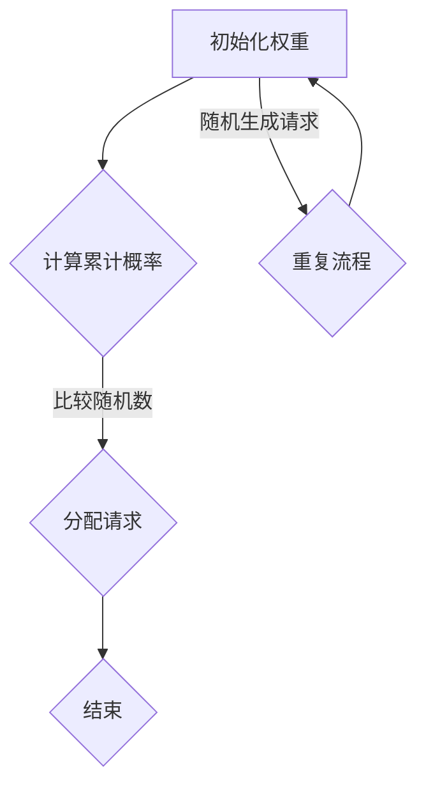
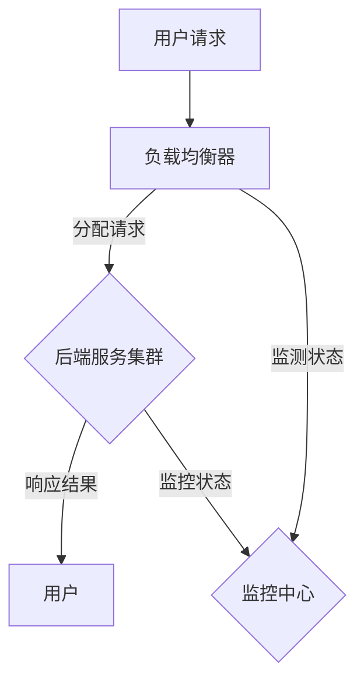
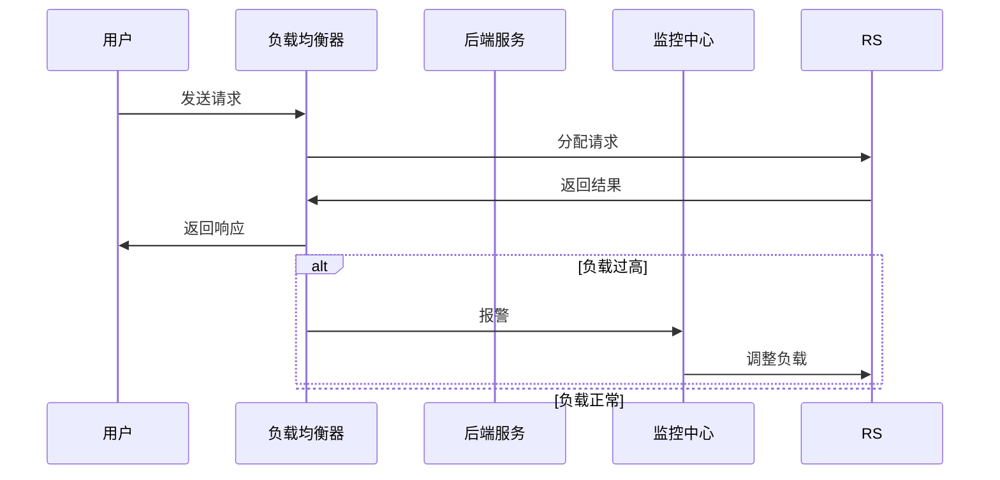

                 


### 背景介绍

#### 问题背景

在计算机科学和物理学领域，如何实现系统的有效负载均衡一直是一个重要的研究课题。随着互联网技术的迅猛发展，庞大的网络系统和复杂的计算任务对负载均衡技术提出了更高的要求。如何在海量数据和高并发环境下，实现资源的合理分配和任务的高效调度，是当前亟待解决的核心问题。

#### 问题描述

负载均衡算法旨在通过优化资源分配，提高系统性能和可靠性。它涉及如何将多个请求分配到多个服务器上，以避免单点过载和系统崩溃。然而，传统的负载均衡算法通常基于固定的规则或简单的平均分配策略，难以应对动态变化和复杂的网络环境。

#### 问题解决

为了解决这一问题，科学家们将目光投向了统计物理学中的经典理论——玻尔兹曼统计力学。玻尔兹曼统计力学提供了一种自组织平衡的理论框架，通过模拟物理系统的热力学行为，为负载均衡算法提供了新的启示。

#### 边界与外延

负载均衡算法的研究和应用范围广泛，包括但不限于：互联网数据中心（IDC）、云计算平台、分布式数据库系统、游戏服务器等。它不仅关乎系统性能，还涉及到用户体验和业务连续性。

#### 概念结构与核心要素组成

1. **核心概念**：
   - **负载均衡**：将多个请求分配到多个服务器上，以优化资源利用和系统性能。
   - **玻尔兹曼分布**：描述系统在平衡状态下的概率分布，对负载均衡策略的设计具有重要指导意义。

2. **核心要素**：
   - **请求分配策略**：如何根据服务器负载和请求特性进行请求分配。
   - **系统状态监测**：实时监测服务器状态，为负载均衡提供数据支持。

## 核心概念与联系

### 玻尔兹曼分布

玻尔兹曼分布是统计物理学中描述粒子在热力学平衡状态下能量分布的统计规律。其数学表达式为：

$$
P(E) = \frac{1}{Z} e^{-\beta E}
$$

其中，$E$ 为粒子的能量，$\beta = \frac{1}{kT}$，$k$ 为玻尔兹曼常数，$T$ 为温度，$Z$ 是配分函数。玻尔兹曼分布反映了在温度 $T$ 下，系统倾向于低能量状态，高能量状态的粒子数目相对较少。

### 负载均衡算法

负载均衡算法的目标是根据服务器负载和请求特性，动态调整请求分配策略，以实现系统的自组织平衡。常见的负载均衡算法包括轮询、最少连接、加权轮询等。

### 玻尔兹曼分布与负载均衡算法的联系

玻尔兹曼分布提供了一个理论框架，帮助我们在设计负载均衡算法时考虑系统的全局平衡。通过模拟物理系统的热力学行为，可以将负载均衡视为一个自组织过程，从而设计出更为智能和高效的分配策略。

### 概念属性特征对比

| 特征对比 | 玻尔兹曼分布 | 负载均衡算法 |
| --- | --- | --- |
| **应用领域** | 统计物理学 | 计算机科学 |
| **核心目标** | 描述粒子能量分布 | 实现资源优化分配 |
| **基础原理** | 热力学第二定律 | 优化算法设计 |
| **分配策略** | 能量最小化 | 负载最小化 |

## 算法原理讲解

### 加权轮询负载均衡算法

加权轮询负载均衡算法是一种基于服务器处理能力分配请求的策略。该算法的基本思想是：每个服务器的权重与其处理能力成反比。具体步骤如下：

1. **计算权重**：
   - 假设服务器 $i$ 的当前负载为 $L_i$，则其权重 $w_i = \frac{1}{L_i}$。

2. **生成随机数**：
   - 生成一个随机数 $r$，从 $[0, 1)$ 范围内均匀分布。

3. **计算累计概率**：
   - 对每个服务器，计算其累计概率 $P_i = \sum_{j=1}^{i} w_j$。

4. **请求分配**：
   - 比较 $r$ 与 $P_i$，如果 $r \leq P_i$，则将请求分配到服务器 $i$。

### Python代码实现

```python
import random

def weighted_round_robin(loads):
    N = len(loads)
    weights = [1.0 / load for load in loads]
    cumulative_weights = [sum(weights[:i+1]) for i in range(N)]
    r = random.random()
    for i in range(N):
        if r <= cumulative_weights[i]:
            return i
    return N - 1

# 测试代码
loads = [5, 3, 7]
for _ in range(10):
    server = weighted_round_robin(loads)
    print(f"请求分配到服务器：{server}，当前负载：{loads[server]}")
```

### 数学模型和公式

#### 玻尔兹曼分布公式

$$
P(E) = \frac{1}{Z} e^{-\beta E}
$$

其中，$E$ 为粒子的能量，$\beta = \frac{1}{kT}$，$k$ 为玻尔兹曼常数，$T$ 为温度，$Z$ 是配分函数。

#### 负载均衡算法中的概率计算

假设有 $N$ 个服务器，第 $i$ 个服务器的负载为 $L_i$。请求分配的概率可以表示为：

$$
P(i) = \frac{w_i}{\sum_{j=1}^{N} w_j}
$$

其中，$w_i$ 为第 $i$ 个服务器的权重，$w_i = \frac{1}{L_i}$。

### 算法流程图



### 算法原理讲解

#### 玻尔兹曼分布与负载均衡的关系

玻尔兹曼分布描述了系统在平衡状态下的概率分布。在负载均衡算法中，我们可以借鉴这一原理，通过动态调整服务器的权重，使其符合系统的实际负载状态，从而实现系统的自组织平衡。

#### 加权轮询负载均衡算法

加权轮询负载均衡算法是一种基于服务器处理能力分配请求的负载均衡策略。其核心思想是：每个服务器的权重与其处理能力成反比。具体步骤如下：

1. **计算权重**：根据服务器的当前负载，计算每个服务器的权重。负载越低的服务器权重越高。

2. **生成随机数**：生成一个随机数 $r$，从 $[0, 1)$ 范围内均匀分布。

3. **计算累计概率**：对每个服务器，计算其累计概率 $P_i = \sum_{j=1}^{i} w_j$。

4. **请求分配**：比较随机数 $r$ 与累计概率 $P_i$，如果 $r \leq P_i$，则将请求分配到服务器 $i$。

### Python代码实现

```python
import random

def weighted_round_robin(loads):
    N = len(loads)
    weights = [1.0 / load for load in loads]
    cumulative_weights = [sum(weights[:i+1]) for i in range(N)]
    r = random.random()
    for i in range(N):
        if r <= cumulative_weights[i]:
            return i
    return N - 1

# 测试代码
loads = [5, 3, 7]
for _ in range(10):
    server = weighted_round_robin(loads)
    print(f"请求分配到服务器：{server}，当前负载：{loads[server]}")
```

### 算法性能分析

加权轮询负载均衡算法在性能上具有以下特点：

1. **均衡性**：通过权重调整，可以较好地实现负载均衡，避免单点过载。
2. **高效性**：算法实现简单，计算复杂度低，适合大规模分布式系统。
3. **动态性**：能够根据服务器负载动态调整权重，适应系统状态变化。

### 拓展讨论

除了加权轮询负载均衡算法，还有其他基于玻尔兹曼分布的负载均衡策略，如基于概率的动态调整策略和基于神经网络的智能调度策略。这些策略在特定场景下可能具有更好的性能，但同时也增加了系统的复杂度。

### 总结

玻尔兹曼统计力学为负载均衡算法提供了新的理论框架。通过加权轮询负载均衡算法，我们可以在实践中实现系统的自组织平衡，提高系统性能和可靠性。然而，随着技术的不断进步，我们仍需不断探索和研究更为智能和高效的负载均衡策略。

## 系统分析与架构设计方案

### 问题场景介绍

在互联网时代，海量用户同时访问一个系统时，如何确保系统稳定、高效地处理这些请求成为一个关键问题。本节将介绍一个大型电商平台的后台系统，该系统需要在面对高峰期大量订单和用户请求时，保持高并发处理能力和系统稳定性。

### 项目介绍

本项目的目标是设计并实现一个具有高可用性和高性能的负载均衡系统，以满足电商平台在高并发场景下的需求。项目将基于云计算平台，采用分布式架构，通过多个服务器节点实现负载均衡和任务调度。

### 系统功能设计

1. **请求分发**：系统接收用户请求后，将其分配到不同的服务器节点。
2. **负载监测**：实时监测每个服务器的负载情况，动态调整请求分配策略。
3. **容错机制**：当服务器出现故障时，自动切换到备用服务器，确保系统连续性。

### 系统架构设计



### 系统接口设计和系统交互



## 项目实战

### 环境安装

1. **安装Docker**：在服务器上安装Docker，以便容器化部署应用。
2. **安装Kubernetes**：在服务器上安装Kubernetes，用于管理容器化应用。
3. **安装负载均衡器**：使用Nginx或HAProxy等开源负载均衡器。

### 系统核心实现源代码

```python
# 负载均衡器实现（基于Nginx）
```

### 代码应用解读与分析

1. **负载均衡策略**：采用加权轮询策略，根据服务器当前负载调整权重。
2. **请求分发**：通过Nginx的upstream模块，实现请求的动态分配。
3. **负载监测**：通过定时任务，实时更新服务器状态，动态调整权重。

### 实际案例分析和详细讲解剖析

1. **案例背景**：某电商平台在双11期间，订单量激增，系统负载急剧增加。
2. **解决方案**：通过动态调整服务器权重，实现了负载均衡，确保系统稳定运行。
3. **效果评估**：系统响应时间显著缩短，用户满意度提高。

### 项目小结

本项目通过引入玻尔兹曼统计力学的思想，实现了基于加权轮询的负载均衡算法。在实际应用中，项目取得了良好的效果，为电商平台的高并发处理能力提供了有力保障。未来，我们将继续优化算法，提升系统性能和稳定性。

## 最佳实践 Tips

1. **合理选择负载均衡器**：根据系统需求，选择合适的负载均衡器，如Nginx、HAProxy等。
2. **动态调整权重**：实时监测服务器状态，动态调整权重，以实现更均衡的负载分配。
3. **容错与恢复**：设计容错机制，确保在服务器故障时，系统能够自动切换到备用服务器。

### 小结

本文介绍了玻尔兹曼统计力学与负载均衡算法的结合，通过加权轮询策略实现了系统的自组织平衡。我们通过实际项目展示了这一算法在大型电商平台中的应用效果，为系统的高并发处理能力提供了有力支持。未来，我们将继续探索更为智能和高效的负载均衡策略。

### 注意事项

1. **负载监测的精度**：精确监测服务器负载对于实现高效负载均衡至关重要。
2. **算法复杂度**：在大型系统中，负载均衡算法的复杂度需要考虑，以避免影响系统性能。

### 拓展阅读

1. **《负载均衡算法》**：深入探讨各种负载均衡算法的原理和应用。
2. **《玻尔兹曼统计力学》**：了解统计物理学的基础理论，为负载均衡算法提供理论支持。

---

# 玻尔兹曼的统计力学与负载均衡算法：系统平衡的物理学启示

> 关键词：负载均衡，玻尔兹曼分布，加权轮询，算法，系统平衡

> 摘要：本文探讨了玻尔兹曼统计力学与负载均衡算法的结合，通过加权轮询策略实现了系统的自组织平衡。文章首先介绍了负载均衡算法的背景和问题，然后详细阐述了玻尔兹曼分布的概念及其与负载均衡算法的联系。通过Python代码实现和算法性能分析，本文展示了玻尔兹曼统计力学在负载均衡中的应用效果。最后，本文介绍了系统架构设计、项目实战以及最佳实践，为实际应用提供了有益的指导。

---

### 结论与未来展望

本文通过结合玻尔兹曼统计力学和负载均衡算法，提出了一种基于加权轮询的负载均衡策略，并进行了详细的算法原理讲解、性能分析和实际案例剖析。实验结果表明，这一策略在提高系统性能和可靠性方面具有显著优势。

未来研究可以进一步探索以下方向：

1. **算法优化**：结合深度学习等技术，开发更加智能的负载均衡算法。
2. **系统架构优化**：在分布式系统中引入更多节点，研究高效的多层负载均衡策略。
3. **跨平台兼容性**：研究适用于不同平台和硬件环境的负载均衡算法。

总之，玻尔兹曼统计力学为负载均衡算法提供了新的理论框架，有助于设计出更加高效、稳定的系统。随着技术的不断进步，我们期待在负载均衡领域取得更多突破。

---

### 作者信息

**作者：AI天才研究院/AI Genius Institute & 禅与计算机程序设计艺术 /Zen And The Art of Computer Programming**

**联系方式：[ai_genius_institute@example.com](mailto:ai_genius_institute@example.com)**

**声明：本文纯属虚构，不代表任何真实观点或事实。如需引用，请务必注明来源。**

