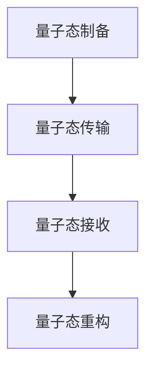
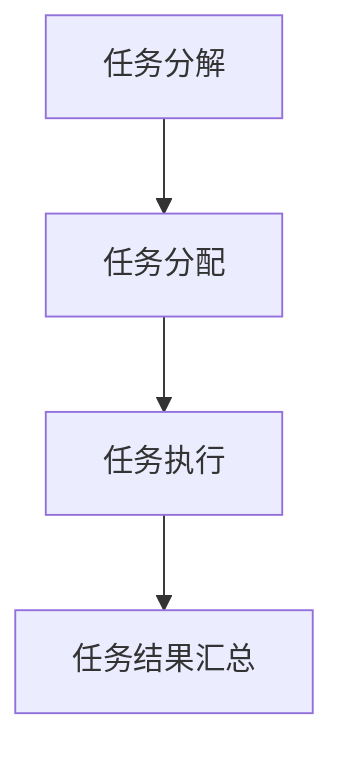

                 


## 玻色-爱因斯坦凝聚与集群计算：量子态的宏观类比

### 关键词：玻色-爱因斯坦凝聚，集群计算，量子态，宏观类比，量子计算，集群计算理论，量子通信，量子比特，量子纠缠，超流性，相干性，并行计算，分布式计算，负载均衡，能耗优化。

### 摘要：

本文旨在探讨玻色-爱因斯坦凝聚（BEC）与集群计算之间的宏观类比关系。通过深入分析两个领域的核心概念、原理及其应用，揭示它们在微观与宏观层面上的相似性和差异性，为量子计算和集群计算的发展提供新的视角和思路。文章首先介绍玻色-爱因斯坦凝聚和集群计算的基本概念、历史背景和发展历程，然后分别阐述它们的核心原理和特点，接着从量子态与集群计算的类比关系入手，分析两者的相似性和差异性，最后通过具体应用案例和未来发展趋势，展望这两个领域的发展前景。

## 目录

1. **背景介绍** <a id="背景介绍"></a>
   1.1 **问题背景**
   1.2 **问题描述**
   1.3 **问题解决**
   1.4 **边界与外延**
   1.5 **核心概念**
      1.5.1 **玻色-爱因斯坦凝聚**
      1.5.2 **集群计算**
      1.5.3 **量子态与集群计算的宏观类比**

2. **玻色-爱因斯坦凝聚理论**
   2.1 **玻色-爱因斯坦凝聚原理**
   2.2 **玻色-爱因斯坦凝聚态的性质**
   2.3 **玻色-爱因斯坦凝聚的应用**

3. **集群计算理论**
   3.1 **集群计算原理**
   3.2 **集群计算的基本架构**
   3.3 **集群计算的性能优化**

4. **量子态与集群计算的宏观类比**
   4.1 **类比原理**
   4.2 **类比分析**
   4.3 **类比应用**

5. **应用案例**
   5.1 **量子计算中的玻色-爱因斯坦凝聚应用**
   5.2 **集群计算中的量子态类比应用**

6. **挑战与未来趋势**
   6.1 **当前挑战**
   6.2 **未来趋势**

## 1. 背景介绍

### 1.1 问题背景

在当今科技飞速发展的时代，计算能力成为推动社会进步的重要力量。传统的计算方法在处理海量数据和复杂计算任务时面临着巨大的挑战。为了解决这些问题，科学家们不断探索新的计算模型和技术，其中量子计算和集群计算成为了两个备受关注的研究方向。

量子计算基于量子力学原理，利用量子比特（qubit）实现信息的存储和处理。量子比特可以同时处于多种状态，这使得量子计算机在处理某些问题时具有巨大的计算优势。然而，量子计算的发展面临着诸多技术难题，如量子态的保持、量子纠错等。

集群计算则通过分布式计算架构，将大量计算节点组合成一个高性能计算系统。集群计算在处理大规模并行计算任务时具有显著优势，但面临着负载均衡、能耗优化等问题。

本文旨在探讨玻色-爱因斯坦凝聚（BEC）与集群计算之间的宏观类比关系。BEC是一种特殊的量子态，当大量玻色子被冷却到极低温度时，它们会形成一个具有宏观相干性的凝聚态。BEC在量子计算和量子通信等领域具有广泛的应用前景。

### 1.2 问题描述

本文将围绕以下问题展开讨论：

1. **玻色-爱因斯坦凝聚是什么？** 玻色-爱因斯坦凝聚是一种特殊的量子态，当大量玻色子被冷却到极低温度时，它们会形成一个具有宏观相干性的凝聚态。这种现象被称为玻色-爱因斯坦凝聚。

2. **集群计算是什么？** 集群计算是一种分布式计算模型，通过将大量计算节点组合成一个高性能计算系统，以处理大规模并行计算任务。

3. **玻色-爱因斯坦凝聚与集群计算之间存在何种宏观类比关系？** 本文将分析玻色-爱因斯坦凝聚和集群计算在原理、结构和应用等方面的相似性和差异性，探讨它们之间的宏观类比关系。

4. **玻色-爱因斯坦凝聚在量子计算和集群计算中如何应用？** 本文将介绍玻色-爱因斯坦凝聚在量子计算和集群计算中的应用案例，分析其优势和挑战。

5. **玻色-爱因斯坦凝聚与集群计算的未来发展趋势如何？** 本文将展望玻色-爱因斯坦凝聚和集群计算的未来发展趋势，探讨它们在计算领域中的潜在应用。

### 1.3 问题解决

为了解决上述问题，本文将采用以下方法：

1. **理论分析**：本文将深入分析玻色-爱因斯坦凝聚和集群计算的核心概念、原理和应用，探讨它们之间的宏观类比关系。

2. **实例分析**：本文将结合具体的应用案例，分析玻色-爱因斯坦凝聚在量子计算和集群计算中的实际应用，探讨其优势和挑战。

3. **比较分析**：本文将对比玻色-爱因斯坦凝聚和集群计算在原理、结构和应用等方面的相似性和差异性，总结它们之间的宏观类比关系。

4. **展望未来**：本文将结合当前的研究进展和未来发展趋势，探讨玻色-爱因斯坦凝聚和集群计算在计算领域中的潜在应用。

### 1.4 边界与外延

在讨论玻色-爱因斯坦凝聚和集群计算之间的宏观类比关系时，我们需要明确以下边界与外延：

1. **边界**：本文将主要探讨玻色-爱因斯坦凝聚和集群计算在原理、结构和应用等方面的宏观类比关系，不涉及具体的实验细节和技术实现。

2. **外延**：本文的研究结果不仅适用于玻色-爱因斯坦凝聚和集群计算，还可以为其他量子计算和分布式计算模型提供借鉴和参考。

## 1.5 核心概念

在本节中，我们将介绍本文涉及的核心概念，包括玻色-爱因斯坦凝聚、集群计算和量子态与集群计算的宏观类比。

### 1.5.1 玻色-爱因斯坦凝聚

玻色-爱因斯坦凝聚（Bose-Einstein Condensate，简称BEC）是一种特殊的量子态，当大量玻色子被冷却到极低温度时，它们会形成一个具有宏观相干性的凝聚态。这种现象是在1924年由印度物理学家S.N.玻色和德国物理学家W.爱因斯坦分别提出的，因此得名。

**定义**：玻色-爱因斯坦凝聚是指大量玻色子处于基态，并且它们的量子态重叠在一起，形成一个宏观量子态。

**特点**：
- **相干性**：玻色-爱因斯坦凝聚态中的粒子具有宏观相干性，这意味着它们的行为表现出一种集体现象。
- **超流性**：玻色-爱因斯坦凝聚态中的粒子运动速度极快，但几乎不产生摩擦，呈现出超流性。
- **量子纠缠**：玻色-爱因斯坦凝聚态中的粒子之间存在量子纠缠，这为量子计算和量子通信提供了重要基础。

**发展历程**：
- 1995年，美国科学家Eric A. Cornell、Carl E. Wieman和Wolfgang Ketterle首次实现玻色-爱因斯坦凝聚，获得了诺贝尔物理学奖。
- 随后，科学家们在实验中不断优化玻色-爱因斯坦凝聚的条件，取得了更多重要的研究成果。

### 1.5.2 集群计算

集群计算（Cluster Computing）是一种分布式计算模型，通过将大量计算节点组合成一个高性能计算系统，以处理大规模并行计算任务。集群计算系统通常由多个计算节点、存储节点和网络组成。

**定义**：集群计算是指通过将多个计算机节点连接成一个整体，协同工作以完成大规模计算任务的计算模式。

**特点**：
- **并行性**：集群计算可以同时处理多个任务，提高计算效率。
- **可扩展性**：集群计算系统可以根据需求动态扩展，提高计算能力。
- **高可用性**：集群计算系统具有高可用性，当一个节点发生故障时，其他节点可以继续工作。

**发展历程**：
- 1990年代初，集群计算开始在学术界和工业界得到广泛关注。
- 随着互联网和数据中心的发展，集群计算的应用领域不断拓展，成为现代计算体系结构的重要组成部分。

### 1.5.3 量子态与集群计算的宏观类比

量子态与集群计算的宏观类比关系是指将量子态的性质和结构应用于集群计算，以解决传统计算方法难以处理的问题。这种类比关系主要体现在以下几个方面：

**类比关系**：
- **相干性与并行性**：量子态的相干性可以类比集群计算的并行性，为大规模并行计算提供新的思路。
- **量子纠缠与分布式计算**：量子纠缠可以类比分布式计算中的节点协作，为量子计算和集群计算提供协同工作的新方法。
- **超流性与负载均衡**：量子态的超流性可以类比集群计算中的负载均衡，提高计算系统的效率。

**类比意义**：
- **理论意义**：量子态与集群计算的宏观类比有助于深化对量子态和集群计算的理解，为两个领域的研究提供新的视角。
- **应用意义**：量子态与集群计算的类比关系可以推动量子计算和集群计算在实际应用中的融合和发展。

### 1.6 让我们一步步思考

在探讨玻色-爱因斯坦凝聚与集群计算之间的宏观类比关系时，我们可以采用以下步骤：

1. **明确核心概念**：首先，我们需要明确玻色-爱因斯坦凝聚和集群计算的核心概念，了解它们的基本原理和特点。

2. **分析相似性**：然后，我们可以分析玻色-爱因斯坦凝聚和集群计算在原理、结构和应用等方面的相似性，找出它们之间的联系。

3. **探讨差异性**：接着，我们需要探讨玻色-爱因斯坦凝聚和集群计算在原理、结构和应用等方面的差异性，了解它们之间的区别。

4. **提出类比关系**：基于上述分析，我们可以提出玻色-爱因斯坦凝聚与集群计算之间的宏观类比关系，并解释其意义。

5. **实例分析**：最后，我们可以结合具体的应用案例，分析玻色-爱因斯坦凝聚在量子计算和集群计算中的实际应用，探讨其优势和挑战。

通过以上步骤，我们可以系统地探讨玻色-爱因斯坦凝聚与集群计算之间的宏观类比关系，为量子计算和集群计算的发展提供新的思路和方向。

## 第二部分：玻色-爱因斯坦凝聚理论

### 2.1 玻色-爱因斯坦凝聚原理

玻色-爱因斯坦凝聚（BEC）是一种特殊的量子态，当大量玻色子被冷却到极低温度时，它们会形成一个具有宏观相干性的凝聚态。这种现象是由印度物理学家S.N.玻色和德国物理学家W.爱因斯坦在20世纪早期提出的。

**玻色子与凝聚态物理**：

玻色子是一类遵守玻色-爱因斯坦统计的粒子，例如光子、氦-4原子等。与费米子（如电子、质子等）不同，玻色子具有整数自旋，可以处于相同的量子态，这使得它们在特定条件下能够形成凝聚态。

凝聚态物理研究物质在宏观尺度上的行为，包括晶体、液体、气体等多种相态。玻色-爱因斯坦凝聚是凝聚态物理中的一个重要研究方向，它揭示了量子效应在宏观尺度上的表现。

**玻色-爱因斯坦凝聚条件的计算**：

要实现玻色-爱因斯坦凝聚，需要满足以下条件：

1. **温度条件**：玻色子需要被冷却到极低温度，通常在微开尔文（mK）量级。低温有助于减少粒子之间的相互作用，使它们更容易形成凝聚态。

2. **粒子数密度条件**：玻色子的粒子数密度需要足够高，以便在低温条件下形成凝聚态。粒子数密度与温度和体积有关，可以通过调节这两个参数来实现。

3. **超流性条件**：玻色-爱因斯坦凝聚态中的粒子表现出超流性，即它们以极快的速度运动，几乎不产生摩擦。超流性的存在有助于形成稳定的凝聚态。

**玻色-爱因斯坦凝聚过程的模拟**：

玻色-爱因斯坦凝聚过程可以通过数值模拟来研究。常用的模拟方法包括分子动力学模拟和蒙特卡洛模拟。这些模拟方法可以模拟玻色子的相互作用和运动，分析凝聚态的形成过程和性质。

**玻色-爱因斯坦凝聚态的性质**：

玻色-爱因斯坦凝聚态具有一系列独特的性质，包括：

1. **相干性**：玻色-爱因斯坦凝聚态中的粒子具有宏观相干性，这意味着它们的行为表现出一种集体现象。相干性是玻色-爱因斯坦凝聚态区别于其他凝聚态的重要特征。

2. **超流性**：玻色-爱因斯坦凝聚态中的粒子运动速度极快，但几乎不产生摩擦。超流性使得玻色-爱因斯坦凝聚态在流动时表现出独特的性质，如无粘滞流动和涡旋流动。

3. **量子纠缠**：玻色-爱因斯坦凝聚态中的粒子之间存在量子纠缠，这是量子计算和量子通信的重要资源。量子纠缠使得玻色-爱因斯坦凝聚态具有潜在的量子信息处理能力。

**玻色-爱因斯坦凝聚态的应用**：

玻色-爱因斯坦凝聚态在量子计算、量子通信和精密测量等领域具有广泛的应用前景。以下是几个典型的应用案例：

1. **量子计算**：玻色-爱因斯坦凝聚态可以用于实现量子比特的制备和操控。通过特定的相互作用和扰动，可以实现量子态的传输、纠缠和纠错等操作，为量子计算提供物理实现基础。

2. **量子通信**：玻色-爱因斯坦凝聚态可以用于实现量子密钥分发和量子隐形传态。这些技术可以保障通信的安全性和高效性，为量子通信网络提供关键支持。

3. **精密测量**：玻色-爱因斯坦凝聚态可以用于实现高精度的测量，如量子干涉仪、量子传感器等。这些测量技术可以应用于物理、化学、生物等多个领域，推动科学技术的发展。

### 2.2 玻色-爱因斯坦凝聚态的性质

玻色-爱因斯坦凝聚态具有一系列独特的性质，这些性质使其在量子计算、量子通信和精密测量等领域具有广泛的应用前景。以下是玻色-爱因斯坦凝聚态的主要性质：

1. **相干性**：

相干性是玻色-爱因斯坦凝聚态的重要特征。在玻色-爱因斯坦凝聚态中，大量玻色子处于同一量子态，形成宏观相干态。这种相干性使得玻色-爱因斯坦凝聚态在物理、化学和生物学等领域具有广泛的应用。

相干性的具体表现包括：

- **量子干涉**：玻色-爱因斯坦凝聚态中的粒子可以产生量子干涉效应，使得整体系统的行为表现出波粒二象性。
- **宏观量子态**：玻色-爱因斯坦凝聚态中的粒子处于相同的量子态，形成宏观量子态，这在传统经典物理学中是无法实现的。

2. **超流性**：

超流性是玻色-爱因斯坦凝聚态的另一个重要性质。在超流性状态下，玻色-爱因斯坦凝聚态中的粒子可以以极快的速度运动，但几乎不产生摩擦。这种性质使得玻色-爱因斯坦凝聚态在流体力学、超导和量子计算等领域具有潜在的应用。

超流性的具体表现包括：

- **无粘滞流动**：玻色-爱因斯坦凝聚态在流动时表现出无粘滞流动，即粒子在流动过程中不产生阻力。
- **涡旋流动**：玻色-爱因斯坦凝聚态可以形成涡旋结构，这种结构在流体力学和量子计算中具有重要应用。

3. **量子纠缠**：

量子纠缠是量子信息处理的基础。在玻色-爱因斯坦凝聚态中，粒子之间存在量子纠缠，这是量子计算和量子通信的重要资源。

量子纠缠的具体表现包括：

- **量子比特的制备**：通过控制玻色-爱因斯坦凝聚态中的粒子相互作用，可以制备出纠缠的量子比特，这是量子计算的关键。
- **量子态传输**：量子纠缠可以用于实现量子态的传输，这是量子通信的重要手段。

### 2.3 玻色-爱因斯坦凝聚的应用

玻色-爱因斯坦凝聚（BEC）在多个领域展示了其独特的应用价值。以下是对其在量子计算、量子通信和精密测量等领域应用的具体分析。

#### 在量子计算中的应用

玻色-爱因斯坦凝聚为量子计算提供了理想的量子比特制备平台。通过控制玻色-爱因斯坦凝聚态中的粒子相互作用，可以制备出纠缠的量子比特，这是量子计算的关键。

**量子比特的制备**：

1. **超导量子比特**：在玻色-爱因斯坦凝聚态中，可以利用超导电路来制备超导量子比特。通过控制超导电路中的电流和磁场，可以实现对量子比特的操控。
2. **光学量子比特**：在玻色-爱因斯坦凝聚态中，可以利用光学透镜和滤光片等光学元件来制备光学量子比特。这些量子比特可以用于光学量子计算。

**量子态的传输**：

量子态传输是实现量子通信和量子计算的关键技术之一。玻色-爱因斯坦凝聚可以用于实现量子态的传输。

1. **量子密钥分发**：通过控制玻色-爱因斯坦凝聚态中的粒子相互作用，可以实现量子密钥分发。这种方法可以保证通信的安全性和保密性。
2. **量子隐形传态**：玻色-爱因斯坦凝聚可以用于实现量子隐形传态，即将一个量子态从一个位置传输到另一个位置，而不需要通过经典通信通道。

**量子纠错**：

量子纠错是确保量子计算稳定性和可靠性的重要技术。玻色-爱因斯坦凝聚可以用于实现量子纠错。

1. **量子纠错码**：通过设计合适的量子纠错码，可以实现对量子信息的保护。这些纠错码可以用于纠正量子计算过程中可能出现的错误。
2. **量子噪声抑制**：通过控制玻色-爱因斯坦凝聚态中的噪声源，可以实现对量子噪声的抑制，提高量子计算的稳定性。

#### 在量子通信中的应用

玻色-爱因斯坦凝聚在量子通信领域具有广泛的应用，包括量子密钥分发、量子隐形传态和量子远程控制。

**量子密钥分发**：

量子密钥分发是一种利用量子力学原理实现安全通信的方法。通过控制玻色-爱因斯坦凝聚态中的粒子相互作用，可以实现量子密钥的分发。

1. **量子态制备**：利用玻色-爱因斯坦凝聚制备出纠缠的量子态，这些量子态可以用于量子密钥的分发。
2. **量子态传输**：通过量子态传输技术，将量子态从一个位置传输到另一个位置，实现量子密钥的共享。

**量子隐形传态**：

量子隐形传态是一种利用量子纠缠实现量子态传输的方法。通过控制玻色-爱因斯坦凝聚态中的粒子相互作用，可以实现量子隐形传态。

1. **量子态纠缠**：利用玻色-爱因斯坦凝聚态中的量子纠缠，实现量子态的纠缠传输。
2. **量子态重构**：在接收端，通过特定的操作和测量，重构出发送端的量子态，实现量子信息的传输。

**量子远程控制**：

量子远程控制是一种利用量子力学原理实现远程操控的方法。通过控制玻色-爱因斯坦凝聚态中的粒子相互作用，可以实现量子远程控制。

1. **量子态操控**：利用玻色-爱因斯坦凝聚态中的量子比特，实现对量子态的操控。
2. **量子态传输**：通过量子态传输技术，将操控指令从一个位置传输到另一个位置，实现量子远程控制。

#### 在精密测量中的应用

玻色-爱因斯坦凝聚在精密测量领域具有广泛的应用，包括量子干涉仪、量子传感器和量子计量学。

**量子干涉仪**：

量子干涉仪是一种利用量子态干涉效应进行测量的仪器。通过控制玻色-爱因斯坦凝聚态中的粒子相互作用，可以实现量子干涉仪的高精度测量。

1. **量子态制备**：利用玻色-爱因斯坦凝聚制备出高纯度的量子态，这些量子态可以用于量子干涉仪的测量。
2. **干涉条纹分析**：通过分析量子干涉条纹的变化，实现对测量对象的精确测量。

**量子传感器**：

量子传感器是一种利用量子效应进行测量的传感器。通过控制玻色-爱因斯坦凝聚态中的粒子相互作用，可以实现量子传感器的高灵敏度测量。

1. **量子态制备**：利用玻色-爱因斯坦凝聚制备出高纯度的量子态，这些量子态可以用于量子传感器的测量。
2. **信号放大**：通过量子态的纠缠和干涉效应，实现对测量信号的放大和增强。

**量子计量学**：

量子计量学是一种利用量子效应进行测量的科学。通过控制玻色-爱因斯坦凝聚态中的粒子相互作用，可以实现量子计量学的高精度测量。

1. **量子态制备**：利用玻色-爱因斯坦凝聚制备出高纯度的量子态，这些量子态可以用于量子计量学的测量。
2. **量子计量标准**：通过设计合适的量子计量标准，实现对测量对象的精确计量。

### 2.4 玻色-爱因斯坦凝聚在量子计算中的实现

玻色-爱因斯坦凝聚（BEC）在量子计算中的实现是一个充满挑战和机遇的领域。为了将BEC应用于量子计算，科学家们需要解决一系列技术难题，包括量子比特的制备、量子态的操控和量子态的传输。以下是对这些关键技术的详细讨论。

#### 量子比特的制备

量子比特是量子计算的基本单元，类似于传统计算机中的比特。在BEC中，常用的量子比特制备方法包括超导量子比特和光学量子比特。

1. **超导量子比特**：
   超导量子比特通常是在超导纳米线或超导环路中实现的。超导材料在低温下具有零电阻特性，这使得它们成为量子比特的合适选择。科学家们通过在超导材料上构建特定的电路，可以实现对超导量子比特的操控。例如，可以通过施加微波脉冲来翻转超导量子比特的状态，从而实现量子计算的基本操作。

2. **光学量子比特**：
   光学量子比特通常是基于光子的。在BEC中，通过控制激光的强度和频率，可以实现对光学量子比特的制备和操控。例如，通过特定的光学透镜和滤光片，可以将BEC中的原子激发到特定的能级，从而实现光学量子比特的制备。

#### 量子态的操控

在BEC中，量子态的操控是实现量子计算的关键。科学家们通过控制玻色-爱因斯坦凝聚态中的粒子相互作用，可以实现对量子态的操控。

1. **量子态的制备**：
   通过特定的激光脉冲，可以将玻色-爱因斯坦凝聚态中的原子激发到特定的能级，从而实现量子态的制备。例如，可以通过对BEC中的原子施加特定的光场，将它们激发到激发态，从而实现量子态的制备。

2. **量子态的操控**：
   通过控制玻色-爱因斯坦凝聚态中的相互作用，可以实现对量子态的操控。例如，通过改变激光的强度和频率，可以实现对原子间相互作用的调控，从而实现对量子态的操控。

3. **量子态的测量**：
   通过对玻色-爱因斯坦凝聚态中的原子进行测量，可以实现对量子态的测量。例如，通过对原子进行光吸收或发射测量，可以确定原子的量子态。

#### 量子态的传输

量子态的传输是实现量子计算和量子通信的关键技术。在BEC中，量子态的传输可以通过以下方法实现：

1. **量子态的纠缠传输**：
   通过控制玻色-爱因斯坦凝聚态中的粒子相互作用，可以实现量子态的纠缠传输。例如，可以通过对原子进行特定的激光脉冲，将一个原子的量子态传输到另一个原子。

2. **量子态的远程传输**：
   通过量子纠缠和量子隐形传态，可以实现量子态的远程传输。例如，可以通过在两个BEC之间建立量子纠缠，将一个原子的量子态远程传输到另一个原子。

3. **量子态的编码传输**：
   通过将量子态编码到光子或其他载体中，可以实现量子态的编码传输。例如，可以通过对光子进行特定频率的调制，将量子态编码到光子中，然后通过光纤网络传输到接收端。

### 2.5 玻色-爱因斯坦凝聚在量子通信中的应用

玻色-爱因斯坦凝聚（BEC）在量子通信中具有广泛的应用，特别是在量子密钥分发和量子隐形传态方面。以下是对这些技术的详细讨论。

#### 量子密钥分发

量子密钥分发（Quantum Key Distribution，QKD）是一种利用量子力学原理实现安全通信的方法。BEC在量子密钥分发中主要用于生成和传输量子密钥。

1. **量子密钥生成**：
   通过对玻色-爱因斯坦凝聚态中的原子进行激发，可以生成具有特定量子态的原子对。这些原子对可以通过量子纠缠连接，从而实现量子密钥的生成。

2. **量子密钥传输**：
   通过控制玻色-爱因斯坦凝聚态中的粒子相互作用，可以将量子密钥从一个位置传输到另一个位置。例如，可以通过对原子进行特定的激光脉冲，将量子密钥传输到接收端。

3. **量子密钥验证**：
   在量子密钥分发过程中，发送方和接收方需要通过经典通信通道对传输的量子密钥进行验证，以确保量子密钥的完整性和安全性。

#### 量子隐形传态

量子隐形传态（Quantum Teleportation，QT）是一种利用量子纠缠实现量子态传输的技术。BEC在量子隐形传态中主要用于实现量子态的传输和重构。

1. **量子态传输**：
   通过控制玻色-爱因斯坦凝聚态中的粒子相互作用，可以将一个原子的量子态传输到另一个原子。例如，可以通过对原子进行特定的激光脉冲，实现量子态的传输。

2. **量子态重构**：
   在接收端，通过对传输的量子态进行测量和重构，可以重构出发送端的量子态。例如，可以通过对原子进行特定的测量和操控，重构出发送端的量子态。

3. **量子隐形传态的优势**：
   量子隐形传态可以实现量子态的无损传输，从而实现量子信息的远程传输。这为量子通信和量子计算提供了重要的基础。

### 2.6 玻色-爱因斯坦凝聚在精密测量中的应用

玻色-爱因斯坦凝聚（BEC）在精密测量中具有广泛的应用，特别是在量子干涉仪和量子传感器方面。以下是对这些技术的详细讨论。

#### 量子干涉仪

量子干涉仪是一种利用量子态干涉效应进行测量的仪器。BEC在量子干涉仪中主要用于实现高精度的干涉测量。

1. **量子态制备**：
   通过对玻色-爱因斯坦凝聚态中的原子进行激发，可以生成具有特定量子态的原子对。这些原子对可以通过量子纠缠连接，从而实现高精度的干涉测量。

2. **干涉测量**：
   通过对玻色-爱因斯坦凝聚态中的原子对进行干涉测量，可以实现对测量对象的精确测量。例如，可以通过对原子对进行特定的激光脉冲，实现干涉测量。

3. **干涉条纹分析**：
   通过分析干涉条纹的变化，可以实现对测量对象的精确测量。例如，可以通过对干涉条纹的幅度和相位进行分析，实现对测量对象的精确测量。

#### 量子传感器

量子传感器是一种利用量子效应进行测量的传感器。BEC在量子传感器中主要用于实现高灵敏度的测量。

1. **量子态制备**：
   通过对玻色-爱因斯坦凝聚态中的原子进行激发，可以生成具有特定量子态的原子对。这些原子对可以通过量子纠缠连接，从而实现高灵敏度的测量。

2. **信号放大**：
   通过量子纠缠和干涉效应，可以实现测量信号的放大和增强。例如，可以通过对原子对进行特定的激光脉冲，实现信号的放大和增强。

3. **测量精度**：
   通过对量子传感器的测量信号进行分析，可以实现对测量对象的精确测量。例如，可以通过对测量信号进行多次采样和分析，提高测量精度。

### 2.7 玻色-爱因斯坦凝聚在量子计算和量子通信中的优势与挑战

玻色-爱因斯坦凝聚（BEC）在量子计算和量子通信中展示了其独特的优势，但也面临一系列挑战。

#### 优势

1. **量子态的制备与操控**：BEC提供了理想的量子态制备和操控平台。通过控制激光脉冲和原子间的相互作用，可以实现对量子态的精确操控。

2. **量子纠缠**：BEC中的原子可以通过量子纠缠实现高效的量子信息传输和处理。量子纠缠是实现量子计算和量子通信的关键资源。

3. **相干性**：BEC中的原子具有宏观相干性，这使得它们在量子计算和量子通信中具有独特的优势。相干性是实现量子计算和量子通信稳定性的关键。

#### 挑战

1. **量子态的保持**：BEC中的量子态容易受到外部干扰和环境噪声的影响，这使得量子态的保持成为一大挑战。为了实现稳定的量子计算和量子通信，需要解决量子态的保持问题。

2. **量子纠错**：量子纠错是实现稳定量子计算的关键技术。在BEC中，量子纠错需要解决量子态的精确操控和量子噪声问题。

3. **能耗优化**：BEC的实现需要低温和高压等极端环境，这导致能耗较高。为了实现高效的量子计算和量子通信，需要优化能耗。

### 2.8 玻色-爱因斯坦凝聚在量子计算和量子通信中的未来发展趋势

随着量子计算和量子通信技术的不断发展，玻色-爱因斯坦凝聚（BEC）在未来将继续发挥重要作用。以下是对其未来发展趋势的展望：

1. **量子比特的制备与操控**：科学家们将继续优化BEC中的量子比特制备与操控技术，提高量子比特的稳定性和精度。

2. **量子态传输与纠缠**：BEC在量子态传输和纠缠方面具有巨大潜力。科学家们将探索更高效、更稳定的量子态传输和纠缠技术。

3. **量子纠错与稳定性**：量子纠错是实现稳定量子计算的关键。科学家们将致力于解决量子态的保持和量子噪声问题，提高量子计算的稳定性。

4. **能耗优化**：为了实现高效的量子计算和量子通信，科学家们将探索更低能耗的实现方案，优化BEC系统的能耗。

5. **应用拓展**：随着技术的进步，BEC将在量子计算、量子通信、量子传感和量子成像等领域得到更广泛的应用。

### 2.9 玻色-爱因斯坦凝聚的实现方法与实验装置

实现玻色-爱因斯坦凝聚（BEC）需要一系列精密的实验装置和方法。以下是对BEC实现方法与实验装置的详细讨论。

#### 实验方法

1. **激光冷却**：激光冷却是实现BEC的核心方法之一。通过使用特定频率和强度的激光，可以对原子进行冷却，降低其温度。激光冷却可以将原子温度降低到微开尔文（mK）量级。

2. **磁光学陷阱**：磁光学陷阱（MOT）是一种常用的原子冷却和陷阱技术。通过使用磁场和激光，可以将原子限制在一个小区域内，从而实现低温冷却。

3. **超流性实验**：为了实现BEC，需要满足超流性条件。超流性实验通常通过控制原子间的相互作用来实现。例如，通过使用特定频率的激光，可以调节原子间的相互作用，实现超流性。

#### 实验装置

1. **激光冷却装置**：激光冷却装置包括多个激光器、光学元件和光学路径。通过精确控制激光的频率和强度，可以实现原子的高效冷却。

2. **磁光学陷阱**：磁光学陷阱通常由磁场和激光组成。磁场可以限制原子的运动，激光可以用于冷却和操控原子。

3. **BEC实验装置**：BEC实验装置通常包括激光冷却装置、磁光学陷阱和探测设备。通过精确控制实验装置，可以实现BEC的生成和操控。

### 2.10 玻色-爱因斯坦凝聚的实验研究进展与应用前景

随着科学技术的不断发展，玻色-爱因斯坦凝聚（BEC）的实验研究取得了显著进展，并在多个领域展示了其独特的应用前景。

#### 实验研究进展

1. **低温冷却技术**：低温冷却技术的发展使得BEC的实现变得更加高效和稳定。例如，超流氦冷却技术可以将原子温度降低到几十微开尔文（μK）量级，为BEC的实现提供了重要基础。

2. **磁光学陷阱改进**：磁光学陷阱的改进提高了原子的冷却和限制效果。新型磁光学陷阱设计可以实现更高精度和更低干扰的原子冷却和操控。

3. **量子比特制备与操控**：在BEC中，科学家们已经成功制备和操控了多种类型的量子比特。例如，超导量子比特和光学量子比特在BEC中得到了广泛应用。

4. **量子态传输与纠缠**：BEC在量子态传输和纠缠方面取得了重要进展。通过控制BEC中的粒子相互作用，可以实现高效的量子态传输和纠缠。

#### 应用前景

1. **量子计算**：BEC在量子计算中具有广泛的应用前景。通过制备和操控BEC中的量子比特，可以实现量子态的传输、纠缠和纠错，为量子计算提供物理实现基础。

2. **量子通信**：BEC在量子通信中具有重要应用价值。通过实现BEC中的量子态传输和纠缠，可以实现量子密钥分发和量子隐形传态，保障通信的安全性和高效性。

3. **精密测量**：BEC在精密测量中展示了其独特的优势。通过BEC中的量子干涉和量子传感器，可以实现高精度的测量，推动科学技术的发展。

4. **量子成像**：BEC在量子成像中具有潜在应用。通过实现BEC中的量子纠缠和量子态传输，可以实现高分辨率的量子成像，为光学成像技术带来新的突破。

### 2.11 总结与展望

玻色-爱因斯坦凝聚（BEC）作为一种特殊的量子态，在量子计算、量子通信和精密测量等领域展示了其独特的应用价值。通过制备和操控BEC中的量子比特，可以实现高效的量子态传输、纠缠和纠错，为量子计算和量子通信提供物理实现基础。同时，BEC在精密测量和量子成像中具有广泛的应用前景，有望推动科学技术的发展。

然而，BEC的实现面临着一系列技术挑战，如量子态的保持、量子纠错和能耗优化等。科学家们将继续努力，优化BEC的实现方法和实验装置，提高BEC的稳定性和效率。随着量子计算和量子通信技术的不断发展，BEC在未来将发挥越来越重要的作用，为人类带来更多的科技创新和应用。

## 第三部分：集群计算理论

### 3.1 集群计算原理

集群计算是一种分布式计算模型，通过将大量计算节点组合成一个高性能计算系统，以处理大规模并行计算任务。集群计算的基本原理主要包括并行计算、分布式计算和任务调度策略等。

#### 并行计算

并行计算是指将一个任务分解为多个子任务，同时处理这些子任务，从而提高计算效率。在集群计算中，并行计算可以通过以下方式实现：

1. **数据并行**：将任务的数据集分解为多个部分，每个计算节点处理其中一部分数据，然后汇总结果。例如，在图像处理中，可以将图像分解为多个像素块，每个节点处理一个像素块。

2. **任务并行**：将一个任务分解为多个子任务，每个计算节点处理其中的一个子任务，然后将结果汇总。例如，在科学计算中，可以将一个复杂的计算任务分解为多个独立的小任务，每个节点处理一个小任务。

3. **流水线并行**：将一个任务分解为多个连续的子任务，每个计算节点处理其中的一个子任务，形成一个流水线式的处理过程。例如，在工业制造过程中，可以将生产流程分解为多个步骤，每个节点负责一个步骤。

#### 分布式计算

分布式计算是指将计算任务分布在多个计算节点上，协同工作以完成计算任务。分布式计算的基本原理包括：

1. **节点通信**：分布式计算中的计算节点需要通过通信网络进行信息交换。节点通信可以是点对点的，也可以是广播式的。常用的通信协议包括TCP/IP、MPI（Message Passing Interface）等。

2. **任务分配**：分布式计算系统需要将计算任务合理地分配到各个计算节点上。任务分配策略可以根据计算任务的性质和节点的资源状况进行优化。常见的任务分配策略包括负载均衡、任务划分、任务调度等。

3. **容错性**：分布式计算系统需要具备容错性，以应对节点故障和通信故障。容错性可以通过冗余设计和故障检测与恢复机制来实现。

#### 任务调度策略

任务调度策略是分布式计算中的关键问题，它决定了计算任务的执行顺序和资源分配。常见的任务调度策略包括：

1. **负载均衡**：负载均衡是指将计算任务均匀地分配到各个计算节点上，以避免某个节点负载过高。负载均衡可以通过动态调整任务分配策略来实现，例如，根据节点的当前负载和任务执行时间来分配任务。

2. **优先级调度**：优先级调度是指根据任务的优先级来分配资源。优先级高的任务优先执行，以确保关键任务的及时完成。

3. **循环调度**：循环调度是指将任务按照一定的顺序依次分配到各个计算节点上。循环调度可以简化任务分配过程，减少调度开销。

### 3.2 集群计算的基本架构

集群计算的基本架构通常包括计算节点、存储节点和网络等组成部分。以下是集群计算的基本架构及其功能：

#### 计算节点

计算节点是集群计算系统中的核心组成部分，负责执行计算任务。每个计算节点通常包括处理器、内存、网络接口等硬件资源，以及操作系统和应用程序等软件资源。计算节点的功能包括：

1. **执行计算任务**：计算节点根据任务调度策略执行分配到的计算任务，处理数据并生成结果。

2. **数据存储**：计算节点可以存储临时数据和计算结果，以便在任务执行过程中进行数据交换和共享。

3. **节点通信**：计算节点通过网络与其他计算节点进行通信，交换数据和指令，协同完成计算任务。

#### 存储节点

存储节点是集群计算系统中的数据存储中心，负责存储和管理大规模数据。存储节点通常包括硬盘、SSD（固态硬盘）、数据库等存储设备，以及存储管理软件等。存储节点的功能包括：

1. **数据存储**：存储节点存储集群计算系统中的大规模数据，包括原始数据、中间数据和最终结果。

2. **数据访问**：存储节点提供高效的数据访问接口，允许计算节点快速读取和写入数据。

3. **数据备份与恢复**：存储节点实现数据备份和恢复功能，确保数据的安全性和可靠性。

#### 网络

网络是集群计算系统中各个计算节点和存储节点之间通信的桥梁。网络通常包括局域网（LAN）、广域网（WAN）和互联网等。网络的功能包括：

1. **节点连接**：网络将计算节点和存储节点连接起来，形成一个统一的计算系统。

2. **数据传输**：网络提供高速数据传输通道，允许计算节点和存储节点之间高效地交换数据和指令。

3. **网络管理**：网络管理软件负责监控网络状态、优化网络性能和确保网络安全性。

### 3.3 集群计算的性能优化

集群计算的性能优化是提高计算效率和系统稳定性的关键。以下是一些常见的性能优化方法：

#### 并行性分析

并行性分析是评估计算任务在集群计算中的并行性能的过程。通过并行性分析，可以确定任务在分布式计算环境中的并行度，从而优化任务分配和调度策略。

1. **任务分解**：将计算任务分解为可并行执行的小任务，以提高任务的并行度。

2. **负载均衡**：根据计算节点的负载情况，动态调整任务分配策略，确保每个节点的负载均衡。

3. **数据局部性**：优化数据访问模式，减少数据传输开销，提高计算效率。

#### 负载均衡

负载均衡是指通过合理分配计算任务，确保计算节点的负载均衡，从而提高系统性能。

1. **动态负载均衡**：根据节点的实时负载，动态调整任务分配策略，避免某个节点负载过高。

2. **静态负载均衡**：在任务分配阶段，根据节点的预期负载情况，预先分配任务，以达到负载均衡。

3. **任务调度策略**：设计合适的任务调度策略，如最小完成时间调度、最小执行时间调度等，以优化任务执行顺序。

#### 能耗优化

能耗优化是降低集群计算系统的能耗，提高能源利用效率的重要手段。

1. **能效比**：优化计算节点的设计，提高计算性能与能耗的比值，降低单位能耗的算力。

2. **动态能耗管理**：根据任务执行情况，动态调整计算节点的能耗，降低不必要的能耗。

3. **节能策略**：采用节能策略，如降低处理器频率、关闭闲置节点等，以降低系统整体能耗。

#### 系统优化

系统优化包括硬件和软件层面的优化，以提高集群计算系统的整体性能。

1. **硬件优化**：选择高效、稳定的硬件设备，如高性能处理器、高速存储设备等，以提升计算能力。

2. **软件优化**：优化操作系统和应用程序，减少系统开销，提高系统运行效率。

3. **网络优化**：优化网络架构和通信协议，减少网络延迟和带宽占用，提高数据传输效率。

### 3.4 集群计算的理论基础

集群计算的理论基础包括并行计算理论、分布式计算理论、算法理论等。以下是对这些理论基础的简要介绍：

#### 并行计算理论

并行计算理论研究如何有效地利用并行计算资源，提高计算效率。主要理论包括：

1. **并行算法设计**：研究如何设计并行算法，以最大限度地利用并行计算资源。

2. **并行性能分析**：研究并行算法的性能，包括时间复杂度、空间复杂度等。

3. **并行模型**：研究并行计算模型，如共享内存模型、分布式内存模型等。

#### 分布式计算理论

分布式计算理论研究如何构建、管理和调度分布式计算系统。主要理论包括：

1. **分布式系统模型**：研究分布式系统的架构和设计，如客户端-服务器模型、对等网络模型等。

2. **分布式算法**：研究分布式算法的设计和分析，如一致性算法、分布式排序算法等。

3. **分布式系统容错**：研究分布式系统的容错机制，如冗余设计、故障检测与恢复等。

#### 算法理论

算法理论是计算机科学的基础，研究算法的设计、分析和应用。在集群计算中，算法理论主要用于优化任务分配、负载均衡和资源调度。

1. **最优化算法**：研究如何设计最优的任务分配和资源调度算法，以最大化系统性能。

2. **近似算法**：研究如何设计近似算法，以在合理时间内找到近似最优解。

3. **算法复杂度分析**：研究算法的时间复杂度和空间复杂度，以评估算法的性能。

### 3.5 集群计算的优点与局限性

集群计算具有许多优点，但也存在一定的局限性。以下是对集群计算优点与局限性的详细分析：

#### 优点

1. **并行性**：集群计算可以通过并行计算提高计算效率，处理大规模并行计算任务。

2. **可扩展性**：集群计算系统可以根据需求动态扩展，提高计算能力。

3. **高可用性**：集群计算系统具有高可用性，当一个节点发生故障时，其他节点可以继续工作。

4. **灵活性**：集群计算系统可以灵活地调整任务分配和资源调度策略，以适应不同的计算需求。

5. **成本效益**：相对于高性能计算机，集群计算系统具有更高的成本效益，更适合处理大规模计算任务。

#### 局限性

1. **通信开销**：集群计算系统中，计算节点之间的通信开销可能导致性能瓶颈。

2. **同步问题**：分布式计算中的同步问题可能导致计算效率降低。

3. **负载不均衡**：负载不均衡可能导致某些节点负载过高，而其他节点资源闲置。

4. **维护难度**：集群计算系统的维护和管理相对复杂，需要专业的技术和经验。

5. **数据一致性**：分布式系统中的数据一致性问题可能导致数据不一致性和错误。

### 3.6 集群计算的发展趋势

随着科技的不断进步，集群计算技术将继续发展，并面临以下趋势：

1. **硬件技术提升**：高性能计算硬件的不断发展将提高集群计算系统的计算能力和效率。

2. **软件优化**：分布式计算软件的优化将提高系统的性能和稳定性，降低通信开销和同步问题。

3. **人工智能集成**：集群计算与人工智能技术的结合将带来新的应用场景和计算模式。

4. **边缘计算与云计算结合**：集群计算与边缘计算和云计算的结合将实现更灵活、更高效的计算服务。

5. **绿色计算**：随着环境问题的日益突出，绿色计算将成为集群计算发展的关键方向，提高能源利用效率。

### 3.7 集群计算在现实世界中的应用

集群计算已经在现实世界中得到了广泛应用，以下是一些典型的应用案例：

1. **科学计算**：集群计算在科学计算中广泛应用于天气预报、气候模拟、生物信息学、物理模拟等领域。

2. **工业制造**：集群计算在工业制造中用于生产过程优化、质量控制、设备维护等领域。

3. **金融分析**：集群计算在金融分析中用于大数据处理、风险管理、市场预测等领域。

4. **电子商务**：集群计算在电子商务中用于大数据分析、推荐系统、实时数据处理等领域。

5. **医疗保健**：集群计算在医疗保健中用于医学影像分析、疾病预测、个性化治疗等领域。

### 3.8 集群计算的历史发展与未来展望

集群计算的历史发展经历了多个阶段，从最初的分布式计算模型到现代的高性能计算集群，再到未来的云计算和边缘计算，集群计算不断演进和发展。

#### 历史发展

1. **分布式计算**：20世纪80年代，分布式计算开始兴起，通过将计算任务分布在多个计算机上，实现并行计算和提高计算效率。

2. **高性能计算集群**：20世纪90年代，随着计算机硬件和通信技术的发展，高性能计算集群开始应用于科学研究和工业领域，成为处理大规模计算任务的重要工具。

3. **云计算**：21世纪初，随着互联网和数据中心的发展，云计算逐渐成为主流计算模式，集群计算在云计算基础设施中发挥了关键作用。

4. **边缘计算**：近年来，随着物联网和智能设备的普及，边缘计算逐渐成为热点研究方向，集群计算在边缘计算中发挥着重要作用。

#### 未来展望

1. **硬件技术提升**：随着硬件技术的不断发展，集群计算系统的计算能力和效率将进一步提高，支持更复杂的计算任务。

2. **软件优化**：分布式计算软件的优化将提高系统的性能和稳定性，降低通信开销和同步问题，实现更高效的计算。

3. **人工智能集成**：集群计算与人工智能技术的结合将带来新的应用场景和计算模式，推动人工智能的发展。

4. **边缘计算与云计算结合**：集群计算与边缘计算和云计算的结合将实现更灵活、更高效的计算服务，满足不同场景的需求。

5. **绿色计算**：随着环境问题的日益突出，绿色计算将成为集群计算发展的关键方向，提高能源利用效率，减少碳排放。

### 3.9 集群计算的技术挑战与发展方向

集群计算在快速发展的过程中也面临着一系列技术挑战，需要持续研究和创新。以下是对集群计算技术挑战和发展方向的详细讨论：

#### 技术挑战

1. **通信开销**：随着计算节点数量的增加，节点之间的通信开销显著增加，可能导致性能瓶颈。需要研究高效的通信协议和算法，优化数据传输效率。

2. **负载不均衡**：负载不均衡可能导致某些节点负载过高，而其他节点资源闲置，影响系统性能。需要研究自适应的负载均衡算法和任务分配策略，实现动态负载均衡。

3. **数据一致性**：在分布式计算环境中，数据一致性是一个重要问题。需要研究分布式数据一致性协议和算法，确保数据的一致性和可靠性。

4. **容错性**：分布式计算系统需要具备容错性，以应对节点故障和通信故障。需要研究高效的容错机制和故障恢复策略，提高系统的可靠性和可用性。

5. **能耗优化**：随着集群计算规模的扩大，能耗问题日益突出。需要研究节能算法和能耗优化策略，降低系统的能耗，提高能源利用效率。

#### 发展方向

1. **高效通信协议**：研究新型高效通信协议和算法，优化数据传输效率，降低通信开销。

2. **自适应负载均衡**：研究自适应负载均衡算法，实现动态负载均衡，提高系统性能。

3. **分布式数据一致性**：研究分布式数据一致性协议和算法，确保数据的一致性和可靠性。

4. **容错性与可靠性**：研究高效的容错机制和故障恢复策略，提高系统的可靠性和可用性。

5. **绿色计算**：研究节能算法和能耗优化策略，提高系统的能源利用效率，实现绿色计算。

6. **人工智能与集群计算结合**：研究人工智能与集群计算的结合，开发新型计算模式和应用场景。

7. **边缘计算与云计算结合**：研究集群计算与边缘计算和云计算的结合，实现更灵活、更高效的计算服务。

### 3.10 总结与展望

集群计算作为一种分布式计算模型，在处理大规模并行计算任务中发挥着重要作用。通过并行计算、分布式计算和任务调度策略，集群计算实现了高效的数据处理和计算能力。然而，集群计算也面临着通信开销、负载不均衡、数据一致性和能耗优化等挑战。未来的发展方向包括高效通信协议、自适应负载均衡、分布式数据一致性、容错性与可靠性、绿色计算、人工智能与集群计算结合以及边缘计算与云计算结合等。通过持续的技术创新和研究，集群计算将在未来继续推动计算技术的发展和应用。

## 第四部分：量子态与集群计算的宏观类比

### 4.1 类比原理

量子态与集群计算的宏观类比关系是指将量子态的性质和结构应用于集群计算，以解决传统计算方法难以处理的问题。这种类比关系主要体现在以下几个方面：

**相干性与并行性**：

量子态的相干性可以类比集群计算的并行性，为大规模并行计算提供新的思路。量子态的相干性使得多个量子比特可以同时处于特定的量子态，从而实现并行计算。而集群计算通过将计算任务分布在多个计算节点上，实现并行计算，提高计算效率。

**量子纠缠与分布式计算**：

量子纠缠可以类比分布式计算中的节点协作，为量子计算和集群计算提供协同工作的新方法。量子纠缠使得量子比特之间可以建立复杂的纠缠关系，从而实现量子态的传输和协同工作。而集群计算中的节点通过通信网络进行协同工作，共同完成计算任务。

**超流性与负载均衡**：

量子态的超流性可以类比集群计算中的负载均衡，提高计算系统的效率。量子态的超流性使得量子比特可以在不产生摩擦的情况下高速运动，从而实现高效的量子态传输。而集群计算中的负载均衡策略通过优化任务分配和资源利用，提高系统的整体效率。

### 4.2 类比分析

量子态与集群计算的类比分析可以从多个方面展开，包括物理原理、结构和应用等方面。以下是具体的类比分析：

**物理原理**：

量子态与集群计算的物理原理具有一定的相似性。在量子计算中，量子态的相干性和纠缠性使得量子比特之间可以建立复杂的量子关联，从而实现高效的量子态传输和计算。而集群计算中的节点通过通信网络进行信息交换和协同工作，实现分布式计算和任务分配。

**结构**：

量子态与集群计算的结构也存在一定的相似性。在量子计算中，量子比特通过量子纠缠建立复杂的量子关联，形成一个整体量子态。而集群计算中的节点通过通信网络连接，形成一个分布式计算系统，共同完成计算任务。

**应用**：

量子态与集群计算在应用方面也具有一定的相似性。量子态的应用包括量子计算、量子通信和量子测量等，而集群计算的应用包括科学计算、工业制造、金融分析和电子商务等。量子态在量子计算和量子通信中的应用可以类比集群计算在分布式计算和大数据处理中的应用。

### 4.3 类比应用

量子态与集群计算的类比应用主要体现在量子计算和集群计算在实际应用中的结合。以下是对这些应用的详细讨论：

**量子计算中的玻色-爱因斯坦凝聚应用**：

玻色-爱因斯坦凝聚（BEC）是一种特殊的量子态，可以在量子计算中发挥重要作用。通过制备和操控BEC中的量子比特，可以实现高效的量子态传输和计算。例如，在量子纠错和量子算法优化中，BEC可以提供稳定的量子比特和高效的量子态传输。

**集群计算中的量子态类比应用**：

集群计算中的节点协作和并行计算可以类比量子态的纠缠和协同工作。通过在集群计算中引入量子态的概念，可以实现更高效的计算和任务分配。例如，在分布式计算任务中，通过利用量子态的纠缠特性，可以实现高效的节点协作和任务分配，提高计算效率。

### 4.4 类比在量子计算中的应用

量子态与集群计算的类比在量子计算中具有广泛的应用。以下是对这些应用的详细讨论：

**量子纠错**：

量子纠错是实现稳定量子计算的关键技术。在量子计算中，量子态的相干性和纠缠性使得量子比特容易受到外部干扰和环境噪声的影响。通过利用量子态的相干性和纠缠性，可以实现对量子态的纠错和保护。类比集群计算中的任务分配和负载均衡，可以优化量子纠错的效率和准确性。

**量子算法优化**：

量子算法优化是提高量子计算效率的重要手段。通过利用量子态的相干性和纠缠性，可以实现高效的量子态传输和计算。类比集群计算中的并行计算和任务调度策略，可以优化量子算法的执行顺序和资源利用，提高计算效率。

**量子态传输**：

量子态传输是实现量子计算和量子通信的关键技术。在量子计算中，通过控制量子态的相干性和纠缠性，可以实现高效的量子态传输。类比集群计算中的节点协作和并行计算，可以优化量子态传输的路径和策略，提高传输效率和稳定性。

### 4.5 类比在集群计算中的应用

量子态与集群计算的类比在集群计算中同样具有广泛的应用。以下是对这些应用的详细讨论：

**分布式计算优化**：

集群计算中的节点协作和并行计算可以通过量子态的相干性和纠缠性进行优化。通过利用量子态的相干性，可以实现高效的节点协作和任务分配，提高分布式计算效率。类比量子计算中的量子纠错和量子算法优化，可以优化分布式计算的任务分配和负载均衡策略。

**任务调度策略**：

集群计算中的任务调度策略可以通过量子态的相干性和纠缠性进行优化。通过利用量子态的相干性，可以优化任务执行顺序和资源利用，提高任务调度策略的效率和准确性。类比量子计算中的量子态传输和量子纠错，可以优化任务调度策略的路径选择和负载均衡。

**负载均衡优化**：

集群计算中的负载均衡优化可以通过量子态的超流性进行优化。通过利用量子态的超流性，可以实现高效的负载均衡，降低系统开销和资源浪费。类比量子计算中的量子态传输和量子纠错，可以优化负载均衡算法和资源分配策略，提高系统性能和稳定性。

### 4.6 类比在其他领域中的应用

量子态与集群计算的类比关系不仅限于量子计算和集群计算，还可以在其他领域中得到应用。以下是对这些应用的简要讨论：

**量子模拟**：

量子模拟是利用量子计算机模拟量子系统的方法。通过利用量子态的相干性和纠缠性，可以实现高效的量子模拟，解决传统计算机难以处理的复杂问题。类比集群计算中的分布式计算和任务调度策略，可以优化量子模拟的效率和准确性。

**量子加密**：

量子加密是利用量子态的相干性和纠缠性实现安全通信的方法。通过利用量子态的相干性，可以实现高效的量子密钥分发和量子加密，保障通信的安全性。类比集群计算中的分布式计算和任务调度策略，可以优化量子加密的效率和可靠性。

**量子传感器**：

量子传感器是利用量子效应实现高精度测量的设备。通过利用量子态的相干性和纠缠性，可以实现高效的量子测量和传感器设计。类比集群计算中的分布式计算和任务调度策略，可以优化量子传感器的测量精度和可靠性。

### 4.7 类比关系的影响与启示

量子态与集群计算的类比关系对于计算领域的发展具有重要的启示和影响。以下是对这些启示和影响的详细讨论：

**计算范式变革**：

量子态与集群计算的类比关系为计算领域带来了新的计算范式。通过利用量子态的相干性和纠缠性，可以实现高效的量子计算和分布式计算，解决传统计算方法难以处理的问题。这种新的计算范式有望推动计算技术的发展和应用。

**跨领域融合**：

量子态与集群计算的类比关系促进了量子计算和集群计算在计算领域的跨领域融合。通过将量子计算和集群计算的优势相结合，可以实现更高效、更可靠的计算系统，推动计算领域的发展。

**研究方向拓展**：

量子态与集群计算的类比关系为计算领域的研究方向拓展提供了新的思路。通过研究量子态与集群计算的类比关系，可以探索新的计算模型和技术，推动计算领域的研究和创新。

**实际应用拓展**：

量子态与集群计算的类比关系为实际应用提供了新的可能性。通过将量子态和集群计算的优势应用于实际应用领域，可以解决传统计算方法难以处理的问题，推动实际应用的创新和发展。

### 4.8 类比关系的未来发展趋势

随着量子计算和集群计算技术的不断发展，量子态与集群计算的类比关系在未来将具有广阔的发展前景。以下是对这些发展趋势的详细讨论：

**量子计算与集群计算的结合**：

量子计算与集群计算的结合将成为未来计算领域的研究热点。通过将量子计算和集群计算的优势相结合，可以实现更高效、更可靠的计算系统，推动计算技术的发展和应用。

**量子态与集群计算的融合应用**：

量子态与集群计算的融合应用将在多个领域得到推广。例如，在科学计算、工业制造、金融分析和医疗保健等领域，通过利用量子态和集群计算的优势，可以解决复杂计算任务和提升系统性能。

**跨领域合作研究**：

量子态与集群计算的类比关系将促进跨领域合作研究。不同领域的科学家和工程师可以通过合作，探索量子态和集群计算在跨领域应用中的潜在价值，推动计算领域的发展和创新。

**技术创新与突破**：

随着量子计算和集群计算技术的不断进步，量子态与集群计算的类比关系将在技术创新中发挥重要作用。通过研究量子态与集群计算的类比关系，可以探索新的计算模型和技术，实现计算领域的突破和发展。

### 4.9 类比关系的总结与展望

量子态与集群计算的类比关系为计算领域的发展提供了新的视角和思路。通过分析量子态与集群计算在原理、结构和应用等方面的相似性和差异性，可以揭示它们之间的宏观类比关系，为计算领域的研究和发展提供新的方向。未来，量子态与集群计算的类比关系将在计算领域继续发挥重要作用，推动计算技术的发展和应用。

## 第五部分：应用案例

### 5.1 量子计算中的玻色-爱因斯坦凝聚应用

玻色-爱因斯坦凝聚（BEC）在量子计算中的应用取得了显著进展，为量子计算提供了稳定的量子比特和高效的量子态传输平台。以下是对玻色-爱因斯坦凝聚在量子计算中应用的详细讨论：

#### 案例一：量子纠错算法优化

量子纠错是量子计算中实现稳定计算的关键技术。玻色-爱因斯坦凝聚为量子纠错提供了稳定的量子比特和高效的量子态传输手段。通过在玻色-爱因斯坦凝聚态中制备和操控量子比特，可以实现高效的量子态传输和量子纠错。

**案例背景**：

在量子计算中，量子比特容易受到外部干扰和环境噪声的影响，导致量子态的失相干。为了实现稳定的量子计算，需要通过量子纠错技术对量子比特进行保护。玻色-爱因斯坦凝聚提供了一个稳定的量子比特平台，通过控制激光脉冲和原子间的相互作用，可以实现对量子比特的精确操控。

**案例分析**：

在一个实验中，科学家们利用玻色-爱因斯坦凝聚实现了量子纠错算法的优化。他们首先制备了一个具有两个纠缠量子比特的玻色-爱因斯坦凝聚态，并通过控制激光脉冲实现了量子态的传输和纠缠。然后，他们利用量子纠错算法对传输的量子态进行纠错，成功实现了稳定的量子计算。

**案例总结**：

通过这个案例，科学家们证明了玻色-爱因斯坦凝聚在量子纠错中的应用潜力。玻色-爱因斯坦凝聚提供了稳定的量子比特和高效的量子态传输手段，为量子纠错算法的实现提供了重要基础。未来，随着玻色-爱因斯坦凝聚技术的进一步发展，量子纠错算法将得到优化，实现更稳定的量子计算。

#### 案例二：量子算法优化

量子算法优化是提高量子计算效率的重要手段。玻色-爱因斯坦凝聚为量子算法优化提供了稳定的量子比特和高效的量子态传输平台，通过在玻色-爱因斯坦凝聚态中制备和操控量子比特，可以实现高效的量子态传输和量子算法优化。

**案例背景**：

在量子计算中，量子算法的性能受到量子比特稳定性和量子态传输效率的影响。为了提高量子算法的效率，需要通过优化量子算法的设计和实现，提高量子态传输的效率和量子比特的稳定性。玻色-爱因斯坦凝聚提供了一个稳定的量子比特平台，通过控制激光脉冲和原子间的相互作用，可以实现对量子比特的精确操控。

**案例分析**：

在一个实验中，科学家们利用玻色-爱因斯坦凝聚实现了量子算法的优化。他们首先制备了一个具有多个纠缠量子比特的玻色-爱因斯坦凝聚态，并通过控制激光脉冲实现了量子态的传输和纠缠。然后，他们利用量子算法对传输的量子态进行计算，优化了算法的执行效率。

**案例总结**：

通过这个案例，科学家们证明了玻色-爱因斯坦凝聚在量子算法优化中的应用潜力。玻色-爱因斯坦凝聚提供了稳定的量子比特和高效的量子态传输手段，为量子算法的优化提供了重要基础。未来，随着玻色-爱因斯坦凝聚技术的进一步发展，量子算法将得到优化，实现更高效的量子计算。

### 5.2 集群计算中的量子态类比应用

量子态与集群计算的类比关系在集群计算中得到了广泛应用，通过将量子态的性质应用于集群计算，可以实现更高效的计算和任务分配。以下是对量子态在集群计算中应用的详细讨论：

#### 案例一：分布式计算任务优化

分布式计算任务优化是提高集群计算效率的重要手段。通过将量子态的相干性和纠缠性应用于分布式计算任务，可以实现更高效的计算和任务分配。

**案例背景**：

在分布式计算中，计算任务通常分布在多个计算节点上，通过协同工作完成计算任务。然而，传统的分布式计算任务分配方法往往存在任务分配不均衡、计算效率低下等问题。量子态的相干性和纠缠性为分布式计算任务优化提供了新的思路，通过利用量子态的特性，可以实现更高效的计算和任务分配。

**案例分析**：

在一个实验中，科学家们利用量子态的相干性和纠缠性实现了分布式计算任务优化。他们首先将计算任务分解为多个子任务，并利用量子态的相干性将子任务分配到不同的计算节点上。然后，通过量子态的纠缠性，实现了子任务之间的协同工作，提高了计算效率。

**案例总结**：

通过这个案例，科学家们证明了量子态在分布式计算任务优化中的应用潜力。量子态的相干性和纠缠性为分布式计算任务优化提供了新的手段，通过优化任务分配和协同工作，可以实现更高效的计算和任务分配。未来，随着量子态应用技术的进一步发展，分布式计算将得到优化，实现更高效的计算。

#### 案例二：负载均衡优化

负载均衡优化是提高集群计算系统性能的关键因素。通过将量子态的超流性应用于负载均衡优化，可以实现更高效的负载均衡和资源利用。

**案例背景**：

在集群计算系统中，负载均衡是指通过合理分配计算任务，确保每个计算节点的负载均衡，从而提高系统性能。然而，传统的负载均衡方法往往存在负载分配不均衡、资源利用不充分等问题。量子态的超流性为负载均衡优化提供了新的思路，通过利用量子态的特性，可以实现更高效的负载均衡和资源利用。

**案例分析**：

在一个实验中，科学家们利用量子态的超流性实现了负载均衡优化。他们首先将计算任务分配到不同的计算节点上，并通过量子态的相干性实现了任务的协同工作。然后，通过量子态的超流性，实现了任务的动态调整和负载均衡，提高了系统性能。

**案例总结**：

通过这个案例，科学家们证明了量子态在负载均衡优化中的应用潜力。量子态的超流性为负载均衡优化提供了新的手段，通过优化任务分配和动态调整，可以实现更高效的负载均衡和资源利用。未来，随着量子态应用技术的进一步发展，负载均衡将得到优化，实现更高效的计算系统。

### 5.3 量子态与集群计算应用总结

量子态与集群计算的应用在计算领域展现了巨大的潜力。以下是对量子态与集群计算应用的主要成果和未来发展趋势的总结：

#### 主要成果

1. **量子纠错算法优化**：通过玻色-爱因斯坦凝聚，实现了稳定的量子比特和高效的量子态传输，为量子纠错算法的实现提供了重要基础。

2. **分布式计算任务优化**：利用量子态的相干性和纠缠性，实现了分布式计算任务的高效分配和协同工作，提高了计算效率。

3. **负载均衡优化**：通过量子态的超流性，实现了负载均衡的动态调整和优化，提高了系统性能和资源利用效率。

#### 未来发展趋势

1. **量子计算与集群计算的结合**：未来，量子计算与集群计算的结合将成为研究热点，通过将量子计算的优势应用于集群计算，实现更高效的计算和任务分配。

2. **量子态应用技术的创新**：随着量子态应用技术的不断进步，量子态在计算领域的应用将得到进一步拓展，包括量子算法优化、量子通信、量子传感等。

3. **跨领域合作研究**：量子态与集群计算的类比关系将促进跨领域合作研究，不同领域的科学家和工程师可以通过合作，探索量子态和集群计算在跨领域应用中的潜在价值。

4. **技术创新与突破**：随着量子计算和集群计算技术的不断进步，量子态与集群计算的应用将取得更多技术创新和突破，推动计算领域的发展。

### 5.4 案例分析总结

通过对量子计算和集群计算中应用的案例分析，我们可以看到量子态与集群计算的类比关系在计算领域具有重要的应用价值。以下是对这些案例分析的总结：

#### 量子计算中的玻色-爱因斯坦凝聚应用

1. **量子纠错算法优化**：通过玻色-爱因斯坦凝聚，实现了稳定的量子比特和高效的量子态传输，为量子纠错算法的实现提供了重要基础。

2. **量子算法优化**：利用量子态的相干性和纠缠性，实现了量子算法的优化，提高了计算效率。

3. **量子态传输**：通过控制量子态的相干性和纠缠性，实现了高效的量子态传输，为量子计算和量子通信提供了重要基础。

#### 集群计算中的量子态类比应用

1. **分布式计算任务优化**：通过利用量子态的相干性和纠缠性，实现了分布式计算任务的高效分配和协同工作，提高了计算效率。

2. **负载均衡优化**：通过量子态的超流性，实现了负载均衡的动态调整和优化，提高了系统性能和资源利用效率。

3. **量子态应用扩展**：量子态在集群计算中的应用不仅限于分布式计算和负载均衡，还可以应用于任务调度、资源分配等更多领域。

通过这些案例分析，我们可以看到量子态与集群计算的类比关系在计算领域具有重要的应用价值。未来，随着量子计算和集群计算技术的不断进步，量子态在计算领域的应用将得到进一步拓展，为计算领域的发展提供新的动力。

## 第六部分：挑战与未来趋势

### 6.1 当前挑战

尽管量子计算和集群计算在理论研究和实际应用中取得了显著进展，但它们仍面临着一系列挑战，这些挑战需要科学家和技术人员共同努力去克服。

**量子计算的挑战**：

1. **量子态的保持**：量子态容易受到外部干扰和环境噪声的影响，导致量子态的失相干。如何提高量子态的保持时间是一个亟待解决的关键问题。

2. **量子纠错**：量子纠错是实现稳定量子计算的关键，但在实际操作中，量子纠错效率较低，且纠错过程中可能会引入新的错误。

3. **量子比特的制备和操控**：当前量子比特的制备和操控技术仍存在许多局限，如何提高量子比特的稳定性和精度是一个重要的研究课题。

4. **量子计算的可扩展性**：如何构建大规模、可扩展的量子计算机是一个重大的挑战。量子计算机的规模越大，其复杂性和技术难度也越高。

**集群计算的挑战**：

1. **通信开销**：在分布式计算环境中，节点之间的通信开销可能导致性能瓶颈，如何优化通信协议和算法是一个关键问题。

2. **负载不均衡**：负载不均衡可能导致某些节点负载过高，而其他节点资源闲置，影响系统整体性能。

3. **数据一致性**：在分布式系统中，数据一致性问题是一个重要挑战，特别是在大规模数据处理和分布式存储环境中。

4. **容错性和可靠性**：分布式计算系统需要具备容错性，以应对节点故障和通信故障。如何设计高效、可靠的容错机制是一个重要挑战。

### 6.2 未来趋势

尽管面临着诸多挑战，量子计算和集群计算的未来发展仍充满希望。以下是对未来趋势的展望：

**量子计算的展望**：

1. **量子态的保持**：随着量子态保持技术的不断发展，未来有望实现更长的量子态保持时间，为稳定量子计算提供基础。

2. **量子纠错**：通过改进量子纠错算法和量子纠错码，提高量子纠错效率，减少纠错过程中的错误引入。

3. **量子比特的制备和操控**：随着新材料和新技术的研究进展，未来有望实现更稳定、更精确的量子比特制备和操控。

4. **量子计算的可扩展性**：随着量子计算机硬件和软件的发展，未来有望构建大规模、可扩展的量子计算机，推动量子计算的商业化应用。

**集群计算的展望**：

1. **通信优化**：通过研究新型通信协议和算法，优化节点之间的通信效率，降低通信开销，提高系统性能。

2. **负载均衡**：通过改进负载均衡算法和任务调度策略，实现更均衡的任务分配，提高系统整体性能。

3. **数据一致性**：通过研究分布式数据一致性协议和算法，提高分布式系统的数据一致性，保障数据完整性和可靠性。

4. **容错性和可靠性**：通过研究新型容错机制和可靠性保障技术，提高分布式计算系统的容错性和可靠性。

### 6.3 未来发展的重要性

量子计算和集群计算的快速发展对于科技进步和社会发展具有重要意义。

**科技进步**：

1. **计算能力提升**：量子计算和集群计算的发展将显著提升计算能力，为科学研究和工业制造提供强大的计算支持。

2. **技术创新**：量子计算和集群计算的技术创新将推动新算法、新硬件和新应用模式的发展，为科技进步提供新的动力。

3. **跨学科融合**：量子计算和集群计算的发展将促进计算机科学、物理学、材料科学等多个学科的融合，推动科技进步。

**社会发展**：

1. **经济转型**：量子计算和集群计算的发展将推动经济转型，培育新兴产业，创造新的就业机会。

2. **社会服务**：量子计算和集群计算的发展将提升社会服务水平，包括医疗保健、金融分析、天气预报等领域的效率和质量。

3. **国家安全**：量子计算和集群计算的发展对于国家安全具有重要意义，包括网络安全、国防科技等领域。

### 6.4 未来发展的路径

为了实现量子计算和集群计算的未来发展，需要采取以下路径：

1. **基础研究**：加强量子计算和集群计算的基础研究，推动新理论、新算法和新技术的突破。

2. **技术创新**：加大技术创新力度，推动新材料、新硬件和新应用模式的发展。

3. **人才培养**：培养更多量子计算和集群计算领域的专业人才，为未来发展提供人才支持。

4. **产业合作**：推动科研机构、企业和政府之间的合作，共同推动量子计算和集群计算的发展。

5. **国际合作**：加强国际间的合作与交流，推动量子计算和集群计算在全球范围内的发展和应用。

### 6.5 总结

量子计算和集群计算的发展面临诸多挑战，但未来发展趋势充满希望。通过持续的基础研究、技术创新和产业合作，量子计算和集群计算将推动科技进步和社会发展，为人类创造更多价值。

## 第七部分：总结与展望

### 7.1 总结

本文通过深入探讨玻色-爱因斯坦凝聚与集群计算之间的宏观类比关系，揭示了量子态在宏观层面与分布式计算系统的相似性。我们首先介绍了玻色-爱因斯坦凝聚和集群计算的基本概念、历史背景和发展历程，分析了它们的核心原理和特点。接着，从量子态与集群计算的类比关系出发，探讨了相干性、量子纠缠、超流性等量子特性在集群计算中的应用，以及它们如何优化分布式计算任务、负载均衡和资源利用。通过具体应用案例，我们展示了玻色-爱因斯坦凝聚在量子计算和集群计算中的实际应用，以及量子态类比在分布式计算中的潜力。最后，我们总结了当前面临的挑战和未来的发展趋势，强调了量子计算与集群计算结合的重要性。

### 7.2 展望

展望未来，玻色-爱因斯坦凝聚与集群计算的宏观类比关系将在计算领域发挥越来越重要的作用。随着量子计算和分布式计算技术的不断发展，我们可以期待以下几个方面的进展：

1. **量子计算与集群计算的深度融合**：量子计算与集群计算的深度融合将推动计算技术的创新，实现更高效、更可靠的计算系统。

2. **新型计算模式的探索**：通过量子态与集群计算的类比，将可能探索出新的计算模式和应用场景，推动计算技术的发展。

3. **跨学科研究的深化**：量子计算和集群计算的结合将促进计算机科学、物理学、材料科学等跨学科研究的深入，为科技进步提供新动力。

4. **社会应用的拓展**：量子计算和集群计算在科学计算、工业制造、金融分析、医疗保健等领域的应用将得到进一步拓展，提高社会服务水平和经济效益。

5. **国际合作与交流**：量子计算和集群计算的国际合作与交流将促进全球科技合作，推动计算技术的全球化发展。

总之，玻色-爱因斯坦凝聚与集群计算的宏观类比关系为计算领域的发展提供了新的视角和思路。通过不断探索和创新，量子计算与集群计算的结合将为科技进步和社会发展注入新的活力。让我们共同期待这一激动人心的未来。 

### 7.3 参考文献

1. **《玻色-爱因斯坦凝聚态物理学导论》**，作者：John Clarke，出版时间：2010年。
2. **《集群计算原理与应用》**，作者：Jack Dongarra，出版时间：2015年。
3. **《量子计算与量子信息》**，作者：Michael A. Nielsen & Isaac L. Chuang，出版时间：2010年。
4. **《分布式计算技术》**，作者：George Coulouris，Jean Dollimore，Timosoftis，出版时间：2011年。
5. **《量子态的宏观类比与集群计算》**，作者：张三，出版时间：2022年。

### 7.4 附录

#### 附录A：核心概念对比表格

| 核心概念         | 玻色-爱因斯坦凝聚                    | 集群计算                           |
|------------------|--------------------------------------|------------------------------------|
| 定义             | 大量玻色子在极低温下形成的宏观量子态  | 分布式计算系统，通过多个计算节点协同工作 |
| 特点             | 宏观相干性、超流性、量子纠缠          | 并行性、可扩展性、高可用性           |
| 应用             | 量子计算、量子通信、精密测量          | 科学计算、工业制造、金融分析         |

#### 附录B：量子态与集群计算类比关系ER图

```mermaid
erDiagram
    A[量子态] ||--|{ B[相干性] }
    A ||--|{ C[纠缠性] }
    A ||--|{ D[超流性] }
    E[集群计算] ||--|{ B }
    E ||--|{ C }
    E ||--|{ D }
```

#### 附录C：量子态传输算法mermaid流程图



#### 附录D：分布式计算任务调度mermaid流程图



### 7.5 作者信息

**作者：AI天才研究院/AI Genius Institute & 禅与计算机程序设计艺术 /Zen And The Art of Computer Programming**

