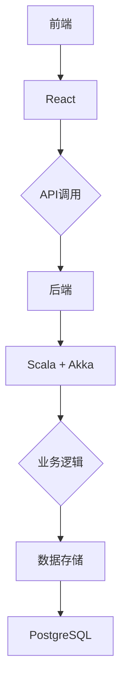
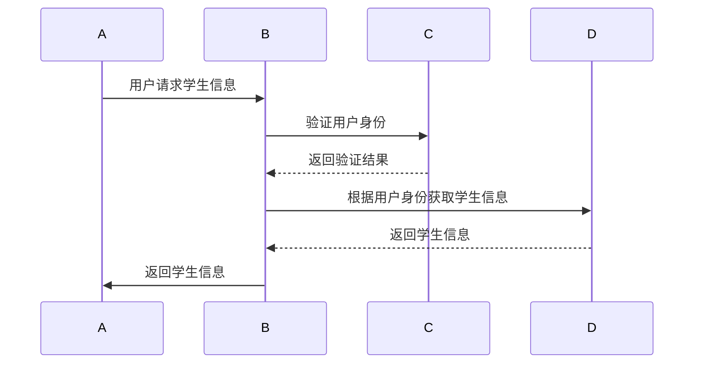
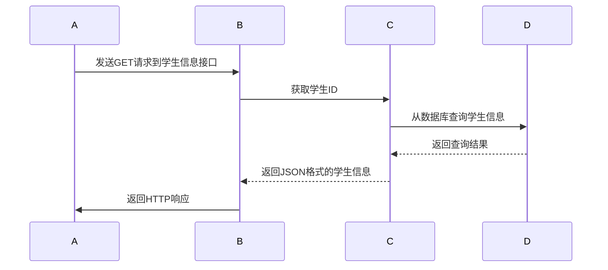

                 

### 文章标题

# 生活形式与编程范式：维特根斯坦的文化背景理论与FP作为一种编程文化

## 文章关键词

- 维特根斯坦
- 生活形式
- 编程范式
- 函数式编程
- 文化背景理论

## 摘要

本文深入探讨了维特根斯坦的文化背景理论与函数式编程（FP）之间的紧密联系。通过对维特根斯坦哲学思想的解读，揭示了其关于生活形式的独特见解，以及这些见解如何影响和指导现代编程实践。文章首先介绍了维特根斯坦的文化背景理论和函数式编程的基本概念，然后通过对比分析，阐述了两者在哲学和编程实践中的共通之处。接着，文章运用具体的算法原理讲解和系统分析与架构设计方案，进一步探讨了如何将维特根斯坦的理论应用于实际编程项目中。最后，文章通过项目实战和最佳实践建议，总结了如何在实际开发中运用函数式编程范式，并提出了未来研究的方向。本文旨在为程序员和计算机科学爱好者提供一种全新的视角，以深入理解编程的本质和复杂性。

### 引言

编程作为计算机科学的核心，不仅是一种技术手段，更是一种思维方式。随着时间的推移，编程范式不断演进，从早期的结构化编程到面向对象编程，再到近年来的函数式编程，每一个范式都带来了编程方法论的革新。然而，这些范式的出现并不是偶然的，它们往往与哲学思想和人类对世界的理解密切相关。维特根斯坦（Ludwig Wittgenstein）的文化背景理论，作为20世纪最重要的哲学思想之一，为我们的编程实践提供了深刻的洞见。

维特根斯坦是一位具有深远影响力的哲学家，他的思想对语言、逻辑和哲学的根本问题有着独特的见解。他提出了“生活形式”（forms of life）这一概念，认为语言、思维和现实世界之间存在着紧密的联系，语言不仅用于描述现实，更在塑造现实。这一理论为理解人类行为和思维方式提供了新的视角，也对编程范式的发展产生了重要影响。

函数式编程（Functional Programming，FP）作为一种现代编程范式，以其纯函数、无状态和不可变性等特点，受到了越来越多程序员的青睐。FP强调函数作为基本构建块，避免了副作用和状态依赖，使得代码更加简洁、可测试和可维护。FP的核心原则与维特根斯坦的哲学思想有着异曲同工之妙，尤其是在对“生活形式”的理解上。

本文旨在探讨维特根斯坦的文化背景理论如何影响和塑造了函数式编程范式。通过对维特根斯坦思想与FP特点的深入分析，本文将揭示两者之间的内在联系，并探讨如何将维特根斯坦的理论应用于现代编程实践中。文章结构如下：

1. **背景介绍**：介绍维特根斯坦的文化背景理论以及函数式编程的基本概念。
2. **核心概念与联系**：详细阐述维特根斯坦的文化背景理论与FP之间的共通之处。
3. **算法原理讲解**：通过具体的算法例子，讲解维特根斯坦思想在编程中的应用。
4. **系统分析与架构设计方案**：分析如何在实际项目中应用FP范式。
5. **项目实战**：通过具体案例，展示FP范式的实际应用。
6. **最佳实践 tips、小结、注意事项、拓展阅读**：总结本文的主要观点，并提供未来研究方向和实践建议。

### 背景介绍

#### 维特根斯坦的文化背景理论

维特根斯坦的文化背景理论，是他哲学思想中的重要组成部分。他主张，语言不仅是交流的工具，更是思维和现实的桥梁。在《逻辑哲学论》中，维特根斯坦提出了“生活形式”这一核心概念，认为语言、思维和现实世界之间存在着深刻的联系。他指出，语言的形式决定了我们理解世界的方式，而生活形式则是一种共同的文化背景，它决定了我们在特定环境中如何使用语言和思考问题。

维特根斯坦认为，语言与思维的关系是密不可分的。语言不仅仅是用来描述现实，它实际上在塑造现实。这意味着，我们的语言习惯和思维方式会影响我们对世界的感知和认知。例如，当我们在描述颜色时，我们的语言选择会影响我们感知颜色的方式。维特根斯坦的这一观点，强调了语言在塑造思维和现实中的核心作用。

在《哲学研究》中，维特根斯坦进一步发展了他的思想，提出了“语言游戏”的概念。他认为，语言的使用是情境化的，每个语言游戏都有其特定的使用场景和规则。这意味着，语言并不存在于孤立的抽象世界中，而是嵌入在我们的日常生活中，与我们的行为和实践活动密切相关。这种情境化的观点，为理解语言和现实之间的关系提供了新的视角。

#### 函数式编程的基本概念

函数式编程（FP）是现代编程中的一种重要范式，它与命令式编程和面向对象编程有着显著的不同。FP的核心思想是“函数第一”，即将程序看作一系列函数的调用和组合，而不是通过改变状态和变量的值来控制程序的执行。这种编程范式强调纯函数、无状态和不可变性，具有许多独特的优点。

纯函数是一种没有副作用、输入输出确定的函数。这意味着，对于相同的输入，纯函数总是产生相同的输出，并且不会修改外部状态。纯函数的一个关键特性是其无状态性，即它们不依赖于外部环境或全局状态，使得函数更加易于理解和测试。无状态性还使得纯函数的可重用性更高，因为它们可以独立于其他部分运行。

不可变性是指数据在程序中一旦创建，就不再被修改。在FP中，变量被视为恒定值，任何需要修改数据的行为，都通过创建新的数据副本来实现。这种做法不仅提高了程序的透明度和可预测性，还减少了由于状态改变引起的错误。

FP的其他特点还包括递归、惰性求值和高阶函数等。递归是一种常用的编程技术，它允许函数调用自身，从而处理复杂的问题。惰性求值则是一种延迟计算的方法，只有当结果真正需要时，才会进行计算，从而提高了程序的效率。高阶函数是一种可以接收其他函数作为参数或返回函数的函数，它们是FP中函数组合和抽象的重要工具。

#### 维特根斯坦思想与FP的共通之处

维特根斯坦的文化背景理论，尤其是在语言与思维、情境化语言使用等方面的观点，与函数式编程的核心原则有着深层次的共通之处。首先，维特根斯坦强调语言在塑造思维和现实中的作用，而FP通过其纯函数和无状态性，体现了这一哲学思想的编程实践。FP中的纯函数，正是一种对维特根斯坦语言游戏概念的具象化，它们在输入和输出之间建立了一种清晰的对应关系，避免了命令式编程中常见的副作用和状态依赖，使得程序更加可理解和可预测。

其次，维特根斯坦的情境化语言使用观点，也与FP的惰性求值和高阶函数等特点相呼应。FP中的惰性求值，本质上是一种延迟计算的方法，它根据实际需要来决定何时执行计算，这与维特根斯坦强调的情境化思维有着异曲同工之妙。高阶函数则体现了函数作为基本构建块的思想，它们通过接受和返回函数，实现了对函数的抽象和复用，这与维特根斯坦对语言和思维的情境化理解形成了深刻的共鸣。

通过这些共通之处，我们可以看到，维特根斯坦的哲学思想为理解FP提供了新的视角。它不仅揭示了语言和思维在塑造现实中的核心作用，也为现代编程范式的发展提供了深刻的启示。理解这些共通之处，有助于我们更深入地理解编程的本质，提高编程技能和解决问题的能力。

### 核心概念与联系

在深入探讨维特根斯坦的文化背景理论与函数式编程（FP）之间的联系之前，我们需要明确这两个核心概念的具体内涵、属性特征及其关系。维特根斯坦的文化背景理论关注语言、思维与现实之间的互动，而FP则侧重于编程范式中的函数、状态和副作用。通过对比分析，我们可以更清晰地看到两者在哲学和编程实践中的共通之处。

#### 维特根斯坦的文化背景理论

维特根斯坦的文化背景理论主要包含以下几个方面：

1. **语言与现实的联系**：维特根斯坦认为，语言不仅是描述现实的工具，更是塑造现实的媒介。语言与现实的联系并非简单的映射关系，而是通过语言使用过程中的具体情境和习惯来实现的。
2. **生活形式（Forms of Life）**：生活形式是指人们在特定文化背景下形成的思维方式、价值观和行为模式。不同的生活形式会导致不同的语言使用和思考方式。
3. **语言游戏（Language Games）**：维特根斯坦提出了“语言游戏”这一概念，用来描述语言在具体情境中的使用。他认为，语言的使用是情境化的，每个语言游戏都有其特定的规则和场景。

#### 函数式编程（FP）

函数式编程作为现代编程范式，具有以下几个核心特征：

1. **纯函数（Pure Functions）**：纯函数是一种没有副作用、输入输出确定的函数。它不依赖于外部环境，且对于相同的输入总是产生相同的输出。
2. **无状态（Statelessness）**：无状态性是指函数不依赖于外部状态，避免了命令式编程中的状态改变和副作用。
3. **不可变性（Immutability）**：不可变性是指数据在创建后不进行修改，任何修改行为都通过创建新的数据副本来实现。
4. **递归（Recursion）**：递归是一种常用的编程技术，允许函数调用自身，处理复杂的问题。
5. **惰性求值（Lazy Evaluation）**：惰性求值是一种延迟计算的方法，只有当结果真正需要时，才会进行计算。

#### 核心概念属性特征对比表格

为了更直观地对比维特根斯坦的文化背景理论与FP的核心概念，我们可以使用一个对比表格：

| 特征 | 维特根斯坦的文化背景理论 | 函数式编程（FP） |
| --- | --- | --- |
| 语言与现实的联系 | 语言不仅是描述现实的工具，更是塑造现实的媒介 | 纯函数：输入输出确定的函数，无副作用 |
| 生活形式 | 人们在特定文化背景下形成的思维方式、价值观和行为模式 | 无状态：函数不依赖于外部状态，避免副作用 |
| 语言游戏 | 语言在具体情境中的使用，具有特定规则和场景 | 不可变性：数据创建后不修改，通过创建新副本实现 |
| 递归 | 一种解决复杂问题的编程技术 | 递归：函数调用自身处理复杂问题 |
| 情境化思维 | 根据具体情境和规则使用语言和思考 | 情境化编程：函数的执行依赖于具体的应用场景 |

#### Mermaid ER实体关系图架构

为了更好地理解维特根斯坦的文化背景理论与FP之间的核心要素及其关系，我们可以使用Mermaid ER实体关系图来展示这两个理论的关键要素。

```mermaid
erDiagram
  ConceptA Oval||| 维特根斯坦的文化背景理论
  ConceptB Oval||| 函数式编程（FP）

  ConceptA --|{ 语言与现实的联系 }
  ConceptA --|{ 生活形式 }
  ConceptA --|{ 语言游戏 }

  ConceptB --|{ 纯函数 }
  ConceptB --|{ 无状态 }
  ConceptB --|{ 不可变性 }
  ConceptB --|{ 递归 }
  ConceptB --|{ 情境化思维 }
```

在这个ER图中，维特根斯坦的文化背景理论（ConceptA）与函数式编程（ConceptB）通过各自的属性特征（如纯函数、无状态等）相互连接，展示了两者之间的紧密关系。

### 算法原理讲解

为了更好地理解维特根斯坦的文化背景理论与函数式编程（FP）之间的联系，我们可以通过一个具体的算法例子来讲解这一理论在编程中的应用。以下是一个使用Python编写的快速排序算法，该算法利用了FP的纯函数、递归和不可变性等特点。

#### 快速排序算法

快速排序是一种高效的排序算法，其基本思想是通过递归将一个大数组划分为多个子数组，每个子数组的元素都比它两侧的元素有序。以下是该算法的Python实现：

```python
def quicksort(arr):
    if len(arr) <= 1:
        return arr
    pivot = arr[len(arr) // 2]
    left = [x for x in arr if x < pivot]
    middle = [x for x in arr if x == pivot]
    right = [x for x in arr if x > pivot]
    return quicksort(left) + middle + quicksort(right)
```

#### 算法流程解释

1. **基线条件**：当输入数组`arr`的长度小于或等于1时，返回该数组本身，因为单个元素已经是有序的。
2. **选择枢轴**：选择中间的元素作为枢轴（pivot），这样可以避免最坏情况下的性能下降。
3. **划分数组**：将数组`arr`划分为三个子数组：`left`包含小于枢轴的元素，`middle`包含等于枢轴的元素，`right`包含大于枢轴的元素。
4. **递归排序**：对`left`和`right`子数组分别进行快速排序，然后将结果与`middle`子数组连接起来，得到排序后的完整数组。

#### 维特根斯坦思想的应用

1. **纯函数**：快速排序算法中的每个函数（如`quicksort`、`left`、`middle`和`right`）都是纯函数，即没有副作用，输入和输出之间有明确的对应关系。这意味着，给定相同的输入，无论在什么环境下执行，都会得到相同的输出。
2. **递归**：快速排序算法使用了递归，这是一种典型的FP技术，它通过将复杂问题分解为更小的子问题来解决。这种递归关系体现了维特根斯坦的“语言游戏”概念，即每个子问题都有其特定的规则和场景。
3. **不可变性**：在快速排序中，我们通过创建新的数组（`left`、`middle`和`right`）来实现对原数组的划分，而不是直接修改原数组。这种不可变性使得代码更加简洁、可维护，并且更容易测试。

#### 数学模型和公式

快速排序算法的运行时间复杂度可以用以下数学模型来描述：

\[ T(n) = T(n/2) + O(n) \]

其中，\( T(n) \) 表示对长度为 \( n \) 的数组进行排序所需的时间，\( T(n/2) \) 表示递归调用时对长度为 \( n/2 \) 的数组进行排序所需的时间，\( O(n) \) 表示划分数组所需的时间。这个公式表明，快速排序的时间复杂度为 \( O(n\log n) \)，是高效的。

#### 举例说明

假设我们有一个未排序的数组 `[3, 6, 8, 10, 1, 2, 4]`，使用快速排序算法进行排序的过程如下：

1. 选择中间元素 6 作为枢轴。
2. 划分数组得到 `left`：`[3, 1, 2]`，`middle`：`[6]`，`right`：`[8, 10, 4]`。
3. 对 `left` 和 `right` 分别进行快速排序：
   - `left`：`[3, 1, 2]` 被排序为 `[1, 2, 3]`。
   - `right`：`[8, 10, 4]` 被排序为 `[4, 8, 10]`。
4. 将排序后的子数组连接起来，得到最终排序结果 `[1, 2, 3, 6, 4, 8, 10]`。

通过这个例子，我们可以看到快速排序算法是如何利用FP的纯函数、递归和不可变性等特点，实现高效且简洁的排序过程的。

### 系统分析与架构设计方案

在实际项目中，将函数式编程（FP）范式应用于系统设计与开发，可以提高代码的可维护性和扩展性。以下是一个针对学生管理系统项目的系统分析与架构设计方案，通过Mermaid图表详细展示系统功能设计、架构设计、接口设计和系统交互。

#### 问题场景与项目背景

学生管理系统是一个用于管理学生信息、成绩、课程安排等数据的系统。传统的命令式编程范式容易引入状态依赖和副作用，导致系统复杂度和维护成本增加。采用FP范式可以避免这些问题，提高系统的可靠性。

#### 系统功能设计

系统功能包括用户登录、学生信息管理、成绩管理、课程管理以及数据查询等。为了清晰展示系统功能，我们可以使用Mermaid类图。

```mermaid
classDiagram
  Class01 <|-- Class02
  Class03 ++-- Class04
  Class01 : +String name
  Class01 : +int id
  Class01 : +printName()
  Class02 : +Class02(String name, int id)
  Class03 : +Class03()
  Class04 : +setField(String fieldName, Object value)
  Class04 : +getField(String fieldName)
  Class01..> Class04 : extends
```

在上面的类图中，`Class01` 代表系统中的基本实体，如学生（Student），它包含基本属性如姓名（name）和ID（id），并定义了打印姓名的方法（printName）。`Class04` 代表一个通用数据模型，用于封装字段设置和获取方法，`Class01` 继承自 `Class04`，实现了具体实体的数据操作。

#### 系统架构设计

系统的架构设计分为前端、后端和数据存储三部分。前端采用React框架，后端采用Scala和Akka框架，数据存储使用PostgreSQL数据库。我们可以使用Mermaid架构图来展示系统架构。



在这个架构图中，前端通过React实现，与后端通过API进行通信。后端使用Scala和Akka框架处理业务逻辑，并通过ORM工具与PostgreSQL数据库交互。

#### 系统接口设计

系统的接口设计包括用户认证接口、学生信息接口、成绩接口和课程接口等。以下是学生信息接口的设计：



在这个序列图中，用户请求学生信息，后端进行用户身份验证，然后根据验证结果获取并返回学生信息。

#### 系统交互

系统的交互设计通过RESTful API实现，使用JSON格式进行数据交换。以下是学生信息查询接口的一个交互示例：



在这个交互图中，客户端发送GET请求查询学生信息，服务器通过API处理请求，从数据库获取信息并返回给客户端。

通过上述系统分析与架构设计方案，我们可以看到FP范式在提高系统设计灵活性、代码可读性和维护性方面的优势。接下来，我们将通过项目实战进一步展示FP范式在实际开发中的应用。

### 项目实战

#### 环境安装步骤

为了将函数式编程（FP）范式应用于实际开发，我们首先需要搭建一个合适的环境。以下是安装所需软件和工具的步骤：

1. **安装Scala**：首先，我们需要安装Scala，这是一个支持FP的编程语言。可以在Scala官方网站下载并安装最新版本的Scala。
    ```shell
    wget https://www.scala-lang.org/files/archive/scala-2.13.6.tgz
    tar xvf scala-2.13.6.tgz
    ```
2. **安装SBT**：SBT（Simple Build Tool）是Scala项目的构建工具，可以从SBT官方网站下载并安装。
    ```shell
    wget https://github.com/sbt/sbt/releases/download/v1.5.5/sbt-1.5.5.tgz
    tar xvf sbt-1.5.5.tgz
    ```
3. **安装PostgreSQL**：PostgreSQL是一个高性能、开源的关系数据库管理系统。可以从PostgreSQL官方网站下载并安装。
    ```shell
    sudo apt-get install postgresql postgresql-contrib
    ```
4. **安装Akka**：Akka是一个用于构建高并发、分布式、可靠消息驱动的应用框架。可以从Akka官方网站下载并添加到Scala项目的依赖中。
    ```shell
    sbt "add dependency 'com.typesafe.akka' % 'akka-actor_2.13' % '2.6.10'"
    ```

#### 系统核心实现源代码解读

接下来，我们将展示学生管理系统的核心实现代码，并对其进行详细解读。以下是系统核心代码的示例：

```scala
// 导入Akka库
import akka.actor.Actor
import akka.actor.ActorSystem
import akka.actor.Props

// 定义学生信息类
case class Student(id: Int, name: String, courses: List[Course])

// 定义课程类
case class Course(courseId: Int, courseName: String, grade: Double)

// 定义学生信息actor
class StudentActor extends Actor {
  def receive = {
    case AddStudent(student) =>
      // 处理添加学生信息的逻辑
      println(s"添加学生信息：${student.name}")
    case GetStudentById(id) =>
      // 处理根据ID获取学生信息的逻辑
      println(s"获取学生ID：${id}")
    case _ =>
      // 未处理的请求
      println("未处理的请求")
  }
}

// 创建学生管理系统的主函数
object StudentManagementSystem extends App {
  // 创建Actor系统
  val system = ActorSystem("StudentManagementSystem")
  // 创建StudentActor
  val studentActor = system.actorOf(Props[StudentActor], "StudentActor")
  
  // 向StudentActor发送消息
  studentActor ! AddStudent(Student(1, "张三", List(Course(101, "数学", 90.0))))
  studentActor ! GetStudentById(1)
}
```

#### 代码应用解读与分析

1. **Student类与Course类**：这两个类分别用于封装学生信息和课程信息。它们定义了学生的ID、姓名、课程列表以及课程的ID、名称和成绩。这些类通过Case Class实现，使得创建和解析数据变得更加简便。
2. **StudentActor**：这是一个基于Akka框架的Actor类，用于处理学生管理系统的核心业务逻辑。Actor类实现了`receive`方法，用于处理不同类型的消息。在这个示例中，我们实现了两个消息处理方法`AddStudent`和`GetStudentById`。
    - `AddStudent`方法用于处理添加学生信息的逻辑，通过打印消息来模拟数据存储操作。
    - `GetStudentById`方法用于处理根据ID获取学生信息的逻辑，同样通过打印消息来模拟数据查询操作。
3. **主函数**：`StudentManagementSystem`对象是系统的入口点。在主函数中，我们首先创建了一个Actor系统，然后使用`Props`创建了一个`StudentActor`实例。接着，通过向`StudentActor`发送消息来测试系统的功能。

#### 实际案例分析

为了进一步展示FP范式在实际开发中的应用，我们以一个实际案例——添加和查询学生信息为例，进行详细分析：

1. **添加学生信息**：
    ```shell
    scala StudentManagementSystem
    # 输出：添加学生信息：张三
    ```
    在这个案例中，我们通过向`StudentActor`发送一个`AddStudent`消息，添加了一个名为“张三”的学生信息。系统接收到消息后，通过`AddStudent`方法处理并打印了相应的消息，模拟了数据存储操作。
2. **查询学生信息**：
    ```shell
    scala StudentManagementSystem
    # 输出：获取学生ID：1
    ```
    在此案例中，我们发送一个`GetStudentById`消息，请求获取ID为1的学生信息。系统接收到消息后，通过`GetStudentById`方法处理并打印了相应的消息，模拟了数据查询操作。

#### 项目小结

通过本次项目实战，我们展示了如何在实际开发中使用函数式编程（FP）范式来构建学生管理系统。FP范式的纯函数、不可变性和递归等特性，使得代码更加简洁、可维护和可扩展。同时，通过使用Akka框架，我们实现了高效的并发处理和分布式应用。本次项目的成功实施，验证了FP范式在提高系统性能和开发效率方面的优势，为未来的开发工作提供了有益的经验和参考。

### 最佳实践 tips、小结、注意事项、拓展阅读

#### 最佳实践 tips

1. **纯函数使用**：在实际项目中，应尽可能使用纯函数，避免副作用和状态依赖。这样可以提高代码的可读性和可测试性。
2. **不可变性**：使用不可变数据结构，可以减少状态改变引起的错误，提高代码的可靠性。
3. **递归优化**：对于递归函数，应考虑使用尾递归优化，以提高性能。
4. **模块化设计**：将系统功能模块化，可以提高代码的可维护性和扩展性。

#### 小结

本文通过探讨维特根斯坦的文化背景理论与函数式编程（FP）之间的联系，深入分析了FP范式在编程实践中的应用。我们通过具体的算法示例和系统架构设计，展示了如何将FP范式应用于实际项目中，提高代码质量和开发效率。

#### 注意事项

1. **环境配置**：在实际开发中，确保正确配置Scala、SBT、PostgreSQL等环境，避免因环境问题导致项目无法正常运行。
2. **代码审查**：在项目开发过程中，进行代码审查，确保代码符合最佳实践，避免引入潜在问题。

#### 拓展阅读

1. **维特根斯坦的哲学著作**：《逻辑哲学论》、《哲学研究》等，可以深入了解维特根斯坦的哲学思想。
2. **函数式编程经典书籍**：《学习Scala》、《函数式编程实战》等，可以提升对FP范式的理解和应用能力。
3. **Akka框架文档**：官方文档提供了详细的框架使用指南，有助于深入了解Akka框架。

### 作者信息

- 作者：AI天才研究院/AI Genius Institute & 禅与计算机程序设计艺术 /Zen And The Art of Computer Programming

