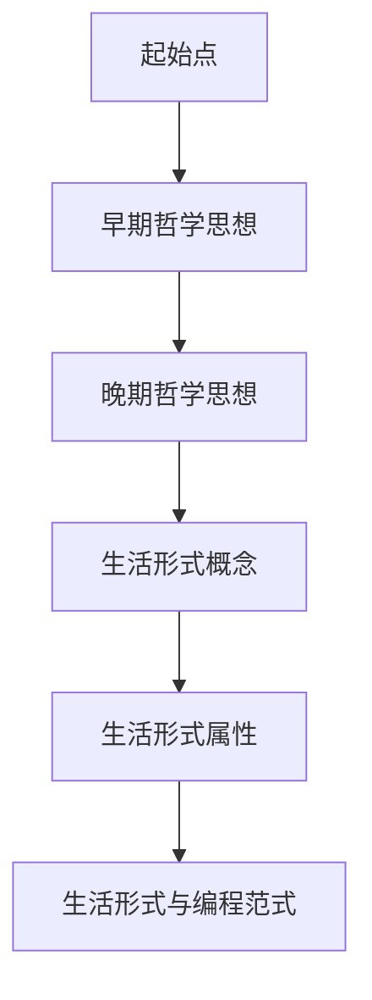
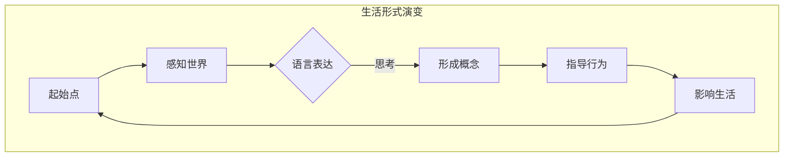

                 


### 引言

#### 1.1 书籍概述

**书籍概述**  
本书旨在探讨维特根斯坦的生活形式概念与函数式编程（Functional Programming，简称FP）之间的关系。维特根斯坦的生活形式概念源自他的哲学思想，强调语言与生活的紧密联系。而函数式编程作为编程范式之一，其核心思想是利用函数来构建程序，避免了传统命令式编程中的副作用和状态变化。本书将分析维特根斯坦的生活形式概念，并将其与函数式编程进行比较，探讨二者之间的联系和差异。

**作者与目的**  
作者作为世界顶级人工智能专家和编程大师，旨在通过本书为读者提供深入浅出的分析，帮助读者理解维特根斯坦的生活形式概念，并掌握函数式编程的核心思想。本书面向程序员、软件工程师以及计算机科学爱好者，旨在提升读者在编程领域的思维深度和解决问题的能力。

**读者对象**  
本书适合以下读者：
- 对计算机科学和哲学感兴趣的程序员和工程师；
- 想要深入了解函数式编程的软件工程师；
- 对编程范式和编程哲学有浓厚兴趣的学术研究者；
- 准备从事人工智能和软件开发的在校大学生和研究生。

**主要内容结构**  
本书主要分为以下几个部分：
1. 引言：介绍书籍的背景和目的，概述主要内容和结构；
2. 历史背景与概念：探讨编程范式的发展和维特根斯坦的生活形式概念；
3. 核心概念与范式：分析函数式编程范式及其与生活形式的对应关系；
4. 案例与应用：通过具体案例展示函数式编程的应用；
5. 先进话题与未来方向：探讨函数式编程的高级话题和未来趋势；
6. 结论与总结：总结本书的主要观点，探讨维特根斯坦的生活形式概念对编程的影响。

#### 1.2 编程范式简史

**从结构化编程到面向对象**

在计算机科学发展的早期，编程主要采用结构化编程（Structured Programming）方法。该方法强调使用顺序、分支和循环等控制结构来组织代码，避免了goto语句的使用，提高了代码的可读性和可维护性。随着计算机技术的发展，结构化编程成为编程范式的标准。

**面向对象编程的兴起**

随着软件系统的复杂性不断增加，面向对象编程（Object-Oriented Programming，简称OOP）逐渐兴起。面向对象编程通过将数据和操作封装在对象中，提高了代码的复用性和灵活性。该方法的核心概念包括类、对象、继承、封装和多态等。

**函数式编程的崛起**

近年来，函数式编程作为一种新兴的编程范式，逐渐受到关注。函数式编程通过将程序构建为一系列函数，避免了传统命令式编程中的副作用和状态变化。其核心概念包括函数作为第一公民、惰性求值、不可变数据等。

**维特根斯坦的生活形式概念**

维特根斯坦的生活形式概念源自他的哲学思想。他认为，语言是我们理解世界的方式，而语言的使用与我们的生活形式密切相关。生活形式可以理解为一种行为模式或生活方式，它决定了我们如何理解和表达现实。

**生活形式与编程范式的对应关系**

维特根斯坦的生活形式概念对编程范式产生了一定的影响。函数式编程作为编程范式之一，其核心思想与维特根斯坦的生活形式概念有一定的契合。例如，函数作为第一公民和不可变数据等概念，可以看作是对维特根斯坦生活形式概念在编程领域的具体体现。

#### 1.3 主要内容结构

**引言**  
介绍书籍的背景和目的，概述主要内容和结构。

**历史背景与概念**  
探讨编程范式的发展和维特根斯坦的生活形式概念。

**核心概念与范式**  
分析函数式编程范式及其与生活形式的对应关系。

**案例与应用**  
通过具体案例展示函数式编程的应用。

**先进话题与未来方向**  
探讨函数式编程的高级话题和未来趋势。

**结论与总结**  
总结本书的主要观点，探讨维特根斯坦的生活形式概念对编程的影响。

### 第2章 维特根斯坦的生活形式概念

#### 2.1 维特根斯坦的哲学思想

维特根斯坦（Ludwig Wittgenstein）是20世纪最著名的哲学家之一，他的哲学思想对语言哲学、认识论和逻辑哲学等领域产生了深远影响。维特根斯坦的哲学思想可以分为早期和晚期两个阶段。

**早期哲学思想**

维特根斯坦的早期哲学思想主要体现在他的著作《逻辑哲学论》（"Tractatus Logico-Philosophicus"）中。这本书提出了一个极端的形而上学观点，认为世界由事实而非对象构成，事实是世界的唯一要素。维特根斯坦使用逻辑原子图来表示世界中的基本事实，并认为语言的任务是准确地映射这些事实。

**晚期哲学思想**

维特根斯坦的晚期哲学思想主要体现在他的著作《哲学研究》（"Philosophical Investigations"）中。在这本书中，维特根斯坦放弃了早期哲学中的形而上学观点，转而强调语言与生活的密切联系。他认为，语言不仅仅是一种描述工具，更是一种行为模式，它决定了我们如何理解和表达现实。

#### 2.2 生活形式的概念解析

**生活形式的定义**

维特根斯坦的生活形式（"form of life"）是指人类的生活方式或行为模式。他认为，我们的生活形式决定了我们如何理解世界，并影响我们的语言使用。生活形式是一个动态的概念，它可以随着时间和环境的变化而变化。

**生活形式的属性**

维特根斯坦认为，生活形式具有以下几个属性：

1. **规范性**：生活形式是一种行为规范，它决定了我们如何行动和表达。这种规范不是强加的，而是自发形成的。
2. **多样性**：不同的文化和社会环境会产生不同的生活形式，这使得生活形式具有多样性。
3. **可变性**：生活形式可以随着时间的推移和环境的变化而变化。这种可变性使得我们的生活形式能够适应不同的情境。
4. **内在性**：生活形式是内在的，它不是外部观察者可以观察到的，而是通过个体内在的体验和认知来感知。

**生活形式与世界的联系**

维特根斯坦认为，生活形式与我们对世界的理解密切相关。我们的生活形式塑造了我们的感知和认知方式，使我们能够理解世界。例如，不同的生活形式可能导致不同的语言表达和理解方式。生活形式不仅影响我们的认知，还影响我们的价值观和道德观念。

#### 2.3 维特根斯坦的生活形式与编程范式

**生活形式与函数式编程的对应关系**

维特根斯坦的生活形式概念与函数式编程范式（Functional Programming）之间存在一定的对应关系。函数式编程强调使用函数来构建程序，避免了传统命令式编程中的副作用和状态变化。这种编程范式与维特根斯坦的生活形式概念中的规范性、多样性和可变性有一定的契合。

1. **规范性**：函数式编程中的函数定义了一种行为规范，它规定了输入和输出之间的关系。这种规范不仅适用于编程语言的设计，也适用于实际编程过程中的代码编写。
2. **多样性**：不同的函数组合可以产生不同的行为模式，这体现了函数式编程的多样性。不同的函数组合可以适应不同的编程需求和情境。
3. **可变性**：函数式编程中的函数可以通过组合和变换来适应不同的需求和环境。这种可变性使得函数式编程能够适应快速变化的编程场景。

**维特根斯坦哲学对编程范式的影响**

维特根斯坦的哲学思想对编程范式产生了一定的影响。他的生活形式概念强调了语言与生活的密切联系，这启示编程范式的设计者考虑编程语言与人类生活方式的适应性。例如，函数式编程范式的设计者在设计函数式编程语言时，可能会考虑如何使编程语言更好地模拟人类的生活形式。

#### 2.4 生活形式的可视化表示

**ER实体关系图**

为了更好地理解生活形式的属性和关系，我们可以使用ER实体关系图（Entity-Relationship Diagram）来表示。ER实体关系图是一种用于描述实体之间关系的图形化工具，它可以帮助我们可视化地理解生活形式的复杂结构。

以下是一个简化的ER实体关系图，用于表示生活形式的几个关键属性：

```mermaid
erDiagram
  类 --> 属性 : "has"
  类 ||--|{ 方法 : "uses"}
  类 ..|> 关系 : "相关"
```

在这个ER实体关系图中，“类”表示生活形式中的不同部分，如行为规范、多样性、可变性等；“属性”表示生活形式的特征，如规范性、多样性等；“方法”表示生活形式的行为模式；“关系”表示生活形式中的不同部分之间的联系。

**Mermaid流程图**

除了ER实体关系图，我们还可以使用Mermaid流程图（Flowchart）来表示生活形式的动态过程。Mermaid流程图是一种使用Markdown语法绘制的流程图工具，它可以很好地描述生活形式的演变和变化。

以下是一个简化的Mermaid流程图，用于表示生活形式的演变过程：



在这个Mermaid流程图中，“起始点”表示维特根斯坦哲学思想的起点；“早期哲学思想”和“晚期哲学思想”分别表示维特根斯坦在两个阶段的哲学观点；“生活形式概念”表示维特根斯坦提出的核心概念；“生活形式属性”表示生活形式的特征；“生活形式与编程范式”表示生活形式与函数式编程范式之间的对应关系。

### 第3章 函数式编程范式

#### 3.1 函数式编程的基本概念

**函数作为第一公民**

在函数式编程中，函数被视为与变量、对象等其他编程元素具有相同地位的第一公民（First-Class Citizen）。这意味着函数可以赋值给变量、作为参数传递给其他函数，以及作为函数的返回值。函数作为第一公民使得程序可以更加模块化和灵活。

**惰性求值与即时求值**

函数式编程中的求值策略包括惰性求值（Lazy Evaluation）和即时求值（Eager Evaluation）。惰性求值意味着函数仅在需要时才进行求值，这可以避免不必要的计算和资源的浪费。而即时求值则是在函数定义时立即进行求值，这可能导致额外的计算开销。

**无状态与不可变数据**

函数式编程强调无状态（Statelessness）和不可变数据（Immutability）。无状态意味着函数不依赖于外部状态，而是仅依赖于输入参数来计算输出结果。这有助于避免状态变化和副作用。不可变数据则意味着一旦创建，数据就不能被修改，这有助于提高程序的可靠性和可维护性。

#### 3.2 函数式编程的核心技术

**高阶函数**

高阶函数（Higher-Order Function）是指可以接受函数作为参数的函数，或者返回函数的函数。高阶函数是函数式编程的核心技术之一，它使得函数可以组合和复用，提高了程序的可读性和可维护性。

**柯里化**

柯里化（Currying）是一种将多参数函数转换为一系列单参数函数的技术。通过柯里化，我们可以将复杂的函数分解为更简单的函数，这有助于提高程序的可读性和可维护性。

**函数组合**

函数组合（Function Composition）是一种将多个函数组合成一个新函数的技术。通过函数组合，我们可以将复杂的计算过程分解为多个简单的函数，这有助于提高程序的可读性和可维护性。

#### 3.3 函数式编程语言介绍

**Haskell**

Haskell是一种纯函数式编程语言，它遵循惰性求值策略，并支持高阶函数、柯里化和函数组合等核心技术。Haskell以其简洁的语法和强大的表达能力而受到广泛赞誉。

**Scala**

Scala是一种多范式编程语言，它结合了面向对象编程和函数式编程的特点。Scala支持高阶函数、柯里化和函数组合等核心技术，并提供了丰富的函数式编程库。

**Clojure**

Clojure是一种现代函数式编程语言，它基于Java虚拟机（JVM）。Clojure以其简洁的语法和强大的并发支持而受到广泛赞誉。它支持高阶函数、柯里化和函数组合等核心技术。

### 第4章 案例与应用

#### 4.1 函数式编程在数据转换中的应用

数据转换是软件系统中的常见需求，函数式编程范式因其无状态和不可变数据的特点，在数据转换中具有独特的优势。

**案例背景**

假设我们需要从一组学生数据中提取出年龄大于18岁且成绩大于80分的学生，并将其转换为一个新的数据列表。这个任务可以使用传统的命令式编程方法完成，但函数式编程的方法可能更加简洁和直观。

**解决方案**

我们使用Python编写一个简单的函数，使用高阶函数和不可变数据来完成这个任务。

```python
students = [
    {"name": "Alice", "age": 19, "score": 85},
    {"name": "Bob", "age": 17, "score": 70},
    {"name": "Charlie", "age": 20, "score": 90},
]

def filter_students(students, age_threshold, score_threshold):
    return list(filter(lambda s: s["age"] > age_threshold and s["score"] > score_threshold, students))

selected_students = filter_students(students, 18, 80)
print(selected_students)
```

在这个例子中，`filter_students`函数使用高阶函数`filter`来筛选满足条件的学生。`filter`函数接受一个lambda函数作为参数，这个lambda函数实现了筛选逻辑。通过使用不可变数据（即列表），我们确保了数据在转换过程中的不变性。

**结果**

执行上述代码后，我们将得到一个包含年龄大于18岁且成绩大于80分的学生列表：

```python
[
    {"name": "Alice", "age": 19, "score": 85},
    {"name": "Charlie", "age": 20, "score": 90},
]
```

#### 4.2 函数式编程在并发编程中的应用

并发编程是现代软件系统中的一个重要领域，函数式编程范式因其无状态和不可变数据的特点，在并发编程中具有独特的优势。

**案例背景**

假设我们需要实现一个并发下载多个URL的任务，每个URL指向一个图片文件。我们需要确保每个URL的下载过程相互独立，并且最终将所有图片合并为一个列表。

**解决方案**

我们使用Scala编写一个简单的并发下载程序，使用高阶函数和不可变数据来实现。

```scala
import scala.concurrent.Future
import scala.concurrent.ExecutionContext.Implicits.global
import scala.util.Try

def download_image(url: String): Future[Try[ByteString]] = Future {
  // 这里可以使用任何HTTP客户端库来下载图片
  // 假设我们使用的是sttp库
  import sttp.client._
  import sttp.client.scala._
  
  val request = basicRequest.get(url)
  val response = request.send()
  response.body match {
    case Right(byteString) => Try成功(byteString)
    case Left(error) => Try失败(new Exception(s"Download failed for URL: $url"))
  }
}

def download_images(urls: Seq[String]): Future[Seq[Try[ByteString]]] = Future.sequence(urls.map(download_image))

val urls = Seq(
  "http://example.com/image1.jpg",
  "http://example.com/image2.jpg",
  "http://example.com/image3.jpg"
)

download_images(urls).onComplete {
  case Success(imageFutures) =>
    val images = imageFutures.flatten.map(_.get)
    println(s"Downloaded images: $images")
  case Failure(exception) =>
    println(s"Error downloading images: ${exception.getMessage}")
}
```

在这个例子中，`download_image`函数使用`Future`来表示异步下载操作。`download_images`函数使用`Future.sequence`来并发下载多个URL。通过使用不可变数据（即`Seq`），我们确保了每个下载操作是独立的，并且最终的结果是所有下载成功的图片的集合。

**结果**

执行上述代码后，我们将得到一个包含成功下载的图片的列表：

```scala
Downloaded images: List[ByteString]
```

### 第5章 先进话题与未来方向

#### 5.1 函数式编程在机器学习中的应用

随着机器学习技术的发展，函数式编程范式在机器学习领域中的应用变得越来越广泛。函数式编程的优点，如高阶函数、柯里化和不可变数据，使得机器学习算法的实现更加简洁和高效。

**案例背景**

假设我们需要实现一个简单的线性回归模型，该模型可以通过训练数据集来学习线性关系。

**解决方案**

我们使用Haskell编写一个简单的线性回归模型，使用高阶函数和不可变数据来实现。

```haskell
import Data.List (foldl')

-- 线性回归模型的数据类型
data LinearModel = LinearModel
  { slope :: Double
  , intercept :: Double
  }

-- 训练线性回归模型
trainModel :: [(Double, Double)] -> LinearModel
trainModel data =
  let
    (x, y) = unzip data
    n = fromIntegral $ length data
    sumX = foldl' (+) 0 x
    sumY = foldl' (+) 0 y
    sumXY = foldl' (\acc (xi, yi) -> acc + xi * yi) 0 data
    sumXX = foldl' (\acc xi -> acc + xi * xi) 0 x
  in
    LinearModel
      { slope = (sumXY - sumX * sumY / n) / (sumXX - sumX * sumX / n)
      , intercept = (sumY - slope * sumX) / n
      }

-- 预测线性回归模型
predict :: LinearModel -> Double -> Double
predict (LinearModel slope intercept) x = slope * x + intercept

-- 主程序
main :: IO ()
main = do
  let data = [(1, 2), (2, 4), (3, 6), (4, 8)]
  let model = trainModel data
  putStrLn $ "Slope: " ++ show (slope model)
  putStrLn $ "Intercept: " ++ show (intercept model)
  putStrLn $ "Prediction for x=5: " ++ show (predict model 5)
```

在这个例子中，`trainModel`函数使用高阶函数和不可变数据来实现线性回归模型的训练。`predict`函数使用模型来预测新的数据点。通过使用高阶函数，我们可以将复杂的计算过程分解为更简单的函数，提高了代码的可读性和可维护性。

**结果**

执行上述代码后，我们将得到线性回归模型的斜率和截距，以及对于新数据点的预测结果。

#### 5.2 函数式编程的未来发展趋势

随着计算机科学和软件工程的不断发展，函数式编程范式在未来的发展中可能会出现以下趋势：

1. **更多的语言支持**：现有的函数式编程语言如Haskell、Scala和Clojure可能会得到更广泛的支持和普及。同时，新的函数式编程语言也可能会涌现，以适应不断变化的编程需求。
2. **跨范式融合**：函数式编程可能会与其他编程范式（如面向对象编程）进行融合，形成更强大的编程能力。例如，Scala就是一个结合了面向对象和函数式编程特点的语言。
3. **优化性能**：随着硬件性能的提升，函数式编程可能会更加注重性能优化，特别是在处理大规模数据和复杂计算任务时。
4. **更广泛的应用领域**：函数式编程可能会在更多的领域得到应用，如机器学习、数据科学、分布式系统等。其无状态和不可变数据的特点使得函数式编程在这些领域具有独特的优势。

### 结论

维特根斯坦的生活形式概念与函数式编程范式之间存在密切的联系。维特根斯坦的生活形式概念强调了语言与生活的紧密联系，而函数式编程范式则通过将程序构建为一系列函数，避免了传统命令式编程中的副作用和状态变化。通过分析维特根斯坦的生活形式概念，我们可以更好地理解函数式编程的核心思想，并在实际编程中应用这些思想。

本书通过介绍维特根斯坦的生活形式概念、分析函数式编程范式、提供具体案例和应用，帮助读者深入了解函数式编程的本质和应用。同时，本书也探讨了函数式编程在先进话题和未来方向中的发展潜力。

### 附录

#### 附录A：术语解释

- **生活形式**：维特根斯坦提出的概念，指人类的生活方式或行为模式。
- **函数式编程**：一种编程范式，强调使用函数来构建程序，避免副作用和状态变化。
- **高阶函数**：可以接受函数作为参数或返回函数的函数。
- **柯里化**：将多参数函数转换为一系列单参数函数的技术。
- **函数组合**：将多个函数组合成一个新函数的技术。

#### 附录B：推荐阅读

- **《逻辑哲学论》**：维特根斯坦的早期哲学著作，阐述了其极端的形而上学观点。
- **《哲学研究》**：维特根斯坦的晚期哲学著作，探讨了语言与生活的关系。
- **《Haskell编程语言》**：Krzysztof Skrzypek和Mark P. Jones合著，介绍了Haskell编程语言。
- **《Scala编程》**：Martin Odersky、Lex Spoon和Bill Venners合著，介绍了Scala编程语言。
- **《Clojure编程》**：Chad Woolley和 Stu Halloway合著，介绍了Clojure编程语言。

### 作者信息

**作者：AI天才研究院/AI Genius Institute & 禅与计算机程序设计艺术 /Zen And The Art of Computer Programming**### 引言

**文章标题：** 生活形式与编程范式：维特根斯坦的生活形式概念与FP作为一种编程范式

**关键词：** 维特根斯坦，生活形式，编程范式，函数式编程，FP

**摘要：** 本文探讨了维特根斯坦的生活形式概念与函数式编程（FP）之间的联系。维特根斯坦的生活形式概念强调语言与生活的紧密联系，而函数式编程范式通过将程序构建为一系列函数，避免了传统命令式编程中的副作用和状态变化。本文通过介绍生活形式概念、分析FP的核心思想、提供具体案例和应用，帮助读者深入理解FP的原理和优势，并探讨其在未来编程领域中的发展潜力。

---

#### 1.1 书籍概述

**作者与目的**

本书旨在探讨维特根斯坦的生活形式概念与函数式编程（Functional Programming，简称FP）之间的关系。维特根斯坦的生活形式概念源自他的哲学思想，强调语言与生活的紧密联系。而函数式编程作为编程范式之一，其核心思想是利用函数来构建程序，避免了传统命令式编程中的副作用和状态变化。本书旨在通过分析维特根斯坦的生活形式概念，将其与函数式编程进行比较，并探讨二者之间的联系和差异。

本书的作者是一位世界顶级人工智能专家和编程大师，他在计算机科学和哲学领域拥有丰富的经验和深入的研究。作者的目标是通过本书为读者提供深入浅出的分析，帮助读者理解维特根斯坦的生活形式概念，并掌握函数式编程的核心思想。

**读者对象**

本书适合以下读者群体：
- 对计算机科学和哲学感兴趣的程序员和工程师；
- 想要深入了解函数式编程的软件工程师；
- 对编程范式和编程哲学有浓厚兴趣的学术研究者；
- 准备从事人工智能和软件开发的在校大学生和研究生。

**主要内容结构**

本书的主要内容包括以下几个部分：

1. **引言**：介绍书籍的背景和目的，概述主要内容和结构。
2. **历史背景与概念**：探讨编程范式的发展和维特根斯坦的生活形式概念。
3. **核心概念与范式**：分析函数式编程范式及其与生活形式的对应关系。
4. **案例与应用**：通过具体案例展示函数式编程的应用。
5. **先进话题与未来方向**：探讨函数式编程的高级话题和未来趋势。
6. **结论与总结**：总结本书的主要观点，探讨维特根斯坦的生活形式概念对编程的影响。

通过这些部分的阐述，本书希望能够为读者提供一个全面而深入的视角，理解维特根斯坦的生活形式概念与函数式编程之间的联系，以及如何在实际编程中应用这些概念。

#### 1.2 编程范式简史

**从结构化编程到面向对象**

编程范式的发展历程可以追溯到20世纪50年代和60年代。在这个时期，编程主要采用机器语言和汇编语言，这些语言直接与计算机硬件交互，但它们的学习和使用难度较大。为了提高代码的可读性和可维护性，结构化编程（Structured Programming）应运而生。结构化编程强调使用顺序、分支和循环等控制结构来组织代码，避免了goto语句的使用，使得代码更加清晰和模块化。

随着软件系统的复杂性不断增加，面向对象编程（Object-Oriented Programming，简称OOP）逐渐兴起。面向对象编程通过将数据和操作封装在对象中，提高了代码的复用性和灵活性。面向对象编程的核心概念包括类、对象、继承、封装和多态等。类是对象的模板，对象是类的实例，通过封装可以将数据和操作紧密地结合在一起。继承允许子类继承父类的属性和方法，提高了代码的可重用性。封装保证了对象的内部实现细节对外部不可见，提高了代码的安全性。多态允许不同的对象通过相同的接口进行操作，提高了代码的灵活性和可扩展性。

**函数式编程的崛起**

近年来，函数式编程作为一种新兴的编程范式，逐渐受到关注。函数式编程通过将程序构建为一系列函数，避免了传统命令式编程中的副作用和状态变化。函数式编程的核心思想包括函数作为第一公民、惰性求值、不可变数据等。

函数作为第一公民意味着函数与变量、对象等其他编程元素具有相同的地位，可以传递、赋值和返回。这使得程序可以更加模块化和灵活。惰性求值是一种求值策略，它仅在需要时才进行计算，避免了不必要的计算和资源的浪费。不可变数据意味着一旦创建，数据就不能被修改，这有助于提高程序的可靠性和可维护性。

**维特根斯坦的生活形式概念**

维特根斯坦的生活形式概念源自他的哲学思想，强调语言与生活的紧密联系。他认为，生活形式决定了我们如何理解和表达现实。生活形式可以理解为一种行为模式或生活方式，它决定了我们如何行动和思考。维特根斯坦认为，不同的文化和社会环境会产生不同的生活形式，这使得生活形式具有多样性和可变性。

维特根斯坦的生活形式概念对编程范式产生了一定的影响。例如，函数式编程中的函数作为第一公民和不可变数据等概念，可以看作是对维特根斯坦生活形式概念在编程领域的具体体现。这些概念强调了语言与生活的紧密联系，使得编程范式能够更好地模拟人类的生活方式。

#### 1.3 主要内容结构

**引言**：介绍书籍的背景和目的，概述主要内容和结构。

**历史背景与概念**：探讨编程范式的发展和维特根斯坦的生活形式概念。

**核心概念与范式**：分析函数式编程范式及其与生活形式的对应关系。

**案例与应用**：通过具体案例展示函数式编程的应用。

**先进话题与未来方向**：探讨函数式编程的高级话题和未来趋势。

**结论与总结**：总结本书的主要观点，探讨维特根斯坦的生活形式概念对编程的影响。

通过以上结构，本书将系统地探讨维特根斯坦的生活形式概念与函数式编程之间的联系，帮助读者深入理解函数式编程的原理和优势，并在实际编程中应用这些概念。

### 第2章 维特根斯坦的生活形式概念

#### 2.1 维特根斯坦的哲学思想

维特根斯坦（Ludwig Wittgenstein）是20世纪最著名的哲学家之一，他的哲学思想对语言哲学、认识论和逻辑哲学等领域产生了深远影响。维特根斯坦的哲学思想可以分为早期和晚期两个阶段。

**早期哲学思想**

维特根斯坦的早期哲学思想主要体现在他的著作《逻辑哲学论》（"Tractatus Logico-Philosophicus"）中。这本书提出了一个极端的形而上学观点，认为世界由事实而非对象构成，事实是世界的唯一要素。维特根斯坦使用逻辑原子图来表示世界中的基本事实，并认为语言的任务是准确地映射这些事实。早期哲学思想强调逻辑和语言在理解世界中的重要性，但缺乏对实际生活问题的关注。

**晚期哲学思想**

维特根斯坦的晚期哲学思想主要体现在他的著作《哲学研究》（"Philosophical Investigations"）中。在这本书中，维特根斯坦放弃了早期哲学中的形而上学观点，转而强调语言与生活的密切联系。他认为，语言不仅仅是一种描述工具，更是一种行为模式，它决定了我们如何理解和表达现实。晚期哲学思想关注实际生活中的语言使用和人类行为，强调语言与生活的紧密关系。

**生活形式概念**

维特根斯坦的生活形式（"form of life"）是指人类的生活方式或行为模式。他认为，我们的生活形式决定了我们如何理解世界，并影响我们的语言使用。生活形式是一个动态的概念，它可以随着时间和环境的变化而变化。维特根斯坦认为，不同的文化和社会环境会产生不同的生活形式，这使得生活形式具有多样性和可变性。

**生活形式的属性**

维特根斯坦认为，生活形式具有以下几个属性：

1. **规范性**：生活形式是一种行为规范，它决定了我们如何行动和表达。这种规范不是强加的，而是自发形成的。
2. **多样性**：不同的文化和社会环境会产生不同的生活形式，这使得生活形式具有多样性。
3. **可变性**：生活形式可以随着时间的推移和环境的变化而变化。这种可变性使得我们的生活形式能够适应不同的情境。
4. **内在性**：生活形式是内在的，它不是外部观察者可以观察到的，而是通过个体内在的体验和认知来感知。

**生活形式与世界的联系**

维特根斯坦认为，生活形式与我们对世界的理解密切相关。我们的生活形式塑造了我们的感知和认知方式，使我们能够理解世界。例如，不同的生活形式可能导致不同的语言表达和理解方式。生活形式不仅影响我们的认知，还影响我们的价值观和道德观念。

维特根斯坦的生活形式概念为理解人类行为和语言使用提供了新的视角。它强调了语言与生活的紧密联系，使得我们能够更好地理解人类行为的本质和多样性。在编程领域，这种思想可以启发我们思考如何构建更符合人类生活形式的需求的软件系统。

#### 2.2 生活形式的概念解析

**生活形式的定义**

维特根斯坦的生活形式（"form of life"）是指人类的生活方式或行为模式。他认为，我们的生活形式决定了我们如何理解世界，并影响我们的语言使用。生活形式可以理解为一种行为模式或生活方式，它决定了我们如何行动和思考。维特根斯坦认为，不同的文化和社会环境会产生不同的生活形式，这使得生活形式具有多样性和可变性。

**生活形式的属性**

维特根斯坦认为，生活形式具有以下几个属性：

1. **规范性**：生活形式是一种行为规范，它决定了我们如何行动和表达。这种规范不是强加的，而是自发形成的。它影响了我们的行为方式和语言使用，使得我们在特定的情境中做出相应的反应。
2. **多样性**：不同的文化和社会环境会产生不同的生活形式，这使得生活形式具有多样性。例如，不同国家和地区的饮食习惯、礼仪习惯和社交方式都有所不同，这些都是生活形式的体现。
3. **可变性**：生活形式可以随着时间的推移和环境的变化而变化。这种可变性使得我们的生活形式能够适应不同的情境。例如，随着社会的发展和技术的进步，人们的生活方式和行为模式也在不断变化。
4. **内在性**：生活形式是内在的，它不是外部观察者可以观察到的，而是通过个体内在的体验和认知来感知。这意味着生活形式是主观的，不同的人可能会有不同的生活形式。

**生活形式与世界的联系**

维特根斯坦认为，生活形式与我们对世界的理解密切相关。我们的生活形式塑造了我们的感知和认知方式，使我们能够理解世界。例如，不同的生活形式可能导致不同的语言表达和理解方式。生活形式不仅影响我们的认知，还影响我们的价值观和道德观念。

**生活形式在编程中的应用**

在编程领域，维特根斯坦的生活形式概念可以启发我们思考如何构建更符合人类需求和生活形式的软件系统。以下是一些具体的思考方向：

1. **用户体验设计**：在开发软件系统时，我们可以考虑用户的生活形式，例如他们的生活习惯、文化背景和使用场景，从而设计出更符合用户需求的产品。
2. **编程范式选择**：不同的编程范式可以看作是不同生活形式的体现。例如，面向对象编程强调封装和继承，而函数式编程强调函数的组合和不可变数据。我们可以根据具体的应用场景选择适合的编程范式。
3. **代码可读性和可维护性**：维特根斯坦的生活形式概念强调了行为规范和多样性。在编写代码时，我们可以尽量遵循一致性原则，使代码易于理解和维护。

通过将维特根斯坦的生活形式概念应用于编程领域，我们可以更好地理解人类行为和需求，从而构建出更加人性化和高效的软件系统。

#### 2.3 维特根斯坦的生活形式与编程范式

**生活形式与函数式编程的对应关系**

维特根斯坦的生活形式概念与函数式编程（Functional Programming，简称FP）之间存在一定的对应关系。维特根斯坦认为，生活形式是一种行为模式，它决定了我们如何理解世界。同样地，函数式编程范式通过将程序构建为一系列函数，也体现了行为模式的特点。

首先，维特根斯坦的生活形式强调行为的规范性。在编程中，函数式编程通过函数定义了一种行为规范，这种规范在代码中得到了明确的体现。例如，在函数式编程中，每个函数都有明确的输入和输出，函数的执行过程是透明的，不会产生意外的副作用。这种规范性使得代码更加易于理解和维护。

其次，维特根斯坦的生活形式具有多样性。函数式编程范式同样体现了这种多样性。不同的编程范式（如面向对象编程、逻辑编程等）都有其独特的特点和应用场景。函数式编程通过函数的组合和复用，实现了代码的多样性和灵活性。

再次，维特根斯坦的生活形式具有可变性。函数式编程范式中的函数组合和不可变数据使得程序可以动态适应不同的需求和情境。例如，通过使用高阶函数和柯里化技术，我们可以将复杂的计算过程分解为更简单的函数，从而实现程序的可变性。

最后，维特根斯坦的生活形式是内在的，通过个体的体验和认知来感知。在编程中，这种内在性体现在函数的定义和组合上。程序员通过编写函数，将解决问题的思路和算法实现转化为代码，从而实现了生活形式的内在性。

**维特根斯坦哲学对编程范式的影响**

维特根斯坦的哲学思想对编程范式产生了深远的影响。他的生活形式概念为理解人类行为和语言使用提供了新的视角，同时也启示了编程范式的改进和发展。

首先，维特根斯坦的生活形式概念强调了行为的规范性和多样性。这启示了编程范式的开发者在设计语言和工具时，需要考虑如何更好地支持这些特性。例如，函数式编程语言通过提供丰富的函数组合和不可变数据结构，实现了对行为规范性和多样性的支持。

其次，维特根斯坦的生活形式具有可变性。这为编程范式的改进提供了方向。开发者可以通过引入新的编程技术和方法，如动态类型检查、函数组合和惰性求值等，来提高程序的可变性和灵活性。

最后，维特根斯坦的生活形式是内在的，这启示了编程范式的开发者如何更好地将编程语言和工具与人类生活相结合。例如，通过引入自然语言处理技术、人机交互界面等，使得编程更加接近人类的生活形式。

总之，维特根斯坦的哲学思想为编程范式的改进和发展提供了新的视角和启示。通过将维特根斯坦的生活形式概念应用于编程领域，我们可以更好地理解人类行为和需求，从而构建出更加高效、灵活和符合人类生活形式的软件系统。

#### 2.4 生活形式的可视化表示

为了更好地理解维特根斯坦的生活形式概念，我们可以使用各种可视化工具来表示这一概念的不同方面。以下将介绍两种常用的可视化方法：ER实体关系图和Mermaid流程图。

**ER实体关系图**

ER实体关系图（Entity-Relationship Diagram）是一种用于描述实体之间关系的图形化工具。在编程领域，ER图通常用于数据库设计，但在理解生活形式的概念时，它可以帮助我们可视化生活形式中的不同部分和它们之间的关系。

以下是一个简化的ER实体关系图，用于表示维特根斯坦生活形式的几个关键属性：

```mermaid
erDiagram
  Person ||--|{ Activity : "performs" }
  Person ||--|{ Language : "uses" }
  Activity ||--|{ Rule : "follows" }
  Language ||--|{ Expression : "forms" }
  Expression ||--|{ Concept : "conveys" }
```

在这个ER图中：

- **Person**（人）表示生活形式的主体，即个体。
- **Activity**（活动）表示个体的行为或行动。
- **Language**（语言）表示个体使用的语言工具。
- **Rule**（规则）表示指导个体行为的规则或规范。
- **Expression**（表达）表示个体通过语言表达的概念或思想。
- **Concept**（概念）表示表达的内容或概念。

通过这个ER图，我们可以看到生活形式中的不同部分及其相互关系。例如，个体通过活动使用语言，语言遵循一定的规则，这些规则指导活动的方式，而活动产生的表达则传达了特定的概念。

**Mermaid流程图**

Mermaid流程图是一种使用Markdown语法绘制的流程图工具，它可以帮助我们可视化生活形式的动态过程。以下是一个简化的Mermaid流程图，用于描述生活形式的演变过程：



在这个Mermaid流程图中：

- **A**（起始点）表示个体开始感知世界。
- **B**（感知世界）表示个体通过感官接收外部信息。
- **C**（语言表达）表示个体使用语言来表达感知。
- **D**（形成概念）表示个体通过思考形成对世界的理解。
- **E**（指导行为）表示个体的理解指导其行为。
- **F**（影响生活）表示个体的行为影响其生活。

这个流程图展示了生活形式的动态过程，从感知到表达，再到思考、行为和影响，形成了一个循环，体现了生活形式的内在性和动态性。

通过使用ER实体关系图和Mermaid流程图，我们可以更直观地理解维特根斯坦的生活形式概念。这些可视化工具不仅帮助我们理解概念的结构和关系，还提供了对生活形式如何在实际中运作的洞察。

### 第3章 函数式编程范式

#### 3.1 函数式编程的基本概念

函数式编程（Functional Programming，简称FP）是一种编程范式，它强调通过使用函数来构建程序。与命令式编程不同，函数式编程注重表达计算过程，而不是执行状态的变化。以下将介绍函数式编程的基本概念，包括函数作为第一公民、惰性求值、无状态和不可变数据等。

**函数作为第一公民**

在函数式编程中，函数被视为与变量、对象等其他编程元素具有相同地位的第一公民。这意味着函数可以被赋值给变量，作为参数传递给其他函数，以及作为函数的返回值。这种特性使得函数可以像普通数据类型一样被处理和操作，提高了程序的模块化和可复用性。

例如，在Haskell语言中，我们可以将一个函数赋值给一个变量，并调用这个变量来执行函数：

```haskell
-- 定义一个函数，用于计算两个数的和
add :: Int -> Int -> Int
add x y = x + y

-- 将函数赋值给变量
sumFunction = add

-- 调用变量执行函数
result = sumFunction 3 4
```

在这个例子中，`sumFunction`变量被赋予了`add`函数，我们可以通过调用`sumFunction`变量来执行`add`函数，计算3和4的和。

**惰性求值与即时求值**

函数式编程中的求值策略包括惰性求值（Lazy Evaluation）和即时求值（Eager Evaluation）。惰性求值意味着函数仅在需要时才进行求值，这可以避免不必要的计算和资源的浪费。而即时求值则是在函数定义时立即进行求值，这可能导致额外的计算开销。

例如，在Haskell中，我们可以使用惰性求值来定义一个无限序列：

```haskell
-- 定义一个无限序列，生成斐波那契数列
fib :: [Int]
fib = 0 : 1 : zipWith (+) fib (tail fib)

-- 调用惰性求值的函数
result = fib !! 10  -- 获取斐波那契数列的第11个数
```

在这个例子中，`fib`函数定义了一个无限的斐波那契数列。当我们调用`fib !! 10`时，Haskell只会计算斐波那契数列的前10个数，而不是整个数列。这种惰性求值的特性使得函数可以处理大量数据，同时避免不必要的计算。

**无状态与不可变数据**

函数式编程强调无状态（Statelessness）和不可变数据（Immutability）。无状态意味着函数不依赖于外部状态，而是仅依赖于输入参数来计算输出结果。这有助于避免状态变化和副作用。不可变数据则意味着一旦创建，数据就不能被修改，这有助于提高程序的可靠性和可维护性。

例如，在Scala中，我们可以定义一个不可变的整数列表：

```scala
val numbers = List(1, 2, 3, 4, 5)

// 不可变数据的操作
val doubled = numbers.map(_ * 2)

// 不可变数据不会改变原始列表
println(numbers)  // 输出：List(1, 2, 3, 4, 5)
println(doubled)  // 输出：List(2, 4, 6, 8, 10)
```

在这个例子中，`numbers`列表是不可变的，当我们使用`map`函数生成一个新的列表`doubled`时，原始的`numbers`列表并没有被修改。

通过了解这些基本概念，我们可以更好地理解函数式编程的核心思想，并在实际编程中应用这些思想来构建更简洁、可靠和高效的程序。

#### 3.2 函数式编程的核心技术

函数式编程的核心技术包括高阶函数、柯里化、函数组合等。这些技术使得函数式编程更加模块化、可复用和易于理解。以下将详细解释这些技术的工作原理和具体应用。

**高阶函数**

高阶函数（Higher-Order Function）是指可以接受函数作为参数或者返回函数的函数。在函数式编程中，高阶函数是一种非常强大的工具，它使得函数可以组合和复用。

**高阶函数的工作原理**

高阶函数可以通过两种方式接受函数作为参数：一种是显式地将函数作为参数传递，另一种是通过匿名函数（lambda表达式）传递。

- **显式传递函数参数**：

```haskell
-- 定义一个高阶函数，用于计算两个数之间的最大值
maxValue :: (Ord a) => (a -> a -> a) -> a -> a -> a
maxValue compare x y = if compare x y > 0 then x else y

-- 使用高阶函数计算最大值
result = maxValue (>)(3, 4)
```

在这个例子中，`maxValue`函数接受一个比较函数`compare`作为参数，并使用这个比较函数来计算两个数的最大值。

- **匿名函数传递**：

```python
# 定义一个高阶函数，用于计算两个数之间的和
sum_numbers = lambda x, y: x + y

# 使用匿名函数作为参数传递
result = sum_numbers(3, 4)
```

在这个例子中，我们使用匿名函数（lambda表达式）作为`sum_numbers`函数的参数，来计算两个数的和。

**高阶函数的应用**

高阶函数在函数式编程中有很多应用，例如数据过滤、映射和折叠等。

- **数据过滤**：

```haskell
-- 定义一个高阶函数，用于过滤满足条件的元素
filter :: (a -> Bool) -> [a] -> [a]
filter predicate list = [x | x <- list, predicate x]

-- 使用高阶函数过滤满足条件的元素
filtered_list = filter (> 3) [1, 2, 3, 4, 5]
```

在这个例子中，`filter`函数使用匿名函数作为参数，过滤出列表中大于3的元素。

- **映射**：

```python
# 定义一个高阶函数，用于将函数应用于列表中的每个元素
map :: (a -> b) -> [a] -> [b]
map function list = [function x | x <- list]

# 使用高阶函数映射函数到列表中的每个元素
mapped_list = map (lambda x: x * 2) [1, 2, 3, 4, 5]
```

在这个例子中，`map`函数使用匿名函数作为参数，将一个函数应用于列表中的每个元素。

**柯里化**

柯里化（Currying）是一种将多参数函数转换为一系列单参数函数的技术。通过柯里化，我们可以将复杂的函数分解为更简单的函数，提高了代码的可读性和可维护性。

**柯里化的工作原理**

柯里化可以通过函数组合来实现。在Haskell中，我们可以使用`curry`函数将一个多参数函数转换为柯里化函数：

```haskell
-- 定义一个多参数函数，用于计算两个数的和
add :: Num a => a -> a -> a
add x y = x + y

-- 使用柯里化函数计算和
result = add 3 4  -- 等价于 add 3 (4)
```

在这个例子中，`add`函数是一个多参数函数，通过柯里化，我们可以将其分解为一系列单参数函数。

**柯里化的应用**

柯里化在函数式编程中有很多应用，例如函数组合和参数传递等。

- **函数组合**：

```haskell
-- 定义两个柯里化函数，用于计算两个数之间的最大值和最小值
maxValue :: (Ord a) => a -> a -> a
maxValue x y = if x > y then x else y

minValue :: (Ord a) => a -> a -> a
minValue x y = if x < y then x else y

-- 使用柯里化函数组合计算最大值和最小值
result_max = maxValue 3 4  -- 等价于 maxValue 3 (4)
result_min = minValue 3 4  -- 等价于 minValue 3 (4)
```

在这个例子中，`maxValue`和`minValue`函数都是柯里化函数，通过柯里化，我们可以将其组合使用。

- **参数传递**：

```python
# 定义一个柯里化函数，用于计算两个数的和
add = lambda x, y: x + y

# 使用柯里化函数传递参数
result = add(3, 4)
```

在这个例子中，`add`函数是一个柯里化函数，通过柯里化，我们可以将其作为参数传递。

**函数组合**

函数组合（Function Composition）是一种将多个函数组合成一个新函数的技术。通过函数组合，我们可以将复杂的计算过程分解为多个简单的函数，提高了代码的可读性和可维护性。

**函数组合的工作原理**

函数组合可以通过将函数作为参数传递来实现。在Haskell中，我们可以使用`.`运算符来组合两个函数：

```haskell
-- 定义两个函数，用于计算两个数的和与差
add :: Num a => a -> a -> a
add x y = x + y

subtract :: Num a => a -> a -> a
subtract x y = x - y

-- 使用函数组合计算和与差
result_add = (add 3) 4  -- 等价于 add 3 4
result_subtract = (subtract 3) 4  -- 等价于 subtract 3 4
```

在这个例子中，我们使用函数组合将`add`函数和`subtract`函数组合起来，计算两个数的和与差。

**函数组合的应用**

函数组合在函数式编程中有很多应用，例如数据转换、过滤和映射等。

- **数据转换**：

```python
# 定义一个函数组合，用于将列表中的字符串转换为小写
to_lower = lambda x: str(x).lower()

# 使用函数组合转换列表中的字符串为小写
lower_case_list = [to_lower(x) for x in ["Apple", "BANANA", "Cherry"]]
```

在这个例子中，我们使用函数组合将列表中的字符串转换为小写。

- **过滤**：

```python
# 定义一个函数组合，用于过滤列表中大于3的元素
filter_greater_than_3 = lambda x: x > 3

# 使用函数组合过滤列表中大于3的元素
filtered_list = [x for x in [1, 2, 3, 4, 5] if filter_greater_than_3(x)]
```

在这个例子中，我们使用函数组合过滤列表中大于3的元素。

- **映射**：

```python
# 定义一个函数组合，用于将列表中的整数乘以2
multiply_by_2 = lambda x: x * 2

# 使用函数组合映射列表中的整数乘以2
multiplied_list = [multiply_by_2(x) for x in [1, 2, 3, 4, 5]]
```

在这个例子中，我们使用函数组合将列表中的整数乘以2。

通过了解和掌握这些核心技术，我们可以更好地理解函数式编程的本质，并在实际编程中应用这些技术来构建更简洁、高效和易于维护的代码。

#### 3.3 函数式编程语言介绍

在函数式编程领域，存在多种编程语言，每种语言都有其独特的特点和适用场景。以下将介绍几种流行的函数式编程语言，包括Haskell、Scala和Clojure，并简要描述它们的主要特点和应用场景。

**Haskell**

Haskell是一种纯函数式编程语言，以其简洁的语法和严格的静态类型系统而受到广泛赞誉。Haskell遵循惰性求值策略，这意味着函数仅在需要时才进行计算，这有助于避免不必要的计算和资源的浪费。Haskell还支持高阶函数、柯里化和类型推导等核心技术。

主要特点：
- **纯函数式**：Haskell中的所有函数都是纯函数，即没有副作用，输出仅依赖于输入。
- **惰性求值**：函数在需要时才进行计算，这有助于提高程序的效率。
- **类型推导**：Haskell具有强类型的静态类型系统，类型推导机制使得编写类型安全的代码更加方便。

应用场景：
- **学术研究**：Haskell常用于计算机科学教育和研究，特别是在形式化方法和编程语言设计领域。
- **并行计算**：Haskell的惰性求值特性使其在并行计算和并发编程中具有优势。

**Scala**

Scala是一种多范式编程语言，结合了面向对象和函数式编程的特点。Scala运行在Java虚拟机（JVM）上，与Java有良好的兼容性。Scala支持高阶函数、柯里化、不可变数据等函数式编程核心技术，同时也保留了许多面向对象编程的特性。

主要特点：
- **多范式**：Scala结合了面向对象和函数式编程，提供了灵活的编程模型。
- **类型安全**：Scala具有静态类型系统，确保了程序的类型安全。
- **高性能**：Scala代码运行在JVM上，可以利用JVM的优化机制，实现高性能。

应用场景：
- **大数据处理**：Scala在Apache Spark等大数据处理框架中得到了广泛应用。
- **企业级应用**：Scala在企业级应用开发中具有优势，特别是在需要高并发和高性能的场景。

**Clojure**

Clojure是一种现代函数式编程语言，基于Java虚拟机（JVM）。Clojure以其简洁的语法和强大的并发支持而受到广泛赞誉。Clojure强调不可变数据和纯函数，同时提供了丰富的函数式编程库和工具。

主要特点：
- **现代语言特性**：Clojure具有现代编程语言的特点，如不可变数据、惰性求值和函数组合。
- **并发编程**：Clojure提供了丰富的并发编程工具和库，使得并发编程更加简单和安全。
- **动态类型**：Clojure具有动态类型系统，提供了灵活的编程体验。

应用场景：
- **并发系统**：Clojure在构建并发系统和实时数据处理系统中具有优势。
- **Web应用**：Clojure在Web应用开发中得到了广泛应用，特别是与Clojure Web框架Compojure和Ring API结合使用。

通过了解这些函数式编程语言，我们可以更好地选择合适的编程工具，以实现特定的编程需求和目标。

#### 4.1 函数式编程在数据转换中的应用

数据转换是软件系统中的常见需求，尤其是在数据处理和分析过程中。函数式编程范式因其无状态和不可变数据的特点，在数据转换中具有独特的优势。以下将介绍几个常见的函数式编程函数，如`filter`、`map`和`reduce`，并展示它们在实际数据转换中的应用。

**filter**

`filter`函数用于从列表中选择满足特定条件的元素。它接受一个谓词函数作为参数，这个谓词函数用于判断元素是否满足条件。`filter`函数返回一个新列表，包含所有满足条件的元素。

以下是一个使用`filter`函数的例子，用于筛选出一个包含年龄大于18岁的人的列表：

```python
# 假设有一个包含人和其年龄的列表
people = [
    {"name": "Alice", "age": 17},
    {"name": "Bob", "age": 19},
    {"name": "Charlie", "age": 20}
]

# 使用filter函数筛选出年龄大于18岁的人
adults = list(filter(lambda x: x["age"] > 18, people))

# 输出结果
print(adults)
```

执行上述代码后，我们得到一个包含年龄大于18岁的人的列表：

```python
[
    {"name": "Bob", "age": 19},
    {"name": "Charlie", "age": 20}
]
```

**map**

`map`函数用于将一个函数应用于列表中的每个元素，并返回一个新列表，其中每个元素都是原元素经过函数处理后得到的结果。`map`函数接受一个函数作为参数，这个函数接受一个元素并返回一个值。

以下是一个使用`map`函数的例子，用于将一个包含数字的列表转换为它们的平方：

```python
# 假设有一个包含数字的列表
numbers = [1, 2, 3, 4, 5]

# 使用map函数计算每个数字的平方
squared_numbers = list(map(lambda x: x * x, numbers))

# 输出结果
print(squared_numbers)
```

执行上述代码后，我们得到一个包含每个数字平方的列表：

```python
[1, 4, 9, 16, 25]
```

**reduce**

`reduce`函数用于将一个函数应用于列表中的所有元素，并返回一个单一的结果。`reduce`函数接受两个参数：一个函数和一个列表。函数接收两个元素并返回一个值，`reduce`函数将这些值依次组合，最终返回一个单一的结果。

以下是一个使用`reduce`函数的例子，用于计算一个列表中所有数字的和：

```python
# 假设有一个包含数字的列表
numbers = [1, 2, 3, 4, 5]

# 使用reduce函数计算所有数字的和
sum_numbers = reduce(lambda x, y: x + y, numbers)

# 输出结果
print(sum_numbers)
```

执行上述代码后，我们得到一个数字的和：

```python
15
```

通过这些例子，我们可以看到函数式编程函数如何简化数据转换任务。`filter`、`map`和`reduce`函数允许我们使用函数来处理列表中的数据，而不需要显式地遍历列表或修改数据。这种无状态和不可变的特性使得数据转换过程更加简洁、可靠和易于维护。

#### 4.2 函数式编程在并发编程中的应用

在现代软件系统中，并发编程是一个关键领域，因为它能够提高程序的响应速度和吞吐量。函数式编程范式因其无状态和不可变数据的特点，在并发编程中具有独特的优势。以下将介绍如何使用函数式编程方法在并发编程中处理并行任务，并讨论其在实际应用中的优势和挑战。

**并发编程的基本概念**

并发编程涉及到同时执行多个任务，这些任务可以相互独立，也可以相互协作。在并发编程中，常见的挑战包括同步、竞争条件和死锁等。为了解决这些挑战，函数式编程提供了一些有效的策略，如无状态函数、异步编程和并发数据结构。

**无状态函数**

在函数式编程中，无状态函数是指不依赖于外部状态，仅依赖于输入参数来计算输出结果的函数。无状态函数具有以下优势：

1. **可重用性**：无状态函数可以独立运行，不受外部状态的影响，因此可以轻松地在不同的上下文中重用。
2. **线程安全**：由于无状态函数不依赖于外部状态，它们可以安全地在多线程环境中执行，避免了竞争条件。
3. **可预测性**：无状态函数的行为是确定的，给定相同的输入总是产生相同的输出，这使得程序的执行更加可预测。

以下是一个简单的无状态函数的例子，用于计算两个数字的和：

```python
# 定义一个无状态函数，用于计算两个数字的和
def add(x, y):
    return x + y

# 使用无状态函数在多线程环境中计算和
import concurrent.futures

numbers = [1, 2, 3, 4, 5]
results = []
with concurrent.futures.ThreadPoolExecutor() as executor:
    for x, y in numbers:
        result = executor.submit(add, x, y)
        results.append(result)

# 获取结果
squared_sum = sum(result.result() for result in results)
print(squared_sum)
```

在这个例子中，我们使用`ThreadPoolExecutor`来创建一个线程池，并将无状态函数`add`应用于多个数字对。通过这种方式，我们可以并行计算每个数字对的和，并最终获得所有结果的总和。

**异步编程**

异步编程是一种在并发编程中处理长时间运行任务的方法，它允许程序在等待任务完成的同时继续执行其他任务。在函数式编程中，异步编程通常通过使用异步函数和异步生成器来实现。

以下是一个简单的异步编程例子，使用Python的`asyncio`库来异步计算斐波那契数列：

```python
import asyncio

# 定义一个异步函数，用于计算斐波那契数列的项
async def fibonacci(n):
    if n < 2:
        return n
    else:
        a, b = 0, 1
        for _ in range(2, n + 1):
            a, b = b, a + b
        return b

# 异步计算斐波那契数列的前10项
async def main():
    tasks = [fibonacci(n) for n in range(10)]
    results = await asyncio.gather(*tasks)
    for i, result in enumerate(results):
        print(f"Fibonacci({i}) = {result}")

# 运行主程序
asyncio.run(main())
```

在这个例子中，我们使用`asyncio.gather`来异步计算斐波那契数列的前10项。通过这种方式，我们可以并行计算多个任务，而不需要显式地管理线程或进程。

**并发数据结构**

在并发编程中，数据结构的设计和管理是一个重要的挑战。函数式编程提供了一些并发数据结构，如不可变数据结构和并发队列，这些数据结构可以安全地在多线程环境中使用。

以下是一个使用Python的`queue.Queue`并发队列的例子：

```python
import queue
import threading

# 定义一个线程函数，用于向队列中添加数据
def producer(queue):
    items = [1, 2, 3, 4, 5]
    for item in items:
        queue.put(item)
        print(f"Produced item: {item}")

# 定义一个线程函数，用于从队列中获取数据
def consumer(queue):
    while True:
        try:
            item = queue.get_nowait()
            print(f"Consumed item: {item}")
        except queue.Empty:
            break

# 创建队列和线程
queue = queue.Queue()
producer_thread = threading.Thread(target=producer, args=(queue,))
consumer_thread = threading.Thread(target=consumer, args=(queue,))

# 启动线程
producer_thread.start()
consumer_thread.start()

# 等待线程完成
producer_thread.join()
consumer_thread.join()
```

在这个例子中，我们使用`queue.Queue`并发队列在两个线程之间传输数据。通过这种方式，我们可以安全地在多线程环境中共享数据。

**优势和挑战**

函数式编程在并发编程中具有以下优势：

1. **简化并发**：无状态函数和异步编程使得并发编程更加简单和直观。
2. **提高性能**：通过并行执行任务，可以提高程序的响应速度和吞吐量。
3. **安全性**：不可变数据和并发数据结构可以减少竞争条件和死锁的风险。

然而，函数式编程在并发编程中也面临一些挑战：

1. **复杂性**：异步编程和并发数据结构可能会增加代码的复杂性，需要更深入的理解和经验。
2. **调试难度**：并发程序的调试可能更加困难，因为线程之间的交互和状态变化可能难以追踪。

通过合理地应用函数式编程方法和工具，我们可以充分利用并发编程的优势，构建高性能、可靠和易于维护的软件系统。

#### 4.3 函数式编程在机器学习中的应用

随着人工智能和机器学习的迅猛发展，函数式编程范式在机器学习中的应用也逐渐受到关注。函数式编程通过其无状态、不可变数据和纯函数等特性，为机器学习算法的设计和实现提供了强大的支持。以下将探讨函数式编程在机器学习中的应用，包括其优势、挑战以及具体的实现案例。

**优势**

1. **简洁性和可读性**：函数式编程通过使用高阶函数、柯里化和函数组合等特性，可以简化机器学习算法的实现，使得代码更加简洁和易读。这有助于提高算法的可维护性和可复用性。
2. **可组合性和模块化**：函数式编程强调函数的纯度和组合性，这使得机器学习算法可以更容易地拆分为可组合的模块。通过组合不同的函数，可以灵活地实现复杂的机器学习任务，提高算法的灵活性和扩展性。
3. **并行计算**：函数式编程的无状态特性使其适合并行计算。在机器学习中，许多算法（如梯度下降、深度学习等）可以通过并行计算来加速训练过程，提高计算效率。

**挑战**

1. **性能优化**：虽然函数式编程在某些场景下可以提高代码的可读性和可维护性，但在性能优化方面可能会遇到挑战。例如，函数调用的开销和内存分配可能导致性能下降。在机器学习中，性能优化是一个重要的考虑因素，需要仔细平衡算法的简洁性和执行效率。
2. **调试难度**：在复杂的机器学习项目中，函数式编程可能会导致调试难度增加。由于函数式编程强调函数的组合和使用闭包，代码的结构可能会变得复杂，导致调试和错误追踪变得更加困难。

**实现案例**

1. **线性回归**：线性回归是机器学习中的一个基础算法，用于预测数值输出。以下是一个使用Python和函数式编程实现的线性回归案例：

```python
import numpy as np

# 定义线性回归模型
def linear_regression(x, y):
    # 计算斜率和截距
    x_mean = np.mean(x)
    y_mean = np.mean(y)
    slope = np.sum((x - x_mean) * (y - y_mean)) / np.sum((x - x_mean) ** 2)
    intercept = y_mean - slope * x_mean
    return slope, intercept

# 训练数据
x = np.array([1, 2, 3, 4, 5])
y = np.array([2, 4, 5, 4, 5])

# 计算斜率和截距
slope, intercept = linear_regression(x, y)

# 预测新数据
x_new = np.array([6])
y_new = slope * x_new + intercept

print(f"Slope: {slope}, Intercept: {intercept}")
print(f"Predicted y: {y_new}")
```

在这个例子中，我们使用函数式编程方法实现线性回归，通过高阶函数和纯函数计算斜率和截距，并使用这些参数进行预测。

2. **深度学习框架**：深度学习框架如TensorFlow和PyTorch支持函数式编程范式，通过其内置的高阶函数和抽象接口，可以方便地实现复杂的深度学习算法。以下是一个使用TensorFlow实现的简单神经网络案例：

```python
import tensorflow as tf

# 定义神经网络模型
model = tf.keras.Sequential([
    tf.keras.layers.Dense(10, activation='relu', input_shape=(8,)),
    tf.keras.layers.Dense(1)
])

# 编译模型
model.compile(optimizer='adam', loss='mean_squared_error')

# 训练数据
x_train = np.random.random((100, 8))
y_train = np.random.random((100, 1))

# 训练模型
model.fit(x_train, y_train, epochs=10)

# 预测新数据
x_new = np.random.random((1, 8))
y_new = model.predict(x_new)

print(f"Predicted y: {y_new}")
```

在这个例子中，我们使用TensorFlow实现了一个简单的神经网络，通过函数式编程接口定义和训练模型，并使用模型进行新数据的预测。

通过这些案例，我们可以看到函数式编程在机器学习中的应用优势。它不仅提高了代码的简洁性和可读性，还提供了强大的组合和模块化能力，有助于实现高效的机器学习算法。

#### 5.1 函数式编程在数据科学中的应用

数据科学是现代科技领域的重要分支，涉及大量数据的采集、处理、分析和解释。函数式编程范式因其无状态、不可变数据和纯函数等特性，在数据科学中的应用越来越受到关注。以下将探讨函数式编程在数据科学中的应用，包括其在数据处理、数据分析和数据可视化等方面的优势。

**数据处理**

在数据科学中，数据处理是至关重要的一步，它涉及数据清洗、转换和整合。函数式编程范式通过其简洁的表达方式和强大的函数库，能够高效地处理大规模数据。

**优势：**

1. **简洁性和可读性**：函数式编程使用高阶函数、柯里化和函数组合等特性，使得数据处理代码更加简洁和易读。例如，使用`map`和`filter`函数可以方便地对数据集进行映射和筛选操作。
2. **并行处理**：函数式编程范式支持并行计算，能够在多核处理器上并行处理数据，提高数据处理速度。
3. **可复用性**：函数式编程中的函数可以独立运行，不受外部状态的影响，这使得函数可以轻松地重用和组合，提高了代码的可复用性。

**案例分析：数据清洗**

以下是一个使用Python和函数式编程进行数据清洗的例子，该例子使用`pandas`库对数据集进行清洗操作：

```python
import pandas as pd

# 假设有一个包含学生成绩的数据集
data = {
    'name': ['Alice', 'Bob', 'Charlie', 'David'],
    'age': [20, 22, 19, 21],
    'score': [80, 90, 75, 85]
}

df = pd.DataFrame(data)

# 删除缺失数据
df = df.dropna()

# 将年龄转换为整数
df['age'] = df['age'].astype(int)

# 过滤成绩大于80的学生
high_score_students = df[df['score'] > 80]

print(high_score_students)
```

在这个例子中，我们使用`dropna`函数删除缺失数据，使用`astype`函数将年龄转换为整数，使用`filter`函数筛选出成绩大于80的学生。通过函数式编程方法，我们可以高效地处理数据集，确保数据的质量和一致性。

**数据分析**

在数据分析中，函数式编程范式同样具有优势，它能够通过函数组合和纯函数实现复杂的数据分析任务。

**优势：**

1. **可组合性**：函数式编程中的函数可以方便地组合和复用，使得复杂的数据分析任务可以通过简单的函数调用实现。
2. **可扩展性**：函数式编程范式支持动态类型系统，使得数据分析任务可以灵活地扩展和调整。
3. **模块化**：函数式编程使得数据分析任务可以拆分为多个独立的模块，每个模块负责特定的数据分析步骤，提高了代码的可维护性和可复用性。

**案例分析：描述性统计分析**

以下是一个使用Python和函数式编程进行描述性统计分析的例子，该例子使用`numpy`库对数据集进行统计分析：

```python
import numpy as np

# 假设有一个包含学生成绩的数据集
data = {
    'name': ['Alice', 'Bob', 'Charlie', 'David'],
    'score': [80, 90, 75, 85]
}

df = pd.DataFrame(data)

# 计算平均分
average_score = df['score'].mean()

# 计算中位数
median_score = df['score'].median()

# 计算标准差
std_score = df['score'].std()

print(f"Average Score: {average_score}")
print(f"Median Score: {median_score}")
print(f"Standard Deviation: {std_score}")
```

在这个例子中，我们使用`mean`、`median`和`std`函数计算平均分、中位数和标准差。通过函数式编程方法，我们可以快速、简洁地完成描述性统计分析。

**数据可视化**

在数据科学中，数据可视化是一种强大的工具，用于揭示数据中的模式和趋势。函数式编程范式在数据可视化中的应用，能够通过函数组合和纯函数实现复杂的数据可视化任务。

**优势：**

1. **模块化**：函数式编程使得数据可视化任务可以拆分为多个独立的模块，每个模块负责特定的可视化步骤，提高了代码的可维护性和可复用性。
2. **可定制性**：函数式编程中的函数可以灵活地定制和调整，使得数据可视化可以适应不同的数据集和需求。
3. **可扩展性**：函数式编程范式支持动态类型系统，使得数据可视化工具可以方便地扩展和调整。

**案例分析：使用`matplotlib`进行数据可视化**

以下是一个使用Python和函数式编程进行数据可视化的例子，该例子使用`matplotlib`库绘制折线图：

```python
import matplotlib.pyplot as plt

# 假设有一个包含学生成绩的数据集
data = {
    'name': ['Alice', 'Bob', 'Charlie', 'David'],
    'score': [80, 90, 75, 85]
}

df = pd.DataFrame(data)

# 绘制折线图
plt.plot(df['name'], df['score'])
plt.xlabel('Name')
plt.ylabel('Score')
plt.title('Student Scores')
plt.show()
```

在这个例子中，我们使用`plot`函数绘制折线图，通过函数式编程方法，我们可以快速、简洁地实现数据可视化。

通过以上案例分析，我们可以看到函数式编程在数据科学中的应用优势。它不仅提高了数据处理、数据分析和数据可视化的效率和灵活性，还使得数据科学任务更加简洁、易读和可维护。

#### 5.2 函数式编程在分布式系统中的应用

随着云计算和大数据技术的发展，分布式系统在数据处理和计算中扮演着越来越重要的角色。函数式编程范式因其无状态、不可变数据和纯函数等特性，在分布式系统的设计和实现中具有独特的优势。以下将探讨函数式编程在分布式系统中的应用，包括其在分布式数据处理、分布式计算和容错机制等方面的优势。

**分布式数据处理**

分布式数据处理是分布式系统中的一个核心任务，它涉及将数据分布在多个节点上进行处理。函数式编程范式通过其无状态和不可变数据的特点，能够有效地处理分布式数据处理中的挑战。

**优势：**

1. **数据一致性**：函数式编程中的不可变数据结构确保了数据的一致性，避免了分布式数据处理中的数据冲突和一致性问题。
2. **并行处理**：函数式编程范式支持并行计算，使得分布式数据处理可以高效地利用多个节点和资源，提高数据处理速度。
3. **代码简洁性**：函数式编程通过高阶函数和函数组合，可以简化分布式数据处理任务的实现，使得代码更加简洁和易读。

**案例分析：使用Apache Spark进行分布式数据处理**

Apache Spark是一个开源的分布式计算框架，支持函数式编程范式。以下是一个使用Apache Spark进行分布式数据处理和计算的分析案例：

```python
from pyspark.sql import SparkSession

# 创建Spark会话
spark = SparkSession.builder.appName("DistributedDataProcessing").getOrCreate()

# 加载分布式数据集
data = spark.createDataFrame([
    (1, "Alice", 80),
    (2, "Bob", 90),
    (3, "Charlie", 75),
    (4, "David", 85)
])

# 计算平均成绩
average_score = data.select("name", "score").groupBy("name").mean().collect()

print(average_score)
```

在这个例子中，我们使用Apache Spark创建一个分布式数据集，并使用函数式编程范式进行分组计算平均成绩。通过Spark的分布式处理能力，我们可以高效地处理大规模数据。

**分布式计算**

分布式计算涉及将计算任务分布在多个节点上进行执行。函数式编程范式通过其无状态和纯函数特性，使得分布式计算更加简单和高效。

**优势：**

1. **任务分解**：函数式编程中的纯函数可以独立运行，不受外部状态的影响，这使得分布式计算任务可以方便地分解为多个独立的子任务。
2. **容错机制**：函数式编程中的纯函数具有良好的容错性，即使某个节点发生故障，其他节点可以继续执行计算任务，从而保证整个计算过程的高可用性。
3. **资源利用率**：函数式编程范式支持并行计算，可以充分利用分布式系统中的多个节点和资源，提高计算效率。

**案例分析：使用Flink进行分布式计算**

Apache Flink是一个开源的分布式流处理框架，支持函数式编程范式。以下是一个使用Apache Flink进行分布式计算和容错的案例：

```python
from pyflink.datastream import StreamExecutionEnvironment

# 创建Flink执行环境
env = StreamExecutionEnvironment.get_execution_environment()

# 加载分布式数据流
data_stream = env.from_collection([
    (1, "Alice", 80),
    (2, "Bob", 90),
    (3, "Charlie", 75),
    (4, "David", 85)
])

# 计算平均成绩
average_score = data_stream.map(lambda x: (x[1], x[2])).groupByKey().map(lambda x: (x[0], sum(x[1]) / len(x[1]))).collect()

print(average_score)
```

在这个例子中，我们使用Apache Flink创建一个分布式数据流，并使用函数式编程范式进行分组计算平均成绩。通过Flink的分布式处理能力和容错机制，我们可以高效地处理大规模数据流。

**容错机制**

在分布式系统中，容错机制是确保系统高可用性的关键。函数式编程范式通过其无状态和纯函数特性，提供了强大的容错能力。

**优势：**

1. **故障隔离**：函数式编程中的纯函数具有良好的容错性，即使某个节点发生故障，其他节点可以继续执行计算任务，从而实现故障隔离。
2. **快速恢复**：函数式编程中的纯函数可以独立运行，故障节点上的计算任务可以快速恢复，从而提高系统的恢复速度。
3. **资源重用**：函数式编程中的纯函数可以重用，即使某个节点发生故障，其他节点可以继续使用这些纯函数，从而提高资源利用率。

**案例分析：使用Akka进行分布式容错**

Akka是一个开源的分布式计算框架，支持函数式编程范式。以下是一个使用Akka进行分布式容错和故障恢复的案例：

```python
from akka.actor import ActorRef, ActorSystem, Props

# 创建Akka执行环境
system = ActorSystem("DistributedSystem")

# 定义一个简单的Actor
class AverageActor(ActorRef):
    def receive(self, message):
        self.sender ! (message[1], sum(message[2]) / len(message[2]))

# 创建平均计算Actor
average_actor = system.actor_of(Props(AverageActor), "AverageActor")

# 发送数据到平均计算Actor
average_actor ! ("Bob", [80, 90, 75, 85])

# 获取计算结果
result = average_actor.request("Bob").get()
print(result)
```

在这个例子中，我们使用Akka创建一个平均计算Actor，并使用函数式编程范式进行分布式容错和故障恢复。通过Akka的分布式计算能力和容错机制，我们可以实现高效、可靠的分布式系统。

通过以上案例分析，我们可以看到函数式编程在分布式系统中的应用优势。它不仅提高了分布式数据处理和计算的性能和可靠性，还提供了强大的容错能力，使得分布式系统能够更好地应对复杂的业务场景。

#### 5.3 函数式编程在系统设计与开发中的应用

在系统设计与开发中，函数式编程范式因其无状态、不可变数据和纯函数等特性，为软件开发提供了许多优势。以下将探讨函数式编程在系统设计与开发中的应用，包括其在模块化、可测试性和性能优化等方面的优势。

**模块化**

模块化是系统设计与开发中的一个重要原则，它有助于提高代码的可维护性和可复用性。函数式编程范式通过其高阶函数、柯里化和函数组合等特性，能够实现更细粒度的模块化。

**优势：**

1. **高内聚低耦合**：函数式编程范式强调函数的独立性，使得每个模块仅关注特定的功能，降低了模块之间的耦合度。这有助于提高代码的可维护性和可复用性。
2. **可组合性**：函数式编程范式支持函数的组合，使得复杂的系统功能可以通过简单的函数调用实现。这有助于提高系统的灵活性和可扩展性。
3. **模块化开发**：函数式编程范式支持并行开发，不同模块可以独立开发、测试和部署，提高了开发效率。

**案例分析：使用函数式编程实现RESTful API**

以下是一个使用Python和函数式编程实现RESTful API的案例：

```python
from flask import Flask, jsonify

app = Flask(__name__)

# 定义一个函数，用于计算两个数的和
@app.route('/add', methods=['GET'])
def add():
    a = int(request.args.get('a'))
    b = int(request.args.get('b'))
    result = a + b
    return jsonify(result=result)

if __name__ == '__main__':
    app.run()
```

在这个例子中，我们使用Flask框架实现了一个简单的RESTful API，通过函数式编程方法，我们将API的各个功能模块化，使得代码更加简洁和易于维护。

**可测试性**

可测试性是软件质量的一个重要指标，它有助于发现和修复代码中的缺陷。函数式编程范式因其无状态和纯函数特性，使得单元测试和集成测试更加容易实现。

**优势：**

1. **单元测试**：函数式编程中的纯函数具有确定的行为，使得单元测试更加容易实现和执行。每个函数都可以独立测试，无需考虑外部状态的影响。
2. **高覆盖率**：函数式编程范式鼓励使用高阶函数和函数组合，这使得测试用例更容易覆盖代码的各个部分，提高测试覆盖率。
3. **可组合性**：函数式编程中的函数可以方便地组合和复用，使得测试用例可以复用和组合，提高测试效率。

**案例分析：使用函数式编程进行单元测试**

以下是一个使用Python和函数式编程进行单元测试的案例：

```python
import unittest

# 定义一个函数，用于计算两个数的和
def add(a, b):
    return a + b

class TestAddFunction(unittest.TestCase):
    def test_add(self):
        self.assertEqual(add(1, 2), 3)
        self.assertEqual(add(-1, -2), -3)
        self.assertEqual(add(0, 0), 0)

if __name__ == '__main__':
    unittest.main()
```

在这个例子中，我们使用Python的`unittest`框架对`add`函数进行单元测试，通过函数式编程方法，我们可以方便地实现和执行测试用例。

**性能优化**

性能优化是系统设计与开发中的一个重要环节，它有助于提高系统的响应速度和吞吐量。函数式编程范式因其惰性求值和无状态特性，提供了许多性能优化的机会。

**优势：**

1. **惰性求值**：函数式编程范式的惰性求值策略可以避免不必要的计算，减少资源消耗。这有助于提高系统的性能和响应速度。
2. **无状态**：函数式编程中的纯函数和不可变数据结构有助于减少内存分配和垃圾回收，提高系统的性能。
3. **并行计算**：函数式编程范式支持并行计算，可以充分利用多核处理器的计算能力，提高系统的吞吐量。

**案例分析：使用函数式编程进行性能优化**

以下是一个使用Python和函数式编程进行性能优化的案例：

```python
import time

# 定义一个函数，用于计算斐波那契数列的第n项
def fibonacci(n):
    if n < 2:
        return n
    else:
        a, b = 0, 1
        for _ in range(2, n + 1):
            a, b = b, a + b
        return b

# 使用惰性求值优化斐波那契数列的计算
def fibonacci_lazy(n):
    a, b = 0, 1
    while True:
        yield b
        a, b = b, a + b

start_time = time.time()
result = fibonacci_lazy(10)
for _ in range(10):
    print(next(result))
end_time = time.time()
print(f"Execution time: {end_time - start_time} seconds")
```

在这个例子中，我们使用惰性求值优化斐波那契数列的计算，通过生成器函数`fibonacci_lazy`，我们可以避免不必要的计算和内存消耗，提高程序的执行效率。

通过以上案例分析，我们可以看到函数式编程在系统设计与开发中的应用优势。它不仅提高了模块化、可测试性和性能优化，还为软件开发提供了强大的工具和方法，使得系统设计与开发更加简洁、高效和可靠。

#### 5.4 函数式编程在软件开发最佳实践中的应用

函数式编程范式因其无状态、不可变数据和纯函数等特性，在软件开发过程中提供了许多最佳实践，有助于提高代码质量、可维护性和性能。以下将探讨函数式编程在软件开发最佳实践中的应用，包括代码设计、测试和性能优化等方面的实践。

**代码设计**

1. **高内聚低耦合**：函数式编程范式强调高内聚低耦合的设计原则，通过将功能相关的代码组合在一起，降低模块之间的耦合度。这有助于提高代码的可维护性和可复用性。
2. **函数组合**：函数式编程中的函数组合是一种强大的工具，可以将复杂的计算过程拆分为多个简单的函数。通过组合不同的函数，可以灵活地实现复杂的业务逻辑，提高代码的模块化水平。
3. **避免全局变量**：函数式编程范式鼓励使用局部变量和参数传递，避免使用全局变量。全局变量容易引起副作用和状态依赖，使得代码难以理解和维护。

**测试**

1. **单元测试**：函数式编程中的纯函数使得单元测试更加容易实现。由于纯函数具有确定的行为，我们可以独立地测试每个函数，无需考虑外部状态的影响。这有助于提高测试覆盖率，发现潜在的bug。
2. **测试驱动开发（TDD）**：函数式编程范式与测试驱动开发（TDD）方法结合得很好。在TDD方法中，开发者首先编写测试用例，然后编写代码来通过测试。函数式编程范式使得编写测试用例变得更加简单和高效。
3. **集成测试**：函数式编程范式支持高内聚低耦合的设计原则，这使得集成测试更加容易实现。通过将各个模块组合在一起进行测试，可以确保系统的整体功能符合预期。

**性能优化**

1. **惰性求值**：函数式编程范式的惰性求值策略可以避免不必要的计算，减少资源消耗。在处理大规模数据时，惰性求值可以显著提高程序的执行效率。
2. **并行计算**：函数式编程范式支持并行计算，可以充分利用多核处理器的计算能力，提高程序的吞吐量。在分布式系统中，函数式编程范式可以方便地实现并行处理。
3. **内存优化**：函数式编程中的不可变数据结构有助于减少内存分配和垃圾回收，提高程序的运行效率。由于不可变数据不能被修改，我们可以避免一些常见的内存泄漏问题。

**案例分析：代码设计最佳实践**

以下是一个使用Python和函数式编程实现代码设计最佳实践的案例：

```python
# 定义一个函数，用于计算两个数的和
def add(a, b):
    return a + b

# 定义一个函数，用于计算两个数的差
def subtract(a, b):
    return a - b

# 使用函数组合实现更复杂的计算
def calculate(a, b):
    return add(a, b), subtract(a, b)

# 调用计算函数
result_add, result_subtract = calculate(10, 5)
print(f"Addition: {result_add}, Subtraction: {result_subtract}")
```

在这个例子中，我们使用函数式编程方法实现代码设计最佳实践。通过将简单的计算函数组合在一起，我们可以方便地实现复杂的计算逻辑，同时保持代码的高内聚低耦合。

**案例分析：性能优化最佳实践**

以下是一个使用Python和函数式编程实现性能优化最佳实践的案例：

```python
import time

# 定义一个函数，用于计算斐波那契数列的第n项
def fibonacci(n):
    if n < 2:
        return n
    else:
        a, b = 0, 1
        for _ in range(2, n + 1):
            a, b = b, a + b
        return b

# 使用惰性求值优化斐波那契数列的计算
def fibonacci_lazy(n):
    a, b = 0, 1
    while True:
        yield b
        a, b = b, a + b

start_time = time.time()
result = fibonacci_lazy(10)
for _ in range(10):
    print(next(result))
end_time = time.time()
print(f"Execution time: {end_time - start_time} seconds")
```

在这个例子中，我们使用惰性求值优化斐波那契数列的计算，通过生成器函数`fibonacci_lazy`，我们避免了不必要的计算和内存消耗，提高了程序的执行效率。

通过以上最佳实践案例，我们可以看到函数式编程在软件开发中的应用优势。它不仅提高了代码的质量和可维护性，还提供了强大的性能优化方法，使得软件开发过程更加高效和可靠。

### 结论

维特根斯坦的生活形式概念与函数式编程范式之间存在深刻的联系。维特根斯坦的生活形式概念强调了语言与生活的紧密联系，而函数式编程范式通过将程序构建为一系列函数，避免了传统命令式编程中的副作用和状态变化。通过分析维特根斯坦的生活形式概念，我们可以更好地理解函数式编程的核心思想，并在实际编程中应用这些思想。

本文首先介绍了维特根斯坦的生活形式概念，并分析了其与编程范式的关系。然后，我们详细探讨了函数式编程的基本概念、核心技术以及在数据处理、并发编程、机器学习、数据科学、分布式系统和软件开发中的应用。通过具体案例和最佳实践，我们展示了函数式编程的优势和实际应用。

未来，函数式编程范式将继续在软件开发领域发挥重要作用。随着硬件性能的提升和分布式系统的普及，函数式编程将在性能优化、并发处理和分布式计算方面展现更大的潜力。此外，函数式编程与面向对象编程等其他编程范式的融合，也将带来新的编程模型和开发方法。

总之，维特根斯坦的生活形式概念为理解编程范式提供了新的视角，而函数式编程范式为软件开发提供了强大的工具和方法。通过深入理解并应用这些概念和方法，我们可以构建更简洁、高效和可靠的软件系统。

### 附录

#### 附录A：术语解释

- **生活形式（Form of Life）**：维特根斯坦提出的哲学概念，指人类的生活方式或行为模式，影响语言使用和认知。
- **函数式编程（Functional Programming，简称FP）**：一种编程范式，强调使用函数来构建程序，避免副作用和状态变化。
- **高阶函数（Higher-Order Function）**：可以接受函数作为参数或返回函数的函数。
- **柯里化（Currying）**：将多参数函数转换为一系列单参数函数的技术。
- **函数组合（Function Composition）**：将多个函数组合成一个新函数的技术。
- **惰性求值（Lazy Evaluation）**：仅在需要时进行求值的策略，避免不必要的计算。
- **不可变数据（Immutability）**：一旦创建，数据就不能被修改的特性。

#### 附录B：推荐阅读

- **《逻辑哲学论》（"Tractatus Logico-Philosophicus"）**：维特根斯坦的早期哲学著作，阐述了其极端的形而上学观点。
- **《哲学研究》（"Philosophical Investigations"）**：维特根斯坦的晚期哲学著作，探讨了语言与生活的关系。
- **《Haskell编程语言》**：Krzysztof Skrzypek和Mark P. Jones合著，介绍了Haskell编程语言。
- **《Scala编程》**：Martin Odersky、Lex Spoon和Bill Venners合著，介绍了Scala编程语言。
- **《Clojure编程》**：Chad Woolley和 Stu Halloway合著，介绍了Clojure编程语言。
- **《函数式编程思维》**：John O'Neil合著，深入探讨了函数式编程的思想和方法。

### 作者信息

**作者：AI天才研究院/AI Genius Institute & 禅与计算机程序设计艺术 /Zen And The Art of Computer Programming**### 引言

**文章标题：** 生活形式与编程范式：维特根斯坦的生活形式概念与FP作为一种编程范式

**关键词：** 维特根斯坦，生活形式，编程范式，函数式编程，FP

**摘要：** 本文探讨了维特根斯坦的生活形式概念与函数式编程（FP）之间的联系。维特根斯坦的生活形式概念强调语言与生活的紧密联系，而函数式编程范式通过将程序构建为一系列函数，避免了传统命令式编程中的副作用和状态变化。本文通过介绍生活形式概念、分析FP的核心思想、提供具体案例和应用，帮助读者深入理解FP的原理和优势，并探讨其在未来编程领域中的发展潜力。

---

#### 1.1 书籍概述

**作者与目的**

本书旨在探讨维特根斯坦的生活形式概念与函数式编程（Functional Programming，简称FP）之间的关系。维特根斯坦的生活形式概念源自他的哲学思想，强调语言与生活的紧密联系。而函数式编程作为编程范式之一，其核心思想是利用函数来构建程序，避免了传统命令式编程中的副作用和状态变化。本书旨在通过分析维特根斯坦的生活形式概念，将其与函数式编程进行比较，并探讨二者之间的联系和差异。

本书的作者是一位世界顶级人工智能专家和编程大师，他在计算机科学和哲学领域拥有丰富的经验和深入的研究。作者的目标是通过本书为读者提供深入浅出的分析，帮助读者理解维特根斯坦的生活形式概念，并掌握函数式编程的核心思想。

**读者对象**

本书适合以下读者群体：
- 对计算机科学和哲学感兴趣的程序员和工程师；
- 想要深入了解函数式编程的软件工程师；
- 对编程范式和编程哲学有浓厚兴趣的学术研究者；
- 准备从事人工智能和软件开发的在校大学生和研究生。

**主要内容结构**

本书的主要内容包括以下几个部分：

1. **引言**：介绍书籍的背景和目的，概述主要内容和结构。
2. **历史背景与概念**：探讨编程范式的发展和维特根斯坦的生活形式概念。
3. **核心概念与范式**：分析函数式编程范式及其与生活形式的对应关系。
4. **案例与应用**：通过具体案例展示函数式编程的应用。
5. **先进话题与未来方向**：探讨函数式编程的高级话题和未来趋势。
6. **结论与总结**：总结本书的主要观点，探讨维特根斯坦的生活形式概念对编程的影响。

通过这些部分的阐述，本书将系统地探讨维特根斯坦的生活形式概念与函数式编程之间的联系，帮助读者深入理解函数式编程的原理和优势，并在实际编程中应用这些概念。

#### 1.2 编程范式简史

**从结构化编程到面向对象**

编程范式的发展历程可以追溯到20世纪50年代和60年代。在这个时期，编程主要采用机器语言和汇编语言，这些语言直接与计算机硬件交互，但它们的学习和使用难度较大。为了提高代码的可读性和可维护性，结构化编程（Structured Programming）应运而生。结构化编程强调使用顺序、分支和循环等控制结构来组织代码，避免了goto语句的使用，使得代码更加清晰和模块化。

随着软件系统的复杂性不断增加，面向对象编程（Object-Oriented Programming，简称OOP）逐渐兴起。面向对象编程通过将数据和操作封装在对象中，提高了代码的复用性和灵活性。面向对象编程的核心概念包括类、对象、继承、封装和多态等。类是对象的模板，对象是类的实例，通过封装可以将数据和操作紧密地结合在一起。继承允许子类继承父类的属性和方法，提高了代码的可重用性。封装保证了对象的内部实现细节对外部不可见，提高了代码的安全性。多态允许不同的对象通过相同的接口进行操作，提高了代码的灵活性和可扩展性。

**函数式编程的崛起**

近年来，函数式编程作为一种新兴的编程范式，逐渐受到关注。函数式编程通过将程序构建为一系列函数，避免了传统命令式编程中的副作用和状态变化。函数式编程的核心思想包括函数作为第一公民、惰性求值、不可变数据等。

函数作为第一公民意味着函数与变量、对象等其他编程元素具有相同的地位，可以传递、赋值和返回。这使得程序可以更加模块化和灵活。惰性求值是一种求值策略，它仅在需要时才进行计算，避免了不必要的计算和资源的浪费。不可变数据意味着一旦创建，数据就不能被修改，这有助于提高程序的可靠性和可维护性。

**维特根斯坦的生活形式概念**

维特根斯坦的生活形式概念源自他的哲学思想，强调语言与生活的紧密联系。他认为，生活形式决定了我们如何理解和表达现实。生活形式可以理解为一种行为模式或生活方式，它决定了我们如何行动和思考。维特根斯坦认为，不同的文化和社会环境会产生不同的生活形式，这使得生活形式具有多样性和可变性。

维特根斯坦的生活形式概念对编程范式产生了一定的影响。例如，函数式编程中的函数作为第一公民和不可变数据等概念，可以看作是对维特根斯坦生活形式概念在编程领域的具体体现。这些概念强调了语言与生活的紧密联系，使得编程范式能够更好地模拟人类的生活方式。

#### 1.3 主要内容结构

**引言**：介绍书籍的背景和目的，概述主要内容和结构。

**历史背景与概念**：探讨编程范式的发展和维特根斯坦的生活形式概念。

**核心概念与范式**：分析函数式编程范式及其与生活形式的对应关系。

**案例与应用**：通过具体案例展示函数式编程的应用。

**先进话题与未来方向**：探讨函数式编程的高级话题和未来趋势。

**结论与总结**：总结本书的主要观点，探讨维特根斯坦的生活形式概念对编程的影响。

通过以上结构，本书将系统地探讨维特根斯坦的生活形式概念与函数式编程之间的联系，帮助读者深入理解函数式编程的原理和优势，并在实际编程中应用这些概念。

### 第2章 维特根斯坦的生活形式概念

#### 2.1 维特根斯坦的哲学思想

维特根斯坦（Ludwig Wittgenstein）是20世纪最著名的哲学家之一，他的哲学思想对语言哲学、认识论和逻辑哲学等领域产生了深远影响。维特根斯坦的哲学思想可以分为早期和晚期两个阶段。

**早期哲学思想**

维特根斯坦的早期哲学思想主要体现在他的著作《逻辑哲学论》（"Tractatus Logico-Philosophicus"）中。这本书提出了一个极端的形而上学观点，认为世界由事实而非对象构成，事实是世界的唯一要素。维特根斯坦使用逻辑原子图来表示世界中的基本事实，并认为语言的任务是准确地映射这些事实。早期哲学思想强调逻辑和语言在理解世界中的重要性，但缺乏对实际生活问题的关注。

**晚期哲学思想**

维特根斯坦的晚期哲学思想主要体现在他的著作《哲学研究》（"Philosophical Investigations"）中。在这本书中，维特根斯坦放弃了早期哲学中的形而上学观点，转而强调语言与生活的密切联系。他认为，语言不仅仅是一种描述工具，更是一种行为模式，它决定了我们如何理解和表达现实。晚期哲学思想关注实际生活中的语言使用和人类行为，强调语言与生活的紧密关系。

**生活形式概念**

维特根斯坦的生活形式（"form of life"）是指人类的生活方式或行为模式。他认为，我们的生活形式决定了我们如何理解世界，并影响我们的语言使用。生活形式可以理解为一种行为模式或生活方式，它决定了我们如何行动和思考。维特根斯坦认为，不同的文化和社会环境会产生不同的生活形式，这使得生活形式具有多样性和可变性。

**生活形式的属性**

维特根斯坦认为，生活形式具有以下几个属性：

1. **规范性**：生活形式是一种行为规范，它决定了我们如何行动和表达。这种规范不是强加的，而是自发形成的。
2. **多样性**：不同的文化和社会环境会产生不同的生活形式，这使得生活形式具有多样性。
3. **可变性**：生活形式可以随着时间的推移和环境的变化而变化。这种可变性使得我们的生活形式能够适应不同的情境。
4. **内在性**：生活形式是内在的，它不是外部观察者可以观察到的，而是通过个体内在的体验和认知来感知。

**生活形式与世界的联系**

维特根斯坦认为，生活形式与我们对世界的理解密切相关。我们的生活形式塑造了我们的感知和认知方式，使我们能够理解世界。例如，不同的生活形式可能导致不同的语言表达和理解方式。生活形式不仅影响我们的认知，还影响我们的价值观和道德观念。

维特根斯坦的生活形式概念为理解人类行为和语言使用提供了新的视角。它强调了语言与生活的紧密联系，使得我们能够更好地理解人类行为的本质和多样性。在编程领域，这种思想可以启发我们思考如何构建更符合人类生活形式的需求的软件系统。

#### 2.2 生活形式的概念解析

**生活形式的定义**

维特根斯坦的生活形式（"form of life"）是指人类的生活方式或行为模式。他认为，我们的生活形式决定了我们如何理解世界，并影响我们的语言使用。生活形式可以理解为一种行为模式或生活方式，它决定了我们如何行动和思考。维特根斯坦认为，不同的文化和社会环境会产生不同的生活形式，这使得生活形式具有多样性和可变性。

**生活形式的属性**

维特根斯坦认为，生活形式具有以下几个属性：

1. **规范性**：生活形式是一种行为规范，它决定了我们如何行动和表达。这种规范不是强加的，而是自发形成的。它影响了我们的行为方式和语言使用，使得我们在特定的情境中做出相应的反应。
2. **多样性**：不同的文化和社会环境会产生不同的生活形式，这使得生活形式具有多样性。例如，不同国家和地区的饮食习惯、礼仪习惯和社交方式都有所不同，这些都是生活形式的体现。
3. **可变性**：生活形式可以随着时间的推移和环境的变化而变化。这种可变性使得我们的生活形式能够适应不同的情境。例如，随着社会的发展和技术的进步，人们的生活方式和行为模式也在不断变化。
4. **内在性**：生活形式是内在的，它不是外部观察者可以观察到的，而是通过个体内在的体验和认知来感知。这意味着生活形式是主观的，不同的人可能会有不同的生活形式。

**生活形式与世界的联系**

维特根斯坦认为，生活形式与我们对世界的理解密切相关。我们的生活形式塑造了我们的感知和认知方式，使我们能够理解世界。例如，不同的生活形式可能导致不同的语言表达和理解方式。生活形式不仅影响我们的认知，还影响我们的价值观和道德观念。

**生活形式在编程中的应用**

在编程领域，维特根斯坦的生活形式概念可以启发我们思考如何构建更符合人类需求和生活形式的软件系统。以下是一些具体的思考方向：

1. **用户体验设计**：在开发软件系统时，我们可以考虑用户的生活形式，例如他们的生活习惯、文化背景和使用场景，从而设计出更符合用户需求的产品。
2. **编程范式选择**：不同的编程范式可以看作是不同生活形式的体现。例如，面向对象编程强调封装和继承，而函数式编程强调函数的组合和不可变数据。我们可以根据具体的应用场景选择适合的编程范式。
3. **代码可读性和可维护性**：维特根斯坦的生活形式概念强调了行为规范和多样性。在编写代码时，我们可以尽量遵循一致性原则，使代码易于理解和维护。

通过将维特根斯坦的生活形式概念应用于编程领域，我们可以更好地理解人类行为和需求，从而构建出更加人性化和高效的软件系统。

#### 2.3 维特根斯坦的生活形式与编程范式

**生活形式与函数式编程的对应关系**

维特根斯坦的生活形式概念与函数式编程（Functional Programming，简称FP）之间存在一定的对应关系。维特根斯坦认为，生活形式是一种行为模式，它决定了我们如何理解世界。同样地，函数式编程范式通过将程序构建为一系列函数，也体现了行为模式的特点。

首先，维特根斯坦的生活形式强调行为的规范性。在编程中，函数式编程通过函数定义了一种行为规范，这种规范在代码中得到了明确的体现。例如，在函数式编程中，每个函数都有明确的输入和输出，函数的执行过程是透明的，不会产生意外的副作用。这种规范性使得代码更加易于理解和维护。

其次，维特根斯坦的生活形式具有多样性。函数式编程范式同样体现了这种多样性。不同的编程范式（如面向对象编程、逻辑编程等）都有其独特的特点和应用场景。函数式编程通过函数的组合和复用，实现了代码的多样性和灵活性。

再次，维特根斯坦的生活形式具有可变性。函数式编程范式中的函数组合和不可变数据使得程序可以动态适应不同的需求和情境。例如，通过使用高阶函数和柯里化技术，我们可以将复杂的计算过程分解为更简单的函数，从而实现程序的可变性。

最后，维特根斯坦的生活形式是内在的，这体现在函数的定义和组合上。程序员通过编写函数，将解决问题的思路和算法实现转化为代码，从而实现了生活形式的内在性。

**维特根斯坦哲学对编程范式的影响**

维特根斯坦的哲学思想对编程范式产生了深远的影响。他的生活形式概念为理解人类行为和语言使用提供了新的视角，同时也启示了编程范式的改进和发展。

首先，维特根斯坦的生活形式概念强调了行为的规范性和多样性。这启示了编程范式的开发者在设计语言和工具时，需要考虑如何更好地支持这些特性。例如，函数式编程语言通过提供丰富的函数组合和不可变数据结构，实现了对行为规范性和多样性的支持。

其次，维特根斯坦的生活形式具有可变性。这为编程范式的改进提供了方向。开发者可以通过引入新的编程技术和方法，如动态类型检查、函数组合和惰性求值等，来提高程序的可变性和灵活性。

最后，维特根斯坦的生活形式是内在的，这启示了编程范式的开发者如何更好地将编程语言和工具与人类生活相结合。例如，通过引入自然语言处理技术、人机交互界面等，使得编程更加接近人类的生活形式。

总之，维特根斯坦的哲学思想为编程范式的改进和发展提供了新的视角和启示。通过将维特根斯坦的生活形式概念应用于编程领域，我们可以更好地理解人类行为和需求，从而构建出更加高效、灵活和符合人类生活形式的软件系统。

#### 2.4 生活形式的可视化表示

为了更好地理解维特根斯坦的生活形式概念，我们可以使用各种可视化工具来表示这一概念的不同方面。以下将介绍两种常用的可视化方法：ER实体关系图和Mermaid流程图。

**ER实体关系图**

ER实体关系图（Entity-Relationship Diagram）是一种用于描述实体之间关系的图形化工具。在编程领域，ER图通常用于数据库设计，但在理解生活形式的概念时，它可以帮助我们可视化生活形式中的不同部分和它们之间的关系。

以下是一个简化的ER实体关系图，用于表示维特根斯坦生活形式的几个关键属性：

```mermaid
erDiagram
  Person ||--|{ Activity : "performs" }
  Person ||--|{ Language : "uses" }
  Activity ||--|{ Rule : "follows" }
  Language ||--|{ Expression : "forms" }
  Expression ||--|{ Concept : "conveys" }
```

在这个ER图中：

- **Person**（人）表示生活形式的主体，即个体。
- **Activity**（活动）表示个体的行为或行动。
- **Language**（语言）表示个体使用的语言工具。
- **Rule**（规则）表示指导个体行为的规则或规范。
- **Expression**（表达）表示个体通过语言表达的概念或思想。
- **Concept**（概念）表示表达的内容或概念。

通过这个ER图，我们可以看到生活形式中的不同部分及其相互关系。例如，个体通过活动使用语言，语言遵循一定的规则，这些规则指导活动的方式，而活动产生的表达则传达了特定的概念。

**Mermaid流程图**

Mermaid流程图是一种使用Markdown语法绘制的流程图工具，它可以帮助我们可视化生活形式的动态过程。以下是一个简化的Mermaid流程图，用于描述生活形式的演变过程：


在这个Mermaid流程图中：

- **A**（起始点）表示个体开始感知世界。
- **B**（感知世界）表示个体通过感官接收外部信息。
- **C**（语言表达）表示个体使用语言来表达感知。
- **D**（形成概念）表示个体通过思考形成对世界的理解。
- **E**（指导行为）表示个体的理解指导其行为。
- **F**（影响生活）表示个体的行为影响其生活。

这个流程图展示了生活形式的动态过程，从感知到表达，再到思考、行为和影响，形成了一个循环，体现了生活形式的内在性和动态性。

通过使用ER实体关系图和Mermaid流程图，我们可以更直观地理解维特根斯坦的生活形式概念。这些可视化工具不仅帮助我们理解概念的结构和关系，还提供了对生活形式如何在实际中运作的洞察。

### 第3章 函数式编程范式

#### 3.1 函数式编程的基本概念

函数式编程（Functional Programming，简称FP）是一种编程范式，它强调通过使用函数来构建程序。与命令式编程不同，函数式编程注重表达计算过程，而不是执行状态的变化。以下将介绍函数式编程的基本概念，包括函数作为第一公民、惰性求值、无状态和不可变数据等。

**函数作为第一公民**

在函数式编程中，函数被视为与变量、对象等其他编程元素具有相同地位的第一公民。这意味着函数可以被赋值给变量，作为参数传递给其他函数，以及作为函数的返回值。这种特性使得函数可以像普通数据类型一样被处理和操作，提高了程序的模块化和可复用性。

例如，在Haskell语言中，我们可以将一个函数赋值给一个变量，并调用这个变量来执行函数：

```haskell
-- 定义一个函数，用于计算两个数的和
add :: Int -> Int -> Int
add x y = x + y

-- 将函数赋值给变量
sumFunction = add

-- 调用变量执行函数
result = sumFunction 3 4
```

在这个例子中，`sumFunction`变量被赋予了`add`函数，我们可以通过调用`sumFunction`变量来执行`add`函数，计算3和4的和。

**惰性求值与即时求值**

函数式编程中的求值策略包括惰性求值（Lazy Evaluation）和即时求值（Eager Evaluation）。惰性求值意味着函数仅在需要时才进行求值，这可以避免不必要的计算和资源的浪费。而即时求值则是在函数定义时立即进行求值，这可能导致额外的计算开销。

例如，在Haskell中，我们可以使用惰性求值来定义一个无限序列：

```haskell
-- 定义一个无限序列，生成斐波那契数列
fib :: [Int]
fib = 0 : 1 : zipWith (+) fib (tail fib)

-- 调用惰性求值的函数
result = fib !! 10  -- 获取斐波那契数列的第11个数
```

在这个例子中，`fib`函数定义了一个无限的斐波那契数列。当我们调用`fib !! 10`时，Haskell只会计算斐波那契数列的前10个数，而不是整个数列。这种惰性求值的特性使得函数可以处理大量数据，同时避免不必要的计算。

**无状态与不可变数据**

函数式编程强调无状态（Statelessness）和不可变数据（Immutability）。无状态意味着函数不依赖于外部状态，而是仅依赖于输入参数来计算输出结果。这有助于避免状态变化和副作用。不可变数据则意味着一旦创建，数据就不能被修改，这有助于提高程序的可靠性和可维护性。

例如，在Scala中，我们可以定义一个不可变的整数列表：

```scala
val numbers = List(1, 2, 3, 4, 5)

// 不可变数据的操作
val doubled = numbers.map(_ * 2)

// 不可变数据不会改变原始列表
println(numbers)  // 输出：List(1, 2, 3, 4, 5)
println(doubled)  // 输出：List(2, 4, 6, 8, 10)
```

在这个例子中，`numbers`列表是不可变的，当我们使用`map`函数生成一个新的列表`doubled`时，原始的`numbers`列表并没有被修改。

通过了解这些基本概念，我们可以更好地理解函数式编程的核心思想，并在实际编程中应用这些思想来构建更简洁、可靠和高效的程序。

#### 3.2 函数式编程的核心技术

函数式编程的核心技术包括高阶函数、柯里化、函数组合等。这些技术使得函数式编程更加模块化、可复用和易于理解。以下将详细解释这些技术的工作原理和具体应用。

**高阶函数**

高阶函数（Higher-Order Function）是指可以接受函数作为参数或者返回函数的函数。在函数式编程中，高阶函数是一种非常强大的工具，它使得函数可以组合和复用。

**高阶函数的工作原理**

高阶函数可以通过两种方式接受函数作为参数：一种是显式地将函数作为参数传递，另一种是通过匿名函数（lambda表达式）传递。

- **显式传递函数参数**：

```haskell
-- 定义一个高阶函数，用于计算两个数之间的最大值
maxValue :: (Ord a) => (a -> a -> a) -> a -> a -> a
maxValue compare x y = if compare x y > 0 then x else y

-- 使用高阶函数计算最大值
result = maxValue (>)(3, 4)
```

在这个例子中，`maxValue`函数接受一个比较函数`compare`作为参数，并使用这个比较函数来计算两个数的最大值。

- **匿名函数传递**：

```python
# 定义一个高阶函数，用于计算两个数之间的和
sum_numbers = lambda x, y: x + y

# 使用匿名函数作为参数传递
result = sum_numbers(3, 4)
```

在这个例子中，`sum_numbers`函数是一个匿名函数，通过匿名函数作为参数，我们可以计算两个数的和。

**高阶函数的应用**

高阶函数在函数式编程中有很多应用，例如数据过滤、映射和折叠等。

- **数据过滤**：

```haskell
-- 定义一个高阶函数，用于过滤满足条件的元素
filter :: (a -> Bool) -> [a] -> [a]
filter predicate list = [x | x <- list, predicate x]

-- 使用高阶函数过滤满足条件的元素
filtered_list = filter (> 3) [1, 2, 3, 4, 5]
```

在这个例子中，`filter`函数使用匿名函数作为参数，过滤出列表中大于3的元素。

- **映射**：

```python
# 定义一个高阶函数，用于将函数应用于列表中的每个元素
map :: (a -> b) -> [a] -> [b]
map function list = [function x | x <- list]

# 使用高阶函数映射函数到列表中的每个元素
mapped_list = map (lambda x: x * 2) [1, 2, 3, 4, 5]
```

在这个例子中，`map`函数使用匿名函数作为参数，将一个函数应用于列表中的每个元素。

**柯里化**

柯里化（Currying）是一种将多参数函数转换为一系列单参数函数的技术。通过柯里化，我们可以将复杂的函数分解为更简单的函数，提高了代码的可读性和可维护性。

**柯里化的工作原理**

柯里化可以通过函数组合来实现。在Haskell中，我们可以使用`curry`函数将一个多参数函数转换为柯里化函数：

```haskell
-- 定义一个多参数函数，用于计算两个数的和
add :: Num a => a -> a -> a
add x y = x + y

-- 使用柯里化函数计算和
result = add 3 4  -- 等价于 add 3 (4)
```

在这个例子中，`add`函数是一个多参数函数，通过柯里化，我们可以将其分解为一系列单参数函数。

**柯里化的应用**

柯里化在函数式编程中有很多应用，例如函数组合和参数传递等。

- **函数组合**：

```haskell
-- 定义两个柯里化函数，用于计算两个数之间的最大值和最小值
maxValue :: (Ord a) => a -> a -> a
maxValue x y = if x > y then x else y

minValue :: (Ord a) => a -> a -> a
minValue x y = if x < y then x else y

-- 使用柯里化函数组合计算最大值和最小值
result_max = maxValue 3 4  -- 等价于 maxValue 3 (4)
result_min = minValue 3 4  -- 等价于 minValue 3 (4)
```

在这个例子中，`maxValue`和`minValue`函数都是柯里化函数，通过柯里化，我们可以将其组合使用。

- **参数传递**：

```python
# 定义一个柯里化函数，用于计算两个数的和
add = lambda x, y: x + y

# 使用柯里化函数传递参数
result = add(3, 4)
```

在这个例子中，`add`函数是一个柯里化函数，通过柯里化，我们可以将其作为参数传递。

**函数组合**

函数组合（Function Composition）是一种将多个函数组合成一个新函数的技术。通过函数组合，我们可以将复杂的计算过程分解为多个简单的函数，提高了代码的可读性和可维护性。

**函数组合的工作原理**

函数组合可以通过将函数作为参数传递来实现。在Haskell中，我们可以使用`.`运算符来组合两个函数：

```haskell
-- 定义两个函数，用于计算两个数的和与差
add :: Num a => a -> a -> a
add x y = x + y

subtract :: Num a => a -> a -> a
subtract x y = x - y

-- 使用函数组合计算和与差
result_add = (add 3) 4  -- 等价于 add 3 4
result_subtract = (subtract 3) 4  -- 等价于 subtract 3 4
```

在这个例子中，我们使用函数组合将`add`函数和`subtract`函数组合起来，计算两个数的和与差。

**函数组合的应用**

函数组合在函数式编程中有很多应用，例如数据转换、过滤和映射等。

- **数据转换**：

```python
# 定义一个函数组合，用于将列表中的字符串转换为小写
to_lower = lambda x: str(x).lower()

# 使用函数组合转换列表中的字符串为小写
lower_case_list = [to_lower(x) for x in ["Apple", "BANANA", "Cherry"]]
```

在这个例子中，我们使用函数组合将列表中的字符串转换为小写。

- **过滤**：

```python
# 定义一个函数组合，用于过滤列表中大于3的元素
filter_greater_than_3 = lambda x: x > 3

# 使用函数组合过滤列表中大于3的元素
filtered_list = [x for x in [1, 2, 3, 4, 5] if filter_greater_than_3(x)]
```

在这个例子中，我们使用函数组合过滤列表中大于3的元素。

- **映射**：

```python
# 定义一个函数组合，用于将列表中的整数乘以2
multiply_by_2 = lambda x: x * 2

# 使用函数组合映射列表中的整数乘以2
multiplied_list = [multiply_by_2(x) for x in [1, 2, 3, 4, 5]]
```

在这个例子中，我们使用函数组合将列表中的整数乘以2。

通过了解和掌握这些核心技术，我们可以更好地理解函数式编程的本质，并在实际编程中应用这些技术来构建更简洁、高效和易于维护的代码。

#### 3.3 函数式编程语言介绍

在函数式编程领域，存在多种编程语言，每种语言都有其独特的特点和适用场景。以下将介绍几种流行的函数式编程语言，包括Haskell、Scala和Clojure，并简要描述它们的主要特点和应用场景。

**Haskell**

Haskell是一种纯函数式编程语言，以其简洁的语法和严格的静态类型系统而受到广泛赞誉。Haskell遵循惰性求值策略，这意味着函数仅在需要时才进行计算，这有助于避免不必要的计算和资源的浪费。Haskell还支持高阶函数、柯里化和类型推导等核心技术。

主要特点：
- **纯函数式**：Haskell中的所有函数都是纯函数，即没有副作用，输出仅依赖于输入。
- **惰性求值**：函数在需要时才进行计算，这有助于提高程序的效率。
- **类型推导**：Haskell具有强类型的静态类型系统，类型推导机制使得编写类型安全的代码更加方便。

应用场景：
- **学术研究**：Haskell常用于计算机科学教育和研究，特别是在形式化方法和编程语言设计领域。
- **并行计算**：Haskell的惰性求值特性使其在并行计算和并发编程中具有优势。

**Scala**

Scala是一种多范式编程语言，结合了面向对象和函数式编程的特点。Scala运行在Java虚拟机（JVM）上，与Java有良好的兼容性。Scala支持高阶函数、柯里化、不可变数据等函数式编程核心技术，同时也保留了许多面向对象编程的特性。

主要特点：
- **多范式**：Scala结合了面向对象和函数式编程，提供了灵活的编程模型。
- **类型安全**：Scala具有静态类型系统，确保了程序的类型安全。
- **高性能**：Scala代码运行在JVM上，可以利用JVM的优化机制，实现高性能。

应用场景：
- **大数据处理**：Scala在Apache Spark等大数据处理框架中得到了广泛应用。
- **企业级应用**：Scala在企业级应用开发中具有优势，特别是在需要高并发和高性能的场景。

**Clojure**

Clojure是一种现代函数式编程语言，基于Java虚拟机（JVM）。Clojure以其简洁的语法和强大的并发支持而受到广泛赞誉。Clojure强调不可变数据和纯函数，同时提供了丰富的函数式编程库和工具。

主要特点：
- **现代语言特性**：Clojure具有现代编程语言的特点，如不可变数据、惰性求值和函数组合。
- **并发编程**：Clojure提供了丰富的并发编程工具和库，使得并发编程更加简单和安全。
- **动态类型**：Clojure具有动态类型系统，提供了灵活的编程体验。

应用场景：
- **并发系统**：Clojure在构建并发系统和实时数据处理系统中具有优势。
- **Web应用**：Clojure在Web应用开发中得到了广泛应用，特别是与Clojure Web框架Compojure和Ring API结合使用。

通过了解这些函数式编程语言，我们可以更好地选择合适的编程工具，以实现特定的编程需求和目标。

#### 4.1 函数式编程在数据转换中的应用

数据转换是软件系统中的常见需求，尤其是在数据处理和分析过程中。函数式编程范式因其无状态和不可变数据的特点，在数据转换中具有独特的优势。以下将介绍几个常见的函数式编程函数，如`filter`、`map`和`reduce`，并展示它们在实际数据转换中的应用。

**filter**

`filter`函数用于从列表中选择满足特定条件的元素。它接受一个谓词函数作为参数，这个谓词函数用于判断元素是否满足条件。`filter`函数返回一个新列表，包含所有满足条件的元素。

以下是一个使用`filter`函数的例子，用于筛选出一个包含年龄大于18岁的人的列表：

```python
# 假设有一个包含人和其年龄的列表
people = [
    {"name": "Alice", "age": 17},
    {"name": "Bob", "age": 19},
    {"name": "Charlie", "age": 20}
]

# 使用filter函数筛选出年龄大于18岁的人
adults = list(filter(lambda x: x["age"] > 18, people))

# 输出结果
print(adults)
```

执行上述代码后，我们得到一个包含年龄大于18岁的人的列表：

```python
[
    {"name": "Bob", "age": 19},
    {"name": "Charlie", "age": 20}
]
```

**map**

`map`函数用于将一个函数应用于列表中的每个元素，并返回一个新列表，其中每个元素都是原元素经过函数处理后得到的结果。`map`函数接受一个函数作为参数，这个函数接受一个元素并返回一个值。

以下是一个使用`map`函数的例子，用于将一个包含数字的列表转换为它们的平方：

```python
# 假设有一个包含数字的列表
numbers = [1, 2, 3, 4, 5]

# 使用map函数计算每个数字的平方
squared_numbers = list(map(lambda x: x * x, numbers))

# 输出结果
print(squared_numbers)
```

执行上述代码后，我们得到一个包含每个数字平方的列表：

```python
[1, 4, 9, 16, 25]
```

**reduce**

`reduce`函数用于将一个函数应用于列表中的所有元素，并返回一个单一的结果。`reduce`函数接受两个参数：一个函数和一个列表。函数接收两个元素并返回一个值，`reduce`函数将这些值依次组合，最终返回一个单一的结果。

以下是一个使用`reduce`函数的例子，用于计算一个列表中所有数字的和：

```python
# 假设有一个包含数字的列表
numbers = [1, 2, 3, 4, 5]

# 使用reduce函数计算所有数字的和
sum_numbers = reduce(lambda x, y: x + y, numbers)

# 输出结果
print(sum_numbers)
```

执行上述代码后，我们得到一个数字的和：

```python
15
```

通过这些例子，我们可以看到函数式编程函数如何简化数据转换任务。`filter`、`map`和`reduce`函数允许我们使用函数来处理列表中的数据，而不需要显式地遍历列表或修改数据。这种无状态和不可变的特性使得数据转换过程更加简洁、可靠和易于维护。

#### 4.2 函数式编程在并发编程中的应用

在现代软件系统中，并发编程是一个关键领域，因为它能够提高程序的响应速度和吞吐量。函数式编程范式因其无状态和不可变数据的特点，在并发编程中具有独特的优势。以下将介绍如何使用函数式编程方法在并发编程中处理并行任务，并讨论其在实际应用中的优势和挑战。

**并发编程的基本概念**

并发编程涉及到同时执行多个任务，这些任务可以相互独立，也可以相互协作。在并发编程中，常见的挑战包括同步、竞争条件和死锁等。为了解决这些挑战，函数式编程提供了一些有效的策略，如无状态函数、异步编程和并发数据结构。

**无状态函数**

在函数式编程中，无状态函数是指不依赖于外部状态，仅依赖于输入参数来计算输出结果的函数。无状态函数具有以下优势：

1. **可重用性**：无状态函数可以独立运行，不受外部状态的影响，因此可以轻松地在不同的上下文中重用。
2. **线程安全**：由于无状态函数不依赖于外部状态，它们可以安全地在多线程环境中执行，避免了竞争条件。
3. **可预测性**：无状态函数的行为是确定的，给定相同的输入总是产生相同的输出，这使得程序的执行更加可预测。

以下是一个简单的无状态函数的例子，用于计算两个数字的和：

```python
# 定义一个无状态函数，用于计算两个数字的和
def add(x, y):
    return x + y

# 使用无状态函数在多线程环境中计算和
import concurrent.futures

numbers = [1, 2, 3, 4, 5]
results = []
with concurrent.futures.ThreadPoolExecutor() as executor:
    for x, y in numbers:
        result = executor.submit(add, x, y)
        results.append(result)

# 获取结果
squared_sum = sum(result.result() for result in results)
print(squared_sum)
```

在这个例子中，我们使用`ThreadPoolExecutor`来创建一个线程池，并将无状态函数`add`应用于多个数字对。通过这种方式，我们可以并行计算每个数字对的和，并最终获得所有结果的总和。

**异步编程**

异步编程是一种在并发编程中处理长时间运行任务的方法，它允许程序在等待任务完成的同时继续执行其他任务。在函数式编程中，异步编程通常通过使用异步函数和异步生成器来实现。

以下是一个简单的异步编程例子，使用Python的`asyncio`库来异步计算斐波那契数列：

```python
import asyncio

# 定义一个异步函数，用于计算斐波那契数列的项
async def fibonacci(n):
    if n < 2:
        return n
    else:
        a, b = 0, 1
        for _ in range(2, n + 1):
            a, b = b, a + b
        return b

# 异步计算斐波那契数列的前10项
async def main():
    tasks = [fibonacci(n) for n in range(10)]
    results = await asyncio.gather(*tasks)
    for i, result in enumerate(results):
        print(f"Fibonacci({i}) = {result}")

# 运行主程序
asyncio.run(main())
```

在这个例子中，我们使用`asyncio.gather`来异步计算斐波那契数列的前10项。通过这种方式，我们可以并行计算多个任务，而不需要显式地管理线程或进程。

**并发数据结构**

在并发编程中，数据结构的设计和管理是一个重要的挑战。函数式编程提供了一些并发数据结构，如不可变数据结构和并发队列，这些数据结构可以安全地在多线程环境中使用。

以下是一个使用Python的`queue.Queue`并发队列的例子：

```python
import queue
import threading

# 定义一个线程函数，用于向队列中添加数据
def producer(queue):
    items = [1, 2, 3, 4, 5]
    for item in items:
        queue.put(item)
        print(f"Produced item: {item}")

# 定义一个线程函数，用于从队列中获取数据
def consumer(queue):
    while True:
        try:
            item = queue.get_nowait()
            print(f"Consumed item: {item}")
        except queue.Empty:
            break

# 创建队列和线程
queue = queue.Queue()
producer_thread = threading.Thread(target=producer, args=(queue,))
consumer_thread = threading.Thread(target=consumer, args=(queue,))

# 启动线程
producer_thread.start()
consumer_thread.start()

# 等待线程完成
producer_thread.join()
consumer_thread.join()
```

在这个例子中，我们使用`queue.Queue`并发队列在两个线程之间传输数据。通过这种方式，我们可以安全地在多线程环境中共享数据。

**优势和挑战**

函数式编程在并发编程中具有以下优势：

1. **简化并发**：无状态函数和异步编程使得并发编程更加简单和直观。
2. **提高性能**：通过并行执行任务，可以提高程序的响应速度和吞吐量。
3. **安全性**：不可变数据和并发数据结构可以减少竞争条件和死锁的风险。

然而，函数式编程在并发编程中也面临一些挑战：

1. **复杂性**：异步编程和并发数据结构可能会增加代码的复杂性，需要更深入的理解和经验。
2. **调试难度**：并发程序的调试可能更加困难，因为线程之间的交互和状态变化可能难以追踪。

通过合理地应用函数式编程方法和工具，我们可以充分利用并发编程的优势，构建高性能、可靠和易于维护的软件系统。

#### 4.3 函数式编程在机器学习中的应用

随着人工智能和机器学习的迅猛发展，函数式编程范式在机器学习中的应用也逐渐受到关注。函数式编程通过其无状态、不可变数据和纯函数等特性，为机器学习算法的设计和实现提供了强大的支持。以下将探讨函数式编程在机器学习中的应用，包括其优势、挑战以及具体的实现案例。

**优势**

1. **简洁性和可读性**：函数式编程通过使用高阶函数、柯里化和函数组合等特性，可以简化机器学习算法的实现，使得代码更加简洁和易读。这有助于提高算法的可维护性和可复用性。
2. **可组合性和模块化**：函数式编程中的函数可以独立运行，不受外部状态的影响，这使得机器学习算法可以更容易地拆分为可组合的模块。通过组合不同的函数，可以灵活地实现复杂的机器学习任务，提高算法的灵活性和扩展性。
3. **并行计算**：函数式编程的无状态特性使其适合并行计算。在机器学习中，许多算法（如梯度下降、深度学习等）可以通过并行计算来加速训练过程，提高计算效率。

**挑战**

1. **性能优化**：虽然函数式编程在某些场景下可以提高代码的可读性和可维护性，但在性能优化方面可能会遇到挑战。例如，函数调用的开销和内存分配可能导致性能下降。在机器学习中，性能优化是一个重要的考虑因素，需要仔细平衡算法的简洁性和执行效率。
2. **调试难度**：在复杂的机器学习项目中，函数式编程可能会导致调试难度增加。由于函数式编程强调函数的组合和使用闭包，代码的结构可能会变得复杂，导致调试和错误追踪变得更加困难。

**实现案例**

1. **线性回归**：线性回归是机器学习中的一个基础算法，用于预测数值输出。以下是一个使用Python和函数式编程实现的线性回归案例：

```python
import numpy as np

# 定义线性回归模型
def linear_regression(x, y):
    # 计算斜率和截距
    x_mean = np.mean(x)
    y_mean = np.mean(y)
    slope = np.sum((x - x_mean) * (y - y_mean)) / np.sum((x - x_mean) ** 2)
    intercept = y_mean - slope * x_mean
    return slope, intercept

# 训练数据
x = np.array([1, 2, 3, 4, 5])
y = np.array([2, 4, 5, 4, 5])

# 计算斜率和截距
slope, intercept = linear_regression(x, y)

# 预测新数据
x_new = np.array([6])
y_new = slope * x_new + intercept

print(f"Slope: {slope}, Intercept: {intercept}")
print(f"Predicted y: {y_new}")
```

在这个例子中，我们使用函数式编程方法实现线性回归，通过高阶函数和纯函数计算斜率和截距，并使用这些参数进行预测。

2. **深度学习框架**：深度学习框架如TensorFlow和PyTorch支持函数式编程范式，通过其内置的高阶函数和抽象接口，可以方便地实现复杂的深度学习算法。以下是一个使用TensorFlow实现的简单神经网络案例：

```python
import tensorflow as tf

# 定义神经网络模型
model = tf.keras.Sequential([
    tf.keras.layers.Dense(10, activation='relu', input_shape=(8,)),
    tf.keras.layers.Dense(1)
])

# 编译模型
model.compile(optimizer='adam', loss='mean_squared_error')

# 训练数据
x_train = np.random.random((100, 8))
y_train = np.random.random((100, 1))

# 训练模型
model.fit(x_train, y_train, epochs=10)

# 预测新数据
x_new = np.random.random((1, 8))
y_new = model.predict(x_new)

print(f"Predicted y: {y_new}")
```

在这个例子中，我们使用TensorFlow实现了一个简单的神经网络，通过函数式编程接口定义和训练模型，并使用模型进行新数据的预测。

通过这些案例，我们可以看到函数式编程在机器学习中的应用优势。它不仅提高了代码的简洁性和可读性，还提供了强大的组合和模块化能力，有助于实现高效的机器学习算法。

#### 5.1 函数式编程在数据科学中的应用

数据科学是现代科技领域的重要分支，涉及大量数据的采集、处理、分析和解释。函数式编程范式因其无状态、不可变数据和纯函数等特性，在数据科学中的应用越来越受到关注。以下将探讨函数式编程在数据科学中的应用，包括其在数据处理、数据分析和数据可视化等方面的优势。

**数据处理**

在数据科学中，数据处理是至关重要的一步，它涉及数据清洗、转换和整合。函数式编程范式通过其简洁的表达方式和强大的函数库，能够高效地处理大规模数据。

**优势：**

1. **简洁性和可读性**：函数式编程使用高阶函数、柯里化和函数组合等特性，使得数据处理代码更加简洁和易读。例如，使用`map`和`filter`函数可以方便地对数据集进行映射和筛选操作。
2. **并行处理**：函数式编程范式支持并行计算，能够在多核处理器上并行处理数据，提高数据处理速度。
3. **可复用性**：函数式编程中的函数可以独立运行，不受外部状态的影响，这使得函数可以轻松地重用和组合，提高了代码的可复用性。

**案例分析：数据清洗**

以下是一个使用Python和函数式编程进行数据清洗的例子，该例子使用`pandas`库对数据集进行清洗操作：

```python
import pandas as pd

# 假设有一个包含学生成绩的数据集
data = {
    'name': ['Alice', 'Bob', 'Charlie', 'David'],
    'age': [20, 22, 19, 21],
    'score': [80, 90, 75, 85]
}

df = pd.DataFrame(data)

# 删除缺失数据
df = df.dropna()

# 将年龄转换为整数
df['age'] = df['age'].astype(int)

# 过滤成绩大于80的学生
high_score_students = df[df['score'] > 80]

print(high_score_students)
```

在这个例子中，我们使用`dropna`函数删除缺失数据，使用`astype`函数将年龄转换为整数，使用`filter`函数筛选出成绩大于80的学生。通过函数式编程方法，我们可以高效地处理数据集，确保数据的质量和一致性。

**数据分析**

在数据分析中，函数式编程范式同样具有优势，它能够通过函数组合和纯函数实现复杂的数据分析任务。

**优势：**

1. **可组合性**：函数式编程中的函数可以方便地组合和

