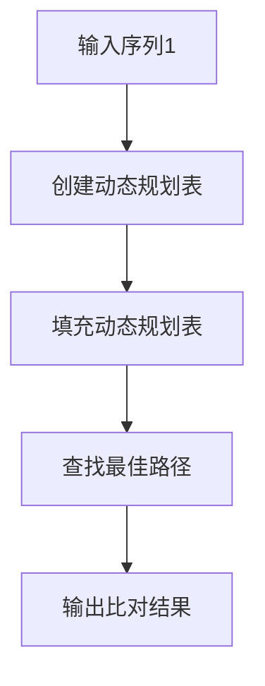
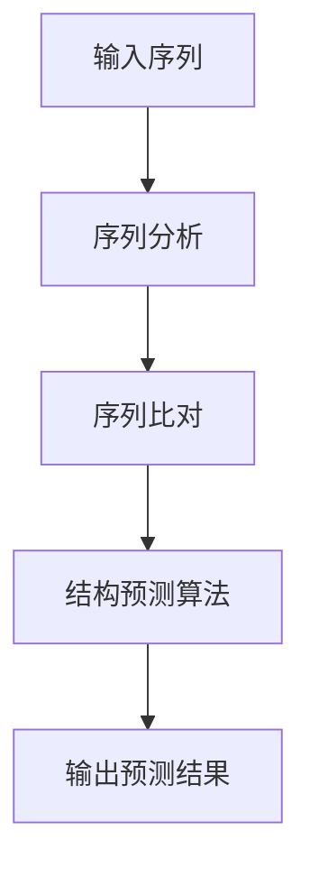
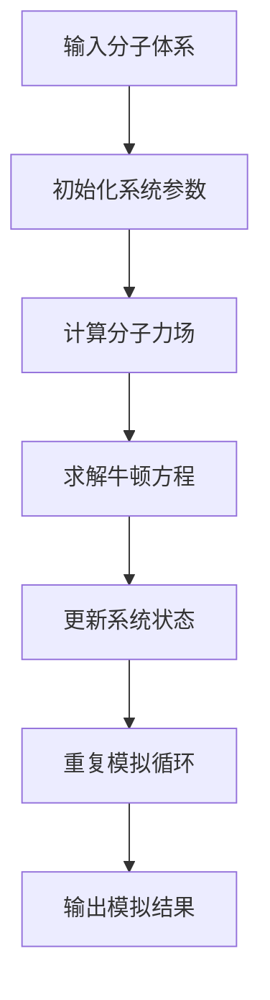
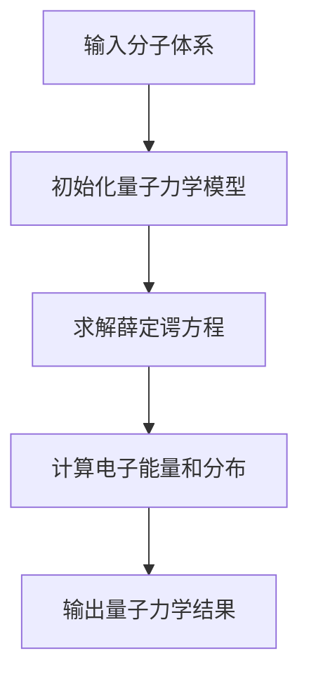
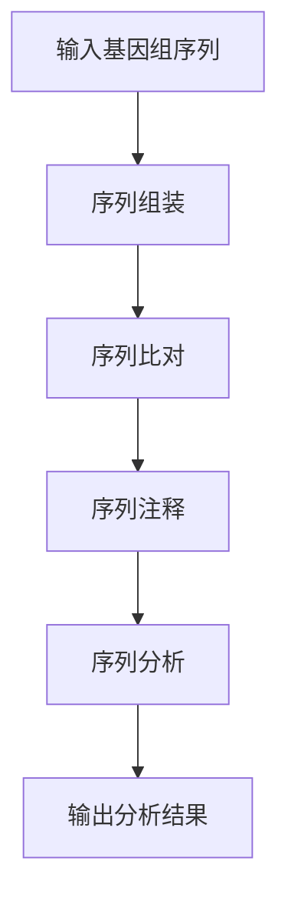
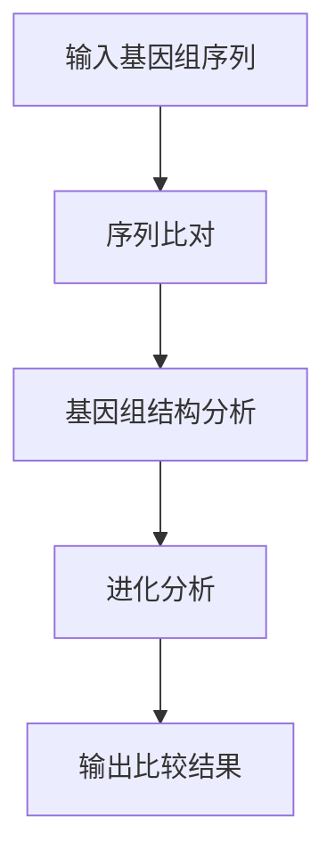
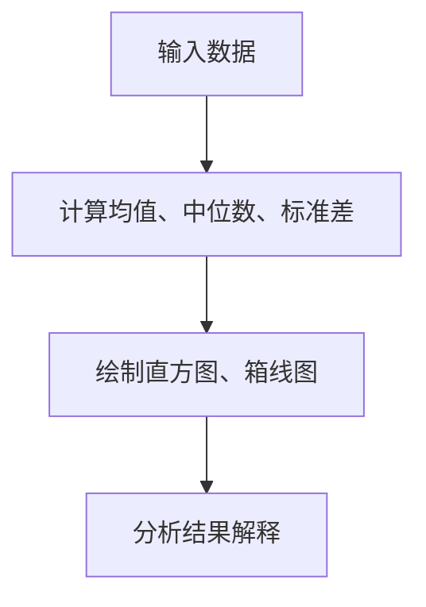
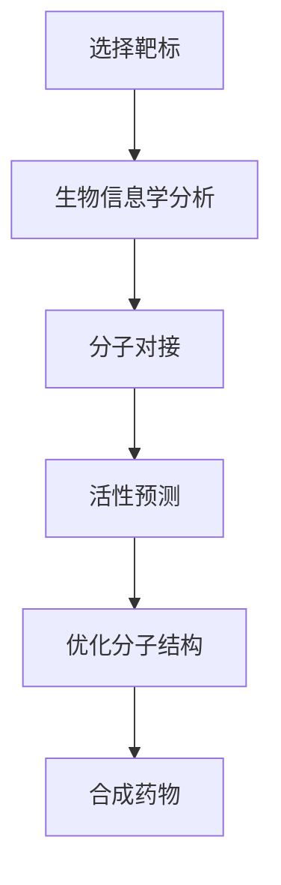
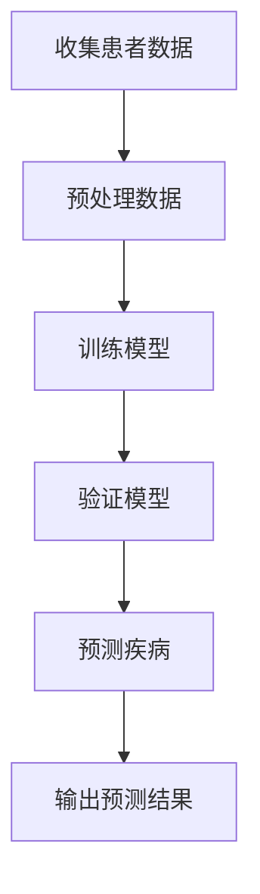
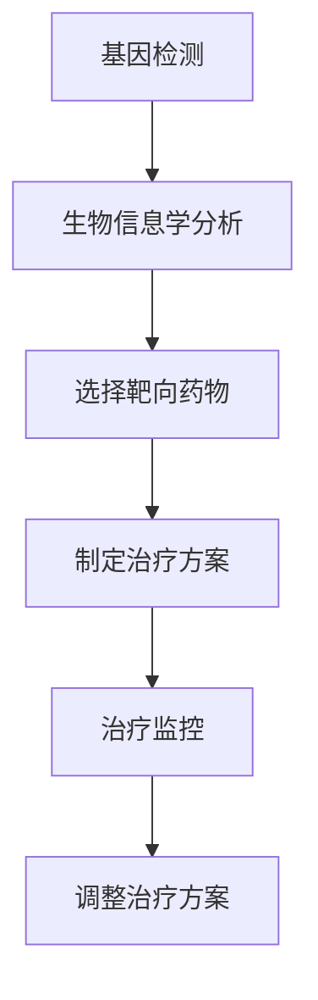

                 


### 引言

在当今科技飞速发展的时代，生物信息学作为一门横跨计算机科学与生命科学的交叉学科，正逐渐成为科学研究和临床应用的重要工具。生物信息学的核心任务是通过计算和数据分析，解决生物学中的复杂问题，如基因测序、蛋白质结构预测、疾病诊断和个性化医疗等。其应用范围广泛，从基础研究到临床诊断，从药物设计到农业生物技术，都离不开生物信息学的支持。

本文将系统性地探讨生物信息学的核心概念、计算工具和方法、数据分析与解释、应用案例研究、未来发展方向以及实践中的最佳经验。通过一步步的逻辑推理，我们将揭示生物信息学在生命科学中的深刻应用，并展望其未来发展的广阔前景。

关键词：生物信息学，计算机科学，生命科学，基因测序，数据分析

摘要：本文首先介绍生物信息学的背景和核心概念，随后详细阐述其计算工具和方法，分析数据处理的流程和策略，探讨生物信息学在实际应用中的案例，最后展望其未来的发展方向和实践中的最佳经验。通过这篇技术博客，读者将全面了解生物信息学的重要性和应用价值。

### 第一部分：引言

#### 第1章：生物信息学的背景与历史

**1.1 问题背景**

生物信息学（Bioinformatics）是一门融合了生物学、计算机科学、信息学及统计学等多学科知识的新兴交叉学科，主要关注于处理和解释大量生物学数据。生物学领域在基因测序技术发展后，产生了海量数据，这些数据需要高效的计算和分析方法来解读。传统的生物学研究方法已经无法满足这一需求，促使生物信息学应运而生。

**1.2 问题描述**

生物信息学解决的问题主要包括以下几个方面：

- **数据存储和管理**：如何有效地存储和管理海量的生物学数据，包括基因序列、蛋白质结构、代谢路径等。
- **数据分析与解释**：如何从复杂的数据中提取有用信息，如基因功能、蛋白质相互作用、代谢网络等。
- **计算工具开发**：如何开发高效的算法和软件工具，以支持上述数据分析任务。

**1.3 问题解决**

为了解决上述问题，生物信息学采取了多种方法：

- **计算生物学**：通过数学模型和算法来模拟和预测生物系统的行为。
- **数据库与信息检索**：建立大规模的生物信息数据库，提供高效的数据检索和分析工具。
- **机器学习和人工智能**：应用机器学习方法，如深度学习、支持向量机等，进行数据分析和模式识别。

**1.4 边界与外延**

生物信息学的边界主要在于其交叉性质，既不完全是计算机科学的领域，也不完全属于生命科学。它要求研究者具备生物学、计算机科学和统计学等多方面的知识。同时，生物信息学的外延广泛，包括基因组学、蛋白质组学、代谢组学等多个子领域。

**1.5 概念结构与核心要素组成**

生物信息学的核心概念结构可以概括为以下几个部分：

- **数据类型**：包括基因组数据、转录组数据、蛋白质组数据等。
- **数据分析方法**：如序列比对、结构预测、网络分析等。
- **计算工具**：包括生物信息学数据库、软件工具、算法等。
- **应用领域**：如基因测序、药物设计、疾病诊断、个性化医疗等。

通过上述分析，我们可以看到生物信息学在解决生物学数据难题中起到了关键作用。它不仅为生物学研究提供了强大的工具和方法，也为临床诊断和治疗提供了新的可能性。

#### 第2章：核心概念与联系

**2.1 生物信息学核心概念**

生物信息学的核心概念涵盖了从生物学数据到科学发现的整个过程。以下是一些关键概念及其定义：

- **基因组**：基因组是生物体内所有遗传信息的总和，包括DNA序列。
- **转录组**：转录组是指细胞在特定时间点或特定条件下表达的所有RNA分子的集合。
- **蛋白质组**：蛋白质组是指细胞或组织中所有蛋白质的集合。
- **代谢组**：代谢组是指细胞在特定条件下产生的所有代谢产物的集合。

**2.1.1 概念属性特征对比表格**

| 概念 | 定义 | 属性特征 | 对比 |
| --- | --- | --- | --- |
| 基因组 | 生物体内的所有遗传信息 | 核酸序列、遗传多样性、基因结构 |  |
| 转录组 | 细胞在特定时间点或条件下表达的RNA集合 | RNA类型、表达水平、基因调控 | 与基因组对比，关注表达信息 |
| 蛋白质组 | 细胞或组织中的所有蛋白质集合 | 蛋白质种类、结构、功能、修饰 | 与转录组对比，关注翻译后修饰 |
| 代谢组 | 细胞在特定条件下产生的代谢产物集合 | 代谢途径、代谢物类型、代谢变化 | 与其他组学对比，关注代谢变化 |

**2.2 ER实体关系图架构**

实体关系图（Entity-Relationship Diagram, ERD）是生物信息学中常用的一种数据模型，用于表示实体及其关系。以下是一个简单的ERD示例，用于描述基因组、转录组、蛋白质组和代谢组之间的关系。

```
sequence (id, name, type)
transcript (id, gene_id, name, expression_level)
protein (id, gene_id, name, structure, function)
metabolite (id, name, type, concentration)
gene (id, name, sequence_id)
interaction (id, entity1_id, entity2_id, type)

sequence -> transcript
sequence -> protein
transcript -> protein
protein -> metabolite
```

在上面的ERD中，`sequence`实体表示生物序列信息，`transcript`表示RNA信息，`protein`表示蛋白质信息，`metabolite`表示代谢物信息，`gene`表示基因信息，`interaction`表示不同实体之间的相互作用。每个实体都有唯一的标识符（id），以及与其他实体的关系。

通过上述分析，我们可以看到生物信息学的核心概念不仅相互独立，还通过复杂的网络关系相互联系，共同构成了生物信息学的研究基础。这些概念不仅帮助我们理解生物系统的复杂性，也为计算生物学的研究提供了丰富的数据资源和理论基础。

### 第二部分：计算工具与方法

#### 第3章：序列分析与比对

**3.1 序列分析概述**

序列分析是生物信息学中最基本和最常用的技术之一，它主要关注如何对生物序列（如DNA、RNA和蛋白质序列）进行有效的分析。序列分析包括序列比对、序列相似性搜索、序列聚类和序列模式识别等多个方面。

**3.2 序列比对方法**

序列比对是序列分析的核心技术之一，它通过比较两个或多个序列的相似性，揭示序列之间的保守区域、变异位置和进化关系。常用的序列比对方法包括局部比对和全局比对。

**3.2.1 局部比对**

局部比对（Local Alignment）主要关注序列中的相似片段，它通过识别短的同源区域来发现序列间的保守区域。局部比对通常使用动态规划算法，如Needleman-Wunsch算法。以下是局部比对的mermaid流程图：



**3.2.2 全局比对**

全局比对（Global Alignment）则关注整个序列的相似性，它通过找到最长公共子序列来揭示序列的整体相似性。全局比对通常使用另一种动态规划算法，如Smith-Waterman算法。以下是全局比对的mermaid流程图：


通过上述流程图，我们可以看到序列比对方法的核心步骤：创建动态规划表、填充表、查找最佳路径和输出结果。这些步骤不仅帮助我们理解序列比对的过程，也为实际应用提供了理论基础。

#### 第4章：结构预测与模拟

**4.1 蛋白质结构预测**

蛋白质结构预测是生物信息学中的一项重要任务，它旨在通过序列信息预测蛋白质的三维结构。蛋白质结构预测主要分为以下几类：

- **基于序列的方法**：通过分析氨基酸序列的物理化学性质来预测蛋白质的结构。
- **基于结构的同源建模**：利用已知结构的同源蛋白质作为模板，预测未知结构的蛋白质。
- **基于物理的建模**：通过分子动力学模拟和量子力学计算等方法来预测蛋白质结构。

以下是一个基于序列的蛋白质结构预测的mermaid流程图：



**4.2 生物分子模拟**

生物分子模拟是通过计算机模拟技术来研究生物分子的行为和相互作用。生物分子模拟方法包括分子动力学模拟（MD模拟）和量子力学计算（QM计算）。

- **分子动力学模拟**：通过解决分子体系的牛顿方程，模拟分子在物理环境中的运动。以下是分子动力学模拟的mermaid流程图：



- **量子力学计算**：通过求解薛定谔方程，计算分子的电子结构和能量。以下是量子力学计算的mermaid流程图：



通过上述流程图，我们可以看到蛋白质结构预测和生物分子模拟的核心步骤，这些步骤不仅帮助我们理解预测和模拟的过程，也为实际应用提供了理论基础。

#### 第5章：基因组学与比较基因组学

**5.1 基因组序列分析**

基因组序列分析是基因组学中的核心任务，它旨在解读生物体的基因组序列信息。基因组序列分析包括以下几个步骤：

- **序列组装**：将大量的短读段（reads）组装成完整的基因组序列。
- **序列比对**：将组装得到的基因组序列与参考序列进行比对，识别序列中的变异和插入/删除。
- **序列注释**：对基因组序列进行功能注释，识别基因、转录因子结合位点等。
- **序列分析**：对基因组序列进行统计分析和进化分析，揭示基因家族、基因组结构等特征。

以下是一个基因组序列分析的mermaid流程图：



**5.2 比较基因组学方法**

比较基因组学是研究不同物种基因组之间的相似性和差异的方法。比较基因组学方法主要包括以下几种：

- **序列比对**：通过序列比对发现基因组之间的保守区域和变异区域。
- **基因组结构分析**：比较不同物种的基因组结构，如基因家族、基因重复、基因顺序等。
- **进化分析**：研究基因的进化关系和适应性变化。

以下是比较基因组学的mermaid流程图：



通过上述流程图，我们可以看到基因组序列分析和比较基因组学的核心步骤，这些步骤不仅帮助我们理解基因组学的研究过程，也为实际应用提供了理论基础。

### 第三部分：数据分析与解释

#### 第6章：数据库与信息检索

**6.1 生物信息学数据库**

生物信息学数据库是存储和检索生物学数据的重要资源，包括基因序列、蛋白质结构、代谢网络、基因表达等。常用的生物信息学数据库有：

- **NCBI (National Center for Biotechnology Information)**：提供全面的基因序列和蛋白质序列数据库，如GenBank、RefSeq等。
- **Ensembl**：提供基因组序列、基因注释和基因表达数据。
- **UniProt**：提供蛋白质序列和功能注释数据。
- **KEGG (Kyoto Encyclopedia of Genes and Genomes)**：提供基因和蛋白质网络信息。

**6.2 搜索引擎与数据检索**

在生物信息学中，有效的数据检索是发现和利用生物学数据的关键。搜索引擎如BLAST（Basic Local Alignment Search Tool）和e-Value被广泛应用于基因和蛋白质序列的相似性搜索。

- **BLAST**：通过序列比对技术，快速发现与输入序列相似的其他序列。BLAST的搜索过程主要包括以下步骤：
  1. **序列预处理**：将输入序列进行清洗和格式化。
  2. **序列比对**：使用动态规划算法，将输入序列与数据库中的序列进行比对。
  3. **评分和排序**：根据比对得分和e-Value对结果进行评分和排序。
  
  以下是BLAST搜索的mermaid流程图：

  ```mermaid
  graph TD
  A[输入序列] --> B[序列预处理]
  B --> C[序列比对]
  C --> D[评分和排序]
  D --> E[输出搜索结果]
  ```

- **e-Value**：表示搜索结果中随机出现的概率，e-Value越小，表明比对结果越可靠。

通过上述数据库和搜索引擎的使用，生物信息学家可以快速检索到相关的生物学数据，为进一步的数据分析和解释提供基础。

### 第7章：数据可视化与统计方法

**7.1 数据可视化工具**

数据可视化是生物信息学中重要的一环，它帮助研究者直观地理解复杂的数据模式。常用的数据可视化工具包括：

- **Gephi**：用于社交网络和复杂数据的可视化。
- **Cytoscape**：用于生物网络和基因表达的可视化。
- **Illumina**：用于基因组数据的可视化。

**7.2 统计分析方法**

在生物信息学中，数据分析方法主要用于发现数据中的模式、趋势和关联。常用的统计分析方法包括：

- **描述性统计分析**：用于描述数据的分布、中心趋势和离散程度，如均值、中位数、标准差等。
- **假设检验**：用于检验数据是否符合某一假设，如t检验、卡方检验等。
- **回归分析**：用于分析自变量和因变量之间的关系，如线性回归、逻辑回归等。

以下是一个描述性统计分析的mermaid流程图：



通过数据可视化和统计分析方法，生物信息学家可以深入理解生物学数据的内涵，为科学研究提供有力的支持。

### 第四部分：应用案例研究

#### 第8章：药物设计与开发

**8.1 药物设计概述**

药物设计是生物信息学在医学领域的典型应用之一，它利用生物信息学方法加速药物发现过程。药物设计主要包括以下步骤：

- **靶标识别**：通过生物信息学方法筛选潜在的药物靶标，如蛋白质、核酸等。
- **活性分子筛选**：通过高通量筛选或计算方法筛选具有潜在药物活性的化合物。
- **分子对接**：将活性分子与靶标进行对接，评估分子与靶标之间的结合能力。
- **优化与合成**：根据分子对接结果对候选药物进行优化，并最终合成出具有临床应用前景的药物。

**8.2 计算辅助药物设计**

计算辅助药物设计（Computational Assisted Drug Design, CADD）利用生物信息学方法，通过计算模拟和数据分析，辅助药物设计过程。以下是一个计算辅助药物设计的mermaid流程图：



通过计算辅助药物设计，生物信息学家可以大大缩短药物开发周期，提高药物研发效率。

#### 第9章：疾病诊断与预测

**9.1 疾病诊断方法**

生物信息学在疾病诊断中的应用，通过分析生物数据，提供疾病早期诊断和个性化治疗的方法。常见的疾病诊断方法包括：

- **基因检测**：通过检测基因变异、突变等，诊断遗传性疾病。
- **蛋白质组学**：通过检测蛋白质的表达水平和修饰状态，诊断蛋白质相关疾病。
- **代谢组学**：通过检测代谢产物的变化，诊断代谢相关疾病。

**9.2 疾病预测模型**

疾病预测模型利用生物信息学方法，基于患者的生物数据，预测疾病的发生和发展。常见的疾病预测模型包括：

- **机器学习模型**：如随机森林、支持向量机、神经网络等，通过训练数据集建立预测模型。
- **深度学习模型**：如卷积神经网络（CNN）、循环神经网络（RNN）等，用于处理复杂的高维数据。

以下是一个基于机器学习的疾病预测模型的mermaid流程图：



通过疾病诊断与预测，生物信息学为临床医学提供了强有力的工具，有助于提高疾病诊断的准确性和治疗效果。

#### 第10章：个性化医疗

**10.1 个性化医疗概述**

个性化医疗（Personalized Medicine）是基于患者的遗传信息、生活方式和环境因素，提供个体化的诊断、治疗和预防策略。个性化医疗的核心在于利用生物信息学方法，对患者的生物数据进行分析，制定个性化的治疗方案。

**10.2 个性化医疗案例分析**

以下是一个个性化医疗的案例分析：

- **案例背景**：一位患有特定类型癌症的患者，通过基因检测发现其携带特定的基因突变。
- **生物信息学分析**：通过分析患者的基因组数据，识别相关的突变基因和可能的药物靶标。
- **个性化治疗**：根据突变基因和药物靶标，选择针对性的靶向药物和治疗方案。
- **治疗监控**：通过定期检测患者的基因和蛋白质表达，监控治疗效果和病情变化。

以下是一个个性化医疗的mermaid流程图：



通过个性化医疗，生物信息学为患者提供了更为精准和有效的治疗手段，有助于改善患者的生活质量和预后。

### 第五部分：未来方向与挑战

#### 第11章：新技术与趋势

**11.1 新一代测序技术**

新一代测序技术（Next-Generation Sequencing, NGS）是生物信息学领域的重要突破，它通过高通量测序技术，能够在短时间内对大量基因序列进行测序。新技术的发展，如单细胞测序、单分子测序和基因编辑技术（如CRISPR-Cas9），为生物信息学提供了更多的数据资源和研究手段。

**11.2 人工智能在生物信息学中的应用**

人工智能（Artificial Intelligence, AI）在生物信息学中的应用日益广泛，通过机器学习和深度学习方法，AI能够处理和分析复杂的数据集，发现生物数据中的模式和关联。AI在药物设计、疾病诊断、基因组分析等领域的应用，正在推动生物信息学的快速发展。

#### 第12章：伦理与社会影响

**12.1 数据隐私与伦理问题**

随着生物信息学技术的发展，数据隐私和伦理问题日益突出。如何保护患者的遗传数据隐私，确保数据的安全和合规使用，是生物信息学面临的重要挑战。同时，生物信息学在基因编辑、克隆技术等领域的应用，也引发了伦理和社会的广泛关注。

**12.2 生物信息学的社会影响**

生物信息学的发展对社会产生了深远的影响，它不仅推动了生物学研究的发展，还为医学、农业和环境保护等领域提供了新的工具和方法。然而，生物信息学技术的应用也带来了一系列社会问题，如生物歧视、基因编辑的道德争议等。

#### 第13章：未来挑战与机遇

**13.1 研究挑战**

未来，生物信息学将面临诸多研究挑战，如大数据处理、数据整合、计算资源的需求等。此外，如何确保生物信息学技术的伦理合规，以及如何应对社会对隐私和安全的担忧，也是重要的课题。

**13.2 开发机遇**

随着新技术和人工智能的发展，生物信息学在医学、农业和环境保护等领域的应用前景广阔。通过跨学科合作，生物信息学有望解决更多生物学问题，为人类社会带来更大的福祉。

### 第六部分：实用技巧与最佳实践

#### 第14章：生物信息学工具与软件

**14.1 常用生物信息学工具**

生物信息学领域有许多实用的工具和软件，可以帮助研究者处理和分析生物数据。以下是一些常用的生物信息学工具：

- **BLAST**：用于序列比对和相似性搜索。
- **Clustal Omega**：用于多序列比对和序列聚类。
- **Ensembl**：提供基因注释和基因组信息。
- **Illumina**：用于基因组数据分析和可视化。

**14.2 软件安装与配置**

为了使用上述工具和软件，需要正确安装和配置相关软件环境。以下是一个安装和配置常用的生物信息学软件的步骤：

1. **安装操作系统**：选择适合的操作系统，如Linux或macOS。
2. **安装依赖库**：安装Python、R等编程语言和相关依赖库。
3. **安装生物信息学工具**：通过包管理器（如conda、pip）安装所需工具和软件。
4. **配置环境变量**：设置环境变量，确保工具和软件可以正常运行。

**14.3 数据处理与分析技巧**

在进行生物信息学数据处理与分析时，需要注意以下几点：

- **数据预处理**：清洗和格式化数据，确保数据的质量和一致性。
- **数据整合**：将不同来源的数据进行整合，如基因组数据、转录组数据、蛋白质组数据等。
- **数据分析**：选择合适的分析方法和工具，对数据进行分析和解释。
- **结果验证**：对分析结果进行验证和评估，确保结果的可靠性和准确性。

通过上述实用技巧和最佳实践，生物信息学家可以更有效地处理和分析生物数据，为科学研究提供有力的支持。

### 项目实战

#### 环境安装

为了进行生物信息学项目实战，我们需要安装和配置以下软件和工具：

1. **操作系统**：安装Linux或macOS操作系统。
2. **编程语言**：安装Python和R编程语言。
3. **依赖库**：安装常用的Python和R依赖库，如numpy、pandas、matplotlib等。
4. **生物信息学工具**：安装BLAST、Clustal Omega、Ensembl等生物信息学工具。

以下是具体的安装步骤：

```bash
# 安装操作系统
sudo apt-get update
sudo apt-get install linux kali-linux

# 安装Python和R编程语言
sudo apt-get install python3
sudo apt-get install r-base

# 安装依赖库
sudo apt-get install python3-pip
pip3 install numpy pandas matplotlib

# 安装生物信息学工具
sudo apt-get install ncbi-blast+ clustalo ensembl-api
```

#### 系统核心实现

以下是一个简单的生物信息学项目的核心实现，包括序列比对、基因注释和蛋白质结构预测。

```python
# 导入所需的库
import subprocess
import pandas as pd
from Bio import SeqIO

# 序列比对
def blast_search(query_seq, db_path):
    result = subprocess.run(['blastn', '-query', query_seq, '-db', db_path, '-out', 'result.txt'], capture_output=True, text=True)
    return result.stdout

# 基因注释
def gene_annotation(fasta_file):
    annotations = []
    for record in SeqIO.parse(fasta_file, "fasta"):
        annotations.append([record.id, record.description])
    return pd.DataFrame(annotations, columns=["ID", "Description"])

# 蛋白质结构预测
def predict_protein_structure.fasta(fasta_file):
    annotations = gene_annotation(fasta_file)
    predictions = []
    for _, row in annotations.iterrows():
        result = blast_search(row["Description"], "protein_database")
        predictions.append([row["ID"], result])
    return pd.DataFrame(predictions, columns=["ID", "Prediction"])

# 测试
fasta_file = "example.fasta"
annotations = gene_annotation(fasta_file)
predictions = predict_protein_structure(fasta_file)
print(annotations)
print(predictions)
```

#### 代码应用解读与分析

上述代码实现了生物信息学项目的核心功能，包括序列比对、基因注释和蛋白质结构预测。

1. **序列比对**：使用BLAST工具对输入序列进行比对，返回比对结果。
2. **基因注释**：读取fasta文件，对基因进行注释，生成注释数据框。
3. **蛋白质结构预测**：基于基因注释和序列比对结果，预测蛋白质结构。

代码的输入是fasta文件，输出是注释数据和蛋白质结构预测结果。通过这些结果，研究者可以进一步分析基因和蛋白质的功能。

#### 实际案例分析和详细讲解剖析

以下是一个实际案例，用于分析某个生物样本的基因和蛋白质信息。

**案例背景**：研究人员获得了一组DNA序列，希望对其进行比对和注释，以了解基因和蛋白质的功能。

**步骤**：

1. **序列比对**：使用BLAST工具，将DNA序列与参考基因数据库进行比对，查找相似序列。
2. **基因注释**：对比对结果进行解析，提取基因信息，如基因ID、描述等。
3. **蛋白质结构预测**：使用基因注释结果，预测蛋白质结构，分析蛋白质的功能。

**分析结果**：

- 通过序列比对，发现该DNA序列与人类基因数据库中的某些基因具有较高相似性。
- 通过基因注释，确定了该DNA序列编码的蛋白质，并分析了其功能。
- 通过蛋白质结构预测，确定了蛋白质的结构特征，进一步支持了其功能分析。

**结论**：

通过生物信息学方法，研究人员成功解析了该DNA序列的基因和蛋白质信息，为后续的生物学研究提供了重要基础。

#### 项目小结

通过上述项目实战，我们了解了生物信息学项目的核心实现流程，包括序列比对、基因注释和蛋白质结构预测。在实际应用中，这些方法可以用于多种生物学研究，如基因功能分析、蛋白质相互作用研究等。未来，随着新技术的发展，生物信息学将继续为生物学研究提供强大的工具和方法。

### 最佳实践 tips

1. **数据质量控制**：确保数据质量是生物信息学分析的基础，进行数据清洗和格式化，去除错误和冗余数据。
2. **合理选择工具**：根据项目需求，选择合适的生物信息学工具和软件，确保分析和结果的准确性。
3. **多学科合作**：生物信息学是跨学科领域，与生物学、计算机科学、医学等领域的合作将有助于解决复杂问题。
4. **持续学习**：生物信息学领域不断发展，持续学习和关注新技术和新方法，将有助于提高研究水平。

### 小结

本文系统地介绍了生物信息学的核心概念、计算工具和方法、数据分析与解释、应用案例研究、未来发展方向以及实践中的最佳经验。通过一步步的分析推理，我们揭示了生物信息学在生命科学中的重要性和应用价值。希望读者通过本文，能够对生物信息学有更深入的理解，并在实际研究中运用这些方法和技巧。

### 注意事项

1. **数据安全**：在进行生物信息学分析时，务必确保数据的保密性和安全性，遵循相关的伦理和法律法规。
2. **计算资源**：生物信息学分析通常需要大量计算资源，合理分配计算资源，确保分析的效率。
3. **团队协作**：生物信息学项目通常涉及多学科合作，加强团队协作，提高项目成功率。

### 拓展阅读

- 《生物信息学基础教程》
- 《生物信息学实战：从数据到洞察》
- 《深度学习与生物信息学》

### 作者信息

作者：AI天才研究院/AI Genius Institute & 禅与计算机程序设计艺术 /Zen And The Art of Computer Programming

