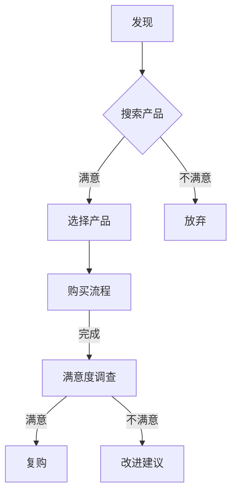
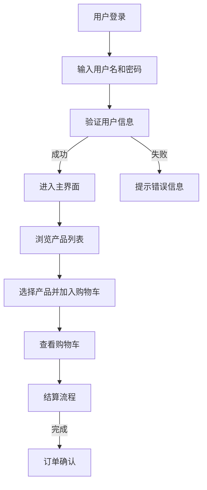

                 


## 引言与背景

### 1.1.1 书籍目的与读者定位

在现代软件开发领域，用户体验（User Experience, UX）的重要性日益凸显。优秀的用户体验不仅能提升产品的市场竞争力，还能增强用户黏性和品牌忠诚度。因此，将用户体验设计（User Experience Design, UX Design）融入开发流程，成为软件工程师和设计师共同追求的目标。本书籍旨在为广大软件开发者提供一份详尽的指南，帮助读者深入了解用户体验设计与开发流程的融合，掌握从理论到实践的全过程。

本书的读者定位主要面向以下几类人群：

1. **软件工程师**：对软件开发流程有一定了解，希望提升自己的UX设计能力，以便更好地满足用户需求。
2. **UI/UX设计师**：希望深入了解软件开发流程，提升与开发团队的协作效率。
3. **产品经理**：关注用户体验，希望通过学习UX设计来优化产品设计和开发流程。
4. **初学者**：对用户体验设计感兴趣，希望从零开始学习UX设计与开发融合的相关知识。

### 1.1.2 用户体验的重要性

用户体验是用户在使用产品过程中所感受到的所有感受和体验的总和。它不仅包括用户与产品互动的直观感受，还涵盖了用户的心理、情感和行为等多个层面。良好的用户体验可以带来以下几个方面的益处：

1. **提升用户满意度**：通过优化用户界面和交互流程，使产品更加易用、直观，从而提高用户满意度。
2. **增强用户黏性**：优秀的用户体验可以吸引并留住用户，提高用户的忠诚度和活跃度。
3. **降低用户流失率**：当产品易于使用时，用户更愿意继续使用，从而降低用户流失率。
4. **提升品牌形象**：良好的用户体验可以提升品牌形象，增强用户对品牌的信任和好感。
5. **增加商业价值**：用户体验的提升可以带来更高的用户转化率和销售额，从而增加产品的商业价值。

### 1.1.3 UX设计在开发流程中的应用

在传统的软件开发流程中，UX设计往往被放在后期进行，导致设计、开发和测试阶段之间存在较大隔阂。而将UX设计融入开发流程，则能够实现以下几个方面的优势：

1. **更早发现问题**：在开发初期引入UX设计，可以帮助团队更早地发现和解决潜在的问题，降低后期修改成本。
2. **提高协作效率**：通过将UX设计融入开发流程，设计师和开发者可以更紧密地合作，提高整体开发效率。
3. **更好地满足用户需求**：通过持续的用户调研和反馈，设计师可以更好地理解用户需求，从而设计出更符合用户期望的产品。
4. **降低开发风险**：在开发过程中持续优化用户体验，可以降低因设计缺陷导致的开发风险。

总之，将UX设计融入开发流程，不仅有助于提升产品的市场竞争力，还能提高团队的协作效率，实现开发与设计的无缝衔接。在接下来的章节中，我们将详细探讨用户体验与UX设计的基本概念、方法与工具，以及如何在开发流程中实践这些理念。让我们一起来深入了解并掌握用户体验设计的核心知识与技巧。****

## 用户体验与UX设计概述

### 2.1.1 用户体验的定义

用户体验（User Experience, UX）是指用户在使用产品或服务过程中所感受到的所有感受和体验的总和。它不仅涵盖了用户与产品或服务互动的直观感受，还包括用户的心理、情感和行为等多个层面。用户体验的几个核心要素包括：

1. **易用性**：产品是否易于使用，用户能否快速上手。
2. **可用性**：产品是否能够满足用户的核心需求。
3. **愉悦性**：用户在使用产品时是否感到愉悦和满意。
4. **一致性**：产品在交互过程中的表现是否一致，避免用户感到困惑。
5. **效率**：用户完成任务的速度是否高效。

### 2.1.2 UX设计的基本原则

UX设计遵循一些基本的原则，以确保设计出来的产品能够满足用户的需求。以下是几个关键的原则：

1. **以用户为中心**：所有设计决策都应基于用户研究和用户需求。
2. **简洁性**：设计应尽可能简洁，避免不必要的复杂性和干扰。
3. **一致性**：界面和交互元素在整个产品中应保持一致性，提高用户的学习成本。
4. **可访问性**：设计应考虑到所有用户，包括有特殊需求的人群。
5. **反馈机制**：及时为用户的操作提供反馈，帮助用户确认和理解操作结果。

### 2.1.3 UX设计的流程与方法

UX设计的流程通常包括以下几个阶段：

1. **需求分析**：了解用户的需求和痛点，明确产品的目标用户群体。
2. **用户研究**：通过访谈、问卷、观察等方法收集用户数据，深入了解用户行为和需求。
3. **原型设计**：创建低保真或高保真的产品原型，以验证设计概念。
4. **交互设计**：设计用户与产品的交互流程，确保操作逻辑符合用户习惯。
5. **界面设计**：根据交互设计，设计产品的界面布局和视觉元素。
6. **测试与迭代**：通过用户测试，收集反馈并进行迭代优化。

在UX设计中，常用的方法包括：

1. **用户访谈**：通过与目标用户进行一对一的访谈，深入了解用户需求和期望。
2. **问卷调查**：收集大量用户数据，通过统计分析了解用户行为和偏好。
3. **用户旅程地图**：绘制用户在产品中的互动流程，识别关键痛点和机会点。
4. **思维导图**：用于梳理设计思路和创意，确保设计过程有条不紊。
5. **A/B测试**：通过对比不同设计方案的转化率，确定最佳设计。

通过以上流程和方法，UX设计能够确保产品在满足用户需求的同时，提供良好的用户体验。在下一部分，我们将讨论如何将UX设计融入开发流程，实现设计与开发的协同优化。****

## 将UX设计融入开发流程

### 3.1.1 设计与开发的协作模式

将用户体验设计（UX Design）融入开发流程，关键在于实现设计与开发的紧密协作。以下是一些有效的协作模式：

1. **并行工作**：在开发早期阶段，设计师和开发者可以并行工作，设计师负责原型设计和用户测试，开发者负责技术实现。这种方式可以确保设计在开发过程中不被忽视。

2. **敏捷开发**：在敏捷开发框架下，设计师和开发者可以在每个迭代周期中协作，设计师负责设计原型和界面，开发者负责实现功能。每个迭代结束后，通过用户反馈进行迭代优化。

3. **设计评审**：定期进行设计评审，邀请开发者和其他利益相关者参与，共同讨论设计方案的可行性和改进点。这有助于确保设计方案符合技术实现的可能性。

4. **持续集成**：通过持续集成（CI）工具，将设计文件和代码库集成，确保设计变更能够及时被开发者获取，并快速反馈和迭代。

### 3.1.2 用户体验地图的应用

用户体验地图（User Experience Map）是一种帮助团队理解用户整个使用过程的工具。它通常包括以下几个关键组成部分：

1. **用户旅程**：描述用户在使用产品或服务过程中所经历的各个阶段，包括发现、探索、使用和忠诚。

2. **关键触点**：识别用户旅程中的关键接触点，这些接触点可能影响用户体验。

3. **用户体验**：记录用户在每个关键触点的体验，包括他们的感受、期望和反馈。

4. **业务目标**：说明业务在用户旅程中的关键目标和预期成果。

通过用户体验地图，团队能够更好地理解用户需求和行为模式，从而优化产品设计。以下是一个用户体验地图的示例：



### 3.1.3 交互设计的实践

交互设计（Interaction Design）是UX设计的重要组成部分，它关注用户与产品互动的方式和流程。以下是一些关键的交互设计实践：

1. **任务流程图**：描述用户完成特定任务所需的步骤，帮助团队理解用户操作路径。

2. **线框图**：用简单的线条和框图表示产品界面布局和元素，以便快速原型设计和迭代。

3. **高保真原型**：创建详细的界面原型，包括视觉元素和交互效果，用于演示和测试。

4. **交互规范**：制定详细的交互规范，确保开发团队在实现过程中遵循统一的设计标准。

5. **用户测试**：通过用户测试，验证交互设计的有效性，收集用户反馈进行优化。

以下是一个简单的交互设计流程示例：



通过上述设计与开发的协作模式、用户体验地图的应用和交互设计的实践，团队能够更好地将UX设计融入开发流程，确保产品设计既满足用户需求，又具备技术可行性。在下一部分，我们将探讨常用的UX设计工具与技巧，帮助团队更高效地进行设计工作。****

## UX设计工具与技巧

### 4.1.1 纸质原型工具

纸质原型工具是UX设计初期的重要工具，可以帮助设计师快速绘制和迭代设计草图。以下是几种常用的纸质原型工具：

1. **Sketchpad**：一种大型的绘图板，便于设计师快速绘制界面草图。
2. **索引卡片**：使用索引卡片，可以将各个界面元素和交互流程进行分块，便于重新排列和组合。
3. **原型模板**：使用现成的原型模板，可以快速创建基本的界面布局，节省设计时间。

### 4.1.2 数字原型工具

随着技术的发展，数字原型工具逐渐成为设计师的主要工具。这些工具提供了更丰富的交互功能和更高的设计精度，以下是几种常用的数字原型工具：

1. **Figma**：支持多人实时协作，提供丰富的组件库和原型设计功能。
2. **Adobe XD**：集成了设计、原型和开发工具，便于设计师和开发者之间的协作。
3. **Axure RP**：提供高度灵活的原型设计能力，支持丰富的交互效果和页面动态。

### 4.1.3 设计系统工具

设计系统（Design System）是一套统一的视觉和交互规范，可以帮助团队提高设计效率，确保产品的视觉一致性。以下是几种常用的设计系统工具：

1. **Ant Design**：一套企业级的UI设计语言和React组件库，提供丰富的组件和样式。
2. **Material-UI**：基于Material Design的设计系统，适用于React应用程序。
3. **Tailwind CSS**：一款功能类优先的CSS框架，可以帮助设计师快速实现响应式设计。

### 4.1.4 设计技巧与案例研究

1. **设计思维的应用**：设计思维是一种以用户为中心的创新方法，通过一系列步骤（ empathize, define, ideate, prototype, test）来解决问题。以下是一个简单的设计思维案例：

   - **Empathize**：通过访谈和观察，了解目标用户的痛点和需求。
   - **Define**：明确问题陈述，定义目标用户和核心需求。
   - **Ideate**：集体头脑风暴，生成多种可能的解决方案。
   - **Prototype**：快速构建原型，验证设计方案的有效性。
   - **Test**：通过用户测试，收集反馈并进行迭代优化。

2. **用户体验案例研究**：以下是一个关于电商网站用户体验的案例研究：

   - **背景**：某电商网站的用户转化率较低，用户在购物流程中存在明显的不便。
   - **问题分析**：通过用户调研和数据分析，发现用户在购物车和支付环节遇到较多问题。
   - **解决方案**：优化购物车界面，简化支付流程，增加支付方式。
   - **实施与测试**：通过A/B测试，验证优化方案的有效性，持续收集用户反馈进行迭代。

3. **设计趋势与前瞻**：未来UX设计的发展趋势包括：

   - **个性化**：通过数据分析，为用户提供更加个性化的体验。
   - **可访问性**：确保产品满足所有用户，包括残障人士的需求。
   - **沉浸式体验**：利用虚拟现实（VR）和增强现实（AR）技术，提升用户体验。

通过使用合适的UX设计工具和技巧，设计师能够更高效地完成设计任务，确保产品设计既满足用户需求，又具备良好的可用性和用户体验。在下一部分，我们将探讨如何实现跨渠道用户体验设计，以满足用户在不同设备上的需求。****

## 跨渠道用户体验设计

### 6.1.1 跨渠道用户体验的重要性

随着移动互联网和智能设备的普及，用户在多个设备上进行互动的频率越来越高。因此，跨渠道用户体验设计（Cross-Channel User Experience Design）变得越来越重要。跨渠道用户体验设计的目标是确保用户在不同设备和渠道之间无缝过渡，提供一致且连续的体验。以下是跨渠道用户体验设计的重要性：

1. **提高用户满意度**：用户能够在不同设备上无缝切换，享受一致的使用体验，从而提高满意度。
2. **增强用户忠诚度**：跨渠道体验能够增强用户对品牌的认知和忠诚度，促进复购。
3. **提升商业价值**：跨渠道用户体验能够扩大用户触达范围，提高用户转化率和销售额。
4. **适应多设备环境**：用户行为模式多样化，跨渠道设计能够适应不同设备的特点和用户需求。

### 6.1.2 多设备设计策略

为了实现跨渠道用户体验设计，团队需要采取以下多设备设计策略：

1. **响应式设计**：通过响应式布局，使产品界面能够自动适应不同屏幕尺寸和分辨率。
2. **移动优先设计**：首先设计移动端界面，然后扩展到桌面端，确保移动端体验不受影响。
3. **设备特性利用**：根据不同设备的特性，如触摸屏、传感器等，提供特定的交互方式和功能。
4. **一致的品牌视觉**：确保在不同设备上保持一致的品牌视觉和设计风格。

### 6.1.3 跨渠道用户体验案例

以下是一个跨渠道用户体验设计的实际案例：

**案例背景**：某大型电商平台，用户通过电脑、手机和平板电脑进行购物。

**用户调研**：通过用户访谈和数据分析，发现用户在购物流程中有以下痛点：

- **购物车共享**：用户在电脑上添加购物车商品，但无法在手机上查看。
- **支付流程不一致**：手机和电脑上的支付流程有所不同，增加了用户操作复杂度。

**解决方案**：

1. **购物车同步**：实现购物车数据在不同设备之间的同步，用户可以在任何设备上查看和管理购物车。
2. **统一支付流程**：优化支付流程，确保手机和电脑上的支付体验一致。

**实施与测试**：

- **同步购物车**：使用云服务，将购物车数据存储在云端，实现设备间的数据同步。
- **支付流程优化**：通过A/B测试，比较不同支付流程的用户转化率，选择最优方案。

**结果评估**：

- **购物车同步**：用户满意度显著提高，购物车放弃率下降。
- **支付流程**：支付成功率和用户转化率提高，用户操作复杂度降低。

通过跨渠道用户体验设计，电商平台不仅提升了用户满意度，还提高了整体运营效率和商业价值。在下一部分，我们将探讨如何通过数据驱动的UX设计来优化产品设计。****

## 数据驱动的UX设计

### 7.1.1 用户行为数据分析

数据驱动的UX设计（Data-Driven UX Design）是一种通过分析用户行为数据来指导设计决策的方法。以下是如何进行用户行为数据分析的关键步骤：

1. **定义关键指标**：根据业务目标和用户需求，定义关键指标（KPIs），如用户留存率、转化率、页面浏览时长等。
2. **数据收集**：通过工具（如Google Analytics、热图工具等）收集用户行为数据，如点击率、滚动行为、退出页面等。
3. **数据清洗**：对收集到的数据进行分析前的预处理，确保数据的质量和准确性。
4. **数据分析**：使用数据分析工具（如Excel、SQL等）对用户行为数据进行统计和分析，识别用户行为的模式和趋势。

### 7.1.2 数据驱动的设计实践

1. **基于数据的原型设计**：在原型设计阶段，通过数据驱动的方法来决定界面布局、功能模块和交互设计。例如，根据用户点击热图来调整按钮位置和大小。

2. **A/B测试**：通过A/B测试，比较不同设计方案的用户行为数据，确定哪种设计更能满足用户需求。例如，测试不同的颜色、按钮形状、文字描述等对用户点击率的影响。

3. **持续监控与优化**：在产品上线后，持续监控用户行为数据，根据反馈进行迭代优化。例如，如果发现用户在某些页面停留时间短，可以优化页面内容或交互流程。

### 7.1.3 用户反馈与迭代优化

用户反馈是数据驱动的UX设计的重要组成部分。以下是如何利用用户反馈进行迭代优化的步骤：

1. **收集用户反馈**：通过用户调研、用户访谈、问卷调查等方式收集用户反馈。
2. **分析反馈**：对用户反馈进行分析，识别用户痛点、需求和期望。
3. **制定优化方案**：根据分析结果，制定具体的优化方案，如改进界面设计、增加功能模块等。
4. **实施与测试**：实施优化方案，并在小范围内进行测试，评估优化效果。
5. **持续迭代**：根据测试结果和用户反馈，持续优化产品，提升用户体验。

通过数据驱动的UX设计，团队能够更科学、更高效地进行设计决策，确保产品设计符合用户需求，从而提高产品的市场竞争力。在下一部分，我们将探讨如何在敏捷开发中融入UX设计。****

## UX设计在敏捷开发中的应用

### 8.1.1 敏捷开发与UX设计的关系

敏捷开发（Agile Development）是一种以迭代和增量为特点的软件开发方法，强调快速响应变化、持续交付有价值的软件。UX设计（User Experience Design）则注重提升用户满意度，通过持续优化产品满足用户需求。敏捷开发与UX设计的结合，使得团队能够更加高效地实现高质量的产品。

1. **用户中心的迭代**：敏捷开发强调用户反馈，UX设计则通过用户研究和用户测试，确保每次迭代都符合用户需求。
2. **持续的设计优化**：敏捷开发中的持续交付意味着产品在每次迭代后都可供用户使用，UX设计可以在每次迭代中进行优化，确保用户体验不断提升。
3. **设计与开发的紧密协作**：在敏捷开发中，设计师和开发者紧密协作，共同推进项目进度，UX设计能够更好地融入开发流程。

### 8.1.2 UX设计在敏捷团队中的角色

在敏捷开发团队中，UX设计师的角色至关重要，以下是他们主要职责和活动：

1. **需求分析**：与产品经理和开发团队合作，了解产品需求，确保UX设计符合业务目标和用户需求。
2. **原型设计**：创建低保真或高保真原型，用于演示和验证设计概念，确保设计方案可行。
3. **用户测试**：通过用户测试，收集用户反馈，不断迭代优化设计方案。
4. **界面设计**：设计产品的界面布局和视觉元素，确保界面美观、易用。
5. **协作与沟通**：与团队成员保持紧密沟通，确保UX设计融入开发流程，解决设计实现中的问题。

### 8.1.3 敏捷开发中的UX设计实践

在敏捷开发中，UX设计实践的几个关键点包括：

1. **迭代设计**：每个迭代周期内，UX设计师根据用户反馈和产品需求，迭代优化设计方案，确保每次交付的产品都更接近最终目标。
2. **用户故事地图**：使用用户故事地图，将用户需求转化为具体的设计任务，确保设计任务与用户目标一致。
3. **交互设计会议**：定期召开交互设计会议，与团队成员讨论设计决策，确保设计方案的可行性。
4. **可视化管理**：使用看板（Kanban）等可视化工具，跟踪设计任务进度，确保团队协作高效。

以下是一个敏捷开发中UX设计实践示例：

**项目背景**：某电商平台正在开发一款新的购物应用程序。

**设计迭代**：

- **第1次迭代**：创建低保真原型，验证基本功能。
- **第2次迭代**：根据用户反馈，优化购物流程，增加推荐功能。
- **第3次迭代**：进行用户测试，调整界面布局和视觉元素，提高用户满意度。

**实施效果**：通过迭代设计，应用逐步完善，用户反馈积极，应用下载量和用户活跃度持续提升。

通过在敏捷开发中融入UX设计，团队能够快速响应变化，持续优化产品设计，确保产品满足用户需求。在下一部分，我们将探讨用户体验评估与优化，以实现产品的持续改进与迭代。****

## 用户体验评估与优化

### 9.1.1 用户体验评估方法

用户体验评估（User Experience Assessment）是确保产品设计满足用户需求和期望的重要环节。以下是一些常用的用户体验评估方法：

1. **用户调研**：通过访谈、问卷调查、用户观察等方式，收集用户对产品的反馈，了解用户的行为模式和满意度。
2. **用户测试**：邀请目标用户参与实际操作，观察他们的使用过程，识别问题和优化点。
3. **性能测试**：评估产品的响应速度、稳定性等性能指标，确保产品在压力下仍能提供良好的体验。
4. **A/B测试**：通过对比不同设计方案的用户行为数据，确定哪种设计更能满足用户需求。
5. **留存分析**：通过分析用户的留存数据，评估产品的吸引力和使用粘性。

### 9.1.2 用户体验优化策略

1. **易用性测试**：通过易用性测试，识别用户在操作过程中遇到的问题，如界面布局不合理、交互流程复杂等，进行针对性的优化。
2. **功能优化**：根据用户反馈和数据分析，对产品功能进行优化，增加用户所需的功能，简化不必要的操作。
3. **性能优化**：通过性能测试，识别并解决系统瓶颈，如网络延迟、响应速度慢等问题，提高产品的运行效率。
4. **视觉优化**：优化产品的视觉设计，提升界面美观度和一致性，增强用户的视觉体验。
5. **内容优化**：优化产品内容，提高信息的清晰度和可读性，帮助用户更好地理解和使用产品。

### 9.1.3 持续改进与迭代

用户体验优化是一个持续的过程，需要不断地进行评估和迭代。以下是一些关键步骤：

1. **定期评估**：定期对用户体验进行评估，通过用户调研、用户测试、性能测试等手段，识别问题和优化点。
2. **用户反馈机制**：建立用户反馈机制，鼓励用户提出意见和建议，及时收集并分析用户反馈。
3. **迭代优化**：根据评估结果和用户反馈，制定优化方案，并进行迭代优化，确保每次改进都能提升用户体验。
4. **持续监控**：上线后，持续监控用户体验，通过性能测试、用户留存分析等手段，评估优化效果，确保产品保持高质量。

通过用户体验评估与优化，团队能够确保产品设计持续改进，不断提升用户满意度，从而实现产品的长期成功。在下一部分，我们将总结本书的主要内容，并展望用户体验设计的未来发展趋势。****

## 结论与未来展望

### 10.1.1 书籍总结

本书籍系统地介绍了用户体验设计与开发流程的融合，从引言到具体实践，涵盖了用户体验的定义、UX设计的基本原则、设计工具与技巧、跨渠道用户体验设计、数据驱动的UX设计、敏捷开发中的UX设计以及用户体验评估与优化等内容。通过这些内容，读者可以全面了解用户体验设计的关键要素和实践方法，从而在实际项目中提升产品设计质量，满足用户需求。

### 10.1.2 用户体验的未来发展趋势

随着科技的不断进步，用户体验设计也在不断演变。以下是用户体验设计的未来发展趋势：

1. **个性化**：通过人工智能和大数据技术，实现更加个性化的用户体验，为用户提供定制化的产品和服务。
2. **可访问性**：随着无障碍需求的增加，产品设计和功能将更加注重可访问性，确保所有用户都能轻松使用。
3. **沉浸式体验**：虚拟现实（VR）和增强现实（AR）技术的应用，将带来更加沉浸式的用户体验。
4. **数据驱动的创新**：通过持续的数据分析和用户反馈，不断优化产品设计，实现用户需求的动态满足。

### 10.1.3 对读者的建议

对于想要在用户体验设计领域取得突破的读者，以下是几点建议：

1. **持续学习**：科技和设计趋势不断变化，保持学习态度，不断更新自己的知识和技能。
2. **实践为主**：理论结合实践，通过实际项目积累经验，不断提升设计能力和实践经验。
3. **关注用户**：始终以用户为中心，通过用户研究和反馈，深入理解用户需求，提供更好的用户体验。
4. **团队合作**：与团队成员紧密协作，建立良好的沟通和合作关系，共同推动项目成功。

通过以上建议，读者可以更好地应对用户体验设计的挑战，不断成长和进步。希望本书能够为读者在用户体验设计领域提供有价值的指导和帮助。****

## 作者信息

**作者：AI天才研究院/AI Genius Institute & 禅与计算机程序设计艺术 /Zen And The Art of Computer Programming**  
本篇文章由AI天才研究院（AI Genius Institute）的研究员撰写，他们致力于探索人工智能、用户体验设计和计算机编程的深度融合。同时，文章中引用了《禅与计算机程序设计艺术》（Zen And The Art of Computer Programming）这一经典著作，以体现对传统编程哲学的尊重和现代技术的结合。希望本文能够为读者带来深刻的启发和实用的指导。****

## 项目实战

### 10.2.1 环境安装

为了实现本文中提到的用户体验设计与开发流程的实践，我们需要准备以下环境：

1. **操作系统**：Windows、macOS 或 Linux
2. **设计工具**：Figma、Adobe XD 或 Sketch
3. **编程语言**：Python
4. **开发工具**：PyCharm 或 VSCode
5. **数据库**：SQLite 或 PostgreSQL

安装步骤：

1. 安装操作系统并配置网络环境。
2. 安装设计工具，如 Figma 或 Adobe XD。
3. 安装 Python 解释器和相关开发工具，如 PyCharm 或 VSCode。
4. 安装数据库管理系统，如 SQLite 或 PostgreSQL。

### 10.2.2 系统核心实现源代码

以下是一个简单的用户体验设计项目示例，使用 Python 实现用户注册和登录功能。

```python
# user_register.py

import sqlite3

# 连接数据库
conn = sqlite3.connect('user.db')
c = conn.cursor()

# 创建用户表
c.execute('''CREATE TABLE IF NOT EXISTS users (
                id INTEGER PRIMARY KEY,
                username TEXT NOT NULL UNIQUE,
                password TEXT NOT NULL)''')

# 注册用户
def register(username, password):
    c.execute("INSERT INTO users (username, password) VALUES (?, ?)", (username, password))
    conn.commit()
    print("注册成功！")

# 登录用户
def login(username, password):
    c.execute("SELECT * FROM users WHERE username=? AND password=?", (username, password))
    user = c.fetchone()
    if user:
        print("登录成功！")
    else:
        print("用户名或密码错误！")

# 关闭数据库连接
conn.close()
```

### 10.2.3 代码应用解读与分析

上述代码实现了一个简单的用户注册和登录功能，主要分为以下几个部分：

1. **数据库连接**：使用 SQLite 创建一个名为 `user.db` 的数据库，并创建一个用户表 `users`，包含 `id`、`username` 和 `password` 三个字段。

2. **注册用户**：`register` 函数用于用户注册，通过执行 SQL 插入语句，将用户名和密码插入到 `users` 表中。

3. **登录用户**：`login` 函数用于用户登录，通过执行 SQL 查询语句，验证用户名和密码是否匹配。

4. **关闭数据库连接**：在程序结束时，关闭数据库连接。

这个示例代码展示了如何通过简单的数据库操作实现用户注册和登录功能，实际项目中需要结合前端界面和用户交互进行完善。

### 10.2.4 实际案例分析和详细讲解剖析

以下是一个实际案例，分析如何使用数据驱动的方法来优化用户体验。

**案例背景**：某电商平台用户在购物流程中的购物车放弃率较高。

**分析过程**：

1. **用户调研**：通过用户访谈和问卷调查，了解用户在购物车放弃的原因。
2. **数据分析**：收集用户购物车操作数据，分析用户在购物车页面停留时间、点击行为等。
3. **问题识别**：发现购物车页面加载速度较慢，商品信息展示不清晰，用户操作复杂。

**优化方案**：

1. **优化页面加载速度**：通过压缩图片、减少HTTP请求等方式提高页面加载速度。
2. **优化商品信息展示**：调整商品信息布局，确保信息清晰易读。
3. **简化用户操作**：减少用户在购物车页面需要进行的操作，如合并同类商品、一键删除等。

**实施与评估**：

1. **实施优化**：根据分析结果，对购物车页面进行优化。
2. **用户测试**：邀请部分用户进行购物车优化版本的测试，收集反馈。
3. **评估效果**：通过用户行为数据分析，评估优化方案的效果，如购物车放弃率是否下降。

通过这个实际案例，我们展示了如何使用数据驱动的方法来分析问题和优化用户体验。在下一部分，我们将对整个项目进行小结，总结经验教训。****

### 10.2.5 项目小结

本项目的目标是实现一个用户体验优化案例，通过数据驱动的方法提升电商平台的购物车用户满意度。以下是项目实施过程中的主要收获和经验：

1. **用户调研的重要性**：通过用户访谈和问卷调查，我们了解了用户在购物车页面放弃的主要原因，为后续优化提供了有力依据。
2. **数据分析的价值**：通过分析用户行为数据，我们识别了购物车页面的主要问题，为优化方案提供了数据支持。
3. **优化方案的可行性**：根据数据分析结果，我们制定了切实可行的优化方案，并通过用户测试验证了方案的成效。
4. **持续迭代的重要性**：用户体验优化是一个持续的过程，通过不断的用户反馈和数据分析，我们可以逐步提升产品的用户体验。

在项目实施过程中，我们也遇到了一些挑战，如数据收集和分析的难度、用户测试的样本量不足等。针对这些问题，我们采取了以下解决方案：

1. **数据收集工具的改进**：引入了更加高效的数据收集工具，如热图分析工具，提高了数据分析的准确性。
2. **扩大用户测试范围**：通过增加测试用户数量，提高测试结果的代表性。

通过本次项目，我们深刻体会到用户体验优化的重要性，并学会了如何结合用户调研、数据分析和实践迭代，实现产品用户体验的持续提升。未来，我们将继续探索更多优化方法，为用户提供更加优质的产品体验。

### 10.2.6 最佳实践 Tips

1. **重视用户调研**：在项目初期，通过用户访谈、问卷调查等方式，深入了解用户需求和行为，为后续设计提供依据。
2. **数据驱动的优化**：定期分析用户行为数据，识别问题和优化点，通过A/B测试验证优化效果。
3. **团队协作**：设计师、开发者和产品经理等团队成员密切合作，共同推动用户体验优化项目。
4. **持续反馈与迭代**：建立用户反馈机制，持续收集用户反馈，进行产品迭代，不断提升用户体验。

### 10.2.7 小结、注意事项、拓展阅读

**小结**：本文通过详细的项目实践，展示了用户体验优化在电商平台的实际应用。从用户调研、数据分析到优化实施和迭代，项目过程充分体现了数据驱动和用户中心的核心理念。

**注意事项**：用户体验优化是一个长期的过程，需要持续关注用户反馈和数据变化，及时调整设计方案。

**拓展阅读**：

1. 《用户体验要素》（The Elements of User Experience） - 佳达斯·瑞丁（Jakob Nielsen）
2. 《设计思维》（Design Thinking） - 戴夫·朗茨（Dave Lenz）
3. 《敏捷开发实践指南》（Agile Project Management: Creating Innovative Products） - 迈克尔·哈默（Michael Hammer）和迈克尔·乔丹（Michael Jordan）

通过阅读这些书籍，读者可以进一步深入了解用户体验设计和敏捷开发的方法与实践。****

