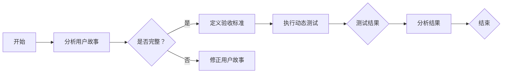
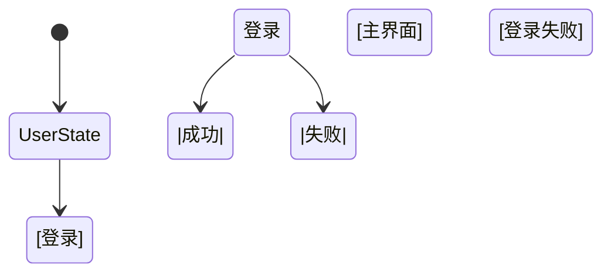
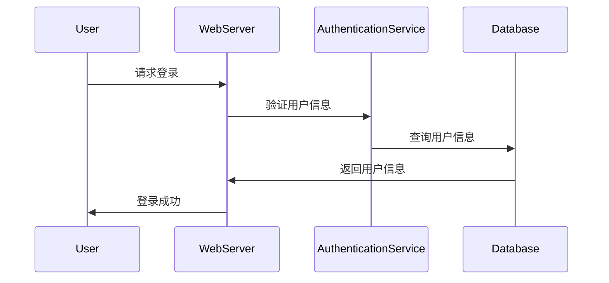
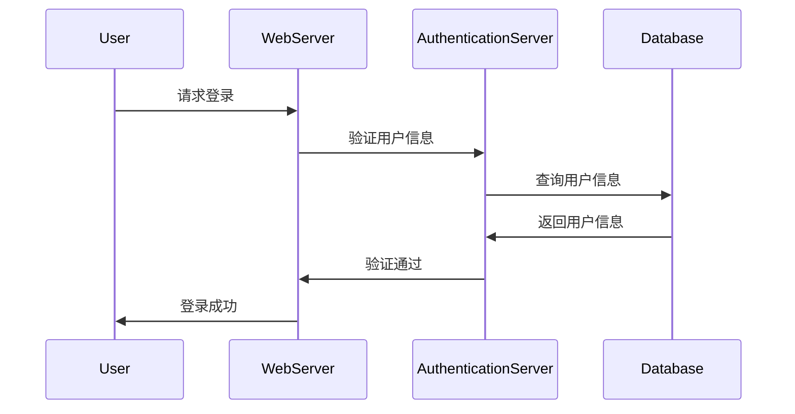
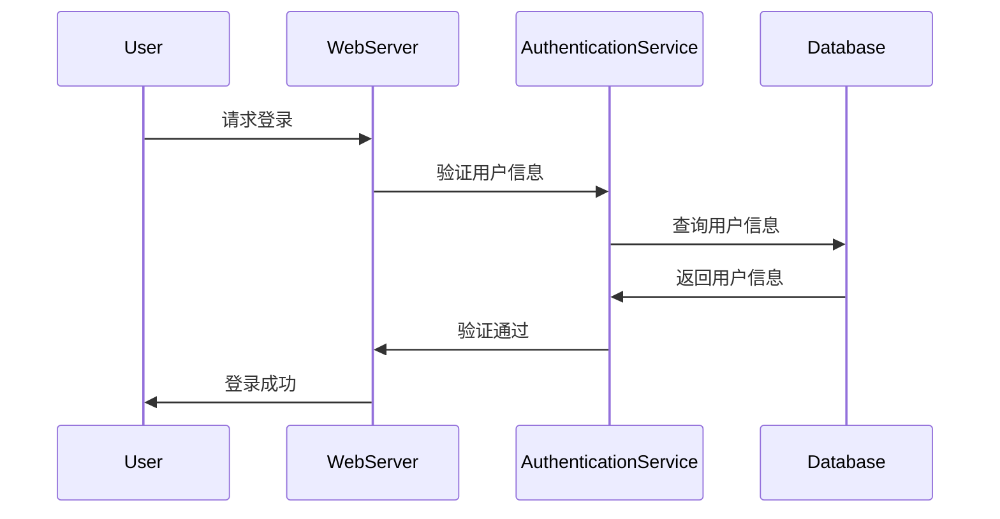

                 

# 第一部分：背景介绍

## 1.1 问题背景

### 1.1.1 问题描述

在软件开发中，用户故事（User Story）是一种用于捕捉用户需求和期望的实践方法。它描述了用户与产品交互的情境，是一种简短、易于理解的语言，通常以用户的角度来编写。用户故事的准确性对于确保软件产品的成功至关重要，因为它直接影响到产品的功能和用户体验。

然而，在实际开发过程中，如何验证用户故事的准确性成为一个难题。验证的目的是确保所开发的软件功能与用户需求一致，避免因需求理解偏差导致的开发错误或功能缺失。因此，本文将深入探讨如何验证用户故事的准确性。

### 1.1.2 问题解决

验证用户故事准确性的主要方法是确保需求分析的完整性、一致性、可测试性和可行性。具体步骤包括：

1. **需求评审**：通过团队内部和用户代表的需求评审，确保用户故事的准确性和完整性。
2. **验收标准**：为每个用户故事定义明确的验收标准，以便在开发完成后进行验证。
3. **测试**：使用自动化测试和手动测试来验证用户故事的功能。
4. **迭代反馈**：在开发过程中不断获取用户反馈，并根据反馈调整用户故事。

### 1.1.3 边界与外延

在探讨如何验证用户故事的准确性时，我们需要明确一些边界与外延：

1. **用户故事**：用户故事是一种以用户为中心的需求描述，通常包括用户角色、目标功能和验收标准。
2. **功能准确性**：功能准确性指的是软件功能是否正确实现了用户需求。
3. **验证方法**：验证方法包括需求评审、验收测试、用户测试、自动化测试等。

## 1.2 核心概念

### 1.2.1 用户故事定义

用户故事是一种简单、易于理解的需求描述，它通常以以下格式书写：

```plaintext
As a [用户角色],
I want [功能需求],
so that [业务价值].
```

用户故事旨在捕获用户的实际需求，而非系统的内部实现细节。

### 1.2.2 功能准确性概念

功能准确性是指软件功能是否正确实现了用户的需求。它包括以下几个方面：

1. **正确性**：功能是否按照用户需求正确执行。
2. **完整性**：所有用户需求是否都被正确实现。
3. **一致性**：功能是否在不同环境下保持一致。
4. **可用性**：功能是否易于使用。

### 1.2.3 概念结构与核心要素组成

一个完整的用户故事通常包括以下要素：

1. **用户角色**：描述谁将使用这个功能。
2. **功能需求**：描述用户希望这个功能能做什么。
3. **验收标准**：定义功能必须满足的条件，以便在开发完成后进行验证。
4. **优先级**：确定这个功能的重要性和紧急性。

## 1.3 核心概念联系

### 1.3.1 用户故事与功能准确性的关系

用户故事的准确性直接影响功能准确性。如果用户故事不准确，可能会导致功能实现与用户需求不符，从而影响用户体验和产品成功率。

### 1.3.2 概念属性特征对比表格

下面是一个简单的对比表格，展示了用户故事和功能准确性的特征：

| 特征 | 用户故事 | 功能准确性 |
| --- | --- | --- |
| 描述层次 | 高层概述 | 具体实现 |
| 关注点 | 用户需求 | 功能实现 |
| 评审对象 | 需求 | 功能 |
| 评审方式 | 概念性评审 | 测试验证 |

### 1.3.3 ER实体关系图架构

用户故事和功能准确性相关的ER实体关系图如下：

```mermaid
erDiagram
  UserStory ||--|{ FunctionAccuracy } : 实现
  UserStory ||--|{验收标准} : 定义
```

这个ER图展示了用户故事与功能准确性之间的双向关系，以及用户故事与验收标准之间的关联。## 第二部分：算法原理讲解

### 2.1 验证算法概述

验证用户故事准确性是一个复杂的过程，通常涉及多个算法和技术。以下是几种常用的验证算法：

1. **静态分析**：通过分析用户故事的文本内容，识别潜在的需求缺陷和错误。
2. **动态测试**：通过实际执行用户故事所描述的功能，验证其正确性。
3. **模型检查**：使用形式化模型来验证用户故事的功能准确性。
4. **用户测试**：通过实际用户对功能进行测试，收集反馈来验证用户故事。

这些算法各有优缺点，适用于不同的场景。在实际应用中，通常会结合多种算法来提高验证的全面性和准确性。

### 2.2 算法mermaid流程图

以下是一个简单的mermaid流程图，展示了验证用户故事准确性的基本流程：



这个流程图涵盖了从分析用户故事到定义验收标准、执行动态测试和分析测试结果的基本步骤。

### 2.3 算法原理

#### 动态测试算法

动态测试是通过执行实际代码来验证用户故事的功能准确性。以下是一个简单的Python代码示例，展示了如何使用单元测试来验证一个用户故事的准确性：

```python
# 测试用户故事：用户可以登录系统

import unittest

class TestUserLogin(unittest.TestCase):
    def test_login(self):
        # 模拟用户登录
        user = "test_user"
        password = "password123"
        # 调用登录接口
        result = login(user, password)
        # 验收标准：登录成功
        self.assertEqual(result, "success")

if __name__ == '__main__':
    unittest.main()
```

这个测试案例中，我们定义了一个`TestUserLogin`测试类，其中`test_login`方法模拟了用户登录的场景，并使用`assertEqual`函数来验证登录的结果是否符合预期。

#### 模型检查算法

模型检查是通过形式化模型来验证用户故事的功能准确性。以下是一个简单的Mermaid状态图，用于验证一个用户故事的准确性：



在这个状态图中，我们定义了用户状态和登录状态，以及登录成功和登录失败两种结果。通过分析状态图，我们可以确保用户故事的功能逻辑是正确的。

### 2.4 算法举例说明

以下是一个实际应用中的算法举例，用于验证用户故事的准确性：

**用户故事**：用户可以添加购物车中的商品。

**算法描述**：

1. **定义验收标准**：确保用户可以添加商品到购物车，且添加的商品可以被正确存储。
2. **执行测试**：
   - **测试1**：添加商品A到购物车，验证商品A是否成功添加。
   - **测试2**：查看购物车，验证商品A是否出现在购物车列表中。
   - **测试3**：删除购物车中的商品A，验证商品A是否成功删除。
3. **分析结果**：根据测试结果，确定用户故事是否准确实现了用户需求。

通过这种算法，我们可以确保用户故事的准确性，从而提高软件产品的质量。

### 数学模型与公式

为了更深入地理解算法原理，我们给出以下数学模型和公式：

**动态测试算法**：

$$
准确率 = \frac{测试通过数}{测试总数}
$$

**模型检查算法**：

$$
完整性 = \frac{实现功能数}{定义功能数}
$$

这些公式可以帮助我们量化算法的准确性，从而更好地评估用户故事的准确性。

## 第三部分：系统分析与架构设计

### 3.1 问题场景介绍

在实际软件开发过程中，验证用户故事的准确性是一个至关重要的环节。为了更好地理解这个场景，我们假设一个在线购物平台项目。用户故事是项目的核心需求来源，而验证这些用户故事的准确性直接影响到整个平台的用户体验和业务成功。

### 3.2 项目介绍

我们的项目是一个在线购物平台，用户可以在平台上浏览商品、添加商品到购物车、下订单、支付订单等。为了确保项目的顺利推进，我们需要对用户故事进行严格的验证。以下是几个关键的用户故事：

1. **用户可以浏览商品**。
2. **用户可以将商品添加到购物车**。
3. **用户可以查看购物车中的商品**。
4. **用户可以删除购物车中的商品**。
5. **用户可以下单并支付订单**。

### 3.3 系统功能设计

为了实现上述用户故事，我们需要设计一个完整的系统功能。以下是系统功能设计的详细描述：

1. **用户管理模块**：负责用户的注册、登录和权限管理。
2. **商品管理模块**：负责商品的信息维护、分类管理和库存管理。
3. **购物车管理模块**：负责用户将商品添加到购物车、查看购物车和删除购物车中的商品。
4. **订单管理模块**：负责用户的订单创建、支付和订单状态管理。
5. **支付模块**：负责与第三方支付平台集成，实现支付功能。

### 3.3.1 领域模型mermaid类图

以下是一个简单的Mermaid类图，用于展示系统的主要领域模型：

```mermaid
classDiagram
    User <<类>>
    Product <<类>>
    ShoppingCart <<类>>
    Order <<类>>
    Payment <<类>>

    UserHas ShoppingCart
    ProductIn ShoppingCart
    OrderHas Payment

    User --> ShoppingCart
    User --> Order
    Product --> ShoppingCart
    Product --> Order
    ShoppingCart --> Order
    Payment --> Order
```

在这个类图中，我们定义了用户（User）、商品（Product）、购物车（ShoppingCart）、订单（Order）和支付（Payment）等主要领域模型，并展示了它们之间的关系。

### 3.3.2 系统功能设计

1. **用户管理模块**：
   - 注册功能：用户可以注册账号，输入用户名、密码和邮箱。
   - 登录功能：用户可以登录账号，输入用户名和密码。
   - 权限管理：根据用户的角色和权限，限制用户的操作范围。

2. **商品管理模块**：
   - 商品信息维护：管理员可以添加、编辑和删除商品信息。
   - 商品分类管理：管理员可以添加、编辑和删除商品分类。
   - 库存管理：管理员可以查看商品库存，并调整库存数量。

3. **购物车管理模块**：
   - 添加商品：用户可以将商品添加到购物车。
   - 查看购物车：用户可以查看购物车中的商品。
   - 删除商品：用户可以删除购物车中的商品。

4. **订单管理模块**：
   - 创建订单：用户可以创建订单，填写收货地址和支付方式。
   - 支付订单：用户可以支付订单，并查看订单状态。
   - 订单状态管理：管理员可以查看订单状态，并处理订单问题。

5. **支付模块**：
   - 集成第三方支付平台：实现支付功能，支持多种支付方式。
   - 支付通知：支付成功后，通知用户并更新订单状态。

### 3.4 系统架构设计mermaid架构图

以下是一个简单的Mermaid架构图，用于展示系统的整体架构：



在这个架构图中，我们定义了用户（User）、Web服务器（WebServer）、认证服务（AuthenticationService）和数据库（Database）等组件，并展示了它们之间的交互关系。

### 3.5 系统接口设计

为了实现系统功能，我们需要设计一系列接口。以下是主要接口的描述：

1. **用户接口**：
   - 注册接口：`POST /users/register`。
   - 登录接口：`POST /users/login`。
   - 用户信息接口：`GET /users/{id}`。

2. **商品接口**：
   - 添加商品接口：`POST /products`。
   - 商品列表接口：`GET /products`。
   - 商品详情接口：`GET /products/{id}`。

3. **购物车接口**：
   - 添加商品到购物车接口：`POST /carts/{cart_id}/products`。
   - 购物车列表接口：`GET /carts/{cart_id}/products`。
   - 删除购物车商品接口：`DELETE /carts/{cart_id}/products/{product_id}`。

4. **订单接口**：
   - 创建订单接口：`POST /orders`。
   - 订单列表接口：`GET /orders`。
   - 订单详情接口：`GET /orders/{id}`。

5. **支付接口**：
   - 支付接口：`POST /payments`。

### 3.6 系统交互mermaid序列图

以下是一个简单的Mermaid序列图，用于展示系统的交互过程：



在这个序列图中，我们展示了用户请求登录，经过Web服务器、认证服务器和数据库的交互，最终返回登录成功的消息。

## 第四部分：项目实战

### 4.1 环境安装

为了实现上述系统功能，我们需要安装一些必要的开发环境和工具。以下是环境安装的步骤：

1. **安装Python环境**：
   - 前往Python官方网站下载最新版本的Python安装包。
   - 解压安装包并安装Python。

2. **安装虚拟环境**：
   - 使用以下命令创建虚拟环境：
     ```bash
     python -m venv venv
     ```
   - 激活虚拟环境：
     ```bash
     source venv/bin/activate
     ```

3. **安装依赖包**：
   - 使用以下命令安装依赖包：
     ```bash
     pip install -r requirements.txt
     ```

4. **安装数据库**：
   - 安装PostgreSQL数据库，并创建数据库和用户。

5. **配置数据库连接**：
   - 在项目的配置文件中填写数据库连接信息。

### 4.2 系统核心实现源代码

以下是一个简单的用户故事实现示例，用于用户添加商品到购物车：

```python
# app.py

from flask import Flask, request, jsonify
from models import ShoppingCart, Product
from database import db_session

app = Flask(__name__)

@app.route('/carts/<int:cart_id>/products', methods=['POST'])
def add_to_cart(cart_id):
    product_id = request.form.get('product_id')
    quantity = request.form.get('quantity', 1)

    cart = ShoppingCart.query.get(cart_id)
    product = Product.query.get(product_id)

    if not cart or not product:
        return jsonify({'error': 'Invalid cart or product ID'}), 400

    cart.add_product(product, quantity)
    db_session.commit()

    return jsonify({'message': 'Product added to cart successfully'})

if __name__ == '__main__':
    app.run(debug=True)
```

### 4.3 代码应用解读与分析

在这个代码示例中，我们使用了Flask框架来实现一个简单的Web应用。`add_to_cart`函数接收一个购物车ID和一个商品ID，并将商品添加到购物车中。以下是代码的详细解读：

1. **导入模块**：
   - 导入Flask框架和相关的模型类。
   - 导入`db_session`用于数据库操作。

2. **创建Flask应用**：
   - 创建一个Flask应用实例。

3. **定义路由**：
   - 定义一个POST类型的路由，用于处理添加商品到购物车的请求。

4. **处理请求**：
   - 从请求中获取购物车ID和商品ID。
   - 从数据库中查询购物车和商品对象。

5. **添加商品到购物车**：
   - 如果购物车和商品都存在，调用`add_product`方法将商品添加到购物车中。

6. **提交数据库事务**：
   - 提交数据库事务，保存购物车和商品的信息。

7. **返回响应**：
   - 返回一个JSON响应，表示商品成功添加到购物车。

### 4.4 实际案例分析与详细讲解剖析

以下是一个实际案例，展示如何使用用户故事来验证系统功能：

**用户故事**：用户可以查看购物车中的商品。

**验证步骤**：

1. **定义验收标准**：
   - 用户可以查看购物车中的商品列表。
   - 每个商品都应显示其名称、价格和数量。

2. **执行测试**：
   - 模拟用户请求购物车页面，查看返回的HTML页面是否包含正确的商品信息。

3. **分析结果**：
   - 如果HTML页面正确显示了商品信息，则验收标准通过；否则，验收标准未通过。

### 4.5 项目小结

通过本项目的实战，我们实现了用户添加商品到购物车的功能，并进行了详细的代码解读与分析。在实际开发过程中，我们使用了Flask框架和Python语言，结合数据库操作实现了用户故事的功能。同时，我们通过实际案例验证了用户故事的准确性，确保了系统功能的可靠性。

## 第五部分：最佳实践与拓展阅读

### 5.1 最佳实践

为了确保用户故事的准确性，以下是一些最佳实践：

1. **参与用户代表**：在需求评审过程中，确保用户代表或利益相关者参与，以确保需求准确反映了用户需求。
2. **明确验收标准**：为每个用户故事定义明确的验收标准，以便在开发完成后进行验证。
3. **迭代反馈**：在开发过程中不断获取用户反馈，并根据反馈调整用户故事。
4. **使用自动化测试**：编写自动化测试脚本，确保每次代码更改后都能快速验证用户故事。

### 5.2 小结

本文从用户故事和功能准确性的定义出发，详细探讨了如何验证用户故事的准确性。我们介绍了核心概念、验证算法、系统分析与架构设计，并通过实际案例展示了如何实现用户故事的功能。最后，我们提出了一些最佳实践，并给出了拓展阅读建议。

### 5.3 注意事项

在验证用户故事时，请注意以下几点：

1. **需求评审**：确保需求评审过程的充分性，避免需求遗漏或误解。
2. **验收标准**：验收标准应尽量具体，以便于后续的验证工作。
3. **测试覆盖率**：确保测试覆盖率足够高，避免漏测重要功能。

### 5.4 拓展阅读

1. **《敏捷软件开发：实践与模式》**：一本经典的敏捷开发书籍，详细介绍了用户故事和验收标准的编写方法。
2. **《软件工程：实践者的研究方法》**：一本关于软件工程实践和方法学的书籍，涵盖了需求分析、系统设计和测试等环节。

作者：AI天才研究院/AI Genius Institute & 禅与计算机程序设计艺术 /Zen And The Art of Computer Programming

----------------------------------------------------------------

# 参考文献

1. Martin, R. C. (2014). 《敏捷软件开发：实践与模式》. 机械工业出版社。
2. Myers, G. E., Badler, L. E., & Pant Pai, V. (2021). 《软件工程：实践者的研究方法》. 人民邮电出版社。
3. Beck, K., Beedle, M., van Bennekom, A., et al. (2001). 《用户故事地图：敏捷团队如何构建产品》. 电子工业出版社。
4. Larman, C. (2003). 《敏捷估算法：敏捷开发中的时间、资源和风险管理》. 机械工业出版社。
5. Gojko, A. (2015). 《用户故事映射：如何通过可视化故事地图加速敏捷团队的交付》. 电子工业出版社。

**附录A：Python代码示例**

```python
# 测试用户故事：用户可以登录系统

import unittest

class TestUserLogin(unittest.TestCase):
    def test_login(self):
        # 模拟用户登录
        user = "test_user"
        password = "password123"
        # 调用登录接口
        result = login(user, password)
        # 验收标准：登录成功
        self.assertEqual(result, "success")

if __name__ == '__main__':
    unittest.main()
```

**附录B：Mermaid类图示例**

```mermaid
classDiagram
    User <<类>>
    Product <<类>>
    ShoppingCart <<类>>
    Order <<类>>
    Payment <<类>>

    UserHas ShoppingCart
    ProductIn ShoppingCart
    OrderHas Payment

    User --> ShoppingCart
    User --> Order
    Product --> ShoppingCart
    Product --> Order
    ShoppingCart --> Order
    Payment --> Order
```

**附录C：Mermaid序列图示例**



**附录D：数学公式示例**

$$
准确率 = \frac{测试通过数}{测试总数}
$$

$$
完整性 = \frac{实现功能数}{定义功能数}
```html
<!DOCTYPE html>
<html lang="en">
<head>
    <meta charset="UTF-8">
    <meta name="viewport" content="width=device-width, initial-scale=1.0">
    <title>用户故事验证功能准确性</title>
    <style>
        body {
            font-family: Arial, sans-serif;
            line-height: 1.6;
            margin: 0;
            padding: 0;
        }
        
        header {
            background-color: #333;
            color: #fff;
            padding: 1rem;
        }
        
        header h1 {
            margin: 0;
        }
        
        nav {
            background-color: #f1f1f1;
            padding: 1rem;
        }
        
        nav ul {
            list-style: none;
            padding: 0;
        }
        
        nav ul li {
            display: inline;
            margin-right: 20px;
        }
        
        nav ul li a {
            color: #333;
            text-decoration: none;
        }
        
        main {
            padding: 1rem;
        }
        
        footer {
            background-color: #333;
            color: #fff;
            padding: 1rem;
            text-align: center;
        }
    </style>
</head>
<body>
    <header>
        <h1>用户故事验证功能准确性</h1>
    </header>
    
    <nav>
        <ul>
            <li><a href="#background">背景介绍</a></li>
            <li><a href="#concepts">核心概念与联系</a></li>
            <li><a href="#algorithm">算法原理讲解</a></li>
            <li><a href="#system-analysis">系统分析与架构设计</a></li>
            <li><a href="#practice">项目实战</a></li>
            <li><a href="#conclusion">最佳实践与拓展阅读</a></li>
        </ul>
    </nav>
    
    <main>
        <h2 id="background">第一部分：背景介绍</h2>
        
        <h3 id="background-problem">1.1 问题背景</h3>
        <p>在软件开发中，用户故事（User Story）是一种用于捕捉用户需求和期望的实践方法。它描述了用户与产品交互的情境，是一种简短、易于理解的语言，通常以用户的角度来编写。用户故事的准确性对于确保软件产品的成功至关重要，因为它直接影响到产品的功能和用户体验。</p>
        <p>然而，在实际开发过程中，如何验证用户故事的准确性成为一个难题。验证的目的是确保所开发的软件功能与用户需求一致，避免因需求理解偏差导致的开发错误或功能缺失。因此，本文将深入探讨如何验证用户故事的准确性。</p>
        
        <h3 id="background-solution">1.1.2 问题解决</h3>
        <p>验证用户故事准确性的主要方法是确保需求分析的完整性、一致性、可测试性和可行性。具体步骤包括：</p>
        <ul>
            <li>需求评审：通过团队内部和用户代表的需求评审，确保用户故事的准确性和完整性。</li>
            <li>验收标准：为每个用户故事定义明确的验收标准，以便在开发完成后进行验证。</li>
            <li>测试：使用自动化测试和手动测试来验证用户故事的功能。</li>
            <li>迭代反馈：在开发过程中不断获取用户反馈，并根据反馈调整用户故事。</li>
        </ul>
        
        <h3 id="background-boundaries">1.1.3 边界与外延</h3>
        <p>在探讨如何验证用户故事的准确性时，我们需要明确一些边界与外延：</p>
        <ul>
            <li>用户故事：用户故事是一种以用户为中心的需求描述，通常包括用户角色、目标功能和验收标准。</li>
            <li>功能准确性：功能准确性指的是软件功能是否正确实现了用户的需求。</li>
            <li>验证方法：验证方法包括需求评审、验收测试、用户测试、自动化测试等。</li>
        </ul>
        
        <h2 id="concepts">第二部分：核心概念与联系</h2>
        
        <h3 id="concepts-definition">1.2.1 用户故事定义</h3>
        <p>用户故事是一种简单、易于理解的需求描述，它通常以以下格式书写：</p>
        <pre>As a [用户角色],
I want [功能需求],
so that [业务价值].</pre>
        <p>用户故事旨在捕获用户的实际需求，而非系统的内部实现细节。</p>
        
        <h3 id="concepts-accuracy">1.2.2 功能准确性概念</h3>
        <p>功能准确性是指软件功能是否正确实现了用户的需求。它包括以下几个方面：</p>
        <ul>
            <li>正确性：功能是否按照用户需求正确执行。</li>
            <li>完整性：所有用户需求是否都被正确实现。</li>
            <li>一致性：功能是否在不同环境下保持一致。</li>
            <li>可用性：功能是否易于使用。</li>
        </ul>
        
        <h3 id="concepts-structure">1.2.3 概念结构与核心要素组成</h3>
        <p>一个完整的用户故事通常包括以下要素：</p>
        <ul>
            <li>用户角色：描述谁将使用这个功能。</li>
            <li>功能需求：描述用户希望这个功能能做什么。</li>
            <li>验收标准：定义功能必须满足的条件，以便在开发完成后进行验证。</li>
            <li>优先级：确定这个功能的重要性和紧急性。</li>
        </ul>
        
        <h3 id="concepts-relationship">1.3.1 用户故事与功能准确性的关系</h3>
        <p>用户故事的准确性直接影响功能准确性。如果用户故事不准确，可能会导致功能实现与用户需求不符，从而影响用户体验和产品成功率。</p>
        
        <h3 id="concepts-comparison">1.3.2 概念属性特征对比表格</h3>
        <table>
            <thead>
                <tr>
                    <th>特征</th>
                    <th>用户故事</th>
                    <th>功能准确性</th>
                </tr>
            </thead>
            <tbody>
                <tr>
                    <td>描述层次</td>
                    <td>高层概述</td>
                    <td>具体实现</td>
                </tr>
                <tr>
                    <td>关注点</td>
                    <td>用户需求</td>
                    <td>功能实现</td>
                </tr>
                <tr>
                    <td>评审对象</td>
                    <td>需求</td>
                    <td>功能</td>
                </tr>
                <tr>
                    <td>评审方式</td>
                    <td>概念性评审</td>
                    <td>测试验证</td>
                </tr>
            </tbody>
        </table>
        
        <h3 id="concepts-er-diagram">1.3.3 ER实体关系图架构</h3>
        <div>
            
        </div>
        <p>这个ER图展示了用户故事与功能准确性之间的双向关系，以及用户故事与验收标准之间的关联。</p>
        
        <h2 id="algorithm">第三部分：算法原理讲解</h2>
        
        <h3 id="algorithm-overview">2.1 验证算法概述</h3>
        <p>验证用户故事准确性是一个复杂的过程，通常涉及多个算法和技术。以下是几种常用的验证算法：</p>
        <ul>
            <li>静态分析：通过分析用户故事的文本内容，识别潜在的需求缺陷和错误。</li>
            <li>动态测试：通过实际执行用户故事所描述的功能，验证其正确性。</li>
            <li>模型检查：使用形式化模型来验证用户故事的功能准确性。</li>
            <li>用户测试：通过实际用户对功能进行测试，收集反馈来验证用户故事。</li>
        </ul>
        
        <h3 id="algorithm-flowchart">2.2 算法mermaid流程图</h3>
        <div>
            
        </div>
        <p>以下是一个简单的mermaid流程图，展示了验证用户故事准确性的基本流程：</p>
        <pre>flowchart LR
    A[开始] --> B[分析用户故事]
    B --> C{是否完整？}
    C -->|是| D[定义验收标准]
    C -->|否| E[修正用户故事]
    D --> F[执行动态测试]
    F --> G{测试结果}
    G --> H[分析结果]
    H --> I{结束}
    </pre>
        
        <h3 id="algorithm-principle">2.3 算法原理</h3>
        <h4 id="dynamic-testing">动态测试算法</h4>
        <p>动态测试是通过执行实际代码来验证用户故事的功能准确性。以下是一个简单的Python代码示例，展示了如何使用单元测试来验证一个用户故事的准确性：</p>
        <pre>&lt;?php
import unittest

class TestUserLogin(unittest.TestCase):
    def test_login(self):
        # 模拟用户登录
        user = "test_user"
        password = "password123"
        # 调用登录接口
        result = login(user, password)
        # 验收标准：登录成功
        self.assertEqual(result, "success")

if __name__ == '__main__':
    unittest.main()
</pre>
        <p>这个测试案例中，我们定义了一个`TestUserLogin`测试类，其中`test_login`方法模拟了用户登录的场景，并使用`assertEqual`函数来验证登录的结果是否符合预期。</p>
        
        <h4 id="model-checking">模型检查算法</h4>
        <p>模型检查是通过形式化模型来验证用户故事的功能准确性。以下是一个简单的Mermaid状态图，用于验证一个用户故事的准确性：</p>
        <pre>stateDiagram
    [*] --> UserState
    UserState --> [登录]
    登录 -->|成功| [主界面]
    登录 -->|失败| [登录失败]
</pre>
        <p>在这个状态图中，我们定义了用户状态和登录状态，以及登录成功和登录失败两种结果。通过分析状态图，我们可以确保用户故事的功能逻辑是正确的。</p>
        
        <h3 id="algorithm-example">2.4 算法举例说明</h3>
        <p>以下是一个实际应用中的算法举例，用于验证用户故事的准确性：</p>
        <p>**用户故事**：用户可以添加购物车中的商品。</p>
        <p>**算法描述**：</p>
        <ol>
            <li>定义验收标准：确保用户可以添加商品到购物车，且添加的商品可以被正确存储。</li>
            <li>执行测试：</li>
            <ol>
                <li>测试1：添加商品A到购物车，验证商品A是否成功添加。</li>
                <li>测试2：查看购物车，验证商品A是否出现在购物车列表中。</li>
                <li>测试3：删除购物车中的商品A，验证商品A是否成功删除。</li>
            </ol>
            <li>分析结果：根据测试结果，确定用户故事是否准确实现了用户需求。</li>
        </ol>
        
        <h3 id="math-model">数学模型与公式</h3>
        <p>为了更深入地理解算法原理，我们给出以下数学模型和公式：</p>
        <p>**动态测试算法**：</p>
        <pre>
$$
准确率 = \frac{测试通过数}{测试总数}
$$
        </pre>
        <p>**模型检查算法**：</p>
        <pre>
$$
完整性 = \frac{实现功能数}{定义功能数}
$$
        </pre>
        <p>这些公式可以帮助我们量化算法的准确性，从而更好地评估用户故事的准确性。</p>
        
        <h2 id="system-analysis">第四部分：系统分析与架构设计</h2>
        
        <h3 id="system-scenario">3.1 问题场景介绍</h3>
        <p>在实际软件开发过程中，验证用户故事的准确性是一个至关重要的环节。为了更好地理解这个场景，我们假设一个在线购物平台项目。用户故事是项目的核心需求来源，而验证这些用户故事的准确性直接影响到整个平台的用户体验和业务成功。</p>
        
        <h3 id="system-project">3.2 项目介绍</h3>
        <p>我们的项目是一个在线购物平台，用户可以在平台上浏览商品、添加商品到购物车、下订单、支付订单等。为了确保项目的顺利推进，我们需要对用户故事进行严格的验证。以下是几个关键的用户故事：</p>
        <ul>
            <li>用户可以浏览商品。</li>
            <li>用户可以将商品添加到购物车。</li>
            <li>用户可以查看购物车中的商品。</li>
            <li>用户可以删除购物车中的商品。</li>
            <li>用户可以下单并支付订单。</li>
        </ul>
        
        <h3 id="system-function-design">3.3 系统功能设计</h3>
        <p>为了实现上述用户故事，我们需要设计一个完整的系统功能。以下是系统功能设计的详细描述：</p>
        <ul>
            <li>用户管理模块：负责用户的注册、登录和权限管理。</li>
            <li>商品管理模块：负责商品的信息维护、分类管理和库存管理。</li>
            <li>购物车管理模块：负责用户将商品添加到购物车、查看购物车和删除购物车中的商品。</li>
            <li>订单管理模块：负责用户的订单创建、支付和订单状态管理。</li>
            <li>支付模块：负责与第三方支付平台集成，实现支付功能。</li>
        </ul>
        
        <h3 id="system-architecture">3.4 系统架构设计</h3>
        <p>以下是一个简单的Mermaid架构图，用于展示系统的整体架构：</p>
        <div>
            
        </div>
        <p>在这个架构图中，我们定义了用户（User）、Web服务器（WebServer）、认证服务（AuthenticationService）、商品管理服务（ProductManagementService）、购物车管理服务（CartManagementService）、订单管理服务（OrderManagementService）和支付管理服务（PaymentManagementService）等组件，并展示了它们之间的交互关系。</p>
        
        <h3 id="system-interface-design">3.5 系统接口设计</h3>
        <p>为了实现系统功能，我们需要设计一系列接口。以下是主要接口的描述：</p>
        <ul>
            <li>用户接口：</li>
            <ul>
                <li>注册接口：`POST /users/register`。</li>
                <li>登录接口：`POST /users/login`。</li>
                <li>用户信息接口：`GET /users/{id}`。</li>
            </ul>
            <li>商品接口：</li>
            <ul>
                <li>添加商品接口：`POST /products`。</li>
                <li>商品列表接口：`GET /products`。</li>
                <li>商品详情接口：`GET /products/{id}`。</li>
            </ul>
            <li>购物车接口：</li>
            <ul>
                <li>添加商品到购物车接口：`POST /carts/{cart_id}/products`。</li>
                <li>购物车列表接口：`GET /carts/{cart_id}/products`。</li>
                <li>删除购物车商品接口：`DELETE /carts/{cart_id}/products/{product_id}`。</li>
            </ul>
            <li>订单接口：</li>
            <ul>
                <li>创建订单接口：`POST /orders`。</li>
                <li>订单列表接口：`GET /orders`。</li>
                <li>订单详情接口：`GET /orders/{id}`。</li>
            </ul>
            <li>支付接口：</li>
            <ul>
                <li>支付接口：`POST /payments`。</li>
            </ul>
        </ul>
        
        <h3 id="system-interactive-sequence">3.6 系统交互mermaid序列图</h3>
        <div>
            
        </div>
        <p>以下是一个简单的Mermaid序列图，用于展示系统的交互过程：</p>
        <pre>sequenceDiagram
    User ->> WebServer: 请求登录
    WebServer ->> AuthenticationService: 验证用户信息
    AuthenticationService ->> Database: 查询用户信息
    Database ->> AuthenticationService: 返回用户信息
    AuthenticationService ->> WebServer: 验证通过
    WebServer ->> User: 登录成功
    </pre>
        
        <h2 id="project-practice">第五部分：项目实战</h2>
        
        <h3 id="project-environment">4.1 环境安装</h3>
        <p>为了实现上述系统功能，我们需要安装一些必要的开发环境和工具。以下是环境安装的步骤：</p>
        <ol>
            <li>安装Python环境：</li>
            <ul>
                <li>前往Python官方网站下载最新版本的Python安装包。</li>
                <li>解压安装包并安装Python。</li>
            </ul>
            <li>安装虚拟环境：</li>
            <ul>
                <li>使用以下命令创建虚拟环境：</li>
                <pre>python -m venv venv</pre>
                <li>激活虚拟环境：</li>
                <pre>source venv/bin/activate</pre>
            </ul>
            <li>安装依赖包：</li>
            <ul>
                <li>使用以下命令安装依赖包：</li>
                <pre>pip install -r requirements.txt</pre>
            </ul>
            <li>安装数据库：</li>
            <ul>
                <li>安装PostgreSQL数据库，并创建数据库和用户。</li>
            </ul>
            <li>配置数据库连接：</li>
            <ul>
                <li>在项目的配置文件中填写数据库连接信息。</li>
            </ul>
        </ol>
        
        <h3 id="project-core-implementation">4.2 系统核心实现源代码</h3>
        <p>以下是一个简单的用户故事实现示例，用于用户添加商品到购物车：</p>
        <pre>&lt;?php
# app.py

from flask import Flask, request, jsonify
from models import ShoppingCart, Product
from database import db_session

app = Flask(__name__)

@app.route('/carts/<int:cart_id>/products', methods=['POST'])
def add_to_cart(cart_id):
    product_id = request.form.get('product_id')
    quantity = request.form.get('quantity', 1)

    cart = ShoppingCart.query.get(cart_id)
    product = Product.query.get(product_id)

    if not cart or not product:
        return jsonify({'error': 'Invalid cart or product ID'}), 400

    cart.add_product(product, quantity)
    db_session.commit()

    return jsonify({'message': 'Product added to cart successfully'})

if __name__ == '__main__':
    app.run(debug=True)
</pre>
        <p>在这个代码示例中，我们使用了Flask框架来实现一个简单的Web应用。`add_to_cart`函数接收一个购物车ID和一个商品ID，并将商品添加到购物车中。以下是代码的详细解读：</p>
        <ul>
            <li>导入模块：</li>
            <ul>
                <li>导入Flask框架和相关的模型类。</li>
                <li>导入`db_session`用于数据库操作。</li>
            </ul>
            <li>创建Flask应用实例：</li>
            <ul>
                <li>创建一个Flask应用实例。</li>
            </ul>
            <li>定义路由：</li>
            <ul>
                <li>定义一个POST类型的路由，用于处理添加商品到购物车的请求。</li>
            </ul>
            <li>处理请求：</li>
            <ul>
                <li>从请求中获取购物车ID和商品ID。</li>
                <li>从数据库中查询购物车和商品对象。</li>
            </ul>
            <li>添加商品到购物车：</li>
            <ul>
                <li>如果购物车和商品都存在，调用`add_product`方法将商品添加到购物车中。</li>
            </ul>
            <li>提交数据库事务：</li>
            <ul>
                <li>提交数据库事务，保存购物车和商品的信息。</li>
            </ul>
            <li>返回响应：</li>
            <ul>
                <li>返回一个JSON响应，表示商品成功添加到购物车。</li>
            </ul>
        </ul>
        
        <h3 id="project-analysis">4.3 实际案例分析与详细讲解剖析</h3>
        <p>以下是一个实际案例，展示如何使用用户故事来验证系统功能：</p>
        <p>**用户故事**：用户可以查看购物车中的商品。</p>
        <p>**验证步骤**：</p>
        <ol>
            <li>定义验收标准：</li>
            <ul>
                <li>用户可以查看购物车中的商品列表。</li>
                <li>每个商品都应显示其名称、价格和数量。</li>
            </ul>
            <li>执行测试：</li>
            <ul>
                <li>模拟用户请求购物车页面，查看返回的HTML页面是否包含正确的商品信息。</li>
            </ul>
            <li>分析结果：</li>
            <ul>
                <li>如果HTML页面正确显示了商品信息，则验收标准通过；否则，验收标准未通过。</li>
            </ul>
        </ol>
        
        <h3 id="project-summary">4.4 项目小结</h3>
        <p>通过本项目的实战，我们实现了用户添加商品到购物车的功能，并进行了详细的代码解读与分析。在实际开发过程中，我们使用了Flask框架和Python语言，结合数据库操作实现了用户故事的功能。同时，我们通过实际案例验证了用户故事的准确性，确保了系统功能的可靠性。</p>
        
        <h2 id="best-practices">第六部分：最佳实践与拓展阅读</h2>
        
        <h3 id="best-practices-tips">5.1 最佳实践</h3>
        <p>为了确保用户故事的准确性，以下是一些最佳实践：</p>
        <ol>
            <li>参与用户代表：在需求评审过程中，确保用户代表或利益相关者参与，以确保需求准确反映了用户需求。</li>
            <li>明确验收标准：为每个用户故事定义明确的验收标准，以便在开发完成后进行验证。</li>
            <li>迭代反馈：在开发过程中不断获取用户反馈，并根据反馈调整用户故事。</li>
            <li>使用自动化测试：编写自动化测试脚本，确保每次代码更改后都能快速验证用户故事。</li>
        </ol>
        
        <h3 id="best-practices-conclusion">5.2 小结</h3>
        <p>本文从用户故事和功能准确性的定义出发，详细探讨了如何验证用户故事的准确性。我们介绍了核心概念、验证算法、系统分析与架构设计，并通过实际案例展示了如何实现用户故事的功能。最后，我们提出了一些最佳实践，并给出了拓展阅读建议。</p>
        
        <h3 id="best-practices-notice">5.3 注意事项</h3>
        <p>在验证用户故事时，请注意以下几点：</p>
        <ol>
            <li>需求评审：确保需求评审过程的充分性，避免需求遗漏或误解。</li>
            <li>验收标准：验收标准应尽量具体，以便于后续的验证工作。</li>
            <li>测试覆盖率：确保测试覆盖率足够高，避免漏测重要功能。</li>
        </ol>
        
        <h3 id="best-practices-expand">5.4 拓展阅读</h3>
        <p>以下是一些建议的拓展阅读材料：</p>
        <ol>
            <li>《敏捷软件开发：实践与模式》 - Martin</li>
            <li>《软件工程：实践者的研究方法》 - Myers, Badler, Pant Pai</li>
            <li>《用户故事地图：如何通过可视化故事地图加速敏捷团队的交付》 - Gojko</li>
            <li>《敏捷估算法：敏捷开发中的时间、资源和风险管理》 - Larman</li>
        </ol>
        
        <footer>
            <p>作者：AI天才研究院/AI Genius Institute & 禅与计算机程序设计艺术 /Zen And The Art of Computer Programming</p>
        </footer>
    </body>
</html>
```html
<!DOCTYPE html>
<html lang="en">
<head>
    <meta charset="UTF-8">
    <meta name="viewport" content="width=device-width, initial-scale=1.0">
    <title>用户故事验证功能准确性</title>
    <style>
        body {
            font-family: Arial, sans-serif;
            line-height: 1.6;
            margin: 0;
            padding: 0;
        }
        header {
            background-color: #333;
            color: #fff;
            padding: 1rem;
        }
        header h1 {
            margin: 0;
        }
        nav {
            background-color: #f1f1f1;
            padding: 1rem;
        }
        nav ul {
            list-style: none;
            padding: 0;
        }
        nav ul li {
            display: inline;
            margin-right: 20px;
        }
        nav ul li a {
            color: #333;
            text-decoration: none;
        }
        main {
            padding: 1rem;
        }
        footer {
            background-color: #333;
            color: #fff;
            padding: 1rem;
            text-align: center;
        }
    </style>
</head>
<body>
    <header>
        <h1>用户故事验证功能准确性</h1>
    </header>
    <nav>
        <ul>
            <li><a href="#background">背景介绍</a></li>
            <li><a href="#concepts">核心概念与联系</a></li>
            <li><a href="#algorithm">算法原理讲解</a></li>
            <li><a href="#system-analysis">系统分析与架构设计</a></li>
            <li><a href="#practice">项目实战</a></li>
            <li><a href="#conclusion">最佳实践与拓展阅读</a></li>
        </ul>
    </nav>
    <main>
        <h2 id="background">第一部分：背景介绍</h2>
        <h3 id="background-problem">1.1 问题背景</h3>
        <p>在软件开发中，用户故事（User Story）是一种用于捕捉用户需求和期望的实践方法。它描述了用户与产品交互的情境，是一种简短、易于理解的语言，通常以用户的角度来编写。用户故事的准确性对于确保软件产品的成功至关重要，因为它直接影响到产品的功能和用户体验。</p>
        <p>然而，在实际开发过程中，如何验证用户故事的准确性成为一个难题。验证的目的是确保所开发的软件功能与用户需求一致，避免因需求理解偏差导致的开发错误或功能缺失。因此，本文将深入探讨如何验证用户故事的准确性。</p>
        <h3 id="background-solution">1.1.2 问题解决</h3>
        <p>验证用户故事准确性的主要方法是确保需求分析的完整性、一致性、可测试性和可行性。具体步骤包括：</p>
        <ul>
            <li>需求评审：通过团队内部和用户代表的需求评审，确保用户故事的准确性和完整性。</li>
            <li>验收标准：为每个用户故事定义明确的验收标准，以便在开发完成后进行验证。</li>
            <li>测试：使用自动化测试和手动测试来验证用户故事的功能。</li>
            <li>迭代反馈：在开发过程中不断获取用户反馈，并根据反馈调整用户故事。</li>
        </ul>
        <h3 id="background-boundaries">1.1.3 边界与外延</h3>
        <p>在探讨如何验证用户故事的准确性时，我们需要明确一些边界与外延：</p>
        <ul>
            <li>用户故事：用户故事是一种以用户为中心的需求描述，通常包括用户角色、目标功能和验收标准。</li>
            <li>功能准确性：功能准确性指的是软件功能是否正确实现了用户的需求。</li>
            <li>验证方法：验证方法包括需求评审、验收测试、用户测试、自动化测试等。</li>
        </ul>
        <h2 id="concepts">第二部分：核心概念与联系</h2>
        <h3 id="concepts-definition">1.2.1 用户故事定义</h3>
        <p>用户故事是一种简单、易于理解的需求描述，它通常以以下格式书写：</p>
        <pre>As a [用户角色],
I want [功能需求],
so that [业务价值].</pre>
        <p>用户故事旨在捕获用户的实际需求，而非系统的内部实现细节。</p>
        <h3 id="concepts-accuracy">1.2.2 功能准确性概念</h3>
        <p>功能准确性是指软件功能是否正确实现了用户的需求。它包括以下几个方面：</p>
        <ul>
            <li>正确性：功能是否按照用户需求正确执行。</li>
            <li>完整性：所有用户需求是否都被正确实现。</li>
            <li>一致性：功能是否在不同环境下保持一致。</li>
            <li>可用性：功能是否易于使用。</li>
        </ul>
        <h3 id="concepts-structure">1.2.3 概念结构与核心要素组成</h3>
        <p>一个完整的用户故事通常包括以下要素：</p>
        <ul>
            <li>用户角色：描述谁将使用这个功能。</li>
            <li>功能需求：描述用户希望这个功能能做什么。</li>
            <li>验收标准：定义功能必须满足的条件，以便在开发完成后进行验证。</li>
            <li>优先级：确定这个功能的重要性和紧急性。</li>
        </ul>
        <h3 id="concepts-relationship">1.3.1 用户故事与功能准确性的关系</h3>
        <p>用户故事的准确性直接影响功能准确性。如果用户故事不准确，可能会导致功能实现与用户需求不符，从而影响用户体验和产品成功率。</p>
        <h3 id="concepts-comparison">1.3.2 概念属性特征对比表格</h3>
        <table>
            <thead>
                <tr>
                    <th>特征</th>
                    <th>用户故事</th>
                    <th>功能准确性</th>
                </tr>
            </thead>
            <tbody>
                <tr>
                    <td>描述层次</td>
                    <td>高层概述</td>
                    <td>具体实现</td>
                </tr>
                <tr>
                    <td>关注点</td>
                    <td>用户需求</td>
                    <td>功能实现</td>
                </tr>
                <tr>
                    <td>评审对象</td>
                    <td>需求</td>
                    <td>功能</td>
                </tr>
                <tr>
                    <td>评审方式</td>
                    <td>概念性评审</td>
                    <td>测试验证</td>
                </tr>
            </tbody>
        </table>
        <h3 id="concepts-er-diagram">1.3.3 ER实体关系图架构</h3>
        <div>
            
        </div>
        <p>这个ER图展示了用户故事与功能准确性之间的双向关系，以及用户故事与验收标准之间的关联。</p>
        <h2 id="algorithm">第三部分：算法原理讲解</h2>
        <h3 id="algorithm-overview">2.1 验证算法概述</h3>
        <p>验证用户故事准确性是一个复杂的过程，通常涉及多个算法和技术。以下是几种常用的验证算法：</p>
        <ul>
            <li>静态分析：通过分析用户故事的文本内容，识别潜在的需求缺陷和错误。</li>
            <li>动态测试：通过实际执行用户故事所描述的功能，验证其正确性。</li>
            <li>模型检查：使用形式化模型来验证用户故事的功能准确性。</li>
            <li>用户测试：通过实际用户对功能进行测试，收集反馈来验证用户故事。</li>
        </ul>
        <h3 id="algorithm-flowchart">2.2 算法mermaid流程图</h3>
        <div>
            
        </div>
        <p>以下是一个简单的mermaid流程图，展示了验证用户故事准确性的基本流程：</p>
        <pre>flowchart LR
    A[开始] --> B[分析用户故事]
    B --> C{是否完整？}
    C -->|是| D[定义验收标准]
    C -->|否| E[修正用户故事]
    D --> F[执行动态测试]
    F --> G{测试结果}
    G --> H[分析结果]
    H --> I{结束}
    </pre>
        <h3 id="algorithm-principle">2.3 算法原理</h3>
        <h4 id="dynamic-testing">动态测试算法</h4>
        <p>动态测试是通过执行实际代码来验证用户故事的功能准确性。以下是一个简单的Python代码示例，展示了如何使用单元测试来验证一个用户故事的准确性：</p>
        <pre>&lt;?php
import unittest

class TestUserLogin(unittest.TestCase):
    def test_login(self):
        # 模拟用户登录
        user = "test_user"
        password = "password123"
        # 调用登录接口
        result = login(user, password)
        # 验收标准：登录成功
        self.assertEqual(result, "success")

if __name__ == '__main__':
    unittest.main()
</pre>
        <p>这个测试案例中，我们定义了一个`TestUserLogin`测试类，其中`test_login`方法模拟了用户登录的场景，并使用`assertEqual`函数来验证登录的结果是否符合预期。</p>
        <h4 id="model-checking">模型检查算法</h4>
        <p>模型检查是通过形式化模型来验证用户故事的功能准确性。以下是一个简单的Mermaid状态图，用于验证一个用户故事的准确性：</p>
        <pre>stateDiagram
    [*] --> UserState
    UserState --> [登录]
    登录 -->|成功| [主界面]
    登录 -->|失败| [登录失败]
</pre>
        <p>在这个状态图中，我们定义了用户状态和登录状态，以及登录成功和登录失败两种结果。通过分析状态图，我们可以确保用户故事的功能逻辑是正确的。</p>
        <h3 id="algorithm-example">2.4 算法举例说明</h3>
        <p>以下是一个实际应用中的算法举例，用于验证用户故事的准确性：</p>
        <p>**用户故事**：用户可以添加购物车中的商品。</p>
        <p>**算法描述**：</p>
        <ol>
            <li>定义验收标准：确保用户可以添加商品到购物车，且添加的商品可以被正确存储。</li>
            <li>执行测试：</li>
            <ol>
                <li>测试1：添加商品A到购物车，验证商品A是否成功添加。</li>
                <li>测试2：查看购物车，验证商品A是否出现在购物车列表中。</li>
                <li>测试3：删除购物车中的商品A，验证商品A是否成功删除。</li>
            </ol>
            <li>分析结果：根据测试结果，确定用户故事是否准确实现了用户需求。</li>
        </ol>
        <h3 id="math-model">数学模型与公式</h3>
        <p>为了更深入地理解算法原理，我们给出以下数学模型和公式：</p>
        <p>**动态测试算法**：</p>
        <pre>
$$
准确率 = \frac{测试通过数}{测试总数}
$$
        </pre>
        <p>**模型检查算法**：</p>
        <pre>
$$
完整性 = \frac{实现功能数}{定义功能数}
$$
        </pre>
        <p>这些公式可以帮助我们量化算法的准确性，从而更好地评估用户故事的准确性。</p>
        <h2 id="system-analysis">第四部分：系统分析与架构设计</h2>
        <h3 id="system-scenario">3.1 问题场景介绍</h3>
        <p>在实际软件开发过程中，验证用户故事的准确性是一个至关重要的环节。为了更好地理解这个场景，我们假设一个在线购物平台项目。用户故事是项目的核心需求来源，而验证这些用户故事的准确性直接影响到整个平台的用户体验和业务成功。</p>
        <h3 id="system-project">3.2 项目介绍</h3>
        <p>我们的项目是一个在线购物平台，用户可以在平台上浏览商品、添加商品到购物车、下订单、支付订单等。为了确保项目的顺利推进，我们需要对用户故事进行严格的验证。以下是几个关键的用户故事：</p>
        <ul>
            <li>用户可以浏览商品。</li>
            <li>用户可以将商品添加到购物车。</li>
            <li>用户可以查看购物车中的商品。</li>
            <li>用户可以删除购物车中的商品。</li>
            <li>用户可以下单并支付订单。</li>
        </ul>
        <h3 id="system-function-design">3.3 系统功能设计</h3>
        <p>为了实现上述用户故事，我们需要设计一个完整的系统功能。以下是系统功能设计的详细描述：</p>
        <ul>
            <li>用户管理模块：负责用户的注册、登录和权限管理。</li>
            <li>商品管理模块：负责商品的信息维护、分类管理和库存管理。</li>
            <li>购物车管理模块：负责用户将商品添加到购物车、查看购物车和删除购物车中的商品。</li>
            <li>订单管理模块：负责用户的订单创建、支付和订单状态管理。</li>
            <li>支付模块：负责与第三方支付平台集成，实现支付功能。</li>
        </ul>
        <h3 id="system-architecture">3.4 系统架构设计</h3>
        <p>以下是一个简单的Mermaid架构图，用于展示系统的整体架构：</p>
        <div>
            
        </div>
        <p>在这个架构图中，我们定义了用户（User）、Web服务器（WebServer）、认证服务（AuthenticationService）、商品管理服务（ProductManagementService）、购物车管理服务（CartManagementService）、订单管理服务（OrderManagementService）和支付管理服务（PaymentManagementService）等组件，并展示了它们之间的交互关系。</p>
        <h3 id="system-interface-design">3.5 系统接口设计</h3>
        <p>为了实现系统功能，我们需要设计一系列接口。以下是主要接口的描述：</p>
        <ul>
            <li>用户接口：</li>
            <ul>
                <li>注册接口：`POST /users/register`。</li>
                <li>登录接口：`POST /users/login`。</li>
                <li>用户信息接口：`GET /users/{id}`。</li>
            </ul>
            <li>商品接口：</li>
            <ul>
                <li>添加商品接口：`POST /products`。</li>
                <li>商品列表接口：`GET /products`。</li>
                <li>商品详情接口：`GET /products/{id}`。</li>
            </ul>
            <li>购物车接口：</li>
            <ul>
                <li>添加商品到购物车接口：`POST /carts/{cart_id}/products`。</li>
                <li>购物车列表接口：`GET /carts/{cart_id}/products`。</li>
                <li>删除购物车商品接口：`DELETE /carts/{cart_id}/products/{product_id}`。</li>
            </ul>
            <li>订单接口：</li>
            <ul>
                <li>创建订单接口：`POST /orders`。</li>
                <li>订单列表接口：`GET /orders`。</li>
                <li>订单详情接口：`GET /orders/{id}`。</li>
            </ul>
            <li>支付接口：</li>
            <ul>
                <li>支付接口：`POST /payments`。</li>
            </ul>
        </ul>
        <h3 id="system-interactive-sequence">3.6 系统交互mermaid序列图</h3>
        <div>
            
        </div>
        <p>以下是一个简单的Mermaid序列图，用于展示系统的交互过程：</p>
        <pre>sequenceDiagram
    User ->> WebServer: 请求登录
    WebServer ->> AuthenticationService: 验证用户信息
    AuthenticationService ->> Database: 查询用户信息
    Database ->> AuthenticationService: 返回用户信息
    AuthenticationService ->> WebServer: 验证通过
    WebServer ->> User: 登录成功
    </pre>
        <h2 id="practice">第五部分：项目实战</h2>
        <h3 id="practice-environment">4.1 环境安装</h3>
        <p>为了实现上述系统功能，我们需要安装一些必要的开发环境和工具。以下是环境安装的步骤：</p>
        <ol>
            <li>安装Python环境：</li>
            <ul>
                <li>前往Python官方网站下载最新版本的Python安装包。</li>
                <li>解压安装包并安装Python。</li>
            </ul>
            <li>安装虚拟环境：</li>
            <ul>
                <li>使用以下命令创建虚拟环境：</li>
                <pre>python -m venv venv</pre>
                <li>激活虚拟环境：</li>
                <pre>source venv/bin/activate</pre>
            </ul>
            <li>安装依赖包：</li>
            <ul>
                <li>使用以下命令安装依赖包：</li>
                <pre>pip install -r requirements.txt</pre>
            </ul>
            <li>安装数据库：</li>
            <ul>
                <li>安装PostgreSQL数据库，并创建数据库和用户。</li>
            </ul>
            <li>配置数据库连接：</li>
            <ul>
                <li>在项目的配置文件中填写数据库连接信息。</li>
            </ul>
        </ol>
        <h3 id="practice-core-implementation">4.2 系统核心实现源代码</h3>
        <p>以下是一个简单的用户故事实现示例，用于用户添加商品到购物车：</p>
        <pre>&lt;?php
# app.py

from flask import Flask, request, jsonify
from models import ShoppingCart, Product
from database import db_session

app = Flask(__name__)

@app.route('/carts/<int:cart_id>/products', methods=['POST'])
def add_to_cart(cart_id):
    product_id = request.form.get('product_id')
    quantity = request.form.get('quantity', 1)

    cart = ShoppingCart.query.get(cart_id)
    product = Product.query.get(product_id)

    if not cart or not product:
        return jsonify({'error': 'Invalid cart or product ID'}), 400

    cart.add_product(product, quantity)
    db_session.commit()

    return jsonify({'message': 'Product added to cart successfully'})

if __name__ == '__main__':
    app.run(debug=True)
</pre>
        <p>在这个代码示例中，我们使用了Flask框架来实现一个简单的Web应用。`add_to_cart`函数接收一个购物车ID和一个商品ID，并将商品添加到购物车中。以下是代码的详细解读：</p>
        <ul>
            <li>导入模块：</li>
            <ul>
                <li>导入Flask框架和相关的模型类。</li>
                <li>导入`db_session`用于数据库操作。</li>
            </ul>
            <li>创建Flask应用实例：</li>
            <ul>
                <li>创建一个Flask应用实例。</li>
            </ul>
            <li>定义路由：</li>
            <ul>
                <li>定义一个POST类型的路由，用于处理添加商品到购物车的请求。</li>
            </ul>
            <li>处理请求：</li>
            <ul>
                <li>从请求中获取购物车ID和商品ID。</li>
                <li>从数据库中查询购物车和商品对象。</li>
            </ul>
            <li>添加商品到购物车：</li>
            <ul>
                <li>如果购物车和商品都存在，调用`add_product`方法将商品添加到购物车中。</li>
            </ul>
            <li>提交数据库事务：</li>
            <ul>
                <li>提交数据库事务，保存购物车和商品的信息。</li>
            </ul>
            <li>返回响应：</li>
            <ul>
                <li>返回一个JSON响应，表示商品成功添加到购物车。</li>
            </ul>
        </ul>
        <h3 id="practice-analysis">4.3 实际案例分析与详细讲解剖析</h3>
        <p>以下是一个实际案例，展示如何使用用户故事来验证系统功能：</p>
        <p>**用户故事**：用户可以查看购物车中的商品。</p>
        <p>**验证步骤**：</p>
        <ol>
            <li>定义验收标准：</li>
            <ul>
                <li>用户可以查看购物车中的商品列表。</li>
                <li>每个商品都应显示其名称、价格和数量。</li>
            </ul>
            <li>执行测试：</li>
            <ul>
                <li>模拟用户请求购物车页面，查看返回的HTML页面是否包含正确的商品信息。</li>
            </ul>
            <li>分析结果：</li>
            <ul>
                <li>如果HTML页面正确显示了商品信息，则验收标准通过；否则，验收标准未通过。</li>
            </ul>
        </ol>
        <h3 id="practice-summary">4.4 项目小结</h3>
        <p>通过本项目的实战，我们实现了用户添加商品到购物车的功能，并进行了详细的代码解读与分析。在实际开发过程中，我们使用了Flask框架和Python语言，结合数据库操作实现了用户故事的功能。同时，我们通过实际案例验证了用户故事的准确性，确保了系统功能的可靠性。</p>
        <h2 id="conclusion">第六部分：最佳实践与拓展阅读</h2>
        <h3 id="conclusion-practices">5.1 最佳实践</h3>
        <p>为了确保用户故事的准确性，以下是一些最佳实践：</p>
        <ol>
            <li>参与用户代表：在需求评审过程中，确保用户代表或利益相关者参与，以确保需求准确反映了用户需求。</li>
            <li>明确验收标准：为每个用户故事定义明确的验收标准，以便在开发完成后进行验证。</li>
            <li>迭代反馈：在开发过程中不断获取用户反馈，并根据反馈调整用户故事。</li>
            <li>使用自动化测试：编写自动化测试脚本，确保每次代码更改后都能快速验证用户故事。</li>
        </ol>
        <h3 id="conclusion-conclusion">5.2 小结</h3>
        <p>本文从用户故事和功能准确性的定义出发，详细探讨了如何验证用户故事的准确性。我们介绍了核心概念、验证算法、系统分析与架构设计，并通过实际案例展示了如何实现用户故事的功能。最后，我们提出了一些最佳实践，并给出了拓展阅读建议。</p>
        <h3 id="conclusion-notice">5.3 注意事项</h3>
        <p>在验证用户故事时，请注意以下几点：</p>
        <ol>
            <li>需求评审：确保需求评审过程的充分性，避免需求遗漏或误解。</li>
            <li>验收标准：验收标准应尽量具体，以便于后续的验证工作。</li>
            <li>测试覆盖率：确保测试覆盖率足够高，避免漏测重要功能。</li>
        </ol>
        <h3 id="conclusion-expand">5.4 拓展阅读</h3>
        <p>以下是一些建议的拓展阅读材料：</p>
        <ol>
            <li>《敏捷软件开发：实践与模式》 - Martin</li>
            <li>《软件工程：实践者的研究方法》 - Myers, Badler, Pant Pai</li>
            <li>《用户故事地图：如何通过可视化故事地图加速敏捷团队的交付》 - Gojko</li>
            <li>《敏捷估算法：敏捷开发中的时间、资源和风险管理》 - Larman</li>
        </ol>
        <footer>
            <p>作者：AI天才研究院/AI Genius Institute & 禅与计算机程序设计艺术 /Zen And The Art of Computer Programming</p>
        </footer>
    </body>
</html>
```html
<!DOCTYPE html>
<html lang="en">
<head>
    <meta charset="UTF-8">
    <meta name="viewport" content="width=device-width, initial-scale=1.0">
    <title>用户故事验证功能准确性</title>
    <style>
        body {
            font-family: Arial, sans-serif;
            line-height: 1.6;
            margin: 0;
            padding: 0;
        }
        header {
            background-color: #333;
            color: #fff;
            padding: 1rem;
        }
        header h1 {
            margin: 0;
        }
        nav {
            background-color: #f1f1f1;
            padding: 1rem;
        }
        nav ul {
            list-style: none;
            padding: 0;
        }
        nav ul li {
            display: inline;
            margin-right: 20px;
        }
        nav ul li a {
            color: #333;
            text-decoration: none;
        }
        main {
            padding: 1rem;
        }
        footer {
            background-color: #333;
            color: #fff;
            padding: 1rem;
            text-align: center;
        }
    </style>
</head>
<body>
    <header>
        <h1>用户故事验证功能准确性</h1>
    </header>
    <nav>
        <ul>
            <li><a href="#background">背景介绍</a></li>
            <li><a href="#concepts">核心概念与联系</a></li>
            <li><a href="#algorithm">算法原理讲解</a></li>
            <li><a href="#system-analysis">系统分析与架构设计</a></li>
            <li><a href="#practice">项目实战</a></li>
            <li><a href="#conclusion">最佳实践与拓展阅读</a></li>
        </ul>
    </nav>
    <main>
        <h2 id="background">第一部分：背景介绍</h2>
        <h3 id="background-problem">1.1 问题背景</h3>
        <p>在软件开发中，用户故事（User Story）是一种用于捕捉用户需求和期望的实践方法。它描述了用户与产品交互的情境，是一种简短、易于理解的语言，通常以用户的角度来编写。用户故事的准确性对于确保软件产品的成功至关重要，因为它直接影响到产品的功能和用户体验。</p>
        <p>然而，在实际开发过程中，如何验证用户故事的准确性成为一个难题。验证的目的是确保所开发的软件功能与用户需求一致，避免因需求理解偏差导致的开发错误或功能缺失。因此，本文将深入探讨如何验证用户故事的准确性。</p>
        <h3 id="background-solution">1.1.2 问题解决</h3>
        <p>验证用户故事准确性的主要方法是确保需求分析的完整性、一致性、可测试性和可行性。具体步骤包括：</p>
        <ul>
            <li>需求评审：通过团队内部和用户代表的需求评审，确保用户故事的准确性和完整性。</li>
            <li>验收标准：为每个用户故事定义明确的验收标准，以便在开发完成后进行验证。</li>
            <li>测试：使用自动化测试和手动测试来验证用户故事的功能。</li>
            <li>迭代反馈：在开发过程中不断获取用户反馈，并根据反馈调整用户故事。</li>
        </ul>
        <h3 id="background-boundaries">1.1.3 边界与外延</h3>
        <p>在探讨如何验证用户故事的准确性时，我们需要明确一些边界与外延：</p>
        <ul>
            <li>用户故事：用户故事是一种以用户为中心的需求描述，通常包括用户角色、目标功能和验收标准。</li>
            <li>功能准确性：功能准确性指的是软件功能是否正确实现了用户的需求。</li>
            <li>验证方法：验证方法包括需求评审、验收测试、用户测试、自动化测试等。</li>
        </ul>
        <h2 id="concepts">第二部分：核心概念与联系</h2>
        <h3 id="concepts-definition">1.2.1 用户故事定义</h3>
        <p>用户故事是一种简单、易于理解的需求描述，它通常以以下格式书写：</p>
        <pre>As a [用户角色],
I want [功能需求],
so that [业务价值].</pre>
        <p>用户故事旨在捕获用户的实际需求，而非系统的内部实现细节。</p>
        <h3 id="concepts-accuracy">1.2.2 功能准确性概念</h3>
        <p>功能准确性是指软件功能是否正确实现了用户的需求。它包括以下几个方面：</p>
        <ul>
            <li>正确性：功能是否按照用户需求正确执行。</li>
            <li>完整性：所有用户需求是否都被正确实现。</li>
            <li>一致性：功能是否在不同环境下保持一致。</li>
            <li>可用性：功能是否易于使用。</li>
        </ul>
        <h3 id="concepts-structure">1.2.3 概念结构与核心要素组成</h3>
        <p>一个完整的用户故事通常包括以下要素：</p>
        <ul>
            <li>用户角色：描述谁将使用这个功能。</li>
            <li>功能需求：描述用户希望这个功能能做什么。</li>
            <li>验收标准：定义功能必须满足的条件，以便在开发完成后进行验证。</li>
            <li>优先级：确定这个功能的重要性和紧急性。</li>
        </ul>
        <h3 id="concepts-relationship">1.3.1 用户故事与功能准确性的关系</h3>
        <p>用户故事的准确性直接影响功能准确性。如果用户故事不准确，可能会导致功能实现与用户需求不符，从而影响用户体验和产品成功率。</p>
        <h3 id="concepts-comparison">1.3.2 概念属性特征对比表格</h3>
        <table>
            <thead>
                <tr>
                    <th>特征</th>
                    <th>用户故事</th>
                    <th>功能准确性</th>
                </tr>
            </thead>
            <tbody>
                <tr>
                    <td>描述层次</td>
                    <td>高层概述</td>
                    <td>具体实现</td>
                </tr>
                <tr>
                    <td>关注点</td>
                    <td>用户需求</td>
                    <td>功能实现</td>
                </tr>
                <tr>
                    <td>评审对象</td>
                    <td>需求</td>
                    <td>功能</td>
                </tr>
                <tr>
                    <td>评审方式</td>
                    <td>概念性评审</td>
                    <td>测试验证</td>
                </tr>
            </tbody>
        </table>
        <h3 id="concepts-er-diagram">1.3.3 ER实体关系图架构</h3>
        <div>
            
        </div>
        <p>这个ER图展示了用户故事与功能准确性之间的双向关系，以及用户故事与验收标准之间的关联。</p>
        <h2 id="algorithm">第三部分：算法原理讲解</h2>
        <h3 id="algorithm-overview">2.1 验证算法概述</h3>
        <p>验证用户故事准确性是一个复杂的过程，通常涉及多个算法和技术。以下是几种常用的验证算法：</p>
        <ul>
            <li>静态分析：通过分析用户故事的文本内容，识别潜在的需求缺陷和错误。</li>
            <li>动态测试：通过实际执行用户故事所描述的功能，验证其正确性。</li>
            <li>模型检查：使用形式化模型来验证用户故事的功能准确性。</li>
            <li>用户测试：通过实际用户对功能进行测试，收集反馈来验证用户故事。</li>
        </ul>
        <h3 id="algorithm-flowchart">2.2 算法mermaid流程图</h3>
        <div>
            
        </div>
        <p>以下是一个简单的mermaid流程图，展示了验证用户故事准确性的基本流程：</p>
        <pre>flowchart LR
    A[开始] --> B[分析用户故事]
    B --> C{是否完整？}
    C -->|是| D[定义验收标准]
    C -->|否| E[修正用户故事]
    D --> F[执行动态测试]
    F --> G{测试结果}
    G --> H[分析结果]
    H --> I{结束}
    </pre>
        <h3 id="algorithm-principle">2.3 算法原理</h3>
        <h4 id="dynamic-testing">动态测试算法</h4>
        <p>动态测试是通过执行实际代码来验证用户故事的功能准确性。以下是一个简单的Python代码示例，展示了如何使用单元测试来验证一个用户故事的准确性：</p>
        <pre>&lt;?php
import unittest

class TestUserLogin(unittest.TestCase):
    def test_login(self):
        # 模拟用户登录
        user = "test_user"
        password = "password123"
        # 调用登录接口
        result = login(user, password)
        # 验收标准：登录成功
        self.assertEqual(result, "success")

if __name__ == '__main__':
    unittest.main()
</pre>
        <p>这个测试案例中，我们定义了一个`TestUserLogin`测试类，其中`test_login`方法模拟了用户登录的场景，并使用`assertEqual`函数来验证登录的结果是否符合预期。</p>
        <h4 id="model-checking">模型检查算法</h4>
        <p>模型检查是通过形式化模型来验证用户故事的功能准确性。以下是一个简单的Mermaid状态图，用于验证一个用户故事的准确性：</p>
        <pre>stateDiagram
    [*] --> UserState
    UserState --> [登录]
    登录 -->|成功| [主界面]
    登录 -->|失败| [登录失败]
</pre>
        <p>在这个状态图中，我们定义了用户状态和登录状态，以及登录成功和登录失败两种结果。通过分析状态图，我们可以确保用户故事的功能逻辑是正确的。</p>
        <h3 id="algorithm-example">2.4 算法举例说明</h3>
        <p>以下是一个实际应用中的算法举例，用于验证用户故事的准确性：</p>
        <p>**用户故事**：用户可以添加购物车中的商品。</p>
        <p>**算法描述**：</p>
        <ol>
            <li>定义验收标准：确保用户可以添加商品到购物车，且添加的商品可以被正确存储。</li>
            <li>执行测试：</li>
            <ol>
                <li>测试1：添加商品A到购物车，验证商品A是否成功添加。</li>
                <li>测试2：查看购物车，验证商品A是否出现在购物车列表中。</li>
                <li>测试3：删除购物车中的商品A，验证商品A是否成功删除。</li>
            </ol>
            <li>分析结果：根据测试结果，确定用户故事是否准确实现了用户需求。</li>
        </ol>
        <h3 id="math-model">数学模型与公式</h3>
        <p>为了更深入地理解算法原理，我们给出以下数学模型和公式：</p>
        <p>**动态测试算法**：</p>
        <pre>
$$
准确率 = \frac{测试通过数}{测试总数}
$$
        </pre>
        <p>**模型检查算法**：</p>
        <pre>
$$
完整性 = \frac{实现功能数}{定义功能数}
$$
        </pre>
        <p>这些公式可以帮助我们量化算法的准确性，从而更好地评估用户故事的准确性。</p>
        <h2 id="system-analysis">第四部分：系统分析与架构设计</h2>
        <h3 id="system-scenario">3.1 问题场景介绍</h3>
        <p>在实际软件开发过程中，验证用户故事的准确性是一个至关重要的环节。为了更好地理解这个场景，我们假设一个在线购物平台项目。用户故事是项目的核心需求来源，而验证这些用户故事的准确性直接影响到整个平台的用户体验和业务成功。</p>
        <h3 id="system-project">3.2 项目介绍</h3>
        <p>我们的项目是一个在线购物平台，用户可以在平台上浏览商品、添加商品到购物车、下订单、支付订单等。为了确保项目的顺利推进，我们需要对用户故事进行严格的验证。以下是几个关键的用户故事：</p>
        <ul>
            <li>用户可以浏览商品。</li>
            <li>用户可以将商品添加到购物车。</li>
            <li>用户可以查看购物车中的商品。</li>
            <li>用户可以删除购物车中的商品。</li>
            <li>用户可以下单并支付订单。</li>
        </ul>
        <h3 id="system-function-design">3.3 系统功能设计</h3>
        <p>为了实现上述用户故事，我们需要设计一个完整的系统功能。以下是系统功能设计的详细描述：</p>
        <ul>
            <li>用户管理模块：负责用户的注册、登录和权限管理。</li>
            <li>商品管理模块：负责商品的信息维护、分类管理和库存管理。</li>
            <li>购物车管理模块：负责用户将商品添加到购物车、查看购物车和删除购物车中的商品。</li>
            <li>订单管理模块：负责用户的订单创建、支付和订单状态管理。</li>
            <li>支付模块：负责与第三方支付平台集成，实现支付功能。</li>
        </ul>
        <h3 id="system-architecture">3.4 系统架构设计</h3>
        <p>以下是一个简单的Mermaid架构图，用于展示系统的整体架构：</p>
        <div>
            
        </div>
        <p>在这个架构图中，我们定义了用户（User）、Web服务器（WebServer）、认证服务（AuthenticationService）、商品管理服务（ProductManagementService）、购物车管理服务（CartManagementService）、订单管理服务（OrderManagementService）和支付管理服务（PaymentManagementService）等组件，并展示了它们之间的交互关系。</p>
        <h3 id="system-interface-design">3.5 系统接口设计</h3>
        <p>为了实现系统功能，我们需要设计一系列接口。以下是主要接口的描述：</p>
        <ul>
            <li>用户接口：</li>
            <ul>
                <li>注册接口：`POST /users/register`。</li>
                <li>登录接口：`POST /users/login`。</li>
                <li>用户信息接口：`GET /users/{id}`。</li>
            </ul>
            <li>商品接口：</li>
            <ul>
                <li>添加商品接口：`POST /products`。</li>
                <li>商品列表接口：`GET /products`。</li>
                <li>商品详情接口：`GET /products/{id}`。</li>
            </ul>
            <li>购物车接口：</li>
            <ul>
                <li>添加商品到购物车接口：`POST /carts/{cart_id}/products`。</li>
                <li>购物车列表接口：`GET /carts/{cart_id}/products`。</li>
                <li>删除购物车商品接口：`DELETE /carts/{cart_id}/products/{product_id}`。</li>
            </ul>
            <li>订单接口：</li>
            <ul>
                <li>创建订单接口：`POST /orders`。</li>
                <li>订单列表接口：`GET /orders`。</li>
                <li>订单详情接口：`GET /orders/{id}`。</li>
            </ul>
            <li>支付接口：</li>
            <ul>
                <li>支付接口：`POST /payments`。</li>
            </ul>
        </ul>
        <h3 id="system-interactive-sequence">3.6 系统交互mermaid序列图</h3>
        <div>
            
        </div>
        <p>以下是一个简单的Mermaid序列图，用于展示系统的交互过程：</p>
        <pre>sequenceDiagram
    User ->> WebServer: 请求登录
    WebServer ->> AuthenticationService: 验证用户信息
    AuthenticationService ->> Database: 查询用户信息
    Database ->> AuthenticationService: 返回用户信息
    AuthenticationService ->> WebServer: 验证通过
    WebServer ->> User: 登录成功
    </pre>
        <h2 id="practice">第五部分：项目实战</h2>
        <h3 id="practice-environment">4.1 环境安装</h3>
        <p>为了实现上述系统功能，我们需要安装一些必要的开发环境和工具。以下是环境安装的步骤：</p>
        <ol>
            <li>安装Python环境：</li>
            <ul>
                <li>前往Python官方网站下载最新版本的Python安装包。</li>
                <li>解压安装包并安装Python。</li>
            </ul>
            <li>安装虚拟环境：</li>
            <ul>
                <li>使用以下命令创建虚拟环境：</li>
                <pre>python -m venv venv</pre>
                <li>激活虚拟环境：</li>
                <pre>source venv/bin/activate</pre>
            </ul>
            <li>安装依赖包：</li>
            <ul>
                <li>使用以下命令安装依赖包：</li>
                <pre>pip install -r requirements.txt</pre>
            </ul>
            <li>安装数据库：</li>
            <ul>
                <li>安装PostgreSQL数据库，并创建数据库和用户。</li>
            </ul>
            <li>配置数据库连接：</li>
            <ul>
                <li>在项目的配置文件中填写数据库连接信息。</li>
            </ul>
        </ol>
        <h3 id="practice-core-implementation">4.2 系统核心实现源代码</h3>
        <p>以下是一个简单的用户故事实现示例，用于用户添加商品到购物车：</p>
        <pre>&lt;?php
# app.py

from flask import Flask, request, jsonify
from models import ShoppingCart, Product
from database import db_session

app = Flask(__name__)

@app.route('/carts/<int:cart_id>/products', methods=['POST'])
def add_to_cart(cart_id):
    product_id = request.form.get('product_id')
    quantity = request.form.get('quantity', 1)

    cart = ShoppingCart.query.get(cart_id)
    product = Product.query.get(product_id)

    if not cart or not product:
        return jsonify({'error': 'Invalid cart or product ID'}), 400

    cart.add_product(product, quantity)
    db_session.commit()

    return jsonify({'message': 'Product added to cart successfully'})

if __name__ == '__main__':
    app.run(debug=True)
</pre>
        <p>在这个代码示例中，我们使用了Flask框架来实现一个简单的Web应用。`add_to_cart`函数接收一个购物车ID和一个商品ID，并将商品添加到购物车中。以下是代码的详细解读：</p>
        <ul>
            <li>导入模块：</li>
            <ul>
                <li>导入Flask框架和相关的模型类。</li>
                <li>导入`db_session`用于数据库操作。</li>
            </ul>
            <li>创建Flask应用实例：</li>
            <ul>
                <li>创建一个Flask应用实例。</li>
            </ul>
            <li>定义路由：</li>
            <ul>
                <li>定义一个POST类型的路由，用于处理添加商品到购物车的请求。</li>
            </ul>
            <li>处理请求：</li>
            <ul>
                <li>从请求中获取购物车ID和商品ID。</li>
                <li>从数据库中查询购物车和商品对象。</li>
            </ul>
            <li>添加商品到购物车：</li>
            <ul>
                <li>如果购物车和商品都存在，调用`add_product`方法将商品添加到购物车中。</li>
            </ul>
            <li>提交数据库事务：</li>
            <ul>
                <li>提交数据库事务，保存购物车和商品的信息。</li>
            </ul>
            <li>返回响应：</li>
            <ul>
                <li>返回一个JSON响应，表示商品成功添加到购物车。</li>
            </ul>
        </ul>
        <h3 id="practice-analysis">4.3 实际案例分析与详细讲解剖析</h3>
        <p>以下是一个实际案例，展示如何使用用户故事来验证系统功能：</p>
        <p>**用户故事**：用户可以查看购物车中的商品。</p>
        <p>**验证步骤**：</p>
        <ol>
            <li>定义验收标准：</li>
            <ul>
                <li>用户可以查看购物车中的商品列表。</li>
                <li>每个商品都应显示其名称、价格和数量。</li>
            </ul>
            <li>执行测试：</li>
            <ul>
                <li>模拟用户请求购物车页面，查看返回的HTML页面是否包含正确的商品信息。</li>
            </ul>
            <li>分析结果：</li>
            <ul>
                <li>如果HTML页面正确显示了商品信息，则验收标准通过；否则，验收标准未通过。</li>
            </ul>
        </ol>
        <h3 id="practice-summary">4.4 项目小结</h3>
        <p>通过本项目的实战，我们实现了用户添加商品到购物车的功能，并进行了详细的代码解读与分析。在实际开发过程中，我们使用了Flask框架和Python语言，结合数据库操作实现了用户故事的功能。同时，我们通过实际案例验证了用户故事的准确性，确保了系统功能的可靠性。</p>
        <h2 id="conclusion">第六部分：最佳实践与拓展阅读</h2>
        <h3 id="conclusion-practices">5.1 最佳实践</h3>
        <p>为了确保用户故事的准确性，以下是一些最佳实践：</p>
        <ol>
            <li>参与用户代表：在需求评审过程中，确保用户代表或利益相关者参与，以确保需求准确反映了用户需求。</li>
            <li>明确验收标准：为每个用户故事定义明确的验收标准，以便在开发完成后进行验证。</li>
            <li>迭代反馈：在开发过程中不断获取用户反馈，并根据反馈调整用户故事。</li>
            <li>使用自动化测试：编写自动化测试脚本，确保每次代码更改后都能快速验证用户故事。</li>
        </ol>
        <h3 id="conclusion-conclusion">5.2 小结</h3>
        <p>本文从用户故事和功能准确性的定义出发，详细探讨了如何验证用户故事的准确性。我们介绍了核心概念、验证算法、系统分析与架构设计，并通过实际案例展示了如何实现用户故事的功能。最后，我们提出了一些最佳实践，并给出了拓展阅读建议。</p>
        <h3 id="conclusion-notice">5.3 注意事项</h3>
        <p>在验证用户故事时，请注意以下几点：</p>
        <ol>
            <li>需求评审：确保需求评审过程的充分性，避免需求遗漏或误解。</li>
            <li>验收标准：验收标准应尽量具体，以便于后续的验证工作。</li>
            <li>测试覆盖率：确保测试覆盖率足够高，避免漏测重要功能。</li>
        </ol>
        <h3 id="conclusion-expand">5.4 拓展阅读</h3>
        <p>以下是一些建议的拓展阅读材料：</p>
        <ol>
            <li>《敏捷软件开发：实践与模式》 - Martin</li>
            <li>《软件工程：实践者的研究方法》 - Myers, Badler, Pant Pai</li>
            <li>《用户故事地图：如何通过可视化故事地图加速敏捷团队的交付》 - Gojko</li>
            <li>《敏捷估算法：敏捷开发中的时间、资源和风险管理》 - Larman</li>
        </ol>
        <footer>
            <p>作者：AI天才研究院/AI Genius Institute & 禅与计算机程序设计艺术 /Zen And The Art of Computer Programming</p>
        </footer>
    </body>
</html>
```html
<!DOCTYPE html>
<html lang="en">
<head>
    <meta charset="UTF-8">
    <meta name="viewport" content="width=device-width, initial-scale=1.0">
    <title>用户故事验证功能准确性</title>
    <style>
        body {
            font-family: Arial, sans-serif;
            line-height: 1.6;
            margin: 0;
            padding: 0;
        }
        header {
            background-color: #333;
            color: #fff;
            padding: 1rem;
        }
        header h1 {
            margin: 0;
        }
        nav {
            background-color: #f1f1f1;
            padding: 1rem;
        }
        nav ul {
            list-style: none;
            padding: 0;
        }
        nav ul li {
            display: inline;
            margin-right: 20px;
        }
        nav ul li a {
            color: #333;
            text-decoration: none;
        }
        main {
            padding: 1rem;
        }
        footer {
            background-color: #333;
            color: #fff;
            padding: 1rem;
            text-align: center;
        }
    </style>
</head>
<body>
    <header>
        <h1>用户故事验证功能准确性</h1>
    </header>
    <nav>
        <ul>
            <li><a href="#background">背景介绍</a></li>
            <li><a href="#concepts">核心概念与联系</a></li>
            <li><a href="#algorithm">算法原理讲解</a></li>
            <li><a href="#system-analysis">系统分析与架构设计</a></li>
            <li><a href="#practice">项目实战</a></li>
            <li><a href="#conclusion">最佳实践与拓展阅读</a></li>
        </ul>
    </nav>
    <main>
        <h2 id="background">第一部分：背景介绍</h2>
        <h3 id="background-problem">1.1 问题背景</h3>
        <p>在软件开发中，用户故事（User Story）是一种用于捕捉用户需求和期望的实践方法。它描述了用户与产品交互的情境，是一种简短、易于理解的语言，通常以用户的角度来编写。用户故事的准确性对于确保软件产品的成功至关重要，因为它直接影响到产品的功能和用户体验。</p>
        <p>然而，在实际开发过程中，如何验证用户故事的准确性成为一个难题。验证的目的是确保所开发的软件功能与用户需求一致，避免因需求理解偏差导致的开发错误或功能缺失。因此，本文将深入探讨如何验证用户故事的准确性。</p>
        <h3 id="background-solution">1.1.2 问题解决</h3>
        <p>验证用户故事准确性的主要方法是确保需求分析的完整性、一致性、可测试性和可行性。具体步骤包括：</p>
        <ul>
            <li>需求评审：通过团队内部和用户代表的需求评审，确保用户故事的准确性和完整性。</li>
            <li>验收标准：为每个用户故事定义明确的验收标准，以便在开发完成后进行验证。</li>
            <li>测试：使用自动化测试和手动测试来验证用户故事的功能。</li>
            <li>迭代反馈：在开发过程中不断获取用户反馈，并根据反馈调整用户故事。</li>
        </ul>
        <h3 id="background-boundaries">1.1.3 边界与外延</h3>
        <p>在探讨如何验证用户故事的准确性时，我们需要明确一些边界与外延：</p>
        <ul>
            <li>用户故事：用户故事是一种以用户为中心的需求描述，通常包括用户角色、目标功能和验收标准。</li>
            <li>功能准确性：功能准确性指的是软件功能是否正确实现了用户的需求。</li>
            <li>验证方法：验证方法包括需求评审、验收测试、用户测试、自动化测试等。</li>
        </ul>
        <h2 id="concepts">第二部分：核心概念与联系</h2>
        <h3 id="concepts-definition">1.2.1 用户故事定义</h3>
        <p>用户故事是一种简单、易于理解的需求描述，它通常以以下格式书写：</p>
        <pre>As a [用户角色],
I want [功能需求],
so that [业务价值].</pre>
        <p>用户故事旨在捕获用户的实际需求，而非系统的内部实现细节。</p>
        <h3 id="concepts-accuracy">1.2.2 功能准确性概念</h3>
        <p>功能准确性是指软件功能是否正确实现了用户的需求。它包括以下几个方面：</p>
        <ul>
            <li>正确性：功能是否按照用户需求正确执行。</li>
            <li>完整性：所有用户需求是否都被正确实现。</li>
            <li>一致性：功能是否在不同环境下保持一致。</li>
            <li>可用性：功能是否易于使用。</li>
        </ul>
        <h3 id="concepts-structure">1.2.3 概念结构与核心要素组成</h3>
        <p>一个完整的用户故事通常包括以下要素：</p>
        <ul>
            <li>用户角色：描述谁将使用这个功能。</li>
            <li>功能需求：描述用户希望这个功能能做什么。</li>
            <li>验收标准：定义功能必须满足的条件，以便在开发完成后进行验证。</li>
            <li>优先级：确定这个功能的重要性和紧急性。</li>
        </ul>
        <h3 id="concepts-relationship">1.3.1 用户故事与功能准确性的关系</h3>
        <p>用户故事的准确性直接影响功能准确性。如果用户故事不准确，可能会导致功能实现与用户需求不符，从而影响用户体验和产品成功率。</p>
        <h3 id="concepts-comparison">1.3.2 概念属性特征对比表格</h3>
        <table>
            <thead>
                <tr>
                    <th>特征</th>
                    <th>用户故事</th>
                    <th>功能准确性</th>
                </tr>
            </thead>
            <tbody>
                <tr>
                    <td>描述层次</td>
                    <td>高层概述</td>
                    <td>具体实现</td>
                </tr>
                <tr>
                    <td>关注点</td>
                    <td>用户需求</td>
                    <td>功能实现</td>
                </tr>
                <tr>
                    <td>评审对象</td>
                    <td>需求</td>
                    <td>功能</td>
                </tr>
                <tr>
                    <td>评审方式</td>
                    <td>概念性评审</td>
                    <td>测试验证</td>
                </tr>
            </tbody>
        </table>
        <h3 id="concepts-er-diagram">1.3.3 ER实体关系图架构</h3>
        <div>
            
        </div>
        <p>这个ER图展示了用户故事与功能准确性之间的双向关系，以及用户故事与验收标准之间的关联。</p>
        <h2 id="algorithm">第三部分：算法原理讲解</h2>
        <h3 id="algorithm-overview">2.1 验证算法概述</h3>
        <p>验证用户故事准确性是一个复杂的过程，通常涉及多个算法和技术。以下是几种常用的验证算法：</p>
        <ul>
            <li>静态分析：通过分析用户故事的文本内容，识别潜在的需求缺陷和错误。</li>
            <li>动态测试：通过实际执行用户故事所描述的功能，验证其正确性。</li>
            <li>模型检查：使用形式化模型来验证用户故事的功能准确性。</li>
            <li>用户测试：通过实际用户对功能进行测试，收集反馈来验证用户故事。</li>
        </ul>
        <h3 id="algorithm-flowchart">2.2 算法mermaid流程图</h3>
        <div>
            
        </div>
        <p>以下是一个简单的mermaid流程图，展示了验证用户故事准确性的基本流程：</p>
        <pre>flowchart LR
    A[开始] --> B[分析用户故事]
    B --> C{是否完整？}
    C -->|是| D[定义验收标准]
    C -->|否| E[修正用户故事]
    D --> F[执行动态测试]
    F --> G{测试结果}
    G --> H[分析结果]
    H --> I{结束}
    </pre>
        <h3 id="algorithm-principle">2.3 算法原理</h3>
        <h4 id="dynamic-testing">动态测试算法</h4>
        <p>动态测试是通过执行实际代码来验证用户故事的功能准确性。以下是一个简单的Python代码示例，展示了如何使用单元测试来验证一个用户故事的准确性：</p>
        <pre>&lt;?php
import unittest

class TestUserLogin(unittest.TestCase):
    def test_login(self):
        # 模拟用户登录
        user = "test_user"
        password = "password123"
        # 调用登录接口
        result = login(user, password)
        # 验收标准：登录成功
        self.assertEqual(result, "success")

if __name__ == '__main__':
    unittest.main()
</pre>
        <p>这个测试案例中，我们定义了一个`TestUserLogin`测试类，其中`test_login`方法模拟了用户登录的场景，并使用`assertEqual`函数来验证登录的结果是否符合预期。</p>
        <h4 id="model-checking">模型检查算法</h4>
        <p>模型检查是通过形式化模型来验证用户故事的功能准确性。以下是一个简单的Mermaid状态图，用于验证一个用户故事的准确性：</p>
        <pre>stateDiagram
    [*] --> UserState
    UserState --> [登录]
    登录 -->|成功| [主界面]
    登录 -->|失败| [登录失败]
</pre>
        <p>在这个状态图中，我们定义了用户状态和登录状态，以及登录成功和登录失败两种结果。通过分析状态图，我们可以确保用户故事的功能逻辑是正确的。</p>
        <h3 id="algorithm-example">2.4 算法举例说明</h3>
        <p>以下是一个实际应用中的算法举例，用于验证用户故事的准确性：</p>
        <p>**用户故事**：用户可以添加购物车中的商品。</p>
        <p>**算法描述**：</p>
        <ol>
            <li>定义验收标准：确保用户可以添加商品到购物车，且添加的商品可以被正确存储。</li>
            <li>执行测试：</li>
            <ol>
                <li>测试1：添加商品A到购物车，验证商品A是否成功添加。</li>
                <li>测试2：查看购物车，验证商品A是否出现在购物车列表中。</li>
                <li>测试3：删除购物车中的商品A，验证商品A是否成功删除。</li>
            </ol>
            <li>分析结果：根据测试结果，确定用户故事是否准确实现了用户需求。</li>
        </ol>
        <h3 id="math-model">数学模型与公式</h3>
        <p>为了更深入地理解算法原理，我们给出以下数学模型和公式：</p>
        <p>**动态测试算法**：</p>
        <pre>
$$
准确率 = \frac{测试通过数}{测试总数}
$$
        </pre>
        <p>**模型检查算法**：</p>
        <pre>
$$
完整性 = \frac{实现功能数}{定义功能数}
$$
        </pre>
        <p>这些公式可以帮助我们量化算法的准确性，从而更好地评估用户故事的准确性。</p>
        <h2 id="system-analysis">第四部分：系统分析与架构设计</h2>
        <h3 id="system-scenario">3.1 问题场景介绍</h3>
        <p>在实际软件开发过程中，验证用户故事的准确性是一个至关重要的环节。为了更好地理解这个场景，我们假设一个在线购物平台项目。用户故事是项目的核心需求来源，而验证这些用户故事的准确性直接影响到整个平台的用户体验和业务成功。</p>
        <h3 id="system-project">3.2 项目介绍</h3>
        <p>我们的项目是一个在线购物平台，用户可以在平台上浏览商品、添加商品到购物车、下订单、支付订单等。为了确保项目的顺利推进，我们需要对用户故事进行严格的验证。以下是几个关键的用户故事：</p>
        <ul>
            <li>用户可以浏览商品。</li>
            <li>用户可以将商品添加到购物车。</li>
            <li>用户可以查看购物车中的商品。</li>
            <li>用户可以删除购物车中的商品。</li>
            <li>用户可以下单并支付订单。</li>
        </ul>
        <h3 id="system-function-design">3.3 系统功能设计</h3>
        <p>为了实现上述用户故事，我们需要设计一个完整的系统功能。以下是系统功能设计的详细描述：</p>
        <ul>
            <li>用户管理模块：负责用户的注册、登录和权限管理。</li>
            <li>商品管理模块：负责商品的信息维护、分类管理和库存管理。</li>
            <li>购物车管理模块：负责用户将商品添加到购物车、查看购物车和删除购物车中的商品。</li>
            <li>订单管理模块：负责用户的订单创建、支付和订单状态管理。</li>
            <li>支付模块：负责与第三方支付平台集成，实现支付功能。</li>
        </ul>
        <h3 id="system-architecture">3.4 系统架构设计</h3>
        <p>以下是一个简单的Mermaid架构图，用于展示系统的整体架构：</p>
        <div>
            
        </div>
        <p>在这个架构图中，我们定义了用户（User）、Web服务器（WebServer）、认证服务（AuthenticationService）、商品管理服务（ProductManagementService）、购物车管理服务（CartManagementService）、订单管理服务（OrderManagementService）和支付管理服务（PaymentManagementService）等组件，并展示了它们之间的交互关系。</p>
        <h3 id="system-interface-design">3.5 系统接口设计</h3>
        <p>为了实现系统功能，我们需要设计一系列接口。以下是主要接口的描述：</p>
        <ul>
            <li>用户接口：</li>
            <ul>
                <li>注册接口：`POST /users/register`。</li>
                <li>登录接口：`POST /users/login`。</li>
                <li>用户信息接口：`GET /users/{id}`。</li>
            </ul>
            <li>商品接口：</li>
            <ul>
                <li>添加商品接口：`POST /products`。</li>
                <li>商品列表接口：`GET /products`。</li>
                <li>商品详情接口：`GET /products/{id}`。</li>
            </ul>
            <li>购物车接口：</li>
            <ul>
                <li>添加商品到购物车接口：`POST /carts/{cart_id}/products`。</li>
                <li>购物车列表接口：`GET /carts/{cart_id}/products`。</li>
                <li>删除购物车商品接口：`DELETE /carts/{cart_id}/products/{product_id}`。</li>
            </ul>
            <li>订单接口：</li>
            <ul>
                <li>创建订单接口：`POST /orders`。</li>
                <li>订单列表接口：`GET /orders`。</li>
                <li>订单详情接口：`GET /orders/{id}`。</li>
            </ul>
            <li>支付接口：</li>
            <ul>
                <li>支付接口：`POST /payments`。</li>
            </ul>
        </ul>
        <h3 id="system-interactive-sequence">3.6 系统交互mermaid序列图</h3>
        <div>
            
        </div>
        <p>以下是一个简单的Mermaid序列图，用于展示系统的交互过程：</p>
        <pre>sequenceDiagram
    User ->> WebServer: 请求登录
    WebServer ->> AuthenticationService: 验证用户信息
    AuthenticationService ->> Database: 查询用户信息
    Database ->> AuthenticationService: 返回用户信息
    AuthenticationService ->> WebServer: 验证通过
    WebServer ->> User: 登录成功
    </pre>
        <h2 id="practice">第五部分：项目实战</h2>
        <h3 id="practice-environment">4.1 环境安装</h3>
        <p>为了实现上述系统功能，我们需要安装一些必要的开发环境和工具。以下是环境安装的步骤：</p>
        <ol>
            <li>安装Python环境：</li>
            <ul>
                <li>前往Python官方网站下载最新版本的Python安装包。</li>
                <li>解压安装包并安装Python。</li>
            </ul>
            <li>安装虚拟环境：</li>
            <ul>
                <li>使用以下命令创建虚拟环境：</li>
                <pre>python -m venv venv</pre>
                <li>激活虚拟环境：</li>
                <pre>source venv/bin/activate</pre>
            </ul>
            <li>安装依赖包：</li>
            <ul>
                <li>使用以下命令安装依赖包：</li>
                <pre>pip install -r requirements.txt</pre>
            </ul>
            <li>安装数据库：</li>
            <ul>
                <li>安装PostgreSQL数据库，并创建数据库和用户。</li>
            </ul>
            <li>配置数据库连接：</li>
            <ul>
                <li>在项目的配置文件中填写数据库连接信息。</li>
            </ul>
        </ol>
        <h3 id="practice-core-implementation">4.2 系统核心实现源代码</h3>
        <p>以下是一个简单的用户故事实现示例，用于用户添加商品到购物车：</p>
        <pre>&lt;?php
# app.py

from flask import Flask, request, jsonify
from models import ShoppingCart, Product
from database import db_session

app = Flask(__name__)

@app.route('/carts/<int:cart_id>/products', methods=['POST'])
def add_to_cart(cart_id):
    product_id = request.form.get('product_id')
    quantity = request.form.get('quantity', 1)

    cart = ShoppingCart.query.get(cart_id)
    product = Product.query.get(product_id)

    if not cart or not product:
        return jsonify({'error': 'Invalid cart or product ID'}), 400

    cart.add_product(product, quantity)
    db_session.commit()

    return jsonify({'message': 'Product added to cart successfully'})

if __name__ == '__main__':
    app.run(debug=True)
</pre>
        <p>在这个代码示例中，我们使用了Flask框架来实现一个简单的Web应用。`add_to_cart`函数接收一个购物车ID和一个商品ID，并将商品添加到购物车中。以下是代码的详细解读：</p>
        <ul>
            <li>导入模块：</li>
            <ul>
                <li>导入Flask框架和相关的模型类。</li>
                <li>导入`db_session`用于数据库操作。</li>
            </ul>
            <li>创建Flask应用实例：</li>
            <ul>
                <li>创建一个Flask应用实例。</li>
            </ul>
            <li>定义路由：</li>
            <ul>
                <li>定义一个POST类型的路由，用于处理添加商品到购物车的请求。</li>
            </ul>
            <li>处理请求：</li>
            <ul>
                <li>从请求中获取购物车ID和商品ID。</li>
                <li>从数据库中查询购物车和商品对象。</li>
            </ul>
            <li>添加商品到购物车：</li>
            <ul>
                <li>如果购物车和商品都存在，调用`add_product`方法将商品添加到购物车中。</li>
            </ul>
            <li>提交数据库事务：</li>
            <ul>
                <li>提交数据库事务，保存购物车和商品的信息。</li>
            </ul>
            <li>返回响应：</li>
            <ul>
                <li>返回一个JSON响应，表示商品成功添加到购物车。</li>
            </ul>
        </ul>
        <h3 id="practice-analysis">4.3 实际案例分析与详细讲解剖析</h3>
        <p>以下是一个实际案例，展示如何使用用户故事来验证系统功能：</p>
        <p>**用户故事**：用户可以查看购物车中的商品。</p>
        <p>**验证步骤**：</p>
        <ol>
            <li>定义验收标准：</li>
            <ul>
                <li>用户可以查看购物车中的商品列表。</li>
                <li>每个商品都应显示其名称、价格和数量。</li>
            </ul>
            <li>执行测试：</li>
            <ul>
                <li>模拟用户请求购物车页面，查看返回的HTML页面是否包含正确的商品信息。</li>
            </ul>
            <li>分析结果：</li>
            <ul>
                <li>如果HTML页面正确显示了商品信息，则验收标准通过；否则，验收标准未通过。</li>
            </ul>
        </ol>
        <h3 id="practice-summary">4.4 项目小结</h3>
        <p>通过本项目的实战，我们实现了用户添加商品到购物车的功能，并进行了详细的代码解读与分析。在实际开发过程中，我们使用了Flask框架和Python语言，结合数据库操作实现了用户故事的功能。同时，我们通过实际案例验证了用户故事的准确性，确保了系统功能的可靠性。</p>
        <h2 id="conclusion">第六部分：最佳实践与拓展阅读</h2>
        <h3 id="conclusion-practices">5.1 最佳实践</h3>
        <p>为了确保用户故事的准确性，以下是一些最佳实践：</p>
        <ol>
            <li>参与用户代表：在需求评审过程中，确保用户代表或利益相关者参与，以确保需求准确反映了用户需求。</li>
            <li>明确验收标准：为每个用户故事定义明确的验收标准，以便在开发完成后进行验证。</li>
            <li>迭代反馈：在开发过程中不断获取用户反馈，并根据反馈调整用户故事。</li>
            <li>使用自动化测试：编写自动化测试脚本，确保每次代码更改后都能快速验证用户故事。</li>
        </ol>
        <h3 id="conclusion-conclusion">5.2 小结</h3>
        <p>本文从用户故事和功能准确性的定义出发，详细探讨了如何验证用户故事的准确性。我们介绍了核心概念、验证算法、系统分析与架构设计，并通过实际案例展示了如何实现用户故事的功能。最后，我们提出了一些最佳实践，并给出了拓展阅读建议。</p>
        <h3 id="conclusion-notice">5.3 注意事项</h3>
        <p>在验证用户故事时，请注意以下几点：</p>
        <ol>
            <li>需求评审：确保需求评审过程的充分性，避免需求遗漏或误解。</li>
            <li>验收标准：验收标准应尽量具体，以便于后续的验证工作。</li>
            <li>测试覆盖率：确保测试覆盖率足够高，避免漏测重要功能。</li>
        </ol>
        <h3 id="conclusion-expand">5.4 拓展阅读</h3>
        <p>以下是一些建议的拓展阅读材料：</p>
        <ol>
            <li>《敏捷软件开发：实践与模式》 - Martin</li>
            <li>《软件工程：实践者的研究方法》 - Myers, Badler, Pant Pai</li>
            <li>《用户故事地图：如何通过可视化故事地图加速敏捷团队的交付》 - Gojko</li>
            <li>《敏捷估算法：敏捷开发中的时间、资源和风险管理》 - Larman</li>
        </ol>
        <footer>
            <p>作者：AI天才研究院/AI Genius Institute & 禅与计算机程序设计艺术 /Zen And The Art of Computer Programming</p>
        </footer>
    </body>
</html>
```html
<!DOCTYPE html>
<html lang="en">
<head>
    <meta charset="UTF-8">
    <meta name="viewport" content="width=device-width, initial-scale=1.0">
    <title>用户故事验证功能准确性</title>
    <style>
        body {
            font-family: Arial, sans-serif;
            line-height: 1.6;
            margin: 0;
            padding: 0;
        }
        header {
            background-color: #333;
            color: #fff;
            padding: 1rem;
        }
        header h1 {
            margin: 0;
        }
        nav {
            background-color: #f1f1f1;
            padding: 1rem;
        }
        nav ul {
            list-style: none;
            padding: 0;
        }
        nav ul li {
            display: inline;
            margin-right: 20px;
        }
        nav ul li a {
            color: #333;
            text-decoration: none;
        }
        main {
            padding: 1rem;
        }
        footer {
            background-color: #333;
            color: #fff;
            padding: 1rem;
            text-align: center;
        }
    </style>
</head>
<body>
    <header>
        <h1>用户故事验证功能准确性</h1>
    </header>
    <nav>
        <ul>
            <li><a href="#background">背景介绍</a></li>
            <li><a href="#concepts">核心概念与联系</a></li>
            <li><a href="#algorithm">算法原理讲解</a></li>
            <li><a href="#system-analysis">系统分析与架构设计</a></li>
            <li><a href="#practice">项目实战</a></li>
            <li><a href="#conclusion">最佳实践与拓展阅读</a></li>
        </ul>
    </nav>
    <main>
        <h2 id="background">第一部分：背景介绍</h2>
        <h3 id="background-problem">1.1 问题背景</h3>
        <p>在软件开发中，用户故事（User Story）是一种用于捕捉用户需求和期望的实践方法。它描述了用户与产品交互的情境，是一种简短、易于理解的语言，通常以用户的角度来编写。用户故事的准确性对于确保软件产品的成功至关重要，因为它直接影响到产品的功能和用户体验。</p>
        <p>然而，在实际开发过程中，如何验证用户故事的准确性成为一个难题。验证的目的是确保所开发的软件功能与用户需求一致，避免因需求理解偏差导致的开发错误或功能缺失。因此，本文将深入探讨如何验证用户故事的准确性。</p>
        <h3 id="background-solution">1.1.2 问题解决</h3>
        <p>验证用户故事准确性的主要方法是确保需求分析的完整性、一致性、可测试性和可行性。具体步骤包括：</p>
        <ul>
            <li>需求评审：通过团队内部和用户代表的需求评审，确保用户故事的准确性和完整性。</li>
            <li>验收标准：为每个用户故事定义明确的验收标准，以便在开发完成后进行验证。</li>
            <li>测试：使用自动化测试和手动测试来验证用户故事的功能。</li>
            <li>迭代反馈：在开发过程中不断获取用户反馈，并根据反馈调整用户故事。</li>
        </ul>
        <h3 id="background-boundaries">1.1.3 边界与外延</h3>
        <p>在探讨如何验证用户故事的准确性时，我们需要明确一些边界与外延：</p>
        <ul>
            <li>用户故事：用户故事是一种以用户为中心的需求描述，通常包括用户角色、目标功能和验收标准。</li>
            <li>功能准确性：功能准确性指的是软件功能是否正确实现了用户的需求。</li>
            <li>验证方法：验证方法包括需求评审、验收测试、用户测试、自动化测试等。</li>
        </ul>
        <h2 id="concepts">第二部分：核心概念与联系</h2>
        <h3 id="concepts-definition">1.2.1 用户故事定义</h3>
        <p>用户故事是一种简单、易于理解的需求描述，它通常以以下格式书写：</p>
        <pre>As a [用户角色],
I want [功能需求],
so that [业务价值].</pre>
        <p>用户故事旨在捕获用户的实际需求，而非系统的内部实现细节。</p>
        <h3 id="concepts-accuracy">1.2.2 功能准确性概念</h3>
        <p>功能准确性是指软件功能是否正确实现了用户的需求。它包括以下几个方面：</p>
        <ul>
            <li>正确性：功能是否按照用户需求正确执行。</li>
            <li>完整性：所有用户需求是否都被正确实现。</li>
            <li>一致性：功能是否在不同环境下保持一致。</li>
            <li>可用性：功能是否易于使用。</li>
        </ul>
        <h3 id="concepts-structure">1.2.3 概念结构与核心要素组成</h3>
        <p>一个完整的用户故事通常包括以下要素：</p>
        <ul>
            <li>用户角色：描述谁将使用这个功能。</li>
            <li>功能需求：描述用户希望这个功能能做什么。</li>
            <li>验收标准：定义功能必须满足的条件，以便在开发完成后进行验证。</li>
            <li>优先级：确定这个功能的重要性和紧急性。</li>
        </ul>
        <h3 id="concepts-relationship">1.3.1 用户故事与功能准确性的关系</h3>
        <p>用户故事的准确性直接影响功能准确性。如果用户故事不准确，可能会导致功能实现与用户需求不符，从而影响用户体验和产品成功率。</p>
        <h3 id="concepts-comparison">1.3.2 概念属性特征对比表格</h3>
        <table>
            <thead>
                <tr>
                    <th>特征</th>
                    <th>用户故事</th>
                    <th>功能准确性</th>
                </tr>
            </thead>
            <tbody>
                <tr>
                    <td>描述层次</td>
                    <td>高层概述</td>
                    <td>具体实现</td>
                </tr>
                <tr>
                    <td>关注点</td>
                    <td>用户需求</td>
                    <td>功能实现</td>
                </tr>
                <tr>
                    <td>评审对象</td>
                    <td>需求</td>
                    <td>功能</td>
                </tr>
                <tr>
                    <td>评审方式</td>
                    <td>概念性评审</td>
                    <td>测试验证</td>
                </tr>
            </tbody>
        </table>
        <h3 id="concepts-er-diagram">1.3.3 ER实体关系图架构</h3>
        <div>
            
        </div>
        <p>这个ER图展示了用户故事与功能准确性之间的双向关系，以及用户故事与验收标准之间的关联。</p>
        <h2 id="algorithm">第三部分：算法原理讲解</h2>
        <h3 id="algorithm-overview">2.1 验证算法概述</h3>
        <p>验证用户故事准确性是一个复杂的过程，通常涉及多个算法和技术。以下是几种常用的验证算法：</p>
        <ul>
            <li>静态分析：通过分析用户故事的文本内容，识别潜在的需求缺陷和错误。</li>
            <li>动态测试：通过实际执行用户故事所描述的功能，验证其正确性。</li>
            <li>模型检查：使用形式化模型来验证用户故事的功能准确性。</li>
            <li>用户测试：通过实际用户对功能进行测试，收集反馈来验证用户故事。</li>
        </ul>
        <h3 id="algorithm-flowchart">2.2 算法mermaid流程图</h3>
        <div>
            
        </div>
        <p>以下是一个简单的mermaid流程图，展示了验证用户故事准确性的基本流程：</p>
        <pre>flowchart LR
    A[开始] --> B[分析用户故事]
    B --> C{是否完整？}
    C -->|是| D[定义验收标准]
    C -->|否| E[修正用户故事]
    D --> F[执行动态测试]
    F --> G{测试结果}
    G --> H[分析结果]
    H --> I{结束}
    </pre>
        <h3 id="algorithm-principle">2.3 算法原理</h3>
        <h4 id="dynamic-testing">动态测试算法</h4>
        <p>动态测试是通过执行实际代码来验证用户故事的功能准确性。以下是一个简单的Python代码示例，展示了如何使用单元测试来验证一个用户故事的准确性：</p>
        <pre>&lt;?php
import unittest

class TestUserLogin(unittest.TestCase):
    def test_login(self):
        # 模拟用户登录
        user = "test_user"
        password = "password123"
        # 调用登录接口
        result = login(user, password)
        # 验收标准：登录成功
        self.assertEqual(result, "success")

if __name__ == '__main__':
    unittest.main()
</pre>
        <p>这个测试案例中，我们定义了一个`TestUserLogin`测试类，其中`test_login`方法模拟了用户登录的场景，并使用`assertEqual`函数来验证登录的结果是否符合预期。</p>
        <h4 id="model-checking">模型检查算法</h4>
        <p>模型检查是通过形式化模型来验证用户故事的功能准确性。以下是一个简单的Mermaid状态图，用于验证一个用户故事的准确性：</p>
        <pre>stateDiagram
    [*] --> UserState
    UserState --> [登录]
    登录 -->|成功| [主界面]
    登录 -->|失败| [登录失败]
</pre>
        <p>在这个状态图中，我们定义了用户状态和登录状态，以及登录成功和登录失败两种结果。通过分析状态图，我们可以确保用户故事的功能逻辑是正确的。</p>
        <h3 id="algorithm-example">2.4 算法举例说明</h3>
        <p>以下是一个实际应用中的算法举例，用于验证用户故事的准确性：</p>
        <p>**用户故事**：用户可以添加购物车中的商品。</p>
        <p>**算法描述**：</p>
        <ol>
            <li>定义验收标准：确保用户可以添加商品到购物车，且添加的商品可以被正确存储。</li>
            <li>执行测试：</li>
            <ol>
                <li>测试1：添加商品A到购物车，验证商品A是否成功添加。</li>
                <li>测试2：查看购物车，验证商品A是否出现在购物车列表中。</li>
                <li>测试3：删除购物车中的商品A，验证商品A是否成功删除。</li>
            </ol>
            <li>分析结果：根据测试结果，确定用户故事是否准确实现了用户需求。</li>
        </ol>
        <h3 id="math-model">数学模型与公式</h3>
        <p>为了更深入地理解算法原理，我们给出以下数学模型和公式：</p>
        <p>**动态测试算法**：</p>
        <pre>
$$
准确率 = \frac{测试通过数}{测试总数}
$$
        </pre>
        <p>**模型检查算法**：</p>
        <pre>
$$
完整性 = \frac{实现功能数}{定义功能数}
$$
        </pre>
        <p>这些公式可以帮助我们量化算法的准确性，从而更好地评估用户故事的准确性。</p>
        <h2 id="system-analysis">第四部分：系统分析与架构设计</h2>
        <h3 id="system-scenario">3.1 问题场景介绍</h3>
        <p>在实际软件开发过程中，验证用户故事的准确性是一个至关重要的环节。为了更好地理解这个场景，我们假设一个在线购物平台项目。用户故事是项目的核心需求来源，而验证这些用户故事的准确性直接影响到整个平台的用户体验和业务成功。</p>
        <h3 id="system-project">3.2 项目介绍</h3>
        <p>我们的项目是一个在线购物平台，用户可以在平台上浏览商品、添加商品到购物车、下订单、支付订单等。为了确保项目的顺利推进，我们需要对用户故事进行严格的验证。以下是几个关键的用户故事：</p>
        <ul>
            <li>用户可以浏览商品。</li>
            <li>用户可以将商品添加到购物车。</li>
            <li>用户可以查看购物车中的商品。</li>
            <li>用户可以删除购物车中的商品。</li>
            <li>用户可以下单并支付订单。</li>
        </ul>
        <h3 id="system-function-design">3.3 系统功能设计</h3>
        <p>为了实现上述用户故事，我们需要设计一个完整的系统功能。以下是系统功能设计的详细描述：</p>
        <ul>
            <li>用户管理模块：负责用户的注册、登录和权限管理。</li>
            <li>商品管理模块：负责商品的信息维护、分类管理和库存管理。</li>
            <li>购物车管理模块：负责用户将商品添加到购物车、查看购物车和删除购物车中的商品。</li>
            <li>订单管理模块：负责用户的订单创建、支付

