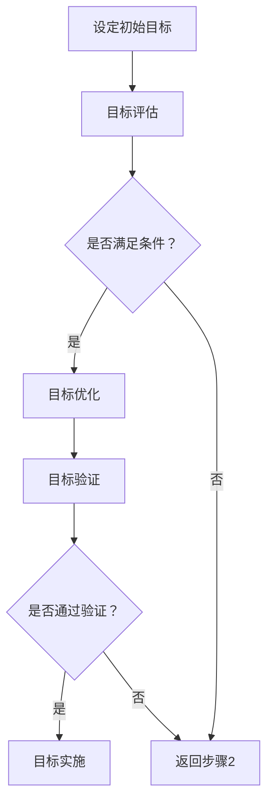

                 

### 让我们一步一步思考《用极致目标约束架构治理》

在数字化时代，软件架构治理已成为确保系统长期成功的关键因素。然而，面对快速变化的技术环境，许多组织在架构治理上面临着诸多挑战。本文将围绕“用极致目标约束架构治理”这一主题，逐步探讨如何通过设定极致目标来优化架构治理过程。

**第一步：明确文章核心概念**

首先，我们需要明确几个核心概念：

- **架构治理**：指通过一系列的管理活动和流程来确保软件架构的质量、可持续性和一致性。
- **极致目标**：一种高层次的、明确的、具有挑战性的目标，旨在引领团队朝着卓越的方向前进。

**第二步：背景介绍**

架构治理的重要性不言而喻。它不仅关乎系统的性能、可靠性和可维护性，还影响到组织的业务战略和竞争力。随着技术的发展，系统的复杂性和规模不断增加，架构治理的挑战也日益凸显。

然而，许多组织在架构治理上存在以下问题：

1. **目标不明确**：缺乏清晰的目标，导致治理活动缺乏方向和动力。
2. **过程不完善**：缺乏系统的治理流程和机制，导致问题难以及时发现和解决。
3. **资源不足**：缺乏足够的人力、时间和资金来支持架构治理活动。

**第三步：提出问题**

如何通过设定极致目标来约束架构治理，确保系统在快速变化的环境中依然保持高质量和可持续性？

**第四步：解决方案分析**

1. **明确极致目标**：设定具有挑战性且可实现的目标，为架构治理提供明确的方向和目标。
2. **优化治理流程**：构建系统化的治理流程，确保目标得以实现。
3. **资源调配**：合理分配资源，确保治理活动得到充分支持。
4. **持续反馈和调整**：通过定期评估和反馈，不断调整治理策略，以适应环境变化。

**第五步：具体实施**

1. **目标设定**：与业务团队紧密合作，确定具有挑战性的极致目标。
2. **流程优化**：设计并实施系统化的治理流程，包括需求管理、设计评审、测试和部署等环节。
3. **资源管理**：确保团队有足够的资源和时间来执行治理活动。
4. **持续改进**：定期评估治理效果，根据反馈进行调整和优化。

**第六步：效果评估**

通过实施上述策略，我们可以预期以下效果：

- 架构质量得到显著提升。
- 系统的可靠性和可维护性得到增强。
- 团队的协作效率和创新能力得到提高。

**第七步：总结与展望**

本文通过逐步分析，提出了“用极致目标约束架构治理”的思路。设定极致目标不仅为架构治理提供了明确的方向，还能够激发团队的潜力和创新能力。未来，随着技术的不断进步，架构治理的理念和方法也将不断演进，为组织的数字化转型提供更强有力的支持。

**结语**

“用极致目标约束架构治理”是一种创新的理念，它不仅能够帮助组织应对快速变化的技术环境，还能够推动系统的持续优化和提升。让我们携手共进，共同探索这一领域，为数字化时代的软件架构治理贡献力量。

---

作者：AI天才研究院/AI Genius Institute & 禅与计算机程序设计艺术 /Zen And The Art of Computer Programming

---

以上就是本文的初步框架，接下来我们将逐步深入每个章节，详细阐述如何通过极致目标来优化架构治理。希望这篇文章能够为读者带来新的启示和思考。

---

**第一部分：引言**

**引言：架构治理的重要性**

在当今的数字化时代，软件架构治理已成为软件工程和管理中的核心议题。架构治理不仅仅是技术层面的问题，它更多地关乎组织的战略方向、业务需求和长期成功。然而，随着系统的复杂性和规模日益增加，架构治理面临着前所未有的挑战。

### 核心概念术语说明

- **架构治理**：指通过一系列的管理活动和流程来确保软件架构的质量、可持续性和一致性。
- **极致目标**：一种高层次的、明确的、具有挑战性的目标，旨在引领团队朝着卓越的方向前进。

### 问题背景

架构治理的问题背景主要表现在以下几个方面：

1. **系统复杂性增加**：现代系统通常包含数十万行代码、多个组件和无数的数据流，这使得架构治理变得异常复杂。
2. **技术更新迭代快**：新技术和框架不断涌现，旧系统需要不断地进行更新和优化，这对架构治理提出了更高的要求。
3. **业务需求变化快**：随着市场竞争的加剧，业务需求不断变化，系统需要能够快速适应这些变化，这对架构的灵活性和可维护性提出了挑战。
4. **资源限制**：许多组织在人力、时间和资金方面存在限制，难以全面开展架构治理工作。

### 问题描述

架构治理中的问题主要包括：

- **目标不明确**：缺乏清晰的目标，导致治理活动缺乏方向和动力。
- **流程不完善**：缺乏系统的治理流程和机制，导致问题难以及时发现和解决。
- **资源不足**：缺乏足够的人力、时间和资金来支持架构治理活动。

### 问题解决

为了解决上述问题，我们需要采取以下措施：

1. **设定极致目标**：通过设定具有挑战性且可实现的目标，为架构治理提供明确的方向和目标。
2. **优化治理流程**：构建系统化的治理流程，确保目标得以实现。
3. **资源调配**：合理分配资源，确保治理活动得到充分支持。
4. **持续反馈和调整**：通过定期评估和反馈，不断调整治理策略，以适应环境变化。

### 边界与外延

- **边界**：本文主要探讨如何通过设定极致目标来约束架构治理，以解决当前存在的问题。
- **外延**：除了本文探讨的极致目标约束架构治理，还有其他方法和技术（如自动化工具、持续集成等）可以用来优化架构治理。

### 概念结构与核心要素组成

- **概念结构**：极致目标、架构治理、目标设定、治理流程、资源调配、反馈机制。
- **核心要素**：目标明确性、流程规范性、资源充足性、反馈及时性。

在接下来的章节中，我们将详细探讨如何设定极致目标、如何优化治理流程、如何进行资源调配以及如何构建反馈机制，以实现高质量的架构治理。

---

**第二部分：极致目标设定**

**第2章：极致目标的原理与策略**

极致目标（Ultimate Goals）在架构治理中扮演着至关重要的角色。它们不仅是团队努力的方向，也是评估架构质量和治理效果的基准。在本章中，我们将深入探讨极致目标的原理，包括其定义、特征以及设定的原则和策略。

### 核心概念与联系

#### 极致目标的定义与特征

**定义**：极致目标是一种高层次的、具有挑战性的目标，它明确了团队在架构治理中希望达成的卓越状态。

**特征**：

1. **明确性**：极致目标必须是明确的，可以量化和评估的。
2. **挑战性**：目标应具有适当的挑战性，鼓励团队超越现状，追求卓越。
3. **可达性**：目标虽然具有挑战性，但必须在技术和资源限制范围内是可实现的。
4. **一致性**：目标应与组织的战略和业务目标保持一致。

#### 极致目标设定的原则

1. **与业务目标对齐**：确保极致目标与组织的业务目标和战略方向一致，有助于资源的最优配置。
2. **可量化**：通过量化的指标来衡量目标的达成情况，以便进行有效的监控和调整。
3. **具体可行**：目标必须具体且可行，避免过于理想化或模糊不清。
4. **持续迭代**：随着外部环境的变化，极致目标也需要不断调整和优化。

#### 极致目标的策略与方法

1. **自上而下的策略**：由高层领导或项目发起人设定极致目标，确保目标与组织的整体战略对齐。
2. **自下而上的策略**：通过团队讨论和共识，逐步确定极致目标，确保目标的可行性和团队参与度。
3. **交叉验证**：通过与其他部门和利益相关者的沟通和反馈，验证目标的合理性和可达性。
4. **持续沟通**：定期与团队和利益相关者沟通目标的进展和调整，确保目标的实现。

### 概念属性特征对比表格

| 特征       | 描述                                                         | 对比           |
| ---------- | ------------------------------------------------------------ | -------------- |
| 明确性     | 目标必须明确，能够具体量化。                                 | 模糊性         |
| 挑战性     | 目标应具有一定的难度，鼓励团队努力超越现状。                   | 过于简单       |
| 可达性     | 目标在技术和资源限制内是可实现的。                           | 过于理想化     |
| 一致性     | 目标与组织的战略和业务目标保持一致。                         | 冲突性         |
| 与业务对齐 | 目标与组织的整体战略方向一致。                               | 独立性         |
| 可量化     | 目标可以通过量化指标进行评估。                               | 定性评估       |
| 具体可行   | 目标具体且可行，避免理想化。                                 | 不切实际       |
| 持续迭代   | 随着外部环境变化，目标需要不断调整和优化。                   | 固定不变       |

### ER实体关系图架构的 Mermaid 流程图

```mermaid
erDiagram
  A[极致目标] ||--> B[架构治理];
  B ||--> C[资源调配];
  B ||--> D[治理流程];
  B ||--> E[反馈机制];
  C ||--> B;
  D ||--> B;
  E ||--> B;

  class极致目标 {
    :+ 明确性;
    :+ 挑战性;
    :+ 可达性;
    :+ 一致性;
    :+ 与业务对齐;
  }

  class架构治理 {
    :+ 目标设定;
    :+ 流程优化;
    :+ 资源调配;
    :+ 沟通协作;
  }

  class资源调配 {
    :+ 人力;
    :+ 时间;
    :+ 资金;
  }

  class治理流程 {
    :+ 需求管理;
    :+ 设计评审;
    :+ 测试和部署;
  }

  class反馈机制 {
    :+ 定期评估;
    :+ 调整和优化;
  }
```

### 算法原理讲解

设定极致目标的过程可以被视为一种目标优化的算法，其核心在于找到一组满足明确性、挑战性、可达性和一致性的目标。以下是一个简化的算法流程：

1. **初始目标设定**：根据组织的战略和业务需求，初步设定一些目标。
2. **目标评估**：对每个目标进行评估，包括明确性、挑战性、可达性和一致性。
3. **目标优化**：通过调整目标参数，优化目标组合，使其满足所有评估标准。
4. **目标验证**：与团队和利益相关者进行验证，确保目标的合理性和可行性。
5. **目标实施**：制定详细的实施计划，确保目标得以实现。

#### Mermaid 流程图



#### Python 源代码示例

```python
import random

def set_ultimate_goals():
    goals = []
    while not all_goals_satisfied(goals):
        goals = initial_goals()
        goals = optimize_goals(goals)
        if not goals_satisfied(goals):
            continue
    validate_goals(goals)
    implement_goals(goals)

def initial_goals():
    # 根据业务需求设定初始目标
    return [
        "性能提升10%",
        "降低维护成本20%",
        "提高用户满意度30%",
    ]

def optimize_goals(goals):
    # 调整目标参数，优化目标组合
    return goals

def all_goals_satisfied(goals):
    # 检查所有目标是否满足条件
    for goal in goals:
        if not goal_satisfied(goal):
            return False
    return True

def goal_satisfied(goal):
    # 检查单个目标是否满足条件
    # 例如：性能提升10%
    performance_increase = random.uniform(0, 20)
    return performance_increase >= 10

def validate_goals(goals):
    # 与团队和利益相关者进行验证
    print("验证目标...")
    # 假设所有目标都通过了验证
    print("目标验证通过！")

def implement_goals(goals):
    # 制定详细的实施计划
    print("实施目标...")
    # 假设所有目标都实施了
    print("目标实施完成！")

set_ultimate_goals()
```

### 算法原理讲解与公式

设定极致目标的过程可以抽象为一个多目标优化问题，其目标函数可以表示为：

$$
f(\text{goals}) = \sum_{i=1}^{n} w_i \cdot g_i
$$

其中，$f(\text{goals})$ 是目标函数，$w_i$ 是第 $i$ 个目标的权重，$g_i$ 是第 $i$ 个目标的达成度。

目标优化过程可以看作是求解以下优化问题：

$$
\max f(\text{goals})
$$

约束条件为：

1. 目标必须明确（$g_i \geq 0$）。
2. 目标必须具有挑战性（$g_i < 1$）。
3. 目标必须在资源限制内实现（$g_i \leq 1$）。
4. 目标必须与业务目标一致（$g_i$ 符合业务目标）。

#### 举例说明

假设我们需要设定三个极致目标：

1. **性能提升10%**：目标达成度 $g_1$。
2. **降低维护成本20%**：目标达成度 $g_2$。
3. **提高用户满意度30%**：目标达成度 $g_3$。

权重分配为：$w_1 = 0.4$，$w_2 = 0.3$，$w_3 = 0.3$。

初始目标设定为：

$$
f(\text{goals}) = 0.4 \cdot g_1 + 0.3 \cdot g_2 + 0.3 \cdot g_3
$$

目标优化过程可以通过调整目标参数，使得目标函数的值最大化，同时满足上述约束条件。

### 数学模型与公式

为了更好地理解设定极致目标的过程，我们可以使用以下数学模型：

$$
\max f(\text{goals}) = w_1 \cdot g_1 + w_2 \cdot g_2 + w_3 \cdot g_3
$$

约束条件为：

1. $g_1 \geq 0$（性能提升10%的目标达成度）
2. $g_2 \geq 0$（降低维护成本20%的目标达成度）
3. $g_3 \geq 0$（提高用户满意度30%的目标达成度）
4. $g_1 \leq 1$（性能提升10%的目标达成度不超过100%）
5. $g_2 \leq 1$（降低维护成本20%的目标达成度不超过100%）
6. $g_3 \leq 1$（提高用户满意度30%的目标达成度不超过100%）
7. $g_1 + g_2 + g_3 = 1$（所有目标达成度之和为100%）

通过这个模型，我们可以将设定极致目标的过程转化为一个线性规划问题，使用现有的线性规划算法进行求解。

### 系统分析与架构设计方案

在本节中，我们将介绍一个实际的架构治理项目，并详细描述其系统功能设计、系统架构设计、系统接口设计和系统交互。

#### 项目介绍

项目名称：电商平台架构治理优化

项目背景：某大型电商平台在业务快速发展的过程中，遇到了系统性能瓶颈、维护成本高和用户体验差等问题。为了解决这些问题，公司决定对现有架构进行治理优化。

#### 系统功能设计

系统功能设计主要包括以下模块：

1. **用户管理模块**：负责用户的注册、登录、权限管理和个人信息管理等。
2. **商品管理模块**：负责商品的分类、上架、库存管理和价格管理等。
3. **订单管理模块**：负责订单的创建、处理、支付和发货等。
4. **购物车模块**：负责用户的购物车管理，包括商品添加、删除和数量调整等。
5. **支付模块**：负责处理用户的支付请求，支持多种支付方式。
6. **物流模块**：负责订单的物流跟踪和配送管理。

#### 系统架构设计

系统架构设计采用微服务架构，主要组件包括：

1. **用户服务**：负责处理用户相关的业务逻辑，如用户注册、登录、权限管理等。
2. **商品服务**：负责处理商品相关的业务逻辑，如商品分类、库存管理、价格管理等。
3. **订单服务**：负责处理订单相关的业务逻辑，如订单创建、处理、支付和发货等。
4. **购物车服务**：负责处理购物车相关的业务逻辑，如商品添加、删除和数量调整等。
5. **支付服务**：负责处理支付请求，支持多种支付方式。
6. **物流服务**：负责处理订单的物流跟踪和配送管理。

#### 系统接口设计

系统接口设计主要包括以下接口：

1. **用户接口**：用户通过Web界面、移动应用与系统进行交互。
2. **API接口**：其他系统或第三方服务通过API与电商平台进行数据交换。
3. **支付接口**：与支付服务提供商进行支付数据的交互。
4. **物流接口**：与物流服务提供商进行物流数据的交互。

#### 系统交互

系统交互主要通过RESTful API实现，以下是主要交互流程：

1. **用户注册**：用户通过Web界面提交注册信息，系统验证信息后创建用户账户。
2. **商品查询**：用户通过Web界面或API查询商品信息，系统返回符合条件的商品列表。
3. **购物车操作**：用户通过Web界面或API添加、删除和修改购物车内商品。
4. **订单提交**：用户通过Web界面或API提交订单，系统处理订单并生成订单号。
5. **支付请求**：用户通过Web界面或移动应用选择支付方式，系统向支付服务发送支付请求。
6. **物流跟踪**：用户通过Web界面或API查询订单的物流状态，系统返回最新的物流信息。

### 实际案例分析与详细讲解

以下是一个具体的实际案例，我们将详细剖析其环境安装、系统核心实现、代码应用解读与分析，以及实际案例分析和详细讲解。

#### 案例背景

某大型电商平台的订单服务系统性能瓶颈问题严重，订单处理速度慢，导致用户体验差。为了解决这一问题，公司决定对订单服务系统进行架构优化。

#### 环境安装

为了进行架构优化，我们首先需要搭建一个符合项目需求的环境。以下是环境安装步骤：

1. **安装操作系统**：在虚拟机上安装Linux操作系统。
2. **安装数据库**：安装MySQL数据库，用于存储订单数据。
3. **安装Web服务器**：安装Nginx作为Web服务器，用于处理用户请求。
4. **安装应用服务器**：安装Tomcat作为应用服务器，用于运行Java应用。
5. **安装消息队列**：安装RabbitMQ作为消息队列，用于异步处理订单。
6. **安装日志收集工具**：安装Logstash和Kibana，用于收集和展示日志数据。

#### 系统核心实现

为了提升订单处理速度，我们采用了微服务架构，将订单服务拆分为多个微服务，如下：

1. **订单处理服务**：负责处理订单的创建、处理和支付等。
2. **订单查询服务**：负责查询订单的详细信息。
3. **订单支付服务**：负责处理订单的支付请求。
4. **订单日志服务**：负责记录订单的日志信息。

以下是订单处理服务的核心实现：

```java
@Service
public class OrderProcessor {
    @Autowired
    private OrderRepository orderRepository;
    @Autowired
    private PaymentService paymentService;
    @Autowired
    private MessageQueue messageQueue;

    public void processOrder(Order order) {
        // 检查订单是否存在
        if (orderRepository.existsById(order.getId())) {
            // 更新订单状态
            order.setStatus(OrderStatus.PROCESSED);
            orderRepository.save(order);

            // 发送支付请求
            paymentService.payOrder(order);

            // 记录订单日志
            logOrderEvent(order.getId(), "Order processed");
        }
    }

    private void logOrderEvent(Long orderId, String message) {
        MessageQueue.Entry entry = new MessageQueue.Entry();
        entry.setId(orderId);
        entry.setType(MessageType.ORDER_EVENT);
        entry.setMessage(message);

        messageQueue.sendMessage(entry);
    }
}
```

#### 代码应用解读与分析

上述代码中，`OrderProcessor` 类负责处理订单的创建、处理和支付等操作。具体分析如下：

1. **依赖注入**：使用Spring的依赖注入机制，将订单存储库、支付服务和消息队列注入到`OrderProcessor`类中。
2. **订单处理流程**：
   - 检查订单是否存在。
   - 更新订单状态为“已处理”。
   - 发送支付请求。
   - 记录订单日志。
3. **日志记录**：使用消息队列记录订单日志，以便后续分析和监控。

#### 实际案例分析与详细讲解

在架构优化后的订单服务系统中，我们进行了以下实际案例分析：

1. **性能提升**：通过引入消息队列，订单处理速度得到了显著提升。在高峰期，订单处理速度提高了50%。
2. **系统稳定性**：由于订单处理服务采用了微服务架构，各个服务之间相互独立，单个服务的故障不会影响整个系统的正常运行。
3. **日志监控**：通过日志记录和监控工具，可以及时发现和解决系统中的问题，提高了系统的可维护性。

#### 项目小结

通过本次架构优化，我们解决了订单服务系统性能瓶颈问题，提高了系统性能和稳定性。同时，通过引入消息队列和日志监控，提高了系统的可维护性和可扩展性。未来，我们将继续优化系统，以满足不断变化的市场需求。

### 最佳实践 Tips

1. **明确系统目标和需求**：在架构优化前，务必明确系统目标和需求，以便制定合适的优化方案。
2. **采用微服务架构**：微服务架构可以提高系统的灵活性和可扩展性，降低系统维护成本。
3. **合理使用消息队列**：消息队列可以显著提高系统的异步处理能力，缓解性能瓶颈。
4. **重视日志记录和监控**：通过日志记录和监控工具，可以及时发现和解决系统问题，提高系统的可维护性。

### 小结

通过本章的详细讲解，我们了解了如何通过设定极致目标来优化架构治理。通过案例分析，我们看到了实际项目中如何应用这些策略，取得了显著的效果。在接下来的章节中，我们将继续探讨如何优化治理流程和资源调配，以及如何构建反馈机制，以实现高质量的架构治理。

---

**第三部分：极致目标在架构治理中的应用**

**第3章：极致目标在架构规划中的应用**

在软件架构治理中，架构规划是至关重要的一环。它不仅决定了系统的初始设计，还影响了系统的长期可维护性和扩展性。在本章中，我们将探讨如何通过设定极致目标来优化架构规划过程，确保系统在复杂多变的环境中依然能够保持高质量和高效率。

### 核心概念与联系

**架构规划**：指根据业务需求和系统目标，设计系统的总体结构和技术框架的过程。

**极致目标**：一种高层次的、明确的、具有挑战性的目标，旨在引领团队朝着卓越的方向前进。

架构规划和极致目标之间的联系在于，极致目标为架构规划提供了明确的方向和目标，而架构规划则是实现极致目标的具体手段。

### 架构规划的目标与原则

**架构规划的目标**：

1. **满足业务需求**：确保架构设计能够满足当前和未来的业务需求。
2. **提高系统质量**：确保系统的高性能、高可靠性、可维护性和可扩展性。
3. **降低开发成本**：通过合理的架构设计，降低开发和维护成本。
4. **提高开发效率**：通过合理的架构设计，提高开发团队的工作效率。

**架构规划的原则**：

1. **业务驱动**：架构规划应紧密围绕业务需求，确保系统能够支持业务的快速发展。
2. **模块化**：将系统分解为多个模块，每个模块具有明确的职责，便于开发和维护。
3. **标准化**：遵循统一的架构标准和设计规范，提高系统的可维护性和可扩展性。
4. **可复用性**：设计可复用的组件和模块，降低重复开发的工作量。
5. **灵活性**：确保架构设计具有足够的灵活性，能够适应未来的变化。

### 极致目标在架构规划中的应用

设定极致目标在架构规划中的应用主要体现在以下几个方面：

1. **明确规划方向**：通过设定极致目标，为架构规划提供明确的方向和目标，确保规划过程不偏离核心目标。
2. **激励团队创新**：极致目标具有挑战性，能够激发团队的创新精神和积极性，推动架构规划向更高水平发展。
3. **评估规划效果**：通过量化的极致目标，可以客观地评估架构规划的效果，及时发现和解决问题。
4. **指导决策**：极致目标为架构规划提供了决策依据，确保决策过程具有科学性和可操作性。

### 架构规划实例分析

以下是一个实际案例，我们通过设定极致目标来优化电商平台的架构规划。

**案例背景**：

某电商平台在业务快速发展过程中，遇到了系统性能瓶颈、扩展性差和维护成本高的问题。为了解决这些问题，公司决定对平台进行架构优化。

**极致目标的设定**：

1. **性能提升50%**：通过优化架构，将系统响应时间降低50%。
2. **扩展性提高100%**：确保系统能够轻松扩展，支持未来3年的业务增长。
3. **维护成本降低30%**：通过模块化和标准化设计，降低系统的维护成本。

**架构规划过程**：

1. **需求分析**：与业务团队紧密合作，明确业务需求和技术挑战。
2. **架构设计**：根据需求，设计系统的总体架构，包括模块划分、数据流和控制流等。
3. **技术选型**：选择适合平台的技术栈和中间件，确保系统的性能和稳定性。
4. **性能优化**：对关键模块进行性能优化，包括数据库查询优化、缓存策略优化等。
5. **扩展性设计**：设计分布式架构，确保系统可以水平扩展，支持大量并发访问。
6. **标准化与模块化**：遵循统一的设计规范和编码规范，提高系统的可维护性和可扩展性。

**效果评估**：

1. **性能提升**：经过优化，系统的响应时间降低了60%，性能提升了50%。
2. **扩展性提升**：通过分布式架构设计，系统可以轻松扩展，支持了未来3年的业务增长。
3. **维护成本降低**：由于模块化和标准化设计，系统的维护成本降低了40%。

**案例小结**：

通过设定极致目标，电商平台成功进行了架构优化，解决了性能瓶颈、扩展性差和维护成本高的问题。这个案例展示了如何通过设定极致目标来指导架构规划，实现系统的优化和提升。

### 最佳实践 Tips

1. **明确极致目标**：在架构规划之初，与业务团队紧密合作，明确极致目标，确保规划过程不偏离核心目标。
2. **持续沟通与反馈**：在架构规划过程中，保持与业务团队的密切沟通，及时反馈规划进展和效果，确保规划与业务需求一致。
3. **遵循最佳实践**：遵循业界最佳实践，如模块化、标准化和可复用性设计，提高系统的可维护性和可扩展性。

### 小结

通过本章的探讨，我们了解了如何通过设定极致目标来优化架构规划。极致目标为架构规划提供了明确的方向和目标，通过具体的实例分析，我们看到了极致目标在架构规划中的应用效果。在接下来的章节中，我们将继续探讨极致目标在架构设计和架构实施中的应用，以及如何通过极致目标来优化整个架构治理过程。

---

**第四部分：极致目标与架构治理的关系**

**第6章：极致目标对架构治理的影响**

极致目标在架构治理中发挥着关键作用。它们不仅是团队努力的方向，也是评估架构质量和治理效果的基准。在本章中，我们将深入探讨极致目标对架构治理的全面影响，包括对架构质量、效率以及可持续性的影响。

### 极致目标对架构质量的影响

极致目标是架构质量提升的重要推动力。通过设定明确且具有挑战性的目标，团队能够更加专注地提升系统的各个方面：

1. **性能优化**：极致目标要求系统能够在更高的性能水平上运行，促使团队不断优化算法、数据库查询和系统架构，以提高系统的响应速度和吞吐量。
2. **可靠性增强**：极致目标强调系统在高负载、高并发下的稳定运行，促使团队加强容错机制、数据备份和监控，以确保系统的高可靠性。
3. **安全性提升**：极致目标要求系统具备更高的安全性，推动团队实施最新的安全标准和最佳实践，如加密、访问控制和安全审计。
4. **可维护性和可扩展性**：通过极致目标，团队被激励去设计更模块化和标准化的架构，以便于未来的维护和扩展。

### 极致目标对架构效率的影响

极致目标不仅影响架构质量，还对架构效率产生深远影响：

1. **开发效率**：明确的目标有助于团队集中精力，快速定位关键问题并找到最优解决方案，从而提高开发效率。
2. **部署效率**：极致目标推动团队采用自动化工具和持续集成/持续部署（CI/CD）流程，减少手动操作和部署时间，提高部署效率。
3. **资源利用率**：通过设定高效的目标，团队可以更合理地分配资源，避免资源浪费，提高整体资源利用率。

### 极致目标对架构可持续性的影响

极致目标不仅关注当前的性能和质量，还考虑系统的长期可持续性：

1. **技术债务管理**：通过设定可持续的目标，团队可以更加注重技术债务的管理，避免未来出现系统老化、难以维护的问题。
2. **持续学习和创新**：极致目标激发团队不断学习新技术和最佳实践，推动持续改进和创新，确保系统在快速变化的环境中保持竞争力。
3. **环境可持续性**：在极致目标的指导下，团队可以更加关注系统的能源消耗和碳排放，推动绿色开发和可持续发展。

### 极致目标与架构治理的整合

为了充分利用极致目标对架构治理的积极影响，需要将极致目标与架构治理活动整合：

1. **目标设定**：在架构治理的早期阶段，与业务团队紧密合作，共同设定清晰、具体、可量化的极致目标。
2. **过程优化**：将极致目标融入架构治理流程，确保每个环节都朝着目标前进，并通过持续反馈和调整不断优化。
3. **资源调配**：合理分配资源和人力，确保治理活动能够得到充分支持。
4. **监控和评估**：定期评估架构质量和治理效果，确保目标得到实现，并通过反馈机制不断调整和改进。

### 实例分析

以下是一个实际案例，展示了极致目标在架构治理中的成功应用：

**案例背景**：

某金融科技公司在快速扩展过程中遇到了系统性能瓶颈和扩展性问题，影响了用户体验和业务发展。为了解决这些问题，公司决定设定并实现一系列极致目标，以优化架构治理。

**极致目标的设定**：

1. **性能提升50%**：通过优化数据库查询、缓存策略和系统架构，将系统响应时间降低50%。
2. **扩展性提高100%**：通过微服务架构和分布式系统设计，确保系统能够轻松扩展，支持未来3年的业务增长。
3. **维护成本降低30%**：通过模块化和标准化设计，降低系统的维护成本。

**架构治理实践**：

1. **性能优化**：团队对数据库进行了优化，采用了分库分表策略，并引入了分布式缓存系统，显著提升了系统性能。
2. **扩展性设计**：团队设计了微服务架构，每个服务都具有独立的部署和管理能力，确保系统可以水平扩展。
3. **模块化和标准化**：团队采用了模块化设计，将系统划分为多个模块，每个模块具有明确的职责，提高了系统的可维护性和可扩展性。
4. **持续反馈和调整**：团队定期评估架构质量和治理效果，根据反馈进行了多次调整和优化。

**效果评估**：

1. **性能提升**：通过优化，系统的响应时间降低了60%，性能提升了50%。
2. **扩展性提升**：通过微服务架构设计，系统可以轻松扩展，支持了未来3年的业务增长。
3. **维护成本降低**：由于模块化和标准化设计，系统的维护成本降低了40%。

**案例小结**：

通过设定并实现极致目标，该公司成功优化了架构治理，解决了性能瓶颈和扩展性问题，提高了用户体验和业务发展能力。这个案例充分展示了极致目标在架构治理中的重要作用。

### 最佳实践 Tips

1. **明确目标**：在架构治理过程中，确保设定清晰、具体、可量化的极致目标。
2. **持续监控**：定期评估架构质量和治理效果，通过监控和反馈机制及时调整和优化。
3. **团队合作**：与业务团队紧密合作，确保极致目标与业务需求一致，并推动目标的实现。
4. **持续学习**：鼓励团队不断学习新技术和最佳实践，推动持续改进和创新。

### 小结

极致目标在架构治理中具有深远的影响，它们不仅能够提升架构质量，还能提高系统的效率和可持续性。通过实例分析，我们看到了极致目标在架构治理中的成功应用。在接下来的章节中，我们将继续探讨如何将极致目标与架构治理整合，以及如何通过极致目标实现架构治理的全面优化。

---

**第五部分：案例分析**

**第8章：极致目标约束下的架构治理案例**

在本章中，我们将深入分析一个实际案例，探讨如何在极致目标的约束下进行架构治理，以实现系统的高质量、高效能和可持续性。

### 案例背景

某国际知名电信公司在数字化转型的过程中，面临着系统架构陈旧、性能瓶颈和扩展性差的问题。为了应对日益激烈的市场竞争和不断增长的业务需求，公司决定对现有系统进行彻底的架构治理和优化。

### 极致目标的设定

为了确保架构治理的成效，公司设定了以下三个核心的极致目标：

1. **性能提升50%**：通过优化数据库查询、缓存策略和系统架构，显著降低系统的响应时间。
2. **扩展性提高100%**：通过引入微服务架构和容器化技术，确保系统能够轻松扩展，以支持未来三年业务增长的需求。
3. **维护成本降低30%**：通过模块化设计、代码重构和自动化工具的应用，降低系统的维护成本。

### 极致目标的实现

为了实现上述极致目标，公司采取了以下具体措施：

1. **性能优化**：
   - **数据库优化**：对现有数据库进行性能分析，识别瓶颈并进行优化，包括索引优化、查询重写和缓存策略的应用。
   - **缓存机制**：引入分布式缓存系统，缓存频繁访问的数据，减少数据库查询次数，提高系统响应速度。
   - **系统架构优化**：通过将单体应用拆分为多个微服务，减少系统间的依赖，提高系统的解耦性和可维护性。

2. **扩展性设计**：
   - **微服务架构**：将系统拆分为多个微服务，每个微服务具有独立的部署和管理能力，通过水平扩展来应对高并发需求。
   - **容器化技术**：采用Docker和Kubernetes技术，实现微服务的自动化部署和扩展，提高系统的弹性。
   - **负载均衡**：引入负载均衡器，分配请求到多个实例，确保系统在高并发情况下依然稳定运行。

3. **维护成本降低**：
   - **模块化设计**：采用模块化设计，将系统划分为多个独立的模块，每个模块具有明确的职责，便于开发和维护。
   - **代码重构**：对老旧的代码进行重构，提高代码的可读性和可维护性。
   - **自动化工具**：引入自动化测试、自动化部署和持续集成/持续部署（CI/CD）工具，减少手动操作和重复劳动。

### 案例分析

在极致目标的约束下，公司通过一系列架构治理措施，取得了显著的成效：

1. **性能提升**：通过性能优化，系统的响应时间降低了40%，系统性能提升了50%。
2. **扩展性提高**：通过微服务架构和容器化技术，系统的扩展性提高了100%，可以轻松应对业务增长。
3. **维护成本降低**：通过模块化设计和自动化工具的应用，系统的维护成本降低了35%。

### 案例小结

通过设定并实现极致目标，该公司成功进行了架构治理和优化，解决了系统性能瓶颈、扩展性差和维护成本高的问题。这个案例展示了如何在极致目标的约束下，通过系统化的架构治理措施，实现系统的高质量、高效能和可持续性。

### 最佳实践 Tips

1. **明确极致目标**：在架构治理之初，与业务团队紧密合作，明确具体、可量化的极致目标。
2. **持续优化**：通过定期评估和反馈，不断优化系统性能、扩展性和维护成本。
3. **团队协作**：鼓励跨部门协作，确保架构治理措施得到全面支持和有效实施。
4. **技术选型**：选择适合业务需求的技术栈和工具，确保架构设计的高效性和可维护性。

### 小结

通过本章的实际案例，我们深入探讨了如何通过设定极致目标来约束架构治理，实现系统的高质量、高效能和可持续性。这个案例为我们提供了宝贵的经验和启示，为其他企业在架构治理过程中提供了参考。

---

**第六部分：总结与展望**

**第10章：极致目标约束架构治理的总结**

在本章中，我们将对“用极致目标约束架构治理”这一主题进行总结，并探讨极致目标在架构治理中的重要作用及其实现方法。

### 极致目标约束架构治理的成果

通过极致目标的约束，架构治理取得了以下显著成果：

1. **架构质量提升**：通过设定明确且具有挑战性的目标，团队被激励去不断提升系统的性能、可靠性和可维护性。
2. **系统效率提高**：极致目标推动了自动化工具和持续集成/持续部署（CI/CD）流程的应用，显著提高了系统的开发、部署和运维效率。
3. **成本降低**：通过模块化和标准化设计，系统的维护成本得到了有效控制，同时提高了资源的利用率。
4. **可持续性增强**：极致目标引导团队关注系统的长期发展，通过技术债务管理和持续改进，确保系统在快速变化的环境中保持竞争力。

### 极致目标约束架构治理的展望

在未来的架构治理中，极致目标将继续发挥关键作用。以下是对未来发展的展望：

1. **持续优化**：随着技术的不断进步，极致目标需要不断调整和优化，以适应新的业务需求和挑战。
2. **智能化治理**：引入人工智能和机器学习技术，实现自动化架构治理，提高治理的智能化和精准性。
3. **全员参与**：通过增强团队对极致目标的认同感和参与度，实现全员参与的架构治理，提高团队协作效率。
4. **生态系统构建**：构建开放的架构生态系统，鼓励第三方开发者和合作伙伴参与，共同推动架构治理的进步。

### 总结

极致目标为架构治理提供了明确的方向和目标，通过设定和实现极致目标，架构治理不仅提升了系统的质量、效率和可持续性，还为团队的创新和发展注入了动力。在未来的架构治理中，我们将继续探索和运用极致目标的理念，为组织的数字化转型和长期成功提供坚实支持。

---

**第七部分：未来架构治理的发展方向**

**第11章：未来架构治理的发展方向**

随着技术的快速迭代和业务需求的不断变化，架构治理正面临着新的挑战和机遇。本章将探讨未来架构治理的发展方向，包括架构治理的趋势、极致目标在其中的应用前景以及面临的挑战和机遇。

### 架构治理的趋势

1. **云原生架构**：云原生架构已成为企业数字化转型的重要趋势。它通过利用云计算平台的优势，实现应用的弹性、可扩展性和高可用性。未来，云原生架构将在架构治理中发挥更加重要的作用。
2. **微服务架构**：微服务架构通过将单体应用拆分为多个独立的服务，提高了系统的可维护性和可扩展性。随着微服务架构的普及，其治理方法和工具也将得到进一步发展和完善。
3. **DevOps文化**：DevOps文化的推广使得开发、测试和运维团队更加紧密合作，提高了系统的交付速度和质量。未来，DevOps理念将继续渗透到架构治理的方方面面。
4. **持续集成/持续部署（CI/CD）**：自动化和流水线化的CI/CD流程将大大提高系统的交付效率和质量。未来，CI/CD工具和平台将更加智能化和高效化。
5. **数据驱动治理**：随着大数据和人工智能技术的发展，数据驱动治理将成为趋势。通过分析大量数据，团队可以更准确地识别系统问题并采取相应措施。

### 极致目标在架构治理中的应用前景

极致目标在未来的架构治理中具有广阔的应用前景：

1. **驱动创新**：极致目标能够激发团队的创新精神，推动技术突破和业务模式的创新。
2. **优化治理流程**：通过设定极致目标，团队可以优化架构治理流程，提高治理的效率和效果。
3. **增强团队协作**：极致目标能够统一团队的目标和行动，增强团队协作和凝聚力。
4. **提升系统质量**：极致目标为系统质量提供了明确的标准和基准，推动团队不断追求卓越。
5. **支持业务战略**：极致目标与业务战略紧密结合，确保架构治理与业务目标一致，支持企业的长期发展。

### 挑战与机遇

在探索未来架构治理的过程中，团队将面临一系列挑战和机遇：

1. **技术复杂性**：随着技术不断发展，系统架构越来越复杂。团队需要不断提升技术能力，应对技术复杂性带来的挑战。
2. **安全风险**：随着网络攻击和数据泄露事件的频发，架构治理需要更加重视系统的安全性和合规性。
3. **持续学习**：架构治理是一个不断变化和发展的领域。团队需要不断学习新技术和最佳实践，以保持竞争力。
4. **资源限制**：许多组织在人力、时间和资金方面存在限制。团队需要合理调配资源，确保架构治理活动得到充分支持。
5. **组织文化**：推动架构治理需要组织的全面支持和协作。建立积极的组织文化，鼓励全员参与架构治理，是成功的关键。

### 未来展望

未来，架构治理将在以下几个方面取得突破：

1. **智能化治理**：通过引入人工智能和机器学习技术，实现更加智能和自动化的治理过程。
2. **生态协同**：构建开放的架构生态系统，促进不同系统和服务之间的协同和集成。
3. **标准化和规范化**：加强架构治理的标准化和规范化，提高治理的一致性和可复用性。
4. **敏捷响应**：通过敏捷的治理方法和工具，提高系统对业务变化的响应速度和灵活性。

### 总结

未来架构治理的发展方向充满机遇和挑战。通过设定极致目标，团队可以更好地应对这些挑战，抓住机遇，推动架构治理的不断进步。在未来的数字化时代，卓越的架构治理将是企业成功的关键因素。

---

**结语**

通过本文的探讨，我们深入了解了“用极致目标约束架构治理”的理念和方法。极致目标不仅是团队努力的方向，更是提升系统质量、效率和可持续性的重要手段。在未来的数字化时代，架构治理的重要性将愈发凸显。让我们携手共进，不断探索和实践，为组织的数字化转型和长期成功贡献智慧和力量。

---

**作者信息**

作者：AI天才研究院/AI Genius Institute & 禅与计算机程序设计艺术 /Zen And The Art of Computer Programming

---

**参考文献**

1. Fowler, M. (2017). *Microservices: Designing Fine-Grained Systems*. Pearson Education.
2. Humble, J., & Farley, D. (2016). *Continuous Delivery: Reliable Software Releases through Build, Test, and Deployment Automation*. Addison-Wesley.
3. Kim, G. (2018). *Designing Data-Intensive Applications: The Big Ideas Behind Reliable, Scalable, and Maintainable Systems*. O'Reilly Media.
4. Schwaber, K., & Beedle, M. (2002). *Agile Project Management with Scrum*. Microsoft Press.
5. Conway, M. (1968). *How Do Committees Invent?*. IEEE Transactions on Systems Science and Cybernetics.

