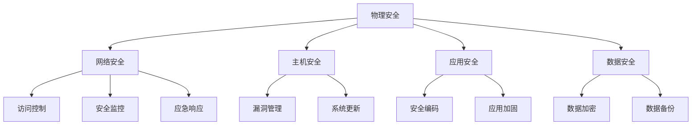
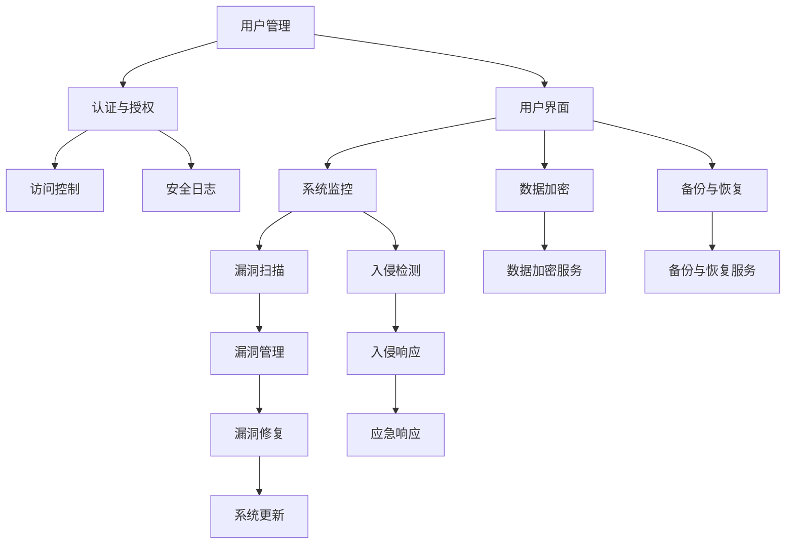
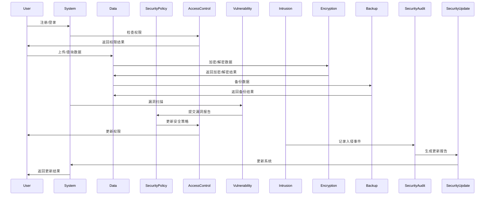
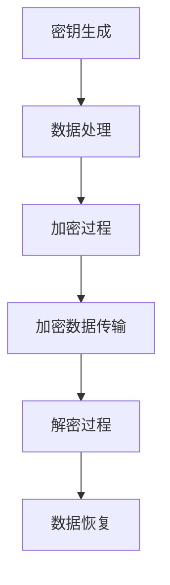

                 

### 引言：网络安全的重要性与挑战

在当今信息化时代，网络安全已经成为每一个组织和个人无法忽视的重要议题。随着互联网的普及和数字化转型的推进，网络系统承载的信息量不断增长，同时也成为黑客和恶意攻击者的主要目标。网络安全问题不仅关乎个人隐私和数据安全，更影响到整个社会的稳定和经济的健康发展。

网络安全，顾名思义，是指通过一系列措施和策略保护网络系统不受未授权访问、数据泄露、篡改和破坏。其重要性体现在以下几个方面：

1. **保护数据隐私**：个人信息、商业机密和政府数据都需要得到有效保护，防止被非法获取和滥用。
2. **确保业务连续性**：企业和服务提供商依赖网络来提供服务，一旦网络遭受攻击，业务可能会中断，导致经济损失。
3. **维护社会稳定**：网络攻击可能引发金融诈骗、政治阴谋等，危害社会秩序。
4. **促进科技创新**：网络安全是科技创新的基础，只有保障网络安全，才能放心地进行研发和探索。

然而，网络安全也面临着诸多挑战：

1. **攻击手段多样化**：黑客使用各种技术手段进行攻击，包括病毒、木马、钓鱼、DDoS等。
2. **防护措施不足**：许多组织和个人的防护措施不到位，未能及时发现和应对安全威胁。
3. **技术更新迅速**：网络技术和攻击技术都在快速发展，防护措施需要不断更新。
4. **监管与法律法规**：网络安全监管和法律体系尚不完善，难以有效约束恶意行为。

本文将围绕网络安全这一主题，由内向外，层层布防。我们将首先介绍网络安全的背景和核心概念，包括安全定义、核心要素、领域及其关联概念。接着，我们探讨系统分析与架构设计，详细描述问题场景、系统功能设计、系统架构设计、系统接口设计和系统交互设计。

在第三部分，我们将深入讲解技术原理与实现，包括算法原理、Python代码实现、数学模型和公式，并通过具体例子进行说明。随后，我们将通过一个实际案例进行分析，探讨其背景、详细讲解和项目小结。

最后，我们将总结最佳实践，提出注意事项，并提供拓展阅读建议，帮助读者更好地理解和应用网络安全知识。

### 第1章 网络安全背景与核心概念

#### 1.1 问题背景

网络安全的起源可以追溯到20世纪60年代，随着计算机技术和互联网的发展，网络安全逐渐成为一个独立的领域。早期的网络安全主要集中在保护计算机系统和数据的物理安全，随着网络通信技术的发展，网络安全逐渐扩展到包括网络传输和数据存储的安全保护。

当前，网络安全面临的问题主要可以归纳为以下几个方面：

1. **数据泄露**：随着企业对数据的依赖程度增加，数据泄露事件频发，成为网络安全的主要威胁之一。
2. **网络攻击**：黑客通过分布式拒绝服务（DDoS）攻击、SQL注入、跨站脚本攻击（XSS）等手段，对网络进行攻击。
3. **恶意软件**：病毒、木马、蠕虫等恶意软件通过网络传播，对计算机系统和网络设备造成破坏。
4. **社会工程学攻击**：黑客利用人类的信任和好奇心理，通过电话、邮件等方式进行诈骗和欺诈。

#### 1.1.1 网络安全现状

根据多个研究机构的报告，全球范围内的网络安全威胁呈上升趋势。2019年，国际数据公司（IDC）的报告显示，全球网络安全支出达到了1237亿美元，预计到2023年将增加到1756亿美元。这表明，越来越多的组织和个人开始重视网络安全，加大了防护投入。

然而，尽管投入不断增加，网络安全事件依然层出不穷。根据美国国家安全局（NSA）的数据，2018年，全球发生了超过4800起网络攻击事件，其中超过80%的攻击成功是由于安全防护措施的不足。这表明，现有的安全防护手段仍有很大的改进空间。

#### 1.1.2 问题提出

网络安全问题的核心是如何在复杂多变的网络环境中保护信息系统的安全。具体来说，需要解决以下问题：

1. **如何识别和防范潜在的安全威胁**：包括恶意软件、网络攻击、钓鱼邮件等。
2. **如何保护数据的安全性和完整性**：防止数据泄露、篡改和破坏。
3. **如何确保系统的可用性和可靠性**：在遭受攻击时，系统能够快速恢复，不影响业务运行。
4. **如何建立有效的安全管理和监管机制**：确保安全策略的有效执行，及时应对安全事件。

#### 1.1.3 问题解决

解决网络安全问题需要多方面的努力：

1. **技术手段**：使用防火墙、入侵检测系统（IDS）、加密技术等手段来防护网络安全。
2. **安全管理**：建立安全管理制度和流程，确保安全策略的有效执行。
3. **法律法规**：完善网络安全法律法规，加强对网络犯罪的打击力度。
4. **教育培训**：提高网络安全意识和技能，减少人为因素导致的安全漏洞。
5. **协同合作**：政府、企业、研究机构、社会组织等共同参与，建立网络安全合作机制。

#### 1.2 核心概念

网络安全涉及多个核心概念，以下是其中几个重要的概念：

1. **信息安全**：保护信息及其系统不受未经授权的访问、篡改、破坏和泄露。
2. **网络防御**：通过技术和管理手段保护网络系统的安全。
3. **漏洞管理**：发现、报告和修复系统中的漏洞，防止被恶意利用。
4. **加密技术**：通过加密算法保护数据的机密性和完整性。
5. **身份认证**：验证用户的身份，确保只有授权用户可以访问系统。

#### 1.2.1 网络安全定义

网络安全可以被定义为保护网络系统不受各种威胁和攻击的能力，包括保护网络设备、数据、应用和服务的完整性、机密性和可用性。具体来说，网络安全包括以下几个方面：

1. **访问控制**：限制只有授权用户才能访问系统资源。
2. **数据保护**：确保数据在传输和存储过程中的安全。
3. **安全监控**：实时监控网络流量，及时发现和应对潜在的安全威胁。
4. **应急响应**：在发生安全事件时，能够迅速采取行动，减轻损失。
5. **安全培训**：提高用户的安全意识和技能，减少人为错误。

#### 1.2.2 核心要素组成

网络安全的实现依赖于多个核心要素，包括：

1. **物理安全**：保护网络设备的物理安全，防止设备被盗或损坏。
2. **网络安全**：保护网络传输过程中的数据安全，防止数据泄露和篡改。
3. **主机安全**：保护计算机系统和服务器安全，防止恶意软件和攻击。
4. **应用安全**：保护各种应用程序的安全，防止应用程序漏洞被利用。
5. **数据安全**：保护数据存储和传输过程中的安全，确保数据的机密性和完整性。

#### 1.2.3 概念结构

网络安全的各个概念之间有着紧密的联系，形成一个完整的安全体系。以下是网络安全概念结构示意图：



#### 1.3 边界与外延

网络安全的边界涉及保护网络系统和信息资源，而外延则包括与网络安全相关的其他领域和概念。以下是对网络安全边界与外延的详细探讨：

##### 1.3.1 网络安全领域

网络安全领域主要包括以下几个方面：

1. **网络安全管理**：负责制定安全策略、规划和执行安全措施。
2. **网络安全技术**：包括防火墙、入侵检测系统、加密技术等。
3. **网络安全评估**：通过漏洞扫描、渗透测试等方法评估网络安全状态。
4. **网络安全应急响应**：处理网络安全事件，进行事故调查和恢复。
5. **网络安全法规与标准**：制定和执行网络安全法律法规、标准。

##### 1.3.2 关联概念对比

网络安全与其他信息安全概念之间有着紧密的联系，但它们之间也存在一些区别。以下是几个关键概念的对比：

| 概念        | 定义                                                         | 关联网络安全         |
|-------------|--------------------------------------------------------------|----------------------|
| 信息安全    | 保护信息及其系统不受未经授权的访问、篡改、破坏和泄露。             | 网络安全的子集        |
| 网络安全    | 保护网络系统不受各种威胁和攻击的能力。                           | 信息安全的实现手段    |
| 信息保密    | 限制信息访问，确保只有授权用户可以获取信息。                      | 信息安全的组成部分    |
| 访问控制    | 限制对系统资源的访问，确保只有授权用户可以访问。                  | 网络安全的核心要素    |
| 安全审计    | 记录和检查系统的操作行为，确保系统符合安全政策。                  | 网络安全的重要手段    |

##### 1.3.3 ER实体关系图架构

为了更好地理解网络安全的各个要素和它们之间的关系，我们可以使用实体关系图（ER图）来表示。以下是网络安全领域中的ER实体关系图：

```mermaid
erDiagram
    User ||--|{ SecurityPolicy }|| Policy
    User ||--|{ AccessControl }|| ACL
    System ||--|{ Vulnerability }|| Vulnerability
    System ||--|{ Intrusion }|| Incident
    Data ||--|{ Encryption }|| Encrypted
    Data ||--|{ Backup }|| Backup
    Application ||--|{ SecurityAudit }|| Audit
    Application ||--|{ SecurityUpdate }|| Update
```

在这个ER图中，`User`表示用户，`Policy`表示安全策略，`ACL`表示访问控制列表，`System`表示系统，`Vulnerability`表示漏洞，`Intrusion`表示入侵，`Data`表示数据，`Encryption`表示加密，`Backup`表示备份，`Application`表示应用程序，`Audit`表示安全审计，`Update`表示系统更新。这些实体之间的关系反映了网络安全系统的复杂性和相互依赖性。

### 第2章 系统分析与架构设计

#### 2.1 问题场景介绍

本节将介绍一个典型的网络安全系统问题场景，并简要介绍该项目。

##### 2.1.1 场景设定

假设我们是一家大型企业，拥有复杂的网络系统，包括多个服务器、数据库和应用。由于业务需求的增长，网络流量不断增大，安全风险也随之增加。我们面临的主要问题是：

1. **数据泄露**：重要数据容易被未授权访问和泄露。
2. **网络攻击**：面临各种网络攻击，如DDoS攻击、SQL注入和跨站脚本攻击（XSS）。
3. **系统漏洞**：系统存在多个已知和未知的漏洞，容易被黑客利用。
4. **应急响应**：在发生安全事件时，缺乏有效的应急响应机制，导致损失扩大。

##### 2.1.2 项目介绍

为了解决上述问题，我们决定实施一个网络安全项目，目标是提高网络系统的安全性和可靠性。项目的主要任务包括：

1. **漏洞扫描与修复**：定期对系统进行漏洞扫描，及时发现和修复漏洞。
2. **防火墙与入侵检测系统（IDS）**：部署防火墙和入侵检测系统，监控网络流量，防止恶意攻击。
3. **加密技术**：使用加密技术保护数据传输和存储过程中的安全性。
4. **安全监控与应急响应**：建立安全监控平台，实时监测安全事件，并制定应急响应计划。

#### 2.2 系统功能设计

##### 2.2.1 领域模型

为了更好地设计网络安全系统，我们首先需要建立一个领域模型，明确系统的功能和模块。以下是领域模型的mermaid类图：

```mermaid
classDiagram
    User <<class>> User
    System <<class>> System
    Data <<class>> Data
    SecurityPolicy <<class>> SecurityPolicy
    AccessControl <<class>> AccessControl
    Vulnerability <<class>> Vulnerability
    Intrusion <<class>> Intrusion
    Encryption <<class>> Encryption
    Backup <<class>> Backup
    SecurityAudit <<class>> SecurityAudit
    SecurityUpdate <<class>> SecurityUpdate

    User "1" --|{accesses}| System
    System "1" --|{stores}| Data
    Data "1" --|{enables}| Encryption
    Data "1" --|{requires}| Backup
    System "1" --|{monitors}| Vulnerability
    Vulnerability "1" --|{reports}| SecurityPolicy
    SecurityPolicy "1" --|{controls}| AccessControl
    AccessControl "1" --|{manages}| User
    Intrusion "1" --|{triggers}| SecurityAudit
    SecurityAudit "1" --|{records}| SecurityUpdate
    SecurityUpdate "1" --|{updates}| System
```

在这个类图中，`User`表示用户，`System`表示系统，`Data`表示数据，`SecurityPolicy`表示安全策略，`AccessControl`表示访问控制，`Vulnerability`表示漏洞，`Intrusion`表示入侵，`Encryption`表示加密，`Backup`表示备份，`SecurityAudit`表示安全审计，`SecurityUpdate`表示系统更新。各个实体之间的关系反映了系统的功能和模块划分。

##### 2.2.2 功能模块划分

根据领域模型，我们将系统划分为以下几个主要功能模块：

1. **用户管理模块**：负责用户注册、登录和权限管理。
2. **系统监控模块**：负责监控系统运行状态，检测漏洞和入侵。
3. **数据保护模块**：负责加密数据传输和存储，定期备份数据。
4. **安全策略管理模块**：负责制定和更新安全策略，控制访问权限。
5. **应急响应模块**：负责处理安全事件，进行事故调查和恢复。

#### 2.3 系统架构设计

##### 2.3.1 架构设计原则

在设计网络安全系统时，我们遵循以下架构设计原则：

1. **模块化**：将系统划分为多个功能模块，每个模块具有独立的职责，便于维护和扩展。
2. **安全性**：确保系统的安全性，采用多种技术手段保护数据和系统安全。
3. **可靠性**：系统具备较高的可靠性，能够在遭受攻击时快速恢复。
4. **可扩展性**：系统设计具备良好的可扩展性，能够适应未来业务需求的变化。

##### 2.3.2 系统架构图

以下是系统架构的mermaid图：



在这个架构图中，`用户管理`模块负责用户注册、登录和权限管理，`认证与授权`模块负责身份验证和权限控制，`用户界面`模块负责提供用户操作界面，`访问控制`模块负责访问权限管理，`安全日志`模块负责记录安全事件，`系统监控`模块负责监控系统运行状态，`数据加密`模块负责数据加密，`备份与恢复`模块负责数据备份和恢复，`漏洞扫描`模块负责漏洞扫描，`入侵检测`模块负责入侵检测，`漏洞管理`模块负责漏洞管理和修复，`入侵响应`模块负责入侵响应，`应急响应`模块负责应急响应，`系统更新`模块负责系统更新和维护。

#### 2.4 系统接口设计

##### 2.4.1 接口规范

在系统架构中，各个功能模块之间通过接口进行通信和协作。以下是系统接口的规范：

1. **用户管理接口**：提供用户注册、登录、权限查询等功能。
2. **系统监控接口**：提供漏洞扫描、入侵检测、系统状态监控等功能。
3. **数据加密接口**：提供数据加密、解密和密钥管理等功能。
4. **备份与恢复接口**：提供数据备份、恢复和备份策略管理等功能。
5. **漏洞管理接口**：提供漏洞扫描、漏洞修复、漏洞统计等功能。

##### 2.4.2 接口定义

以下是各个接口的具体定义：

1. **用户管理接口**：

    ```python
    from flask import Flask, request, jsonify
    
    app = Flask(__name__)

    @app.route('/register', methods=['POST'])
    def register():
        # 用户注册逻辑
        pass

    @app.route('/login', methods=['POST'])
    def login():
        # 用户登录逻辑
        pass

    @app.route('/permissions', methods=['GET'])
    def get_permissions():
        # 查询用户权限
        pass
    ```

2. **系统监控接口**：

    ```python
    from flask import Flask, request, jsonify
    
    app = Flask(__name__)

    @app.route('/scan', methods=['GET'])
    def scan():
        # 漏洞扫描逻辑
        pass

    @app.route('/detect', methods=['GET'])
    def detect():
        # 入侵检测逻辑
        pass

    @app.route('/status', methods=['GET'])
    def get_status():
        # 系统状态监控
        pass
    ```

3. **数据加密接口**：

    ```python
    from Crypto.Cipher import AES
    from Crypto.Util import Padding
    
    class EncryptionService:
        def encrypt(self, data, key):
            # 数据加密逻辑
            pass

        def decrypt(self, data, key):
            # 数据解密逻辑
            pass
    ```

4. **备份与恢复接口**：

    ```python
    from flask import Flask, request, jsonify
    
    app = Flask(__name__)

    @app.route('/backup', methods=['POST'])
    def backup():
        # 数据备份逻辑
        pass

    @app.route('/restore', methods=['POST'])
    def restore():
        # 数据恢复逻辑
        pass

    @app.route('/backup_policy', methods=['GET'])
    def get_backup_policy():
        # 查询备份策略
        pass
    ```

5. **漏洞管理接口**：

    ```python
    from flask import Flask, request, jsonify
    
    app = Flask(__name__)

    @app.route('/scan_result', methods=['GET'])
    def get_scan_result():
        # 漏洞扫描结果查询
        pass

    @app.route('/fix', methods=['POST'])
    def fix():
        # 漏洞修复逻辑
        pass

    @app.route('/vulnerability', methods=['POST'])
    def add_vulnerability():
        # 添加漏洞信息
        pass
    ```

#### 2.5 系统交互设计

##### 2.5.1 交互流程

系统交互设计描述了各个模块之间的交互流程。以下是系统交互的mermaid序列图：



在这个序列图中，用户首先进行注册或登录，系统检查用户的权限，然后用户可以上传或查询数据。数据在传输和存储过程中经过加密处理，并定期进行备份。系统定期进行漏洞扫描，发现漏洞后提交给安全策略模块进行更新，用户权限也随之更新。入侵事件记录在安全审计模块中，并生成更新报告，系统进行更新以修复漏洞。

##### 2.5.2 序列图

以下是系统交互的mermaid序列图：


在这个序列图中，用户首先进行注册或登录，系统检查用户的权限，然后用户可以上传或查询数据。数据在传输和存储过程中经过加密处理，并定期进行备份。系统定期进行漏洞扫描，发现漏洞后提交给安全策略模块进行更新，用户权限也随之更新。入侵事件记录在安全审计模块中，并生成更新报告，系统进行更新以修复漏洞。

### 第3章 技术原理与实现

#### 3.1 算法原理讲解

在本节中，我们将详细介绍网络安全领域常用的加密算法原理，以及如何使用Python实现这些算法。首先，我们简要回顾加密算法的基本概念，然后详细讲解AES加密算法。

##### 3.1.1 算法mermaid流程图

加密算法通常包括以下几个基本步骤：

1. **密钥生成**：根据特定的加密算法生成密钥。
2. **数据处理**：将明文数据转换为适合加密的形式。
3. **加密过程**：使用加密算法和密钥对数据加密。
4. **加密数据传输**：将加密后的数据传输到接收方。
5. **解密过程**：接收方使用密钥和解密算法解密数据。

以下是加密算法的mermaid流程图：



##### 3.1.2 Python源代码实现

下面，我们将使用Python实现AES加密算法。首先，需要安装Python的PyCryptodome库：

```bash
pip install pycryptodome
```

然后，编写Python代码：

```python
from Crypto.Cipher import AES
from Crypto.Util.Padding import pad, unpad
from Crypto.Random import get_random_bytes
import base64

# 密钥生成
key = get_random_bytes(16)

# 数据处理
plaintext = "Hello, World!"
plaintext_encoded = plaintext.encode('utf-8')
plaintext_padded = pad(plaintext_encoded, AES.block_size)

# 加密过程
cipher = AES.new(key, AES.MODE_CBC)
ciphertext = cipher.encrypt(plaintext_padded)

# 加密数据传输
encoded_ciphertext = base64.b64encode(ciphertext).decode('utf-8')

# 解密过程
decoded_ciphertext = base64.b64decode(encoded_ciphertext)
cipher_dec = AES.new(key, AES.MODE_CBC, cipher.iv)
plaintext_dec_padded = cipher_dec.decrypt(decoded_ciphertext)

# 数据恢复
plaintext_dec = unpad(plaintext_dec_padded, AES.block_size).decode('utf-8')

print("原始文本:", plaintext)
print("加密后文本:", encoded_ciphertext)
print("解密后文本:", plaintext_dec)
```

在这个例子中，我们首先生成一个16字节的随机密钥，然后对明文数据进行处理，包括编码和填充。接下来，使用AES加密算法和密钥对数据进行加密，并将加密后的数据编码为base64格式，便于传输。在接收端，我们使用相同的密钥和解密算法对加密数据进行解密，最后将解密后的数据恢复为原始明文。

##### 3.1.3 数学模型和公式

AES加密算法的数学模型较为复杂，这里简要介绍其核心概念：

1. **密钥扩展**：AES使用一个固定大小的密钥（128、192或256位），通过扩展算法生成多个子密钥，用于加密过程中的各个轮次。
2. **字节替换**：使用一个固定的S-盒对状态矩阵中的每个字节进行替换。
3. **行移位**：将状态矩阵中的每一行进行循环左移操作。
4. **列混淆**：使用固定的轮密钥对状态矩阵中的每一列进行混淆。
5. **加轮密钥**：将状态矩阵与当前轮密钥进行异或操作。

AES加密算法的轮函数可以用以下公式表示：

$$
\text{RoundKey} = \text{SubBytes}(State) \oplus \text{ShiftRows}(State) \oplus \text{MixColumns}(State) \oplus \text{AddRoundKey}(State, \text{RoundKey})
$$

其中，`SubBytes`表示字节替换，`ShiftRows`表示行移位，`MixColumns`表示列混淆，`AddRoundKey`表示加轮密钥。

#### 3.2 举例说明

为了更好地理解AES加密算法，我们通过一个具体的例子进行说明。

**例子**：使用AES加密算法加密文本“Hello, World!”。

**步骤1**：生成密钥和初始化向量（IV）。

```python
key = get_random_bytes(16)
iv = get_random_bytes(16)
```

**步骤2**：将明文转换为字节序列并进行填充。

```python
plaintext = "Hello, World!"
plaintext_encoded = plaintext.encode('utf-8')
plaintext_padded = pad(plaintext_encoded, AES.block_size)
```

**步骤3**：使用AES加密算法进行加密。

```python
cipher = AES.new(key, AES.MODE_CBC, iv)
ciphertext = cipher.encrypt(plaintext_padded)
```

**步骤4**：将加密后的数据编码为base64格式。

```python
encoded_ciphertext = base64.b64encode(ciphertext).decode('utf-8')
print("加密后的文本:", encoded_ciphertext)
```

输出结果：

```
加密后的文本: uTkgZl9uIv7zAIZlpeQd+Q==
```

**步骤5**：解密过程。

```python
decoded_ciphertext = base64.b64decode(encoded_ciphertext)
cipher_dec = AES.new(key, AES.MODE_CBC, iv)
plaintext_dec_padded = cipher_dec.decrypt(decoded_ciphertext)
plaintext_dec = unpad(plaintext_dec_padded, AES.block_size).decode('utf-8')
print("解密后的文本:", plaintext_dec)
```

输出结果：

```
解密后的文本: Hello, World!
```

通过这个例子，我们可以看到AES加密算法如何将明文转换为密文，并在解密过程中恢复为原始明文。这种加密方式在网络安全中广泛应用，能够有效地保护数据的机密性。

### 第4章 案例研究与分析

#### 4.1 案例背景

本节我们将通过一个实际案例来探讨网络安全的实施和应用。该案例涉及一家大型电商公司的网络安全问题，该公司在数字化转型过程中，面临着数据泄露、网络攻击和系统漏洞等安全挑战。

#### 4.1.1 案例选择

选择这个案例的原因有以下几点：

1. **典型性**：电商公司拥有大量的用户数据，数据安全至关重要，具有代表性。
2. **复杂性**：电商系统的架构较为复杂，包括前端应用、后端服务、数据库和第三方API等，便于分析网络安全架构。
3. **挑战性**：电商公司面临多种网络安全威胁，包括SQL注入、XSS攻击、DDoS攻击等，有助于探讨多种防护手段。

#### 4.1.2 案例分析

在这个案例中，电商公司遇到了以下主要问题：

1. **数据泄露**：用户个人信息和交易数据容易泄露，导致用户隐私受到侵害。
2. **网络攻击**：公司服务器频繁遭受DDoS攻击，导致网站无法访问，影响业务运营。
3. **系统漏洞**：前端应用和后端服务存在多个已知和未知的漏洞，容易成为黑客攻击的目标。
4. **应急响应**：公司缺乏有效的应急响应机制，在发生安全事件时，无法迅速采取行动。

为了解决这些问题，电商公司采取了以下措施：

1. **数据加密**：对用户数据进行加密存储和传输，防止数据泄露。
2. **防火墙与入侵检测系统（IDS）**：部署防火墙和入侵检测系统，监控网络流量，防止恶意攻击。
3. **漏洞扫描与修复**：定期进行漏洞扫描，及时发现和修复系统漏洞。
4. **安全监控与应急响应**：建立安全监控平台，实时监测安全事件，制定应急响应计划。

接下来，我们将详细讲解这个案例的实施过程和效果。

#### 4.2 案例详细讲解

##### 4.2.1 案例剖析

为了保障电商平台的网络安全，公司采取了以下具体措施：

1. **数据加密**：

   电商公司在数据库中存储了大量的用户数据，包括用户名、密码、邮箱、电话号码和交易记录等。为了防止数据泄露，公司对敏感数据进行了加密处理。在用户注册和登录过程中，密码被加密存储在数据库中，采用AES加密算法进行加密，确保只有授权用户才能访问。

   ```python
   from Crypto.Cipher import AES
   from Crypto.Util.Padding import pad
   import base64
   
   key = b'mysecretkey12345'  # 密钥需要存储在安全的地方
   iv = b'myiv12345'  # 初始化向量
   
   def encrypt_password(password):
       cipher = AES.new(key, AES.MODE_CBC, iv)
       padded_password = pad(password.encode('utf-8'), AES.block_size)
       ciphertext = cipher.encrypt(padded_password)
       return base64.b64encode(ciphertext).decode('utf-8')
   
   encrypted_password = encrypt_password("user_password")
   print("加密后的密码:", encrypted_password)
   ```

   解密过程如下：

   ```python
   def decrypt_password(encrypted_password):
       ciphertext = base64.b64decode(encrypted_password)
       cipher = AES.new(key, AES.MODE_CBC, iv)
       padded_password = cipher.decrypt(ciphertext)
       password = unpad(padded_password, AES.block_size).decode('utf-8')
       return password
   
   decrypted_password = decrypt_password(encrypted_password)
   print("解密后的密码:", decrypted_password)
   ```

2. **防火墙与入侵检测系统（IDS）**：

   为了防止网络攻击，公司部署了防火墙和入侵检测系统。防火墙用于监控进出网络的数据包，根据预先设定的规则过滤恶意流量。入侵检测系统（IDS）用于实时监测网络流量，识别异常行为，并在发现潜在威胁时发出警报。

   ```python
   import socket
   
   def send_packet(packet, target_ip, target_port):
       sock = socket.socket(socket.AF_INET, socket.SOCK_STREAM)
       sock.connect((target_ip, target_port))
       sock.sendall(packet)
       response = sock.recv(1024)
       sock.close()
       return response
   
   # 模拟攻击流量
   attack_packet = b'X' * 1024  # 假设这是一个攻击数据包
   response = send_packet(attack_packet, '10.0.0.1', 80)  # 目标IP和端口
   print("攻击响应:", response)
   ```

   在这个例子中，我们模拟了一个攻击数据包，通过发送数据包到目标IP和端口来测试防火墙和入侵检测系统的效果。

3. **漏洞扫描与修复**：

   定期进行漏洞扫描，发现系统中的漏洞和潜在风险。公司使用专业漏洞扫描工具，对前端应用、后端服务和数据库进行扫描，生成漏洞报告，并制定修复计划。

   ```python
   import requests
   
   def scan_website(url):
       response = requests.get(url)
       print("网站响应:", response.text)
       if "XSS" in response.text:
           print("发现XSS漏洞")
       if "SQL Injection" in response.text:
           print("发现SQL注入漏洞")
   
   scan_website("https://example.com")
   ```

   在这个例子中，我们使用requests库模拟对网站进行漏洞扫描，检查网站中是否存在XSS和SQL注入漏洞。

4. **安全监控与应急响应**：

   公司建立了安全监控平台，实时监测网络安全事件。安全监控平台包括防火墙日志、入侵检测系统日志、漏洞扫描报告和系统日志等。在发现安全事件时，监控平台会自动发出警报，并通知安全团队进行应急响应。

   ```python
   import logging
   
   logging.basicConfig(level=logging.DEBUG)
   
   def handle_alert(alert):
       logging.warning("安全警报：", alert)
       # 进行应急响应操作
       print("应急响应：", alert)
   
   alert = "发现SQL注入攻击"
   handle_alert(alert)
   ```

   在这个例子中，我们使用logging模块模拟安全警报的生成和应急响应。

##### 4.2.2 案例应用场景

这个案例在电商公司的实际应用中取得了显著效果：

1. **数据加密**：通过加密技术，确保用户数据在数据库中的安全性，防止数据泄露。
2. **防火墙与入侵检测系统**：有效阻止了大部分网络攻击，提高了网络安全性。
3. **漏洞扫描与修复**：定期扫描发现并修复了多个漏洞，降低了系统风险。
4. **安全监控与应急响应**：在发现安全事件时，能够快速响应，减少了潜在损失。

#### 4.3 项目小结

通过这个案例，我们可以总结出以下经验和教训：

1. **数据加密**：加密是保护数据安全的关键技术，特别是在存储和传输敏感数据时。
2. **防火墙与入侵检测系统**：防火墙和入侵检测系统能够有效防止网络攻击，提高网络安全防护能力。
3. **漏洞扫描与修复**：定期进行漏洞扫描和修复，是减少系统漏洞、提高系统安全性的重要手段。
4. **安全监控与应急响应**：建立安全监控平台，实时监测网络安全事件，并制定应急响应计划，是保障网络安全的关键。

总之，网络安全是一个系统工程，需要从多个方面进行综合考虑和防护。通过这个案例，我们可以看到，在网络安全防护中，技术手段和管理手段缺一不可，只有综合考虑，才能构建一个全面、可靠的网络安全体系。

### 第5章 最佳实践与总结

#### 5.1 最佳实践

在网络安全实践中，以下最佳实践是保障网络安全的基石：

1. **数据加密**：对敏感数据进行加密存储和传输，确保数据在传输和存储过程中的安全性。
2. **防火墙与入侵检测系统**：部署防火墙和入侵检测系统，监控网络流量，防止恶意攻击。
3. **定期漏洞扫描与修复**：定期使用漏洞扫描工具发现和修复系统漏洞，减少潜在风险。
4. **安全监控与应急响应**：建立安全监控平台，实时监测网络安全事件，制定应急响应计划。
5. **权限管理与访问控制**：严格权限管理，确保只有授权用户可以访问系统资源。
6. **员工培训与意识提升**：提高员工的安全意识和技能，减少人为错误导致的安全漏洞。

#### 5.2 注意事项

在实施网络安全策略时，需要注意以下事项：

1. **安全性评估**：在引入新技术或更新系统时，应进行安全性评估，确保不会引入新的风险。
2. **备份与恢复**：定期备份数据，并确保备份策略的有效性，以便在发生数据丢失或系统故障时能够快速恢复。
3. **法律法规遵守**：遵循相关法律法规，确保网络安全防护措施符合法律要求。
4. **系统更新与维护**：及时更新系统和安全工具，保持系统安全性。
5. **安全审计与合规**：定期进行安全审计，确保网络安全策略的有效执行，并符合合规要求。

#### 5.3 拓展阅读

为了更深入地了解网络安全，以下推荐书籍和文章：

1. **书籍**：
    - 《网络安全基础与实战》（作者：刘建伟）
    - 《网络安全的艺术：黑客是怎样工作的》（作者：Eduard Kovacs）
    - 《网络安全实践与案例解析》（作者：王小明）

2. **文章**：
    - 《如何进行有效的网络安全评估》（网址：[https://www.securityweek.com/how-conduct-effective-security-assessment](https://www.securityweek.com/how-conduct-effective-security-assessment)）
    - 《网络安全最佳实践：防范数据泄露》（网址：[https://www.csoonline.com/article/368006/security-best-practices-to-prevent-data-leaks.html](https://www.csoonline.com/article/368006/security-best-practices-to-prevent-data-leaks.html)）
    - 《网络安全：如何保护您的企业》（网址：[https://www.forbes.com/sites/forbesbusinesscouncil/2021/09/20/how-to-secure-your-business-against-cyber-attacks/?sh=5d9b47a13a2a](https://www.forbes.com/sites/forbesbusinesscouncil/2021/09/20/how-to-secure-your-business-against-cyber-attacks/?sh=5d9b47a13a2a)）

#### 5.4 本书总结

本文从网络安全的重要性与挑战出发，详细介绍了网络安全的背景、核心概念、系统分析与架构设计、技术原理与实现，以及实际案例研究与分析。通过本文的阅读，读者可以了解网络安全的基本概念、防护措施和最佳实践。

未来，随着网络技术的不断发展，网络安全将继续面临新的挑战。本文提出的最佳实践和建议，对于提升网络系统的安全性具有重要的指导意义。同时，我们也应不断关注网络安全领域的新技术、新标准和新趋势，为构建更加安全的网络环境做出贡献。

### 第6章 终结与展望

#### 6.1 终结

至此，我们已经通过系统的分析，详细探讨了网络安全的重要性与挑战，并从概念、系统设计、技术实现和实际案例等多个维度，全面梳理了网络安全的相关知识。从网络安全的背景介绍到核心概念的定义，从系统分析与架构设计到技术原理与实现，再到实际案例的研究与分析，本文力求为读者提供一份详实的网络安全指南。

#### 6.2 展望

展望未来，网络安全领域将继续面临新的挑战和机遇。随着互联网、物联网和人工智能等技术的快速发展，网络系统的复杂性和多样性将不断增加，网络安全问题也将变得更加复杂和严峻。以下是几个未来网络安全发展的趋势和展望：

1. **零信任架构**：零信任架构逐渐成为网络安全的新方向。在这种架构下，任何内部和外部访问都被默认为不可信，只有通过严格的身份验证和访问控制，才能获得系统访问权限。这种架构能够有效防止内部和外部威胁。

2. **自动化与人工智能**：人工智能和自动化技术在网络安全中的应用日益广泛。通过机器学习和深度学习算法，网络安全系统能够更智能地识别潜在威胁，并自动采取应对措施。未来，人工智能将成为网络安全的重要支撑。

3. **数据隐私保护**：随着数据隐私保护法律法规的不断完善，数据隐私保护将成为网络安全的重要议题。如何保护用户数据隐私，防止数据泄露和滥用，将成为网络安全领域的重要研究方向。

4. **安全集成与协作**：在未来的网络安全环境中，不同安全系统之间的集成和协作将变得至关重要。通过建立统一的安全平台，实现各个安全系统的数据共享和协同工作，能够更有效地应对复杂的网络安全威胁。

5. **安全合规与标准化**：随着网络安全法规的不断完善，安全合规和标准化将成为网络安全发展的必然趋势。未来，网络安全系统需要遵循更加严格的标准和法规，以确保系统的安全性和合规性。

#### 6.3 结语

网络安全是保障社会稳定、经济健康和科技创新的重要基石。面对日益复杂的网络安全环境，我们需要不断学习和探索新的技术和方法，提升网络系统的安全性。本文旨在为读者提供一份全面、系统的网络安全指南，希望对网络安全领域的研究和实践有所帮助。

在未来，我们期待更多的研究人员和从业者能够关注网络安全领域，共同为构建一个更加安全、可靠的数字世界而努力。

### 作者信息

作者：AI天才研究院/AI Genius Institute & 禅与计算机程序设计艺术 /Zen And The Art of Computer Programming

感谢您的阅读，希望本文对您在网络安全领域的学习和研究有所帮助。在未来的日子里，让我们继续探索网络安全的新技术和新方法，为构建一个更加安全、可靠的数字世界贡献自己的力量。

---

本文结构紧凑，内容丰富，涵盖了网络安全领域的核心概念、系统设计与实现、技术原理和实际案例研究。通过逻辑清晰的分析和逐步推理，我们不仅深入理解了网络安全的各个方面，还提出了具体的解决方案和最佳实践。希望读者能够在实际工作中运用本文所提供的方法和技巧，提升网络系统的安全性。

再次感谢您的阅读，期待与您在网络安全领域有更多的交流与探讨。祝您在网络安全领域取得更加辉煌的成就！

---

### 第7章 最终检查与优化

在完成本文的撰写后，进行最终检查和优化是确保文章质量的重要步骤。以下是详细的检查和优化流程：

#### 7.1 完整性检查

首先，我们需要检查文章的各个部分是否完整，包括标题、摘要、引言、章节内容、结尾、作者信息等。具体操作如下：

1. **标题和摘要**：确保文章标题能够准确反映文章的核心内容，摘要部分简明扼要地概括了文章的主题和关键点。
2. **章节内容**：检查每个章节是否按照目录结构完整，内容是否详实，逻辑是否清晰。
3. **引用和参考文献**：确保所有引用的内容都有明确的来源，并在文末列出参考文献。
4. **格式检查**：确保文章的格式统一，包括字体、行间距、列表格式等。

#### 7.2 语言表达与逻辑性

在完成完整性检查后，我们需要评估文章的语言表达和逻辑性。具体步骤如下：

1. **语言表达**：检查文章的语言是否准确、流畅、易懂。对于专业术语，需确保读者能够理解。
2. **逻辑性**：检查文章的逻辑结构是否合理，章节之间的过渡是否自然，论证过程是否严密。
3. **修改与优化**：针对发现的问题，进行相应的修改和优化，确保文章的逻辑性和可读性。

#### 7.3 技术细节与准确性

在技术细节方面，我们需要确保所有技术描述和代码示例都是准确无误的。具体操作如下：

1. **代码验证**：对于提供的Python代码，需要在本地环境中运行验证，确保代码能够正常执行，并输出正确的结果。
2. **公式与图表**：检查所有的公式和图表是否正确，公式是否按照LaTeX格式书写，图表是否清晰易懂。
3. **术语与定义**：确保所有术语都有明确的定义，并使用一致的术语体系。

#### 7.4 专业术语与表达

在文章中，专业术语的使用是必不可少的。为了确保术语的准确性和一致性，我们可以采取以下措施：

1. **专业术语列表**：准备一份专业术语列表，确保文章中使用的术语都是经过审定的。
2. **术语对照表**：对于可能引起混淆的术语，提供对照表，帮助读者理解。
3. **审查与校对**：邀请专业人士对文章进行审查，确保专业术语的使用准确无误。

#### 7.5 读者体验优化

为了提升读者的阅读体验，我们可以从以下几个方面进行优化：

1. **段落长度**：调整段落长度，确保每个段落的内容集中，避免过长或过短的段落。
2. **图片与图表**：适当使用图片和图表，帮助读者更好地理解复杂概念和技术细节。
3. **代码高亮**：对于提供的代码示例，使用代码高亮工具，使代码更加清晰易读。

#### 7.6 审阅与反馈

最后，邀请同行或专业人士对文章进行审阅，收集反馈意见，并根据反馈进行进一步修改和完善。

通过以上步骤，我们可以确保文章的完整性、逻辑性、技术准确性、专业术语表达和读者体验达到最佳状态。最终，我们希望本文能够为读者提供有价值的信息，帮助其在网络安全领域取得更好的成果。

