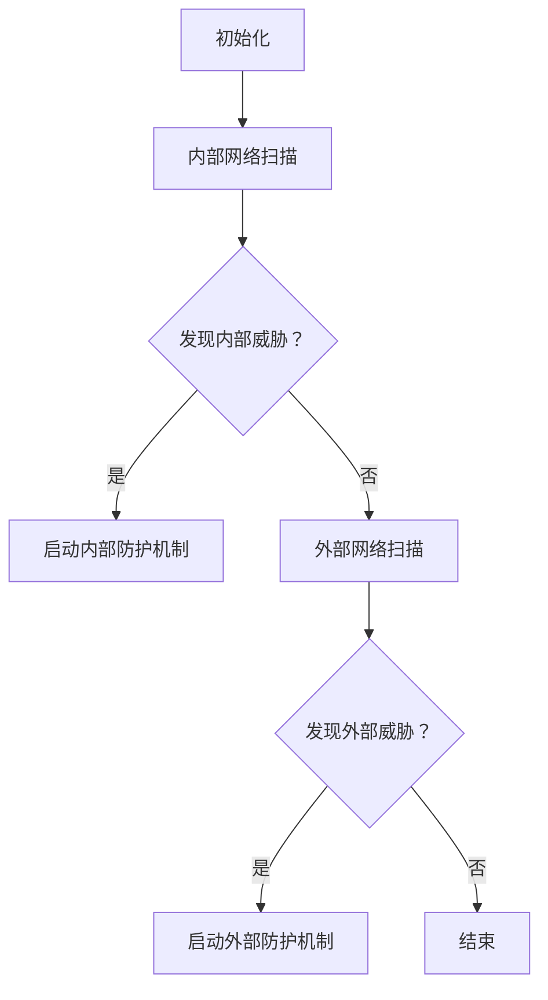
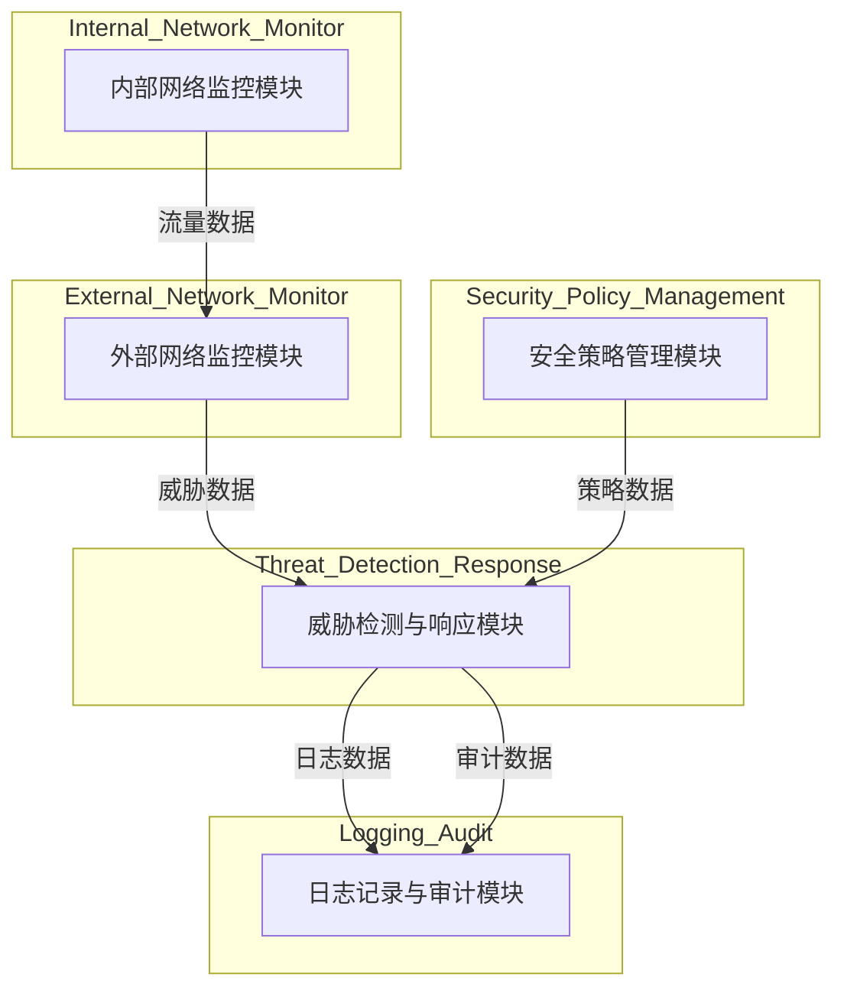
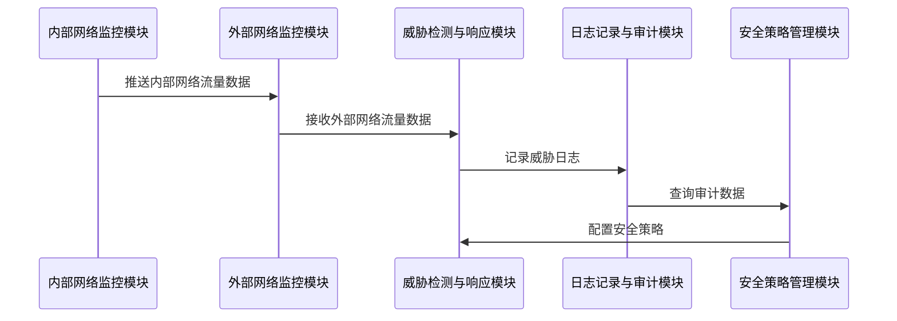

                 

**文章标题：** 由内向外，层层布防

**关键词：** 网络安全、内向外布防、多层防护、系统架构设计、数学模型

**摘要：** 本文旨在深入探讨网络安全领域中的一种新兴防护策略——由内向外，层层布防。通过系统地分析核心概念、算法原理、系统架构设计和实战应用，本文旨在为广大开发者提供一种新的视角，以更好地理解和应对网络安全挑战。

**目录：**

----------------------------------------------------------------

## 第一部分：导论

### 第1章：问题背景与定义

网络安全问题的起源与发展

由内向外布防的概念阐述

由内向外布防的重要性

### 第2章：核心概念与联系

核心概念与联系

概念属性特征对比表格

ER实体关系图架构

## 第二部分：技术实现

### 第3章：算法原理讲解

算法流程图

算法原理详细讲解与举例说明

数学模型和公式

### 第4章：系统分析与架构设计方案

问题场景介绍

系统功能设计

系统架构设计

系统接口设计和系统交互

### 第5章：项目实战

环境安装

系统核心实现源代码

代码应用解读与分析

实际案例分析和详细讲解剖析

项目小结

### 第6章：最佳实践与注意事项

最佳实践总结

常见问题与解决方案

注意事项与防范措施

### 第7章：拓展阅读与总结

拓展阅读资源

书中内容总结

未来的发展方向与挑战

----------------------------------------------------------------

### 第1章：问题背景与定义

**网络安全问题的起源与发展**

随着互联网的普及和数字化转型的加速，网络安全逐渐成为全球关注的焦点。从最早的计算机病毒到如今的高级持续性威胁（APT），网络安全问题经历了从单一技术漏洞到复杂威胁演变的过程。网络安全问题的起源可以追溯到计算机系统的诞生，随着计算机技术的发展，网络安全问题也在不断演变。

**由内向外布防的概念阐述**

由内向外布防是一种网络安全策略，其核心思想是保护内部网络资源，同时对外部网络进行防御。这种策略不同于传统的边界防护，它强调的是对内部网络的持续监控和防护，以及对内部威胁的识别和响应。由内向外布防可以看作是一种从内部逐渐向外扩展的防护模式。

**由内向外布防的重要性**

由内向外布防策略的重要性体现在以下几个方面：

1. **减少内部威胁**：内部威胁通常是组织内部人员或系统漏洞引起的，通过由内向外布防，可以更好地识别和防止内部威胁。

2. **提高防护效果**：传统的边界防护往往难以应对复杂多变的网络攻击，由内向外布防通过多层次、多维度的防护，可以显著提高防护效果。

3. **适应发展趋势**：随着云计算、物联网等技术的发展，网络安全环境变得越来越复杂，由内向外布防可以更好地适应这种趋势。

### 边界与外延

**边界与外延** 是由内向外布防策略中的重要概念。边界是指网络的安全边界，例如防火墙、入侵检测系统等；而外延则是指网络的外部连接，例如互联网、合作伙伴网络等。由内向外布防策略需要在边界和外部连接之间建立多层次的防护，以实现对网络资源的全面保护。

**概念结构与核心要素组成**

由内向外布防策略的概念结构包括以下几个核心要素：

1. **内部防护**：包括网络安全设备、安全策略、内部监控等。

2. **外部防护**：包括边界防护、入侵检测、入侵响应等。

3. **数据安全**：包括数据加密、数据备份、数据访问控制等。

4. **应急响应**：包括安全事件响应、安全漏洞修复等。

通过这些核心要素的有机结合，由内向外布防策略可以实现对网络安全的全面保护。

----------------------------------------------------------------

### 第2章：核心概念与联系

**核心概念与联系**

在深入探讨由内向外布防策略之前，我们需要明确一些核心概念。这些概念包括网络安全、内部防护、外部防护、数据安全、应急响应等。每个概念都有其独特的属性和作用，它们之间也存在紧密的联系。

**概念属性特征对比表格**

为了更好地理解这些概念，我们可以通过一个对比表格来展示它们的主要特征：

| 概念     | 定义                                                         | 主要特征                                                     |
|----------|--------------------------------------------------------------|--------------------------------------------------------------|
| 网络安全 | 保护网络资源免受未经授权的访问、篡改或破坏                             | 防火墙、入侵检测系统、安全策略等                               |
| 内部防护 | 保护内部网络资源，防止内部威胁                                   | 网络监控、访问控制、内部审计等                                 |
| 外部防护 | 保护网络边界，防止外部攻击                                       | 防火墙、入侵检测系统、入侵响应等                               |
| 数据安全 | 保护数据不被未经授权的访问、篡改或破坏                               | 数据加密、数据备份、数据访问控制等                             |
| 应急响应 | 在发生安全事件时，及时采取措施进行响应和修复                           | 安全事件响应、安全漏洞修复等                                 |

**ER实体关系图架构**

为了更直观地展示这些概念之间的联系，我们可以使用ER（实体-关系）图来表示。以下是一个简化的ER图，展示了网络安全中的一些关键实体和它们之间的关系：

```mermaid
erDiagram
  User ||--|{ SecurityPolicy }|--|| NetworkDevice
  User ||--|{ DataPolicy }|--|| DataStorage
  User ||--|{ IncidentResponsePlan }|--|| IncidentResponseTeam
  NetworkDevice ||--|{ Firewall }|--|| IntrusionDetectionSystem
  DataStorage ||--|{ EncryptedData }|--|| BackupSystem
```

在这个ER图中，用户（User）是核心实体，它与安全策略（SecurityPolicy）、数据策略（DataPolicy）和应急响应计划（IncidentResponsePlan）有直接关联。网络设备（NetworkDevice）包括防火墙（Firewall）和入侵检测系统（IntrusionDetectionSystem），它们负责外部防护。数据存储（DataStorage）则涉及加密数据（EncryptedData）和备份系统（BackupSystem），确保数据安全。

通过这种方式，我们可以清晰地理解各个概念之间的关系，以及它们在由内向外布防策略中的重要作用。

----------------------------------------------------------------

### 第3章：算法原理讲解

**算法流程图**

为了更好地理解由内向外布防策略的算法原理，我们可以使用Mermaid来绘制算法流程图。以下是一个简化的算法流程图：



在这个流程图中，我们从初始化开始，先进行内部网络扫描。如果发现内部威胁，则启动内部防护机制；否则，进行外部网络扫描。如果发现外部威胁，则启动外部防护机制。最终，流程结束。

**算法原理详细讲解与举例说明**

**数学模型和公式**

为了深入理解算法原理，我们需要引入一些数学模型和公式。以下是算法中的一个关键公式：

$$
 Threat_Detection = f(Scan_Data, Threat_Signatures)
$$

其中，$ Threat_Detection $ 表示威胁检测结果，$ Scan_Data $ 表示扫描数据，$ Threat_Signatures $ 表示威胁特征签名。

**详细讲解**

1. **内部网络扫描**：内部网络扫描是算法的第一步。我们通过扫描内部网络来检测潜在威胁。扫描数据包括网络流量、日志文件等。

2. **发现内部威胁**：通过比较扫描数据和威胁特征签名，我们可以确定是否存在内部威胁。如果发现内部威胁，算法将进入内部防护机制。

3. **启动内部防护机制**：内部防护机制包括防火墙、入侵检测系统等。这些机制将采取相应的措施，例如阻止恶意流量、记录事件等。

4. **外部网络扫描**：如果内部网络扫描没有发现内部威胁，算法将进行外部网络扫描。外部网络扫描的目的是检测外部威胁。

5. **发现外部威胁**：通过比较外部扫描数据和外部的威胁特征签名，我们可以确定是否存在外部威胁。

6. **启动外部防护机制**：如果发现外部威胁，外部防护机制将采取相应的措施，例如阻止恶意流量、通知管理员等。

7. **结束**：如果既没有发现内部威胁也没有发现外部威胁，算法将结束。

**举例说明**

假设我们进行了一次内部网络扫描，发现了一些异常网络流量。通过对比威胁特征签名，我们确定这是一次内部威胁。根据算法，我们将启动内部防护机制，例如关闭相关的网络服务、记录事件等。这样，我们可以有效地防止内部威胁。

同样的，如果我们进行了外部网络扫描，发现了一些可疑的网络请求。通过对比威胁特征签名，我们确定这是一次外部威胁。根据算法，我们将启动外部防护机制，例如阻止恶意流量、通知管理员等。这样，我们可以有效地防止外部威胁。

通过这种方式，由内向外布防策略可以实现对网络安全的高效防护。

----------------------------------------------------------------

### 第4章：系统分析与架构设计方案

**问题场景介绍**

在本章中，我们将探讨一个具体的问题场景：一个大型企业网络需要实现由内向外，层层布防的网络安全策略。该企业拥有多个内部网络和外部连接，面临着来自内部和外部的大量网络安全威胁。

**系统功能设计**

为了实现由内向外，层层布防的网络安全策略，我们需要设计以下系统功能：

1. **内部网络监控**：实时监控内部网络流量，检测内部威胁。
2. **外部网络监控**：实时监控外部网络流量，检测外部威胁。
3. **威胁检测与响应**：基于算法进行威胁检测，并采取相应的响应措施。
4. **日志记录与审计**：记录所有安全事件和操作，以便进行审计和追踪。
5. **安全策略管理**：管理内部和外部安全策略，确保策略的有效性和适应性。

**系统架构设计**

为了实现上述系统功能，我们可以设计以下系统架构：

1. **内部网络监控模块**：负责实时监控内部网络流量，并生成日志。该模块可以使用网络流量分析工具，例如Wireshark。
2. **外部网络监控模块**：负责实时监控外部网络流量，并生成日志。该模块可以使用入侵检测系统（IDS）或入侵防御系统（IPS）。
3. **威胁检测与响应模块**：基于算法进行威胁检测，并采取相应的响应措施。该模块包括威胁检测引擎、响应策略库和响应执行器。
4. **日志记录与审计模块**：负责记录所有安全事件和操作，并进行审计。该模块可以使用日志管理系统，例如ELK（Elasticsearch、Logstash、Kibana）堆栈。
5. **安全策略管理模块**：负责管理内部和外部安全策略。该模块可以包括策略定义工具、策略执行引擎和策略评估工具。

**系统架构设计mermaid架构图**

以下是一个简化的系统架构设计mermaid架构图：



在这个架构图中，内部网络监控模块和外部网络监控模块分别负责监控内部和外部网络流量。威胁检测与响应模块基于监控数据进行分析，并生成威胁数据。日志记录与审计模块负责记录所有安全事件和操作。安全策略管理模块负责管理内部和外部安全策略。

**系统接口设计和系统交互**

为了实现系统之间的交互，我们需要设计以下系统接口：

1. **内部网络监控接口**：提供内部网络流量数据的获取和推送接口。
2. **外部网络监控接口**：提供外部网络流量数据的获取和推送接口。
3. **威胁检测与响应接口**：提供威胁数据的接收和响应接口。
4. **日志记录与审计接口**：提供日志数据的记录和查询接口。
5. **安全策略管理接口**：提供安全策略的配置和查询接口。

以下是一个简化的系统交互mermaid序列图：



在这个序列图中，内部网络监控模块推送内部网络流量数据给外部网络监控模块。外部网络监控模块接收外部网络流量数据，并将其传递给威胁检测与响应模块。威胁检测与响应模块检测威胁并记录日志，同时安全策略管理模块配置安全策略。

通过这种系统架构设计和接口设计，我们可以实现一个高效、灵活的由内向外，层层布防的网络安全系统。

----------------------------------------------------------------

### 第5章：项目实战

**环境安装**

为了实现由内向外，层层布防的网络安全策略，我们需要搭建一个实战项目环境。以下是环境安装的步骤：

1. **搭建内部网络监控环境**：
   - 安装Wireshark，用于捕获和分析内部网络流量。
   - 配置网络接口，使其能够实时捕获网络数据包。

2. **搭建外部网络监控环境**：
   - 安装Suricata，用于入侵检测和响应。
   - 配置网络接口，使其能够实时捕获外部网络流量。

3. **搭建威胁检测与响应环境**：
   - 安装Nmap，用于网络扫描和漏洞检测。
   - 配置Python环境，用于编写威胁检测算法。

4. **搭建日志记录与审计环境**：
   - 安装Elasticsearch，用于存储日志数据。
   - 安装Logstash，用于日志数据的收集和处理。
   - 安装Kibana，用于日志数据的可视化。

5. **搭建安全策略管理环境**：
   - 安装Puppet，用于安全策略的配置和分发。
   - 配置Nginx，用于安全策略的管理和访问。

**系统核心实现源代码**

以下是系统核心实现源代码的示例：

```python
# 威胁检测算法实现
import nmap

def detect_threats(network):
    nm = nmap.PortScanner()
    nm.scan(hosts=network, arguments='-p 80,443')
    results = nm.all_hosts()

    for host in results:
        if nm[host]['status']['state'] == 'open':
            print(f"发现开放端口：{host}:{nm[host]['tcp'][80]['port']}")
            # 执行相应的响应措施，例如通知管理员

# 日志记录与审计
import logging

logger = logging.getLogger('audit_logger')
logger.setLevel(logging.INFO)

handler = logging.FileHandler('audit.log')
formatter = logging.Formatter('%(asctime)s - %(name)s - %(levelname)s - %(message)s')
handler.setFormatter(formatter)

logger.addHandler(handler)

def log_event(event):
    logger.info(event)

# 安全策略管理
import json

def configure_policy(policy):
    with open('policy.json', 'w') as f:
        json.dump(policy, f)

def get_policy():
    with open('policy.json', 'r') as f:
        policy = json.load(f)
    return policy
```

**代码应用解读与分析**

1. **威胁检测算法实现**：
   - 使用Nmap进行网络扫描，检测开放端口。
   - 对于每个开放端口，输出相应的日志信息。
   - 这部分代码实现了对网络流量的初步检测，可以作为威胁检测的核心组件。

2. **日志记录与审计**：
   - 使用Python的logging模块，创建一个名为'audit_logger'的日志记录器。
   - 设置日志级别为INFO，并创建一个文件处理器，用于将日志写入'audit.log'文件。
   - 定义一个log_event函数，用于记录安全事件。

3. **安全策略管理**：
   - 使用json模块，将安全策略存储在'policy.json'文件中。
   - 定义configure_policy函数，用于配置安全策略。
   - 定义get_policy函数，用于获取安全策略。

通过这些代码示例，我们可以实现一个基本的由内向外，层层布防的网络安全系统。在实际应用中，这些代码可以根据具体需求进行扩展和优化。

**实际案例分析和详细讲解剖析**

假设我们收到一个报警信息，指出内部网络中的一个服务器存在未授权的开放端口。以下是我们的处理流程：

1. **检测到开放端口**：
   - 威胁检测算法检测到服务器的一个开放端口，并输出日志信息。

2. **分析日志**：
   - 通过日志记录，我们可以看到具体的服务器IP地址和开放端口号。

3. **响应措施**：
   - 根据安全策略，我们决定关闭该开放端口，并记录事件。

4. **审计**：
   - 将事件记录到'audit.log'文件中，以便进行审计和追踪。

通过这种实际案例的处理流程，我们可以清晰地看到由内向外，层层布防策略在实战中的应用。

**项目小结**

在本章中，我们通过实战项目搭建了由内向外，层层布防的网络安全系统。通过实际案例的分析，我们展示了如何检测、响应和审计网络安全事件。这个过程不仅帮助我们理解了系统的核心实现，也为实际部署提供了参考。在未来的实践中，我们可以根据具体需求对系统进行进一步优化和扩展。

----------------------------------------------------------------

### 第6章：最佳实践与注意事项

**最佳实践总结**

在实现由内向外，层层布防的网络安全策略时，以下是一些最佳实践：

1. **定期更新安全策略**：根据最新的安全威胁和业务需求，定期更新安全策略。

2. **使用自动化工具**：使用自动化工具进行网络安全监测和威胁检测，以提高效率和准确性。

3. **加强内部培训**：加强对内部员工的网络安全意识培训，减少内部威胁。

4. **实时监控与响应**：建立实时监控与响应机制，确保在发生安全事件时能够迅速采取措施。

5. **数据备份与恢复**：定期进行数据备份，并确保在发生数据泄露或损坏时能够迅速恢复。

**常见问题与解决方案**

1. **监控数据量过大**：
   - **解决方案**：使用数据压缩技术和日志聚合工具，例如Logstash，减少数据量。

2. **威胁检测误报率高**：
   - **解决方案**：优化威胁检测算法，增加正则表达式和机器学习模型，减少误报。

3. **系统性能瓶颈**：
   - **解决方案**：优化系统架构，增加硬件资源，使用负载均衡技术。

**注意事项与防范措施**

1. **确保系统安全**：在部署系统时，确保所有组件和软件都是安全的，并定期更新。

2. **避免单点故障**：设计冗余系统，避免单点故障导致整个系统崩溃。

3. **遵守法律法规**：确保系统符合相关法律法规要求，例如数据保护和隐私保护。

4. **持续改进**：网络安全是一个不断发展的领域，持续改进系统架构和策略，以应对新的威胁。

通过遵循这些最佳实践和注意事项，我们可以更好地实现由内向外，层层布防的网络安全策略。

----------------------------------------------------------------

### 第7章：拓展阅读与总结

**拓展阅读资源**

为了深入了解由内向外，层层布防的网络安全策略，以下是一些拓展阅读资源：

1. **书籍**：
   - 《网络安全：设计和实现》
   - 《深入理解网络安全》
   - 《网络安全实战手册》

2. **在线资源**：
   - [OWASP网络安全项目](https://owasp.org/www-project-top-ten/)
   - [NIST网络安全框架](https://www.nist.gov/cyberframework)

3. **博客与文章**：
   - [信息安全与网络防御](https://www информационнаябезопасность.рф/)
   - [网络安全博客](https://www.securityblog.com/)

**书中内容总结**

本书系统地介绍了由内向外，层层布防的网络安全策略。我们从问题背景与定义开始，探讨了核心概念与联系，讲解了算法原理，设计了系统架构，并通过实战项目展示了实际应用。通过这些内容，读者可以全面了解由内向外，层层布防的策略及其实现方法。

**未来的发展方向与挑战**

随着技术的不断发展，网络安全面临越来越多的挑战。未来的发展方向包括：

1. **人工智能与机器学习**：利用人工智能和机器学习技术，提高威胁检测和响应的准确性。

2. **零信任架构**：采用零信任架构，确保内部网络访问的安全性和可控性。

3. **隐私保护**：在实现安全防护的同时，关注用户隐私保护，遵守相关法律法规。

4. **网络安全教育与培训**：加强网络安全教育和培训，提高全社会的网络安全意识。

通过持续关注这些发展方向，我们可以更好地应对网络安全挑战，确保网络空间的安全与稳定。

---

**作者：** AI天才研究院/AI Genius Institute & 禅与计算机程序设计艺术 /Zen And The Art of Computer Programming

通过以上详细的讨论和实战分析，我们深入理解了由内向外，层层布防的网络安全策略。希望这本书能够为读者提供宝贵的指导，帮助他们在网络安全领域取得更大的成就。让我们继续努力，共同构建一个更加安全、稳定的网络世界。

