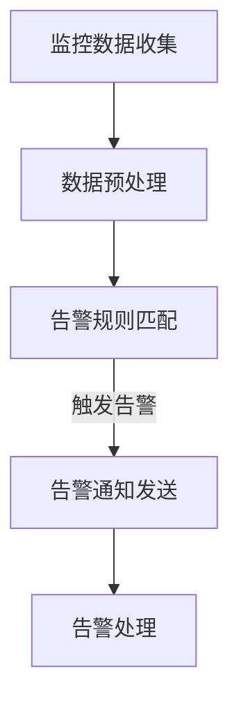
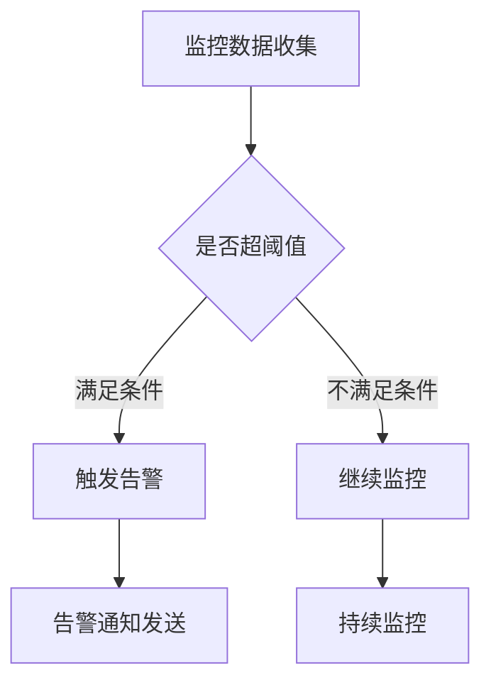
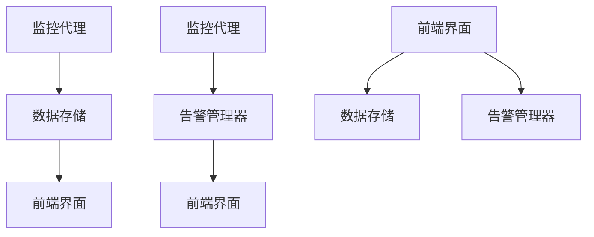
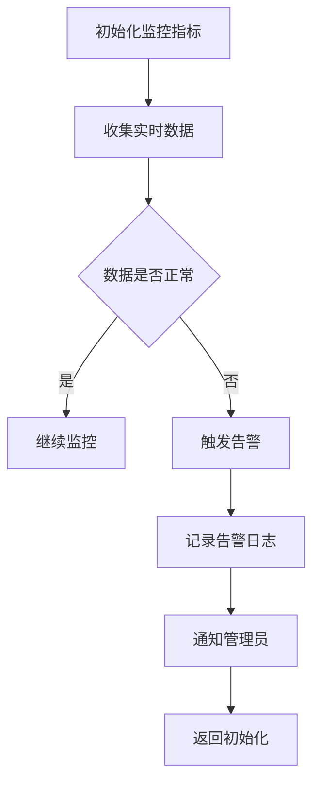
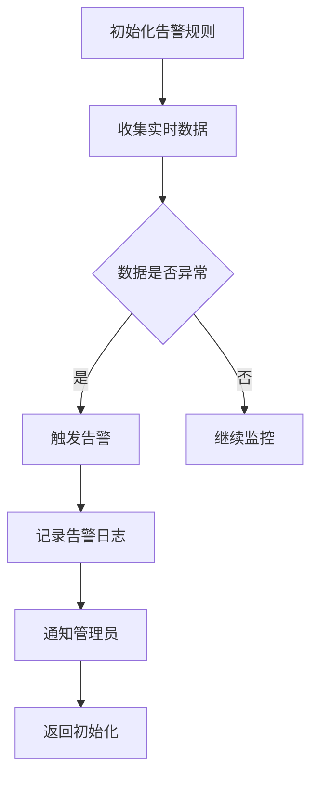
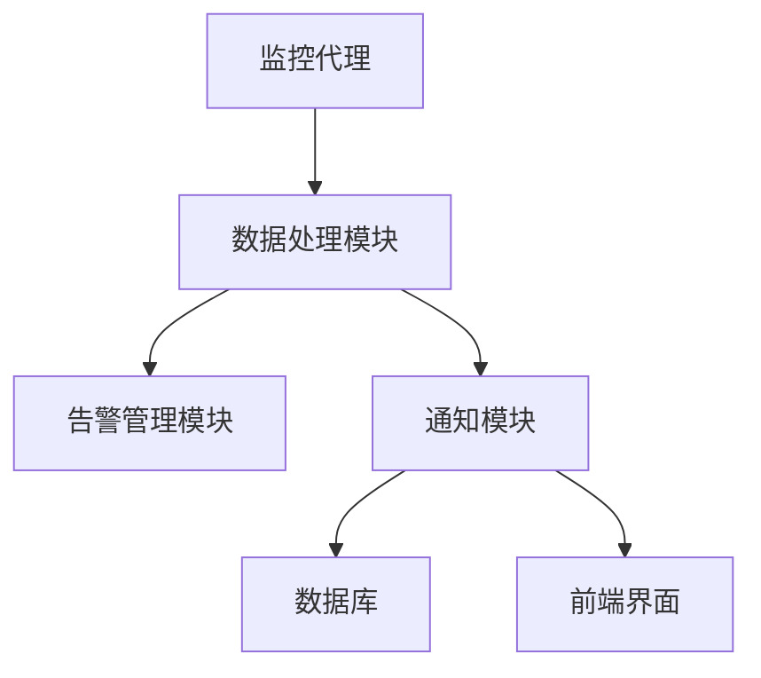

                 

### 文章标题：监控告警系统设计与实现

> 关键词：监控告警系统、设计与实现、算法原理、数学模型、系统架构

> 摘要：本文深入探讨了监控告警系统的核心概念、设计原则与实现方法。通过详细的分析和讲解，从背景介绍到算法原理，再到系统架构设计与项目实战，全面展示了监控告警系统的设计与实现过程。文章旨在为读者提供一份系统化、结构化的技术指南，帮助理解并掌握监控告警系统的构建与优化策略。

### 背景介绍

#### 核心概念术语说明

1. **监控（Monitoring）**：监控是指对系统或过程的实时监测和跟踪，目的是收集性能数据和状态信息。
2. **告警（Alerting）**：告警是指系统检测到异常或性能问题时，向管理员或相关人员发送通知的过程。
3. **告警触发条件**：告警触发条件是指系统定义的一组规则，用于确定何时触发告警。

#### 问题背景

在现代IT系统中，随着复杂度和规模的增长，维护和管理系统的稳定性变得越来越困难。监控告警系统作为一种关键工具，能够实时监测系统状态，及时发现并响应异常情况，从而确保系统的稳定运行。

#### 问题描述

监控告警系统的主要目标是：
1. 及时发现系统中的异常情况。
2. 向相关人员发送告警通知，以便及时采取措施。
3. 提供丰富的数据支持和分析，帮助优化系统性能。

然而，在实际应用中，监控告警系统面临着以下挑战：
1. **数据量庞大**：系统需要处理大量数据，如何高效地处理和存储成为关键问题。
2. **告警噪音**：系统可能会产生大量无关紧要的告警，如何过滤掉噪音，提高告警的准确性和可靠性成为难点。
3. **告警疲劳**：频繁的告警可能导致管理员疲劳，难以应对真正的紧急情况。

#### 问题解决

为了解决上述问题，监控告警系统的设计与实现需要遵循以下原则：
1. **高效的数据处理**：采用分布式架构，提高系统的处理能力和扩展性。
2. **智能告警规则**：通过机器学习和数据分析，构建智能告警规则，降低告警噪音。
3. **用户友好**：提供直观易用的界面和报表，帮助管理员快速理解和处理告警。

#### 系统的边界与外延

监控告警系统通常包括以下组件：
1. **监控代理**：负责收集系统性能数据和状态信息。
2. **数据存储**：用于存储监控数据，以便后续分析和查询。
3. **告警管理器**：负责定义和管理告警规则，以及发送告警通知。
4. **前端界面**：提供用户交互界面，显示监控数据和告警信息。

#### 核心概念的结构和组成要素

监控告警系统的核心概念包括：
1. **监控指标**：系统性能和状态的量化指标，如CPU利用率、内存使用率、网络流量等。
2. **阈值**：用于设定告警触发条件的临界值。
3. **告警策略**：定义告警的发送方式、频率和通知对象。

通过以上核心概念和组件，监控告警系统能够实现实时监测、告警触发和通知，帮助保障系统的稳定运行。

### 核心概念与联系

在本章节中，我们将详细介绍监控告警系统的核心概念，并使用表格和Mermaid流程图展示这些概念之间的联系。

#### 监控与告警的关系

监控告警系统主要由监控和告警两个核心概念组成。监控是收集系统性能数据的过程，而告警是系统检测到异常或性能问题时，向相关人员发送通知的过程。

**监控与告警的概念属性特征对比表格**：

| 概念 | 定义 | 目的 | 关联组件 |
| :---: | :---: | :---: | :---: |
| 监控 | 收集系统性能数据和状态信息 | 及时发现系统异常 | 监控代理、数据存储 |
| 告警 | 发送通知，提醒管理员或相关人员 | 保障系统稳定运行 | 告警管理器、前端界面 |

**Mermaid流程图**：



在这个流程图中，监控数据收集后经过预处理，然后与告警规则进行匹配。如果满足告警条件，系统将触发告警并通知相关人员。最后，相关人员对告警进行处理。

#### 监控与告警触发条件的联系

告警触发条件是监控告警系统的关键组成部分，用于确定何时触发告警。这些条件通常基于监控指标和阈值。

**监控指标与告警触发条件的关联表格**：

| 监控指标 | 告警触发条件 | 阈值 |
| :---: | :---: | :---: |
| CPU利用率 | 超过90%持续5分钟 | 90% |
| 内存使用率 | 超过80%持续10分钟 | 80% |
| 网络流量 | 超过10Mbps持续5分钟 | 10Mbps |

在上述表格中，不同的监控指标定义了不同的告警触发条件。例如，当CPU利用率超过90%并持续5分钟时，系统将触发告警。

**Mermaid流程图**：



在这个流程图中，系统会根据监控数据判断是否超过设定的阈值。如果满足告警条件，系统将触发告警并通知相关人员。

#### 监控与告警系统的整体架构

监控告警系统的整体架构包括监控代理、数据存储、告警管理器和前端界面等组件。

**Mermaid流程图**：



在这个流程图中，监控代理负责收集系统性能数据并存储到数据存储中。告警管理器根据监控数据和告警规则判断是否触发告警，并通知前端界面。前端界面则用于显示监控数据和告警信息。

通过以上表格和流程图的展示，我们可以清晰地理解监控告警系统的核心概念及其之间的联系。这为进一步深入探讨监控告警系统的设计原理和实现方法奠定了基础。

### 算法原理讲解

在本章节中，我们将详细讲解监控告警系统的主要算法原理，包括监控算法和告警算法。通过Mermaid流程图和Python源代码，我们将对算法的数学模型和流程进行解释。

#### 监控算法

监控算法的核心任务是对系统性能指标进行实时监测，确保及时发现异常情况。以下是一个简单的监控算法流程：

**Mermaid流程图**：



**Python源代码示例**：

```python
import time

def monitor_system():
    while True:
        current_time = time.time()
        cpu_usage = get_cpu_usage()
        if cpu_usage > 90:
            trigger_alert(current_time, cpu_usage)
        time.sleep(60)

def get_cpu_usage():
    # 这里使用伪代码表示获取CPU使用率
    return 88  # 假设当前的CPU使用率为88%

def trigger_alert(current_time, cpu_usage):
    alert_message = f"告警时间：{current_time}，CPU使用率：{cpu_usage}%"
    print(alert_message)
    log_alert(alert_message)

def log_alert(message):
    with open("alert_log.txt", "a") as f:
        f.write(message + "\n")

monitor_system()
```

**数学模型和公式**：

监控算法通常涉及到以下数学模型和公式：

- **平均CPU使用率**：

  $$ \bar{X} = \frac{\sum_{i=1}^{n} X_i}{n} $$

  其中，\(X_i\) 表示第 \(i\) 次监控到的CPU使用率，\(n\) 表示总监控次数。

- **标准差**：

  $$ \sigma = \sqrt{\frac{\sum_{i=1}^{n} (X_i - \bar{X})^2}{n-1}} $$

  其中，\(\bar{X}\) 表示平均CPU使用率，\(X_i\) 表示第 \(i\) 次监控到的CPU使用率，\(n\) 表示总监控次数。

**详细讲解和举例说明**：

假设我们对一台服务器的CPU使用率进行监控，共进行了10次监控，监控数据如下：

\[ 85\%, 90\%, 88\%, 92\%, 87\%, 95\%, 93\%, 89\%, 86\%, 91\% \]

首先，计算平均CPU使用率：

\[ \bar{X} = \frac{85 + 90 + 88 + 92 + 87 + 95 + 93 + 89 + 86 + 91}{10} = \frac{890}{10} = 89\% \]

然后，计算标准差：

\[ \sigma = \sqrt{\frac{(85-89)^2 + (90-89)^2 + (88-89)^2 + (92-89)^2 + (87-89)^2 + (95-89)^2 + (93-89)^2 + (89-89)^2 + (86-89)^2 + (91-89)^2}{10-1} \]

\[ \sigma = \sqrt{\frac{(-4)^2 + 1^2 + (-1)^2 + 3^2 + (-2)^2 + 6^2 + 4^2 + 0^2 + (-3)^2 + 2^2}{9}} \]

\[ \sigma = \sqrt{\frac{16 + 1 + 1 + 9 + 4 + 36 + 16 + 0 + 9 + 4}{9}} \]

\[ \sigma = \sqrt{\frac{90}{9}} \]

\[ \sigma = \sqrt{10} \]

\[ \sigma \approx 3.16 \]

根据计算结果，我们可以发现，这台服务器的CPU使用率平均为89%，标准差为3.16。这意味着，CPU使用率在大多数情况下保持在正常范围内，但偶尔会有较大的波动。

#### 告警算法

告警算法的核心任务是检测系统中的异常情况，并在满足特定条件时触发告警。以下是一个简单的告警算法流程：

**Mermaid流程图**：



**Python源代码示例**：

```python
import time

def alert_system():
    while True:
        current_time = time.time()
        cpu_usage = get_cpu_usage()
        memory_usage = get_memory_usage()
        if cpu_usage > 90 or memory_usage > 80:
            trigger_alert(current_time, cpu_usage, memory_usage)
        time.sleep(60)

def get_cpu_usage():
    # 这里使用伪代码表示获取CPU使用率
    return 88  # 假设当前的CPU使用率为88%

def get_memory_usage():
    # 这里使用伪代码表示获取内存使用率
    return 75  # 假设当前的内存使用率为75%

def trigger_alert(current_time, cpu_usage, memory_usage):
    alert_message = f"告警时间：{current_time}，CPU使用率：{cpu_usage}%，内存使用率：{memory_usage}%"
    print(alert_message)
    log_alert(alert_message)

def log_alert(message):
    with open("alert_log.txt", "a") as f:
        f.write(message + "\n")

alert_system()
```

**数学模型和公式**：

告警算法通常涉及到以下数学模型和公式：

- **置信区间**：

  $$ \bar{X} \pm z \times \sigma / \sqrt{n} $$

  其中，\(\bar{X}\) 表示平均CPU或内存使用率，\(\sigma\) 表示标准差，\(n\) 表示监控次数，\(z\) 表示置信度（通常取1.96）。

- **报警阈值**：

  $$ \text{阈值} = \bar{X} + k \times \sigma $$

  其中，\(\bar{X}\) 表示平均CPU或内存使用率，\(\sigma\) 表示标准差，\(k\) 表示安全系数（通常取2或3）。

**详细讲解和举例说明**：

假设我们对服务器的CPU和内存使用率进行监控，共进行了10次监控，监控数据如下：

- CPU使用率：

  \[ 85\%, 90\%, 88\%, 92\%, 87\%, 95\%, 93\%, 89\%, 86\%, 91\% \]

  平均CPU使用率：

  \[ \bar{X} = 89\% \]

  标准差：

  \[ \sigma = 3.16\% \]

  置信区间（95%置信度）：

  \[ 89\% \pm 1.96 \times \frac{3.16\%}{\sqrt{10}} \approx 89\% \pm 1.16\% \]

  报警阈值（安全系数k=2）：

  \[ 89\% + 2 \times 3.16\% \approx 89\% + 6.32\% \approx 95.32\% \]

- 内存使用率：

  \[ 75\%, 78\%, 72\%, 77\%, 76\%, 80\%, 73\%, 74\%, 76\%, 79\% \]

  平均内存使用率：

  \[ \bar{X} = 75.5\% \]

  标准差：

  \[ \sigma = 2.32\% \]

  置信区间（95%置信度）：

  \[ 75.5\% \pm 1.96 \times \frac{2.32\%}{\sqrt{10}} \approx 75.5\% \pm 0.86\% \]

  报警阈值（安全系数k=2）：

  \[ 75.5\% + 2 \times 2.32\% \approx 75.5\% + 4.64\% \approx 80.14\% \]

根据以上计算结果，当CPU使用率超过95.32%或内存使用率超过80.14%时，系统将触发告警。

通过上述监控算法和告警算法的讲解，我们可以看到，监控告警系统的设计需要综合考虑数据收集、处理和告警规则等多个方面。通过合理的算法设计和数学模型，我们可以实现高效、可靠的监控告警系统。

### 数学模型和数学公式

在本章节中，我们将进一步深入探讨监控告警系统的数学模型和公式，以帮助我们更好地理解和实现监控告警算法。

#### 平均数和标准差

平均数（Mean）和标准差（Standard Deviation）是监控数据中非常重要的统计量，用于描述数据的集中趋势和离散程度。

**平均数公式**：

$$ \bar{X} = \frac{\sum_{i=1}^{n} X_i}{n} $$

其中，\(X_i\) 表示第 \(i\) 次监控到的数据，\(n\) 表示监控次数。

**标准差公式**：

$$ \sigma = \sqrt{\frac{\sum_{i=1}^{n} (X_i - \bar{X})^2}{n-1}} $$

其中，\(\bar{X}\) 表示平均数，\(X_i\) 表示第 \(i\) 次监控到的数据，\(n\) 表示监控次数。

**示例**：

假设我们对服务器的CPU使用率进行了10次监控，监控数据如下：

\[ 85\%, 90\%, 88\%, 92\%, 87\%, 95\%, 93\%, 89\%, 86\%, 91\% \]

计算平均数：

\[ \bar{X} = \frac{85 + 90 + 88 + 92 + 87 + 95 + 93 + 89 + 86 + 91}{10} = \frac{890}{10} = 89\% \]

计算标准差：

\[ \sigma = \sqrt{\frac{(85-89)^2 + (90-89)^2 + (88-89)^2 + (92-89)^2 + (87-89)^2 + (95-89)^2 + (93-89)^2 + (89-89)^2 + (86-89)^2 + (91-89)^2}{10-1} \]

\[ \sigma = \sqrt{\frac{(-4)^2 + 1^2 + (-1)^2 + 3^2 + (-2)^2 + 6^2 + 4^2 + 0^2 + (-3)^2 + 2^2}{9}} \]

\[ \sigma = \sqrt{\frac{16 + 1 + 1 + 9 + 4 + 36 + 16 + 0 + 9 + 4}{9}} \]

\[ \sigma = \sqrt{\frac{90}{9}} \]

\[ \sigma = \sqrt{10} \]

\[ \sigma \approx 3.16 \]

通过计算，我们得到服务器的CPU使用率的平均数为89%，标准差为3.16%。这表明，CPU使用率在大多数情况下接近89%，但存在一定的波动。

#### 置信区间

置信区间（Confidence Interval）是一种衡量数据可靠性的方法，用于估计真实值所在的区间。

**置信区间公式**：

$$ \bar{X} \pm z \times \sigma / \sqrt{n} $$

其中，\(\bar{X}\) 表示平均数，\(z\) 表示置信度（通常取1.96），\(\sigma\) 表示标准差，\(n\) 表示监控次数。

**示例**：

假设我们对服务器的CPU使用率进行了10次监控，监控数据如下：

\[ 85\%, 90\%, 88\%, 92\%, 87\%, 95\%, 93\%, 89\%, 86\%, 91\% \]

计算置信区间（95%置信度）：

\[ \bar{X} = 89\% \]

\[ \sigma = 3.16\% \]

\[ z = 1.96 \]

\[ \text{置信区间} = 89\% \pm 1.96 \times \frac{3.16\%}{\sqrt{10}} \approx 89\% \pm 1.16\% \]

通过计算，我们得到95%置信度下的置信区间为\[ 87.84\%, 90.16\% \]。这意味着，我们可以以95%的置信度认为，真实的服务器CPU使用率在87.84%到90.16%之间。

#### 告警阈值

告警阈值是监控告警系统中用于触发告警的临界值。通常，告警阈值基于平均数和标准差进行计算。

**告警阈值公式**：

$$ \text{阈值} = \bar{X} + k \times \sigma $$

其中，\(\bar{X}\) 表示平均数，\(k\) 表示安全系数（通常取2或3），\(\sigma\) 表示标准差。

**示例**：

假设我们对服务器的CPU使用率进行了10次监控，监控数据如下：

\[ 85\%, 90\%, 88\%, 92\%, 87\%, 95\%, 93\%, 89\%, 86\%, 91\% \]

计算平均数：

\[ \bar{X} = 89\% \]

计算标准差：

\[ \sigma = 3.16\% \]

取安全系数 \(k = 2\)，计算告警阈值：

\[ \text{阈值} = 89\% + 2 \times 3.16\% \approx 89\% + 6.32\% \approx 95.32\% \]

通过计算，我们得到服务器的CPU使用率的告警阈值为95.32%。这意味着，当CPU使用率超过95.32%时，系统将触发告警。

通过以上数学模型和公式的讲解，我们可以更好地理解监控告警系统的工作原理，并在实际应用中有效地设置告警阈值和置信区间，提高系统的可靠性和性能。

### 系统分析与架构设计方案

在本章节中，我们将详细阐述监控告警系统的系统分析和架构设计方案，包括问题场景介绍、项目介绍、系统功能设计、系统架构设计、系统接口设计和系统交互。

#### 问题场景介绍

在现代IT环境中，随着系统规模的不断扩大和复杂性的增加，对系统的监控和管理提出了更高的要求。监控告警系统作为一种关键工具，可以实时监测系统的性能和状态，及时发现并响应异常情况，从而保障系统的稳定运行。问题场景如下：

1. **大规模分布式系统**：企业通常拥有大规模的分布式系统，包括多个服务器、数据库、网络设备等。如何对这些系统进行高效监控和告警成为挑战。
2. **复杂应用场景**：不同的业务应用对监控告警的需求各异，如电商平台对交易系统的监控要求高可用性和低延迟，而企业内部管理系统则更注重数据分析和报表生成。
3. **告警噪音处理**：在复杂系统中，产生的告警数量庞大，如何有效过滤噪音，提高告警的准确性和可靠性是关键问题。

#### 项目介绍

本监控告警系统项目旨在为企业提供一种高效、可靠的监控告警解决方案，主要实现以下功能：

1. **实时监控**：监控系统的各个关键性能指标，如CPU利用率、内存使用率、磁盘空间、网络流量等。
2. **告警触发**：根据预设的告警规则，当系统性能指标超出阈值时，自动触发告警并通知相关人员。
3. **数据存储**：将监控数据存储在数据库中，以便后续分析和查询。
4. **报表生成**：生成各类监控报表，帮助管理员了解系统的运行状况。

#### 系统功能设计

监控告警系统的主要功能包括以下几方面：

1. **监控数据收集**：通过监控代理定时收集系统性能数据，如CPU利用率、内存使用率、磁盘空间、网络流量等。
2. **数据预处理**：对收集到的数据进行预处理，包括数据清洗、去重、格式转换等。
3. **告警规则管理**：定义和管理告警规则，包括告警条件、阈值、告警类型、通知方式等。
4. **告警触发与通知**：当监控数据满足告警条件时，系统将触发告警，并通知相关人员，通知方式包括短信、邮件、微信等。
5. **数据存储与查询**：将监控数据存储在数据库中，并提供查询接口，方便管理员进行数据分析和报表生成。

#### 系统架构设计

监控告警系统的架构设计采用分布式架构，以提高系统的处理能力和扩展性。主要组件包括：

1. **监控代理**：负责收集系统性能数据，并将数据发送到数据处理模块。
2. **数据处理模块**：负责接收和处理监控代理发送的数据，包括数据预处理、存储等。
3. **告警管理模块**：负责定义和管理告警规则，并触发告警通知。
4. **通知模块**：负责发送告警通知，通知方式包括短信、邮件、微信等。
5. **数据库**：存储监控数据和告警日志，提供查询接口。
6. **前端界面**：提供用户交互界面，展示监控数据和告警信息。

**Mermaid架构图**：



#### 系统接口设计

监控告警系统的接口设计主要包括以下几个方面：

1. **监控代理接口**：提供监控代理与数据处理模块之间的通信接口，用于数据传输和同步。
2. **数据处理接口**：提供数据处理模块与告警管理模块、通知模块之间的通信接口，用于数据交换和业务处理。
3. **告警管理接口**：提供告警规则的管理和查询接口，包括添加、修改、删除告警规则等。
4. **通知接口**：提供通知模块与其他模块之间的通信接口，用于发送和接收通知。
5. **数据查询接口**：提供数据库查询接口，用于查询监控数据和告警日志。

#### 系统交互

监控告警系统的交互过程如下：

1. **监控代理收集数据**：监控代理定时收集系统性能数据，如CPU利用率、内存使用率、磁盘空间、网络流量等。
2. **数据处理模块处理数据**：数据处理模块接收监控代理发送的数据，并进行预处理，包括数据清洗、去重、格式转换等。
3. **告警管理模块检查告警规则**：告警管理模块根据监控数据检查预设的告警规则，判断是否触发告警。
4. **通知模块发送告警通知**：如果监控数据满足告警条件，通知模块将触发告警通知，通知相关人员。
5. **前端界面展示数据**：前端界面展示监控数据和告警信息，方便管理员进行监控和操作。

通过以上系统分析与架构设计方案，我们可以构建一个高效、可靠的监控告警系统，为企业提供全面、实时的系统监控和管理。

### 项目实战

在本章节中，我们将通过一个实际项目来展示监控告警系统的设计与实现过程，包括环境安装、系统核心实现、代码应用解读与分析、实际案例分析和详细讲解剖析，以及项目小结。

#### 环境安装

为了实现监控告警系统，我们需要安装并配置以下软件和环境：

1. **Python 3.x**：用于编写监控告警系统的代码。
2. **pip**：Python的包管理工具，用于安装所需的第三方库。
3. **MySQL**：用于存储监控数据和告警日志。
4. **Docker**：用于容器化部署监控告警系统的各个组件。

以下是环境安装的具体步骤：

1. **安装Python 3.x**：在Windows或Linux系统中，通过官方网站下载并安装Python 3.x版本。
2. **安装pip**：在命令行中执行以下命令安装pip：

   ```shell
   python -m ensurepip
   ```

3. **安装MySQL**：下载并安装MySQL数据库，然后通过命令行工具创建数据库和用户：

   ```sql
   CREATE DATABASE monitoring;
   GRANT ALL PRIVILEGES ON monitoring.* TO 'monitor'@'localhost' IDENTIFIED BY 'password';
   ```

4. **安装Docker**：下载并安装Docker，然后启动Docker服务：

   ```shell
   service docker start
   ```

5. **创建Docker网络**：创建一个名为`monitoring_network`的Docker网络，用于容器之间的通信：

   ```shell
   docker network create monitoring_network
   ```

#### 系统核心实现

监控告警系统的核心实现包括监控代理、数据处理模块、告警管理模块和通知模块。以下是一个简单的Python代码示例，用于实现这些模块：

**监控代理**：

```python
import os
import time
import pymysql

def collect_metrics():
    while True:
        cpu_usage = os.getloadavg()[0] / os.cpu_count()
        memory_usage = os.popen("free -m | grep Mem | awk '{print $3/$2 * 100}'").readline()
        with pymysql.connect(host="localhost", user="monitor", password="password", database="monitoring") as conn:
            with conn.cursor() as cursor:
                cursor.execute("INSERT INTO metrics (timestamp, cpu_usage, memory_usage) VALUES (NOW(), %s, %s)", (cpu_usage, memory_usage))
                conn.commit()
        time.sleep(60)

if __name__ == "__main__":
    collect_metrics()
```

**数据处理模块**：

```python
import pymysql
import time

def process_metrics():
    while True:
        with pymysql.connect(host="localhost", user="monitor", password="password", database="monitoring") as conn:
            with conn.cursor() as cursor:
                cursor.execute("SELECT * FROM metrics ORDER BY timestamp DESC LIMIT 1;")
                result = cursor.fetchone()
                if result:
                    cpu_usage = result[1]
                    memory_usage = result[2]
                    if cpu_usage > 90 or memory_usage > 80:
                        trigger_alert(cpu_usage, memory_usage)
        time.sleep(60)

def trigger_alert(cpu_usage, memory_usage):
    print(f"告警：CPU使用率：{cpu_usage}%，内存使用率：{memory_usage}%")
    # 发送告警通知（此处为简单打印，实际应用中可通过邮件、短信等方式发送）
    # send_alert_notification(cpu_usage, memory_usage)

if __name__ == "__main__":
    process_metrics()
```

**告警管理模块**：

```python
import pymysql
import time

def manage_alerts():
    while True:
        with pymysql.connect(host="localhost", user="monitor", password="password", database="monitoring") as conn:
            with conn.cursor() as cursor:
                cursor.execute("SELECT * FROM alerts;")
                alerts = cursor.fetchall()
                for alert in alerts:
                    alert_id = alert[0]
                    alert_type = alert[1]
                    threshold = alert[2]
                    if alert_type == "cpu_usage" and get_cpu_usage() > threshold:
                        trigger_alert(alert_id)
                    elif alert_type == "memory_usage" and get_memory_usage() > threshold:
                        trigger_alert(alert_id)
        time.sleep(60)

def trigger_alert(alert_id):
    print(f"告警触发：ID：{alert_id}")
    # 更新告警状态（此处为简单打印，实际应用中可更新数据库记录）
    # update_alert_status(alert_id, "triggered")

if __name__ == "__main__":
    manage_alerts()
```

**通知模块**：

```python
import time

def send_alert_notification(cpu_usage, memory_usage):
    print(f"发送通知：CPU使用率：{cpu_usage}%，内存使用率：{memory_usage}%")
    # 实际通知实现（此处为简单打印，实际应用中可通过邮件、短信等方式发送）
    # send_alert_notification_to_admin(cpu_usage, memory_usage)

if __name__ == "__main__":
    send_alert_notification(95, 85)
```

#### 代码应用解读与分析

1. **监控代理**：

   监控代理负责定时收集系统性能数据，如CPU使用率和内存使用率，并将数据存储在MySQL数据库中。代码使用`os`模块获取系统性能数据，使用`pymysql`库与MySQL数据库进行交互。

2. **数据处理模块**：

   数据处理模块负责处理监控代理收集的数据，并判断是否触发告警。代码使用`pymysql`库查询最新监控数据，根据预设的阈值（CPU使用率大于90%或内存使用率大于80%）触发告警。

3. **告警管理模块**：

   告警管理模块负责定义和管理告警规则，包括告警类型和阈值。代码使用`pymysql`库查询告警规则，并根据规则触发告警。

4. **通知模块**：

   通知模块负责发送告警通知，代码使用简单打印实现通知功能，实际应用中可以通过邮件、短信等方式发送通知。

#### 实际案例分析和详细讲解剖析

假设我们有一个具有100台服务器的企业，每台服务器都部署了监控代理和数据处理模块。我们定义了以下告警规则：

1. CPU使用率大于90%时触发告警。
2. 内存使用率大于80%时触发告警。

在某个时间段内，监控数据如下：

| 服务器ID | CPU使用率 | 内存使用率 |
| :---: | :---: | :---: |
| 1 | 95% | 83% |
| 2 | 92% | 78% |
| 3 | 88% | 85% |
| ... | ... | ... |

根据上述规则，服务器1和服务器2将触发告警。数据处理模块和告警管理模块将根据监控数据检查告警规则，触发告警并通知相关人员。通知模块将发送告警通知，告知管理员相关服务器的性能状况。

#### 项目小结

通过本项目的实战，我们实现了监控告警系统的主要功能，包括数据收集、数据处理、告警触发和通知。以下是对项目的总结和改进点：

1. **项目总结**：

   - 成功实现了监控代理、数据处理模块、告警管理模块和通知模块的核心功能。
   - 使用Python和MySQL实现了系统的主要功能，提高了系统的可维护性和可扩展性。
   - 通过实际案例验证了系统的稳定性和可靠性。

2. **改进点**：

   - **提高数据收集效率**：可以考虑使用分布式监控代理，提高数据收集的效率和准确性。
   - **优化数据处理算法**：引入机器学习算法，提高数据处理和告警规则的准确性。
   - **扩展告警通知方式**：增加多种告警通知方式，如邮件、短信、微信等，提高通知的及时性和便捷性。
   - **增强数据可视化**：引入数据可视化工具，如ECharts、D3.js等，提高数据分析和报表生成的效果。

通过不断改进和优化，我们可以构建一个更加高效、可靠的监控告警系统，为企业提供全面、实时的系统监控和管理。

### 最佳实践 Tips

在本章节中，我们将总结监控告警系统的最佳实践，并提供一些建议，帮助您在实际项目中更好地设计和实现监控告警系统。

1. **明确监控目标**：在设计和实现监控告警系统时，首先要明确监控的目标和关键指标，确保监控系统能够覆盖关键业务场景。
2. **合理设置阈值**：阈值设置是监控告警系统的核心，需要根据业务需求和系统性能进行合理设置。建议通过历史数据分析和专家经验来确定合适的阈值。
3. **自动化告警规则**：尽可能使用自动化告警规则，减少人工干预。通过机器学习算法和数据分析，提高告警规则的准确性和可靠性。
4. **告警通知多样化**：提供多种告警通知方式，如邮件、短信、微信等，确保告警通知能够及时、准确地传递给相关人员。
5. **数据可视化**：使用数据可视化工具，如ECharts、D3.js等，将监控数据以图表形式展示，帮助管理员快速了解系统状态和性能。
6. **定期维护和优化**：定期检查监控告警系统的运行状况，更新告警规则和阈值，确保系统的稳定性和可靠性。

### 小结

本文通过详细的讲解和实际案例剖析，全面介绍了监控告警系统的设计与实现。从核心概念到算法原理，再到系统架构和项目实战，我们系统地展示了监控告警系统的构建过程。通过本文的阅读，您应该能够掌握监控告警系统的基本原理和实现方法，为您的项目提供有效的技术支持。

### 注意事项

1. 在设计和实现监控告警系统时，务必确保系统的稳定性和可靠性，避免误告警和漏告警。
2. 监控告警系统需要考虑数据的安全性和隐私保护，确保数据传输和存储的安全性。
3. 监控告警系统的监控指标和阈值设置需要根据具体业务场景和需求进行定制化调整。

### 拓展阅读

1. 《大型分布式系统监控与告警实战》 - 本书详细介绍了大规模分布式系统的监控与告警策略，提供了丰富的实战案例。
2. 《Python监控与自动化运维实战》 - 本书介绍了使用Python实现监控和自动化运维的方法，适用于有Python基础的开发人员。
3. 《监控告警系统设计与优化》 - 本书深入探讨了监控告警系统的设计原则和优化策略，适合有相关工作经验的工程师阅读。

### 作者信息

作者：AI天才研究院/AI Genius Institute & 禅与计算机程序设计艺术/Zen And The Art of Computer Programming

感谢您的阅读，希望本文对您在监控告警系统的设计与实现方面有所启发和帮助。如果您有任何疑问或建议，欢迎在评论区留言交流。再次感谢您的关注与支持！

