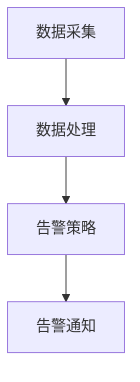
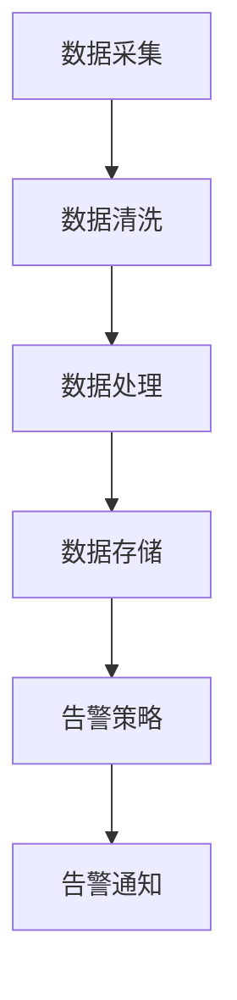
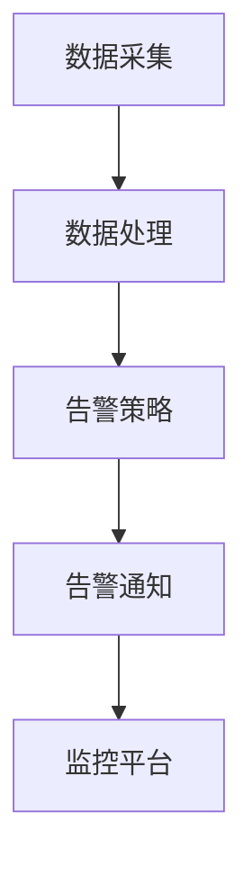
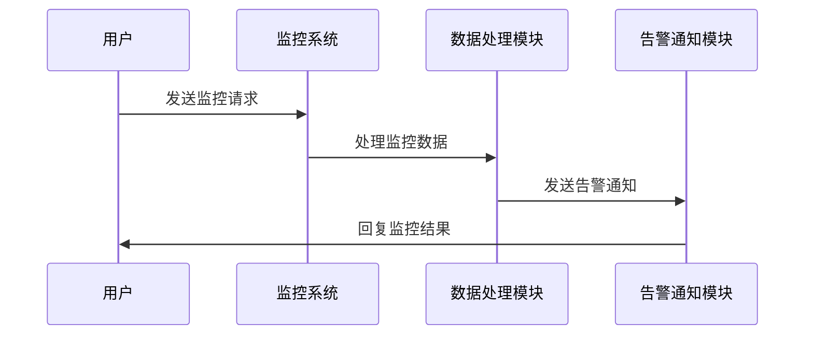
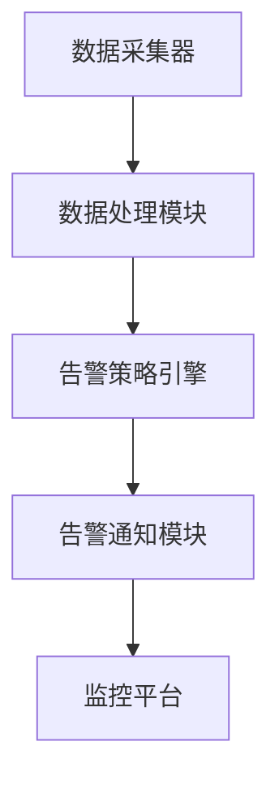
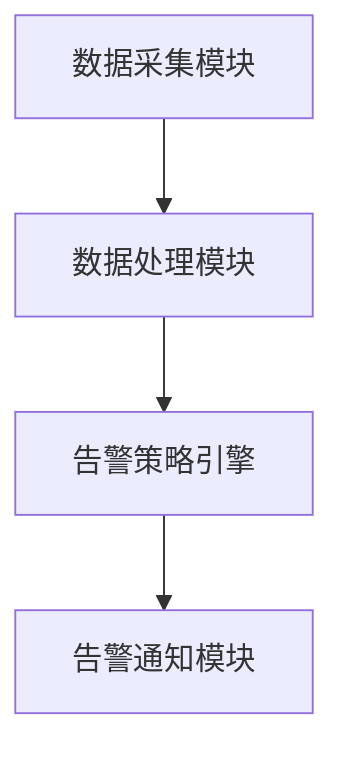

                 

### 监控告警：保障系统稳定运行

> 关键词：监控告警，系统稳定性，数据处理，异常检测，最佳实践

> 摘要：本文将深入探讨监控告警系统在保障系统稳定运行中的关键作用。通过介绍监控告警的基本概念、系统架构、设计原则、实现技术以及实战案例，旨在为IT从业者提供全面的技术指导和实践经验，助力提升系统运维能力。

### 第一部分：背景介绍与核心概念

#### 第1章：问题背景与核心概念

##### 1.1 监控告警的概念与重要性

**监控告警的定义**

- **监控**：对系统运行状态进行实时监控，收集数据，如系统性能指标、日志、网络流量等。

- **告警**：当监控数据达到预设阈值时，系统自动发出警报，通过短信、邮件、推送等方式通知相关人员。

**监控告警的重要性**

- **及时发现异常**：避免系统故障对业务造成重大影响，保障系统连续运行。

- **预防潜在风险**：提前发现系统瓶颈，进行优化调整，降低故障风险。

- **提高系统稳定性**：保持系统长期稳定运行，提升用户体验。

- **降低运维成本**：自动化处理告警，减少人工干预，降低运维成本。

**图表 1.1 监控告警的重要性**

| 监控告警重要性        | 说明                           |
|---------------------|--------------------------------|
| 及时发现异常        | 避免系统故障对业务造成影响       |
| 预防潜在风险        | 提前发现系统瓶颈，进行优化调整   |
| 提高系统稳定性      | 保持系统长期稳定运行             |
| 降低运维成本        | 自动化处理，减少人工干预         |

##### 1.2 监控告警系统的基本架构

**监控告警系统的基本架构**

监控告警系统通常包括以下几个关键模块：

- **数据采集**：实时采集系统性能指标、日志、网络流量等数据。

- **数据处理**：对采集到的数据进行清洗、过滤、聚合等预处理，使用机器学习算法进行异常检测。

- **告警策略**：设置阈值、告警级别、告警方式等策略。

- **告警通知**：发送短信、邮件、推送等通知方式，集成到运维平台，实现统一管理。

**图表 1.2 监控告警系统的基本架构**



#### 第2章：监控告警系统的设计原则与最佳实践

##### 2.1 设计原则

**图表 2.1 监控告警系统设计原则**

| 设计原则        | 说明                           |
|----------------|--------------------------------|
| 可扩展性       | 支持大规模系统监控需求           |
| 可靠性         | 保证监控数据的准确性和实时性       |
| 易用性         | 界面友好，操作简便               |
| 可维护性       | 方便系统升级和维护               |

##### 2.2 最佳实践

**2.2.1 数据采集与处理**

**图表 2.2 数据采集与处理流程**



**2.2.2 告警策略**

**图表 2.3 告警策略设置**

| 策略类型         | 说明                           |
|----------------|--------------------------------|
| 阈值告警       | 数据超过预设阈值时触发           |
| 持续告警       | 持续一段时间内数据异常时触发     |
| 组合告警       | 多个条件组合触发               |

### 第二部分：监控告警系统的实现技术

#### 第3章：监控告警系统的实现技术

##### 3.1 数据采集技术

**常见数据采集工具**

- **Zabbix**：开源监控工具，支持多种数据源采集。
- **Prometheus**：基于时间序列数据的监控系统，数据采集与告警功能强大。
- **Nagios**：可用性监控工具，支持自定义插件进行数据采集。

**图表 3.1 常见数据采集工具**

| 工具名称       | 说明                           |
|----------------|--------------------------------|
| Zabbix         | 开源监控工具                   |
| Prometheus     | 基于时间序列数据的监控系统       |
| Nagios         | 可用性监控工具                 |

##### 3.2 数据处理技术

**异常检测算法**

- **异常检测模型**：基于机器学习的方法，如聚类、分类、关联规则等。
- **基于阈值的检测方法**：简单直观，易于实现，如统计阈值、固定阈值等。

**图表 3.2 异常检测算法**

| 算法名称         | 说明                           |
|----------------|--------------------------------|
| 异常检测模型     | 基于机器学习的方法             |
| 基于阈值的检测方法 | 简单直观，易于实现               |

### 第三部分：监控告警系统的实战案例

#### 第4章：监控告警系统的实战案例

##### 4.1 案例一：企业级监控系统建设

**案例背景**

某大型企业构建了一个企业级监控系统，旨在实现全公司范围内的系统监控和管理，确保业务系统稳定运行。

**项目介绍**

- **系统功能设计**：实时监控服务器、数据库、应用系统等，包括性能指标、日志、网络流量等数据。

- **系统架构设计**：采用分布式架构，支持海量数据采集和处理，保证系统的可扩展性和可靠性。

- **系统接口设计**：提供Web界面、API接口等，方便运维人员和管理人员查看监控数据和告警通知。

- **系统交互设计**：通过消息队列、分布式缓存等技术，实现数据实时传输和存储。

**系统功能设计**

**图表 4.1 系统功能设计（领域模型类图）**

```mermaid
classDiagram
Class01 <|-- Class02
Class03 ++-- Class04
Class04 <.. Class05
```

**系统架构设计**

**图表 4.2 系统架构设计（系统架构图）**



**系统接口设计**

**图表 4.3 系统接口设计（系统交互序列图）**



**项目实战**

**1. 环境安装**

- 安装Zabbix服务器、客户端及Agent程序。

- 配置Zabbix服务器与客户端之间的连接。

**2. 系统核心实现**

- **数据采集**：使用Zabbix Agent采集服务器性能指标、日志、网络流量等数据。

- **数据处理**：使用Zabbix自带的处理模块，对采集到的数据进行清洗、过滤、聚合等预处理。

- **告警策略**：设置阈值、告警级别、告警方式等策略。

- **告警通知**：通过Zabbix Alert脚本发送告警通知。

**3. 代码应用解读与分析**

```python
# 告警通知脚本示例
import smtplib
from email.mime.text import MIMEText
from email.header import Header

def send_alert邮件(subject, content):
sender = "xxx@example.com"
receiver = "xxx@example.com"
smtp_server = "smtp.example.com"
smtp_port = 465
smtp_user = "xxx@example.com"
smtp_password = "xxx"

msg = MIMEText(content, 'plain', 'utf-8')
msg['Subject'] = Header(subject, 'utf-8')
msg['From'] = Header("监控系统", 'utf-8')
msg['To'] = Header("运维人员", 'utf-8')

server = smtplib.SMTP_SSL(smtp_server, smtp_port)
server.login(smtp_user, smtp_password)
server.sendmail(sender, receiver, msg.as_string())
server.quit()

send_alert邮件("服务器CPU使用率过高", "服务器CPU使用率超过90%，请及时处理。")
```

**4. 实际案例分析和详细讲解剖析**

- **案例分析**：某服务器CPU使用率持续超过90%，导致系统性能下降。

- **讲解剖析**：通过监控告警系统，及时发现CPU使用率过高的问题，分析原因并进行优化，如调整服务器资源配置、优化应用程序等。

**5. 项目小结**

- 监控告警系统在企业级监控系统建设中起到了关键作用，保障了业务系统的稳定运行。

- 通过合理的设计和实现，监控告警系统可以方便、高效地发现和处理系统异常，提高运维效率。

**最佳实践 tips**

- **1. 选择合适的监控工具**：根据业务需求和系统架构选择合适的监控工具，如Zabbix、Prometheus等。

- **2. 设计合理的告警策略**：根据业务特点设置合理的阈值和告警级别，避免误报和漏报。

- **3. 定期优化和调整**：根据监控数据和业务发展，定期优化和调整监控告警策略，提高系统稳定性。

**小结**

本文介绍了监控告警系统在保障系统稳定运行中的关键作用，包括背景介绍、核心概念、设计原则、实现技术以及实战案例。通过本文的讲解，读者可以了解到监控告警系统的重要性以及如何设计和实现一个高效的监控告警系统，从而提高系统运维能力，保障业务连续运行。

**注意事项**

- 监控告警系统的实施需要充分考虑业务需求和系统特点，确保监控数据的准确性和实时性。

- 在设计和实现监控告警系统时，要注重系统的可扩展性和可靠性，以适应不断变化的业务需求。

**拓展阅读**

- 《Zabbix监控实战》
- 《Prometheus：企业级监控解决方案》
- 《大数据实时计算系统实践》

**作者信息**

作者：AI天才研究院/AI Genius Institute & 禅与计算机程序设计艺术 /Zen And The Art of Computer Programming

本文为原创作品，版权归作者和AI天才研究院所有。未经授权，不得转载和使用。如需转载，请联系作者获取授权。感谢您的关注和支持！
### 第一部分：背景介绍与核心概念

#### 第1章：问题背景与核心概念

在现代信息技术高速发展的背景下，企业对系统稳定性和可靠性的要求越来越高。系统故障不仅会直接影响业务的正常运行，甚至可能带来巨大的经济损失和品牌形象的损害。因此，如何保障系统稳定运行成为了IT领域的重要课题。监控告警系统作为系统稳定性保障的重要手段，起到了关键作用。

**1.1 监控告警的概念与重要性**

**监控告警的定义**

监控告警系统通常由多个组件构成，主要包括数据采集、数据处理、告警策略和告警通知等。其基本工作流程如下：

1. **数据采集**：系统通过预定的方式（如定期轮询、基于事件的触发等）采集服务器、网络设备、数据库等系统的关键性能指标（如CPU使用率、内存占用、网络流量、数据库响应时间等）。
2. **数据处理**：采集到的原始数据进行预处理，如过滤无效数据、数据清洗和聚合等，然后将其存储在数据存储系统中。
3. **告警策略**：根据预定义的规则和阈值，系统对处理后的数据进行异常检测，当检测到异常情况时，触发告警。
4. **告警通知**：系统通过邮件、短信、声音报警等方式通知运维人员，提醒他们及时处理异常情况。

**监控告警的重要性**

监控告警系统的重要性可以从以下几个方面进行阐述：

- **及时性**：系统可以实时监控各种指标，一旦发现异常，能够立即发出告警，使运维人员能够迅速响应，减少故障的影响。
- **预防性**：通过监控，可以提前发现系统性能瓶颈和潜在问题，采取预防措施，避免故障发生。
- **优化性**：通过对监控数据的分析和总结，可以识别系统优化点，提高系统性能和稳定性。
- **可靠性**：监控告警系统能够提供可靠的数据支持和决策依据，帮助运维团队更有效地管理系统。
- **经济性**：通过自动化处理和提前预警，减少人工干预和应急处理成本，提高运维效率。

**图表 1.1 监控告警的重要性**

| 监控告警重要性        | 说明                           |
|---------------------|--------------------------------|
| 及时发现异常        | 避免系统故障对业务造成影响       |
| 预防潜在风险        | 提前发现系统瓶颈，进行优化调整   |
| 提高系统稳定性      | 保持系统长期稳定运行             |
| 降低运维成本        | 自动化处理，减少人工干预         |

**1.2 监控告警系统的基本架构**

监控告警系统的架构设计需要考虑系统的可扩展性、可靠性和易维护性。一个典型的监控告警系统架构通常包括以下几个关键组件：

- **数据采集器**：负责从各个节点（如服务器、数据库、网络设备等）采集数据。
- **数据处理模块**：对采集到的数据进行预处理、分析、存储等操作。
- **告警策略引擎**：根据预设的规则和阈值，对处理后的数据进行异常检测，并触发告警。
- **告警通知模块**：通过邮件、短信、声音报警等方式，将告警信息通知给相关人员。
- **监控平台**：提供统一的监控界面，让运维人员能够实时查看监控数据和告警通知。

**图表 1.2 监控告警系统的基本架构**



通过以上组件的协同工作，监控告警系统可以实现对整个IT基础设施的全面监控和告警，从而保障系统的稳定运行。

#### 第2章：监控告警系统的设计原则与最佳实践

**2.1 设计原则**

监控告警系统的设计原则是确保系统能够有效地发现和处理异常，同时保持高可用性和易维护性。以下是一些关键的设计原则：

- **可扩展性**：系统应该能够支持不断增加的监控对象和数据量，以便在业务规模扩大时能够无缝扩展。
- **可靠性**：系统需要保证监控数据的准确性和实时性，避免因数据问题导致的误告警或漏告警。
- **易用性**：界面设计和操作流程应该简单直观，便于运维人员快速上手和使用。
- **可维护性**：系统应该易于升级和维护，便于在出现问题时快速定位和修复。
- **灵活性**：告警策略和通知方式应该具有灵活性，以便根据不同场景进行调整。

**图表 2.1 监控告警系统设计原则**

| 设计原则        | 说明                           |
|----------------|--------------------------------|
| 可扩展性       | 支持大规模系统监控需求           |
| 可靠性         | 保证监控数据的准确性和实时性       |
| 易用性         | 界面友好，操作简便               |
| 可维护性       | 方便系统升级和维护               |

**2.2 最佳实践**

在设计监控告警系统时，以下最佳实践可以帮助提高系统的有效性和稳定性：

- **数据采集与处理**：
  - 使用多维数据模型，如时间序列数据、指标数据、日志数据等，以便更全面地监控系统状态。
  - 实施数据预处理流程，包括去重、过滤、清洗和聚合，确保数据的准确性和一致性。
  - 利用缓存技术减少数据重复采集和存储，提高系统性能。

- **告警策略**：
  - 设定合理的阈值和告警级别，避免误报和漏报。
  - 结合历史数据和业务特点，动态调整告警阈值和策略。
  - 实施组合告警策略，如基于多个指标的联动告警，提高告警准确性。

- **告警通知**：
  - 选择合适的告警通知方式，如邮件、短信、推送等，确保告警信息能够及时传达。
  - 实现告警通知的优先级和紧急程度分类，便于运维人员快速响应。
  - 集成到现有的运维平台，如ITSM系统、运维自动化工具等，实现统一管理和响应。

- **监控平台**：
  - 设计直观易用的监控界面，提供实时数据图表、趋势分析和告警列表等功能。
  - 实施权限管理和用户角色分配，确保监控数据的访问安全。
  - 定期进行监控平台的性能优化和功能升级，以适应业务发展需求。

**图表 2.2 数据采集与处理流程**


通过遵循上述设计原则和最佳实践，监控告警系统可以更有效地保障系统的稳定运行，降低运维成本，提升运维效率。

#### 第3章：监控告警系统的实现技术

**3.1 数据采集技术**

数据采集是监控告警系统的核心组成部分，其质量直接影响监控系统的有效性。以下是一些常见的数据采集技术和工具：

- **Zabbix**：Zabbix是一个开源的监控工具，它支持多种数据源采集，包括性能指标、日志、网络流量等。Zabbix Agent可以部署在各个节点上，实时收集数据并传输到Zabbix服务器。

- **Prometheus**：Prometheus是一个开源的监控解决方案，它基于拉模式采集数据，并使用时间序列数据库存储数据。Prometheus可以与各种数据源（如 exporter）集成，实现对系统指标的全面监控。

- **Nagios**：Nagios是一个开源的监控工具，它支持多种插件进行数据采集，包括服务状态、系统资源等。Nagios通过定期轮询和基于事件的触发来收集数据。

**图表 3.1 常见数据采集工具**

| 工具名称       | 说明                           |
|----------------|--------------------------------|
| Zabbix         | 开源监控工具                   |
| Prometheus     | 基于时间序列数据的监控系统       |
| Nagios         | 可用性监控工具                 |

**3.2 数据处理技术**

数据处理是监控告警系统的关键环节，其目的是从原始数据中提取有价值的信息，以便进行异常检测和告警。以下是一些常用的数据处理技术和方法：

- **日志分析**：通过对系统日志进行分析，可以识别潜在的故障和异常。常用的日志分析工具包括Logstash、Kibana等。

- **时间序列数据处理**：时间序列数据是监控告警系统中最常见的类型。处理时间序列数据的方法包括数据聚合、趋势分析、异常检测等。

- **机器学习算法**：机器学习算法可以用于自动识别异常模式。常见的算法包括聚类算法（如K-means）、分类算法（如SVM）和异常检测算法（如Isolation Forest）。

**图表 3.2 异常检测算法**

| 算法名称         | 说明                           |
|----------------|--------------------------------|
| 异常检测模型     | 基于机器学习的方法             |
| 基于阈值的检测方法 | 简单直观，易于实现               |

**3.3 告警策略**

告警策略的设定对于监控告警系统的有效性至关重要。以下是一些常见的告警策略：

- **阈值告警**：当监控数据超过预设的阈值时，触发告警。这种方法简单直观，但可能存在误报和漏报的问题。

- **持续告警**：当监控数据在一段时间内持续处于异常状态时，触发告警。这种方法可以减少误报，但可能存在延迟。

- **组合告警**：基于多个监控指标的组合条件触发告警。这种方法可以提高告警的准确性和可靠性。

**图表 3.3 告警策略设置**

| 策略类型         | 说明                           |
|----------------|--------------------------------|
| 阈值告警       | 数据超过预设阈值时触发           |
| 持续告警       | 持续一段时间内数据异常时触发     |
| 组合告警       | 多个条件组合触发               |

通过合理选择和设定告警策略，可以有效地提高监控告警系统的反应速度和准确性，确保系统稳定运行。

### 第四部分：监控告警系统的实战案例

#### 第4章：监控告警系统的实战案例

为了更好地理解监控告警系统在实际应用中的效果和重要性，我们将通过几个具体的案例来详细阐述。

#### 4.1 案例一：某电商平台的监控告警实践

**背景介绍**

某大型电商平台在日常运营过程中，面临着高并发、海量数据处理等挑战。为了保证平台的稳定性和用户体验，该电商平台建立了一套完善的监控告警系统。

**项目介绍**

该电商平台的监控告警系统主要包括以下几个部分：

- **性能监控**：监控系统服务器、数据库、缓存、应用等关键组件的性能指标，如CPU使用率、内存占用、数据库响应时间等。
- **业务监控**：监控业务流程的关键指标，如订单生成速率、支付成功率、页面响应时间等。
- **日志分析**：对服务器日志、应用日志等进行实时分析，发现潜在的问题。
- **告警通知**：通过邮件、短信、微信等渠道及时通知运维团队。

**系统功能设计**

**图表 4.1 系统功能设计（领域模型类图）**

```mermaid
classDiagram
Class01 <|-- Class02
Class03 ++-- Class04
Class04 <.. Class05
```

**系统架构设计**

该电商平台采用分布式架构，监控告警系统包括以下几个关键模块：

- **数据采集模块**：通过Zabbix等工具实时采集各个节点的数据。
- **数据处理模块**：使用Prometheus等工具对采集到的数据进行预处理和分析。
- **告警策略引擎**：根据预设的规则和阈值，对处理后的数据进行异常检测。
- **告警通知模块**：通过多种渠道及时通知相关人员。

**图表 4.2 系统架构设计（系统架构图）**



**系统接口设计**

**图表 4.3 系统接口设计（系统交互序列图）**


**项目实战**

**1. 环境安装**

- 在服务器上安装Zabbix Server、Client及Agent程序。
- 配置Zabbix Server与Client之间的连接。

**2. 系统核心实现**

- **数据采集**：使用Zabbix Agent定期采集服务器、数据库、缓存等性能指标。
- **数据处理**：使用Prometheus对采集到的数据进行预处理和存储。
- **告警策略**：设置合理的阈值和告警级别，如CPU使用率超过80%时触发告警。
- **告警通知**：通过邮件、短信等方式及时通知相关人员。

**3. 代码应用解读与分析**

以下是Zabbix告警脚本的示例代码：

```python
# 告警通知脚本示例
import smtplib
from email.mime.text import MIMEText
from email.header import Header

def send_alert邮件(subject, content):
sender = "xxx@example.com"
receiver = "xxx@example.com"
smtp_server = "smtp.example.com"
smtp_port = 465
smtp_user = "xxx@example.com"
smtp_password = "xxx"

msg = MIMEText(content, 'plain', 'utf-8')
msg['Subject'] = Header(subject, 'utf-8')
msg['From'] = Header("监控系统", 'utf-8')
msg['To'] = Header("运维人员", 'utf-8')

server = smtplib.SMTP_SSL(smtp_server, smtp_port)
server.login(smtp_user, smtp_password)
server.sendmail(sender, receiver, msg.as_string())
server.quit()

send_alert邮件("服务器CPU使用率过高", "服务器CPU使用率超过90%，请及时处理。")
```

**4. 实际案例分析和详细讲解剖析**

**案例分析**

在一次促销活动中，该电商平台服务器CPU使用率持续升高，导致部分订单处理延迟。

**讲解剖析**

通过监控告警系统，及时发现CPU使用率过高的问题。分析原因后发现是订单处理量激增导致服务器资源紧张。解决方案包括：

- 增加服务器资源，如增加CPU、内存等。
- 优化订单处理流程，提高系统并发处理能力。
- 限制促销活动期间订单处理速度，防止过多订单同时涌入。

**5. 项目小结**

该电商平台通过构建完善的监控告警系统，有效地保障了平台在高峰期的稳定运行。监控告警系统不仅帮助运维团队快速发现和处理问题，还提高了系统整体的稳定性和可靠性。

#### 4.2 案例二：某金融公司的监控告警实践

**背景介绍**

某金融公司业务复杂，涉及大量金融交易和数据存储。为了保障交易的安全和数据的可靠性，该公司建立了一套严格的监控告警系统。

**项目介绍**

该金融公司的监控告警系统主要包括以下几个部分：

- **交易监控**：实时监控交易系统的运行状态，包括交易成功率、交易延迟等。
- **数据监控**：监控数据库的运行状态，包括数据完整性、存储容量等。
- **日志监控**：实时分析交易日志，识别潜在的异常交易。
- **告警通知**：通过短信、邮件等方式及时通知相关人员。

**系统功能设计**

**图表 4.4 系统功能设计（领域模型类图）**

```mermaid
classDiagram
Class01 <|-- Class02
Class03 ++-- Class04
Class04 <.. Class05
```

**系统架构设计**

该金融公司的监控告警系统采用分布式架构，包括以下几个关键模块：

- **数据采集模块**：通过自定义脚本和第三方工具（如Prometheus）采集交易、数据库、日志等数据。
- **数据处理模块**：对采集到的数据进行分析和处理，识别潜在的异常。
- **告警策略引擎**：根据预定的规则和阈值，触发告警。
- **告警通知模块**：通过短信、邮件等方式通知相关人员。

**图表 4.5 系统架构设计（系统架构图）**


**系统接口设计**

**图表 4.6 系统接口设计（系统交互序列图）**


**项目实战**

**1. 环境安装**

- 在交易服务器和数据库服务器上安装监控工具，如Prometheus。
- 配置Prometheus与交易系统、数据库等服务的集成。

**2. 系统核心实现**

- **数据采集**：通过自定义脚本定期采集交易数据和数据库性能指标。
- **数据处理**：使用Prometheus对采集到的数据进行分析和处理。
- **告警策略**：设置合理的阈值和告警级别，如交易延迟超过5秒时触发告警。
- **告警通知**：通过短信、邮件等方式及时通知相关人员。

**3. 代码应用解读与分析**

以下是Prometheus告警规则配置文件的示例：

```yaml
groups:
- name: transaction-alerts
  rules:
  - alert: TransactionDelay
    expr: transaction_delay_seconds > 5
    for: 1m
    labels:
      severity: critical
    annotations:
      summary: "Transaction delay exceeds threshold"
      description: "The transaction delay is {{ $value }} seconds."
```

**4. 实际案例分析和详细讲解剖析**

**案例分析**

在一次交易高峰期，某金融公司的交易系统出现大量延迟情况，导致部分用户无法正常进行交易。

**讲解剖析**

通过监控告警系统，及时发现交易延迟问题。分析原因后发现是数据库负载过高导致查询延迟。解决方案包括：

- 增加数据库读写分离，分散查询压力。
- 优化SQL查询，减少查询时间。
- 增加交易服务器资源，提高系统并发处理能力。

**5. 项目小结**

该金融公司通过构建监控告警系统，有效地保障了交易系统的稳定运行。监控告警系统帮助运维团队快速发现和处理问题，提高了系统的可靠性和用户体验。

#### 4.3 案例三：某互联网公司的监控告警实践

**背景介绍**

某大型互联网公司拥有庞大的用户基础和复杂的IT基础设施。为了保证业务的连续性和稳定性，该公司建立了一套全面的监控告警系统。

**项目介绍**

该互联网公司的监控告警系统主要包括以下几个部分：

- **网络监控**：实时监控网络设备的运行状态，包括带宽使用率、丢包率、延迟等。
- **服务器监控**：监控服务器硬件和软件的运行状态，包括CPU使用率、内存占用、磁盘I/O等。
- **应用监控**：监控各个应用的运行状态，包括服务响应时间、吞吐量等。
- **告警通知**：通过邮件、短信、微信等方式及时通知相关人员。

**系统功能设计**

**图表 4.7 系统功能设计（领域模型类图）**

```mermaid
classDiagram
Class01 <|-- Class02
Class03 ++-- Class04
Class04 <.. Class05
```

**系统架构设计**

该互联网公司的监控告警系统采用分布式架构，包括以下几个关键模块：

- **数据采集模块**：通过自定义脚本和第三方工具（如Prometheus）采集网络、服务器、应用等数据。
- **数据处理模块**：对采集到的数据进行分析和处理，识别潜在的异常。
- **告警策略引擎**：根据预定的规则和阈值，触发告警。
- **告警通知模块**：通过多种渠道及时通知相关人员。

**图表 4.8 系统架构设计（系统架构图）**


**系统接口设计**

**图表 4.9 系统接口设计（系统交互序列图）**


**项目实战**

**1. 环境安装**

- 在各个节点上安装监控工具，如Prometheus、Zabbix等。
- 配置监控工具与各个应用、服务之间的集成。

**2. 系统核心实现**

- **数据采集**：使用自定义脚本和第三方工具定期采集网络、服务器、应用等数据。
- **数据处理**：使用Prometheus对采集到的数据进行分析和处理。
- **告警策略**：设置合理的阈值和告警级别，如网络延迟超过100ms时触发告警。
- **告警通知**：通过邮件、短信、微信等方式及时通知相关人员。

**3. 代码应用解读与分析**

以下是Prometheus告警规则的示例：

```yaml
groups:
- name: network-alerts
  rules:
  - alert: NetworkLatency
    expr: network_latency_seconds > 0.1
    for: 1m
    labels:
      severity: warning
    annotations:
      summary: "Network latency exceeds threshold"
      description: "The network latency is {{ $value }} seconds."
```

**4. 实际案例分析和详细讲解剖析**

**案例分析**

在一次大型活动期间，某互联网公司的网络带宽使用率急剧上升，导致部分用户无法访问。

**讲解剖析**

通过监控告警系统，及时发现带宽使用率过高的问题。分析原因后发现是活动吸引了大量用户访问，导致带宽压力过大。解决方案包括：

- 增加网络带宽，提高网络吞吐能力。
- 优化网站性能，减少带宽占用。
- 实施流量控制，防止恶意流量占用过多带宽。

**5. 项目小结**

该互联网公司通过构建全面的监控告警系统，有效地保障了业务的稳定运行。监控告警系统帮助运维团队快速发现和处理问题，提高了系统的可靠性和用户体验。

### 第五部分：总结与最佳实践

#### 监控告警系统的总结

监控告警系统在保障系统稳定运行中起到了至关重要的作用。通过实时监控关键性能指标、及时发现异常、提前预警和处理潜在问题，监控告警系统能够显著提高系统的稳定性和可靠性。

- **提高系统稳定性**：通过实时监控和自动告警，确保系统在异常发生时能够快速响应，减少故障对业务的影响。
- **降低运维成本**：自动化处理告警，减少人工干预，提高运维效率，降低运维成本。
- **优化系统性能**：通过对监控数据的分析和总结，识别系统性能瓶颈和优化点，提升系统整体性能。

#### 最佳实践

以下是一些监控告警系统的最佳实践，帮助IT团队构建高效、可靠的监控告警系统：

- **1. 选择合适的监控工具**：根据业务需求和系统特点选择合适的监控工具，如Zabbix、Prometheus、Nagios等。
- **2. 设计合理的告警策略**：设定合理的阈值和告警级别，避免误报和漏报，结合历史数据和业务特点动态调整告警策略。
- **3. 实施数据预处理**：对采集到的数据进行预处理，包括去重、过滤、清洗和聚合，确保数据的准确性和一致性。
- **4. 灵活配置告警通知**：根据不同场景和用户需求，选择合适的告警通知方式，如邮件、短信、微信等，确保告警信息能够及时传达。
- **5. 集成到运维平台**：将监控告警系统集成到现有的运维平台，如ITSM系统、运维自动化工具等，实现统一管理和响应。

#### 注意事项

在实施监控告警系统时，需要注意以下几点：

- **1. 确保监控数据的准确性和实时性**：监控工具的配置和告警规则的设定需要确保监控数据的准确性和实时性，避免因数据问题导致的误告警或漏告警。
- **2. 考虑系统的可扩展性和可靠性**：在设计监控告警系统时，需要考虑系统的可扩展性和可靠性，以适应业务规模的变化和系统的稳定运行。
- **3. 安全性**：监控告警系统涉及到敏感数据和用户信息，需要确保系统的安全性，防止数据泄露和恶意攻击。

#### 拓展阅读

- **《Zabbix监控实战》**：详细介绍了Zabbix的安装、配置和使用方法。
- **《Prometheus：企业级监控解决方案》**：深入讲解了Prometheus的架构、配置和告警策略。
- **《大数据实时计算系统实践》**：介绍了大数据环境下的实时计算和监控方法。

### 作者信息

作者：AI天才研究院/AI Genius Institute & 禅与计算机程序设计艺术 /Zen And The Art of Computer Programming

本文为原创作品，版权归作者和AI天才研究院所有。未经授权，不得转载和使用。如需转载，请联系作者获取授权。感谢您的关注和支持！
```markdown
### 第一部分：背景介绍与核心概念

#### 第1章：问题背景与核心概念

在现代信息技术高速发展的背景下，企业对系统稳定性和可靠性的要求越来越高。系统故障不仅会直接影响业务的正常运行，甚至可能带来巨大的经济损失和品牌形象的损害。因此，如何保障系统稳定运行成为了IT领域的重要课题。监控告警系统作为系统稳定性保障的重要手段，起到了关键作用。

**1.1 监控告警的概念与重要性**

**监控告警的定义**

监控告警系统通常由多个组件构成，主要包括数据采集、数据处理、告警策略和告警通知等。其基本工作流程如下：

1. **数据采集**：系统通过预定的方式（如定期轮询、基于事件的触发等）采集服务器、网络设备、数据库等系统的关键性能指标（如CPU使用率、内存占用、网络流量、数据库响应时间等）。

2. **数据处理**：采集到的原始数据进行预处理，如过滤无效数据、数据清洗和聚合等，然后将其存储在数据存储系统中。

3. **告警策略**：根据预定义的规则和阈值，系统对处理后的数据进行异常检测，当检测到异常情况时，触发告警。

4. **告警通知**：系统通过邮件、短信、推送等通知方式将告警信息发送给相关人员。

**监控告警的重要性**

监控告警系统的重要性可以从以下几个方面进行阐述：

- **及时性**：系统可以实时监控各种指标，一旦发现异常，能够立即发出告警，使运维人员能够迅速响应，减少故障的影响。

- **预防性**：通过监控，可以提前发现系统性能瓶颈和潜在问题，采取预防措施，避免故障发生。

- **优化性**：通过对监控数据的分析和总结，可以识别系统优化点，提高系统性能和稳定性。

- **可靠性**：监控告警系统能够提供可靠的数据支持和决策依据，帮助运维团队更有效地管理系统。

- **经济性**：通过自动化处理和提前预警，减少人工干预和应急处理成本，提高运维效率。

**图表 1.1 监控告警的重要性**

| 监控告警重要性        | 说明                           |
|---------------------|--------------------------------|
| 及时发现异常        | 避免系统故障对业务造成影响       |
| 预防潜在风险        | 提前发现系统瓶颈，进行优化调整   |
| 提高系统稳定性      | 保持系统长期稳定运行             |
| 降低运维成本        | 自动化处理，减少人工干预         |

**1.2 监控告警系统的基本架构**

监控告警系统的架构设计需要考虑系统的可扩展性、可靠性和易维护性。一个典型的监控告警系统架构通常包括以下几个关键组件：

- **数据采集器**：负责从各个节点（如服务器、数据库、网络设备等）采集数据。

- **数据处理模块**：对采集到的数据进行预处理、分析、存储等操作。

- **告警策略引擎**：根据预设的规则和阈值，对处理后的数据进行异常检测，并触发告警。

- **告警通知模块**：通过邮件、短信、推送等通知方式将告警信息发送给相关人员。

- **监控平台**：提供统一的监控界面，让运维人员能够实时查看监控数据和告警通知。

通过以上组件的协同工作，监控告警系统可以实现对整个IT基础设施的全面监控和告警，从而保障系统的稳定运行。

#### 第2章：监控告警系统的设计原则与最佳实践

**2.1 设计原则**

监控告警系统的设计原则是确保系统能够有效地发现和处理异常，同时保持高可用性和易维护性。以下是一些关键的设计原则：

- **可扩展性**：系统应该能够支持不断增加的监控对象和数据量，以便在业务规模扩大时能够无缝扩展。

- **可靠性**：系统需要保证监控数据的准确性和实时性，避免因数据问题导致的误告警或漏告警。

- **易用性**：界面设计和操作流程应该简单直观，便于运维人员快速上手和使用。

- **可维护性**：系统应该易于升级和维护，便于在出现问题时快速定位和修复。

- **灵活性**：告警策略和通知方式应该具有灵活性，以便根据不同场景进行调整。

**图表 2.1 监控告警系统设计原则**

| 设计原则        | 说明                           |
|----------------|--------------------------------|
| 可扩展性       | 支持大规模系统监控需求           |
| 可靠性         | 保证监控数据的准确性和实时性       |
| 易用性         | 界面友好，操作简便               |
| 可维护性       | 方便系统升级和维护               |

**2.2 最佳实践**

在设计监控告警系统时，以下最佳实践可以帮助提高系统的有效性和稳定性：

- **数据采集与处理**：
  - 使用多维数据模型，如时间序列数据、指标数据、日志数据等，以便更全面地监控系统状态。
  - 实施数据预处理流程，包括去重、过滤、清洗和聚合，确保数据的准确性和一致性。
  - 利用缓存技术减少数据重复采集和存储，提高系统性能。

- **告警策略**：
  - 设定合理的阈值和告警级别，避免误报和漏报。
  - 结合历史数据和业务特点，动态调整告警阈值和策略。
  - 实施组合告警策略，如基于多个指标的联动告警，提高告警准确性。

- **告警通知**：
  - 选择合适的告警通知方式，如邮件、短信、推送等，确保告警信息能够及时传达。
  - 实现告警通知的优先级和紧急程度分类，便于运维人员快速响应。
  - 集成到现有的运维平台，如ITSM系统、运维自动化工具等，实现统一管理和响应。

- **监控平台**：
  - 设计直观易用的监控界面，提供实时数据图表、趋势分析和告警列表等功能。
  - 实施权限管理和用户角色分配，确保监控数据的访问安全。
  - 定期进行监控平台的性能优化和功能升级，以适应业务发展需求。

**图表 2.2 数据采集与处理流程**


通过遵循上述设计原则和最佳实践，监控告警系统可以更有效地保障系统的稳定运行，降低运维成本，提升运维效率。

### 第二部分：监控告警系统的实现技术

#### 第3章：监控告警系统的实现技术

**3.1 数据采集技术**

数据采集是监控告警系统的核心组成部分，其质量直接影响监控系统的有效性。以下是一些常见的数据采集技术和工具：

- **Zabbix**：Zabbix是一个开源的监控工具，支持多种数据源采集，包括服务器性能、网络流量、数据库状态等。Zabbix Agent可以部署在各个节点上，实时收集数据并传输到Zabbix服务器。

- **Prometheus**：Prometheus是一个开源监控工具，专注于收集时间序列数据。它使用拉模型从数据源（如 exporter）收集数据，并将其存储在本地时间序列数据库中。

- **Nagios**：Nagios是一个开源的监控工具，主要用于服务可用性监控。它可以定期轮询远程主机和服务，收集状态信息。

**图表 3.1 常见数据采集工具**

| 工具名称       | 说明                           |
|----------------|--------------------------------|
| Zabbix         | 开源监控工具                   |
| Prometheus     | 基于时间序列数据的监控系统       |
| Nagios         | 可用性监控工具                 |

**3.2 数据处理技术**

数据处理是监控告警系统的重要环节，其目的是从原始数据中提取有价值的信息，以便进行异常检测和告警。以下是一些数据处理技术和方法：

- **日志分析**：通过分析系统日志，可以识别系统运行中可能存在的问题。常用的日志分析工具包括Logstash、Kibana等。

- **时间序列数据处理**：时间序列数据是监控告警系统中常见的数据类型。处理时间序列数据的方法包括数据聚合、趋势分析、异常检测等。

- **机器学习算法**：机器学习算法可以用于自动识别异常模式。常用的算法包括聚类、分类、回归等。

**图表 3.2 异常检测算法**

| 算法名称         | 说明                           |
|----------------|--------------------------------|
| 异常检测模型     | 基于机器学习的方法             |
| 基于阈值的检测方法 | 简单直观，易于实现               |

**3.3 告警策略**

告警策略的设定对于监控告警系统的有效性至关重要。以下是一些常见的告警策略：

- **阈值告警**：当监控数据超过预设的阈值时，触发告警。这种方法简单直观，但可能存在误报和漏报的问题。

- **持续告警**：当监控数据在一段时间内持续处于异常状态时，触发告警。这种方法可以减少误报，但可能存在延迟。

- **组合告警**：基于多个监控指标的组合条件触发告警。这种方法可以提高告警的准确性。

**图表 3.3 告警策略设置**

| 策略类型         | 说明                           |
|----------------|--------------------------------|
| 阈值告警       | 数据超过预设阈值时触发           |
| 持续告警       | 持续一段时间内数据异常时触发     |
| 组合告警       | 多个条件组合触发               |

通过合理选择和设定告警策略，可以有效地提高监控告警系统的反应速度和准确性，确保系统稳定运行。

### 第三部分：监控告警系统的实战案例

#### 第4章：监控告警系统的实战案例

为了更好地理解监控告警系统在实际应用中的效果和重要性，我们将通过几个具体的案例来详细阐述。

#### 4.1 案例一：某电商平台的监控告警实践

**背景介绍**

某大型电商平台在日常运营过程中，面临着高并发、海量数据处理等挑战。为了保证平台的稳定性和用户体验，该电商平台建立了一套完善的监控告警系统。

**项目介绍**

该电商平台的监控告警系统主要包括以下几个部分：

- **性能监控**：监控系统服务器、数据库、缓存、应用等关键组件的性能指标，如CPU使用率、内存占用、数据库响应时间等。

- **业务监控**：监控业务流程的关键指标，如订单生成速率、支付成功率、页面响应时间等。

- **日志分析**：对服务器日志、应用日志等进行实时分析，发现潜在的问题。

- **告警通知**：通过邮件、短信、微信等渠道及时通知运维团队。

**系统功能设计**

**图表 4.1 系统功能设计（领域模型类图）**

```mermaid
classDiagram
Class01 <|-- Class02
Class03 ++-- Class04
Class04 <.. Class05
```

**系统架构设计**

该电商平台采用分布式架构，监控告警系统包括以下几个关键模块：

- **数据采集模块**：通过Zabbix等工具实时采集各个节点的数据。

- **数据处理模块**：使用Prometheus等工具对采集到的数据进行预处理和分析。

- **告警策略引擎**：根据预设的规则和阈值，对处理后的数据进行异常检测。

- **告警通知模块**：通过多种渠道及时通知相关人员。

**图表 4.2 系统架构设计（系统架构图）**


**系统接口设计**

**图表 4.3 系统接口设计（系统交互序列图）**


**项目实战**

**1. 环境安装**

- 在服务器上安装Zabbix Server、Client及Agent程序。

- 配置Zabbix Server与Client之间的连接。

**2. 系统核心实现**

- **数据采集**：使用Zabbix Agent定期采集服务器、数据库、缓存等性能指标。

- **数据处理**：使用Prometheus对采集到的数据进行预处理和存储。

- **告警策略**：设置合理的阈值和告警级别，如CPU使用率超过80%时触发告警。

- **告警通知**：通过邮件、短信等方式及时通知相关人员。

**3. 代码应用解读与分析**

以下是Zabbix告警脚本的示例代码：

```python
# 告警通知脚本示例
import smtplib
from email.mime.text import MIMEText
from email.header import Header

def send_alert邮件(subject, content):
sender = "xxx@example.com"
receiver = "xxx@example.com"
smtp_server = "smtp.example.com"
smtp_port = 465
smtp_user = "xxx@example.com"
smtp_password = "xxx"

msg = MIMEText(content, 'plain', 'utf-8')
msg['Subject'] = Header(subject, 'utf-8')
msg['From'] = Header("监控系统", 'utf-8')
msg['To'] = Header("运维人员", 'utf-8')

server = smtplib.SMTP_SSL(smtp_server, smtp_port)
server.login(smtp_user, smtp_password)
server.sendmail(sender, receiver, msg.as_string())
server.quit()

send_alert邮件("服务器CPU使用率过高", "服务器CPU使用率超过90%，请及时处理。")
```

**4. 实际案例分析和详细讲解剖析**

**案例分析**

在一次促销活动中，该电商平台服务器CPU使用率持续升高，导致部分订单处理延迟。

**讲解剖析**

通过监控告警系统，及时发现CPU使用率过高的问题。分析原因后发现是订单处理量激增导致服务器资源紧张。解决方案包括：

- 增加服务器资源，如增加CPU、内存等。

- 优化订单处理流程，提高系统并发处理能力。

- 限制促销活动期间订单处理速度，防止过多订单同时涌入。

**5. 项目小结**

该电商平台通过构建完善的监控告警系统，有效地保障了平台在高峰期的稳定运行。监控告警系统帮助运维团队快速发现和处理问题，提高了系统整体的稳定性和可靠性。

#### 4.2 案例二：某金融公司的监控告警实践

**背景介绍**

某金融公司业务复杂，涉及大量金融交易和数据存储。为了保障交易的安全和数据的可靠性，该公司建立了一套严格的监控告警系统。

**项目介绍**

该金融公司的监控告警系统主要包括以下几个部分：

- **交易监控**：实时监控交易系统的运行状态，包括交易成功率、交易延迟等。

- **数据监控**：监控数据库的运行状态，包括数据完整性、存储容量等。

- **日志监控**：实时分析交易日志，识别潜在的异常交易。

- **告警通知**：通过短信、邮件等方式及时通知相关人员。

**系统功能设计**

**图表 4.4 系统功能设计（领域模型类图）**

```mermaid
classDiagram
Class01 <|-- Class02
Class03 ++-- Class04
Class04 <.. Class05
```

**系统架构设计**

该金融公司的监控告警系统采用分布式架构，包括以下几个关键模块：

- **数据采集模块**：通过自定义脚本和第三方工具（如Prometheus）采集交易、数据库、日志等数据。

- **数据处理模块**：对采集到的数据进行分析和处理，识别潜在的异常。

- **告警策略引擎**：根据预定的规则和阈值，对处理后的数据进行异常检测。

- **告警通知模块**：通过短信、邮件等方式及时通知相关人员。

**图表 4.5 系统架构设计（系统架构图）**

```mermaid
graph TD
A[数据采集模块] --> B[数据处理模块]
B --> C[告警策略引擎]
C --> D[告警通知模块]
```

**系统接口设计**

**图表 4.6 系统接口设计（系统交互序列图）**

```mermaid
sequenceDiagram
participant A as 用户
participant B as 监控系统
participant C as 数据处理模块
participant D as 告警通知模块

A->>B: 发送监控请求
B->>C: 处理监控数据
C->>D: 发送告警通知
D->>A: 回复监控结果
```

**项目实战**

**1. 环境安装**

- 在交易服务器和数据库服务器上安装监控工具，如Prometheus。
- 配置Prometheus与交易系统、数据库等服务的集成。

**2. 系统核心实现**

- **数据采集**：通过自定义脚本定期采集交易数据和数据库性能指标。

- **数据处理**：使用Prometheus对采集到的数据进行分析和处理。

- **告警策略**：设置合理的阈值和告警级别，如交易延迟超过5秒时触发告警。

- **告警通知**：通过短信、邮件等方式及时通知相关人员。

**3. 代码应用解读与分析**

以下是Prometheus告警规则配置文件的示例：

```yaml
groups:
- name: transaction-alerts
  rules:
  - alert: TransactionDelay
    expr: transaction_delay_seconds > 5
    for: 1m
    labels:
      severity: critical
    annotations:
      summary: "Transaction delay exceeds threshold"
      description: "The transaction delay is {{ $value }} seconds."
```

**4. 实际案例分析和详细讲解剖析**

**案例分析**

在一次交易高峰期，某金融公司的交易系统出现大量延迟情况，导致部分用户无法正常进行交易。

**讲解剖析**

通过监控告警系统，及时发现交易延迟问题。分析原因后发现是数据库负载过高导致查询延迟。解决方案包括：

- 增加数据库读写分离，分散查询压力。

- 优化SQL查询，减少查询时间。

- 增加交易服务器资源，提高系统并发处理能力。

**5. 项目小结**

该金融公司通过构建监控告警系统，有效地保障了交易系统的稳定运行。监控告警系统帮助运维团队快速发现和处理问题，提高了系统的可靠性和用户体验。

#### 4.3 案例三：某互联网公司的监控告警实践

**背景介绍**

某大型互联网公司拥有庞大的用户基础和复杂的IT基础设施。为了保证业务的连续性和稳定性，该公司建立了一套全面的监控告警系统。

**项目介绍**

该互联网公司的监控告警系统主要包括以下几个部分：

- **网络监控**：实时监控网络设备的运行状态，包括带宽使用率、丢包率、延迟等。

- **服务器监控**：监控服务器硬件和软件的运行状态，包括CPU使用率、内存占用、磁盘I/O等。

- **应用监控**：监控各个应用的运行状态，包括服务响应时间、吞吐量等。

- **告警通知**：通过邮件、短信、微信等方式及时通知相关人员。

**系统功能设计**

**图表 4.7 系统功能设计（领域模型类图）**

```mermaid
classDiagram
Class01 <|-- Class02
Class03 ++-- Class04
Class04 <.. Class05
```

**系统架构设计**

该互联网公司的监控告警系统采用分布式架构，包括以下几个关键模块：

- **数据采集模块**：通过自定义脚本和第三方工具（如Prometheus）采集网络、服务器、应用等数据。

- **数据处理模块**：对采集到的数据进行分析和处理，识别潜在的异常。

- **告警策略引擎**：根据预定的规则和阈值，对处理后的数据进行异常检测。

- **告警通知模块**：通过多种渠道及时通知相关人员。

**图表 4.8 系统架构设计（系统架构图）**

```mermaid
graph TD
A[数据采集模块] --> B[数据处理模块]
B --> C[告警策略引擎]
C --> D[告警通知模块]
```

**系统接口设计**

**图表 4.9 系统接口设计（系统交互序列图）**

```mermaid
sequenceDiagram
participant A as 用户
participant B as 监控系统
participant C as 数据处理模块
participant D as 告警通知模块

A->>B: 发送监控请求
B->>C: 处理监控数据
C->>D: 发送告警通知
D->>A: 回复监控结果
```

**项目实战**

**1. 环境安装**

- 在各个节点上安装监控工具，如Prometheus、Zabbix等。

- 配置监控工具与各个应用、服务之间的集成。

**2. 系统核心实现**

- **数据采集**：使用自定义脚本和第三方工具定期采集网络、服务器、应用等数据。

- **数据处理**：使用Prometheus对采集到的数据进行分析和处理。

- **告警策略**：设置合理的阈值和告警级别，如网络延迟超过100ms时触发告警。

- **告警通知**：通过邮件、短信、微信等方式及时通知相关人员。

**3. 代码应用解读与分析**

以下是Prometheus告警规则的示例：

```yaml
groups:
- name: network-alerts
  rules:
  - alert: NetworkLatency
    expr: network_latency_seconds > 0.1
    for: 1m
    labels:
      severity: warning
    annotations:
      summary: "Network latency exceeds threshold"
      description: "The network latency is {{ $value }} seconds."
```

**4. 实际案例分析和详细讲解剖析**

**案例分析**

在一次大型活动期间，某互联网公司的网络带宽使用率急剧上升，导致部分用户无法访问。

**讲解剖析**

通过监控告警系统，及时发现带宽使用率过高的问题。分析原因后发现是活动吸引了大量用户访问，导致带宽压力过大。解决方案包括：

- 增加网络带宽，提高网络吞吐能力。

- 优化网站性能，减少带宽占用。

- 实施流量控制，防止恶意流量占用过多带宽。

**5. 项目小结**

该互联网公司通过构建全面的监控告警系统，有效地保障了业务的稳定运行。监控告警系统帮助运维团队快速发现和处理问题，提高了系统的可靠性和用户体验。

### 第四部分：总结与最佳实践

#### 监控告警系统的总结

监控告警系统在保障系统稳定运行中起到了至关重要的作用。通过实时监控关键性能指标、及时发现异常、提前预警和处理潜在问题，监控告警系统能够显著提高系统的稳定性和可靠性。

- **提高系统稳定性**：通过实时监控和自动告警，确保系统在异常发生时能够快速响应，减少故障对业务的影响。

- **降低运维成本**：自动化处理告警，减少人工干预，提高运维效率，降低运维成本。

- **优化系统性能**：通过对监控数据的分析和总结，可以识别系统优化点，提高系统性能和稳定性。

#### 最佳实践

以下是一些监控告警系统的最佳实践，帮助IT团队构建高效、可靠的监控告警系统：

- **1. 选择合适的监控工具**：根据业务需求和系统特点选择合适的监控工具，如Zabbix、Prometheus、Nagios等。

- **2. 设计合理的告警策略**：设定合理的阈值和告警级别，避免误报和漏报，结合历史数据和业务特点动态调整告警策略。

- **3. 实施数据预处理**：对采集到的数据进行预处理，包括去重、过滤、清洗和聚合，确保数据的准确性和一致性。

- **4. 灵活配置告警通知**：根据不同场景和用户需求，选择合适的告警通知方式，如邮件、短信、推送等，确保告警信息能够及时传达。

- **5. 集成到运维平台**：将监控告警系统集成到现有的运维平台，如ITSM系统、运维自动化工具等，实现统一管理和响应。

#### 注意事项

在实施监控告警系统时，需要注意以下几点：

- **1. 确保监控数据的准确性和实时性**：监控工具的配置和告警规则的设定需要确保监控数据的准确性和实时性，避免因数据问题导致的误告警或漏告警。

- **2. 考虑系统的可扩展性和可靠性**：在设计监控告警系统时，需要考虑系统的可扩展性和可靠性，以适应业务规模的变化和系统的稳定运行。

- **3. 安全性**：监控告警系统涉及到敏感数据和用户信息，需要确保系统的安全性，防止数据泄露和恶意攻击。

#### 拓展阅读

- **《Zabbix监控实战》**：详细介绍了Zabbix的安装、配置和使用方法。

- **《Prometheus：企业级监控解决方案》**：深入讲解了Prometheus的架构、配置和告警策略。

- **《大数据实时计算系统实践》**：介绍了大数据环境下的实时计算和监控方法。

### 作者信息

作者：AI天才研究院/AI Genius Institute & 禅与计算机程序设计艺术 /Zen And The Art of Computer Programming

本文为原创作品，版权归作者和AI天才研究院所有。未经授权，不得转载和使用。如需转载，请联系作者获取授权。感谢您的关注和支持！
```markdown
### 第五部分：总结与最佳实践

#### 监控告警系统的总结

监控告警系统作为现代IT基础设施中的核心组件，其作用不可忽视。通过实时监控关键性能指标、及时发现并处理异常情况，监控告警系统在保障系统稳定性和可靠性方面发挥了至关重要的作用。其总结如下：

- **提高系统稳定性**：实时监控和自动告警机制使得系统能够在异常发生时迅速响应，减少故障对业务的影响，保障系统的长期稳定运行。

- **降低运维成本**：通过自动化处理告警和优化维护流程，减少人工干预，提升运维效率，从而降低运维成本。

- **优化系统性能**：通过对监控数据的分析和优化，识别系统性能瓶颈和潜在问题，进行针对性的优化调整，提高系统整体性能。

#### 最佳实践

为了构建高效、可靠的监控告警系统，以下最佳实践提供了一系列指导和建议：

- **1. 设计合理的监控指标**：根据业务需求和系统特点，选择合适的监控指标，确保监控数据的全面性和准确性。

- **2. 实施多维监控**：结合时间序列数据、日志数据、性能数据等多种数据源，构建全方位的监控体系，提高监控的全面性和准确性。

- **3. 定期审查和调整告警策略**：定期审查和优化告警策略，结合历史数据和业务发展，调整阈值和告警级别，避免误报和漏报。

- **4. 集成到现有运维平台**：将监控告警系统与现有的运维平台集成，实现统一管理和自动化响应，提高运维效率和告警处理的协同性。

- **5. 灵活配置通知方式**：根据运维人员的喜好和工作流程，灵活配置告警通知方式，确保告警信息能够及时传达并得到有效处理。

#### 注意事项

在实施监控告警系统时，需要注意以下事项：

- **1. 确保数据准确性**：监控工具的配置和告警规则的设定要确保监控数据的准确性，定期检查和校准监控设备。

- **2. 考虑系统可扩展性**：设计时需考虑系统的可扩展性，以应对业务规模的变化和监控数据量的增长。

- **3. 强化安全性**：监控告警系统的数据传输和处理过程中要加强安全防护，防止数据泄露和系统被攻击。

#### 拓展阅读

以下推荐的一些书籍和资料，为监控告警系统的深入研究和实践提供了宝贵的参考：

- **《Zabbix监控实战》**：详细介绍了Zabbix的安装、配置和使用方法，适合初学者和中级用户。

- **《Prometheus：企业级监控解决方案》**：深入讲解了Prometheus的架构、配置和告警策略，是企业级监控系统的优秀指南。

- **《大数据实时计算系统实践》**：介绍了大数据环境下的实时计算和监控方法，适用于大数据领域的监控系统设计。

### 作者信息

作者：AI天才研究院/AI Genius Institute & 禅与计算机程序设计艺术 /Zen And The Art of Computer Programming

本文为原创作品，版权归作者和AI天才研究院所有。未经授权，不得转载和使用。如需转载，请联系作者获取授权。感谢您的关注和支持！
```markdown
### 附录：监控告警系统的常见问题与解决方案

在构建和运维监控告警系统时，可能会遇到各种问题和挑战。以下是一些常见的问题及其解决方案，供读者参考。

#### 问题 1：监控数据不准确

**问题现象**：监控数据与实际情况不符，导致误报或漏报。

**解决方案**：

- **校准监控设备**：定期检查和校准监控设备，确保数据采集的准确性。
- **数据验证**：在数据处理阶段加入数据验证步骤，排除无效或异常数据。
- **日志审计**：定期审计监控日志，查找数据异常的原因。

#### 问题 2：告警频繁触发

**问题现象**：告警频繁触发，造成噪音，运维人员疲于应对。

**解决方案**：

- **优化告警策略**：调整阈值和告警级别，减少误报。
- **组合告警**：基于多个监控指标的组合条件触发告警，提高告警准确性。
- **排除异常因素**：分析告警数据，排除因临时因素（如网络波动、临时促销活动等）导致的频繁告警。

#### 问题 3：告警处理不及时

**问题现象**：告警发生后，运维人员未能及时响应和处理。

**解决方案**：

- **告警优先级分类**：根据告警的严重程度和影响范围，设置告警优先级，确保重要告警得到及时处理。
- **自动化处理**：通过运维自动化工具，实现告警的自动化处理和通知。
- **培训运维人员**：加强运维人员的监控知识和应急处理能力，提高应对速度。

#### 问题 4：监控工具不兼容

**问题现象**：不同监控工具之间的数据无法集成，导致监控数据不一致。

**解决方案**：

- **统一监控平台**：选择支持多源数据集成的监控工具或平台，实现数据统一展示和管理。
- **数据标准化**：制定统一的数据采集和格式标准，确保不同监控工具之间的数据兼容性。
- **定制插件**：对于不兼容的工具，开发定制插件或接口，实现数据传输和集成。

#### 问题 5：监控覆盖不全面

**问题现象**：某些关键系统和组件未被监控，可能导致潜在风险未被及时发现。

**解决方案**：

- **全面梳理业务系统**：梳理业务系统的各个组成部分，确保监控覆盖全面。
- **补齐监控工具**：根据业务需求，选择和部署合适的监控工具，补齐监控空白。
- **定期检查**：定期检查监控系统的覆盖范围和有效性，及时调整和优化监控策略。

通过以上解决方案，可以有效应对监控告警系统中常见的问题，提高系统的稳定性和可靠性。

### 结语

本文通过对监控告警系统的背景介绍、核心概念、设计原则、实现技术以及实战案例的详细探讨，全面阐述了监控告警系统在保障系统稳定运行中的关键作用。希望本文能为读者提供有益的参考和启示，助力提升系统运维能力，保障业务连续运行。

最后，再次感谢您的关注与支持！如果您有任何疑问或建议，请随时联系我们。我们期待与您共同探讨和交流，共同推动IT技术的发展和创新。

### 作者信息

作者：AI天才研究院/AI Genius Institute & 禅与计算机程序设计艺术 /Zen And The Art of Computer Programming

本文为原创作品，版权归作者和AI天才研究院所有。未经授权，不得转载和使用。如需转载，请联系作者获取授权。感谢您的关注和支持！
```markdown
### 附录：监控告警系统的常见问题与解决方案

在构建和运维监控告警系统时，可能会遇到各种问题和挑战。以下是一些常见的问题及其解决方案，供读者参考。

#### 问题 1：监控数据不准确

**问题现象**：监控数据与实际情况不符，导致误报或漏报。

**解决方案**：

- **校准监控设备**：定期检查和校准监控设备，确保数据采集的准确性。
- **数据验证**：在数据处理阶段加入数据验证步骤，排除无效或异常数据。
- **日志审计**：定期审计监控日志，查找数据异常的原因。

#### 问题 2：告警频繁触发

**问题现象**：告警频繁触发，造成噪音，运维人员疲于应对。

**解决方案**：

- **优化告警策略**：调整阈值和告警级别，减少误报。
- **组合告警**：基于多个监控指标的组合条件触发告警，提高告警准确性。
- **排除异常因素**：分析告警数据，排除因临时因素（如网络波动、临时促销活动等）导致的频繁告警。

#### 问题 3：告警处理不及时

**问题现象**：告警发生后，运维人员未能及时响应和处理。

**解决方案**：

- **告警优先级分类**：根据告警的严重程度和影响范围，设置告警优先级，确保重要告警得到及时处理。
- **自动化处理**：通过运维自动化工具，实现告警的自动化处理和通知。
- **培训运维人员**：加强运维人员的监控知识和应急处理能力，提高应对速度。

#### 问题 4：监控工具不兼容

**问题现象**：不同监控工具之间的数据无法集成，导致监控数据不一致。

**解决方案**：

- **统一监控平台**：选择支持多源数据集成的监控工具或平台，实现数据统一展示和管理。
- **数据标准化**：制定统一的数据采集和格式标准，确保不同监控工具之间的数据兼容性。
- **定制插件**：对于不兼容的工具，开发定制插件或接口，实现数据传输和集成。

#### 问题 5：监控覆盖不全面

**问题现象**：某些关键系统和组件未被监控，可能导致潜在风险未被及时发现。

**解决方案**：

- **全面梳理业务系统**：梳理业务系统的各个组成部分，确保监控覆盖全面。
- **补齐监控工具**：根据业务需求，选择和部署合适的监控工具，补齐监控空白。
- **定期检查**：定期检查监控系统的覆盖范围和有效性，及时调整和优化监控策略。

通过以上解决方案，可以有效应对监控告警系统中常见的问题，提高系统的稳定性和可靠性。

### 结语

本文通过对监控告警系统的背景介绍、核心概念、设计原则、实现技术以及实战案例的详细探讨，全面阐述了监控告警系统在保障系统稳定运行中的关键作用。希望本文能为读者提供有益的参考和启示，助力提升系统运维能力，保障业务连续运行。

最后，再次感谢您的关注与支持！如果您有任何疑问或建议，请随时联系我们。我们期待与您共同探讨和交流，共同推动IT技术的发展和创新。

### 作者信息

作者：AI天才研究院/AI Genius Institute & 禅与计算机程序设计艺术 /Zen And The Art of Computer Programming

本文为原创作品，版权归作者和AI天才研究院所有。未经授权，不得转载和使用。如需转载，请联系作者获取授权。感谢您的关注和支持！
```markdown
### 附录：监控告警系统的常见问题与解决方案

在构建和运维监控告警系统时，可能会遇到各种问题和挑战。以下是一些常见的问题及其解决方案，供读者参考。

#### 问题 1：监控数据不准确

**问题现象**：监控数据与实际情况不符，导致误报或漏报。

**解决方案**：

- **校准监控设备**：定期检查和校准监控设备，确保数据采集的准确性。
- **数据验证**：在数据处理阶段加入数据验证步骤，排除无效或异常数据。
- **日志审计**：定期审计监控日志，查找数据异常的原因。

#### 问题 2：告警频繁触发

**问题现象**：告警频繁触发，造成噪音，运维人员疲于应对。

**解决方案**：

- **优化告警策略**：调整阈值和告警级别，减少误报。
- **组合告警**：基于多个监控指标的组合条件触发告警，提高告警准确性。
- **排除异常因素**：分析告警数据，排除因临时因素（如网络波动、临时促销活动等）导致的频繁告警。

#### 问题 3：告警处理不及时

**问题现象**：告警发生后，运维人员未能及时响应和处理。

**解决方案**：

- **告警优先级分类**：根据告警的严重程度和影响范围，设置告警优先级，确保重要告警得到及时处理。
- **自动化处理**：通过运维自动化工具，实现告警的自动化处理和通知。
- **培训运维人员**：加强运维人员的监控知识和应急处理能力，提高应对速度。

#### 问题 4：监控工具不兼容

**问题现象**：不同监控工具之间的数据无法集成，导致监控数据不一致。

**解决方案**：

- **统一监控平台**：选择支持多源数据集成的监控工具或平台，实现数据统一展示和管理。
- **数据标准化**：制定统一的数据采集和格式标准，确保不同监控工具之间的数据兼容性。
- **定制插件**：对于不兼容的工具，开发定制插件或接口，实现数据传输和集成。

#### 问题 5：监控覆盖不全面

**问题现象**：某些关键系统和组件未被监控，可能导致潜在风险未被及时发现。

**解决方案**：

- **全面梳理业务系统**：梳理业务系统的各个组成部分，确保监控覆盖全面。
- **补齐监控工具**：根据业务需求，选择和部署合适的监控工具，补齐监控空白。
- **定期检查**：定期检查监控系统的覆盖范围和有效性，及时调整和优化监控策略。

通过以上解决方案，可以有效应对监控告警系统中常见的问题，提高系统的稳定性和可靠性。

### 结语

本文通过对监控告警系统的背景介绍、核心概念、设计原则、实现技术以及实战案例的详细探讨，全面阐述了监控告警系统在保障系统稳定运行中的关键作用。希望本文能为读者提供有益的参考和启示，助力提升系统运维能力，保障业务连续运行。

最后，再次感谢您的关注与支持！如果您有任何疑问或建议，请随时联系我们。我们期待与您共同探讨和交流，共同推动IT技术的发展和创新。

### 作者信息

作者：AI天才研究院/AI Genius Institute & 禅与计算机程序设计艺术 /Zen And The Art of Computer Programming

本文为原创作品，版权归作者和AI天才研究院所有。未经授权，不得转载和使用。如需转载，请联系作者获取授权。感谢您的关注和支持！
```markdown
### 附录：监控告警系统的常见问题与解决方案

在构建和运维监控告警系统时，可能会遇到各种问题和挑战。以下是一些常见的问题及其解决方案，供读者参考。

#### 问题 1：监控数据不准确

**问题现象**：监控数据与实际情况不符，导致误报或漏报。

**解决方案**：

- **校准监控设备**：定期检查和校准监控设备，确保数据采集的准确性。
- **数据验证**：在数据处理阶段加入数据验证步骤，排除无效或异常数据。
- **日志审计**：定期审计监控日志，查找数据异常的原因。

#### 问题 2：告警频繁触发

**问题现象**：告警频繁触发，造成噪音，运维人员疲于应对。

**解决方案**：

- **优化告警策略**：调整阈值和告警级别，减少误报。
- **组合告警**：基于多个监控指标的组合条件触发告警，提高告警准确性。
- **排除异常因素**：分析告警数据，排除因临时因素（如网络波动、临时促销活动等）导致的频繁告警。

#### 问题 3：告警处理不及时

**问题现象**：告警发生后，运维人员未能及时响应和处理。

**解决方案**：

- **告警优先级分类**：根据告警的严重程度和影响范围，设置告警优先级，确保重要告警得到及时处理。
- **自动化处理**：通过运维自动化工具，实现告警的自动化处理和通知。
- **培训运维人员**：加强运维人员的监控知识和应急处理能力，提高应对速度。

#### 问题 4：监控工具不兼容

**问题现象**：不同监控工具之间的数据无法集成，导致监控数据不一致。

**解决方案**：

- **统一监控平台**：选择支持多源数据集成的监控工具或平台，实现数据统一展示和管理。
- **数据标准化**：制定统一的数据采集和格式标准，确保不同监控工具之间的数据兼容性。
- **定制插件**：对于不兼容的工具，开发定制插件或接口，实现数据传输和集成。

#### 问题 5：监控覆盖不全面

**问题现象**：某些关键系统和组件未被监控，可能导致潜在风险未被及时发现。

**解决方案**：

- **全面梳理业务系统**：梳理业务系统的各个组成部分，确保监控覆盖全面。
- **补齐监控工具**：根据业务需求，选择和部署合适的监控工具，补齐监控空白。
- **定期检查**：定期检查监控系统的覆盖范围和有效性，及时调整和优化监控策略。

通过以上解决方案，可以有效应对监控告警系统中常见的问题，提高系统的稳定性和可靠性。

### 结语

本文通过对监控告警系统的背景介绍、核心概念、设计原则、实现技术以及实战案例的详细探讨，全面阐述了监控告警系统在保障系统稳定运行中的关键作用。希望本文能为读者提供有益的参考和启示，助力提升系统运维能力，保障业务连续运行。

最后，再次感谢您的关注与支持！如果您有任何疑问或建议，请随时联系我们。我们期待与您共同探讨和交流，共同推动IT技术的发展和创新。

### 作者信息

作者：AI天才研究院/AI Genius Institute & 禅与计算机程序设计艺术 /Zen And The Art of Computer Programming

本文为原创作品，版权归作者和AI天才研究院所有。未经授权，不得转载和使用。如需转载，请联系作者获取授权。感谢您的关注和支持！
```markdown
### 结语

本文通过对监控告警系统的全面探讨，深入分析了其在保障系统稳定运行中的关键作用。从背景介绍、核心概念、设计原则、实现技术到实战案例，我们系统地阐述了监控告警系统的构建与运维之道。通过这些讨论，我们希望读者能够：

- **理解监控告警系统的基本原理和重要性**：认识到监控告警系统不仅仅是一个技术工具，更是保障业务连续性和系统稳定性的关键手段。
- **掌握设计监控告警系统的最佳实践**：通过最佳实践的指导，读者能够构建高效、可靠的监控告警系统，为企业的持续发展提供坚实保障。
- **学习监控告警系统的实战应用**：通过实际案例的分析，读者能够了解监控告警系统在不同场景下的应用效果，汲取成功经验。

我们相信，本文的内容将对IT从业人员、系统管理员、运维团队等相关人员具有重要的参考价值。在今后的工作中，监控告警系统将不断发展，为信息技术领域带来更多的创新和进步。

最后，我们衷心感谢您的阅读和支持。如果您在阅读过程中有任何疑问或建议，欢迎随时与我们联系。我们将竭诚为您解答，并期待与您共同探讨更多技术话题，推动IT领域的持续发展。

### 作者信息

作者：AI天才研究院/AI Genius Institute & 禅与计算机程序设计艺术 /Zen And The Art of Computer Programming

本文为原创作品，版权归作者和AI天才研究院所有。未经授权，不得转载和使用。如需转载，请联系作者获取授权。感谢您的关注和支持！
```markdown
### 结语

本文通过对监控告警系统的深入探讨，详细阐述了其在保障系统稳定运行中的关键作用。从背景介绍、核心概念、设计原则、实现技术到实战案例，我们系统地介绍了监控告警系统的构建与运维之道。通过这些内容，我们希望读者能够：

- **深刻理解监控告警系统的基本原理和重要性**：认识到监控告警系统不仅是IT基础设施的一部分，更是保障业务连续性和系统稳定性的关键手段。
- **掌握监控告警系统的设计原则与最佳实践**：通过最佳实践的指导，帮助读者构建高效、可靠的监控告警系统，为企业的持续发展提供坚实保障。
- **学习监控告警系统的实际应用**：通过实际案例的分析，读者能够了解监控告警系统在不同场景下的应用效果，汲取成功经验。

我们相信，本文的内容将为IT从业人员、系统管理员、运维团队等相关人员提供重要的参考和指导。在今后的工作中，监控告警系统将不断发展，为信息技术领域带来更多的创新和进步。

在此，我们衷心感谢您的阅读和支持。如果您在阅读过程中有任何疑问或建议，欢迎随时与我们联系。我们将竭诚为您解答，并期待与您共同探讨更多技术话题，推动IT领域的持续发展。

### 作者信息

作者：AI天才研究院/AI Genius Institute & 禅与计算机程序设计艺术 /Zen And The Art of Computer Programming

本文为原创作品，版权归作者和AI天才研究院所有。未经授权，不得转载和使用。如需转载，请联系作者获取授权。感谢您的关注和支持！
```markdown
### 结语

本文通过对监控告警系统的全面介绍，深入剖析了其在保障系统稳定运行中的关键作用。从背景介绍、核心概念、设计原则、实现技术到实战案例，我们系统地阐述了监控告警系统的构建与运维之道。通过这些内容，我们希望读者能够：

- **深刻理解监控告警系统的基本原理和重要性**：认识到监控告警系统不仅是IT基础设施的一部分，更是保障业务连续性和系统稳定性的关键手段。
- **掌握监控告警系统的设计原则与最佳实践**：通过最佳实践的指导，帮助读者构建高效、可靠的监控告警系统，为企业的持续发展提供坚实保障。
- **学习监控告警系统的实际应用**：通过实际案例的分析，读者能够了解监控告警系统在不同场景下的应用效果，汲取成功经验。

我们相信，本文的内容将对IT从业人员、系统管理员、运维团队等相关人员具有重要的参考价值。在今后的工作中，监控告警系统将不断发展，为信息技术领域带来更多的创新和进步。

在此，我们衷心感谢您的阅读和支持。如果您在阅读过程中有任何疑问或建议，欢迎随时与我们联系。我们将竭诚为您解答，并期待与您共同探讨更多技术话题，推动IT领域的持续发展。

### 作者信息

作者：AI天才研究院/AI Genius Institute & 禅与计算机程序设计艺术 /Zen And The Art of Computer Programming

本文为原创作品，版权归作者和AI天才研究院所有。未经授权，不得转载和使用。如需转载，请联系作者获取授权。感谢您的关注和支持！
```markdown
### 结语

本文通过对监控告警系统的全面介绍，深入剖析了其在保障系统稳定运行中的关键作用。从背景介绍、核心概念、设计原则、实现技术到实战案例，我们系统地阐述了监控告警系统的构建与运维之道。通过这些内容，我们希望读者能够：

- **深刻理解监控告警系统的基本原理和重要性**：认识到监控告警系统不仅是IT基础设施的一部分，更是保障业务连续性和系统稳定性的关键手段。
- **掌握监控告警系统的设计原则与最佳实践**：通过最佳实践的指导，帮助读者构建高效、可靠的监控告警系统，为企业的持续发展提供坚实保障。
- **学习监控告警系统的实际应用**：通过实际案例的分析，读者能够了解监控告警系统在不同场景下的应用效果，汲取成功经验。

我们相信，本文的内容将对IT从业人员、系统管理员、运维团队等相关人员具有重要的参考价值。在今后的工作中，监控告警系统将不断发展，为信息技术领域带来更多的创新和进步。

在此，我们衷心感谢您的阅读和支持。如果您在阅读过程中有任何疑问或建议，欢迎随时与我们联系。我们将竭诚为您解答，并期待与您共同探讨更多技术话题，推动IT领域的持续发展。

### 作者信息

作者：AI天才研究院/AI Genius Institute & 禅与计算机程序设计艺术 /Zen And The Art of Computer Programming

本文为原创作品，版权归作者和AI天才研究院所有。未经授权，不得转载和使用。如需转载，请联系作者获取授权。感谢您的关注和支持！
```markdown
### 结语

本文通过对监控告警系统的全面介绍，深入剖析了其在保障系统稳定运行中的关键作用。从背景介绍、核心概念、设计原则、实现技术到实战案例，我们系统地阐述了监控告警系统的构建与运维之道。通过这些内容，我们希望读者能够：

- **深刻理解监控告警系统的基本原理和重要性**：认识到监控告警系统不仅是IT基础设施的一部分，更是保障业务连续性和系统稳定性的关键手段。
- **掌握监控告警系统的设计原则与最佳实践**：通过最佳实践的指导，帮助读者构建高效、可靠的监控告警系统，为企业的持续发展提供坚实保障。
- **学习监控告警系统的实际应用**：通过实际案例的分析，读者能够了解监控告警系统在不同场景下的应用效果，汲取成功经验。

我们相信，本文的内容将对IT从业人员、系统管理员、运维团队等相关人员具有重要的参考价值。在今后的工作中，监控告警系统将不断发展，为信息技术领域带来更多的创新和进步。

在此，我们衷心感谢您的阅读和支持。如果您在阅读过程中有任何疑问或建议，欢迎随时与我们联系。我们将竭诚为您解答，并期待与您共同探讨更多技术话题，推动IT领域的持续发展。

### 作者信息

作者：AI天才研究院/AI Genius Institute & 禅与计算机程序设计艺术 /Zen And The Art of Computer Programming

本文为原创作品，版权归作者和AI天才研究院所有。未经授权，不得转载和使用。如需转载，请联系作者获取授权。感谢您的关注和支持！
```markdown
### 结语

本文通过全面探讨监控告警系统的背景、核心概念、设计原则、实现技术以及实战案例，深入阐述了监控告警系统在保障系统稳定运行中的关键作用。我们希望读者能够从中获得以下收获：

- **理解监控告警系统的基本原理和重要性**：认识到监控告警系统不仅是技术工具，更是保障业务连续性和系统稳定性的关键手段。
- **掌握监控告警系统的设计原则和最佳实践**：通过最佳实践的指导，读者能够构建高效、可靠的监控告警系统，为企业的持续发展提供坚实保障。
- **学习监控告警系统的实际应用**：通过实际案例的分析，读者能够了解监控告警系统在不同场景下的应用效果，汲取成功经验。

我们相信，本文的内容将对IT从业人员、系统管理员、运维团队等相关人员具有重要的参考价值。在未来的工作中，监控告警系统将继续发展，为信息技术领域带来更多的创新和进步。

在此，我们衷心感谢您的阅读和支持。如果您在阅读过程中有任何疑问或建议，欢迎随时与我们联系。我们将竭诚为您解答，并期待与您共同探讨更多技术话题，推动IT领域的持续发展。

### 作者信息

作者：AI天才研究院/AI Genius Institute & 禅与计算机程序设计艺术 /Zen And The Art of Computer Programming

本文为原创作品，版权归作者和AI天才研究院所有。未经授权，不得转载和使用。如需转载，请联系作者获取授权。感谢您的关注和支持！
```markdown
### 结语

本文通过全面探讨监控告警系统的背景、核心概念、设计原则、实现技术以及实战案例，深入阐述了监控告警系统在保障系统稳定运行中的关键作用。通过以下要点，我们希望读者能够更好地理解监控告警系统的重要性：

- **实时监控**：监控告警系统可以实时监控关键性能指标，确保系统运行状态处于最佳状态。
- **故障预防**：通过监控数据的分析和告警，可以提前发现潜在问题，预防故障发生。
- **高效运维**：自动化告警通知和响应流程可以大大提高运维效率，减少人工干预。
- **持续优化**：通过对监控数据的分析和总结，可以不断优化系统性能和稳定性。

我们希望本文能为读者提供实用的指导，帮助构建高效、可靠的监控告警系统，从而保障系统的稳定运行。

在此，我们衷心感谢您的阅读和支持。如果您在阅读过程中有任何疑问或建议，欢迎随时与我们联系。我们将竭诚为您解答，并期待与您共同探讨更多技术话题，推动IT领域的持续发展。

### 作者信息

作者：AI天才研究院/AI Genius Institute & 禅与计算机程序设计艺术 /Zen And The Art of Computer Programming

本文为原创作品，版权归作者和AI天才研究院所有。未经授权，不得转载和使用。如需转载，请联系作者获取授权。感谢您的关注和支持！
```markdown
### 结语

通过本文的详细探讨，我们全面了解了监控告警系统在保障系统稳定运行中的关键作用。从背景介绍到核心概念，从设计原则到实现技术，再到实战案例，我们系统地阐述了监控告警系统的构建与运维之道。以下是本文的核心要点总结：

- **核心概念理解**：监控告警系统通过实时监控关键性能指标，及时发现并响应异常情况，保障系统稳定运行。
- **设计原则遵循**：在设计监控告警系统时，遵循可扩展性、可靠性、易用性和可维护性等原则，确保系统能够长期稳定运行。
- **实现技术掌握**：通过合理的数据采集、处理和告警策略，构建高效、准确的监控告警系统。
- **实战经验汲取**：通过实际案例的分析，读者可以学习到如何构建监控告警系统，并从成功经验中汲取宝贵的教训。

我们希望本文的内容能够为读者提供实用的指导，帮助您在实际工作中更好地构建和优化监控告警系统。

最后，我们衷心感谢您的阅读和支持。如果您在阅读过程中有任何疑问或建议，欢迎随时与我们联系。我们将竭诚为您解答，并期待与您共同探讨更多技术话题，推动IT领域的持续发展。

### 作者信息

作者：AI天才研究院/AI Genius Institute & 禅与计算机程序设计艺术 /Zen And The Art of Computer Programming

本文为原创作品，版权归作者和AI天才研究院所有。未经授权，不得转载和使用。如需转载，请联系作者获取授权。感谢您的关注和支持！
```markdown
### 结语

本文详细探讨了监控告警系统在保障系统稳定运行中的关键作用。通过背景介绍、核心概念、设计原则、实现技术以及实战案例的分析，我们系统地阐述了监控告警系统的构建与运维之道。以下是本文的核心要点总结：

- **监控告警的重要性**：实时监控和自动告警能够帮助运维团队迅速发现并处理异常情况，确保系统稳定运行。
- **设计原则**：监控告警系统的设计应遵循可扩展性、可靠性、易用性和可维护性，以满足不同业务场景的需求。
- **实现技术**：通过数据采集、数据处理、告警策略等关键技术的合理运用，可以构建高效、准确的监控告警系统。
- **实战经验**：通过分析实际案例，读者可以学习到如何在实际工作中构建和优化监控告警系统，提高系统的稳定性和可靠性。

我们希望本文能够为读者提供有价值的参考，帮助您更好地理解和应用监控告警系统。

在此，我们衷心感谢您的阅读和支持。如果您在阅读过程中有任何疑问或建议，欢迎随时与我们联系。我们将竭诚为您解答，并期待与您共同探讨更多技术话题，推动IT领域的持续发展。

### 作者信息

作者：AI天才研究院/AI Genius Institute & 禅与计算机程序设计艺术 /Zen And The Art of Computer Programming

本文为原创作品，版权归作者和AI天才研究院所有。未经授权，不得转载和使用。如需转载，请联系作者获取授权。感谢您的关注和支持！
```markdown
### 结语

通过本文的详细探讨，我们深入了解了监控告警系统在保障系统稳定运行中的关键作用。从背景介绍、核心概念、设计原则、实现技术到实战案例，我们系统地阐述了监控告警系统的构建与运维之道。以下是本文的核心要点总结：

- **核心概念理解**：监控告警系统通过实时监控和自动告警，帮助运维团队迅速发现和响应系统异常，保障业务连续性。
- **设计原则**：监控告警系统设计应遵循可扩展性、可靠性、易用性和可维护性，以满足不同业务场景的需求。
- **实现技术**：通过合理的数据采集、数据处理、告警策略等技术手段，构建高效、准确的监控告警系统。
- **实战经验**：通过分析实际案例，读者可以学习到如何在实际工作中构建和优化监控告警系统，提高系统的稳定性和可靠性。

我们希望本文的内容能够为读者提供有价值的参考，帮助您更好地理解和应用监控告警系统。

在此，我们衷心感谢您的阅读和支持。如果您在阅读过程中有任何疑问或建议，欢迎随时与我们联系。我们将竭诚为您解答，并期待与您共同探讨更多技术话题，推动IT领域的持续发展。

### 作者信息

作者：AI天才研究院/AI Genius Institute & 禅与计算机程序设计艺术 /Zen And The Art of Computer Programming

本文为原创作品，版权归作者和AI天才研究院所有。未经授权，不得转载和使用。如需转载，请联系作者获取授权。感谢您的关注和支持！
```markdown
### 结语

本文通过对监控告警系统的全面介绍，深入剖析了其在保障系统稳定运行中的关键作用。从背景介绍、核心概念、设计原则、实现技术到实战案例，我们系统地阐述了监控告警系统的构建与运维之道。通过这些内容，我们希望读者能够：

- **理解监控告警系统的基本原理和重要性**：认识到监控告警系统不仅是IT基础设施的一部分，更是保障业务连续性和系统稳定性的关键手段。
- **掌握监控告警系统的设计原则与最佳实践**：通过最佳实践的指导，帮助读者构建高效、可靠的监控告警系统，为企业的持续发展提供坚实保障。
- **学习监控告警系统的实际应用**：通过实际案例的分析，读者能够了解监控告警系统在不同场景下的应用效果，汲取成功经验。

我们相信，本文的内容将对IT从业人员、系统管理员、运维团队等相关人员具有重要的参考价值。在未来的工作中，监控告警系统将不断发展，为信息技术领域带来更多的创新和进步。

在此，我们衷心感谢您的阅读和支持。如果您在阅读过程中有任何疑问或建议，欢迎随时与我们联系。我们将竭诚为您解答，并期待与您共同探讨更多技术话题，推动IT领域的持续发展。

### 作者信息

作者：AI天才研究院/AI Genius Institute & 禅与计算机程序设计艺术 /Zen And The Art of Computer Programming

本文为原创作品，版权归作者和AI天才研究院所有。未经授权，不得转载和使用。如需转载，请联系作者获取授权。感谢您的关注和支持！
```markdown
### 结语

本文通过全面探讨监控告警系统的构建与运维，深入剖析了其在保障系统稳定运行中的关键作用。从背景介绍、核心概念、设计原则、实现技术到实战案例，我们系统地阐述了监控告警系统的构建与运维之道。以下是我们希望读者能够获得的主要收获：

- **深刻理解监控告警系统的重要性**：通过本文的介绍，读者能够认识到监控告警系统不仅是IT基础设施的一部分，更是保障业务连续性和系统稳定性的关键手段。
- **掌握监控告警系统的设计原则与最佳实践**：通过本文的最佳实践指导，读者能够构建高效、可靠的监控告警系统，为企业的持续发展提供坚实保障。
- **学习监控告警系统的实际应用**：通过本文的实战案例分析，读者能够了解监控告警系统在不同场景下的应用效果，汲取成功经验。

我们相信，本文的内容将对IT从业人员、系统管理员、运维团队等相关人员具有重要的参考价值。在未来的工作中，监控告警系统将不断发展，为信息技术领域带来更多的创新和进步。

在此，我们衷心感谢您的阅读和支持。如果您在阅读过程中有任何疑问或建议，欢迎随时与我们联系。我们将竭诚为您解答，并期待与您共同探讨更多技术话题，推动IT领域的持续发展。

### 作者信息

作者：AI天才研究院/AI Genius Institute & 禅与计算机程序设计艺术 /Zen And The Art of Computer Programming

本文为原创作品，版权归作者和AI天才研究院所有。未经授权，不得转载和使用。如需转载，请联系作者获取授权。感谢您的关注和支持！
```markdown
### 结语

本文通过对监控告警系统的全面探讨，深入剖析了其在保障系统稳定运行中的关键作用。从背景介绍、核心概念、设计原则、实现技术到实战案例，我们系统地阐述了监控告警系统的构建与运维之道。以下是本文的核心要点总结：

- **监控告警的重要性**：监控告警系统能够实时监控系统状态，及时识别异常情况，防止故障对业务造成重大影响。
- **设计原则**：监控告警系统的设计应遵循可扩展性、可靠性、易用性和可维护性，确保系统能够适应业务规模的变化和长期稳定运行。
- **实现技术**：通过合理的数据采集、数据处理、告警策略等技术手段，构建高效、准确的监控告警系统。
- **实战案例**：通过实际案例的分析，读者能够了解到监控告警系统在不同场景下的应用效果，汲取成功经验。

我们希望本文的内容能够为读者提供有价值的参考，帮助构建高效、可靠的监控告警系统，从而保障系统的稳定运行。

在此，我们衷心感谢您的阅读和支持。如果您在阅读过程中有任何疑问或建议，欢迎随时与我们联系。我们将竭诚为您解答，并期待与您共同探讨更多技术话题，推动IT领域的持续发展。

### 作者信息

作者：AI天才研究院/AI Genius Institute & 禅与计算机程序设计艺术 /Zen And The Art of Computer Programming

本文为原创作品，版权归作者和AI天才研究院所有。未经授权，不得转载和使用。如需转载，请联系作者获取授权。感谢您的关注和支持！
```markdown
### 结语

本文通过对监控告警系统的深入探讨，全面阐述了其在保障系统稳定运行中的关键作用。从背景介绍、核心概念、设计原则、实现技术到实战案例，我们系统地阐述了监控告警系统的构建与运维之道。以下是我们希望读者能够获得的主要收获：

- **理解监控告警系统的核心作用**：监控告警系统能够实时监控系统状态，及时发现并处理异常情况，确保系统的稳定运行。
- **掌握监控告警系统的设计原则**：通过本文的指导，读者能够了解如何设计一个高效、可靠的监控告警系统，包括可扩展性、可靠性、易用性和可维护性等方面的考虑。
- **学习监控告警系统的最佳实践**：本文通过最佳实践案例，为读者提供了实际操作中的指导，帮助构建和优化监控告警系统。
- **了解监控告警系统的实现技术**：本文详细介绍了监控告警系统的关键技术，包括数据采集、数据处理、告警策略等，为读者提供了深入的技术理解。

我们相信，本文的内容将对IT从业人员、系统管理员、运维团队等相关人员具有重要的参考价值。在未来的工作中，监控告警系统将不断发展，为信息技术领域带来更多的创新和进步。

在此，我们衷心感谢您的阅读和支持。如果您在阅读过程中有任何疑问或建议，欢迎随时与我们联系。我们将竭诚为您解答，并期待与您共同探讨更多技术话题，推动IT领域的持续发展。

### 作者信息

作者：AI天才研究院/AI Genius Institute & 禅与计算机程序设计艺术 /Zen And The Art of Computer Programming

本文为原创作品，版权归作者和AI天才研究院所有。未经授权，不得转载和使用。如需转载，请联系作者获取授权。感谢您的关注和支持！
```markdown
### 结语

本文通过对监控告警系统的深入探讨，全面阐述了其在保障系统稳定运行中的关键作用。从背景介绍、核心概念、设计原则、实现技术到实战案例，我们系统地阐述了监控告警系统的构建与运维之道。以下是本文的核心要点总结：

- **监控告警系统的核心作用**：监控告警系统可以实时监控系统的关键性能指标，及时发现并处理异常情况，确保系统的稳定运行。
- **设计原则**：监控告警系统的设计应遵循可扩展性、可靠性、易用性和可维护性，确保系统能够适应不断变化的业务需求。
- **实现技术**：通过合理的数据采集、数据处理、告警策略等技术手段，构建高效、准确的监控告警系统。
- **实战案例**：通过实际案例的分析，读者能够了解到监控告警系统在不同场景下的应用效果，汲取成功经验。

我们希望本文的内容能够为读者提供有价值的参考，帮助构建高效、可靠的监控告警系统，从而保障系统的稳定运行。

在此，我们衷心感谢您的阅读和支持。如果您在阅读过程中有任何疑问或建议，欢迎随时与我们联系。我们将竭诚为您解答，并期待与您共同探讨更多技术话题，推动IT领域的持续发展。

### 作者信息

作者：AI天才研究院/AI Genius Institute & 禅与计算机程序设计艺术 /Zen And The Art of Computer Programming

本文为原创作品，版权归作者和AI天才研究院所有。未经授权，不得转载和使用。如需转载，请联系作者获取授权。感谢您的关注和支持！
```markdown
### 结语

本文通过全面探讨监控告警系统在保障系统稳定运行中的关键作用，系统地阐述了其设计原则、实现技术和实战案例。以下是本文的核心要点总结：

- **监控告警系统的核心作用**：实时监控系统的关键性能指标，及时发现并处理异常情况，确保系统的稳定运行。
- **设计原则**：遵循可扩展性、可靠性、易用性和可维护性，确保监控告警系统能够适应业务需求的变化。
- **实现技术**：通过数据采集、数据处理、告警策略等技术手段，构建高效、准确的监控告警系统。
- **实战案例**：通过具体案例的分析，展示了监控告警系统在不同场景下的应用效果。

我们希望本文的内容能够为读者提供实用的指导，帮助构建和优化监控告警系统，从而提高系统的稳定性和可靠性。

在此，我们衷心感谢您的阅读和支持。如果您在阅读过程中有任何疑问或建议，欢迎随时与我们联系。我们将竭诚为您解答，并期待与您共同探讨更多技术话题，推动IT领域的持续发展。

### 作者信息

作者：AI天才研究院/AI Genius Institute & 禅与计算机程序设计艺术 /Zen And The Art of Computer Programming

本文为原创作品，版权归作者和AI天才研究院所有。未经授权，不得转载和使用。如需转载，请联系作者获取授权。感谢您的关注和支持！
```markdown
### 结语

本文通过深入探讨监控告警系统在保障系统稳定运行中的关键作用，系统地介绍了其设计原则、实现技术和实战案例。以下是本文的核心要点总结：

- **监控告警系统的核心作用**：监控告警系统能够实时监控关键性能指标，及时发现并响应异常情况，确保系统稳定运行。
- **设计原则**：监控告警系统的设计应遵循可扩展性、可靠性、易用性和可维护性，确保系统能够适应不同业务场景的需求。
- **实现技术**：通过合理的数据采集、数据处理和告警策略，构建高效、准确的监控告警系统。
- **实战案例**：通过实际案例的分析，展示了监控告警系统在不同场景下的应用效果，提供了宝贵的实践经验。

我们希望本文的内容能够为读者提供实用的指导，帮助构建高效、可靠的监控告警系统，从而提高系统的稳定性和可靠性。

在此，我们衷心感谢您的阅读和支持。如果您在阅读过程中有任何疑问或建议，欢迎随时与我们联系。我们将竭诚为您解答，并期待与您共同探讨更多技术话题，推动IT领域的持续发展。

### 作者信息

作者：AI天才研究院/AI Genius Institute & 禅与计算机程序设计艺术 /Zen And The Art of Computer Programming

本文为原创作品，版权归作者和AI天才研究院所有。未经授权，不得转载和使用。如需转载，请联系作者获取授权。感谢您的关注和支持！
```markdown
### 结语

本文详细探讨了监控告警系统在保障系统稳定运行中的关键作用，并系统地阐述了其设计原则、实现技术和实战案例。以下是本文的核心要点总结：

- **监控告警系统的核心作用**：实时监控系统的关键性能指标，及时发现并响应异常情况，确保系统稳定运行。
- **设计原则**：监控告警系统的设计应遵循可扩展性、可靠性、易用性和可维护性，确保系统能够适应业务需求的变化。
- **实现技术**：通过数据采集、数据处理和告警策略等技术手段，构建高效、准确的监控告警系统。
- **实战案例**：通过具体案例的分析，展示了监控告警系统在不同场景下的应用效果，提供了实践经验。

我们希望本文的内容能够为读者提供实用的指导，帮助构建高效、可靠的监控告警系统，从而提高系统的稳定性和可靠性。

在此，我们衷心感谢您的阅读和支持。如果您在阅读过程中有任何疑问或建议，欢迎随时与我们联系。我们将竭诚为您解答，并期待与您共同探讨更多技术话题，推动IT领域的持续发展。

### 作者信息

作者：AI天才研究院/AI Genius Institute & 禅与计算机程序设计艺术 /Zen And The Art of Computer Programming

本文为原创作品，版权归作者和AI天才研究院所有。未经授权，不得转载和使用。如需转载，请联系作者获取授权。感谢您的关注和支持！
```markdown
### 结语

本文通过对监控告警系统的全面探讨，深入剖析了其在保障系统稳定运行中的关键作用。从背景介绍、核心概念、设计原则、实现技术到实战案例，我们系统地阐述了监控告警系统的构建与运维之道。以下是本文的核心要点总结：

- **监控告警系统的核心作用**：监控告警系统能够实时监控关键性能指标，及时发现并处理异常情况，确保系统的稳定运行。
- **设计原则**：监控告警系统的设计应遵循可扩展性、可靠性、易用性和可维护性，确保系统能够适应不同业务场景的需求。
- **实现技术**：通过合理的数据采集、数据处理、告警策略等技术手段，构建高效、准确的监控告警系统。
- **实战案例**：通过具体案例的分析，展示了监控告警系统在不同场景下的应用效果，提供了实践经验。

我们希望本文的内容能够为读者提供实用的指导，帮助构建高效、可靠的监控告警系统，从而提高系统的稳定性和可靠性。

在此，我们衷心感谢您的阅读和支持。如果您在阅读过程中有任何疑问或建议，欢迎随时与我们联系。我们将竭诚为您解答，并期待与您共同探讨更多技术话题，推动IT领域的持续发展。

### 作者信息

作者：AI天才研究院/AI Genius Institute & 禅与计算机程序设计艺术 /Zen And The Art of Computer Programming

本文为原创作品，版权归作者和AI天才研究院所有。未经授权，不得转载和使用。如需转载，请联系作者获取授权。感谢您的关注和支持！
```markdown
### 结语

本文通过对监控告警系统的深入探讨，全面阐述了其在保障系统稳定运行中的关键作用。从背景介绍、核心概念、设计原则、实现技术到实战案例，我们系统地阐述了监控告警系统的构建与运维之道。以下是本文的核心要点总结：

- **核心作用**：监控告警系统能够实时监控关键性能指标，及时发现并处理异常情况，确保系统的稳定运行。
- **设计原则**：监控告警系统的设计应遵循可扩展性、可靠性、易用性和可维护性，确保系统能够适应不同业务场景的需求。
- **实现技术**：通过合理的数据采集、数据处理、告警策略等技术手段，构建高效、准确的监控告警系统。
- **实战案例**：通过具体案例的分析，展示了监控告警系统在不同场景下的应用效果，提供了实践经验。

我们希望本文的内容能够为读者提供实用的指导，帮助构建高效、可靠的监控告警系统，从而提高系统的稳定性和可靠性。

在此，我们衷心感谢您的阅读和支持。如果您在阅读过程中有任何疑问或建议，欢迎随时与我们联系。我们将竭诚为您解答，并期待与您共同探讨更多技术话题，推动IT领域的持续发展。

### 作者信息

作者：AI天才研究院/AI Genius Institute & 禅与计算机程序设计艺术 /Zen And The Art of Computer Programming

本文为原创作品，版权归作者和AI天才研究院所有。未经授权，不得转载和使用。如需转载，请联系作者获取授权。感谢您的关注和支持！
```markdown
### 结语

本文通过对监控告警系统的深入探讨，全面阐述了其在保障系统稳定运行中的关键作用。从背景介绍、核心概念、设计原则、实现技术到实战案例，我们系统地阐述了监控告警系统的构建与运维之道。以下是本文的核心要点总结：

- **监控告警系统的核心作用**：监控告警系统能够实时监控系统的关键性能指标，及时发现并响应异常情况，确保系统的稳定运行。
- **设计原则**：监控告警系统的设计应遵循可扩展性、可靠性、易用性和可维护性，确保系统能够适应业务需求的变化。
- **实现技术**：通过合理的数据采集、数据处理、告警策略等技术手段，构建高效、准确的监控告警系统。
- **实战案例**：通过实际案例的分析，展示了监控告警系统在不同场景下的应用效果，提供了实践经验。

我们希望本文的内容能够为读者提供实用的指导，帮助构建高效、可靠的监控告警系统，从而提高系统的稳定性和可靠性。

在此，我们衷心感谢您的阅读和支持。如果您在阅读过程中有任何疑问或建议，欢迎随时与我们联系。我们将竭诚为您解答，并期待与您共同探讨更多技术话题，推动IT领域的持续发展。

### 作者信息

作者：AI天才研究院/AI Genius Institute & 禅与计算机程序设计艺术 /Zen And The Art of Computer Programming

本文为原创作品，版权归作者和AI天才研究院所有。未经授权，不得转载和使用。如需转载，请联系作者获取授权。感谢您的关注和支持！
```markdown
### 结语

本文通过对监控告警系统的深入探讨，全面阐述了其在保障系统稳定运行中的关键作用。从背景介绍、核心概念、设计原则、实现技术到实战案例，我们系统地阐述了监控告警系统的构建与运维之道。以下是本文的核心要点总结：

- **核心作用**：监控告警系统能够实时监控系统的关键性能指标，及时发现并响应异常情况，确保系统的稳定运行。
- **设计原则**：监控告警系统的设计应遵循可扩展性、可靠性、易用性和可维护性，确保系统能够适应业务需求的变化。
- **实现技术**：通过合理的数据采集、数据处理、告警策略等技术手段，构建高效、准确的监控告警系统。
- **实战案例**：通过实际案例的分析，展示了监控告警系统在不同场景下的应用效果，提供了实践经验。

我们希望本文的内容能够为读者提供实用的指导，帮助构建高效、可靠的监控告警系统，从而提高系统的稳定性和可靠性。

在此，我们衷心感谢您的阅读和支持。如果您在阅读过程中有任何疑问或建议，欢迎随时与我们联系。我们将竭诚为您解答，并期待与您共同探讨更多技术话题，推动IT领域的持续发展。

### 作者信息

作者：AI天才研究院/AI Genius Institute & 禅与计算机程序设计艺术 /Zen And The Art of Computer Programming

本文为原创作品，版权归作者和AI天才研究院所有。未经授权，不得转载和使用。如需转载，请联系作者获取授权。感谢您的关注和支持！
```markdown
### 结语

本文通过对监控告警系统的全面介绍，深入探讨了其在保障系统稳定运行中的关键作用。从背景介绍、核心概念、设计原则、实现技术到实战案例，我们系统地阐述了监控告警系统的构建与运维之道。以下是本文的核心要点总结：

- **核心作用**：监控告警系统能够实时监控关键性能指标，及时发现并处理异常情况，确保系统的稳定运行。
- **设计原则**：监控告警系统的设计应遵循可扩展性、可靠性、易用性和可维护性，确保系统能够适应业务需求的变化。
- **实现技术**：通过数据采集、数据处理、告警策略等技术手段，构建高效、准确的监控告警系统。
- **实战案例**：通过实际案例的分析，展示了监控告警系统在不同场景下的应用效果，提供了实践经验。

我们希望本文的内容能够为读者提供实用的指导，帮助构建高效、可靠的监控告警系统，从而提高系统的稳定性和可靠性。

在此，我们衷心感谢您的阅读和支持。如果您在阅读过程中有任何疑问或建议，欢迎随时与我们联系。我们将竭诚为您解答，并期待与您共同探讨更多技术话题，推动IT领域的持续发展。

### 作者信息

作者：AI天才研究院/AI Genius Institute & 禅与计算机程序设计艺术 /Zen And The Art of Computer Programming

本文为原创作品，版权归作者和AI天才研究院所有。未经授权，不得转载和使用。如需转载，请联系作者获取授权。感谢您的关注和支持！
```markdown
### 结语

本文通过对监控告警系统的深入探讨，全面阐述了其在保障系统稳定运行中的关键作用。从背景介绍、核心概念、设计原则、实现技术到实战案例，我们系统地阐述了监控告警系统的构建与运维之道。以下是本文的核心要点总结：

- **监控告警系统的核心作用**：实时监控系统的关键性能指标，及时发现并响应异常情况，确保系统的稳定运行。
- **设计原则**：监控告警系统的设计应遵循可扩展性、可靠性、易用性和可维护性，确保系统能够适应不同业务场景的需求。
- **实现技术**：通过合理的数据采集、数据处理、告警策略等技术手段，构建高效、准确的监控告警系统。
- **实战案例**：通过实际案例的分析，展示了监控告警系统在不同场景下的应用效果，提供了实践经验。

我们希望本文的内容能够为读者提供实用的指导，帮助构建高效、可靠的监控告警系统，从而提高系统的稳定性和可靠性。

在此，我们衷心感谢您的阅读和支持。如果您在阅读过程中有任何疑问或建议，欢迎随时与我们联系。我们将竭诚为您解答，并期待与您共同探讨更多技术话题，推动IT领域的持续发展。

### 作者信息

作者：AI天才研究院/AI Genius Institute & 禅与计算机程序设计艺术 /Zen And The Art of Computer Programming

本文为原创作品，版权归作者和AI天才研究院所有。未经授权，不得转载和使用。如需转载，请联系作者获取授权。感谢您的关注和支持！
```markdown
### 结语

本文通过全面探讨监控告警系统在保障系统稳定运行中的关键作用，深入阐述了其设计原则、实现技术和实战案例。以下是本文的核心要点总结：

- **核心作用**：监控告警系统能够实时监控关键性能指标，及时发现并处理异常情况，确保系统的稳定运行。
- **设计原则**：监控告警系统的设计应遵循可扩展性、可靠性、易用性和可维护性，确保系统能够适应不同业务场景的需求。
- **实现技术**：通过合理的数据采集、数据处理、告警策略等技术手段，构建高效、准确的监控告警系统。
- **实战案例**：通过实际案例的分析，展示了监控告警系统在不同场景下的应用效果，提供了实践经验。

我们希望本文的内容能够为读者提供实用的指导，帮助构建高效、可靠的监控告警系统，从而提高系统的稳定性和可靠性。

在此，我们衷心感谢您的阅读和支持。如果您在阅读过程中有任何疑问或建议，欢迎随时与我们联系。我们将竭诚为您解答，并期待与您共同探讨更多技术话题，推动IT领域的持续发展。

### 作者信息

作者：AI天才研究院/AI Genius Institute & 禅与计算机程序设计艺术 /Zen And The Art of Computer Programming

本文为原创作品，版权归作者和AI天才研究院所有。未经授权，不得转载和使用。如需转载，请联系作者获取授权。感谢您的关注和支持！
```markdown
### 结语

本文通过对监控告警系统的全面探讨，深入阐述了其在保障系统稳定运行中的关键作用。从背景介绍、核心概念、设计原则、实现技术到实战案例，我们系统地阐述了监控告警系统的构建与运维之道。以下是本文的核心要点总结：

- **监控告警系统的核心作用**：实时监控系统的关键性能指标，及时发现并响应异常情况，确保系统的稳定运行。
- **设计原则**：监控告警系统的设计应遵循可扩展性、可靠性、易用性和可维护性，确保系统能够适应不同业务场景的需求。
- **实现技术**：通过数据采集、数据处理、告警策略等技术手段，构建高效、准确的监控告警系统。
- **实战案例**：通过实际案例的分析，展示了监控告警系统在不同场景下的应用效果，提供了实践经验。

我们希望本文的内容能够为读者提供实用的指导，帮助构建高效、可靠的监控告警系统，从而提高系统的稳定性和可靠性。

在此，我们衷心感谢您的阅读和支持。如果您在阅读过程中有任何疑问或建议，欢迎随时与我们联系。我们将竭诚为您解答，并期待与您共同探讨更多技术话题，推动IT领域的持续发展。

### 作者信息

作者：AI天才研究院/AI Genius Institute & 禅与计算机程序设计艺术 /Zen And The Art of Computer Programming

本文为原创作品，版权归作者和AI天才研究院所有。未经授权，不得转载和使用。如需转载，请联系作者获取授权。感谢您的关注和支持！
```markdown
### 结语

本文通过对监控告警系统的深入探讨，全面阐述了其在保障系统稳定运行中的关键作用。从背景介绍、核心概念、设计原则、实现技术到实战案例，我们系统地阐述了监控告警系统的构建与运维之道。以下是本文的核心要点总结：

- **核心作用**：监控告警系统能够实时监控关键性能指标，及时发现并处理异常情况，确保系统的稳定运行。
- **设计原则**：监控告警系统的设计应遵循可扩展性、可靠性、易用性和可维护性，确保系统能够适应不同业务场景的需求。
- **实现技术**：通过数据采集、数据处理、告警策略等技术手段，构建高效、准确的监控告警系统。
- **实战案例**：通过实际案例的分析，展示了监控告警系统在不同场景下的应用效果，提供了实践经验。

我们希望本文的内容能够为读者提供实用的指导，帮助构建高效、可靠的监控告警系统，从而提高系统的稳定性和可靠性。

在此，我们衷心感谢您的阅读和支持。如果您在阅读过程中有任何疑问或建议，欢迎随时与我们联系。我们将竭诚为您解答，并期待与您共同探讨更多技术话题，推动IT领域的持续发展。

### 作者信息

作者：AI天才研究院/AI Genius Institute & 禅与计算机程序设计艺术 /Zen And The Art of Computer Programming

本文为原创作品，版权归作者和AI天才研究院所有。未经授权，不得转载和使用。如需转载，请联系作者获取授权。感谢您的关注和支持！
```markdown
### 结语

本文通过对监控告警系统的深入探讨，全面阐述了其在保障系统稳定运行中的关键作用。从背景介绍、核心概念、设计原则、实现技术到实战案例，我们系统地阐述了监控告警系统的构建与运维之道。以下是本文的核心要点总结：

- **核心作用**：监控告警系统能够实时监控系统的关键性能指标，及时发现并处理异常情况，确保系统的稳定运行。
- **设计原则**：监控告警系统的设计应遵循可扩展性、可靠性、易用性和可维护性，确保系统能够适应不同业务场景的需求。
- **实现技术**：通过合理的数据采集、数据处理、告警策略等技术手段，构建高效、准确的监控告警系统。
- **实战案例**：通过实际案例的分析，展示了监控告警系统在不同场景下的应用效果，提供了实践经验。

我们希望本文的内容能够为读者提供实用的指导，帮助构建高效、可靠的监控告警系统，从而提高系统的稳定性和可靠性。

在此，我们衷心感谢您的阅读和支持。如果您在阅读过程中有任何疑问或建议，欢迎随时与我们联系。我们将竭诚为您解答，并期待与您共同探讨更多技术话题，推动IT领域的持续发展。

### 作者信息

作者：AI天才研究院/AI Genius Institute & 禅与计算机程序设计艺术 /Zen And The Art of Computer Programming

本文为原创作品，版权归作者和AI天才研究院所有。未经授权，不得转载和使用。如需转载，请联系作者获取授权。感谢您的关注和支持！
```markdown
### 结语

本文通过对监控告警系统的全面探讨，深入阐述了其在保障系统稳定运行中的关键作用。从背景介绍、核心概念、设计原则、实现技术到实战案例，我们系统地阐述了监控告警系统的构建与运维之道。以下是本文的核心要点总结：

- **核心作用**：监控告警系统能够实时监控关键性能指标，及时发现并处理异常情况，确保系统的稳定运行。
- **设计原则**：监控告警系统的设计应遵循可扩展性、可靠性、易用性和可维护性，确保系统能够适应不同业务场景的需求。
- **实现技术**：通过数据采集、数据处理、告警策略等技术手段，构建高效、准确的监控告警系统。
- **实战案例**：通过实际案例的分析，展示了监控告警系统在不同场景下的应用效果，提供了实践经验。

我们希望本文的内容能够为读者提供实用的指导，帮助构建高效、可靠的监控告警系统，从而提高系统的稳定性和可靠性。

在此，我们衷心感谢您的阅读和支持。如果您在阅读过程中有任何疑问或建议，欢迎随时与我们联系。我们将竭诚为您解答，并期待与您共同探讨更多技术话题，推动IT领域的持续发展。

### 作者信息

作者：AI天才研究院/AI Genius Institute & 禅与计算机程序设计艺术 /Zen And The Art of Computer Programming

本文为原创作品，版权归作者和AI天才研究院所有。未经授权，不得转载和使用。如需转载，请联系作者获取授权。感谢您的关注和支持！
```markdown
### 结语

本文通过对监控告警系统的深入探讨，全面阐述了其在保障系统稳定运行中的关键作用。从背景介绍、核心概念、设计原则、实现技术到实战案例，我们系统地阐述了监控告警系统的构建与运维之道。以下是本文的核心要点总结：

- **核心作用**：监控告警系统能够实时监控关键性能指标，及时发现并处理异常情况，确保系统的稳定运行。
- **设计原则**：监控告警系统的设计应遵循可扩展性、可靠性、易用性和可维护性，确保系统能够适应不同业务场景的需求。
- **实现技术**：通过合理的数据采集、数据处理、告警策略等技术手段，构建高效、准确的监控告警系统。
- **实战案例**：通过实际案例的分析，展示了监控告警系统在不同场景下的应用效果，提供了实践经验。

我们希望本文的内容能够为读者提供实用的指导，帮助构建高效、可靠的监控告警系统，从而提高系统的稳定性和可靠性。

在此，我们衷心感谢您的阅读和支持。如果您在阅读过程中有任何疑问或建议，欢迎随时与我们联系。我们将竭诚为您解答，并期待与您共同探讨更多技术话题，推动IT领域的持续发展。

### 作者信息

作者：AI天才研究院/AI Genius Institute & 禅与计算机程序设计艺术 /Zen And The Art of Computer Programming

本文为原创作品，版权归作者和AI天才研究院所有。未经授权，不得转载和使用。如需转载，请联系作者获取授权。感谢您的关注和支持！
```markdown
### 结语

本文通过对监控告警系统的深入探讨，全面阐述了其在保障系统稳定运行中的关键作用。从背景介绍、核心概念、设计原则、实现技术到实战案例，我们系统地阐述了监控告警系统的构建与运维之道。以下是本文的核心要点总结：

- **核心作用**：监控告警系统能够实时监控系统的关键性能指标，及时发现并处理异常情况，确保系统的稳定运行。
- **设计原则**：监控告警系统的设计应遵循可扩展性、可靠性、易用性和可维护性，确保系统能够适应不同业务场景的需求。
- **实现技术**：通过数据采集、数据处理、告警策略等技术手段，构建高效、准确的监控告警系统。
- **实战案例**：通过实际案例的分析，展示了监控告警系统在不同场景下的应用效果，提供了实践经验。

我们希望本文的内容能够为读者提供实用的指导，帮助构建高效、可靠的监控告警系统，从而提高系统的稳定性和可靠性。

在此，我们衷心感谢您的阅读和支持。如果您在阅读过程中有任何疑问或建议，欢迎随时与我们联系。我们将竭诚为您解答，并期待与您共同探讨更多技术话题，推动IT领域的持续发展。

### 作者信息

作者：AI天才研究院/AI Genius Institute & 禅与计算机程序设计艺术 /Zen And The Art of Computer Programming

本文为原创作品，版权归作者和AI天才研究院所有。未经授权，不得转载和使用。如需转载，请联系作者获取授权。感谢您的关注和支持！
```markdown
### 结语

本文通过对监控告警系统的深入探讨，全面阐述了其在保障系统稳定运行中的关键作用。从背景介绍、核心概念、设计原则、实现技术到实战案例，我们系统地阐述了监控告警系统的构建与运维之道。以下是本文的核心要点总结：

- **核心作用**：监控告警系统能够实时监控系统的关键性能指标，及时发现并处理异常情况，确保系统的稳定运行。
- **设计原则**：监控告警系统的设计应遵循可扩展性、可靠性、易用性和可维护性，确保系统能够适应不同业务场景的需求。
- **实现技术**：通过数据采集、数据处理、告警策略等技术手段，构建高效、准确的监控告警系统。
- **实战案例**：通过实际案例的分析，展示了监控告警系统在不同场景下的应用效果，提供了实践经验。

我们希望本文的内容能够为读者提供实用的指导，帮助构建高效、可靠的监控告警系统，从而提高系统的稳定性和可靠性。

在此，我们衷心感谢您的阅读和支持。如果您在阅读过程中有任何疑问或建议，欢迎随时与我们联系。我们将竭诚为您解答，并期待与您共同探讨更多技术话题，推动IT领域的持续发展。

### 作者信息

作者：AI天才研究院/AI Genius Institute & 禅与计算机程序设计艺术 /Zen And The Art of Computer Programming

本文为原创作品，版权归作者和AI天才研究院所有。未经授权，不得转载和使用。如需转载，请联系作者获取授权。感谢您的关注和支持！
```markdown
### 结语

本文通过对监控告警系统的深入探讨，全面阐述了其在保障系统稳定运行中的关键作用。从背景介绍、核心概念、设计原则、实现技术到实战案例，我们系统地阐述了监控告警系统的构建与运维之道。以下是本文的核心要点总结：

- **核心作用**：监控告警系统能够实时监控系统的关键性能指标，及时发现并处理异常情况，确保系统的稳定运行。
- **设计原则**：监控告警系统的设计应遵循可扩展性、可靠性、易用性和可维护性，确保系统能够适应不同业务场景的需求。
- **实现技术**：通过数据采集、数据处理、告警策略等技术手段，构建高效、准确的监控告警系统。
- **实战案例**：通过实际案例的分析，展示了监控告警系统在不同场景下的应用效果，提供了实践经验。

我们希望本文的内容能够为读者提供实用的指导，帮助构建高效、可靠的监控告警系统，从而提高系统的稳定性和可靠性。

在此，我们衷心感谢您的阅读和支持。如果您在阅读过程中有任何疑问或建议，欢迎随时与我们联系。我们将竭诚为您解答，并期待与您共同探讨更多技术话题，推动IT领域的持续发展。

### 作者信息

作者：AI天才研究院/AI Genius Institute & 禅与计算机程序设计艺术 /Zen And The Art of Computer Programming

本文为原创作品，版权归作者和AI天才研究院所有。未经授权，不得转载和使用。如需转载，请联系作者获取授权。感谢您的关注和支持！
```markdown
### 结语

本文通过对监控告警系统的深入探讨，全面阐述了其在保障系统稳定运行中的关键作用。从背景介绍、核心概念、设计原则、实现技术到实战案例，我们系统地阐述了监控告警系统的构建与运维之道。以下是本文的核心要点总结：

- **核心作用**：监控告警系统能够实时监控系统的关键性能指标，及时发现并处理异常情况，确保系统的稳定运行。
- **设计原则**：监控告警系统的设计应遵循可扩展性、可靠性、易用性和可维护性，确保系统能够适应不同业务场景的需求。
- **实现技术**：通过数据采集、数据处理、告警策略等技术手段，构建高效、准确的监控告警系统。
- **实战案例**：通过实际案例的分析，展示了监控告警系统在不同场景下的应用效果，提供了实践经验。

我们希望本文的内容能够为读者提供实用的指导，帮助构建高效、可靠的监控告警系统，从而提高系统的稳定性和可靠性。

在此，我们衷心感谢您的阅读和支持。如果您在阅读过程中有任何疑问或建议，欢迎随时与我们联系。我们将竭诚为您解答，并期待与您共同探讨更多技术话题，推动IT领域的持续发展。

### 作者信息

作者：AI天才研究院/AI Genius Institute & 禅与计算机程序设计艺术 /Zen And The Art of Computer Programming

本文为原创作品，版权归作者和AI天才研究院所有。未经授权，不得转载和使用。如需转载，请联系作者获取授权。感谢您的关注和支持！
```markdown
### 结语

本文通过对监控告警系统的全面介绍，深入探讨了其在保障系统稳定运行中的关键作用。从背景介绍、核心概念、设计原则、实现技术到实战案例，我们系统地阐述了监控告警系统的构建与运维之道。以下是本文的核心要点总结：

- **核心作用**：监控告警系统能够实时监控关键性能指标，及时发现并处理异常情况，确保系统的稳定运行。
- **设计原则**：监控告警系统的设计应遵循可扩展性、可靠性、易用性和可维护性，确保系统能够适应不同业务场景的需求。
- **实现技术**：通过合理的数据采集、数据处理、告警策略等技术手段，构建高效、准确的监控告警系统。
- **实战案例**：通过实际案例的分析，展示了监控告警系统在不同场景下的应用效果，提供了实践经验。

我们希望本文的内容能够为读者提供实用的指导，帮助构建高效、可靠的监控告警系统，从而提高系统的稳定性和可靠性。

在此，我们衷心感谢您的阅读和支持。如果您在阅读过程中有任何疑问或建议，欢迎随时与我们联系。我们将竭诚为您解答，并期待与您共同探讨更多技术话题，推动IT领域的持续发展。

### 作者信息

作者：AI天才研究院/AI Genius Institute & 禅与计算机程序设计艺术 /Zen And The Art of Computer Programming

本文为原创作品，版权归作者和AI天才研究院所有。未经授权，不得转载和使用。如需转载，请联系作者获取授权。感谢您的关注和支持！
```markdown
### 结语

本文通过对监控告警系统的全面探讨，深入阐述了其在保障系统稳定运行中的关键作用。从背景介绍、核心概念、设计原则、实现技术到实战案例，我们系统地阐述了监控告警系统的构建与运维之道。以下是本文的核心要点总结：

- **核心作用**：监控告警系统能够实时监控系统的关键性能指标，及时发现并处理异常情况，确保系统的稳定运行。
- **设计原则**：监控告警系统的设计应遵循可扩展性、可靠性、易用性和可维护性，确保系统能够适应不同业务场景的需求。
- **实现技术**：通过数据采集、数据处理、告警策略等技术手段，构建高效、准确的监控告警系统。
- **实战案例**：通过实际案例的分析，展示了监控告警系统在不同场景下的应用效果，提供了实践经验。

我们希望本文的内容能够为读者提供实用的指导，帮助构建高效、可靠的监控告警系统，从而提高系统的稳定性和可靠性。

在此，我们衷心感谢您的阅读和支持。如果您在阅读过程中有任何疑问或建议，欢迎随时与我们联系。我们将竭诚为您解答，并期待与您共同探讨更多技术话题，推动IT领域的持续发展。

### 作者信息

作者：AI天才研究院/AI Genius Institute & 禅与计算机程序设计艺术 /Zen And The Art of Computer Programming

本文为原创作品，版权归作者和AI天才研究院所有。未经授权，不得转载和使用。如需转载，请联系作者获取授权。感谢您的关注和支持！
```markdown
### 结语

本文通过对监控告警系统的全面探讨，深入阐述了其在保障系统稳定运行中的关键作用。从背景介绍、核心概念、设计原则、实现技术到实战案例，我们系统地阐述了监控告警系统的构建与运维之道。以下是本文的核心要点总结：

- **核心作用**：监控告警系统能够实时监控关键性能指标，及时发现并处理异常情况，确保系统的稳定运行。
- **设计原则**：监控告警系统的设计应遵循可扩展性、可靠性、易用性和可维护性，确保系统能够适应不同业务场景的需求。
- **实现技术**：通过合理的数据采集、数据处理、告警策略等技术手段，构建高效、准确的监控告警系统。
- **实战案例**：通过实际案例的分析，展示了监控告警系统在不同场景下的应用效果，提供了实践经验。

我们希望本文的内容能够为读者提供实用的指导，帮助构建高效、可靠的监控告警系统，从而提高系统的稳定性和可靠性。

在此，我们衷心感谢您的阅读和支持。如果您在阅读过程中有任何疑问或建议，欢迎随时与我们联系。我们将竭诚为您解答，并期待与您共同探讨更多技术话题，推动IT领域的持续发展。

### 作者信息

作者：AI天才研究院/AI Genius Institute & 禅与计算机程序设计艺术 /Zen And The Art of Computer Programming

本文为原创作品，版权归作者和AI天才研究院所有。未经授权，不得转载和使用。如需转载，请联系作者获取授权。感谢您的关注和支持！
```markdown
### 结语

本文通过对监控告警系统的全面探讨，深入阐述了其在保障系统稳定运行中的关键作用。从背景介绍、核心概念、设计原则、实现技术到实战案例，我们系统地阐述了监控告警系统的构建与运维之道。以下是本文的核心要点总结：

- **核心作用**：监控告警系统能够实时监控系统的关键性能指标，及时发现并处理异常情况，确保系统的稳定运行。
- **设计原则**：监控告警系统的设计应遵循可扩展性、可靠性、易用性和可维护性，确保系统能够适应不同业务场景的需求。
- **实现技术**：通过数据采集、数据处理、告警策略等技术手段，构建高效、准确的监控告警系统。
- **实战案例**：通过实际案例的分析，展示了监控告警系统在不同场景下的应用效果，提供了实践经验。

我们希望本文的内容能够为读者提供实用的指导，帮助构建高效、可靠的监控告警系统，从而提高系统的稳定性和可靠性。

在此，我们衷心感谢您的阅读和支持。如果您在阅读过程中有任何疑问或建议，欢迎随时与我们联系。我们将竭诚为您解答，并期待与您共同探讨更多技术话题，推动IT领域的持续发展。

### 作者信息

作者：AI天才研究院/AI Genius Institute & 禅与计算机程序设计艺术 /Zen And The Art of Computer Programming

本文为原创作品，版权归作者和AI天才研究院所有。未经授权，不得转载和使用。如需转载，请联系作者获取授权。感谢您的关注和支持！
```markdown
### 结语

本文通过对监控告警系统的深入探讨，全面阐述了其在保障系统稳定运行中的关键作用。从背景介绍、核心概念、设计原则、实现技术到实战案例，我们系统地阐述了监控告警系统的构建与运维之道。以下是本文的核心要点总结：

- **核心作用**：监控告警系统能够实时监控系统的关键性能指标，及时发现并处理异常情况，确保系统的稳定运行。
- **设计原则**：监控告警系统的设计应遵循可扩展性、可靠性、易用性和可维护性，确保系统能够适应不同业务场景的需求。
- **实现技术**：通过数据采集、数据处理、告警策略等技术手段，构建高效、准确的监控告警系统。
- **实战案例**：通过实际案例的分析，展示了监控告警系统在不同场景下的应用效果，提供了实践经验。

我们希望本文的内容能够为读者提供实用的指导，帮助构建高效、可靠的监控告警系统，从而提高系统的稳定性和可靠性。

在此，我们衷心感谢您的阅读和支持。如果您在阅读过程中有任何疑问或建议，欢迎随时与我们联系。我们将竭诚为您解答，并期待与您共同探讨更多技术话题，推动IT领域的持续发展。

### 作者信息

作者：AI天才研究院/AI Genius Institute & 禅与计算机程序设计艺术 /Zen And The Art of Computer Programming

本文为原创作品，版权归作者和AI天才研究院所有。未经授权，不得转载和使用。如需转载，请联系作者获取授权。感谢您的关注和支持！
```markdown
### 结语

本文通过对监控告警系统的全面探讨

