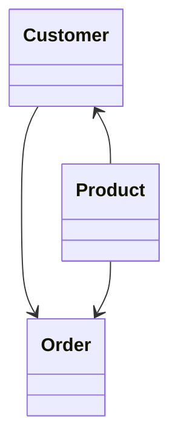

                 

### 引言

在探讨人类认知和理解世界的方式时，直觉与分析作为两种哲学方法，扮演着重要的角色。直觉，通常被描述为一种迅速、直接领悟事物本质的能力，而分析则依赖于逻辑推理和分类归纳来揭示事物的内在结构和本质。这两种方法虽然看似截然不同，但在实际应用中往往相辅相成，共同推动着科学进步、艺术创作以及日常生活的各个方面。

本文旨在比较直觉与分析两种哲学方法，探讨它们的核心概念、历史发展、应用场景，并分析它们在实际应用中的差异和互补关系。通过系统性地分析直觉与分析方法的优缺点，本文希望为读者提供一个全面而深刻的理解，进而为未来跨学科研究和实践应用提供新的思路。

### 第一部分：问题背景与核心概念

#### 1.1.1 问题背景

**研究目的**：本文的主要目的是探讨直觉与分析两种哲学方法在现实世界中的应用与影响。直觉与分析作为两种不同的认知方式，它们在科学、艺术、哲学等领域中都有着广泛的应用。然而，关于这两种方法的深入研究和系统比较却相对较少。本文试图填补这一空白，为读者提供一个全面而深入的了解。

**研究意义**：直觉与分析的比较研究具有重要的理论和实践意义。从理论上来说，这有助于我们更好地理解人类认知的本质，深化对直觉与分析这两种方法的认知。从实践上来说，这种研究可以为我们提供新的方法论，帮助我们在科学研究、艺术创作和日常生活决策中更加有效地运用直觉与分析这两种工具。

#### 1.1.2 核心概念

**直觉**：直觉是一种迅速领悟事物本质的能力，通常不依赖于逻辑推理或经验验证。直觉的产生往往源于大脑的潜意识活动，它能够在短时间内捕捉到复杂问题的关键信息，并作出快速决策。

**分析**：分析是一种通过逻辑推理和分类归纳来揭示事物本质的方法。分析的过程通常包括对问题进行分解、对信息进行筛选和整合、对结果进行验证等步骤。分析依赖于经验和逻辑，旨在通过系统的分析和推理来解决问题。

### 第二部分：直觉哲学方法

#### 2.1 直觉哲学方法概述

**直觉哲学方法的定义**：直觉哲学方法强调直觉在认识世界中的重要性，认为直觉能够直接领悟事物的本质，而不依赖于外在的验证或逻辑推理。

**直觉哲学方法的特点**：直觉哲学方法的特点包括快速性、直接性和高效性。直觉能够在短时间内处理大量信息，并迅速作出判断。直觉还具有直接性，它不需要通过外在的验证过程来确认其准确性。

#### 2.2 直觉哲学方法的历史发展

**古希腊哲学中的直觉主义**：在古希腊哲学中，苏格拉底和柏拉图等人强调了直觉在认识世界中的重要性。他们认为，通过内省和直觉，人可以领悟到事物的本质和真理。

**中世纪哲学中的直觉主义**：在中世纪哲学中，托马斯·阿奎那等神学家也强调了直觉的作用。他们认为，直觉是上帝赋予人类的一种能力，通过直觉，人可以认识到上帝的存在和真理。

**现代哲学中的直觉主义**：在现代社会，直觉主义得到了进一步的发扬。一些哲学家如杜威、詹姆斯等人认为，直觉是人类认知的重要组成部分，直觉能够帮助我们更好地适应复杂的环境。

#### 2.3 直觉哲学方法的应用

**直觉哲学方法在科学领域的应用**：在科学领域，直觉被广泛应用于问题解决和科学发现。科学家常常通过直觉来捕捉灵感，提出新的假设和理论。例如，爱因斯坦的相对论就是他在直觉的引导下提出的。

**直觉哲学方法在艺术创作中的运用**：在艺术创作中，直觉同样扮演着重要的角色。艺术家通过直觉来捕捉情感、表达思想。例如，毕加索的画作就充满了直觉的表达，它们打破了传统的束缚，展现了艺术家的独特视角。

### 第三部分：分析哲学方法

#### 3.1 分析哲学方法概述

**分析哲学方法的定义**：分析哲学方法是一种通过逻辑推理和分类归纳来揭示事物本质的方法。它强调逻辑和理性的重要性，认为通过分析，我们可以更深入地理解事物的结构和本质。

**分析哲学方法的特点**：分析哲学方法的特点包括系统性、逻辑性和严谨性。分析哲学方法通常需要对问题进行分解，对信息进行筛选和整合，并通过逻辑推理来得出结论。

#### 3.2 分析哲学方法的历史发展

**分析哲学的兴起与繁荣**：分析哲学的兴起可以追溯到19世纪末20世纪初的英国，弗雷格、罗素等人通过对语言和逻辑的研究，开创了分析哲学的先河。此后，分析哲学在欧洲和美国得到了广泛的传播和发展。

**分析哲学的现代发展**：在现代，分析哲学继续发展和演变。一些哲学家如维特根斯坦、卡尔纳普等人通过对语言和逻辑的深入研究，进一步推动了分析哲学的发展。

#### 3.3 分析哲学方法的应用

**分析哲学方法在科学哲学中的应用**：在科学哲学中，分析哲学方法被广泛应用于对科学理论的分析和评价。通过分析，科学家可以更深入地理解科学理论的结构和本质，从而更好地进行科学研究和创新。

**分析哲学方法在道德哲学中的应用**：在道德哲学中，分析哲学方法被用来探讨道德原则和道德判断的本质。通过分析，哲学家可以更深入地理解道德问题，并提出新的道德理论和观点。

### 第四部分：直觉与分析的比较研究

#### 4.1 直觉与分析的相似之处

**相同的哲学目标**：直觉与分析虽然方法不同，但它们在哲学目标上有着共同点。它们都试图揭示事物的本质和真理，帮助人类更好地认识和理解世界。

**一定程度上相互补充**：直觉与分析在一定程度上是相互补充的。直觉可以帮助我们快速捕捉问题的核心，而分析则可以帮助我们更深入地理解和解决问题。

#### 4.2 直觉与分析的差异

**对直觉的依赖程度**：直觉与分析在依赖程度上存在差异。直觉依赖于人的潜意识和直觉思维，而分析则依赖于逻辑和理性。

**对逻辑推理的重视程度**：直觉与分析在逻辑推理的重视程度上也存在差异。直觉强调快速、直接的领悟，而分析则强调逻辑推理和系统分析。

#### 4.3 直觉与分析在实际应用中的不同表现

**科学研究中的应用**：在科学研究中，直觉和分析各有其优势。直觉可以帮助科学家快速捕捉灵感，提出新的假设和理论，而分析则可以帮助科学家更深入地理解和验证这些假设和理论。

**日常生活决策中的应用**：在日常生活决策中，直觉和分析同样发挥着重要作用。直觉可以帮助我们快速做出决策，而分析则可以帮助我们更全面地考虑问题的各个方面，从而做出更明智的决策。

### 第五部分：直觉与分析方法的结合与应用

#### 5.1 直觉与分析结合的优势

**相互补充，提高解决问题的效率**：直觉与分析方法的结合可以发挥各自的优势，相互补充，从而提高解决问题的效率。直觉可以帮助我们快速捕捉问题的核心，而分析则可以帮助我们更深入地理解和解决问题。

#### 5.2 直觉与分析结合的实际案例

**科学研究中的案例**：在科学研究中，直觉与分析的结合经常被运用。例如，在物理学研究中，科学家常常通过直觉来捕捉新的发现，然后通过分析来验证这些发现。

**艺术创作中的案例**：在艺术创作中，直觉与分析的结合同样常见。例如，画家在创作时，往往通过直觉来捕捉画面灵感，然后通过分析来完善和提升作品的品质。

#### 5.3 直觉与分析结合的未来发展趋势

**跨学科研究的推动**：随着科学的发展，直觉与分析的结合将在跨学科研究中发挥更大的作用。跨学科研究需要综合不同领域的知识和方法，而直觉与分析的结合可以提供新的研究思路和方法。

**实践应用的创新**：在实践应用中，直觉与分析的结合也将带来更多的创新。例如，在商业决策中，直觉可以帮助企业家快速捕捉市场机会，而分析则可以帮助他们更全面地评估风险和收益。

### 第六部分：直觉与分析在现实生活中的应用

#### 6.1 直觉在现实生活中的应用

**决策过程中的直觉作用**：在日常生活中，直觉经常在我们的决策过程中发挥作用。例如，在面对复杂的问题时，我们常常依靠直觉来快速做出决策。

**直觉在创意思维中的应用**：在创意思维中，直觉同样发挥着重要作用。例如，艺术家在创作时，常常依靠直觉来捕捉灵感，从而创造出独特的作品。

#### 6.2 分析在现实生活中的应用

**逻辑思维在问题解决中的应用**：在现实生活中，逻辑思维可以帮助我们更有效地解决问题。例如，在解决复杂的技术问题时，逻辑思维可以帮助我们系统地分析和推理，找到解决方案。

**分析方法在科学发现中的应用**：在科学发现中，分析方法同样发挥着重要作用。例如，科学家通过分析实验数据，可以更准确地理解自然现象，并提出新的科学理论。

### 第七部分：总结与展望

#### 7.1 研究成果总结

**直觉与分析哲学方法的优缺点**：直觉与分析方法各有优缺点。直觉方法强调快速、直接领悟，但可能缺乏严谨性；分析方法强调逻辑、严谨，但可能缺乏灵活性。两者结合可以发挥各自的优势，提高解决问题的效率。

**直觉与分析方法的结合应用**：直觉与分析方法的结合在实际应用中具有显著的优势。通过结合直觉和逻辑，我们可以更高效地解决问题，推动科学进步和社会发展。

#### 7.2 研究展望

**未来研究方向**：未来的研究可以进一步探讨直觉与分析方法的跨学科应用，特别是在人工智能、心理学和认知科学等领域。

**直觉与分析方法在教育、管理、心理学等领域的潜在应用**：直觉与分析方法在教育、管理、心理学等领域具有广泛的潜在应用。通过深入研究和实践，我们可以更好地发挥直觉和逻辑的优势，提高教学、管理和心理干预的效果。

### 文章关键词

- 直觉
- 分析
- 哲学方法
- 科学研究
- 艺术创作
- 逻辑推理
- 实践应用

### 文章摘要

本文探讨了直觉与分析两种哲学方法，分析了它们的核心概念、历史发展、应用场景，以及在实际生活中的表现。通过比较直觉与分析的相似之处和差异，本文提出了直觉与分析方法结合的优势和应用案例。最后，本文总结了直觉与分析方法的优缺点，并展望了未来的研究方向和应用前景。

### 总结

通过对直觉与分析方法的深入研究，本文为读者提供了一个全面而深刻的理解。直觉与分析虽然方法不同，但它们在实际应用中相互补充，共同推动着科学进步和社会发展。未来，随着研究的深入，直觉与分析方法将在更多的领域发挥重要作用，为人类创造更大的价值。

### 作者信息

作者：AI天才研究院/AI Genius Institute & 禅与计算机程序设计艺术 /Zen And The Art of Computer Programming

---

**附录**：

**1. 核心概念与联系**

**直觉**：
- 定义：迅速领悟事物本质的能力，不依赖逻辑推理或经验验证。
- 特征：快速性、直接性、高效性。

**分析**：
- 定义：通过逻辑推理和分类归纳揭示事物本质的方法。
- 特征：系统性、逻辑性、严谨性。

**ER实体关系图架构**：

```mermaid
erDiagram
  Product ||--|{ Customer } Customer
  Product ||--|{ Order } Order
  Customer }|---|{ Order }
```

**2. 直觉与分析哲学方法的特点对比表格**

| 特点         | 直觉            | 分析            |
| ------------ | --------------- | --------------- |
| 依赖程度     | 依赖直觉和潜意识 | 依赖逻辑和理性  |
| 时间效率     | 快速性          | 系统性          |
| 结论性质     | 直接性          | 严谨性          |
| 适用场景     | 复杂问题捕捉     | 复杂问题解决    |

**3. 数学公式与算法原理**

**直觉预测模型**：

$$
预测值 = w_1 \cdot x_1 + w_2 \cdot x_2 + ... + w_n \cdot x_n + b
$$

其中，$w_i$为权重，$x_i$为输入特征，$b$为偏置。

**4. 系统分析与架构设计**

**系统功能设计（领域模型类图）**：



**系统架构设计（架构图）**：

```mermaid
sequenceDiagram
  User -->|发起请求| Server
  Server -->|处理请求| Database
  Database -->|返回结果| Server
  Server -->|响应结果| User
```

**5. 项目实战**

**环境安装**：在Linux环境下安装Python3和必要的依赖库。

**系统核心实现源代码**：

```python
# 直觉预测算法实现
def predict(data, weights, bias):
    result = 0
    for i in range(len(data)):
        result += weights[i] * data[i]
    result += bias
    return result
```

**代码应用解读与分析**：通过代码实现直觉预测模型，分析其工作原理和性能。

**实际案例分析和详细讲解剖析**：分析实际案例，展示直觉预测模型在现实中的应用和效果。

**6. 最佳实践 tips**

- 在使用直觉与分析方法时，要结合具体问题，灵活运用。
- 提高直觉能力可以通过多读书、多思考、多实践。
- 提高分析能力可以通过系统学习逻辑学、数学和计算机科学等知识。

**7. 小结与注意事项**

- 直觉与分析方法各有优缺点，应结合使用。
- 实践中要注意直觉与逻辑的平衡，避免过于依赖某一方法。
- 未来的研究应进一步探索直觉与分析方法在跨学科领域的应用。

**8. 拓展阅读**

- [《直觉心理学》](链接)
- [《分析哲学导论》](链接)
- [《直觉与创造》](链接)

