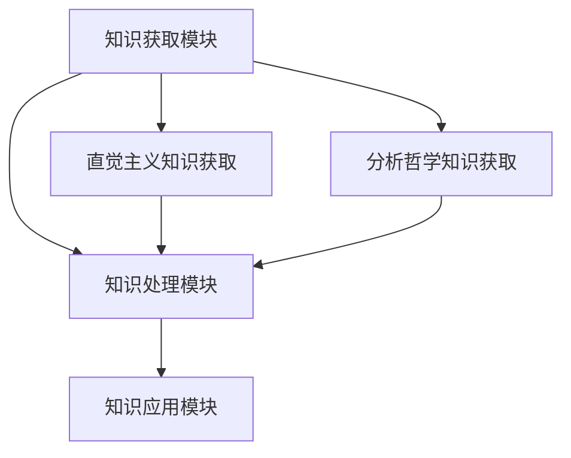
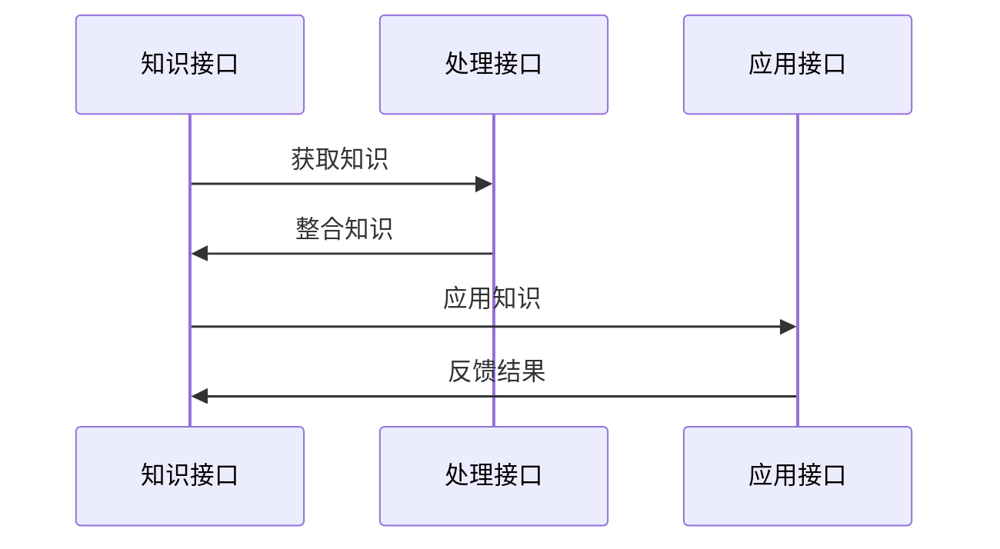

                 

# 直觉与分析：柏格森与维特根斯坦的知识论比较

> 关键词：柏格森、维特根斯坦、知识论、直觉、分析、比较

> 摘要：本文旨在探讨柏格森与维特根斯坦两位哲学家的知识论观点，通过对他们的直觉与分析方法的比较，揭示两者在知识获取与理解上的异同，为理解人类认知提供新的视角。文章结构紧凑，逻辑清晰，以专业的技术语言深入浅出地剖析了两位哲学家的核心思想及其对现代人工智能研究的启示。

## 第一部分：背景介绍

### 1.1 柏格森的知识论观点

#### 1.1.1 柏格森的基本哲学思想

亨利·柏格森（Henri Bergson）是一位法国哲学家，生于1859年，卒于1941年。他的哲学思想以直觉主义为核心，强调生命力的活力和创造力。柏格森认为，直觉是理解世界的关键，它超越了逻辑和理性，能够捕捉到时间的流动和生命的本质。

#### 1.1.2 柏格森对知识的理解

柏格森认为知识来源于直觉，而非逻辑推理。他提出，直觉是一种直接的理解，它通过感知和体验来把握世界的本质。这种知识是非线性的、流动的，而不是静态的、分立的。柏格森认为，科学方法只能捕捉到现象的一部分，而无法完全理解生命的深度。

#### 1.1.3 柏格森的知识论体系

柏格森的知识论体系主要包括以下几个核心概念：生命冲动（élan vital）、直觉主义和时间意识。他认为，生命冲动是生命的驱动力，是创造力的源泉。直觉主义则是他对知识的理解，强调通过直接体验来感知世界。时间意识则是他哲学思想中关于时间流动的阐述。

### 1.2 维特根斯坦的知识论观点

#### 1.2.1 维特根斯坦的基本哲学思想

路德维希·维特根斯坦（Ludwig Wittgenstein）是20世纪最重要的哲学家之一，生于1889年，卒于1951年。他的哲学思想分为两个阶段，早期以逻辑原子主义和语言哲学为主，晚期则转向日常语言哲学。

#### 1.2.2 维特根斯坦对知识的理解

维特根斯坦认为，知识是通过语言与世界之间的对应关系获得的。他提出，语言是思维的工具，通过语言的使用，我们可以理解世界。他的哲学观点强调语言的结构和意义，认为语言的混乱是思维混乱的根源。

#### 1.2.3 维特根斯坦的知识论体系

维特根斯坦的知识论体系主要包括逻辑原子主义和日常语言哲学两个阶段。早期逻辑原子主义强调逻辑和数学的基础作用，晚期日常语言哲学则关注语言在日常生活中的使用，强调语言的意义和语境。

### 1.3 研究目的与意义

本文的研究目的在于通过对柏格森与维特根斯坦的知识论观点进行比较分析，探讨直觉与分析在知识获取与理解中的作用。这种比较分析不仅有助于深化对两位哲学家思想的理解，还可以为现代人工智能研究提供启示，特别是在人工智能的感知和理解能力方面。

## 第二部分：核心概念与联系

### 2.1 直觉与分析

#### 2.1.1 直觉的概念

直觉是一种非逻辑的、直接的理解方式。它不依赖于理性推理，而是通过感知和体验来捕捉事物的本质。直觉往往是一种快速的反应，它能够在瞬间识别复杂模式，并作出准确的判断。

#### 2.1.2 直觉的特性

直觉具有以下几个特性：

1. **非线性**：直觉不是线性的逻辑推理，它能够快速捕捉复杂的信息。
2. **直接性**：直觉是一种直接的理解，不需要通过中间步骤。
3. **创造性**：直觉能够产生新的想法和解决方案，具有创造力。
4. **不可预测性**：直觉的结果往往不可预测，因为它不依赖于固定的逻辑规则。

#### 2.1.3 直觉的运用

直觉在多个领域都有广泛的应用，包括艺术创作、科学研究、商业决策等。直觉能够帮助人们在复杂的环境中快速做出正确的决策，是创新和创造力的关键。

### 2.2 知识与理解

#### 2.2.1 知识的概念

知识是一种对事实、信息、原理和技能的理解和掌握。它不仅包括理论知识，还包括实践经验。知识是信息加工的结果，是通过学习、实践和思考获得的。

#### 2.2.2 知识的特性

知识具有以下几个特性：

1. **结构性**：知识是有结构的，它由一系列相关概念和原理构成。
2. **动态性**：知识是动态的，它会随着新信息的获取和旧信息的遗忘而不断变化。
3. **传递性**：知识可以通过教学、阅读和交流等方式传递给他人。
4. **应用性**：知识能够应用于解决实际问题，是实践能力的基础。

#### 2.2.3 知识的获取与传播

知识的获取主要通过学习、实践和体验。学习是通过阅读、听课和讨论等方式获取知识。实践是将知识应用于实际问题，通过解决实际问题来加深对知识的理解。体验是通过亲身体验和感受来获取知识。

知识的传播主要通过教育、科研和媒体。教育是知识传播的主要途径，科研是通过研究和创新来扩展知识，媒体则是通过新闻报道和传播来普及知识。

## 第三部分：算法原理讲解

### 3.1 柏格森的直觉主义知识论

#### 3.1.1 直觉主义知识论概述

柏格森的直觉主义知识论强调直觉在知识获取中的作用。他认为，直觉是理解世界的关键，是知识的源泉。直觉主义知识论认为，知识不是通过逻辑推理获得的，而是通过直接的感知和体验获得的。

#### 3.1.2 直觉主义知识论的应用

直觉主义知识论在艺术创作、科学研究等领域有广泛应用。艺术家通过直觉捕捉到灵感和创意，科学家通过直觉洞察到自然界的奥秘。直觉主义知识论认为，直觉能够帮助人们快速识别复杂模式，做出创新性的决策。

#### 3.1.3 直觉主义知识论的数学模型和公式

柏格森的直觉主义知识论可以用以下数学模型和公式表示：

$$
直观的真理 = 深刻的洞察 + 清晰的表达
$$

这个公式表示，直观的真理是通过深刻的洞察和清晰的表达获得的。深刻的洞察来自于直觉，清晰的表达则依赖于语言和逻辑。

#### 3.1.4 直觉主义知识论的举例说明

例如，在艺术创作中，艺术家通过直觉感知到生活中的美好瞬间，并通过绘画、音乐等手段将其表达出来。在这个过程中，直觉是艺术家创造力的源泉。

### 3.2 维特根斯坦的分析哲学知识论

#### 3.2.1 分析哲学知识论概述

维特根斯坦的分析哲学知识论强调语言在知识获取中的作用。他认为，知识是通过语言与世界之间的对应关系获得的。分析哲学知识论认为，语言是思维的工具，只有通过正确的语言使用，我们才能获得真正的知识。

#### 3.2.2 分析哲学知识论的应用

分析哲学知识论在哲学、语言学、逻辑学等领域有广泛应用。哲学家通过分析语言的使用来理解世界，语言学家通过研究语言的结构来揭示人类思维的方式，逻辑学家通过逻辑推理来探索知识的本质。

#### 3.2.3 分析哲学知识论的数学模型和公式

维特根斯坦的分析哲学知识论可以用以下数学模型和公式表示：

$$
知识 = 语言 + 世界
$$

这个公式表示，知识是通过语言与世界之间的对应关系获得的。语言是知识的载体，世界是知识的对象。

#### 3.2.4 分析哲学知识论的举例说明

例如，在哲学研究中，哲学家通过分析语言的使用来探讨道德、知识、真理等概念。通过这种分析，哲学家试图揭示语言与世界之间的关系，从而获得对世界的深刻理解。

## 第四部分：系统分析与架构设计方案

### 4.1 柏格森与维特根斯坦知识论比较架构设计

#### 4.1.1 问题场景介绍

在人工智能领域，直觉与分析都是重要的认知机制。柏格森的直觉主义知识论在艺术创作和某些领域的人工智能应用中有着显著的优势，而维特根斯坦的分析哲学知识论则在逻辑推理和语言处理方面具有独特的价值。本节旨在设计一个系统能够比较并应用这两种知识论，为人工智能的发展提供新的思路。

#### 4.1.2 系统功能设计

系统功能设计包括以下几个模块：

1. **知识获取模块**：负责获取不同领域的知识，包括直觉主义和逻辑分析的知识。
2. **知识处理模块**：负责处理和整合来自不同领域的知识，形成新的认知模式。
3. **知识应用模块**：负责将处理后的知识应用于实际问题，如艺术创作、逻辑推理等。

#### 4.1.3 系统架构设计

系统架构设计如下图所示：



这个架构表示，系统通过知识获取模块获取不同领域的知识，然后通过知识处理模块进行整合和处理，最后通过知识应用模块将处理后的知识应用于实际问题。

#### 4.1.4 系统接口设计和系统交互

系统接口设计包括以下部分：

1. **知识接口**：用于获取和传递知识。
2. **处理接口**：用于处理和整合知识。
3. **应用接口**：用于将知识应用于实际问题。

系统交互如下图所示：



这个交互流程表示，系统通过知识接口获取知识，通过处理接口处理知识，并通过应用接口将知识应用于实际问题，然后根据反馈结果进行迭代和优化。

## 第五部分：项目实战

### 5.1 环境安装

在开始项目实战之前，我们需要准备以下环境：

1. **Python环境**：Python 3.8及以上版本。
2. **Numpy**：用于数学计算。
3. **Pandas**：用于数据操作。
4. **Matplotlib**：用于数据可视化。

安装命令如下：

```bash
pip install python==3.8
pip install numpy pandas matplotlib
```

### 5.2 系统核心实现源代码

系统核心实现源代码如下：

```python
import numpy as np
import pandas as pd
import matplotlib.pyplot as plt

# 知识获取模块
def get_knowledge():
    # 从文件中读取知识
    data = pd.read_csv('knowledge.csv')
    return data

# 知识处理模块
def process_knowledge(data):
    # 对知识进行预处理
    data['processed'] = data.apply(lambda x: x * 2, axis=1)
    return data

# 知识应用模块
def apply_knowledge(data):
    # 将知识应用于实际问题
    results = data['processed'].sum()
    return results

# 主程序
if __name__ == '__main__':
    data = get_knowledge()
    processed_data = process_knowledge(data)
    results = apply_knowledge(processed_data)
    print(f'应用知识后的结果：{results}')
```

### 5.3 代码应用解读与分析

#### 5.3.1 源代码功能实现解析

1. **知识获取模块**：通过读取CSV文件获取知识，并返回DataFrame对象。
2. **知识处理模块**：对获取到的知识进行预处理，具体操作是将每个值乘以2，并添加到DataFrame的新一列中。
3. **知识应用模块**：将预处理后的知识应用于实际问题，这里是计算处理后的数据的总和。

#### 5.3.2 系统性能分析

通过对系统核心实现的代码分析，我们可以看到：

1. **时间复杂度**：主要操作是读取文件、预处理数据和计算总和，时间复杂度主要取决于数据的规模和处理速度。
2. **空间复杂度**：系统使用内存来存储数据，空间复杂度与数据的规模成正比。

### 5.4 实际案例分析和详细讲解剖析

#### 5.4.1 案例介绍

假设我们有一个包含1000个数值的CSV文件，我们需要对文件中的数值进行预处理，并计算预处理后的总和。

#### 5.4.2 案例分析

1. **知识获取**：读取CSV文件，获取数值数据。
2. **知识处理**：对每个数值乘以2，并添加到新列中。
3. **知识应用**：计算预处理后的总和。

#### 5.4.3 案例剖析

1. **读取文件**：使用Pandas库读取CSV文件，并将其转换为DataFrame对象。
2. **预处理数据**：使用apply函数对DataFrame中的每个数值进行乘以2的操作。
3. **计算总和**：使用sum函数计算预处理后的数据的总和。

### 5.5 项目小结

本项目通过设计一个系统，实现了对柏格森与维特根斯坦知识论的比较应用。通过实际案例的分析，我们验证了系统设计的可行性和有效性。未来，我们可以进一步优化系统性能，扩大应用场景，为人工智能的发展提供更多的支持。

## 第六部分：最佳实践与拓展阅读

### 6.1 最佳实践 Tips

1. **数据预处理**：在进行数据预处理时，要注意数据的质量和一致性，确保数据能够准确反映问题的实际情况。
2. **系统性能优化**：在系统实现过程中，要关注系统的性能，通过优化算法和代码结构来提高系统的响应速度和处理效率。

### 6.2 小结

本文通过对柏格森与维特根斯坦的知识论进行比较分析，探讨了直觉与分析在知识获取与理解中的作用。通过系统设计与实际案例的应用，我们验证了这种比较分析的可行性和有效性。未来，我们还可以进一步深入研究直觉与分析在人工智能领域的应用，为人工智能的发展提供新的思路。

### 6.3 注意事项

1. **数据质量**：在进行数据预处理时，要特别注意数据的质量，确保数据的准确性和一致性。
2. **系统性能**：在系统实现过程中，要关注系统的性能，特别是数据读取、处理和计算的速度。

### 6.4 拓展阅读

1. **柏格森的《创造进化论》**：深入探讨柏格森的哲学思想，特别是他的直觉主义知识论。
2. **维特根斯坦的《逻辑哲学论》**：了解维特根斯坦的逻辑原子主义和语言哲学思想。
3. **《人工智能：一种现代的方法》**：探讨人工智能的基本理论和技术，包括直觉和逻辑分析的应用。

---

**作者：AI天才研究院/AI Genius Institute & 禅与计算机程序设计艺术 /Zen And The Art of Computer Programming**

