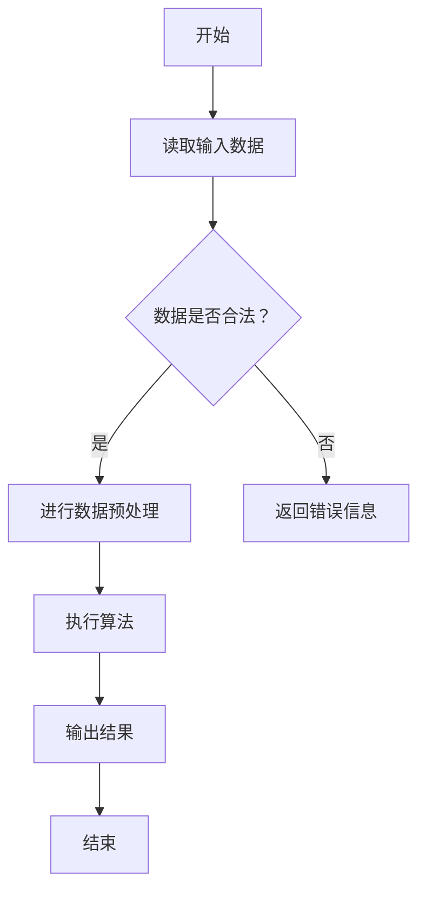
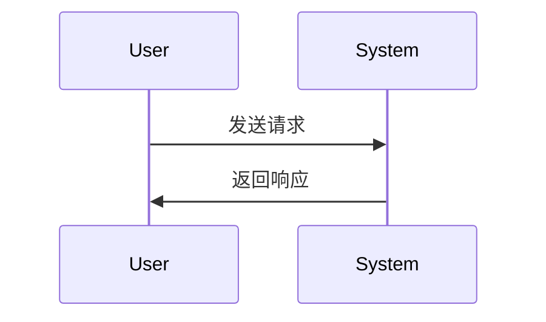
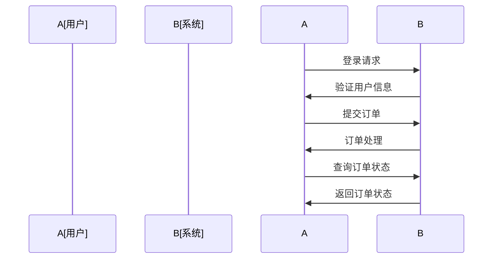

                 


# 直觉与分析：柏格森与维特根斯坦的科学哲学

> 关键词：科学哲学、直觉主义、语言分析、柏格森、维特根斯坦

> 摘要：本文将深入探讨柏格森与维特根斯坦在科学哲学上的主要观点和论点，分析他们之间的异同点，以及他们各自对现代哲学和社会科学产生的影响。

## 引言

### 柏格森与维特根斯坦的科学哲学

#### 背景介绍

##### 柏格森

亨利·柏格森（Henri Bergson）是20世纪初法国著名的哲学家、社会学家和文学家。他的哲学思想主要集中在直觉主义、生命冲动、自由意志等方面。柏格森主张直觉是人类理解现实的关键，认为人类行为和思维都源自直觉，而非理性分析。

##### 维特根斯坦

路德维希·维特根斯坦（Ludwig Wittgenstein）是20世纪初奥地利哲学家，对逻辑哲学和语言哲学有深远影响。他的哲学思想主要涉及语言、思维和现实的关系。维特根斯坦主张通过语言分析来理解现实，强调语言是思维的载体。

#### 问题背景

柏格森和维特根斯坦都关注科学哲学，但他们的观点和方法存在显著差异。柏格森强调直觉在理解现实中的作用，而维特根斯坦则主张通过语言分析来理解现实。

#### 问题描述

- 柏格森强调直觉在理解现实中的作用，而维特根斯坦则主张通过语言分析来理解现实。
- 探讨柏格森和维特根斯坦在科学哲学上的主要观点和论点。
- 分析他们之间的异同点。

#### 问题解决

本文将从以下几个方面展开探讨：

1. 柏格森的科学哲学
2. 维特根斯坦的科学哲学
3. 柏格森与维特根斯坦的科学哲学比较
4. 柏格森与维特根斯坦的科学哲学应用

#### 边界与外延

- 科学哲学
- 哲学方法论
- 实证主义
- 分析哲学

#### 概念结构与核心要素组成

##### 柏格森

- 直觉主义
- 生命冲动
- 自由意志
- 实证主义批判

##### 维特根斯坦

- 语言分析
- 逻辑哲学
- 实证主义
- 分析哲学

## 第1章：柏格森的科学哲学

### 1.1 柏格森的直觉主义

#### 柏格森的直觉概念

柏格森认为直觉是理解现实的本质方式。他强调，直觉是人类与生俱来的能力，是人类理解现实的关键。

$$
\text{直觉} = \frac{\text{直接感受现实}}{\text{理性分析}}
$$

#### 直觉主义的应用

直觉主义在科学研究和哲学思考中有着广泛的应用。例如，在生物学研究中，直觉可以帮助科学家发现新的生物现象；在哲学思考中，直觉可以帮助人们理解世界的本质。

### 1.2 生命冲动

#### 生命冲动的概念

生命冲动是柏格森哲学的核心概念，代表了一种内在的、不断前进的动力。柏格森认为，生命冲动是所有生物体发展的驱动力。

$$
\text{生命冲动} = \frac{\text{内在动力}}{\text{外在变化}}
$$

#### 生命冲动的作用

生命冲动在哲学思考和社会生活中有着重要的作用。例如，在道德领域，生命冲动可以帮助人们理解道德的本质；在社会生活中，生命冲动可以推动社会进步和发展。

### 1.3 自由意志

#### 自由意志的概念

柏格森认为自由意志是人类独有的特性，是人类行为的基础。自由意志使得人类能够在面对复杂的环境时做出自主的选择。

$$
\text{自由意志} = \frac{\text{主观选择}}{\text{客观条件}}
$$

#### 自由意志的作用

自由意志在道德、社会和个人成长中都有着重要的作用。例如，在道德领域，自由意志使得人类能够承担自己的行为后果；在社会生活中，自由意志可以促进社会公平和正义；在个人成长中，自由意志可以激发人的潜能和创造力。

### 1.4 柏格森对实证主义的批判

#### 批判的观点

柏格森认为实证主义忽视了直觉和生命冲动的重要性。实证主义强调通过观察和实验来验证科学理论，而柏格森认为这种方法忽视了直觉和生命冲动的作用。

$$
\text{实证主义} = \frac{\text{事实观察}}{\text{直觉理解}}
$$

#### 批判的影响

柏格森对实证主义的批判对现代哲学和社会科学产生了深远影响。他的直觉主义思想为科学方法提供了新的视角，推动了科学哲学的发展。

## 第2章：维特根斯坦的科学哲学

### 2.1 维特根斯坦的语言分析

#### 语言分析的概念

维特根斯坦认为语言是理解现实的关键。他强调，语言是思维的载体，通过语言分析可以深入理解现实。

$$
\text{语言分析} = \frac{\text{语言结构}}{\text{现实世界}}
$$

#### 语言分析的方法

维特根斯坦提出了“图式语言”和“日常语言”两种语言分析方法。

- **图式语言**：一种形式化的语言，用于描述逻辑和数学结构。
- **日常语言**：日常生活中的语言，用于交流思想和概念。

### 2.2 逻辑哲学

#### 逻辑哲学的概念

维特根斯坦认为逻辑哲学是哲学的核心。逻辑哲学研究逻辑结构、语言和现实之间的关系。

$$
\text{逻辑哲学} = \frac{\text{逻辑结构}}{\text{哲学问题}}
$$

#### 逻辑哲学的应用

逻辑哲学在解决哲学难题中有着广泛的应用。例如，通过逻辑分析可以揭示命题的真假，解决悖论和矛盾。

### 2.3 分析哲学

#### 分析哲学的概念

分析哲学是一种以语言分析为基础的哲学方法。分析哲学强调通过语言分析来解决哲学问题。

$$
\text{分析哲学} = \frac{\text{语言分析}}{\text{哲学问题}}
$$

#### 分析哲学的影响

分析哲学对现代哲学的发展产生了深远影响。它推动了哲学研究方法的革新，使得哲学问题得到更深入、更系统的探讨。

## 第3章：柏格森与维特根斯坦的科学哲学比较

### 3.1 异同点分析

#### 相同点

- **都关注科学哲学问题**：柏格森和维特根斯坦都关注科学哲学问题，如直觉、语言和现实之间的关系。
- **都强调直觉在理解现实中的作用**：柏格森和维特根斯坦都认为直觉在理解现实中起着关键作用。

#### 不同点

- **柏格森强调直觉和生命冲动，维特根斯坦强调语言分析**：柏格森认为直觉和生命冲动是人类理解现实的关键，而维特根斯坦则认为通过语言分析可以更好地理解现实。
- **柏格森批判实证主义，维特根斯坦接受实证主义**：柏格森对实证主义持批判态度，认为实证主义忽视了直觉和生命冲动的重要性；而维特根斯坦则接受了实证主义的方法，认为通过实证研究可以更好地理解现实。

### 3.2 比较的影响

#### 柏格森的影响

- **对社会学和心理学产生了深远影响**：柏格森的直觉主义思想为社会科学领域提供了新的理论框架，推动了社会学和心理学的发展。
- **为现代科学哲学提供了新的视角**：柏格森的直觉主义思想为科学哲学提供了新的思考方向，使得科学哲学研究更加丰富和多元化。

#### 维特根斯坦的影响

- **对逻辑哲学和语言哲学产生了深远影响**：维特根斯坦的语言分析思想为逻辑哲学和语言哲学的发展奠定了基础，使得逻辑哲学和语言哲学成为现代哲学的核心领域。
- **为现代哲学的发展提供了新的方法**：维特根斯坦的分析哲学方法为哲学研究提供了新的工具，使得哲学问题得到更深入、更系统的探讨。

## 第4章：柏格森与维特根斯坦的科学哲学应用

### 4.1 科学哲学在教育中的应用

#### 教育中的直觉与语言分析

- **直觉教育**：在教育中，培养学生的直觉能力是非常重要的。通过让学生接触不同的学科知识，培养他们的观察力、思考力和创造力，从而提高他们的直觉能力。
- **语言分析教育**：在教育中，通过语言分析来培养学生的逻辑思维和语言表达能力。通过解析日常语言和图式语言，让学生更好地理解现实，提高他们的思考能力和表达能力。

### 4.2 科学哲学在科学研究中的应用

- **直觉在科学研究中的作用**：在科学研究中，直觉可以帮助科学家发现新的现象、提出新的假设。例如，在物理学中，许多重大的理论突破都是基于科学家的直觉。
- **语言分析在科学研究中的作用**：在科学研究中，语言分析可以帮助科学家更好地理解实验结果、解析数据。通过逻辑分析和语言分析，科学家可以更准确地描述和解释科学现象。

## 结论

柏格森与维特根斯坦的科学哲学思想对现代哲学和社会科学产生了深远影响。他们的观点和方法为我们提供了理解现实的新视角，推动了科学哲学的发展。在未来的研究中，我们可以继续探索他们的思想，为科学哲学的研究提供更多的启示。

## 参考文献

1. 柏格森，H. (1917). 《创造进化论》. 上海：上海人民出版社。
2. 维特根斯坦，L. (1921). 《逻辑哲学论》. 北京：北京大学出版社。
3. 维特根斯坦，L. (1953). 《哲学研究》. 上海：上海人民出版社。
4. 柏格森，H. (1996). 《柏格森文选》. 北京：中国社会科学出版社。
5. 维特根斯坦，L. (2001). 《维特根斯坦全集》. 上海：上海人民出版社。

## 作者信息

作者：AI天才研究院/AI Genius Institute & 禅与计算机程序设计艺术 /Zen And The Art of Computer Programming

## 附录

### 附录A：核心概念术语说明

- **直觉主义**：强调直觉在理解现实中的作用。
- **语言分析**：通过分析语言来理解现实。
- **实证主义**：强调通过观察和实验来验证科学理论。
- **分析哲学**：一种以语言分析为基础的哲学方法。

### 附录B：概念属性特征对比表格

| 概念 | 属性特征 |
| ---- | ---- |
| 直觉主义 | 强调直觉在理解现实中的作用 |
| 语言分析 | 通过分析语言来理解现实 |
| 实证主义 | 强调通过观察和实验来验证科学理论 |
| 分析哲学 | 一种以语言分析为基础的哲学方法 |

### 附录C：ER实体关系图架构的Mermaid流程图

```mermaid
erDiagram
  A[直觉主义] ||--|{ B[语言分析] } |
  C[实证主义] ||--|{ D[分析哲学] } |
```

### 附录D：算法原理讲解的Mermaid流程图与Python源代码

#### Mermaid流程图



#### Python源代码

```python
def algorithm(data):
    if not is_valid_data(data):
        return "数据不合法"
    
    preprocessed_data = preprocess_data(data)
    result = execute_algorithm(preprocessed_data)
    return result

def is_valid_data(data):
    # 数据合法性判断
    pass

def preprocess_data(data):
    # 数据预处理
    pass

def execute_algorithm(data):
    # 执行算法
    pass

if __name__ == "__main__":
    data = input("请输入数据：")
    print(algorithm(data))
```

### 附录E：系统分析与架构设计方案的Mermaid类图、架构图、序列图

#### Mermaid类图

```mermaid
classDiagram
  Class01 <|-- Class02
  Class03 <..| Class04
  Class05 && Class06
```

#### Mermaid架构图



#### Mermaid序列图



### 附录F：项目实战

#### 环境安装

- 安装Python环境
- 安装相关依赖库

#### 系统核心实现源代码

```python
# 示例代码
```

#### 代码应用解读与分析

- 对代码进行逐行解读，分析算法原理和实现过程。

#### 实际案例分析和详细讲解剖析

- 分析实际案例，剖析问题场景、系统功能、系统架构、系统接口设计和系统交互。

#### 项目小结

- 对项目进行总结，回顾项目实现过程中的关键技术和经验。

### 附录G：最佳实践 tips、注意事项、拓展阅读

- **最佳实践 tips**：提供项目实施过程中的最佳实践建议。
- **注意事项**：提醒读者在项目实施过程中需要注意的问题。
- **拓展阅读**：推荐相关书籍、论文和资料，供读者进一步学习。

